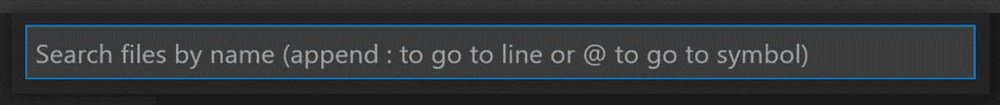
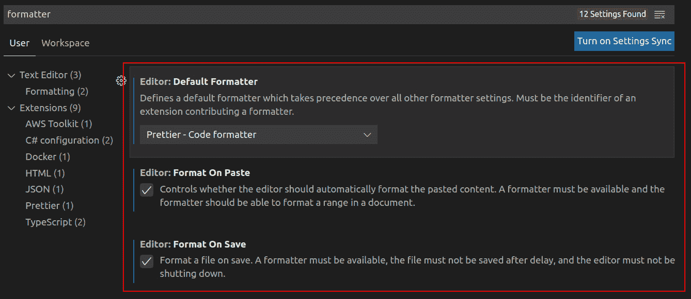
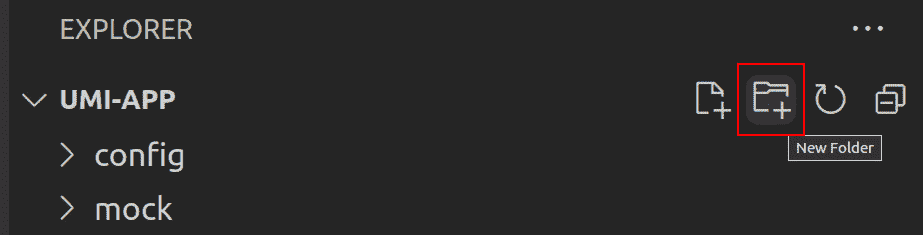
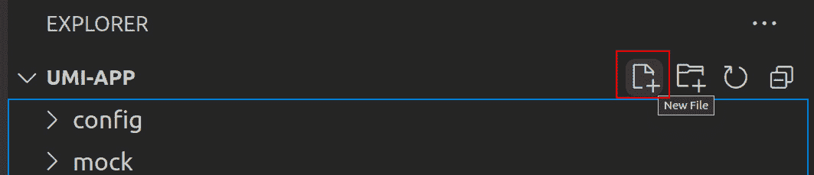
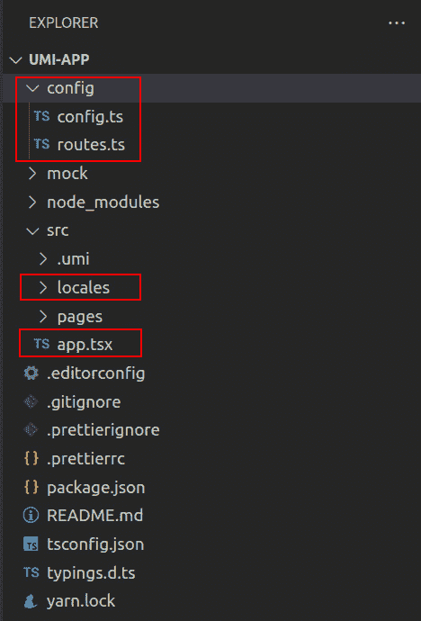
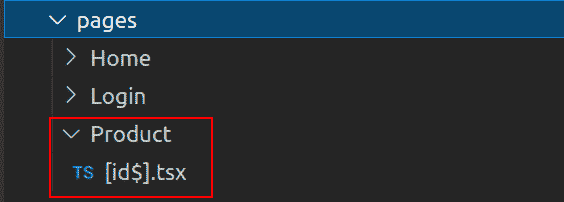
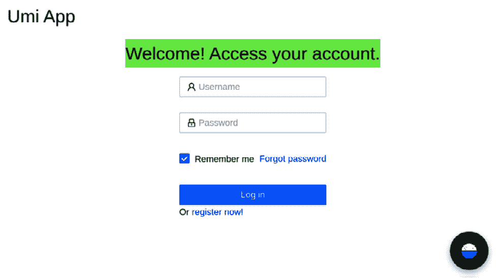

# 第一章：环境搭建和 UmiJS 简介

**UmiJS** 是蚂蚁金服的底层前端框架，也是一个用于开发企业级前端应用的开源项目。它是一个强大的框架，你可以将其与 Ant Design 结合使用，提供构建现代用户体验所需的一切。

在本章中，你将学习如何使用 UmiJS 和**Visual Studio Code**（**VSCode**）安装和配置项目。你还将了解 UmiJS 的文件夹结构和主要文件。然后，你将学习如何使用**u****mi history**进行快速页面导航，最后发现**Umi UI**，这是一个与 UmiJS 交互并添加组件到项目的可视化选项。

我们将涵盖以下主要主题：

+   设置我们的环境和配置 UmiJS

+   理解 UmiJS 的文件夹结构和其主要文件

+   探索 Umi CLI 和添加页面

+   理解 UmiJS 中的路由和导航

+   使用 Umi UI

到本章结束时，你将学会所有开始开发项目所需的知识，你还将了解 UmiJS 项目及其配置的基本行为。

# 技术要求

要完成本章的练习，你只需要一台安装了任何操作系统的电脑（我推荐使用 Ubuntu 20.04 或更高版本）。

你可以在以下链接提供的 GitHub 仓库的`Chapter01`文件夹中找到完整的项目：

[`github.com/PacktPublishing/Enterprise-React-Development-with-UmiJs`](https://github.com/PacktPublishing/Enterprise-React-Development-with-UmiJs)

# 设置我们的环境和配置 UmiJS

在本节中，我们将安装和配置 VSCode、EditorConfig 扩展和 Prettier 扩展，并创建我们的第一个 UmiJS 项目。

让我们从安装一个源代码编辑器开始。你可以使用任何支持 JavaScript 和 TypeScript 的编辑器，但在这本书中，我将广泛使用 VSCode。它是一个免费的编辑器，具有集成的终端和内置的 Git 控制，原生支持 JavaScript、TypeScript、Node.js 以及许多其他语言的扩展。

VSCode 可以作为 Snap 包提供，你可以在 Ubuntu 上通过运行以下命令来安装它：

```js
$ sudo snap install code ––classic
```

对于 Mac 用户，你可以在 macOS 上使用 Homebrew 安装它，通过运行以下命令：

```js
$ brew install --cask visual-studio-code
```

如果你正在 Windows 上使用 Chocolatey，你可以运行以下命令：

```js
> choco install vscode
```

或者，你可以下载位于[`code.visualstudio.com/`](https://code.visualstudio.com/)的安装程序。

重要提示

您可以在 [`brew.sh/`](https://brew.sh/) 上找到有关在 macOS 上安装 **Homebrew** 的说明，以及在 [`chocolatey.org/install`](https://chocolatey.org/install) 上安装 **Chocolatey** 的说明。如果您是 Windows 用户，您可以在 **Windows Subsystem for Linux** （**WSL**） 中安装 Ubuntu，并使用常见的 Linux 命令设置您的项目。您可以在 [`docs.microsoft.com/en-us/windows/wsl/install`](https://docs.microsoft.com/en-us/windows/wsl/install) 上了解更多关于 WSL 的信息。

接下来，我们需要安装使用 UmiJS 进行开发所需的依赖。首先，让我们在终端中输入并运行以下命令来安装 Node.js：

```js
$ sudo apt update
$ sudo apt install nodejs -y
```

第一个命令更新了镜像，第二个命令使用 `-y` 标志安装 Node.js，这会跳过用户确认步骤来安装。

您可以使用 Homebrew 在 macOS 上运行以下命令来安装 Node.js：

```js
$ brew install node
```

如果您在 Windows 上使用 Chocolatey，您可以运行以下命令：

```js
> choco install nodejs
```

或者，您可以从 [`nodejs.org/en/`](https://nodejs.org/en/) 下载可用的安装程序。

Node.js 有一个名为 npm 的默认包管理器，但在这本书中，我们将广泛使用 **Yarn** 而不是 npm，所以我建议您安装它。您可以在终端中运行以下命令来完成此操作：

```js
$ npm install -g yarn
```

此命令将在您的系统中全局安装 Yarn。

这样，我们就准备好开始使用 UmiJS 了。但首先，让我们更深入地了解 UmiJS 以及它可以解决哪些问题。

## UmiJS 简介及创建您的第一个项目

UmiJS 是一个用于开发企业级前端应用的框架。这意味着 Umi 提供了一套工具，用于解决在构建需要提供现代用户体验且易于维护和修改的大型商业应用时遇到的日常问题。

使用 Umi，您可以利用 Umi 与 Ant Design 的深度集成，快速开发具有国际化、权限和美观界面的应用程序。

Umi 的另一个显著优势是，您可以根据需要添加各种已发布的插件到您的项目中。您还可以通过开发自己的插件来扩展它，以满足特定的解决方案。

现在您对 Umi 了解更多了，让我们按照以下步骤创建您的第一个项目：

1.  为项目创建一个新的文件夹并在终端中打开它：

    ```js
    $ mkdir umi-app; cd umi-app
    ```

1.  使用 `umi-app` 模板创建一个新的项目：

    ```js
    $ yarn create @umijs/umi-app
    ```

1.  通过运行以下命令安装项目依赖：

    ```js
    $ yarn
    ```

1.  通过运行以下命令启动项目：

    ```js
    $ yarn start
    ```

现在我们已经设置好了项目！您可以在浏览器中输入 `http://localhost:8000` 来打开它并查看结果。

让我们通过添加代码格式化来简化我们的工作，进行最后的配置。

## 安装 EditorConfig 和 Prettier 扩展

UmiJS 在 `umi-app` 模板中默认提供的一个工具是 **EditorConfig**，这是一个编辑器读取以定义跨 IDE 和文本编辑器的代码格式的文件格式。你将在 *第五章* 中了解更多关于代码风格的信息，*代码风格和格式化工具*。一些编辑器和 IDE 提供了对 EditorConfig 的原生支持，而在其他情况下，例如 VSCode，你需要安装一个插件，所以让我们按照以下步骤安装它：

1.  打开 VSCode 并按 *Ctrl* + *P*。此快捷键将在顶部打开以下字段：



图 1.1 – VSCode 快速打开

1.  输入以下命令并按 *Enter* 安装对 EditorConfig 的官方扩展：

    ```js
    ext install EditorConfig.EditorConfig 
    ```

`umi-app` 模板预装了 Prettier，并已预配置用于格式化代码。你可以通过运行 `yarn prettier` 命令来使用它。然而，更好的选择是在保存更改或粘贴代码块时让 VSCode 为你格式化。

为了做到这一点，我们需要安装 Prettier 扩展并将其配置为默认的代码格式化程序。要安装和配置 Prettier 扩展，请按照以下步骤操作：

1.  按 *Ctrl* + *P* 并输入以下命令，然后按 *Enter* 安装 Prettier 的官方扩展：

    ```js
    ext install esbenp.prettier-vscode
    ```

1.  接下来，按 *Ctrl* + *,* 打开 VSCode 预设，并在搜索字段中输入 `formatter` 并按 *Enter*。

1.  在 **编辑器：默认格式化程序** 下，选择 **Prettier - 代码格式化程序**。

1.  检查 **编辑器：粘贴时格式化** 和 **编辑器：保存时格式化** 选项，如下面的截图所示：



图 1.2 – VSCode 编辑器配置

在本节中，我们学习了如何配置我们的环境，更深入地了解了 UmiJS，并创建了我们的第一个项目。现在，让我们更仔细地看看项目结构。

# 理解 UmiJS 文件夹结构和其主要文件

在本节中，你将了解 UmiJS 的文件夹结构，并将添加一些必要的配置到文件和文件夹中。

基于的 `umi-app` 模板创建的项目生成了一系列文件夹，分别负责项目的不同部分。让我们看看每个文件夹的作用：

+   `mock`: 在这个文件夹中，我们存储我们的模拟端点定义以生成我们可以与之交互的模拟 API。

+   `src`: 这是我们的所有组件所在的源文件夹。

+   `src/.umi`: 这个文件夹是由 UmiJS 在每次项目编译时自动生成的，其中包含其内部配置。

+   `src/pages`: 负责根据配置的路由渲染页面的 React 组件位于此文件夹中。

这些是 `umi-app` 模板中包含的文件夹，但在 UmiJS 项目中还有其他一些重要的文件夹，所以让我们添加它们。

我们首先添加的文件夹是 `config`。

## 添加配置和地区文件夹

在我们项目的根文件夹中，有一个名为 `.umirc.ts` 的文件。此文件包含 Umi 及其插件的配置。当您的项目紧凑时，这是一个不错的选择，但随着项目的增长和复杂化，配置文件可能变得难以维护。为了避免这种情况，我们可以将配置拆分为位于 `config` 文件夹中的不同部分。现在，让我们通过在 VSCode 中打开您的项目并按照以下步骤进行操作来完成此操作：

1.  在您项目的根目录中，创建一个名为 `config` 的新文件夹。

您可以通过点击文件夹列表上方的右上角图标来完成此操作。



图 1.3 – VSCode 新文件夹图标

1.  将 `.umirc.ts` 文件移动到 `config` 文件夹，并将其重命名为 `config.ts`。

您可以通过选择文件并按 *F2* 键来重命名文件。

1.  在 `config` 文件夹中，创建一个名为 `routes.ts` 的新文件。在此文件中，我们将配置应用程序的路由。

您可以通过点击文件夹列表右上角的图标来完成此操作。



图 1.4 – VSCode 新文件图标

1.  将此代码粘贴到 `routes.ts` 文件中并保存：

    ```js
    export default [
      {
        path: '/',
        component: '@/pages/index',
      },
    ];
    ```

此代码定义了渲染位于 `pages` 文件夹中的组件索引的根路径（`'/'`）。

1.  现在，我们可以将 `routes.ts` 文件导入到 `config.ts` 中，并在 `config.ts` 文件中添加以下行：

    ```js
    import routes from './routes';
    ```

然后，我们可以重写路由部分，如下所示：

```js
import { defineConfig } from 'umi';
import routes from './routes';
export default defineConfig({
  nodeModulesTransform: {
    type: 'none',
  },
  routes,
  fastRefresh: {},
});
```

Umi 还支持在 `src` 文件夹中的 `locales`，并在 `config` 文件夹下的 `config.ts` 文件中添加以下配置：

config.ts

```js
import { defineConfig } from 'umi';
import routes from './routes';
export default defineConfig({
  locale: {
    default: 'en-US',
    antd: true,
    baseNavigator: true,
    baseSeparator: '-',
  },
  nodeModulesTransform: {
    type: 'none',
  },
  routes,
  fastRefresh: {},
});
```

`locale` 配置属性如下：

+   `default`：默认应用程序语言。

+   `antd`：启用 Ant Design 组件国际化。

+   `baseNavigator`：启用浏览器语言检测。

+   `baseSeparator`：在 `src/locales` 文件夹下本地化的多语言文件中使用的分隔符。

现在，我们可以通过在 `locales` 文件夹中添加多语言文件来支持国际化。例如，要支持英语，我们需要添加一个名为 `en-US.js` 的文件。

现在，我们将添加 `app.tsx` 文件来设置运行时配置。

## 运行时配置

Umi 使用名为 `app.tsx` 的文件在运行时扩展您的应用程序配置。此文件非常有用，可以使用 `app.tsx` 文件配置初始状态，该文件需要位于 `src` 文件夹中。

按照之前演示的步骤，在 `src` 文件夹中添加一个名为 `app.tsx` 的文件。

到目前为止，我们的项目结构应该看起来像这样：



图 1.5 – 最后修改后的项目结构

通过即将到来的章节中的练习，您将更好地理解所有这些功能。

现在您已经了解了 Umi 项目结构并添加了缺失的文件夹和文件，让我们来学习一些 Umi **命令行界面**（**CLI**）中的有用命令。

# 探索 Umi CLI 和添加页面

在本节中，我们将探索 Umi CLI 以自动化任务，并使用 `generate` 命令向您的项目添加一些页面。

Umi 提供了一个 CLI，包含构建、调试、列出配置等命令。您可以使用它们来自动化任务。其中一些命令已经在 `umi-app` 模板中配置为 `package.json` 文件中的脚本：`yarn start` 将执行 `umi dev`，`yarn build` 将执行 `umi build`，等等。

这些是可用的主要命令：

+   `umi dev`：编译应用程序并启动开发服务器以进行调试。

+   `umi build`：在 `dist` 文件夹中编译应用程序包。

+   `umi webpack`：这显示了 Umi 生成的 webpack 配置文件。

+   `umi plugin list`：列出所有正在使用的 Umi 插件。

+   `umi generate page`：创建一个新的页面模板。

    重要提示

    对于更多命令，请参阅在 [`umijs.org/docs/cli`](https://umijs.org/docs/cli) 可用的文档。

让我们使用 `generate page` Umi CLI 命令添加一些页面。按照以下步骤操作：

1.  首先，删除 `src/pages` 文件夹下的文件，然后运行以下命令添加两个页面：

    ```js
    $ yarn umi g page /Home/index ––typescript ––less
    $ yarn umi g page /Login/index ––typescript ––less
    ```

这些命令在 `pages` 文件夹下生成两个组件，`Login` 和 `Home`，支持 TypeScript 和 Less。

1.  要访问这些页面，我们需要定义路由，因此修改您的 `routes.ts` 文件以定义为新路由创建的组件：

routes.ts

```js
export default [
  {
    path: '/',
    component: '@/pages/Login',
  },
  {
    path: '/home',
    component: '@/pages/Home',
  },
];
```

1.  要检查结果，通过运行 `yarn start` 启动项目，然后导航到 `http://localhost:8000/`；您应该看到登录页面。

1.  导航到 `http://localhost:8000/home`；您现在应该看到主页。

现在我们已经设置了页面，我们可以通过使用 umi history 来了解更多关于 Umi 路由和导航的信息。

# 理解 UmiJS 中的路由和导航

在本节中，您将了解 Umi 路由系统和配置路由的选项。您还将学习如何访问路由参数和查询字符串，以及如何在页面之间导航。

一个 Umi 项目是一个 `index.html`），当我们访问不同地址时看到的所有其他页面都是在这个相同页面上渲染的组件。Umi 执行解析路由和渲染正确组件的工作；我们只需要定义当路由匹配特定路径时，需要渲染哪个组件。如您所注意到的，我们已经那样做了。但还有其他配置选项。例如，我们可以设置子路由来定义各种页面的标准布局：

routes.ts

```js
export default [
  {
    path: '/',
    component: '@/layouts/Header',
    routes: [
      { path: '/login', component: '@/pages/Login' },
      { path: '/home', component: '@/pages/Home' },
    ],
  },
];
```

上述示例定义了所有位于 `'/'` 下的路由都将有一个默认的头部，这是一个位于 `src/layouts` 文件夹中的组件。

头部组件应如下所示：

```js
import React from 'react';
import styles from './index.less';
export default function (props: { children: React.ReactChild }) {
  return (
    <div className={styles.layout}>
      <header className={styles.header}>
        <h1>Umi App</h1>
      </header>
      {props.children}
    </div>
  );
}
```

当您访问定义的路由时，`props.children` 将接收组件。

我们还有另一个选项，即重定向路由。考虑以下示例：

routes.ts

```js
export default [
  {
    path: '/',
    redirect: '/app/login',
  },
  {
    path: '/app',
    component: '@/layouts/Header',
    routes: [
      { path: '/app/login', component: '@/pages/Login' },
      { path: '/app/home', component: '@/pages/Home' },
    ],
  },
];
```

使用此配置，当您访问 `http://localhost:8000/` 时，Umi 将立即将页面重定向到 `http://localhost:8000/app/login`。

我们还可以定义路径是否应该是精确的：

```js
{
   exact: false,
   path: '/app/login',
   component: '@/pages/Login',
}
```

此配置定义了您可以在`/app/login`下的任何路径访问此页面，例如`http://localhost:8000/app/login/user`。默认情况下，所有路径都是精确的。

您现在已经了解了路由系统的工作原理以及我们为路由提供的不同配置选项。现在，您将学习如何访问路径和查询字符串参数，以及关于传统路由和页面之间的导航。

## 理解路径参数和查询字符串

有时候我们需要在路由路径中识别一个资源。想象一下，在我们的项目中有一个只显示产品信息的页面。当访问这个页面时，我们需要指定要获取哪个产品信息。我们可以通过在路由路径中识别产品 ID 来实现这一点：

```js
{
  path: '/product/:id',
  component: '@/pages/Product',
},
```

如果参数不是访问页面的必需项，您必须添加`?`字符，如下所示：`/product/:id?`。

要访问产品 ID，我们可以使用 Umi 提供的`useParams`钩子：

```js
import { useParams } from 'umi';
export default function Page() {
  const { id } = useParams<{ id: string }>();
```

您也可以在路由后接收查询字符串参数。查询字符串参数是 URL 中`?`字符序列中的键值对，例如以下示例：`/app/home?code=eyJhbGci`。在这里，`code`包含值`eyJhbGci`。

我们没有特定的钩子来访问查询字符串参数值，但我们可以通过 umi 历史记录轻松做到这一点：

```js
import { history } from 'umi';
export default function Page() {
  const { query } = history.location;
  const { code } = query as { code: string };
```

现在，让我们看看如何在传统路由中定义参数。

## 传统路由

UmiJS 在`pages`文件夹下根据您的项目结构提供自动路由配置。如果 UmiJS 在`config.ts`或`.umirc.ts`文件中找不到路由定义，它将依赖这个配置。

如果您想配置路由参数，可以在`[]`中命名包含的文件，如下所示：`[id].tsx`。如果此参数不是访问页面的必需项，您必须添加`$`字符，如下所示：`[id$].tsx`。




图 1.6 – 传统路由中的可选路由参数

接下来，您将看到如何在不同页面之间导航。

## 页面之间的导航

当我们需要设置页面之间的导航时，通常我们会使用 DOM 历史对象和锚点标签。在 UmiJS 中，我们有类似的选项进行导航：`Link`组件。

您可以使用`Link`组件在页面之间创建超链接，如下例所示：

```js
import { Link } from 'umi';
export default function Page() {
  return (
    <div>
      <Link to="/app/home">Go Home</Link>
    </div>
  );
}
```

您还可以使用`push()` umi 历史命令设置页面之间的导航，如下例所示：

```js
import { history } from 'umi';
export default function Page() {
  const goHome = () => {
    history.push('/app/home');
  };
  return (
    <div>
      <button onClick={goHome}></button>
    </div>
  );
}
```

除了`push()`命令外，umi 历史记录还有`goBack()`命令可以回退历史堆栈中的一页，以及`goForward()`命令可以前进一页。

我们已经涵盖了 Umi 路由系统的所有基本方面，包括配置路由的不同选项、访问路径和查询字符串参数以及页面之间的导航。

在完成这一章之前，我将介绍 Umi 提供的一个令人兴奋的功能，如果您更喜欢以可视化的方式与项目交互。

# 使用 Umi UI

Umi UI 是 Umi 的视觉扩展，用于与项目交互。您可以通过图形用户界面运行命令来安装依赖项、验证和测试代码、构建项目以及添加组件。

在使用 Umi UI 之前，我们需要添加`@umijs/preset-ui`包。您可以通过运行以下命令来完成此操作：

```js
$ yarn add @umijs/preset-ui -D 
```

现在，当您启动项目时，您应该看到以下控制台日志：

![Figure 1.7 – Umi UI 启动日志]

![img/Figure_1.07_B18503.jpg]

Figure 1.7 – Umi UI 启动日志

导航到`http://localhost:8000`，您会注意到 UmiJS 标志在右下角出现一个气泡。点击此气泡将打开 Umi UI（您也可以通过`http://localhost:3000`访问 Umi UI）。

![Figure 1.8 – Umi UI 右下角气泡]

![img/Figure_1.08_B18503.jpg]

Figure 1.8 – Umi UI 右下角气泡

让我们看看使用 Umi UI 能做什么，从**任务**开始：

+   `dist`文件夹。您也可以点击**ENVS**来选择编译选项，例如 CSS 压缩。

+   使用`lint`脚本来使用此选项。

+   **测试**：此选项将测试项目。您需要先编写测试。

+   **安装**：此选项将安装所有项目依赖项。

以下截图显示了 Umi UI 任务标签页：

![Figure 1.9 – Umi UI Task tab]

![img/Figure_1.09_B18503.jpg]

Figure 1.9 – Umi UI Task tab

接下来，让我们将 Ant Design 组件添加到我们的项目中。

## 添加 Ant Design 组件

**Ant Design**是由蚂蚁金服用户体验设计团队创建的设计系统，以满足企业级应用开发的高要求以及这些应用中的快速变化。他们还创建了一个用于构建界面的 React UI 组件库。

在**资产**标签页中，我们可以将 Ant Design 组件作为块添加到我们的页面中：

![Figure 1.10 – Umi UI 预览演示按钮]

![img/Figure_1.10_B18503.jpg]

Figure 1.10 – Umi UI 预览演示按钮

小贴士

目前 Umi UI 的**资产**标签页几乎全部是中文。尽管如此，您仍然可以通过点击**预览演示**并更改网站语言为英文来参考 Ant Design 文档。

让我们添加一个登录表单来实验这个功能：

1.  导航到`http://localhost:8000`并打开 Umi UI 的**资产**标签页。

1.  在**表单登录框**组件中点击**添加**。

![Figure 1.11 – 表单登录框组件添加按钮]

![img/Figure_1.11_B18503.jpg]

Figure 1.11 – 表单登录框组件添加按钮

1.  通过点击**+ 添加到此处**选择第二个区域。

![Figure 1.12 – 选择添加组件的位置]

![img/Figure_1.12_B18503.jpg]

Figure 1.12 – 选择添加组件的位置

1.  现在，在`LoginForm`中，确保选中的包管理器客户端是**yarn**，然后点击**确定**。

![Figure 1.13 – Add Block options]

![img/Figure_1.13_B18503.jpg]

Figure 1.13 – Add Block options

等待块添加完成。Umi UI 将重新加载页面，组件已经在那里了！

如果您想，您可以为登录页面添加一些样式，如下所示：

1.  将此代码添加到 `index.less` 文件中：

    ```js
    .container {
      display: flex;
      flex-direction: column;
      align-items: center;
    }
    ```

1.  将 `container` CSS 类添加到登录组件中：

    ```js
    import React from 'react';
    import styles from './index.less';
    import LoginForm from './LoginForm';
    export default function Page() {
      return (
        <div className={styles.container}>
          <h1 className={styles.title}>
            Welcome! Access your account.</h1>
          <LoginForm />
        </div>
      );
    }
    ```

结果应该看起来像这样：



图 1.14 – 带有登录表单块的登录页面

就这样！现在你知道了如何使用 Umi UI 与你的项目进行交互。如果你喜欢这个选项，我建议你通过添加更多组件并对其进行样式化来尝试它，以便熟悉它。

# 摘要

在本章中，你学习了如何配置 VSCode 以与 UmiJS 一起工作。你学习了如何设置项目和整理 UmiJS 文件夹结构。你还学习了如何使用 Umi CLI 自动化任务并快速将页面和模板添加到你的项目中。

你了解到 UmiJS 项目是一个单页应用程序，以及如何在项目中定义各种配置来定义路由。你学习了如何访问路径参数和查询字符串参数。你还学习了 UmiJS 如何根据文件夹约定自动配置路由。你学习了使用 umi history 和链接组件进行导航。

最后，你学习了如何安装和使用 Umi UI 与你的项目进行交互。然后你学习了如何使用 Umi UI 执行任务，并在你的项目中添加 Ant Design 组件作为块。

在下一章中，你将学习更多关于 Umi 项目中的 Ant Design 以及如何使用它来开发界面。
