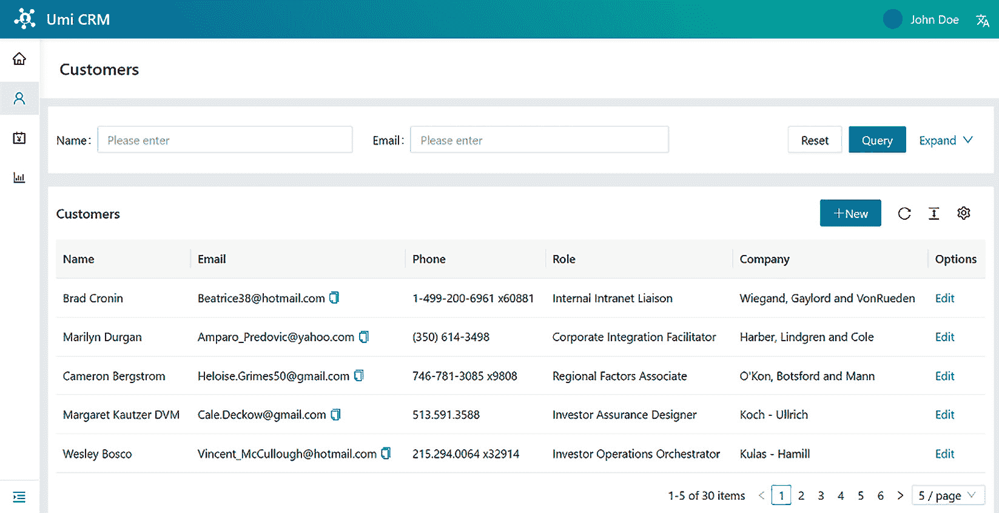
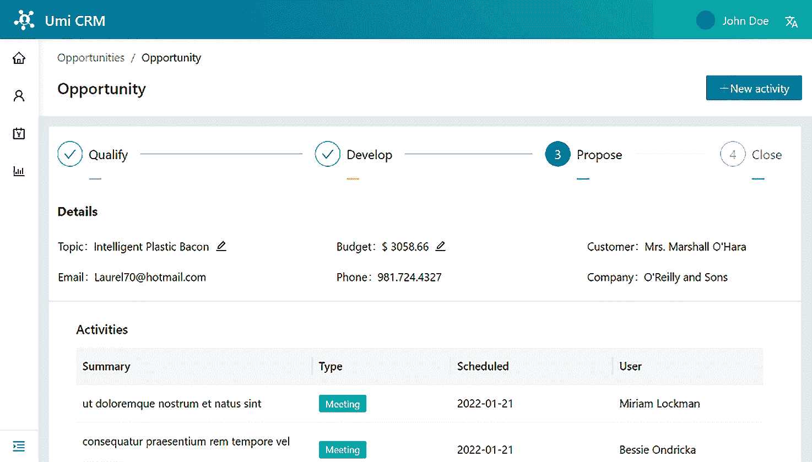
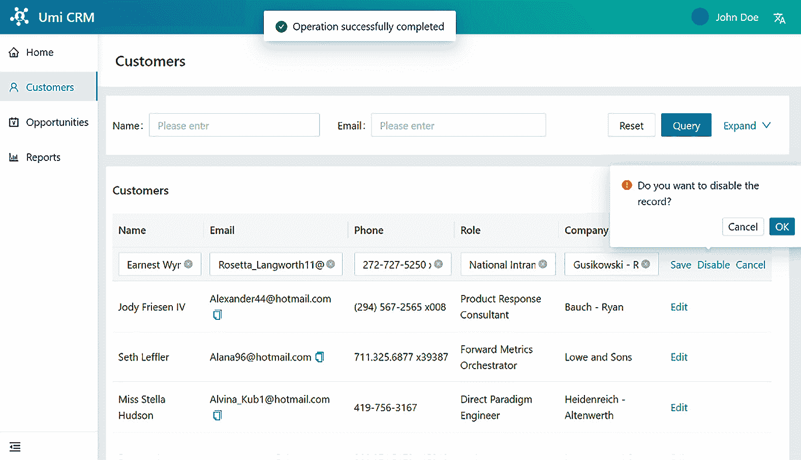

# 第三章：使用模型、服务和模拟数据

前端 Web 应用程序的主要功能之一是与后端通信。我们的应用程序需要收集用户输入并将其发送进行处理。

在本章中，你将学习如何通过创建 TypeScript 接口和 `ProTable` 组件的列定义来定义数据。你将学习如何使用 Umi **mock 文件**来模拟后端逻辑和数据。你将了解如何使用 **umi-request** 库发送 HTTP 请求。你还将学习如何使用 **models** 在组件之间共享状态和逻辑。

我们将涵盖以下主要主题：

+   定义响应类型和列类型

+   创建机会详情页面

+   模拟数据和 API 响应

+   使用 Umi 请求发送 HTTP 请求

+   使用模型共享状态和逻辑

到本章结束时，你将学会如何在 Umi 中处理数据流，以及如何使用 `services` 和 `models` 文件夹来组织你的项目。你还将了解如何使用 Umi 功能来模拟后端逻辑和发送 HTTP 请求。你还将更好地理解 `ProTable` 组件如何帮助我们处理数据批量操作。

# 技术要求

要完成本章的练习，你只需要一台安装了任何操作系统（我推荐 Ubuntu 20.04 或更高版本）的计算机，以及安装在 *第一章* *环境设置和 UmiJS 简介*（Visual Studio Code、Node.js 和 Yarn）的软件。

你可以在 GitHub 仓库的 `Chapter03` 文件夹中找到完整的项目，该仓库的网址为 [`github.com/PacktPublishing/Enterprise-React-Development-with-UmiJs`](https://github.com/PacktPublishing/Enterprise-React-Development-with-UmiJs)。

# 定义响应类型和列类型

在本节中，我们将创建 TypeScript 接口来定义我们将从后端接收的数据，并为每个页面的 `ProTable` 组件创建列定义。

让我们从接口开始。按照以下步骤创建 TypeScript 接口：

1.  让我们首先创建定义文件的文件夹。在 `src` 文件夹下，创建一个名为 `types` 的新文件夹。

1.  现在，在 `types` 文件夹中，创建一个名为 `user.d.ts` 的新文件，并添加以下接口代码：

    ```js
    export interface User {
      id?: number;
      name?: string;
      company?: string;
      role?: {
        id: number;
        title: string;
      };
      isLoggedIn: boolean;
    }
    ```

`User` 接口定义了我们将如何从后端接收用户信息。

1.  在 `types` 文件夹中创建一个名为 `customer.d.ts` 的新文件，并添加以下接口：

    ```js
    export interface Customer {
      id?: number;
      name?: string;
      company?: string;
      phone?: string;
      email?: string;
      role?: string;
    }
    ```

`Customer` 接口定义了我们将如何从后端接收客户信息。

1.  现在，我们将为 `opportunity` 模型创建两个接口。在 `types` 文件夹中创建一个名为 `opportunity.d.ts` 的新文件，并添加以下接口：

    ```js
    import { Customer } from './customer';
    export interface Opportunity {
      id: number;
      topic: string;
      budget: string;
      status: number;
      customer: Customer;
    }
    export interface Activity {
      id: number;
      type: number;
      schedule: Date;
      createdBy: string;
      summary: string;
    }
    ```

`Opportunity` 接口定义了我们将如何从后端接收机会信息。

注意，我们导入了 `Customer` 接口并将其用作 `customer` 属性的类型。一个机会总是与 CRM 中注册的特定客户相关联。

`Activity`接口定义了我们从后端接收机会活动信息的方式。

1.  让我们创建报告数据的接口。在`types`文件夹中创建一个名为`analytics.d.ts`的新文件，并添加以下接口：

    ```js
    export interface TopOpportunity {
      name: string;
      revenue: string;
    }
    export interface LeadsSource {
      source: string;
      count: number;
      percent: number;
    }
    export interface HistoryByMonth {
      name: string;
      month: string;
      value: string;
    }
    ```

这些接口定义了我们将如何接收顶级机会图表、来源图表以及按月赢得/失去的机会图表的数据。

现在，让我们定义每个页面的`ProTable`组件应该如何显示从后端接收到的数据。

## 创建 ProTable 的列定义

我们需要通过定义列来设置`ProTable`组件将如何显示数据。我建议您尽可能在单独的文件中创建列定义，以保持组件代码的整洁。

按照以下步骤在每个页面上创建列定义：

1.  让我们从`src/pages`文件夹下的`Customers`文件夹中的`columns.tsx`文件开始。

1.  在`columns.tsx`文件中，按照如下方式定义表格列：

    ```js
    import { Customer } from '@/types/customer';
    import { ProColumns } from '@ant-design/pro-table';
    import { FormattedMessage } from 'umi';
    const columns: ProColumns<Customer>[] = [
      {
        title: <FormattedMessage id="table.customer.name" 
               />,
        dataIndex: 'name',
      },
      {
        title: <FormattedMessage id="table.customer.email"
               />,
        dataIndex: 'email',
        copyable: true,
      },
      {
        title: <FormattedMessage id="table.customer.phone"
               />,
        dataIndex: 'phone',
      },
      {
        title: <FormattedMessage id="table.customer.role" 
               />,
        dataIndex: 'role',
      },
      {
        title: <FormattedMessage  
                id="table.customer.company" />,
        dataIndex: 'company',
      },
    ];
    export default columns;
    ```

注意，我们使用了`Customer`接口来声明数据类型。每个列定义都有一个`title`和一个`dataIndex`。后者需要与`Customer`接口的一个属性匹配，以便`ProTable`可以在其列中显示该属性值。

1.  让我们添加一个列来显示特定行的选项。将此定义添加到`columns.tsx`文件中：

    ```js
    {
      title: <FormattedMessage id="table.options" />,
      valueType: 'option',
      hideInSetting: true,
      hideInDescriptions: true,
      render: (_, record, __, action) => [
        <a
          key="editable"
          onClick={() => {
            action?.startEditable(record.id as number);
          }}
        >
          <FormattedMessage id="table.edit" />
        </a>,
      ],
    },
    ```

在`options`列中，除了我们设置为不在设置和描述中显示的属性外，我们还设置了`render`函数的行为。这允许您访问 React 节点、行实体、索引和默认的`ProTable`操作。当用户点击此选项时，`startEditable`操作允许他们编辑行。

1.  现在，我们将使用`ProTable`组件中的列定义。将以下行添加到`index.tsx`文件中，以导入`columns.tsx`文件：

    ```js
    import columns from './columns';
    ```

1.  使用导入的文件定义`ProTable`的`columns`属性，如下所示：

    ```js
    columns={columns}
    ```

1.  接下来，将`Customer`接口添加到定义`ProTable`列的数据类型：

    ```js
    <ProTable<Customer>
    ```

1.  现在，让我们创建`src/pages`文件夹下`Opportunities`文件夹中的`columns.tsx`的列定义。

1.  按照如下方式将定义添加到`columns.tsx`文件中：

    ```js
    import { Customer } from '@/types/customer';
    import { Opportunity } from '@/types/opportunity';
    import { ProColumns } from '@ant-design/pro-table';
    import { Tag } from 'antd';
    import { FormattedMessage, history } from 'umi';
    const columns: ProColumns<Opportunity>[] = [
      {
        title: <FormattedMessage
                id="table.opportunity.topic" />,
        dataIndex: 'topic',
        width: 300,
      },
      {
        title: <FormattedMessage
                id="table.opportunity.budget" />,
        dataIndex: 'budget',
        render: (node) => <>{`$ ${node}`}</>,
      },
      {
        title: <FormattedMessage
                id="table.opportunity.status" />,
        dataIndex: 'status',
        valueType: 'select',
        hideInDescriptions: true,
        filters: true,
        onFilter: true,
      },
    ];
    export default columns;
    ```

注意，我们使用了之前创建的`Opportunity`接口来定义数据类型。

在`status`列中，我们将`valueType`属性设置为`select`，并将`filters`和`onFilter`属性设置为`true`，这样用户就可以使用此`column`值选择和过滤表格。

1.  `status`是一个表示销售流程中机会进度的数值。但是，我们希望用户看到的是标题而不是数字，所以让我们给`status`列添加`enumType`属性，如下所示：

    ```js
    valueEnum: {
      0: {
        text: (
          <Tag color="#8d79f2" key={0}>
            <FormattedMessage id="step.propose" />
          </Tag>
        ),
      },
      1: {
        text: (
          <Tag color="#c7f279" key={0}>
            <FormattedMessage id="step.develop" />
          </Tag>
        ),
      },
      2: {
        text: (
          <Tag color="#e379f2" key={0}>
            <FormattedMessage id="step.qualify" />
          </Tag>
        ),
      },
      3: {
        text: (
          <Tag color="#79f2e3" key={0}>
            <FormattedMessage id="step.close" />
          </Tag>
        ),
      },
    },
    ```

状态将以不同颜色和相应的步骤标题显示为标签。

1.  机会与客户相关联，我们需要定义客户属性列。让我们按照如下方式添加这些列：

    ```js
    {
      title: <FormattedMessage  
              id="table.opportunity.customer" />,
      dataIndex: 'customer',
      render: (node) => <>{node && (node as 
                                    Customer).name}</>,
      editable: false,
    },
    {
      title: <FormattedMessage id="table.customer.email"
             />,
      dataIndex: 'customer',
      hideInTable: true,
      render: (node) => <>{node && (node as 
                                    Customer).email}</>,
      editable: false,
    },
    {
      title: <FormattedMessage id="table.customer.phone" 
             />,
      dataIndex: 'customer',
      hideInTable: true,
      render: (node) => <>{node && (node as
                                    Customer).phone}</>,
      editable: false,
    },
    {
      title: <FormattedMessage id="table.customer.company"
             />,
      dataIndex: 'customer',
      hideInTable: true,
      render: (node) => <>{node && (node as 
                                    Customer).company}</>,
      editable: false,
    },
    ```

注意，表中只有一列是客户的姓名。在其他列中，我们将`hideInTable`设置为`true`。我们将在本章后面创建的机会详情页面中使用这些列。

1.  我们还将添加一个列来显示特定行的选项。将以下定义添加到`columns.tsx`文件中：

    ```js
    {
      title: <FormattedMessage id="table.options" />,
      valueType: 'option',
      hideInSetting: true,
      hideInDescriptions: true,
      render: (_, record, __, action) => [
        <a
          key="editable"
          onClick={() => {
            action?.startEditable(record.id as number);
          }}
        >
          <FormattedMessage id="table.edit" />
        </a>,
        <a key="more" onClick={() => 
          history.push(`/opportunity/${record.id}`)}>
          <FormattedMessage id="table.more" />
        </a>,
      ],
    },
    ```

`options`列引入了两个选项 - `/opportunity/:id`路径。

1.  现在，我们将在`ProTable`组件中使用列定义。将以下行添加到`index.tsx`文件中，以导入`columns.tsx`文件：

    ```js
    import columns from './columns';
    ```

1.  使用导入的文件定义`ProTable`的`columns`属性，如下所示：

    ```js
    columns={columns}
    ```

1.  导入`Opportunity`接口，如下所示：

    ```js
    import { Opportunity } from '@/types/opportunity';
    ```

1.  接下来，添加`Opportunity`接口以定义`ProTable`列的数据类型：

    ```js
    <ProTable<Opportunity>
    ```

1.  按照之前的步骤将列定义添加到主页上的`ProTable`。我们将重用**机会**页面上的`columns.tsx`文件，因此您需要导入该文件，如下所示：

    ```js
    import columns from '../Opportunities/columns';
    ```

1.  现在，我们需要将文本添加到多语言文件中。将文本添加到`src/locales`文件夹中的`en-US.ts`文件中，如下所示：

    ```js
    'table.options': 'Options',
    'table.edit': 'Edit',
    'table.more': 'More',
    'table.new': 'New',
    'table.customer.title': 'Customers',
    'table.customer.role': 'Role',
    'table.customer.name': 'Name',
    'table.customer.email': 'Email',
    'table.customer.phone': 'Phone',
    'table.customer.company': 'Company',
    'form.customer.title': 'New customer',
    'table.opportunity.assign': 'Assign Opportunities',
    'table.opportunity.title': 'Opportunity',
    'table.opportunity.detail': 'Details',
    'table.opportunity.activities': 'Activities',
    'table.opportunity.topic': 'Topic',
    'table.opportunity.budget': 'Budget',
    'table.opportunity.status': 'Step',
    'table.opportunity.customer': 'Customer',
    'form.opportunity.title': 'New opportunity',
    ```

我们不需要将这些文本添加到`pt-BR.ts`文件中，因为我们已经在上一章中下载了完整的文件。

在本节中，我们创建了 TypeScript 接口来定义我们将从后端接收的所有数据以及每个页面上`ProTable`组件的列定义。

现在，让我们创建机会详情页面，该页面将显示机会上的活动。

# 创建机会详情页面

在本节中，我们将创建机会详情页面。机会详情页面允许用户跟踪和注册机会活动。

用户还可以更改机会步骤并编辑机会属性，如`title`和`expected revenue`。

按照以下步骤创建机会详情页面：

1.  运行以下命令以生成机会详情页面：

    ```js
    yarn umi g page /OpportunityDetail/index --typeScript --less
    ```

1.  我们将使用一个名为`ProDescriptions`的专业组件。它与`ProTable`组件类似，但旨在显示属性而不是数据批量。运行以下命令将`ProDescriptions`组件添加到项目中：

    ```js
    yarn add @ant-design/pro-descriptions@1.10.5
    ```

1.  接下来，将这些依赖项导入到`OpportunityDetail`文件夹中的`index.tsx`文件中，如下所示：

    ```js
    import { Opportunity } from '@/types/opportunity';
    import ProDescriptions from '@ant-design/pro-descriptions';
    import { Page Container } from '@ant-design/pro-layout';
    import ProTable from '@ant-design/pro-table';
    import { Breadcrumb, Button, Card, Steps, Tag } from 'antd';
    import { useParams, history, FormattedMessage } from 'umi';
    import columns from '../Opportunities/columns';
    import { PlusOutlined } from '@ant-design/icons';
    import { Activity } from '@/types/opportunity';
    ```

1.  现在，在`index.tsx`文件中创建`page`组件，如下所示：

    ```js
    export default function Page() {
      const { id } = useParams<{ id: string }>();
      return (
        <PageContainer
          extra={[
            <Button icon={<PlusOutlined />} key="activity" 
             type="primary">
              <FormattedMessage id="activity.new" />
            </Button>,
          ]}
        >
          <Card bordered>
            <ProDescriptions<Opportunity>
              title={<FormattedMessage 
                     id="table.opportunity.detail" />}
              columns={columns}
              dataSource={[]}
            />
          </Card>
          <Card bordered>
            <ProTable<Activity>
              headerTitle={<FormattedMessage 
                id="table.opportunity.activities" />}
              rowKey="id"
              toolbar={{ settings: undefined }}
              search={false}
              pagination={{ pageSize: 5 }}
              columns={[]}
              params={{ customerId: id }}
              request={() => {}}
            />
          </Card>
        </PageContainer>
      );
    }
    ```

注意，我们访问了从路由参数中获得的 ID。我们将使用它从后端请求特定的机会。

我们还使用了`ProDescriptions`组件来显示机会详情，以及`ProTable`来列出机会活动。

1.  机会详情页面仅在`opportunities`表格行选项中可访问，不在菜单中可访问，因此让我们向`PageContainer`组件添加一个`header`属性，如下所示：

    ```js
    header={{
      title: <FormattedMessage 
              id="table.opportunity.title" />,
      breadcrumb: (
        <Breadcrumb>
          <Breadcrumb.Item>
            <a onClick={() => 
              history.push('/opportunities')}>
              <FormattedMessage id="menu.opportunities" />
            </a>
          </Breadcrumb.Item>
          <Breadcrumb.Item>
            <FormattedMessage id="table.opportunity.title"
            />
          </Breadcrumb.Item>
        </Breadcrumb>
      ),
    }}
    ```

1.  现在，我们将从 Ant Design 添加`Steps`组件来直观地显示机会的进度。将`Steps`组件添加到`ProDescriptions`组件之前，作为`Card`组件的第一个子组件，如下所示：

    ```js
    <Steps current={0}>
      <Steps.Step
        key="quality"
        description={<Tag color="#e379f2" key={0} />}
        title={<FormattedMessage id="step.qualify" />}
      />
      <Steps.Step
        key="develop"
        description={<Tag color="#c7f279" key={1} />}
        title={<FormattedMessage id="step.develop" />}
      />
      <Steps.Step
        key="propose"
        description={<Tag color="#8d79f2" key={2} />}
        title={<FormattedMessage id="step.propose" />}
      />
      <Steps.Step
        key="close"
        description={<Tag color="#42C3E3" key={3} />}
        title={<FormattedMessage id="step.close" />}
      />
    </Steps>
    <br />
    ```

`current`属性表示机会在销售流程中的进度。

1.  现在，将路由定义添加到`config`文件夹中的`routes.ts`文件中的机会详情页面，如下所示：

    ```js
    {
      path: '/opportunity/:id',
      component: '@/pages/OpportunityDetail',
    },
    ```

注意，我们未添加`name`和`icon`属性，因为我们不希望在侧菜单中列出机会详情页面。

我们几乎完成了机会详情页面的构建。现在，我们将使用之前创建的`Activity`接口来定义活动表格的列。

## 定义活动表格列

机会详情页面使用`ProTable`组件列出所采取的活动，因此我们还需要为此表格定义列。

按照以下步骤为`ProTable`组件定义列：

1.  在`src/pages`文件夹下的`OpportunityDetails`文件夹中创建一个名为`columns.tsx`的新文件。

1.  接下来，将列定义添加到`columns.tsx`文件中，如下所示：

    ```js
    import { ProColumns } from '@ant-design/pro-table';
    import { FormattedMessage } from 'umi';
    import { Activity } from '@/types/opportunity';
    import { Tag } from 'antd';
    const columns: ProColumns<Activity>[] = [
      {
        title: <FormattedMessage 
                id="table.activity.summary" />,
        dataIndex: 'summary',
        width: 300,
      },
      {
        title: <FormattedMessage id="table.activity.type"
               />,
        dataIndex: 'type',
      },
      {
        title: <FormattedMessage 
                id="table.activity.schedule" />,
        valueType: 'date',
        dataIndex: 'schedule',
      },
      {
        title: <FormattedMessage 
                id="table.activity.createdBy" />,
        dataIndex: 'createdBy',
      },
    ];
    export default columns;
    ```

`type`属性是一个表示活动类型的数值。

1.  我们希望用户在`type`列中看到标题而不是数值，因此让我们向`type`列添加`enumType`属性，如下所示：

    ```js
    valueEnum: {
      0: {
        text: (
          <Tag color="#42C3E3" key={0}>
            <FormattedMessage id="activity.call" />
          </Tag>
        ),
      },
      1: {
        text: (
          <Tag color="#42C3E3" key={1}>
            <FormattedMessage id="activity.email" />
          </Tag>
        ),
      },
      2: {
        text: (
          <Tag color="#42C3E3" key={2}>
            <FormattedMessage id="activity.meeting" />
          </Tag>
        ),
      },
      3: {
        text: (
          <Tag color="#42C3E3" key={3}>
            <FormattedMessage id="activity.event" />
          </Tag>
        ),
      },
    },
    ```

现在，`type`列将以不同颜色显示带有活动类型标题的标签。

1.  现在，我们将使用`ProTable`组件中的列定义。将以下行添加到`index.tsx`文件中，以导入`columns.tsx`文件：

    ```js
    import activityColumns from './columns';
    ```

1.  接下来，使用导入的文件定义`ProTable`的`columns`属性，如下所示：

    ```js
    columns={activityColumns}
    ```

1.  为了完成机会详情页面，让我们将文本添加到`src/locales`文件夹中的`en-US.ts`文件中，如下所示：

    ```js
    'step.qualify': 'Qualify',
    'step.develop': 'Develop',
    'step.propose': 'Propose',
    'step.close': 'Close',
    'activity.call': 'Call',
    'activity.email': 'Email',
    'activity.meeting': 'Meeting',
    'activity.event': 'Event',
    'activity.new': 'New activity',
    'table.activity.summary': 'Summary',
    'table.activity.type': 'Type',
    'table.activity.schedule': 'Scheduled',
    'table.activity.createdBy': 'User',
    ```

在本节中，我们创建了机会详情页面。我们添加了一个面包屑来帮助用户在界面之间导航，并使用`Steps`组件来显示机会进度。我们还通过创建`columns.tsx`文件来定义活动表格列。

现在，我们已经准备好通过创建 Umi 模拟文件来学习如何模拟后端逻辑和 API 响应。

# 模拟数据和 API 响应

在本节中，您将学习如何创建模拟文件来模拟后端逻辑和 API 响应。

模拟文件有助于解耦前端开发和后端开发，因为您不需要后端准备好才能进行请求并使用数据填充您的界面。

模拟文件只是一个具有端点路由定义和对每个端点的响应的 JavaScript 对象。考虑以下示例：

```js
export default {
  'GET /api/products': { total: 0, products: [] },
};
```

在此示例中，当项目运行时，我们可以向 http://localhost:8000/api/products 发送`HTTP` `GET`请求，以接收模拟文件中定义的对象。

Umi 会将`mock`文件夹内所有`.js`和`.ts`扩展名的文件注册为模拟文件。

现在我们知道了模拟文件是如何工作的，让我们为我们的应用程序创建模拟文件。按照以下步骤操作：

1.  在项目根目录中，创建一个名为 `mock` 的新文件夹。

1.  我们将使用名为 `faker.js` 的库来生成我们想要发送的数据，而不是手动生成数据，这个库提供了我们可以选择的各种数据类别，例如用户资料、公司联系人和产品信息。运行以下命令来安装 `faker.js` 库：

    ```js
    $ yarn add -D faker@5.5.3
    ```

1.  让我们通过运行以下命令添加 `faker.js` 的 TypeScript 声明文件：

    ```js
    $ yarn add -D @types/faker
    ```

1.  接下来，通过运行以下命令添加 **express** 的 TypeScript 声明文件：

    ```js
    $ yarn add -D @types/express
    ```

我们将使用 `express` 的 `Response` 和 `Request` 接口来定义我们的模拟端点中的请求和响应。

1.  现在，在 `mock` 文件夹中创建一个名为 `customer.ts` 的新文件。

1.  在 `customer.ts` 文件中创建客户列表，如下所示：

    ```js
    import * as faker from 'faker';
    import { Response } from 'express';
    import { Customer } from '@/types/customer.d';
    const customers: Customer[] = [];
    for (let index = 0; index < 30; index++) {
      customers.push({
        id: index,
        name: faker.name.findName(),
        company: faker.company.companyName(),
        phone: faker.phone.phoneNumber(),
        role: faker.name.jobTitle(),
        email: faker.internet.email(),
      });
    }
    ```

我们使用了 `faker.js` 库来生成随机的客户属性。

1.  接下来，在 `customer.ts` 文件中创建端点路由定义，如下所示：

    ```js
    export default {
      'PUT /api/customer': (_: any, res: Response) => 
    res.send({ success: true }),
      'PUT /api/customer/disable': (_: any, res: Response) 
    =>
        res.send({ success: true }),
      '/api/customer/list': (_: any, res: Response) =>
        res.send({ data: customers, success: true }),
      'POST /api/customer': (_: any, res: Response) =>
        res.status(201).send({ success: true }),
    };
    ```

我们定义了四个端点：

+   一个用于更新客户记录的模拟端点（`PUT /api/customer`）

+   一个用于禁用客户记录的模拟端点（`PUT /api/customer/disable`）

+   一个用于列出所有客户的模拟端点（`/api/customer/list`）

+   一个用于创建新客户记录的模拟端点（`POST /api/customer`）

注意，当端点使用 `GET` 方法时，例如在列出所有客户的端点（`/api/customer/list`）中，我们不需要定义 HTTP 方法。

1.  现在，在 `mock` 文件夹中创建一个名为 `analytics.ts` 的新文件，并添加以下内容：

    ```js
    import * as faker from 'faker';
    import { Response } from 'express';
    export default { }
    ```

我们将在该文件中创建数据以填充 **报告** 页面上的图表。

1.  在 `analytics.ts` 文件中，创建一个新的模拟端点以交付顶级机会，如下所示：

    ```js
    '/api/analytics/top/opportunity': (_: any, res: Response) =>
        res.send({
          data: [
            { name: faker.commerce.productName(), 
              revenue: 15000 },
            { name: faker.commerce.productName(), 
              revenue: 30000 },
            { name: faker.commerce.productName(), 
              revenue: 40000 },
            { name: faker.commerce.productName(), 
              revenue: 50000 },
          ],
          success: true,
        }),
    ```

1.  接下来，创建一个模拟端点以按来源交付潜在客户，如下所示：

    ```js
    '/api/analytics/leads/source': (_: any, res: Response) =>
        res.send({
          data: [
            { source: 'Social Media', count: 40,
               percent: 0.4 },
            { source: 'Email Marketing', count: 21, 
              percent: 0.21 },
            { source: 'Campaigns', count: 17, 
              percent: 0.17 },
            { source: 'Landing Page', count: 13, 
              percent: 0.13 },
            { source: 'Events', count: 9, percent: 0.09 },
          ],
          success: true,
        }),
    ```

1.  最后，创建一个按月交付赢得/失去的机会的模拟端点，如下所示：

    ```js
    '/api/analytics/bymonth/opportunity': (_: any, res: Response) =>
        res.send({
          data: [
            { name: 'Won', month: 'Jan.', value: 18 },
            { name: 'Won', month: 'Feb.', value: 28 },
            { name: 'Won', month: 'Mar.', value: 39 },
            { name: 'Won', month: 'Apr.', value: 81 },
            { name: 'Won', month: 'May', value: 47 },
            { name: 'Won', month: 'Jun.', value: 20 },
            { name: 'Won', month: 'Jul.', value: 24 },
            { name: 'Won', month: 'Aug.', value: 35 },
            { name: 'Lost', month: 'Jan.', value: 12 },
            { name: 'Lost', month: 'Feb.', value: 23 },
            { name: 'Lost', month: 'Mar.', value: 34 },
            { name: 'Lost', month: 'Apr.', value: 99 },
            { name: 'Lost', month: 'May', value: 52 },
            { name: 'Lost', month: 'Jun.', value: 35 },
            { name: 'Lost', month: 'Jul.', value: 37 },
            { name: 'Lost', month: 'Aug.', value: 42 },
          ],
          success: true,
        }),
    ```

1.  现在，我们将为机会创建一个模拟文件。在 `mock` 文件夹中创建一个名为 `opportunity.ts` 的新文件，并添加以下内容：

    ```js
    import * as faker from 'faker';
    import { Opportunity, Activity } from '@/types/opportunity.d';
    import { Request, Response } from 'express';
    const opportunity: Opportunity[] = [];
    const activities: Activity[] = [];
    for (let index = 0; index < 5; index++) {
      activities.push({
        id: index,
        type: faker.datatype.number({ max: 3, min: 0,
          precision: 1 }),
        schedule: faker.date.recent(),
        createdBy: faker.name.findName(),
        summary: faker.lorem.words(6),
      });
    }
    for (let index = 0; index < 30; index++) {
      opportunity.push({
        id: index,
        topic: faker.commerce.productName(),
        customer: {
          id: index,
          name: faker.name.findName(),
          company: faker.company.companyName(),
          phone: faker.phone.phoneNumber(),
          role: faker.name.jobTitle(),
          email: faker.internet.email(),
        },
        budget: faker.finance.amount(100000),
        status: faker.datatype.number({ max: 3, min: 0, 
          precision: 1 }),
      });
    }
    ```

我们创建了两个列表，`activities` 和 `opportunities`，并使用 `faker.js` 库用随机数据填充这些列表。

1.  接下来，创建这两个方法：

    ```js
    const listOpportunities = (req: Request, res: Response) => {
      const { slice } = req.query;
      res.send({
        data: opportunity.slice(0, slice ? Number(slice) :
          undefined),
        success: true,
      });
    };
    const getOpportunity = (req: Request, res: Response) => {
      const { opportunityId } = req.query;
      res.send(opportunity[Number(opportunityId)]);
    };
    ```

`listOpportunities` 方法使用 `slice` 请求查询参数中给出的数字来切片 `opportunities` 数组。

`getOpportunity` 方法通过 `opportunityId` 请求查询参数提供的索引位置访问 `opportunity` 数组项。

1.  最后，创建模拟端点的定义，如下所示：

    ```js
    export default {
      '/api/opportunity/list': listOpportunities,
      '/api/opportunity': getOpportunity,
      '/api/opportunity/activities': (_: any, res:
     Response) =>
        res.send({ data: activities, success: true }),
      'POST /api/opportunity': (_: any, res: Response) =>
        res.status(201).send({ success: true }),
      'PUT /api/opportunity/disable': (_: any, res:
     Response) =>
        res.send({ success: true }),
      'PUT /api/opportunity': (_: any, res: Response) =>
        res.send({ success: true }),
    };
    ```

我们定义了六个端点：

+   一个用于列出所有机会的模拟端点（`/api/opportunity/list`）

+   一个通过 ID 获取机会的模拟端点（`/api/opportunity`）

+   一个用于获取机会活动的模拟端点（`/api/opportunity/activities`）

+   一个用于创建新机会记录的模拟端点（`POST /api/opportunity`）

+   一个用于禁用机会记录的模拟端点（`PUT /api/opportunity/disable`）

+   一个用于更新机会记录的模拟端点 (`PUT /api/opportunity`)

在本节中，我们使用 `faker.js` 库创建模拟文件，以提供我们接口的数据。

现在，我们将学习如何使用 `services` 文件夹来组织我们的项目，并使用 umi-request 库向我们的模拟后端发送请求。

# 使用 Umi request 发送 HTTP 请求

在本节中，我们将使用 umi-request 库开发对后端的请求。

我们将在 `services` 文件夹内为每个上下文创建单独的文件来存储所有请求。这种组织方式有助于我们清理组件代码并重复使用接口中的请求。

对于发送 HTTP 请求，我们将使用 **Umi request**。这是一个基于 **fetch** 和 **axios** 库的简单易用的库，它提供了常见的功能，如错误处理和缓存。以下是一个示例：

```js
request<Product>('/api/products', {
  method: 'POST',
  headers: { Authorization: 'Bearer eyJhbGciOi...' },
  params: { onSale: true },
  data: {
    id: 0,
    title: 'My product',
    price: 10.0,
  },
});
```

`request` 函数需要两个主要参数 - 我们想要发送请求的 `URL` 参数，以及我们可以定义 HTTP 方法、请求头、请求参数和请求体（在 `data` 属性中）的 `options` 参数。您还可以确定响应类型。在这个例子中，我们使用 `Product` 接口描述了响应类型。

按照以下步骤开发请求：

1.  在 `src` 文件夹中创建一个名为 `services` 的新文件夹。

1.  在 `services` 文件夹内，创建一个名为 `analytics.ts` 的新文件，并编写请求，如下所示：

    ```js
    import { HistoryByMonth, LeadsSource, TopOpportunity, } from '@/types/analytics';
    import { request } from 'umi';
    export function getTopOpportunities() {
      return request<{ data: TopOpportunity[]; 
        success: boolean }>(
        `/api/analytics/top/opportunity`,
        {
          method: 'GET',
        },
      );
    }
    export function getLeadsBySource() {
      return request<{ data: LeadsSource[]; 
        success: boolean }>(
        `/api/analytics/leads/source`,
        {
          method: 'GET',
        },
      );
    }
    export function getHistoryByMonth() {
      return request<{ data: HistoryByMonth[]; 
        success: boolean }>(
        `/api/analytics/bymonth/opportunity`,
        {
          method: 'GET',
        },
      );
    }
    ```

我们创建了三个函数 - `getTopOpportunities` 用于请求顶级机会，`getLeadsBySource` 用于按来源请求线索，以及 `getHistoryByMonth` 用于按月份请求赢得/失去的机会。

1.  现在，我们可以在 `pages/Reports` 文件夹中的 `index.tsx` 文件上使用请求响应来填充我们的图表数据源：

    ```js
    const [leadsBySource, setLeadsBySource] = 
      useState<LeadsSource[]>([]);
    const [historyByMonth, setHistoryByMonth] = 
      useState<any[]>([]);
    const [topOpp, setTopOpp] = 
      useState<TopOpportunity[]>([]);
    useEffect(() => {
      const fetchTopOpp = async () => {
        setTopOpp((await getTopOpportunities()).data);
      };
      const fetchLeadsBySource = async () => {
        setLeadsBySource((await getLeadsBySource()).data);
      };
      const fetchHistoryByMonth = async () => {
        setHistoryByMonth((await 
                           getHistoryByMonth()).data);
      };
      fetchHistoryByMonth();
      fetchLeadsBySource();
      fetchTopOpp();
    }, []);
    ```

我们使用 `useState` React 钩子创建了三个状态来存储我们的图表数据，并利用 `useEffect` React 钩子在页面渲染时填充我们的图表。

1.  按照以下方式从 `analytics.ts` 文件导入所有 React 依赖和函数：

    ```js
    import { useState, useEffect } from 'react';
    import {
      getHistoryByMonth,
      getLeadsBySource,
      getTopOpportunities,
    } from '@/services/analytics';
    ```

1.  接下来，将每个状态添加到相应的 `Chart` 组件的 `data` 属性中。结果应该如下所示：

![Figure 3.1 – 填充数据的报告页面图表]

![Figure 3.01_B18503.jpg]

Figure 3.1 – 填充数据的报告页面图表

1.  让我们在客户页面创建请求。在 `services` 文件夹中，创建一个名为 `customer.ts` 的新文件，并编写请求，如下所示：

    ```js
    import { Customer } from '@/types/customer';
    import { request } from 'umi';
    export function listCustomers(params?: any) {
      return request<{ data: Customer[]; success: boolean 
        }>(`/api/customer/list`, {
        method: 'GET',
        params,
      });
    }
    export function createCustomer(customer: Customer) {
      return request<{ success: boolean 
        }>(`/api/customer`, {
        method: 'POST',
        data: customer,
      });
    }
    export function disableCustomer(customerId?: string) {
      return request<{ success: boolean 
        }>(`/api/customer/disable`, {
        method: 'PUT',
        params: { customerId },
      });
    }
    export function updateCustomer(customer: Customer) {
      return request<{ success: boolean 
        }>(`/api/customer`, {
        method: 'PUT',
        data: customer,
      });
    }
    ```

我们创建了四个函数 - `listCustomers` 用于列出所有客户，`createCustomer` 用于发布新的客户记录，`disableCustomer` 用于禁用客户记录，以及 `updateCustomer` 用于更新客户记录。

1.  现在，我们可以在客户页面上的 `ProTable` 组件中列出客户。通过在 `pages/Customers` 文件夹中的 `index.tsx` 文件中添加以下行，将 `listCustomers` 函数导入：

    ```js
    import { listCustomers } from '@/services/customer';
    ```

1.  接下来，将`listCustomers`函数添加到`ProTable`组件的`request`属性中，如下所示：

    ```js
    request={listCustomers}
    ```

结果应该如下所示：



图 3.2 – ProTable 组件中的客户列表

1.  最后，我们在机会页面上创建请求。在`services`文件夹中创建一个名为`opportunity.ts`的新文件。

1.  在`opportunity.ts`文件中创建以下函数，如下所示：

    ```js
    import { Opportunity, Activity } from '@/types/opportunity';
    import { request } from 'umi';
    export function listOpportunities(params?: any) {
      return request<{ data: Opportunity[];
        success: boolean }>(
        `/api/opportunity/list`,
        {
          method: 'GET',
          params,
        },
      );
    }
    export function listActivities(params?: any) {
      return request<{ data: Activity[]; 
        success: boolean }>(
        `/api/opportunity/activities`,
        {
          method: 'GET',
          params,
        },
      );
    }
    export function getOpportunity(params?: any) {
      return request<Opportunity>(`/api/opportunity`, {
        method: 'GET',
        params,
      });
    }
    ```

我们创建了三个函数——`listOpportunities`用于获取所有机会，`listActivities`用于列出所有机会活动，以及`getOpportunity`通过 ID 获取机会。

1.  接下来，在`opportunity.ts`文件中创建其他三个函数，如下所示：

    ```js
    export function createOpportunity(opportunity: Opportunity) {
      return request<{ success: boolean 
        }>(`/api/opportunity`, {
        method: 'POST',
        data: opportunity,
      });
    }
    export function disableOpportunity(opportunityId?: string) {
      return request<{ success: boolean 
        }>(`/api/opportunity/disable`, {
        method: 'PUT',
        params: { opportunityId },
      });
    }
    export function updateOpportunity(opportunity: Opportunity) {
      return request<{ success: boolean 
        }>(`/api/opportunity`, {
        method: 'PUT',
        data: opportunity,
      });
    }
    ```

我们创建了另外三个函数——`createOpportunity`用于创建新的机会记录，`disableOpportunity`用于禁用机会记录，以及`updateOpportunity`用于更新机会记录。

1.  现在，我们可以在机会页面的`ProTable`组件中列出机会。将以下导入添加到`pages/Opportunity`文件夹中的`index.tsx`文件中：

    ```js
    import { listOpportunities } from '@/services/opportunity';
    ```

1.  接下来，将`listOpportunities`函数添加到`ProTable`组件的`request`属性中，如下所示：

    ```js
    request={listOpportunities}
    ```

结果应该如下所示：


图 3.3 – ProTable 组件中的机会列表

1.  让我们也在机会详情页上获取机会并列出机会活动。将以下导入添加到机会详情页中：

    ```js
    import { useEffect, useState } from 'react';
    import { getOpportunity, listActivities } from '@/services/opportunity';
    ```

1.  接下来，添加存储机会的状态以及请求它的效果，如下所示：

    ```js
    const [opportunity, setOpportunity] = 
      useState<Opportunity>();
    useEffect(() => {
      const fetchOpportunity = async () => {
        setOpportunity(await getOpportunity({ 
          opportunityId: id }));
      };
      fetchOpportunity();
    }, [])
    ```

1.  接下来，将`opportunity`状态添加到`ProDescriptions`组件的`dataSource`属性中，如下所示：

    ```js
    dataSource={opportunity}
    ```

1.  让我们也将`listActivities`函数添加到`ProTable`组件的`request`属性中，如下所示：

    ```js
    request={listActivities}
    ```

1.  将`opportunity` `status`属性添加到`Step`组件的`current`属性中，如下所示：

    ```js
    current={opportunity?.status}
    ```

现在，机会详情页应该如下所示：



图 3.4 – 机会 – 详细信息和活动列表

在本节中，我们创建了`services`文件夹和每个页面使用的 umi-request 库的请求。我们还使用每个页面的请求来访问数据以填充我们的接口。接下来，我们将通过创建模型文件来学习在组件之间共享状态和逻辑。

# 使用模型来共享状态和逻辑

在本节中，我们将创建组件之间共享状态和逻辑的模型。

模型是一个特殊的自定义 React 钩子，用于集中管理特定上下文的状态和逻辑。

我们必须在`src/models`文件夹内创建模型文件，并且我们可以使用`useModel`自定义钩子来访问这些模型，如下所示：

```js
const { currentUser } = useModel('user');
```

这里，`user`命名空间与模型文件名匹配，因此模型文件必须命名为`user.ts`。

让我们创建 `customer` 模型和 `opportunity` 模型来演示模型的使用。这两个模型将包含创建、读取和更新操作的逻辑和结果，并在不同的接口之间共享这些操作。

按照以下步骤创建模型：

1.  在 `src` 文件夹内创建一个名为 `models` 的新文件夹。

1.  接下来，在 `models` 文件夹下创建一个名为 `customer.ts` 的新文件，并添加以下内容：

    ```js
    import { useCallback, useState } from 'react';
    import { Customer } from '@/types/customer';
    import {
      disableCustomer,
      updateCustomer,
      createCustomer,
    } from '@/services/customer';
    export interface CustomerModel {
      disable: (customerId: string) => void;
      update: (customer: Customer) => void;
      create: (customer: Customer) => void;
      clearResult: () => void;
      result: { success?: boolean };
    }
    ```

我们创建了 `CustomerModel` 接口来描述我们希望在组件之间共享的所有函数和状态。

1.  现在，创建以下函数和状态：

    ```js
    export default (): CustomerModel => {
      const [result, setResult] = useState<{
        success?: boolean }>({
        success: false,
      });
      const disable = useCallback(async (
        customerId?: string) => {
        setResult(await disableCustomer(customerId));
      }, []);
      const update = useCallback(async (
        customer: Customer) => {
        setResult(await updateCustomer(customer));
      }, []);
      const create = useCallback(async (
        customer: Customer) => {
        setResult(await createCustomer(customer));
      }, []);
      const clearResult = useCallback(() => setResult({ 
        success: false }), []);
      return { disable, update, create, clearResult, 
        result };
    };
    ```

我们创建了一个状态来存储结果，并使用 `services` 文件中的请求来执行操作。

1.  让我们在 `pages/Customer` 文件夹中的 `index.tsx` 文件中使用 `customer` 模型函数：

    ```js
    const { disable, update, clearResult, result } = 
      useModel('customer');
      const { formatMessage } = useIntl();
      useEffect(() => {
        if (result?.success) {
          message.success(formatMessage({ 
            id: 'messages.success.operation' }));
          clearResult();
        }
      }, [result]);
    ```

我们使用 `result` 状态来确定操作是否成功，并显示成功消息。

1.  使用 `model` 函数将 `editable` 属性添加到 `ProTable` 组件中，如下所示：

    ```js
    editable={{
      type: 'multiple',
      deletePopconfirmMessage: <FormattedMessage 
        id="table.confirm" />,
      deleteText: <FormattedMessage id="table.disable" />,
      onDelete: async (key) => disable(key as string),
      onSave: async (_, record) => update(record),
    }}
    ```

我们使用 `disable` 和 `update` 函数在 `ProTable` 组件中提供可编辑功能。

1.  现在，重复之前的步骤来创建 `opportunity` 模型，并在 `ProTable` 组件中启用可编辑功能。

1.  将文本添加到 `locales` 文件夹下的 `en-US.ts` 文件中，如下所示：

    ```js
    'table.disable': 'Disable',
    'table.confirm': 'Do you want to disable the record?',
    ```

现在，你可以在两个页面上编辑记录，如下面的截图所示：



功能 3.5 – 客户页面上的 ProTable 可编辑功能

在本节中，你学习了模型的工作原理。我们创建了 `customer` 和 `opportunity` 模型以共享状态和逻辑，并在 `ProTable` 可编辑功能中使用它们。

# 摘要

在本章中，我们为所有后端数据创建了定义文件，并在每个页面上创建了 `ProTable` 列定义。我们使用 `ProDescritions` 组件和 `Activity` 接口创建了机会详情页面来描述机会活动。

你学习了如何使用 Umi 模拟文件工作，以及如何通过为我们的应用程序创建模拟文件来创建模拟端点以提供模拟的后端数据和逻辑。接下来，你学习了如何通过为我们的应用程序创建 `services` 文件来组织应用程序请求，并使用 umi-request 库发送请求。最后，你学习了模型的工作原理，并创建了 `customer` 和 `opportunity` 模型以在组件之间共享逻辑和状态。

在下一章中，你将学习如何通过配置 umi-request 库来处理 API 错误响应，使用 **plugin-access** 保护路由，并在登录后存储和全局访问用户信息。
