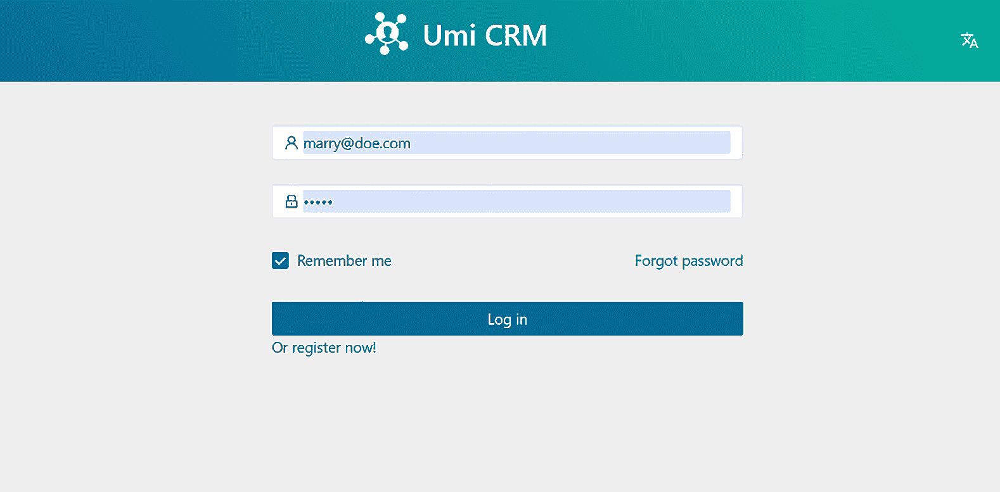
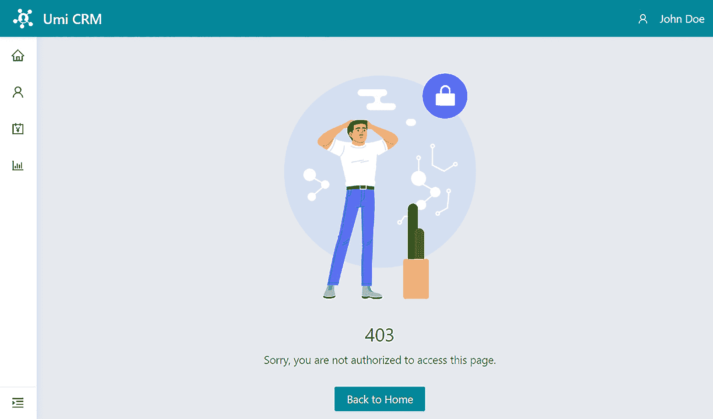
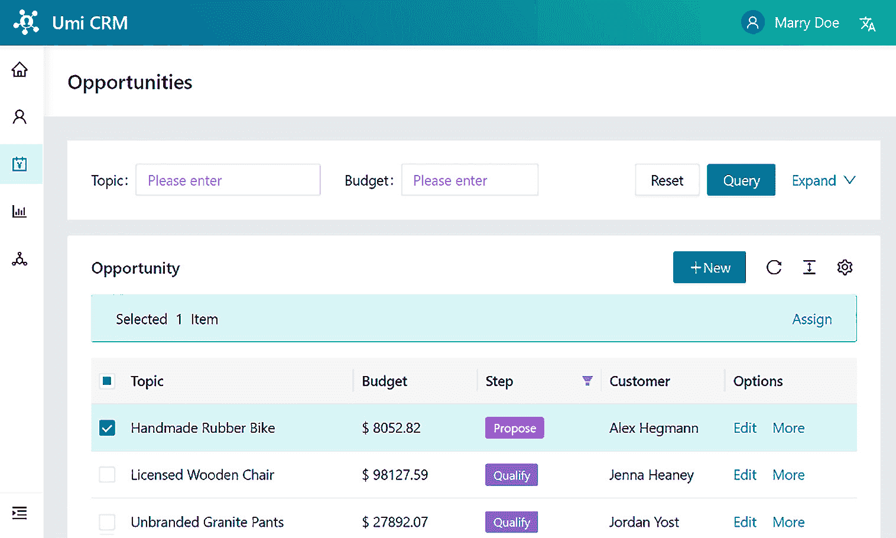

# 第四章：错误处理、认证和路由保护

我们需要在我们的接口中实现错误处理和安全措施，以确保应用程序的质量和用户体验良好。

在本章中，我们将修改在 *第一章* 中创建的登录页面，即 *环境设置和 UmiJS 简介*，并配置我们应用程序的默认 HTML 模板。你将学会如何通过配置应用程序的初始状态来存储和全局访问数据。接下来，你将学会如何使用 Umi 的 `plugin-access` 来阻止未经授权的访问。最后，你将学会通过配置 Umi 请求来处理 HTTP 错误响应并显示反馈消息。

在本章中，我们将涵盖以下主要主题：

+   修改登录页面和定义 HTML 模板

+   存储和全局访问用户信息

+   根据用户角色保护应用程序路由

+   处理 HTTP 错误响应

到本章结束时，你将学会如何配置和使用 `plugin-initial-state` 来在应用程序中全局存储和访问信息。你还将学会如何配置和使用 `plugin-access` 来保护路由。最后，你将学会通过配置 umi-request 库来处理 HTTP 错误响应。

# 技术要求

要完成本章的练习，你只需要一台装有任何操作系统（我推荐 Ubuntu 20.04 或更高版本）的计算机，以及 *第一章* 中安装的软件（VS Code、Node.js 和 Yarn）。

你可以在 GitHub 仓库中找到本章的完整项目，该仓库位于 [`github.com/PacktPublishing/Enterprise-React-Development-with-UmiJs`](https://github.com/PacktPublishing/Enterprise-React-Development-with-UmiJs) 的 `Chapter04` 文件夹中。

# 修改登录页面和定义 HTML 模板

在本节中，我们将创建一个 Umi 模拟文件和请求来模拟用户认证、用户登录页面，并配置我们应用程序的默认 HTML 模板。

让我们从模拟文件开始。我们将创建登录、登出和获取用户信息的端点。按照以下步骤创建文件：

1.  在 `mock` 文件夹中创建一个名为 `user.ts` 的新文件。接下来，创建 `login` 函数如下：

    ```js
    import { User } from '@/types/user.d';
    import { Request, Response } from 'express';
    const user: { currentUser: User } = {
      currentUser: {
        isLoggedIn: false,
      },
    };
    const login = (req: Request, res: Response) => {
      const { email, password } = req.body;
    };
    ```

1.  将以下 `if` 语句添加到 `login` 函数中：

    ```js
      if (email == 'john@doe.com' && password == 'user') {
        user.currentUser = {
          id: 0,
          name: 'John Doe',
          company: 'Umi Group',
          role: {
            id: 1,
            title: 'Inside Sales',
          },
          isLoggedIn: true,
        };
        res.json(user.currentUser);
      }
    ```

在这里，我们定义了一个条件，允许内部销售代表 John Doe（模拟用户）访问应用程序。用户角色将决定用户可以执行哪些操作以及他们可以访问哪些页面。

1.  接下来，将以下 `else if` 和 `else` 语句添加到 `login` 函数中：

    ```js
    else if (email == 'marry@doe.com' && 
             password == 'admin') {
        user.currentUser = {
          id: 1,
          name: 'Marry Doe',
          company: 'Umi Group',
          role: {
            id: 0,
            title: 'Sales Manager',
          },
          isLoggedIn: true,
        };
        res.json(user.currentUser);
      } else {
        res.status(401).send();
      }
    ```

在这里，我们定义了一个条件，允许模拟用户 Mary Doe，销售经理访问应用程序。我们还确定，如果用户不是 John Doe 或 Marry Doe，模拟 API 将返回 HTTP 401 错误，这是未认证的状态码。

1.  最后，按照以下方式将其他功能和端点路由定义添加到`user.ts`文件中：

    ```js
    const logout = (_: any, res: Response) => {
      user.currentUser = { isLoggedIn: false };
      res.send({ success: true });
    };
    const getUser = (_: any, res: Response) => {
      if (!user.currentUser.isLoggedIn) {
        res.status(204).send();
      } else {
        res.json(user.currentUser);
      }
    };
    export default {
      'POST /api/login': login,
      'POST /api/logout': logout,
      '/api/currentUser': getUser,
    };
    ```

我们创建了模拟登出和获取已登录用户信息的函数。

现在，我们需要在`services`文件夹中创建获取用户信息、登录和登出应用程序的请求。按照以下步骤创建请求：

1.  在`src`文件夹下的`services`文件夹中创建一个名为`user.ts`的新文件。

1.  将以下请求添加到`user.ts`文件中：

    ```js
    import { User } from '@/types/user.d';
    import { request } from 'umi';
    export function getCurrentUser() {
      return request<User>(`/api/currentUser`, {
        method: 'GET',
      });
    }
    export function userLogin(email: string, 
      password: string) {
      return request<User>(`/api/login`, {
        method: 'POST',
        headers: { 'Content-Type': 'application/json' },
        data: { email, password },
      });
    }
    export function userLogout() {
      return request<void>(`/api/logout`, {
        method: 'POST',
      });
    }
    ```

我们创建了请求来访问在`user.ts`模拟文件中定义的端点。

我们创建了一个 Umi 模拟文件来模拟用户服务和后端请求。现在，我们将创建一个登录页面，用户可以输入他们的电子邮件和密码并在应用程序中进行身份验证。

## 修改登录页面

我们需要一个登录页面，用户可以使用他们的电子邮件和密码登录。我们已经在*第一章*，*环境设置和 UmiJS 简介*中使用了 Umi UI 创建了一个登录页面，所以我们只需要调整页面组件。按照以下步骤调整登录页面以匹配我们的主题：

1.  按照以下方式重构`pages/Login`文件夹中的`index.tsx`文件：

    ```js
    import { SelectLang, useModel, history } from 'umi';
    import styles from './index.less';
    import LoginForm from './LoginForm';
    export default function Page() {
      return (
        <div>
          <span className={styles.header}>
            <span className={styles.logo}>
              
              &nbsp; &nbsp;
              <h1 className={styles.title}>Umi CRM</h1>
            </span>
            <SelectLang className={styles.language} />
          </span>
          <div className={styles.container}>
            <LoginForm />
          </div>
        </div>
      );
    }
    ```

我们创建了一个页面页眉来显示我们的应用程序标志和语言选择器。

1.  现在，按照以下方式在`index.less`文件中添加 CSS 类来设置标题、语言选择器和登录表单容器的样式：

    ```js
    @import '~antd/es/style/themes/default.less';
    .title {
      text-align: center;
    }
    .container {
      display: flex;
      flex-direction: column;
      align-items: center;
    }
    .language {
      color: white;
    }
    ```

1.  接下来，按照以下方式在`index.less`文件中添加 CSS 类来设置页眉和标志的样式：

    ```js
    .header {
      display: flex;
      flex-flow: row nowrap;
      justify-content: space-between;
      padding: 10px;
      margin-bottom: 20px;
      background: #1895bb;
      background: linear-gradient(50deg, #1895bb 0%,
                                  #14cfbd 100%);
      > .logo {
        width: 95%;
        display: flex;
        flex-flow: row nowrap;
        justify-content: center;
        > h1 {
          color: white;
        }
      }
    }
    ```

1.  让我们也在`LoginForm`组件样式中做一些更改。按照以下方式重构`LoginForm`文件夹中的`index.less`文件：

    ```js
    @import '~antd/es/style/themes/default.less';
    .container {
      :global {
        #components-form-demo-normal-login .login-form {
          width: 450px;
          margin: 5%;
          @media screen and (max-width: @screen-sm) {
            width: 90%;
          }
        }
        #components-form-demo-normal-login 
          .login-form-forgot {
          float: right;
        }
        #components-form-demo-normal-login 
          .login-form-button {
          width: 100%;
        }
      }
    }
    ```

我们修改了表单的`width`和`margin`，并在小屏幕上使用默认 Ant Design 变量的`@screen-sm`断点将`width`定义为`100%`。

这些都是在登录页面上的所有更改。结果应该看起来像以下这样：




图 4.1 – 应用主题的登录页面

如果你使用移动设备访问我们的应用程序，你会注意到它似乎不太对劲，尽管我们已经开发了一个完全响应式的登录页面。我们将通过定义应用程序的默认模板来学习如何解决这个问题。

## 定义默认 HTML 模板

如果你熟悉开发响应式网站，你会知道我们应用程序页面的问题是移动设备上的`viewport`缩放。我们需要在每个应用程序页面上提供一个带有正确 viewport 属性的 HTML meta 标签来解决此问题。正如你所知道的那样，我们的应用程序是一个**单页应用程序**（**SPA**），所以我们只需要修改一个 HTML 文档。

Umi 为我们提供了自定义应用程序默认 HTML 模板的选项，即`document.ejs`文件。如果`src/pages`文件夹中存在名为`document.ejs`的文件，Umi 将使用它作为默认 HTML 文档。

您也可以在`document.ejs`文件中使用`context.config`变量访问应用程序配置。以下是一个示例：

```js
<!doctype html>
<html>
<head>
  <title>
    <%= context.config.layout.title %>
  </title>
</head>
<body>
  <div id="root"></div>
</body>
</html>
```

在此示例中，我们将 HTML 标题标签的内容定义为`config/config.ts`文件中存在的`layout.title`配置。

让我们为我们的应用程序创建默认的 HTML 模板。

在`src/pages`文件夹中创建一个名为`document.ejs`的新文件，并创建模板，如下所示：

```js
<!doctype html>
<html>
<head>
  <meta charset="utf-8" />
  <meta name="viewport" content="width=device-width,
    initial-scale=1.0" />
  <title>Umi CRM</title>
</head>
<body style="background-color: whitesmoke;">
  <div id="root"></div>
</body>
</html>
```

我们将视口缩放设置为`1.0`并将内容宽度设置为与设备屏幕宽度相同。

以下截图显示了在移动设备上带有视口 meta 标签的登录页面和没有视口 meta 标签的登录页面之间的差异：

![图 4.2 – 没有视口缩放的登录页面（左侧）和有视口缩放的登录页面（右侧）]

](img/Figure_4.02_B18503.jpg)

图 4.2 – 没有视口缩放的登录页面（左侧）和有视口缩放的登录页面（右侧）

在本节中，我们创建了一个 Umi 模拟文件和请求来模拟用户认证。我们还修改了登录页面，并定义了视口缩放，通过创建应用程序的默认 HTML 模板来正确显示移动设备上的应用程序页面。

在下一节中，我们将学习如何在用户登录后存储和全局访问用户信息。

# 存储和全局访问用户信息

在本节中，我们将配置`plugin-initial-state`插件来存储和全局访问用户信息。

要配置初始状态，我们只需要在`app.tsx`文件中创建一个名为`getInitialState`的函数。`getInitialState`函数将在 React 渲染整个应用程序之前执行，其返回值将用作全局状态。我们可以使用`@@initialState`模型来访问这些值。

让我们按照以下步骤配置初始状态：

1.  在`src`文件夹中创建一个名为`globalState.d.ts`的新文件，并创建`GlobalState`接口，如下所示：

    ```js
    import { User } from '@/types/user.d';
    export interface GlobalState {
      login?: (email: string, password: string) => 
        Promise<User>;
      logout?: () => Promise<void>;
      fetchUser?: () => Promise<User>;
      currentUser?: User;
    }
    ```

1.  在`src`文件夹中的`app.tsx`文件中创建`getInitialState`函数，如下所示：

    ```js
    import routes from '../config/routes';
    import { RunTimeLayoutConfig, history } from 'umi';
    import HeaderOptions from './components/HeaderOptions';
    import { getCurrentUser, userLogin, userLogout } from './services/user';
    import { GlobalState } from './types/globalState';
    export async function getInitialState(): 
      Promise<GlobalState> {
      const fetchUser = async () => 
        await getCurrentUser();
      const logout = async () => {
        await userLogout(), history.push('/login');
      };
      const login = 
        async (email: string, password: string) => {
        return await userLogin(email, password);
      };
      const currentUser = await fetchUser();
      return {
        login,
        logout,
        fetchUser,
        currentUser,
      };
    }
    ```

在前面的代码块中，我们创建了登录、注销、获取用户数据并将其作为初始状态值返回的函数。

现在，我们可以通过读取`currentUser`属性来访问用户信息。

接下来，让我们按照以下步骤在布局标题中读取初始状态：

1.  在`src/components`文件夹下的`index.tsx`文件中，按照以下步骤读取`HeaderMenu`组件的初始状态：

    ```js
    export default function HeaderMenu() {
      const { initialState, setInitialState } = 
        useModel('@@initialState');
      const userLogout = () => {
        initialState?.logout?.();
        setInitialState((state) => ({
          ...state,
          currentUser: undefined,
        }));
      };
    ```

我们创建了`userLogout`函数来注销并将`currentUser`状态设置为`undefined`。

1.  现在，在`Menu`组件中，添加`onClick`事件，当用户点击注销菜单项时执行`userLogout`函数，如下所示：

    ```js
    const options = (
        <Menu className=
          {styles.menu} onClick={userLogout}>
          <Menu.Item key="center">
            <LogoutOutlined /> Logout
          </Menu.Item>
        </Menu>
      );
    ```

1.  最后，在`Avatar`组件下方添加用户的姓名，如下所示：

    ```js
    return (
        <Dropdown className=
          {styles.dropdown} overlay={options}>
          <span>
            <Avatar size="small" className=
              {styles.avatar} icon={<UserOutlined />} />
            <span className={`${styles.name} anticon`}>
              {initialState?.currentUser?.name}
            </span>
          </span>
        </Dropdown>
      );
    ```

接下来，让我们按照以下步骤在主页上读取用户信息：

1.  在`pages/Home`文件夹下的`index.tsx`文件中，按照以下方式读取初始状态：

    ```js
    const { initialState } = useModel('@@initialState');
    ```

1.  接下来，按照以下步骤添加用户的姓名、角色和公司：

    ```js
    <div className={styles.content}>
      <div className={styles.contentTitle}>
        <FormattedMessage id="greetings.hello" /> 
          {initialState?.currentUser?.name},{' '}
        <FormattedMessage id="greetings.welcome" />.
      </div>
      <div>
        {initialState?.currentUser?.role?.title} |{' '}
        {initialState?.currentUser?.company}
      </div>
    </div>
    ```

我们还需要在登录页面上执行`login`函数。按照以下步骤来开发登录流程：

1.  将以下函数添加到`pages/Login/LoginForm`文件夹中的`index.tsx`文件：

    ```js
    const { initialState, setInitialState } = useModel('@@initialState');
      const onFinish = async (values: any) => {
        const user = await initialState?.login?.(
          values.username, values.password);
        if (user) {
          setInitialState((state) => ({
            ...state,
            currentUser: user,
          }));
        }
      };
    ```

当用户提交登录表单时，我们执行`login`函数，如果登录成功，我们将用户信息保存到初始状态。

1.  现在，将以下 React 效果添加到`pages/Login`文件夹中的`index.tsx`文件：

    ```js
    const { initialState } = useModel('@@initialState');
      useEffect(() => {
        if (initialState?.currentUser?.isLoggedIn)
          history.push('/');
      }, [initialState?.currentUser]); 
    ```

在这里，我们定义了当`currentUser`状态改变时，如果登录成功，则将用户重定向到主页。

当用户登录应用程序时，我们将他们重定向到主页，但当他们注销且不再有权访问其他页面时，我们需要将用户转回到登录页面。我们可以通过在布局运行时配置中读取初始状态来设置这种行为。

将以下行添加到`app.tsx`文件中的`layout`配置的`onPageChange`函数：

```js
export const layout: RunTimeLayoutConfig = ({ initialState }) => {
  return {
    routes,
    rightContentRender: () => <HeaderOptions />,
    onPageChange: () => {
      const isLoggedIn =
      initialState?.currentUser?.isLoggedIn;
      const location = history.location.pathname;
      if (!isLoggedIn && location != '/login') 
        history.push(`/login`);
    },
  };
};
```

在这里，我们定义了如果用户未登录且当前页面不是登录页面，则将用户重定向到登录页面的逻辑。

在本节中，我们配置了应用程序的初始状态，在主页和`MenuHeader`组件中读取用户信息，并通过在布局配置和登录页面中添加一些行来设置登录流程。

在下一节中，我们将学习如何使用`plugin-access`来阻止未授权访问。

# 根据用户角色保护应用程序路由

在本节中，我们将配置 Umi 的`plugin-access`插件来定义用户权限并保护路由和功能免受未授权访问。

要配置访问插件，我们必须在`src`文件夹中创建一个`access.ts`文件。`access.ts`文件必须导出一个返回对象的函数，并且该对象的每个属性都必须是一个表示权限的布尔值。考虑以下示例：

```js
export default function (initialState: any) {
  const { access } = initialState;
  return {
    readOnly: access == 'basic',
  };
}
```

在这个例子中，我们从初始状态中读取`access`属性，如果`access`等于`basic`，则返回`readOnly: true`权限。

让我们为我们的应用程序创建一个`access.ts`文件。

在`src`文件夹中创建一个名为`access.ts`的新文件，并创建如下所示的`default`函数：

```js
import { GlobalState } from './types/globalState';
export default function (initialState: GlobalState) {
  const { currentUser } = initialState;
  return {
    canAdmin: currentUser?.role?.id == 0,
  };
}
```

在前面的代码块中，我们定义了`role id`等于`0`（销售经理）的用户作为应用程序管理员。

现在，为了演示如何使用`canAdmin`权限，让我们按照以下步骤创建一个只有管理员可以访问的新页面：

1.  通过运行以下命令在`pages`文件夹中创建一个新页面：

    ```js
    yarn umi g page /Workflow/index --typescript --less
    ```

1.  在`index.tsx`文件中，按照以下方式添加`ProTable`组件：

    ```js
    import ProTable from '@ant-design/pro-table';
    import { Button } from 'antd';
    import { PageContainer } from '@ant-design/pro-layout';
    import { PlusOutlined } from '@ant-design/icons';
    import { FormattedMessage } from '@/.umi/plugin-locale/localeExports';
    import columns from './columns';
    export default function Page() {
      return (
        <PageContainer>
          <ProTable<any>
            columns={columns}
            dataSource={workflow}
            rowKey="id"
            search={false}
            pagination={{ pageSize: 5 }}
            dateFormatter="string"
            toolBarRender={() => [
              <Button key="button" icon={<PlusOutlined />}
               type="primary">
                <FormattedMessage id="table.new" />
              </Button>,
            ]}
          />
        </PageContainer>
      );
    }
    ```

我们创建了一个简单的`ProTable`组件来列出工作流程配置。

1.  接下来，按照以下步骤添加数据源以填充`ProTable`：

    ```js
    const workflow = [
      {
        id: 0,
        name: 'AssignEmail',
        table: 'Opportunity',
        type: 0,
        trigger: 0,
      },
      {
        id: 1,
        name: 'NewOpportunity',
        table: 'Analytics',
        type: 1,
        trigger: 1,
      },
    ];
    ```

1.  在`pages/Workflow`文件夹中，创建一个名为`columns.tsx`的新文件，并添加以下列定义：

    ```js
    import { ProColumns } from '@ant-design/pro-table';
    import { FormattedMessage } from 'umi';
    const columns: ProColumns<any>[] = [
      {
        title: <FormattedMessage id="table.workflow.name"
               />,
        dataIndex: 'name',
      },
      {
        title: <FormattedMessage id="table.workflow.type"
               />,
        dataIndex: 'type',
      },
      {
        title: <FormattedMessage id="table.workflow.table"
               />,
        dataIndex: 'table',
      },
      {
        title: <FormattedMessage id="table.options" />,
        valueType: 'option',
        hideInSetting: true,
        hideInDescriptions: true,
        render: () => [
          <a>
            <FormattedMessage id="table.edit" />
          </a>,
        ],
      },
    ];
    export default columns;
    ```

1.  将以下文本添加到`locales`文件夹中的`en-US.ts`文件：

    ```js
    'table.workflow.name': 'Name',
    'table.workflow.type': 'Type',
    'table.workflow.table': 'Table',
    ```

1.  现在，将工作流程页面的路由配置添加到`routes.ts`文件中，如下所示：

    ```js
    {
      path: '/workflow',
      name: 'workflow',
      access: 'canAdmin',
      icon: 'DeploymentUnitOutlined',
      component: '@/pages/Workflow',
    },
    ```

注意路由配置中的`access`属性。在`access`属性中，我们可以设置在`access.ts`文件中定义的权限。现在，只有具有销售经理角色的用户才能访问工作流程页面。

1.  我们也可以在布局配置中定义一个默认页面，当用户没有足够的权限访问页面时显示。将以下定义添加到`app.tsx`文件中的布局配置中：

    ```js
    unAccessible: (
      <Result
        status="403"
        title="403"
        subTitle="Sorry, you are not authorized to access 
                  this page."
        extra={
            <Button type="primary" onClick={() => 
              history.push('/')}>
              Back to Home
            </Button>
        }
      />
    )
    ```

我们添加了 Ant Design 的`Result`组件来显示未授权错误页面和按钮，以便用户可以返回主页。以下是页面的外观：



图 4.3 – 未授权错误页面

现在我们已经创建了`access.ts`文件，并使用`canAdmin`权限保护工作流程页面。接下来，我们将学习如何使用权限来保护其他应用程序功能。

## 使用`useAccess`钩子

我们可以使用在`access.ts`文件中创建的权限，通过使用`useAccess`钩子和`Access`组件来授权用户在我们的应用程序中执行任何操作。考虑以下示例：

```js
import { useAccess } from "umi";
const Page = (props) => {
  const [disabled, setDisabled] = useState<any>();
  const access = useAccess();
  if (access.readOnly) {
    setDisabled(true);
  }
  return <Button disabled={disabled}> Edit </Button>;
};
export default Page;
```

在此示例中，我们读取`readOnly`权限来定义**编辑**按钮是否将被禁用。

现在，考虑另一个使用`Access`组件的示例：

```js
import { useAccess } from "umi";
const Page = (props) => {
  const access = useAccess();
  return (
    <Access
      accessible={access.readAndWrite}
      fallback={<div>You are not allowed to write 
                content.</div>}
    >
      <TextArea></TextArea>
    </Access>
  );
};
export default Page;
```

在此示例中，如果用户没有`readAndWrite`权限，我们将渲染`fallback`属性中的内容，而不是渲染`TextArea`组件。

让我们使用`useAccess`钩子，按照以下步骤允许管理员将机会分配给内部销售代表：

1.  在`pages/Opportunities`文件夹中的`index.tsx`文件中添加以下行以读取`canAdmin`权限：

    ```js
    const { canAdmin } = useAccess();
    ```

1.  接下来，将以下属性添加到`ProTable`组件中：

    ```js
    rowSelection={canAdmin && { onChange: () => {} }}
    tableAlertOptionRender={() => <a>Assign</a>}
    ```

我们定义了只有当用户拥有`canAdmin`权限时，我们才会应用`onChange`事件，启用`ProTable`行选择。

现在，如果用户是管理员，他们可以像以下截图所示分配机会：



图 4.4 – 分配机会功能

在本节中，我们创建了`access.ts`文件，并基于用户角色定义了管理员权限。然后，我们使用`canAdmin`权限阻止对工作流程页面和行选择功能的未授权访问。

在下一节中，你将学习如何通过配置`umi-request`库来处理 HTTP 错误响应。

# 处理 HTTP 错误响应

在本节中，我们将配置`umi-request`库以处理错误响应并显示视觉反馈。

我们将使用`errorHandler`函数，这是 umi-request 库的许多配置之一。我建议你阅读在[`github.com/umijs/umi-request`](https://github.com/umijs/umi-request)上可用的文档，以了解更多其他功能。

每当 umi-request 库接收到 HTTP 错误响应时，它将触发`errorHandler`函数，我们将读取响应状态并向用户显示消息，告知他们他们尝试执行的操作为何失败。

按照以下步骤配置 umi-request 库：

1.  在`app.tsx`文件中，创建一个新函数并添加以下`request`配置：

    ```js
    const errorHandler = (error: ResponseError) => {
      const { response } = error;
      let messages = undefined;
      switch (getLocale()) {
        case 'en-US':
          messages = eng;
          break;
        case 'pt-BR':
          messages = port;
          break;
      }
      if (response) {
        message.error(messages[response.status]);
      } else if (!response) {
        message.error(messages['empty']);
      }
      throw error;
    };
    export const request: RequestConfig = { errorHandler };
    ```

我们使用了 Umi 的`getLocale()`函数来定义我们将以何种语言显示消息。接下来，我们根据响应状态或空响应显示错误消息，并使用`errorHandler`函数导出请求配置。

1.  接下来，我们需要定义消息。在`src/locales`文件夹下的`en-US`文件夹中，创建一个名为`http.ts`的新文件，并添加以下消息：

    ```js
    export default {
      400: 'The request failed.',
      401: 'Invalid credentials, you are not 
            authenticated.',
      403: 'You cannot perform this operation.',
      404: 'Resource not found.',
      405: 'Operation not allowed.',
      406: 'The operation cannot be completed.',
      410: 'The service is no longer available',
      422: 'Could not process your request.',
      500: 'Internal error, contact administrator.',
      502: 'Internal service communication failed.',
      503: 'Service temporarily unavailable.',
      504: 'The maximum wait time for an answer has 
            expired.',
      empty: 'Failed to connect to services',
    };
    ```

你还需要下载本书 GitHub 仓库中可用的`http.ts`文件的葡萄牙语版本，并将其放置在`locales/pt-BR`文件夹中。

1.  现在，按照以下方式在`app.ts`文件中导入`en-US`和`pt-BR`文件夹中的`http.ts`文件：

    ```js
    import eng from './locales/en-US/http';
    import port from './locales/pt-BR/http';
    ```

当 Umi 请求接收到 HTTP 错误响应时，用户将看到如下截图所示的消息：

![图 4.5 – 失败请求的反馈消息

![img/Figure_4.05_B18503.jpg]

图 4.5 – 失败请求的反馈消息

在本节中，我们配置了 umi-request 库来处理 HTTP 错误响应，并向用户显示反馈消息以告知发生了什么。

# 摘要

在本章中，我们创建了登录页面和`document.ejs`文件，并学习了如何设置视口缩放以正确显示我们的移动设备页面。你学习了如何通过配置初始状态插件和读取登录和主页上的初始状态属性来存储和全局访问数据。

我们通过配置访问插件创建了用户权限，并在使用访问插件创建的工作流程页面上阻止了未经授权的访问。我们仅通过访问插件为授权用户启用了`ProTable`行选择功能。

最后，我们配置了 umi-request 库来处理 HTTP 错误响应，并向用户显示反馈消息以告知发生了什么。

在下一章中，你将学习关于代码风格、格式化以及如何使用**linters**和格式化工具来改进你的代码。
