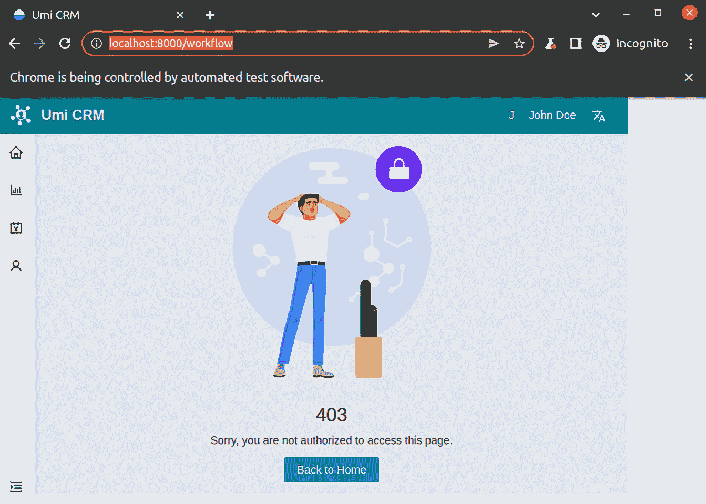
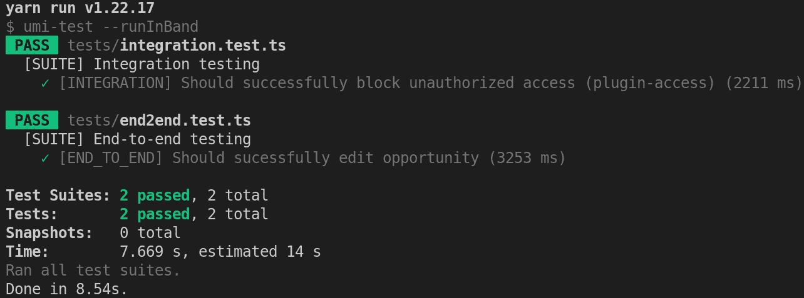

# 第六章：测试前端应用程序

软件测试是软件开发的一个关键部分。通过实施精心设计的测试，我们可以预防错误并确保新功能不会引入错误。

在本章中，你将通过学习如何设计集成和端到端测试并将它们应用于开发过程来理解软件测试。之后，你将学习如何使用**Jest**（一个专注于简单性且与 React 配合良好的 JavaScript 测试框架）编写测试。你还将学习如何通过使用**Puppeteer**和**Headless Chrome**模拟用户操作来测试接口。

在本章中，我们将涵盖以下主要内容：

+   理解软件测试

+   使用 Jest 编写测试

+   使用 Puppeteer 测试接口

到本章结束时，你将学会如何设计集成和端到端测试，以及如何将它们应用于提高软件质量。你将学会如何使用 Jest 编写测试，Jest 是一个用于 JavaScript 项目的编写和运行测试的工具。你还将了解如何使用 Puppeteer 和 Headless Chrome 测试接口。

# 技术要求

要完成本章的练习，你只需要一台安装了任何操作系统（我推荐 Ubuntu 20.04 或更高版本）的计算机，以及安装在*第一章*、“环境设置和 UmiJS 简介”的软件（Visual Studio Code、Node.js 和 Yarn）。

你可以在以下链接提供的 GitHub 仓库的`Chapter06`文件夹中找到完整的项目：[`github.com/PacktPublishing/Enterprise-React-Development-with-UmiJs`](https://github.com/PacktPublishing/Enterprise-React-Development-with-UmiJs)

# 理解软件测试

在本节中，我们将讨论软件测试以及如何设计**集成**和**端到端测试**以确保你的应用程序按预期工作。

软件测试有众多类型，我们可以将其分为两大类：功能测试，确保功能需求和规范得到满足，以及非功能测试，专注于测试系统的行为和性能。在本节中，我们将讨论两种类型的功能测试：

+   **集成测试**：我们编写此类测试以确保不同的软件组件能够集成并正确工作，以提供指定的功能。

+   **端到端测试**：我们编写此类测试以覆盖完整的用户流程，确保功能满足用户期望。

重要的是要提到，编写测试代码只是实施软件测试的一个任务，如果没有坚实的功能规范和测试计划，那么这并不值得。

让我们开始讨论集成测试。

## 理解集成测试

我们执行集成测试以确保应用中存在的不同模块能够正确工作并通信以提供所需的功能。

让我们以我们的 CRM 应用程序为例。我们通过配置 Umi 本地化插件实现了显示不同语言的应用程序的功能。我们可以执行一个集成测试来确保`SelectLang`组件与`plugin-locale`正确工作，以显示所选语言的应用程序。在这种情况下，我们需要遵循以下步骤：

1.  将鼠标悬停在右上角的用户名上。

1.  从下拉菜单中选择**英语**。

1.  检查页面是否为英语。

我们可以根据测试策略遵循测试计划手动执行集成测试。然而，更好的选择是使用自动化测试工具编写我们的测试，以便在必要时以更高的敏捷性重复测试。

我们将在接下来的章节中学习如何使用自动化测试工具来开发集成和端到端测试。接下来，让我们更深入地了解端到端测试。

## 理解端到端测试

如其名所示，端到端测试涵盖了从开始到结束执行任务的整个用户旅程。我们需要执行实际用户必须执行的同一步骤，验证系统的完整性和与要求的对齐。

例如，假设我们的 CRM 应用程序有一个在帖子页面打印报告的功能。为了验证这个场景，端到端测试应该包括以下步骤：

1.  登录应用程序。

1.  点击报告菜单。

1.  等待图表加载并验证它们是否正确渲染。

1.  点击打印按钮。

1.  打开生成的 PDF 并验证报告。

如您所见，这种类型的测试涉及多个步骤，具体取决于系统的复杂性和任务的性质。我们可以根据测试计划手动执行端到端测试，或者使用自动化测试工具自动化此过程。

端到端测试通常需要强大的测试工具，并由**质量保证**（**QA**）专业人员编写。然而，我们可以在开发阶段编写端到端测试。这种方法将减少 QA 阶段的问题，并加速问题的修复。

在接下来的章节中，我们将学习如何使用 Puppeteer 编写和自动化端到端测试。

软件测试是一个广泛的主题。如果您想了解更多关于这个主题的信息，我推荐阅读[`www.ibm.com/topics/software-testing`](https://www.ibm.com/topics/software-testing)上的文章。

在本节中，我们通过学习如何设计集成和端到端测试来讨论软件测试。接下来，您将学习如何在 JavaScript 项目中使用 Jest 编写测试。

# 使用 Jest 编写测试

在本节中，您将学习如何在 JavaScript 项目中使用**Jest 框架**编写测试。

Jest 是一个针对 JavaScript 项目的快速且可靠的测试框架，注重简洁性。它与 Babel、TypeScript、Node、React、Angular、Vue 和其他工具兼容。

安装后，我们可以开始使用 Jest 而无需任何额外配置。在我们的例子中，我们甚至不需要安装 Jest，因为 Umi 已经通过 `umi-test` 包提供了 Jest。

考虑以下使用 Jest 编写的端到端测试，以测试登录流程：

```js
it('[END_TO_END] Should sucessfully login', async () => {
  const page = await context.newPage();
  await page.goto('http://localhost:8000');
  await page.waitForNavigation();
  await page.type('#username', 'john@doe.com');
  await page.type('#password', 'user');
  await page.click('#loginbtn');
  const loggedUser = await page.waitForSelector('#loggeduser');
  expect(loggedUser).toBeTruthy();
});
```

在这个测试中，所有指令都写在 `it` 方法内部。如果您愿意，也可以使用 `test` 方法。这两种方法之间的区别只是语义上的。

在这里，`it` 方法接收两个参数：第一个参数是测试名称，第二个是一个执行测试指令的异步函数。

注意查看页面上的 `expect` 方法与 `toBeTruthy` `loggeduser` ID 的组合。

我们使用匹配器来测试值与不同条件的一致性。您可以在 [`jestjs.io/docs/expect`](https://jestjs.io/docs/expect) 找到可用的所有 Jest 匹配器的完整列表。

接下来，您将看到如何通过创建测试套件来组织相关测试。

## 理解 `describe` 方法

当编写多个相关测试时，您应该使用 `describe` 方法在测试套件中组织它们，如下例所示：

```js
describe('Math test suite', () => {
  it('should return 2', () => {
    const value = 1 + 1;
    expect(value).toBe(2);
  });
  it('should return 25', () => {
    const value = 5 * 5;
    expect(value).toBe(25);
  });
});
```

在这个例子中，我们使用了 `describe` 方法为与数学问题相关的两个测试创建了一个组。

让我们看看我们如何在整个测试套件或每个测试运行之前和之后执行一些设置工作。

## 在测试前后执行指令

有时，在运行测试之前，您可能需要进行一些设置，例如初始化数据库连接或生成模拟数据。您可以通过在 `beforeAll` 方法中定义指令来在所有测试运行之前执行，或者通过在 `beforeEach` 方法中定义指令来在每个测试运行之前执行。考虑以下示例：

```js
describe('Product test suite', () => {
  let connection: DBConnection;
  let product: Product;
  beforeAll(async () => {
    connection = await database.connect();
  });
  beforeEach(async () => {
    product = connection.query(query);
  });
  it('should be greater than 200', async () => {
    expect(product.units).toBeGreaterThan(200);
  });
  it('should be true', async () => {
    expect(product.active).toBeTruthy();
  });
});
```

在这个例子中，在所有测试运行之前，我们打开了数据库连接，在每个测试运行之前，我们使用该连接查询数据库中的产品。

此外，在这个例子中，我们需要在运行测试套件后关闭数据库连接。我们可以通过添加 `afterAll` 方法来实现，如下一个示例所示：

```js
afterAll(() => connection.close());
```

与 `afterAll` 方法类似，您可以使用 `afterEach` 方法在每个测试运行后执行指令。

在本节中，您学习了如何使用 Jest 框架编写测试。您学习了如何创建测试套件以及在测试运行前后执行指令。

接下来，让我们了解 Puppeteer 并为我们的应用程序编写集成和端到端测试。

# 使用 Puppeteer 测试接口

在本节中，您将学习如何使用 **Puppeteer** 和 **无头 Chrome 浏览器** 编写集成和端到端测试。

Puppeteer 是一个 Node 库，它通过 DevTools 协议（或 Firefox 的远程协议）控制 Chrome、Chromium 或 Firefox 浏览器，这使得它成为在测试期间模拟真实场景的绝佳工具。

当我们启动一个新的浏览器实例时，Puppeteer 将默认使用 **Chrome 的无头模式**。Chrome 的无头模式仅包括浏览器引擎，没有用户界面。Puppeteer 使用 Chrome DevTools 协议来控制浏览器。

使用 Puppeteer，我们可以对页面进行截图，通过模拟多种移动设备（如平板电脑和智能手机）来测试响应性，等等。

你可以在 [`developers.google.com/web/tools/puppeteer`](https://developers.google.com/web/tools/puppeteer) 的文档页面了解更多关于 Puppeteer 的信息。

我们将编写一个集成测试和一个端到端测试来展示 Puppeteer 和 Jest 的使用。

## 测试访问和布局插件

让我们从运行以下命令来安装 Puppeteer 开始：

```js
yarn add -D puppeteer
```

Puppeteer 的配置与 Jest 一样简单。通过运行此命令，Puppeteer 将安装最新版本的 Chromium 浏览器，然后我们可以开始使用它。

现在，按照以下步骤创建集成测试：

1.  在项目的根目录下创建一个名为 `tests` 的新文件夹。

1.  在 `tests` 文件夹中，创建一个名为 `integration.test.ts` 的新文件。Jest 将执行所有名称包含 `.test.ts` 的文件。

1.  在 `integration.test.ts` 文件中，创建一个测试套件，如下所示：

    ```js
    import puppeteer, { Browser, BrowserContext, Page } from 'puppeteer';
    describe('[SUITE] Integration testing', () => {
      let context: BrowserContext;
      let browser: Browser;
      beforeAll(async () => {
        browser = await puppeteer.launch();
      });
      beforeEach(async () => {
        context = 
          await browser.createIncognitoBrowserContext();
      });
      afterEach(() => context.close());
      afterAll(() => browser.close());
    });
    ```

在这里，在所有测试运行之前，我们启动 Puppeteer 并将实例存储在 `browser` 变量中。默认情况下，Puppeteer 将以无头模式启动 Chromium。不过，你可以通过设置 `headless` 选项来启动完整浏览器版本，如下所示：

```js
browser = await puppeteer.launch({ headless: false });
```

通过将 `headless` 选项设置为 `false`，你可以看到 Puppeteer 打开窗口并执行测试。



图 6.1 – 在完整浏览器版本中运行集成测试

在每次测试运行之前，我们通过打开一个隐身窗口来创建一个匿名浏览器上下文，以在隔离环境中执行它们，并将隐身窗口存储在 `context` 变量中。在每次测试运行之后，我们关闭隐身窗口，在整个测试套件运行之后，我们关闭浏览器。

1.  你会注意到 TypeScript 找不到 Jest 类型。我们必须通过运行以下命令来安装声明文件：

    ```js
    yarn add -D @types/jest
    ```

现在，让我们创建一个集成测试来确保 Umi 访问插件能够正确地与布局插件协同工作，在未经授权的用户尝试访问受限制的页面时显示 403 错误页面。

1.  将以下测试添加到 `tests` 文件夹下的 `integration.test.ts` 文件中的测试套件：

    ```js
    it('[INTEGRATION] Should successfully block unauthorized access (plugin-access)', async () => {
      const page = await context.newPage();
      page.setDefaultTimeout(10000);
      await login(page);
      await page.goto('http://localhost:8000/workflow');
      const message = 
        await page.waitForSelector('#unauthorized');
      const value = await page.evaluate((el) => 
        el.textContent, message);
      expect(value).toBe('Sorry, you are not authorized to 
      access this page.');
    });
    ```

在这个测试中，在打开页面并将 `async` 操作的默认超时设置为 `10000` 毫秒之后，Puppeteer 执行以下步骤：

+   以 John Doe 的身份登录应用程序

+   跳转到工作流程页面

+   选择具有 `unauthorized` ID 的元素

+   评估元素内的文本消息并测试消息是否正确

注意，我们使用了 `waitForSelector` 方法来确保在选中元素时它已经被渲染。

1.  接下来，我们需要创建 `login` 函数。在 `describe` 方法之前添加 `login` 函数，如下所示：

    ```js
    async function login(page: Page) {
      await page.goto('http://localhost:8000');
      await page.waitForNavigation();
      await page.type('#username', 'john@doe.com');
      await page.type('#password', 'user');
      await page.click('#loginbtn');
    }
    ```

此函数将执行以约翰·多伊（John Doe）身份登录应用程序的步骤。我们可以在测试套件中的其他测试中重用 `login` 函数。注意我们使用了 `waitForNavigation` 方法来确保在执行步骤之前组件已渲染。

现在，我们需要将 `unauthorized` ID 添加到包含我们将验证的文本的元素中。

1.  打开位于 `src` 文件夹中的 `app.tsx` 文件，并修改布局 `unAccessible` 配置选项，如下所示：

    ```js
    unAccessible: (
      <Result
        status="403"
        title="403"
        subTitle={
          <span id="unauthorized">
            Sorry, you are not authorized to access this 
            page.
          </span>
        }
        extra={
          <Button type="primary" onClick={() => 
            history.push('/')}>
            Back to Home
          </Button>
        }
      />
    ),
    ```

我们将包含所需 `id` 属性的文本包裹在一个 `span` 标签中。

我们还需要将 `id` 属性添加到登录表单输入中。

1.  打开位于 `src/pages/Login/LoginForm` 下的 `index.tsx` 文件，并通过添加 `username` ID 来修改用户名输入，如下所示：

    ```js
    <Form.Item
      name="username"
      rules={[
        {
          required: true,
          message: formatMessage({ id: 'login.alert.username' }),
        },
      ]}
    >
      <Input
        id="username"
        prefix={<UserOutlined className="site-form-item-icon" 
          />}
        placeholder={formatMessage({ id: 'login.placeholder.
          username' })}
      />
    </Form.Item>
    ```

1.  接下来，通过添加 `password` ID 来修改密码输入，如下所示：

    ```js
    <Form.Item
      name="password"
      rules={[
        {
          required: true,
          message: formatMessage({ id: 'login.alert.password' 
            }),
        },
      ]}
    >
      <Input
        id="password"
        prefix={<LockOutlined className="site-form-item-icon" 
          />}
        type="password"
        placeholder={formatMessage({ 
          id: 'login.placeholder.password' })}
      />
    </Form.Item>
    ```

1.  最后，将 `loginbtn` ID 添加到登录按钮中，如下所示：

    ```js
    <Form.Item>
      <Button
        id="loginbtn"
        type="primary"
        htmlType="submit"
        className="login-form-button"
      >
        <FormattedMessage id="login.form.login" />
      </Button>
      <FormattedMessage id="login.form.or" />{' '}
      <a href="">
        <FormattedMessage id="login.form.register" />!
      </a>
    </Form.Item>
    ```

您可以通过运行 `yarn test` 命令来执行测试。结果应如下截图所示：

![Figure 6.2 – Integration test result]

![img/Figure_6.02_B18503.jpg]

图 6.2 – 集成测试结果

现在，让我们创建一个端到端测试来确保编辑机会的功能按预期工作。

## 测试机会编辑功能

按照以下步骤创建端到端测试，以确保在机会页面上编辑功能按预期工作：

1.  我们将在 `tests` 文件夹中创建一个名为 `end2end.test.ts` 的单独文件，并创建 `describe` 方法，如下所示：

    ```js
    import puppeteer, { Browser, BrowserContext, Page } from 'puppeteer';
    describe('[SUITE] End-to-end testing', () => {
      let context: BrowserContext;
      let browser: Browser;
      beforeAll(async () => {
        browser = await puppeteer.launch();
      });
      beforeEach(async () => {
        context = 
          await browser.createIncognitoBrowserContext();
      });
      afterEach(() => context.close());
      afterAll(() => browser.close());
    });
    ```

1.  接下来，将端到端测试添加到 `describe` 方法中，如下所示：

    ```js
    it('[END_TO_END] Should sucessfully edit opportunity', async () => {
      const page = await context.newPage();
      page.setDefaultTimeout(10000);
      await page.goto('http://localhost:8000');
      await page.waitForNavigation();
    });
    ```

我们已经为 Puppeteer 编写了打开新页面并设置默认超时为 `1000` 的说明，转到登录页面，并等待页面加载。

1.  添加登录应用程序的说明，如下所示：

    ```js
    await page.type('#username', 'john@doe.com');
    await page.type('#password', 'user');
    await page.click('#loginbtn');
    await page.goto('http://localhost:8000/opportunities');
    ```

Puppeteer 将在具有 `username` ID 的输入中输入用户的电子邮件地址，并在具有 `password` ID 的输入中输入密码，然后点击具有 `loginbtn` ID 的按钮。最后，Puppeteer 将导航到机会页面。

1.  添加编辑机会主题的步骤，如下所示：

    ```js
    await(await page.waitForSelector('#editopportunity')).click();
    const topicInput = await page.$(
    'table > tbody > tr > td > div > div > div > div > span 
      > input',
    );
    await topicInput.click({ clickCount: 3 });
    await topicInput.type('Opportunity topic');
    await(await page.waitForSelector('#save')).click();
    ```

Puppeteer 将等待具有 id 等于 `editopportunity` 的元素渲染，然后点击它并通过三击输入元素选择文本。接下来，Puppeteer 将在主题输入中输入新文本并保存机会。

1.  现在，让我们添加评估结果的步骤，如下所示：

    ```js
    const topicCell = await page.waitForSelector(
      'tr[data-row-key="0"] > .ant-table-cell',
    );
    const value = await page.evaluate((el) => el.textContent, 
      topicCell);
    expect(value).toBe('Opportunity topic');
    ```

Puppeteer 将选择机会表的第一行的主题单元格并评估其文本内容。接下来，Jest 将测试该值以确保其正确性。

1.  最后，让我们将 `id` 属性添加到测试期间需要查找的元素中。在 `columns.tsx` 文件中，在 `pages/Opportunities` 文件夹下，将 `id` 属性添加到编辑选项锚点中，如下所示：

    ```js
    {
      title: <FormattedMessage id="table.options" />,
      valueType: 'option',
      hideInSetting: true,
      hideInDescriptions: true,
      render: (_, record, __, action) => [
        <a
          key="editable"
          id="editopportunity"
          onClick={() => {
          action?.startEditable(record.id as number);
        }}
        >
        <FormattedMessage id="table.edit" />
      </a>,
      <a key="more" onClick={() => history.push(`/
        opportunity/${record.id}`)}>
        <FormattedMessage id="table.more" />
      </a>,
      ],
    },
    ```

1.  在同一文件夹中的`index.ts`文件中，将`saveText`属性添加到`ProTable`组件的可编辑属性中，如下所示：

    ```js
    editable={{
      type: 'multiple',
      deletePopconfirmMessage: <FormattedMessage 
        id="table.confirm" />,
      saveText: <span id="save">save</span>,
      deleteText: <FormattedMessage id="table.disable" />,
      onDelete: async (key) => disable(key as string),
      onSave: async (_, record) => update(record),
    }}
    ```

在执行测试之前，让我们将`--runInBand`标志添加到`package.json`文件中的`umi-test`命令中，如下所示：

```js
"test": "umi-test --runInBand",
```

此标志将防止这两个测试之间的竞争条件，因为我们正在使用模拟 API 来模拟后端。

现在，你可以通过运行`yarn test`命令来执行测试。结果应该如下所示：



Figure 6.3 – End-to-end test result

在本节中，你学习了如何使用 Puppeteer 编写集成测试和端到端测试。为了演示如何使用 Puppeteer 与 Jest 结合，我们创建了一个集成测试来确保 Umi 本地化插件与布局插件正确协同工作以渲染 403 错误页面。我们还创建了一个端到端测试来确保编辑机会的功能按预期工作。

# 摘要

在本章中，我们通过学习如何设计集成和端到端测试来讨论软件测试。你学习了如何在 React 项目中使用 Jest 框架编写测试。你看到了如何使用`describe`和`test`（或`it`）方法来编写和组织相关测试。你还学习了如何在测试运行前后使用`beforeAll`、`beforeEach`、`afterAll`和`afterEach`方法执行指令。

然后，你学习了如何通过模拟用户界面上的用户交互来使用 Puppeteer 和 Headless Chrome 编写测试。为了演示如何使用 Puppeteer 与 Jest 结合，我们创建了一个集成测试来确保 Umi 本地化插件与布局插件正确协同工作，并创建了一个端到端测试来确保编辑机会的功能按预期工作。

在下一章中，我们将学习如何编译和部署我们的应用程序到在线服务。
