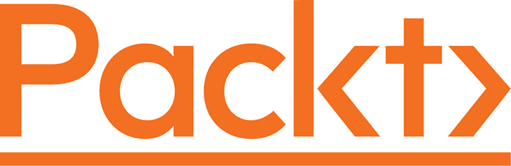

[Packt.com](http://Packt.com)

订阅我们的在线数字图书馆，全面访问超过 7,000 本书籍和视频，以及行业领先的工具，帮助你规划个人发展并推进职业生涯。更多信息，请访问我们的网站。

# 为什么订阅？

+   使用来自超过 4,000 位行业专业人士的实用电子书和视频，节省学习时间，多花时间编码

+   通过为你量身定制的 Skill Plans 提高学习效果

+   每月免费获得一本电子书或视频

+   完全可搜索，便于快速访问关键信息

+   复制粘贴、打印和收藏内容

你知道 Packt 为每本书都提供电子书版本，包括 PDF 和 ePub 文件吗？你可以在[packt.com](http://packt.com)升级到电子书版本，作为印刷书客户，你有权获得电子书副本的折扣。如需了解更多详情，请联系我们`customercare@packtpub.com`。

在[www.packt.com](http://www.packt.com)，你还可以阅读一系列免费的技术文章，注册各种免费通讯，并享受 Packt 书籍和电子书的独家折扣和优惠。

# 你可能还会喜欢的其他书籍

如果你喜欢这本书，你可能对 Packt 的其他书籍也感兴趣：

**使用 GraphQL 和 React 的全栈 Web 开发 – 第二版**

西班牙·格雷贝

ISBN: 978-1-80107-788-0

+   通过实现模型和模式使用 Apollo 和 Sequelize 构建 GraphQL API

+   设置 Apollo 客户端并使用 React 构建前端组件

+   编写可重用的 React 组件并使用 React Hooks

+   使用 GraphQL 验证和查询用户数据

+   使用 Mocha 为你的全栈应用程序编写测试用例

+   使用 Docker 和 CircleCI 将你的应用程序部署到 AWS

**使用 React Hooks 的微状态管理**

大岛耕作

ISBN: 978-1-80181-237-5

+   理解微状态管理以及如何处理全局状态

+   使用微状态管理和 React Hooks 构建库

+   发现使用 React Hooks 的微方法是如何变得容易的

+   理解组件状态和模块状态之间的区别

+   探索实现全局状态的几种方法

+   通过具体的示例和库如 Zustand、Jotai 和 Valtio 熟练掌握

# Packt 正在寻找像你这样的作者

如果你对成为 Packt 的作者感兴趣，请访问[authors.packtpub.com](http://authors.packtpub.com)并今天申请。我们已与成千上万的开发者和技术专业人士合作，就像你一样，帮助他们将见解分享给全球技术社区。你可以提交一般申请，申请我们正在招募作者的特定热门话题，或者提交你自己的想法。

# 分享你的想法

你好，

我是 Douglas Alves Venancio，著有《使用 UmiJS 进行企业级 React 开发》。我真心希望您喜欢阅读这本书，并觉得它对提高您在 UmiJS 中的生产力和效率有所帮助。

如果您能在 Amazon 上留下对《使用 UmiJS 进行企业级 React 开发》的评价，分享您的想法，这将对我（以及其他潜在读者！）非常有帮助。

前往以下链接留下您的评价：

[`packt.link/r/1803238968`](https://packt.link/r/1803238968)

您的评价将帮助我了解这本书哪些地方做得好，以及未来版本可以改进的地方，所以您的评价真的非常宝贵。

祝好，

Douglas Alves Venancio

