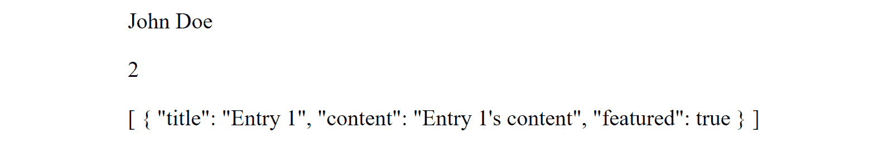
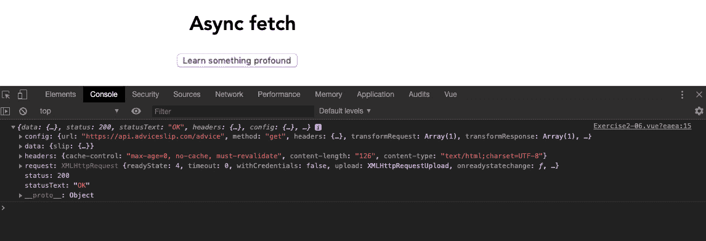
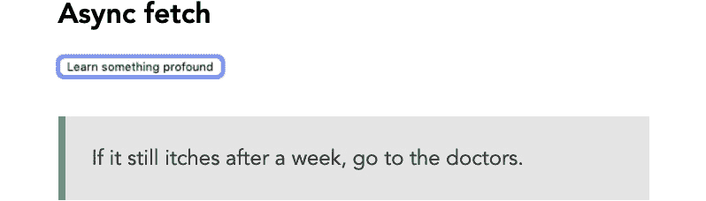
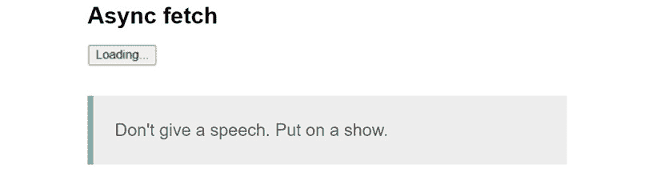
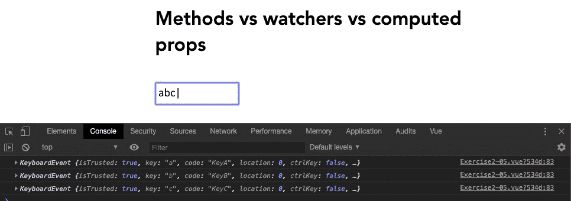
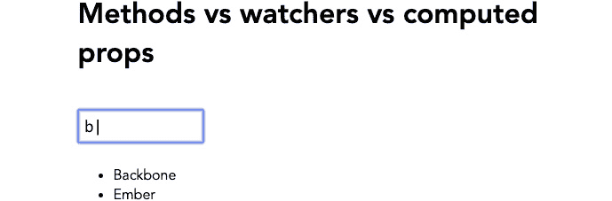
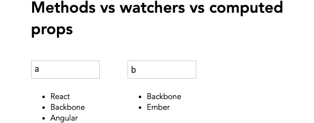
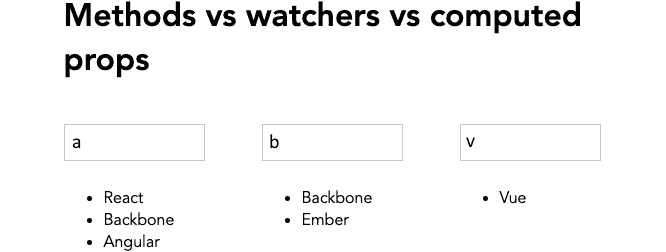

# 2

# 与数据一起工作

在上一章中，您学习了 Vue API 的基本知识以及如何与单文件 Vue 组件一起工作。在这些基础之上，本章进一步探讨了在 Vue 组件中控制数据的不同方法。

您将学习如何通过计算属性利用 Vue 强大的数据响应性和缓存系统，以及如何设置高级监视器来观察组件的数据变化。您还将学习如何利用异步方法获取和处理 Vue 组件的数据。到本章结束时，您将能够监视、管理和操作 Vue.js 组件中的各种来源的数据。

因此，在本章中，我们将涵盖以下主题：

+   理解计算属性

+   理解计算属性设置器

+   探索监视器

+   监视嵌套属性

+   探索异步方法和数据获取

+   比较方法、监视器和计算属性

# 技术要求

在本章中，您需要按照*第一章*中“开始您的第一个 Vue 项目”的说明设置一个基本的 Vue 项目。您可以通过创建一个单文件 Vue 组件来轻松练习提到的示例和概念。

您可以在此处找到本章的源代码：[`github.com/PacktPublishing/Frontend-Development-Projects-with-Vue.js-3/tree/v2-edition/Chapter02`](https://github.com/PacktPublishing/Frontend-Development-Projects-with-Vue.js-3/tree/v2-edition/Chapter02)。

# 理解计算属性

**计算属性**是独特的数据类型，只有当用于属性的源数据更新时，它们才会响应式地更新。通过将数据属性定义为计算属性，我们可以执行以下操作：

+   在原始数据属性上应用自定义逻辑以计算计算属性的值

+   跟踪原始数据属性的更改以计算计算属性的更新值

+   在 Vue 组件的任何地方重用计算属性作为本地数据

默认情况下，Vue 引擎自动缓存计算属性，这使得它们在更新 UI 方面比使用`data`返回值的属性或使用 Vue 组件的方法更高效。

计算属性的语法类似于编写一个带有返回值的组件方法，嵌套在 Vue 组件的计算属性下：

```js
export default {
  computed: {
    yourComputedProperty() {
      /* need to have return value */
    }
  }
}
```

在计算属性的逻辑中，您可以使用`this`实例访问任何组件的数据属性、方法或其他计算属性，`this`实例是对 Vue 组件实例本身的引用。使用`this`实例的示例如下：

```js
export default {
  data() {
    return {
      yourData: "your data"
    }
  },
  computed: {
    yourComputedProperty() {
      return `${this.yourData}-computed`;
    }
  }
}
```

让我们看看一些应该考虑使用计算属性的示例：

+   `input` 字段，它附加到 `name` 数据属性上，而 `error` 是一个计算属性。如果 `name` 包含一个 `falsy` 值（这意味着 `name` 是一个空字符串、`0`、`undefined`、`null` 或 `false`），则 `error` 将被分配一个值为 `"Name is required"` 的值。否则，它将为空。组件随后根据 `error` 属性的值渲染相应的值：

    ```js
    <template>
    ```

    ```js
      <input v-model="name">
    ```

    ```js
      <div>
    ```

    ```js
        <span>{{ error }}</span>
    ```

    ```js
      </div>
    ```

    ```js
    </template>
    ```

    ```js
    <script>
    ```

    ```js
    export default {
    ```

    ```js
      data() {
    ```

    ```js
        return {
    ```

    ```js
          name: '',
    ```

    ```js
        }
    ```

    ```js
      },
    ```

    ```js
      computed: {
    ```

    ```js
        error() {
    ```

    ```js
          return this.name ? '' : 'Name is required'
    ```

    ```js
        }
    ```

    ```js
      }
    ```

    ```js
    }
    ```

    ```js
    </script>
    ```

当用户修改 `name` 值时，错误计算属性会自动更新自己。因此，当 `name` 为空时，输出将如下所示：


图 2.1 – 错误计算属性的输出

当 `name` 有效时，输出将仅显示填充的输入字段：


图 2.2 – 当 name 包含有效值时的错误输出

+   `title` 和 `surname` – 合并成一个计算字符串，`formalName`，并使用 `template` 渲染其值：

    ```js
    <template>
    ```

    ```js
        <div>{{ formalName }}</div>
    ```

    ```js
    </template>
    ```

    ```js
    <script>
    ```

    ```js
        export default {
    ```

    ```js
            data() {
    ```

    ```js
                return {
    ```

    ```js
                    title: 'Mr.',
    ```

    ```js
                    surname: 'Smith'
    ```

    ```js
                }
    ```

    ```js
            },
    ```

    ```js
            computed: {
    ```

    ```js
                formalName() {
    ```

    ```js
                    return `${this.title}
    ```

    ```js
                      ${this.surname}`;
    ```

    ```js
                }
    ```

    ```js
            }
    ```

    ```js
        }
    ```

    ```js
    </script>
    ```

这将生成以下输出：

```js
Mr. Smith
```

+   **计算和显示复杂信息**：有时需要执行额外的计算或从一个大型的数据对象源中提取特定的信息。计算属性帮助我们实现这一目标，同时保持我们的代码可读。

取一个大的数据对象，例如 `post`。此数据对象有一个嵌套的 `fields` 属性，其中包含几个附加信息对象，例如 `author` 的全名和一个 `entries` 对象数组。`entries` 中的每个条目都包含进一步的信息，例如 `title`、`content` 和一个表示条目是否应被特色显示的 `feature` 标志：

```js
data() {
  return {
    post: {
      fields: {
        author: {
          firstName: 'John',
          lastName: 'Doe'
        },
        entries: [{
          title: "Entry 1",
          content: "Entry 1's content",
          featured: true
        },
        {
          title: "Entry 2",
          content: "Entry 2's content",
          featured: false
        }]
      }
    }
  }
},
```

在此场景中，你需要执行以下步骤：

1.  显示帖子的 `author` 的全名。

1.  计算并显示包含的 `entries` 的总数。

1.  显示具有开启 `feature` 标志的 `entries` 列表（`feature: true`）。

1.  通过使用计算属性，我们可以将之前的 `post` 对象解耦成几个计算数据属性，同时保持原始的 `post` 对象不变，如下所示：

    +   `fullName` 用于合并 `post.fields.author` 的 `firstName` 和 `lastName`：

        ```js
        fullName() {
        ```

        ```js
         const { firstName, lastName } =
        ```

        ```js
           this.post.fields.author;
        ```

        ```js
         return `${firstName} ${lastName}`
        ```

        ```js
        },
        ```

    +   `totalEntries` 包含 `post.fields.entries` 数组的长度：

        ```js
        totalEntries () {
        ```

        ```js
          return this.post.fields.entries.length
        ```

        ```js
        },
        ```

    +   `featuredEntries` 包含基于每个条目的 `feature` 属性的 `post.fields.entries` 过滤列表，通过使用内置的 `filter` 数组方法：

        ```js
        featuredEntries() {
        ```

        ```js
          const { entries } = this.post.fields;
        ```

        ```js
          return entries.filter(entry => !!entry.featured)
        ```

        ```js
        }
        ```

然后你使用简化和语义化的计算属性在你的组件模板中渲染信息。完整的代码如下所示：

```js
<template>
  <div>
    <p>{{ fullName }}</p>
    <p>{{ totalEntries }}</p>
    <p>{{ featuredEntries }}</p>
  </div>
</template>
<script>
  export default {
    data() {
      return {
        post: {
          fields: {
            author: {
              firstName: 'John',
              lastName: 'Doe'
            },
            entries: [{
              title: "Entry 1",
              content: "Entry 1's content",
              featured: true
            },
            {
              title: "Entry 2",
              content: "Entry 2's content",
              featured: false
            }]
          }
        }
      }
    },
    computed: {
      fullName() {
        const { firstName, lastName } =
          this.post.fields.author;
        return `${firstName} ${lastName}`
      },
      totalEntries () {
        return this.post.fields.entries.length
      },
      featuredEntries() {
        const { entries } = this.post.fields;
        return entries.filter(entry => !!entry.featured)
      }
    }
</script>
```

这将生成以下输出：



图 2.3 – 计算名称输出

计算属性对于创建高性能组件的 Vue 开发者来说非常有价值。在下一个练习中，我们将探讨如何在 Vue 组件中使用它们。

## 练习 2.01 – 将计算数据实现到 Vue 组件中

在这个练习中，你将使用计算属性来帮助你减少在 Vue 模板中需要编写的代码量，通过简洁地输出基本数据。

要访问此练习的代码，请参阅[`github.com/PacktPublishing/Frontend-Development-Projects-with-Vue.js-3/tree/v2-edition/Chapter02/Exercise2.01`](https://github.com/PacktPublishing/Frontend-Development-Projects-with-Vue.js-3/tree/v2-edition/Chapter02/Exercise2.01)。

我们将实现一个组件，该组件接收用户的姓氏和名字输入，并相应地显示用户的完整姓名，通过以下步骤进行：

1.  使用由`npm init vue@3`生成的应用程序作为起点，或者在你的代码仓库的根目录下，使用以下命令导航到`Chapter02/Exercise2.01`文件夹：

    ```js
    > cd Chapter02/Exercise2.01/
    ```

    ```js
    > yarn
    ```

1.  在项目目录中打开练习项目（在`code .`命令中），或者在你的首选**集成开发环境**（**IDE**）中打开。

1.  让我们在`./src/components/`文件夹中添加一个名为`Exercise2-01.vue`的新 Vue 组件：


图 2.4 – 组件目录层次结构

1.  打开`Exercise2-01.vue`，让我们为 Vue 组件创建代码块结构，如下所示：

    ```js
    <template>
    ```

    ```js
    </template>
    ```

    ```js
    <script>
    ```

    ```js
    export default {
    ```

    ```js
    }
    ```

    ```js
    </script>
    ```

1.  在`<template>`中，创建一个用于名字的`input`字段，并使用`v-model`将`data`属性`firstName`绑定到该字段：

    ```js
    <input v-model="firstName" placeholder="First name" />
    ```

1.  创建一个用于姓氏的第二个`input`字段，并使用`v-model`将`data`属性`lastName`绑定到该字段：

    ```js
    <input v-model="lastName" placeholder="Last name" />
    ```

1.  通过在`data()`函数中返回它们，将这些新的`v-model`数据属性包含在 Vue 实例中：

    ```js
    data() {
    ```

    ```js
        return {
    ```

    ```js
          firstName: '',
    ```

    ```js
          lastName: '',
    ```

    ```js
        }
    ```

    ```js
      },
    ```

1.  创建一个名为`fullName`的计算数据变量：

    ```js
    computed: {
    ```

    ```js
        fullName() {
    ```

    ```js
          return '${this.firstName} ${this.lastName}'
    ```

    ```js
        },
    ```

    ```js
      },
    ```

1.  在你的`input`字段下方，使用`h3`标签输出计算数据：

    ```js
    <h3 class="output">{{ fullName }}</h3>
    ```

1.  最后，使用以下命令运行应用程序：

    ```js
    yarn dev
    ```

1.  在浏览器中访问`http://localhost:3000`，并输入`John`作为名字，`Doe`作为姓氏，页面将生成以下输出：


图 2.5 – 计算数据的输出将显示姓氏和名字

本练习演示了如何在计算数据属性中使用从`v-model`接收的数据编写表达式，然后使用`fullName`计算属性将名字和姓氏合并成一个可重用的输出变量。

我们现在理解了计算属性的工作原理以及如何编写声明式、可重用和响应的计算属性。接下来，我们将探讨如何拦截计算属性的突变过程，并使用计算属性设置器功能添加额外的逻辑。

# 理解计算属性设置器

默认情况下，计算数据仅是获取器，这意味着它只会输出你表达式的结果。在一些实际场景中，当计算属性被修改时，你可能需要触发外部 API 或在项目的其他地方修改原始数据。执行此功能的函数称为**设置器**。

在计算属性中使用设置器允许你响应式地监听数据并触发一个包含从获取器返回的值的回调（设置器），这个值可以可选地用于设置器中。

但首先，让我们看看 JavaScript ES5 的获取器和设置器。从 ES5 开始，你可以使用内置的获取器和设置器来定义对象访问器，如下所示：

+   `get`用于将对象属性绑定到函数，每当该属性被查询时，该函数都会返回该属性的值，如下所示：

    ```js
    const obj  = {
    ```

    ```js
      get example() {
    ```

    ```js
        return 'Getter'
    ```

    ```js
      }
    ```

    ```js
    }
    ```

    ```js
    console.log(obj.example) //Getter
    ```

+   `set`用于将特定对象属性绑定到函数，每当该属性被修改时：

    ```js
    const obj  = {
    ```

    ```js
      set example(value) {
    ```

    ```js
        this.information.push(value)
    ```

    ```js
      },
    ```

    ```js
      information: []
    ```

    ```js
    }
    ```

    ```js
    obj.example = 'hello'
    ```

    ```js
    obj.example = 'world'
    ```

    ```js
    console.log(obj.information) //['hello', 'world']
    ```

基于这些功能，Vue.js 为我们提供了类似的功能，`get()`作为获取器，`set()`作为设置器，用于特定的计算属性：

```js
computed: {
  myComputedDataProp: {
    get() {}
    set(value) {}
  }
}
```

为了理解设置器和获取器是如何工作的，让我们执行以下步骤：

1.  定义`myComputedDataProp`返回的值，每当`myComputedDataProp`被查询时，为`this.count + 1`：

    ```js
    myComputedDataProp: {
    ```

    ```js
      get() {
    ```

    ```js
        return this.count + 1
    ```

    ```js
      }
    ```

    ```js
    },
    ```

1.  然后，每当`myComputedDataProp`被修改时，使用设置器来更新`count`数据属性到其新值，然后调用组件内的一个方法`callAnotherApi`，并使用这个新的`this.count`值：

    ```js
    myComputedDataProp: {
    ```

    ```js
      set(value) {
    ```

    ```js
        this.count = value - 1
    ```

    ```js
        this.callAnotherApi(this.count)
    ```

    ```js
    },
    ```

`count`和`callAnotherApi`分别是组件的局部数据和方法的名称。

完整的示例代码如下：

```js
data() {
  return {
    count: 0
  }
},
method: {
  callAnotherApi() { //do something }
},
computed: {
    myComputedDataProp: {
      get() {
        return this.count + 1
      },
      set(value) {
        this.count = value - 1
        this.callAnotherApi(this.count)
      },
    },
  },
}
```

在这里，计算属性`myComputedDataProp`将在你的 Vue 组件中输出`1`。

你将在以下练习中找到如何使用计算数据作为获取器和设置器的确切方法。

## 练习 2.02 – 使用计算设置器

在这个练习中，你将使用一个计算属性作为设置器和获取器，这两个属性在用户输入触发时都会输出表达式并设置数据。

完整的代码可以在[`github.com/PacktPublishing/Frontend-Development-Projects-with-Vue.js-3/tree/v2-edition/Chapter02/Exercise2.02`](https://github.com/PacktPublishing/Frontend-Development-Projects-with-Vue.js-3/tree/v2-edition/Chapter02/Exercise2.02)找到。

我们将实现一个组件，该组件包含一个`input`字段，用于接收用户输入的数字，计算输入的一半值，然后在 UI 上显示这两个值，通过以下步骤完成：

1.  使用通过`npm init vue@3`生成的应用程序作为起点，或者在代码仓库的根目录中，使用以下命令导航到`Chapter02/Exercise2.02`文件夹：

    ```js
    > cd Chapter02/Exercise2.02/
    ```

    ```js
    > yarn
    ```

1.  在你的 VS Code 中打开练习项目（在项目目录中使用`code .`命令），或者使用你喜欢的 IDE。

1.  让我们创建一个新的 Vue 组件`Exercise2-02`，通过将`Exercise2-02.vue`文件添加到`./src/components/`文件夹中：


图 2.6 – 组件目录层次结构

1.  打开`Exercise2-02.vue`，让我们为 Vue 组件创建以下代码块结构：

    ```js
    <template>
    ```

    ```js
    </template>
    ```

    ```js
    <script>
    ```

    ```js
    export default {
    ```

    ```js
    }
    ```

    ```js
    </script>
    ```

1.  创建一个`input`字段，其`v-model`值绑定到一个名为`incrementOne`的计算数据值，在 getter 中返回名为`count`的 Vue 数据变量的值，并在 setter 中设置`count`变量：

    ```js
    <template>
    ```

    ```js
      <div class="container">
    ```

    ```js
        <input type="number" v-model="incrementOne" />
    ```

    ```js
        <h3>Get input: {{ incrementOne }}</h3>
    ```

    ```js
      </div>
    ```

    ```js
    </template>
    ```

    ```js
    <script>
    ```

    ```js
    export default {
    ```

    ```js
      data() {
    ```

    ```js
        return {
    ```

    ```js
          count: -1,
    ```

    ```js
        }
    ```

    ```js
      },
    ```

    ```js
      computed: {
    ```

    ```js
        incrementOne: {
    ```

    ```js
          // getter
    ```

    ```js
          get() {
    ```

    ```js
            return this.count + 1
    ```

    ```js
          },
    ```

    ```js
          // setter
    ```

    ```js
          set(val) {
    ```

    ```js
            this.count = val - 1
    ```

    ```js
          },
    ```

    ```js
        },
    ```

    ```js
      },
    ```

    ```js
    }
    ```

    ```js
    </script>
    ```

上述代码的输出将如下所示：


图 2.7 – 计算 setter 和 getter 的第一步

1.  接下来，让我们再次使用 setter。我们将把新的`val`参数除以`2`，并将其保存到一个新的数据变量`divideByTwo`中：

    ```js
    <template>
    ```

    ```js
      <div class="container">
    ```

    ```js
        <input type="number" v-model="incrementOne" />
    ```

    ```js
        <h3>Get input: {{ incrementOne }}</h3>
    ```

    ```js
        <h5>Set division: {{ divideByTwo }}</h5>
    ```

    ```js
      </div>
    ```

    ```js
    </template>
    ```

    ```js
    <script>
    ```

    ```js
    export default {
    ```

    ```js
      data() {
    ```

    ```js
        return {
    ```

    ```js
          count: -1,
    ```

    ```js
          divideByTwo: 0,
    ```

    ```js
        }
    ```

    ```js
      },
    ```

    ```js
    //...
    ```

    ```js
    </script>
    ```

    ```js
    //...
    ```

1.  更新 setter 以将`val`除以`2`，并将这个新值绑定到`divideByTwo`变量：

    ```js
          set(val) {
    ```

    ```js
            this.count = val - 1
    ```

    ```js
            this.divideByTwo = val / 2
    ```

    ```js
          },
    ```

1.  最后，使用以下命令运行应用程序：

    ```js
    yarn dev
    ```

1.  在浏览器中访问`http://localhost:3000`，并键入输入`1000`，`divideByTwo`值的输出应该生成从`input`字段中输入的值的输出，如下所示：


图 2.8 – divideByTwo 值的输出

这个练习演示了我们可以如何使用计算数据通过将计算变量绑定到`v-model`来在我们的模板中反应性地获取和设置数据。在下一节中，我们将探讨我们可以如何使用观察者来积极监听组件数据或其属性的变化。

# 探索观察者

Vue `oldVal`和`newVal`。这可以帮助您在写入或绑定新值之前编写表达式来比较数据。观察者可以观察对象以及其他类型，如`string`、`number`和`array`类型。

在*第一章*《开始您的第一个 Vue 项目》中，我们介绍了在组件生命周期中特定时间运行的生存周期钩子。如果在一个观察者上设置了`immediate`键为`true`，那么当这个组件初始化时，它将在创建时运行这个观察者。您可以通过包含键和值`deep: true`（默认为`false`）来观察任何给定对象内的所有键。

为了清理您的观察者代码，您可以将一个`handler`参数分配给定义好的组件的方法，这在大型项目中被认为是最佳实践。

观察者补充了计算数据的用法，因为它们被动地观察值，不能用作正常的 Vue 数据变量，而计算数据必须始终返回一个值，并且可以被查询。记住*不要*使用箭头函数，如果您需要 Vue 上下文中的`this`。

以下示例演示了`immediate`和`deep`可选键；如果`myDataProperty`对象中的任何键发生变化，它将触发控制台日志：

```js
watch: {
    myDataProperty: {
        handler: function(newVal, oldVal) {
          console.log('myDataProperty changed:', newVal,
                       oldVal)
        },
        immediate: true,
        deep: true
    },
}
```

现在，让我们在观察者的帮助下设置一些新值。

## 练习 2.03 – 使用观察者设置新值

在这个练习中，您将使用观察者参数来观察数据属性的变化，然后使用此观察者通过方法设置变量。

您可以在[`github.com/PacktPublishing/Frontend-Development-Projects-with-Vue.js-3/tree/v2-edition/Chapter02/Exercise2.03`](https://github.com/PacktPublishing/Frontend-Development-Projects-with-Vue.js-3/tree/v2-edition/Chapter02/Exercise2.03)找到此练习的完整代码。

我们创建了一个 Vue 组件，用于显示折扣前后的商店观察者价格，并提供更新折扣价格的功能，按照以下说明进行操作：

1.  使用由`npm init vue@3`生成的应用程序作为起点，或者在代码仓库的根目录中，使用以下命令导航到`Chapter02/Exercise 2.03`文件夹：

    ```js
    > cd Chapter02/Exercise 2.03./
    ```

    ```js
    > yarn
    ```

1.  在您的 VS Code 中打开练习项目（在项目目录中使用`code .`命令），或使用您首选的 IDE。

1.  让我们创建一个新的 Vue 组件`Exercise2-03`，通过将`Exercise2-03.vue`文件添加到`./src/components/`文件夹中：


图 2.9 – 组件目录层次结构

1.  打开`Exercise2-03.vue`，让我们为 Vue 组件创建代码块结构，如下所示：

    ```js
    <template>
    ```

    ```js
    </template>
    ```

    ```js
    <script>
    ```

    ```js
    export default {
    ```

    ```js
    }
    ```

    ```js
    </script>
    ```

1.  通过添加`discount`和`oldDiscount`数据属性来设置文档：

    ```js
    <template>
    ```

    ```js
      <div class="container">
    ```

    ```js
        <h1>Shop Watcher</h1>
    ```

    ```js
        <div>
    ```

    ```js
          Black Friday sale
    ```

    ```js
          <strike>Was {{ oldDiscount }}%</strike>
    ```

    ```js
          <strong> Now {{ discount }}% OFF</strong>
    ```

    ```js
        </div>
    ```

    ```js
      </div>
    ```

    ```js
    </template>
    ```

    ```js
    <script>
    ```

    ```js
    export default {
    ```

    ```js
      data() {
    ```

    ```js
        return {
    ```

    ```js
          oldDiscount: 0,
    ```

    ```js
          discount: 5,
    ```

    ```js
        }
    ```

    ```js
      },
    ```

    ```js
    }
    ```

    ```js
    </script>
    ```

1.  我们想监听`discount`属性的变化。这可以通过将其添加到`watch`对象中，并手动将`oldDiscount`值更新为接收到的`oldValue`来实现：

    ```js
    watch: {
    ```

    ```js
        discount(newValue, oldValue) {
    ```

    ```js
          this.oldDiscount = oldValue
    ```

    ```js
        },
    ```

    ```js
      },
    ```

1.  现在，让我们添加一个名为`updateDiscount`的组件方法。在方法内部，将`oldDiscount`数据属性设置为`this.discount + 5`：

    ```js
    methods: {
    ```

    ```js
        updateDiscount() {
    ```

    ```js
          this.discount = this.discount + 5
    ```

    ```js
        },
    ```

    ```js
      },
    ```

1.  然后使用`@click`指令将此方法绑定到`button`上，以便在用户点击按钮时触发此方法，并相应地触发观察者：

    ```js
    <button @click="updateDiscount">Increase Discount!</button>
    ```

1.  添加一些 CSS 样式，使我们的组件看起来更美观：

    ```js
    <style scoped>
    ```

    ```js
    .container {
    ```

    ```js
      margin: 0 auto;
    ```

    ```js
      padding: 30px;
    ```

    ```js
      max-width: 600px;
    ```

    ```js
      font-family: 'Avenir', Helvetica, Arial, sans-serif;
    ```

    ```js
      margin: 0;
    ```

    ```js
    }
    ```

    ```js
    button {
    ```

    ```js
      display: inline-block;
    ```

    ```js
      background: rgb(235, 50, 50);
    ```

    ```js
      border-radius: 10px;
    ```

    ```js
      font-size: 14px;
    ```

    ```js
      color: white;
    ```

    ```js
      padding: 10px 20px;
    ```

    ```js
      text-decoration: none;
    ```

    ```js
    }
    ```

    ```js
    </style>
    ```

1.  最后，使用以下命令运行应用程序：

    ```js
    yarn dev
    ```

1.  在浏览器中访问`http://localhost:3000`时，前面命令的输出将如下所示：


图 2.10 – 商店观察者页面示例输出

在这个练习中，我们探讨了如何使用观察者来观察和动态操作数据，当数据发生变化时通过触发 Vue 组件中的其他方法。

接下来，我们将学习如何通过深度观察来主动观察数据对象中的特定嵌套属性。

# 观察嵌套属性

当使用 Vue.js 观察数据属性时，您可以观察对象嵌套键的变化，而不是观察对象本身的变化。

这通过将可选的`deep`属性设置为`true`来完成：

```js
data() {
  return {
      organization: {
        name: 'ABC',
        employees: [
            'Jack', 'Jill'
        ]
      }
  }
},
watch: {
    organization: {
      handler(v) {
        this.sendIntercomData()
      },
      deep: true,
      immediate: true,
    },
  },
```

此代码示例演示了如何观察`organization`数据对象内部的所有可用键的变化。如果`organization`中的`name`属性发生变化，`organization`观察者将触发。

如果你不需要观察对象内的每个键，通过指定 `<object>.<key>` 字符串语法来为特定键分配观察者会更高效。例如，你可能允许用户编辑他们的公司名称，并在该特定键的值被修改时触发 API 调用。

在以下示例中，观察者明确地观察了 `organization` 对象的 `name` 键：

```js
data() {
  return {
      organization: {
        name: 'ABC',
        employees: [
            'Jack', 'Jill'
        ]
      }
  }
},
watch: {
    'organization.name': {
      handler: function(v) {
        this.sendIntercomData()
      },
      immediate: true,
    },
  },
```

我们已经看到了深度观察是如何工作的。现在，让我们尝试下一个练习，并观察数据对象的嵌套属性。

## 练习 2.04 – 观察数据对象的嵌套属性

在这个练习中，你将使用观察者来观察对象内的键，当用户在 UI 中触发方法时，这些键会更新。

练习的完整代码可以在 [`github.com/PacktPublishing/Frontend-Development-Projects-with-Vue.js-3/tree/v2-edition/Chapter02/Exercise2.04`](https://github.com/PacktPublishing/Frontend-Development-Projects-with-Vue.js-3/tree/v2-edition/Chapter02/Exercise2.04) 找到。

按照说明创建一个组件，该组件显示产品的标签和价格，并动态修改折扣价格：

1.  使用由 `npm init vue@3` 生成的应用程序作为起点，或者在你的代码仓库的根目录中，使用以下命令导航到 `Chapter02/Exercise2.04` 文件夹：

    ```js
    > cd Chapter02/Exercise2.04/
    ```

    ```js
    > yarn
    ```

1.  在你的 VS Code 中打开练习项目（在项目目录中使用 `code .` 命令），或者使用你偏好的 IDE。

1.  让我们通过将 `Exercise2-04.vue` 文件添加到 `./src/components/` 文件夹中，创建一个新的 Vue 组件，命名为 `Exercise2-04`：


图 2.11 – 组件目录层次结构

1.  在 `Exercise2-04.vue` 中，让我们首先定义一个包含 `price` 和 `label` 的 `product` 对象，以及一个 `discount` 键。将这些值输出到模板中：

    ```js
    <template>
    ```

    ```js
      <div class="container">
    ```

    ```js
        <h1>Deep Watcher</h1>
    ```

    ```js
        <div>
    ```

    ```js
            <h4>{{ product.label }}</h4>
    ```

    ```js
            <h5>${{ product.price }} (${{ discount }}
    ```

    ```js
              Off)</h5>
    ```

    ```js
        </div>
    ```

    ```js
      </div>
    ```

    ```js
    </template>
    ```

    ```js
    <script>
    ```

    ```js
    export default {
    ```

    ```js
      data() {
    ```

    ```js
        return {
    ```

    ```js
          discount: 0,
    ```

    ```js
          product: {
    ```

    ```js
            price: 25,
    ```

    ```js
            label: 'Blue juice',
    ```

    ```js
          },
    ```

    ```js
        }
    ```

    ```js
      },
    ```

    ```js
    }
    ```

    ```js
    </script>
    ```

1.  为我们的组件添加 CSS 样式：

    ```js
    <style scoped>
    ```

    ```js
    .container {
    ```

    ```js
      margin: 0 auto;
    ```

    ```js
      padding: 30px;
    ```

    ```js
      max-width: 600px;
    ```

    ```js
      font-family: 'Avenir', Helvetica, sans-serif;
    ```

    ```js
      margin: 0;
    ```

    ```js
    }
    ```

    ```js
    button {
    ```

    ```js
      display: inline-block;
    ```

    ```js
      background: rgb(235, 50, 50);
    ```

    ```js
      border-radius: 10px;
    ```

    ```js
      font-size: 14px;
    ```

    ```js
      color: white;
    ```

    ```js
      padding: 10px 20px;
    ```

    ```js
      text-decoration: none;
    ```

    ```js
    }
    ```

    ```js
    </style>
    ```

1.  使用以下命令运行应用程序，并在浏览器中访问 `http://localhost:3000` 来查看渲染的组件。

    ```js
    yarn dev
    ```

1.  现在，让我们设置一个按钮，该按钮将修改产品的价格。我们通过添加一个 `button` 元素，并将其 `click` 事件绑定到一个 `updatePrice` 方法（该方法减少价格值）来实现这一点：

    ```js
    <template>
    ```

    ```js
    //…
    ```

    ```js
        <button @click="updatePrice">Reduce Price!</button>
    ```

    ```js
    //...
    ```

    ```js
    </template>
    ```

    ```js
    <script>
    ```

    ```js
    //...
    ```

    ```js
      methods: {
    ```

    ```js
        updatePrice() {
    ```

    ```js
          if (this.product.price < 1) return
    ```

    ```js
          this.product.price--
    ```

    ```js
        },
    ```

    ```js
      },
    ```

    ```js
    //...
    ```

    ```js
    </script>
    ```

当你点击按钮时，它应该减少价格，如以下截图所示：


图 2.12 – 显示 Blue juice 减少价格的屏幕

1.  到了嵌套观察者的时间了。我们将观察 `product` 对象的 `price` 属性，并增加 `discount` 数据属性：

    ```js
      watch: {
    ```

    ```js
        'product.price'() {
    ```

    ```js
          this.discount++
    ```

    ```js
        },
    ```

    ```js
      },
    ```

现在，当你减少 `price` 时，由于观察者的作用，`discount` 值将会上升：


图 2.13 – 显示增加折扣值的输出

在这个练习中，我们使用了观察者来观察对象内的一个键，然后使用或未使用观察者解析的可选参数设置新数据。

在下一节中，我们将探讨如何使用 Vue 组件的异步方法获取和处理数据。

# 探索异步方法和数据获取

JavaScript 中的异步函数由 `async` 语法定义，并返回一个 Promise。这些函数通过事件循环异步操作，使用隐式 Promise，这是一个可能在未来返回结果的对象。

作为 JavaScript 语言的一部分，你可以在 Vue 组件的方法中声明异步代码块，通过在方法前包含 `async` 关键字来实现。

你可以使用 Promise 链式方法，例如 `then()` 和 `catch()` 函数，或者在 Vue 方法中使用 ES6 的 `await` 语法，并相应地返回结果。

以下是一个示例，使用内置的 `fetch` API 在组件方法中作为异步函数使用 `async/await` 关键字获取数据：

```js
export default {
  methods: {
    async getAdvice() {
      const response =
        await fetch('https://api.adviceslip.com/advice')
      return response;
    },
  },
}
```

**Axios** 是一个流行的 JavaScript 库，它允许你使用 Node.js 发起外部数据请求。它具有广泛的浏览器支持，使其在制作 HTTP 或 API 请求时成为一个多才多艺的库。我们将在下一个练习中使用这个库。

## 练习 2.05 – 使用异步方法从 API 获取数据

在这个练习中，你将异步从外部 API 源获取数据，并使用计算属性在前端显示它。

你可以在 [`github.com/PacktPublishing/Frontend-Development-Projects-with-Vue.js-3/tree/v2-edition/Chapter02/Exercise2.05`](https://github.com/PacktPublishing/Frontend-Development-Projects-with-Vue.js-3/tree/v2-edition/Chapter02/Exercise2.05) 找到这个练习的完整代码。

我们将创建一个组件，按照以下说明从外部数据源获取引言并在 UI 上显示：

1.  使用由 `npm init vue@3` 生成的应用程序作为起点，或者在你的代码仓库的根目录中，使用以下命令导航到 `Chapter02/Exercise2.05` 文件夹：

    ```js
    > cd Chapter02/Exercise2.05/
    ```

    ```js
    > yarn
    ```

1.  在你的 VS Code 中打开练习项目（在项目目录中使用 `code .` 命令），或者使用你偏好的 IDE。

1.  让我们通过将 `Exercise2-05.vue` 文件添加到 `./src/components/` 文件夹来创建一个新的 Vue 组件 `Exercise2-05`：


图 2.14 – 组件目录层次结构

1.  在 `Exercise2-05.vue` 中，让我们首先将 `axios` 导入到我们的组件中，并创建一个名为 `fetchAdvice()` 的方法。我们使用 `axios` 调用 [`api.adviceslip.com/advice`](https://api.adviceslip.com/advice) 的响应，然后使用 `console.log` 输出结果。同时，让我们包括一个按钮，该按钮将 `click` 事件绑定到 `fetchAdvice()` 调用：

    ```js
    <template>
    ```

    ```js
      <div class="container">
    ```

    ```js
        <h1>Async fetch</h1>
    ```

    ```js
        <button @click="fetchAdvice()">Learn something
    ```

    ```js
          profound</button>
    ```

    ```js
      </div>
    ```

    ```js
    </template>
    ```

    ```js
    <script>
    ```

    ```js
    import axios from 'axios'
    ```

    ```js
    export default {
    ```

    ```js
      methods: {
    ```

    ```js
        async fetchAdvice() {
    ```

    ```js
          return   axios.get
    ```

    ```js
            ('https://api.adviceslip.com/advice').
    ```

    ```js
            then((response) => {
    ```

    ```js
            console.log(response)
    ```

    ```js
          })
    ```

    ```js
        },
    ```

    ```js
      },
    ```

    ```js
    }
    ```

    ```js
    </script>
    ```

    ```js
    <style scoped>
    ```

    ```js
    .container {
    ```

    ```js
      margin: 0 auto;
    ```

    ```js
      padding: 30px;
    ```

    ```js
      max-width: 600px;
    ```

    ```js
      font-family: 'Avenir', Helvetica, Arial, sans-serif;
    ```

    ```js
    }
    ```

    ```js
    blockquote {
    ```

    ```js
      position: relative;
    ```

    ```js
      width: 100%;
    ```

    ```js
      margin: 50px auto;
    ```

    ```js
      padding: 1.2em 30px 1.2em 30px;
    ```

    ```js
      background: #ededed;
    ```

    ```js
      border-left: 8px solid #78c0a8;
    ```

    ```js
      font-size: 24px;
    ```

    ```js
      color: #555555;
    ```

    ```js
      line-height: 1.6;
    ```

    ```js
    }
    ```

    ```js
    </style>
    ```

1.  最后，使用以下命令运行应用程序：

    ```js
    yarn dev
    ```

在浏览器中访问 `http://localhost:3000` 后，前面命令的输出将如下所示：



图 2.15 – 屏幕显示控制台中的一个非常大的对象

1.  我们只对 `response` 对象中的数据对象感兴趣。将此数据对象分配给名为 `response` 的 Vue 数据属性，我们可以重用它：

    ```js
    export default {
    ```

    ```js
      data() {
    ```

    ```js
        return {
    ```

    ```js
          axiosResponse: {},
    ```

    ```js
        }
    ```

    ```js
      },
    ```

    ```js
      methods: {
    ```

    ```js
        async fetchAdvice() {
    ```

    ```js
          return axios.get
    ```

    ```js
            ('https://api.adviceslip.com/advice').
    ```

    ```js
            then(response => {
    ```

    ```js
            this.axiosResponse = response.data
    ```

    ```js
          })
    ```

    ```js
        },
    ```

    ```js
      },
    ```

    ```js
    }
    ```

1.  使用计算属性从 `response` 属性对象中输出 `quote`，该计算属性将在 `response` 属性更改时更新。使用三元运算符执行条件语句以检查 `response` 属性是否包含 `slip` 对象，以避免错误：

    ```js
    <template>
    ```

    ```js
      <div class="container">
    ```

    ```js
        <h1>Async fetch</h1>
    ```

    ```js
        <button @click="fetchAdvice()">Learn something
    ```

    ```js
          profound</button>
    ```

    ```js
        <blockquote v-if="quote">{{ quote }}</blockquote>
    ```

    ```js
      </div>
    ```

    ```js
    </template>
    ```

    ```js
    <script>
    ```

    ```js
    import axios from 'axios'
    ```

    ```js
    export default {
    ```

    ```js
      data() {
    ```

    ```js
        return {
    ```

    ```js
          axiosResponse: {},
    ```

    ```js
        }
    ```

    ```js
      },
    ```

    ```js
      computed: {
    ```

    ```js
        quote() {
    ```

    ```js
          return this.axiosResponse &&
    ```

    ```js
            this.axiosResponse.slip
    ```

    ```js
            ? this.axiosResponse.slip.advice
    ```

    ```js
            : null
    ```

    ```js
        },
    ```

    ```js
      },
    ```

    ```js
      methods: {
    ```

    ```js
        async fetchAdvice() {
    ```

    ```js
          return axios.get
    ```

    ```js
            ('https://api.adviceslip.com/advice').
    ```

    ```js
            then(response => {
    ```

    ```js
            this.axiosResponse = response.data
    ```

    ```js
          })
    ```

    ```js
        },
    ```

    ```js
      },
    ```

    ```js
    }
    ```

    ```js
    </script>
    ```

*图 2.16* 显示了前面代码生成的输出：



图 2.16 – 屏幕显示模板中引用输出

1.  作为最后的润色，包括一个 `loading` 数据属性，以便用户可以看到 UI 是否正在加载。默认将 `loading` 设置为 `false`。在 `fetchAdvice` 方法内部，将 `loading` 设置为 `true`。当 GET 请求完成（解析/拒绝）时，在 `finally()` 链中，使用 `setTimeout` 函数在 4 秒后将它设置回 `false`。你可以使用三元运算符在加载状态和默认状态之间更改按钮文本：

    ```js
    <template>
    ```

    ```js
      <div class="container">
    ```

    ```js
        <h1>Async fetch</h1>
    ```

    ```js
        <button @click="fetchAdvice()">{{
    ```

    ```js
          loading ? 'Loading...' : 'Learn something
    ```

    ```js
          profound'
    ```

    ```js
        }}</button>
    ```

    ```js
        <blockquote v-if="quote">{{ quote }}</blockquote>
    ```

    ```js
      </div>
    ```

    ```js
    </template>
    ```

    ```js
    <script>
    ```

    ```js
    import axios from 'axios'
    ```

    ```js
    export default {
    ```

    ```js
      data() {
    ```

    ```js
        return {
    ```

    ```js
          loading: false,
    ```

    ```js
          axiosResponse: {},
    ```

    ```js
        }
    ```

    ```js
      },
    ```

    ```js
      computed: {
    ```

    ```js
        quote() {
    ```

    ```js
          return this.axiosResponse &&
    ```

    ```js
            this.axiosResponse.slip
    ```

    ```js
            ? this.axiosResponse.slip.advice
    ```

    ```js
            : null
    ```

    ```js
        },
    ```

    ```js
      },
    ```

    ```js
      methods: {
    ```

    ```js
        async fetchAdvice() {
    ```

    ```js
          this.loading = true
    ```

    ```js
    try {
    ```

    ```js
            const response = await axios.get
    ```

    ```js
              (https://api.adviceslip.com/advice);
    ```

    ```js
            this.axiosResponse = response.data;
    ```

    ```js
          } catch (error) {
    ```

    ```js
            console.log(error);
    ```

    ```js
          } finally {
    ```

    ```js
            setTimeout(() => {
    ```

    ```js
              this.loading = false;
    ```

    ```js
            }, 4000);
    ```

    ```js
          }
    ```

    ```js
        },
    ```

    ```js
      },
    ```

    ```js
    }
    ```

    ```js
    </script>
    ```

前面代码的输出将如下所示：



图 2.17 – 屏幕显示模板中加载按钮状态输出

在这个练习中，我们看到了如何从外部源获取数据，将其分配给计算属性，在模板中显示它，并应用加载状态到我们的内容上。

到目前为止，我们已经探讨了处理 Vue 组件本地数据的不同方法。在下一节中，我们将检查每种方法的优缺点。

# 比较方法、监视器和计算属性

方法最好用作 DOM 中发生的事件的处理程序，以及在需要调用函数或执行 API 调用的情况下，例如 `Date.now()`。所有由方法返回的值都不会被缓存。

例如，你可以组合一个由 `@click` 标记的动作，并引用一个方法：

```js
<template>
    <button @click="getDate">Click me</button>
</template>
<script>
export default {
    methods: {
        getDate() {
            alert(Date.now())
        }
    }
}
</script>
```

当用户点击 **点击我** 按钮时，此代码块将显示一个带有当前 Unix 纪元时间的警告栏。不应使用方法来显示计算数据，因为与计算属性不同，方法的返回值不会被缓存，如果误用，可能会对你的应用程序产生性能影响。

如前所述，计算属性最好用于响应数据更新或在模板中组合复杂表达式。在以下示例中，如果 `animalList` 数据发生变化，`animals` 计算属性将通过从数组中切片第二个项目并返回新值来更新：

```js
<template>
      <div>{{ animals }}</div>
</template>
<script>
export default {
    data() {
        return {
            animalList: ['dog', 'cat']
        }
    },
    computed: {
          animals() {
              return this.animalList.slice(1)
          }
    }
}
</script>
```

它们的响应性特性使得计算属性非常适合从现有数据中组合新的数据变量，例如当你引用更大的、更复杂对象的特定键时。

计算属性也有助于提高 Vue 组件模板和逻辑的可读性。在以下示例中，我们以两种不同的方式输出作者，但通过`authorName`计算属性，你可以干净地组合条件逻辑，而不会使 HTML 模板膨胀：

```js
<template>
    <div>
        <p id="not-optimal">{{ authors[0].bio.name }}</p>
        <p id="optimal">{{ authorName }}</p>
    </div>
</template>
<script>
export default {
    data() {
      return {
          authors: [
              {
                bio: {
                    name: 'John',
                    title: 'Dr.',
                }
              }
          ]
      }
    },
    computed: {
        authorName () {
              return this.authors ?
                this.authors[0].bio.name :
                'No Name'
        }
    }
}
</script>
```

然而，在许多情况下，使用计算属性可能会过度使用，例如当你只想监视特定数据的嵌套属性而不是整个数据对象时。或者当你需要监听并执行数据属性或嵌套在数据属性对象中的特定属性键的任何变化，然后执行操作时。在这种情况下，应该使用数据监视器。

由于监视器的独特`newVal`和`oldVal`参数，你可以监视变量的变化，并且只有在达到某个特定值时才执行操作：

```js
<template>
  <div>
    <button @click="getNewName()">
      Click to generate name
    </button>
    <p v-if="author">{{ author }}</p>
  </div>
</template>
<script>
    export default {
        data() {
            return {
                data: {},
                author: '',
            }
        },
        watch: {
            data: function(newVal, oldVal) {
                this.author = newVal.first
                alert('Name changed from ${oldVal.first} to
                  ${newVal.first}')
            }
        },
        methods: {
            async getNewName() {
                await fetch('https://randomuser.me/api/').
                  then(response =>
                  response.json()).then(data => {
                    this.data = data.results[0].name
                })
            },
        },
    }
</script>
```

基于这些示例，我们将构建一个简单的搜索功能，使用方法、计算属性和监视器来实现类似的结果，并展示每种方法的能力。

## 练习 2.06 – 使用 Vue 方法、监视器和计算属性处理搜索功能

在这个练习中，你将创建一个组件，允许用户使用 Vue 中的三种不同方法搜索数据数组。到练习结束时，你将能够看到每种不同方法是如何工作的。

你可以在[`github.com/PacktPublishing/Frontend-Development-Projects-with-Vue.js-3/tree/v2-edition/Chapter02/Exercise2.06`](https://github.com/PacktPublishing/Frontend-Development-Projects-with-Vue.js-3/tree/v2-edition/Chapter02/Exercise2.06)找到完整的练习。

我们将创建一个组件，根据三个`input`字段显示三个不同的过滤列表，每个列表使用本主题中讨论的不同方法，按照以下说明进行：

1.  使用`npm init vue@3`生成的应用程序作为起点，或者在代码仓库的根目录下，使用以下命令导航到`Chapter02/Exercise 2.06`文件夹：

    ```js
    > cd Chapter02/Exercise 2.06/
    ```

    ```js
    > yarn
    ```

1.  在你的 VS Code 中打开练习项目（在项目目录中使用`code .`命令），或者使用你偏好的 IDE。

1.  让我们通过将`Exercise2-06.vue`文件添加到`./src/components/`文件夹中，创建一个新的 Vue 组件，名为`Exercise2-06`：


图 2.18 – 组件目录层次结构

1.  在`Exercise2-06.vue`中，在`data`对象内，添加一个框架列表到数组中，并将其分配给`frameworkList`属性。同时声明一个空字符串的`input`属性和初始值为空数组的`methodFilterList`：

    ```js
    <script>
    ```

    ```js
    export default {
    ```

    ```js
      data() {
    ```

    ```js
        return {
    ```

    ```js
          // Shared
    ```

    ```js
          frameworkList: [
    ```

    ```js
            'Vue',
    ```

    ```js
            'React',
    ```

    ```js
            'Backbone',
    ```

    ```js
            'Ember',
    ```

    ```js
            'Knockout',
    ```

    ```js
            'jQuery',
    ```

    ```js
            'Angular',
    ```

    ```js
          ],
    ```

    ```js
          // Method
    ```

    ```js
          input: '',
    ```

    ```js
          methodFilterList: [],
    ```

    ```js
        }
    ```

    ```js
      },
    ```

    ```js
    }
    ```

    ```js
    </script>
    ```

1.  在模板中，包括一个`div`容器、`title`和一个`column`容器。在这个`column`容器内部，创建一个绑定到`v-model`输入的输入框，并将`keyup`事件绑定到输入框的`searchMethod`方法：

    ```js
    <template>
    ```

    ```js
      <div class="container">
    ```

    ```js
        <h1>Methods vs watchers vs computed props</h1>
    ```

    ```js
        <div class="col">
    ```

    ```js
          <input
    ```

    ```js
            type="text"
    ```

    ```js
            placeholder="Search with method"
    ```

    ```js
            v-model="input"
    ```

    ```js
            @keyup="searchMethod"
    ```

    ```js
          />
    ```

    ```js
          <ul>
    ```

    ```js
            <li v-for="(item, i) in methodFilterList"
    ```

    ```js
              :key="i">
    ```

    ```js
              {{ item }}</li>
    ```

    ```js
          </ul>
    ```

    ```js
        </div>
    ```

    ```js
      </div>
    ```

    ```js
    </template>
    ```

    ```js
    <script>
    ```

    ```js
    export default {
    ```

    ```js
      data() {
    ```

    ```js
        return {
    ```

    ```js
          // Shared
    ```

    ```js
          frameworkList: [
    ```

    ```js
            'Vue',
    ```

    ```js
            'React',
    ```

    ```js
            'Backbone',
    ```

    ```js
            'Ember',
    ```

    ```js
            'Knockout',
    ```

    ```js
            'jQuery',
    ```

    ```js
            'Angular',
    ```

    ```js
          ],
    ```

    ```js
          // Method
    ```

    ```js
          input: '',
    ```

    ```js
          methodFilterList: [],
    ```

    ```js
        }
    ```

    ```js
      },
    ```

    ```js
      methods: {
    ```

    ```js
        searchMethod(e) {
    ```

    ```js
        console.log(e)
    ```

    ```js
        },
    ```

    ```js
      },
    ```

    ```js
    }
    ```

    ```js
    </script>
    ```

1.  然后添加一些 CSS 样式，使输出看起来更美观：

    ```js
    <style scoped>
    ```

    ```js
    .container {
    ```

    ```js
      margin: 0 auto;
    ```

    ```js
      padding: 30px;
    ```

    ```js
      max-width: 600px;
    ```

    ```js
      font-family: 'Avenir', Helvetica, Arial, sans-serif;
    ```

    ```js
    }
    ```

    ```js
    .col {
    ```

    ```js
      width: 33%;
    ```

    ```js
      height: 100%;
    ```

    ```js
      float: left;
    ```

    ```js
    }
    ```

    ```js
    input {
    ```

    ```js
      padding: 10px 6px;
    ```

    ```js
      margin: 20px 10px 10px 0;
    ```

    ```js
    }
    ```

    ```js
    </style>
    ```

1.  在终端中，使用以下命令运行应用程序：

    ```js
    yarn dev
    ```

1.  在浏览器中访问`http://localhost:3000`后，前面命令的输出将如下所示：



图 2.19 – 键输入的控制台输出

1.  在我们的`searchMethod`方法中，编写一个过滤表达式，将`methodFilterList`数据属性绑定到一个基于输入值的过滤后的`frameworkList`数组。在`created()`生命周期钩子上触发`searchMethod`，以便当组件加载时，列表就存在：

    ```js
    <script>
    ```

    ```js
    export default {
    ```

    ```js
      ...
    ```

    ```js
      created() {
    ```

    ```js
        this.searchMethod()
    ```

    ```js
      },
    ```

    ```js
      methods: {
    ```

    ```js
        searchMethod() {
    ```

    ```js
          this.methodFilterList =
    ```

    ```js
            this.frameworkList.filter(item =>
    ```

    ```js
              item.toLowerCase().includes(this.input.
    ```

    ```js
                toLowerCase())
    ```

    ```js
            )
    ```

    ```js
        },
    ```

    ```js
      },
    ```

    ```js
    }
    ```

    ```js
    </script>
    ```

在运行前面的代码后，你将能够过滤列表，如图*图 2*：20*所示：



图 2.20 – 你应该能够使用 Vue 方法过滤列表

1.  让我们使用计算属性来创建一个过滤器。包括一个新的数据属性`input2`，并创建一个名为`computedList`的计算属性，它返回与`searchMethod`相同的过滤器，但不需要绑定到另一个数据属性：

    ```js
    <template>
    ```

    ```js
      <div class="container">
    ```

    ```js
      ...
    ```

    ```js
        <div class="col">
    ```

    ```js
          <input type="text" placeholder=
    ```

    ```js
            "Search with computed"
    ```

    ```js
            v-model="input2" />
    ```

    ```js
          <ul>
    ```

    ```js
            <li v-for="(item, i) in computedList"
    ```

    ```js
              :key="i">
    ```

    ```js
              {{ item }}</li>
    ```

    ```js
          </ul>
    ```

    ```js
        </div>
    ```

    ```js
      ...
    ```

    ```js
      </div>
    ```

    ```js
    </template>
    ```

    ```js
    <script>
    ```

    ```js
    export default {
    ```

    ```js
      data() {
    ```

    ```js
        return {
    ```

    ```js
          ...
    ```

    ```js
          // Computed
    ```

    ```js
          input2: '',
    ```

    ```js
          ...
    ```

    ```js
        }
    ```

    ```js
      },
    ```

    ```js
    ...
    ```

    ```js
      computed: {
    ```

    ```js
        computedList() {
    ```

    ```js
          return this.frameworkList.filter(item => {
    ```

    ```js
            return item.toLowerCase()
    ```

    ```js
              .includes(this.input2.toLowerCase())
    ```

    ```js
          })
    ```

    ```js
        },
    ```

    ```js
      },
    ```

    ```js
    ...
    ```

    ```js
    }
    ```

    ```js
    </script>
    ```

现在你应该能够使用计算属性帮助过滤框架的第二列，如下面的屏幕截图所示：



图 2.21 – 使用计算属性过滤框架的第二列

1.  最后，让我们使用监视器来过滤相同的列表。包括一个带有空字符串的`input3`属性和一个带有空数组的`watchFilterList`属性。还要创建一个第三个`div`列，其中包含一个绑定到`input3` `v-model`的输入框，以及输出`watchFilterList`数组的列表：

    ```js
    <template>
    ```

    ```js
      <div class="container">
    ```

    ```js
        …
    ```

    ```js
        <div class="col">
    ```

    ```js
          <input type="text" placeholder="Search with
    ```

    ```js
            watcher"
    ```

    ```js
            v-model="input3" />
    ```

    ```js
          <ul>
    ```

    ```js
            <li v-for="(item, i) in watchFilterList"
    ```

    ```js
              :key="i">
    ```

    ```js
              {{ item }}</li>
    ```

    ```js
          </ul>
    ```

    ```js
        </div>
    ```

    ```js
      </div>
    ```

    ```js
    </template>
    ```

    ```js
    <script>
    ```

    ```js
    export default {
    ```

    ```js
      data() {
    ```

    ```js
        return {
    ```

    ```js
          ...
    ```

    ```js
          // Watcher
    ```

    ```js
          input3: '',
    ```

    ```js
          watchFilterList: [],
    ```

    ```js
        }
    ```

    ```js
      },
    ```

    ```js
     ...
    ```

    ```js
    </script>
    ```

1.  创建一个监视器，监视`input3`属性的变化，并将`frameworkList`过滤的结果绑定到`watchFilterList`数组上。将`input3`的立即键设置为`true`，以便在组件创建时运行：

    ```js
    <script>
    ```

    ```js
    export default {
    ```

    ```js
    ...
    ```

    ```js
      watch: {
    ```

    ```js
        input3: {
    ```

    ```js
          handler() {
    ```

    ```js
            this.watchFilterList =
    ```

    ```js
              this.frameworkList.filter(item =>
    ```

    ```js
                item.toLowerCase()
    ```

    ```js
                  .includes(this.input3.toLowerCase())
    ```

    ```js
              )
    ```

    ```js
          },
    ```

    ```js
          immediate: true,
    ```

    ```js
        },
    ```

    ```js
      },
    ```

    ```js
    ...
    ```

    ```js
    }
    ```

    ```js
    </script>
    ```

在使用监视器之后，你现在应该能够过滤第三列，如下面的屏幕截图所示：



图 2.22 – 在第三列使用监视器过滤列表

在这个练习中，我们看到了如何使用方法、计算属性和监视器来实现过滤列表。

本节简要介绍了三种方法。每种方法都有其优缺点，选择最合适的方案或组合方案需要实践和进一步理解每个用例或项目目标。

在下一节中，我们将应用本章学到的知识，通过创建一个使用计算属性、方法和外部数据 API 查询的监视器的博客列表应用程序。

## 活动二.01 – 使用 Contentful API 创建博客列表

要访问此活动的代码文件，请参阅 [`github.com/PacktPublishing/Frontend-Development-Projects-with-Vue.js-3/tree/v2-edition/Chapter02/Activity2.01`](https://github.com/PacktPublishing/Frontend-Development-Projects-with-Vue.js-3/tree/v2-edition/Chapter02/Activity2.01)

本活动旨在通过构建一个列出文章的博客来利用您关于应用不同方法与外部数据 API 源工作的知识。此应用程序活动将通过使用所有基本的 `async` 方法从 API 获取远程数据并使用计算属性来组织深层嵌套的对象结构来测试您的 Vue 知识。

`Contentful` 是一个无头 **内容管理系统**（**CMS**），允许您将内容与代码存储库分开管理。您可以使用 API 在所需的任何代码存储库中消费此内容。例如，您可能有一个作为信息主要来源的博客网站，但您的客户希望在另一个域上有一个独立的页面，该页面只拉取最近推出的文章。使用无头 CMS 本质上允许您开发这两个独立的代码库并使用相同的数据源。

本活动将使用 `Contentful` 无头 CMS。访问密钥和端点将列在解决方案中。

以下步骤将帮助您完成活动：

1.  使用带有 Vite 作为打包管理工具的脚手架工具创建 Vue 项目。

1.  使用 `yarn add` 命令将 `Contentful` 依赖项（[`www.npmjs.com/package/contentful`](https://www.npmjs.com/package/contentful)）安装到您的项目中。

1.  使用计算属性输出 API 响应中的深层嵌套数据。

1.  使用数据属性输出用户的姓名、职位和描述。

1.  使用 SCSS 为页面添加样式。

预期结果如下：


图 2.23 – 使用 Contentful 博客文章的预期结果

活动完成后，您应该能够使用 `async` 方法从 API 源中提取远程数据到您的 Vue 组件中。您会发现计算属性是将信息分解成更小的可重复数据块的一种复杂方式。

# 摘要

在本章中，你被介绍了 Vue.js 的计算和观察属性，这些属性允许你观察和控制响应式数据。你还探索了如何使用方法通过 `axios` 库异步从 API 获取数据。然后，你学习了如何使用计算属性在 Vue 模板中将接收到的数据动态组合成不同的输出。通过构建搜索功能，演示了使用方法和计算及观察属性之间的区别。

下一章将介绍 Vite 并展示如何使用 Vue DevTools 来管理和调试使用这些计算属性和事件的 Vue.js 应用程序。
