# 3

# Vite 和 Vue Devtools

在上一章中，你学习了如何利用 Vue 组件的数据响应性，并使用方法、计算属性和观察属性将外部数据查询到组件的数据系统中。本章介绍了 **Vite** 并展示了如何使用 Vue Devtools 调试这些计算属性和事件。

本章将涵盖以下主题：

+   使用 Vite

+   使用 Vue Devtools

# 技术要求

最好将你的 Node.js 版本至少设置为 14.18+ 或 16+ 以上。要检查你的 Node 版本，请在命令提示符（或 PowerShell）中运行以下命令：

```js
node -v
```

你应该将 npm 版本设置为 7.x 以上，因为本章中的所有命令都与 npm 7.x 兼容，并且与 6.x 有细微差别。最后，你应该在本章中安装 Yarn 作为我们的主要包管理工具。

本章的完整代码可在 GitHub 上找到：[`github.com/PacktPublishing/Frontend-Development-Projects-with-Vue.js-3/tree/v2-edition/Chapter03`](https://github.com/PacktPublishing/Frontend-Development-Projects-with-Vue.js-3/tree/v2-edition/Chapter03)

# 使用 Vite

Vite.js 是一个构建管理工具，旨在完成以下任务：

+   帮助你更快地开发（使用更节省时间的方法在本地开发你的项目）

+   构建优化（为生产环境打包文件以获得更好的性能）

+   有效地管理你 Web 项目的其他方面（测试、代码检查等）

它在内部使用 Rollup 打包器来执行 JavaScript 项目的块打包和打包。

从 Vue 3 开始，Vite 取代了 Vue CLI 并成为管理你的 Vue 应用程序的默认构建工具。Vite 还支持 TypeScript，并在处理当前 Web 项目时提供更精简的开发者体验。

要使用 Vite 初始化新的 Vue 项目，你可以使用以下特定命令：

```js
npm init vue@latest
```

在这种情况下，你需要为 Vite 提供额外的配置，如图 3.1 所示：

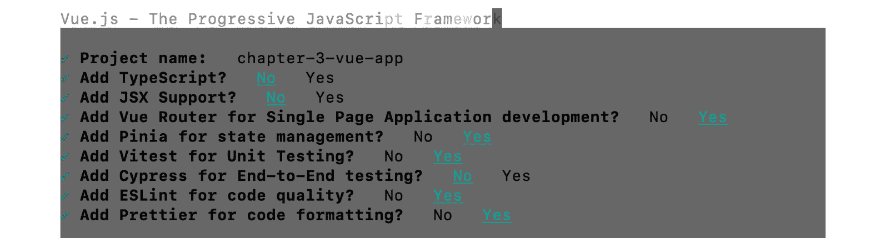

图 3.1 – 新 Vue 项目的配置提示

*图 3.1* 展示了名为 `chapter-3-vue-app` 的新 Vue 项目的配置，包括以下内容：

+   Vue Router 用于路由管理（我们将在 *第七章*，*路由*）和 Pinia 用于状态管理（我们将在 *第九章*，*Vue 的状态管理*）进行讨论）

+   Vitest 用于为项目启用单元测试覆盖率

+   ESLint 用于代码检查和 Prettier 用于组织项目代码

基于这些配置，Vite 将使用以下文件结构来搭建所需的项目：


图 3.2 – 由 Vite 创建的新 Vue 项目的文件结构

完成后，Vite 包也将成为项目的依赖包之一。现在您可以运行以下命令：

+   `npm run dev` 或 `yarn dev`：在 `localhost:3000` 上本地运行您的项目，其中 `3000` 是任意分配的，因为它高于其他计算领域中使用的知名端口号 `1`-`1023`。如果同时运行多个 Vue 项目，端口号将在项目之间有所不同。

+   `npm run build` 或 `yarn build`：运行生产构建，将您的代码打包成一个或几个小型文件，以便部署到生产环境。

+   `npm run lint` 或 `yarn lint`：运行代码检查过程，这将突出显示代码错误或警告，使您的代码更加一致。

+   `npm run preview` 或 `yarn preview`：在特定端口上运行项目的预览版本，模拟生产模式。

+   `npm run test:unit` 或 `yarn test:unit`：使用 Vitest 运行项目的单元测试。

现在您已经了解了 Vite 是什么以及如何使用它从头开始设置和管理 Vue.js 项目，我们将接下来练习使用 Vite 创建 Vue.js 项目。

## 练习 3.01 – 设置 Vue 项目

在这个练习中，您将使用 Vite 命令创建您的第一个 Vue.js 项目。

要访问此练习的代码文件，请参阅 [`github.com/PacktPublishing/Frontend-Development-Projects-with-Vue.js-3/tree/v2-edition/Chapter03/Exercise3.01`](https://github.com/PacktPublishing/Frontend-Development-Projects-with-Vue.js-3/tree/v2-edition/Chapter03/Exercise3.01)。

您可以通过以下步骤创建一个 Vue.js 项目：

1.  在 Windows 上打开命令提示符（终端）或 PowerShell：

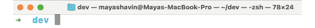

图 3.3 – 一个空的命令提示符窗口

1.  运行 `npm init` `vue@3` 命令。

1.  运行前面的命令后，您将被要求安装 Vite 的最新版本。确认操作后，终端将安装 Vite 并提示一系列问题以配置 Vue.js 应用程序。

1.  使用导航键盘提供以下截图所示的配置：

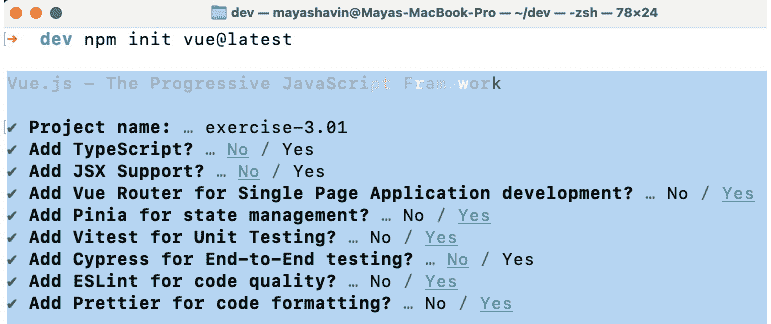

图 3.4 – 显示已保存的预设列表

目前，我们将使用 Vue Router、Pinia 和 Vitest 为我们的应用程序提供支持，同时使用 ESLint 和 Prettier 来保持我们的代码整洁和有序。

1.  完成后，Vite 将显示运行项目的指令列表，如图 *图 3.5* 所示：

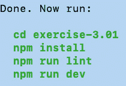

图 3.5 – Vite 生成的说明

1.  导航到您创建的项目目录。

1.  运行 `yarn` 命令。输出应如下所示：

    ```js
    yarn install v1.22.10
    ```

    ```js
    info No lockfile found.
    ```

    ```js
    [1/4] Resolving packages...
    ```

1.  一旦安装包程序完成，请使用以下命令在本地运行您的项目：

    ```js
    yarn dev
    ```

1.  运行前面的命令后，您可以在终端中看到本地服务器，如图 *图 3.6* 所示：

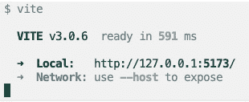

图 3.6 – 本地开发服务器正在运行

1.  点击 `Local:` 部分显示的 URL，您将在浏览器中看到一个默认的 Vue 项目屏幕，如下所示：

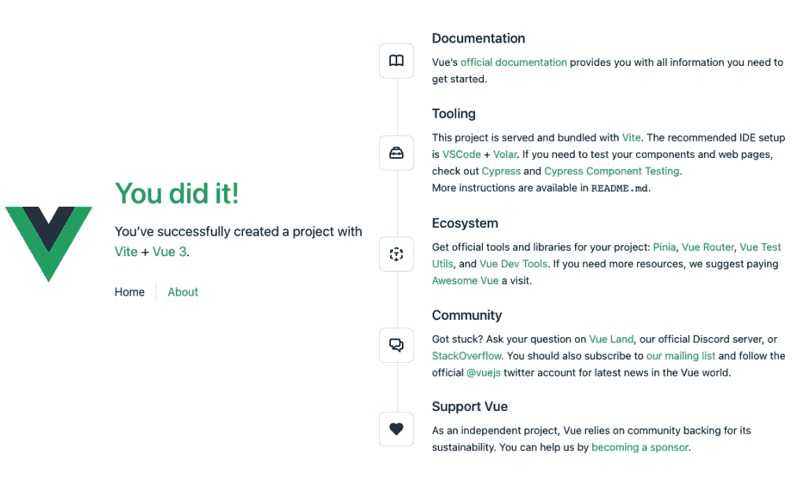

图 3.7 – 默认 Vue 项目屏幕将在您的浏览器中显示

我们现在已经学会了如何通过命令提示符使用 Vite 和 Yarn 设置 Vue.js 项目。接下来，我们将探索使用 Vue Devtools 来调试您的应用程序。

# 使用 Vue Devtools

**Vue Devtools** 是一个适用于 Chrome 和 Firefox 的浏览器扩展程序，以及一个 Electron 桌面应用程序。您可以从浏览器中安装并运行它，以在开发过程中调试您的 Vue.js 项目。此扩展程序在生产环境中或远程运行的项目中不起作用。您可以从 Chrome 扩展程序页面下载 Vue Devtools 扩展程序，如下截图所示：

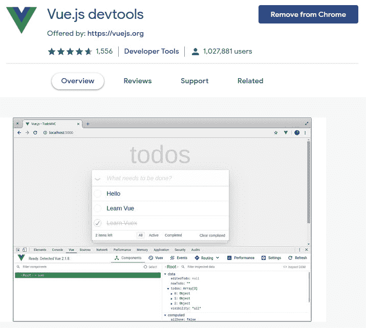

图 3.8 – Vue.js Devtools Chrome 扩展程序页面

您还可以从 Firefox ([`addons.mozilla.org/en-US/firefox/addon/vue-js-Devtools/`](https://addons.mozilla.org/en-US/firefox/addon/vue-js-Devtools/)) 下载 Vue Devtools 扩展程序：

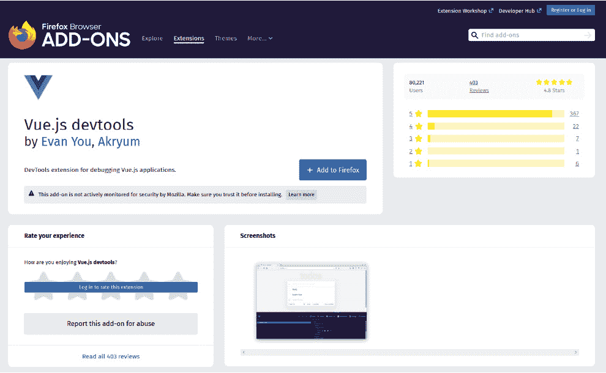

图 3.9 – Vue.js Devtools Firefox 扩展程序页面

Devtools 扩展程序在浏览器开发者工具中揭示有用的信息，包括性能和事件跟踪，这些信息在您的应用程序运行期间针对任何 Vue 组件。一旦启用，扩展程序将在开发者控制台中添加一个 **Vue** 选项卡。**Vue** 选项卡显示一个带有多个选项卡的视图，我们将在下面查看。

在 **Vue Devtools** 视图中，有两个主要选项卡：**Components** 和 **Timeline**。

## 组件选项卡

当您打开 **Vue Devtools** 选项卡时，**Components** 选项卡（以前称为 Inspector）默认可见。一旦激活，将出现其他选项卡，具体如下。

### 侧边操作（右上角）

您可以使用页面图标（右上角）中的 **Select** 组件从浏览器 UI 中选择 Vue 元素，如图 3.10* 所示。


图 3.10 – 选择组件操作图标

第二个快捷操作是 **Refresh**，它允许您刷新浏览器中的 Devtools 实例：


图 3.11 – 刷新操作图标

最后，您可以通过单击表示 **Settings** 的三个点图标来自定义选项卡的外观和感觉：

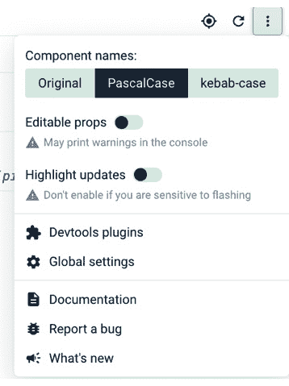

图 3.12 – Vue.js Devtools 中的设置选项卡

当 **Components** 选项卡处于活动状态时，应用中的组件树将在左侧面板中可用。右侧面板将显示从树中选择的任何组件的本地状态和详细信息。

有一些小快捷操作，例如**检查 DOM**，它会直接带你到浏览器 DOM 树中突出显示的组件位置，以及**滚动到组件**，它会自动滚动到 UI 上的组件并突出显示：

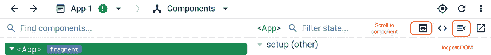

图 3.13 – 组件的快捷操作

接下来，让我们看看 Vue.js Devtools 的另一个选项卡——**时间线**选项卡。

## 时间线选项卡

此选项卡记录了应用中发生的所有事件，分为四个主要部分：**鼠标**事件、**键盘**事件、**组件**特定事件和**性能**事件，如*图 3*所示。你可以使用此选项卡导航和监控组件发出的自定义事件：

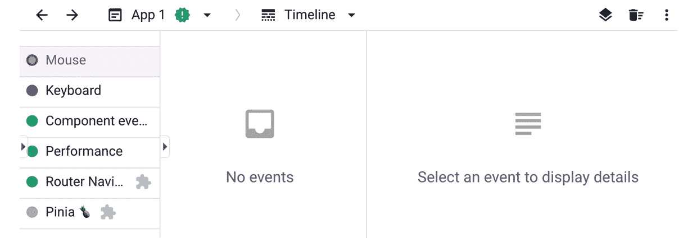

图 3.14 – Vue.js Devtools 中的时间线选项卡

### 其他插件（Pinia，Vue Router）

如果你安装了额外的 Vue 插件，如 Pinia 或 Vue Router，并且它们支持 Vue Devtools，那么在 **组件** 选项卡旁边将出现额外的选项卡，包含每个插件的相应信息。*图 3*展示了当启用时 **Vue Router** 选项卡的样子：

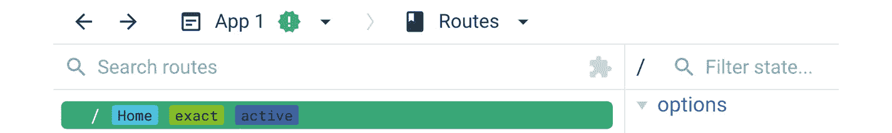

图 3.15 – 如果选择，Vue Router 的路由选项卡

Vue Devtools 帮助你在开发过程中调试和监控你的 Vue 应用程序。接下来，我们将构建一个 Vue 组件，并使用 Vue Devtools 扩展来检查代码和操作组件内部的本地数据状态。

## 练习 3.02 – 使用 Devtools 调试 Vue 应用程序

在这个练习中，你将基于前几章学到的知识构建一个 Vue 组件，然后使用 Devtools 进行调试。你需要安装 Chrome、Firefox 或 Edge 浏览器，并启用 Vue Devtools 扩展。

你将使用浏览器开发者控制台中的 **Vue** 选项卡来检查代码和操作组件的本地数据状态。

你可以在[`github.com/PacktPublishing/Frontend-Development-Projects-with-Vue.js-3/tree/v2-edition/Chapter03/Exercise3.02`](https://github.com/PacktPublishing/Frontend-Development-Projects-with-Vue.js-3/tree/v2-edition/Chapter03/Exercise3.02)找到这个练习的完整代码。

以 `npm init vue@3` 生成的应用程序作为起点，或者在你的代码仓库的根目录下，使用以下命令按顺序导航到 `Chapter03/Exercise3.02` 文件夹：

```js
> cd Chapter03/Exercise3.02/
> yarn
```

在你的 VS Code 编辑器中打开练习项目（在项目目录中使用 `code .` 命令）或你喜欢的 IDE。

在 `src/components` 目录下创建一个新的 `Exercise3-02.vue` 组件，然后按照以下步骤进行：

1.  将组件命名为 `Exercise`，并在 `<script>` 部分使用 `data()` 字段创建一个本地数据状态。本地数据状态有一个字符串数组列表—`frameworks`—每个元素代表一个框架，以及一个空的 `input` 数据属性：

    ```js
    <script>
    ```

    ```js
    export default {
    ```

    ```js
      name: 'Exercise',
    ```

    ```js
      data() {
    ```

    ```js
        return {
    ```

    ```js
          frameworks: [
    ```

    ```js
            'Vue',
    ```

    ```js
            'React',
    ```

    ```js
            'Backbone',
    ```

    ```js
            'Ember',
    ```

    ```js
            'Knockout',
    ```

    ```js
            'jQuery',
    ```

    ```js
            'Angular',
    ```

    ```js
          ],
    ```

    ```js
          input: '',
    ```

    ```js
        }
    ```

    ```js
      },
    ```

    ```js
    }
    ```

    ```js
    </script>
    ```

1.  接下来，创建一个名为 `computedList` 的计算属性，根据 `input` 属性值过滤 `frameworks` 列表：

    ```js
     <script>
    ```

    ```js
    export default {
    ```

    ```js
      //…
    ```

    ```js
      computed: {
    ```

    ```js
        computedList() {
    ```

    ```js
          return this.frameworks.filter(item => {
    ```

    ```js
            return item.toLowerCase().includes(this.input.
    ```

    ```js
              toLowerCase())
    ```

    ```js
          })
    ```

    ```js
        },
    ```

    ```js
      },
    ```

    ```js
    }
    ```

    ```js
    //…
    ```

    ```js
    </script>
    ```

1.  在 Vue `template` 块中，添加一个 `input` 元素，并使用 `v-model` 将 `input` 数据属性绑定到它。然后，添加一个 `<ul>` 元素，并使用 `v-for` 循环属性和 `<li>` 元素显示 `computedList` 的值：

    ```js
    <template>
    ```

    ```js
      <div id="app" class="container">
    ```

    ```js
        <h1>Vue Devtools debugging</h1>
    ```

    ```js
        <input type="text" placeholder="Filter list"
    ```

    ```js
           v-model=
    ```

    ```js
          "input" />
    ```

    ```js
        <ul>
    ```

    ```js
          <li v-for="(item, i) in computedList"
    ```

    ```js
            :key="i">{{ item }}
    ```

    ```js
          </li>
    ```

    ```js
        </ul>
    ```

    ```js
      </div>
    ```

    ```js
    </template>
    ```

完整的代码如下所示：

```js
<template>
  <div id="app" class="container">
    <h1>Vue Devtools Debugging</h1>
    <input type="text" placeholder="Filter list"
      v-model="input" />
    <ul>
      <li v-for="(item, i) in computedList" :key="i">
        {{ item }}
      </li>
    </ul>
  </div>
</template>
<script>
export default {
  name: 'Exercise',
  data() {
    return {
      frameworks: [
        'Vue',
        'React',
        'Backbone',
        'Ember',
        'Knockout',
        'jQuery',
        'Angular',
      ],
      input: '',
    }
  },
  computed: {
    computedList() {
      return this.frameworks.filter(item => {
        return item.toLowerCase().includes(this.input.
          toLowerCase())
      })
    },
  },
}
</script>
```

1.  在 `App.vue` 中，用以下代码替换默认代码，以便在我们的应用中渲染组件：

    ```js
    <template>
    ```

    ```js
      <Exercise />
    ```

    ```js
    </template>
    ```

    ```js
    <script>
    ```

    ```js
    import Exercise from "./components/Exercise3-02.vue";
    ```

    ```js
    export default {
    ```

    ```js
      components: {
    ```

    ```js
        Exercise,
    ```

    ```js
      },
    ```

    ```js
    };
    ```

    ```js
    </script>
    ```

1.  使用以下命令运行应用程序：

    ```js
    yarn dev
    ```

1.  在浏览器中访问 `http://localhost:3000`，前面的代码将生成一个组件，该组件将显示一个过滤器输入字段和过滤后的框架列表，如图 *图 3**.17* 所示：

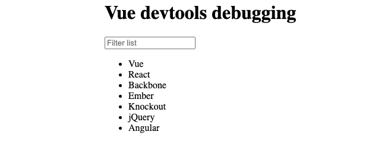

图 3.16 – 应用应显示列表和过滤器输入

1.  在显示的页面上，右键单击并选择 **Inspect** 以打开开发者控制台或使用 *Ctrl* + *Shift* + *J* 快捷键（macOS 用户：*Cmd* + *Shift* + *J*）。然后，导航到 **Vue** 选项卡。你应该看到选项卡已打开，如下面的截图所示：

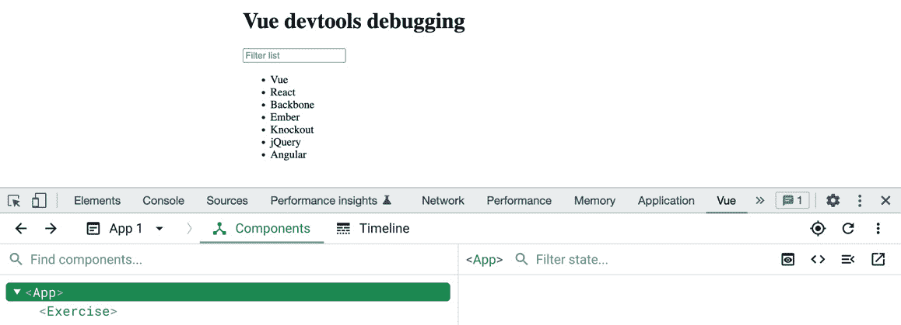

图 3.17 – 开发者控制台中的 Vue 选项卡

1.  默认情况下，你将处于 `V` 状态。将发生两件事：在右侧面板中，`input` 数据属性现在具有 `v` 和计算列表的值。`computedList` 现在只包含一个值为 `Vue` 的元素。

在浏览器中，这些数据将在 UI 中反映出来，如图 *图 3**.19* 所示：

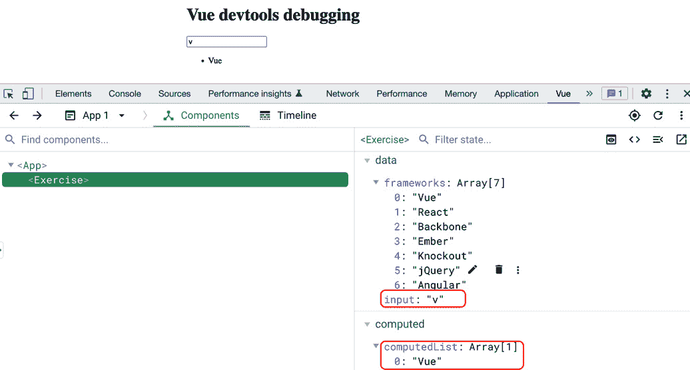

图 3.18 – 应用选项在 Vue 选项卡中的外观

1.  通过单击 `input` 属性旁边的铅笔图标直接在右侧面板中编辑数据：

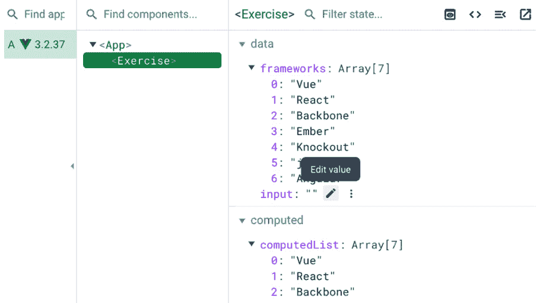

图 3.19 – 鼠标悬停时出现编辑按钮

1.  将 `input` 属性的新值输入为 `R` 并按 *Enter*。DOM 将对来自 Devtools 扩展的直接更改做出反应性更新，如下面的截图所示：

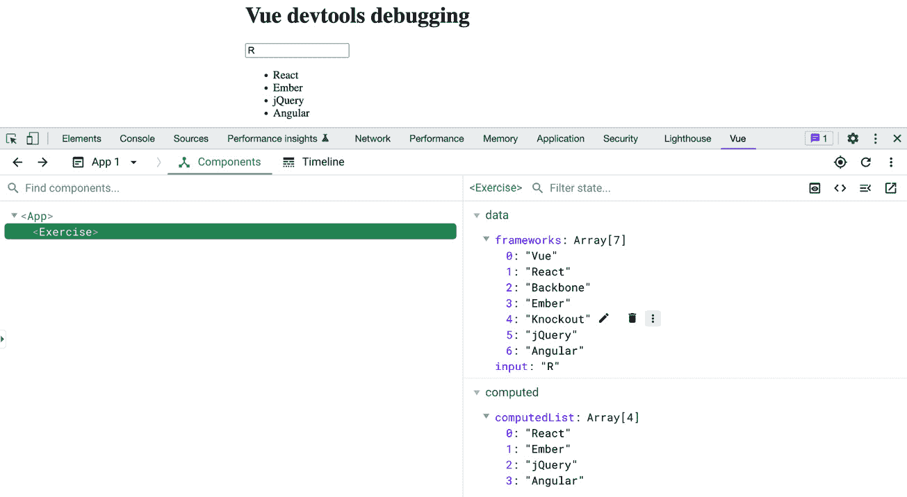

图 3.20 – 实时编辑本地数据值

在 Vue.js Devtools 中更改值后，UI 中的值将反应性地更改，在这个例子中，输入值现在是 `R`，这随后触发反应性的 `computedList` 数组，只显示包含字母 *R* 的值，如图 *图 3**.21* 所示。

1.  切换到 `A`，然后 `B`，然后 `V`。当你将文本输入到输入框中时，你将看到性能指标以蓝色条形显示，如下面的截图所示：

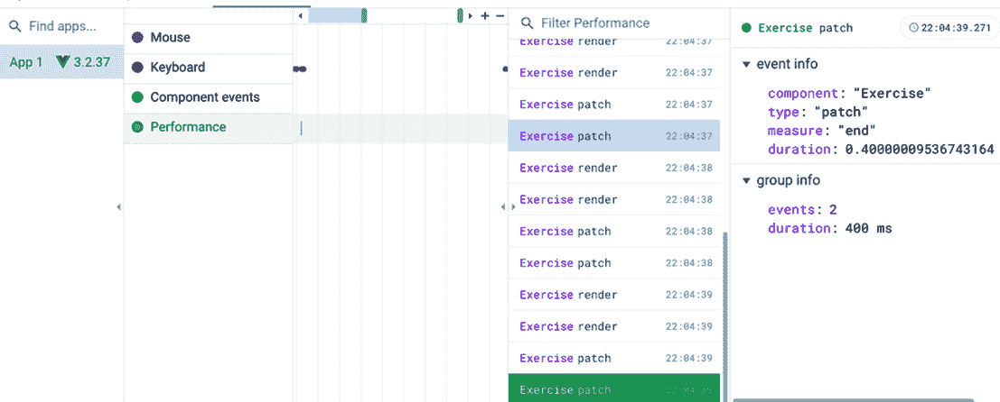

图 3.21 – 每次输入更改时的渲染性能指标

1.  选择中间面板中列出的 `Exercise` 记录事件之一。你可以在右侧面板中观察到信息，包括该特定事件的持续时间（以秒为单位）。这个数字反映了你的组件渲染/更新的时间，如下面的截图所示：

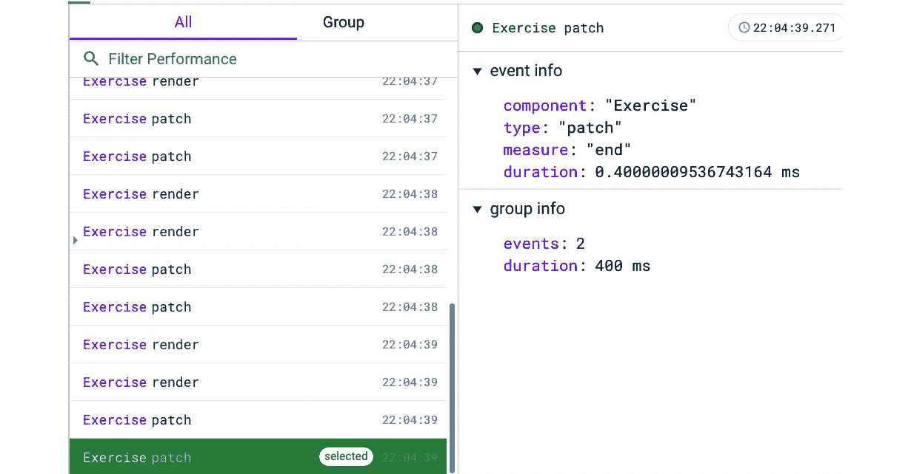

图 3.22 – 选择性能记录并查看详细信息

注意

重复测试将允许你比较基准。然而，如果你刷新页面，你将丢失它们。

在这个练习的结尾，你将知道如何使用 Vue Devtools 的 **组件** 选项卡来调试组件。你还体验了如何使用 Vue Devtools 扩展的可用功能来观察和编辑数据。最后，你知道如何使用 **性能** 选项卡来监控组件在应用程序生命周期钩子中的性能。

## 活动 3.01 – 使用 Vite、Pinia 和 Router 创建 Vue 应用程序

要访问此活动的代码文件，请参阅 [`github.com/PacktPublishing/Frontend-Development-Projects-with-Vue.js-3/tree/v2-edition/Chapter03/Activity3.01`](https://github.com/PacktPublishing/Frontend-Development-Projects-with-Vue.js-3/tree/v2-edition/Chapter03/Activity3.01)

在此活动中，你将使用命令行和 Vite 构建 Vue 项目，并安装 Vue Router 和 Pinia。此活动将测试你控制各种 Vue 工具进行开发的能力。

以下步骤将帮助你完成活动：

1.  使用 Vite 创建一个启用 Pinia 和 Vue Router 的新 Vue 项目。

1.  创建一个组件来渲染两个字符串输入字段，接收姓氏和名字，并显示接收到的全名。

1.  打开 Devtools 扩展并观察 Pinia 和 Vue Router 是否可用于调试。

1.  添加一些文本并观察组件在 **性能** 中的渲染情况。

预期结果如下：

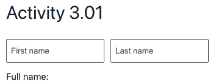

图 3.23 – 最终输出

此活动还提供了 **Pinia** 和 **Routes** 选项卡，如 *图 3*.25* 所示：

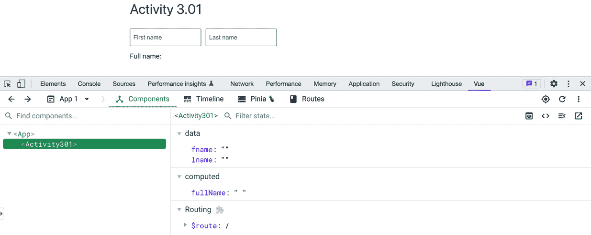

图 3.24 – Devtools 选项卡显示 Pinia、Routes 和其他信息

活动完成后，你应该能够使用 Vite 和 Vue Devtools 来管理你的未来 Vue 项目。你会发现，在某些情况下，你需要使用这两个工具来增强你的开发体验并使你的应用程序更加优化。

# 摘要

在本章中，你学习了 Vite 以及如何通过命令行终端创建由 Vite 管理的 Vue 项目。你还学习了 Vue Devtools 以及如何使用其功能，这些功能将帮助你在这本书的旅程中探索更高级的主题。

下一章将更多地关注高级 Vue 组件功能，例如从一个组件向其嵌套组件传递数据，验证从元素外部接收到的数据，使用插槽自定义组件布局，以及保持组件引用以进行外部控制。

# 第二部分：构建你的第一个 Vue 应用程序

在这部分，我们将学习如何使用 props 和自定义事件从父组件传递数据到子组件，以及如何使用 Composition API 创建可重用组件逻辑。我们还将学习如何使用路由和动画构建复杂的应用程序结构。我们将逐一讲解每个基本主题，并了解 Vue 如何处理这些主题以及如何通过实际练习有效地使用 Vue。

我们在本节中将涵盖以下章节：

+   *第四章*，*组件嵌套（模块化）*

+   *第五章*，*Composition API*

+   *第六章*，*全局组件组合*

+   *第七章*，*路由*

+   *第八章*，*动画和过渡*
