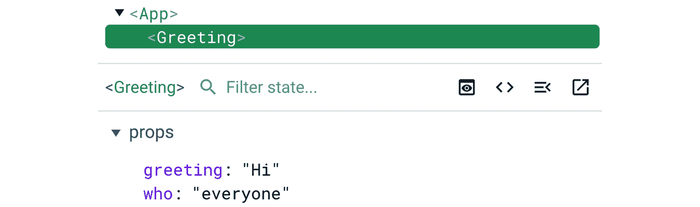
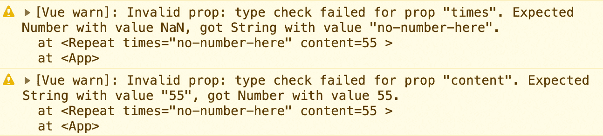
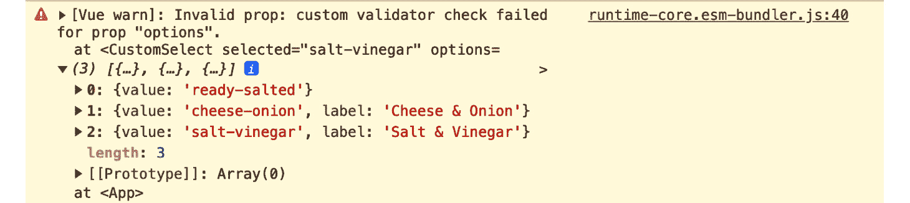
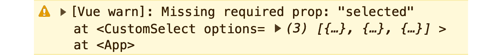
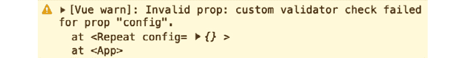
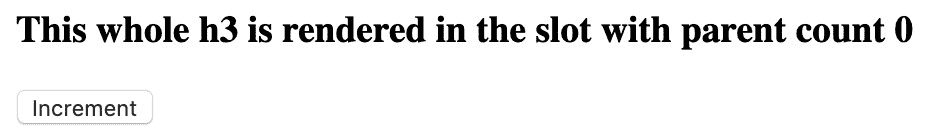
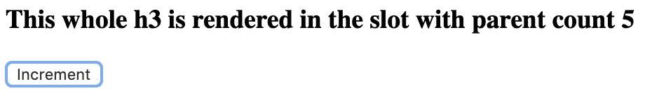
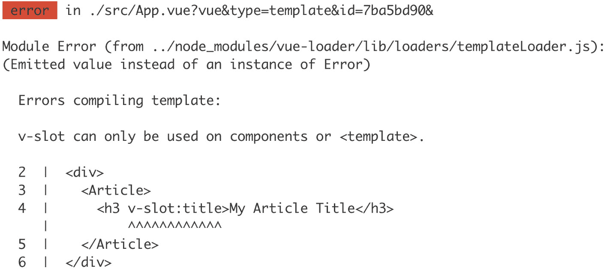

# 4

# 组件嵌套（模块化）

在上一章中，我们学习了如何初始化、构建和调试一个简单的 Vue 应用程序。在本章中，您将了解如何使用组件层次结构和嵌套来模块化 Vue 应用程序。本章介绍了 props、事件、prop 验证和插槽等概念。它还涵盖了如何在运行时使用 refs 访问 DOM 元素。

到本章结束时，您将能够使用 props、事件和验证器定义组件之间的通信接口，并准备好为您的 Vue 组件库或 Vue 应用程序构建组件。

本章涵盖了以下主题：

+   传递 props

+   理解 prop 类型验证

+   理解插槽、命名插槽和作用域插槽

+   理解 Vue 的 refs

+   使用事件进行子父通信

# 技术要求

在本章中，您需要按照 *第一章* 中 *启动您的第一个 Vue 项目* 的说明设置一个基本的 Vue 项目。建议创建一个单文件 Vue 组件来轻松练习本章涵盖的示例和概念。

本章的完整代码可在 GitHub 上找到：[`github.com/PacktPublishing/Frontend-Development-Projects-with-Vue.js-3/tree/v2-edition/Chapter04`](https://github.com/PacktPublishing/Frontend-Development-Projects-with-Vue.js-3/tree/v2-edition/Chapter04)。

# 传递 props

`this`) 以及在组件的 `template` 中。

prop 的值取决于父组件在渲染时传递给子组件的 `template` 中的内容。

## 定义一个接受 props 的简单组件

让我们看看一个简单的 `HelloWorld` 单文件组件。您可以在 `./src/components/HelloWorld.vue` 找到它，这是在您使用 Vite 创建 Vue 项目时自动生成的。

注意 `msg` 值是如何在 `props` 数组中设置的，并且它是如何使用 `{{` `msg }}` 进行插值的。

Vue 组件的 `props` 属性可以是一个字符串数组或一个对象字面量，其中每个属性字段都是一个组件的 prop 定义。

当在 `props` 中定义一个值时，它随后作为实例变量在 Vue 组件的 `template` 部分中可访问：

```js
<template>
  <div class="hello">
    <h1>{{ msg }}</h1>
    <!-- … -->
  </div>
</template>
<script>
export default {
  name: 'HelloWorld',
  props: ['msg']
}
</script>
```

现在，我们将学习如何使用 props 渲染组件。

## 将 props 传递给组件

下面的内容将演示如何在我们的 Vue 应用程序中使用 `HelloWorld` 组件。

首先，我们需要在 `App.vue` 文件中使用 `<``script setup>` 导入 `HelloWorld`：

```js
<script setup>
import HelloWorld from "./components/HelloWorld.vue";
</script>
```

然后，在 `template` 部分中，我们需要将 `<HelloWorld>` 渲染为具有 `msg` 属性设置为 `"Vue.js"`，如下所示：

```js
<template>
  <div id="app">
    <HelloWorld msg="Vue.js"/>
  </div>
</template>
```

这将在页面上渲染以下内容：

```js
Hello Vue.js
```

我们已经看到了如何使用具有来自父组件的 props 的组件。这对于代码重用和将应用程序行为抽象成组件大小的块非常有用。

接下来，我们将查看一个 `Greeting` 组件的实际示例。

## 练习 4.01 – 实现问候组件

在这个练习中，我们将创建一个组件，允许你使用我们刚刚学到的从父组件到子组件传递 props 的知识来自定义`greeting`（例如，`Hello`、`Hey`或`Hola`）和要问候的对象（例如，`World`、`Vue.js`或`JavaScript 开发者`）。

要访问此练习的代码文件，请参阅[`github.com/PacktPublishing/Frontend-Development-Projects-with-Vue.js-3/tree/v2-edition/Chapter04/Exercise4.01`](https://github.com/PacktPublishing/Frontend-Development-Projects-with-Vue.js-3/tree/v2-edition/Chapter04/Exercise4.01)。

按照以下步骤完成这个练习：

1.  使用由`npm init vue@3`生成的应用程序作为起点，或者在你的代码仓库的根目录中，使用以下命令导航到`Chapter04/Exercise4.01`文件夹：

    ```js
    > cd Chapter04/Exercise4.01/
    ```

    ```js
    > yarn
    ```

1.  在 VS Code 中打开练习项目（在项目目录中使用`code .`命令），或者在你的首选 IDE 中打开。

1.  在`./src/components`目录下创建一个名为`Greeting.vue`的新文件。这将是我们单文件组件。

1.  首先，使用带有空`template`和`script`标签的组件脚手架：

    ```js
    <template>
    ```

    ```js
      <div>Empty</div>
    ```

    ```js
    </template>
    ```

    ```js
    <script>
    ```

    ```js
    export default {}
    ```

    ```js
    </script>
    ```

1.  接下来，我们需要告诉 Vue 我们的组件期望 props。为此，我们将在组件选项对象中添加一个`props`属性，作为一个包含两个字段的数组，即`greeting`和`who`，如下面的代码块所示：

    ```js
    export default {
    ```

    ```js
      props: ['greeting', 'who']
    ```

    ```js
    }
    ```

1.  现在，我们想在模板中将`greeting`和`who`渲染如下：

    ```js
    <template>
    ```

    ```js
      <div>{{ greeting }} {{ who }}</div>
    ```

    ```js
    </template>
    ```

`Greeting`组件现在已准备好在`App.vue`中使用。

1.  打开`src/App.vue`文件，并将`Greeting`组件从`./src/components/Greeting.vue`导入到`script`部分：

    ```js
    <script setup>
    ```

    ```js
    import Greeting from './components/Greeting.vue'
    ```

    ```js
    </script>
    ```

1.  现在我们可以使用`Greeting`在`template`中：

    ```js
    <template>
    ```

    ```js
      <div id="app">
    ```

    ```js
        <Greeting greeting="Hey" who="JavaScript"/>
    ```

    ```js
      </div>
    ```

    ```js
    </template>
    ```

1.  使用以下命令运行应用程序：

    ```js
    yarn dev
    ```

1.  当你在浏览器中访问你的应用时，你会看到以下内容：

    ```js
    Hey JavaScript
    ```

1.  使用`template`中的属性值修改`greeting`和`who`props：

    ```js
    <template>
    ```

    ```js
      <div id="app">
    ```

    ```js
        <Greeting greeting="Hi" who="everyone"/>
    ```

    ```js
      </div>
    ```

    ```js
    </template>
    ```

1.  在浏览器 DevTools 中打开 Vue 标签页，你会看到两个`greeting`和`who`props 的值已经更新：



图 4.1 – Greeting 组件在 Vue 标签页中的输出

现在浏览器显示以下内容：

```js
Hi Everyone
```

在这个练习中，我们学习了如何使用 props 在父组件和子组件之间启用通信，同时保持组件的可复用性。而不是组件渲染静态数据，其父组件传递数据以进行渲染。

在下一节中，我们将学习如何动态设置 prop 值。

## 将响应式数据绑定到 props

在上一节中，我们看到了如何将静态数据作为 props 传递给组件。如果我们想从父组件传递响应式数据到子组件怎么办？

这就是使用`v-bind:`（或简写为`:`）来启用父组件的响应式数据到子组件 props 的单向绑定。

在以下代码示例中，我们将`appWho`数据绑定到`HelloWorld`组件的`msg`prop：

```js
<template>
  <div id="app">
    <HelloWorld :msg="appWho"/>
  </div>
</template>
<script setup>
import HelloWorld from './components/HelloWorld.vue'
const appWho = 'Vue.js'
</script>
```

输出将如下所示：

```js
Hello Vue.js
```

让我们添加两个按钮来改变`appWho`的值，一个用于`JavaScript`，另一个用于`Everyone`，通过触发带有适当值的`setWho`方法，如下所示：

```js
<template>
  <div id="app">
    <HelloWorld :msg="appWho"/>
    <button @click="setWho('JavaScript')">JavaScript
      </button>
    <button @click="setWho('Everyone')">Everyone</button>
  </div>
</template>
<script>
import HelloWorld from './components/HelloWorld.vue'
export default {
  components: {
    HelloWorld
  },
  data () {
    return {
      appWho: 'Vue.js'
    }
  },
  methods: {
    setWho(newWho) {
      this.appWho = newWho
    }
  }
}
</script>
```

浏览器现在显示以下输出：


图 4.2 – 浏览器显示带有两个按钮的组件

当你点击`appWho`值并重新渲染带有新值传递给`msg`属性的`HelloWorld`子组件时。因此，显示为`Hello JavaScript`，如下所示：


图 4.3 – 点击 JavaScript 按钮后显示的“Hello JavaScript”

类似地，当你点击`Hello Everyone`时，如下所示：


图 4.4 – 点击 Everyone 按钮后显示的“Hello Everyone”

如我们所见，我们能够将响应式数据绑定到 props，以便在父组件中更新的任何数据都会相应地反映在子组件的数据中。

## 练习 4.02 – 将频繁更改的响应式数据传递给 props

在这个练习中，我们将实现一个组件，允许用户更改要问候的人的名字，并将其传递给我们构建在*练习 4.01*中的`Greeting`组件。

要访问此练习的代码文件，请参阅[`github.com/PacktPublishing/Frontend-Development-Projects-with-Vue.js-3/tree/v2-edition/Chapter04/Exercise4.02`](https://github.com/PacktPublishing/Frontend-Development-Projects-with-Vue.js-3/tree/v2-edition/Chapter04/Exercise4.02)。

按照以下步骤完成此练习：

1.  使用*练习 4.01*中构建的应用程序或使用以下命令导航到`Chapter04/Exercise4.02`文件夹：

    ```js
    > cd Chapter04/Exercise4.02/
    ```

    ```js
    > yarn
    ```

1.  在 VS Code 中打开练习项目（在项目目录中使用`code .`命令）或使用您首选的 IDE。

1.  在`App.vue`的`script`部分，让我们从`script`标签中移除`setup`属性，并在`components`字段中注册`Greeting`作为子组件，如下所示：

    ```js
    <script>
    ```

    ```js
    import Greeting from './components/Greeting.vue'
    ```

    ```js
    export default {
    ```

    ```js
      components: {
    ```

    ```js
              Greeting
    ```

    ```js
      },
    ```

    ```js
    }
    ```

    ```js
    </script>
    ```

1.  然后创建一个返回初始`greeting`和`who`的顶级`data`方法：

    ```js
    <script>
    ```

    ```js
    export default {
    ```

    ```js
      /*…*/
    ```

    ```js
      data() {
    ```

    ```js
        return {
    ```

    ```js
          greeting: 'Hello',
    ```

    ```js
          who: 'Vue.js'
    ```

    ```js
        }
    ```

    ```js
      }
    ```

    ```js
    }
    ```

    ```js
    </script>
    ```

浏览器应显示与*练习 4.01*相同的输出。

1.  我们现在将创建一个`input`字段，它接受用户输入的`who`字符串值，并将`who`数据绑定到`Greeting`的`who`属性：

    ```js
    <template>
    ```

    ```js
    <div id="app">
    ```

    ```js
      <input placeholder="What is your name" v-model="who"
    ```

    ```js
        >
    ```

    ```js
      <Greeting greeting="Hi" :who="who"/>
    ```

    ```js
    </div>
    ```

    ```js
    </template>
    ```

1.  现在，当你在输入字段中输入任何名字时，问候信息将相应地改变，如下面的截图所示：


图 4.5 – 根据用户输入更新问候值的结果输出

接下来，我们将学习如何为我们的组件 props 添加类型提示和验证以确保它们被正确使用。

# 理解 prop 类型和验证

我们使用属性来定义 Vue 组件的接口，并确保其他开发者正确使用我们的组件。我们需要使用类型和验证来定义它们的接口。Vue 通过改变我们如何将属性作为字符串元素传递给对象中的 `props` 属性来提供这种能力。

## 原始属性验证

假设我们想要一个 `Repeat.vue` 组件，它接受 `times` 属性和 `content` 属性，然后根据 `times` 的值使用 `computed` 计算出 `repetitions` 数组。我们可以定义以下内容：

```js
<template>
  <div>
    <span v-for="r in repetitions" :key="r">
      {{ content }}
    </span>
  </div>
</template>
<script>
export default {
  props: ['times', 'content'],
  computed: {
    repetitions() {
      return Array.from({ length: this.times });
    }
  }
}
</script>
```

在 `App.vue` 中，我们可以如下使用我们的 `Repeat` 组件：

```js
<template>
  <div id="app">
    <Repeat :times="count" content="Repeat" />
    <button @click="increment()">Repeat</button>
  </div>
</template>
<script>
import Repeat from './components/Repeat.vue'
export default {
  components: {
    Repeat
  },
  data() {
    return { count: 1 }
  },
  methods: {
    increment() {
      this.count += 1
    }
  }
}
</script>
```

上述代码将在浏览器中产生以下输出：


图 4.6 – 重复示例动作输出（无点击）

每次点击 `Repeat` 按钮，`Repeat` 组件将显示内容一次，如下所示：


图 4.7 – 五次点击后的重复示例输出

现在，为了使此组件正常工作，我们需要 `times` 是 `Number` 类型，理想情况下 `content` 是 `String` 类型。

注意

Vue 中的属性类型可以是任何类型，包括 `String`、`Number`、`Boolean`、`Array`、`Object`、`Date`、`Function` 和 `Symbol`。

让我们定义 `times` 属性为 `Number` 类型，并将 `content` 属性定义为 `String` 类型：

```js
<script>
export default {
  props: {
    times: {
      type: Number
    },
    content: {
      type: String
    }
  },
  // rest of component definition
}
</script>
```

让我们看看如果我们将 `App` 更新为向 `Repeat` 传递错误的属性类型会发生什么 – 例如，让我们假设 `times` 是一个 `String`，而 `content` 是一个 `Number`：

```js
<template>
  <div id="app">
    <Repeat :times="count" :content="55" />
  </div>
</template>
<script>
// no changes to imports
export default {
  data() {
    return { count: 'no-number-here' }
  },
  // other properties
}
</script>
```

在这种情况下，`Repeat` 组件将无法渲染，并且以下错误将被记录到控制台：



图 4.8 – 错误输入属性错误

`times` 属性检查失败，显示一条消息解释说我们传递了一个 `String` 给期望接收 `Number` 的属性：

```js
Invalid prop: type check failed for prop "times". Expected Number with value NaN, got String with value "no-number-here"
```

同样，对于 `content` 属性检查，也会出现一条消息，解释说我们传递了一个 `Number` 作为属性，而这个属性本应该是 `String`：

```js
Invalid prop: type check failed for prop "content". Expected String with value "55", got Number with value 55
```

接下来，让我们探索自定义属性类型和联合类型。

## 理解联合和自定义属性类型

Vue 支持联合类型。例如 `[String, Number]`。我们通过使用该数据属性对象的 `type` 字段来声明一个接受联合类型的属性。例如，我们将 `content` 设置为接受一个联合类型，该类型可以是数字或字符串：

```js
<script>
export default {
  props: {
    // other prop definitions
    content: {
      type: [String, Number]
    }
  }
  // rest of component definition
}
</script>
```

在这种情况下，我们可以如下使用 `Repeat` 组件而不会出现错误：

```js
<template>
  <div id="app">
    <Repeat :times="3" :content="55" />
  </div>
</template>
```

我们还可以使用任何有效的 JavaScript 构造函数作为属性的类型，例如 `Promise` 或自定义的 `User` 类构造函数，如下面的 `TodoList` 组件示例所示：

```js
<script>
import User from './user.js'
export default {
  props: {
    todoListPromise: {
      type: Promise
    },
    currentUser: {
      type: User
    }
  }
}
</script>
```

注意这里我们从一个文件中导入 `User` 自定义类型。我们可以如下使用此 `TodoList` 组件：

```js
<template>
  <div>
    <div v-if="todosPromise && !error">
      <TodoList
        :todoListPromise="todosPromise"
        :currentUser="currentUser"
      />
    </div>
    {{ error }}
  </div>
</template>
<script>
import TodoList from './components/TodoList.vue'
import User from './components/user.js'
const currentUser = new User()
export default {
  components: {
    TodoList
  },
  mounted() {
    this.todosPromise = fetch('/api/todos').then(res => {
      if (res.ok) {
        return res.json()
      }
      throw new Error('Could not fetch todos')
    }).catch(error => {
      this.error = error
    })
  },
  data() {
    return { currentUser, error: null }
  }
}
</script>
```

在前面的代码中，我们只在使用 Vue 挂载组件实例时获取 `todosPromise`，并使用 `new User()` 创建一个新的 `User` 实例。

我们已经看到了如何使用联合和自定义类型来验证 Vue props。

注意

Vue 使用 `instanceof` 验证内部，所以请确保任何自定义类型都使用相关构造函数实例化。

传递 `null` 或 `undefined` 将会导致对 `Array` 和 `Object` 的检查失败。

传递一个数组将通过 `Object` 的检查，因为在 JavaScript 中数组也是 `Object` 的实例。

接下来，我们将探讨如何为特定类型启用对 props 的验证。

## 数组和对象的自定义验证

Vue 允许使用 `validator` 属性将自定义验证器用作 props。这允许我们实现关于对象和集合类型的深入检查。

让我们看看 `CustomSelect` 组件。

在基本层面上，`select` 的 prop 接口由一个 `options` 数组和一个 `selected` 选项组成。

每个选项都应该有一个 `label`，它代表在 `select` 中显示的内容，以及一个 `value`，代表其实际值。`selected` 选项的值可以是空的，也可以等于我们 `options` 中的一个 `value` 字段。

我们可以以简单的方式实现 `CustomSelect`（不验证输入）如下：

```js
<template>
  <select>
    <option
      :selected="selected === o.value"
      v-for="o in options"
      :key="o.value"
    >
      {{ o.label }}
    </option>
  </select>
</template>
<script>
export default {
  props: {
    selected: {
      type: String
    },
    options: {
      type: Array
    }
  }
}
</script>
```

然后使用 `CustomSelect` 来显示一系列英国薯片口味（在 `src/App.vue` 中）：

```js
<template>
  <div id="app">
    <CustomSelect :selected="selected" :options="options"
      />
  </div>
</template>
<script>
import CustomSelect from './components/CustomSelect.vue'
export default {
  components: {
    CustomSelect
  },
  data() {
    return {
      selected: 'salt-vinegar',
      options: [
        {
          value: 'ready-salted',
          label: 'Ready Salted'
        },
        {
          value: 'cheese-onion',
          label: 'Cheese & Onion'
        },
        {
          value: 'salt-vinegar',
          label: 'Salt & Vinegar'
        },
      ]
    }
  }
}
</script>
```

以下示例输出一个 `select` 元素，其中 `Salt & Vinegar` 是默认选中的选项，如下面的截图所示：


图 4.9 – 已选中 Salt & Vinegar 的折叠 CustomSelect

以下截图显示了下拉菜单打开时显示的三个口味选项：


图 4.10 – 已打开的 CustomSelect，带有口味选项和已选中 Salt & Vinegar

现在，我们可以实现一个 prop `validator` 方法来为我们的组件逻辑启用进一步的验证，如下所示：

```js
<script>
export default {
  // other component properties
  props: {
    // other prop definitions
    options: {
      type: Array,
      validator(options) {
        return options.every(o => Boolean(o.value
          && o.label))
      }
    }
  }
}
</script>
```

如果我们传递一个缺少 `value` 或 `label` 的选项，我们将在控制台中收到以下消息：



图 4.11 – 当自定义验证器失败时的控制台警告

通过这样，我们已经学习了如何使用自定义验证器对复杂 props 进行深入验证。接下来，我们将学习 prop 的 `required` 属性是如何工作的。

## 理解必需 props

要将一个 prop 标记为必需，我们可以使用 `required` prop 类型属性。

在 `CustomSelect` 示例中，我们可以通过在 prop 定义中添加 `required: true` 来使 `selected` 成为必需的 prop，如下所示：

```js
<script>
export default {
  // other component properties
  props: {
    selected: {
      type: String,
      required: true
    }
    // other prop definitions
  }
}
</script>
```

现在，如果我们不在父组件的 `CustomSelect` 的 `selected` prop 上传递值，我们将看到以下错误：



图 4.12 – 当选定的必需 prop 缺失时的控制台警告

这样，我们就学会了如何标记属性为必需的，并看到了当我们没有传递必需属性的值时会发生什么。接下来，我们将学习如何为属性设置默认值，并了解为什么这样做是一个好的实践。

## 设置默认属性值

有时为属性设置默认值是遵循良好实践的好方法。

以 `PaginatedList` 组件为例。该组件接受一个 `items` 列表，要显示的项目数 `limit`，以及 `offset` 数。然后它将根据 `limit` 和 `offset` 值显示项目子集 – `currentWindow`：

```js
<template>
  <ul>
    <li
      v-for="el in currentWindow"
      :key="el.id"
    >
      {{ el.content }}
    </li>
  </ul>
</template>
<script>
export default {
  props: {
    items: {
      type: Array,
      required: true,
    },
    limit: {
      type: Number
    },
    offset: {
      type: Number
    }
  },
  computed: {
    currentWindow() {
      return this.items.slice(this.offset, this.limit)
    }
  }
}
</script>
```

而不是每次都传递 `limit` 和 `offset` 的值，可能更好的做法是将 `limit` 设置为默认值（例如 `2`），将 `offset` 设置为 `0`（这意味着默认情况下，我们将显示第一页，其中包含 `2` 个结果）。

我们可以使用每个属性定义对象的默认属性来实现这个更改，如下所示：

```js
<script>
export default {
  props: {
    // other props
    limit: {
      type: Number,
      default: 2,
    },
    offset: {
      type: Number,
      default: 0,
    }
  },
  // other component properties
}
</script>
```

然后，在 `App.vue` 中，我们可以使用 `PaginatedList` 而不传递 `limit` 和 `offset`。如果没有传递值，Vue 会自动回退到默认值：

```js
<template>
  <main>
    <PaginatedList :items="snacks" />
  </main>
</template>
<script>
import PaginatedList from './components/PaginatedList.vue'
export default {
  components: {
    PaginatedList
  },
  data() {
    return {
      snacks: [
        {
          id: 'ready-salted',
          content: 'Ready Salted'
        },
        {
          id: 'cheese-onion',
          content: 'Cheese & Onion'
        },
        {
          id: 'salt-vinegar',
          content: 'Salt & Vinegar'
        },
      ]
    }
  }
}
</script>
```

浏览器将只显示前两个项目，如下面的屏幕截图所示：


图 4.13 – 默认只显示前两项的零食列表输出

当你传递 `offset` 或 `limit` 的值时，Vue 将使用这些值而不是默认值，并相应地渲染组件。

在属性是数组或对象的情况下，我们无法使用静态数组或对象为其分配 `default` 值。相反，我们需要分配一个返回所需默认值的函数。例如，我们可以将 `PaginatedList` 组件的 `items` 的 `default` 值设置为空数组，如下所示：

```js
<script>
export default {
  props: {
    items: {
      type: Array,
      default() {
        return []
      }
    }
    // other props
  },
  // other component properties
}
</script>
```

到目前为止，我们已经学会了如何为组件属性设置默认值。请注意，一旦设置了 `default` 值，就不再需要设置 `required` 字段。我们可以使用 `default` 值来确保我们的属性始终有值，无论这是必需的还是可选的。

## 在 `<script setup>` 中注册属性（setup 钩子）

如果你使用 `<script setup>`，由于没有选项对象，我们无法使用 `props` 字段来定义组件的属性。相反，我们使用 `vue` 包中的 `defineProps()` 函数，并将所有相关的属性定义传递给它，就像我们使用 `props` 字段时做的那样。例如，在 `MessageEditor` 组件中，我们可以将使用 `defineEmits()` 的事件注册重写如下：

```js
<script setup>
import { defineProps, computed } from  'vue'
const props = defineProps({
    items: {
      type: Array,
      required: true,
    },
    limit: {
      type: Number
    },
    offset: {
      type: Number
    }
});
const currentWindow = computed(() => {
  return props.items.slice(props.offset, props.limit)
})
</script>
```

`defineProps()` 返回一个包含所有属性值的对象。然后我们可以使用 `props.items` 在 `script` 部分访问属性，如 `items` 一样在 `template` 部分中。在上一个示例中，我们还使用了 `computed()` 来声明一个响应式数据 `currentWindow`，我们将在 *第五章* *《组合 API》* 中进一步讨论其用法。

在下一个练习中，我们将练习编写具有默认值、类型和验证器的组件 props。

## 练习 4.03 – 验证对象属性

在这个练习中，我们将编写一个 `Repeat` 组件，该组件接受一个 `config` 数据 prop，用于传递 `times`（一个 `Number`）和 `content`（一个 `String`）。

我们将编写一个自定义验证器以确保 `times` 和 `content` 存在并且类型正确。

要访问此练习的代码文件，请参阅 [`github.com/PacktPublishing/Frontend-Development-Projects-with-Vue.js-3/tree/v2-edition/Chapter04/Exercise4.03`](https://github.com/PacktPublishing/Frontend-Development-Projects-with-Vue.js-3/tree/v2-edition/Chapter04/Exercise4.03)。

按照以下步骤完成此练习：

1.  以使用 `npm init vue@3` 生成的应用程序作为起点。否则，在代码仓库的根目录中，使用以下命令导航到 `Chapter04/Exercise4.03` 文件夹：

    ```js
    > cd Chapter04/Exercise4.03/
    ```

    ```js
    > yarn
    ```

1.  在 VS Code 中打开练习项目（在项目目录中使用 `code .` 命令）或使用你喜欢的 IDE。

1.  在 `./src/components` 目录中创建一个名为 `Repeat.vue` 的新文件。

1.  为 `Repeat.vue` 定义一个名为 `config` 的 prop。此 prop 将是 `Object` 类型，如下所示：

    ```js
    <script>
    ```

    ```js
    export default {
    ```

    ```js
      props: {
    ```

    ```js
        config: {
    ```

    ```js
          type: Object,
    ```

    ```js
          required: true,
    ```

    ```js
        }
    ```

    ```js
      }
    ```

    ```js
    }
    ```

    ```js
    </script>
    ```

1.  `Config` 包含两个字段 – `times` 和 `content`。我们为 `Repeat` 组件计算一个名为 `repetitions` 的响应式数据数组，其长度基于 `config.times`：

    ```js
    <script>
    ```

    ```js
    export default {
    ```

    ```js
      // other component properties
    ```

    ```js
      computed: {
    ```

    ```js
        repetitions() {
    ```

    ```js
          return Array.from({ length: this.config.times })
    ```

    ```js
        }
    ```

    ```js
      }
    ```

    ```js
    }
    ```

    ```js
    </script>
    ```

1.  设置 `<template>` 以便为每个 `repetitions` 项目渲染 `config.content`：

    ```js
    <template>
    ```

    ```js
      <div>
    ```

    ```js
        <span v-for="r in repetitions" :key="r">
    ```

    ```js
          {{ config.content }}
    ```

    ```js
        </span>
    ```

    ```js
      </div>
    ```

    ```js
    </template>
    ```

1.  我们需要通过实现 `config` 的 `validator` 来确保 `content` 和 `times` 将接收到正确的值：

    ```js
    <script>
    ```

    ```js
    export default {
    ```

    ```js
      props: {
    ```

    ```js
        config: {
    ```

    ```js
          type: Object,
    ```

    ```js
          required: true,
    ```

    ```js
          validator(value) {
    ```

    ```js
            return typeof value.times === 'number' &&
    ```

    ```js
              typeof value.content === 'string'
    ```

    ```js
          }
    ```

    ```js
        }
    ```

    ```js
      },
    ```

    ```js
      // other component properties
    ```

    ```js
    }
    ```

    ```js
    </script>
    ```

1.  接下来，我们在 `src/App.vue` 中导入并使用 `Repeat`：

    ```js
    <template>
    ```

    ```js
      <main>
    ```

    ```js
        <Repeat :config="{}" />
    ```

    ```js
      </main>
    ```

    ```js
    </template>
    ```

    ```js
    <script>
    ```

    ```js
    import Repeat from './components/Repeat.vue'
    ```

    ```js
    export default {
    ```

    ```js
      components: {
    ```

    ```js
        Repeat
    ```

    ```js
      }
    ```

    ```js
    }
    ```

    ```js
    </script>
    ```

不幸的是，这不会渲染任何内容，因为 `config` 是一个空对象。你将在控制台中观察到警告，如下所示：



图 4.14 – 由于配置属性的自定义验证器检查失败导致的控制台警告

1.  我们将在以下情况下看到相同的错误：

    +   我们只添加一个 `times` 属性，即 `<Repeat :config="{ times: 3 }" />`

    +   我们只添加一个 `content` 属性，即 `<Repeat :config="{ content: 'Repeat me.' }" />`

    +   `times` 的类型错误，即 `<Repeat :config="{ times: '3', content: 'Repeat me.' }" />`

    +   `content` 的类型属性错误，即 `<Repeat :config="{ times: 3, content: 42 }" />`

1.  为了使 `Repeat` 正确工作，我们可以修改 `template` 中消耗它的行，如下所示：

    ```js
    <Repeat :config="{ times: 3, content: 'Repeat me.' }" />
    ```

这在控制台中不会显示任何错误，并按如下方式渲染 `Repeat me.` 三次：

```js
Repeat me.Repeat me.Repeat me.
```

我们已经展示了如何使用验证器更好地定义具有 props 的组件。

在下一节中，我们将深入了解插槽，这是我们通过延迟模板逻辑来组合组件的一种机制。

# 理解槽、命名槽和作用域槽

**槽**是组件中模板/渲染被委派回组件父级的部分。我们可以将槽视为从父组件传递给子组件以在主模板中渲染的模板或标记。

## 将标记传递给组件进行渲染

最简单的槽类型是默认子槽。

我们可以定义一个具有槽的 `Box` 组件，如下所示：

```js
<template>
  <div>
    <slot>Slot's placeholder</slot>
  </div>
</template>
```

以下标记是父组件 (`src/App.vue`) 的：

```js
<template>
  <div>
    <Box>
      <h3>This whole h3 is rendered in the slot</h3>
    </Box>
  </div>
</template>
<script>
import Box from './components/Box.vue'
export default {
  components: {
    Box
  }
}
</script>
```

以下代码将在浏览器中渲染以下文本：

```js
This whole h3 is rendered in the slot
```

如果没有传递模板内容给 `Box`，Vue 将回退到在 `Box` 组件中定义的默认模板，如下所示：

```js
Slot's placeholder
```

在幕后，Vue 编译 `Box` 的 `template` 部分，并将 `<slot />` 替换为父组件 (`App`) 中 `<Box />` 内部包裹的内容。然而，替换内容的范围仍然保持在父组件的作用域内。

考虑以下示例：

```js
<template>
  <div>
    <Box>
      <h3>This whole h3 is rendered in the slot with parent
        count {{ count }}</h3>
    </Box>
    <button @click="count++">Increment</button>
  </div>
</template>
<script>
import Box from './components/Box.vue'
export default {
  components: {
    Box
  },
  data() {
    return { count: 0 }
  }
}
</script>
```

上述代码将根据父组件中的值渲染 `count`。它无法访问 `Box` 实例数据或 props，并将生成以下输出：



图 4.15 – 初始 h3，计数为 0，根据父组件中的初始数据

从父组件增加 `count` 会更新模板内容，因为传递给 `Box` 的模板中的 `count` 变量绑定到了父组件的数据。这将生成以下输出：



图 4.16 – 在父组件作用域中计数增加五次后的 h3，计数为 5

槽是让父组件控制子组件模板部分渲染的一种方式。任何对实例属性、数据或方法的引用都将使用父组件实例。这种类型的槽无法访问子组件的属性、props 或数据。

在下一节中，我们将探讨如何使用命名槽来渲染多个部分。

## 使用命名槽来委托多个部分的渲染

当子组件想要允许其父组件自定义其模板中的多个部分时，我们使用命名槽。

例如，一个 `Article` 组件可能会将 `title` 和 `excerpt` 的渲染委托给其父组件。

在这种情况下，我们将使用多个 `slot` 并为每个分配适当的 `name` 属性值，如下所示：

```js
<template>
  <article>
    <div>Title: <slot name="title" /></div>
    <div>Excerpt: <slot name="excerpt" /></div>
  </article>
</template>
```

通过这样做，我们允许 `article` 的父组件用其期望的 UI 模板覆盖名为 `title` 和 `excerpt` 的槽。

要将内容传递到所需的槽，我们使用带有 `v-slot:name` 指令的 `template`（其中 `name` 应替换为槽的名称）。

例如，对于名为 `title` 的槽，我们将使用 `v-slot:title`，而对于 `excerpt` 槽，我们将使用 `v-slot:excerpt`：

```js
<template>
  <div>
    <Article>
      <template v-slot:title>
        <h3>My Article Title</h3>
      </template>
      <template v-slot:excerpt>
        <p>First paragraph of content</p>
        <p>Second paragraph of content</p>
      </template>
    </Article>
  </div>
</template>
<script>
import Article from './components/Article.vue'
export default {
  components: {
    Article
  }
}
</script>
```

当在浏览器中查看前面的应用程序时，它将如下所示：


图 4.17 – 使用命名插槽渲染由父组件定义的模板

如您所见，命名的插槽确实渲染了预期的内容。

`v-slot:slot-name` 的简写语法是 `#slot-name`。我们可以按照以下方式重构消耗 `Article` 的模板：

```js
<template>
  <div>
    <Article>
      <template #title>
        <h3>My Article Title</h3>
      </template>
      <template #excerpt>
        <p>First paragraph of content</p>
        <p>Second paragraph of content</p>
      </template>
    </Article>
  </div>
</template>
```

注意这里，`v-slot` 不能与原生元素一起使用。您只能与 `template` 或组件本身一起使用。例如，以下 `<template>` 部分尝试在 `h3` 元素上设置 `v-slot`：

```js
<template>
  <div>
    <Article>
      <h3 v-slot:title>My Article Title</h3>
    </Article>
  </div>
</template>
```

此模板将因 `v-slot 只能在组件或 <template> 上使用` 的编译错误而失败，如下截图所示：



图 4.18 – 在原生元素上使用 v-slot – 编译错误

注意

对默认插槽适用的所有内容也适用于命名插槽。实际上，默认插槽是一个名为 `default` 的命名插槽。这意味着命名插槽也有权访问父实例，但不能访问子实例。

默认插槽只是一个名为 `default` 的插槽，我们可以不指定名称来定义它。`default` 插槽的隐式推断如下：

```js
<template>
  <div>
    <template>Default template</template>
  </div>
</template>
```

我们也可以使用简写插槽数法表示默认插槽：

```js
<template>
  <MyComponent>
    <template #default>Default template</template>
  </MyComponent>
</template>
```

或者，我们可以使用长句插槽数法如下表示默认插槽：

```js
<template>
  <MyComponent>
    <template v-slot:default>Default template</template>
  </MyComponent>
</template>
```

我们已经看到，命名插槽允许组件将某些部分的模板委托给消费者，以及这些命名插槽如何有一个默认模板来应对命名插槽可选的情况。

在下一节中，我们将学习如何使用作用域插槽来封装属性传递逻辑。

## 使用作用域插槽封装属性传递逻辑

我们迄今为止探索的插槽类型只能访问传递插槽模板内容的组件实例——父组件。

在许多场景中，让父组件决定如何渲染 UI，同时让子组件处理数据并将其传递给插槽会更方便。我们使用作用域插槽来实现这个目的。

`slot` 元素通过使用 `v-bind` 或简写 `:` 将 props 传递给相关的模板内容。

在以下代码示例中，我们将插槽的 `item` prop 绑定到 `el`，它是 `PaginatedList` 组件中 `currentWindow` 数据的一个元素：

```js
<template>
  <ul>
    <li
      v-for="el in currentWindow"
      :key="el.id"
    >
      <slot :item="el" />
    </li>
  </ul>
</template>
<script>
export default {
  props: ['items', 'limit', 'offset'],
  computed: {
    currentWindow() {
      return this.items.slice(this.offset, this.limit)
    }
  }
}
</script>
```

在消费者端（父组件），Vue 使用包含从子组件传递给插槽的所有数据属性的 props 对象来渲染该插槽的模板。我们需要通过以下语法指定，让 Vue 知道我们想要在模板内容中访问哪些数据属性：

```js
<template #slot-name="{ propName }">
```

或者，我们可以指定在模板内容中使用的 props 对象的名称如下：

```js
<template #slot-name="slotProps">
```

然后在模板内容中，我们可以通过使用`propName`或`slotProps.propName`来访问数据属性，具体取决于你使用哪种方法。注意，在这里你可以将`propName`的值更改为任何属性的名称，同样也适用于`slotProps`。如果插槽没有名称，我们将使用`default`来表示`slot-name`。

例如，要访问传递给`PaginatedList`插槽的`item`数据属性，我们在其父组件中添加以下内容：

```js
<template #default="{ item }">
  {{ item.content }}
</template>
```

现在，`App.vue`中`PaginatedList`的父组件的`template`部分将如下所示：

```js
<template>
  <div>
    <PaginatedList :items="snacks">
      <template #default="{ item }">
        {{ item.content }}
      </template>
    </PaginatedList>
  </div>
</template>
```

`script`部分（包含要渲染的零食）将如下所示：

```js
<script>
import PaginatedList from './components/PaginatedList.vue'
export default {
  components: {
    PaginatedList
  },
  data() {
    return {
      snacks: [
        {
          id: 'ready-salted',
          content: 'Ready Salted'
        },
        {
          id: 'cheese-onion',
          content: 'Cheese & Onion'
        },
        {
          id: 'salt-vinegar',
          content: 'Salt & Vinegar'
        },
      ]
    }
  }
}
</script>
```

在浏览器中，我们得到以下输出：


图 4.19 – 使用作用域插槽显示的零食

我们已经学习了作用域插槽如何使组件具有更大的灵活性，将模板逻辑委托给消费者。

现在，让我们学习如何使用这些命名插槽来实现卡片组件。

## 练习 4.04 – 使用命名插槽实现卡片组件

在这个练习中，我们将使用命名插槽实现一个卡片组件。该卡片将包含标题、图像和描述部分。我们将使用插槽允许父组件定义`title`、`image`和`description`。

要访问这个练习的代码文件，请参考[`github.com/PacktPublishing/Frontend-Development-Projects-with-Vue.js-3/tree/v2-edition/Chapter04/Exercise4.04`](https://github.com/PacktPublishing/Frontend-Development-Projects-with-Vue.js-3/tree/v2-edition/Chapter04/Exercise4.04)。

按照以下步骤完成这个练习：

1.  使用由`npm init vue@3`生成的应用作为起点，或者在任何代码仓库的根目录下，使用以下命令导航到`Chapter04/Exercise4.04`文件夹：

    ```js
    > cd Chapter04/Exercise4.04/
    ```

    ```js
    > yarn
    ```

1.  在你的 VS Code 中打开练习项目（在项目目录中使用`code .`命令），或者在你的首选 IDE 中打开。

1.  我们将首先创建一个新的`src/components/Card.vue`组件，它有一个支持三个命名插槽的模板 – `title`、`image`和`description`：

    ```js
    <template>
    ```

    ```js
      <div>
    ```

    ```js
        <slot name="image" />
    ```

    ```js
        <slot name="title" />
    ```

    ```js
        <slot name="description" />
    ```

    ```js
      </div>
    ```

    ```js
    </template>
    ```

1.  然后，我们将把我们的`Card.vue`组件导入到新的`src/App.vue`文件的`script`部分：

    ```js
    <script>
    ```

    ```js
    import Card from './components/Card.vue'
    ```

    ```js
    export default {
    ```

    ```js
      components: {
    ```

    ```js
        Card
    ```

    ```js
      }
    ```

    ```js
    }
    ```

    ```js
    </script>
    ```

1.  我们现在可以在`template`中使用`Card`：

    ```js
    <template>
    ```

    ```js
      <div id="app">
    ```

    ```js
        <Card>
    ```

    ```js
          <template #image>
    ```

    ```js
            
    ```

    ```js
          </template>
    ```

    ```js
          <template #title>
    ```

    ```js
            <h2>My Holiday picture</h2>
    ```

    ```js
          </template>
    ```

    ```js
          <template #description>
    ```

    ```js
            <p>
    ```

    ```js
              Here I can describe the contents of the
    ```

    ```js
                picture.
    ```

    ```js
            </p>
    ```

    ```js
            <p>
    ```

    ```js
              For example what we can see in the photo is
    ```

    ```js
                a nice landscape.
    ```

    ```js
            </p>
    ```

    ```js
          </template>
    ```

    ```js
        </Card>
    ```

    ```js
      </div>
    ```

    ```js
    </template>
    ```

1.  运行应用，输出将如下所示：


图 4.20 – 包含图像、标题和描述的卡片组件

通过这样，我们已经学习了不同类型的插槽如何帮助创建更通用的组件。插槽允许子组件将它们自身的某些部分渲染推迟到父组件（消费者）。

正如我们所学的，Vue 在真实 DOM 之上提供了一个抽象层。当直接访问 DOM 元素至关重要时，例如集成 DOM 库，Vue 通过 refs 提供了一种一等的方式来这样做。我们将在下一节学习 Vue 引用。

# 理解 Vue 引用

在 Vue 中，**引用**是对已挂载到 DOM 中的 DOM 元素或其他组件实例的引用。

引用的一大主要用例是直接 DOM 操作和与基于 DOM 的库（通常需要一个挂载到的 DOM 节点）的集成（例如动画库）。

我们通过在模板中的原生元素或子组件上使用 `ref="name"` 语法来定义引用。在下面的示例中，我们将向名为 `theInput` 的输入元素添加一个引用：

```js
<template>
  <div id="app">
    <input ref="theInput" />
  </div>
</template>
```

可以通过 `this.$refs[refName]` 从 Vue 组件实例中访问引用。因此，在前面的示例中，我们定义了一个 `ref="theInput"`，可以通过 `this.$refs.theInput` 来访问。

现在让我们通过编程方式在点击 **Focus Input** 按钮时聚焦到 `input` 字段，如下所示：

```js
<template>
  <div id="app">
    <input ref="theInput" />
    <button @click="focus()">Focus Input</button>
  </div>
</template>
<script>
export default {
  methods: {
    focus() {
      this.$refs.theInput.focus()
    }
  }
}
</script>
```

当点击 **Focus Input** 按钮时，输入字段将被聚焦，如下面的截图所示：


图 4.21 – 点击按钮聚焦输入

注意，我们只能在组件挂载到 DOM 后才能访问 `$refs`。因此，我们示例中的 `this.$refs.theInput` 只在 `mounted()` 生命周期钩子中可用。另外，如果你使用 `<script setup>`，则没有 `$refs` 可用，因为没有 `this`，并且 `setup` 在组件实例创建之前运行。因此，为了使用 `<script setup>` 或 setup 钩子中的 DOM 引用，我们使用 Composition API 中的 `ref()` 函数，我们将在 *第五章*，*Composition API* 中进一步讨论。

我们已经学习了如何使用 `$refs` 从组件中访问 DOM 元素。当你需要直接选择一个 DOM 节点时，我们建议你使用 `ref` 而不是使用 DOM API (`querySelector`/`querySelectorAll`)。

在以下练习中，我们将学习 `Countable` 库如何帮助提高项目的交互性。

## 练习 4.05 – 在 Vue 应用程序中包装 Countable.js

`Countable` 是一个库，给定一个元素（通常是 HTML `textarea` 或输入），将为段落、单词和字符添加实时计数。对正在捕获的文本的实时度量可以非常有用，尤其是在编辑文本是核心关注点的项目中。

Vue 中引用的一个大型用例是能够与直接作用于 DOM 的库集成。

在这个练习中，我们将使用 `Countable.js` 和 Vue 引用创建一个具有段落/单词/字符计数功能的组件，用于 `textarea` 中的内容。

要访问此练习的代码文件，请参阅 [`github.com/PacktPublishing/Frontend-Development-Projects-with-Vue.js-3/tree/v2-edition/Chapter04/Exercise4.05`](https://github.com/PacktPublishing/Frontend-Development-Projects-with-Vue.js-3/tree/v2-edition/Chapter04/Exercise4.05)。

按照以下步骤完成此练习：

1.  使用由`npm init vue@3`生成的应用程序作为起点，或者在你的代码仓库的根目录下，使用以下命令导航到`Chapter04/Exercise4.05`文件夹：

    ```js
    > cd Chapter04/Exercise4.05/
    ```

    ```js
    > yarn
    ```

1.  在 VS Code 中打开练习项目（在项目目录中使用`code .`命令），或者在你的首选 IDE 中打开。

1.  创建一个新的`src/components/TextEditorWithCount.vue`组件，其中包含一个我们将有`ref`的`textarea`：

    ```js
    <template>
    ```

    ```js
      <div>
    ```

    ```js
        <textarea
    ```

    ```js
          ref="textArea"
    ```

    ```js
          cols="50"
    ```

    ```js
          rows="7"
    ```

    ```js
        >
    ```

    ```js
        </textarea>
    ```

    ```js
      </div>
    ```

    ```js
    </template>
    ```

1.  接下来，我们将导入并渲染`src/App.vue`中的组件：

    ```js
    <template>
    ```

    ```js
      <div id="app">
    ```

    ```js
        <TextEditorWithCount />
    ```

    ```js
      </div>
    ```

    ```js
    </template>
    ```

    ```js
    <script>
    ```

    ```js
    import TextEditorWithCount from './components/
    ```

    ```js
      TextEditorWithCount.vue'
    ```

    ```js
    export default {
    ```

    ```js
      components: {
    ```

    ```js
        TextEditorWithCount
    ```

    ```js
      }
    ```

    ```js
    }
    ```

    ```js
    </script>
    ```

应用程序渲染了一个`textarea`字段，如下所示：


图 4.22 – 应用程序渲染的裸`textarea`字段

1.  现在我们需要集成`Countable`。我们将导入它并使用`this.$refs.textArea`进行初始化。我们还将把计数值存储在实例上作为`this.count`：

    ```js
    <script>
    ```

    ```js
    import * as Countable from 'countable'
    ```

    ```js
    export default {
    ```

    ```js
      mounted() {
    ```

    ```js
        Countable.on(this.$refs.textArea, (count) => {
    ```

    ```js
          this.count = count
    ```

    ```js
        })
    ```

    ```js
      },
    ```

    ```js
      data() {
    ```

    ```js
        return {
    ```

    ```js
          count: null
    ```

    ```js
        }
    ```

    ```js
      }
    ```

    ```js
    }
    ```

    ```js
    </script>
    ```

1.  通过对`template`进行少量更新，我们可以显示我们关心的计数值：

    ```js
    <template>
    ```

    ```js
      <div id="app">
    ```

    ```js
        <!-- textarea -->
    ```

    ```js
        <ul v-if="count">
    ```

    ```js
          <li>Paragraphs: {{ count.paragraphs }}</li>
    ```

    ```js
          <li>Sentences: {{ count.sentences }}</li>
    ```

    ```js
          <li>Words: {{ count.words }}</li>
    ```

    ```js
        </ul>
    ```

    ```js
      </div>
    ```

    ```js
    </template>
    ```

现在，我们可以看到当`textarea`为空时计数值被设置为`0`，如下所示：


图 4.23 – 当空时计数值设置为 0 的`textarea`

如果我们在`textarea`中放入一些`Lorem ipsum`填充文本，计数值将相应更新，如下所示：


图 4.24 – 当填充时更新计数的`textarea`

1.  最后一件我们需要做的是，当组件卸载时移除`Countable`事件监听器：

    ```js
    <script>
    ```

    ```js
    // imports
    ```

    ```js
    export default {
    ```

    ```js
      mounted() {
    ```

    ```js
        Countable.on(this.$refs.textArea, (count) => {
    ```

    ```js
          this.count = count
    ```

    ```js
        })
    ```

    ```js
      },
    ```

    ```js
      beforeUnmount() {
    ```

    ```js
        Countable.off(this.$refs.textArea)
    ```

    ```js
      },
    ```

    ```js
      // other component properties
    ```

    ```js
    }
    ```

    ```js
    </script>
    ```

在 Vue 应用内部集成 JavaScript/DOM 库是 Vue refs 的关键应用。Refs 允许我们从现有的生态系统中选择库并将它们包装或集成到组件中。

Vue refs 对于集成 DOM 库或直接访问 DOM API 非常有用。

为了结束我们对组件组合的考察，我们需要了解如何从子组件向父组件传递数据，这将在下一节中探讨。

# 使用事件进行子父通信

我们已经看到 props 用于从父组件向子组件传递数据。要从子组件向父组件传递数据，Vue 提供了自定义事件。

在组件中，我们可以使用`$emit`方法发出事件；在`<script>`中使用`this.$emit('eventName', payload)`；或者在`template`部分仅使用`$emit`。

假设我们有一个响应式实例属性`this.message`，我们可以在`script`部分使用`this.$emit`发出一个带有`message`值的`send`事件。这可能是`MessageEditor`组件的基础：

```js
<script>
export default {
  data () {
        return {
            message: null
        }
    },
  methods: {
    send() {
      this.$emit('send', this.message);
    }
  }
}
</script>
```

在相同的场景中，我们也可以从`template`部分触发一个`send`事件，如下所示：

```js
<template>
  <div>
    <input v-model="message" />
    <button @click="$emit('send', message)">Emit inline
      </button>
  </div>
</template>
```

从父组件中，我们可以使用`v-on:event-name`或简写`@event-name`。`event-name`必须与传递给`$emit`的名称匹配。注意`eventName`和`event-name`不是等效的。

例如，在父组件中，我们希望监听 `send` 事件并根据需要修改一些数据。我们将 `@send` 绑定到一些事件处理逻辑上，这可以是一个 JavaScript 表达式或使用 `methods` 声明的方法。

当适用时，Vue 将触发此事件处理程序，并将事件的有效负载对象传递给它。你可以在模板的 JavaScript 表达式中使用 `$event` 作为有效负载，如下所示 `App` 中的 `template` 部分的以下示例：

```js
<template>
  <div id="app">
    <p>Message: {{ parentMessage }}</p>
    <MessageEditor @send="parentMessage = $event" />
    <button @click="parentMessage = null">Reset</button>
  </div>
</template>
```

我们还可以将 JavaScript 表达式提取到组件的 `updateParentMessage` 方法中，并按如下方式绑定：

```js
<template>
  <div id="app">
    <p>Message: {{ parentMessage }}</p>
    <MessageEditor @send="updateParentMessage" />
    <button @click="parentMessage = null">Reset</button>
  </div>
</template>
<script>
import MessageEditor from './components/MessageEditor.vue'
export default {
  components: {
    MessageEditor
  },
  data() {
        return {
            parentMessage: null
        }
    },
  methods: {
    updateParentMessage(newMessage) {
      this.parentMessage = newMessage
    }
  }
}
</script>
```

使用任何一种方法都会得到相同的结果。在浏览器中，完整的应用程序应如下所示：


图 4.25 – 从子组件到父组件发出的“Hello World!”消息

自定义事件支持将任何 JavaScript 类型作为负载传递。然而，事件名必须是一个 `String`。

## 使用 `<script setup>` (或 setup 钩子) 注册事件

如果你使用 `<script setup>`，由于没有组件的选项对象，我们无法使用 `emits` 字段来定义自定义事件。相反，我们使用 `vue` 包中的 `defineEmits()` 函数，并将所有相关事件定义传递给它。

例如，在 `MessageEditor` 组件中，我们可以使用 `defineEmits()` 重新编写事件注册功能，如下所示：

```js
<script setup>
import { defineEmits, ref } from  'vue'
const message = ref(null)
const emits = defineEmits(['send'])
emits('send', message.value);
</script>
```

`defineEmits()` 返回一个函数，我们可以使用 `this.$emits` 在相同的概念下触发它。我们肯定需要使用 `ref()` 来声明一个响应式数据 `message`，对此组件的使用我们将在*第五章*，“*组合 API*”中进一步讨论。

现在，让我们根据到目前为止所学的一切来完成一个活动。

## 活动 4.01 – 带有可重用组件的本地消息视图

要访问此活动的代码文件，请参阅 [`github.com/PacktPublishing/Frontend-Development-Projects-with-Vue.js-3/tree/v2-edition/Chapter04/Activity4.01`](https://github.com/PacktPublishing/Frontend-Development-Projects-with-Vue.js-3/tree/v2-edition/Chapter04/Activity4.01)

此活动旨在利用组件、props、事件和 refs 来渲染一个聊天界面，用户可以添加消息并显示它们。

按照以下步骤完成此活动：

1.  创建一个 `MessageEditor` 组件（在 `src/components/MessageEditor.vue` 中），该组件向用户显示一个 `textarea` 字段。

1.  在 `MessageEditor` 中添加一个名为 `message` 的响应式实例变量，默认值为 `''`。

1.  监听 `textarea` 的 `change` 事件，并将 `message` 的值设置为 `textarea` 内容的值（它作为事件的值暴露）。

1.  添加一个“发送”按钮，当点击时，会发出一个带有`message`作为负载的`send`事件。

1.  在 `src/App.vue` 中添加一个 `main` 组件，用于渲染 `MessageEditor`。

1.  在 `App` 中监听来自 `MessageEditor` 的 `send` 事件，并将每条消息存储在 `messages` 响应式数据变量中（`messages` 是一个数组）。

1.  创建一个 `MessageFeed`（在 `src/components/MessageFeed.vue` 中），它有一个必需的 `messages` prop，它是一个数组。

1.  在 `MessageFeed` 中，将 `messages` prop 传递的每个消息在段落（`p` 元素）中渲染。

1.  将 `MessageFeed` 导入并渲染到 `App` 中，将 `messages` 应用实例变量绑定为 `MessageFeed` 的 `messages` prop。

1.  改进 `MessageEditor`，以便在消息发送后重置并聚焦消息。为此，我们需要使用 ref 设置 `textarea.value`，相应地重置 `message` 实例变量，并使用 `textarea.focus()` 以编程方式聚焦到 `textarea`。

注意

重置 `textarea` 的更简单的方法一开始就使用 `v-model="message"` 而不是绑定 `@change` 并手动同步 `textarea.value` 到 `message`。

预期的输出如下：


图 4.26 – 发送了 Hello World! 和 Hello JavaScript! 的消息应用

# 摘要

在本章中，我们探讨了如何使用 props 和自定义事件启用组件之间的数据通信。我们探讨了 slots，并看到了如何从其父组件中启用组件的 UI 模板定制。我们还学习了如何使用 refs 通过直接访问 DOM 元素来解锁与第三方 JavaScript 或 DOM 库的集成机会。

我们现在能够创建和组合组件，这些组件通过输入（props 和 slots）和输出（渲染的模板和事件）清楚地定义了它们的接口，同时访问常见的用例（例如包装 DOM 库）。

在下一章中，我们将探讨高级组件组合模式和技巧，这些模式和技巧能够实现更好的代码重用。
