# 6

# 全局组件组合

在上一章中，我们学习了如何使用 Composition API 来创建组件逻辑，以及如何在 Vue 应用中编写自定义的可复用可组合组件。除了可组合组件之外，还有许多方法可以在其他组件之间共享类似的逻辑。在本章中，我们将学习如何使用混入（mixins）、插件，以及如何渲染动态组件。

到本章结束时，您将准备好使用混入和插件来组织代码，实现全局组合，并在任何项目中保持代码 **DRY**（**不要重复自己**）。您还将了解全局组合的优点和缺点，从而决定最佳方法以最大化组件的灵活性。

本章涵盖了以下主题：

+   理解混入

+   理解插件

+   全局注册组件

+   理解组件标签

+   编写函数组件

# 技术要求

在本章中，您需要按照 *第一章* 中 *启动您的第一个 Vue 项目* 的说明设置一个基本的 Vue 项目。建议创建一个单文件 Vue 组件来练习提到的示例和概念。

您可以在此处找到本章的源代码：[`github.com/PacktPublishing/Frontend-Development-Projects-with-Vue.js-3/tree/v2-edition/Chapter06`](https://github.com/PacktPublishing/Frontend-Development-Projects-with-Vue.js-3/tree/v2-edition/Chapter06)。

# 理解混入

使用混入，我们可以向组件的 `option` 对象中添加额外的函数、数据属性和生命周期方法。

在以下示例中，我们首先定义一个包含 `greet` 方法和 `greeting` 数据字段的混入：

```js
/** greeter.js */
export default {
  methods: {
    greet(name) {
        return `${this.greeting}, ${name}!`;
    }
  },
  data() {
    return {
      greeting: 'Hello'
    }
  }
}
```

然后，我们可以通过导入并将它作为组件 `option` 对象中的 `mixins` 字段的一部分来使用 `greeter` 混入，如下所示：

```js
<script>
import greeter from './mixins/greeter.js'
export default {
  mixins: [greeter]
}
</script>
```

`mixins` 是一个数组，它接受任何混入作为其元素，而实际上 `mixin` 是一个组件的 `option` 对象。混入允许多个组件独立地共享公共数据和逻辑定义。

一旦我们将混入添加到组件中，Vue 将将所有数据和函数合并到现有的数据和函数中（混入）。然后，混入的属性和方法将可在组件中使用，作为其自己的数据和函数，就像我们在以下模板中使用 `greeter` 混入的 `greet` 方法一样：

```js
<template>
  <div>{{ greet('World') }}</div>
</template>
```

在浏览器中，我们将看到以下消息：

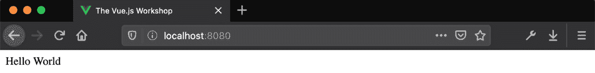

图 6.1 – 使用 greeter 混入显示 Hello World

当数据属性或方法名称发生重叠时，Vue 将优先考虑组件自己的选项。我们可以将这种机制解释为组件采用混入作为其默认选项，除非已经存在类似的声明。在这种情况下，实例将忽略混入的定义，而采用组件的定义。

例如，让我们向使用 `greeter` 混合的组件添加一个 `data()` 初始化器，该初始化器返回值为 `Hi` 的 `greeting` 数据：

```js
<script>
import greeter from './mixins/greeter.js'
export default {
  mixins: [greeter],
  data() {
    return {
      greeting: 'Hi'
    }
  }
}
</script>
```

`greeter` 也定义了 `greeting`，但组件也是如此。在这种情况下，组件会**获胜**，我们将看到显示的是 `Hi` 而不是 `Hello`（如混合中定义的），如下面的截图所示：

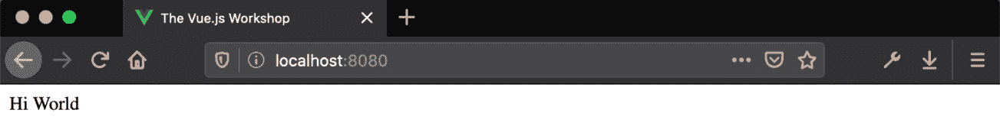

图 6.2 – 组件显示带有覆盖的问候数据值的“Hi World”

然而，此机制不适用于生命周期钩子。在混合中定义的钩子将具有优先执行权，Vue 总是最后触发组件的钩子。如果向组件添加了多个混合，则执行顺序遵循它们在 `mixins` 字段中出现的顺序。

我们可以在以下示例中观察到此执行顺序。让我们创建两个实现 `mounted` 生命周期钩子的混合，即 `firstMixin` 和 `secondMixin`，如下所示：

```js
const firstMixin = {
  mounted() {
    console.log('First mixin mounted hook')
  }
}
const secondMixin = {
  mounted() {
    console.log('Second mixin mounted hook')
  }
}
```

然后，我们也在组件中实现了相同的钩子，如下面的代码块所示：

```js
export default {
  mixins: [firstMixin, secondMixin],
  mounted() {
    console.log('Component mounted hook')
  }
}
```

完整的代码将如下所示：

```js
<template>
  <div>Mixin lifecycle hooks demo</div>
</template>
<script>
const firstMixin = {
  mounted() {
    console.log('First mixin mounted hook')
  }
}
const secondMixin = {
  mounted() {
    console.log('Second mixin mounted hook')
  }
}
export default {
  mixins: [firstMixin, secondMixin],
  mounted() {
    console.log('Component mounted hook')
  }
}
</script>
```

此组件的浏览器控制台输出如下：

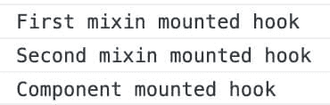

图 6.3 – 控制台日志输出显示了混合和组件钩子的执行顺序

现在，让我们通过在下一个练习中实现你的第一个混合来练习我们迄今为止所学的内容。

## 练习 6.01 – 创建你的混合

在此练习中，我们将创建一个名为 `debugger` 的混合。它包含一个接收 `Object` 作为其参数的 `debug` 方法，并使用 `JSON.stringify()` 函数返回表示其结构的字符串。此方法在调试浏览器上的 Vue.js 而不是控制台时打印可读格式的数据时很有用。

要访问此练习的代码文件，请参阅[`github.com/PacktPublishing/Frontend-Development-Projects-with-Vue.js-3/tree/v2-edition/Chapter06/Exercise6.01`](https://github.com/PacktPublishing/Frontend-Development-Projects-with-Vue.js-3/tree/v2-edition/Chapter06/Exercise6.01)。

执行以下步骤来完成此练习：

1.  以使用 `npm init vue@3` 生成的应用程序作为起点，或者在你的代码仓库的根目录中，使用以下命令导航到 `Chapter06/Exercise6.01` 文件夹：

    ```js
    > cd Chapter06/Exercise6.01/
    ```

    ```js
    > yarn
    ```

1.  在你的 VS Code 中打开练习项目（在项目目录中使用 `code .` 命令），或者使用你喜欢的 IDE。

1.  创建一个新的 `src/mixins` 文件夹和一个 `src/mixins/debugger.js` 文件，我们将在这里定义我们的混合的框架：

    ```js
    export default {}
    ```

1.  我们在 `methods` 下添加一个 `debug` 方法。`debug` 方法将接受一个 `obj` 参数，并返回该输入参数的 `JSON.stringify` 输出。我们将使用 `JSON.stringify(obj, null, 2)` 来输出两空格缩进的格式化 JSON：

    ```js
    export default {
    ```

    ```js
      methods: {
    ```

    ```js
        debug(obj) {
    ```

    ```js
          return JSON.stringify(obj, null, 2)
    ```

    ```js
        }
    ```

    ```js
      }
    ```

    ```js
    }
    ```

1.  现在，我们可以在`src/App.vue`中导入`debugger`混合，并在`mixins`属性下注册它：

    ```js
    <script>
    ```

    ```js
    import debug from './mixins/debugger.js'
    ```

    ```js
    export default {
    ```

    ```js
      mixins: [debugger],
    ```

    ```js
    }
    ```

    ```js
    </script>
    ```

1.  要查看`debug`方法的作用，我们将添加一个`data`方法，它返回一个`myObj`数据属性，以及一个`created`钩子，我们将计算`myObj`的`debug`输出：

    ```js
    <script>
    ```

    ```js
    // imports
    ```

    ```js
    export default {
    ```

    ```js
      // other component properties
    ```

    ```js
      data() {
    ```

    ```js
        return {
    ```

    ```js
          myObj: {
    ```

    ```js
            some: 'data',
    ```

    ```js
            other: 'values'
    ```

    ```js
          }
    ```

    ```js
        }
    ```

    ```js
      },
    ```

    ```js
      created() {
    ```

    ```js
        console.log(this.debug(this.myObj))
    ```

    ```js
      }
    ```

    ```js
    }
    ```

    ```js
    </script>
    ```

您应该得到以下输出：

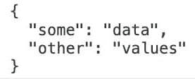

图 6.4 – 由于 created 钩子导致的浏览器控制台输出

1.  `debug`在模板中也是可用的。我们可以使用`pre`标签包裹其输出，以便尊重空白字符：

    ```js
    <template>
    ```

    ```js
      <div id="app">
    ```

    ```js
        <pre>{{ debug(myObj) }}</pre>
    ```

    ```js
      </div>
    ```

    ```js
    </template>
    ```

应用程序以及此模板将如下所示：

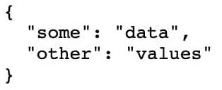

图 6.5 – 使用混合中的 debug 方法打印 myObj 的浏览器打印

我们已经学习了如何使用混合将共享逻辑和数据以相当明确的方式（`mixins`属性）注入到多个组件中。然而，由于数据覆盖和钩子执行的机制，混合可能导致大型代码库中的潜在错误和不受欢迎的行为。*因此，我们建议在可能的情况下，将共享逻辑和数据作为可组合的 Composition API 创建，而不是使用混合*。

现在，我们将探讨如何注入实例和全局功能，并通过插件进行分发。

# 理解插件

Vue 插件是向 Vue.js 全局添加自定义功能的一种方式。插件候选者的经典例子是翻译/国际化库（例如`i18n-next`）和 HTTP 客户端（例如`axios`、`fetch`和`GraphQL`客户端）。插件初始化器可以访问`Vue`实例，因此它是一个很好的方式来包装全局指令和组件，并在整个应用程序中注入资源。

Vue 插件是一个暴露`install`方法的对象。`install`函数使用`app`实例和`options`调用：

```js
const plugin = {
  install(app, options) {}
}
```

在`install`方法中，我们可以注册指令和组件，并添加全局和实例属性和方法：

```js
const plugin = {
  install(app, options) {
    app.directive('fade', { bind() {} })
    app.component(/*Register component globally*/)
    app.provide(/*Provide a resource to be injectable*/)
    app.config.globalProperties.$globalValue = 'very-
      global-value'
  }
}
```

我们可以使用`use`实例方法注册一个插件，如下所示：

```js
import plugin from './plugin'
const app = createApp(/*…*/)
app.use(plugin)
```

我们可以将选项作为`use()`方法的第二个参数传递。这些选项将传递给插件：

```js
app.use(plugin, { optionProperty: true })
```

`use()`不允许您注册相同的插件两次，避免了在尝试多次实例化或安装相同插件时出现的边缘情况行为。

在与 Vue 结合使用时，Axios 是一个流行的 HTTP 客户端。通常，使用拦截器或 Axios 选项配置 Axios 以实现重试、传递 cookie 或跟随重定向等功能。

可以使用`npm install –save axios`安装 Axios。在下一个练习中，我们将在应用程序内部创建一个包装 Axios 的插件。

## 练习 6.02 – 创建自定义 Axios 插件

为了避免添加 `import axios from 'axios'` 或将我们的自定义 Axios 实例包装在 `http` 或 `transport` 内部模块下，我们将我们的自定义 Axios 实例注入到 Vue 对象和 Vue 组件实例中，在 `Vue.axios` 和 `this.axios` 下。这将使它在我们的应用程序中使用更加方便和舒适，该应用程序需要调用 API 并使用 Axios 作为 HTTP 客户端。

要访问此练习的代码文件，请参阅 [`github.com/PacktPublishing/Frontend-Development-Projects-with-Vue.js-3/tree/v2-edition/Chapter06/Exercise6.02`](https://github.com/PacktPublishing/Frontend-Development-Projects-with-Vue.js-3/tree/v2-edition/Chapter06/Exercise6.02)。

执行以下步骤以完成此练习：

1.  使用由 `npm init vue@3` 生成的应用程序作为起点，或者在代码仓库的根目录中，通过以下命令导航到 `Chapter06/Exercise6.02` 文件夹：

    ```js
    > cd Chapter06/Exercise6.02/
    ```

    ```js
    > yarn
    ```

1.  在 VS Code 中打开练习项目（通过在项目目录中使用 `code .` 命令）或使用您首选的 IDE。

1.  为了正确组织代码，我们将在 `src/plugins` 中创建一个新的文件夹，并在 `src/plugins/axios.js` 中创建一个新的 `axios` 插件文件。在新文件中，我们将构建 `axios` 插件：

    ```js
    import axios from 'axios'
    ```

    ```js
    export default {
    ```

    ```js
      install(app, options) {}
    ```

    ```js
    }
    ```

1.  现在，我们将在 `src/main.js` 中注册我们的 `axios` 插件：

    ```js
    // other imports
    ```

    ```js
    import axiosPlugin from './plugins/axios.js'
    ```

    ```js
    // Vue instantiation code
    ```

    ```js
    const app = createApp(App)
    ```

    ```js
    app.use(axiosPlugin)
    ```

    ```js
    app.mount('#app')
    ```

1.  现在，我们将使用以下命令通过 npm 安装 Axios。这将允许我们导入 Axios 并通过插件将其暴露在 Vue 中：

    ```js
    npm install --save axios
    ```

1.  现在，我们将 Axios 添加到 Vue 中，作为 `src/plugins/axios.js` 中的全局属性：

    ```js
    import axios from 'axios'
    ```

    ```js
    export default {
    ```

    ```js
      install(app) {
    ```

    ```js
        app.config.globalProperties.$axios = axios
    ```

    ```js
      }
    ```

    ```js
    }
    ```

1.  Axios 现在在 Vue 中可用。在 `src/App.vue` 中，我们可以向 API 发送请求，这将填充 `todos` 列表：

    ```js
    <template>
    ```

    ```js
      <div id="app">
    ```

    ```js
        <div v-for="todo in todos" :key="todo.id">
    ```

    ```js
          <ul>
    ```

    ```js
            <li>Title: {{ todo.title }}</li>
    ```

    ```js
            <li>Status: {{ todo.completed ? "Completed" :
    ```

    ```js
              "Not Completed" }}</li>
    ```

    ```js
          </ul>
    ```

    ```js
        </div>
    ```

    ```js
      </div>
    ```

    ```js
    </template>
    ```

    ```js
    <script>
    ```

    ```js
    import Vue from 'vue'
    ```

    ```js
    export default {
    ```

    ```js
      async mounted() {
    ```

    ```js
        const { data: todos } = await
    ```

    ```js
          this.$axios(
    ```

    ```js
            'https://jsonplaceholder.typicode.com/todos'
    ```

    ```js
          )
    ```

    ```js
        this.todos = todos
    ```

    ```js
      },
    ```

    ```js
      data() {
    ```

    ```js
        return { todos: [] }
    ```

    ```js
      }
    ```

    ```js
    }
    ```

    ```js
    </script>
    ```

下面的输出是预期的：

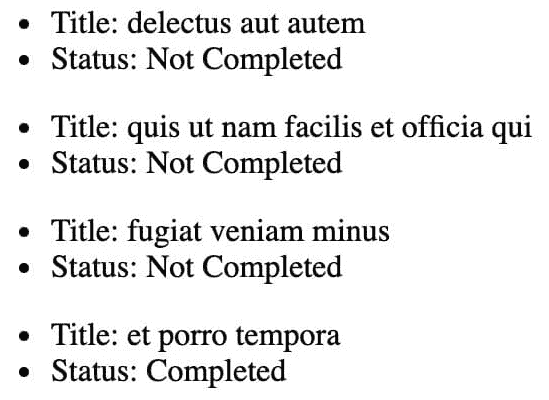

图 6.6 – 全局 this.$axios todo 显示示例

1.  在必要时，我们也可以通过使用 `app.provide()` 如下提供 Axios 作为可注入项，而不是在所有组件中使其可用：

    ```js
    // imports
    ```

    ```js
    export default {
    ```

    ```js
      install(app, options) {
    ```

    ```js
        // other plugin code
    ```

    ```js
        app.provide('axios', axios)
    ```

    ```js
      }
    ```

    ```js
    }
    ```

1.  现在，如果我们通过使用 `inject` 属性将 `'axios'` 注入到该组件中，我们就可以在 `src/App.vue` 中通过 `this.axios` 访问 Axios：

    ```js
    <script>
    ```

    ```js
    export default {
    ```

    ```js
      inject: ['axios'],
    ```

    ```js
      async mounted() {
    ```

    ```js
        const { data: todos } = await this.axios(
    ```

    ```js
           'https://jsonplaceholder.typicode.com/todos'
    ```

    ```js
          )
    ```

    ```js
        this.todos = todos
    ```

    ```js
      },
    ```

    ```js
      data() {
    ```

    ```js
        return { todos: [] }
    ```

    ```js
      }
    ```

    ```js
    }
    ```

    ```js
    </script>
    ```

上述代码的输出与 *图 6.6* 中的输出相同。

有了这个，我们已经使用插件注入了全局和实例级别的属性和方法。

现在，我们将探讨全局注册组件如何帮助减少代码库中高使用组件的样板代码。

# 全局注册组件

使用插件的原因之一是通过删除 `imports` 并用对 `this` 的访问来减少所有 Vue 应用程序文件中的样板代码。

Vue.js 组件通常在单个文件组件中定义，并显式导入。与定义全局方法和属性的原因类似，我们可能希望全局注册组件。这将允许我们在所有其他组件模板中使用这些组件，而无需导入和注册它们在 `components` 属性下。

这种情况在使用设计系统或组件在代码库中跨模块使用时非常有用。

全局注册组件有助于某些类型的更新，例如，如果文件名没有暴露给消费者，那么在更改文件名时，只有一个路径需要更新，而不是每个用户一个。

假设我们有一个 `CustomButton.vue` 文件中的 `CustomButton` 组件，其外观如下：

```js
<template>
  <button @click="$emit('click', $event)">
    <slot />
  </button>
</template>
```

我们可以将 `CustomButton` 全局注册如下（这通常在 `main.js` 文件中完成）：

```js
// other imports
import CustomButton from './components/CustomButton.vue'
app.component('CustomButton', CustomButton)
```

我们现在可以在 `App.vue` 文件中使用它，而无需本地注册或导入：

```js
<template>
  <div>
    <CustomButton>Click Me</CustomButton>
  </div>
</template>
```

这将按预期渲染，显示一个名为 **Click Me** 的按钮：

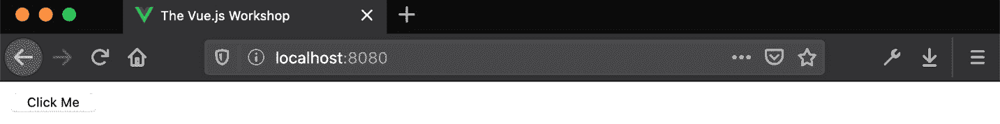

图 6.7 – 使用 Click Me 按钮渲染 CustomButton

通过这样，我们已经探讨了全局注册组件如何减少在代码库中频繁使用组件时的样板代码。

下一节将致力于通过学习如何在不使用 `.vue` 文件的情况下使用 Vue.js 组件来加深我们对 Vue.js 组件的理解。

## 使用非 SFC Vue 组件

我们看到的大多数 Vue.js 组件示例都利用了 `.vue` 单文件组件。这不是定义 Vue.js 组件的唯一方法。在本节中，我们将探讨四种不同的方法来定义 Vue.js 组件，而不使用 `.vue` 文件。

评估这些选项将帮助我们理解 Vue.js 组件的核心是什么。

### 使用字符串模板进行运行时定义

组件可以使用接受字符串值的 `template` 属性。这通常被称为 **字符串模板**。此模板在运行时（在浏览器中）被评估。

我们可以在 `StringTemplate.js` 文件中通过定义一个具有 `template` 属性的对象来定义一个组件：

```js
export default {
  template: '<div>String Template Component</div>'
}
```

然后，可以从 `App.vue` 文件中消费它，如下所示：

```js
<template>
  <div id="app">
    <StringTemplate />
  </div>
</template>
<script setup>
import StringTemplate from './components/StringTemplate.js'
</script>
```

不幸的是，浏览器不会显示 `StringTemplate` 的内容，在控制台日志中，您将找到以下 Vue 警告：

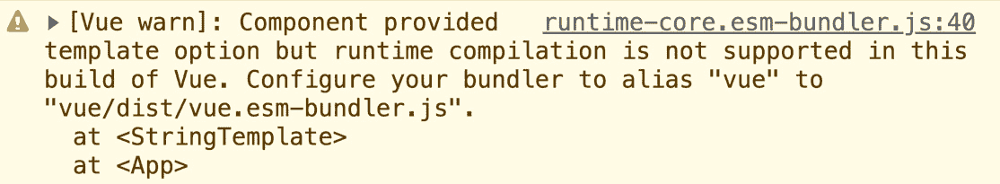

图 6.8 – Vue 运行时编译器缺失警告

为了使此组件正常工作，我们需要包含 Vue 运行时编译器。我们可以通过手动添加 `'vue/dist/vue.esm-bundler.js'` 作为 Vite 引擎的 `vue` 别名来解决。

您的 `vite.config.js` 文件应如下所示：

```js
export default defineConfig({
  plugins: [vue()],
  resolve: {
    alias: {
      "@": fileURLToPath(new URL("./src",
        import.meta.url)),
      vue: "vue/dist/vue.esm-bundler.js",
    },
  },
});
```

重新启动开发服务器后，浏览器中会出现 `StringTemplate` 组件的消息：

```js
String Template Component
```

接下来，让我们探索如何使用 `render` 函数创建组件。

### 理解渲染函数

在幕后，`template` 部分在构建时被编译成一个 `render` 函数。

从 Vue 3 开始，组件选项中的 `render` 方法不再接受 `createElement` 参数并返回从 `createElement` 执行中接收到的虚拟 DOM 节点。相反，Vue 提供了一个 `h` 函数，它执行相同的功能。

我们可以在一个 JavaScript 文件（`RenderFunction.js`）中定义一个组件，并具有一个 `render` 属性，如下所示：

```js
import { h } from 'vue'
export default {
  render() {
    return h(
      'h2',
      'Render Function Component'
    )
  }
}
```

这可以在 `App.vue` 文件中如下渲染：

```js
<template>
  <div id="app">
    <RenderFunction />
  </div>
</template>
<script setup>
import RenderFunction from './components/RenderFunction.js'
</script>
```

此组件在浏览器中显示一个带有文本 `Render Function Component` 的 `h2`：

```js
Render Function Component
```

除了在非 `.vue` 文件中编写组件外，`render` 函数对于高度动态的组件也很有用。

### JSX

**JSX** 是 JavaScript 的超集，它允许在 React 中使用 HTML 样式的标签和花括号进行插值，类似于 SFC 到 Vue。

与 Vue 一样，React 也不会将原始 JSX 渲染到 DOM 中。React 也使用 `render` 将组件的内容渲染到虚拟 DOM 中。然后虚拟 DOM 与真实 DOM 进行 *协调*（同步）。

Vite 和 Vue CLI 都默认支持 Vue 应用的 JSX 编译器。您只需在安装配置时使用 `create-vue` 打开 JSX 支持。这意味着我们可以编写以下 `JSXRender.js` 文件，它是 `RenderFunction` 组件的等价物：

```js
export default {
  render() {
    return <h2>JSX Render Function Component</h2>
  }
}
```

没有 JSX 的等效 `render` 函数如下所示：

```js
import { h } from 'vue'
export default {
  render() {
    return h(
      'h2',
      'JSX Render Function Component'
    )
  }
}
```

以下 `App.vue` 文件将 `JSXRender` 渲染到浏览器：

```js
<template>
  <div id="app">
    <JSXRender />
  </div>
</template>
<script setup>
import JSXRender from './components/JSXRender.js'
</script>
```

现在，我们可以在屏幕上看到 `JSXRender` 中的 `h2`，内容符合预期：

```js
JSX Render Function Component
```

我们现在将探讨如何使用 Vue.js 的 `component` 标签从运行时数据动态渲染组件。

# 理解组件

JSX 和 `render` 函数非常适合那些需要渲染的组件非常动态的情况。我们也可以使用 Vue 的 `component` 实现这种能力。

要渲染动态组件，我们使用一个带有绑定 `is` 属性的 `component` 标签（在这里，我们使用的是简写 `:is`，它等同于 `v-bind:is`）：

```js
<component :is="componentName" />
```

我们现在将学习如何使用名称或组件引用来渲染动态组件。

## 通过名称或组件引用渲染动态组件

假设我们有一个网格，其中包含可以切换显示为卡片显示（带有图像和文本的设计元素）或仅图像视图的项目。

首先，我们需要导入相关组件并将它们注册为组件。我们还将设置一些固定数据以循环显示网格：

```js
<template>
  <div id="app">
    <div class="grid">
      <component
        class="grid-item"
        v-for="item in items"
        :key="item.id"
      />
    </div>
  </div>
</template>
<script>
import Card from './components/Card.vue';
import ImageEntry from './components/ImageEntry.vue';
export default {
  components: {
    Card,
    ImageEntry
  },
  data() {
    return {
      items: [
        {
          id: '10',
          title: 'Forest Shot',
          url: 'https://picsum.photos/id/10/1000/750.jpg',
        },
        {
          id: '1000',
          title: 'Cold cross',
          url:
            'https://picsum.photos/id/1000/1000/750.jpg',
        },
        {
          id: '1002',
          title: 'NASA shot',
          url:
            'https://picsum.photos/id/1002/1000/750.jpg',
        },
        {
          id: '866',
          title: 'Peak',
          url: 'https://picsum.photos/id/866/1000/750.jpg'
        },
      ]
    }
  }
}
</script>
```

我们可以按名称引用组件——即 `Card` 和 `ImageEntry`——并将 `itemComponent` 作为 `is` 的值：

```js
<template>
    <!-- rest of template -->
    <component
      :is="itemComponent"
      class="grid-item"
      v-for="item in items"
      :key="item.id"
    />
    <!-- rest of template -->
</template>
<script>
// rest of script
export default {
  // other component properties
  data() {
    return {
      itemComponent: 'Card',
      // other data properties eg. 'items'
    }
  }
}
</script>
```

在前面的代码中，Vue 将渲染 `Card` 组件，因为我们设置了 `itemComponent` 的值为 `card`。

如果我们将 `itemComponent` 设置为 `image-entry`，Vue 将渲染 `ImageEntry` 组件。这个切换可以通过以下方式使用 `v-model` 来实现：

```js
<template>
  <!-- rest of template -->
  Display mode:
  <input
    type="radio"
    name="style"
    value="Card"
    v-model="itemComponent"
    id="card-radio"
  />
  <label for="card-radio">Card</label>
  <input
    type="radio"
    name="style"
    value="ImageEntry"
    v-model="itemComponent"
    id="image-radio"
  />
  <label for="image-radio">Image</label>
  <!-- rest of template -->
</template>
```

我们还可以使用组件引用本身将组件传递给 `is`（而不是使用名称）。例如，我们可以将 `itemComponent` 设置为 `Card`：

```js
<script>
// rest of script
export default {
  // other component properties
  data() {
    return {
      itemComponent: 'Card',
      // other data properties eg. 'items'
    }
  }
}
</script>
```

在这种情况下，切换卡片和图像视图会更困难，因为我们需要使用组件引用而不是使用名称。

我们可以像传递常规属性一样，使用 `component` 动态渲染的组件传递属性，无论是使用 `v-bind:prop-name` 还是 `:prop-name` 简写：

```js
<template>
    <!-- rest of template -->
    <component
      class="grid-item"
      v-for="item in items"
      :key="item.id"
      :is="itemComponent"
      :url="item.url"
      :title="item.title"
    />
    <!-- rest of template -->
</template>
```

给定以下 `Card` 和 `ImageEntry` 组件，我们得到一个具有可切换视图的网格项应用程序。

`Card.vue` 渲染图像和标题，最大宽度为 `150px`：

```js
<template>
  <div class="card">
    
    <h3>{{ title }}</h3>
  </div>
</template>
<script>
export default {
  props: {
    url: String,
    title: String
  }
}
</script>
<style scoped>
.card {
  margin: 10px;
  max-width: 150px;
}
h3 {
  font-weight: normal;
}
</style>
```

您的输出将显示卡片视图中的条目，如下所示：

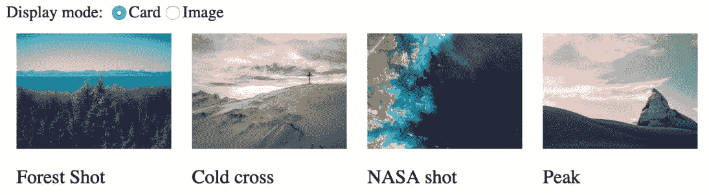

图 6.9 – 卡片视图中的网格渲染条目

使用 `ImageEntry.vue` 仅渲染卡片视图宽度的两倍宽度的图像：

```js
<template>
  
</template>
<script>
export default {
  props: {
    url: String
  }
}
</script>
<style scoped>
.image {
  margin: 20px;
  max-width: 300px;
}
</style>
```

您现在将看到图像视图中的条目，如下面的屏幕截图所示：


图 6.10 – 图像视图中的网格渲染条目

`component` 标签的一个注意事项是，当不再显示时，渲染的动态组件会被完全拆解。在这个例子中，正在渲染的动态组件没有任何状态，因此这种拆解不会引起任何问题。

我们现在将学习如何缓存动态组件状态。

## 使用 `keep-alive` 缓存动态组件状态

通过 `component` 标签动态渲染的组件可以有状态，例如在多部分表单中，下一页有一个 `name` 字段和一个 `address` 字段。

让我们用 `component` 标签来实现这一点，如下所示：

```js
<template>
  <div id="app">
    <component
      :is="activeStep"
      @next="activeStep = 'second-step'"
      @back="activeStep = 'first-step'"
    />
  </div>
</template>
<script>
import FirstStep from './components/FirstStep.vue'
import SecondStep from './components/SecondStep.vue'
export default {
  components: {
    FirstStep,
    SecondStep
  },
  data() {
    return {
      activeStep: 'first-step',
    }
  }
}
</script>
```

在 `FirstStep` 组件中，我们将实现一个需要用户姓名的 `input` 字段，如下所示：

```js
<template>
  <label> Name: <input v-model="name" /> </label>
  <button @click="next">Next</button>
</template>
<script setup>
import { ref } from "vue";
const name = ref("");
const emits = defineEmits(["next"]);
const next = () => {
  emits('next', name.value);
};
</script>
```

对于 `SecondStep.vue`，我们将实现另一个带有两个按钮的输入字段，用于导航后退和前进，如下面的代码块所示：

```js
<template>
  <label> Address: <input v-model="address" /> </label>
    <button @click="next">Next</button>
    <button @click="back">Back</button>
</template>
<script setup>
import { ref } from "vue";
const emits = defineEmits(["next", "back"]);
const next = () => {
  emits("next", name.value);
};
const back = () => {
  emits("back");
};
const address = ref("");
</script>
```

通过这样做，我们可以在 **名称** 字段中输入数据：

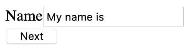

图 6.11 – “我的名字是”已输入到名称字段中

如果我们使用 **下一步** 导航到表单的地址部分，然后使用 **后退**，名称将消失，如下面的屏幕截图所示：

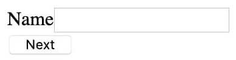

图 6.12 – 点击下一步然后后退到地址步骤时名称字段为空

这是因为组件在不是当前渲染的动态组件时会被卸载。

为了解决这个问题，我们可以在 `component` 标签周围使用 `keep-alive` 元素：

```js
<template>
  <!-- rest of template -->
  <keep-alive>
    <component
      :is="activeStep"
      @next="activeStep = 'second-step'"
      @back="activeStep = 'first-step'"
    />
  </keep-alive>
  <!-- rest of template -->
</template>
```

以这种方式，填写姓名并从表单的地址部分返回将显示以下内容：

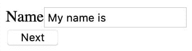

图 6.12 – 导航后“我的名字是”仍然是名称字段中的值

我们已经学习了如何使用 `component` 标签来表示一个区域，在这个区域内我们可以根据字符串或组件本身（如导入的）动态显示组件。我们还探讨了如何解决 `component` 的主要问题；即如何使用 `keep-alive` 在 `component` 标签中维护不是当前正在使用的组件的状态。

现在让我们在下一个练习中练习我们所学的内容。

## 练习 6.03 – 使用组件标签创建动态卡片布局

现代应用布局是一个由卡片组成的网格。卡片布局的优点是非常适合移动、桌面和平板显示器。在这个练习中，我们将创建一个具有三种不同模式和选择其中一种方式的功能的动态卡片布局。这个布局将允许用户选择屏幕上显示多少信息以适应他们的偏好：

+   `Rich`视图将显示项目的所有详细信息，包括图片、标题和描述

+   `Compressed`视图将显示所有详细信息，但不显示图片预览

+   `List`视图将只显示标题，应该是一个垂直布局

每个卡片视图都将作为一个单独的组件实现，然后使用`component`标签动态渲染。

要访问此练习的代码文件，请参阅[`github.com/PacktPublishing/Frontend-Development-Projects-with-Vue.js-3/tree/v2-edition/Chapter06/Exercise6.03`](https://github.com/PacktPublishing/Frontend-Development-Projects-with-Vue.js-3/tree/v2-edition/Chapter06/Exercise6.03)。

执行以下步骤以完成此练习：

1.  使用由`npm init vue@3`生成的应用程序作为起点，或者在代码仓库的根目录中，使用以下命令按顺序导航到`Chapter06/Exercise6.03`文件夹：

    ```js
    > cd Chapter06/Exercise6.03/
    ```

    ```js
    > yarn
    ```

1.  在您的 VS Code 中打开练习项目（在项目目录中使用`code .`命令）或您首选的 IDE。

1.  在`src/components/Rich.vue`中创建丰富的布局。它包含三个属性，称为`url`（图片 URL）、`title`和`description`，分别渲染图片、标题和描述：

    ```js
    <template>
    ```

    ```js
      <div class="card">
    ```

    ```js
        
    ```

    ```js
        <h3>{{ title }}</h3>
    ```

    ```js
        <p>{{ description }}</p>
    ```

    ```js
      </div>
    ```

    ```js
    </template>
    ```

    ```js
    <script setup>
    ```

    ```js
    import { defineProps } from 'vue'
    ```

    ```js
    const { url, title, description } = defineProps(
    ```

    ```js
        ['url', 'title', 'description']
    ```

    ```js
    )
    ```

    ```js
    </script>
    ```

    ```js
    <style scoped>
    ```

    ```js
    .card {
    ```

    ```js
      display: flex;
    ```

    ```js
      flex-direction: column;
    ```

    ```js
      max-width: 200px;
    ```

    ```js
    }
    ```

    ```js
    h3 {
    ```

    ```js
      font-weight: normal;
    ```

    ```js
      margin-bottom: 0;
    ```

    ```js
      padding-bottom: 0;
    ```

    ```js
    }
    ```

    ```js
    </style>
    ```

1.  使用一些固定数据设置`src/App.vue`：

    ```js
    <template>
    ```

    ```js
      <div id="app">
    ```

    ```js
      </div>
    ```

    ```js
    </template>
    ```

    ```js
    <script setup>
    ```

    ```js
    const items = [
    ```

    ```js
           {
    ```

    ```js
             id: '10',
    ```

    ```js
             title: 'Forest Shot',
    ```

    ```js
             description: 'Recent shot of a forest
    ```

    ```js
               overlooking a lake',
    ```

    ```js
             url:
    ```

    ```js
             'https://picsum.photos/id/10/1000/750.jpg',
    ```

    ```js
           },
    ```

    ```js
           {
    ```

    ```js
             id: '1000',
    ```

    ```js
             title: 'Cold cross',
    ```

    ```js
             description: 'Mountaintop cross with
    ```

    ```js
               snowfall from Jan 2018',
    ```

    ```js
             url:
    ```

    ```js
             'https://picsum.photos/id/1000/1000/750.jpg',
    ```

    ```js
           },
    ```

    ```js
         ]
    ```

    ```js
    </script>
    ```

1.  将`Rich`视图组件导入到`src/App.vue`并本地注册：

    ```js
    <script setup>
    ```

    ```js
    import Rich from './components/Rich.vue'
    ```

    ```js
    // other component properties, eg. "data"
    ```

    ```js
    </script>
    ```

1.  一旦我们得到了`Rich`视图组件，将其连接到`src/App.vue`中的应用程序中，使用`component`渲染它，并通过以下方式传递相关属性：

    ```js
    <template>
    ```

    ```js
      <!-- rest of template -->
    ```

    ```js
          <component
    ```

    ```js
            v-for="item in items"
    ```

    ```js
            :key="item.id"
    ```

    ```js
            :is="layout"
    ```

    ```js
            :title="item.title"
    ```

    ```js
            :description="item.description"
    ```

    ```js
            :url="item.url"
    ```

    ```js
          />
    ```

    ```js
      <!-- rest of template -->
    ```

    ```js
    </template>
    ```

    ```js
    <script setup>
    ```

    ```js
      import { shallowRef } from 'vue'
    ```

    ```js
      const layout = shallowRef(Rich)
    ```

    ```js
      // other data definitions eg. 'items'
    ```

    ```js
    </script>
    ```

1.  这是一个添加一些样式使网格看起来像网格的好地方：

    ```js
    <template>
    ```

    ```js
      <!-- rest of template -->
    ```

    ```js
        <div class="grid">
    ```

    ```js
          <component
    ```

    ```js
            v-for="item in items"
    ```

    ```js
            :key="item.id"
    ```

    ```js
            :is="layout"
    ```

    ```js
            :title="item.title"
    ```

    ```js
            :description="item.description"
    ```

    ```js
            :url="item.url"
    ```

    ```js
          />
    ```

    ```js
        </div>
    ```

    ```js
      <!-- rest of template -->
    ```

    ```js
    </template>
    ```

    ```js
    <style scoped>
    ```

    ```js
    .grid {
    ```

    ```js
      display: flex;
    ```

    ```js
    }
    ```

    ```js
    </style>
    ```

这将显示以下输出：


图 6.14 – 动态渲染的 Rich 组件

1.  现在，在`Compressed.vue`文件中实现`Compressed`视图，它只是没有图片的`Rich`视图：

    ```js
    <template>
    ```

    ```js
      <div class="card">
    ```

    ```js
        <h3>{{ title }}</h3>
    ```

    ```js
        <p>{{ description }}</p>
    ```

    ```js
      </div>
    ```

    ```js
    </template>
    ```

    ```js
    <script setup>
    ```

    ```js
    import { defineProps } from 'vue'
    ```

    ```js
    const { title, description } = defineProps(
    ```

    ```js
        ['title', 'description']
    ```

    ```js
    )
    ```

    ```js
    </script>
    ```

    ```js
    <style scoped>
    ```

    ```js
    .card {
    ```

    ```js
      display: flex;
    ```

    ```js
      flex-direction: column;
    ```

    ```js
      min-width: 200px;
    ```

    ```js
    }
    ```

    ```js
    h3 {
    ```

    ```js
      font-weight: normal;
    ```

    ```js
      padding-bottom: 0;
    ```

    ```js
    }
    ```

    ```js
    p {
    ```

    ```js
     margin: 0;
    ```

    ```js
    }
    ```

    ```js
    </style>
    ```

1.  在`src/App.vue`中导入并注册`Compressed`组件。然后创建我们的`layoutOptions`数组，包含两个元素。每个元素有两个字段：布局的`name`和两个组件实例，分别是`Rich`和`Compressed`，如下面的代码块所示：

    ```js
    <script setup>
    ```

    ```js
    // other imports
    ```

    ```js
    import Compressed from './components/Compressed.vue'
    ```

    ```js
    const layoutOptions = [ {
    ```

    ```js
      name: 'Rich',
    ```

    ```js
      component: Rich
    ```

    ```js
    }, {
    ```

    ```js
      name: 'Compressed',
    ```

    ```js
      component: Compressed
    ```

    ```js
    }]
    ```

    ```js
      // other component properties
    ```

    ```js
    </script>
    ```

1.  添加`select`以在视图之间切换。它将从`layoutOptions`数组中使用`v-for`获取选项，并使用`v-model`将其选中值绑定到`layout`：

    ```js
    <template>
    ```

    ```js
      <!-- rest of template -->
    ```

    ```js
      Layout: <select v-model="layout">
    ```

    ```js
        <option
    ```

    ```js
          v-for="(option, index) in layoutOptions"
    ```

    ```js
          :key="index"
    ```

    ```js
          :value="option.component"
    ```

    ```js
          >{{option.name}}</option>
    ```

    ```js
        </select>
    ```

    ```js
      <!-- rest of template -->
    ```

    ```js
    </template>
    ```

使用`select`，我们可以切换到**Compressed**布局，其外观如下：

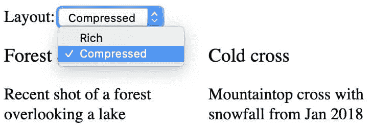

图 6.15 – 带有选项下拉选择器的压缩布局

1.  将`List`布局添加到`src/components/List.vue`。`List`视图是压缩视图，但没有描述：

    ```js
    <template>
    ```

    ```js
      <h3>{{ title }}</h3>
    ```

    ```js
    </template>
    ```

    ```js
    <script setup>
    ```

    ```js
    import { defineProps } from 'vue'
    ```

    ```js
    const { title } = defineProps(['title'])
    ```

    ```js
    </script>
    ```

    ```js
    <style scoped>
    ```

    ```js
    h3 {
    ```

    ```js
      width: 100%;
    ```

    ```js
      font-weight: normal;
    ```

    ```js
    }
    ```

    ```js
    </style>
    ```

1.  将`List`组件导入到`src/App.vue`并本地注册：

    ```js
    <script setup>
    ```

    ```js
    // other imports
    ```

    ```js
    import List from './components/List.vue'
    ```

    ```js
    const layoutOptions = [ {
    ```

    ```js
      name: 'Rich',
    ```

    ```js
      component: Rich
    ```

    ```js
    }, {
    ```

    ```js
      name: 'Compressed',
    ```

    ```js
      component: Compressed
    ```

    ```js
    }, {
    ```

    ```js
      name: 'List',
    ```

    ```js
      component: List
    ```

    ```js
    }]
    ```

    ```js
      // other component properties
    ```

    ```js
    </script>
    ```

当切换到**List**布局时，项目以水平行显示，如下所示：

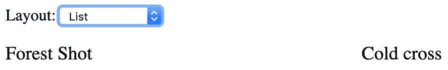

图 6.16 – 带有错误水平堆叠的列表视图

1.  为了修复这种水平堆叠，创建一个新的`grid-column`类，设置`flex-direction: column`（与默认的`row`相反）并在布局为`List`时条件性地应用它：

    ```js
    <template>
    ```

    ```js
      <!-- rest of template -->
    ```

    ```js
        <div class="grid" :class="{ 'grid-column': layout
    ```

    ```js
          === List }">
    ```

    ```js
          <!-- grid using component tag -->
    ```

    ```js
        </div>
    ```

    ```js
      <!-- rest of template -->
    ```

    ```js
    </template>
    ```

    ```js
    <style scoped>
    ```

    ```js
    /* existing rules */
    ```

    ```js
    .grid-column {
    ```

    ```js
      flex-direction: column;
    ```

    ```js
    }
    ```

    ```js
    </style>
    ```

我们现在的**List**布局如下所示：

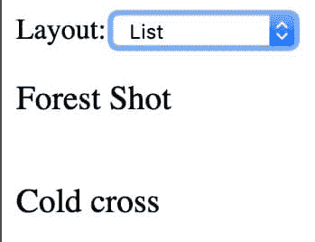

图 6.17 – 带有垂直堆叠的列表视图

通过这样，我们已经学会了如何使用`component`标签通过名称和通过使用组件对象本身动态渲染不同的组件。我们还探讨了有状态动态组件的陷阱，即组件不再显示时的组件拆解以及如何使用`keep-alive`元素来规避它们。

我们现在将探讨如何使用函数式组件仅通过`render`函数或`template`标签来实现简单的组件。

# 编写函数式组件

在 Vue 2.0 中，您可以通过在组件选项中将`functional`字段设置为`true`来声明一个组件为函数式组件：

```js
export default {
  functional: true,
}
```

这也可以通过直接在`template`标签上设置`functional`来实现：

```js
<template functional>
  <!— template code -->
</template>
```

您还可以通过组件的`render()`方法或`template`部分来设置组件的渲染方式。然而，如果两个字段都存在，Vue 将采用`render()`方法。

然而，从 Vue 3.0 开始，Vue 移除了`functional`属性，您只能使用 JavaScript 函数声明函数式组件，这是 Vue 将触发以创建组件的`render`函数：

```js
const functionComp = (props, context) => {
 return h(/*…*/)
}
```

一旦声明为函数式组件，该组件就没有任何响应式状态，并且由于它不可用，您无法访问`this`实例。相反，Vue 触发`render`函数，并将组件的属性和必要上下文传递给它，包括`attrs`、`slots`以及传递的事件处理器的`emit`：

```js
const functionComp = (props, { attrs, slots, emit }) => {
 return h(/*…*/)
}
```

您也可以通过直接设置其字段`props`和`emits`来定义接受的属性和事件：

```js
functionComp.props = [/* props */]
functionComp.emits = [/* emits */]
```

要开始使用 JSX 代码，您需要使用 Vite 创建带有 JSX 支持的 Vue 项目。否则，在`vite.config.js`中，您需要手动从`'@vitejs/plugin-vue-jsx'`包导入`vueJsx`，如下所示：

```js
import vueJsx from '@vitejs/plugin-vue-jsx'
```

然后将导入的`vueJsx`插件添加到`plugins`数组中，如下所示：

```js
plugins: [vue(), vueJsx()],
```

通过前面的配置，您现在使用 Vite 创建的 Vue 项目支持带有 JSX 的函数式组件，我们将在以下示例中演示。

以下代码块是定义函数式组件 `GreetComponent.jsx` 的示例：

```js
import { h } from 'vue';
export function GreetComponent(props, context) {
  return h(
    <div>
      <h2>{ props.greeting} {props.audience} </h2>
      <button
        onClick={() => context.emit('acknowledge', true) }
      >
        Acknowledge
      </button>
    </div>
  )
}
```

我们还显式地声明了 `GreetComponent` 的 `props` 和 `emits`：

```js
GreetComponent.props = {
    greeting: String,
    audience: String,
}
GreetComponent.emits = ['acknowledge']
```

注意，在这里，由于我们使用 JSX 语法来定义组件，我们需要确保 `GreetComponent` 的文件扩展名是 `.jsx` 而不是 `.js` (`GreetComponent.jsx`)。此外，我们需要确保在用 `create-vue` 命令（Vite）创建项目时启用 JSX 支持。

现在，我们可以在 `App.vue` 中将 `GreetComponent` 作为常规组件导入和使用：

```js
<script setup>
import { GreetComponent } from './components/GreetComponent.jsx'
const acknowledge = () => {
  console.log('Acknowledged')
}
</script>
<template>
    <GreetComponent
      greeting="Hi"
      audience="World"
      @acknowledge="acknowledge"
    />
</template>
```

这将在浏览器中渲染以下内容：

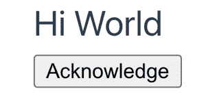

图 6.18 – 函数式组件渲染

您还可以结合 Composition API 创建具有状态的函数式组件。在下面的示例中，我们创建了一个具有响应式消息的 `Message` 组件：

```js
import { ref } from 'vue'
export function Message(props, context) {
  const message = ref('Hello World')
  return (
    <div>
      <span>{ message.value }</span>
    </div>
  )
}
```

注意，在这里，我们通过使用 `message.value` 而不是直接使用 `message` 来显示 `message` 值。

到目前为止，我们已经学习了如何使用 Composition API 编写函数式组件 – 无状态或带状态 – 现在，我们将构建一个使用本章中查看的所有模式的待办事项应用。

## 活动 6.01 – 使用插件和可重用组件构建 Vue.js 应用程序

要访问此活动的代码文件，请参阅 [`github.com/PacktPublishing/Frontend-Development-Projects-with-Vue.js-3/tree/v2-edition/Chapter06/Activity6.01`](https://github.com/PacktPublishing/Frontend-Development-Projects-with-Vue.js-3/tree/v2-edition/Chapter06/Activity6.01)

在这个活动中，我们将构建一个集成 `jsonplaceholder` 作为数据源的待办事项应用。

我们的待办事项应用将加载待办事项并将它们显示为列表。它将根据待办事项是否完成显示复选框，以及待办事项的名称。

当勾选待办事项时，应用程序将同步它到 API。

我们将作为插件注入 Axios 以查询 [`jsonplaceholder.typicode.com`](https://jsonplaceholder.typicode.com)。

按照以下步骤完成此活动：

1.  在项目中安装 `axios`。

1.  要将 `axios` 注入为属性到 `this` 组件实例中，创建一个 `src/plugins/axios.js` 插件文件，在安装时，这意味着组件实例将有一个可注入的 `axios` 属性。

1.  为了使插件工作，请将其导入并注册到 `src/main.js` 中。

1.  我们还希望将我们的 API 的 `$baseUrl` 注入到所有组件中作为全局作用域。我们将创建一个与 `src/main.js` 文件内联的插件来完成此操作。

1.  现在，我们想要从 `src/App.vue` 中获取所有待办事项。一个好的地方是在 `mounted` 生命周期方法中做这件事。

1.  要显示待办事项列表，我们将在 `src/components/TodoList.vue` 中创建一个 `TodoList` 组件，该组件接受一个 `todos` 属性，遍历项目，并在 `todo` 作用域插槽中延迟渲染待办事项，该插槽绑定待办事项。

1.  我们现在可以使用 `TodoList` 组件在 `src/App.vue` 中渲染我们已获取的 *todos*。

1.  现在，我们需要创建一个`TodoEntry`组件，我们将在这里实现大部分待办事项特定的逻辑。对于组件来说，一个好的做法是让 props 非常具体地对应组件的角色。在这种情况下，我们将处理的`todo`对象的属性是`id`、`title`和`completed`，因此这些应该是我们的`TodoEntry`组件接收的 props。我们不会将`TodoEntry`做成一个函数组件，因为我们需要组件实例来创建 HTTP 请求。

1.  然后，我们将更新`src/App.vue`，使其消费`TodoEntry`（确保绑定`id`、`title`和`completed`）。

1.  添加切换`todo`的功能。我们将大部分实现放在`src/components/TodoEntry.vue`中。我们将监听`input`变化事件。在变化时，我们将读取新值并向`/todos/{todoId}`发送一个包含`completed`设置为新值的`PATCH`请求。我们还将想要在 Vue.js 中发出一个`completedChange`事件，以便`App`组件可以更新内存中的数据。

1.  在`App.vue`中，当触发`completeChange`时，我们希望更新相关的`todo`。由于`completeChange`不包含`todo`的 ID，我们需要在设置`handleCompleteChange`函数以监听`completeChange`时从上下文中读取该 ID。

预期输出如下：

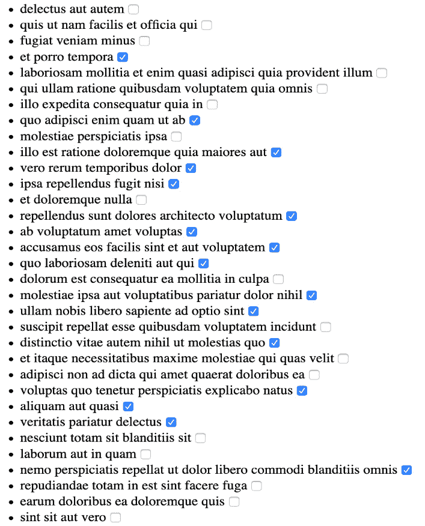

图 6.19 – 使用 jsonplaceholder 数据的我们的待办事项应用

# 摘要

在本章中，我们探讨了全局组合模式和高级组件设置，我们可以利用这些模式为 Vue.js 应用程序创建一个可重用的代码库。我们学习了混合（mixins）、插件，如何使用组件标签进行动态组件渲染，以及有状态和无状态的函数组件。

到目前为止，我们已经学习了如何从组件、混合和插件的角度构建应用程序。要构建跨越多个页面的应用程序，我们需要实现路由。这就是我们在下一章将要解决的问题。
