# 7

# 路由

在上一章中，您学习了使用 mixins 在组件之间共享公共逻辑、创建应用插件以及其他创建组件的方法，如动态和功能组件。

本章将指导您了解路由和 Vue Router 是如何工作的。您将学习如何使用 Vue Router 在您的应用中设置、实现和管理路由系统。您将了解动态路由用于传递参数值和嵌套路由用于在复杂应用中提高复用性。此外，我们还将探讨 JavaScript 钩子，这些钩子对于身份验证和错误处理非常有帮助。

到本章结束时，您将准备好处理任何 Vue 应用中的静态和动态路由。

本章涵盖了以下主题：

+   理解路由

+   理解 Vue Router

+   探索`RouterView`元素

+   定义路由

+   为您的应用设置默认布局

+   使用`RouterLink`设置导航链接

+   传递路由参数

+   理解路由钩子

+   使用 props 解耦参数

+   动态路由

+   捕获错误路径

+   嵌套路由

+   使用布局

# 技术要求

在本章中，您需要按照*第一章*中“开始您的第一个 Vue 项目”的说明设置一个基本的 Vue 项目。建议创建一个单文件 Vue 组件来练习轻松地处理提到的示例和概念。

您可以在此处找到本章的源代码：[`github.com/PacktPublishing/Frontend-Development-Projects-with-Vue.js-3/tree/v2-edition/Chapter07`](https://github.com/PacktPublishing/Frontend-Development-Projects-with-Vue.js-3/tree/v2-edition/Chapter07)。

# 理解路由

当用户在 URL 栏中输入`website.com/about`时，将被重定向到**关于**页面。

在 Web 开发中，路由是我们决定如何将 HTTP 请求与处理它们的代码相连接的匹配机制。每当我们的应用需要 URL 导航时，我们都会使用路由。大多数现代 Web 应用都包含许多不同的 URL，即使是单页应用也是如此。

因此，路由创建了一个导航系统，并帮助用户快速在我们的应用和网络上移动。在**单页应用**（**SPAs**）中，路由允许您在应用内部平滑导航，无需刷新页面。

简而言之，路由是应用根据提供的 URL 解释用户想要什么资源的一种方式。它是一个基于 URL 的基于 Web 的资源导航系统，如资产（图像和视频）路径、脚本和样式表。

# 理解 Vue Router

如 Vue.js 文档所述，**Vue Router**是任何 Vue.js 应用的官方路由服务。它提供了一个组件与路由之间的通信的单入口点，因此有效地控制了应用的流程，无论用户的行为如何。

## 安装 Vue Router

Vue Router 默认未安装；然而，当使用 Vite 创建应用程序时，它可以很容易地被启用。通过运行以下命令创建一个新应用程序：

```js
npm init vue@3
```

选择 *图 7.1* 中所示的 `Yes` 选项，将 Vue Router 添加到项目中：

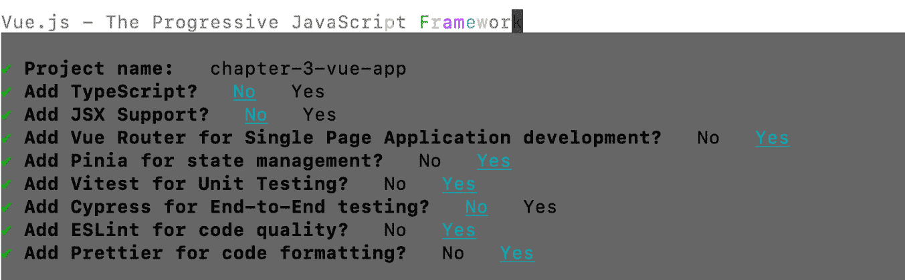

图 7.1 – 在创建项目时添加 Vue Router

注意

如果你想将 Vue Router 添加到现有的 Vue.js 应用程序中，你可以使用以下命令将其作为应用程序的依赖项安装：

```js
npm install vue-router
```

下一步是了解 Vue Router 如何同步浏览器 URL 和应用程序视图。

首先，让我们看看 `RouterView` 元素。

# 探索 `RouterView` 元素

`RouterView` 是一个 Vue 组件，其任务是以下内容：

+   渲染不同的子组件

+   根据给定的路由路径，在任何嵌套级别自动挂载和卸载自身

没有使用 `RouterView`，在运行时正确渲染动态内容几乎是不可能的。例如，当用户导航到 `RouterView` 知道并只生成与该页面相关的内。

让我们看看我们如何通过 `RouterView` 将属性传递给视图。

## 将属性传递给视图

由于 `RouterView` 是一个组件，它也可以接收属性。它接收的唯一属性是 `name`，这是在初始化阶段在 `router` 对象中定义的相应路由记录中注册的相同名称。

Vue 引擎自动将任何其他额外的 HTML 属性传递给 `RouterView` 渲染的任何视图组件。

以具有 `"main-app-view"` 类的以下 `RouterView` 组件为例：

```js
<RouterView class="main-app-view"/>
```

假设我们有一个视图组件的模板，其代码如下：

```js
<template>
  <div>Hello World</div>
</template>
```

在这种情况下，当子组件是活动视图时，它将接收到 `"main-app-view"` 属性类。渲染后的实际输出如下：

```js
<div class="main-app-view">Hello World</div>
```

接下来，让我们看看 `RouterView` 是如何工作的。

## 与 `RouterView` 一起工作

在你新创建的应用程序中，让我们导航到 `App.vue` 并将 `<template>` 的默认代码替换为以下内容：

```js
<template>
  <div id="app">
    <RouterView/>
  </div>
</template>
```

然后，转到 `src/router/index.js` 并注释掉 `routes` 数组中生成的代码，如下所示：

```js
const router = createRouter({
  history: createWebHistory(import.meta.env.BASE_URL),
  routes: [
    // {
    //   path: '/',
    //   name: 'home',
    //   component: HomeView
    // },
    // {
    //   path: '/about',
    //   name: 'about',
    //   component: () => import('../views/AboutView.vue')
    // }
  ]
})
```

当你在本地运行应用程序并在浏览器中打开本地服务器 URL 时，输出将如 *图 7.2* 所示：


图 7.2 – 未定义路由时应用程序的输出

输出是一个空页面，因为我们没有在我们的文件中设置任何路由配置，包括将路径映射到相关视图。没有这一步，路由系统无法动态选择合适的视图组件并将其渲染到我们的 `RouterView` 元素中。

在下一节中，我们将了解如何设置 Vue Router。

# 设置 Vue Router

当我们将 Vue Router 添加到我们的项目中时，Vite 会在`/src`目录中创建并添加一个名为`router`的文件夹，其中包含一个自动生成的`index.js`文件。此文件包含我们路由系统的必要配置，我们将在下一节中探讨。

在`src/main.js`文件中，我们导入定义的配置对象，并使用 Vue 实例方法`use()`将路由系统安装到应用程序中，如下所示：

```js
import { createApp } from 'vue'
import App from './App.vue'
import router from './router'
const app = createApp(App)
app.use(router)
```

`app.use`是一个实例方法，具有内置机制，防止您安装插件超过一次。

执行`app.use(router)`后，以下对象可以在任何组件中访问：

+   `this.$router`：全局路由对象

+   `this.$route`：当前路由对象指向上下文中的元素

如果您正在使用`setup()`和组合式 API（或`<script setup>`），您可以从`vue-router`包中导入`useRoute()`和`useRouter()`函数，并分别获取当前路由对象（而不是`this.$route`）和全局路由对象（而不是`this.$router`）。

```js
<script setup>
import { useRoute, useRouter } from 'vue-router'
const route = useRoute();
const router = useRouter();
// component's logic…
</script>
```

既然我们已经在我们的应用程序中注册了 Vue Router 的使用，让我们继续下一步——定义路由实例的配置对象的路线。

# 定义路由

在 Web 应用程序中，路由是一个 URL 路径模式。Vue Router 将其映射到特定的处理程序。此处理程序是一个 Vue 组件，定义并位于一个物理文件中。例如，当用户输入`localhost:3000/home`路由时，如果您将`HomeView`组件映射到该特定路由，路由系统就会知道如何相应地渲染`HomeView`内容。

如*图 7**.2 所示，设置应用程序内的`routes`（或路径）对于导航至关重要；否则，您的应用程序将显示为空。

每个路由都是一个使用`RouteRecordRaw`接口的对象字面量，具有以下属性：

```js
interface RouteRecordRaw = {
  path: string,
  component?: Component,
  name?: string, // for named routes
  components?: { [name: string]: Component }, // for named
    views
  redirect?: string | Location | Function,
  props?: boolean | Object | Function,
  alias?: string | Array<string>,
  children?: Array<RouteConfig>, // for nested routes
  beforeEnter?: (to: Route, from: Route, next: Function) =>
    void,
  meta?: any,
  sensitive?: Boolean,
  strict?: Boolean
}
```

我们将应用程序所需的所有路由定义为一个`routes`列表：

```js
const routes = [
  //Route1,
  //Route2,
  //...
]
```

我们回到`src/router/index.js`文件，取消注释`routes`内部的代码。为了方便，将有两个预定义的路由，分别称为`home`和`about`，每个都是位于`routes`数组中的对象。

让我们以第一个路由为例，进行更详细的了解：

```js
  {
    path: '/',
    name: 'home',
    component: HomeView
  }
```

`path`属性是一个必需的字符串，表示目标路由的路径。Vue Router 将此属性解析为浏览器导航的绝对 URL 路径。例如，`/about`路径将被转换为`<app domain>/about`（`localhost:8080/about`或`example.com/about`）。

在这种情况下，Vue Router 将`/`（空路径）视为默认路径，用于在没有其他指示符（例如，当用户导航到`<app-domain>`或`<app-domain>/`（未设置`strict: true`）时）加载应用程序。

下一个属性是`name`，它是一个字符串，表示分配给目标路由的名称。尽管它是可选的，但我们建议为每个路径定义一个名称，以利于代码维护和路由跟踪，我们将在本章后面的*传递路由* *参数*部分讨论这一点。

最后一个属性是`component`，它是一个 Vue 组件实例。`RouterView`使用此属性来引用视图组件，在路径处于活动状态时渲染页面内容。

在这里，路由被定义为`home`路由，映射为应用程序的默认路径，并与`HomeView`组件关联以显示内容。

Vite 还自动为这两个示例路由生成两个简单的组件 – `HomeView`和`AboutView`，位于`src/views`文件夹中。

在下一节中，我们将介绍一些在使用带有路由的加载组件时可能有所帮助的技巧。

## 关于为路由配置加载组件的技巧

事实上，我们需要在同一个`index.js`文件中导入组件，将其与目标路由关联起来。最经典和最受欢迎的方法是在文件顶部导入，如下所示：

```js
import Home from '../views/HomeView.vue'
```

通常，我们会在主导入下添加此代码行，如图*7.3**所示：


图 7.3 – 在第 2 行导入 HomeView 组件 – src/router/index.js

然而，一种更有效的方法是懒加载组件。

**懒加载**，也称为按需加载，是一种旨在运行时优化网站或网络应用程序内容的技巧。它有助于减少首次加载应用程序所需的时间和资源消耗。

这种优化对于确保最佳的用户体验至关重要，因为每一毫秒的等待都很重要。除此之外，懒加载还能在路由级别实现更好的代码拆分，并在大型或复杂应用程序中进行性能优化。

我们可以使用 Vite（和 Rollup）来懒加载组件。我们不需要将`AboutView`组件导入到文件顶部，就像我们导入`HomeView`（参见图*7.3*）那样，我们可以在定义`about`路由名称后动态添加以下内容：

```js
component: () => import('../views/AboutView.vue')
```

在这里，我们为`about`路由动态懒加载`AboutView`视图组件。在编译期间，Vite 为目标路由生成一个具有指定名称（`about`）的单独块，并且只有在用户访问此路由时才加载它。

在大多数情况下，由于用户很可能会在第一次访问时到达默认路径，因此最好不要懒加载默认组件（在我们的应用程序中是`HomeView`），而是以通常的方式导入它。因此，这里的建议是在设计路由时确定哪些元素应该被懒加载，并将两种方法结合起来以获得最大效益。

现在我们将看看如何设置路由实例。

## 设置路由实例

在定义了路由后，最后一步是根据给定的配置选项使用`createRouter`方法创建基于配置的`router`实例，如下所示：

```js
import { createRouter, createWebHistory } from 'vue-router'
const router = createRouter({
  history: createWebHistory(import.meta.env.BASE_URL),
  routes
})
```

配置是一个包含不同属性的对象，这些属性有助于形成应用程序的 router。我们现在将在以下小节中检查这些属性。

### routes

`routes`是一个必需的选项。没有它，路由器将无法识别路径，并相应地将用户引导到合适的视图内容。

### history

`history`决定了路由器的模式。Vue Router 中有两种 URL 模式：

+   使用`createWebHistory()`方法利用默认的`history.pushState()` API 以及 HTML5 历史 API。它允许我们在不重新加载页面的情况下实现 URL 导航，并使 URL 路径易于阅读 – 例如，`yourapplication.com/about`。

+   使用`createWebHashHistory()`方法创建 hash 模式，这允许你使用 hash 符号（`#`）来模拟 URL – 例如，`yourapplication.com/#about`用于应用程序的“主页”URL，而`youapplication.com/#/`用于应用程序的“主页”URL。

### base

`base`决定了应用程序的基本 URL。例如，当我们将其设置为`process.env.BASE_URL`时，它允许开发人员从应用程序代码外部控制基本 URL，特别是从`.env`文件中。因此，开发人员可以在运行时设置托管平台提供代码的目录。

在`base`配置最终确定后，我们创建了`router`实例。接下来要做的就是导出它：

```js
export default router
```

在`main.js`中，我们导入`router`实例，并在从`createApp`接收到的主`app`实例创建后立即使用它，如下所示：

```js
import { createApp } from 'vue'
import App from './App.vue'
import router from './router'
const app = createApp(App)
app.use(router)
app.mount('#app')
```

在`App.vue`中，将`<template>`替换为以下代码：

```js
<template>
  <header>
    
    <div class="wrapper">
      <HelloWorld msg="You did it!" />
    </div>
  </header>
  <RouterView />
</template>
```

我们的应用程序现在将如下渲染：

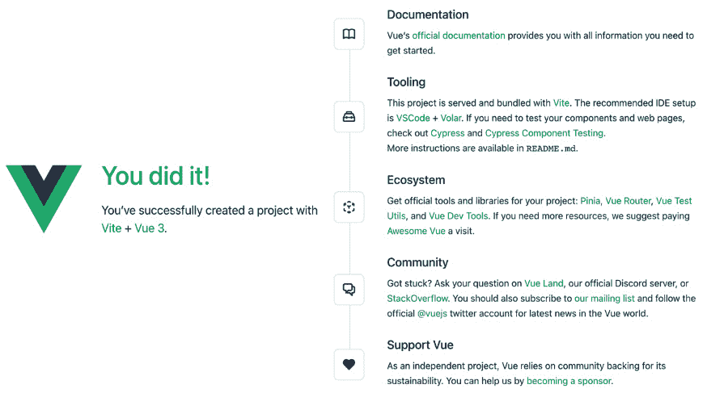

图 7.4 – 浏览器中的主页

如果我们导航到`/about`，假设自动生成的代码中`about`组件的内容如下所示：

```js
<template>
  <div class="about">
    <h1>This is an about page</h1>
  </div>
</template>
```

网站应该看起来像*图 7.5*中所示的那样：


图 7.5 – 浏览器中的应用程序“关于”页面

在本节中，我们探讨了如何通过懒加载组件来加速大型和复杂的 SPAs。我们还探讨了设置路由系统的一些选项，例如`routes`、`history`和`base`。

你还看到了 Vue 引擎渲染了两个页面，`/about`和`/home`，它们具有相同的标题内容，如*图 7.6*所示：

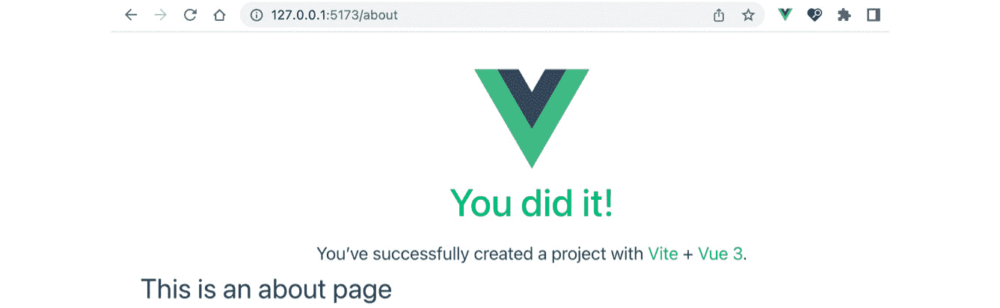

图 7.6 – 在图 7.5 的“关于”页面中显示相同标题的主页

原因是 Vue 只替换了占位组件 `RouterView`，用目标视图的内容替换，而在此作用域之外定义的任何模板都将保持不变。这样，我们可以在应用的所有视图中创建一个默认布局。

# 为你的应用设置默认布局

为了使我们的模板功能正常，它还应该包含 `<RouterView/>` 元素。一个标准的设置是在模板中有一个导航菜单 `<nav>`，并在其下方放置 `RouterView`。这样，页面之间的内容会变化，而 `header` 菜单保持不变。

导航到 `App.vue` 并确保你的模板有如下代码：

```js
<template>
  <header>
    <nav>
      <RouterLink to="/">Home</RouterLink>
      <RouterLink to="/about">About</RouterLink>
    </nav>
  </header>
  <RouterView />
</template>
```

你的输出现在应该包含一个静态的标题，其中包含两个导航链接 – **首页** 和 **关于** – 而内容会根据路由变化：

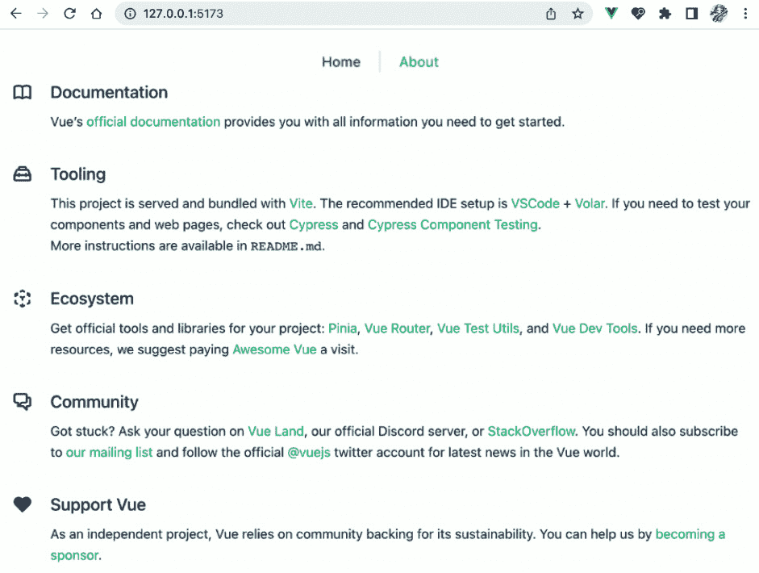

图 7.7 – 首页的内容

一旦你导航到 `/about` 页面，标题链接不会改变，而内容现在变为以下内容：


图 7.8 – 关于页面的内容

到目前为止，你已经学会了如何创建默认布局，并使用 `RouterView` 动态渲染目标内容视图。在下一节中，我们将学习如何在 Vue Router 的帮助下实现和添加一个 **消息推送** 页面。

## 练习 7.01 – 使用 Vue Router 实现消息推送页面

在这个练习中，你将使用 `RouterView` 渲染一个新的视图组件，该组件显示消息推送。

要访问此练习的代码文件，请参阅 [`github.com/PacktPublishing/Frontend-Development-Projects-with-Vue.js-3/tree/v2-edition/Chapter07/Exercise7.01`](https://github.com/PacktPublishing/Frontend-Development-Projects-with-Vue.js-3/tree/v2-edition/Chapter07/Exercise7.01)。

我们将创建一个新页面，向用户显示消息列表。用户可以在浏览器中输入 `localhost:3000/messages` 路径时访问此页面。执行以下步骤：

1.  使用由 `npm init vue@3` 生成的应用程序作为起点，或者在你代码仓库的根目录中，使用以下命令按顺序导航到 `Chapter07/Exercise7.01` 文件夹：

    ```js
    > cd Chapter07/Exercise7.01/
    ```

    ```js
    > yarn
    ```

1.  在 VS Code 中打开练习项目（在项目目录中使用 `code .` 命令）或你的首选 IDE。

1.  让我们创建一个新的视图组件 `MessageFeed`，通过在 `./src/views/` 文件夹中添加一个 `MessageFeed.vue` 文件来实现：


图 7.9 – 视图目录层次结构

此组件将渲染一个消息列表。我们使用 `<script setup>` 定义 `messages` – 一个字符串数组 – 作为我们的本地数据，如下所示：

```js
<template>
  <div>
    <h2> Message Feed </h2>
    <p v-for="(m, i) in messages" :key="i">
    {{ m }}
    </p>
</div>
</template>
<script setup>
const messages = [
        'Hello, how are you?',
        'The weather is nice',
        'This is the message feed',
        'And I am the fourth message'
      ]
</script>
```

1.  如果不存在，在 `src/router/index.js` 创建一个路由文件。确保你从 `'vue-router'` 导入 `createRoute` 和 `createWebHistory`，以及 `HomeView` 组件，如下面的代码所示：

    ```js
    import { createRouter, createWebHistory } from 'vue-router'
    ```

    ```js
    import HomeView from '../views/HomeView.vue'
    ```

1.  我们声明了一个指向 `MessageFeed` 的路由，命名为 `messageFeed`，其路径设置为 `/messages`。我们还将懒加载该组件。此步骤将通过将包含所需信息的对象附加到 `routes` 数组来完成：

    ```js
    export const routes = [
    ```

    ```js
      {
    ```

    ```js
        path: '/',
    ```

    ```js
        name: 'home',
    ```

    ```js
        component: HomeView
    ```

    ```js
      },
    ```

    ```js
      {
    ```

    ```js
        path: '/about',
    ```

    ```js
        name: 'about',
    ```

    ```js
        component: () => import('../views/AboutView.vue')
    ```

    ```js
      },
    ```

    ```js
      {
    ```

    ```js
        path: '/messages',
    ```

    ```js
        name: 'messageFeed',
    ```

    ```js
        component: () =>
    ```

    ```js
          import('../views/MessageFeed.vue')
    ```

    ```js
      }
    ```

    ```js
    ]
    ```

1.  最后，在同一文件中，使用我们导入的 `createRouter` 和 `createWebHistory` 函数以及我们定义的 `routes` 数组创建一个 `router` 实例：

    ```js
    const router = createRouter({
    ```

    ```js
      history: createWebHistory(import.meta.env.BASE_URL),
    ```

    ```js
      routes
    ```

    ```js
    })
    ```

    ```js
    export default router
    ```

1.  确保在 `src/main.js` 中导入创建的 `router` 实例，并通过使用 `app.use(router)` 将其作为插件附加到 `app` 实例上：

    ```js
    import router from './router'
    ```

    ```js
    const app = createApp(App)
    ```

    ```js
    app.use(router)
    ```

    ```js
    app.mount('#app')
    ```

1.  在 `App.vue` 中，确保 `<template>` 只包含以下代码：

    ```js
    <template>
    ```

    ```js
      <RouterView />
    ```

    ```js
    </template>
    ```

1.  使用以下命令运行应用程序：

    ```js
    yarn dev
    ```

1.  在浏览器中访问 `localhost:3000/messages`（或 Vite 创建的任何本地服务器），页面应该显示正确的内容 – 如以下截图所示的 **消息源** 页面：

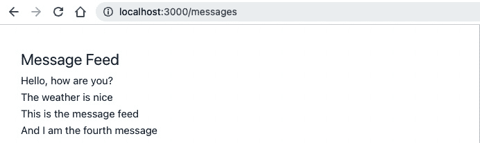

图 7.10 – 消息源页面

这个练习展示了使用 Vue Router 向 Vue.js 应用程序添加新页面路由是多么简单，同时保持代码组织良好且易于阅读。现在我们已经准备好了可用的路由，我们可以允许用户在页面之间导航，而无需输入完整的路径。

# 使用 RouterLink 设置导航链接

如我们所知，`RouterView` 负责根据 URL 路径渲染正确的活动视图内容；另一方面，`RouterLink` 负责将路由映射到可导航的链接。`RouterLink` 是一个 Vue 组件，它帮助用户在启用了路由的应用程序内进行导航。默认情况下，`RouterLink` 会渲染一个带有由其 `to` 属性生成的有效 `href` 链接的锚标签 `<a>`。

在我们由 Vite 生成的示例应用中，由于有两个预填充的路由，因此也在 `App.vue` 的 `<template>` 部分添加了两个 `RouterLink` 实例，作为页眉导航菜单：

```js
<nav>
  <RouterLink to="/">Home</RouterLink>
  <RouterLink to="/about">About</RouterLink>
</nav>
```

由于我们使用的是 `createWebHistory()` 的 web 历史模式，每个 `RouterLink` 的 `to` 属性应该接收与目标路由对象中声明的 `path` 属性相同的值（如 `src/router/index.js` 中定义的路由列表）。

由于我们命名了路由，使用 `to` 属性的另一种方法是将其绑定到一个包含路由名称的对象上，而不是路径。使用名称被高度推荐，以避免在需要调整应用中某些路由的路径时进行复杂的链接重构。因此，我们可以将链接重写如下：

```js
<nav>
  <RouterLink :to="{ name: 'home'}">Home</RouterLink>
  <RouterLink :to="{ name: 'about'}">About</RouterLink>
</nav>
```

此外，Vue Router 会在活动路由的 `<a>` 标签上添加一个额外的 CSS 类，`router-link-active`。我们可以通过 `RouterLink` 组件的 `active-class` 属性来自定义这个类选择器。

在以下渲染的 `RouterLink` 组件中：

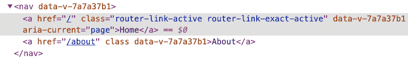

图 7.11 – 浏览器元素标签中的 RouterLink

浏览器中的视图将如下所示：

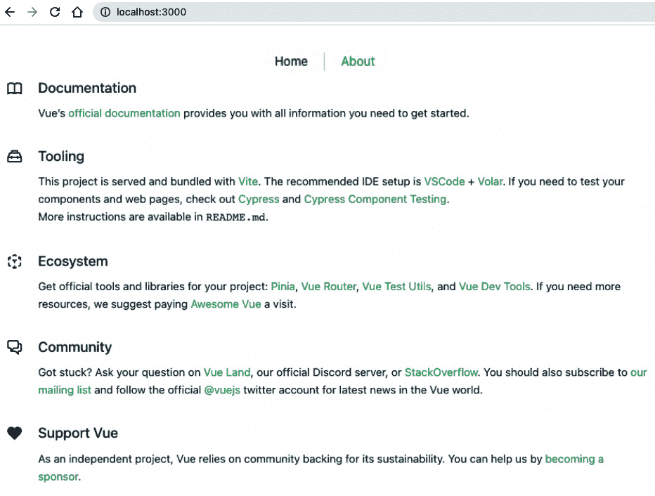

图 7.12 – 带有导航链接的首页

注意，由于我们可以在组件内部访问 `this.$router`，我们可以通过使用 `this.$router.push()` 并传递一个路径或路由对象来编程触发导航路由，类似于使用 `to`：

```js
this.$router.push('/home')
```

或者，在 `<script setup>` 中，我们可以执行以下替代代码：

```js
import { useRouter } from 'vue-router'
const router = useRouter();
router.push('/home');
```

在本节中，我们探讨了如何使用 `<RouterLink/>` 元素在视图之间导航，就像使用传统的 HTML `<a>` 标签一样。

接下来，我们将看到如何以类似网页浏览器“后退”按钮的方式，通过编程将用户发送到他们最后查看的路由。

## 实现后退按钮的技巧

有时候，我们希望导航回上一页。使用 `this.$router.push()` 可以实现这一点，但它会在历史记录栈中添加更多路由，而不是返回。正确的技术是使用 `this.$router.go(steps)`，其中 `steps` 是一个整数，表示在历史记录栈中返回或前进的步数。此功能与 `window.history.go(steps)` 类似。

考虑以下示例：

```js
this.$router.go(-1) // similar to window.history.back()  -
  go back one page
```

此外，您还可以使用相同的方法导航到之前加载且仍然存在于历史记录栈中的页面：

```js
this.$router.go(1) // similar to window.history.forward() –
  go forward one page
```

或者，我们可以使用 `useRouter()` 和 `<script setup>` 重新编写上述代码，如下所示：

```js
import { useRouter } from 'vue-router'
const router = useRouter();
router.go(1); //forward one page
router.go(-1); //back one page
```

接下来，我们将利用导航链接将我们的新消息源页面添加到应用程序的 `nav` 菜单中。

## 练习 7.02 – 将导航链接添加到 MessageFeed 路由

我们将在练习 7.01 中创建的 `MessageFeed` 路由中添加一个快速链接，使用 `to` 属性和 `RouterLink`，如前文所述。

要访问此练习的代码文件，请参阅 [`github.com/PacktPublishing/Frontend-Development-Projects-with-Vue.js-3/tree/v2-edition/Chapter07/Exercise7.02`](https://github.com/PacktPublishing/Frontend-Development-Projects-with-Vue.js-3/tree/v2-edition/Chapter07/Exercise7.02)。

让我们按以下步骤进行：

1.  以使用 `npm init vue@3` 生成的应用程序为起点，或在代码仓库的根目录下，使用以下命令进入 `Chapter07/Exercise7.02` 文件夹：

    ```js
    > cd Chapter07/Exercise7.02/
    ```

    ```js
    > yarn
    ```

1.  在 VS Code 中打开练习项目（在项目目录中使用 `code .` 命令）或您的首选 IDE。

1.  按照练习 7.01 的说明创建 `MessageFeed` 组件，将其注册到 `/messages` 路径，并确保您的路由已在应用程序中启用。

1.  在 `./src/App.vue` 文件中，除了为 `home` 和 `about` 自动生成的 `RouterLink` 组件外，再添加一个指向 `/messages` 的 `RouterLink` 组件：

    ```js
    <template>
    ```

    ```js
      <header>
    ```

    ```js
        <nav>
    ```

    ```js
          <RouterLink to="/">Home</RouterLink>
    ```

    ```js
          <RouterLink to="/about">About</RouterLink>
    ```

    ```js
          <RouterLink to="/messages">Message Feed
    ```

    ```js
            </RouterLink>
    ```

    ```js
        </nav>
    ```

    ```js
      </header>
    ```

    ```js
      <RouterView />
    ```

    ```js
    </template>
    ```

1.  使用以下命令运行应用程序：

    ```js
    yarn dev
    ```

我们将看到在任何视图中都可用导航链接 – 当用户导航离开时，它们不会消失，因为它们不是 `RouterView` 组件的一部分。我们的屏幕应该如下所示：

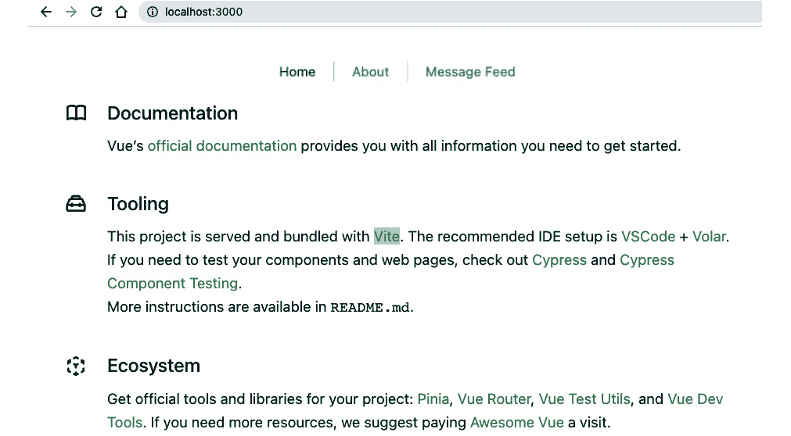

图 7.13 – 带有更新导航链接的首页

1.  在 `App.vue` 中，让我们将 `to` 的值更改为指向名为 `messageFeed` 的对象。这是在 `./src/router/index.js` 中定义的此路由的 `name` 值：

    ```js
    <RouterLink :to="{ name: 'messageFeed' }">Message Feed
    ```

    ```js
      </RouterLink>
    ```

1.  导航应该像以前一样工作；点击以下截图中的 `/messages`：

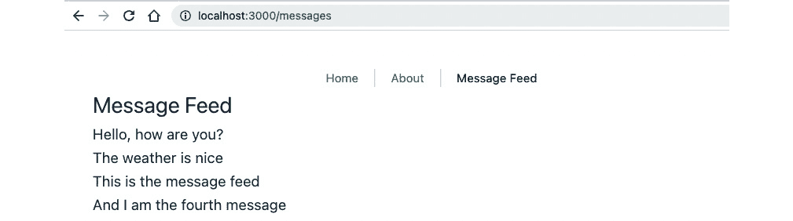

图 7.14 – 点击消息源链接后活动页面变为消息源页面

1.  现在，打开位于 `./src/router/` 文件夹中的 `index.js` 文件，并将 `messageFeed` 路由定义的路径从 `/messages/` 更改为 `/messagesFeed`：

    ```js
    export const routes = [
    ```

    ```js
      {
    ```

    ```js
        path: '/',
    ```

    ```js
        name: 'home',
    ```

    ```js
        component: HomeView
    ```

    ```js
      },
    ```

    ```js
      {
    ```

    ```js
        path: '/about',
    ```

    ```js
        name: 'about',
    ```

    ```js
        component: () => import('../views/AboutView.vue')
    ```

    ```js
      },
    ```

    ```js
      {
    ```

    ```js
        path: '/messagesFeed',
    ```

    ```js
        name: 'messageFeed',
    ```

    ```js
        component: () =>
    ```

    ```js
          import('../views/MessageFeed.vue')
    ```

    ```js
      }
    ```

    ```js
    ]
    ```

1.  导航到应用的 `Home` 页面并点击 `/messagesFeed`：

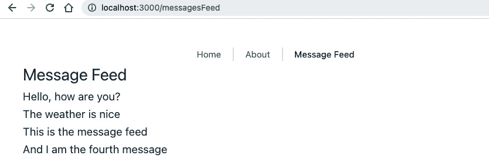

图 7.15 – 带有新 URL 路径的消息源页面

注意设置到 `/messages` 路径的链接是多么简单，只需一行代码，并相应地更新相关路径。

到目前为止，我们已定义了一些简单的路由，针对目标路由没有额外的参数 – 这将是我们的下一个挑战。

# 传递路由参数

以前我们了解到每个路由都是一个独立的视图，不需要传递或连接到其他路由的数据。但 Vue Router 并没有将路由的强大功能仅限于这一点。通过命名路由，我们还可以轻松地启用路由之间的数据通信。

在我们的示例应用中，我们希望 `about` 页面能够接收一个名为 `user` 的数据字符串，作为用户名从触发的链接中获取。在 Vue Router 4.1.4 之前，我们可以通过将 `to` 属性从字符串字面量更改为具有 `name` 和 `params` 属性的对象字面量来实现此功能，如下所示：

```js
<RouterLink :to="{ name: 'about', params: { user: 'Adam' }}">
  About
</RouterLink>
```

此更改通知路由器在用户点击目标链接时将所需的参数传递给 `About` 页面。这些附加参数在渲染的 `href` 链接中不可见，如下所示：

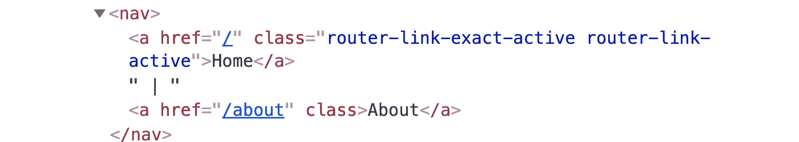

图 7.16 - 生成的 href 链接没有参数

输出将如下所示：

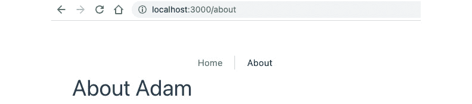

图 7.17 – 关于页面渲染通过路由参数传递的用户

然而，这种方法的显著缺点是。

当你仍然在 `./about` 路径上时，让我们刷新页面。输出将是一个没有用户名的页面，如下所示：

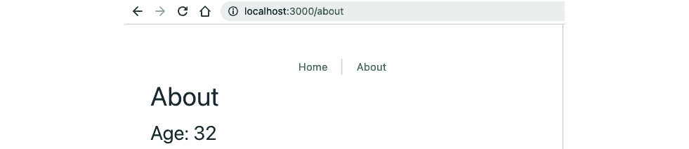

图 7.18 – 刷新后关于页面丢失用户详情

刷新时，Vue 引擎触发路由而不向路由的`params`字段传递任何`user`，这与用户点击特定预定义链接时不同。使用这种方法传递的参数没有被保存或缓存。我们认为这是一种 Vue 实践的反模式。

从 Vue Router 4.1.4 版本开始，直接在`to`对象上传递参数已被弃用。为了将参数传递到路由，我们应该使用替代方法，例如使用 Pinia 作为全局数据存储，或者使用 URL 的查询参数。

URL 路由的查询参数从问号`-`开始，如下面的语法所示：

```js
<your-app-url>?<param1>=<value1>&<param2>=<value2>
```

在上述语法中，每个参数字段由`&`符号分隔。例如，要将用户参数传递到我们的`/about`页面，我们将构造以下 URL：

```js
localhost:3000/about?user=Adam
```

在`About`组件中，我们将从`route`中检索`query`字段

对象，并获取相关字段的值，如下面的代码所示：

```js
<script setup>
import { useRoute} from 'vue-router'
const route = useRoute();
const { user } = route.query;
</script>
```

在`template`部分，我们可以将`$route.params.user`替换为`user`，输出保持不变，即使在刷新页面时也是如此。

```js
<template>
  <div class="about">
    <h1>About {{ user }}</h1>
  </div>
</template>
```

在以下部分，我们将学习如何使用**路由钩子**拦截导航流程并在路由之间动态分配`params`。

# 理解路由钩子

要理解 Vue Router 钩子，首先，我们需要了解以下图中描述的路由导航的一般流程：

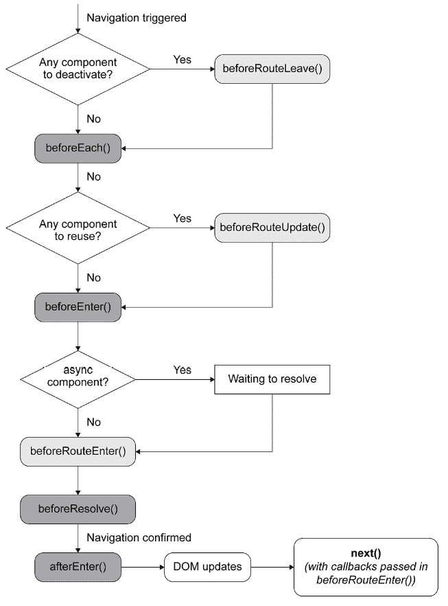

图 7.19 – 导航解析流程图

一旦触发某个路由的导航，Vue Router 为开发者提供了几个主要的导航守卫或钩子，以保护或拦截该导航过程。这些守卫可以是全局的或组件内的，具体取决于类型。

以下是一些示例：

+   `beforeEach`、`beforeResolve`和`afterEach`

+   `beforeEnter`

+   `beforeRouteUpdate`、`beforeRouteEnter`和`beforeRouteLeave`

对于组合式 API，组件内的钩子可用作`onBeforeRouteUpdate`和`onBeforeRouteLeave`。没有`onBeforeRouteEnter`，因为这相当于使用`setup()`（或`script setup`）本身。

如**图 7.19**所示，Vue 引擎仅在所有钩子或守卫都已解决之后才考虑导航，包括任何异步守卫。

现在，让我们看看如何设置`beforeEach`钩子。

## 设置`beforeEach`钩子

`beforeEach`是一个全局钩子，在导航开始时被调用，即在触发其他全局和组件内钩子之前（除了前一个视图组件中的`beforeRouteLeave`）。它应该在`index.js`文件中的初始化期间定义为`router`实例的全局方法，并采用以下语法：

```js
const router = createRouter({
  //...
})
router.beforeEach(beforeEachCallback)
```

在前面的代码片段中，`beforeEachCallback`是一个接收三个参数的`hook`函数：

```js
const beforeEachCallback = (
  to, // The destination route
  from, //The source route
  next //The function to trigger to resolve the hook
) => { … })
```

我们可以直接这样写：

```js
router.beforeEach((to, from, next) => { … })
```

例如，如果我们想在用户导航到`About`而没有传递查询参数的`user`值时显示不同的页面来显示通用消息，我们可以将`beforeEach`钩子配置如下：

```js
router.beforeEach((
  to, // The destination route
  from, //The source route
  next //The function to trigger to resolve the hook
) => {
  if (to.name === 'about' && (!to.query?.user)) {
    next({ name: 'error' })
  }
  else {
    next();
  }
})
```

在这里，我们检查目标路由是否为`about`，如果没有传递任何额外的参数，也没有为`user`参数传递任何值，我们将导航到`error`路由。否则，我们将像往常一样使用`next()`正常进行。

注意

在任何给定的非重叠流程逻辑中，`next()`必须恰好调用一次（一次用于`if`，一次用于`else`）；否则，将出现错误。

我们仍然需要创建一个包含`Error.vue`视图组件的`error`页面，该组件显示一条简单的消息：

```js
<template>
    <div>
        <h2>No param passed.</h2>
    </div>
</template>
```

此外，请确保相应地注册路径：

```js
{
    path: '/error',
    name: 'error',
    component: () => import('../views/Error.vue'),
  }
```

现在，在默认视图中，点击**关于**链接后，应用将渲染**错误**页面而不是**关于**页面，如下面的截图所示：

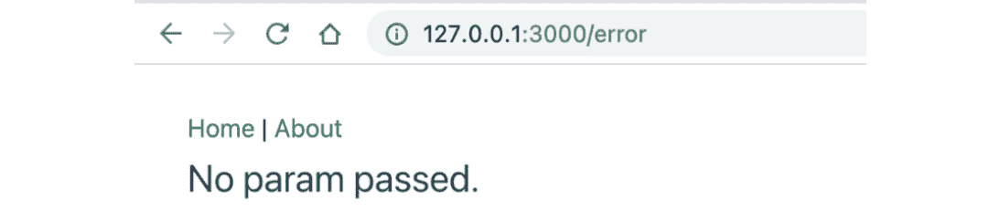

图 7.20 – 点击关于时未传递参数显示的错误页面

现在，让我们转到`App.vue`文件，并将`to`属性分配给路径`"/about?user=Adam"`：

```js
<RouterLink to="/about?user=Adam">About</RouterLink>
```

在`About.vue`文件中，我们使用以下模板代码：

```js
<div class="about">
    <h1>About {{ $route.query.user }}</h1>
</div>
```

让我们导航回我们应用中传递的`user`，输出将如下所示：


图 7.21 – 当查询参数中传递了用户时显示的关于页面

我们现在将探讨一些区分`beforeEach`和`beforeResolve`钩子的关键点。

## 区分 beforeEach 和 beforeResolve 钩子

我们还可以使用相同的语法注册一个全局钩子`beforeResolve`。与在设置导航时触发的`beforeEach`不同，`beforeResolve`将在执行和确认导航之前触发，并且在所有钩子（全局和组件内）都解析之后：

```js
router.beforeResolve((
  to, // The destination route
  from, //The source route
  next //The function to trigger to resolve the hook
) => {
  if (to.name === 'about' && (!to.query?.user)) {
    next({ name: 'error' })
  }
  else {
    next();
  }
})
```

输出结果将与*图 7.20*和*图 7.21*中的相同。

让我们现在详细看看`afterEach`钩子。

## afterEach 钩子

`afterEach()`钩子是在导航确认后（这意味着在`beforeResolve()`之后）触发的最后一个全局导航守卫。与其他全局守卫不同，传递给`afterEach()`的`hook`函数不会接收一个`next`函数——因此，它不会影响导航。

此外，`to`和`from`参数是只读的`Route`对象。因此，`afterEach`的最佳用途是保存数据，例如为`route`目标保存最后访问的`Route`对象或页面视图跟踪。

例如，我们可以为`user`设置一个默认值，并在需要时分配和保存它：

```js
let user = 'Adam';
router.beforeEach((to, from, next) => {
  if (to.name === 'about' && (!to.query?.user)) {
    next({ name: 'about', query: { user }})
  }
  else {
    user = to.query.user;
    next()
  }
});
router.afterEach((to, from) => {
  if (to.name === 'about' && to.query && to.query.user) {
    user = to.query.user;
  }
})
```

现在，在`App.vue`文件中，让我们将`user`的值改为`Alex`：

```js
<RouterLink to="/about?user=Alex"> About </RouterLink>
```

点击**关于**链接后的输出现在如下所示：

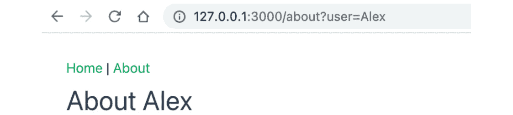


然而，在导航到 `"/about"` 时，**关于** 页面现在渲染的是默认用户 – **Adam**，如下所示：

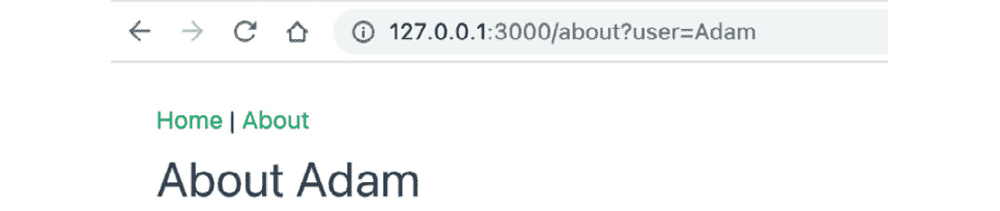


在本节中，我们探讨了 `afterEach` 钩子。我们使用 `afterEach` 钩子将数据传递到 `Back` 按钮。

## 按路由个性化钩子

而不是定义一个全局钩子，这可能会引起未知的错误并需要路由检查，我们可以在目标路由的配置对象中直接定义一个 `beforeEnter` 守卫 – 例如，我们的 `about` 路由：

```js
beforeEnter: (to, from, next) => {
      if (!to.query?.user) {
        to.query = { user : 'Adam' }
      }
      next()
    }
```

采用这种方法，无论是重新加载页面还是点击链接导航到 **关于** 页面，输出现在是一致的，但 URL 不显示默认参数（*图 7**.24*）


图 7.24 – 显示未更新 URL 的默认用户（Adam）的“关于”页面

注意

使用 `beforeEnter()`，`to` 是可写的，你将能够访问 `this`（它指向特定的路由 – `About`）。它只会在用户触发导航到 `About` 页面时被触发。

在本节中，我们探讨了 Vue 中可用的不同 Router 钩子，包括 `beforeEach`、`beforeResolve` 和 `afterEach`。我们看到了每个钩子在路由过程中的不同点被调用。作为一个实际例子，我们查看了一个路由，如果没有提供参数，则将用户重定向到 **错误** 页面。这些钩子非常有用，尤其是在设置认证路由时。

在下一节中，我们将探讨设置组件内钩子。

## 设置组件内钩子

最后，我们还可以在需要将钩子作用域限定在组件级别以更好地维护代码或增强工作流程时，将组件内钩子用作组件生命周期钩子。

我们现在可以为 `about` 组件定义 `beforeRouteEnter()` 钩子如下：

```js
<script>
export default {
  data() {
    return {
      user: ''
    }
  },
  beforeRouteEnter(to, from, next) {
    if (!to.params || !to.params.user) {
      next(comp => {
        comp.user = 'Alex'
      })
    }
    else {
      next();
    }
  }
}
</script>
```

正如你所见，在 `beforeRouteEnter` 期间我们没有访问组件的 `this` 作用域，因为视图组件仍在创建中。幸运的是，我们可以通过传递给 `next()` 的回调函数来访问实例。每当导航被确认，即组件被创建时，回调函数将被触发，组件实例将作为回调函数的唯一参数（`comp`）可用。

或者，我们可以使用 Composition API 和从 `'vue-router'` 包导入的钩子 `useRoute` 重新编写上述代码，如下所示：

```js
import { useRoute } from 'vue-router';
import { ref } from 'vue';
const user = ref('');
const route = useRoute();
if (!route.params || !route.params.user) {
  user.value = 'Alex'
}
```

注意

对于`beforeRouteUpdate`和`beforeRouteLeave`，组件已经被创建——因此，这个实例是可用的，不需要为`next()`设置回调。实际上，回调函数仅在`beforeRouteEnter()`的使用中支持`next()`。

当相同的组件用于不同的路由时，会调用`beforeRouteUpdate`（或`onBeforeRouteUpdate`）。这适用于我们使用动态路由的情况，将在下一节中讨论。

当组件被停用或用户即将离开当前视图时，会触发`beforeRouteLeave`（或`onBeforeRouteLeave`）。这发生在新导航的`beforeEach`守卫之前，通常用于编辑组件以防止用户在不保存的情况下离开。

在这个守卫中，我们可以通过向`next()`函数传递`false`来取消新的导航。

例如，假设我们在`AboutView.vue`文件中的组件选项中添加以下钩子：

```js
import { onBeforeRouteLeave } from 'vue-router';
onBeforeRouteLeave((to, from, next) => {
  const ans = window.confirm(
   'You are about to leave the About page. Are you sure?'
  );
  next(!!ans);
})
```

当我们从**关于**页面导航离开时，会出现一个弹出对话框请求确认，如下面的截图所示，然后继续相应地导航：

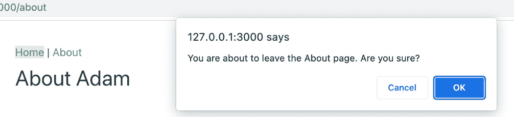

图 7.25 – 在离开关于页面前请求确认的对话框

在本节中，我们探讨了设置组件内钩子——即作用域限定在特定组件内的钩子。我们为`about`组件设置了一个组件内钩子，该钩子在用户离开页面前会要求用户进行确认。

我们现在将展示如何将传递的参数解耦到`props`中。

# 解耦参数与 Props

在`index.js`文件中，让我们调整`about`路由的配置，添加一个名为`props`的额外属性。

通过将此属性的值设置为接受一个`route`并返回一个包含基于`route.query.user`的`user`字段的对象的函数，路由器将自动理解并将任何`route.query`参数相应地映射到视图组件的`props`中：

```js
{
    path: '/about',
    name: 'about',
    component: () => import('../views/AboutView.vue'),
     props: route => ({ user: route.query.user || 'Adam' })
}
```

在`AboutView.vue`文件中，我们将定义一个名为`user`的 prop 类型，如下所示：

```js
<script setup>
import { defineProps } from 'vue'
const props = defineProps({
    user: String
})
</script>
```

在`<template>`部分，我们将用`user`替换`$route.query.user`：

```js
<template>
  <div class="about">
    <h1>About {{user}}</h1>
  </div>
</template>
```

输出结果仍然相同，如下面的截图所示：


图 7.26 – 用户通过路由参数传递并映射到 props

此外，你还可以在`route`配置的`props`属性中定义要传递的静态数据。与`Function`值不同，现在`props`可以声明为一个包含所需数据的对象，如下面的示例所示：

```js
{
    //…
    props: { age: 32 },
  }
```

通过类似的步骤，我们将在`AboutView.vue`中将`age`声明为一个`props`组件，并将其作为文本打印到屏幕上：

```js
<template>
  <div class="about">
    <h2>Age: {{age}}</h2>
  </div>
</template>
<script setup>
import { defineProps } from 'vue'
const props = defineProps({
    age: Number
})
</script>
```

现在当点击`About`页面时，页面将按照以下方式渲染：


图 7.27 – 在路由配置中预设了属性

## 练习 7.03：将所选消息的内容传递到新消息页面并打印出来

我们将从*练习 7.02*，*将导航链接添加到 MessageFeed 路由*继续，在那里我们定义了`MessageFeed`路由，其 URL 路径为`messages`。此视图将在视图组件选项的`data`属性中渲染预定义的消息列表。

要访问此练习的代码文件，请参阅[`github.com/PacktPublishing/Frontend-Development-Projects-with-Vue.js-3/tree/v2-edition/Chapter07/Exercise7.03`](https://github.com/PacktPublishing/Frontend-Development-Projects-with-Vue.js-3/tree/v2-edition/Chapter07/Exercise7.03)。

在这个练习中，我们将创建一个新的`/message`页面，用于渲染用户选择的消息内容。它应该是可重用的。

执行以下操作：

1.  在`./src/views/`文件夹中，我们创建一个新的单文件组件`Message.vue`。该组件接收一个类型为`string`的`content`属性，并在`<p>`标签下渲染它：

    ```js
    <template>
    ```

    ```js
        <div>
    ```

    ```js
            <p>{{content}}</p>
    ```

    ```js
        </div>
    ```

    ```js
    </template>
    ```

    ```js
    <script setup>
    ```

    ```js
    import { defineProps } from 'vue'
    ```

    ```js
    const props = defineProps({
    ```

    ```js
        content: {
    ```

    ```js
            default: '',
    ```

    ```js
            type: String
    ```

    ```js
        }
    ```

    ```js
    })
    ```

    ```js
    </script>
    ```

1.  让我们在`./src/router/index.js`中注册一个新的路由`Message`组件到现有的`routes`中。我们将新路由定义为`message`，路径为`/message`：

    ```js
    export const routes = [
    ```

    ```js
      //…,
    ```

    ```js
      {
    ```

    ```js
        path: '/message',
    ```

    ```js
        name: 'message',
    ```

    ```js
        component: () => import('../views/Message.vue'),
    ```

    ```js
      }
    ```

    ```js
    ]
    ```

1.  由于路由已注册并准备好使用，我们需要修改`./src/views/MessageFeed.vue`中的`<template>`部分，以确保每条消息现在都是可点击的，并且在点击时将用户重定向到新路由。

让我们用`router-click`替换`<p>`标签。因为我们已经将新路由命名为`message`，所以我们将每个`RouterLink`的`to`属性设置为绑定到`/message`。

```js
<template>
  <div>
  <h2> Message Feed </h2>
  <div v-for="(m, i) in messages" :key="i" >
    <RouterLink :to="`/message`">
      {{ m }}
    </RouterLink>
  </div>
</div>
</template>
```

1.  在`template`下，我们将添加一个包含我们`messages`的样本数据的`<script setup>`标签：

    ```js
    <script setup>
    ```

    ```js
    const messages = [
    ```

    ```js
        'Hello, how are you?',
    ```

    ```js
        'The weather is nice',
    ```

    ```js
        'This is the message feed',
    ```

    ```js
        'And I am the fourth message'
    ```

    ```js
      ]
    ```

    ```js
    </script>
    ```

1.  在`message`路由定义（`router/index.js`）中，我们添加`props: route => ({ content: route.query.content })`以将传递给路由的所有`content`查询映射到相关的属性。

    ```js
    export const routes = [
    ```

    ```js
      //…,
    ```

    ```js
      {
    ```

    ```js
        path: '/message',
    ```

    ```js
        name: 'message',
    ```

    ```js
        component: () => import('../views/Message.vue'),
    ```

    ```js
        props: route => ({ content: route.query.content })
    ```

    ```js
      }
    ```

    ```js
    ]
    ```

1.  当您打开`./messages`页面时，所有消息现在都是可点击的，如下面的截图所示：

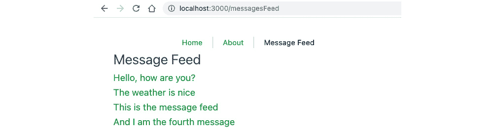

图 7.28 – 每条消息现在都是一个可导航的链接

1.  现在当用户点击一条消息时，它将打开一个新页面。然而，页面内容将是空的，因为我们没有向`<RouteLink>`组件传递任何内容参数，如下面的截图所示：

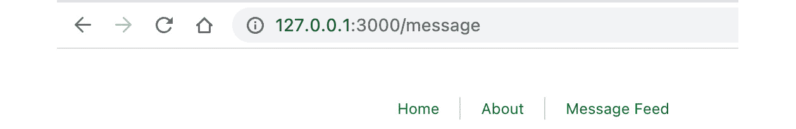

图 7.29 – 空消息页面

1.  让我们回到`./src/views/MessageFeed.vue`，并在消息的路由链接中添加`?content=${m}`，其中`m`是`messages`列表中索引为`i`的`message`，在`<template>`部分：

    ```js
      <div>
    ```

    ```js
      <h2> Message Feed </h2>
    ```

    ```js
      <div v-for="(m, i) in messages" :key="i" >
    ```

    ```js
        <RouterLink :to="`/message?content=${m}`">
    ```

    ```js
          {{ m }}
    ```

    ```js
        </RouterLink>
    ```

    ```js
      </div>
    ```

    ```js
    </div>
    ```

    ```js
    </template>
    ```

1.  现在当您点击第一条消息`Hello, how are you?`时，输出将是以下内容：

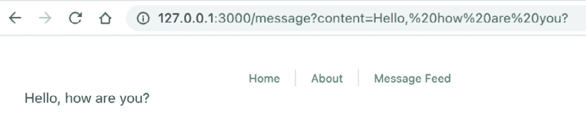

图 7.30 – 带有传递内容的消息页面

1.  接下来，让我们从`./src/views/MessageFeed.vue`中提取`messages`静态数据，并将其保存到`./src/assets/messages.js`中：

    ```js
    const messages = [
    ```

    ```js
      'Hello, how are you?',
    ```

    ```js
      'The weather is nice',
    ```

    ```js
      'This is the message feed',
    ```

    ```js
      'And I am the fourth message'
    ```

    ```js
    ];
    ```

    ```js
    export default messages;
    ```

1.  在`./src/views/MessageFeed.vue`中，我们将用具有`messages`数组类型的`props`替换本地数据属性，如下所示：

    ```js
    <script setup>
    ```

    ```js
    import { defineProps } from 'vue'
    ```

    ```js
    const props = defineProps({
    ```

    ```js
        messages: {
    ```

    ```js
            default: [],
    ```

    ```js
            type: Array
    ```

    ```js
        }
    ```

    ```js
    })
    ```

    ```js
    </script>
    ```

1.  现在，我们需要在导航到`/messages`路由时加载`messages`列表并分配给其`props`。我们将通过使用路由定义的`props`函数和`beforeEnter()`钩子来将数据规范化为相关的`props`以进行渲染。您可以通过修改`src/router/index.js`中定义的`messageFeed`路由来实现这一点，如下所示：

    ```js
    {
    ```

    ```js
        path: '/messages',
    ```

    ```js
        name: 'messageFeed',
    ```

    ```js
        component: () =>
    ```

    ```js
          import('../views/MessageFeed.vue'),
    ```

    ```js
        props: route => ({
    ```

    ```js
        messages: route.query.messages?.length > 0
    ```

    ```js
                ? route.query.messages : []
    ```

    ```js
        }),
    ```

    ```js
        async beforeEnter(to, from, next) {
    ```

    ```js
          next()
    ```

    ```js
        }
    ```

    ```js
      },
    ```

1.  在`beforeEnter`中，我们将使用`import`懒加载消息列表：

    ```js
    const module = await import ('../assets/messages.js');
    ```

1.  然后，我们可以按照以下方式检索所需的信息：

    ```js
      const messages = module.default;
    ```

    ```js
      if (messages && messages.length > 0) {
    ```

    ```js
        to.query.messages = messages;
    ```

    ```js
      }
    ```

1.  `src/router/index.js`中路由的完整代码应该是以下内容：

    ```js
    {
    ```

    ```js
        path: '/messages',
    ```

    ```js
        name: 'messageFeed',
    ```

    ```js
        component: () =>
    ```

    ```js
          import('../views/MessageFeed.vue'),
    ```

    ```js
        props: route => ({
    ```

    ```js
          messages: route.query.messages?.length > 0
    ```

    ```js
            ? route.query.messages : []
    ```

    ```js
        }),
    ```

    ```js
        async beforeEnter(to, from, next) {
    ```

    ```js
          if (!to.query || !to.query.messages) {
    ```

    ```js
            const module = await import
    ```

    ```js
              ('../assets/messages.js');
    ```

    ```js
            const messages = module.default;
    ```

    ```js
            if (messages && messages.length > 0) {
    ```

    ```js
              to.query.messages = messages;
    ```

    ```js
            }
    ```

    ```js
          }
    ```

    ```js
          next()
    ```

    ```js
        }
    ```

    ```js
      },
    ```

在查看网站时，我们应该看到类似于*图 7.28*的消息源。

到目前为止，我们已经学习和实践了如何使用不同的路由钩子配置路由、传递参数以及拦截应用中页面之间的导航。在下一节中，我们将探讨一个更高级的主题——**动态路由**。

# 动态路由

如果有大量遵循相同格式的数据，例如用户列表或消息列表，并且需要为每个数据创建一个页面，那么我们需要使用路由模式。使用路由模式，我们可以根据一些附加信息从相同的组件动态创建新路由。

例如，我们想要为每个用户渲染`User`视图组件，但具有不同的`id`值。Vue Router 为我们提供了使用冒号（`:`）表示的动态段来实现动态路由的能力。

与使用`params`不同，`params`在刷新页面或出现在 URL 中时不会持久化其值，我们直接在路径中定义所需的`params`，如下所示：

```js
{
    path: '/user/:id',
    name: 'user',
    component: () => import('../views/User.vue'),
    props: true,
  }
```

在前面的代码中，`:id`表示这里的`params`不是静态的。当路由与给定的模式匹配时，Vue Router 将渲染相应的组件，同时保持 URL 不变。`:id`的值将作为`$route.params.id`在该视图组件实例中暴露：

```js
<template>
  <div>
    <h1>About a user: {{$route.params.id}}</h1>
  </div>
</template>
```

当用户选择类似于`/user/1`或`/user/2`（`./src/App.vue`）的 URL 时，Vue 将自动使用我们的模板生成子页面。

导航路径将被映射到相同的路由模式和组件，但具有不同的信息，如下面的截图所示：

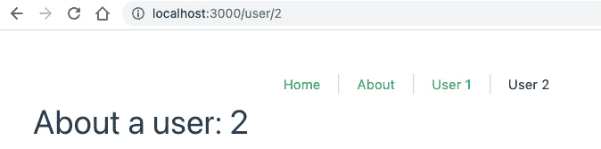

图 7.31 – 导航到 /user/2

当您点击**用户 1**时，您将看到以下内容：

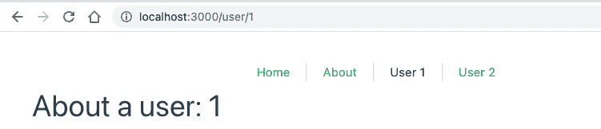

图 7.32 – 导航到 /user/1

我们也可以使用`props: true`将`id`规范化为`User`组件的`props`，并在实例创建和渲染之前加载数据：

```js
<script setup>
import users from '../assets/users.js';
import { ref } from 'vue'
const name = ref('');
const age = ref(0);
const props = defineProps(['id'])
name.value = users[props.id - 1].name;
age.value = users[props.id - 1].age;
</script>
```

现在，我们可以调整 `<template>` 来打印出用户的详细信息：

```js
<template>
  <div>
    <h1>About a user: {{id}}</h1>
    <h2>Name: {{name}}</h2>
    <p>Age: {{age}}</p>
  </div>
</template>
```

选择 `/user/1` 时的输出现在将如下所示：

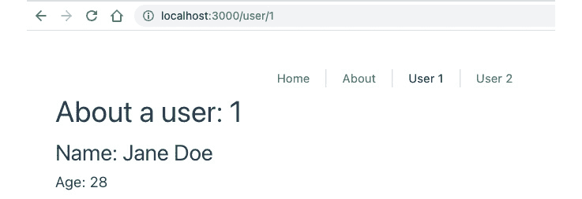

图 7.33 – 使用更新后的 UI 导航到 /user/1

在本节中，我们通过设置一个从给定 URL 提取参数的路由来探讨了动态路由。这项技术允许你创建用户友好的 URL 并动态地将信息传递给路由。在下一节中，我们将探讨捕获错误路径。

# 捕获错误路径

除了 `'/'` 之外，我们还需要记住处理的其他重要路由包括错误路由，例如当 URL 路径不匹配任何已注册路径时的 `404 Not found` 等。

对于 `404 Not found`，我们可以使用正则表达式 `/:pathMatch(.*)*`，它代表 *匹配所有其他 URL*，来收集所有不匹配定义的路由的情况。路由器的配置应位于数组 routes 的末尾，以避免匹配错误的路径：

```js
{
    path: '/:pathMatch(.*)*',
    name: '404',
    component: () => import('../views/404.vue'),
  }
```

当我们输入错误的 `/users` 路径时，输出将如下所示：

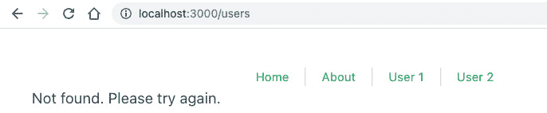

图 7.34 – 当找不到 /users 路径时重定向到 404

在本节中，我们探讨了如何使用正则表达式模式创建一个显示给任何导航到不存在路由的人的 `404` 页面。接下来，我们将实现一个消息路由，使用动态路由模式将相关数据传递给 URL 本身。

## 练习 7.04 – 使用动态路由模式为每个消息实现消息路由

本练习将使你熟悉在与其他导航 Hook 结合使用的情况下创建和维护动态路由。

要访问此练习的代码文件，请参阅 [`github.com/PacktPublishing/Frontend-Development-Projects-with-Vue.js-3/tree/v2-edition/Chapter07/Exercise7.04`](https://github.com/PacktPublishing/Frontend-Development-Projects-with-Vue.js-3/tree/v2-edition/Chapter07/Exercise7.04)。

让我们回到 *练习 7.03* 的消息源，我们将重构 `Message` 路径以使用路由模式在用户选择时动态导航到特定的 `message` 路径，并执行以下步骤：

1.  让我们打开 `./src/router/index.js` 并将消息路由的路径配置更改为 `/message/:id`，其中 `id` 将是给定 `message` 在消息列表中的索引：

    ```js
    {
    ```

    ```js
        path: '/message/:id',
    ```

    ```js
        name: 'message',
    ```

    ```js
        component: () => import('../views/Message.vue'),
    ```

    ```js
        //…
    ```

    ```js
    }
    ```

1.  现在，导航到 `./src/views/MessageFeed.vue`，并将每个消息的 `RouterLink` 的 `to` 属性更改为以下内容：

    ```js
    <RouterLink :to="'/message/${i}'">
    ```

1.  让我们回到 `./src/router/index.js`。在这里，将 `beforeEnter` 定义为一个异步 Hook 用于 `/message` 路径，并将消息内容懒加载到路由的 `query` 字段的 `content` 字段中：

    ```js
    async beforeEnter(to, from, next) {
    ```

    ```js
      if (to.params && to.params.id) {
    ```

    ```js
        const id = to.params.id;
    ```

    ```js
        const module = await import
    ```

    ```js
          ('../assets/messages.js');
    ```

    ```js
        const messages = module.default;
    ```

    ```js
        if (messages && messages.length > 0 && id <
    ```

    ```js
          messages.length) {
    ```

    ```js
          to.query.content = messages[id];
    ```

    ```js
        }
    ```

    ```js
      }
    ```

    ```js
      next()
    ```

    ```js
    },
    ```

1.  然后，我们将 props 字段定义为返回一个对象的函数，该对象包含原始的 params.id 和 query.content，分别作为 id 和 content 字段。

    ```js
    props: route => ({
    ```

    ```js
      id: route.params.id,
    ```

    ```js
      content: route.query.content
    ```

    ```js
    }),
    ```

完整的路由应该看起来像这样：

```js
const routes = [
  //…
  {
    path: '/message/:id',
    name: 'message',
    component: () => import('../views/Message.vue'),
    props: route => ({
      id: route.params.id,
      content: route.query.content
    }),
    async beforeEnter(to, from, next) {
      if (to.params && to.params.id) {
        const id = to.params.id;
        const module = await import ('../assets/messages.js');
        const messages = module.default;
        if (messages && messages.length > 0 && id <
          messages.length) {
          to.query.content = messages[id];
        }
      }
      next()
    },
  }
]
```

1.  使用以下命令运行应用程序：

    ```js
    yarn dev
    ```

当点击**消息流**中的第一条消息时，下一页将如下所示：

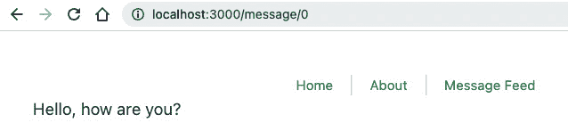

图 7.35 – 访问/message/0 路径时显示的页面

1.  或者，你也可以设置 props: true，而不是在 beforeEnter 钩子中将内容映射到 query.content，你也可以直接将其映射到 route.params，如下所示：

    ```js
    {
    ```

    ```js
      path: '/message/:id',
    ```

    ```js
        name: 'message',
    ```

    ```js
        component: () => import('../views/Message.vue'),
    ```

    ```js
        props: true,
    ```

    ```js
        async beforeEnter(to, from, next) {
    ```

    ```js
          if (to.params && to.params.id) {
    ```

    ```js
            const id = to.params.id;
    ```

    ```js
            const module = await import
    ```

    ```js
              ('../assets/messages.js');
    ```

    ```js
            const messages = module.default;
    ```

    ```js
            if (messages && messages.length > 0 && id <
    ```

    ```js
              messages.length) {
    ```

    ```js
              to.params.content = messages[id];
    ```

    ```js
            }
    ```

    ```js
          }
    ```

    ```js
          next()
    ```

    ```js
        },
    ```

    ```js
    }
    ```

输出应保持不变。

现在你已经学会了如何使用动态路由，你可以进一步使用更多层的路由模式进行实验，例如`message/:id/author/:aid`。对于这些场景，我们通常使用更好的方法——**嵌套路由**。

# 嵌套路由

许多应用程序由由多个多级嵌套组件组成的组件组成。例如，`/user/settings/general`表示一个通用视图嵌套在`settings`视图中，而这个`settings`视图又嵌套在`user`视图中。它代表用户设置页面的**通用信息**部分。

大多数时候，我们希望 URL 与以下截图所示的结构相对应：


图 7.36 – 具有两个嵌套视图（信息和额外信息）的用户

Vue Router 通过使用`nested`路由配置和`RouterView`组件使实现这种结构变得容易。

让我们回到之前例子中的`User.vue`视图（位于`./src/views/`），并在`<template>`部分添加一个嵌套的`RouterView`组件：

```js
<div>
  <h1>About a user: {{$route.params.id}}</h1>
  <RouterLink :to="`/user/${$route.params.id}/info`">
    Info
  </RouterLink> |
  <RouterLink :to="`/user/${$route.params.id}/extra`">
    Extra
  </RouterLink>
  <RouterView />
</div>
```

要开始将组件渲染到这个`RouterView`，我们将配置`user`路由以具有`children`选项，该选项接受一个子路由配置数组的路由配置。对于我们的例子，我们将为每个用户添加一个`info`和`extra`页面。

这些子路由将作为`/user/:id/info`和`/user/:id/extra`访问，为每个用户提供唯一的`info`和`extra`页面：

```js
{
    path: '/user/:id',
    name: 'user',
    component: () => import('../views/User.vue'),
    props: true,
    children: [{
      path: 'info',
      name: 'userinfo',
      component: () => import('../views/UserInfo.vue'),
      props: true,
    }, {
      path: 'extra',
      component: () => import('../views/UserExtra.vue')
    }]
  }
```

当然，我们必须创建两个新的视图。第一个是`UserInfo`，它将根据接收到的`id`值渲染有关用户的所有信息：

```js
<template>
  <div>
    <h2>Name: {{name}}</h2>
    <p>Age: {{age}}</p>
  </div>
</template>
<script setup>
import users from '../assets/users.js';
import { ref } from 'vue';
import { onBeforeRouteUpdate } from 'vue-router';
const props = defineProps(['id'])
const name = ref('')
const age = ref(0)
const user = users[props.id - 1];
name.value = user.name;
age.value = user.age;
onBeforeRouteUpdate((to, from, next) => {
  const user = users[props.id - 1];
  name.value = user.name;
  age.value = user.age;
  next();
})
</script>
```

我们还创建了`UserExtra.vue`，它将渲染任何额外信息（如果有）。在这个例子中，它将只渲染简单的文本：

```js
<template>
  <div>
    <h2>I'm an extra section</h2>
  </div>
</template>
```

嵌套视图已准备好！每当用户点击`UserInfo`视图并更新 URL 如下所示：

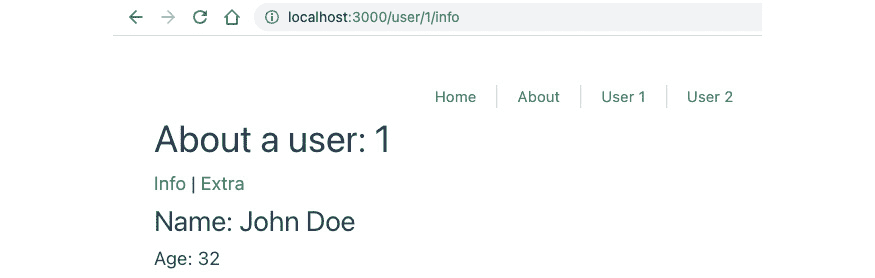

图 7.37 – 包含嵌套 UserInfo 视图的用户页面

当用户点击**额外信息**时，他们将看到以下截图所示的内容：

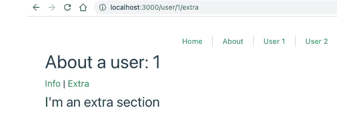

图 7.38 – 包含嵌套 UserExtra 视图的用户页面

在本节中，我们探讨了嵌套路由——具有多个子路由的路由。在我们的示例中，子路由是 `/user/:id/info` 和 `/user/:id/extra`。这种模式允许我们创建扩展其父页面的页面。

在前面的示例中，我们现在可以编辑 **关于用户** 的标题，并将其应用到所有子路由上。随着项目的增长，利用这种模式将有助于你避免在多个视图中重复代码。

在下一节中，我们将利用到目前为止所学的内容来创建消息视图组件的导航标签。

## 练习 7.05 – 在消息视图中构建导航标签

我们将把在 *嵌套路由* 部分学到的知识应用到从 *练习 7.04* 构建的 `Message` 视图中。

要访问此练习的代码文件，请参阅[`github.com/PacktPublishing/Frontend-Development-Projects-with-Vue.js-3/tree/v2-edition/Chapter07/Exercise7.05`](https://github.com/PacktPublishing/Frontend-Development-Projects-with-Vue.js-3/tree/v2-edition/Chapter07/Exercise7.05)。

执行以下步骤：

1.  首先，让我们通过添加以下 `author` 和 `sent` 字段来修改我们的 `messages` 数据库 `src/assets/messages.js`：

    ```js
    const messages = [
    ```

    ```js
      {
    ```

    ```js
        content: 'Hello, how are you?',
    ```

    ```js
        author: 'John',
    ```

    ```js
        sent: '12 May 2019'
    ```

    ```js
      }, {
    ```

    ```js
        content: 'The weather is nice',
    ```

    ```js
        author: 'Lily',
    ```

    ```js
        sent: '12 Jun 2019'
    ```

    ```js
      },
    ```

    ```js
      {
    ```

    ```js
        content: 'This is message feed',
    ```

    ```js
        author: 'Smith',
    ```

    ```js
        sent: '10 Jan 2020'
    ```

    ```js
      },
    ```

    ```js
      {
    ```

    ```js
        content: 'And I am the fourth message',
    ```

    ```js
        author: 'Chuck',
    ```

    ```js
        sent: '1 Apr 2021'
    ```

    ```js
      },
    ```

    ```js
    ];
    ```

1.  在 `MessageFeed.vue` 中，我们将字段更新为渲染为 `message.content`，而不是 `message`，因为 `message` 已不再是字符串：

    ```js
    <RouterLink :to="`/message/${i}`">
    ```

    ```js
      {{ m.content }}
    ```

    ```js
    </RouterLink>
    ```

1.  接下来，我们将创建一个仅渲染消息创建者名称的 `MessageAuthor.vue` 视图：

    ```js
    <template>
    ```

    ```js
      <h3>Author:</h3>
    ```

    ```js
      <p>{{message.author}}</p>
    ```

    ```js
    </template>
    ```

    ```js
    <script setup>
    ```

    ```js
    import { defineProps } from 'vue'
    ```

    ```js
    const { message } = defineProps({
    ```

    ```js
      id: {
    ```

    ```js
        default: '',
    ```

    ```js
        type: String
    ```

    ```js
      },
    ```

    ```js
      message: {
    ```

    ```js
        default: () => ({ author: '' }),
    ```

    ```js
        type: Object
    ```

    ```js
      }
    ```

    ```js
    })
    ```

    ```js
    </script>
    ```

1.  然后，我们将创建一个渲染 `message.sent` 值的 `MessageInfo.vue` 视图：

    ```js
    <template>
    ```

    ```js
      <div>
    ```

    ```js
        <h3>Message info: </h3>
    ```

    ```js
        <p>{{message.sent}}</p>
    ```

    ```js
      </div>
    ```

    ```js
    </template>
    ```

    ```js
    <script setup>
    ```

    ```js
    import { defineProps } from 'vue'
    ```

    ```js
    const { message } = defineProps({
    ```

    ```js
      id: {
    ```

    ```js
        default: '',
    ```

    ```js
        type: String
    ```

    ```js
      },
    ```

    ```js
      message: {
    ```

    ```js
        default: () => ({ sent: '' }),
    ```

    ```js
        type: Object
    ```

    ```js
      }
    ```

    ```js
    })
    ```

    ```js
    </script>
    ```

1.  一旦我们完成了组件，我们需要在我们的路由器 `src/router/index.js` 中 `message` 路由的子路由下注册新的嵌套路由：

    ```js
    {
    ```

    ```js
        path: '/message/:id',
    ```

    ```js
        name: 'message',
    ```

    ```js
        component: () => import('../views/Message.vue'),
    ```

    ```js
        async beforeEnter(to, from, next) { ... },
    ```

    ```js
        props: true,
    ```

    ```js
        children: [{
    ```

    ```js
          path: 'author',
    ```

    ```js
          name: 'messageAuthor',
    ```

    ```js
          props: true,
    ```

    ```js
          component: () =>
    ```

    ```js
            import('../views/MessageAuthor.vue'),
    ```

    ```js
        }, {
    ```

    ```js
          path: 'info',
    ```

    ```js
          props: true,
    ```

    ```js
          name: 'messageInfo',
    ```

    ```js
          component: () =>
    ```

    ```js
            import('../views/MessageInfo.vue'),
    ```

    ```js
        }]
    ```

    ```js
      }
    ```

1.  我们需要将 `message` 路由的 `beforeEnter` 逻辑移动到单独的函数 `beforeEnterMessage`：

    ```js
    async function beforeEnterMessage(to, from, next) {
    ```

    ```js
      const id = to.params.id;
    ```

    ```js
      const module = await import
    ```

    ```js
        ('../assets/messages.js');
    ```

    ```js
      const messages = module.default;
    ```

    ```js
      if (messages && messages.length > 0 && id <
    ```

    ```js
        messages.length) {
    ```

    ```js
        to.params.message = messages[id];
    ```

    ```js
      }
    ```

    ```js
      next()
    ```

    ```js
    }
    ```

1.  然后，将其绑定到 `message` 路由的 `beforeEnter`，以及每个子路由的 `beforeEnter` 钩子，如下面的代码块所示：

    ```js
    {
    ```

    ```js
        path: '/message/:id',
    ```

    ```js
        name: 'message',
    ```

    ```js
        component: () => import('../views/Message.vue'),
    ```

    ```js
        beforeEnter: beforeEnterMessage,
    ```

    ```js
        props: true,
    ```

    ```js
        children: [{
    ```

    ```js
          path: 'author',
    ```

    ```js
          name: 'messageAuthor',
    ```

    ```js
          props: true,
    ```

    ```js
          component: () =>
    ```

    ```js
            import('../views/MessageAuthor.vue'),
    ```

    ```js
            beforeEnter: beforeEnterMessage,
    ```

    ```js
        }, {
    ```

    ```js
          path: 'info',
    ```

    ```js
          props: true,
    ```

    ```js
          name: 'messageInfo',
    ```

    ```js
          component: () =>
    ```

    ```js
            import('../views/MessageInfo.vue'),
    ```

    ```js
            beforeEnter: beforeEnterMessage,
    ```

    ```js
        }]
    ```

    ```js
      }
    ```

1.  最后，在 `Message.vue` 中，我们将对代码进行重构，如下所示：

    ```js
    <template>
    ```

    ```js
      <div>
    ```

    ```js
        <p>Message content: {{message.content}}</p>
    ```

    ```js
        <RouterLink :to="{ name: 'messageAuthor'}">
    ```

    ```js
    Author
    ```

    ```js
    </RouterLink> |
    ```

    ```js
        <RouterLink :to="{ name: 'messageInfo'}">
    ```

    ```js
          Info
    ```

    ```js
        </RouterLink>
    ```

    ```js
        <RouterView/>
    ```

    ```js
      </div>
    ```

    ```js
    </template>
    ```

    ```js
    <script setup>
    ```

    ```js
    import { defineProps } from 'vue'
    ```

    ```js
    const { message } = defineProps({
    ```

    ```js
        message: {
    ```

    ```js
            default: () => ({ content: '' }),
    ```

    ```js
            type: Object
    ```

    ```js
        },
    ```

    ```js
        id: {
    ```

    ```js
            default: '',
    ```

    ```js
            type: String
    ```

    ```js
        }
    ```

    ```js
    })
    ```

    ```js
    </script>
    ```

1.  使用以下命令运行应用程序：

    ```js
    yarn dev
    ```

当你选择 **作者** 选项时，你会看到以下内容：

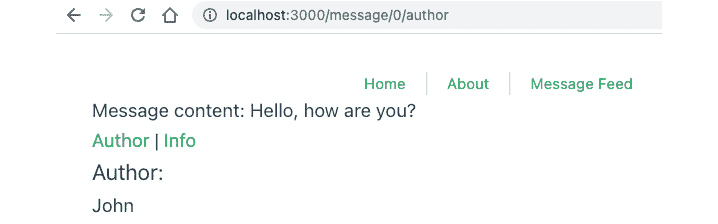

图 7.39 – 已选择“作者”的消息页面

当我们导航到 **信息** 标签时，输出变为：

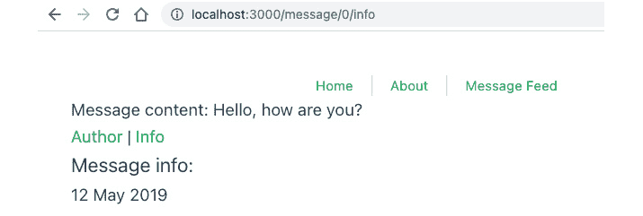

图 7.40 – 已选择“信息”的消息页面

通过这个练习，我们几乎涵盖了 Vue Router 的所有基本功能，特别是在处理动态和嵌套路由方面。在最后一节中，我们将介绍如何通过模板化我们的应用程序来创建视图的可重用布局。

# 使用布局

在 Vue 应用程序中实现布局有许多方法。其中之一是使用槽和创建一个静态包装器`layout`组件在`RouterView`之上。尽管这种方法具有灵活性，但它会导致高昂的性能成本，包括不必要的组件重建以及每次路由变化所需的额外数据获取。

在本节中，我们将讨论一种更好的方法，即利用动态组件的强大功能。组件如下：

```js
<component :is="layout"/>
```

让我们创建一个`src/layouts`文件夹，并创建一个`default`布局组件。此组件具有简单的页眉导航，一个`main`槽来渲染实际内容（这是`<RouterView>`渲染的任何内容），以及页脚：

```js
<template>
  <div class="default">
    <nav>
      <RouterLink to="/">Home</RouterLink> |
      <RouterLink to="/about">About</RouterLink>
    </nav>
    <main class="main">
      <slot/>
    </main>
    <footer>
      <div>Vue Workshop Chapter 07</div>
    </footer>
  </div>
</template>
```

在`App.vue`文件中，我们将更改 Vite 生成的默认视图，使其仅包含`<RouterView>`及其周围的包装器。这个包装器是一个动态组件，它将渲染`layout`变量中的任何内容：

```js
<template>
  <component :is="layout">
    <RouterView/>
  </component>
</template>
```

我们还将初始化`layout`为`default.vue`组件：

```js
<script setup>
import Default from './layouts/default.vue'
const layout = Default
</script>
```

现在，为了响应相应的路由变化来渲染`layout`组件，`RouterView`应该控制要渲染哪个布局。换句话说，`layout`应该是可更新的，并由`RouterView`内部渲染的视图组件决定。

为了实现这一点，我们将`layout`传递给`currentLayout`属性，并在`<RouterView>`中使用`@update`事件更新`layout`：

```js
  <component :is="layout">
    <RouterView
      :currentLayout="layout"
      @update:currentLayout="newLayout => layout = newLayout"
    />
  </component>
```

在`<script setup>`部分，我们使用`shallowRef`将`layout`更改为一个响应式变量，如下所示：

```js
import Default from './layouts/default.vue'
import { shallowRef } from 'vue'
const layout = shallowRef(Default)
```

在创建`HomeView.vue`组件的实例时，我们将发出一个`update:currentLayout`事件来更新并相应地渲染所需的布局：

```js
<script setup>
import TheWelcome from '@/components/TheWelcome.vue'
import DefaultLayout from '../layouts/default.vue';
const props = defineProps(['currentLayout']);
const emits = defineEmits(["update:currentLayout"]);
emits('update:currentLayout', DefaultLayout);
</script>
```

输出将如下所示：

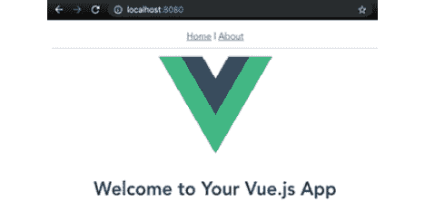

图 7.41 - 使用布局渲染的首页

由于`layout`组件不是`RouterView`组件的一部分，它只会在视图内部布局发生变化时重新渲染。这将保持应用程序在用户导航时的性能。

在本节中，我们探讨了如何使用动态组件为不同的路由提供不同的布局。这使我们能够拥有不同的通用布局 - 例如，一个用于面向用户的页面的全局菜单和另一个用于管理页面的菜单，这些菜单基于使用的路由进行渲染。

在下一节中，我们将通过创建一个具有动态嵌套路由和布局的消息应用程序来构建我们在这里学到的内容。

## 活动七点零一 - 创建一个具有动态、嵌套路由和布局的消息 SPA

要访问此活动的代码文件，请参阅[`github.com/PacktPublishing/Frontend-Development-Projects-with-Vue.js-3/tree/v2-edition/Chapter07/Activity7.01`](https://github.com/PacktPublishing/Frontend-Development-Projects-with-Vue.js-3/tree/v2-edition/Chapter07/Activity7.01)

该活动旨在利用您关于 Vue Router 的知识，包括注册路由和处理动态路由、嵌套路由和路由钩子，以创建**消息 SPA**。此应用程序将允许用户编写新消息、查看消息源，并在消息之间导航以查看其详细信息：

1.  创建一个`MessageEditor`视图（在`src/views/MessageEditor.vue`），该视图将向用户渲染一个带有`textarea`的视图，以及一个`submit`按钮来保存消息。

1.  在`src/router/index.js`中将`editor`路由与`MessageEditor`视图注册。

1.  创建一个`MessageList`视图（在`src/views/MessageList.vue`），该视图将渲染一个由`a`标签包裹的`message id`值列表，选择后将直接跳转到给定`id`的单个消息页面。

1.  在`src/router/index.js`中将`list`路由与`MessageList`视图注册。

1.  添加`Messages`视图（在`src/views/Messages.vue`），该视图将渲染到`editor`或`list`的链接作为其嵌套路由，并相应地渲染嵌套视图。

1.  当用户从`editor`导航离开时，如果某些内容尚未提交，应显示一个消息询问他们是否在导航离开前保存。`Yes`将继续，`No`将中止导航。

1.  添加一个`Message`视图（在`src/views/Message.vue`），该视图将渲染来自`props`的消息内容，以及一个`back`按钮返回到上一个视图。默认情况下，它应跳转到`messages`。

1.  在`src/router/index.js`中将`Message`视图与`message/:id`动态路由注册。

1.  通过创建两个不同的简单布局来改进 UI，一个用于`messages`（仅包含标题）和一个用于`message`（包含标题和`back`按钮）。

预期输出如下：

+   通过编辑器路由添加消息后，显示消息源流的`/list`视图应如下所示：

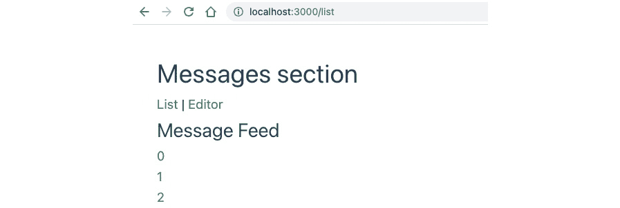

图 7.42 – 消息应用中的/list 视图

+   允许用户编写并发送新消息的`/editor`视图如下：

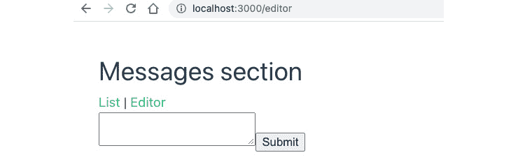

图 7.43 – 消息应用中的/editor 视图

+   **消息**应用中的`/message/:id`动态路由（此处为`/message/0`，表示`id`值为`0`的消息）如下所示：


图 7.44 – 消息应用中的/message/0 视图

当用户尝试在不保存消息的情况下导航离开时，将显示一个警告，如下截图所示：

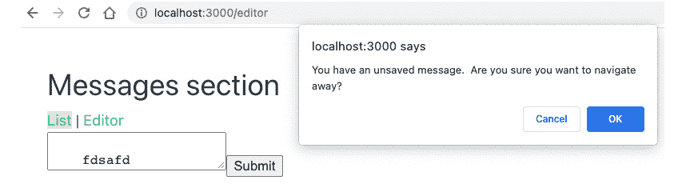

图 7.45 – 用户尝试在不保存消息的情况下离开页面时的/编辑器视图

# 摘要

在本章中，我们学习了 Vue Router 提供的最基本和有用的功能，这些功能可以有效地以有组织的方式为任何 Vue.js 应用程序构建路由。

`RouterView`和`RouterLink`允许应用开发者轻松设置导航路径到相关视图，并保持 SPA 概念。它们本身就是 Vue 组件的事实为我们开发者提供了 Vue 架构的好处，使我们能够在实现嵌套视图或布局时具有灵活性。

将路由定义为具有不同属性的对象简化了架构过程，包括重构现有路径和向系统中添加新路由。使用路由参数和模式提供了动态路由，具有可重用视图，并允许页面之间的通信和数据保留。

最后，通过 Hooks，我们看到了如何拦截导航流程，在需要的地方设置身份验证，重定向到期望的路径，甚至在用户到达目标页面之前加载并保留某些重要数据。这些 Hooks 在无数的使用场景中都可以非常有用，例如在实现返回按钮时。有了 Vue Router，我们现在能够为用户提供一个合适的导航系统，从而构建 Vue.js 应用程序。

在下一章中，我们将探讨如何通过向我们的应用程序添加过渡和动画来增强用户体验。
