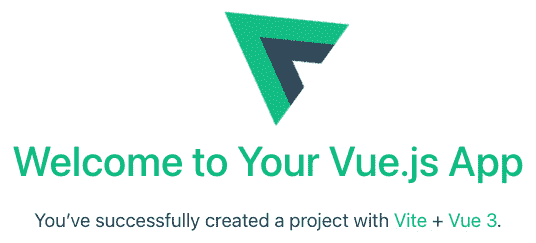
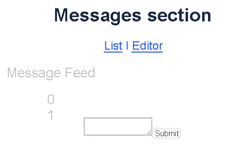

# 8

# 动画和过渡

在上一章中，你学习了路由以及如何使用 Vue Router 设置一个基本的路由导航系统。实现不同路由之间的平滑过渡或为用户提供与应用程序交互时的适当动画效果是达到更高水平的下一步。

在本章中，你将探索 Vue 过渡的要点——如何创建你的过渡，包括单元素动画和使用一组元素的动画，以及如何将它们与外部库结合以实现更复杂的自定义动画。你还将学习如何使用过渡路由创建全页动画。

到本章结束时，你将准备好实现和处理任何 Vue 应用程序的基本过渡和动画效果。

本章涵盖了以下主题：

+   理解 Vue 过渡

+   探索过渡的 JavaScript 钩子

+   过渡元素组

+   检查过渡路由

+   使用 GSAP 库进行动画

# 技术要求

在本章中，你需要根据*第一章*中“开始你的第一个 Vue 项目”的说明设置一个基本的 Vue 项目。你还需要添加 Vue Router，正如在*第七章*中“路由”部分所了解的，在一些示例和练习中使用它。建议创建一个单独的 Vue 组件来方便地练习提到的示例和概念。

你可以在这里找到本章的源代码：[`github.com/PacktPublishing/Frontend-Development-Projects-with-Vue.js-3/tree/v2-edition/Chapter08`](https://github.com/PacktPublishing/Frontend-Development-Projects-with-Vue.js-3/tree/v2-edition/Chapter08)。

# 理解 Vue 过渡

与其他框架不同，Vue.js 为开发者提供了内置的动画支持，包括过渡和动画。过渡的实现方式非常简单，开发者可以轻松地配置并将其添加到他们的应用程序中。Vue.js 的过渡机制支持 CSS 过渡、使用 JavaScript 进行程序性操作，甚至可以与第三方动画库如`Animate.css`集成。

在深入这个主题之前，让我们讨论一下过渡和动画之间的区别。**过渡**发生在组件（或元素）从一个状态移动到另一个状态时，例如在按钮上悬停、从一个页面导航到另一个页面、显示弹出模态等。与此同时，**动画**类似于过渡，但并不局限于仅两个状态。

理解过渡的基础知识将使你能够开始学习动画。

## 使用过渡元素

要访问本例的代码文件，请参阅 [`github.com/PacktPublishing/Frontend-Development-Projects-with-Vue.js-3/tree/v2-edition/Chapter08/Example8.01`](https://github.com/PacktPublishing/Frontend-Development-Projects-with-Vue.js-3/tree/v2-edition/Chapter08/Example8.01)

在本例中，为了使单个组件或元素启用过渡效果，Vue.js 提供了内置的 `transition` 组件，该组件将围绕目标元素包裹，如 `./Example8.01/src/components/Example8-01.vue` 中所示：

```js
<transition name="fade-in">
  <h1 v-show="show">{{ msg }}</h1>
</transition>
```

`transition` 组件为任何目标元素或组件添加两个过渡状态——`enter` 和 `leave`——包括具有条件渲染 (`v-if`) 和条件显示 (`v-show`) 的组件：

+   `enter`：当组件 *进入* DOM 时发生此过渡状态

+   `leave`：当组件 *离开* DOM 时发生此过渡状态

`transition` 组件接收一个名为 `name` 的属性，表示过渡的名称——在本例中是 `fade-in`——同时也是过渡类名的前缀，接下来将讨论这一点。

## 探索过渡类

Vue.js 实现了基于 CSS 和基于类的 `leave` 和 `enter` 过渡效果——因此，过渡将应用于目标组件，使用一组类选择器。

这些类选择器都有 `v-` 前缀，以防 `transition` 组件未提供 `name` 属性。标准类分为两组。

第一组过渡类是组件首次显示时的 `enter` 过渡。以下是 `enter` 过渡类的列表：

+   `v-enter-from`（或 `<name>-enter-from`）：这是起始状态，在组件添加或更新之前添加到组件中。此类将在组件插入 DOM 并完成过渡后移除。在 `./Example8.01/src/components/Example8-01.vue` 的 `<style>` 部分中，我们将设置 `.fade-in-enter-from` 起始状态为完全隐藏，使用 `opacity: 0`：

    ```js
    <style>
    ```

    ```js
    .fade-in-enter-from {
    ```

    ```js
      opacity: 0;
    ```

    ```js
    }
    ```

    ```js
    </style>
    ```

+   `v-enter-active`（或 `<name>-enter-active`）：此类定义了组件在过渡过程中活跃时的延迟、持续时间和缓动曲线。它将在组件插入之前添加到组件上，在整个进入阶段应用于组件，并在效果完成后移除。使用上一节中的 `Example 8-01`，让我们添加 `.fade-in-enter-active`，它将在 `3` 秒内过渡到调整后的 `opacity` 状态：

    ```js
    .fade-in-enter-active {
    ```

    ```js
      transition: opacity 3s ease-in;
    ```

    ```js
    }
    ```

+   `v-enter-to`（或 `<name>-enter-to`）：这是进入的最后子状态，其中在组件插入后添加效果帧，并在效果完成后移除。在我们的例子中，我们不需要定义任何内容，因为此状态应具有 `opacity` 值为 `1`。

第二组类包括 `leave` 过渡，当组件被禁用或从视图中移除时触发：

+   `v-leave-from`（或 `<name>-leave-from`）：这是离开过渡的起始状态。与 `v-enter-to` 一样，我们不需要为此状态定义样式效果。

+   `v-leave-active`（或 `<name>-leave-active`）：这在离开阶段应用，其行为类似于 `v-enter-active`。由于我们想要有一个淡出效果，我们将使用与 `fade-in-enter-active` 相同的样式：

    ```js
    .fade-in-enter-active, .fade-in-leave-active {
    ```

    ```js
      transition: opacity 3s ease-in;
    ```

    ```js
    }
    ```

+   `v-leave-to`（或 `<name>-leave-to`）：这是结束状态，其行为与 `v-enter-to` 类似。由于组件将从视图中消失，我们将重用为 `fade-in-enter-from` 的起始阶段定义的样式来为 `fade-in-leave-to`：

    ```js
    .fade-in-enter-from, .fade-in-leave-to {
    ```

    ```js
      opacity: 0;
    ```

    ```js
    }
    ```

以下截图是到目前为止描述的所有 `transition` 状态的总结：


图 8.1 – 过渡阶段图

在本节中，我们探讨了三种不同的 `enter` 过渡状态和三种 `leave` 过渡状态。我们还介绍了使用过渡状态在文本组件进入用户视图时缓慢淡入一些文本，当文本从用户视图中消失时也适用。

在下一节中，我们将探讨如何使用我们学到的这些过渡状态为组件添加动画效果。

## 组件的动画

要访问此示例的代码文件，请参阅 [`github.com/PacktPublishing/Frontend-Development-Projects-with-Vue.js-3/tree/v2-edition/Chapter08/Example8.02`](https://github.com/PacktPublishing/Frontend-Development-Projects-with-Vue.js-3/tree/v2-edition/Chapter08/Example8.02)

由于动画基本上是过渡（具有两个以上状态）的扩展形式，因此它以与过渡相同的方式应用，唯一的区别是 `v-enter` 只会在 Vue.js 触发的 `animationend` 事件中移除。

注意

`animationend` 是一个 DOM 事件，当 CSS 动画执行完成后会触发，条件是目标元素仍然存在于 DOM 中，并且动画仍然附加到该元素上。

例如，在 *练习 8.02* 的 `<template>` 部分中，我们可以定义一个新的过渡 `slid`，使用动画 CSS 效果作为显示 `msg` 的 `h1` 元素的包装器。这个过渡提供了从屏幕左侧滑入中间并在离开时相反的动画效果。

要开始，使用 CLI 生成一个 `vue` 起始项目，命令如下：

```js
npm init vue@3
```

接下来，打开项目，进入 `Example8.02/src/components/Example8-02.vue`，然后修改现有的 `<``h1>{{msg}}</h1>` 代码：

```js
<transition name="slide">
  <h1 v-if="show">{{ msg }}</h1>
</transition>
```

在 `<style>` 中，我们需要为 `slide` 动画效果定义关键帧：

```js
@keyframes slide {
  0% { transform: translateX(-100px)}
  100% { transform: translateX(0px)}
}
```

相关的过渡类将被分配以下样式：

```js
.slide-enter-from, .slide-leave-to {
  transform: translateX(-100px);
}
.slide-enter-active {
  animation: slide 5s;
}
.slide-leave-active {
  animation: slide 5s reverse;
}
```

这意味着在`enter`的起始阶段和`leave`的结束阶段，文本位置将位于页面指定位置`-100px`处。浏览器将使用`slide`关键帧在 5 秒内动画化元素，并且在离开的`active`状态下，动画将与进入的`active`状态中的动画正好相反。

你还想要添加`show`作为本地数据变量。你可以通过修改`<script setup>`部分来实现，如下面的代码块所示：

```js
import { ref } from 'vue'
const show = ref(true);
const msg = "Welcome to your Vue.js App";
const toggle = () => show.value = !show.value;
```

这样，我们就实现了我们的动画。接下来，下一个挑战是：如果我们想将不同的动画或过渡效果与`leave`和`enter`状态结合使用，或者为这些状态使用外部 CSS 库，该怎么办？让我们看看自定义过渡类。

## 探索自定义过渡类

在本节中，我们再次从使用`npm init vue@3`创建的默认起始项目开始。我们不是设置过渡名称，让 Vue.js 机制填充所需的类名，而是可以通过以下属性提供自定义类，并替换传统默认值。

对于进入状态，使用以下方法：

+   `enter-from-class`

+   `enter-active-class`

+   `enter-to-leave`

对于离开状态，使用以下方法：

+   `leave-from-class`

+   `leave-active-class`

+   `leave-to-class`

我们将从一个基于之前示例（*练习 8.02*）的文件开始创建，但现在我们将为进入状态使用`swing`动画效果，为离开状态使用`tada`动画效果。我们将在`transition`组件中定义`enter-active-class`和`leave-active-class`属性，如下所示：

```js
<transition
    name="slide"
    enter-active-class="swing"
    leave-active-class="tada"
>
    <h1 v-if="show">{{ msg }}</h1>
</transition>
```

然后，在`<style>`部分，我们只需要定义`.tada`和`.swing`，无需任何后缀模式：

```js
.tada {
  animation-fill-mode: both;
  animation-name: tada;
  animation-duration: 3s;
}
.swing {
  animation-fill-mode: both;
  transform-origin: top center;
  animation-duration: 2s;
  animation-name: swing;
}
```

上述代码演示了以下动画类：

+   `tada`，在执行前后都应用于其目标元素的由`tada`定义的 CSS 动画样式，持续时间为 2 秒

+   `swing`，在执行前后都应用于其目标元素的由`swing`定义的 CSS 动画样式，变换的起点设置为顶部中心边缘（`transform-origin`），持续时间为 2 秒

为了设置动画 CSS 样式，我们添加了专用的关键帧：

```js
@keyframes tada {
  0% {
    transform: scale3d(1, 1, 1);
 }
  10%, 20% {
    transform: scale3d(.8, .9, .8) rotate3d(0, 0, 1, -
                                            5deg);
  }
  30%, 50%, 70%, 90% {
    transform: scale3d(1.1, 1.1, 1.1) rotate3d(0, 0, 1,
                                               5deg);
  }
  40%, 60%, 80% {
    transform: scale3d(1.1, 1.1, 1.1) rotate3d(0, 0, 1, -
                                               5deg);
  }
  100% {
    transform: scale3d(1, 1, 1);
  }
}
@keyframes swing {
  20% { transform: rotate(5deg); }
  40% { transform: rotate(-10deg); }
  60% { transform: rotate(5deg); }
  80% { transform: rotate(-10deg); }
  100% { transform: rotate(0deg); }
}
```

对于`tada`动画，我们为每个目标关键帧（动画序列的时间百分比）设置了不同的 CSS 样式，例如在 3D 空间中调整元素的大小（`scale3d()`）和旋转（`rotate3d()`）。对于`swing`动画，我们为`20%`、`40%`、`60%`、`80%`和`100%`的关键帧设置了不同的旋转效果。

你还想要添加一个`show data`变量。你可以通过修改现有的`export`来实现，如下面的代码块所示：

```js
export default {
  data() {
    return {
      msg: "Welcome to your Vue.js App",
      show: true,
    };
  },
  methods: {
    toggle() {
      this.show = !this.show;
    },
  },
}
```

当我们使用`yarn dev`命令运行应用程序时，我们将分别设置进入和离开的动画。以下截图显示了屏幕现在的样子：


图 8.2 – 动画效果的实际应用

您应该看到欢迎文本在旋转的同时缩小，从 *图 8**.2* 中显示的内容过渡到 *图 8**.3* 中显示的内容：


图 8.3 – tada 动画效果的实际应用

在本节中，我们探讨了创建自定义过渡效果。作为一个例子，我们创建了 `swing` 和 `tada`。我们通过在样式表中定义过渡类，然后为每个效果添加关键帧来实现这一点。这种技术可以用来创建各种自定义过渡效果。在下一节中，我们将探讨 JavaScript 钩子及其如何用于更复杂的动画。

# 探索用于过渡的 JavaScript 钩子

要访问此示例的代码文件，请参阅 [`github.com/PacktPublishing/Frontend-Development-Projects-with-Vue.js-3/tree/v2-edition/Chapter08/Example8.03`](https://github.com/PacktPublishing/Frontend-Development-Projects-with-Vue.js-3/tree/v2-edition/Chapter08/Example8.03)

如我们在上一节所学，我们可以使用自定义过渡类来集成外部第三方 CSS 动画库以实现样式效果。然而，也有一些基于 JavaScript 而不是 CSS 的外部库，如 Velocity.js 或 GSAP，它们需要通过 JavaScript 事件和外部动画处理程序设置钩子。

要在 Vue 应用中使用 Velocity.js 或 GSAP 库，您需要分别使用 `npm install` 或 `yarn add` 命令进行安装，如下所示：

+   要安装 Velocity.js，请使用以下命令：

    ```js
    npm install velocity-animate
    ```

    ```js
    #Or
    ```

    ```js
    yarn add velocity-animate
    ```

+   要安装 GSAP，请使用以下命令：

    ```js
    npm install gsap
    ```

    ```js
    #or
    ```

    ```js
    yarn add gsap
    ```

作为 Vue.js 组件，`transition` 组件支持将自定义处理程序绑定到事件列表的 props。让我们看看以下示例：

```js
<transition
  @before-enter="beforeEnter"
  @enter="enter"
  @leave="leave"
>
  <h1 v-if="show">{{ msg }}</h1>
</transition>
```

我们通过编程方式将动画方法绑定到 `transition` 元素上的相应事件：

+   `beforeEnter` 是组件插入之前的动画状态——类似于 `v-enter-from` 阶段。

+   `enter` 是整个进入阶段的动画状态——类似于 `v-enter-active` 阶段。

+   `leave` 在整个离开阶段应用于动画。这与 `v-leave-active` 阶段类似。

我们需要在 `Example8.03/src/components/Example8-03.vue` 组件配置的 `methods` 部分定义这些事件处理程序：

```js
<script setup>
export default {
  name: 'HelloWorld',
  props: {
    msg: String
  },
  data() {
    return {
      msg: '
      show: false
    }
  },
  methods: {
    beforeEnter() {
      //...
    },
    enter() {
      //...
    },
    leave() {
      //...
    }
  }
}
</script>
```

在此示例中，我们将使用 GSAP 库提供的 `gsap.to()` 和 `gsap.timeline()` 功能来创建我们的动画事件，如下所示：

```js
    beforeEnter(el) {
      el.style.opacity = 0;
    },
    enter(el, done) {
      gsap.to(el, {
        duration: 2,
        opacity: 1,
        fontSize: "20px",
        onComplete: done,
      });
    },
    leave(el, done) {
      const tl = gsap.timeline({
        onComplete: done,
      });
      tl.to(el, { rotation: -270, duration: 1,
            ease: "elastic" })
        .to(el, { rotation: -360 })
        .to(el, {
          rotation: -180,
          opacity: 0,
        });
    }
```

对于 `gsap.to` 和 `gsap.timeline().to` 的 `return` 变量，语法相当简单：

```js
gsap.to(<element>, { <effect properties>, <time position> })
gsap.timeline().to(<element>, { <effect properties>, <time position> })
```

大多数效果属性与 CSS 的语法类似，因此它们的使用方法很简单。此外，我们必须将事件发射器接收到的 `done` 回调传递给 `onComplete`，以确保它被触发，并且钩子不会同步调用。此外，请注意，所有事件发射器也会传递 `el`，这是一个指向当前过渡元素的指针，用于使用。

除了这三个事件之外，我们还可以根据动画和转换的复杂性绑定其他事件，例如 `afterEnter`、`enterCancelled`、`beforeLeave`、`afterLeave` 和 `leaveCancelled`。

请注意，如果您仅使用 JavaScript 进行转换，强烈建议添加 `v-bind:css="false"`（或 `:css="false"`）。这是为了防止 Vue.js 侦测并应用任何相关的 CSS，从而避免意外地发生转换干扰：

```js
<transition
      @before-enter="beforeEnter"
      @enter="enter"
      @leave="leave"
      :css="false"
    >
      <h1 v-if="show">{{ msg }}</h1>
</transition>
```

在本节中，我们探讨了如何使用外部 JavaScript 库进行动画。我们还使用 GSAP 库实现了一个简单的缓动动画，利用了动画和时间轴动画功能。

现在我们来学习如何使用动画效果添加新消息。

练习 8.01 – 添加带有动画效果的新消息

在这个练习中，你将使用 `transition` 组件及其 CSS 转换类来为组件添加动画效果。

要访问此练习的代码文件，请参阅 [`github.com/PacktPublishing/Frontend-Development-Projects-with-Vue.js-3/tree/v2-edition/Chapter08/Exercise8.01`](https://github.com/PacktPublishing/Frontend-Development-Projects-with-Vue.js-3/tree/v2-edition/Chapter08/Exercise8.01)。

我们将创建一个消息编辑器，用户可以在其中编写并提交新消息。新消息将立即通过从右滑动的动画效果显示。为此，请参阅以下内容：

1.  以使用 `npm init vue@3` 生成的应用程序作为起点，或者在每个代码仓库的根目录中，使用以下命令按顺序导航到 `Chapter08/Exercise8.01` 文件夹：

    ```js
    > cd Chapter08/Exercise8.01/
    ```

    ```js
    > yarn
    ```

1.  在您的 VS Code 中打开练习项目（在项目目录中使用 `code .` 命令）或您首选的 IDE。

1.  在 `/src/components/` 文件夹中创建一个名为 `Exercise8-01.vue` 的新组件。在这个组件中，`<template>` 将包含两个元素部分：

    +   `textarea`，用于编写新消息并带有提交按钮。

    +   `section`，其中将显示新编写的消息：

        ```js
        <template>
        ```

        ```js
          <div>
        ```

        ```js
            <div class="editor--wrapper">
        ```

        ```js
              <textarea ref="textArea" class="editor" />
        ```

        ```js
              <button @click="onSendClick()"
        ```

        ```js
                class="editor--submit">Submit</button>
        ```

        ```js
            </div>
        ```

        ```js
            <section v-if="message" class="message--display">
        ```

        ```js
              <h4>Your saved message: </h4>
        ```

        ```js
              <span>{{message}}</span>
        ```

        ```js
            </section>
        ```

        ```js
          </div>
        ```

        ```js
        </template>
        ```

1.  接下来，将整个 `message` 部分包裹在 `transition` 元素中，为我们的动画做准备：

    ```js
    <transition name="slide-right">
    ```

    ```js
        <section v-if="message" class="message--display">
    ```

    ```js
            <h4>Your saved message: </h4>
    ```

    ```js
            <span>{{message}}</span>
    ```

    ```js
        </section>
    ```

    ```js
    </transition>
    ```

1.  让我们定义一个名为 `onSendClick` 的方法来更新消息文本，通过添加以下 `script` 代码：

    ```js
    <script>
    ```

    ```js
    export default {
    ```

    ```js
      data() {
    ```

    ```js
        return {
    ```

    ```js
          message: ''
    ```

    ```js
        }
    ```

    ```js
      },
    ```

    ```js
      methods: {
    ```

    ```js
        onSendClick() {
    ```

    ```js
          const message = this.$refs.textArea.value;
    ```

    ```js
          this.message = message;
    ```

    ```js
          this.$refs.textArea.value = '';
    ```

    ```js
        }
    ```

    ```js
      }
    ```

    ```js
    }
    ```

    ```js
    </script>
    ```

1.  接下来，我们将使用 `@keyframes` 在我们的 `style` 部分中定义 `slide-right` 动画效果，使用以下命令：

    ```js
    <style scoped>
    ```

    ```js
    @keyframes slide-right {
    ```

    ```js
      100% {
    ```

    ```js
        transform: translateX(0)
    ```

    ```js
      }
    ```

    ```js
    }
    ```

    ```js
    </style>
    ```

这意味着它将具有此效果的元素在水平方向（在*x*轴上）重新定位到原始起点，（0，0）。

1.  现在，我们将定义两个类，一个用于从左到右滑动进入（`slide-right`），另一个用于从右到左滑动（`slide-left`）：

    ```js
    .slide-right {
    ```

    ```js
      animation: 1s slide-right 1s forwards;
    ```

    ```js
      transform:translateX(-100%);
    ```

    ```js
      transition: border-top 2s ease;
    ```

    ```js
    }
    ```

    ```js
    .slide-left {
    ```

    ```js
      animation: 1s slide-right 1s reverse;
    ```

    ```js
      transform:translateX(-100%);
    ```

    ```js
    }
    ```

1.  将`border-top:0`作为我们的`slide-right`过渡的起点，为这个部分的`border-top`添加一点效果：

    ```js
    .slide-right-enter-from {
    ```

    ```js
      border-top: 0;
    ```

    ```js
    }
    ```

1.  接下来，使用我们关于自定义过渡类的知识，让我们将`enter-active`绑定到`slide-right`类，并将`leave-active`绑定到`slide-left`。然后，我们将这三个属性添加到在*步骤 4*中添加的`transition`元素中：

    ```js
    <transition
    ```

    ```js
          name="slide-right"
    ```

    ```js
          enter-active-class="slide-right"
    ```

    ```js
          leave-active-class="slide-left"
    ```

    ```js
    >
    ```

1.  使用 CSS Flexbox 添加 CSS 样式，使编辑器看起来更美观：

    ```js
    .editor--wrapper {
    ```

    ```js
      display: flex;
    ```

    ```js
      flex-direction: column;
    ```

    ```js
    }
    ```

    ```js
    .editor {
    ```

    ```js
      align-self: center;
    ```

    ```js
      width: 200px;
    ```

    ```js
    }
    ```

    ```js
    .editor--submit {
    ```

    ```js
      margin: 0.5rem auto;
    ```

    ```js
      align-self: center;
    ```

    ```js
    }
    ```

    ```js
    .message--display {
    ```

    ```js
      margin-top: 1rem;
    ```

    ```js
      border-top: 1px solid lightgray;
    ```

    ```js
    }
    ```

1.  最后，使用以下命令运行应用程序：

    ```js
    yarn dev
    ```

在浏览器中访问`http://localhost:3000`，前面的代码将生成一个组件，该组件将以滑动动画效果显示输入的消息，如图*图 8**.4*所示：


图 8.4 – 消息编辑器文本区域

以下截图显示了消息组件在滑动从左到右动画效果下的外观：


图 8.5 – 用于显示的消息过渡

在从左侧动画进入后，组件应停在居中位置，如图*图 8**.6*所示：


图 8.6 – 动画后的消息

这个练习帮助你熟悉了 CSS 中的一些`transform`效果，例如`translateX`和`transition`。它还展示了在 Vue 应用中添加动画是多么简单。

但如果同一组中有多个元素需要过渡，比如一个列表，怎么办呢？我们将在下一个主题中找到答案。

# 元素组的过渡

要访问此示例的代码文件，请参阅[`github.com/PacktPublishing/Frontend-Development-Projects-with-Vue.js-3/tree/v2-edition/Chapter08/Example8.04`](https://github.com/PacktPublishing/Frontend-Development-Projects-with-Vue.js-3/tree/v2-edition/Chapter08/Example8.04)

到目前为止，我们已经了解了 Vue 过渡元素的基本知识，用于简单组件和元素，同时支持仅 CSS 和仅 JavaScript 的动画。接下来，我们将探讨如何将过渡效果应用到一组组件上——例如，使用`v-for`同时渲染的项目列表。

Vue.js 为这个特定目的提供了一个组件，即`transition-group`组件。

我们现在假设我们有一个显示在信息流上的消息列表，并且我们希望为这个列表添加一个过渡效果，以便在屏幕上每个项目出现时提供某种效果。以下是一个组件代码示例（`./Example8.04/src/components/Example8-04.vue`）：

```js
<template>
  <div>
    <button @click="showList">Show list</button>
    <p v-for="message in messages" :key="message"
      v-show="show">
      {{ message }}
    </p>
  </div>
</template>
<script>
export default {
  data() {
    return {
      messages: [
        "Hello, how are you?",
        "The weather is nice",
        "This is the message feed",
        "And I am the fourth message",
        "Chapter 8 is fun",
        "Animation is super awesome",
        "Sorry, I didn't know you called",
        "Be patient, animation comes right up",
      ],
show: false,
    };
  },
  methods: {
    showList () {
      this.show = true;
    },
  },
};
</script>
```

组件包含一个绑定到`showList`方法的`button`元素，以及一个基于`show`变量的条件列表元素。每当点击**显示列表**按钮时，此列表元素会渲染`messages`列表。

让我们将列表元素包裹在`transition-group`组件中，并传递我们之前用于`transition`组件的相同属性——`name="fade"`。`transition-group`和`transition`都接收相同的属性：

```js
<transition-group name="fade" >
  <p v-for="message in messages":key="message"
    v-show="show">
    {{message}}
  </p>
</transition-group>
```

我们需要为传递给`fade`的过渡效果设置 CSS 样式效果，遵循与`transition`类相同的语法规则：

```js
.fade-enter-active, .fade-leave-active {
  transition: all 2s;
}
.fade-enter-from, .fade-leave-active {
  opacity: 0;
  transform: translateX(30px);
}
```

使用`yarn dev`命令运行应用程序后，列表项在出现时将具有淡入效果。以下截图显示了您的屏幕应该如何显示：


图 8.7 – 列表项的淡入

注意，与完全不渲染任何包装容器元素的`transition`组件不同，如果使用`tag`属性定义元素的标签名（例如，以下代码中的`div`包装元素），`transition-group`将渲染一个实际元素：

```js
<transition-group
  name="fade"
  tag="div"
>
  <p v-for="message in messages" :key="message"
    v-show="show">
    {{message}}
  </p>
</Transition-group>
```

在浏览器中，实际的 HTML 输出将如下所示：


图 8.8 – 根据标签属性渲染的过渡容器元素

此外，所有`transition`类仅应用于具有`v-for`属性的列表项元素，而不是包装器。

最后，为了使 Vue.js 能够索引并知道要将过渡应用于哪个项目，每个列表项都必须有`:key`属性。

我们现在将在列表上创建一个移动效果。

## 在转换列表时创建移动效果

在许多情况下，我们希望在列表项的位置转换过程中添加额外的动画，而不仅仅是其可见性转换过程中。位置转换发生在对给定列表进行洗牌、排序、过滤等操作时。列表项已经可见，只是位置发生变化——因此，使用`enter`和`leave`是不起作用的。

为了实现这个动画目标，`transition-group`提供了另一个属性，`v-move`；这个属性允许我们在目标元素更改其位置时，为列表元素添加额外的动画效果：

```js
<transition-group name= "fade"
  v-move="moveItemEffect">
  <!—list element --!>
</transition-group>
```

也可以使用`move-class`属性手动分配：

```js
<transition-group name= "fade"
  move-class="fade-move-in">
  <!—list element --!>
</transition-group>
<style>
.fade-move-in {
  transition: transform 2s ease-in;
}
</style>
```

或者，我们可以简单地定义一个与`name`属性匹配的前缀的 CSS 类，如下所示：

```js
<transition-group name= "fade">
  <!—list element --!>
</transition-group>
<style>
.fade-move {
  transition: transform 2s ease-in;
}
</style>
```

当适用时，Vue 引擎将自动检测并附加相关的`transition`效果类。

接下来，我们将探讨在页面或组件的初始渲染上制作动画。

## 配置初始渲染时的动画

通常，项目列表将在第一次页面加载时显示，并且我们的动画将不起作用，因为元素已经处于视图状态。要触发动画，我们需要使用不同的过渡属性 `appear`，在页面最初渲染、加载完毕后强制动画：

```js
<transition-group
    appear="true"
    tag="div"
>
    <p v-for="message in messages" :key="message">
      {{message}}</p>
</transition-group>
```

我们还可以使用 `v-on:after-appear`、`v-on:appear`、`v-on:after-appear` 和 `v-on:appear-cancelled` 设置钩子，或者我们可以使用以下格式创建自定义类：

```js
<transition-group
  appear="true"
  appear-class="fade-enter"
  appear-active-class="fade-enter-active"
  tag="div"
>
  <p v-for="message in messages"
    :key="message">{{message}}</p>
</transition-group>
```

注意，如果您使用与 `appear` 相关的 JavaScript 钩子，您需要将 `appear` 属性设置为 `true` 并绑定钩子。否则，它将不起作用。

在渲染时进行动画是常用功能，适用于许多情况，例如淡入组件，就像我们在这里做的那样。在下一节中，我们将探讨使用动画对消息列表进行排序。

## 练习 8.02 – 使用动画对消息列表进行排序

在这个简短的练习中，我们将使用 `transition-group` 组件在元素列表上实现动画效果。

要访问此练习的代码文件，请参阅 [`github.com/PacktPublishing/Frontend-Development-Projects-with-Vue.js-3/tree/v2-edition/Chapter08/Exercise8.02`](https://github.com/PacktPublishing/Frontend-Development-Projects-with-Vue.js-3/tree/v2-edition/Chapter08/Exercise8.02)。

基于 *练习 8.01* 的代码，在 `Exercise8-01.vue` 组件中，我们将向消息列表添加额外的功能：**排序**。在排序（A-Z 或 Z-A）时，将对列表应用翻转动画效果。要实现这一点，请参阅以下内容：

1.  使用 `npm init vue@3` 生成的应用程序作为起点，或在代码仓库的根目录下，使用以下命令按顺序导航到 `Chapter08/Exercise8.02` 文件夹：

    ```js
    > cd Chapter08/Exercise8.02/
    ```

    ```js
    > yarn
    ```

1.  在您的 VS Code 中打开练习项目（在项目目录中使用 `code .` 命令）或您偏好的 IDE。

1.  让我们用 `transition-group` 组件包裹消息列表。别忘了将 `tag` 名称设置为 `div`，并使用 `name` 属性添加 `flip` 动画：

    ```js
    <transition-group
    ```

    ```js
      name="flip"
    ```

    ```js
      tag="div"
    ```

    ```js
    >
    ```

    ```js
      <p
    ```

    ```js
        v-for="message in messages"
    ```

    ```js
        :key="message"
    ```

    ```js
        class="message--item"
    ```

    ```js
      >
    ```

    ```js
        {{message}}
    ```

    ```js
      </p>
    ```

    ```js
    </transition-group>
    ```

1.  添加 `appear="true"`，或简写为 `appear`，以在页面加载完成后仅对元素进行动画处理：

    ```js
    <transition-group
    ```

    ```js
        appear
    ```

    ```js
        name="flip"
    ```

    ```js
        tag="div"
    ```

    ```js
    >
    ```

    ```js
      //…
    ```

    ```js
    </transition-group>
    ```

1.  使用以下命令运行应用程序：

    ```js
    yarn dev
    ```

1.  在浏览器中访问 `http://localhost:3000`，输出将如下所示：


图 8.9 – 动画前的消息列表

1.  到目前为止，没有动画，因为我们还没有为 `flip` 定义 CSS 动画样式。在 `src/components/Exercise8-02.vue` 的 `<style>` 部分中，我们将添加 `opacity: 0` 并将列表中的每个元素垂直（在 *y* 轴上）从其原始位置移动 `20px`。这应该是元素进入 `flip-enter-from` 或即将离开过渡的 `flip-leave-to` 时的初始状态：

    ```js
    <style scoped>
    ```

    ```js
      .flip-enter-from, .flip-leave-to {
    ```

    ```js
        opacity: 0;
    ```

    ```js
        transform: translateY(20px);
    ```

    ```js
      }
    ```

    ```js
    </style>
    ```

1.  在相同的`<style>`部分中，为每个`message`元素（`message—item`类）添加自定义 CSS 样式`transition: all 2s`。这是为了确保元素的过渡效果将在`2`秒内应用于所有 CSS 属性：

    ```js
    .message--item {
    ```

    ```js
      transition: all 2s;
    ```

    ```js
    }
    ```

1.  一旦`flip-move`开始工作，我们需要只为`transform`添加过渡效果（这之前定义为垂直`20px`外）。我们可以完美地看到每个消息的上下移动效果。此外，我们还需要在过渡处于离开状态中间时添加`position: absolute`：

    ```js
    .flip-leave-active {
    ```

    ```js
      position: absolute;
    ```

    ```js
    }
    ```

    ```js
    .flip-move {
    ```

    ```js
      transition: transform 1s;
    ```

    ```js
    }
    ```

1.  我们接下来将添加三个按钮——允许您从 A 到 Z 排序，从 Z 到 A 排序，以及随机洗牌：

    ```js
    <button @click="sorting()">Sort A-Z</button>
    ```

    ```js
    <button @click="sorting(true)">Sort Z-A</button>
    ```

    ```js
    <button @click="shuffle()">Shuffle</button>
    ```

1.  我们还需要添加我们的基本组件`export`代码，以及我们的消息源数据。您可以使用任何您喜欢的`messages`内容：

    ```js
    export default {
    ```

    ```js
      data() {
    ```

    ```js
        return {
    ```

    ```js
          messages: [
    ```

    ```js
            "Hello, how are you?",
    ```

    ```js
            "The weather is nice",
    ```

    ```js
            "This is the message feed",
    ```

    ```js
            "And I am the fourth message",
    ```

    ```js
            "Chapter 8 is fun",
    ```

    ```js
            "Animation is super awesome",
    ```

    ```js
            "Sorry, I didn't know you called",
    ```

    ```js
            "Be patient, animation comes right up",
    ```

    ```js
          ],
    ```

    ```js
          show: false,
    ```

    ```js
        };
    ```

    ```js
      },
    ```

    ```js
    };
    ```

1.  接下来，我们将添加排序和洗牌的逻辑。`methods`部分应位于上一步的`export`组件内部：

    ```js
      methods: {
    ```

    ```js
        sorting(isDescending) {
    ```

    ```js
          this.messages.sort();
    ```

    ```js
          if (isDescending) { this.messages.reverse(); }
    ```

    ```js
        },
    ```

    ```js
        shuffle() {
    ```

    ```js
          this.messages.sort(() => Math.random() - 0.5);
    ```

    ```js
        }
    ```

    ```js
      }
    ```

点击其中一个按钮后的输出将如下所示：


图 8.10 – 排序时的消息列表

在这个练习中，我们学习了如何根据元素顺序的变化，使用`transition-group`动态地为组件列表添加`flip`动画效果。请注意，用于洗牌消息列表的算法是简单的，由于其实际应用中的性能复杂性，您不应在实际场景中使用它。

接下来，让我们探索如何在页面间导航时应用过渡效果。

# 检查过渡路由

通过结合 Vue Router 的`router-element`组件和`transition`组件，我们可以轻松地设置用户从一个 URL（路由）导航到另一个 URL 时的过渡效果。

为了让您有一个更基本的理解，我们在下面的部分中演示了一个用户从网站的`home`页面重定向到`about`页面的底层案例。

要启用跨路由的过渡，在 Vue Router 4.x 及以上版本中，我们需要将`v-slot` API 与动态的`component`元素结合使用。我们使用`v-slot`属性将当前路由的视图`Component`绑定到嵌套在`transition`元素下的`component`元素的`is`属性，如下所示：

```js
<router-view v-slot="{ Component }">
  <transition :name="zoom">
    <component :is="Component" />
  </transition>
</router-view>
```

在这里，我们在从一个页面导航到另一个页面时添加了一个`zoom`过渡效果。我们还可以使用`mode`属性来指示过渡模式。目前有两种模式可供设置：

+   `in-out`：新元素首先进入，然后当前元素才会从视图中消失。

+   `out-in`：当前元素首先消失，然后新元素才会进入。我们将使用这个例子，它比之前的例子更常见。

然后，我们只需像往常一样设置过渡 CSS 效果，使用`transition`类，就完成了。就这么简单：

```js
/**Zoom animation */
.zoom-enter-active,
.zoom-leave-active {
  animation-duration: 0.3s;
  animation-fill-mode: both;
  animation-name: zoom;
}
.zoom-leave-active {
  animation-direction: reverse;
}
@keyframes zoom {
  from {
    opacity: 0;
    transform: scale3d(0.4, 0.4, 0.4);
  }
 100% {
    opacity: 1;
 }
}
```

在本节中，我们探讨了过渡路由。过渡效果是在渲染路由之间发生的动画，例如从一个页面导航到另一个页面。在下一个练习中，我们将探讨为应用中导航的每个路由创建过渡效果。

## 练习 8.03 – 为每个导航的路由创建过渡效果

在这个练习中，我们将根据*检查过渡路由*部分中关于`router`元素学到的知识，为不同的路由创建不同的过渡效果。

要访问这个练习的代码文件，请参考[`github.com/PacktPublishing/Frontend-Development-Projects-with-Vue.js-3/tree/v2-edition/Chapter08/Exercise8.03`](https://github.com/PacktPublishing/Frontend-Development-Projects-with-Vue.js-3/tree/v2-edition/Chapter08/Exercise8.03)。

我们将使用*练习 8.02*中的代码创建一个新的路由视图来显示消息，并在导航到这个视图时添加过渡效果。默认效果将是`fade`：

1.  使用`npm init vue@3`生成的应用作为起点，并添加 Vue Router。或者，在代码仓库的根目录下，使用以下命令顺序导航到`Chapter08/Exercise8.03`文件夹：

    ```js
    > cd Chapter08/Exercise8.03/
    ```

    ```js
    > yarn
    ```

1.  在你的 VS Code 中打开练习项目（在项目目录中使用`code .`命令）或你偏好的 IDE。

1.  在`src/views/`文件夹中为`Messages.vue`视图创建一个新的路由视图。为此视图组件渲染`/messages`页面路由，重用*练习 8.02*中的`Exercise8-02.vue`代码。

1.  通过向`routes`中添加一个新的`route`对象来注册这个`/messages`路由，如下所示：

    ```js
    const router = createRouter({
    ```

    ```js
      history: createWebHistory(import.meta.env.BASE_URL),
    ```

    ```js
      routes: [
    ```

    ```js
        {
    ```

    ```js
          path: "/",
    ```

    ```js
          name: "home",
    ```

    ```js
          component: HomeView,
    ```

    ```js
        },
    ```

    ```js
        {
    ```

    ```js
          path: "/messages",
    ```

    ```js
          name: "messages",
    ```

    ```js
          meta: {
    ```

    ```js
            transition: "zoom",
    ```

    ```js
          },
    ```

    ```js
          component: () =>
    ```

    ```js
            import("../views/Messages.vue"),
    ```

    ```js
        },
    ```

    ```js
      ],
    ```

    ```js
    });
    ```

1.  在`App.vue`中添加指向这个新创建的路由的链接：

    ```js
    <nav>
    ```

    ```js
      <RouterLink to="/">Home</RouterLink>
    ```

    ```js
      <RouterLink to="/messages">Messages</RouterLink>
    ```

    ```js
    </nav>
    ```

1.  接下来，在`App.vue`中，我们将全局`route`实例（见*第七章*，*路由*）绑定到`slot`，并使用`meta`属性（或使用本地`transition`数据）动态分配为特定路由定义的`transition`。我们还绑定过渡模式到本地`mode`数据：

    ```js
    <router-view v-slot="{ Component, route }">
    ```

    ```js
      <transition :name="route.meta.transition ||
    ```

    ```js
        transition" :mode="mode">
    ```

    ```js
        <component :is="Component" />
    ```

    ```js
      </transition>
    ```

    ```js
    </router-view>
    ```

1.  在`App.vue`的`script`部分，确保我们定义了`transition`和`mode`的默认值：

    ```js
    <script setup>
    ```

    ```js
    import { RouterLink, RouterView } from "vue-router";
    ```

    ```js
    let transition = "fade";
    ```

    ```js
    const mode = "out-in";
    ```

    ```js
    </script>
    ```

1.  在`App.vue`中使用以下 CSS 添加淡入淡出样式：

    ```js
    <style>
    ```

    ```js
      .fade-enter-from, .fade-leave-to {
    ```

    ```js
        opacity: 0;
    ```

    ```js
      }
    ```

    ```js
      .fade-enter-active, .fade-leave-active {
    ```

    ```js
        transition: opacity 1s ease-in;
    ```

    ```js
      }
    ```

    ```js
    </style>
    ```

1.  到目前为止，所有页面都加载了`fade`效果，包括`/messages`。但我们要让`messages`页面以不同的效果加载：`zoom`效果。接下来，在同一个`style`标签内添加`zoom`动画的相关 CSS 代码：

    ```js
    /**Zoom animation */
    ```

    ```js
    .zoom-enter-active,
    ```

    ```js
    .zoom-leave-active {
    ```

    ```js
      animation-duration: 0.5s;
    ```

    ```js
      animation-fill-mode: both;
    ```

    ```js
      animation-name: zoom;
    ```

    ```js
    }
    ```

    ```js
    .zoom-leave-active {
    ```

    ```js
      animation-direction: reverse;
    ```

    ```js
    }
    ```

    ```js
    @keyframes zoom {
    ```

    ```js
     from {
    ```

    ```js
        opacity: 0;
    ```

    ```js
        transform: scale3d(0.4, 0.4, 0.4);
    ```

    ```js
     }
    ```

    ```js
      100% {
    ```

    ```js
        opacity: 1;
    ```

    ```js
      }
    ```

    ```js
    }
    ```

1.  现在我们将使用以下代码在应用默认布局中添加一些标准的 CSS 样式：

    ```js
    #app {
    ```

    ```js
      font-family: 'Avenir', Helvetica, Arial, sans-serif;
    ```

    ```js
      -webkit-font-smoothing: antialiased;
    ```

    ```js
      -moz-osx-font-smoothing: grayscale;
    ```

    ```js
      text-align: center;
    ```

    ```js
      color: #2c3e50;
    ```

    ```js
    }
    ```

    ```js
    #nav {
    ```

    ```js
      padding: 30px;
    ```

    ```js
    }
    ```

    ```js
    #nav a {
    ```

    ```js
      font-weight: bold;
    ```

    ```js
      color: #2c3e50;
    ```

    ```js
    }
    ```

    ```js
    #nav a.router-link-exact-active {
    ```

    ```js
      color: #42b983;
    ```

    ```js
    }
    ```

1.  现在，我们需要将`/messages`路由与这个特定的过渡效果映射，而不影响其他路由。为了做到这一点，我们需要在`src/router/index.js`中路由配置的`meta`属性中添加一个名为`transition`的字段：

    ```js
      {
    ```

    ```js
        path: '/messages',
    ```

    ```js
        name: 'messages',
    ```

    ```js
        meta: {
    ```

    ```js
          transition: 'zoom',
    ```

    ```js
        },
    ```

    ```js
        component: () => import '../views/Messages.vue')
    ```

    ```js
      }
    ```

1.  检查你的`routes`对象的代码，以确认它与以下代码相同。在这里，我们将我们的应用程序的每个 URL 与一个视图文件相匹配：

    ```js
    const router = createRouter({
    ```

    ```js
      history: createWebHistory(import.meta.env.BASE_URL),
    ```

    ```js
      routes: [
    ```

    ```js
        {
    ```

    ```js
          path: "/",
    ```

    ```js
          name: "home",
    ```

    ```js
          component: HomeView,
    ```

    ```js
        },
    ```

    ```js
        {
    ```

    ```js
          path: "/messages",
    ```

    ```js
          name: "messages",
    ```

    ```js
          meta: {
    ```

    ```js
            transition: "zoom",
    ```

    ```js
          },
    ```

    ```js
          component: () =>
    ```

    ```js
            import("../views/Messages.vue"),
    ```

    ```js
        },
    ```

    ```js
      ],
    ```

    ```js
    });
    ```

1.  使用以下命令运行应用程序：

    ```js
    yarn dev
    ```

1.  现在，如果你在浏览器中打开`localhost:3000`并导航到`/messages`，你应该会看到类似于*图 8.11*的界面：


图 8.11 – 在进行缩放效果的同时导航到/messages

在导航到其他路由时，我们应该看到*图 8.12*中显示的默认过渡效果。


图 8.12 – 导航到/home 时带有淡入效果的提示信息

这个练习展示了我们如何通过结合合适的钩子和方法，以最小的努力为不同的页面设置不同的过渡效果。你可以通过使用外部库进一步实验，使你的应用动画更加平滑和生动。

# 使用 GSAP 库进行动画

GSAP 是一个开源的脚本库，专注于使用 JavaScript 进行快速动画，并提供跨平台的兼容性支持。它支持在广泛的元素类型上动画，例如**矢量图形**（**SVG**）、React 组件、画布等。

GSAP 非常灵活，易于安装，并且可以适应任何配置，从 CSS 属性或 SVG 属性到将对象渲染到画布上的数值。

核心库是一套不同的工具，分为核心工具和其他工具，例如插件、缓动工具和实用工具。

## 安装 GSAP

使用`npm install`或`yarn add`命令安装 GSAP 非常简单：

```js
yarn add gsap
#or
npm install gsap
```

安装完成后，你应该会看到以下截图所示的输出结果：


图 8.13 – 安装成功后的结果

现在我们已经安装了 GSAP，我们将查看 GSAP 中的基本缓动。

## 基本缓动

**缓动**是由 GSAP 库的创建者定义的一个概念，它是一个高性能的设置器，用于执行所有基于用户配置输入的所需动画工作。我们可以使用目标对象、一个周期或任何特定的 CSS 属性作为动画的输入。在执行动画时，缓动会根据给定的持续时间确定 CSS 属性的值，并相应地应用它们。

以下是一些创建基本缓动的基本方法。

### gsap.to()

最常用的缓动是`gsap.to()`，它根据以下两个主要参数创建动画：

+   `#myId`。

+   `opacity: 0`、`rotation: 90`或`fontSize: '20px'`；动画属性如`duration: 1`、`stagger: 0.2`或`ease: "elastic"`；以及事件处理属性如`onComplete`或`onUpdate`。

例如，如果我们想在`HelloWorld.vue`中动画化 Vue 的标志，我们运行以下命令：

```js
gsap.to(el, {duration: 3, opacity: 1, onComplete: done});
```

或者，使用以下方法移动具有 `x` 属性的对象（与 `transform: translateX()` 相同）：

```js
gsap.to(".green", {duration: 3, x: 500, rotation: 360});
```

上述代码定位具有 `green` 类的元素，并在该元素进入视图时在水平方向上旋转 `360` 度，距离为 `500` 像素。

### gsap.from() 和 gsap.fromTo

我们并不总是想为视图中元素定义预期的动画效果。相反，我们定义动画应从目标元素开始的默认值 - 这就是使用 `gsap.from()` 的时候。

例如，假设一个盒子的当前 `opacity` 值为 `1`，`scale` 值为 `1`，`x` 位置为 `0`，我们想要设置一个动画，从 `x` 位置 `300`，`opacity` 值为 `0` 和 `scale` 值为 `0.5` 开始。换句话说，动画将从 `{x: 300, opacity: 0, scale: 0.5}` 动画到元素当前拥有的任何值：

```js
gsap.from(".red", {duration: 3, x: 300, scale: 0.5, opacity: 0});
```

然而，在许多情况下，我们需要为动画设置起始和结束值，因为单边设置是不够的。为此，GSAP 提供了 `gsap.fromTo()`，其语法如下：

```js
gsap.fromTo(target, fromValues, toValues)
```

让我们定义一个动画，将一个灰色框从原始值 `{ opacity: 0, scale: 0.5, x: 300 }` 动画到 `{ opacity: 1, scale: 1, x: 100, rotation: 360}`：

```js
gsap.fromTo(".grey",
    { duration: 3, opacity: 0, scale: 0.5, x: 600 },
    { duration: 3, opacity: 1, scale: 1, x: 200, rotation:
      360}
  )
```

为了将所有类似 CSS 的值转换为相应的 CSS 值，GSAP 的核心插件之一是 `CSSPlugin`。此插件将自动检测目标是否为 DOM 元素，拦截传递的值，将它们转换为适当的 CSS 值，然后相应地将它们作为内联样式应用到元素上。

在下一节中，我们将通过一个练习来创建一个简单的使用 GSAP 的缓动动画。

## 练习 8.04 – 使用 GSAP 进行缓动

本练习的目的是让你熟悉使用外部库，如 GSAP。

要访问此练习的代码文件，请访问 [`github.com/PacktPublishing/Frontend-Development-Projects-with-Vue.js-3/tree/v2-edition/Chapter08/Exercise8.04`](https://github.com/PacktPublishing/Frontend-Development-Projects-with-Vue.js-3/tree/v2-edition/Chapter08/Exercise8.04)。

我们将设置一个简单的动画，但您可以在 Vue 代码的任何地方应用此相同的模式。我们将应用动画在挂载时，但 JavaScript 动画可以根据计时器、随机整数或按钮等输入动态触发： 

1.  使用 `npm init vue@3` 生成的应用程序作为起点，并添加 Vue Router。或者，在代码仓库的根目录下，使用以下命令顺序进入 `Chapter08/Exercise8.04` 文件夹：

    ```js
    > cd Chapter08/Exercise8.04/
    ```

    ```js
    > yarn
    ```

1.  在您的 VS Code 中打开练习项目（在项目目录中使用 `code .` 命令）或您首选的 IDE。

1.  使用以下命令之一使用 `yarn` 或 `npm` 安装 GSAP：

    ```js
    yarn add gsap
    ```

    ```js
    # OR
    ```

    ```js
    npm install gsap
    ```

1.  在 `src/App.vue` 中找到现有的 `img` 标签，并按如下方式添加 `ref="logo"`：

    ```js
    
    ```

1.  在`src/App.vue`的`<script setup>`部分导入 GSAP：

    ```js
    import gsap from 'gsap'
    ```

1.  我们使用`ref()`钩子将`logo`定义为响应式变量，它包含在*步骤 4*中设置的`img`元素的引用：

    ```js
    import { ref } from 'vue'
    ```

    ```js
    const logo = ref();
    ```

1.  然后，我们使用`onMounted()`生命周期钩子添加一个动画，该动画是`10`次旋转，持续`30`秒：

    ```js
    import { onMounted, ref } from 'vue'
    ```

    ```js
    onMounted(() => {
    ```

    ```js
      gsap.from(logo.value, { duration: 30, rotation: 3600
    ```

    ```js
      });
    ```

    ```js
    });
    ```

完整的`script`部分组件代码将如下所示：

```js
<script setup>
import HelloWorld from "./components/HelloWorld.vue";
import gsap from "gsap";
import { onMounted, ref } from 'vue'
const logo = ref();
onMounted(() => {
  gsap.from(logo.value, { duration: 30, rotation: 3600
  });
});
</script>
```

1.  接下来，通过在终端中运行`yarn dev`来启动应用程序。

1.  打开您的浏览器到`localhost:3000`，你应该看到默认的 Vue 启动页面，但带有旋转的 logo，如下面的截图所示：



图 8.14 – 使用 GSAP 的简单动画

在这个练习中，我们学习了如何在 Vue 中使用 GSAP 实现简单的旋转动画。接下来，我们将看到如何通过缓动修改动画的外观和感觉。

## 使用缓动效果修改外观和感觉

缓动很重要，因为它决定了动画的原点与目的地之间的运动风格。它控制了缓动过程中的变化率；因此，用户有时间看到效果，无论是平滑、突然、弹跳还是其他类型的过渡效果：

```js
gsap.from(".bubble", {
    duration: 2,
    scale: 0.2,
    rotation: 16,
    ease: "bounce",
})
```

在前面的示例代码中，`duration`是以毫秒为单位，表示动画活跃的时间长度。

此外，GSAP 中还有额外的内置插件，提供了配置缓动效果的额外功能，例如`power`、`back`、`elastic`等。

为了使运动在一定程度的平滑，我们使用以下语法：

```js
ease: "<ease-name>.<ease-type>(<addition-inputs>)"
```

以`bubble`效果为例 – 我们可以通过以下代码启用平滑的`elastic`缓动效果：

```js
gsap.to(".bubble", 4, {
  duration: 4,
  scale: 1.2,
  rotation: '-=16',
  ease: 'elastic(2.5, 0.5)',
})
```

或者，按照以下方式添加`elastic`缓动：

```js
gsap.to(".bubble", 4, {
  duration: 4,
  scale: 1.2,
  rotation: '-=16',
  ease: 'elastic.in(2.5, 0.5)',
})
```

使用`ease`，我们可以根据设置的样式使相同的动画看起来完全不同。接下来，我们将查看`stagger`，这是另一种影响动画外观和感觉的选项。

## 使用交错效果修改外观和感觉

在前面的章节中，我们已经介绍了如何使用 Vue 过渡动画来动画化一系列项目。交错是对于一系列对象我们应该考虑的一种动画，因为它使得此类目标的动画变得简单，并且每个项目动画之间有适当的延迟。

例如，通过为`stagger`属性赋值，我们可以在除了延迟`duration`数字（以毫秒为单位）之外创建并应用一些配置选项：

```js
gsap.to('.stagger-box', 2, {
  duration: 2,
  scale: 0.1,
  y: 60,
  yoyo: true,
  repeat: 1,
  ease: "power3.inOut",
  delay:1,
  stagger: {
    amount: 1.5,
    grid: "auto",
    from: "center"
  }
})
```

您可以使用`repeat`来定义动画应重复的次数。负数将使其无限重复。

## 使用时间轴

**时间轴**是您完全控制的缓动调度，用于定义缓动之间的重叠或间隔。当您需要根据顺序控制一组动画、构建一系列动画、链式动画以进行最终回调或模块化动画代码以实现可重用时，它非常有用。

为了使用时间轴，你可以使用内置的`gsap.timeline()`创建一个`timeline`实例，并按照以下方式设置实例配置：

```js
import gsap from 'gsap';
const tl = gsap.timeline( { onComplete: done });
```

我们将简要介绍时间轴的两个主要用途 – 排序和链接。

### 通过排序创建动画效果链

与 GSAP 类似的核心功能，时间轴也提供了`to()`、`from()`和`fromTo()`方法。默认情况下，所有动画都可以一个接一个地排序，可以通过使用`position`属性来强制控制何时或在哪里进行，这是一个可选参数，如下面的代码所示：

```js
const tl = gsap.timeline({ repeat: -1});
tl.to("#box-green", {duration: 2, x: 550})
//1 second after end of timeline (gap)
tl.to("#box-red", {duration: 2, x: 550, scale: 0.5}, "+=1")
//0.5 seconds before end of timeline (overlap)
tl.to("#box-purple", {duration: 2, rotation: 360, x:550,
       scale: 1.2, ease: "bounce"}, "-=1")
```

在本节中，我们探讨了使用 GSAP 时间轴功能来安排一系列动画，这些动画一个接一个地运行，有些有间隔，有些有重叠。在下一节中，我们将进一步探讨使用链接的概念来排序动画。

### 链接

与排序类似，链接将动画排列成顺序。而不是每次都使用实例方法单独调用每个动画，它将被放置在链中。在子缓动器之间使用的所有特殊值都可以定义。在创建为`defaults`的实例中，或者在第一次调用中，获取链中的其他时间轴（动画列表）以继承这些值：

```js
const tl = gsap.timeline({ defaults: { duration: 2 },
                           repeat: -1});
tl.to("#box-green", { x: 550 })
  .to("#box-red", { scale: 0.5, x: 450 })
  .to("#box-purple", { scale: 1.2, ease: "bounce", x: 500
  })
```

我们还可以使用`position`拦截每个链接时间轴的时间位置，如前所述：

```js
tl.to("#box-green", { x: 550 })
  .to("#box-red", { scale: 0.5, x: 450 }, "+=1")
  .to("#box-purple", { scale: 1.2, ease: "bounce", x: 500
       }, "-=1")
```

GSAP 有非常详细的文档，所以只需访问[`greensock.com/get-started`](https://greensock.com/get-started)并开始动画。

在下一节中，我们将基于我们对 GSAP 的了解来制作一个带有动画过渡的消息查看应用。

## 活动八.01 – 使用过渡和 GSAP 构建消息应用

要访问此活动的代码文件，请参阅[`github.com/PacktPublishing/Frontend-Development-Projects-with-Vue.js-3/tree/v2-edition/Chapter08/Activity8.01`](https://github.com/PacktPublishing/Frontend-Development-Projects-with-Vue.js-3/tree/v2-edition/Chapter08/Activity8.01)

在此活动中，您将使用 CSS 编写自定义过渡，使用过渡组和路由设置更复杂的过渡，并使用第三方过渡库，如 GSAP，在应用中创建动画和过渡。

您将创建一个简单的消息应用，该应用利用过渡效果。

以下步骤将帮助您完成此活动：

1.  使用`npm init vue@3`作为起点创建一个新的 Vue 应用，并添加 Vue Router。

1.  创建一个`Messages`路由（在`src/views/Messages.vue`），它渲染两个嵌套视图：`Messages`（`src/views/MessageList.vue`），用于显示消息列表，以及`MessageEditor`（`src/views/MessageEditor.vue`），包含一个`textarea`和一个用于创建新消息的`submit`按钮。

1.  创建一个`Message`路由（在`src/views/Message.vue`），它渲染一个具有给定 ID 的单条消息视图。

1.  注册所有路由。

1.  在 `src/App.vue` 文件中的主 `router-view` 上添加一个简单的过渡名称 `fade` 和 `out-in` 模式。

1.  通过使用自定义过渡类，将过渡添加到 `src/views/Messages.vue` 中的嵌套 `router-view`。

1.  创建一个动画效果，在进入路由时放大，在离开路由时缩小。

1.  为离开事件创建另一个淡入动画效果。

1.  在 `MessageList.vue` 中的消息列表上添加一个弹入效果。

1.  使用 GSAP 动画弹入效果。

1.  为出现的项目添加移动效果。

1.  当从 **列表** 页面导航到 **编辑** 页面时，你应该看到内容流向左滑动，**编辑** 页面出现，如图 *图 8.15* 所示：



图 8.15 – 从消息列表视图导航到编辑视图时淡出

当从消息视图导航到编辑视图时，你应该看到文本输入向左滑动，如图 *图 8.16* 所示：


图 8.16 – 从编辑视图导航到消息列表视图时淡出

接下来，消息列表将以弹跳效果显示数字，如图 *图 8.17* 所示：


图 8.17 – 在消息列表视图中显示消息流时的弹跳效果

当点击特定的消息时，**0** 或 **1** 在我们的例子中，我们的列表将向左滑动，你应该看到消息内容，如图 *图 8.18* 所示：


图 8.18 – 单条消息视图

到目前为止，你已经了解了 GSAP 的基础知识，例如缓动和时间轴。你还通过在 Vue 组件中结合过渡和 GSAP 功能来创建缓动和交错动画进行了实验。

# 摘要

在本章中，我们探讨了 Vue.js 内置的过渡和动画支持，包括单组件和多组件，并看到了如何轻松设置。到这一点，你已经为路由和组件创建了过渡和动画效果，并见证了 Vue.js 过渡的所有基本功能：自定义过渡类、分组过渡和过渡模式。此外，你还了解了其他领先的动画第三方库，如 GSAP，并看到了如何将它们集成到你的 Vue 应用程序中，以获得更好的网页动画效果。

下一章将重点介绍构建生产就绪的 Vue 应用程序的关键主题之一 – 状态管理和应用程序内组件之间如何使用 Pinia（一个状态管理库）进行通信。

# 第三部分：全局状态管理

在这部分，我们将探讨如何在 Vue 应用程序中管理和存储数据。我们将从如何原生地处理 Vue 中的状态的示例开始，然后继续展示 Pinia 库如何使这一过程变得更简单。

我们在本节将涵盖以下章节：

+   *第九章*, *Vue 状态管理的状态*

+   *第十章*, *使用 Pinia 进行状态管理*
