# 第九章：Vue 状态管理的现状

您现在已经看到了如何构建 Vue.js 应用程序，并且已经开始将多个不同的组件组合成您的第一套真实应用程序。随着应用程序规模的扩大，其复杂性也在增加。在这一章中，是时候看看您如何可以通过集成**状态管理**来开始管理这种复杂性了。

在这里，您将首先了解状态问题是如何产生的，状态管理如何帮助解决这些问题，以及 Vue.js 3 有哪些特性可以帮助您直接处理这些问题。您将在构建一个简单的**配置文件卡片**应用程序的同时学习这些内容，该应用程序使用多个组件，这些组件之间需要同步状态。下一章将介绍一个进一步帮助这一过程的工具，称为**Pinia**。

因此，在本章中，我们将涵盖以下主题：

+   理解组件架构和状态问题

+   在公共祖先组件中持有状态

+   添加简单的状态管理

+   决定何时使用局部状态或全局状态

# 技术要求

除了您之前用于使用 Vue.js 构建应用程序的`npm` CLI 之外，本章没有其他技术要求。

您可以在此处找到本章的源代码：[`github.com/PacktPublishing/Frontend-Development-Projects-with-Vue.js-3/tree/v2-edition/Chapter09`](https://github.com/PacktPublishing/Frontend-Development-Projects-with-Vue.js-3/tree/v2-edition/Chapter09)

# 理解组件架构和状态问题

在前面的章节中，我们看到了如何使用局部状态和`props`来持有状态并在父子组件层次结构中共享状态。

现在，我们将开始展示如何利用`状态`、`属性`和`事件`在无**父子**配置的组件之间共享状态。这类组件被称为**兄弟组件**。

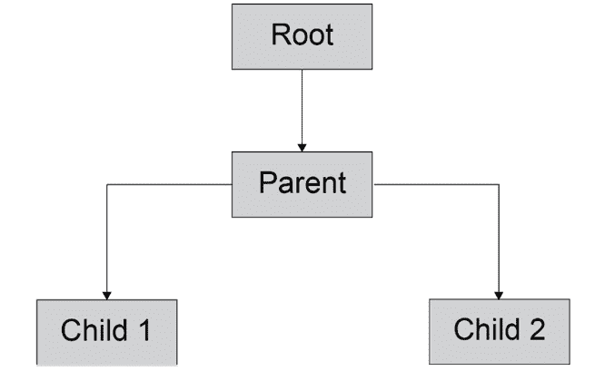

图 9.1 – 子组件 1 和子组件 2 是“兄弟”组件

在本章的整个过程中，我们将构建一个**配置文件生成器**应用程序，演示状态如何在应用程序中以 props 的形式沿着组件树流动，以及如何通过事件、事件总线以及存储更新来传播更新。

既然我们想要构建一个配置文件生成器，我们可以将应用程序分解为三个部分：一个**头部**，我们将在这里有全局控制和显示页面标题；一个**配置文件表单**，我们将在这里捕获数据；最后，一个**配置文件显示**，我们将在这里显示配置文件卡片。在**图 9**.2 中，您可以看到我们的根组件（**App（根）**），以及三个兄弟子组件。

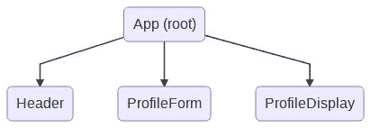

图 9.2 – 展示配置文件卡片应用程序组件树

我们现在已经看到了如何将我们的应用程序视为组件树，以及我们的应用程序如何作为组件树进行结构化。在下一节中，我们将演示将所有共享状态放入根组件中。

# 在共享祖先组件中持有状态

要仅使用`state`组件和`props`持有状态，并通过`events`更新它，我们将将其存储在最近的共享祖先组件中。

`state`仅通过`props`传播，并且仅通过`events`更新。在这种情况下，所有`state`组件都将生活在需要它们的组件的共享祖先中。由于`App`组件是根组件，因此它是持有共享状态的默认选择。


图 9.3 – 带有 props 和事件传播的共享祖先组件持有状态

要更改`state`，组件需要向持有我们`state`（共享祖先）的组件发出`events`。共享祖先需要根据数据和`events`的类型更新`state`。这反过来又会导致重新渲染，在此期间，祖先组件将更新的`props`传递给读取`state`的组件。

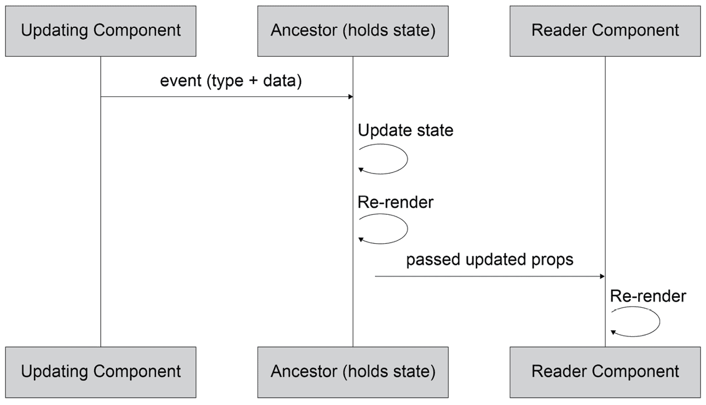

图 9.4 – 当祖先持有状态时更新兄弟组件

让我们通过在*个人资料卡片编辑器*上工作来查看这个例子。为了构建标题，我们需要在`AppHeader.vue`文件中创建一个`AppHeader`组件，它将包含一个模板和一个带有 TailwindCSS 类的`h2`标题。

注意

你可以在这里了解更多关于在 Vue3 中使用 Tailwind CSS 的信息：[`tailwindcss.com/docs/guides/vite`](https://tailwindcss.com/docs/guides/vite)。

要做到这一点，请添加以下代码：

```js
<template>
  <header class="w-full block p-4 border-b bg-blue-300
    border-gray-700">
    <h2 class="text-xl text-gray-800">Profile Card
      Generator</h2>
  </header>
</template>
```

然后，我们将导入标题，将其注册，并在`App.vue`文件中渲染它：

```js
<script setup>
import AppHeader from '@/components/AppHeader.vue'
</script>
<template>
  <div id="app">
    <AppHeader/>
  </div>
</template>
```

前面代码的输出将如下所示：

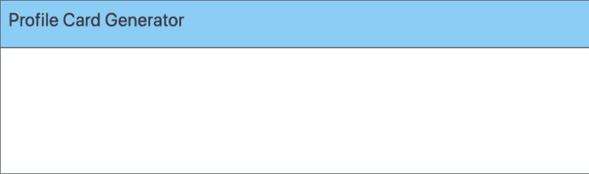

图 9.5 – 在个人资料卡片生成器中显示的 AppHeader

我们将类似地创建一个`AppProfileForm`文件；此组件的目的是布局用于编辑个人资料的标签和表单字段：

```js
<template>
  <section class="md:w-2/3 flex flex-col p-12 items-center
    bg-red-200">
  <!-- Inputs -->
  </section>
</template>
```

然后，我们将创建一个`AppProfileDisplay`文件；此组件负责显示个人资料，以便用户可以预览他们的编辑：

```js
<template>
  <section class="md:w-1/3 h-64 bg-blue-200 flex">
  <!-- Profile Card -->
  </section>
</template>
```

我们的两个容器（`AppProfileForm`和`AppProfileDisplay`）现在都可以导入并在`App`中渲染：

```js
<script setup>
import AppHeader from '@/components/AppHeader.vue'
import AppProfileDisplay from '@/components/AppProfileDisplay.vue'
import AppProfileForm from '@/components/AppProfileForm.vue'
</script>
<template>
  <div id="app">
    <AppHeader/>
    <div class="flex flex-col md:flex-row">
      <AppProfileForm />
      <AppProfileDisplay />
    </div>
  </div>
</template>
```

前面代码的输出将如下所示：

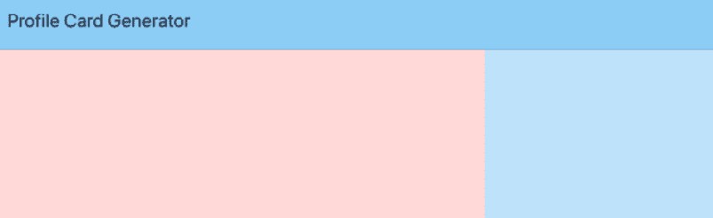

图 9.6 – 包含 AppHeader、AppProfileForm 和 AppProfileDisplay 的应用骨架

要添加一个表单字段，在这种情况下，`name`，我们首先将在`AppProfileForm`中添加一个输入：

```js
<template>
  <section class="md:w-2/3 h-64 bg-red-200 flex flex-col
    p-12 items-center">
    <!-- Inputs -->
    <div class="flex flex-col">
      <label class="flex text-gray-800 mb-2" for="name">
        Name
      </label>
      <input
        id="name"
        type="text"
        name="name"
        class="border-2 border-solid border-blue-200
          rounded px-2 py-1"
      />
    </div>
  </section>
</template>
```

前面的代码将显示如下：

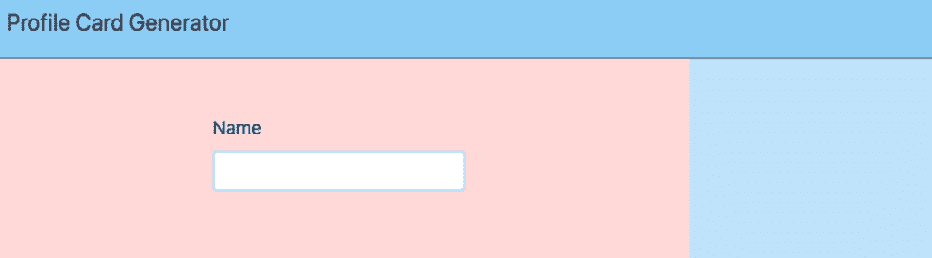

图 9.7 – 包含名称字段和标签的 AppProfileForm

为了跟踪名称输入数据，我们将使用`v-model`添加双向绑定到它，并在组件的`data`初始化器中设置一个`name`属性：

```js
<template>
      <!-- rest of the template -->
      <input
        id="name"
        type="text"
        name="name"
        class="border-2 border-solid border-blue-200
          rounded px-2 py-1" v-model="name"
      />
      <!-- rest of the template -->
</template>
<script setup>
import { ref } from 'vue'
const emit = defineEmits(['submit'])
const name = ref('');
</script>
```

我们还需要一个`submit`按钮，当点击时，通过发出包含表单内容的`submit`事件将表单数据发送给父组件：

```js
<template>
    <!-- rest of template -->
    <div class="flex flex-row mt-12">
      <button type="submit" @click="submitForm()">Submit
      </button>
    </div>
    <!-- rest of template -->
</template>
<script setup>
import { ref } from 'vue'
const emit = defineEmits(['submit'])
const name = ref('');
function submitForm() {
  emit('submit', {
    name: this.name
  });
}
</script>
```

这将显示如下：

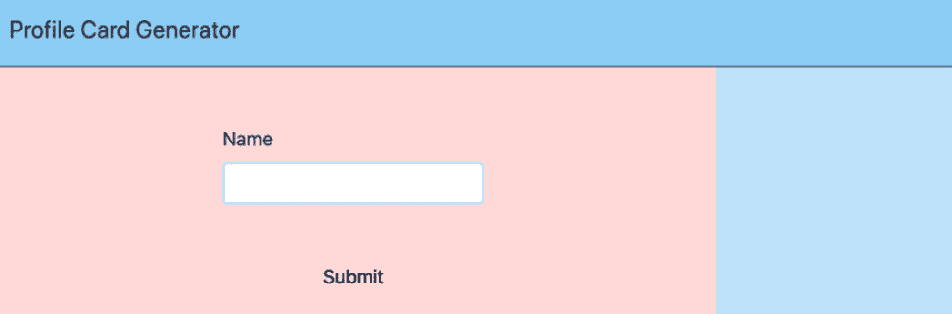

图 9.8 – 配有已连接提交按钮的 AppProfileForm

下一步是将表单的状态存储在`App`组件中。由于它是`AppProfileForm`和`AppProfileDisplay`的共同祖先，因此它是存储表单状态的理想选择。

首先，我们需要一个由`reactive()`返回的`formData`属性。我们还需要一种更新`formData`的方法。因此，我们将添加一个`update(formData)`方法：

```js
<script setup>
import AppHeader from '@/components/AppHeader.vue'
import AppProfileDisplay from '@/components/AppProfileDisplay.vue'
import AppProfileForm from '@/components/AppProfileForm.vue'
import { reactive } from 'vue'
const formData = reactive({name:''});
function update€ {
  formData.name = e.name;
}
</script>
```

接下来，我们需要将`update()`绑定到由`AppProfileForm`发出的`submit`事件。我们将使用`@submit`简写和事件对象记法`update($event)`来完成此操作：

```js
<template>
    <!-- rest of template -->
      <AppProfileForm @submit="update($event)" />
   <!--rest of template --> 
</template>
```

要在`AppProfileDisplay`内部显示名称，我们需要添加`formData`作为 prop：

```js
<script setup>
const props = defineProps({formData:Object});
</script>
```

我们还需要使用`formData.name`显示名称。我们将向容器添加`p-12`类以改善组件的外观：

```js
<template>
  <section class="md:w-1/3 h-64 bg-blue-200 flex p-12">
   —-- Profile Card -->
    <h3 class="font-bold font-lg">{{ formData.name }}</h3>
  </section>
</template>
```

最后，`App`需要将`formData`作为 prop 传递给`AppProfileDisplay`：

```js
<template>
   <!-- rest of template -->
      <AppProfileDisplay :form-data="formData" />
   <!-- rest of template -->
</template>
```

现在我们可以更新表单上的名称。当你点击**提交**按钮时，它将在个人资料卡片显示中显示如下：

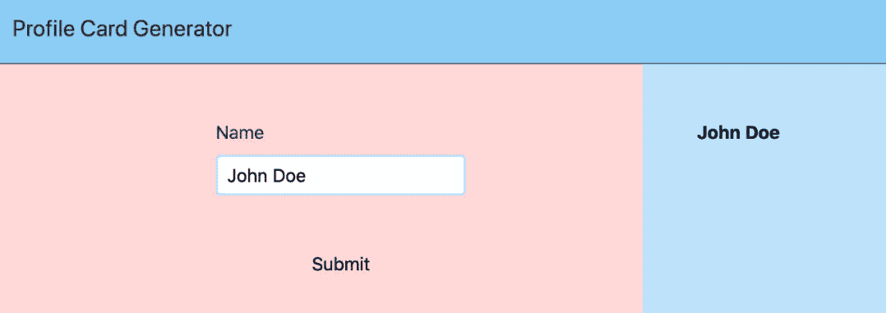

图 9.9 – 存储状态并在 AppProfileDisplay 中传递 props 的 App

我们现在已经看到了如何在`App`组件中存储共享状态，以及如何从`AppProfileForm`更新它并在`AppProfileDisplay`中显示它。

在下一个主题中，我们将看到如何向个人资料卡片生成器添加一个额外的字段。

## 练习 9.01 – 向个人资料卡片生成器添加职业字段

在存储`name`共享状态的示例之后，另一个有趣的个人资料卡片中要捕获的字段是个人的职业。为此，我们将在`AppProfileForm`中添加一个`occupation`字段来捕获这个额外的状态部分，并在`AppProfileDisplay`中显示它。

本练习的完整代码可以在[`github.com/PacktPublishing/Frontend-Development-Projects-with-Vue.js-3/tree/v2-edition/Chapter09/Exercise9.01`](https://github.com/PacktPublishing/Frontend-Development-Projects-with-Vue.js-3/tree/v2-edition/Chapter09/Exercise9.01)找到

按照以下步骤添加字段：

1.  首先要做的就是在`src/components/AppProfileForm`中添加新的`occupation`字段。我们也将借此机会从`section`元素中移除`h-64`和`bg-red-200`类（如果存在），这意味着表单将无背景和固定高度显示：

    ```js
    <template>
    ```

    ```js
      <section class="md:w-2/3 flex flex-col p-12
    ```

    ```js
        items-center">
    ```

    ```js
       <!-- rest of template -->
    ```

    ```js
        <div class="flex flex-col mt-2">
    ```

    ```js
          <label class="flex text-gray-800 mb-2"
    ```

    ```js
            for="occupation">Occupation</label>
    ```

    ```js
          <input
    ```

    ```js
            id="occupation"
    ```

    ```js
            type="text"
    ```

    ```js
            name="occupation"
    ```

    ```js
            class="border-2 border-solid border-blue-200
    ```

    ```js
              rounded px-2 py-1"
    ```

    ```js
          />
    ```

    ```js
        </div>
    ```

    ```js
       <!-- rest of template -->
    ```

    ```js
      </section>
    ```

    ```js
    </template>
    ```

上述代码的输出将如下所示：

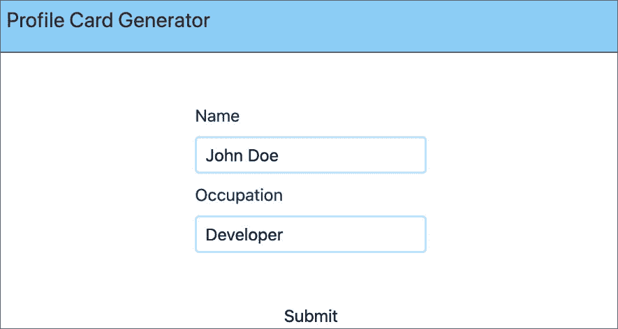

图 9.10 – 添加了新职业字段的 AppProfileForm

1.  为了跟踪`occupation`值的双向数据绑定，我们将添加一个新的`ref()`函数实例：

    ```js
    <script setup>
    ```

    ```js
    // rest of component
    ```

    ```js
    const occupation = ref('');
    ```

    ```js
    // rest of component
    ```

    ```js
    }
    ```

1.  我们现在将使用`v-model`从`occupation`响应式数据属性到`occupation`输入实现双向数据绑定：

    ```js
    <template>
    ```

    ```js
      <!—rest of template -->
    ```

    ```js
          <input
    ```

    ```js
            id="occupation"
    ```

    ```js
            type="text"
    ```

    ```js
            name="occupation"
    ```

    ```js
            v-model="occupation"
    ```

    ```js
            class="border-2 border-solid border-blue-200
    ```

    ```js
              rounded px-2 py-1"/>
    ```

    ```js
     <!-- rest of template -->
    ```

    ```js
    </template>
    ```

1.  当点击`submit`时，要传输`occupation`值，我们需要将其添加到`submitForm`方法作为`submit`事件负载的属性：

    ```js
    <script setup>
    ```

    ```js
    import { ref } from 'vue'
    ```

    ```js
    const emit = defineEmits(['submit'])
    ```

    ```js
    const name = ref('');
    ```

    ```js
    const occupation = ref('');
    ```

    ```js
    function submitForm() {
    ```

    ```js
      emit('submit', {
    ```

    ```js
        name: this.name,
    ```

    ```js
        occupation: this.occupation
    ```

    ```js
      });
    ```

    ```js
    }
    ```

    ```js
    </script>
    ```

1.  添加此字段的最后一步是在`AppProfileDisplay`组件中显示它。我们将添加一个带有几个样式类的段落。我们也将借此机会从容器中移除`h-64`和`bg-blue-200`类（如果存在）：

    ```js
    <template>
    ```

    ```js
      <section class="md:w-1/3 flex flex-col p-12">
    ```

    ```js
       <!-- rest of template -->
    ```

    ```js
        <p class="mt-2">{{ formData.occupation }}</p>
    ```

    ```js
      </section>
    ```

    ```js
    </template>
    ```

我们的浏览器应该看起来如下：

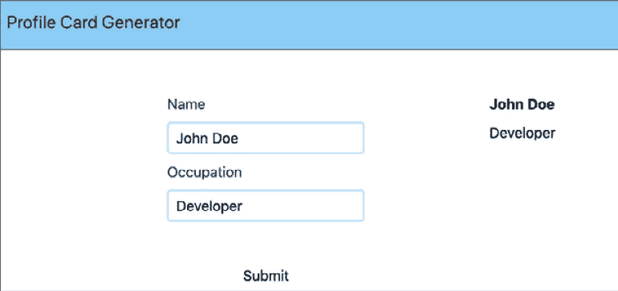

图 9.11 – AppProfileForm

正如我们刚才看到的，使用共同祖先来管理状态添加新字段是一个在事件中向上传递数据并在 props 中向下传递到读取组件的案例。

现在我们将看到如何使用**清除**按钮重置表单和资料显示。

## 练习 9.02 – 向资料卡片生成器添加清除按钮

当使用我们的应用程序创建新资料时，能够重置资料非常有用。为此，我们将添加一个**清除**按钮。

`AppProfileDisplay`。完整的代码可以在[`github.com/PacktPublishing/Frontend-Development-Projects-with-Vue.js-3/tree/v2-edition/Chapter09/Exercise9.02`](https://github.com/PacktPublishing/Frontend-Development-Projects-with-Vue.js-3/tree/v2-edition/Chapter09/Exercise9.02)找到。

现在让我们看看执行此练习的步骤：

1.  我们希望有一个`src/components/AppProfileForm.vue`）：

    ```js
    <template>
    ```

    ```js
     <!-- rest of template -->
    ```

    ```js
        <div class="w-1/2 flex md:flex-row mt-12">
    ```

    ```js
          <button
    ```

    ```js
            class="flex md:w-1/2 justify-center"
    ```

    ```js
            type="button"
    ```

    ```js
          >
    ```

    ```js
            Clear
    ```

    ```js
          </button>
    ```

    ```js
          <button
    ```

    ```js
            class="flex md:w-1/2 justify-center"
    ```

    ```js
            type="submit"
    ```

    ```js
            @click="submitForm()">
    ```

    ```js
            Submit
    ```

    ```js
          </button>
    ```

    ```js
        </div>
    ```

    ```js
     <!-- rest of template -->
    ```

    ```js
    </template>
    ```

1.  要清除表单，我们需要重置`name`和`occupation`字段。我们可以在`src/components/AppProfileForm.vue`中创建一个`clear`方法来完成这个操作：

    ```js
    <script setup>
    ```

    ```js
    // rest of the component
    ```

    ```js
    function clear() {
    ```

    ```js
      this.name = '';
    ```

    ```js
      this.occupation = '';
    ```

    ```js
    }
    ```

    ```js
    // rest of the component
    ```

    ```js
    </script>
    ```

1.  我们希望将`clear`方法绑定到`Clear`按钮的`click`事件以重置表单（在`src/components/AppProfileForm.vue`中）：

    ```js
    <template>
    ```

    ```js
     <!-- rest of template -->
    ```

    ```js
          <button
    ```

    ```js
            class="flex md:w-1/2 justify-center"
    ```

    ```js
            type="button"
    ```

    ```js
            @click="clear()">
    ```

    ```js
            Clear
    ```

    ```js
          </button>
    ```

    ```js
     <!-- rest of template -->
    ```

    ```js
    </template>
    ```

因此，我们现在可以输入表单数据并按照以下截图进行提交：

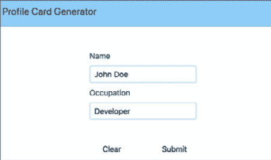

图 9.12 – 填写姓名和职业字段的 AppProfileForm

当点击以下`AppProfileDisplay`：

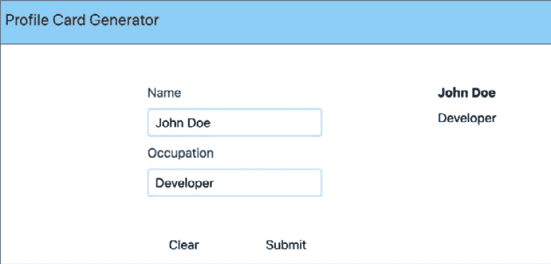

图 9.13 – 填充并提交数据的 AppProfileForm 和 AppProfileDisplay

不幸的是，`AppProfileDisplay`仍然有陈旧的数据，如下面的截图所示：

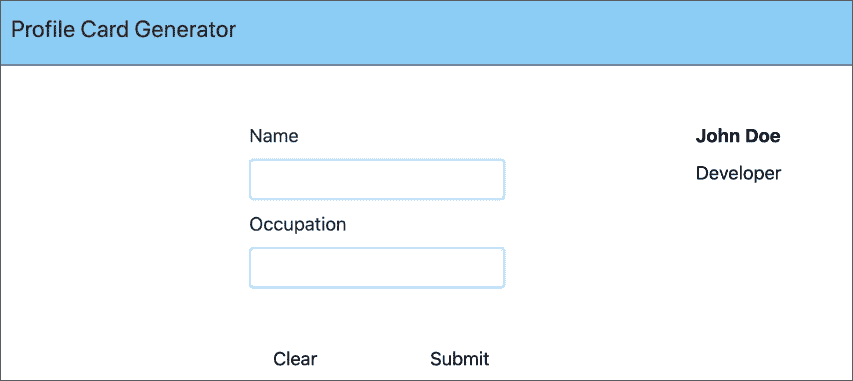

图 9.14 – 只有 AppProfileForm 被清除而 AppProfileDisplay 仍然有陈旧数据的 AppProfileForm 和 AppProfileDisplay

1.  为了清除`AppProfileDisplay`的内容，我们需要在`src/components/AppProfileForm.vue`中通过发出一个带有空有效负载的`submit`事件来更新`App.vue`中的`formData`：

    ```js
    <script setup>
    ```

    ```js
    // rest of the component
    ```

    ```js
    function clear() {
    ```

    ```js
      this.name = '';
    ```

    ```js
      this.occupation = '';
    ```

    ```js
      emit('submit', {});
    ```

    ```js
    }
    ```

    ```js
    // rest of the component
    ```

    ```js
    </script>
    ```

当我们填写表单并提交时，它将如下所示：

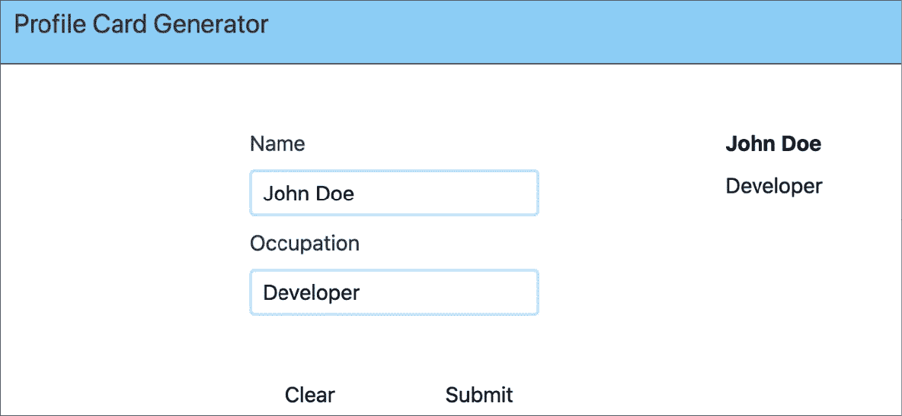

图 9.15 – 填充并提交数据的 AppProfileForm 和 AppProfileDisplay

我们可以按照以下截图点击`AppProfileDisplay`和`AppProfileForm`：

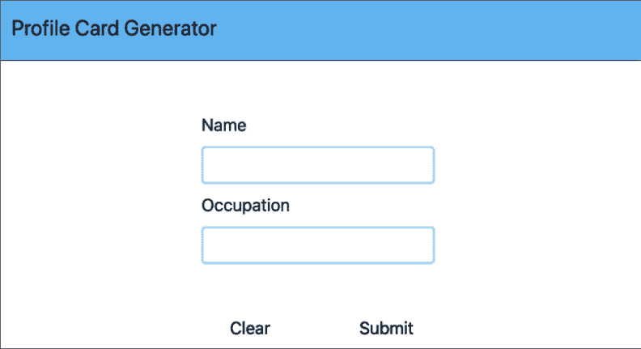

图 9.16 – 清除数据后的 AppProfileForm 和 AppProfileDisplay（使用清除按钮）

我们已经看到了如何通过一个共同的祖先设置兄弟组件之间的通信。

注意

为了跟踪需要在应用程序中保持同步的所有状态片段，需要做大量的记录和琐碎的工作。

在下一节中，我们将探讨 Vue 3 内置对响应式数据的支持意味着我们可以自己实现简单的状态管理。

# 添加简单的状态管理

对于我们的简单应用程序，如果我们使用`reactive()` API 构建简单的存储，我们可以替换大量的模板代码：

1.  让我们从创建一个新的文件`store.js`开始，该文件使用`reactive`对象来存储我们的配置值：

    ```js
    import { reactive } from 'vue';
    ```

    ```js
    export const store = reactive({
    ```

    ```js
      name:'',
    ```

    ```js
      occupation:''
    ```

    ```js
    });
    ```

这个**非常**简单的对象将非常强大，归功于 Vue 3 的响应式支持的使用。任何使用这里值的组件都将能够依赖当值变化时，它将立即反映出来。立即，我们可以看到这如何简化了事情，当我们转向存储时。

1.  在`AppProfileForm`中，让我们首先导入存储：

    ```js
    <script setup>
    ```

    ```js
    import { store } from '@/store.js';
    ```

    ```js
    </script>
    ```

1.  接下来，将两个字段更新为指向商店而不是本地数据。在下面的代码中，`v-model`的值已更改，并且移除了**提交**按钮——它不再必要：

    ```js
    <!-- rest of component -->
    ```

    ```js
    <div class="flex flex-col">
    ```

    ```js
      <label class="flex text-gray-800 mb-2" for="name">
    ```

    ```js
        Name
    ```

    ```js
      </label>
    ```

    ```js
      <input
    ```

    ```js
        id="name"
    ```

    ```js
        type="text"
    ```

    ```js
        name="name"
    ```

    ```js
        class="border-2 border-solid border-blue-200
    ```

    ```js
          rounded px-2 py-1" v-model="store.name"/>
    ```

    ```js
    </div>
    ```

    ```js
    <div class="flex flex-col mt-2">
    ```

    ```js
      <label class="flex text-gray-800 mb-2"
    ```

    ```js
        for="occupation">Occupation</label>
    ```

    ```js
      <input
    ```

    ```js
        id="occupation"
    ```

    ```js
        type="text"
    ```

    ```js
        name="occupation"
    ```

    ```js
        v-model="store.occupation"
    ```

    ```js
        class="border-2 border-solid border-blue-200
    ```

    ```js
          rounded px-2 py-1"
    ```

    ```js
      />
    ```

    ```js
    </div>
    ```

1.  现在，我们可以编辑脚本块以删除大部分之前的逻辑。`clear`方法需要更新以更改存储值：

    ```js
    <script setup>
    ```

    ```js
    import { store } from '@/store.js';
    ```

    ```js
    function clear() {
    ```

    ```js
      store.name = '';
    ```

    ```js
      store.occupation = '';
    ```

    ```js
    }
    ```

    ```js
    </script>
    ```

1.  接下来，我们可以对`AppProfileDisplay`进行类似的修改。首先，导入存储：

    ```js
    <script setup>
    ```

    ```js
    import { store } from '@/store.js';
    ```

    ```js
    </script>
    ```

然后，修改模板：

```js
<template>
  <section class="md:w-1/3 flex flex-col p-12">
  <!-- Profile Card -->
  <h3 class="font-bold font-lg">{{ store.name }}</h3>
  <p class="mt-2">{{ store.occupation }}</p>
  </section>
</template>
```

我们现在已经从从组件广播事件到更简单、共享状态的一个系统转换。我们的代码更简单，这将使更新更加容易。

## 练习 9.03 – 将清除按钮移动到应用程序标题个人资料卡片生成器并更新清除逻辑

在我们的个人资料卡片生成应用程序中，**清除**按钮会清除整个应用程序的状态。由于它位于表单内部，这使得**清除**按钮的功能不明确，因为它看起来可能只会影响表单。

为了反映**清除**按钮具有全局功能的事实，我们将将其移动到标题中。

我们还将更新我们的 store 以处理清除状态的相关逻辑。我们的简单状态实用工具不仅可以定义变量，还可以定义方法。由于脚本正在处理保持值，因此它处理与这些值相关的逻辑是有意义的。

你也可以在[`github.com/PacktPublishing/Frontend-Development-Projects-with-Vue.js-3/tree/v2-edition/Chapter09/Exercise9.03`](https://github.com/PacktPublishing/Frontend-Development-Projects-with-Vue.js-3/tree/v2-edition/Chapter09/Exercise9.03)找到完整的代码。

以下步骤将帮助我们完成这项练习：

1.  我们将首先在`src/components/AppHeader.vue`中创建一个`button`组件：

    ```js
    <template>
    ```

    ```js
      <header class="w-full flex flex-row p-4 border-b
    ```

    ```js
        bg-blue-300 border-gray-700">
    ```

    ```js
        <h2 class="text-xl flex text-gray-800">
    ```

    ```js
          Profile Card Generator</h2>
    ```

    ```js
        <button class="flex ml-auto text-gray-800
    ```

    ```js
          items-center">
    ```

    ```js
          Reset
    ```

    ```js
        </button>
    ```

    ```js
      </header>
    ```

    ```js
    </template>
    ```

1.  在我们的 store 中，让我们在`store.js`中添加一个新的`clear`函数。它负责将值重置回初始状态：

    ```js
    import { reactive } from 'vue';
    ```

    ```js
    export const store = reactive({
    ```

    ```js
         name:'',
    ```

    ```js
         occupation:'',
    ```

    ```js
         clear() {
    ```

    ```js
              this.name = '';
    ```

    ```js
              this.occupation = '';
    ```

    ```js
         }
    ```

    ```js
    });
    ```

1.  在`AppHeader`中，我们需要导入 store：

    ```js
    <script setup>
    ```

    ```js
    import { store } from '@/store.js';
    ```

    ```js
    </script>
    ```

1.  现在，我们需要将`Reset`按钮绑定到调用 store 的`clear`方法：

    ```js
    <!-- rest of template -->
    ```

    ```js
    <button class="flex ml-auto text-gray-800
    ```

    ```js
      items-center" @click="store.clear()">
    ```

    ```js
      Reset
    ```

    ```js
    </button>
    ```

    ```js
    <script>
    ```

1.  最后一步是删除`Clear`按钮和`Submit`按钮：

    ```js
    <template>
    ```

    ```js
      <!-- rest of template -->
    ```

    ```js
        <div class="w-1/2 flex md:flex-row mt-12">
    ```

    ```js
        <button
    ```

    ```js
          class="flex md:w-1/2 justify-center"
    ```

    ```js
          type="submit"
    ```

    ```js
          @click="submitForm()">
    ```

    ```js
          Submit
    ```

    ```js
        </button>
    ```

    ```js
    </div>
    ```

    ```js
      <!-- rest of template -->
    ```

    ```js
    </template>
    ```

当表单填写并提交时，表单看起来如下：

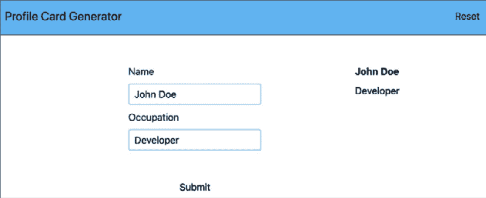

图 9.17 – 填写并提交的表单

现在重置表单会清除表单字段以及`AppProfileDisplay`：

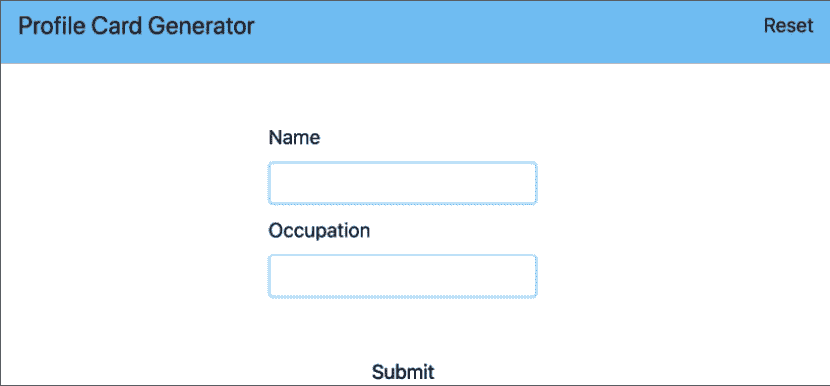

图 9.18 – 使用重置按钮重置表单和显示

你现在已经看到了 Vue 3 的内置响应式支持如何使你在组件中处理状态管理变得简单。

## 活动 9.01 – 向个人资料卡片生成器添加组织、电子邮件和电话号码字段

在个人资料生成器中，你查看个人资料以查找有关个人的信息。一个人的组织、电子邮件和电话号码通常是个人资料卡片上寻找的最关键信息。这项活动是关于将这些详细信息添加到个人资料卡片生成器中。

要做到这一点，我们将在`AppProfileForm`和`AppProfileDisplay`中添加`Organization`、`Email`和`Phone Number`字段：

1.  首先向`AppProfileForm`添加`organization`输入字段和标签。

1.  接下来，向`AppProfileForm`添加一个新的`email`输入字段和标签，用于`Email`字段。

1.  然后，我们可以在`AppProfileForm`中添加一个新的`phone`输入字段（`tel`类型）和标签，用于`Phone Number`字段。

新字段看起来如下：

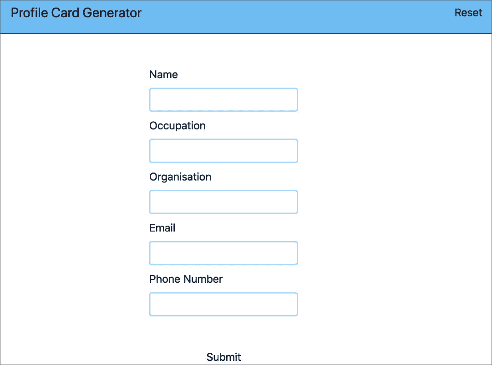

图 9.19 – 带有新电子邮件和电话号码字段的程序

然后，我们可以在`src/store.js`中的初始状态中添加`organization`、`email`和`phone`字段，以便设置值并更新`clear`以重置新值。

1.  为了使`organization`显示，我们在`src/components/AppProfileDisplay.vue`中将其添加到`occupation`之后。我们将使用`"at"`字面字符串作为前缀，并且只有当有值时才显示。最终结果是包含职业和组织的一段文本。

1.  为了使`email`显示，我们需要在`src/components/AppProfileDisplay.vue`中使用条件段落（在没有设置`Email`标签时隐藏`Email`标签）来渲染它。

1.  为了使`phone`显示，我们需要在`src/components/AppProfileDisplay.vue`中使用条件 span（在没有设置`Phone Number`标签时隐藏`Phone Number`标签）来渲染它。

当表单填写并提交时，应用程序应如下所示：

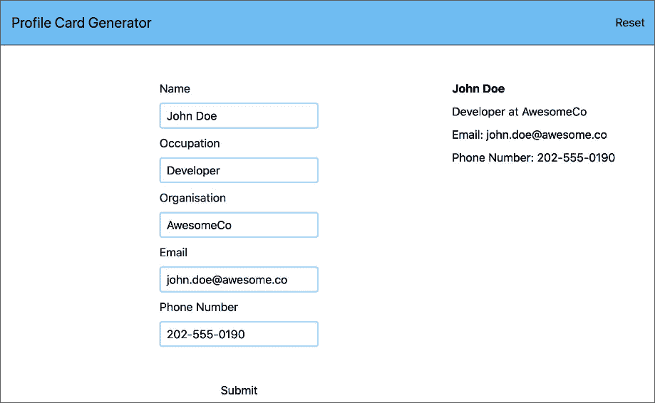

图 9.20 – 带有电子邮件和电话号码字段的应用程序

注意

此活动的解决方案可以在[`github.com/PacktPublishing/Frontend-Development-Projects-with-Vue.js-3/tree/v2-edition/Chapter09/Activity9.01`](https://github.com/PacktPublishing/Frontend-Development-Projects-with-Vue.js-3/tree/v2-edition/Chapter09/Activity9.01)找到。

现在，你已经将应用程序从更复杂的事件驱动状态管理系统转变为使用共享状态，这种状态更容易处理和更新。既然你已经看到了如何处理全局状态，那么回顾一下何时使用它是明智的，是个好时机。

# 决定何时使用本地状态或全局状态

如通过示例所见，Vue.js 生态系统有解决方案来管理共享和全局状态。我们现在要探讨的是如何决定某事物属于本地状态还是全局状态。

一个好的经验法则是，如果`prop`通过三个组件的深度传递，那么最好将这部分状态放在全局状态中，并以此方式访问它——例如，一个值从父组件传递到子组件，然后到孙组件。这也适用于两个兄弟和一个父组件，有三个组件但深度较小。

判断某个状态是局部还是全局的第二个方法是问自己：*当页面重新加载时，用户是否希望这个信息持续存在？* 这为什么很重要呢？嗯，全局状态比局部状态更容易保存和持久化。这是因为全局状态的本质只是一个 JavaScript 对象，而不是组件状态，后者与组件树和 Vue.js 的联系更为紧密。浏览器支持在客户端持久化数据的一些强大方法，从简单的 Web 存储到更复杂的 IndexedDB。这些浏览器功能中的任何一个都可以用来存储 Vue 应用程序的状态，在加载时恢复它们，如果用于全局状态，则可以应用于应用程序中的各个组件。

另一个需要记住的关键思想是，在组件中混合全局状态和局部状态是完全可能的。每个组件都可能使用仅适用于自身的东西与影响整个应用程序的数据的组合。

与大多数事情一样，仔细规划并思考组件需要哪些数据以及可能需要共享什么，可以帮助提前进行适当的规划。

# 摘要

本章是 Vue.js 状态管理领域的入门介绍。在本章中，我们探讨了在 Vue.js 应用程序中实现共享和全局状态管理的不同方法。

我们首先探讨了将全局状态存储在一个共享祖先中。这允许通过 props 和事件在兄弟组件之间共享数据。虽然这可行，但它确实需要额外的代码来处理数据传递的架构。

然后，你使用了 Vue 内置的反应性来创建一个简单、共享的存储。这使得应用程序变得更加简单，因为之前版本中的大部分代码都可以被移除。

最后，我们探讨了可以使用哪些标准来决定状态应该存在于局部组件状态还是更全局或共享状态解决方案中。

下一章将深入探讨使用新的推荐方式处理共享状态，即 Pinia 库，来编写大规模 Vue.js 应用程序。
