# 第十章：使用 Pinia 进行状态管理

在上一章中，你被介绍到 *状态* 的概念以及它如何用于在 Vue 应用程序中同步多个组件之间的数据。你首先看到了通过事件广播处理状态的一个例子，然后通过包括一个简单的状态库来改进这一点。

在本章中，你将了解 Pinia 项目，并了解它如何帮助管理 Vue 应用程序中的复杂状态交互。你将学习如何安装库并立即开始使用它。

在本章中，我们将介绍以下主题：

+   Pinia 是什么

+   安装 Pinia

+   使用 Pinia 创建 store

+   在你的 Pinia store 中添加和使用 getters

+   使用 Pinia 动作进行工作

+   在 Devtools 中调试 Pinia

# 技术要求

除了你现在已经使用的 `git` CLI 以外，本章没有其他技术要求。你可以在这里找到本章的源代码：[`github.com/PacktPublishing/Frontend-Development-Projects-with-Vue.js-3/tree/v2-edition/Chapter10`](https://github.com/PacktPublishing/Frontend-Development-Projects-with-Vue.js-3/tree/v2-edition/Chapter10)

# Pinia 是什么

**Pinia** ([`pinia.vuejs.org`](https://pinia.vuejs.org)) 是 Vue.js 应用的状态管理库。正如你在 *第九章* 中所看到的，“Vue 状态管理状态”，处理需要在多个不同组件之间同步的数据需要某种形式的管理。Pinia 通过提供一种简单的方法来设置一个包含你的应用程序状态的中央 *store* 来帮助解决这个问题。你的组件使用这个 store 来确保它们都在使用相同的信息。

Pinia 最初是 Vue 3 的一个实验，但后来也支持了 Vue 2。现在，Pinia 是 Vue 应用程序的 *推荐* 状态管理库，而备受尊敬的 Vuex ([`vuex.vuejs.org/`](https://vuex.vuejs.org/)) 现已进入维护模式：

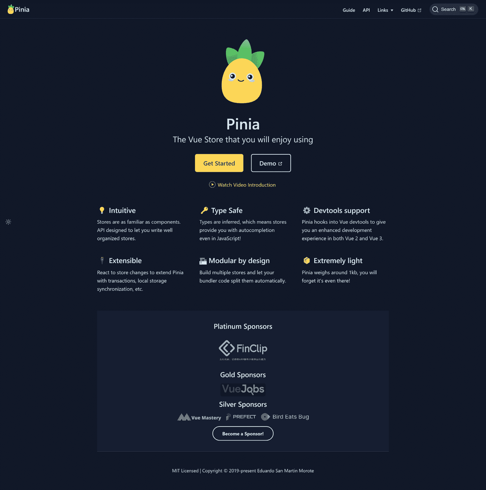

图 10.1 – Pinia 网站

除了状态管理之外，使用 Pinia 还提供了以下其他好处：

+   通过 Vue 扩展提供的 Devtools 支持。此扩展支持 Chrome、Edge 和 Firefox。还有一个独立的 Electron 桌面应用程序。

+   **热模块替换**（**HMR**），这让你可以在开发环境中编辑你的 store 并更新它，而无需重新加载整个网页。

+   可选的 TypeScript 支持。

+   **服务器端渲染**（**SSR**）支持。

+   扩展 Pinia 功能的插件。

通常，你需要了解 Pinia 的几个核心方面。有 Vuex 经验的开发者会认出这些。

从高层次来看，**存储**是需要在应用程序中共享的数据和逻辑的组合。Pinia 应用程序的状态是应用程序存储的数据。Pinia 提供了读取和写入此数据的 API。**获取器**在 Vue 应用程序中类似于虚拟属性。**动作**允许您为存储定义自定义逻辑——例如，使用 AJAX 调用来验证在提交之前对数据的更改。虽然 Pinia 有更多内容，但这三个核心概念将是本章的重点，也是任何 Pinia 使用的主要部分。

# 安装 Pinia

要在 Vue 应用程序中使用 Pinia，您有两种添加它的方法。首先，当通过标准方法创建新的 Vue 应用程序时（`npm init vue@latest`），其中一个问题将是您是否希望包含 Pinia。在这里简单地回答 *是*：

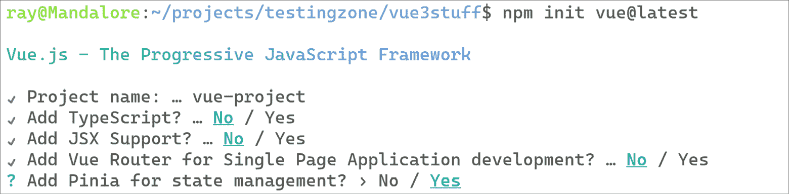

图 10.2 – 指示您是否希望将 Pinia 添加到新的 Vue 项目中

如果您有一个现有的 Vue 3 应用程序，添加支持几乎同样简单。首先，在项目中通过 `npm` 添加 Pinia：`npm install pinia`。接下来，您需要在应用程序中包含 Pinia。您的 `main.js` 文件（位于 `/src` 目录）将如下所示：

```js
import { createApp } from 'vue'
import App from './App.vue'
createApp(App).mount('#app')
```

首先，导入 Pinia：

```js
import { createApp } from 'vue'
import { createPinia } from 'pinia'
import App from './App.vue'
createApp(App).mount('#app')
```

然后，修改 `createApp` 行。我们将它拆分成几行，以便我们可以注入 Pinia：

```js
import { createApp } from 'vue'
import { createPinia } from 'pinia'
import App from './App.vue'
const app = createApp(App)
app.use(createPinia())
app.mount('#app')
```

现在我们已经介绍了 Pinia 的基本概念以及如何在 Vue 应用程序中包含它，让我们开始我们的第一个示例。

# 使用 Pinia 创建存储

让我们通过演示如何在其中定义存储以及如何在应用程序中使用状态数据来开始使用 Pinia：

1.  创建一个新的 Vue 应用程序并启用 Pinia，如图 10**.2** 所示。这将为您提供一个已经创建了存储的 Vue 应用程序。您可以在 `src/stores/counter.js` 下找到它：

    ```js
    import { defineStore } from 'pinia'
    ```

    ```js
    export const useCounterStore = defineStore({
    ```

    ```js
      id: 'counter',
    ```

    ```js
      state: () => ({
    ```

    ```js
        counter: 1
    ```

    ```js
      }),
    ```

    ```js
      getters: {
    ```

    ```js
        doubleCount: (state) => state.counter * 2
    ```

    ```js
      },
    ```

    ```js
      actions: {
    ```

    ```js
        increment() {
    ```

    ```js
          this.counter++
    ```

    ```js
        }
    ```

    ```js
      }
    ```

    ```js
    })
    ```

这个简单的 Pinia 文件展示了我们之前定义的三个主要方面——状态、获取器和动作。在本节中，我们只关注状态。安装后，Pinia 定义了一个名为 `counter` 的数据项，其值为 `1`。我们如何在我们的应用程序中访问它？

1.  切换到 `App.vue` 文件并删除所有内容。我们将极大地简化它。首先，让我们定义布局以简单地输出 `counter` 的值：

    ```js
    <template>
    ```

    ```js
      <p>
    ```

    ```js
      Counter: {{ store.counter }}
    ```

    ```js
      </p>
    ```

    ```js
    </template>
    ```

1.  接下来，我们需要使我们的存储对组件可用。我们将在一个 `script` `setup` 块中定义它：

    ```js
    <script setup>
    ```

    ```js
    import { useCounterStore } from './stores/counter'
    ```

    ```js
    const store = useCounterStore()
    ```

    ```js
    </script>
    ```

1.  我们首先导入存储。一旦导入，我们就创建存储的一个实例，以便它可以在我们的模板中使用。虽然这并不十分令人兴奋，但 *图 10**.3* 展示了它在浏览器中的样子：


图 10.3 – 在 App 组件中正确显示的存储值

1.  要从共享状态中获得任何好处，我们至少需要另一个组件。在 `components` 文件夹中创建一个新的文件，`EditCounter.vue`，并使用以下简短的代码片段：

    ```js
    <script setup>
    ```

    ```js
    import { useCounterStore } from '@/stores/counter';
    ```

    ```js
    const store = useCounterStore()
    ```

    ```js
    </script>
    ```

    ```js
    <template>
    ```

    ```js
      <h2>Edit Counter</h2>
    ```

    ```js
      <input type="text" v-model="store.counter">
    ```

    ```js
    </template>
    ```

1.  与 `App.vue` 组件一样，我们使用 `setup` 块来导入 store 并创建一个实例。这次，我们使用一个简单的编辑字段和 v-model 来将其值绑定到 store 的 `counter` 值。回到 `App.vue` 并编辑它以导入和使用 `EditCounter` 组件：

    ```js
    <script setup>
    ```

    ```js
    import EditCounter from './components/EditCounter.vue'
    ```

    ```js
    import { useCounterStore } from './stores/counter'
    ```

    ```js
    const store = useCounterStore();
    ```

    ```js
    </script>
    ```

    ```js
    <template>
    ```

    ```js
      <p>
    ```

    ```js
      Counter: {{ store.counter }}
    ```

    ```js
      </p>
    ```

    ```js
      <EditCounter></EditCounter>
    ```

    ```js
    </template>
    ```

现在我们正在取得进展。我们有一个组件 `App`，它简单地渲染共享状态，还有一个组件 `EditCounter`，它也显示它，但以可编辑的形式。现在，你可以编辑值并看到它更新：

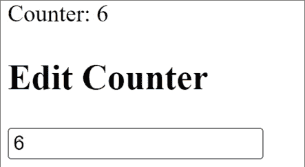

图 10.4 – 使用相同共享状态的多个组件

现在，我们已经看到了如何安装和初始化 Pinia，以及使用一个简单的 store，我们可以创建一个简单的演示来展示其作用。

## 练习 10.01 – 使用共享状态构建颜色预览应用程序

现在，我们已经看到了使用 Pinia 共享状态的一个简单示例，让我们构建一个将使用它的简单应用程序。我们的应用程序将允许你使用滑块来指定颜色的红色、绿色和蓝色值。一个组件将用于编辑，另一个组件将提供预览。

本练习的完整代码可以在 [`github.com/PacktPublishing/Frontend-Development-Projects-with-Vue.js-3/tree/v2-edition/Chapter10/Exercise10.01`](https://github.com/PacktPublishing/Frontend-Development-Projects-with-Vue.js-3/tree/v2-edition/Chapter10/Exercise10.01) 找到：

1.  首先，创建一个新的 Vue.js 应用程序，并确保选中 Pinia 支持。按照提示，切换到目录，运行 `npm install`，然后运行 `npm run dev` 以启动应用程序。清空 `App.vue` 组件的内容，并输入以下内容：

    ```js
    <script setup>
    ```

    ```js
    import RGBEdit from './components/RGBEdit.vue'
    ```

    ```js
    import PreviewColor from './components/PreviewColor.vue'
    ```

    ```js
    </script>
    ```

    ```js
    <template>
    ```

    ```js
    <h1>Color Editor</h1>
    ```

    ```js
    <p>
    ```

    ```js
    Use the sliders below to set the red, green, and blue values for a color.
    ```

    ```js
    </p>
    ```

    ```js
    <div class="twocol">
    ```

    ```js
      <RGBEdit></RGBEdit>
    ```

    ```js
      <PreviewColor></PreviewColor>
    ```

    ```js
    </div>
    ```

    ```js
    </template>
    ```

    ```js
    <style>
    ```

    ```js
    .twocol {
    ```

    ```js
      display: grid;
    ```

    ```js
      grid-template-columns: 1fr 1fr;
    ```

    ```js
      column-gap: 10px;
    ```

    ```js
    }
    ```

    ```js
    </style>
    ```

我们首先导入两个组件（我们将在下一节定义）。模板部分包含一些简单的解释性文本，然后渲染这两个组件。最后，使用一些 CSS 来以网格形式显示这些组件。注意，`App.vue` 完全没有使用 store，但我们的两个组件会使用。

1.  现在，让我们定义子组件。我们将创建它们作为基本上空的，这样我们就可以简单地测试应用程序是否工作。在 `src/components` 中创建 `RGBEdit.vue`：

    ```js
    <template>
    ```

    ```js
    <div>
    ```

    ```js
      <h2>Edit RGB</h2>
    ```

    ```js
    </div>
    ```

    ```js
    </template>
    ```

接下来，创建 `PreviewColor.vue`：

```js
<template>
<div>
  <h2>Preview Color</h2>
</div>
</template>
```

注意，你可以移除 Vue 初始化脚本创建的现有组件。我们不需要那些。此时，你应该能在浏览器中看到以下内容：

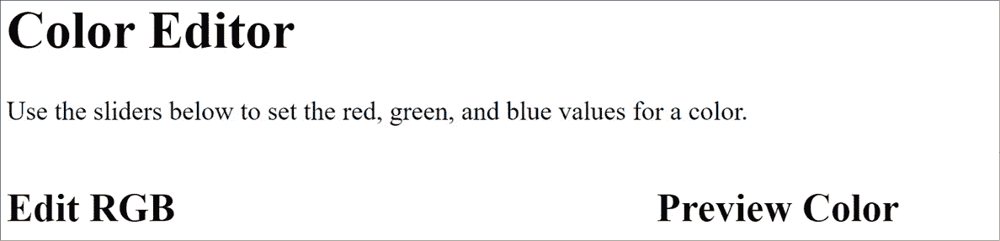

图 10.5 – 颜色应用程序开始成形

1.  现在，让我们定义我们的站点 store。在 `src/stores` 中创建一个新文件（并且可以随意删除默认文件），命名为 `color.js`：

    ```js
    import { defineStore } from 'pinia'
    ```

    ```js
    export const useColorStore = defineStore({
    ```

    ```js
      id: 'color',
    ```

    ```js
      state: () => ({
    ```

    ```js
        red: 0,
    ```

    ```js
        blue: 0,
    ```

    ```js
        green: 0
    ```

    ```js
      })
    ```

    ```js
    })
    ```

我们有三种状态值，每个值代表颜色的一部分，如 `0` 中定义的那样。

1.  接下来，让我们完善我们的 `RGBEdit.vue`。首先，我们将导入并创建 store 的一个实例：

    ```js
    <script setup>
    ```

    ```js
    import { useColorStore } from '@/stores/color';
    ```

    ```js
    const store = useColorStore()
    ```

    ```js
    </script>
    ```

接下来，我们将编辑模板部分，添加三个`range`风格的编辑字段。这将使用户能够快速预览颜色变得容易得多：

```js
<template>
<div>
  <h2>Edit RGB</h2>
  <label for="red">Red</label> <input type="range"
    min="0" max="255" id="red" v-model="store.red">
      <br/>
  <label for="green">Green</label>
    <input type="range" min="0" max="255" id="green"
      v-model="store.green"><br/>
  <label for="blue">Blue</label>
    <input type="range" min="0" max="255" id="blue"
      v-model="store.blue"><br/>
</div>
</template>
```

每个`range`控件的最小值为`0`，最大值为`255`，这代表了在 Web 应用中颜色的有效范围。接下来，我们将添加一些样式来控制`label`元素的大小：

```js
<style>
label {
      display: inline-block;
      width: 50px;
}
</style>
```

保存这个，现在在浏览器中确认你有了编辑颜色的控件：

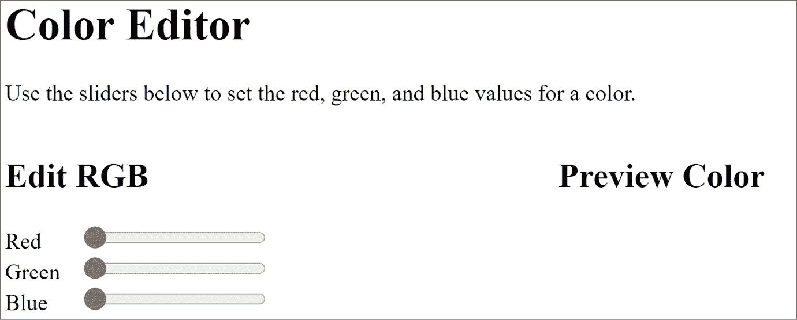

图 10.6 – 我们的应用现在有了编辑颜色的控件

1.  到目前为止，我们已经有一个编辑组件，但我们需要完成`preview`组件。打开`PreviewColor.vue`，首先导入 store：

    ```js
    <script setup>
    ```

    ```js
    import { useColorStore } from '@/stores/color';
    ```

    ```js
    const store = useColorStore()
    ```

    ```js
    </script>
    ```

为了渲染颜色的预览，我们需要将数值颜色转换为十六进制，这是在网络上定义颜色的方式。鉴于我们在 store 中有三个数字，比如红色、绿色和蓝色分别为`100`、`50`和`100`，我们需要将它们转换为`#64324`。

我们可以编写一个计算属性来为我们处理这个转换。编辑`script`部分以包含计算支持并定义以下`computed`属性：

```js
<script setup>
import { computed } from 'vue'
import { useColorStore } from '@/stores/color';
const store = useColorStore()
const previewRGB = computed(() => {
  return {
    backgroundColor: "#" + Number(store.red)
    .toString(16).padStart(2, '0') +
    Number(store.green).toString(16)
    .padStart(2, '0') + Number(store.blue)
    .toString(16).padStart(2, '0')
  }
});
</script>
```

进入到`模板`部分，让我们在显示中使用这个：

```js
<template>
<div>
  <h2>Preview Color</h2>
  <div class="previewColor" :style="previewRGB"></div>
  <p>
  CSS color string: {{ previewRGB.backgroundColor }}
  </p>
</div>
</template>
```

注意，空的`div`正在使用`computed`属性动态更新元素的背景颜色。最后，还需要为那个`div`元素添加一个基本的大小：

```js
<style>
.previewColor {
  width: 250px;
  height: 250px;
}
</style>
```

1.  最后一步，只需在应用中尝试并找到一个看起来很棒的颜色！

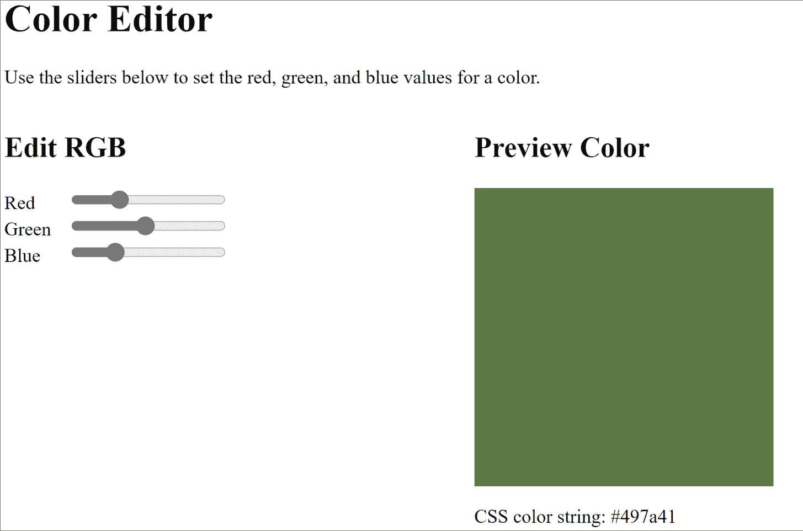

图 10.7 – 颜色应用的最终版本

在下一节中，我们将介绍 Pinia 中的 getter，并演示如何使用它们。

# 在你的 Pinia store 中添加和使用 getter

如前所述，Pinia 中的 getter 就像计算属性一样工作。它们允许你请求一个由函数中编写的自定义逻辑生成的简单值。

如果你回到默认创建的原始 Pinia store，你会看到它定义了一个 getter：

```js
import { defineStore } from 'pinia'
export const useCounterStore = defineStore({
  id: 'counter',
  state: () => ({
    counter: 0
  }),
  getters: {
    doubleCount: (state) => state.counter * 2
  },
  // rest of file...
})
```

`doubleCount` getter 只是简单地取`counter`的当前值，并返回它的两倍。如演示所示，getter 会自动传递当前状态作为参数，然后可以在你特定的 getter 函数中用于任何合理的逻辑。

正如在状态中定义的常规值一样，getter 可以在你的组件中被引用，如下所示：

```js
<template>
  <p>
  Counter: {{ store.counter }}
  </p>
  <p>
  Double Count: {{ store.doubleCount }}
  </p>
</template>
```

让我们基于上一个练习继续前进，并尝试这个功能。

## 练习 10.02 – 使用 getter 改进颜色预览应用

在上一个练习中，你使用了 Pinia 来存储由三个组件组成的一个颜色值的状态——红色、绿色和蓝色。在应用中，`PreviewColor`组件显示了组合颜色的`hex`值。在这个练习中，将移除组件中的自定义逻辑，并将其存储在 store 中的 getter 中。

本练习的完整代码可以在[`github.com/PacktPublishing/Frontend-Development-Projects-with-Vue.js-3/tree/v2-edition/Chapter10/Exercise10.02`](https://github.com/PacktPublishing/Frontend-Development-Projects-with-Vue.js-3/tree/v2-edition/Chapter10/Exercise10.02)找到。

1.  在存储中，`src/stores/color.js`，为获取器添加一个新的部分：

    ```js
    import { defineStore } from 'pinia'
    ```

    ```js
    export const useColorStore = defineStore({
    ```

    ```js
      id: 'color',
    ```

    ```js
      state: () => ({
    ```

    ```js
        red: 0,
    ```

    ```js
        blue: 0,
    ```

    ```js
        green: 0
    ```

    ```js
      }),
    ```

    ```js
      getters: {
    ```

    ```js
        hex: (state) => {
    ```

    ```js
          return  "#" + Number(state.red).toString(16)
    ```

    ```js
            .padStart(2, '0') +
    ```

    ```js
          Number(state.green).toString(16)
    ```

    ```js
            .padStart(2, '0') +
    ```

    ```js
          Number(state.blue).toString(16)
    ```

    ```js
            .padStart(2, '0');
    ```

    ```js
      }
    ```

    ```js
    }
    ```

    ```js
    })
    ```

`hex` 获取器返回一个字符串，以井号符号开头，后跟 RGB 数字的 `hex` 值。鉴于所有值都是 `255`（白色），结果将是 `#FFFFFF`。

1.  在 `PreviewColor.vue` 中，我们需要更新代码以使用获取器。移除所有用于转换各种值的自定义代码，并简单地使用获取器：

    ```js
    <script setup>
    ```

    ```js
    import { computed } from 'vue'
    ```

    ```js
    import { useColorStore } from '@/stores/color';
    ```

    ```js
    const store = useColorStore()
    ```

    ```js
    const previewRGB = computed(() => {
    ```

    ```js
      return {
    ```

    ```js
        backgroundColor: store.hex
    ```

    ```js
      }
    ```

    ```js
    });
    ```

    ```js
    </script>
    ```

    ```js
    // Rest of component, unchanged
    ```

如你所见，现在逻辑已移动到 Pinia 存储中，组件的代码变得更加简单，如果我们扩展应用程序，我们还可以在其他地方重用该逻辑。

## 获取器的附加功能

在继续讨论动作之前，让我们快速讨论你可以使用获取器做的两件事。第一是创建一个利用另一个获取器的获取器。你可以通过使用箭头函数并简单地使用状态来实现这一点：

```js
doubleCount: (state) => state.counter * 2,
superDuperState: (state) => state.doubleCount * 999,
```

如果你使用的是常规函数语法，可以通过 `this` 或通过传入的参数访问存储：

```js
doubleCount: (state) => state.counter * 2,
superDuperState: (state) => state.doubleCount * 999,
doubleDoubleCount() {
  return this.doubleCount * 2;
},
```

最后，虽然获取器不允许额外的参数，但你可以创建一个返回函数本身的获取器，而不是常规值，如下所示：

```js
countPlusN: (state) => x => Number(state.counter) + Number(x)
```

在组件中使用此功能时，你需要向 `countPlusN` 传递一个值，如下所示：

```js
doublePlusN: {{ store.countPlusN(9) }}
```

注意，以这种方式定义的获取器将不会应用任何缓存。

现在我们已经通过获取器增强了我们的存储，让我们看看动作如何进一步增加 Pinia 的灵活性。

# 使用 Pinia 动作

动作是 Pinia 的组件方法的等价物。它们允许你为存储定义自定义逻辑，也可以是异步的。这在需要调用服务器端逻辑来验证状态更改时非常有用。动作通过 Pinia 对象的 `actions` 块定义，你可以在 Pinia 默认创建的存储中看到一个示例：

```js
import { defineStore } from 'pinia'
export const useCounterStore = defineStore({
  id: 'counter',
  state: () => ({
    counter: 0
  }),
  // rest of store...
  actions: {
    increment() {
      this.counter++
    }
  }
})
```

在这个例子中，`increment` 动作只是简单地取 `counter` 值并加一。动作通过使用 `this` 作用域访问状态值，如前所述，也可以是异步的。一个带有一些逻辑的动作示例可能如下所示：

```js
decrement() {
  if(this.counter > 0) this.counter--
}
```

此动作在减少 `counter` 值之前会进行一些验证，并确保其永远不会低于零。

让我们通过添加一些动作来改进我们的颜色编辑器。

## 练习 10.03 – 向颜色预览应用程序添加亮度和暗度功能

上一个练习要求你通过将生成十六进制字符串的逻辑移动到 Pinia 存储的获取器中，来改进颜色预览应用程序。在这个练习中，你将添加两个新功能——按钮，可以调整当前颜色的亮度或暗度。

本练习的完整代码可以在 [`github.com/PacktPublishing/Frontend-Development-Projects-with-Vue.js-3/tree/v2-edition/Chapter10/Exercise10.03`](https://github.com/PacktPublishing/Frontend-Development-Projects-with-Vue.js-3/tree/v2-edition/Chapter10/Exercise10.03) 找到。

1.  我们将开始使用第三方库来处理我们的颜色逻辑。`pSBC` 库是由在 Stack Overflow 上帮忙的用户开发的。作者将他的 Stack Overflow 答案转换成了一个迷你库，您可以免费使用。

这段代码在他的 GitHub 上有文档说明，地址为 [`github.com/PimpTrizkit/PJs/wiki/12.-Shade,-Blend-and-Convert-a-Web-Color-(pSBC.js)`](https://github.com/PimpTrizkit/PJs/wiki/12.-Shade,-Blend-and-Convert-a-Web-Color-(pSBC.js))。如果您滚动到 `src/stores/color.js`。一旦复制到商店中，`pSBC` 函数就可以在商店中使用。

要使十六进制颜色变亮，您传递一个正值——例如，`pSBC(0.5, "#0022FF")`。数字代表百分比——在这种情况下，50%。要使颜色变暗，您只需传递一个负值：`pSBC(-0.5, "#0022FF")`。

1.  将 `pSBC` 库粘贴到商店中后，向商店添加一个新的 `actions` 块：

    ```js
    actions: {
    ```

    ```js
    }
    ```

1.  接下来，添加 `lighten` 函数。这个函数将获取当前的十六进制值（现在有了我们的 getter，这要容易得多！），将其传递给库，然后将结果转换回十进制数字：

    ```js
    lighten() {
    ```

    ```js
      let newHex = pSBC(0.4, this.hex);
    ```

    ```js
      // parse out hex back to dec
    ```

    ```js
      this.red = parseInt(newHex.substring(1,3), 16);
    ```

    ```js
      this.green = parseInt(newHex.substring(3,5), 16);
    ```

    ```js
      this.blue = parseInt(newHex.substring(5,), 16);
    ```

    ```js
    },
    ```

1.  现在，添加 `darken` 函数：

    ```js
    darken() {
    ```

    ```js
      let newHex = pSBC(-0.4, this.hex);
    ```

    ```js
      // parse out hex back to dec
    ```

    ```js
      this.red = parseInt(newHex.substring(1,3), 16);
    ```

    ```js
      this.green = parseInt(newHex.substring(3,5), 16);
    ```

    ```js
      this.blue = parseInt(newHex.substring(5,), 16);
    ```

    ```js
    }
    ```

1.  现在商店已经包含了我们需要的操作，让我们添加按钮来使用它们。在 `src/components/RGBEdit.vue` 中，在最后一个标签下面添加以下内容：

    ```js
    <p>
    ```

    ```js
    <button @click="store.darken()">Darken</button>
    ```

    ```js
    <button @click="store.lighten()">Lighten</button>
    ```

    ```js
    </p>
    ```

每个按钮都会调用商店中的相应操作。当在浏览器中运行并查看时，您可以看到新的用户界面：

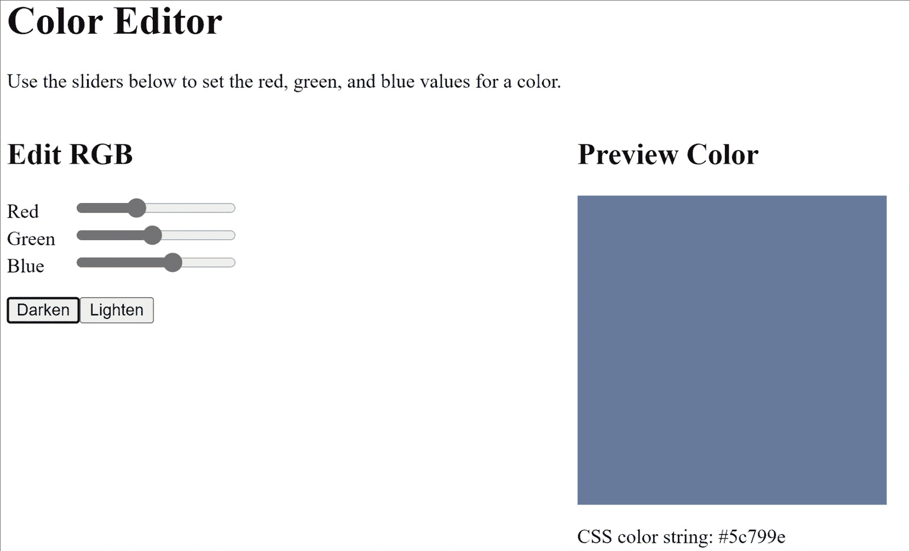

图 10.8 – 带有新的变暗和变亮按钮的颜色预览应用程序

要测试功能，只需移动滑块，然后尝试点击按钮。

# 在 Devtools 中调试 Pinia

在 *第三章* 中，*Vite 和 Vue Devtools*，您被介绍了 Vue Devtools。**Devtools** 是调试和优化 Web 应用程序的一种非常强大的方式，Vue 插件使它们对 Vue 开发者来说更加重要。Vue Devtools 更强大的地方在于自动识别和支持使用 Pinia 的应用程序。

让我们快速浏览一下这种支持的外观，通过使用最后修改于 *练习 10.03* 的颜色预览应用程序。从命令行运行应用程序，在您的浏览器中打开 URL，并打开开发者工具。注意 *图 10*.9* 中的右侧的 **Pinia** 选项卡：

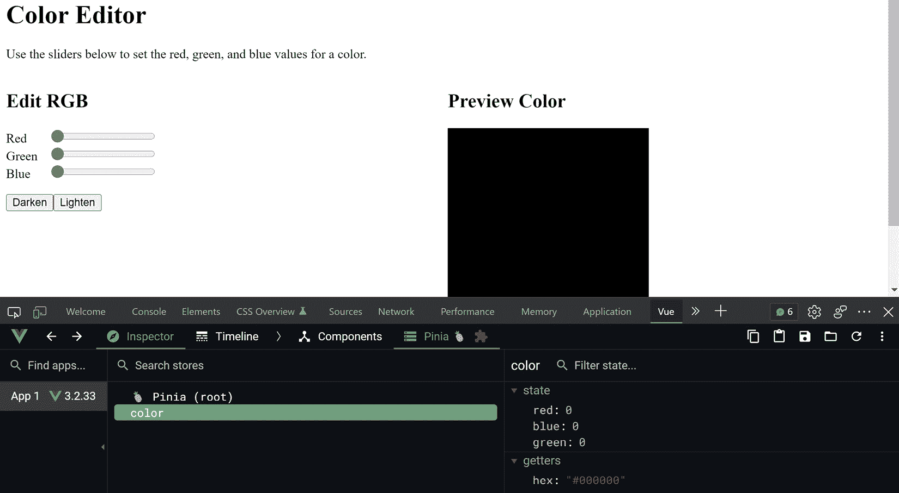

图 10.9 – Vue Devtools 中的 Pinia 支持

立即，您可以看到您有权访问完整的状态以及任何获取器。如果您开始修改 RGB 值，您可以看到它们立即反映出来：

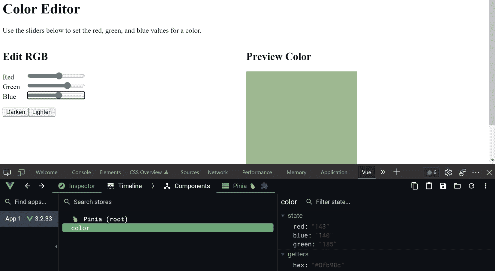

图 10.10 – 状态值在用户与应用交互时更新

如果你将鼠标悬停在状态中的某个值上，你将看到一个铅笔图标和一个三个点的菜单图标。铅笔图标允许你直接编辑状态值，而三个点的菜单则允许你将值复制到剪贴板或路径：

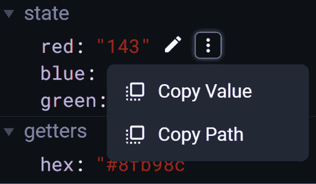

图 10.11 – 编辑或复制状态值的工具

上右上角的图标允许你将整个状态复制到剪贴板，用你的状态内容替换状态，将状态保存到文件系统，或导入一个保存的状态。例如，如果你将状态保存到文件系统，它将看起来像这样：

```js
{"color":{"red":0,"blue":"69","green":"217"}}
```

如果你点击 **时间线** 选项卡，你将获得与你的 Pinia 商店相关的更改历史：

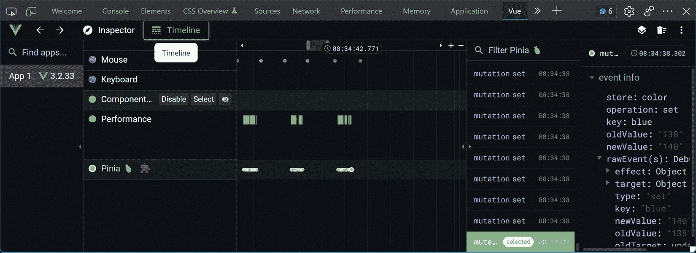

图 10.12 – Pinia 修改历史

在 **图 10**.12 中，你可以看到显示更改的详细信息，包括先前和新的值。你可以点击任何先前的突变来查看历史更改。

希望这能展示出使用 Vue Devtools 的有用性以及 Pinia 的良好集成。确保在尝试解决未来遇到的任何棘手问题时充分利用它！

## 活动 10.01 – 创建一个简单的购物车和价格计算器

想象一个假设的硬件公司网站，允许员工选择需要运送到办公室的产品。这个购物车比典型的电子商务网站简单得多，因为它不需要处理信用卡，甚至不需要询问人员的位置（IT 知道你在哪里！）。

它仍然需要向你提供一个项目列表，让你选择你想要的数量，然后提供一个总计价格，该价格将记入你的部门账单。

在这个活动中，你需要构建一个代表可用产品和它们价格的 Pinia 商店。你需要多个组件来处理应用程序的不同方面，并正确与商店数据交互：

1.  首先，创建一个新的 Pinia 商店。你的商店应该在状态中使用两个值，一个包含硬编码名称和值的数组，以及一个空的购物车数组。以下是一个产品列表的示例：

    ```js
        products: [
    ```

    ```js
          { name: "Widgets", price: 10 },
    ```

    ```js
          { name: "Doodads", price: 8 },
    ```

    ```js
          { name: "Roundtuits", price: 12 },
    ```

    ```js
          { name: "Fluff", price: 4 },
    ```

    ```js
          { name: "Goobers", price: 7 }
    ```

    ```js
        ],
    ```

1.  你的应用程序将包括三个组件。第一个是 `Products` 组件，用于列出产品。第二个是 `Cart` 组件，用于渲染当前的购物车。最后是 `Checkout` 组件，它渲染总计以及一个实际上并不起作用的 **结账** 按钮。

1.  `Products.vue` 组件应该渲染每个产品，并有一个按钮来添加和移除它到购物车中。这些按钮应该调用 Pinia 商店中的操作，并从购物车中添加或移除一个项目：

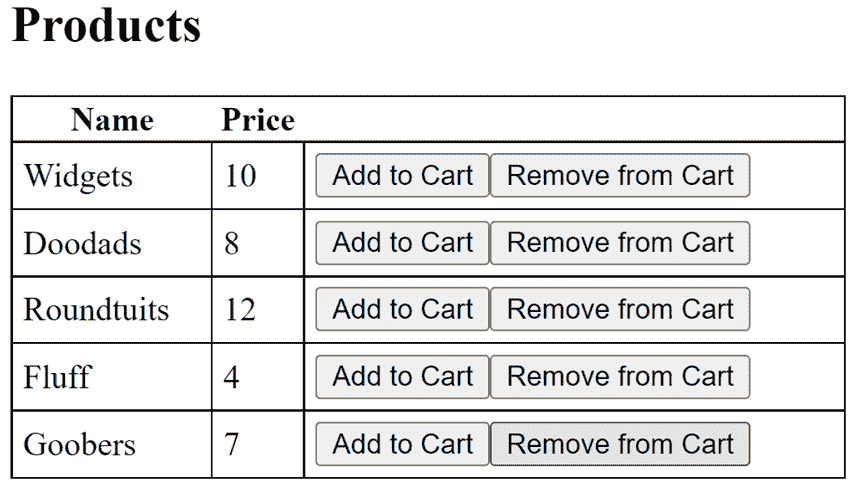

图 10.13 – 产品组件

1.  `Cart.vue` 组件渲染购物车中的项目表格。它应该显示产品的名称和当前数量。如果某项商品的数量降到零，则不应在表格中显示。以下图示展示了这一点：

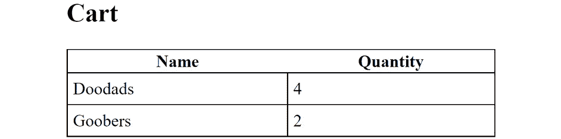

图 10.14 – 购物车组件

1.  `Checkout.vue` 组件将渲染两个东西。首先，它将渲染总费用。这是基于购物车中的产品和数量。其次，它将渲染一个 **结算** 按钮，但只有当实际存在费用时才会渲染。**结算** 按钮不需要做任何事情：

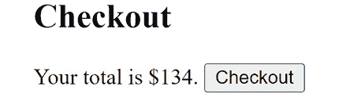

图 10.15 – 结算组件

注意

该活动的解决方案可以在 [`github.com/PacktPublishing/Frontend-Development-Projects-with-Vue.js-3/tree/v2-edition/Chapter10/Activity10.01`](https://github.com/PacktPublishing/Frontend-Development-Projects-with-Vue.js-3/tree/v2-edition/Chapter10/Activity10.01) 找到。

恭喜！你现在已经构建了一个真实、尽管简单的应用，它利用了 Pinia。你的应用有三个组件，通过 Pinia 的存储保持完美同步，并且你已经掌握了使用官方推荐库进行状态管理的方法。

# 摘要

本章向您介绍了 Pinia，这是 Vue 推荐的用于处理复杂、多组件应用中共享状态的库。

我们从讨论如何安装 Pinia 开始。接下来，我们介绍了状态，并展示了如何在组件中使用这些值。

你将获取器视为处理 *虚拟* 属性和封装逻辑的方法。

最后，你看到了如何使用操作定义与你的状态一起工作的自定义方法。

在下一章中，你将了解如何使用 Vue 进行测试，特别是单元测试，这将为你准备下一章的端到端测试。

# 第四部分：测试和应用部署

在本书的最后部分，我们将深入探讨 Vue.js 应用程序的测试方面。我们将学习测试的基础知识、不同类型的测试以及何时何地需要测试，并开始使用 Jest 测试框架进行单元和快照测试，以及使用 Cypress 进行端到端测试来测试我们的应用程序。通过编写测试，我们将确保我们的应用程序按预期的方式运行。最后一章将涵盖如何将我们的 Vue 应用程序部署到网络。

在本部分，我们将涵盖以下章节：

+   *第十一章*，*单元测试*

+   *第十二章*，*端到端测试*

+   *第十三章*，*将您的代码部署到网络*
