# 第十二章：端到端测试

在本章中，我们将探讨如何使用 Cypress 为 Vue.js 应用程序创建一个 **端到端**（**E2E**）测试套件。为了编写健壮的测试，我们将探讨常见的陷阱和最佳实践，例如拦截 HTTP 请求和等待元素出现而不设置超时。

随着我们继续前进，你将了解端到端测试及其用例。你将看到如何配置 Cypress 来测试 Vue.js 应用程序，以及如何使用它来与用户界面（**UI**）交互和检查。在整个章节中，你将熟悉任意超时的陷阱以及如何使用 Cypress 的等待功能来避免它们。

在本章的结尾，你还将学习何时、为什么以及如何使用 Cypress 拦截 HTTP 请求。

在本章中，我们将涵盖以下主题：

+   理解端到端测试及其用例

+   为 Vue.js 应用程序配置 Cypress

+   使用 Cypress 与 Vue.js UI 交互和检查

+   使用 Cypress 触发和等待 UI 更新

+   拦截 HTTP 请求

# 技术要求

本章没有技术要求，除了 `git` 命令行界面，你现在已经使用过了。你可以在这里找到本章的源代码：[`github.com/PacktPublishing/Frontend-Development-Projects-with-Vue.js-3/tree/v2-edition/Chapter12`](https://github.com/PacktPublishing/Frontend-Development-Projects-with-Vue.js-3/tree/v2-edition/Chapter12)

# 理解端到端测试及其用例

大多数开发者都见过以下图中显示的测试金字塔版本：

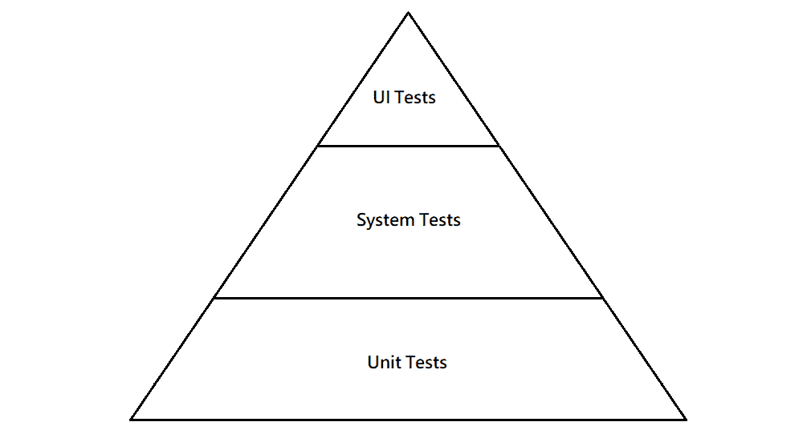

图 12.1 – 测试金字塔的示意图

端到端测试属于 UI 测试类别。本章我们将探讨的是使用 Cypress 自动化的端到端测试。

端到端和 UI 测试提供的信心水平高于单元测试或集成测试。它们测试的是最终用户使用的应用程序。最终用户不关心错误发生的原因或地点，只关心存在错误。

错误的位置和原因通常是单元测试和系统级测试的担忧。单元测试和系统级测试检查系统的内部是否按规范或代码描述的方式工作。UI 级测试验证应用程序流程是否按预期工作。

一个运行快速、假阴性（测试失败但应用程序工作）少、假阳性（所有测试通过但应用程序损坏）更少的强大端到端测试套件能够实现 **持续部署**（**CD**）。正如其名所示，持续部署涉及持续部署项目或应用程序。

在这种设置中，应用程序版本由端到端测试套件验证，然后自动部署到生产环境。

# 为 Vue.js 应用程序配置 Cypress

Cypress 是一个 JavaScript 端到端测试框架。它旨在解决使用 JavaScript 编写端到端测试的特定需求。这与其他全功能的浏览器自动化解决方案形成对比，例如 WebdriverIO ([`webdriver.io/`](https://webdriver.io/))、Selenium WebDriver ([`www.selenium.dev/`](https://www.selenium.dev/))、Puppeteer ([`developers.google.com/web/tools/puppeteer/`](https://developers.google.com/web/tools/puppeteer/))和 Playwright ([`github.com/microsoft/playwright`](https://github.com/microsoft/playwright))，这些通常用于编写端到端测试。

与其他解决方案相比，Cypress 最大的不同之处在于它专注于编写端到端测试（而不是通用的浏览器自动化）。测试只能使用 JavaScript 编写（Selenium 支持其他语言），并且需要 Chrome、Edge 或 Firefox（WebKit 支持正在开发中）。

Cypress 有一个**图形用户界面**（**GUI**）来本地运行和调试测试，并附带内置的断言和存根/模拟库。

要将 Cypress 添加到新的 Vue 项目中，只需在提示时启用它：

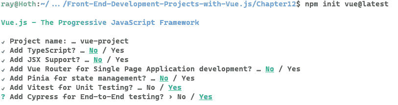

图 12.2 – 在创建新的 Vue 3 项目时启用 Cypress

要将 Cypress 添加到现有项目中，使用`npm install @cypress/vue@next --dev`。

插件添加了一个`test:e2e`脚本，我们可以使用以下两个命令运行它。第一个准备 Vue 应用程序的构建。第二个实际上启动了 Cypress 应用程序：

```js
npm run build
npm run test:e2e
```

你将首先被要求使用浏览器进行测试，如图*图 12.3*所示：

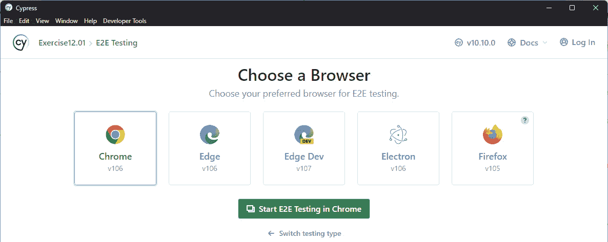

图 12.3 – Cypress 询问用于测试的首选浏览器

选择浏览器后，主 Cypress UI 将显示：

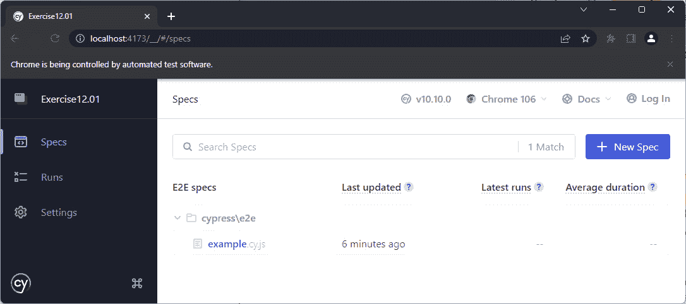

图 12.4 – Cypress 测试 UI

如果你点击示例链接，你会看到测试正在运行和输出：

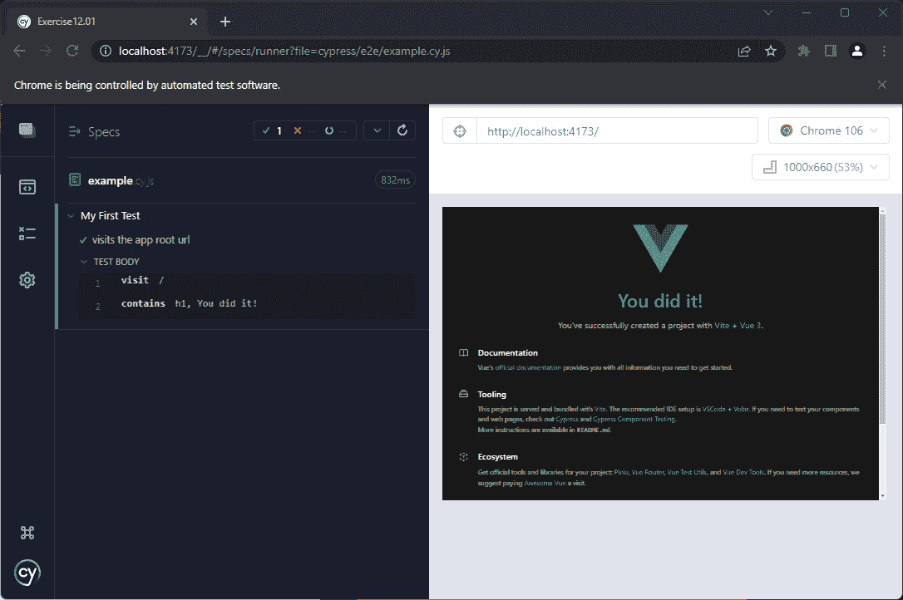

图 12.5 – Cypress 运行测试

Cypress 为我们创建了一个默认测试，位于`cypress/e2e/example.cy.js`。该测试导航到 Vue 应用程序的根目录，并查找包含`You` `did it!`的`h1`标签：

```js
// https://docs.cypress.io/api/introduction/api.html
describe('My First Test', () => {
  it('visits the app root url', () => {
    cy.visit('/')
    cy.contains('h1', 'You did it!')
  })
})
```

这将在默认的 Vue 3 项目中工作。

我们可以尝试使用`cy.visit(url)`访问`google.com`，并通过使用`cy.get('input')`选择页面上的输入元素，然后使用`.should('exist')`断言来检查与 Google 首页同义的`input`元素是否存在：

```js
describe('My First Test', () => {
  it('Opens an arbitrary URL', () => {
    cy.visit('https://google.com')
    cy.get('input').should('exist')
  })
})
```

Cypress 窗口将自动加载并运行新的测试：

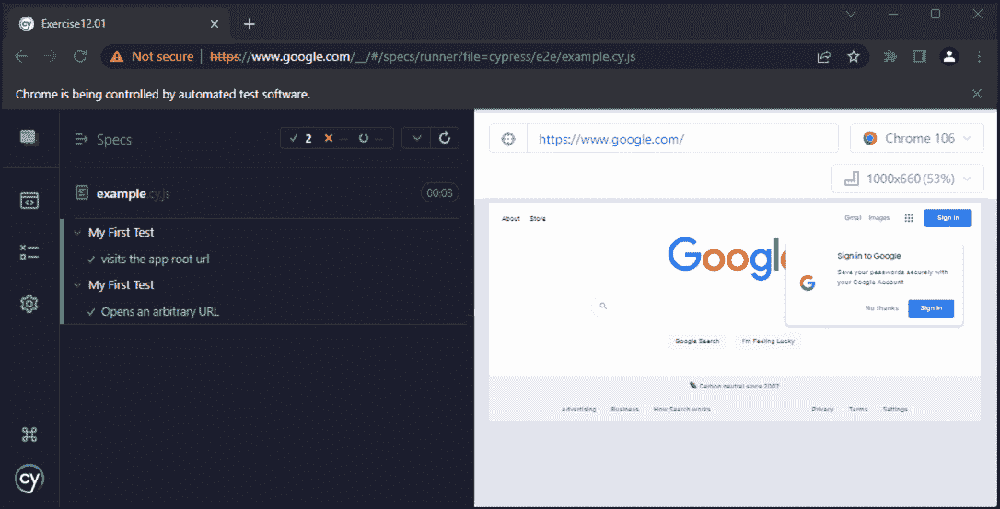

图 12.6 – Cypress 在 Chrome 中运行测试的同时访问 Google 首页

我们现在已经看到了如何安装和使用 Cypress 访问网页。在下一节中，我们将看到如何使用 Cypress 与 UI 交互和检查。

# 使用 Cypress 与 Vue.js UI 交互和检查

为了端到端测试新的应用程序 Commentator Pro，我们应该先添加一些要测试的内容。在这种情况下，我们将有一个带有应用程序名称的标题 (`h2`)。在 `App.vue` 文件中，我们将有如下代码：

```js
<template>
<h2>Commentator Pro</h2>
</template>
```

为了使用 Cypress 进行测试，我们可以将 `cypress/e2e/example.cy.js` 文件更改为以下代码。我们将使用 `cy.visit('/')` 访问运行中的应用程序，然后检查页面上的 `h2` 是否包含 `Commentator Pro` 使用 `cy.contains('h2', 'Commentator Pro')`。`cy.contains` 函数是重载的，可以用一个参数（要匹配的文本）或两个参数（容器的选择器和要匹配的文本）使用：

```js
describe('Commentator Pro', () => {
  it('Has a h2 with "Commentator Pro"', () => {
    cy.visit('/')
    cy.contains('h2', 'Commentator Pro')
  })
})
```

然后，我们可以使用 Cypress UI 运行 `example.cy.js`，如下截图所示：

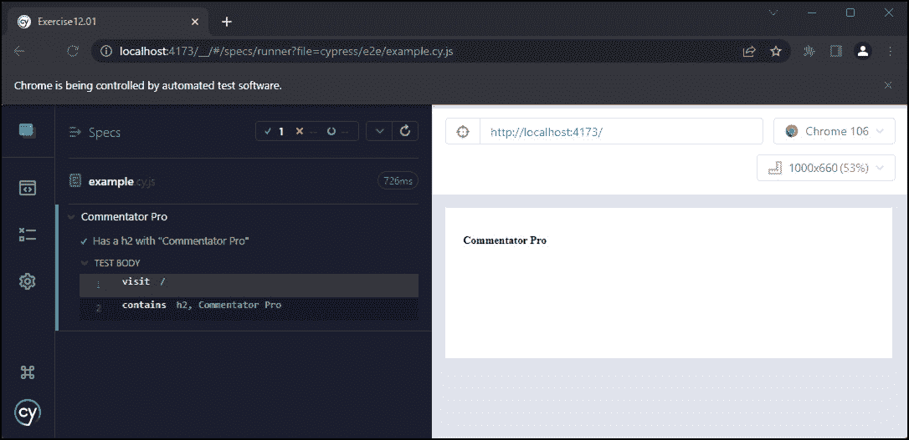

图 12.7 – 在 Chrome 中成功运行的标题内容测试

现在我们已经看到了如何访问页面并断言其内容，我们将看到如何使用 Cypress 自动化 Vue.js 应用程序中一个新功能的测试。

## 练习 12.01 – 添加一个“新增评论”按钮及其相应的端到端测试

为了使 Commentator Pro 应用程序变得有用，我们应该有一个“新增评论”按钮，允许用户添加评论。

我们将添加一个带有“新增评论”文本的蓝色巨型按钮，并使用 Cypress 编写相应的端到端测试。

完整的代码可以在 [`github.com/PacktPublishing/Frontend-Development-Projects-with-Vue.js-3/tree/v2-edition/Chapter12/Exercise12.01`](https://github.com/PacktPublishing/Frontend-Development-Projects-with-Vue.js-3/tree/v2-edition/Chapter12/Exercise12.01) 找到

要做到这一点，请执行以下步骤：

1.  要在应用程序中添加按钮，我们将在 `src/App.vue` 中添加一个带有一些文本的 `button` 元素：

    ```js
    <template>
    ```

    ```js
    <h2>Commentator Pro</h2>
    ```

    ```js
    <button>
    ```

    ```js
    Add a New Comment
    ```

    ```js
    </button>
    ```

    ```js
    </template>
    ```

输出应如下所示：


图 12.8 – 带有“新增评论”按钮的 Commentator Pro 应用程序

1.  接下来，我们将在 `cypress/e2e/add-new-comment.cy.js` 创建一个新的端到端测试。我们将设置测试套件的名称和测试的描述为 `Adding a New Comment`，主页应该有一个带有正确文本的按钮：

    ```js
    describe('Adding a New Comment', () => {
    ```

    ```js
      it('the homepage should have a button with the right
    ```

    ```js
      text', () => {
    ```

    ```js
        // test will go here
    ```

    ```js
      })
    ```

    ```js
    })
    ```

1.  为了测试主页，我们需要使用 `cy.visit('/')` 导航到它：

    ```js
    describe('Adding a New Comment', () => {
    ```

    ```js
      it('the homepage should have a button with the right
    ```

    ```js
      text', () => {
    ```

    ```js
        cy.visit('/')
    ```

    ```js
      })
    ```

    ```js
    })
    ```

1.  最后，我们可以编写断言，即页面上有一个包含“新增评论”文本的 `button` 实例：

    ```js
    describe('Adding a New Comment', () => {
    ```

    ```js
      it('the homepage should have a button with the right
    ```

    ```js
      text', () => {
    ```

    ```js
        cy.visit('/')
    ```

    ```js
        cy.contains('button', 'Add a New Comment')
    ```

    ```js
      })
    ```

    ```js
    })
    ```

1.  我们可以通过首先运行一个新的构建（`npm run build`），然后运行 `npm run test:e2e` 来使用 Cypress UI 运行此测试。如果你已经运行了 Cypress，你不需要重新启动它。你可以通过点击左侧菜单中的 **Specs** 导航项来访问测试列表。

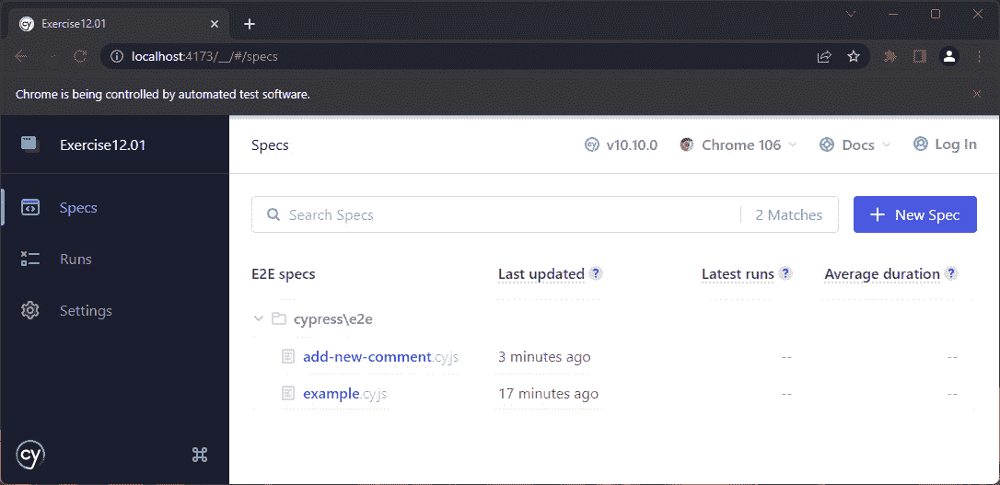

图 12.9 – 在 Cypress UI 中显示的 add-new-comment.cy.js 测试

1.  当我们运行测试（通过点击它）时，我们将在 Chrome 中得到以下输出。测试通过，因为主页上有一个相关文本的按钮：

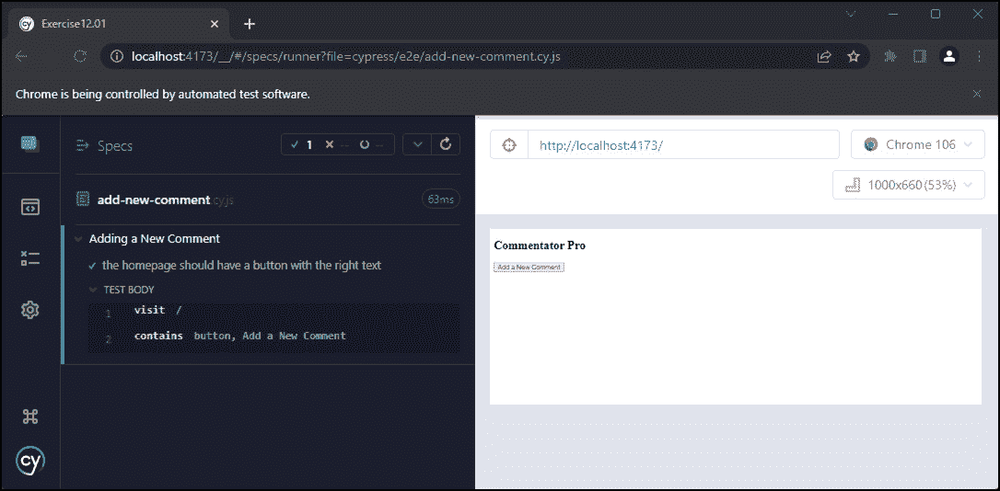

图 12.10 – Cypress 在 Chrome 中运行我们的添加新评论测试

我们已经看到了如何访问页面并对其内容进行断言。

在下一节中，我们将探讨如何使用 Cypress 测试交互行为。Cypress 具有自动选择器重试功能，这使得它非常适合测试高度交互的 Vue.js 应用程序。我们将看到如何使用 Cypress 与 UI 交互并断言我们交互的效果。

# 使用 Cypress 触发和等待 UI 更新

我们迄今为止编写的测试相当简单，仅检查应用程序在浏览器加载时不会崩溃。

E2E 测试的一个优点是，可以以高保真度测试用户与 UI 交互时 UI 的行为是否符合预期。在本节中，我们将使用 Cypress 的选择（`.get()`函数）、事件触发（`.click()`函数）和断言（`.should()`函数）功能来测试 Vue.js 应用程序。

Cypress 在 DOM 选择上的自动重试将允许我们编写 E2E 测试，而无需显式的等待或超时条件。等待和超时是其他 E2E 测试系统的基本要素，并且往往是测试不稳定的原因。

首先，我们将向我们的 Commentator Pro 应用程序添加一个评论编辑器。通过点击**添加新评论**按钮来切换显示编辑器（一个简单的`textarea`）。

为了在不处理复杂且脆弱的选择器的情况下继续编写测试，我们将开始添加`data-test-id`属性；首先，我们可以在`App.vue`文件中添加一个：

```js
<template>
<h2>Commentator Pro</h2>
<button data-test-id="new-comment-button">
Add a New Comment
</button>
</template>
```

接下来，我们将在`App`组件的 Vue.js `data()`方法中添加一个`showEditor`属性。我们将使用这个表达式在`v-if`中为编辑器设置。我们还可以设置**添加新评论**按钮来切换这个实例属性：

```js
<template>
<h2>Commentator Pro</h2>
<button @click="showEditor = !showEditor"
  data-test-id="new-comment-button">
Add a New Comment
</button>
</template>
<script>
export default {
  data() {
    return {
      showEditor: false
    }
  }
}
</script>
```

我们可以使用`new-comment-editor` `data-test-id`来添加我们的编辑器，该`data-test-id`可以通过`showEditor`来切换：

```js
<template>
<!-- rest of template -->
<div v-if="showEditor">
  <p>
  <textarea data-test-id="new-comment-editor"></textarea>
  </p>
</div>
</template>
```

为了测试切换功能，我们可以添加一个测试，打开该应用程序并检查评论编辑器最初不会显示，以及根据在`new-comment-button`上触发的点击次数来检查是否显示：

```js
describe('Adding a New Comment', () => {
  // other tests
  it('the Add a New Comment button should toggle the editor
  display on and off', () => {
    cy.visit('/')
    cy.get('[data-test-id="new-comment-editor"]')
      .should('not.exist')
    cy.get('[data-test-id="new-comment-button"]').click()
    cy.get('[data-test-id="new-comment-editor"]')
      .should('be.visible')
    cy.get('[data-test-id="new-comment-button"]').click()
    cy.get('[data-test-id="new-comment-editor"]')
      .should('not.exist')
  })
})
```

上述代码将在 Cypress 中生成以下结果：

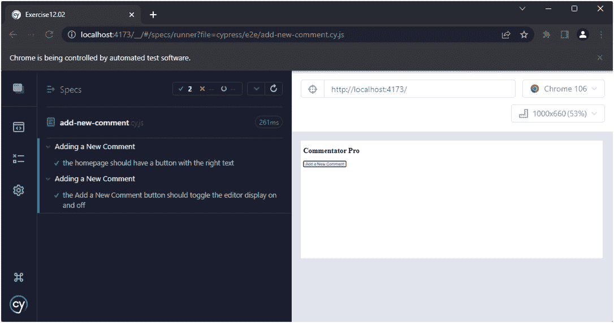

图 12.11 – Cypress 运行添加新评论测试，包括新的编辑器切换测试

我们已经看到了如何编写 Cypress 测试来选择和断言 DOM 元素。

注意

`data-test-id` 实例，按照惯例，是一种将测试与特定于应用程序和样式的选择器解耦的方法。这在编写测试的人不总是编写代码的人时特别有用。在这种情况下，使用 `data-test-id` 允许标记结构和类发生变化，但只要 `test-id` 实例保持在正确的元素上，测试就会继续通过。

## 练习 12.02 – 添加新的评论编辑器输入和提交功能

为了能够将新的评论文本发送到 API，我们需要在 Vue.js 状态中存储文本。添加评论的另一个先决条件是拥有一个虚拟的 **提交** 按钮。

完整的代码可以在 [`github.com/PacktPublishing/Frontend-Development-Projects-with-Vue.js-3/tree/v2-edition/Chapter12/Exercise12.02`](https://github.com/PacktPublishing/Frontend-Development-Projects-with-Vue.js-3/tree/v2-edition/Chapter12/Exercise12.02) 找到。

要完成这项任务，请执行以下步骤：

1.  为了将 `textarea`（编辑器）内容存储在内存中，我们将使用 `v-model`。我们将创建一个新的数据（状态）变量 `newComment`，它被初始化为 `""`。现在，`v-model` 将双向绑定 `textarea` 内容和 `newComment`：

    ```js
    <template>
    ```

    ```js
    <!-- rest of template -->
    ```

    ```js
      <p>
    ```

    ```js
      <textarea data-test-id="new-comment-editor"
    ```

    ```js
        v-model="newComment"></textarea>
    ```

    ```js
      </p>
    ```

    ```js
    <!-- rest of template -->
    ```

    ```js
    </template>
    ```

    ```js
    <script>
    ```

    ```js
    export default {
    ```

    ```js
      data() {
    ```

    ```js
        return {
    ```

    ```js
          showEditor: false,
    ```

    ```js
          newComment: ''
    ```

    ```js
        }
    ```

    ```js
      }
    ```

    ```js
    }
    ```

    ```js
    </script>
    ```

1.  我们将在编辑器内添加一个 `submit` 按钮，它仅在编辑器开启时才出现。我们还确保包含一个 `data-test-id="new-comment-submit"` 属性，以便稍后可以用 Cypress 选择它：

    ```js
    <!-- rest of template -->
    ```

    ```js
    <div v-if="showEditor">
    ```

    ```js
      <p>
    ```

    ```js
      <textarea data-test-id="new-comment-editor"
    ```

    ```js
        v-model="newComment"></textarea>
    ```

    ```js
      </p>
    ```

    ```js
      <p>
    ```

    ```js
      <button data-test-id="new-comment-submit">
    ```

    ```js
        Submit
    ```

    ```js
      </button>
    ```

    ```js
      </p>
    ```

    ```js
    </div>
    ```

    ```js
    <!-- rest of template -->
    ```

1.  现在是时候添加一个端到端测试来测试当我们向其中输入文本时 `new-comment-editor` 是否按预期工作。为了实现这一点，我们需要加载应用程序并点击 `new-comment` 按钮，以便编辑器显示。

然后，我们可以选择 `new-comment-editor`（通过 `data-test-id`），并使用 Cypress 的 `.type` 函数添加一些文本。我们可以将 `.should('have.value', 'Just saying...')` 连接到一起以验证我们对 `textarea` 的交互是否成功。记得在添加新测试时运行 `npm run build`：

```js
describe('Adding a New Comment', () => {
  // other tests
  it('the new comment editor should support text
  input', () => {
    cy.visit('/')
    // Get the editor to show
    cy.get('[data-test-id="new-comment-button"]')
      .click()
    cy.get('[data-test-id="new-comment-editor"]')
      .should('be.visible')
    cy.get('[data-test-id="new-comment-editor"]')
      .type('Just saying...')
      .should('have.value', 'Just saying...')
  })
})
```

当使用 Cypress UI 运行时，这个 `add-new-comment` 测试套件应该产生以下结果：


图 12.12 – Cypress 运行 add-new-comment 测试，包括新的编辑器文本输入测试

1.  最后，我们可以添加一个端到端测试来检查 `submit` 按钮默认情况下不会出现，但当我们点击 `new-comment` 按钮时会出现。我们还可以检查 `new-comment-submit` 按钮的文本内容：

    ```js
    describe('Adding a New Comment', () => {
    ```

    ```js
      // other tests
    ```

    ```js
      it('the new comment editor should have a submit
    ```

    ```js
      button', () => {
    ```

    ```js
        cy.visit('/')
    ```

    ```js
        cy.get('[data-test-id="new-comment-submit"]')
    ```

    ```js
          .should('not.exist')
    ```

    ```js
        // Get the editor to show
    ```

    ```js
        cy.get('[data-test-id="new-comment-button"]')
    ```

    ```js
          .click()
    ```

    ```js
        cy.get('[data-test-id="new-comment-submit"]')
    ```

    ```js
          .should('be.visible')
    ```

    ```js
        cy.contains('[data-test-id="new-comment-submit"]',
    ```

    ```js
                    'Submit')
    ```

    ```js
      })
    ```

    ```js
    })
    ```

当这个测试通过 Cypress UI 运行时，我们看到以下结果：

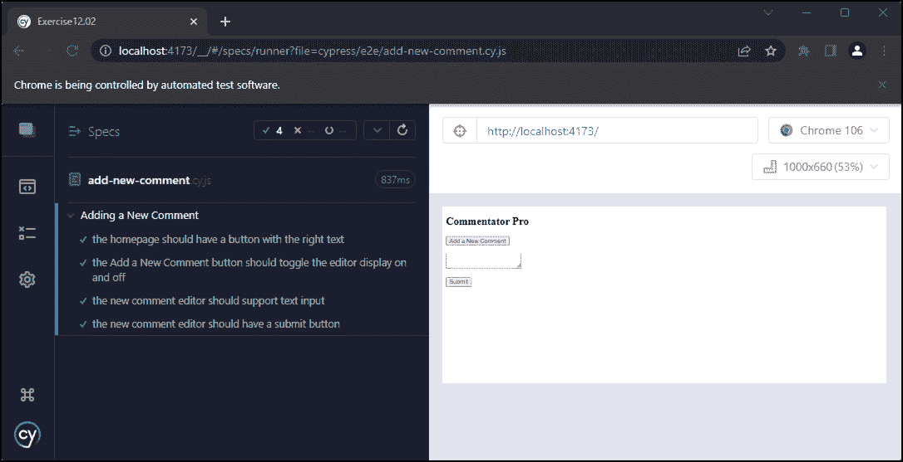

图 12.13 – Cypress 运行 add-new-comment 测试，包括新的提交按钮测试

1.  我们还可以添加的一个功能是在文本编辑器中有文本之前禁用`submit`按钮。为此，我们可以在`new-comment-submit`按钮上绑定`:disabled`到`!newComment`。顺便说一句，我们添加`newComment`和`textarea`之间的双向绑定的主要原因之一是启用此类 UI 验证：

    ```js
    <button data-test-id="new-comment-submit"
    ```

    ```js
      :disabled="!newComment">
    ```

    ```js
      Submit
    ```

    ```js
    </button>
    ```

1.  相关的测试将检查`new-comment-submit`按钮是否在文本编辑器内容为空时被禁用，使用 Cypress 的`should('be.disabled')`和`should('not.be.disabled')`断言：

    ```js
    describe('Adding a New Comment', () => {
    ```

    ```js
      // other tests
    ```

    ```js
      it('the new comment submit button should be disabled
    ```

    ```js
      based on "new comment" content', () => {
    ```

    ```js
        cy.visit('/')
    ```

    ```js
        // Get the editor to show
    ```

    ```js
        cy.get('[data-test-id="new-comment-button"]')
    ```

    ```js
          .click()
    ```

    ```js
        cy.get('[data-test-id="new-comment-submit"]')
    ```

    ```js
          .should('be.visible')
    ```

    ```js
        cy.get('[data-test-id="new-comment-submit"]')
    ```

    ```js
          .should('be.disabled')
    ```

    ```js
        cy.get('[data-test-id="new-comment-editor"]')
    ```

    ```js
          .type('Just saying...')
    ```

    ```js
        cy.get('[data-test-id="new-comment-submit"]')
    ```

    ```js
          .should('not.be.disabled')
    ```

    ```js
      })
    ```

    ```js
    })
    ```

当通过 Cypress UI 和 Chrome 自动化运行时，这会产生以下输出：


图 12.14 – Cypress 运行添加新评论测试，包括新评论提交按钮禁用测试

我们现在已经看到了如何使用 Cypress 来选择、点击和输入文本。我们还看到了检查元素可见性、文本内容、输入值和禁用状态的方法。

任何熟悉其他自动化框架的人都会注意到，在 Cypress 测试中，没有显式的等待或重试。这是因为 Cypress 会自动等待和重试断言和选择。我们编写的大多数测试都没有以这种方式展示这一点，但下一个练习，我们将引入异步性，将会展示这一点。

## 练习 12.03 – 向新评论编辑器添加提交状态

为了展示 Cypress 强大的自动重试/等待功能，我们将探讨为新的评论编辑器添加并测试一个`submitting`状态。

实际上，我们将对点击进行反应，持续 2.5 秒来模拟一个合理的慢速 HTTP 请求到后端 API。加载状态只是一个 CSS 类，它使按钮具有斜体文本。

这个测试将是一个展示 Cypress 自动等待和重试选择能力的示例。这个功能减少了任意等待及其相关的不稳定性。

完整的代码可以在[`github.com/PacktPublishing/Frontend-Development-Projects-with-Vue.js-3/tree/v2-edition/Chapter12/Exercise12.03`](https://github.com/PacktPublishing/Frontend-Development-Projects-with-Vue.js-3/tree/v2-edition/Chapter12/Exercise12.03)找到。

让我们按照以下步骤进行：

1.  为了显示加载状态，我们在组件中添加一个新的类：

    ```js
    <style scoped>
    ```

    ```js
    .submitting {
    ```

    ```js
      font-style: italic;
    ```

    ```js
    }
    ```

    ```js
    </style>
    ```

1.  接下来，我们需要在 Vue.js 应用中的`data()`中添加一个`isSubmitting`状态，这将允许我们切换`submit`按钮的状态。我们将它初始化为`false`，因为我们还没有提交任何内容，直到用户点击**提交**按钮：

    ```js
    <script>
    ```

    ```js
    export default {
    ```

    ```js
      data() {
    ```

    ```js
        return {
    ```

    ```js
          // other properties
    ```

    ```js
          isSubmitting: false
    ```

    ```js
        }
    ```

    ```js
      }
    ```

    ```js
    }
    ```

    ```js
    </script>
    ```

1.  接下来，我们将为`submit`按钮添加一个点击处理程序（作为`methods.submitNewComment`）。它将使用`setTimeout`模拟 2.5 秒的加载时间：

    ```js
    <script>
    ```

    ```js
    export default {
    ```

    ```js
      // other component properties
    ```

    ```js
      methods: {
    ```

    ```js
        submitNewComment() {
    ```

    ```js
          this.isSubmitting = true
    ```

    ```js
          setTimeout(() => {
    ```

    ```js
            this.isSubmitting = false;
    ```

    ```js
            this.newComment = '';
    ```

    ```js
          }, 2500)
    ```

    ```js
        }
    ```

    ```js
      }
    ```

    ```js
    }
    ```

    ```js
    </script>
    ```

1.  现在我们已经有一个假的`submit`处理函数，我们应该将其绑定到`new-comment-submit`按钮的点击事件上：

    ```js
    <template>
    ```

    ```js
      <!-- rest of template -->
    ```

    ```js
      <div v-if="showEditor">
    ```

    ```js
      <!-- rest of editor -->
    ```

    ```js
      <button data-test-id="new-comment-submit"
    ```

    ```js
        :disabled="!newComment"
    ```

    ```js
          @click="submitNewComment()">Submit
    ```

    ```js
      </button>
    ```

    ```js
      </div>
    ```

    ```js
    </template>
    ```

1.  接下来是我们要对`submit`按钮做出反应的部分。当`isSubmitting`为`true`时，将显示`submitting`类。为此，我们只需将`submitting`类设置为在`isSubmitting`为`true`时添加。除此之外，当`isSubmitting`为`true`时，我们还将禁用按钮：

    ```js
    <button data-test-id="new-comment-submit"
    ```

    ```js
    :disabled="!newComment || isSubmitting"
    ```

    ```js
    :class="{submitting:isSubmitting}"
    ```

    ```js
    @click="submitNewComment()">
    ```

    ```js
    Submit
    ```

    ```js
    </button>
    ```

1.  最后，我们可以添加一个测试来检查当点击`submit`按钮时，按钮是否应用了`submitting`类。首先，我们需要设置文本编辑器，以便在点击`add-new-comment`按钮并设置评论的文本值时，文本编辑器显示并启用。

接下来，我们可以点击启用的`new-comment-submit`按钮，并检查它是否被禁用并且具有`submitting`类（使用`should()`函数）。之后，我们应该编写另一个断言，按钮不显示`submitting`类：

```js
  it('the new comment editor should show a submitting
  class on submit', () => {
    cy.visit('/')
    // Get the editor to show
    cy.get('[data-test-id="new-comment-button"]')
      .click()
    cy.get('[data-test-id="new-comment-submit"]')
      .should('be.visible')
    cy.get('[data-test-id="new-comment-editor"]')
      .type('Just saying...')
    cy.get('[data-test-id="new-comment-submit"]')
      .should('not.be.disabled')
      .click()
      .should('have.class', 'submitting')
      .should('be.disabled')
      // eventually, the submitting class should be
         removed
    cy.get('[data-test-id="new-comment-submit"]')
      .should('not.have.class', 'submitting')
  })
```

尽管在显示`submitting`类时持续了`2.5`秒，但由于 Cypress 的自动重试/等待功能，这个测试仍然通过：

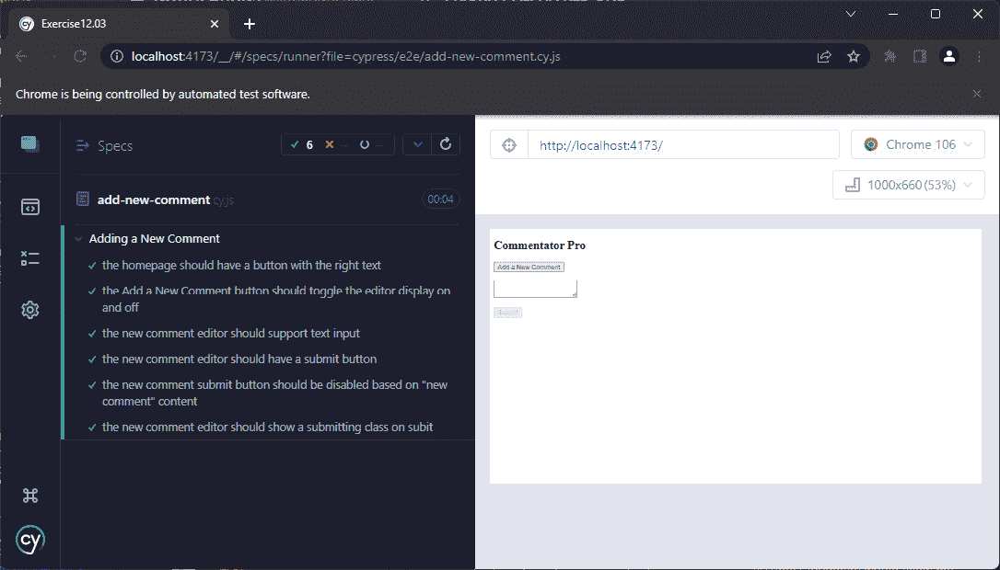

图 12.15 – Cypress 运行添加新评论测试，包括评论提交加载状态测试

我们已经看到了 Cypress 如何通过自动等待/重试来无缝地处理应用程序中的异步性，当断言或选择失败时。

# 截获 HTTP 请求

如前几节所述，Cypress 被设计为 JavaScript 端到端（E2E）测试解决方案。这意味着它自带断言、自动等待/重试、运行应用程序的合理默认值以及广泛的模拟功能。

HTTP 请求可能会很慢，并且倾向于在测试中引入不稳定的（flaky）行为。所谓的 flaky 是指间歇性的假阴性——也就是说，失败不是由应用程序问题引起的，而是由连接问题（例如，测试运行的服务器和后端主机之间的连接）引起的。

我们还会测试后端系统的实现。当使用**持续集成（CI**）时，这意味着需要在需要运行端到端测试的任何 CI 管道步骤中运行后端系统。

通常，当拦截后端请求并发送模拟响应时，我们也会说 HTTP 请求被*stubbed*，以避免测试不稳定（意味着间歇性失败与应用程序更改无关）。

由于请求并没有完全通过整个堆栈（包括后端 API），因此这从技术上讲不再是系统的完整端到端（E2E）测试。然而，我们可以将其视为前端应用的端到端测试，因为整个应用由独立的练习组成，并且不是特定于实现的。

为了在 Cypress 中模拟请求，我们需要使用`cy.intercept()`。

为了展示 HTTP 拦截，我们将从`JSONPlaceholder`获取评论列表，并将它们存储在`comments`响应式实例变量下。我们可以在`mounted()`生命周期事件中使用`fetch`来完成此操作，如下所示：

```js
<script>
// imports
export default {
  data() {
    return {
      // other data properties
      comments: []
    }
  },
  mounted() {
    fetch('https://jsonplaceholder.typicode.com/comments')
      .then(res => res.json())
      .then(comments => {
        this.comments = comments
      })
  }
  // other component properties
}
</script>
```

一个示例评论包括 ID、正文和电子邮件等属性。

这意味着我们可以通过创建一个`div`容器来渲染评论，该容器仅在存在评论时显示（`comments.length > 0`）。在`div`容器内部，我们可以使用`v-for`渲染一个`div`元素的列表。每张卡片将渲染评论的正文和作者的电子邮件，并在`mailto:`链接内。

注意我们是如何为列表容器和列表项分别设置`comments-list`和`comment-card`的`data-test-ids`：

```js
<div v-if="comments.length > 0" data-test-id="comments-list">
<div v-for="(comment, index) in comments":key="comment.id + index"data-test-id="comment">
  <p>{{ comment.body }}</p>
  <p><a :href="'mailto:' + comment.email">
    {{ comment.email }}</a>
  </p>
    </div>
</div>
```

如果我们不使用 HTTP 拦截来测试，我们必须保持断言相当通用。例如，我们可以在新的端到端测试文件中检查`comments-list`是否可见，以及是否有数量（大于`0`）的`comment-card`实例：

```js
describe('Loading Existing Comments', () => {
  it('should load & display comments', () => {
    cy.visit('/')
    cy.get('[data-test-id="comments-list"]')
      .should('be.visible')
    cy.get('[data-test-id="comment-card"]')
      .should('have.length.gt', 0)
  })
})
```

使用 Cypress GUI 运行的以下测试运行通过，但测试相当通用。我们无法对特定评论的数量或内容做出任何断言：

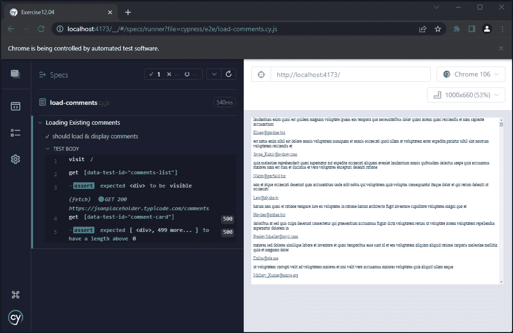

图 12.16 – Cypress 运行加载评论测试，包括通用加载和显示测试

为了拦截请求，我们使用`cy.intercept`。它允许我们定义一个路由和一个静态响应 – 在我们的情况下，是一个评论数组。在我们的模拟中，我们将使用一个虚构的电子邮件地址：

```js
it('should load and display comments correctly', () => {
  cy.intercept('**/comments', [
    {
      body: 'Vue is getting great adoption',
      email: 'evan@vuejs.org',
      id: 100,
    },
    {
      body: 'Just saying...',
      email: 'evan@vuejs.org',
      id: 10
    },
    {
      body: 'The JS ecosystem is great',
      email: 'evan@vuejs.org',
      id: 1
    }
  ]).as('getComments')
}
```

一旦我们设置了模拟路由，我们就可以访问页面，并使用`cy.wait('@getComments')`等待评论获取完成，因为我们之前已经使用`.as('getComments')`将评论的`fetch`路由的别名设置为`getComments`：

```js
describe('Loading Existing Comments', () => {
  // other tests
  it('should load and display comments correctly', () => {
    // test setup
    cy.visit('/')
    cy.wait('@getComments')
  })
})
```

然后，我们可以开始断言，首先断言`comments-list`是可见的，然后断言`comment-card`元素的数量：

```js
describe('Loading Existing Comments', () => {
  // other tests
  it('should load and display comments correctly', () => {
    // test setup
    cy.get('[data-test-id="comments-list"]')
      .should('be.visible')
    cy.get('[data-test-id="comment-card"]')
      .should('have.length', 3)
  })
})
```

我们还可以使用`.contains()`函数断言卡片的特定内容：

```js
describe('Loading Existing Comments', () => {
  // other tests
  it('should load and display comments correctly', () => {
    // test setup
    cy.contains('[data-test-id="comment-card"]', 'Vue is
      getting great adoption').contains('evan@vuejs.org')
    cy.contains('[data-test-id="comment-card"]',
      'Just saying...').contains('evan@vuejs.org')
    cy.contains('[data-test-id="comment-card"]', 'The JS
      ecosystem is great').contains('evan@vuejs.org')
  })
})
```

然后，我们可以使用 Cypress GUI 运行测试套件，并查看它是否通过：

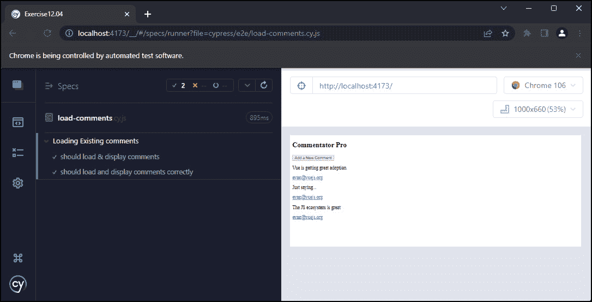

图 12.17 – Cypress 运行加载评论测试，包括我们的模拟评论测试

我们现在已经看到了如何以及为什么我们可能会使用 Cypress 来模拟 HTTP 请求。

## 练习 12.04 – 在提交时将评论 POST 到 API

`new-comment-submit`按钮目前仅设置加载状态几秒钟后重置 – 实际上并没有将评论发送到任何地方。

让我们使用`JSONPlaceholder` API 作为发送我们新评论的地方。当对 API 的`POST`请求成功时，我们将评论添加到评论列表的顶部。

完整的代码可以在[`github.com/PacktPublishing/Frontend-Development-Projects-with-Vue.js-3/tree/v2-edition/Chapter12/Exercise12.04`](https://github.com/PacktPublishing/Frontend-Development-Projects-with-Vue.js-3/tree/v2-edition/Chapter12/Exercise12.04)找到。

为了完成练习，我们将执行以下步骤：

1.  首先，让`submitNewComment`方法使用`fetch`实际发送数据。新评论需要一个电子邮件地址，而我们的应用程序没有，但我们可以设置一个假电子邮件地址在我们的数据中：

    ```js
    <script>
    ```

    ```js
    // imports
    ```

    ```js
    export default {
    ```

    ```js
      // other component properties
    ```

    ```js
      data: {
    ```

    ```js
        // other data
    ```

    ```js
        email:'fakeemail@email.com'
    ```

    ```js
      },
    ```

    ```js
      methods: {
    ```

    ```js
        submitNewComment() {
    ```

    ```js
          this.isSubmitting = true
    ```

    ```js
      fetch('https://jsonplaceholder.typicode.com/comments  ', {
    ```

    ```js
           method: 'POST',
    ```

    ```js
           headers: {
    ```

    ```js
             'Content-Type': 'application/json'
    ```

    ```js
           },
    ```

    ```js
           body: JSON.stringify({
    ```

    ```js
             email: this.email,
    ```

    ```js
             body: this.newComment
    ```

    ```js
           })
    ```

    ```js
      })
    ```

    ```js
      }
    ```

    ```js
      }
    ```

    ```js
    }
    ```

    ```js
    </script>
    ```

不幸的是，`fetch()`调用本身不会更新数据或退出加载状态。为了做到这一点，我们需要链式调用一些`.then()`函数来处理响应，以及一个`.catch`函数来处理可能出现的错误。

成功（`.then`）时，我们应该获取请求的 JSON 输出并将其添加到`comments`数组副本的前面。我们还应该重置`isSubmitting`、`newComment`和`showEditor`。错误（`.catch`）时，我们只需将加载状态`isSubmitting`重置为`false`；我们不会清除编辑器或关闭它，因为用户可能想要再次尝试提交：

```js
<script>
// imports
export default {
  // other component properties
  methods: {
    submitNewComment() {
      this.isSubmitting = true
      fetch(
        // fetch params
      ).then(res => res.json())
       .then(data => {
          this.comments = [
          data,
          ...this.comments,
          ]
          this.isSubmitting = false
          this.newComment = ''
       })
       .catch(() => {
          this.isSubmitting = false
       })
    }
  }
}
</script>
```

现在我们应该向`cypress/e22/add-new-comment.js`测试套件添加新的测试。

1.  首先，为了成为好的 JSON placeholder 用户，我们将为`add-new-comment`套件中的所有`GET`请求到`/comments`进行存根处理。为了做到这一点，我们将使用一个`beforeEach`钩子来拦截匹配`**/comments`通配符的请求，并返回一个空数组：

    ```js
    describe('Adding a New Comment', () => {
    ```

    ```js
      beforeEach(() => {
    ```

    ```js
        cy.intercept('GET','**/comments', []);
    ```

    ```js
      })
    ```

    ```js
      // tests
    ```

1.  然后，我们可以继续更新`the new comment editor should show a submitting class on submit`测试，因为我们不再使用`setTimeout`，而是使用 HTTP 请求。首先，我们需要对`/comments` `POST`请求进行存根处理，我们将使用`cy.intercept`的配置对象语法来引入 HTTP 请求的延迟，以便它不会立即响应。

我们使用`.as('newComment')`来别称这个请求：

```js
it('the new comment editor should show a submitting class on submit', () => {
  cy.intercept('POST', '**/comments', (req) => {
    req.reply({
      delay: 1500, response: {}
  });
}).as('newComment');
```

1.  而不是`// 最终，应该移除提交类`，我们现在可以使用`cy.wait()`等待`newComment` HTTP 请求完成，然后再检查旋转器是否消失：

    ```js
    describe('Adding a New Comment', () => {
    ```

    ```js
      // setup & tests
    ```

    ```js
      it('the new comment editor should show a spinner on
    ```

    ```js
      submit', () => {
    ```

    ```js
        // test setup
    ```

    ```js
        // click the "submit" button
    ```

    ```js
        // check the submitting class appears
    ```

    ```js
        cy.wait('@newComment')
    ```

    ```js
        // check that the submitting class is gone
    ```

    ```js
      })
    ```

    ```js
    })
    ```

1.  在成功发布一条新评论后，评论文本会被清除。我们应该测试在发布评论时是否会发生这种情况。我们将使用与更新后的加载状态测试类似的骨架，设置`POST`评论路由的`cy.intercept('POST', '**/comments', {})`，别名为`.as('newComment')`。

然后，我们可以显示新的评论编辑器，添加一些文本，并提交表单。然后，我们将等待`POST`请求完成，然后再检查评论是否已被清除：

```js
    it('adding a new comment should clear the comment
    text', () => {
      cy.intercept('POST', '**/comments', {
        body: {
          body: 'Just saying...',
          email: 'hi@raymondcamden.com'
        }
      }).as('newComment');
      cy.visit('/')
      // Get the editor to show
      cy.get('[data-test-id="new-comment-button"]')
        .click()
      cy.get('[data-test-id="new-comment-submit"]')
        .should('be.visible')
      cy.get('[data-test-id="new-comment-editor"]')
        .type('Just saying...')
      cy.get('[data-test-id="new-comment-submit"]')
        .should('not.be.disabled')
        .click()
      cy.wait('@newComment');
      cy.get('[data-test-id="new-comment-editor"]')
        .should('have.value','')
    });
```

这个测试现在可以用 Cypress GUI 运行，并且会通过：

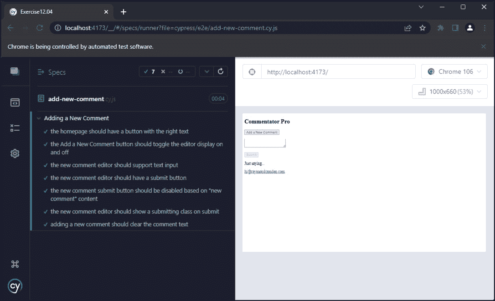

图 12.18 – Cypress 运行添加新评论测试，包括清除编辑器评论文本

1.  我们添加的第二项功能是在 HTTP 请求完成后，将新评论添加到评论列表的顶部。为了测试这一点，最好将评论的`GET`请求的响应更改至少包含一个元素（这样我们就可以检查新评论是否添加到列表的顶部）：

    ```js
    describe('Adding a New Comment', () => {
    ```

    ```js
      // setup & other tests
    ```

    ```js
      it('submitting a new comment should POST to
    ```

    ```js
      /comments and adds response to top of comments
    ```

    ```js
      list', () => {
    ```

    ```js
        cy.intercept('GET', '**/comments', [
    ```

    ```js
          {
    ```

    ```js
            email: 'evan@vuejs.org',
    ```

    ```js
            body: 'Existing comment'
    ```

    ```js
          }
    ```

    ```js
        ]).as('newComment')
    ```

    ```js
      })
    ```

    ```js
    })
    ```

1.  我们可以然后模拟`POST`请求使用一些模拟数据，添加文本到编辑器，并提交表单：

    ```js
    describe('Adding a New Comment', () => {
    ```

    ```js
      // setup & other tests
    ```

    ```js
      it('submitting a new comment should POST to
    ```

    ```js
      /comments and adds response to top of comments
    ```

    ```js
      list', () => {
    ```

    ```js
        // GET request stubbing
    ```

    ```js
        cy.intercept({
    ```

    ```js
          method: 'POST',
    ```

    ```js
          url: '**/comments',
    ```

    ```js
          response: {
    ```

    ```js
            email: 'evan@vuejs.org',
    ```

    ```js
            body: 'Just saying...',
    ```

    ```js
          },
    ```

    ```js
        }).as('newComment')
    ```

    ```js
        cy.visit('/')
    ```

    ```js
        cy.get('[data-test-id="comment-card"]').should
    ```

    ```js
          ('have.length', 1)
    ```

    ```js
        cy.get('[data-test-id="new-comment-button"]')
    ```

    ```js
          .click()
    ```

    ```js
        cy.get('[data-test-id="new-comment-editor"]')
    ```

    ```js
          .type('Just saying...')
    ```

    ```js
        cy.get('[data-test-id="new-comment-submit"]')
    ```

    ```js
          .should('not.be.disabled')
    ```

    ```js
          .click()
    ```

    ```js
        cy.wait('@newComment')
    ```

    ```js
      })
    ```

    ```js
    })
    ```

1.  最后，我们可以通过结合使用`cy.get()`、`.first()`和`.contains()`来断言第一个评论是新添加的评论：

    ```js
    describe('Adding a New Comment', () => {
    ```

    ```js
      // setup & other tests
    ```

    ```js
      it('submitting a new comment should POST to
    ```

    ```js
      /comments and adds response to top of comments
    ```

    ```js
      list', () => {
    ```

    ```js
        // setup & wait for POST completion
    ```

    ```js
        cy.get('[data-test-id="comments-list"]')
    ```

    ```js
          .should('be.visible')
    ```

    ```js
        cy.get('[data-test-id="comment-card"]')
    ```

    ```js
          .should('have.length', 2).first()
    ```

    ```js
          .contains('[data-test-id="comment-card"]',
    ```

    ```js
          'Just saying...')
    ```

    ```js
          .contains('fakeemail@email.com')
    ```

    ```js
      })
    ```

    ```js
    })
    ```

当使用 Cypress GUI 运行`add-new-comment`测试套件时，我们可以看到新的测试通过：

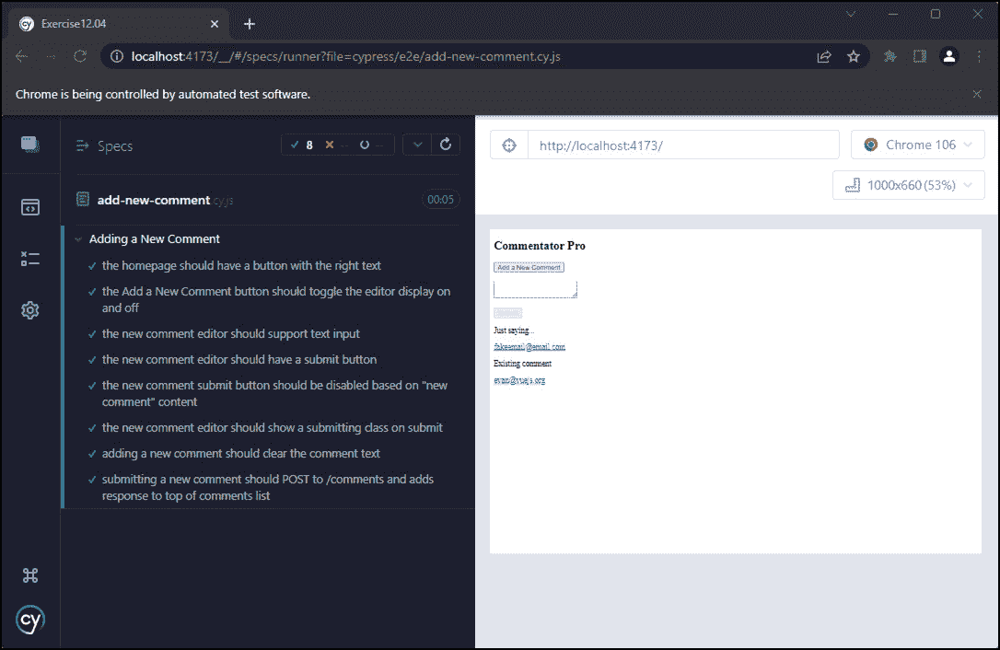

图 12.19 – Cypress 运行添加新评论测试，包括将新评论添加到列表顶部的测试

你现在已经看到了如何在测试中处理网络操作。由于大多数应用程序都会使用某种形式的 API 调用，这将非常有帮助，以确保你的测试尽可能覆盖更多范围。

## 活动十二.01 – 添加设置用户电子邮件和测试的能力

你会记得我们将`fakeemail@email.com`硬编码为任何评论的电子邮件。在这个活动中，我们将添加一个电子邮件输入，它将为评论设置`email`属性。我们将在新的`cypress/e2e/enter-email.cy.js`测试套件中添加相关的测试：

1.  为了跟踪电子邮件，我们将它在`data()`中设置为一个响应式状态，并在页面上添加一个电子邮件输入，它将使用`v-model`双向绑定到`email`。我们还添加了一个标签和相应的标记。请注意，我们将在电子邮件输入上设置一个`data-test-id`属性，设置为`email-input`。

1.  现在，我们将添加一个`beforeEach`钩子，让 Cypress 拦截并模拟`GET`评论（列表）请求。评论列表请求应该被别名为`getComments`。

1.  我们将添加我们的第一个测试，该测试检查输入电子邮件输入是否正确工作。我们将进入应用程序，输入电子邮件，并检查我们输入的内容现在是否是输入值。

当使用 Cypress UI 运行时，我们应该得到以下通过测试：

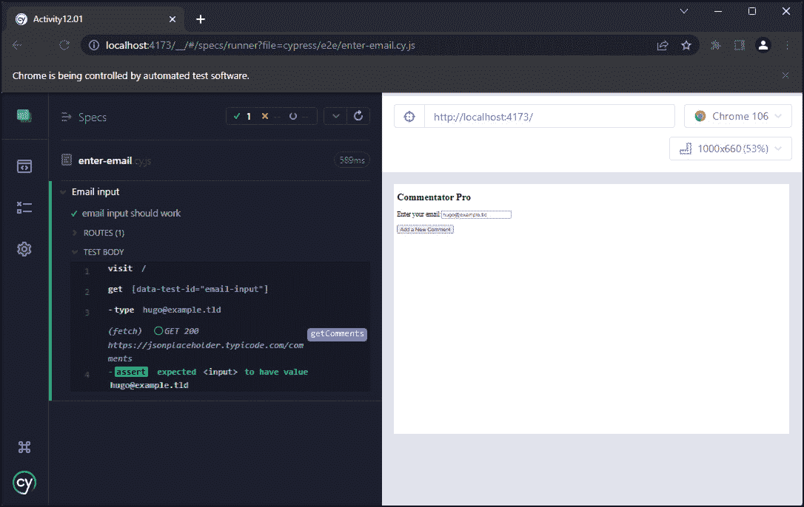

图 12.20 – Cypress 运行输入电子邮件测试的添加新评论测试

1.  拥有`email`属性是添加评论的先决条件，因此我们将禁用`email`为空（`!email`）。我们将根据电子邮件字段是否填充来绑定到`disabled`属性。

1.  使用这个新的`当电子邮件为空时禁用添加新评论按钮`功能，我们应该添加一个新的端到端测试。我们将加载页面，并在初始加载时检查电子邮件输入是否为空，以及`not`是否被禁用，这意味着它是启用的。

当使用 Cypress UI 运行时，我们应该看到新的测试通过，以下为输出：


图 12.21 – Cypress 运行带有禁用添加评论按钮的 enter-email 测试

1.  现在我们有了捕获电子邮件的方法，我们应该在提交新评论（即提交新评论时）调用后端 API 时传递它。为了做到这一点，我们应该修改`methods.submitNewComment`中电子邮件被硬编码为`fakeemail@email.com`的位置。

1.  现在我们正在使用用户输入的电子邮件，我们应该编写一个端到端测试来检查它是否被发送。我们将模拟`POST`请求，将其别名为`newComment`，并返回一个任意值。然后我们可以访问页面，填写电子邮件输入，打开评论编辑器，填写内容，并提交。然后我们将等待`newComment`请求，并在请求体中确认正文和电子邮件与我们完成它们时相同。

注意

我们也可以选择不模拟`POST`请求，而是检查新插入到页面上的评论是否包含正确的电子邮件和正文。

当使用 Cypress UI 运行时，我们得到以下测试运行输出：

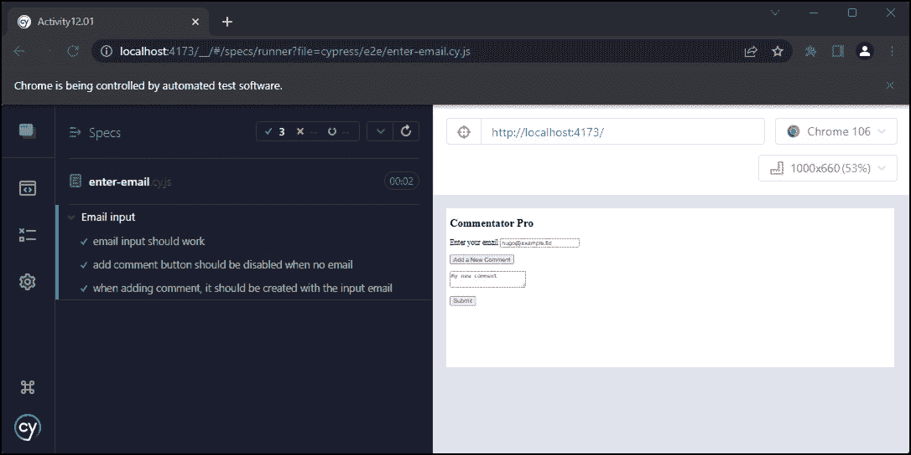

图 12.22 – Cypress 运行带有电子邮件输入测试的 enter-email 测试

注意

该活动的解决方案可以在[`github.com/PacktPublishing/Frontend-Development-Projects-with-Vue.js-3/tree/v2-edition/Chapter12/Activity12.01`](https://github.com/PacktPublishing/Frontend-Development-Projects-with-Vue.js-3/tree/v2-edition/Chapter12/Activity12.01)找到

# 摘要

在本章中，我们探讨了利用 Cypress 进行 Vue.js 应用程序端到端测试的方法。端到端测试通常非常有用，可以给我们一个高度信心，即测试的流程将按预期工作，而不是单元或集成测试，后者以更低的开销验证我们的代码是否按预期工作。

我们已经看到了如何使用 Cypress 检查、交互和断言 UI。我们还展示了 Cypress 的默认等待/重试功能在编写健壮测试时的巨大优势。我们利用 Cypress 的 HTTP 拦截库来模拟 HTTP 请求，使测试更加可预测和快速。

最后，我们探讨了如何使用 Cypress 设置视觉回归测试。在下一章中，我们将探讨如何将 Vue.js 应用程序部署到网络上。
