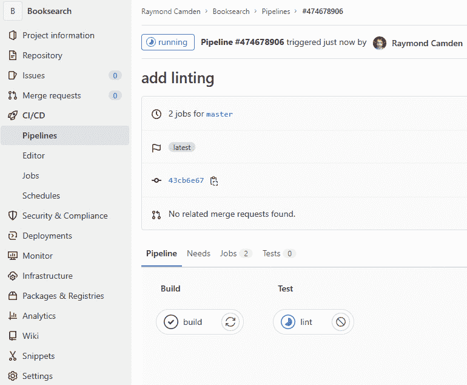

# 13

# 将代码部署到网络

在前两章中，你深入了解了测试以及它如何对你的应用程序产生益处。现在，你对 Vue.js 应用程序的稳定性和可用性有了信心，是时候深入探讨如何将代码上传到网络上了。

在本章中，你将能够解释 CI/CD 工作流程的好处以及它与发布周期、发布节奏和开发工作流程的联系。为此，你将能够阐述 Vue.js 开发和生产构建之间的差异以及所做出的权衡。

要测试和部署 Vue.js 应用程序，你需要配置 GitLab CI/CD，使用管道、作业和步骤。你将熟悉 Netlify、**亚马逊网络服务简单存储服务**（**AWS S3**）和 AWS CloudFront，以及它们的关键相似之处和不同之处。

在本章中，我们将涵盖以下主题：

+   探索 CI/CD 作为敏捷软件开发过程一部分的好处

+   为生产构建我们的应用程序

+   使用 GitLab CI/CD 测试我们的代码

+   部署到 Netlify

+   使用 S3 和 CloudFront 部署到 AWS

# 技术要求

对于本章，你需要`git` CLI，你之前已经使用过了。你还需要 Netlify 和亚马逊 AWS 的账户。

你可以在这里找到本章的源代码：[`github.com/PacktPublishing/Frontend-Development-Projects-with-Vue.js-3/tree/v2-edition/Chapter13`](https://github.com/PacktPublishing/Frontend-Development-Projects-with-Vue.js-3/tree/v2-edition/Chapter13)

# 探索 CI/CD 作为敏捷软件开发过程一部分的好处

**持续集成**（**CI**）是指每天多次将代码集成到一起的实践。为了支持这一做法，需要一个现代的**版本控制系统**（**VCS**），例如 Git，它在一个仓库中支持多个工作状态（分支），这样开发者可以独立地工作在代码上，同时仍然能够安全地协作和集成他们的更改。

为了增强 VCS 的功能，围绕仓库（如 GitLab 或 GitHub）创建了一些托管和协作工具，这些工具允许开发者通过网页**用户界面**（**UI**）更高效地查看和管理代码更改。

作为这些托管平台以及它们提供的协作工具的一部分，或作为补充，自动检查对于在集成前、集成中和集成后保持对代码质量的信心至关重要。

采用 CI 方法通常包括包括额外的代码质量步骤，例如单元或集成测试、覆盖率检查，以及每次任何新代码集成到主线分支（更改被集成的分支）时在主线分支上构建工件。团队遵循的用于代码协作和 CI 的 Git 使用惯例被称为**Git 工作流程**，通常简称为**Git flow**。

Git 流程将预测分支命名约定，以及何时以及如何集成更改。例如，一个团队可能会决定分支应该以票号开头，后面跟着一个简短的短划线小写描述，例如`WRK-2334-fix-ie-11-scroll`。

作为 Git 流程的一部分，决定并遵守的其他约定示例包括提交消息长度和标题、应该通过或允许失败的自动检查，以及合并更改请求所需的审阅者数量，在 GitHub 和 GitLab 的术语中分别对应于拉取请求或合并请求。

Git 流程分为两大类：（功能）分支开发和主干开发。我们将首先介绍分支开发，因为其局限性已经变得非常明显，而且大多数项目倾向于使用主干开发。

在基于分支的 Git 工作流程中，多个工作分支被保存在仓库中。基于分支的流程可以用来保持反映环境状态的分支。

下面的图显示了三个分支——生产、预发布和开发：


图 13.1 – 具有三个环境分支的基于分支的 Git 提交/分支树

*生产*分支不包含来自*预发布*或*开发*的任何更改。*预发布*分支领先于*生产*分支，但除了*生产*分支上的更改外，与*开发*分支没有共同的变化。*开发*分支领先于*预发布*和*生产*分支：它与*预发布*分支在同一个提交上分支出来，但它不与*预发布*分支共享任何进一步的提交。

基于分支的工作流程也可以用来跟踪进入发布线的更改。在项目需要维护应用程序或库的两个版本，但需要对两个版本都应用错误修复或安全补丁的情况下，这很有用。

在以下示例中，我们得到了一个与环境分支类似的分支示例。版本 1.0.0 包含了一些在 1.0.1 和 1.1.0 中不存在的变化，但并不共享任何新的代码。版本 1.0.1 和 1.1.0 同时从 1.0.0 分支出来，但它们没有共享进一步的更改：


图 13.2 – 具有三个发布分支的基于分支的 Git 提交/分支树

在基于主干的工作流程中，团队中的每个成员都会从一个分支创建新的分支，通常是从*master*分支。这个过程通常被称为**从**：


图 13.3 – 一个基于主分支的 Git 提交/分支树示例，有两个从主分支分叉出来的功能分支

基于主分支的工作流程的一个极端情况是拥有一个*单一*的分支，每个人都提交到这个分支。

注意

在基于主分支的环境中，除了*发布分支*之外，还可以使用 Git 标签来跟踪发布快照。这提供了与维护分支相同的优势，但减少了分支噪音，并且由于标签一旦创建就不能更改，因此具有不可变性的额外好处。

**持续交付**（**CD**）是团队能够将每个良好的构建部署到生产环境的能力。

CD 的一个先决条件是 CI，因为 CI 为构建的质量提供了一些初始的信心。作为 CD 的一部分，除了 CI 之外，还需要新的系统、工具和实践。

下图显示了与 CI 和 CD 实践相关的工具和那些更相关的工具：


图 13.4 – CI 和 CD 实践之间的关系

采用 CD 所需的额外成分是对应用程序将继续按预期（对于最终用户）工作以及新缺陷没有无意中引入的高度信心。这意味着在 CI 检查期间或之后需要额外的端到端测试步骤，以在部署之前验证构建。

这些端到端测试可以手动进行，也可以自动化。在一个理想的 CD 设置中，后者（自动端到端测试）是首选的，因为这意味着部署不包括手动交互。如果端到端测试通过，构建可以自动部署。

为了便于持续部署（CD），以前用于部署软件的系统必须重新思考。作为 CD 的一部分，部署不能是一个冗长的手动过程。这导致公司采用云原生技术，如 Docker，以及**基础设施即代码**（**IaC**）工具，如 HashiCorp 的**Terraform**。

重视转向 CD 实践导致了**GitOps**和**ChatOps**等想法的诞生。在 GitOps 和 ChatOps 中，部署和运营任务是由开发人员和利益相关者每天交互的工具驱动的。

在 GitOps 中，部署可以通过 GitHub/GitLab（或另一个 Git 托管提供商）直接进行，使用 GitHub Actions 或 GitLab CI/CD，或者通过 CI/CD 软件（如 CircleCI 或 Jenkins）进行，这些软件与 GitHub/GitLab 有紧密的集成和报告功能。

在 ChatOps 的情况下，使用对话界面来部署和操作软件。某些 ChatOps 的变体可以被认为是 GitOps 的一个子集——例如，通过 GitHub 拉取请求的评论与工具（如**Dependabot**，一个保持项目依赖项更新的工具）进行交互。

ChatOps 也可以直接集成到实时聊天工具中，如 Slack 或 Microsoft Teams。有人可能会发送一条消息，例如 `deploy <service-name> <environment>`，这将把服务部署到相关环境。请注意，聊天界面非常类似于命令行界面，开发者可能已经习惯了，但其他利益相关者可能需要一些时间来适应。

现在我们已经探讨了 CI 和 CD 的方法，让我们讨论使用 CI 和 CD 的优势：

| **持续集成** | **持续交付** |
| --- | --- |
| 确保正在集成的更改集很小（最多几天的工作量） | 更频繁、更安全地向生产交付价值 |
| 减少了在代码库中造成未预知错误的巨大全面更改的可能性 | 一小部分更改集（几天的工作量）可以无问题回滚 |
| 测试、代码质量和审查步骤为干净的集成提供了信心 | 由于较长的固定（每月、每周或每冲刺）发布周期（与 CD 相比），较大的更改集可能产生未预见的后果；回滚对大型发布的影响难以理解 |

图 13.5 – CI 和 CD 的优势

这两种实践也对团队的心态和表现产生影响。能够在一天内看到你做出的更改集成，并在一周内投入生产，这意味着贡献者可以立即看到他们的工作产生影响。

CI/CD 还有助于推广敏捷原则，其中更改是迭代应用和部署的。这与项目长期时间表形成对比，对于这些项目，估计不准确会累积并可能导致重大延误。

通过这样，你已经深入了解了 CI 和 CD。虽然两者确实意味着你的流程中会有更多的工作，但长远来看，这些好处将因更好的稳定性和更灵活地响应问题和添加新功能而得到回报。现在，让我们将其付诸实践。

# 为生产构建我们的应用程序

将应用程序部署到生产环境始于创建一个可以部署的工件。在 Vue.js 的情况下，我们构建的是客户端应用程序，这意味着我们的构建工件将包含 HTML、JavaScript 和 CSS 文件。

使用 Vite 框架搭建的 Vue 项目将包含一个 `build` 命令。在构建过程中，Vite 会处理 JavaScript、Vue 单文件组件以及相互导入的模块，并将它们 *打包*。**打包**意味着相互依赖的相关代码块将输出为一个单一的 JavaScript 文件。

Vue CLI 构建步骤还包括一个 `dead code elimination` 步骤。这意味着它可以分析正在生成的代码，如果其中任何部分从未使用过——例如，一个如 `if (false) { /* do something */}` 的语句——那么它将不会出现在构建输出中。

默认情况下，当我们在 Vue 项目中调用 `vite build` 时，Vite 会为生产环境构建，在 Vue 项目中，这被别名设置为 `build` 脚本，可以通过 `npm run build` 或 `yarn build` 来运行。

在一个示例 Vue 项目中，我们会看到类似以下的内容：


图 13.6 – 新建 Vue 项目中“npm run build”的输出

`dist` 文件夹现在可以使用 Netlify 或 AWS S3 和 CloudFront 等静态托管解决方案进行部署。

通过这些，我们已经看到了如何使用 Vite CLI 和 `npm run build` 命令来构建 Vue.js 应用程序用于生产。接下来，我们将学习如何使用 GitLab CI/CD 来测试我们的代码（在部署之前）。

# 使用 GitLab CI/CD 测试我们的代码

GitLab 有一个内置的 CI/CD 工具，称为 GitLab CI/CD。要使用 GitLab CI/CD，你需要一个 GitLab 账户。要与 GitLab 上托管的 Git 仓库交互，你还需要将你的机器上的 SSH 密钥关联到你的 GitLab 账户。

注意

在 GitLab 文档中可以找到添加 SSH 密钥的说明，网址为 [`docs.gitlab.com/ee/ssh/index.html`](https://docs.gitlab.com/ee/ssh/index.html)。

一旦你创建了账户，你可以通过**创建空白项目**操作创建一个新的存储库，如下面的截图所示。如果你是现有用户，你可以在**项目**页面的右上角使用**创建新项目**按钮。


图 13.7 – 带有新建项目按钮的 GitLab 项目页面

不论你的选择如何，你都会被带到**新项目**页面，在那里你可以通过给它一个名称和一个缩写来创建一个项目，如下面的截图所示：


图 13.8 – GitLab 新建项目页面

一旦你点击**创建项目**，GitLab 项目页面将以空状态出现，显示如何克隆它的说明。你应该运行克隆存储库所需的命令，这很可能类似于以下内容（你需要在你的机器上运行）：

```js
git clone <repository-url>
```

你可以通过点击蓝色的**克隆**按钮来找到正确的 URL。

在你的机器上，打开克隆存储库的目录。为了添加 GitLab CI/CD，我们需要在项目的根目录中添加一个 `.gitlab-ci.yml` 文件。一个示例 `.gitlab-ci.yml` 文件，它将一个 `build` 作业添加到管道的 `build` 阶段，安装依赖项（使用 `npm ci`），运行生产构建（`npm run build`），并缓存输出工件，如下所示。

它将以一个在 YAML 文件中定义的顶级键命名的作业名称开始 – 在这种情况下，`build:`。在 YAML 语法中，我们必须增加缩进来表示 `build` 键指向一个对象。

在`build job`对象中，我们将定义用于运行作业的 Docker 镜像，使用`image: node:lts`。这意味着我们希望这个作业在 Node.js **长期支持**（**LTS**）镜像上运行，截至 2022 年初将是 Node.js 16。

注意

您可以访问最新的 Node.js LTS 发布计划，网址为[`nodejs.org/en/about/releases/`](https://nodejs.org/en/about/releases/)。

我们可以在作业中定义的另一个属性是阶段。默认情况下，GitLab CI/CD 流水线有三个阶段：**构建**、**测试**和**部署**。当团队的工作流程不适合这三个类别时（例如，如果需要部署到多个环境），可以使用自定义阶段来替换这些阶段。我们的流水线目前只有一个阶段和一个作业，所以大部分前面的内容不适用于我们。

注意

如果您好奇，`stages`用于定义作业可以使用的阶段，并且它是全局定义的（[`docs.gitlab.com/ee/ci/yaml/#stages`](https://docs.gitlab.com/ee/ci/yaml/#stages)）。

`stages`的指定允许灵活的多阶段流水线。阶段中元素的顺序定义了作业执行的顺序：

a) 同一阶段的作业并行运行

b) 下一个阶段的作业将在上一个阶段的作业成功完成后运行

有关更多信息，请参阅文档：[`docs.gitlab.com/ee/ci/yaml/#stages`](https://docs.gitlab.com/ee/ci/yaml/#stages)。

我们设置的最后一个属性是`script`，它定义了作业运行时应运行的步骤，以及`artifacts`，它配置了工件存储。在我们的例子中，我们将运行`npm ci`来安装所有依赖项，然后是`npm run build`，这将运行生产 Vue.js 构建。我们的工件已设置为保留一周，并包含`dist`文件夹（这是 Vite CLI `build`输出存储的地方）。

完整来说，我们有以下内容：

```js
build:
  image: node:lts
  stage: build
  script:
    - npm ci
    - npm run build
  artifacts:
    expire_in: 1 week
    paths:
      - dist
```

一旦我们将此`.gitlab-ci.yml`文件推送到包含 Vue CLI 项目的存储库，我们将在存储库视图中看到以下内容，其中在最新提交上正在运行一个步骤的流水线：


图 13.9 – GitLab 存储库视图，构建作业在最新提交上运行

注意

GitLab 现在在运行流水线之前需要用户验证。这可以通过信用卡完成；GitLab**不会**向您的信用卡收费。它仅作为验证过程的一部分使用。

如果我们点击`Build`（表示`状态`流水线，我们将其设置为`build`），它表示作业名称（我们定义为`build`），我们将看到相同的进行中指示器，直到作业完成，如下所示：


图 13.10 – GitLab CI 流水线视图，构建作业已完成

作业完成后，我们将看到一个**成功**图标（绿色勾号）。我们可以在作业运行时或完成后（无论它是否失败或成功）点击此图标或作业名称来访问**作业**视图。当作业完成后，我们还将看到一个**重试**图标，如果我们希望重试失败的管道步骤，这可能很有用。

以下截图显示作业运行成功：


图 13.11 – 构建作业通过的 GitLab CI 管道视图

点击作业后，我们将看到`docker_machine`执行器，它加载 Node.js Docker 镜像，我们可以看到运行脚本的步骤，以及缓存和工件恢复，如下所示：


图 13.12 – 成功构建作业的 GitLab CI 作业视图

如果我们想在 GitLab CI/CD 运行中添加一个`test`步骤，我们需要在一个支持单元测试的项目中。安装和添加单元测试在*第十一章*，*单元测试*中进行了详细说明。

我们需要在`.gitlab-ci.yml`文件中添加一个新的作业；我们将称之为`test`，使用`node:lts`镜像，并将作业分配给`test`状态。在作业中，我们必须运行`npm ci`，然后是`npm run test:unit`（这是由`unit-jest`CLI 插件添加的`npm`脚本）：

```js
# rest of .gitlab-ci.yml
test:
  image: node:lts
  stage: test
  script:
    - npm ci
    - npm run test
```

一旦我们推送这个新的`.gitlab-ci.yml`文件，我们将在主仓库页面上看到以下视图：


图 13.13 – GitLab CI/CD 运行带有新测试步骤的管道的仓库视图

我们可以点击进入管道视图。GitLab CI/CD 使用管道的原因是，在某个阶段失败的步骤将意味着后续任何阶段的步骤都不会运行。例如，如果我们得到一个失败的`build`作业，属于`test`阶段的作业将不会运行：


图 13.14 – 带有停止测试作业/阶段的失败构建作业的 GitLab CI/CD 管道视图

如果我们推送另一个提交或重试构建步骤（如果失败不是由更改引起的）并再次导航到管道视图，我们将看到以下内容：


图 13.15 – 构建阶段所有作业都成功后运行的测试作业的 GitLab CI/CD 管道视图

一旦`test`作业成功，我们将看到以下管道：


图 13.16 – GitLab CI/CD 管道视图，所有作业在构建和测试阶段均成功

我们已经添加了一个包含`build`和`test`阶段的 GitLab CI/CD 管道，以确保在每次向 GitLab 仓库推送时，代码仍然按预期集成。

## 练习 13.01 – 向我们的 GitLab CI/CD 管道添加代码风格检查步骤

**代码风格检查**是一种获取自动化格式化和代码风格检查的方法。将其集成到 CI 过程中可以确保所有合并到主线分支的代码都遵循团队的代码风格指南。它还可以减少代码风格审查评论的数量，这些评论可能会很嘈杂，并可能分散对变更请求基本问题的关注。

您可以在[`github.com/PacktPublishing/Frontend-Development-Projects-with-Vue.js-3/tree/v2-edition/Chapter13/Exercise13.01`](https://github.com/PacktPublishing/Frontend-Development-Projects-with-Vue.js-3/tree/v2-edition/Chapter13/Exercise13.01)找到此练习的完整代码。

要添加代码风格检查，请按照以下步骤操作：

1.  首先，我们需要确保我们的`package.json`文件包含`lint`脚本。如果它缺失，我们需要添加它。`eslint-plugin-vue`网站([`eslint.vuejs.org/`](https://eslint.vuejs.org/))对此进行了说明。一旦安装，就可以在代码风格检查脚本中使用它，如下所示：

    ```js
    {
    ```

    ```js
      "// other": "properties",
    ```

    ```js
      "scripts": {
    ```

    ```js
        "// other": "scripts",
    ```

    ```js
        "lint": "eslint --ext .js,.vue src",
    ```

    ```js
        "// other": "scripts"
    ```

    ```js
      },
    ```

    ```js
      "// more": "properties"
    ```

    ```js
    }
    ```

1.  要在 GitLab CI/CD 上运行代码风格检查，请添加一个新的`lint`作业，该作业将在 GitLab CI/CD 管道的`test`阶段运行 Node.js LTS Docker 镜像。我们将在`.gitlab-ci.yml`文件中这样做：

    ```js
    lint:
    ```

    ```js
      image: node:lts
    ```

    ```js
      stage: test
    ```

1.  为了让`lint`作业按照`package.json`中的设置运行`lint`脚本，我们需要在`.gitlab-ci.yml`文件中添加一个`script`部分。首先，它需要运行`npm ci`来安装依赖项，然后运行`npm run lint`以启动代码风格检查过程：

    ```js
    lint:
    ```

    ```js
      image: node:lts
    ```

    ```js
      stage: test
    ```

    ```js
      script:
    ```

    ```js
        - npm ci
    ```

    ```js
        - npm run lint
    ```

1.  最后，使用以下命令将代码`commit`和`push`到 GitLab：

    ```js
    git add .
    ```

    ```js
    git commit -m "add linting"
    ```

    ```js
    git push
    ```

一旦代码被推送，我们将在 GitLab CI/CD UI 中看到管道运行，如下所示（注意`test`阶段的所有作业是如何并行运行的）：


图 13.17 – GitLab CI/CD 管道视图，所有作业均成功，包括并行运行的“测试”和“代码风格检查”

我们已经了解了如何使用 GitLab CI/CD 在每次提交时运行构建和测试。接下来，我们将学习如何将 Vue.js 应用程序部署到 Netlify。

# 部署到 Netlify

Netlify 是一家专注于静态网站托管和相关支持服务的托管提供商，它提供完全交互式的网站，使用静态网站托管。这包括 Netlify Functions（无服务器函数）、Netlify Forms（无后端表单提交系统）和 Netlify Identity（身份/认证提供商）等服务。

以下部分需要您拥有一个免费的 Netlify 账户（您可以在[`app.netlify.com/signup`](https://app.netlify.com/signup)注册一个账户）。

将网站部署到 Netlify 最简单的方法是使用拖放界面。您可以在登录视图的 **站点** 页面的底部找到它，如下所示：


图 13.18 – Netlify 应用程序主页底部的拖放部署区域

现在，我们可以选择一个已经运行了 `npm run build` 命令的项目，并通过简单地将其拖动到拖放部署区域来部署 `dist` 文件夹，如下面的截图所示：


图 13.19 – 将 dist 文件夹拖放到 Netlify 拖放部署区域

一旦上传成功，Netlify 将将您重定向到您新网站的管理页面：


图 13.20 – Netlify 拖放站点的新应用页面

我们可以点击到站点的链接。我们会看到默认的 Vue CLI 主页模板，如下所示：


图 13.21 – Netlify 新应用显示问候信息

通过这样，我们已经学会了如何使用拖放界面手动将网站部署到 Netlify。

接下来，我们将学习如何从 GitLab 部署我们的网站到 Netlify。

在 Netlify 应用程序的 **站点** 页面上，我们需要点击以下截图所示的 **添加新站点** 按钮：


图 13.22 – Netlify 主页带有从 Git 创建新站点的按钮

在下拉菜单中，选择 **导入现有项目**。我们将看到一个页面，要求我们选择一个 Git 提供商进行连接。在这个例子中，我们将使用 **GitLab**。以下截图显示了屏幕将看起来像什么：


图 13.23 – Netlify – 创建新站点 | 连接到 Git 提供商

点击 **GitLab** 后，我们将收到 GitLab 的 OAuth 授权挑战，我们需要通过点击以下截图所示的 **授权** 按钮来接受它：


图 13.24 – GitLab OAuth 授权对话框

然后，我们将被重定向到 Netlify，并被要求选择一个要部署的仓库，如下所示：


图 13.25 – 选择 GitLab 仓库进行部署

选择我们想要部署的仓库后，我们将遇到一个配置页面。由于我们现在是在 Netlify 的构建服务器上构建，我们需要配置 Netlify 以构建应用程序并部署正确的文件夹。

默认情况下，Netlify 会确定正确的`build`命令（`npm run build`）和发布目录（`dist`）。如果你需要出于某种原因更改这些值，你可以这样做，但默认值应该适用于你。

然后，我们必须点击**部署站点**按钮，这将开始部署过程，如下所示：


图 13.26 – Netlify 构建配置标签页，已配置设置

然后，我们将被重定向到新创建的应用程序页面，如图所示：


图 13.27 – 新 Netlify 应用

我们已经看到了如何使用 GitLab 作为 Git 托管提供商时，使用手动上传方法将应用程序部署到 Netlify。

## 练习 13.02 – 从 GitHub 部署站点到 Netlify

在上一个练习中，你看到了如何从 GitLab 部署站点到 Netlify。在这个练习中，我们将修改这个过程以从 GitHub 部署。与从 GitLab 部署相比，有什么不同？答案是它们非常相似；唯一的显著区别是**连接到 Git** **提供者**标签中的第一步：

1.  首先，在**站点**页面点击**添加新站点**按钮，操作如下：


图 13.28 – 在 Netlify 仪表板上添加新站点

1.  选择**导入现有项目**，并将**GitHub**作为 Git 托管提供商，如图下所示：


图 13.29 – 持续部署

1.  当我们遇到如图所示的 GitHub OAuth 授权挑战时，我们必须授权 Netlify：


图 13.30 – GitHub 授权挑战

1.  从仓库列表中选择我们想要部署的 Vue CLI 项目，如下所示：


图 13.31 – 选择正确的仓库

1.  在`master`（或`main`，取决于你的仓库）作为部署的分支。

1.  设置`npm` `run build`。

1.  设置`dist`。

最后两点如下所示：


图 13.32 – Netlify 构建配置标签页已填写正确的设置

1.  点击**部署站点**以开始部署过程。

我们现在已经看到了如何使用手动上传方法以及使用 GitLab 或 GitHub 作为 Git 托管提供商将应用程序部署到 Netlify。接下来，我们将学习如何使用 AWS S3 和 AWS CloudFront 部署 Vue.js 应用程序。

# 使用 S3 和 CloudFront 部署到 AWS

Amazon S3 是一种静态存储服务，可以用作静态文件的托管，例如由 Vue CLI 的`build`脚本生成的文件。

CloudFront 是 AWS 的**内容分发网络**（**CDN**）。CDN 可以通过从**边缘**位置提供静态内容来提高 Web 应用程序的性能。这些服务器遍布全球，并且更有可能位于比**源**服务器（提供内容的服务器）更靠近最终用户的地方。如果 CDN 的边缘服务器没有缓存资源，它们将从源请求资源，但会为后续请求提供服务。

让我们学习如何配置 S3 以托管 Vue.js 应用程序（为此，请确保您有一个 AWS 账户）：

1.  首先，创建并配置一个 S3 存储桶。

要这样做，请转到 S3 产品页面。它看起来类似于以下内容：


图 13.33 – 从 AWS 服务列表中选择 S3

1.  在 S3 控制台主页面上，点击**创建存储桶**按钮，这将带我们到存储桶创建页面，如下所示：


图 13.34 – AWS S3 控制台中的创建存储桶按钮

1.  要开始，我们将从命名我们的存储桶开始。存储桶名称必须是唯一的，因此考虑使用 `vue-workshop-yourname`。在这个例子中，我们将其命名为 `vue-workshop-ray`：


图 13.35 – 在存储桶创建页面上输入存储桶名称

1.  我们还需要将 S3 存储桶设置为公开。这可以通过取消选择**阻止所有公开访问**复选框来完成。一旦完成，我们必须检查确认复选框，如下所示：


图 13.36 – 将 S3 存储桶设置为公开并确认警告

1.  完成此操作后，我们将被重定向到存储桶列表页面。我们想要点击进入我们的新存储桶。然后，我们需要访问**属性**标签以找到**静态网站****托管**选项：


图 13.37 – S3 存储桶属性标签中的静态网站托管选项

1.  我们可以填写 `index.html`：


图 13.38 – 填写静态网站托管 S3 属性

1.  保存您的更改后，注意端点 URL，您将需要它用于 CloudFront：


图 13.39 – 记录端点 URL

1.  我们现在可以回到 `dist` 文件夹，如下面的屏幕截图所示：


图 13.40 – 通过拖放将文件添加到 vue-workshop S3 存储桶

1.  一旦文件被拖放到 **概览** 页面，我们必须点击 **上传** 以完成此过程。

1.  接下来，我们需要设置一个存储桶策略，以允许读取我们刚刚上传的文件。为此，点击 **权限** 选项卡，然后在 **存储桶策略** 部分中点击 **编辑**。在 **策略编辑器** 区域，粘贴以下 JSON：

    ```js
    {
    ```

    ```js
        "Version": "2012-10-17",
    ```

    ```js
        "Statement": [
    ```

    ```js
            {
    ```

    ```js
                "Sid": "PublicReadGetObject",
    ```

    ```js
                "Effect": "Allow",
    ```

    ```js
                "Principal": "*",
    ```

    ```js
                "Action": [
    ```

    ```js
                    "s3:GetObject"
    ```

    ```js
                ],
    ```

    ```js
                "Resource": [
    ```

    ```js
                    "arn:aws:s3:::vue-workshop-ray/*"
    ```

    ```js
                ]
    ```

    ```js
            }
    ```

    ```js
        ]
    ```

    ```js
    }
    ```

请确保将 `vue-workshop-ray` 更改为您选择的存储桶名称，然后点击 **保存更改**：


图 13.41 – 将上传到 S3 存储桶的文件权限设置为公共

1.  我们现在应该已经配置了 S3 存储桶以托管静态内容。通过访问网站端点（在 **属性** | **静态网站托管** 下可用），我们将看到以下 Vue.js 应用程序（这是我们上传的）：


图 13.42 – 从我们的 AWS S3 存储桶提供服务的 Vue.js 应用程序

注意，S3 只能通过 HTTP 提供网站服务，并且无法直接从 S3 存储桶配置域名。除了性能和健壮性之外，能够设置自定义域名和 HTTPS 支持也是将 AWS CloudFront 设置为我们的网站 CDN 的其他原因。

1.  我们首先导航到 CloudFront 控制台，并点击 **创建分发** 按钮，如下所示：


图 13.43 – 从 AWS 服务列表中选择 CloudFront

1.  现在，我们必须填写 `example.s3-website.us-west-1.amazonaws.com`，这是位于 `us-westwest-1` 区域的 `example` 存储桶。以下截图显示了这一过程：


图 13.44 – 在 CloudFront 分发的源域名字段中输入网站的端点域名

1.  当我们在设置分发时，选择 **查看器协议策略** 字段的 **将 HTTP 重定向到 HTTPS** 选项是个好主意；这可以在 **默认缓存行为** 部分找到，如下所示：


图 13.45 – 为查看器协议策略字段选择将 HTTP 重定向到 HTTPS

完成后，我们现在可以点击 **创建分发** 按钮，等待更改传播。

注意

由于 CloudFront 分发更改需要部署到世界各地的服务器，因此它们需要一段时间才能传播。

一旦控制台的状态为 **已部署**，我们就可以打开 CloudFront 分发的域名。通过这种方式，我们已经了解了如何设置 S3 和 CloudFront 以提供静态网站。现在，我们将学习如何使用 AWS CLI 将本地目录同步到 S3 存储桶。

下一个部分的前提条件是拥有一个具有使用 `AWS_ACCESS_KEY_ID`、`AWS_SECRET_ACCESS_KEY` 和 `AWS_DEFAULT_REGION` 环境变量注入的 AWS 凭据的 shell 实例。访问密钥和秘密密钥需要从 **账户** 下拉菜单中选择 **我的安全凭证** | **访问密钥** 生成。它还需要 AWS CLI 的第 2 版。

如果我们处于 Vue CLI 项目中，我们可以使用 AWS S3 CLI 命令将 `dist` 文件夹（可以使用 `npm run build` 构建）部署到我们的 `vue-workshop` 存储桶。我们想要更新一个 `s3` 资源，以便我们的命令以 `aws s3` 开头。我们想要执行的命令是同步文件，因此我们将使用 `aws s3 sync` 命令。

我们将使用 AWS URI 语法将 `./dist` 同步到 `vue-workshop` S3 存储桶 – 即 `s3://vue-workshop`。我们还想要确保我们上传的文件，就像存储桶配置一样，允许 `public-read`。完整的命令如下所示：

```js
aws s3 sync ./dist s3://vue-workshop --acl=public-read
```

现在，让我们将我们所学应用到我们的 GitLab 流程中。

## 练习 13.03 – 从 GitLab CI/CD 部署到 S3

S3 是一种非常经济高效且性能出色的解决方案，用于大规模存储静态文件。在本练习中，我们将学习如何集成 GitLab CI/CD 和 AWS S3 来部署 Vue.js 应用程序。这将自动化 Vue.js 应用程序的部署。部署将在每次向 GitLab 推送时运行，无需任何手动干预。

您可以在 [`github.com/PacktPublishing/Frontend-Development-Projects-with-Vue.js-3/tree/v2-edition/Chapter13/Exercise13.03`](https://github.com/PacktPublishing/Frontend-Development-Projects-with-Vue.js-3/tree/v2-edition/Chapter13/Exercise13.03) 找到本练习的完整代码。

要从 GitLab CI/CD 部署到 S3 存储桶，我们需要设置凭证管理：

1.  在 GitLab 的 **设置** 部分导航到 **CI/CD**，如下所示：


图 13.46 – 设置菜单中的 CI/CD

1.  我们将想要添加变量，因此让我们展开该部分。您将看到一个空变量列表，如下面的截图所示：


图 13.47 – GitLab CI/CD 设置的变量部分已展开

1.  接下来，我们将使用 UI（这些值未显示，因为它们是敏感的 API 密钥）添加两个变量，`AWS_ACCESS_KEY_ID` 和 `AWS_SECRET_ACCESS_KEY`，如下所示：


图 13.48 – 输入 AWS_ACCESS_KEY_ID 环境变量

1.  现在，我们可以使用 UI 添加默认的 `AWS_REGION` 变量（这不是那么敏感，所以其值在下面的截图中显示）：


图 13.49 – 输入 AWS_DEFAULT_REGION 环境变量

现在我们已经在 GitLab CI/CD 上设置了环境变量，我们可以开始更新我们的 `.gitlab-ci.yml` 文件。

1.  首先，我们希望在 `build` 步骤之后开始缓存 `dist` 目录。为此，我们需要在 `build` 作业中添加一个 `cache` 属性：

    ```js
    build:
    ```

    ```js
      # other properties
    ```

    ```js
      cache:
    ```

    ```js
        key: $CI_COMMIT_REF_SLUG
    ```

    ```js
        paths:
    ```

    ```js
          - dist
    ```

    ```js
      # other properties
    ```

    ```js
    # other jobs
    ```

1.  我们现在可以添加我们的 `deploy` 作业，它将是 `deploy` 阶段的一部分。为了访问 AWS CLI，我们将使用 Python 映像（`python:latest`）并在 `before_script` 步骤中使用 `pip`（一个 Python 包管理器）安装 AWS CLI。一旦我们安装了 AWS CLI，我们将在 `script` 步骤中使用我们用于从本地机器部署的 `aws s3 sync` 命令来运行部署：

    ```js
    # other jobs
    ```

    ```js
    deploy:
    ```

    ```js
      image: python:latest
    ```

    ```js
      stage: deploy
    ```

    ```js
      cache:
    ```

    ```js
        key: $CI_COMMIT_REF_SLUG
    ```

    ```js
        paths:
    ```

    ```js
          - dist
    ```

    ```js
      before_script:
    ```

    ```js
        - pip install awscli
    ```

    ```js
      script:
    ```

    ```js
        - aws s3 sync ./dist s3://vue-workshop-ray --acl=public-read
    ```

注意

由于 Vite `build` 命令内置了缓存清除功能，我们不需要清除缓存。它是通过在文件名中对文件内容进行指纹识别来实现的。指纹识别意味着如果文件内容发生变化，其名称/URL 将相应地更改。当请求这个新文件时，它将从未缓存的 URL 加载，因此将获取文件的最新版本。

一旦将此配置更新推送到 GitLab 仓库，我们将看到管道运行三个阶段，所有阶段都通过，如下所示：


图 13.50 – 通过构建、测试和部署作业

我们已经看到了如何使用 AWS CLI 和 GitLab CI/CD 配置和部署 Vue.js 应用程序到 S3 和 CloudFront。

## 活动 13.01 – 使用 GitLab 将 CI/CD 添加到图书搜索应用程序并部署到 Netlify

现在，让我们拿一个完全构建的从 Google Books API 加载数据的图书搜索 Vue.js 应用程序，并将其部署到 GitLab CI/CD 和 Netlify。我们将从在本地运行生产构建并检查输出开始。

然后，我们将切换到在 GitLab CI/CD 上运行构建和代码质量步骤（linting）。最后，我们将设置一个新的 Netlify 应用程序，该应用程序源自 GitLab 仓库。

此活动的起始代码可以在 [`github.com/PacktPublishing/Frontend-Development-Projects-with-Vue.js-3/tree/v2-edition/Chapter13/Activity13.01_initial`](https://github.com/PacktPublishing/Frontend-Development-Projects-with-Vue.js-3/tree/v2-edition/Chapter13/Activity13.01_initial) 找到；我们将从一个使用 Vue CLI 构建的 **图书搜索** 应用程序开始。解决方案可以在 [`github.com/PacktPublishing/Frontend-Development-Projects-with-Vue.js-3/tree/v2-edition/Chapter13/Activity13.01_solution`](https://github.com/PacktPublishing/Frontend-Development-Projects-with-Vue.js-3/tree/v2-edition/Chapter13/Activity13.01_solution) 找到。

首先，按照以下步骤操作：

1.  我们将在本地运行一个生产构建。我们可以使用用于构建所有 Vue CLI 项目的命令。我们还将检查相关的资产（JavaScript、CSS 和 HTML）是否正确生成。

我们期望 `dist` 文件夹具有以下类似的结构：


图 13.51 – 生产构建运行后 dist 文件夹的示例内容（使用 tree 命令生成）

1.  要运行 GitLab CI/CD，我们需要一个 `.gitlab-ci.yml` 文件。我们将在 `.gitlab-ci.yml` 中添加一个作业，该作业将在 `build` 阶段将安装的包和 Node.js LTS Docker 容器中的生产构建进行安装，然后我们将确保缓存生产构建的输出。

一旦我们使用 `git add .gitlab-ci.yml` 并提交和推送更改，我们应该看到以下 GitLab CI/CD 流程运行，其中包含正在运行的 `build` 作业（注意月亮图标）：


图 13.52 – 运行中的 GitLab CI/CD 构建作业

另一方面，以下截图显示了构建作业完成后处于 `passed` 状态的 GitLab CI/CD 流程（寻找绿色勾选标记）：


图 13.53 – 构建作业通过时的 GitLab CI/CD 流程

1.  接下来，我们希望在 GitLab CI/CD 的 `test` 阶段添加一个代码质量作业（通过更新 `.gitlab-ci.yml`）。我们将把这个作业命名为 `lint`，它将运行依赖项的安装以及通过 Vue CLI 进行代码风格检查。

1.  一旦我们使用 `git add .gitlab-ci.yml` 并提交和推送更改，我们应该看到以下 GitLab CI/CD 流程运行，其中包含正在运行的 `lint` 作业：



图 13.54 – 运行中的 GitLab CI/CD 流程的 lint 作业

以下截图显示了 `lint` 作业完成时的 GitLab CI/CD 流程：


图 13.55 – GitLab CI/CD 流程的 lint 作业已完成

1.  要部署我们的应用程序，我们需要创建一个新的 Netlify 应用程序。从 **站点** 菜单中添加一个新的站点，并将提供者选择为 **GitLab**。您应该在仓库列表中看到您的仓库：


图 13.56 – 选择 Netlify 网站的仓库

1.  在下一步中，您可以确认 Netlify 自动识别如何构建和部署您的网站。`build` 命令和 `publish` 目录应设置如下：


图 13.57 – 启用 Web 托管并配置索引和错误页面为 index.html 的 S3 存储桶属性页面

1.  然后，点击**部署站点**。Netlify 将从 GitLab 获取代码并运行其构建脚本：


图 13.58 – Netlify 正在运行其部署过程

1.  完成后，您可以点击 Netlify 创建的站点 URL，并看到应用程序正在运行：


图 13.59 – 在 Netlify 上运行的 Vue 应用程序

您现在已经走过了将一个真实（尽管简单）的 Vue 应用程序转化为 CI/CD 流程的过程，该流程可以让您以自动化和安全的模式从开发到生产。恭喜！

# 摘要

在本章中，我们探讨了如何将 CI 和 CD 实践引入 Vue.js 项目，以便我们可以安全高效地部署到生产环境。我们还看到了 CI 和 CD 在敏捷交付过程中的好处。

我们使用 GitLab 的 CI/CD 功能在每次提交时运行测试、代码检查和构建。我们还学习了如何通过将 Netlify 连接到我们的托管提供商来利用 Netlify 托管静态网站。最后，我们探讨了如何设置并部署到 AWS S3 和 CloudFront。

在本书的整个过程中，您学习了如何使用 Vue.js 成功构建强大且易于构建的 Web 应用程序。您使用数据、动画、表单等构建了多种不同类型的应用程序，并具有各种用户交互风格。您还学习了如何测试应用程序的所有方面，并最终采取了将应用程序部署到实时生产环境的步骤！
