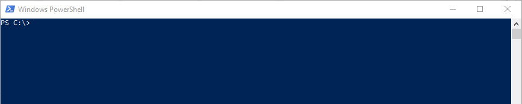
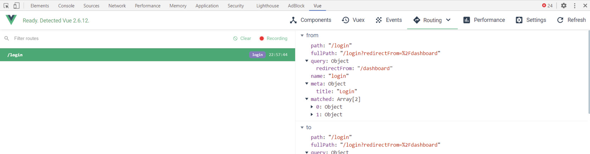

# 第三章：3. Vue CLI

概述

本章介绍了 Vue CLI，包括 Vue-UI 和 Vue.js DevTools，这些工具在开发用于生产的 Vue 应用程序时会被使用。Vue-UI 允许你通过一个伴随的图形用户界面来创建、开发和管理工作室 Vue 项目。Vue.js DevTools 是一个独立的应用程序和浏览器扩展，用于调试 Vue.js 应用程序。我们将详细介绍使用 Vue CLI 功能的使用案例和好处，这将教会你如何使用这些 Vue 命令。除了命令行控制之外，我们还将设置并运行 Vue 项目，利用新的 Vue GUI。我们将结合前几章积累的知识来创建新的 Vue 应用程序，这些应用程序使用 v-model 指令和双向绑定概念。然后我们将深入探讨如何原型化 Vue 组件。我们还将学习如何构建用于生产的 Vue 原型并在本地提供服务。随着我们的进展，你将看到如何设置和调试你的 Vue 应用程序并展示其功能。

到本章结束时，你将牢固掌握如何使用 Vue CLI 的功能、原型化 Vue 组件以及利用 Vue.js DevTools。

# 简介

在上一章中，我们介绍了如何使用 Vue.js 在组件模板中反应性地管理和操作数据。在本章中，我们将探讨如何使用 Vue CLI 支持此类模板的开发。Vue.js 利用了`npm`和 webpack 生态系统，正如在*第一章*，*开始你的第一个 Vue 项目*，*在简单的 Vue 应用程序中的 Vue 实例*示例中看到的那样。这些工具帮助开发者快速搭建和构建出色的 Web 应用程序。Vue.js 内部的一些显著模式包括**vue.config**（允许你添加 webpack 规则，而无需直接编辑 webpack 文件本身）、**双向数据绑定**和**单文件组件（SFCs）**，正如在*第一章*，*开始你的第一个 Vue 项目*，*使用 V-Model 进行双向绑定*示例中看到的那样。

使用**Vue 命令行界面（Vue CLI）**实例化的 Webpack 项目将自带热重载功能。热重载是一种前端开发模式，当检测到代码更改时，浏览器中的应用程序将自动更新。你想要这个功能的原因是，这样你不会丢失任何浏览器状态，你代码中的更改将立即反映在浏览器中，这在处理**用户界面（UI）**时非常有用。偶尔，可能需要进行完整的页面重载，因为 JavaScript 是一种非常状态化的语言。

Vue CLI 是 Vue 开发的核心工具，因为它允许程序员通过一组描述性和预配置的命令更舒适地维护他们的项目。在开发项目中，一个经常被忽视的过程是代码检查，这是一个程序将标记你代码中潜在的错误或问题的过程，这可能在现有项目中相当困难。当使用 Vue CLI 时，如果你的 webpack 项目在创建 Vue CLI 项目时选择了代码检查选项，它将自带代码检查功能。

我们将使用 Vue CLI 配置一个 Vue 项目，并运行每个基本命令，以便你了解构建 Vue 应用程序所需的工具。默认情况下，Vue CLI 支持 **Babel**、**TypeScript**、**ESLint**、**PostCSS**、**PWAs**、**测试**等。

# 使用 Vue CLI

使用 Vue CLI 工具创建的项目可以访问一些常用任务，这些任务将帮助你在本地浏览器中**运行**（运行项目）、**构建**（为生产编译文件）和**检查**（检查代码中的错误）你的项目。Vue CLI 服务开发依赖包会自动与新的项目一起安装，并允许你运行以下命令：

+   `npm run serve` 或 `yarn serve` – 在 `localhost:8080` 上运行项目代码，并具有热重载功能。端口号 `8080` 是任意指定的，因为它高于其他计算领域使用的知名端口号 `1-1023`。如果你同时运行多个 Vue 项目，它们将具有递增的端口号，例如 `:8080`、`:8081` 等。

+   `npm run build` 或 `yarn build` – 运行生产构建，减小项目文件大小，并可以从主机提供服务。

+   `npm run lint` 或 `yarn lint` – 运行代码检查过程，这将突出显示代码错误或警告，使你的代码更加一致。

现在你已经了解了 Vue CLI 是什么，以及可用的命令，我们将学习如何使用 Vue CLI 从零开始设置 Vue.js 项目。

## 练习 3.01：使用 Vue CLI 设置项目

在这个练习中，你将使用 Vue CLI 命令创建你的第一个 Vue.js webpack 项目。但是，首先，请确保你已经遵循了**前言**指南安装了 `Node` 和 `Vue CLI 4`。建议在 OS X 上使用 `iTerm2`，因为它非常适合你的开发流程。如果你使用 Windows，建议使用 **PowerShell**，因为它可能比默认的命令提示符和 GIT bash 更高效。

要访问此练习的代码文件，请参阅 [`packt.live/3ph2xXt`](https://packt.live/3ph2xXt)。

1.  打开命令提示符。你的窗口应该看起来如下：

    图 3.1：一个空的命令提示符窗口

1.  运行命令 `vue --version`。确保你使用的是 Vue CLI 的最新版本，因为以下说明在 Vue CLI 2 或更早版本中可能无法正常工作。

    在前面的命令之后，你的屏幕应该看起来如下：

    

    图 3.2：检查 Vue 版本时的命令提示符

    您的`@vue/cli`版本至少应该是 4.1.2。

1.  运行以下 Vue CLI 命令：

    ```js
    vue create my-app
    ```

    运行前面的命令后，您应该会看到一个已保存预设的列表，如下面的截图所示：

    

    图 3.3：显示已保存预设的列表

1.  通过按一次*向下箭头键*然后按*Enter*键来选择最后一个选项`Manually select features`：

    ```js
    ? Please pick a preset: (Use arrow keys)
      default (babel, eslint)
     > Manually select features
    ```

1.  您会注意到带有括号内星号的功能。每个功能代表一个您可以在您的应用程序中启用的预设。您不必知道这些代表什么。现在，我们将通过使用箭头键导航，在每个选项上按空格键，然后按*Enter*键来选择`Babel`、`CSS Pre-processors`和`Linter/Formatter`：

    ```js
    ? Check the features needed for your project:
     (*) Babel
     ( ) TypeScript
     ( ) Progressive Web App (PWA) Support
     ( ) Router
     ( ) Vuex
     (*) CSS Pre-processors
    >(*) Linter / Formatter
     ( ) Unit Testing
     ( ) E2E Testing
    ```

1.  由于您选择启用预处理器，您现在可以选择您偏好的 CSS 预处理器。在本练习中，我们将使用`Sass/SCSS (with dart-scss)`：

    ```js
    ? Pick a CSS pre-processor (PostCSS, Autoprefixer and CSS Modules are supported by default): (Use arrow keys)
    > Sass/SCSS (with dart-sass)
      Sass/SCSS (with node-sass)
      Less
      Stylus
    ```

    注意

    `dart-scss`是`Sass`库的纯 JavaScript 编译版本，与`node-sass`（它是 SCSS 的 C++实现包装器）相比，它是一个更小的依赖项，并且不需要在 Node 升级版本之间重新构建。

1.  我们现在将选择`Eslint + Prettier`选项，它将以一致的方式自动格式化代码：

    ```js
    ? Pick a linter / formatter config: (Use arrow keys)
     ESLint with error prevention only
     ESLint + Airbnb config
     ESLint + Standard config
    > ESLint + Prettier
    ```

1.  要在保存工作自动格式化代码，请选择`Lint on Save`选项：

    ```js
    ? Pick additional lint features: (Press <space> to select, <a> to toggle all, <i> to invert selection)
     >(*) Lint on save
     (*) Lint and fix on commit
    ```

    注意

    `Lint on save`是一个有用的工具，可以在编写代码时对其进行格式化。在*步骤 8*中选择两个 linting 选项，以确保您的工作在编写过程中都经过 linting，从而使代码更易于阅读和一致。

1.  接下来，我们将选择`In dedicated config files`选项，以根据我们的偏好放置配置：

    ```js
    ? Where do you prefer placing config for Babel, PostCSS,  ESLint, etc.? (Use arrow keys)
     > In dedicated config files
     In package.json
    ```

    注意

    `package.json`的一个论点是保持所有配置以 JSON 格式和在一个文件中保持一致格式。对于较小的项目，这可能是可接受的，但是大型项目往往会生成一个非常长的`package.json`文件。这就是文件拆分更可取的地方。将配置拆分到单独的文件中，在编辑这些选项时减少了认知负荷，并在提交日志中更强调正在更改的内容。例如，当您编辑`babelrc`文件时，您知道更改与 Babel 配置有关，而不是`package.json`更改，后者可能涉及任何内容。

1.  选择`Save preset (y)`选项以保存您的预设。

    您可以用任何名称调用预设。在示例中，它将被命名为`My preset`。

    下次您想要安装此预设时，尝试运行`vue create favourite -p "My preset"`（使用`vue create [project-name] -p [preset-name]`的一般命令行语法）：

    ```js
    ? Save this as a preset for future projects? Yes
    ? Save preset as: My preset
    ```

1.  运行包安装器。如果安装器没有自动启动，请运行`yarn install`命令：

    ```js
    yarn install v1.16.0
    info No lockfile found.
     [1/4] Resolving packages...
    ```

1.  一旦包安装器完成，`serve` 您的项目以编译您的代码并在 `http://localhost:8080` 上提供服务：

    ```js
    yarn serve
    ```

    如果端口 `8080` 已经被另一个应用程序占用，请使用 `--port` 标志指定另一个端口，例如 `9000`：

    ```js
    yarn serve --port 9000
    ```

    运行前面的命令，我们将看到一个默认的 Vue 项目屏幕，如图 3.4 所示：

    

图 3.4：默认的 Vue 项目屏幕将出现在您的 localhost:8080 上

在这个练习中，我们看到了如何使用命令提示符中的 Vue CLI 命令创建一个 Vue.js webpack 项目。接下来，我们将探讨如何在不创建 webpack 项目的情况下原型化一个 Vue.js 组件。

# Vue 原型化

假设，有一天你醒来，有一个关于组件的绝佳想法，或者你参与了一个大型项目，并且你想要在不复杂的现有项目依赖关系下调试组件。Vue 原型化可以帮助你创建新的组件或调试现有的组件，即使是大型项目。这是通过直接在单独且隔离的编译器中运行 `.vue` 文件来完成的，无需任何本地依赖。以这种方式运行 `.vue` 文件可能会节省时间，因为你不需要安装如 *练习 3.01* 中描述的完整 Vue 项目。相反，您只需要安装 `npm install -g @vue/cli-service-global` 或 `yarn global add @vue/cli-service-global`。

一旦安装完成，您将能够访问以下两个命令：

+   `vue serve` – 此命令编译 Vue.js 代码并在浏览器中的本地主机环境中运行。

+   `vue build` – 此命令将 Vue.js 代码编译成可分发包。

## 原型化入门

要开始，您首先需要通过打开命令终端并运行以下 `install` 命令来安装全局包：

```js
npm install -g @vue/cli-service-global
# or
yarn global add @vue/cli-service-global
```

这将生成以下截图：


图 3.5：安装 Vue 原型化所需的全局依赖

安装可能需要几分钟，具体取决于您的互联网连接速度。您将知道安装何时完成，因为您将能够在终端中编写其他命令。如果安装失败，请简单地重新打开终端并运行相同的命令。

要开始使用原型化，创建一个名为 `helloWorld.vue` 的示例组件：

```js
// helloWorld.vue
<template>
    <h1>Hello World!</h1>
</template>
```

在您的终端窗口中（与您的新的 `.vue` 文件相同的目录），使用以下命令：

```js
vue serve helloWorld.vue
```

前一个命令将显示如下：


图 3.6：vue serve 命令正在 D:\ 目录下的文件上运行

运行 `serve` 命令后，组件将在终端窗口中编译一段时间，然后才能在浏览器中访问，如下所示：

![图 3.7：vue serve 命令将在本地主机环境中提供您的 Vue 文件]


![图 3.7：vue serve 命令将在本地主机环境中提供您的 Vue 文件]

编译完成后，使用浏览器导航到命令窗口中指定的本地主机 URL。这里，它是`http://localhost:8080/`。在您的浏览器中，您应该看到文本`Hello World!`：

```js
Hello World!
```

我们现在已经学会了如何在不创建完整的 webpack 项目的情况下即时原型化 Vue 组件。让我们看看我们如何导入字体或库以在原型中使用。

## 定义您的入口点

在您的原型中，您可能需要使用外部库，如字体或脚本，以完成您的原型组件。`index.html`文件是 Vue.js HTML 模板的入口点。如果您没有定义`index.html`文件，将使用全局默认文件。

要定义自定义入口点，在相同目录下创建一个`index.html`文件。使用以下从默认索引页面派生的代码，您将看到已向`<head>`标签添加了 Google 字体：

```js
// index.html
<!DOCTYPE html>
<html lang="en">
  <head>
    <meta name="viewport" content="width=device-width,      initial-scale=1.0">
    <title>Hello World</title>
    <link ref="https://fonts.googleapis.com/css2?family=Roboto&      display=swap" rel="stylesheet">
  </head>
  <body>
    <div id="app"></div>
  </body>
</html>
```

要在您的原型组件中使用此字体，在`index.html`文件所在的同一目录下创建一个`helloWorld.vue`组件，然后对该组件应用一些`css`样式：

```js
// helloWorld.vue
<template>
    <h1>Hello World!</h1>
</template>
<style>
h1 {
  font-family: 'Roboto';
}
</style>
```

要查看对这些文件所做的更改，请在您的终端中运行以下命令：

```js
vue serve helloWorld.vue
```

这将生成以下截图：

![图 3.8：在您想要原型化的文件上运行 vue serve 命令]


![图 3.8：在您想要原型化的文件上运行 vue serve 命令]

运行`serve`命令后，组件将在浏览器可访问之前在终端窗口中进行编译，具体如下：

![图 3.9：vue serve 命令将在本地主机环境中提供您的 Vue 文件]


![图 3.9：vue serve 命令将在本地主机环境中提供您的 Vue 文件]

在您的浏览器中打开本地主机 URL。您应该会看到使用新字体格式化的文本。输出将如下所示：

```js
Hello World!
```

我们现在已经学会了如何在 Vue 组件原型中包含外部库，而无需创建完整的 webpack 项目。接下来，我们将看到如何构建一个可以托管在网站上或由您的团队外部预览的原型。

## 构建用于生产的原型

当您完成原型制作并希望与团队中的其他人分享或提交给技术负责人进行审查时，您可以导出您的代码作为可分发文件。

这意味着您的代码可以在其他机器上运行或在外部服务器上托管，而无需 Vue CLI 运行它（即`vue serve`命令）。

使用之前的示例文件进行此操作，打开您的命令终端，导航到包含您的 Vue 原型的文件夹，并运行`vue build helloWorld.vue`命令。这将生成以下输出：

![图 3.10：运行 build 命令后的终端输出]


图 3.10：运行构建命令后的终端输出

将创建一个包含你的原型编译版本的`dist`文件夹，你可以将其上传到网络主机。在`dist`文件夹内，你可以期待看到以下文件：

+   一个`index.html`文件

+   `/css`文件夹

+   `/js`文件夹

所有这些文件都是正确运行你的编译原型所必需的。如果你双击`index.html`文件，它不会加载你的应用。要在本地机器上查看或服务可分发文件，你需要一个可以服务静态网站或单页应用的库。一个名为`serve`的`npm`包就是为了这个目的而构建的。

要服务你的`dist`文件夹，通过打开命令行终端并使用以下命令全局安装`serve`包：

```js
npm install -g serve
# or
yarn global add serve
```

`serve`命令通过允许你指定要服务的目录或文件来工作：

```js
serve [path/to/serve]
```

在你的命令行终端中，确保你位于你的 Vue 原型`dist`文件夹所在的根目录。要服务此文件夹目录中的`dist`文件夹，请运行以下命令：

```js
serve dist
```

前面的命令将显示如下输出：

![图 3.11：运行 serve 命令后的终端输出]


图 3.11：运行 serve 命令后的终端输出

导航到`http://localhost:5000`，你将看到以下输出中显示的原型项目：

```js
Hello World!
```

我们现在已经学会了如何构建一个可以托管在网站上的 Vue 组件原型，以及如何在本地预览构建的文件。现在，我们将看到这些 Vue 原型概念在下一个练习中的应用。

## 练习 3.02：使用 Vue CLI 进行即时原型设计

在这个练习中，你将创建一个使用 Vue 的即时双向数据绑定的 Vue 组件。使用即时原型设计可以使你快速利用 Vue 语法，并附加热重载等好处。

要访问此练习的代码文件，请参阅[`packt.live/35kZrd3`](https://packt.live/35kZrd3)。

1.  在`Exercise 3.02`文件夹中，创建一个名为`prototype.vue`的文件。

1.  在此文件夹内打开一个命令行终端，并使用`vue serve prototype.vue`命令。

1.  使用`vue`，然后按*Tab*键以即时创建 Vue 组件结构：

    ```js
    <template>

    </template>
    <script>
    export default {
    }
    </script>
    <style>
    </style>
    ```

1.  创建一个名为`heading`的数据属性，其字符串值为`Prototype Vue Component`，然后在模板中将它包裹在`h1`标签中。在浏览器中的`localhost:8080`查看结果：

    ```js
    <template>
        <h1>{{ heading }}</h1>
    </template>
    <script>
    export default {
        data() {
            return {
                heading: "Prototype Vue Component"
            }
        }
    }
    </script>
    <style>
        h1 {
            font-family: Arial, Helvetica, sans-serif;
        }
    </style>
    ```

    前面的代码将显示如下输出：

    ```js
    Prototype Vue Component
    ```

    要为生产构建此组件，请运行`vue build prototype.vue`命令。运行此命令后，你将在原型组件所在的同一目录中生成一个`dist`文件夹，如图*图 3.12*所示：

    ![图 3.12：此练习的最终输出包含一个/dist 文件夹]

    

    图 3.12：本练习的最终输出包含一个/dist 文件夹

1.  在构建你的可分发文件后，在你的命令行终端中运行`serve dist`。然后，在你的浏览器中导航到终端中指定的 localhost URL。你将能够以以下方式查看你构建的原型：

    ```js
    Prototype Vue Component
    ```

在这个练习中，你看到了如何通过命令行运行原型化的 Vue 组件，而无需安装全新的项目。你还看到了如何将新原型构建成可分发文件，然后提供服务。接下来，我们将探讨如何使用 Vue-UI 启动和运行 Vue 应用程序。

# Vue-UI

Vue-UI 是一个图形界面，允许你控制 Vue 属性，而无需过多了解命令行的工作方式或如何配置单个文件，如`package.json`或 webpack 文件。Vue-UI 提供了对诸如`vue ui`命令等信息轻松访问。在撰写本文时，Vue-UI 仍在测试版。如果你在使用此工具时遇到任何问题，请停止命令，然后再次运行`vue ui`。

Vue-UI 可用于新项目和现有项目。通常，你会在项目开始时选择使用 Vue CLI 的预设，例如使用哪个`SCSS`编译器、测试框架或`lint`方法。使用 Vue-UI，即使是新的 Vue 开发者也可以轻松地在任何时间配置 Vue 预设，包括诸如输出目录或开启`sourcemaps`这样的晦涩的 webpack 设置。以下截图显示了`常规设置`页面：


图 3.13：在 Vue-UI 中轻松配置的项目设置

`npm`包系统非常庞大。然而，对于有经验的用户来说，导航起来相当容易。通常，有经验的开发者会通过命令行安装一个包，然后它会自动更新`package.json`文件并锁定新包。锁定的文件是记录你与项目一起提交的`npm`包所需相互依赖关系的生成记录器。Vue 有一些特定的包称为插件，这些是 Vue 的特别`npm`包，不仅会安装依赖项，通常还会以有用的方式增强你的项目。例如，如果你安装了`vue router cli`插件，它将自动在你的项目中生成一个`route.js`文件，让你更快地上手。

`Vuetify`是一个在尝试快速搭建更复杂组件或项目时非常有用的框架，它包含了许多常见的 UI 元素和组件，如按钮和输入字段，这样你就可以专注于界面而不是构建单个组件本身。如果你使用 Vue CLI 插件包安装`Vuetify`，它将自动为你设置 Vuetify。

我们现在已经了解了 Vue-UI，以及新和有经验的开发者如何使用这个工具来管理和依赖项。接下来，我们将使用 Vue-UI 来创建和运行 Vue.js 项目。

## 练习 3.03：从 Vue-UI 创建和构建新项目

在这个练习中，你将逐步学习如何使用 Vue-UI 设置和安装 Vue.js 项目。你还将被要求安装并使用`Vuetify`库作为依赖项。安装后，你将使用 Vue-UI 运行此项目，并看到 Vuetify 元素在页面上运行。

要访问此练习的代码文件，请参阅[`packt.live/35jOsAH`](https://packt.live/35jOsAH)。

1.  打开命令行终端并运行`vue ui`命令。你会看到以下屏幕：

    图 3.14：Vue-UI 中没有项目

1.  点击“创建”以启动新项目。导航到你希望安装项目的文件夹：

    图 3.15：安装项目

1.  在“项目文件夹”字段中，输入`demo-ui`，选择`yarn`作为你的包管理器，然后点击“下一步”，如图所示：

    图 3.16：Vue-UI 的项目创建界面

1.  选择“手动”，你将被带到“功能”屏幕。在此屏幕上，选择`Babel`、“CSS 预处理器”、`Linter/Formatter`和“使用配置文件”。*图 3.22*显示了选择这些选项的截图：

    图 3.17：在 Vue-UI 中为你的新项目启用功能

1.  选择“Sass/SCSS（使用 dart-sass）”预处理器和`ESLint + Prettier`配置，并启用以下截图所示的附加 lint 功能：

    图 3.18：在 Vue-UI 中为新项目启用配置选项

1.  当提示时，选择“继续不保存预设”，并等待项目安装。你应该会看到一个类似*图 3.19*的屏幕：

    图 3.19：Vue 创建和安装项目依赖时请耐心等待

1.  导航到插件页面，点击“安装依赖”，搜索`vuetify`，并安装`vue-cli-plugin-vuetify`。你可以在“依赖”页面上观察到`vuetify`已自动添加到项目依赖列表中，如下所示：

    图 3.20：依赖搜索和安装的干净界面

1.  导航到“项目任务”页面，点击`serve`任务。然后，点击以下截图所示的“运行任务”图标：

    图 3.21：serve 任务仪表板包含运行任务按钮

1.  等待 Vue 编译应用。当应用准备就绪时，点击如图 3.22 所示的“打开应用”按钮：

    图 3.22：打开应用按钮将直接带你到浏览器中的应用

    你应该在浏览器中看到你的应用，如下截图所示：

    

    图 3.23：在 http://localhost:8080 上，你应该看到一个 Vuetify 风格的页面

1.  为了将此项目准备用于生产，请回到 Vue-UI 浏览器标签页，并在“项目任务”中点击“构建”标签。点击“开始任务”按钮旁边的“参数”按钮。开启“现代模式”并确保“输出目录”设置为`dist`。“现代模式”将你的代码转换为两个版本，一个轻量级且针对现代浏览器，另一个详细且用于支持旧浏览器。这将是你编译后找到文件的地方。你的屏幕应该显示如下截图：

    图 3.24：Vue-UI 构建参数

1.  要为生产构建此项目，请点击“开始任务”按钮并让它运行。

    注意

    你不需要停止 `serve` 任务来完成此操作。

    任务完成后，你的屏幕将显示如下：

    

图 3.25：构建完成后，你将看到一个包含有用分析仪表板的控制台

在这个练习中，你看到了如何创建一个全新的项目，配置预设，使用 `serve` 任务运行一个应用，以及如何通过 Vue-UI 构建用于生产的项目。你应该足够熟悉，可以添加新的 Vue CLI 插件并管理 npm 包依赖。

# Vue.js DevTools

Vue.js DevTools 是一个适用于 Chrome 和 Firefox 的浏览器扩展，以及一个可以从你的电脑上运行的 Electron 桌面应用，可以帮助你调试本地运行的 Vue.js 项目。这些工具在生产和远程运行的项目中不起作用（例如，如果你提供了一个生产构建的项目或在线查看网站）。你可以从 Chrome 扩展页面下载 Vue.js DevTools 扩展，如下截图所示：


图 3.26：Vue.js DevTools Chrome 扩展页面

你也可以从 Firefox 下载 Vue.js DevTools 扩展（[`addons.mozilla.org/en-US/firefox/addon/vue-js-devtools/`](https://addons.mozilla.org/en-US/firefox/addon/vue-js-devtools/))：


图 3.27：Vue.js DevTools Firefox 扩展页面

DevTools 是 Vue 开发者的最佳伴侣，因为它们将在浏览器的开发者控制台中揭示您通常不会看到的有用信息。这包括 Vue 组件加载性能和跟踪 Vue 应用程序运行期间触发的事件。有几个选项卡，我们现在将查看。

`组件` 选项卡帮助您导航虚拟 `< > 检查 DOM`，这将直接带您到 Chrome 或 Firefox DOM 树中该组件的位置。使用以下 *图 3.28* 中的“选择”目标图标（左面板右上角）直接从浏览器 UI 中选择 Vue 元素。

您的屏幕应该看起来如下：


图 3.28：Vue.js DevTools 中的组件选项卡

`Vuex` - 使用此选项卡，您可以导航 Vuex 的全局状态。您将看到 Vuex 存储中发生的突变记录，如下所示：


图 3.29：Vue.js DevTools 中的 Vuex 选项卡

关于这一点，将在未来的章节中详细介绍。

`事件` – 使用此选项卡，您可以导航从您的组件中发出的自定义事件。关于这一点，将在未来的章节中详细介绍。默认情况下，事件将记录如下截图所示：


图 3.30：Vue.js DevTools 中的事件选项卡

`路由` – 使用此选项卡，您可以在该面板中观察路由历史和事件。关于这一点，将在未来的章节中详细介绍。当路由事件发生时，它们将记录如下截图所示：



图 3.31：Vue.js DevTools 中的路由选项卡

`性能` – 使用此选项卡，您可以在应用程序运行时导航到记录组件帧率和渲染时间的性能区域，以优化最终用户体验。当您点击“开始”按钮以收集性能指标时，它们将以蓝色条的形式显示，如下截图所示：


图 3.32：Vue.js DevTools 中的性能选项卡

*图 3.32* 中的蓝色柱状图表示加载时间（毫秒）。

`设置` – 使用此选项卡，您可以自定义 Vue.js DevTools 的体验，如下截图所示。对于新开发者，默认设置无需更改：


图 3.33：Vue.js DevTools 中的设置选项卡

`刷新` – 点击此按钮将刷新浏览器中的 Vue.js DevTools 实例。

我们现在已经了解了 Vue.js DevTools，这将帮助你在开发下一个 Vue 应用程序的组件时。接下来，我们将构建一个 Vue 组件，并使用 Vue.js DevTools 来检查代码并操作组件内部的数据本地状态。

## 练习 3.04：使用 DevTools 调试 Vue 应用程序

在这个练习中，你将构建一个使用你在前几章中探索的几个 Vue.js 模式的组件，并且你将使用 DevTools 来探索这些模式。确保你正在使用 Chrome 或 Firefox，并且已安装 DevTools。你将使用 Vue.js DevTools 来检查代码并操作组件内部的数据本地状态。

要访问此练习的代码文件，请参阅[`packt.live/3eLIcVe`](https://packt.live/3eLIcVe)。

1.  导航到`Exercise3.04`项目文件夹，并在 VS Code 中打开它。在你的命令提示符中，通过运行`yarn`命令安装所需的脚本。

1.  在`yarn`使用的相同命令提示符中，运行项目使用`yarn serve`。

1.  在你的浏览器中导航到`localhost:8080`，以便你可以查看以下步骤中做出的更改。

1.  在`App.vue`中创建响应式数据，通过添加一个数据属性`frameworkList`，填充一个字符串数组，以及一个值为空字符串的`input`属性：

    ```js
    <script>
    export default {
      data() {
        return {
          frameworkList: [
            'Vue',
            'React',
            'Backbone',
            'Ember',
            'Knockout',
            'jQuery',
            'Angular',
          ],
          input: '',
        }
      },
    }
    </script>
    ```

1.  接下来，创建一个名为`computedList`的计算属性，用于使用`input`属性值筛选`frameworkList`属性：

    ```js
      ...
      computed: {
        computedList() {
          return this.frameworkList.filter(item => {
            return item.toLowerCase().includes(this.input.          toLowerCase())
          })
        },
      },
      ...
    ```

1.  在 Vue 的`template`块中，添加一个使用 v-model 绑定到`input`数据属性并循环`computedList`的`input`字段。添加一些样式（可选）：

    ```js
    <template>
      <div id="app" class="container">
        <h1>Vue devtools debugging</h1>
        <input type="text" placeholder="Filter list" v-model=      "input" />
        <ul>
          <li v-for="(item, i) in computedList" :key="i">{{ item }}
          </li>
        </ul>
      </div>
    </template>
    <style lang="scss" scoped>
    #app {
      font-family: Avenir, Helvetica, Arial, sans-serif;
      -webkit-font-smoothing: antialiased;
      -moz-osx-font-smoothing: grayscale;
      text-align: center;
      color: #2c3e50;
      margin-top: 60px;
    }
    ul {
      max-width: 200px;
      margin: 0 auto;
      list-style: none;
      padding: 0;
      > li {
        background: #42b983;
        color: white;
        padding: 6px;
        border-radius: 6px;
        margin-bottom: 2px;
        max-width: 200px;
      }
    }
    input {
      padding: 10px 6px;
      margin: 20px 10px 10px 10px;
    }
    </style>
    ```

    上述代码将生成以下截图：

    

    图 3.34：检查点 – 你的列表是可筛选的

1.  在你的浏览器中，你可以查看你的应用，*右键点击*并选择`Inspect`以打开开发者控制台或使用快捷键 *Ctrl* + *Shift* + *J*（Mac 用户：*Cmd* + *Shift* + *J*）并导航到`Vue`标签。这将生成以下截图：

    图 3.35：Vue.js DevTools 的 Chrome 扩展

1.  默认情况下，你将在`Components`标签中。选择`Anonymous Component`以检查与该组件关联的数据。点击到`Filter list`输入字段并输入`V`。你会观察到两个事情发生：在右侧面板中，数据属性`input`现在具有值`V`和计算列表。`computedList`现在只包含字符串`Vue`。在浏览器中，这些数据将在 UI 中反映出来，如*图 3.36*所示：

    图 3.36：Vue.js DevTools 的 Chrome 扩展

1.  通过点击 `输入` 属性旁边的 `铅笔` 图标直接在右侧面板中编辑数据，并输入 `R`。DOM 将响应式地更新，如以下截图所示，这是从 DevTools 直接更改输入属性所做的直接更改：

    图 3.37：在您的 Vue 项目中编辑实时值非常简单

    在更改 Vue.js DevTools 中的值后，UI 中的值将响应式地改变，在这个例子中，输入值现在是 `R`，然后触发响应式的 `computedList` 数组只显示包含字母 `r` 的值，如 *图 3.38* 所示：

    

    图 3.38：计算列表更新到 DevTools 中写入的值

1.  前往 `性能` 选项卡，点击 `组件渲染` 开关，然后点击 `开始` 按钮。当它运行时，在输入框中输入几个项目，例如 `A`，然后 `B`，然后 `V`。当您在输入框中输入文本时，您将看到性能指标作为蓝色条形，如下面的截图所示：

    图 3.39：计算列表更新到 DevTools 中写入的值

1.  点击 `停止` 并观察 `组件渲染` 选项卡中的 `毫秒` 计时，这反映了您的组件加载所需的时间，如下面的截图所示：

图 3.40：在右侧面板中选择组件将打开左侧的生命周期钩子

注意

重复测试将允许您比较基准，然而，如果您刷新页面，您将丢失它们。

在这个练习结束时，您已经看到了如何使用 Vue.js DevTools 通过 `组件` 选项卡导航 Vue 应用程序中的基本组件。您知道如何在 DevTools 中观察和编辑数据，因为您已经看到计算属性会响应您的数据属性更改。您知道 `性能` 选项卡在哪里，以及如何在创建 Vue 应用程序时使用它。

## 活动 3.01：使用 Vue-UI 和 Vuetify 组件库构建 Vue 应用程序

在这个活动中，您将使用命令行构建一个 Vue 项目，然后将其导入到 Vue-UI 中，并比较安装 Vuetify 之前后的构建大小。这将测试您控制可用的各种 Vue 工具的能力，并突出您在实际场景中使用这些工具的情况。

以下步骤将帮助您完成活动：

1.  使用 Vue CLI 创建一个新的项目，并使用 Babel 预设。

1.  使用 Vue-UI 导入您新创建的项目。

1.  使用 VueUI 安装 `Vuetify` 插件，并在项目中使用 Vuetify 的 Vue 组件。

1.  从 Vuetify 网站复制一个预制的布局，或者使用他们的组件构建自己的布局：[`vuetifyjs.com/en/getting-started/pre-made-layouts`](https://vuetifyjs.com/en/getting-started/pre-made-layouts)。

预期结果如下：


图 3.41：最终结果

这个活动还有一个可切换的菜单，如图 3.42 所示：


图 3.42：显示可切换菜单的输出

注意

这个活动的解决方案可以通过这个链接找到。

活动完成后，你应该能够使用 Vue CLI 和 Vue-UI 来管理你未来的 Vue 项目。你会发现，在某些情况下，这两个工具可以互换使用，或者根据你更舒适的方式结合使用。

# 摘要

在本章中，你被介绍了多种 Vue.js 工具，这些工具可以帮助你维护和管理你的 Vue 应用程序。你从命令行和新的 Vue-UI 创建了 Vue.js 项目，安装了新的依赖项，并从这两个界面中提供了服务和构建了你的项目。你可以一起使用这些工具或单独使用—— whichever you feel more comfortable with。Vue.js DevTools 拥有许多提高生活质量的特性，这些特性将帮助你通过本书的高级部分，并在你开始在组件和路由页面之间传递 props 时提供帮助。

在下一章中，你将学习更多高级的 Vue 组件概念，例如通过使用数据 props 和模板插槽在不同组件之间传递和验证信息。
