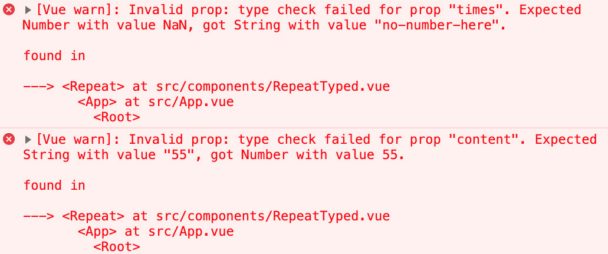
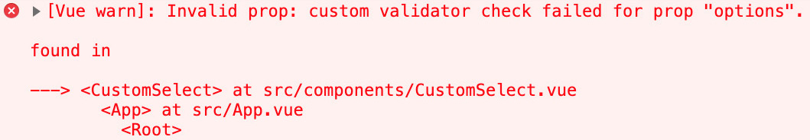
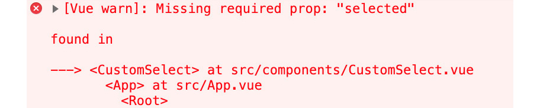
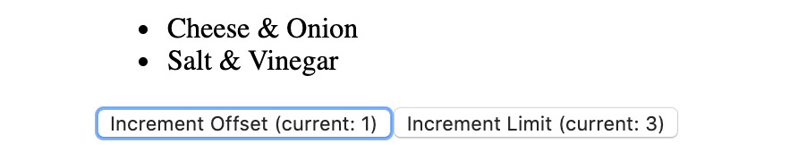
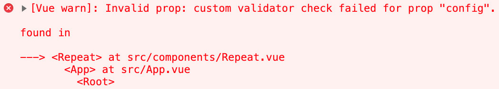
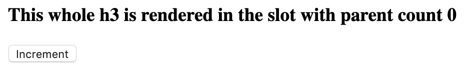
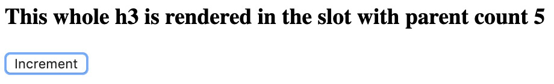
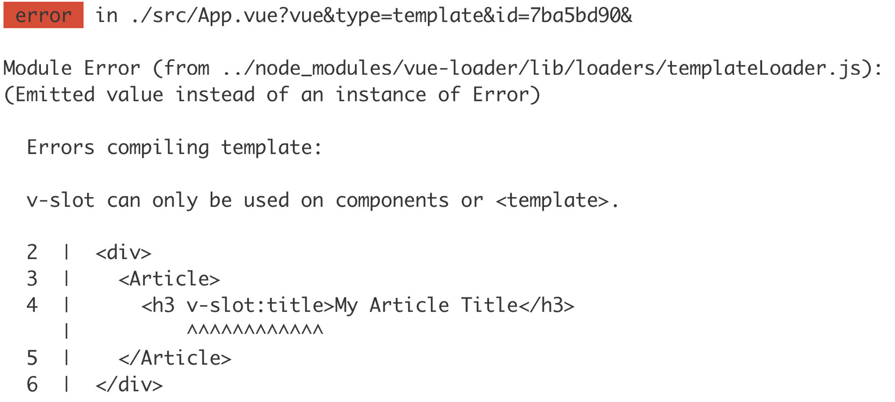
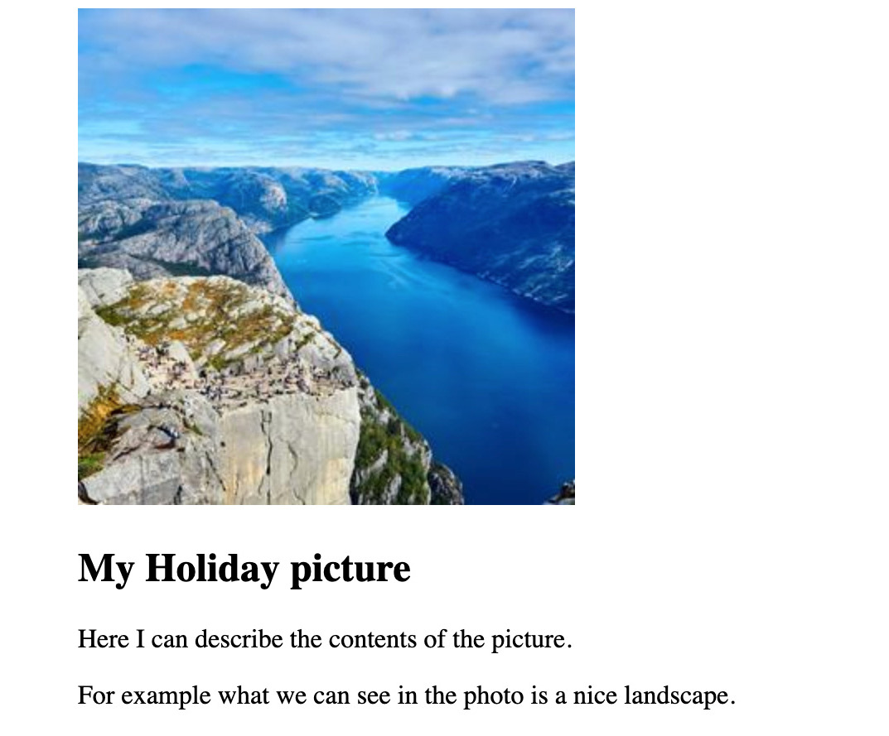
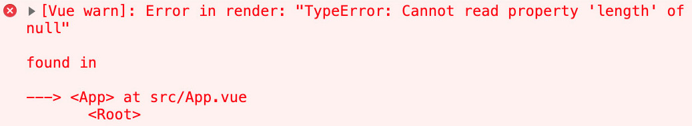

# 第四章：4. 组件嵌套（模块化）

概述

在本章中，你将发现如何使用组件层次结构和嵌套来模块化 Vue.js 应用程序。本章介绍了 props、events、prop 验证和 slots 等概念。你将学习如何对比它们并根据情况确定应该应用哪个概念。然后，你将练习实现一个使用 refs 封装直接 DOM 操作的组件。你还将学习如何识别可以使用 slots、命名 slots 和作用域 slots 的组件组合场景。然后，你将确定何时将功能抽象为过滤器。

到本章结束时，你将能够使用 props、events 和验证器定义组件之间的通信接口。你将接触到如何将 JavaScript 库作为 Vue.js 组件封装以及在使用组件时 Vue.js 上下文的潜在问题。

# 简介

在上一章中，我们学习了如何初始化、构建和调试一个简单的 Vue.js 应用程序。在本章中，我们将更深入地了解如何利用组件组合来实现代码重用。

可重用和可扩展的组件是围绕组件库构建产品的核心。组件库允许团队以高速度和高一致性构建项目。

如果 Vue.js 中的组件库没有暴露正确的扩展点，通常会发生的情况是将库中的组件复制到应用程序的代码库中。这导致了代码的重复和从设计角度的凝聚力降低。

在 *第三章*，*Vue CLI* 中，我们学习了如何在 Vue 中创建简单组件。组件是 Vue 实例，可以被实例化和渲染多次。由于只能有一个根组件，应用程序中的大多数组件都是由另一个组件渲染的。为了使父组件与其子组件通信，我们使用 props 和 prop 传递。

# 传递 Props

`this`) 并在组件的 `template` 中。

prop 的值取决于父组件在渲染时传递给子组件的 `template` 中的内容。

## 定义一个接受 Props 的简单组件

让我们看看一个简单的 `Hello` 单文件组件。这可以在 `./src/components/Hello.vue` 文件中找到（在一个 *Vue CLI 生成的* 项目中）。注意 `who` 值是如何在 `props` 数组中设置的，并且它是通过使用 `{{ who }}` 作为值进行插值的。Vue.js 组件的 `props` 属性可以是字符串数组或对象字面量。

当在 `props` 中定义一个值时，它随后在 Vue.js 组件的 `template` 部分作为一个实例变量可访问：

```js
<template>
  <div>
    <h1>Hello {{ who }}</h1>
  </div>
</template>
<script>
export default {
  props: ['who']
}
</script>
```

现在，我们将学习如何使用 props 渲染组件。

## 使用 Props 渲染组件

接下来是一个如何在我们 Vue.js 应用程序中使用 `Hello` 组件的演示。

首先，我们需要导入，然后将其设置在想要渲染此导入组件的 Vue.js 组件的 `components` 属性中。

然后，在`template`部分，我们需要将`<Hello>`渲染出来，并将`who`属性设置为`"Vue.js"`，如下所示：

```js
<template>
  <div id="app">
    <Hello who="Vue.js"/>
  </div>
</template>
<script>
import Hello from './components/Hello.vue'
export default {
  components: {
    Hello
  }
}
</script>
```

这将在页面上渲染以下内容：

```js
Hello Vue.js
```

我们现在已经看到了如何在 Vue.js 应用程序中使用组件并通过 props 传递它。这对于代码重用和将应用程序行为抽象为组件大小的块非常有用。

接下来，我们将学习如何与已注册的组件一起工作。

## 组件注册技巧

关于`components`属性，有几个需要注意的事项。

已注册的组件既可以用`CamelCaseName`格式，也可以用`kebab-case-name`格式，因此如果我们把前一个示例中的模板部分改为使用`<hello />`而不是`<Hello />`，它将无任何问题地工作：

```js
<template>
  <div id="app">
    <hello who="Vue.js"/>
  </div>
</template>
```

更新的模板在浏览器中渲染相同的内容，如下所示输出：

```js
Hello Vue.js
```

`components`属性倾向于使用 ES6 简写属性语法。简写属性语法意味着我们不需要写`{ Hello: Hello }`，而是可以写`{ Hello }`。我们可以在以下示例中看到它的实际应用，该示例注册了`Hello`组件：

```js
import Hello from './components/Hello.vue'
export default {
  components: {
    Hello
  }
}
```

Vue 的`components`声明不知道组件的名称。它使用`components`对象中的键来注册，无论是驼峰式还是短横线命名法：

```js
<template>
  <div id="app">
    <Hey who="Vue.js"/>
  </div>
</template>
<script>
import Hello from './components/Hello.vue'
export default {
  components: {
  Hey: Hello
  }
}
</script>
```

上述代码将生成以下输出：

```js
Hello Vue.js
```

我们现在已经学会了如何在 Vue.js 中使用`components`属性和 ES6 简写对象属性语法来注册组件。

接下来，我们将查看一个`Greeting`组件的实际示例。

## 练习 4.01：实现问候组件

利用我们对如何从父组件向子组件传递 props 的知识，我们将创建一个组件，允许你自定义问候语（例如，`Hello`、`Hey`或`Hola`）以及被称呼的对象（例如，`World`、`Vue.js`或`JavaScript 开发者`）。

要访问此练习的代码文件，请参阅[`packt.live/35jGd7B`](https://packt.live/35jGd7B)。

按照以下步骤完成这个练习：

1.  在`./src/components`目录下创建一个名为`Greeting.vue`的新文件。这将是我们单文件组件。

1.  首先，用空的`template`和`script`标签搭建组件的框架：

    ```js
    <template>
      <div>Empty</div>
    </template>
    <script>
    export default {}
    </script>
    ```

1.  接下来，我们需要告诉 Vue.js 我们的组件期望 props。为此，我们将在组件定义（在`script`部分的`export default`设置的 object）中添加一个`props`属性，并向其中添加一个`greeting`和`who`属性：

    ```js
    export default {
      props: ['greeting', 'who']
    }
    ```

1.  现在，我们想要渲染`greeting`和`who`。正如我们所见，当在`props`中定义值时，它们在`template`的最高级别中可用：

    ```js
    <template>
      <div>{{ greeting }} {{ who }}</div>
    </template>
    ```

    我们现在可以渲染`App.vue`中的`Greeting`组件。

1.  打开`src/App.vue`文件，并将`Greeting`组件从`./src/components/Greeting.vue`导入到`script`部分：

    ```js
    <script>
    import Greeting from './components/Greeting.vue'
    </script>
    ```

1.  接下来，在`components`中注册`Greeting`组件：

    ```js
    <script>
    export default {
      components: {
        Greeting
      }
    }
    </script>
    ```

1.  现在组件已经注册，我们可以在`template`中渲染它：

    ```js
    <template>
      <div id="app">
        <Greeting greeting="Hey" who="JavaScript"/>
      </div>
    </template>
    ```

    你将在浏览器中看到以下内容（确保你在 `Exercise4.01` 目录中运行了 `npm install` 和 `npm run serve`）：

    ```js
    Hey JavaScript
    ```

1.  使用 `template` 中的属性值修改 `greeting` 和 `who` 属性：

    ```js
    <template>
      <div id="app">
        <Greeting greeting="Hi" who="Everyone"/>
      </div>
    </template>
    ```

    运行前面的代码后，你应该在浏览器中看到以下类似的输出（确保你在 `Exercise4.01` 目录中运行了 `npm install`，然后运行 `npm run serve`）：

    ```js
    Hi Everyone
    ```

在这个练习中，我们学习了如何使用属性和属性传递来通过泛化组件来增加组件的重用场景。组件不是渲染静态数据，而是其父组件传递数据以进行渲染。

在下一节中，我们将学习如何动态设置属性值。

## 动态属性与数据绑定

我们到目前为止看到的示例都使用了硬编码的属性值作为属性。但如果我们想从父组件传递实例数据到子组件怎么办？

这就是 `v-bind:` 的用法，但你也可以使用 `:` 作为缩写；它们是等价的。

`Greeting` 组件的 `who` 属性绑定到 `appWho` 应用组件的实例属性：

```js
<template>
  <div id="app">
    <Hello v-bind:who="appWho"/>
  </div>
</template>
<script>
import Hello from './components/Hello.vue'
export default {
  components: {
    Hello
  },
  data() {
    return {
      appWho: 'Vue.js'
    }
  }
}
</script>
```

简写形式下，`template` 将如下所示：

```js
<template>
  <div id="app">
    <Hello :who="appWho"/>
  </div>
</template>
```

两种版本都将输出以下视图到浏览器：

```js
Hello Vue.js
```

注意

`v-bind:prop-name` 和 `:prop-name` 有惊人的相似之处，因为 `v-bind` 和 `prop-name` 之间的分隔符是 `:`（一个分号）。在 Vue.js 单文件组件中，由于模板在构建时编译，它们在功能上是等价的。

以下是一个示例，展示如何将值从父组件（`App`）传递到子组件（`Hello`），其中包含两个按钮，用于更改 `Hello` 消息的受众。

按钮调用一个名为 `setWho` 的组件方法，`setWho` 函数更新 `appWho` 实例属性：

```js
<template> 
  <div id="app">
    <Hello :who="appWho"/>
    <button @click="setWho('JavaScript')">JavaScript</button>
    <button @click="setWho('Everyone')">Everyone</button>
  </div>
</template>
<script>
import Hello from './components/Hello.vue'
export default {
  components: {
    Hello
  },
  data() {
    return {
      appWho: 'Vue.js'
    }
  },
  methods: {
    setWho(newWho) {
      this.appWho = newWho
    }
  }
}
</script>
```

初始输出到浏览器的显示为 `Hello Vue.js`，如下面的截图所示：


图 4.1：浏览器中初始的 Hello Vue.js 输出

当点击 `JavaScript` 按钮，`appWho` 变量更新，绑定的 `Hello` 组件的 `who` 属性也会更新。因此，显示为 `Hello JavaScript`，如下所示：


图 4.2：点击 JavaScript 按钮后的 Hello JavaScript

当点击 `Everyone` 按钮，`appWho` 变量更新，绑定的 `Hello` 组件的 `who` 属性也会更新。因此，显示为 `Hello Everyone`，如下所示：


图 4.3：点击 Everyone 按钮后的 Hello Everyone

我们现在已经看到了如何将属性绑定到值，以便它们保持同步。

大多数 Vue.js 应用程序利用组件不仅用于模块化渲染组件（正如我们在 `Greeting` 和 `Hello` 组件中所做的那样），还用于其他方面。

正如我们所看到的，我们能够绑定属性，以便对父组件中任何值的更新都会导致子组件的更新。

## 使用`Greeting`组件渲染当前的`greeting`和`who`：

到目前为止，应用程序在浏览器中应显示相同的问候语，如下面的输出所示：

要访问此练习的代码文件，请参阅[`packt.live/3kovKfo`](https://packt.live/3kovKfo)。

让我们重构`data`方法，使其只存储默认索引并创建查找索引以生成基于当前索引的`greeting`和`who`的计算属性（使用中间的`currentGreeting`计算属性）：

1.  浏览器将显示一条消息，如下所示（确保你在`Exercise4.02`目录中运行了`npm install`和`npm run serve`）：

    ```js
    <template>
      <div>{{ greeting }} {{ who }}</div>
    </template>
    <script>
    export default {
      props: ['greeting', 'who']
    }
    </script>
    ```

1.  在`./src/App.vue`组件中，将`./src/components/Greeting.vue`导入为`Greeting`组件，并注册为组件，以便你可以渲染它：

    ```js
    <script>
    import Greeting from './components/Greeting.vue'
    export default {
      components: {
        Greeting
      }
    }
    </script>
    ```

1.  在`script`部分，创建一个返回初始`greeting`和`who`的顶级`data`方法：

    ```js
    export default {
      data() {
        return {
          greeting: 'Hello',
          who: 'Vue.js'
        }
      }
    }
    ```

1.  图 4.5：在 3n + 1 次按钮点击后“嘿，大家好”

    ```js
    <template>
      <div id="app">
        <Greeting :greeting="greeting" :who="who"/>
      </div>
    </template>
    ```

    要知道使用哪个问候语，我们将实现一个具有多个问候语并遍历它们的**greeter**应用程序。

    在初始加载和点击`New Greeting`按钮的`3n`次之后，应用程序显示`Hello Vue.js`，如下面的截图所示：

    ![图 4.4：在 3n 次按钮点击后“你好，Vue.js”]

1.  注意

    ```js
    <script>
    // imports
    const possibleGreetings = [
        { greeting: 'Hello', who: 'Vue.js' },
        { greeting: 'Hey', who: 'Everyone' },
        { greeting: 'Hi', who: 'JavaScript' }
    ]
    // components export
    </script>
    ```

1.  由于计算属性可以清理代码，我们不需要更新我们的模板。相反，我们用同名的计算属性替换了`greeting`和`who`实例属性。

    ```js
    <script>
    // imports and greetings
    export default {
      // components definition
      data() {
        return {
          currentIndex: 0
        }
      },
      computed: {
        currentGreeting() {
          return possibleGreetings[this.currentIndex]
        },
        greeting() {
          return this.currentGreeting.greeting
        },
        who() {
          return this.currentGreeting.who
        }
      }
    }
    </script>
    ```

    图 4.4：在 3n 次按钮点击后“你好，Vue.js”

    ```js
    Hello Vue.js
    ```

    ![图 4.6：在 3n + 2 次按钮点击后“嗨，JavaScript”]

    我们现在需要在`script`部分实现`newGreeting`。`newGreeting`应该移动到下一个问候语（通过增加`currentIndex`）。或者，如果我们已经到达了`possibleGreetings`数组的末尾，它应该重置`currentIndex`：

1.  让我们添加一种遍历这些`问候语`的方法。这需要有一个按钮，点击后会在我们的`template`中调用一个`newGreeting`函数：

    ```js
    <template>
      <div id="app">
        <Greeting :greeting="greeting" :who="who"/>
        <button @click="newGreeting()">New Greeting</button>
      </div>
    </template>
    ```

1.  注意

    ```js
    <script>
      // imports and greetings
    export default {
        // other component properties
      methods: {
        newGreeting() {
          this.currentIndex = this.currentIndex ===         possibleGreetings.length – 1
            ? 0
            : this.currentIndex + 1
        }
      }
    }
    </script>
    ```

    创建一个`./src/components/Greeting.vue`组件，并用我们之前实现的`Greeting`组件初始化它。这就是我们将显示问候语的方式：

    注意

    以下代码需要你了解我们已在*第二章*，*与数据一起工作*中介绍的计算属性。如果你需要复习，现在请回到那一章。

练习 4.02：传递随时间变化的属性

在第一次点击和点击`New Greeting`按钮的`3n + 1`次之后，应用程序显示`Hey Everyone`，如下所示：

![图 4.5：在 3n + 1 次按钮点击后“嘿，大家好”]

![图 4.4：在 3n 次按钮点击后“你好，Vue.js”]

按照以下步骤完成此练习：

在第二次点击和点击`New Greeting`按钮的`3n + 2`次之后，应用程序显示`Hi JavaScript`，如下所示：

我们现在将一些`greeting/who`配对作为数组添加到`script`部分：

![图 4.6：在 3n + 2 次按钮点击后“嗨，JavaScript”]

图 4.6：在 3n + 2 次按钮点击后说“Hi JavaScript”

注意

这段代码可以进一步改进；例如，`possibleGreetings.length - 1`是常量，因为我们从未添加或删除问候语。我们可以在`newGreeting`方法之外，仅计算一次，而不是在每次`newGreeting`调用时计算。读取数组的长度和简单的算术（`-1`）并不太昂贵，但这是对可变值与常量值思考方式的好复习。

通过这样，我们已经看到了如何使用属性和属性绑定来从父组件向它们渲染的子组件传递变化的数据。为了扩展代码库或广泛共享代码，当用户使用代码不正确时，给出提示是有帮助的。

接下来，我们将学习如何为组件的属性添加类型提示以确保它们被正确使用。

# 属性类型和验证

**属性**定义了 Vue.js 组件的接口。由于 JavaScript 是一种动态类型语言，Vue.js 提供了一个我们可以用来验证属性形状和类型的工具。

要验证属性类型，应使用其对象字面量形式的`props`组件属性（而不是更简单的数组形式）。

## 原始属性验证

假设我们想要一个`Repeat.vue`组件，它接受一个`times`属性，以及一个`content`属性。我们可以定义以下内容：

```js
<template>
  <div>
    <span v-for="r in repetitions" :key="r">
      {{ content }}
    </span>
  </div>
</template>
<script>
export default {
  props: ['times', 'content'],
  computed: {
    repetitions() {
      return Array.from({ length: this.times });
    }
  }
}
</script>
```

我们的`Repeat`组件可以这样使用：

```js
<template>
  <div id="app">
    <Repeat :times="count" content="Repeat." />
    <button @click="increment()">Repeat</button>
  </div>
</template>
<script>
import Repeat from './components/Repeat.vue'
export default {
  components: {
    Repeat
  },
  data() {
    return { count: 1 }
  },
  methods: {
    increment() {
      this.count += 1
    }
  }
}
</script>
```

上述代码将在浏览器中产生以下输出：

![图 4.7：重复示例动作输出（无点击）]


图 4.7：重复示例动作输出（无点击）

点击`Repeat`按钮几次后，`Repeat`组件将每次点击额外重复一次，生成如下输出：

![图 4.8：重复示例在点击五次后的输出]


图 4.8：重复示例在点击五次后的输出

为了使该组件正常工作，我们需要`times`是一个`Number`类型，理想情况下`content`是一个`String`类型。

注意

现在是提醒学生 JavaScript 原始类型的好时机：`String`、`Number`、`Boolean`、`Array`、`Object`、`Date`、`Function`和`Symbol`。

Vue.js 支持在`props`字段中使用所有 JavaScript 原始类型构造函数作为类型提示。

在这种情况下，我们将`times`属性定义为`Number`类型，将`content`属性定义为`String`类型：

```js
<script>
export default {
  props: {
    times: {
      type: Number
    },
    content: {
      type: String
    }
  },
  // rest of component definition
}
</script>
```

要使用此组件，我们可以更新`script`部分如下：

```js
<script>
import Repeat from './components/RepeatTyped.vue'
// no other changes
</script>
```

当`times`和`content`分别是`Number`和`String`类型时，组件的行为仍然相同。

如果我们更新`App`使其故意传递错误类型的属性。在这种情况下，`times`是一个`String`类型，而`content`是一个`Number`类型。

```js
<template>
  <div id="app">
    <Repeat :times="count" :content="55" />
  </div>
</template>
<script>
// no changes to imports
export default {
  data() {
    return { count: 'no-number-here' }
  },
  // other properties
}
</script>
```

在这里，`Repeat`组件将无法渲染，以下错误将被记录到控制台：

![图 4.9：Vue.js 属性输入错误示例]



图 4.9：Vue.js 属性输入错误示例

`times` 属性检查失败，消息解释说我们传递了一个本应为 `Number` 的 `String` 属性：

```js
Invalid prop: type check failed for prop "times". Expected Number with value NaN, got String with value "no-number-here"
```

`content` 属性检查失败，消息解释说我们传递了一个本应为 `String` 的 `Number` 属性：

```js
Invalid prop: type check failed for prop "content". Expected String with value "55", got Number with value 55
```

注意

根据 Vue.js 文档，*null 和 undefined 值将通过任何类型验证*，这意味着类型验证并不是万无一失的，因此为组件添加自定义验证是有意义的。

## 联合和自定义属性类型

在前面的例子中，我们只是渲染了内容，所以类型是什么并不重要。

Vue.js 支持联合类型。联合类型是一种可以是许多其他类型之一的类型。例如，`String` 或 `Number` 是联合类型。

在 Vue.js 中，联合类型使用数组来表示属性 `type` 属性，例如，为了支持 `content` 作为数字和字符串：

```js
<script>
export default {
  props: {
    // other prop definitions
    content: {
      type: [String, Number]
    }
  }
  // rest of component definition
}
</script>
```

在这种情况下，我们可以无错误地消费 `RepeatTyped` 组件，如下所示：

```js
<template>
  <div id="app">
    <Repeat :times="3" :content="55" />
  </div>
</template>
```

这会显示 `55` 三次。在这里，`55` 被作为 `Number` 传递，而我们的组件现在支持这一点。这可以在以下输出中看到：

```js
55 55 55
```

任何有效的构造函数都可以用作属性类型。例如，`Promise` 或自定义的 `User` 构造函数可以用来。在以下示例中，我们定义了一个 `TodoList` 组件属性接口：

```js
<script>
import User from './user.js'
export default {
  props: {
    todoListPromise: {
      type: Promise
    },
    currentUser: {
      type: User
    }
  }
}
</script>
```

该组件公开的属性接口可以如下使用：

```js
<template>
  <div>
    <template v-if="todosPromise && !error">
      <TodoList
        :todoListPromise="todosPromise"
        :currentUser="currentUser"
      />
    </template>
    {{ error }}
  </div>
</template>
<script>
import TodoList from './components/TodoList.vue'
import User from './components/user.js'
const currentUser = new User()
export default {
  components: {
    TodoList
  },
  mounted() {
    this.todosPromise = fetch('/api/todos').then(res => {
      if (res.ok) {
        return res.json()
      }
      throw new Error('Could not fetch todos')
    }).catch(error => {
      this.error = error
    })
  },
  data() {
    return { currentUser, error: null }
  }
}
</script>
```

我们已经看到了如何使用 `union` 和 `custom` 类型来验证 Vue.js 属性。

注意

Vue.js 在内部使用 `instanceof`，所以请确保任何自定义类型都是使用相关构造函数实例化的。

传递 `null` 或 `undefined` 将会失败 `instanceof` 对 `Array` 和 `Object` 的检查。

传递一个数组将通过 `instanceof` 对 `Object` 的检查，因为在 JavaScript 中，`Array` 实例也是 `Object` 实例。

## 使用验证器进行数组的自定义验证、对象形状等

Vue.js 允许使用 `validator` 属性将自定义验证器用作属性。这允许我们实现有关对象和数组形状的深度检查，作为原始类型的自定义逻辑。

为了说明这一点，让我们看看一个 `CustomSelect` 组件。在基本层面上，`select` 的属性接口包括一个 `options` 数组和一个 `selected` 选项。每个选项应该有一个 `label`，表示在选择中显示的内容，以及一个 `value`，它对应于传递给 API 的值。例如，`selected` 选项可以是空的，或者应该对应于 `options` 中的一个 `value` 字段。

我们可以将 `CustomSelect` 以以下简单方式实现（不验证输入）：

```js
<template>
  <select>
    <option
      :selected="selected === o.value"
      v-for="o in options"
      :key="o.value"
    >
      {{ o.label }}
    </option>
  </select>
</template>
<script>
export default {
  props: {
    selected: {
      type: String
    },
    options: {
      type: Array
    }
  }
}
</script>
```

然后，`CustomSelect` 可以用来显示 `src/App.vue` 中的列表）：

```js
<template>
  <div id="app">
    <CustomSelect :selected="selected" :options="options" />
  </div>
</template>
<script>
import CustomSelect from './components/CustomSelect.vue'
export default {
  components: {
    CustomSelect
  },
  data() {
    return {
      selected: 'salt-vinegar',
      options: [
        {
          value: 'ready-salted',
          label: 'Ready Salted'
        },
        {
          value: 'cheese-onion',
          label: 'Cheese & Onion'
        },
        {
          value: 'salt-vinegar',
          label: 'Salt & Vinegar'
        },
      ]
    }
  }
}
</script>
```

前面的应用程序输出了一个选择，其中 `Salt & Vinegar` 是默认选中选项，如下面的截图所示：

![图 4.10：折叠的 CustomSelect，选择了 Salt & Vinegar]


图 4.10：折叠的 CustomSelect，选择了 Salt & Vinegar

以下截图显示了三种口味选项，其中一个是被选中的：


图 4.11：打开带有口味选项和盐味芥末的 CustomSelect

为了进一步验证我们关于形状选项的业务逻辑，我们可以实现以下属性验证器：

```js
<script>
export default {
  // other component properties
  props: {
    // other prop definitions
    options: {
      type: Array,
      validator(options) {
        return options.every(o => Boolean(o.value && o.label))
      }
    }
  }
}
</script>
```

如果我们传递一个缺少`value`或`label`的选项，我们将在控制台得到以下消息：



图 4.12：当自定义验证器失败时 Vue.js 的警告

通过这些，我们已经学习了如何使用自定义 Vue.js 验证器对复杂属性进行深入检查。接下来，我们将学习`required`属性类型属性是如何工作的。

## 必需属性

要将 Vue.js 属性标记为必需，我们可以使用`required`属性类型属性。

在`CustomSelect`示例中，我们可以将`selected`属性标记为必需。

要做到这一点，我们需要修改属性定义，使其包括`required: true`，如下所示：

```js
<script>
export default {
  // other component properties
  props: {
    selected: {
      type: String,
      required: true
    }
    // other prop definitions
  }
}
</script>
```

现在，如果我们修改`CustomSelect`的消费者，使其不传递`selected`属性，我们将看到以下错误：



图 4.13：当选定的必需属性缺失时 Vue.js 的警告

通过这些，我们已经学习了如何标记 Vue.js 属性为必需，以及当不传递必需属性时会发生什么。接下来，我们将学习将属性默认为最佳选择。

## 默认属性

有时候，将属性默认为最佳组件接口。

这的一个例子是一个`PaginatedList`组件，它接受一个列表并根据`limit`和`offset`参数显示该列表的子集。在这种情况下，我们可能最好将`limit`默认为`25`，将`offset`默认为`0`（默认情况下，我们显示第一页，包含`25`个结果）。

这是我们如何实现没有默认值的`PaginatedList`组件的示例：

```js
<template>
  <ul>
    <li
      v-for="el in currentWindow"
      :key="el.id"
    >
      {{ el.content }}
    </li>        
  </ul>
</template>
<script>
export default {
  props: {
    items: {
      type: Array
    },
    limit: {
      type: Number
    },
    offset: {
      type: Number
    }
  },
  computed: {
    currentWindow() {
      return this.items.slice(this.offset, this.limit)
    }
  }
}
</script>
```

我们可以使用以下代码来使用它：

```js
<template>
  <div id="app">
    <PaginatedList :items="snacks" :offset="offset" :      limit="limit"/>
    <button @click="offset++">
      Increment Offset (current: {{ offset }})
    </button>
    <button @click="limit++">
      Increment Limit (current: {{ limit }})
    </button>
  </div>
</template>
<script>
import PaginatedList from './components/PaginatedList.vue'
export default {
  components: {
    PaginatedList
  },
  data() {
    return {
      offset: 0,
      limit: 0,
      snacks: [
        {
          id: 'ready-salted',
          content: 'Ready Salted'
        },
        {
          id: 'cheese-onion',
          content: 'Cheese & Onion'
        },
        {
          id: 'salt-vinegar',
          content: 'Salt & Vinegar'
        },
      ]
    }
  }
}
</script>
```

通过将限制增加到 3，我们可以显示整个列表，如下所示：

```js
Hello Vue.js
```

然后，通过增加偏移量，我们可以跳过列表中的前*X*个元素。以下截图显示了`PaginatedList`：



图 4.14：带有限制 3 和偏移 1 的 PaginatedList

现在，为了使我们的`PaginatedList`具有弹性，我们将默认`limit`为`25`，将`offset`默认为`0`。为此，我们可以设置相关属性的`default`属性：

```js
<script>
export default {
  props: {
    // other props
    limit: {
      type: Number,
      default: 25,
    },
    offset: {
      type: Number,
      default: 0,
    }
  },
  // other component properties
}
</script>
```

使用这些默认值，我们将默认从列表开头显示`25`个条目。

在数组或对象的情况下，`default`存在一个问题（例如，如果我们想将`items`默认），根据 Vue.js 文档；即，“对象或数组默认必须从工厂函数返回”。

`factory function` 是一个函数——在这种情况下，称为 `default`——它返回我们想要的默认值。

在 `items` 的情况下，我们可以编写以下内容：

```js
<script>
export default {
  props: {
    items: {
      type: Array,
      default() {
        return []
      }
    }
    // other props
  },
  // other component properties
}
</script>
```

通过这样，我们已经学习了如何设置 Vue.js 组件属性的默认值。当我们希望为可选参数提供值，以便 Vue.js 组件实现不需要处理默认属性值时，这很有帮助。

## 练习 4.03：验证对象属性

在这个练习中，我们将重写 `Repeat` 组件，使其支持单个 `config` 属性，用于传递 `times`（一个数字）和 `content`（一个字符串）。

我们将不得不编写一个自定义验证器来确保 `times` 和 `content` 存在且类型正确。

要访问此练习的代码文件，请参阅 [`packt.live/2Ui1hVU`](https://packt.live/2Ui1hVU)。

按照以下步骤完成此练习：

1.  我们希望我们的 `src/components/Repeat.vue` 组件支持一个 `config` 属性。这将是一个 `Object`，它产生以下 `<script>`：

    ```js
    <script>
    export default {
      props: {
        config: {
          type: Object
        }
      }
    }
    </script>
    ```

1.  接下来，我们希望当传递 `config` 时渲染某些内容。为此，我们将创建一个数组，通过 `v-for` 遍历一个计算机属性。数组的长度将基于 `config.times` 的值：

    ```js
    <script>
    export default {
      // other component properties
      computed: {
        repetitions() {
          return Array.from({ length: this.config.times })
        }
      }
    }
    </script>
    ```

1.  下一步是设置 `<template>` 以渲染 `config.content`，对于每个 `repetitions` 项目：

    ```js
    <template>
      <div>
        <span v-for="r in repetitions" :key="r">
          {{ config.content }}
        </span>
      </div>
    </template>
    ```

1.  目前，我们正在确保 `content` 和 `times` 已设置且类型正确。为此，我们将在配置属性 `validator` 中实现 `typeof` 检查：

    ```js
    <script>
    export default {
      props: {
        config: {
          type: Object,
          validator(value) {
            return typeof value.times === 'number' &&
              typeof value.content === 'string'
          }
        }
      },
      // other component properties
    }
    </script>
    ```

1.  最后，我们可以在 `src/App.vue` 中消耗 `Repeat`。我们需要导入它，在 `script` 中注册它，并在 `template` 中渲染它：

    ```js
    <template>
      <div id="app">
        <Repeat :config="{}" />
      </div>
    </template>
    <script>
    import Repeat from './components/Repeat.vue'
    export default {
      components: {
        Repeat
      }
    }
    </script>
    ```

    很遗憾，这不会渲染任何内容，因为 `config` 是一个空对象。你将观察到以下警告：

    

    图 4.15：由于配置属性的定制验证器检查失败而导致的 Vue.js 警告

    我们将在以下情况下看到相同的错误：

    a) 我们只添加一个 `times` 属性；即 `<Repeat :config="{ times: 3 }" />`。

    b) 我们只添加一个 `content` 属性；即 `<Repeat :config="{ content: 'Repeat me.' }" />`。

    c) `times` 的类型不正确；即 `<Repeat :config="{ times: '3', content: 'Repeat me.' }" />`。

    d) `content` 属性的类型不正确；即 `<Repeat :config="{ times: 3, content: 42 }" />`。

1.  为了使 `Repeat` 正确工作，我们可以修改在 `template` 中消耗它的行，如下所示：

    ```js
    <Repeat :config="{ times: 3, content: 'Repeat me.' }" />
    ```

    这在控制台中没有显示错误，并渲染 `Repeat me.` 三次，如下所示：

    ```js
    Repeat me. Repeat me. Repeat me.
    ```

通过这样，我们已经展示了如何验证属性以更好地定义 Vue.js 组件的接口。

接下来是对 `slots` 的深入探讨，这是一种机制，我们可以通过延迟模板逻辑来组合我们的组件。

# 插槽、命名插槽和作用域插槽

另一个在 Vue.js 中实现可重用性的组件组合模式是 `slots`。

**插槽**是组件中的部分，其中模板/渲染被委托回组件的消费者。

在这里，props 可以被视为从父组件传递给子组件的数据，以便子组件执行某些逻辑或进行渲染。

插槽可以被视为从父组件传递给子组件以进行渲染的模板或标记。

## 将标记传递给子组件进行渲染

最简单的插槽类型是默认的 `child` 插槽。

我们可以定义一个具有插槽的 `Box` 组件如下。请注意，这个 `Box` 组件做得很少：

```js
<template>
  <div>
    <slot />
  </div>
</template>
```

以下标记用于父组件（`src/App.vue`）：

```js
<template>
  <div>
    <Box>
      <h3>This whole h3 is rendered in the slot</h3>
    </Box>
  </div>
</template>
<script>
import Box from './components/Box.vue'
export default {
  components: {
    Box
  }
}
</script>
```

在浏览器中，前面的代码将如下所示：

```js
This whole h3 is rendered in the slot
```

Vue 单文件组件的作用域中的 `template` 部分，是用父组件的作用域编译的。

考虑以下示例：

```js
<template>
  <div>
    <Box>
      <h3>This whole h3 is rendered in the slot with parent count {{         count }}</h3>
    </Box>
    <button @click="count++">Increment</button>
  </div>
</template>
<script>
import Box from './components/Box.vue'
export default {
  components: {
    Box
  },
  data() {
    return { count: 0 }
  }
}
</script>
```

前面的代码将根据父组件中的 `count` 值渲染 `count`。它无法访问 `Box` 实例数据或 props，并将生成以下输出：



图 4.16：初始的 h3，计数为 0，根据父组件的初始数据

增加计数确实会更新模板，正如我们预期的那样，如果模板中的变量绑定到父组件上的数据。这将生成以下输出：



图 4.17：在父组件的作用域中计数增加五次后的 h3，计数为 5

插槽是将子组件的一部分渲染委托给父组件的方式。任何对实例属性、数据或方法的引用都将使用父组件实例。这种类型的插槽无法访问子组件的属性、props 或数据。

在下一节中，我们将探讨如何使用命名插槽来渲染多个部分。

## 使用命名插槽来委托多个部分的渲染

**命名插槽**用于当子组件需要能够将多个部分的模板委托给父组件时。

例如，一个 `Article` 组件可能会将 `header` 和 `excerpt` 的渲染委托给其父组件。

在这种情况下，这将在 `Article.vue` 文件中如下所示。命名插槽是具有 `name` 属性的 `slot` 条目，表示插槽的名称：

```js
<template>
  <article>
    <div>Title: <slot name="title" /></div>
    <div>Excerpt: <slot name="excerpt" /></div>
  </article>
</template>
```

通过这样做，您可以在另一个组件中消费此组件。

为了传递插槽的内容，我们使用 `v-slot:name` 指令（其中 `name` 应替换为插槽的名称）。

例如，对于名为 `title` 的插槽，我们将使用 `v-slot:title`，而对于 `excerpt` 插槽，我们将使用 `v-slot:excerpt`：

```js
<template>
  <div>
    <Article>
      <template v-slot:title>
        <h3>My Article Title</h3>
      </template>
      <template v-slot:excerpt>
        <p>First paragraph of content</p>
        <p>Second paragraph of content</p>
      </template>
    </Article>
  </div>
</template>
<script>
import Article from './components/Article.vue'
export default {
  components: {
    Article
  }
}
</script>
```

当在浏览器中看到前面的应用程序时，它将如下所示：


图 4.18：使用命名插槽渲染父组件定义的模板

如您所见，命名插槽确实渲染了预期的内容。

`v-slot:slot-name` 的简写语法是 `#slot-name`。我们可以重构我们的模板，以消费 `Article` 如下：

```js
<template>
  <div>
    <Article>
      <template #title>
        <h3>My Article Title</h3>
      </template>
      <template #excerpt>
        <p>First paragraph of content</p>
        <p>Second paragraph of content</p>
      </template>
    </Article>
  </div>
</template>
```

`v-slot` 不能与原生元素一起使用。它只能使用 `template` 和组件。例如，以下 `<template>` 部分尝试在 `h3` 元素上设置 `v-slot`：

```js
<template>
  <div>
    <Article>
      <h3 v-slot:title>My Article Title</h3>
    </Article>
  </div>
</template>
```

这个模板将因为 `v-slot` 只能在组件或 `<template>` 上使用而失败，如下面的截图所示：



图 4.19：原生元素上的 v-slot – 编译错误

Vue.js 的早期版本允许使用另一种语法来表示命名插槽的内容（这在 Vue 2.6.0+ 中已被弃用）。而不是使用 `v-slot:slot-name` 指令样式，使用了 `slot="slot-name"`。`slot` 语法被允许在原生元素、模板和组件上使用。

注意

适用于默认插槽的一切也适用于命名插槽。事实上，默认插槽是一个名为 `default` 的命名插槽。这意味着命名插槽也可以访问父实例，但不能访问子实例。

默认插槽只是一个名为 `default` 的插槽，并且由于在没有任何 `name` 的 `slot` 中默认使用，Vue.js 对其进行了特殊处理。

默认插槽隐式推断如下：

```js
<template>
  <MyComponent>
    <template>Default template</template>
  </MyComponent>
</template>
```

默认插槽可以用简写槽表示法表示。

```js
<template>
  <MyComponent>
    <template #default>Default template</template>
  </MyComponent>
</template>
The default slot can be denoted with longhand slot notation.
<template>
  <MyComponent>
    <template v-slot:default>Default template</template>
  </MyComponent>
</template>
```

我们已经看到，命名插槽允许组件将某些部分的模板委托给消费者，以及这些命名插槽如何有一个默认模板来处理命名插槽可选的情况。

在下一节中，我们将学习如何使用作用域插槽来封装属性传递逻辑。

## 使用作用域插槽封装属性传递逻辑

我们迄今为止探索的插槽类型只能访问它们声明的组件实例。

有时，让父组件决定渲染，同时让子组件以某种方式转换数据是有用的。这就是作用域插槽的用途。

一个 `slot` 元素通过使用 `v-bind` 或简写 `:` 绑定了一些属性。

在这种情况下，`item` 被绑定到 `el`。`el` 是传递给此 `PaginatedList` 组件的 `items` 属性的一个元素：

```js
<template>
  <ul>
    <li
      v-for="el in currentWindow"
      :key="el.id"
    >
      <slot :item="el" />
    </li>
  </ul>
</template>
<script>
export default {
  props: ['items', 'limit', 'offset'],
  computed: {
    currentWindow() {
      return this.items.slice(this.offset, this.limit)
    }
  }
}
</script>
```

在消费者端（父组件），我们可以将槽模板视为带有所有绑定到子组件槽中的数据的对象被调用。因此，这些槽被称为 `scoped`；它们通过子组件定义的 `scope` 对象传递。

在这个例子中，我们可以这样消费 `PaginatedList`：

```js
<template>
  <div>
    <PaginatedList :items="snacks">
      <template #default="{ item }">
        {{ item.content }}
      </template>
    </PaginatedList>
  </div>
</template>
```

`#default="{ item }"` 是默认作用域插槽的简写表示法，允许我们将槽的作用域解构为 `item`。

槽的模板定义的长版本如下：

```js
<template v-slot="slotProps">
  {{ slotProps.item.content }}
</template>
```

`item`随后用于渲染`{{ item.content }}`。带有要渲染的零食的`script`部分如下：

```js
<script>
import PaginatedList from './components/PaginatedList.vue'
export default {
  components: {
    PaginatedList
  },
  data() {
    return {
      snacks: [
        {
          id: 'ready-salted',
          content: 'Ready Salted'
        },
        {
          id: 'cheese-onion',
          content: 'Cheese & Onion'
        },
        {
          id: 'salt-vinegar',
          content: 'Salt & Vinegar'
        },
      ]
    }
  }
}
</script>
```

在浏览器中，我们得到以下输出：


图 4.20：使用作用域插槽显示的零食，意味着渲染逻辑在父组件中

通过这样，我们已经学会了作用域插槽如何使组件具有更大的灵活性，可以将模板逻辑委托给消费者。

注意

作用域插槽还有一个已弃用的（自 Vue.js 2.6.0+起）`slot-scope`语法。`v-slot:name="slotProps"`的弃用等效语法是`slot="name" slot-scope="slotProps"`。有关更多信息，请参阅 Vue.js 文档：[`vuejs.org/v2/guide/components-slots.html#Scoped-Slots-with-the-slot-scope-Attribute`](https://vuejs.org/v2/guide/components-slots.html#Scoped-Slots-with-the-slot-scope-Attribute)。

现在，让我们学习如何借助这些命名插槽实现卡片组件。

## 练习 4.04：使用命名插槽实现卡片组件

在这个练习中，我们将使用命名插槽实现一个卡片组件。卡片将包含标题、图片和描述部分。我们将使用插槽允许父组件定义`title`、`image`和`description`。

要访问此练习的代码文件，请参阅[`packt.live/2UhLxlK`](https://packt.live/2UhLxlK)。

按照以下步骤完成此练习：

1.  我们将首先创建一个新的`src/components/Card.vue`组件，该组件有一个支持三个插槽的模板——`title`、`image`和`description`：

    ```js
    <template>
      <div>
        <slot name="image" />
        <slot name="title" />
        <slot name="description" />
      </div>
    </template>
    ```

1.  然后，我们将`Card.vue`组件导入到新`src/App.vue`文件的`script`部分：

    ```js
    <script>
    import Card from './components/Card.vue'
    export default {
      components: {
        Card
      }
    }
    </script>
    ```

1.  我们现在可以在`template`中使用`Card`：

    ```js
    <template>
      <div id="app">
        <Card>
          <template #image>
            
          </template>
          <template #title>
            <h2>My Holiday picture</h2>
          </template>
          <template #description>
            <p>Here I can describe the contents of the picture.</p>
            <p>For example what we can see in the photo is a nice           landscape.</p>
          </template>
        </Card>
      </div>
    </template>
    ```

    现在，我们可以使用`npm run serve`启动`vue-cli dev`服务器，并查看`Card`组件的实际效果。输出将如下所示：

    

    

图 4.21：带有图片、标题和描述的卡片组件

通过这样，我们已经学会了不同类型的插槽如何帮助创建更通用的组件。插槽允许子组件将自身某些部分的渲染推迟到父组件（消费者）。

要在单个模板中重用功能，我们可以使用过滤器。我们将在下一节学习如何使用它们。

# 使用过滤器共享模板逻辑

Vue.js 使用**过滤器**来共享模板逻辑。

过滤器可以在 mustache 插值（`{{ interpolatingSomething }}`）或表达式中使用（例如，在绑定值时）。`filter`是一个函数，它接受一个值并输出可以渲染的内容（通常是`String`或`Number`）。

因此，一个名为`truncate`的示例过滤器可以在模板中使用，如下所示（这里我们放置了一些长占位文本）：

```js
<template>
  <div id="app">
    {{ message | truncate }}
  </div>
</template>
<script>
export default {
  data() {
    return {
      message: 'Lorem ipsum dolor sit amet, consectetur adipiscing         elit, sed do eiusmod tempor incididunt ut labore et dolore         magna aliqua. Ut enim ad minim veniam, quis nostrud         exercitation llamco laboris nisi ut aliquip ex ea commodo         consequat. Duis aute irure dolor in reprehenderit in         voluptate velit esse cillum dolore eu fugiat nulla         pariatur. Excepteur sint occaecat cupidatat non proident,         sunt in culpa qui officia deserunt mollit anim id         est laborum.'
    }
  }
}
</script>
```

`truncate`也可以在 Vue.js 绑定表达式中使用。例如，`<MessageComponent :msg="message | truncate">`将`message`的截断输出绑定到`msg`。

要定义`truncate`过滤器，我们可以在组件的`script`部分的`filters`属性中定义它。

`truncate`过滤器将文本截断到`120`个字符：

```js
<script>
export default {
  filters: {
    truncate(value) {
      return value.slice(0, 120)
    }
  },
  // other component properties
}
</script>
```

没有截断过滤器，我们得到`446`个字符的*Lorem ipsum*，如下所示：

![图 4.22：未截断的 Lorem ipsum]

![img/B15218_04_22.jpg]

图 4.22：未截断的 Lorem ipsum

使用`truncate`过滤器，我们减少到`120`个字符，如下所示 截图：

![图 4.23：使用`truncate`过滤器的 Lorem ipsum]

![img/B15218_04_23.jpg]

图 4.23：使用`truncate`过滤器的 Lorem ipsum

编写这个`truncate`过滤器的更防御性的方式是，如果`val`为假，则提前返回，然后`toString`它（这将把数字转换为字符串，例如）然后再进行`.slice`的输出：

```js
<script>
export default {
  filters: {
    truncate(value) {
      if (!value) return
      const val = value.toString()
      return val.slice(0, 120)
    }
  },
  // other component properties
}
</script>
```

通过这样，我们已经学会了如何为组件注册和实现 Vue.js 过滤器。我们还学会了如何在组件的模板中使用管道语法在插值表达式中使用过滤器。

在接下来的练习中，我们将学习如何实现省略号过滤器。

## 练习 4.05：实现省略号过滤器

过滤器非常适合重复的文本处理任务。在这个练习中，我们将实现一个按如下方式工作的`ellipsis`过滤器。

如果传递的文本超过`14`个字符，则应将其截断到`11`个字符，并在文本末尾添加省略号（`…`）。

当传递的文本为空或不是`String`时，我们应该相当宽容，要么返回空值，要么在我们处理之前将其转换为`String`。

要访问此练习的代码文件，请参阅[`packt.live/2IsZyuv`](https://packt.live/2IsZyuv)。

按照以下步骤完成此练习：

1.  首先，我们需要设置模板，以便它将*少于 14 个字符的字符串*、*14 个字符的字符串*和*多于 14 个字符的字符串*通过`ellipsis`传递，以检查在所有可能的条件下是否按预期工作（我们将按照标准的 Vue CLI 设置，在`src/App.vue`中这样做）。我们还应该将数字和一个空值（`null`）通过`ellipsis`传递：

    ```js
    <template>
      <div id="app">
        <p>{{ '7 char' | ellipsis }}</p>
        <p>{{ '14 characters' | ellipsis }}</p>
        <p>{{ 'More than 14 characters' | ellipsis }}</p>
        <p>{{ null | ellipsis }}</p>
        <p>{{ 55 | ellipsis }}</p>
      </div>
    </template>
    ```

    在这个阶段，应用程序应该只显示控制台中的文本。应该有一些警告表明`ellipsis`过滤器尚未定义，如下所示截图：

    ![图 4.24：显示未更改文本的应用程序]

    ![img/B15218_04_24.jpg]

    图 4.24：显示未更改文本的应用程序

    以下截图显示了警告：

    ![图 4.25：Vue.js 警告缺少省略号过滤器]

    ![img/B15218_04_25.jpg]

    ![图 4.25：Vue.js 警告缺少省略号过滤器]

1.  接下来，我们将在组件的`script`部分实现过滤器的初始版本。这将检查传入值的长度，如果它超过 14 个字符，则将其截断到`11`并添加`…`：

    ```js
    <script>
    export default {
      filters: {
        ellipsis(value) {
          return value.length > 14 ? `${value.slice(0, 11)}...` :         value
        }
      }
    }
    </script>
    ```

    在这个阶段，组件无法渲染，Vue.js 记录了一个错误，显示为`Cannot read property 'length' of null`，如下面的截图所示：

    

    图 4.26：null 被导入到应用中

1.  接下来，我们需要修改`ellipsis`实现，以便在传入的值为`false`时短路（以避免`null`的问题）：

    ```js
        ellipsis(value) {
          if (!value) return
          // rest of the function
    }
    ```

    我们现在有了`ellipsis`过滤器正在工作；它适用于我们包含的所有测试用例。输出将如下所示：

    

图 4.27：省略号过滤器对给定输入的工作情况

过滤器对于在组件中共享简单的文本处理逻辑很有用。过滤器是 Vue.js 的一个原始操作，它将模板和格式化关注点保留在模板中，例如截断内容和添加省略号。

Vue.js 在 DOM Web API 之上提供了一个抽象层。然而，当需要直接访问 DOM 时，例如集成 DOM 库，Vue.js 通过 refs 提供了一种一等的方式来这样做。我们将在下一节学习 Vue.js 的 refs。

# Vue.js refs

在 Vue.js 中，**refs**是对 DOM 元素或其他组件的引用。这是程序化发生的。

Refs 的一个大用途是直接 DOM 操作和与基于 DOM 的库（通常需要一个它们应该挂载到的 DOM 节点）的集成。

Refs 在模板中的原生元素或子组件上使用`ref="name"`定义。在以下示例中，输入将被存储在`theInput` refs 中：

```js
<template>
  <div id="app">
    <input ref="theInput" />
  </div>
</template>
```

Refs 可以通过 Vue.js 组件实例通过`this.$refs[name]`访问。因此，在前面的示例中，我们有一个定义为`ref="theInput"`的 refs，我们可以通过`this.$refs.theInput`来访问它。

要在按钮点击时聚焦输入，我们可以编写以下代码：

```js
<template>
  <div id="app">
    <input ref="theInput" />
    <button @click="focus()">Focus Input</button>
  </div>
</template>
<script>
export default {
  methods: {
    focus() {
      this.$refs.theInput.focus()
    }
  }
}
</script>
```

当点击“聚焦输入”按钮时，输入将被聚焦，如下面的截图所示：


图 4.28：按钮点击时聚焦输入

通过这样，我们已经学习了如何在 Vue.js 组件中使用`$refs`来抽象 DOM 操作逻辑。在 Vue.js 中直接选择 DOM 节点合理的地方，建议使用`ref`而不是使用 DOM 选择 API（`querySelector`/`querySelectorAll`）。

在以下练习中，我们将学习`Countable`库如何帮助提高项目的交互性。

## 练习 4.06：使用 Vue.js 包装 Countable.js

`Countable` 是一个库，给定一个元素（通常是 HTML `textarea` 或输入），将为段落、单词和字符添加实时计数。在捕获的文本上的实时度量可以非常有用，可以增加编辑文本为核心关注点的项目中交互性。

在 Vue.js 中使用 refs 的一个大型用例是能够与直接作用于 DOM 的库集成。

在这个练习中，我们将通过使用 `Countable.js` 和 Vue.js refs 创建一个具有段落/单词/字符计数的 `textarea` 组件。

要访问此练习的代码文件，请参阅 [`packt.live/36oOuGz`](https://packt.live/36oOuGz)。

按照以下步骤完成此练习：

1.  从 `npm` 安装 `countable`。在这里，我们将运行 `npm install --save countable`，这将将其添加到我们的依赖项中

1.  接下来，我们将创建一个新的 `src/components/TextEditorWithCount.vue` 组件，其中包含一个我们将有 `ref` 的 `textarea`：

    ```js
    <template>
      <div>
        <textarea
          ref="textArea"
          cols="50"
          rows="7"
        >
        </textarea>
      </div>
    </template>
    ```

1.  接下来，我们将导入并渲染 `src/App.vue` 中的组件：

    ```js
    <template>
      <div id="app">
        <TextEditorWithCount />
      </div>
    </template>
    <script>
    import TextEditorWithCount from './components/  TextEditorWithCount.vue'
    export default {
      components: {
        TextEditorWithCount
      }
    }
    </script>
    ```

    应用程序渲染了一个 `textarea`，如下所示：

    ![图 4.29：应用程序渲染的裸文本区域]

    ![图片 B15218_04_29.jpg]

    图 4.29：应用程序渲染的裸文本区域

1.  我们现在需要集成 `Countable`。我们将导入它，并用 `this.$refs.textArea` 初始化它。我们还将把计数存储在实例上作为 `this.count`：

    ```js
    <script>
    import * as Countable from 'countable'
    export default {
      mounted() {
        Countable.on(this.$refs.textArea, (count) => {
          this.count = count
        })
      },
      data() {
        return {
          count: null
        }
      }
    }
    </script>
    ```

1.  通过对 `template` 的小更新，我们可以显示我们关心的计数：

    ```js
    <template>
      <div id="app">
        <!-- textarea -->
        <ul v-if="count">
          <li>Paragraphs: {{ count.paragraphs }}</li>
          <li>Sentences: {{ count.sentences }}</li>
          <li>Words: {{ count.words }}</li>
        </ul>
      </div>
    </template>
    ```

    现在，我们可以看到当 `textarea` 为空时，计数设置为 `0`，如下所示：

    ![图 4.30：当文本区域为空时，计数设置为 0]

    ![图片 B15218_04_30.jpg]

    图 4.30：当文本区域为空时，计数设置为 0

    如果我们在 `textarea` 中放入一些 *Lorem ipsum*，计数将相应更新，如下所示：

    ![图 4.31：当填充时更新的计数文本区域]

    ![图片 B15218_04_31.jpg]

    图 4.31：当填充时更新的计数文本区域

1.  我们最后需要做的一件事是在组件销毁时移除 `Countable` 事件监听器：

    ```js
    <script>
    // imports
    export default {
      mounted() {
        Countable.on(this.$refs.textArea, (count) => {
          this.count = count
        })
        this.$once('hook:beforeDestroy', function () {
          Countable.off(this.$refs.textArea)
        })
      },
      // other component properties
    }
    </script>
    ```

    注意

    我们已经通过程序性监听器实现了这一点，尽管我们也可以通过 `beforeDestroy` 生命周期方法实现相同的效果。

在 Vue.js 中将 JavaScript/DOM 库集成到应用中是 Vue.js refs 的关键应用。Refs 允许我们从现有的库生态系统中选择，并将它们包装或集成到组件中。

Vue.js refs 对于集成 DOM 库或直接访问 DOM API 非常有用。

为了结束我们对组件组合的学习，我们需要知道如何从子组件向父组件传递数据。

# Vue.js 子父组件通信事件

我们已经看到，props 用于从父组件传递数据到子组件。

要从子组件将数据传递回父组件，Vue.js 有自定义事件。

在组件中，可以使用`$emit`实例方法来触发一个事件。它可以在`script`部分使用`this.$emit('eventName', /* payload */)`来使用，但也可以在`template`部分作为`$emit`暴露。

假设我们有一个响应式实例属性`this.message`，我们可以在`script`部分使用`this.$emit`来发出一个带有`message`值的`send`事件。这可以作为一个`MessageEditor`组件的基础：

```js
<script> 
export default {
  data () {
        return {
            message: null
        }
    },
  methods: {
    send() {
      this.$emit('send', this.message);
    }
  }
}
</script>
```

在相同的场景中，我们可以从`template`部分触发一个`send`事件：

```js
<template>
  <div>
    <input v-model="message" />
    <button @click="$emit('send', message)">Emit inline</button>
  </div>
</template>
```

从父组件中，我们可以使用`v-on:event-name`或简写的`@event-name`。`event-name`必须与传递给`$emit`的名称匹配；`eventName`和`event-name`不等同。

例如，父组件会是如何使用`@send`监听`send`事件并保存包含在`$event`魔法值中的事件负载。要在方法调用中使用事件负载，我们可以使用`@eventName="methodToCall($event)"`：

```js
<template>
  <div id="app">
    <p>Message: {{ message }}</p>
    <MessageEditor @send="message = $event" />
    <button @click="message = null">Reset</button>
  </div>
</template>
<script>
import MessageEditor from './components/MessageEditor.vue'
export default {
  components: {
    MessageEditor
  },
  data() {
    return {
      message: null
    }
  }
}
</script>
```

使用内联和方法版本的`$emit`会产生相同的结果。完整的`MessageEditor`应用应如下所示：

![图 4.32：Hello World！从子组件到父组件发出的消息]


图 4.32：Hello World！从子组件到父组件发出的消息

Vue.js 自定义事件支持将任何 JavaScript 类型作为负载传递。然而，事件名称必须是一个`String`。

注意

将监听器绑定到 Vue.js 自定义事件与绑定到原生事件（如`click`）非常相似。

现在，让我们根据我们迄今为止所学的内容完成一个活动。

## 活动 4.01：具有可重用组件的本地消息视图

此活动旨在利用组件、属性、事件和 refs 来渲染一个**聊天**界面，用户可以添加消息，并且它们会被显示。

按照以下步骤完成此活动：

1.  创建一个`MessageEditor`组件（在`src/components/MessageEditor.vue`），向用户显示一个`textarea`。

1.  向`MessageEditor`添加一个`message`响应式实例变量，默认值为`''`。

1.  监听`textarea`的`change`事件，并将`message`的值设置为`textarea`内容（它作为事件的值暴露）。

1.  添加一个`Send`按钮，当点击时，会发出一个带有`message`作为负载的`send`事件。

1.  在`src/App.vue`中添加一个`main` `App`组件，渲染`MessageEditor`。

1.  在`App`中监听来自`MessageEditor`的`send`事件，并将每条消息存储在`messages`响应式实例变量中（`messages`是一个数组）。

1.  创建一个`MessageFeed`（在`src/components/MessageFeed.vue`），它有一个必需的`messages`属性，它是一个数组。

1.  在`MessageFeed`中，将`messages`属性中传递的每条消息渲染为一个段落（`p`元素）。

1.  将`MessageFeed`导入到`App`中，并将`messages`应用实例变量绑定为`MessageFeed`的`messages`属性。

1.  改进`MessageEditor`，以便在发送消息时重置消息。为此，我们需要使用 Vue.js 的 ref 设置`textarea.value`并重置`message`实例变量。

    注意

    重置`textarea`的更简单的方法本来是直接使用`v-model="message"`，而不是绑定`@change`并手动同步`textarea.value`到`message`。

    预期的输出如下：

    ![图 4.33：发送了 Hello World!和 Hello JavaScript 的消息应用]

    ![图片 B15218_04_33.jpg]

图 4.33：发送了 Hello World!和 Hello JavaScript 的消息应用

注意

该活动的解决方案可以通过此链接找到。

# 摘要

在本章中，我们探讨了 Vue.js 的基本功能，这些功能使我们能够以高效的方式构建组件。

Props 和 slots 用于将组件内的行为延迟到渲染它们的父组件。具有验证能力的 Props 非常适合将数据传递到嵌套组件中。slots 旨在将渲染控制权交还给父组件。事件使子组件能够将数据发送回父组件，从而完成父子通信周期（props 向下，events 向上）。

全局模板辅助函数可以被封装在过滤器中，以减少样板代码并增加代码复用。通过允许我们直接访问 DOM 元素，Refs 可以解锁与第三方 JavaScript 或 DOM 库的集成机会。

我们现在能够组合和创建组件，这些组件通过输入（props 和 slots）和输出（渲染模板和事件）清楚地定义了它们的接口，同时访问常见的用例（包装 DOM 库、在过滤器中抽象模板关注点等）。

在下一章中，我们将探讨高级组件组合模式和技巧，这些模式和技巧能够实现更好的代码复用。
