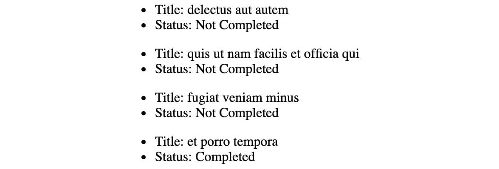
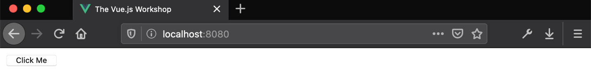
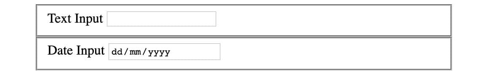
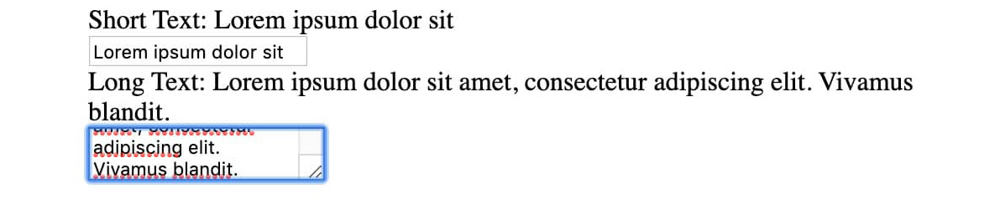
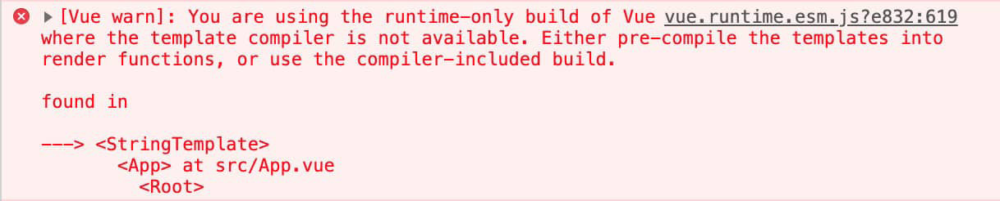
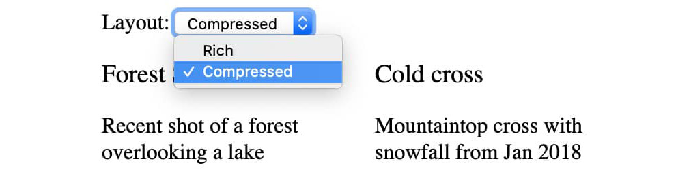
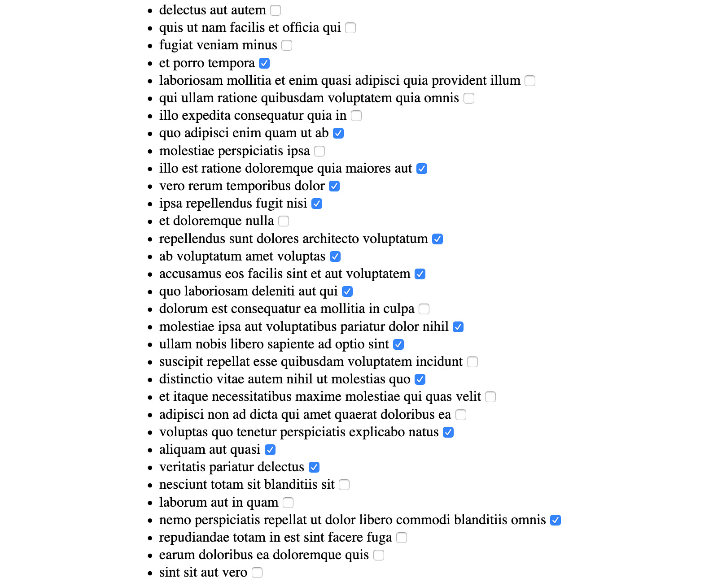

# 5. 全局组件组合

概述

在本章中，你将学习如何使用全局抽象、新的组合模型和新的组件类型来减少你的 Vue.js 应用程序代码中的重复。你将实验 Vue.js 的**混合**、**插件**和新的组件类型以及它们的组合方式。

到本章结束时，你将能够识别在 Vue.js 应用程序中使用**混合**和**插件**以实现全局组合并保持代码 DRY（不要重复自己）的情况，以及如何定义全局组件、功能组件和非 Vue 文件中的组件。你还将能够对比全局组合的优点和缺点，并选择正确的抽象以最大化组件的灵活性。

# 简介

组件嵌套是一种组合方法，其中应用程序由更小的单元（组件）构建而成。应用程序可以被视为组件相互嵌套。在这种情况下，任何共享功能将通过组件提供。Vue.js 提供了其他组合方法。

基于组件的组合可能会非常冗长，这意味着我们会在需要某个特定功能的地方重复导入。这不符合 DRY 原则。为了避免这种重复和冗长，我们可以在`MyComponent`的每个消费者中全局注册`import MyComponent from ...`。

同样，应用程序也可以由不同类型的原语（混合、插件和组件）构建而成。为了最大灵活性，组件可以以不同的方式定义，而不仅仅是 Vue.js 的单文件组件文件（`.vue`文件）。在这个类别中，我们有功能组件以及使用`render`函数定义的组件。每种类型的组件都有其优点和缺点。

为了保持代码 DRY（Don't Repeat Yourself），组件应该易于使用和扩展。本章将探讨一些我们可以遵循的技巧，以使组件更具可重用性，从而使应用程序更加 DRY。

# 混合

混合可以为使用它们的组件添加方法、属性和默认的生命周期方法。在下面的示例中，我们正在定义一个混合，它向组件的`data`函数添加一个`greet`方法和一个`greeting`字段：

```js
export default {
  methods: {
    greet(name) {
      return `${this.greeting} ${name}`
    }
  },
  data() {
    return {
      greeting: 'Hello'
    }
  }
}
```

混合（Mixins）允许独立定义多个组件的共享功能。它们通过一个`mixins`组件属性来使用，该属性接受一个数组。

在`App.vue`文件中，我们可以通过设置组件的`mixins`属性来使用混合。

混合的属性和方法随后将在组件中可用（就像它们在组件本身中定义一样）：

```js
<template>
  <div>{{ greet('World') }}</div>
</template>
<script>
import greeter from './mixins/greeter.js'
export default {
  mixins: [greeter]
}
</script>
```

这将在浏览器中显示以下消息：

![图 5.1：使用 greeter 混合的 Hello World

![img/B15218_05_01.jpg]

图 5.1：使用 greeter 混合的 Hello World

当组件和混合器在实例属性或方法名称相同的情况下发生冲突时，组件获胜。这可以理解为组件默认采用混合器行为，除非该组件声明了相同的实例属性或方法。在这种情况下，混合器中定义的实例访问将访问组件的实例。

例如，让我们向具有`greeting`设置为`Hi`的`App`组件添加一个`data()`初始化器：

```js
<script>
// other imports
export default {
  // other component properties
  data() {
    return {
      greeting: 'Hi'
    }
  }
}
</script>
```

混合器定义了一个`data`方法，但组件也定义了。在这种情况下，组件获胜，因此显示的问候语是`Hi`（在组件中定义），而不是`Hello`（在混合器中定义），如下所示：

![图 5.2：使用重写数据的 greeter mixin 实现的 Hi World]

![图片 B15218_05_02.jpg]

图 5.2：使用重写数据的 greeter mixin 实现的 Hi World

注意，当组件没有定义`data`方法时，将使用混合器的实现，但如果混合器和组件都定义了它，组件将获胜。

Vue.js 生命周期钩子是提取到混合器的首选候选者。我们可以使用的生命周期钩子（按执行顺序）是`beforeCreated`、`created`、`beforeMount`、`mounted`、`beforeUpdate`、`updated`、`beforeDestroy`和`destroyed`。

生命周期钩子是之前提到的混合器/组件冲突解决规则的例外。在 Vue.js 生命周期钩子函数的情况下，对于每个混合器、组件和钩子，钩子函数都是按照混合器的顺序（按添加到组件的顺序）首先执行，组件最后执行。

我们可以在以下示例中看到这一点。让我们创建两个实现`mounted`生命周期钩子的混合器，并在组件中实现该钩子。这说明了混合器/组件冲突解决的案例：

```js
<template>
  <div ref="zone" />
</template>
<script>
const firstMixin = {
  mounted() {
    console.log('First mixin mounted hook')
  }
}
const secondMixin = {
  mounted() {
    console.log('Second mixin mounted hook')
  }
}
export default {
  mixins: [firstMixin, secondMixin],
  mounted() {
    console.log('Component mounted hook')
  }
}
</script>
```

此组件的浏览器控制台输出（按顺序）将是`First mixin mounted hook`、`Second mixin mounted hook`和`Component mounted hook`，如下所示：

![图 5.3：显示在组件钩子之前执行的混合器中定义的钩子的浏览器控制台输出]

![图片 B15218_05_03.jpg]

图 5.3：显示在组件钩子之前执行的混合器中定义的钩子的浏览器控制台输出

我们所看到的所有示例都直接使用混合器将功能注入到组件中。混合器也可以通过使用`Vue.mixin`函数调用全局创建。

例如，我们可以使我们的问候函数成为全局实例方法：

```js
Vue.mixin({
  methods: {
    $greet(greeting, name) {
      return `${greeting} ${name}`
    }
  }
})
```

`this.$greet`现在将在`Vue.mixin`调用之后声明的所有 Vue 实例上可用。然而，此用例最好通过插件来实现。

注意

Vue.js 中用于由 Vue.js 应用程序实例提供的方法（而不是当前组件实例）的约定是`$methodName`。

## 练习 5.01：创建自己的混合器

在这个练习中，我们将创建一个名为 `debug` 的混入，它将返回传入输入的 JSON 字符串表示形式。`debug` 执行所谓的漂亮打印，以便我们可以更容易地阅读它。

这在调试 Vue.js 应用程序时也可能很有用，尤其是在 Vue.js DevTools 不可用或不可靠的情况下打印数据。要访问此练习的代码文件，请参阅 [`packt.live/38ivgFq`](https://packt.live/38ivgFq)。

我们将从一个干净的 Vue CLI 项目开始（这可以通过 `vue new exercise5.01` 命令创建）。Vue CLI 项目中的应用程序可以通过 `npm run serve` 启动。

按照以下步骤完成此练习：

1.  创建一个新的 `src/mixins` 文件夹和一个 `src/mixins/debug.js` 文件，我们将在这里定义混入的框架：

    ```js
    export default {}
    ```

1.  混入将添加一个 `debug` 方法，我们应该在 `methods` 下定义它。`debug` 方法将接受一个 `obj` 参数，并返回该数据的 `JSON.stringify` 输出。我们将使用 `JSON.stringify(obj, null, 2)` 来输出两空格缩进的漂亮打印 JSON：

    ```js
    export default {
      methods: {
        debug(obj) {
          return JSON.stringify(obj, null, 2)
        }
      }
    }
    ```

1.  我们现在能够从 `src/App.vue` 导入 `debug` 混入，并在 `mixins` 属性下注册它：

    ```js
    <script>
    import debug from './mixins/debug.js'
    export default {
      mixins: [debug],
    }
    </script>
    ```

1.  要查看 `debug` 方法的实际效果，我们将在 `src/App.vue` 文件中添加一个 `data` 方法和一个 `created` 钩子（从中我们可以打印 `debug` 的输出）：

    ```js
    <script>
    // imports
    export default {
      // other component properties
      data() {
        return {
          myObj: {
            some: 'data',
            other: 'values'
          }
        }
      },
      created() {
        console.log(this.debug(this.myObj))
      }
    }
    </script>
    ```

    你应该得到以下输出：

    ![图 5.4：由于创建钩子而产生的浏览器控制台输出]

    ![图片 B15218_05_04.jpg]

    ![图 5.4：由于创建钩子而产生的浏览器控制台输出]

1.  `debug` 也在模板中可用；我们可以在 `pre` 标签中插入其输出，以便尊重空白字符：

    ```js
    <template>
      <div id="app">
        <pre>{{ debug(myObj) }}</pre>
      </div>
    </template>
    ```

    应用程序以及此模板将如下所示：

    ![图 5.5：使用混入的 debug 方法打印 myObj]

    ![图片 B15218_05_05.jpg]

![图 5.5：使用混入的 debug 方法打印 myObj]

通过这种方式，我们学习了如何使用混入以相当明确的方式（`mixins` 属性）将共享功能注入到多个组件中。我们还看到了当组件的实现覆盖了混入提供的属性和方法时会发生什么（组件通常获胜）。

我们现在将探讨如何注入实例和全局功能，并通过插件进行分发。

# 插件

Vue.js 插件是一种向 Vue.js 全局添加自定义功能的方法。插件的良好候选者通常是应用程序的核心，并且被广泛使用。插件候选者的经典例子包括翻译/国际化库（例如 `i18n-next`）和 HTTP 客户端（例如 `axios`、`fetch` 和 `GraphQL` 客户端）。插件初始化器可以访问 `Vue` 实例，因此它是一个很好的方式来包装全局指令、混入、组件和过滤器定义。

插件可以通过注册指令和过滤器来注入功能。它们还可以添加 `global` 和 `instance` Vue.js 方法，以及定义全局组件混入。

Vue.js 插件是一个暴露 `install` 方法的对象。`install` 函数使用 `Vue` 和 `options` 调用：

```js
const plugin = {
  install(Vue, options) {}
}
```

在 `install` 方法中，我们可以注册指令、过滤器、混入，并添加全局和实例属性和方法：

```js
const plugin = {
  install(Vue, options) {
    Vue.directive('fade', { bind() {} })
    Vue.filter('truncate', str => str.slice(0, 140))
    Vue.mixin({
      data() { return { empty: true } }
    })
    Vue.globalProperty = 'very-global-value'
    Vue.prototype.$myInstanceMethod = function() {}
  }
}
```

插件使用 `Vue.use` 方法进行注册：

```js
import plugin from './plugin'
Vue.use(plugin)
```

`Vue.use` 也可以将选项作为第二个参数传递。这些选项传递给插件：

```js
Vue.use(plugin, { optionProperty: true })
```

`Vue.use` 的一个特性是不允许你注册相同的插件两次。这是一个很好的特性，可以避免在尝试多次实例化或安装相同插件时出现的边缘情况行为。

在与 Vue.js 结合使用时，`axios` 是一个流行的 HTTP 客户端。通常，我们会通过拦截器或 `axios` 选项来配置 `axios`，以实现重试、传递 cookies 或跟随重定向等功能。

可以使用以下命令安装 `axios`：`npm install –save axios`。

## 练习 5.02：创建自定义 Axios 插件

为了避免必须添加 `import axios from 'axios'` 或将我们的自定义 `axios` 实例包装在 `http` 或 `transport` 内部模块下，我们将我们的自定义 `axios` 实例注入到 Vue 对象和 Vue 组件实例的 `Vue.axios` 和 `this.axios` 下。这将使它在我们的应用程序中使用，该应用程序需要使用 `axios` 作为 HTTP 客户端调用 API，变得更加容易和舒适。要访问此练习的代码文件，请参阅 [`packt.live/36po08b`](https://packt.live/36po08b)。

我们将从一个干净的 Vue CLI 项目开始（可以使用 `vue new exercise5.02` 命令创建）。Vue CLI 项目中的应用程序可以使用 `npm run serve` 启动。

按照以下步骤完成此练习：

1.  为了正确组织我们的代码，我们将在 `src/plugins` 中创建一个新的文件夹，并在 `src/plugins/axios.js` 中为我们的 `axios` 插件创建一个新的文件。在新文件中，我们将构建 `axios` 插件：

    ```js
    import axios from 'axios'
    export default {
      install(Vue, options) {}
    }
    ```

1.  现在我们将在 `src/main.js` 中的 Vue.js 实例上注册我们的 `axios` 插件：

    ```js
    // other imports
    import axiosPlugin from './plugins/axios.js'
    // other code
    Vue.use(axiosPlugin)
    // Vue instantiation code
    ```

1.  我们现在将通过以下命令使用 `npm` 安装 `axios`。这将允许我们导入 `axios` 并通过插件在 Vue 中暴露它：

    ```js
    npm install --save axios
    ```

1.  现在我们将在 `src/plugins/axios.js` 中将 `axios` 添加到 Vue 作为全局属性：

    ```js
    import axios from 'axios'
    export default {
      install(Vue) {
        Vue.axios = axios
      }
    }
    ```

1.  `axios` 现在在 `Vue` 中可用。在 `src/App.vue` 中，我们可以向一个 API 发送请求，该 API 将填充 `todos` 列表：

    ```js
    <template>
      <div id="app">
        <div v-for="todo in todos" :key="todo.id">
          <ul>
            <li>Title: {{ todo.title }}</li>
            <li>Status: {{ todo.completed ? "Completed" :           "Not Completed" }}</li>
          </ul>
        </div>
      </div>
    </template>
    <script>
    import Vue from 'vue'
    export default {
      async mounted() {
        const { data: todos } = await       Vue.axios('https://jsonplaceholder.typicode.com/todos')
        this.todos = todos
      },
      data() {
        return { todos: [] }
      }
    }
    </script>
    ```

    下面的输出是预期的：

    

    

    图 5.6：全局 Vue.axios todo 显示示例

1.  在我们的情况下，必须添加 `import Vue from 'vue'` 有点奇怪。通过插件注入 `axios` 的全部目的是为了消除 `import` 模板。更好的方法是通过对组件实例进行暴露；即 `this.axios`。为此，我们需要更新 `src/plugins/axios.js` 文件中的安装步骤，并将 `axios` 添加到 `Vue.prototype`，这样任何 `new Vue()` 组件都将将其作为属性：

    ```js
    // imports
    export default {
      install(Vue, options) {
        // other plugin code
        Vue.prototype.axios = axios
      }
    }
    ```

1.  我们现在可以删除 `import Vue from 'vue'` 行，并在 `src/App.vue` 中通过 `this.axios` 访问 `axios`：

    ```js
    <script>
    export default {
      async mounted() {
        const { data: todos } = await       this.axios('https://jsonplaceholder.typicode.com/todos')
        this.todos = todos
      },
      data() {
        return { todos: [] }
      }
    }
    </script>
    ```

    以下为输出结果：

    

图 5.7：Vue 实例 axios todo 显示示例

有了这个，我们已经使用插件注入了全局和实例级别的属性和方法，以及学习了如何以易于分发的方式使用它们来创建指令和其他 Vue 构造。

现在，我们将探讨如何在代码库中全局注册组件，以帮助减少高使用频率组件的样板代码。

# 全局注册组件

使用插件的一个原因是减少所有 Vue 应用程序文件中的样板代码，通过删除 `导入` 并用对 `this` 和/或 `Vue` 的访问来替换它们。

Vue.js 组件通常在单个文件组件中定义，并显式导入。出于与定义全局方法和属性相同的原因，我们可能希望全局注册组件。这将允许我们在所有其他组件模板中使用这些组件，而无需导入它们并在 `components` 属性下注册它们。

这种情况在使用设计系统或组件在代码库中跨模块使用时非常有用。

全局注册组件有助于某些类型的更新，例如，如果文件名未暴露给消费者，那么在更改文件名时，只有一个路径需要更新，而不是每个用户一个。

假设我们在 `CustomButton.vue` 文件中有一个 `CustomButton` 组件，其外观如下：

```js
<template>
  <button @click="$emit('click', $event)">
    <slot />
  </button>
</template>
```

我们可以将 `CustomButton` 全局注册如下（这通常在 `main.js` 文件中完成）：

```js
// other imports
import CustomButton from './components/CustomButton.vue'
Vue.component('CustomButton', CustomButton)
// other global instance setup
```

我们现在可以在 `App.vue` 文件中使用它，而无需本地注册或导入：

```js
<template>
  <div>
    <CustomButton>Click Me</CustomButton>
  </div>
</template>
```

这将按预期渲染，按钮名为“点击我”：



图 5.8：使用“点击我”按钮的 CustomButton 渲染

通过这样，我们已经探讨了如何在代码库中频繁使用组件时，全局注册组件可以减少样板代码。

接下来，我们将探讨如何在 Vue.js 中提高组件的灵活性的一些技巧。

# 最大化组件灵活性

Vue.js 组件接受 props 和 slots 作为输入；它们的输出以 HTML 渲染，并发出事件。

为了最大化组件的灵活性，始终利用插槽和 props 是很有意义的。

精确利用 props 和默认值意味着组件可以被重用和扩展。例如，我们可以在组件中不硬编码值，而是将其设置为默认 prop。在这种情况下，`date` 默认为当前日期，`new Date()`。然后我们使用计算属性提取纪元：

```js
<template>
  <div>Date as epoch: {{ epoch }}</div>
</template>
<script>
export default {
  props: {
    date: {
      type: Date,
      default() {
        return new Date()
      }
    }
  },
  computed: {
    epoch() {
      return Number(this.date)
    }
  }
}
</script>
```

当注册并使用时，渲染如下：

```js
Date as epoch: 1574289255348
```

插槽可以被视为组件将渲染委托回其消费者的一种方式。将模板的部分委托给父组件有助于可重用性。

使用插槽来最大化重用性的一个特定例子是**无渲染组件**模式。例如，在时代显示示例中，我们可以利用作用域插槽并从组件中移除任何渲染逻辑：

```js
<template>
  <div>
    <slot :epoch="epoch" />
  </div>
</template>
```

在父组件中，可以使用作用域插槽来定义渲染：

```js
<template>
  <div>
    <Epoch>
      <template v-slot:default="{ epoch }">
        Epoch as rendered with parent template {{ epoch }}
      </template>
    </Epoch>
  </div>
</template>
```

这意味着组件的委托被委托给了父组件，并显示以下内容：

```js
Epoch as rendered with parent template 1574289270190
```

下一组实践通过使它们的 API 可预测来最大化组件的重用。在许多方面，前向属性、利用`style`和`class`属性合并以及实现`v-model`接口是使 Vue.js 自定义组件表现得更像 HTML 元素的一种方式。

前向属性可能很有趣。例如，一个`CustomInput`组件（在`CustomInput.vue`文件中）可能需要传递`type`属性，以及`required`属性：

```js
<template>
  <input v-bind="$attrs">
</template>
```

`CustomInput`组件可以用来渲染任何类型的组件（`src/App.vue`）：

```js
<template>
  <div id="app">
    <fieldset>
      <label for="textinput">
        Text Input
      </label>
      <CustomInput
      type="text"
      name="textinput"
      id="textinput"
      />
    </fieldset>
    <fieldset>
      <label for="dateinput">
        Date Input
      </label>
      <CustomInput
        type="date"
        name="dateinput"
        id="dateinput"
      />
    </fieldset>
  </div>
</template>
<script>
import CustomInput from './components/CustomInput.vue'
export default {
  components: {
    CustomInput
  }
}
</script>
```

这正确渲染了文本和日期输入：



图 5.9：具有文本和日期类型的 CustomInput

Vue.js 在类/内联样式方面做了很多繁重的工作，因为它将组件上定义的`style`和`class`对象与该组件根元素的`style`和`class`对象合并。根据文档，“类和样式属性有点智能，所以两个值都会合并” (*Vue.js 组件属性指南*：[`vuejs.org/v2/guide/components-props.html#Replacing-Merging-with-Existing-Attributes`](https://vuejs.org/v2/guide/components-props.html#Replacing-Merging-with-Existing-Attributes))。

在 Vue.js 中，输入元素和组件倾向于通过`v-model`进行双向响应式绑定，`v-model`是使用`v-bind:value`和`v-on:input`来提供值并保持与子组件或元素的输出同步的简写。

传递的`value`仅用作起始值；当输入被捕获完成时（例如，完成输入）会发出`input`事件。

如果组件实现了`v-model`形状，它可以直接替换表单元素。

例如，实现了`v-model`接口的`TextInput`可以与`input`和`textarea`互换使用：

```js
<template>
  <div>
    <textarea
      v-if="type === 'long'"
      :value="value"
      @input="$emit('input', $event.target.value)"
    >
    </textarea>
    <input
      v-else
      :value="value"
      @input="$emit('input', $event.target.value)"
      type="text"
    />
  </div>
</template>
<script>
export default {
  props: ['value', 'type']
}
</script>
```

这可以在`src/App.vue`中如下使用：

```js
<template>
  <div id="app">
    <label>Short Text: {{ shortText }}</label>
    <TextInput v-model="shortText" type="short" />
    <label>Long Text: {{ longText }}</label>
    <TextInput v-model="longText" type="long" />
  </div>
</template>
<script>
import TextInput from './components/TextInput.vue'
export default {
  components: {
    TextInput
  },
  data() {
    return {
      shortText: '',
      longText: ''
    }
  }
}
</script>
```

应用程序渲染如下：



图 5.10：实现 v-model 的自定义组件

这样，我们就已经探讨了如何利用 props 和 slots、继承属性以及实现已知的 Vue.js 接口来帮助最大化组件的灵活性。

下一节将专门介绍如何通过学习在不使用`.vue`文件的情况下使用 Vue.js 组件来加深我们对 Vue.js 组件的理解。

# 使用 Vue.js 组件而不使用.vue 单文件组件

我们所看到的 Vue.js 组件的大部分示例都利用了 `.vue` 单文件组件。

这不是定义 Vue.js 组件的唯一方法。在本节中，我们将探讨四种不同的方法来定义 Vue.js 组件，而不使用 `.vue` 文件。

评估这些选项将帮助我们理解 Vue.js 组件的核心是什么。

## 使用字符串模板的运行时定义

组件可以使用接受字符串值的 `template` 属性。这通常被称为 **字符串模板**。此模板在运行时（在浏览器中）被评估。

我们可以在 `StringTemplate.js` 文件中定义一个组件，通过定义一个具有 `template` 属性的对象：

```js
export default {
  template: `<div>String Template Component</div>`
}
```

然后，可以从 `App.vue` 文件中消费它，如下所示：

```js
<template>
  <div id="app">
    <StringTemplate />
  </div>
</template>
<script>
import StringTemplate from './components/StringTemplate.js'
export default {
  components: {
    StringTemplate
  }
}
</script>
```

不幸的是，这会在加载时崩溃，并在控制台显示以下 Vue 警告：



](img/B15218_05_11.jpg)

图 5.11：Vue 运行时编译器缺失警告

根据 Vue 警告，为了使此组件在导入时工作，我们需要在运行时构建中包含 Vue.js 编译器。为此，在 Vue CLI 项目中，我们可以在 `vue.config.js`（Vue CLI 配置文件）中将 `runtimeCompiler` 选项设置为 `true`。

您的 `vue.config.js` 应该看起来像以下这样：

```js
module.exports = {
  runtimeCompiler: true
};
```

设置此选项并重新启动开发服务器后，来自 `StringTemplate` 组件的消息会出现在浏览器中：

```js
String Template Component
```

可以使用 `.vue` 组件对象定义属性和其他组件实例属性。

## 渲染函数

Vue.js 单文件组件的 `template` 部分在构建时被编译成一个 `render` 函数。

`render` 函数通常用于 Vue CLI 项目的 `main.js` 文件中 - 特别是 `new Vue()` 调用：

```js
new Vue({
  render: h => h(App),
}).$mount('#app')
```

一个 `render` 函数接受一个 `createElement` 参数，并返回一个虚拟 DOM 节点。这是通过调用 `createElement` 函数（在上面的示例中，这是 `h`）来完成的。

`h` 由于其紧凑性，常被用作 `createElement` 的缩写。

我们可以在 JavaScript 文件（`RenderFunction.js`）中定义一个具有 `render` 属性的组件，如下所示：

```js
export default {
  render(createElement) {
    return createElement(
      'h2',
      'Render Function Component'
    )
  }
}
```

这可以在 `App.vue` 文件中这样呈现：

```js
<template>
  <div id="app">
    <RenderFunction />
  </div>
</template>
<script>
import RenderFunction from './components/RenderFunction.js'
export default {
  components: {
    RenderFunction
  }
}
</script>
```

此组件在浏览器中显示一个 `h2`，内容为 **渲染函数组件**：

```js
Render Function Component
```

除了在非 `.vue` 文件中编写组件外，`render` 函数对于高度动态的组件也很有用。

## JSX

JSX 由 React 推广。根据 React 文档，*JSX 是 JavaScript 的语法扩展。我们建议与 React 一起使用它来描述 UI 应该是什么样子* ([`reactjs.org/docs/introducing-jsx.html`](https://reactjs.org/docs/introducing-jsx.html))。JSX 是 JavaScript 的超集，允许使用花括号进行 `HTML-style` 标签和插值。

与 Vue.js 一样，React 不会将 JSX 渲染到 DOM 中。与 Vue.js 模板类似，React 应用程序构建工具将 JSX 编译为在运行时使用的 `render` 函数，以便它们可以渲染到虚拟 DOM。然后虚拟 DOM 与真实 DOM 进行 *reconcile*（同步）。

JSX 编译为 `render` 函数，Vue.js 支持 `render` 函数的组件定义。此外，**Vue CLI 3+** 默认编译 JSX。

这意味着我们可以编写以下内容，这与 `RenderFunction` 组件、`JSXRender.js` 文件等效：

```js
export default {
  render() {
    return <h2>JSX Render Function Component</h2>
  }
}
```

没有 JSX 的等效 `render` 函数如下所示（基于上一节中的示例）：

```js
export default {
  render(createElement) {
    return createElement(
      'h2',
      'JSX Render Function Component'
    )
  }
}
```

以下 `App.vue` 文件将 `JSXRender` 渲染到浏览器中：

```js
<template>
  <div id="app">
    <JSXRender />
  </div>
</template>
<script>
import JSXRender from './components/JSXRender.js'
export default {
  components: {
    JSXRender
  }
}
</script>
```

现在，我们可以在屏幕上看到 `JSXRender` 中的 `h2`，内容符合预期：

```js
JSX Render Function Component
```

通过这些，我们已经了解到 Vue.js 组件只是具有 `render` 或 `template` 函数的对象。`.vue` 组件的 `template` 部分在构建时编译为 `render` 函数，这意味着要使用字符串模板，我们需要在应用程序运行时包含 Vue.js 编译器。我们还学习了如何使用 `render` 函数以及 JSX 来定义组件，并指出了 React 和 Vue.js 在实现方面的一些共同点。在决定使用 JSX 或 `render` 函数时，JSX 可以更容易阅读，同时具有 `render` 函数的完整灵活性（而常规模板并不总是具备）。

我们现在将探讨如何使用 Vue.js 的 `component` 标签从运行时数据动态渲染组件。

# Vue 组件标签

JSX 和 `render` 函数非常适合需要非常动态渲染的组件的情况。

在常规 Vue.js 模板中实现这一点的办法是使用 `component` 标签。

`component` 标签使用 `is` 属性来动态选择将渲染哪个组件。

要渲染一个动态组件，我们使用一个带有绑定 `is` 属性的 `component` 标签（在这里，我们使用缩写 `:is`，它等同于 `v-bind:is`）：

```js
<component :is="componentName" />
```

现在，我们将学习如何使用名称或组件引用渲染动态组件。

## 通过名称或组件引用渲染动态组件

假设我们有一个网格，其中包含可以切换显示为卡片显示（一个包含图像和文本的设计元素）或仅图像视图的项目。

首先，我们需要导入相关组件并将它们注册为组件。我们还将设置一些固定数据以循环网格：

```js
<template>
  <div id="app">
    <div class="grid">
      <component
        class="grid-item"
        v-for="item in items"
        :key="item.id"
      />
    </div>
  </div>
</template>
<script>
import Card from './components/Card.vue';
import ImageEntry from './components/ImageEntry.vue';
export default {
  components: {
    Card,
    ImageEntry
  },
  data() {
    return {
      items: [
        {
          id: '10',
          title: 'Forest Shot',
          url: 'https://picsum.photos/id/10/1000/750.jpg',
        },
        {
          id: '1000',
          title: 'Cold cross',
          url: 'https://picsum.photos/id/1000/1000/750.jpg',
        },
        {
          id: '1002',
          title: 'NASA shot',
          url: 'https://picsum.photos/id/1002/1000/750.jpg',
        },
        {
          id: '866',
          title: 'Peak',
          url: 'https://picsum.photos/id/866/1000/750.jpg'
        },
      ]
    }
  }
}
</script>
```

我们可以按名称引用组件——即 `card` 和 `image-entry`——并将 `itemComponent` 设置为 `is` 的值：

```js
<template>
    <!-- rest of template -->
    <component
      :is="itemComponent"
      class="grid-item"
      v-for="item in items"
      :key="item.id"
    />
    <!-- rest of template -->
</template>
<script>
// rest of script
export default {
  // other component properties
  data() {
    return {
      itemComponent: 'card',
      // other data properties eg. `items`
    }
  }
}
</script>
```

在这种情况下，`Card` 组件将被渲染，因为我们传递了其小写名称（`card`）给 `component` 标签。

如果我们将 `itemComponent` 改为 `image-entry`，则 `ImageEntry` 组件将被渲染。此切换可以使用 `v-model` 如下进行：

```js
<template>
  <!-- rest of template -->
  Display mode:
  <input
    type="radio"
    name="style"
    value="card"
    v-model="itemComponent"
    id="card-radio"
  />
  <label for="card-radio">Card</label>
  <input
    type="radio"
    name="style"
    value="image-entry"
    v-model="itemComponent"
    id="image-radio"
  />
  <label for="image-radio">Image</label>
  <!-- rest of template -->
</template>
```

我们还可以使用组件引用本身（而不是名称）将组件传递给 `is`。例如，我们可以将 `itemComponent` 设置为 `Card`：

```js
<script>
// rest of script
export default {
  // other component properties
  data() {
    return {
      itemComponent: Card,
      // other data properties eg. `items`
    }
  }
}
</script>
```

在这种情况下，在卡片视图和图像视图之间切换会更困难，因为我们需要使用组件引用而不是使用名称。

我们可以将属性传递给使用 `component` 动态渲染的组件，就像我们使用 `v-bind:prop-name` 或 `:prop-name` 简写传递常规属性一样：

```js
<template>
    <!-- rest of template -->
    <component
      class="grid-item"
      v-for="item in items"
      :key="item.id"
      :is="itemComponent"

      :url="item.url"
      :title="item.title"
    />
    <!-- rest of template -->
</template>
```

给定以下 `Card` 和 `ImageEntry` 组件，我们得到一个具有可切换视图的网格项的应用程序。

`Card.vue` 渲染图像和标题，并具有最大宽度 `150px`：

```js
<template>
  <div class="card">
    
    <h3>{{ title }}</h3>
  </div>
</template>
<script>
export default {
  props: {
    url: String,
    title: String
  }
}
</script>
<style scoped>
.card {
  margin: 10px;
  max-width: 150px;
}
h3 {
  font-weight: normal;
}
</style>
```

您的输出将显示卡片视图中的条目，如下所示：

![图 5.12：在卡片视图中渲染网格条目]

![图片 B15218_05_12.jpg]

图 5.12：在卡片视图中渲染网格条目

使用 `ImageEntry.vue` 以卡片视图的两倍宽度渲染图像：

```js
<template>
  
</template>
<script>
export default {
  props: {
    url: String
  }
}
</script>
<style scoped>
.image {
  margin: 20px;
  max-width: 300px;
}
</style>
```

您现在将看到图像视图中的条目，如下面的截图所示：

![图 5.13：在图像视图中渲染网格条目]

![图片 B15218_05_13.jpg]

图 5.13：在图像视图中渲染网格条目

`component` 标签的一个注意事项是，当它不再显示时，渲染的动态组件会被完全销毁。在这个例子中，正在渲染的动态组件没有任何状态，所以这种销毁不会引起任何问题。

我们现在将学习如何缓存动态组件状态。

## 使用 Keep-Alive 缓存动态组件状态

通过 `component` 标签动态渲染的组件可以有状态，例如在多部分表单中，下一页有 `name` 字段和 `address` 字段。

让我们使用 `component` 标签来实现这一点，如下所示：

```js
<template>
  <div id="app">
    <component
      :is="activeStep"
      @next="activeStep = 'second-step'"
      @back="activeStep = 'first-step'"
    />
  </div>
</template>
<script>
import FirstStep from './components/FirstStep.vue'
import SecondStep from './components/SecondStep.vue'
export default {
  components: {
    FirstStep,
    SecondStep
  },
  data() {
    return {
      activeStep: 'first-step',
    }
  }
}
</script>
```

通过这样做，我们可以在 `Name` 字段中输入数据：

![图 5.14：在名称字段中输入我的名字]

![图片 B15218_05_14.jpg]

图 5.14：在名称字段中输入我的名字

如果我们使用 `Next` 导航到表单的地址部分，然后使用 `Back`，名称将会消失，如下面的截图所示：

![图 5.15：在地址步骤中点击 Next 然后 Back 后的空名称字段]

![图片 B15218_05_15.jpg]

图 5.15：在地址步骤中点击 Next 然后 Back 后的空名称字段

这是因为组件在不是当前渲染的动态组件时会被销毁（摧毁）。

为了解决这个问题，我们可以在 `component` 标签周围使用 `keep-alive` 元素：

```js
<template>
  <!-- rest of template -->
  <keep-alive>
    <component
      :is="activeStep"
      @next="activeStep = 'second-step'"
      @back="activeStep = 'first-step'"
    />
  </keep-alive>
  <!-- rest of template -->
</template>
```

以这种方式，填写名称并从表单的地址部分返回将显示以下内容：

![图 5.16：导航后，我的名字仍然是名称字段中的值]

![图片 B15218_05_16.jpg]

图 5.16：导航后，我的名字仍然是名称字段中的值

通过这种方式，我们已经学习了如何使用 `component` 标签来表示一个区域，在这个区域内我们可以根据字符串或组件本身（如导入的）动态显示组件。我们还探讨了如何解决 `component` 的主要问题；即如何使用 `keep-alive` 在 `component` 标签中不是正在积极使用的组件时保持组件状态。

## 练习 5.03：使用 component 标签创建动态卡片布局

现代应用程序布局是一个带有卡片网格。`Card` 布局的好处是适合移动、桌面和平板显示器。在这个练习中，我们将创建一个具有三种不同模式和选择其中之一的方式的动态 `card` 布局。此布局将允许用户选择屏幕上显示多少信息以适应他们的偏好。

`Rich` 视图将显示一个项目的所有详细信息，包括图片、标题和描述。

`Compressed` 视图将显示所有详细信息，但不显示图片预览。

`List` 视图将仅显示标题，应采用垂直布局。

每个 `card` 视图都将作为一个单独的组件实现，然后使用 `component` 标签动态渲染。要访问此练习的代码文件，请参阅 [`packt.live/3mYYvkq`](https://packt.live/3mYYvkq)。

按照以下步骤完成此练习：

1.  在 `src/components/Rich.vue` 中创建丰富的布局。它包含三个属性：`url`（图片 URL）、`title` 和 `description`，分别渲染图片、标题和描述：

    ```js
    <template>
      <div class="card">
        
        <h3>{{ title }}</h3>
        <p>{{ description }}</p>
      </div>
    </template>
    <script>
    export default {
      props: ['url', 'title', 'description']
    }
    </script>
    <style scoped>
    .card {
      display: flex;
      flex-direction: column;
      max-width: 200px;
    }
    h3 {
      font-weight: normal;
      margin-bottom: 0;
      padding-bottom: 0;
    }
    </style>
    ```

1.  使用一些固定数据设置 `src/App.vue`：

    ```js
    <template>
      <div id="app">
      </div>
    </template>
    <script>
    export default {
      data() {
        return {
          items: [
            {
              id: '10',
              title: 'Forest Shot',
              description: 'Recent shot of a forest overlooking a             lake',
              url: 'https://picsum.photos/id/10/1000/750.jpg',
            },
            {
              id: '1000',
              title: 'Cold cross',
              description: 'Mountaintop cross with snowfall from             Jan 2018',
              url: 'https://picsum.photos/id/1000/1000/750.jpg',
            },
          ]
        }
      }
    }
    </script>
    ```

1.  将 `Rich` 视图组件导入到 `src/App.vue` 并本地注册：

    ```js
    <script>
    import Rich from './components/Rich.vue'
    export default {
      components: {
        Rich
      },
      // other component properties, eg. "data"
    }
    </script>
    ```

1.  一旦我们获得了 `Rich` 视图组件，将其连接到 `src/App.vue` 应用程序中，使用 `component` 渲染它，并通过相关属性传递：

    ```js
    <template>
      <!-- rest of template -->
          <component
            v-for="item in items"
            :key="item.id"
            :is="layout"
            :title="item.title"
            :description="item.description"
            :url="item.url"
          />
      <!-- rest of template>
    </template>
    <script>
    export default {
     // other component properties
      data() {
        return {
          layout: 'rich',
          // other data definitions eg. `items`
        }
      }
    }
    </script>
    ```

1.  这是一个添加一些样式使网格看起来像网格的好地方：

    ```js
    <template>
      <!-- rest of template -->
        <div class="grid">
          <component
            v-for="item in items"
            :key="item.id"
            :is="layout"
            :title="item.title"
            :description="item.description"
            :url="item.url"
          />
        </div>
      <!-- rest of template -->
    </template>
    <style scoped>
    .grid {
      display: flex;
    }
    </style>
    ```

    这将显示以下输出：

    ![图 5.17：动态渲染丰富的组件]

    

    图 5.17：动态渲染丰富的组件

1.  现在，实现 `Compressed` 视图，它只是 `Rich` 视图，但在 `Compressed.vue` 文件中没有图片：

    ```js
    <template>
      <div class="card">
        <h3>{{ title }}</h3>
        <p>{{ description }}</p>
      </div>
    </template>
    <script>
    export default {
      props: ['title', 'description']
    }
    </script>
    <style scoped>
    .card {
      display: flex;
      flex-direction: column;
      max-width: 200px;
    }
    h3 {
      font-weight: normal;
      padding-bottom: 0;
    }
    p {
     margin: 0;
    }
    </style>
    ```

1.  在 `src/App.vue` 中导入并注册 `Compressed` 组件：

    ```js
    <script>
    // other imports
    import Compressed from './components/Compressed.vue'
    export default {
      components: {
        Rich,
        Compressed,
      },
      // other component properties
    }
    ```

1.  添加一个 `select` 来在视图之间切换。它将有两个选项，值为 `rich` 和 `compressed`，并使用 `v-model` 绑定到 `layout`：

    ```js
    <template>
      <!-- rest of template -->
      Layout: <select v-model="layout">
          <option value="rich">Rich</option>
          <option value="compressed">Compressed</option>
        </select>
      <!-- rest of template -->
    </template>
    ```

    使用此 `select`，我们可以切换到 `compressed` 布局，其外观如下：

    ![图 5.18：打开选择器的压缩布局]

    

    图 5.18：打开选择器的压缩布局

1.  将 `List` 布局添加到 `src/components/List.vue`。`list` 视图是压缩视图，但没有描述：

    ```js
    <template>
      <h3>{{ title }}</h3>
    </template>
    <script>
    export default {
      props: ['title']
    }
    </script>
    <style scoped>
    h3 {
      width: 100%;
      font-weight: normal;
    }
    </style>
    ```

1.  将 `List` 组件导入到 `src/App.vue` 并本地注册：

    ```js
    <script>
    // other imports
    import List from './components/List.vue'
    export default {
      components: {
        Rich,
        Compressed,
        List
      },
      // other component properties
    }
    ```

1.  添加一个额外的选项 `value="list"` 以切换到 `List` 布局：

    ```js
    <template>
      <!-- rest of template -->
        Layout: <select v-model="layout">
          <option value="rich">Rich</option>
          <option value="compressed">Compressed</option>
          <option value="list">List</option>
        </select>
      <!-- rest of template -->
    </template>
    ```

    当切换到`list`布局时，项目将按如下方式显示为水平行：

    

    图 5.19：水平堆叠错误的列表视图

1.  要修复这种水平堆叠，创建一个新的`grid-column`类，将其设置为`flex-direction: column`（与默认的`row`相对）并在布局为`list`时条件性地应用它：

    ```js
    <template>
      <!-- rest of template -->
        <div class="grid" :class="{ 'grid-column': layout ===       'list' }">
          <!-- grid using component tag -->
        </div>
      <!-- rest of template -->
    </template>
    <style scoped>
    /* existing rules */
    .grid-column {
      flex-direction: column;
    }
    </style>
    ```

    我们的`List`布局现在看起来如下：

    

图 5.20：垂直堆叠的列表视图

通过这样，我们已经学习了如何使用`component`标签动态渲染不同组件，无论是通过名称还是使用组件对象本身。我们还探讨了有状态动态组件的陷阱，即组件不再显示时的组件销毁以及如何使用`keep-alive`元素来规避这些问题。

我们现在将探讨如何仅使用`render`函数或`template`标签使用功能组件来实现简单组件。

# 功能组件

功能组件是常规 Vue.js 组件的子集。它们没有状态或组件实例。它们可以被视为`render`函数（如本章前面所示），其中传递了属性。

注意

我们可以将组件标记为功能性的，这意味着它们是无状态的（没有响应式数据）和实例化的（没有`this`上下文）。

更多信息请参阅 Vue.js 文档（[`vuejs.org/v2/guide/render-function.html#Functional-Components`](https://vuejs.org/v2/guide/render-function.html#Functional-Components)）。

功能组件只能访问从父组件传递过来的属性、子组件、插槽和作用域插槽，它们还接收对**父组件**和**监听器**的引用。

以下是一个`Greet`组件（在`Greet.vue`文件中）。注意`template`中的`functional`注解：

```js
<template functional>
  <div>Functional Component: {{ props.greeting }} {{     props.audience }}</div>
</template>
```

功能组件必须通过`props.propName`访问属性。功能组件也可以通过`functional: true`布尔值表示，并使用`render`函数：

```js
export default {
  functional: true,
  render(h, context) {
    return h(
      'h2',
      `Functional Render: ${context.props.greeting}         ${context.props.audience}`
    )
  }
}
```

我们可以在`App.vue`文件中使用这两个功能组件：

```js
<template>
  <div id="app">
    <Greet greeting="Hello" audience="World" />
    <GreetRender greeting="Hello" audience="World" />
  </div>
</template>
<script>
import Greet from './components/Greet.vue'
import GreetRender from './components/GreetRender.js'
export default {
  components: {
    Greet,
    GreetRender
  }
}
</script>
```

这将在浏览器中渲染以下内容：


图 5.21：功能组件渲染

功能组件是封装仅渲染功能的绝佳方式；也就是说，它们从属性中获取模板。由于它们没有关联的响应式状态或组件实例，因此它们比常规组件有更好的性能表现。

我们已经为非功能组件覆盖了一个常见用例，即发出事件，可以如下操作：

```js
<template>
  <input
    type="submit"
    @click="$emit('click', $event)"
  />
</template>
```

要使用功能组件发出事件，我们可以将元素绑定到`listeners`对象中的属性。

要将所有事件委派给子组件，我们可以使用`v-on="listeners"`：

```js
<template functional>
  <input
    v-on="listeners"
    v-bind="data.attrs"
  />
</template>
```

要绑定一个特定的监听器，我们可以使用 `v-on:eventName="listeners.listenerName"`，其中 `listenerName` 是功能组件的父组件绑定的监听器：

```js
<template functional>
  <input
    type="submit"
    v-on:click="listeners.click"
    v-bind="data.attrs"
  />
</template>
```

注意

绑定到一个不存在的监听器属性将导致错误。为了避免这种情况，我们可以使用 `listeners.listenerName || (() => {})` 表达式。

通过这样，我们已经学习了如何使用功能组件以及 `.vue` 组件的 `template` 变体和 `render` 函数来实现常见的 Vue.js 组件模式。

现在，我们将构建一个使用本章中我们查看的所有模式的待办事项应用程序。

## 活动五.01：使用插件和可重用组件构建 Vue.js 应用程序

在这个活动中，我们将构建一个 `jsonplaceholder` 作为数据源。

我们的待办事项应用程序将加载待办事项并将它们显示为列表。它将根据待办事项是否已完成显示复选框，以及待办事项的名称。

当勾选待办事项时，应用程序将同步到 API。

我们将作为插件注入 `axios` 以查询 [`jsonplaceholder.typicode.com`](https://jsonplaceholder.typicode.com)。

按照以下步骤完成此活动：

1.  将 `axios` 安装到项目中。

1.  要将 `axios` 注入为 `this` 组件实例的属性，创建一个 `src/plugins/axios.js` 插件文件，在 `install` 时，这意味着组件实例将有一个 `axios` 属性。

1.  为了使插件工作，请在 `src/main.js` 中导入并注册它。

1.  我们还希望将我们的 API 的 `baseUrl` 注入到所有组件中。我们将创建一个内联的 `src/main.js` 文件插件来完成此操作。

1.  现在，我们想要从我们的 `src/App.vue` 中获取所有待办事项。一个好的地方是在 `mounted` 生命周期方法中做这件事。

1.  要显示待办事项列表，我们将在 `src/components/TodoList.vue` 中创建一个 `TodoList` 功能组件，它接受一个 `todos` 属性，遍历项目，并在 `todo` 作用域插槽中延迟渲染待办事项，该插槽绑定待办事项。

1.  我们现在可以使用 `TodoList` 组件在 `src/App.vue` 中渲染我们已获取的待办事项。

1.  现在，我们需要创建一个 `TodoEntry` 组件，我们将在这里实现大部分待办事项特定的逻辑。对于组件来说，一个好的做法是让属性非常具体于组件的角色。在这种情况下，我们将处理的 `todo` 对象的属性是 `id`、`title` 和 `completed`，因此这些应该是我们的 `TodoEntry` 组件接收的属性。我们不会将 `TodoEntry` 制作成功能组件，因为我们需要组件实例来创建 HTTP 请求。

1.  然后，我们将更新 `src/App.vue`，使其消费 `TodoEntry`（确保绑定 `id`、`title` 和 `completed`）。

1.  添加切换 `todo` 的功能。我们将大部分实现放在 `src/components/TodoEntry.vue` 中。我们将监听 `input` 变更事件。在变更时，我们将读取新值并向 `/todos/{todoId}` 发送一个包含 `completed` 设置为新值的 `PATCH` 请求。我们还将想要在 Vue.js 中发出一个 `completedChange` 事件，以便 `App` 组件可以更新内存中的数据。

1.  在 `App.vue` 中，当触发 `completeChange` 时，我们希望更新相关的 `todo`。由于 `completeChange` 不包括 `todo` 的 ID，我们需要在设置 `handleCompleteChange` 函数以监听 `completeChange` 时从上下文中读取该 ID。

预期输出如下：

![图 5.22：使用 jsonplaceholder 数据的待办事项应用]



图 5.22：使用 jsonplaceholder 数据的待办事项应用

注意

这个活动的解决方案可以通过这个链接找到。

# 摘要

在本章中，我们探讨了全局组合模式和高级组件设置，这些可以在 Vue.js 应用程序中减少重复。

首先，我们学习了混合（mixins），它明确地共享功能，同时让组件有最后的决定权，并看到了这个规则的例外情况。然后，我们看到了插件是如何成为深入多个 Vue.js 原语的一个很好的钩子。

接下来，我们探讨了如何通过规定模式在 Vue.js 中最大化组件的可重用性。例如，利用 props 来委派数据、slots 来委派模板，以及实现允许组件使用 Vue-idiomatic 简写（如 `v-model`）的接口。

我们还深入探讨了 Vue.js 组件是什么，而不仅仅是 `.vue` 文件。我们通过引入字符串模板、`render` 函数和 JSX，以及这些方法各自的工作要求，来深入了解 Vue.js 组件。最后，我们看到了功能组件如何巩固我们使用 `.vue` 文件定义组件的方法。

到目前为止，我们已经学习了如何从组件、混合和插件的角度构建应用程序。要构建跨越多个页面的应用程序，我们需要实现路由。这就是我们在下一章将要解决的问题。
