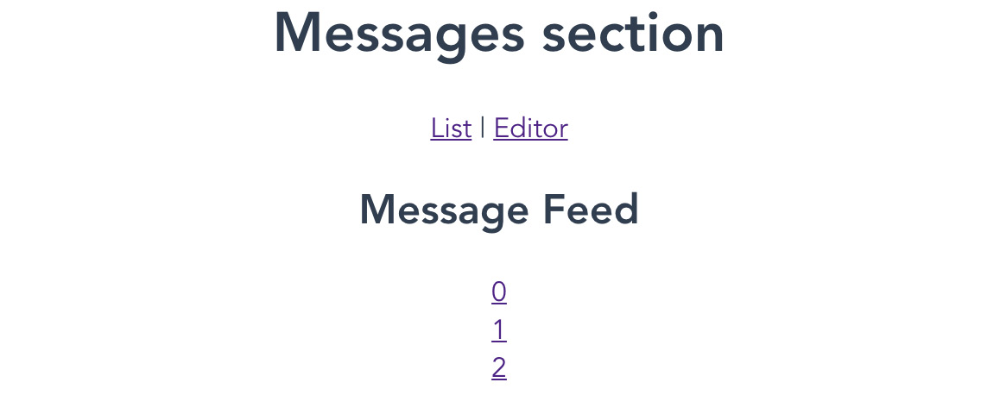

# 6. 路由

概述

在本章中，我们将了解路由和 Vue Router 是如何工作的。我们还将使用 Vue Router 在我们的应用中设置、实现和管理路由系统。然后我们将探讨动态路由以传递参数值，以及嵌套路由以在复杂应用中提高复用性。此外，我们还将探讨 JavaScript 钩子，这些钩子可用于认证和错误处理等功能。到本章结束时，您将准备好在任何 Vue 应用中处理静态和动态路由。

# 简介

在他们的 URL 栏中输入`website.com/about`，他们将被路由到关于页面。

在**单页应用**（**SPAs**）中，路由允许在应用内部进行平滑导航，无需刷新页面。在 Web 开发中，路由是我们决定如何将 HTTP 请求连接到处理它们的代码的匹配机制。当我们的应用需要 URL 导航时，我们使用路由。大多数现代 Web 应用包含大量不同的 URL，即使是单页应用。因此，路由在创建导航系统方面发挥着重要作用，并帮助用户快速在我们的应用和网络上移动。

简而言之，路由是应用根据提供的 URL 解释用户想要什么资源的一种方式。它是一个基于 URL 的 Web 资源导航系统，例如资产（图像和视频）、脚本和样式的路径。

# Vue Router

根据 Vue.js 文档所述，Vue Router 被官方推荐为任何 Vue.js 应用的路由服务。它提供了一个组件间通过路由进行通信的单个入口点，因此可以有效地控制应用流程，无论用户的行为如何。

通过丰富的功能，它简化了页面切换的过程，无需刷新页面。

## 设置 Vue Router

Vue Router 默认未安装；然而，当使用 Vue CLI 创建应用时，它很容易被启用。通过运行以下命令创建应用：

```js
vue create <your-project-name>
```

选择如图 6.1 所示的`手动选择功能`选项：


图 6.1：选择手动预设以创建新的 Vue.js 项目

在选择手动选择功能选项后，您将看到如图 6.2 所示的特性列表。在撰写本文时，默认选中了`Babel`和`Linter / Formatter`。使用*下箭头*键，导航到`Router`选项。当选项高亮时，按*空格键*启用它，然后按*Enter 键*继续。


图 6.2：将 Vue Router 添加到项目中

接下来，你将看到一个提示，询问你是否想为路由配置使用`history mode`，如图 6.3 所示。通过输入`Y`启用历史模式。历史模式允许在不需要默认 hash 模式重新加载的情况下在页面之间导航。我们将在本章稍后更详细地比较这两种模式：


图 6.3：使用历史模式配置 Vue Router

最后，继续进行其余的过程，我们将拥有一个准备就绪的 Vue.js 应用，其中包含 Vue Router。

注意

如果你想要将 Vue Router 添加到现有的 Vue.js 应用中，你可以使用以下命令将其作为应用依赖项安装：

`npm install vue-router`

下一步是理解`vue-router`如何实现浏览器 URL 与应用视图之间的同步的基本原理。

首先，让我们看看`router-view`元素。

# 路由视图元素

`router-view`元素是一个**功能性**组件，其中应用的路由系统加载用户接收到的任何给定 URL 路径的匹配和最新视图内容。

简而言之，`router-view`是一个 Vue 组件，其任务是执行以下操作：

+   渲染不同的子组件

+   自动在任意嵌套级别挂载和卸载，取决于给定的路由路径

没有使用`router-view`，在运行时几乎不可能正确渲染动态内容。例如，当用户导航到`Home`页面时，`router-view`会知道并只渲染与该页面相关的内。

在下一节中，我们将看到如何通过传递一个 prop 来设置应用的入口点（默认路由）。

# 使用 Props 定义应用的入口点

由于`router-view`是一个组件，它也可以接收 props。它接收的唯一 prop 是`name`，这是在初始化阶段在`router`对象中定义的相应路由记录中注册的相同名称。

任何其他额外的属性都会在渲染过程中直接传递给`router-view`的子组件。以下是一个带有 class 属性的示例：

```js
<router-view class="main-app-view"/>
```

如果`router-view`作为子组件渲染，我们可以在关联的模板中定义布局。一个非常简单的模板示例如下：

```js
<template>
  <div>Hello World</div>
</template> 
```

子组件接收传递的 class 属性，渲染后的实际输出如下：

```js
<div class="main-app-view">Hello World</div>
```

当然，为了使我们的模板有用，它也应该包含`<router-view/>`元素，这样我们想要路由的内容就有地方渲染。一个常见的设置是在模板中有一个导航菜单，下面是`router-view`。这样，内容在页面之间变化，但菜单保持不变。

导航到`App.vue`并确保你的模板中有以下代码：

```js
<template>
  <div id="app">
    <div id="nav">
      <router-link to="/">Home</router-link> |
      <router-link to="/about">About</router-link>
    </div>
    <router-view/>
  </div>
</template>
```

让我们移除`<div id="app">`内的所有代码，只留下一个单独的`<router-view/>`组件：

```js
<div id="app">
    <router-view/>
  </div>
```

我们现在将注释掉所有`routes`的代码，如下所示：

```js
const routes = [
  // {
  //   path: '/',
  //   name: 'Home',
  //   component: Home
  // },
  // {
  //   path: '/about',
  //   name: 'About',
  //   // route level code-splitting
  //   // this generates a separate chunk (about.[hash].js) for     this route
  //   // which is lazy-loaded when the route is visited.
  //   component: () => import(/* webpackChunkName: "about" */     '../views/About.vue')
  // }
]
```

现在我们应用的输出将渲染为在 `localhost:8080` 运行的空白页面，如图 6.4 所示：

![Figure 6.4：浏览器中的 Hello Vue Router 应用程序]

![img/B15218_06_04.jpg]

图 6.4：浏览器中的 Hello Vue Router 应用程序

输出是一个空白页面，因为我们没有在我们的文件中设置任何路由配置，包括将路径与相关视图进行映射。没有这一步，路由系统将无法选择正确的视图并将其动态渲染到我们的 `router-view` 元素中。

在下一节中，我们将看到如何设置 Vue Router。

# 为 Vue 设置 Vue Router

当我们将 Vue Router 添加到我们的项目中时，Vue CLI 会创建并添加一个 `router` 文件夹到代码目录中，其中包含一个单独自动生成的 `index.js` 文件。此文件包含我们路由所需的所有配置。

我们将导航到该文件，并查看 Vue Router 的基本预定义配置。

首先，你会注意到我们需要分别从 `vue` 和 `vue-router` 包中导入 `Vue` 和 `VueRouter`。然后我们调用 `Vue.use (VueRouter)` 来将其作为插件安装到我们的应用程序中：

```js
import Vue from 'vue'
import VueRouter from 'vue-router'
Vue.use(VueRouter)
```

`Vue.use` 是一个全局方法，如第五章 *全局组件组合* 中所述。它触发 `VueRouter` 的内部 `install` 方法，以及 Vue 构造函数，一旦 Vue 成为应用程序的全局变量。此方法具有内置机制以防止插件安装超过一次。

执行 `Vue.use(VueRouter)` 后，以下对象在任意组件中都可以访问：

+   `this.$router` – 全局路由对象

+   `this.$route` – 当前路由对象

`this` 指的是上下文中的组件。

现在我们已经在应用程序中注册了 Vue Router 的使用，接下来进行下一步——定义路由实例的配置对象的路由。

## 定义路由

在一个 Web 应用程序中，一个 `route` 是一个 URL 路径模式，并将其映射到特定的处理器。在现代 Web 开发中，`handler` 是一个组件，定义并位于一个物理文件中。例如，当用户输入路由 `localhost:8080//home` 时，如果 `Home` 映射到这个特定的路由，路由系统就会知道触发处理器 `Home` 来相应地渲染内容。

如前例所示，设置应用程序内导航的路由（或路径）至关重要。

每个路由都是一个对象字面量，其属性由 `RouteConfig` 接口声明：

```js
interface RouteConfig = {
  path: string,
  component?: Component,
  name?: string, // for named routes
  components?: { [name: string]: Component }, // for named views
  redirect?: string | Location | Function,
  props?: boolean | Object | Function,
  alias?: string | Array<string>,
  children?: Array<RouteConfig>, // for nested routes
  beforeEnter?: (to: Route, from: Route, next: Function) => void,
  meta?: any,
  // 2.6.0+
  caseSensitive?: boolean, // use case sensitive match? (    default: false)
  pathToRegexpOptions?: Object // path-to-regexp options for     compiling regex
}
```

应用程序所需的所有路由都位于 `routes` 的 `Array` 实例中：

```js
const routes = [
  //Route1,
  //Route2,
  //...
]
```

现在，让我们回到之前的文件，并取消注释 `routes` 中的代码。将会有两个预定义的路由，`home` 和 `about`，每个都是一个对象，位于 `routes` 数组中，以便于我们使用。

让我们以第一个路由为例，进行更详细的了解：

```js
  {
    path: '/',
    name: 'home',
    component: Home
  }
```

`path`属性是一个`/about`路径，将被转换为`<app domain>/about`（`localhost:8080/about`或`example.com/about`）。

在这种情况下，Vue Router 将`/`——空路径——理解为在没有其他指示符（例如，当用户导航到`<app-domain>`或`<app-domain>/`）后的默认路径，用于加载应用程序。

下一个属性是`name`，它是一个字符串，表示分配给目标路由的名称。尽管它是**可选的**，但强烈建议为每个路由定义一个名称，以利于代码维护和路由跟踪，我们将在本章后面的*传递路由参数*部分进一步讨论。

最后一个属性是`component`，它是一个 Vue 组件实例。`router-view`使用这个属性作为对视图组件的引用，在路径激活时渲染页面内容。

在这里，我们将路由定义为`home`路由，将其映射为应用的默认路径，并将其与`Home`组件关联以显示内容。

Vue CLI 也为这两个示例路由自动生成了两个简单的组件——`Home`和`About`。

在下一节中，我们将介绍一些在加载与路由一起使用的组件时可能有所帮助的技巧。

## 路由配置中加载组件的技巧

当然，我们需要在同一个`index.js`文件中导入组件，将其与目标路由关联起来。最经典和最受欢迎的方法是在文件顶部导入，如下所示：

```js
import Home from '../views/Home.vue'
```

通常这会被添加到主导入之下，如*图 6.5*所示：

![图 6.5：第 3 行导入 Home 组件 – src/router/index.js

![img/B15218_06_05.jpg]

图 6.5：第 3 行导入 Home 组件 – src/router/index.js

然而，一个更有效的方法是懒加载组件。

**懒加载**，也称为按需加载，是一种旨在优化网站或 Web 应用程序在运行时内容的技术。它有助于减少首次加载应用程序时的时间和资源消耗。这种优化对于确保最佳的用户体验至关重要，因为每一毫秒的等待都很重要。除此之外，懒加载还允许在路由级别进行更好的代码拆分，并在大型或复杂应用程序中进行性能优化。

我们可以利用`webpack`的优势来懒加载组件。我们可以在定义`about`路由名称之后动态添加以下内容，而不是像处理`Home`组件那样在文件顶部导入`About`组件（参见*图 6.5*）：

```js
component: () => import(/* webpackChunkName: "about" */   '../views/About.vue')
```

在这里，我们动态地懒加载`about`路由的`About`视图组件。在编译过程中，`webpack`为`about`路由生成一个具有指定名称（`"about"`）的单独块，并且只有在用户访问此路由时才加载它。

在大多数情况下，由于用户很可能会在第一次访问时停留在默认路径上，因此最好不懒加载默认组件（在我们的应用程序中是 `Home`），而是以正常方式导入它。因此，这里的建议是在设计路由时确定哪些组件应该被懒加载，并将两种方法结合起来以获得最大效益。

我们现在将看到如何设置路由实例。

## 设置路由实例

在定义了路由之后，最后一步是根据给定的配置选项创建 `router` 实例：

```js
const router = new VueRouter({
  mode: 'history',
  base: process.env.BASE_URL,
  routes
})
```

配置是一个对象，由不同的属性组成，有助于形成应用程序的路由。我们现在将在以下小节中检查这些属性。

### routes

`routes` 是必须传递给构造函数的选项。没有这个选项，路由器将无法识别路径并相应地将用户引导到合适的视图内容。

### mode

`mode` 决定了路由器的模式。在 `VueRouter` 中，URL 有两种模式：

+   `history` 模式：这通过 `HTML5 History` API 利用默认的 `history.pushState()` API。它允许我们在不重新加载页面的情况下进行 URL 导航，并使 URL 路径易于阅读，例如 `yourapplication.com/about`。

+   `hash` 模式：这使用哈希符号（`#`）来模拟 URL，例如，`yourapplication.com/#about` 用于 `about` 页面或 `youapplication/#/` 用于应用程序的 `home` URL。

### base

`base` 决定了应用程序的基本 URL。它将被设置为 `process.env.BASE_URL` 以允许开发人员从应用程序代码之外控制它（例如，从 `.env` 文件中）。因此，开发人员可以在运行时设置代码应该从中提供服务的目录。

现在已经解决了 `base` 的问题，我们已经创建了 `router` 实例。剩下要做的就是导出它：

```js
export default router
```

然后在 `main.js` 中导入它，在创建主应用实例的 `new Vue` 对象之前。我们仍然需要在实例配置中指定 `router`，如下所示：

```js
import router from './router'
Vue.config.productionTip = false
new Vue({
  router, //specify the router configuration for use
  render: h => h(App)
}).$mount('#app')
```

使用这段更新后的代码，我们的应用程序现在将按以下方式渲染：


图 6.6：浏览器中 Hello Vue Router 应用程序的首页

如果我们导航到 `localhost:8080/about`，我们将看到从自动生成的代码中渲染的 `about` 组件内容：

```js
<template>
  <div class="about">
    <h1>This is an about page</h1>
  </div>
</template>
```

网站应该看起来与 *图 6.7* 中所示相似：


图 6.7：浏览器中 "Hello Vue Router" 应用程序的关于页面

在本节中，我们探讨了如何使用懒加载组件来加速大型和复杂的 SPAs。我们还探讨了在设置路由时可以设置的某些选项，例如路由、模式和基础。在下一节中，我们将学习如何在 Vue Router 的帮助下实现和添加消息源页面。

## 练习 6.01：使用 Vue Router 实现和添加消息源页面

我们将创建一个新的页面，向用户显示消息列表。用户可以在浏览器中输入`localhost:8080/messages`路径时访问此页面。

要访问此练习的代码文件，请参阅[`packt.live/35alpze`](https://packt.live/35alpze)。

1.  使用`vue create`生成的应用程序作为起点，或者使用`vue-cli`创建一个新的应用程序。确保在生成项目时启用了路由，如本章前面所述：

    ```js
    vue create Exercise6.01
    ```

1.  让我们在`./src/views/`文件夹中添加一个名为`MessageFeed.vue`的新视图组件：

    ```js
    <template>
      <div>
        <h2> Message Feed </h2>
        <p v-for="(m, i) in messages" :key="i">
        {{ m }}
        </p>
    </div>
    </template>
    <script>
    export default {
      data() {
        return {
          messages: [
            'Hello, how are you?',
            'The weather is nice',
            'This is message feed',
            'And I am the fourth message'
          ]
        }
      }
    }
    </script>
    ```

1.  在`src/router/index.js`中创建一个路由文件。它应该导入`VueRouter`并告诉 Vue 使用该路由，如下所示：

    ```js
    import Vue from 'vue'
    import VueRouter from 'vue-router'
    import Home from '../views/Home.vue'
    Vue.use(VueRouter)
    ```

1.  接下来，在`./src/router/index.js`文件中，我们声明了一个用于`MessageFeed`的路由，命名为`messageFeed`，并将其路径设置为`/messages`。我们还将懒加载该组件。这一步将通过将包含所需信息的对象附加到`routes`数组中来完成：

    ```js
    export const routes = [
      {
        path: '/',
        name: 'home',
        component: Home
      },
      {
        path: '/about',
        name: 'about',
        // route level code-splitting
        // this generates a separate chunk (about.[hash].js) for       this route
        // which is lazy-loaded when the route is visited.
        component: () => import(/* webpackChunkName: "about" */ '../      views/About.vue')
      }, {
        path: '/messages',
        name: 'messageFeed',
        component: () => import(/* webpackChunkName: "messages" */ '../      views/MessageFeed.vue')
      }
    ]
    ```

1.  最后，在同一个文件中，使用我们定义的`routes`创建一个`router`实例：

    ```js
    const router = new VueRouter({
      mode: 'history',
      base: process.env.BASE_URL,
      routes
    })
    export default router
    ```

1.  使用以下命令运行应用程序：

    ```js
    yarn serve
    ```

1.  当在浏览器中访问`localhost:8080/messages`时，页面应该显示正确的内容——即如图所示的`Message Feed`页面：

图 6.9：应用程序渲染的消息源页面

这展示了如何简单地将一个新的页面路由添加到 Vue.js 应用程序中，同时保持代码组织良好且易于阅读。现在我们已经准备好了可用的路由，我们可以为用户提供在页面之间导航的能力，而无需输入完整的路径。

## 设置导航链接

如果`router-view`负责根据 URL 路径渲染正确的活动视图内容，那么`router-link`是一个 Vue 组件，它帮助用户在启用了路由的应用程序中进行导航。默认情况下，它渲染一个带有由其`to`属性生成的正确`href`链接的锚标签`<a>`。

在我们由 Vue CLI 生成的示例应用程序中，由于有两个预填充的路由，因此也在`App.vue`的`<template>`部分添加了两个`router-link`实例，位于`<router-view/>`之前：

```js
<div id="nav">
  <router-link to="/">Home</router-link> |
  <router-link to="/about">About</router-link>
</div>
```

由于我们使用`base`选项和`history`模式，每个`router-link`的`to`属性应该接收与目标`route`对象中声明的`path`属性相同的值。

此外，由于我们的路由已命名，`to`属性的一个替代方案是使用与名称相同的值，而不是路径。使用名称被高度推荐，以避免在需要调整应用程序中某些路由的路径时进行复杂的链接重构。因此，我们可以将链接重写如下：

```js
<div id="nav">
      <router-link to="home">Home</router-link> |
      <router-link to="about">About</router-link> |
    </div>
```

我们还可以选择将位置描述符对象绑定到`to`属性，其格式类似于`route`对象。考虑以下示例：

```js
  <router-link :to="{path: '/'}">Home</router-link>
```

此外，当相关路由处于活动状态时，将向`<a>`标签添加一个额外的`CSS`类`router-link-active`。这个类可以通过`router-link`组件的`active-class`属性进行自定义。

在`DevTools`中，我们可以看到`router-link`组件的渲染方式如下：


图 6.10：浏览器 DevTools 中的 router-link

浏览器中的视图将如下所示：


图 6.11：带有导航链接的 Hello Vue Router 应用首页

注意，由于我们可以在组件内部访问`this.$router`，我们可以通过使用`this.$router.push()`以编程方式触发导航路由，并传递一个路径或类似`to`的路由对象：

```js
      this.$router.push('/home')
```

在本节中，我们创建了一个示例页面，在`/messages`路由位置渲染消息列表。我们还探讨了如何使用`<router-link/>`元素在视图之间进行导航，其方式与传统 HTML `<a>`标签类似。

接下来，我们将看到如何以类似于网络浏览器*后退*按钮的方式，以编程方式将用户发送到他们最后查看的路由。

### 实现返回按钮的小技巧

有时我们希望导航回上一页。使用`this.$router.push()`可以实现这一点，但这会在历史堆栈中添加更多路由，而不是返回。正确的技术是使用`this.$router.go(steps)`，其中`steps`是一个整数，表示在历史堆栈中后退/前进的步数。此功能与`window.history.go(steps)`类似。

考虑以下示例：

```js
this.$router.go(-1) // similar to window.history.back()  -   go back one page
```

此外，您还可以使用相同的方法导航到之前加载且仍然存在于历史堆栈中的页面：

```js
this.$router.go(1) // similar to window.history.forward() –   go forward one page
```

在本节中，我们探讨了如何手动访问路由的历史记录，以便将用户发送到他们之前所在的页面。

在下一节中，我们将利用导航链接将我们的新消息馈送页面添加到应用程序的`nav`菜单中。

## 练习 6.02：将导航链接添加到 MessageFeed 路由

我们将使用`to`属性和`router-link`（如前文所述）添加一个快速链接到我们在*练习 6.01*中创建的`MessageFeed`路由，即*使用 Vue Router 实现和添加消息馈送页面*。

要访问此练习的代码文件，请参阅[`packt.live/3lr8cYR`](https://packt.live/3lr8cYR)。

1.  使用 Vue 生成的起始应用程序作为起点，或者使用`Vue cli`创建一个新的应用程序。确保在生成项目时启用路由，如本章前面所述：

    ```js
    vue create Exercise6.02
    ```

1.  在`./src/App.vue`文件中，除了为`home`和`about`自动生成的`router-link`组件外，还需要添加另一个指向`Message Feed`标题下`/messages`路径的`router-link`组件：

    ```js
    <template>
      <div id="app">
        <div id="nav">
          <router-link to="/">Home</router-link> |
          <router-link to="/about">About</router-link> |
          <router-link to="/messages">Message Feed</router-link>
        </div>
        <router-view/>
      </div>
    </template>
    ```

    我们将看到在任何视图中都可用导航链接，并且当用户导航离开时它们不会消失，因为它们不是`router-view`组件的一部分。我们的屏幕应该如下所示：

    

    图 6.12\. 更新后的导航链接的 Hello Vue Router 应用首页

1.  让我们将`to`值更改为指向名为`messageFeed`的对象，这与在`./src/App.vue`中为该路由指定的`name`相同：

    ```js
    <router-link :to="{ name: `messageFeed` }">Message Feed   </router-link>
    ```

1.  导航应该与之前一样工作；点击`消息流`链接应将您导向`/messages`，如下面的截图所示：

    图 6.13：点击消息流链接后的 Hello Vue Router 的消息流页面

1.  现在，打开位于`./src/router/`文件夹中的`index.js`文件，将`messageFeed`路由定义的路径从`/messages/`更改为`/messagesFeed`：

    ```js
    export const routes = [
      {
        path: '/',
        name: 'home',
        component: Home
      },
      {
        path: '/about',
        name: 'about',
        // route level code-splitting
        // this generates a separate chunk (about.[hash].js) for       this route
        // which is lazy-loaded when the route is visited.
        component: () => import(/* webpackChunkName: "about" */ '../views/About.vue')
      }, {
        path: '/messagesFeed',
        name: 'messageFeed',
        component: () => import(/* webpackChunkName: "messageFeed" */       '../views/MessageFeed.vue')
      }
    ]
    ```

1.  使用以下命令运行应用程序：

    ```js
    yarn serve
    ```

    导航到应用的`首页`并再次点击`消息流`。它应该显示与之前相同的`消息流`页面，但请注意 URL 路径已更改为`/messagesFeed`：

    

图 6.14：使用更新后的 URL 路径渲染的消息流页面

注意，仅用一行代码就可以轻松设置指向`/messages`路径的链接，以及更新相关路径而不需要重构。到目前为止，我们只定义了一些简单的路由，没有为目标路由添加任何额外的参数。这将是我们的下一个挑战。

# 传递路由参数

在本章的前几节中，每个路由都是一个独立的视图，不需要传递或连接任何数据到其他路由。但路由的力量不仅限于此。通过**命名**路由，我们还可以轻松地启用路由之间的数据通信。

在我们的示例应用中，我们希望我们的`about`页面能够接收一个名为`user`的数据字符串，作为用户名从链接触发。这可以通过将`to`属性从字符串字面量更改为对象字面量`:to="{ name: 'about' }"`来实现，然后向该对象添加一个新的`params: { user: 'Adam' }`属性：

```js
<router-link :to="{ name: 'about', params: { user: 'Adam' }}">
  About
</router-link>
```

此更改通知路由器在用户点击目标链接时将所需的参数传递给`About`页面。这些额外的参数在渲染的`href`链接中不可见，如下面的截图所示：


图 6.15：生成的 href 链接没有参数

然而，Vue 系统正在跟踪这些额外的参数。使用 Vue DevTools，我们可以通过展开如图 6.16 所示的`to`属性来查看参数：


在`About.vue`文件中，由于我们可以访问当前活动的`$route`（参见本章前面提到的*Vue Router*部分），我们可以检索通过链接传递的数据，并将其作为`$route.params.user`获取并打印出来：

```js
<template>
  <div class="about">
    <h1>About {{$route.params.user}}</h1>
  </div>
</template>
```

输出将如下所示：


任何`params`的 prop 用户都不会出现在 URL 路径上，从而保持路径的整洁，并确保视图之间传递的数据的安全性。

但是使用`$route.params.user`既不方便也不易读，并且从长远来看不利于组件的可重用性。我们可以通过在组件内部解耦传递的`params`与`props`来改进这一点。

我们现在将看到如何借助`props`解耦`params`。

# 使用属性解耦参数

在`index.js`文件中，让我们调整`about`路由的配置，添加一个名为`props`的额外属性。通过将此属性的值设置为`true`，路由器将自动理解并将`$route.params`映射到相应的`props`组件：

```js
{
    path: '/about',
    name: 'about',
    component: () => import(/* webpackChunkName: "about" */       '../views/About.vue'),
    props: true
  }
```

在`About.vue`文件中，我们将声明`props`类型如下：

```js
props: {
    user: String
  }
```

在`<template>`部分，我们将`$route.params.user`替换为`user`：

```js
<template>
  <div class="about">
    <h1>About {{user}}</h1>
  </div>
</template>
```

输出仍然相同，如下面的截图所示：


并映射到属性


此外，你还可以在`route`配置的`props`属性中定义你想要传递的数据。与布尔值不同，现在`props`可以声明为一个对象，包含所需的数据，如下例所示：

```js
{
    path: '/about',
    name: 'about',
    component: () => import(/* webpackChunkName: "about" */       '../views/About.vue'),
    props: { age: 32 }
  }
```

通过类似的步骤，我们将在`About.vue`中将`age`声明为`props`组件，并将其作为文本打印到屏幕上：

```js
<template>
  <div class="about">
    <h1>About {{user}}</h1>
    <h2>Age: {{age}}</h2>
  </div>
</template>
<script>
export default {
  props: {
    user: String,
    age: Number
  }
}
</script>
```

现在当点击`About`页面时，页面将渲染如下：


我们之前用户数据不再可见！这是因为，现在，`props`在`About`路由的配置中声明为静态数据，并且不能从外部覆盖。它的值在整个在应用程序中导航的过程中将保持不变，无论我们在目标`router-link`组件的`to`属性的`params`中传递什么值。

我们现在将学习如何将所选消息的内容传递到新消息页面并打印出来。

## 练习 6.03：将所选消息的内容传递到新消息页面并打印出来

我们将从*练习 6.02*继续，*将导航链接添加到消息推送路由*，在那里我们定义了`MessageFeed`路由，其 URL 路径为`messages`。此视图将在视图组件选项的`data`属性中渲染预定义的消息列表。

在这个练习中，我们将创建一个新的`message`页面，专门用于渲染用户选择的消息内容。它应该是可重用的。

要访问此练习的代码文件，请参阅[`packt.live/36mTwTY`](https://packt.live/36mTwTY)。

1.  在`./src/views/`文件夹中，我们创建了一个新的单文件组件`Message.vue`。该组件接收一个类型为`string`的`content`属性，并在`<p>`标签下渲染它：

    ```js
    <template>
        <div>
            <p>{{content}}</p>
        </div>
    </template>
    <script>
    export default {
        props: {
            content: {
                default: '',
                type: String
            }
        }
    }
    </script>
    ```

1.  让我们将创建的视图组件注册到`./src/router/index.js`中的现有`routes`。我们将定义一个新的路由为`message`，路径为`/message`。它还将接受`props: true`，以便将传递给路由的所有参数相应地映射到相关属性。将要使用的完整路由列表如下：

    ```js
    export const routes = [
      {
        path: '/',
        name: 'home',
        component: Home
      },
      {
        path: '/about',
        name: 'about',
        component: () => import(/* webpackChunkName: "about" */       '../views/About.vue')
      },
      {
        path: '/messages',
        name: 'messageFeed',
        component: () => import(/* webpackChunkName: "messages" */ '../views/MessageFeed.vue')
      },
      {
        path: '/message',
        name: 'message',
        component: () => import(/* webpackChunkName: "message" */ '../views/Message.vue'),
        props: true
      }
    ]
    ```

1.  由于路由已注册并准备好使用，我们需要修改`./src/views/MessageFeed.vue`中的`<template>`部分，以确保每条消息现在都是可点击的，并且在点击时将用户重定向到新路由。让我们将`<p>`标签替换为`router-click`。因为我们已经将新路由命名为`message`，所以我们将`to`设置为绑定到`{ name: 'message' }`：

    ```js
    <template>
      <div>
      <h2> Message Feed </h2>
      <div v-for="(m, i) in messages" :key="i" >
        <router-link :to="{ name: 'message'}">
          {{ m }}
        </router-link>
      </div>
    </div>
    </template>
    ```

1.  在`template`中，我们将添加一个包含我们`messages`的一些示例数据的`script`标签：

    ```js
    <script>
    export default {
      data() {
        return {
          messages: [
            'Hello, how are you?',
            'The weather is nice',
            'This is message feed',
            'And I am the fourth message'
          ]
        }
      }
    }
    </script>
    ```

1.  当你打开`./messages`页面时，现在所有消息都是可点击的，如下面的截图所示：

    图 6.20：更改消息为可点击后的消息推送页面

1.  现在当用户点击一条消息时，它将打开一个新页面。然而，页面内容将是空的，因为我们没有将任何内容参数传递给`<route-click>`组件，如下面的截图所示：

    图 6.21：无内容生成的消息页面

1.  让我们回到`./src/views/MessageFeed.vue`并添加`params: { content: m }`：

    ```js
    <template>
      <div>
      <h2> Message Feed </h2>
      <div v-for="(m, i) in messages" :key="i" >
        <router-link :to="{ name: 'message', params: { content: m       }}">
          {{ m }}
        </router-link>
      </div>
    </div>
    </template>
    ```

1.  现在当你点击第一条消息“你好，你好吗？”，输出将是以下内容：

图 6.22：已渲染点击消息内容的消息页面

简单，不是吗？我们已经使用`router-link`以及组件的`params`和`props`的组合，动态完成了从消息流到单个选中消息详细页面的流程。然而，这种方法有一个显著的缺点。

当你仍然位于第一条消息的`./message`路径上时，让我们刷新页面。输出将与*步骤 5*中的相同——一个空的内容页面。刷新后，路由被触发，没有传递任何`content` `params`，与用户点击特定链接时不同，之前传递的`params`也没有被保存或缓存。因此，没有内容。

在以下部分，我们将学习如何拦截导航流程，并使用**路由钩子**解决这个问题。

# 路由钩子

路由导航的一般流程在以下图中描述：


图 6.23：导航解析流程图

一旦在某个路由上触发导航，Vue Router 为开发者提供了几个主要的导航守卫或钩子，用于保护或拦截该导航过程。这些守卫可以是全局的或组件内的，具体取决于类型。以下是一些示例：

+   全局：`beforeEach`、`beforeResolve`和`afterEach`

+   每个组件：`beforeEnter`

+   组件内：`beforeRouteUpdate`、`beforeRouteEnter`和`beforeRouterLeave`

如*图 6.23*所示，只有当所有钩子或守卫（包括任何异步守卫）都解析完成后，导航才被认为是完成的。现在，让我们看看如何设置`beforeEach`钩子。

## 设置`beforeEach`钩子

`beforeEach`是一个全局钩子，在导航开始时（前一个视图组件的`beforeRouteLeave`）被调用。它应该在`index.js`文件初始化时定义为一个`router`实例的全局方法，并采用以下语法：

```js
const router = new VueRouter({
  //...
})
router.beforeEach(beforeEachCallback)
```

在前面的代码片段中，`beforeEachCallback`是一个`hook`函数，它接收三个参数：

```js
const beforeEachCallback = (
  to, // The destination route
  from, //The source route
  next //The function to trigger to resolve the hook
) => { … })
```

或者我们可以直接这样写：

```js
router.beforeEach((to, from, next) => { … })
```

例如，如果我们想在用户导航到没有用户参数值的`About`时显示不同的页面来显示通用消息，我们可以将`beforeEach`钩子配置如下：

```js
router.beforeEach((
  to, // The destination route
  from, //The source route
  next //The function to trigger to resolve the hook
) => {
  if (to.name === 'about' && (!to.params || !to.params.user)) {
    next({ name: 'error' })
  }
  else {
    next();
  }
})
```

在这里，我们检查目标路由是否为`about`，并且没有传递任何额外的`params`，也没有为`user`参数传递任何值，我们将导航到`error`路由，而不是正常进行，使用`next()`。

注意

`next()`必须调用（如果`else`），否则将出现错误。

我们仍然需要创建一个带有`Error.vue`视图组件的`error`页面，该组件显示一条简单的消息：

```js
<template>
    <div>
        <h2>No param passed.</h2>
    </div>
</template>
```

还要确保相应地注册路径：

```js
{
    path: '/error',
    name: 'error',
    component: () => import(/* webpackChunkName: "error" */       '../views/Error.vue'),
  }
```

现在，在`Home`视图中，点击`About`链接后，应用将渲染`Error`页面，而不是`About`页面，如以下截图所示：


图 6.24：点击 About 时未传递任何参数显示的错误页面

现在，让我们转到`App.vue`文件，并将`to`属性绑定到`{ name: 'about', params: { user: 'Adam' }}`对象上：

```js
      <router-link :to="{ name: 'about', params: { user: 'Adam'         }}">About</router-link>
```

让我们导航回应用的`Home`页面并点击`About`链接。由于我们传递了正确的`params`，输出将如下所示：


图 6.25：当在`params`中传递用户时显示的“关于”页面

此外，从现在开始，每次我们刷新“关于”页面时，都会被重定向到“错误”页面，因为没有在刷新时传递`user`参数。

我们现在将探讨`beforeEach`和`beforeResolve`钩子之间的一些关键区别点。

## 区分 beforeEach 和 beforeResolve 钩子

我们还可以使用相同的语法使用`beforeResolve`注册全局钩子。然而，与在导航创建阶段触发的`beforeEach`不同，`beforeResolve`将在导航执行和确认之前触发，**在所有钩子（全局和组件内）解析之后**：

```js
router.beforeResolve((
  to, // The destination route
  from, //The source route
  next //The function to trigger to resolve the hook
) => {
  if (to.name === 'about' && (!to.params || !to.params.user)) {
    next({ name: 'error' })
  }
  else {
    next();
  }
})
```

输出结果将与*图 6.25*相同：


图 6.26：当在`params`中传递用户时显示的“关于”页面

现在我们来详细看看`afterEach`钩子。

## afterEach 钩子

`afterEach()`钩子是在导航确认后（这意味着在`beforeResolve()`之后）被触发的最后一个全局导航守卫。与其他全局守卫不同，传递给`afterEach()`的钩子函数不会接收`next`函数，因此它不会影响导航。

此外，`to`和`from`参数是只读的`Route`对象。因此，`afterEach`的最佳用例是保存数据，例如为“返回”按钮保存最后访问的`Route`对象，传递给路由目标的`params`，或页面视图跟踪。例如，我们可以设置一个默认值`user`，并在需要时赋值并保存：

```js
let user = 'Adam';
router.beforeEach((to, from, next) => {
  if (to.name === 'about' && (!to.params || !to.params.user)) {
    next({ name: 'about', params: { user }})
  }
  else {
    user = to.params.user;
    next()
  }
});
router.afterEach((to, from) => {
  if (to.name === 'about' && to.params && to.params.user) {
    user = to.params.user;
  }
})
```

现在在`App.js`文件中，除了`Adam`外，添加以下内容：

```js
<router-link 
  :to="{ name: 'about', params: { user: 'Adam' }}"
>
  About
</router-link>
```

让我们将其更改为`Alex`：

```js
<router-link 
  :to="{ name: 'about', params: { user: 'Alex' }}"
>
  About
</router-link>
```

点击`About`链接时的输出如下所示：


图 6.27：显示新用户名字的“关于”页面 – Alex

但是在重新加载时，由于传递了`params`中的用户，`About`页面将渲染为默认用户`Adam`，如下所示：


图 6.28：在重新加载时显示默认用户值“Adam”的“关于”页面

在本节中，我们探讨了`afterEach`钩子。我们使用`afterEach`钩子将数据传递到`about`页面，而无需在 URL 中包含该数据。同样的技术可以用于更新其他行为，例如按下“返回”按钮时希望的目标页面。

## 根据路由个性化钩子

而不是定义一个全局钩子，这可能会引起未知的错误并需要路由检查，我们可以在目标路由的配置对象中直接定义 `beforeEnter` 守卫，例如，我们的 `About` 路由：

```js
beforeEnter: (to, from, next) => {
      if (!to.params || !to.params.user) {
        to.params.user = 'Adam'
      }
      next()
    }
```

使用这种方法，无论是重新加载还是点击链接导航到 `About` 页面，输出现在都是一致的，如下面的截图所示：

![图 6.29：使用用户值 Adam 渲染的关于页面]

![图片 B15218_06_29.jpg]

图 6.29：使用用户值 Adam 渲染的关于页面

注意

使用 `beforeEnter()`，`to` 是可写的，你将能够访问 `this`（指向特定的路由 - `About`）。它只会在用户触发导航到 `About` 页面时被触发。

在本节中，我们探讨了 Vue 中可用的不同路由钩子，包括 `beforeEach`、`beforeResolve` 和 `afterEach`。我们看到了每个钩子如何在路由过程中的不同点被调用。作为一个实际例子，我们查看了一个路由，如果没有提供参数，则将用户重定向到错误页面。这些钩子在设置认证路由时非常有用。在下一节中，我们将探讨设置组件内部的钩子。

# 设置组件内部的钩子

最后，我们还可以使用组件内部的钩子作为组件生命周期钩子，在需要将钩子作用域限定在组件级别以更好地维护代码或增强工作流程的情况下。

我们现在可以定义如下的 `beforeRouteEnter()` 钩子来拥有 `About` 组件：

```js
<script>
export default {
  data() {
    return {
      user: ''
    }
  },
  beforeRouteEnter(to, from, next) {
    if (!to.params || !to.params.user) {
      next(comp => {
        comp.user = 'Alex'
      })
    }
    else {
      next();
    }
  }
}
</script>
```

正如你所见，在 `beforeRouteEnter` 期间，我们没有访问组件的 `this` 作用域，因为视图组件在触发时的那一刻仍在创建中。幸运的是，我们可以通过传递给 `next()` 的回调函数来访问实例。每当导航被确认，即组件被创建时，回调函数将被触发，组件实例将作为回调函数的唯一参数（`comp`）可用。

注意

对于 `beforeRouteUpdate` 和 `beforeRouteLeave`，组件已经被创建，因此这个实例是可用的，不需要为 `next()` 提供回调函数。实际上，回调函数仅在 `beforeRouteEnter()` 的使用中支持 `next()`。

当相同的组件被用于不同的路由时，会调用 `beforeRouteUpdate`。这适用于我们使用动态路由的情况，这将在下一节中讨论。

当组件即将被停用或用户即将离开当前视图时，会触发 `beforeRouteLeave`。这发生在新导航的 `beforeEach` 守卫之前，通常用于编辑组件以防止用户在不保存的情况下离开。

在这个守卫中，我们可以通过向 `next()` 函数传递 `false` 来取消新的导航。

例如，假设我们在 `About.vue` 文件的组件选项中添加以下钩子：

```js
//...
  beforeRouteLeave(to, from, next) {
    const ans = window.confirm('You are about to leave the About       page. Are you sure?');
    next(!!ans);
  }
```

当我们从“关于”页面导航离开时，会出现一个弹出对话框请求确认，如下面的截图所示，然后继续相应地导航：


图 6.30：在离开“关于”页面之前请求确认的对话框

在本节中，我们探讨了设置组件内钩子，即仅限于特定组件的钩子。我们为我们的`About`组件设置了一个组件内钩子，在用户离开页面之前要求用户确认。在下一节中，我们将把消息列表移动到外部文件，以便仅在`MessageFeed`可见时加载。

## 练习 6.04：将消息列表提取到外部文件并在 MessageFeed 可见时加载

回到*练习 6.03*，*将选中消息的内容传递到新消息页面并打印出来*，现在我们将使用`beforeEnter`和`beforeRouteEnter`路由钩子进行一些代码增强。这个练习旨在让你更熟悉使用路由钩子。

要访问此练习的代码文件，请参阅[`packt.live/3lg1F2R`](https://packt.live/3lg1F2R)。

1.  让我们从`./src/views/MessageFeed.vue`中提取`messages`静态数据并将其保存到`./src/assets/messages.js`中：

    ```js
    const messages = [
      'Hello, how are you?',
      'The weather is nice',
      'This is message feed',
      'And I am the fourth message'
    ];
    export default messages;
    ```

1.  在`./src/views/MessageFeed.vue`中，我们将用`props: { messages: { type: String, default: [] }}`替换本地数据属性：

    ```js
    export default {
      props: {
        messages: {
          type: Array,
          default: () => []
        }
      }
    }
    ```

1.  现在，我们需要在导航到“消息”路由时加载消息列表并将其分配给`messages`参数。我们将通过使用路由配置对象中的`beforeEnter`钩子来完成此操作。别忘了添加`props: true`以将`params`标准化为相关的`props`以进行渲染。你可以通过修改`src/router/index.js`中定义的`route`来实现这一点：

    ```js
    {
        path: '/messages',
        name: 'messageFeed',
        component: () => import(/* webpackChunkName: "messages" */       '../views/MessageFeed.vue'),
        props: true,
        async beforeEnter(to, from, next) {
          next()
        }
      },
    ```

1.  我们将使用`import`懒加载消息列表：

    ```js
    const module = await import (/* webpackChunkName: "messagesFeed"   */ '../assets/messages.js');
    ```

1.  然后，按照以下方式检索所需信息：

    ```js
      const messages = module.default;
      if (messages && messages.length > 0) {
        to.params.messages = messages;
      }
    ```

1.  `src/router/index.js`中路由的完整代码应该是以下内容：

    ```js
    {
        path: '/messages',
        name: 'messageFeed',
        component: () => import(/* webpackChunkName: "messages" */       '../views/MessageFeed.vue'),
        props: true,
        async beforeEnter(to, from, next) {
          if (!to.params || !to.params.messages) {
            const module = await import (/* webpackChunkName:           "messagesFeed" */ '../assets/messages.js');
          const messages = module.default;
            if (messages && messages.length > 0) {
              to.params.messages = messages;
            }
          }
          next()
        }
      },
    ```

    在查看网站时，我们应该看到一个类似于上一个练习的消息推送。如下面的截图所示：

    

图 6.31：重构后的消息推送页面

到目前为止，我们已经学习和实践了如何使用不同的路由钩子配置路由、传递参数以及拦截应用中页面间的导航。在下一节中，我们将探讨一个更高级的主题——**动态路由**。

# 动态路由

如果有很多遵循相同格式的大量数据，例如用户列表或消息列表，并且需要为每个创建一个页面，我们需要使用路由模式。使用路由模式，我们可以根据一些附加信息从相同的组件动态创建新路由。例如，我们想要为每个用户渲染 `User` 视图组件，但具有不同的 `id` 值。Vue Router 提供了我们使用冒号（`:`）表示的动态段来实现动态路由的能力。

我们不使用 `params`，因为 `params` 在刷新时不会持久化其值，也不会出现在 URL 中，我们直接在路径中定义所需的 `params`，如下所示：

```js
{
    path: '/user/:id',
    name: 'user',
    component: () => import(/* webpackChunkName: "user" */       '../views/User.vue')
  }
```

在前面的代码中，`:id` 表示这里的 `params` 不是静态的。当路由与给定的模式匹配时，Vue Router 将渲染相应的组件，并保持 URL 不变。`:id` 的值将作为该视图组件实例中的 `this.$route.params.id` 暴露：

```js
<template>
  <div>
    <h1>About a user: {{$route.params.id}}</h1>
  </div>
</template>
```

当用户选择 `/user/1` 和 `/user/2` 等 URL 时（`./src/App.vue`），Vue 将自动使用我们的模板生成子页面。

导航路径将被映射到相同的路由模式组件，但带有不同的信息，如下面的截图所示：


图 6.32：导航到 /user/2

当你点击 `User 1` 时，你会看到以下内容：


图 6.33：导航到 /user/1

我们也可以使用 `props: true` 将 `id` 标准化到 `User` 组件的 `props` 中，并与 `beforeRouteEnter()` 结合，在实例创建和渲染之前加载数据：

```js
<script>
import users from '../assets/users.js';
export default {
  props: {
    id: Number
  },
  data() {
    return {
      name: '',
      age: 0
    }
  },
  beforeRouteEnter(to, from, next) {
    next(vm => {
      const user = users[vm.id];
      vm.name = user.name;
      vm.age = user.age;
    })
  }
}
</script>
```

现在，我们可以调整 `<template>` 来打印出用户的详细信息：

```js
<template>
  <div>
    <h1>About a user: {{$route.params.id}}</h1>
    <h2>Name: {{name}}</h2>
    <p>Age: {{age}}</p>
  </div>
</template>
```

选择 `/user/1` 时的输出将如下所示：


图 6.34：使用更新后的 UI 导航到 /user/1

如果我们在 `user/:id` 路由中更改 `:id` 为另一个用户，我们需要相应地更新本地数据，因为在这种情况下 `beforeRouteEnter` 不会再次触发。实际上，组件的所有生命周期钩子都不会被调用，因为组件实例不会被重新创建：

```js
beforeRouteUpdate(to, from, next) {
    const user = users[to.params.id - 1];
    this.name = user.name;
    this.age = user.age;
    next();
  }
```

在本节中，我们通过设置一个从给定 URL 提取参数的路由来查看动态路由。这项技术允许你创建用户友好的 URL 并动态地将信息传递给路由。在下一节中，我们将查看捕获错误路径。

## 捕获错误路径

除了主页（`'/'`）之外，我们还需要记住处理的其他重要路由包括错误路由，例如当 URL 路径不匹配任何已注册路径时的 `404 Not found` 等。

对于`404 未找到`，我们可以使用`regex`星号`*`，它代表*匹配所有内容*来收集所有不匹配路由的情况。此路由器的配置应位于数组`routes`的末尾，以避免匹配错误路径：

```js
{
    path: '*',
    name: '404',
    component: () => import(/* webpackChunkName: "404" */       '../views/404.vue'),
  }
```

当我们为`/users`输入错误的路径时，输出将如下所示：


图 6.35：当'/users'路径未找到时重定向到 404

在本节中，我们探讨了如何使用`*`正则表达式通配符来创建一个显示给所有导航到不存在路由的人的`404`页面。接下来，我们将实现一个消息路由，使用动态路由模式在 URL 本身传递相关数据。

## 练习 6.05：使用动态路由模式为每个消息实现消息路由

回到我们的消息源在*练习 6.04*中，*将消息列表提取到外部文件并在 MessageFeed 视图中加载*，我们将重构我们的`Message`路径，使用路由模式在用户选择时动态导航到特定的消息路径。这将使你熟悉在与其他导航钩子结合时创建和维护动态路由。

要访问此练习的代码文件，请参阅[`packt.live/32sWogX`](https://packt.live/32sWogX)。

1.  让我们打开`./src/router/index.js`，将消息路由的路径配置更改为`/message/:id`，其中`id`将是消息列表中该`message`的索引：

    ```js
    {
        path: '/message/:id',
        name: 'message',
        component: () => import(/* webpackChunkName: "message" */       '../views/Message.vue'),
        props: true,
    }
    ```

1.  现在导航到`./src/views/MessageFeed.vue`，并将每个消息的`router-link`的`to`属性更改为以下内容：

    ```js
    <router-link :to="`/message/${i}`">
    ```

1.  让我们回到`./src/router/index.js`，并将`beforeEnter`定义为异步钩子，用于将消息内容懒加载到我们的`Message`组件的内容属性中：

    ```js
    async beforeEnter(to, from, next) {
          if (to.params && to.params.id) {
            const id = to.params.id;
            const { module } = await import (/* webpackChunkName:           "messagesFeed" */ '../assets/messages.js');
            const messages = module.default;
            if (messages && messages.length > 0 && id <           messages.length) {
              to.params.content = messages[id];
            }
          }
          next()
        },
    ```

1.  使用以下命令运行应用程序：

    ```js
    yarn serve
    ```

    当点击`消息源`中的第一条消息时，下一页将如下所示：

    

图 6.36：访问/message/0 路径时显示的页面

现在你已经学会了如何使用动态路由，你可以进一步探索更多层级的路由模式，如`message/:id/author/:aid`。然而，对于这种情况，我们通常采用更好的方法，**嵌套路由**。

# 嵌套路由

在现实中，许多应用程序由由多个多级嵌套组件组成的组件构成。例如，`/user/settings/general`表示一个通用视图嵌套在`settings`视图中，而这个`settings`视图又嵌套在`user`视图中。它代表用户设置页面的`通用信息`部分。

大多数时候，我们希望 URL 与以下截图所示的结构相对应：


图 6.37：具有两个嵌套视图（信息和个人资料）的用户

Vue Router 通过使用`嵌套`路由配置和`router-view`组件，使实现这种结构变得简单。

让我们回到之前示例中的`User.vue`视图（位于`./src/views/`），并在`<template>`部分添加一个嵌套的`router-view`组件：

```js
<div>
  <h1>About a user: {{$route.params.id}}</h1>
  <router-link :to="{ name: 'userinfo', params: { id: id }}">Info     </router-link> |
  <router-link :to="/user/${id}/extra">Extra</router-link>
  <router-view/>
  </div>
```

为了开始向此`router-view`渲染组件，我们将配置`user`路由以具有子选项，该选项接受子路由的路线配置数组。在我们的示例中，我们将为每个用户添加一个“信息”和“额外”页面。这些子路由将通过`/user/:id/info`和`/user/:id/extra`访问，为每个用户提供唯一的“信息”和“额外”页面：

```js
{
    path: '/user/:id',
    name: 'user',
    component: () => import(/* webpackChunkName: "user" */       '../views/User.vue'),
    props: true,
    children: [{
      path: 'info',
      name: 'userinfo',
      component: () => import(/* webpackChunkName: "info" */         '../views/UserInfo.vue')
    }, {
      path: 'extra',
      component: () => import(/* webpackChunkName: "extra" */         '../views/UserExtra.vue')
    }]
  }
```

并非所有嵌套路径都需要以`/`开头作为其父路径，这将避免它们被视为根路径，并使 Vue Router 计算匹配的路由更加容易。

当然，我们将在文件夹中创建两个新的视图，这些视图将根据接收到的`id`渲染有关用户的所有信息：

```js
<template>
  <div>
    <h2>Name: {{name}}</h2>
    <p>Age: {{age}}</p>
  </div>
</template>
<script>
import users from '../assets/users.js';
export default {
  data() {
    return {
      name: '',
      age: 0
    }
  },
  beforeRouteEnter(to, from, next) {
    next(vm => {
      const user = users[to.params.id - 1];
      vm.name = user.name;
      vm.age = user.age;
    })
  },
  beforeRouteUpdate(to, from, next) {
    const user = users[to.params.id - 1];
    this.name = user.name;
    this.age = user.age;
    next();
  }
}
</script>
```

我们还创建了`UserExtra.vue`，它将渲染额外信息（如果有）。在这个例子中，它将仅渲染简单的文本：

```js
<template>
  <div>
    <h2>I'm an extra section</h2>
  </div>
</template>
```

嵌套视图已准备就绪！每当用户点击“信息”链接时，它将加载“用户信息”视图并更新 URL 如下：

![图 6.38：包含嵌套用户信息视图的用户页面

![图片 B15218_06_38.jpg]

图 6.38：包含嵌套用户信息视图的用户页面

当用户点击“额外”时，他们将看到以下截图所示的内容：

![图 6.39：包含嵌套用户额外视图的用户页面

![图片 B15218_06_39.jpg]

图 6.39：包含嵌套用户额外视图的用户页面

在本节中，我们探讨了嵌套路由，即具有多个子路由的路由。在我们的示例中，子路由是用户信息和用户额外。这种模式允许我们创建扩展其父页面的页面。在前面的示例中，我们现在可以编辑“关于用户”标题，并使其对所有子路由生效。随着项目的增长，利用这种模式将允许您避免在多个视图中重复代码。

在下一节中，我们将利用到目前为止所学的内容来为我们的消息视图组件创建导航标签。

## 练习 6.06：在消息视图中构建导航标签

我们将把从“嵌套路由”部分学到的知识应用到构建从“练习 6.05”中创建的“消息”视图。

要访问此练习的代码文件，请参阅[`packt.live/2U9Bn6I`](https://packt.live/2U9Bn6I)。

1.  首先，让我们通过添加以下“作者”和“发送”字段来修改我们的`messages`数据库，该数据库位于`src/assets/messages.js`中：

    ```js
    const messages = [
      {
        content: 'Hello, how are you?',
        author: 'John',
        sent: '12 May 2019'
      }, {
        content: 'The weather is nice',
        author: 'Lily',
        sent: '12 Jun 2019'
      },
      {
        content: 'This is message feed',
        author: 'Smith',
        sent: '10 Jan 2020'
      },
      {
        content: 'And I am the fourth message',
        author: 'Chuck',
        sent: '1 Apr 2021'
      },
    ];
    ```

1.  接下来，我们将创建一个`MessageAuthor.vue`视图，该视图仅渲染消息创建者的姓名：

    ```js
    <template>
      <div>
        <h3>Author:</h3>
        <p>{{message.author}}</p>
      </div>
    </template>
    <script>
    export default {
      props: {
        message: {
          type: Object,
          default: () => {}
        }
      }
    }
    </script>
    ```

1.  然后，我们将创建一个`MessageInfo.vue`视图，该视图渲染`message.sent`值：

    ```js
    <template>
      <div>
        <h3>Message info: </h3>
        <p>{{message.sent}}</p>
      </div>
    </template>
    <script>
    export default {
      props: {
        message: {
          type: Object,
          default: () => {}
        }
      }
    }
    </script>
    ```

1.  一旦我们完成了组件，我们需要在我们的 `src/router/index.js` 路由中的 `message` 路由的子路由下注册新的嵌套路由：

    ```js
    {
          path: '/message/:id',
          name: 'message',
        component: () => import(/* webpackChunkName: "message" */       '../views/Message.vue'),
        async beforeEnter(to, from, next) { ... },
        props: true,
        children: [{
          path: 'author',
          name: 'messageAuthor',
          props: true,
          component: () => import(/* webpackChunkName:         "messageAuthor" */ '../views/MessageAuthor.vue'),
        }, {
          path: 'info',
          props: true,
          name: 'messageInfo',
          component: () => import(/* webpackChunkName: "messageInfo"         */ '../views/MessageInfo.vue'),
        }]
      }
    ```

1.  最后，在 `Message.vue` 中，我们将重构代码如下：

    ```js
    <template>
      <div>
        <p>Message content: {{message.content}}</p>
        <router-link :to="{ name: 'messageAuthor', params: { message }}">Author</router-link> |
        <router-link :to="{ name: 'messageInfo', params: { message }}">Info</router-link>
        <router-view/>
      </div>
    </template>
    <script>
    export default {
      props: {
        id: {
          type: String
        },
        message: {
          default: () => {},
          type: Object,
        }
      }
    }
    </script>
    ```

    现在我们可以在一个 `Message` 中在 `Author` 和 `Info` 标签页之间导航如下：

    ![图 6.40：选择 Info 的消息页面

    ![图片 B15218_06_40.jpg]

    图 6.40：选择 Info 的消息页面

1.  使用以下命令运行应用程序：

    ```js
    yarn serve
    ```

    当你选择 `Author` 选项时，你会看到以下内容：

    ![图 6.41：选择作者的消息页面

    ![图片 B15218_06_41.jpg]

图 6.41：选择作者的消息页面

通过这个练习，我们几乎涵盖了 Vue Router 的所有基本功能，特别是处理动态和嵌套路由。在最后一节，我们将介绍如何为视图模板创建可重用的布局。

# 使用布局

在 Vue.js 应用程序中实现布局有许多方法。其中之一是使用 `slot` 并在 `router-view` 之上创建一个静态的包装器布局组件。尽管这种方法具有灵活性，但它会导致高昂的性能成本，包括组件的不必要重新创建以及在每次路由变化时所需的额外数据获取。

在本节中，我们将讨论一种更好的方法，即利用动态组件的力量。组件如下：

```js
<component :is="layout"/>
```

在 `App.vue` 文件中，我们将更改 Vue CLI 生成的默认视图，使其仅包含 `<router-view>` 和围绕它的包装器。这个包装器是一个动态组件，它将渲染在 `layout` 变量中定义的任何组件：

```js
<template>
  <div id="app">
    <component :is="layout">
      <router-view/>
    </component>
  </div>
</template>
<script>
```

默认情况下，我们将在 `data` 中定义 `layout` 为 `default.vue` 布局：

```js
<script>
export default {
  data() {
    return {
      layout: () => import(/* webpackChunkName: "defaultlayout" */         './layouts/default.vue')
    }
  }
}
</script>
```

在 `layouts` 文件夹中，我们将创建一个具有简单头部导航、`main` 插槽以渲染实际内容（这是 `<router-view>` 渲染的内容）和页脚的 `default` 布局组件：

```js
<template>
  <div class="default">
    <nav>
      <router-link to="/">Home</router-link> |
      <router-link to="/about">About</router-link>
    </nav>
    <main class="main">
      <slot/>
    </main>
    <footer>
      <div>Vue Workshop Chapter 06</div>
    </footer>
  </div>
</template>
```

回到我们的 `App.vue` 文件，为了使布局 `component` 能够根据相应的路由变化进行渲染，`router-view` 应该控制渲染哪个布局。换句话说，`layout` 应该是可更新的，并由 `router-view` 内部渲染的视图组件决定。为了实现这一点，我们将在 `<router-view>` 上使用 `sync` 定义 `currentLayout` 属性与 `layout` 保持同步：

```js
<component :is="layout">
  <router-view :currentLayout="layout"/>
</component>
```

在创建 `Home.vue` 组件的实例时，我们将发出一个带有期望更新的布局的 `update:currentLayout` 事件，并相应地渲染：

```js
import DefaultLayout from '../layouts/default.vue';
export default {
  name: 'home',
  components: {
    HelloWorld,
  },
  created() {
    this.$emit('update:currentLayout', DefaultLayout)
  }
}
```

输出结果如下：

![图 6.42：使用布局渲染的首页

![图片 B15218_06_42.jpg]

图 6.42：使用布局渲染的首页

由于 `layout` 组件不是 `router-view` 组件的一部分，它只有在布局从视图内部发生变化时才会重新渲染。这将保持应用程序在用户导航时的性能。

在本节中，我们探讨了如何使用动态`component`组件为不同的路由提供不同的布局。这使我们能够拥有不同的通用布局，例如，一个用于用户界面页面的全局菜单和另一个用于管理页面的菜单，这些菜单将根据使用的路由进行渲染。在下一节中，我们将通过创建一个具有动态嵌套路由和布局的消息应用来构建我们在这里学到的内容。

## 活动 6.01：创建具有动态、嵌套路由和布局的消息 SPA

本活动旨在利用您关于 Vue Router 的知识，包括注册路由、处理动态路由、嵌套路由和路由钩子，以创建**消息****SPA**。此应用将允许用户编写新消息、查看消息流并在消息之间导航以查看其详细信息：

1.  创建一个`MessageEditor`视图（在`src/views/MessageEditor.vue`），它将为用户渲染一个带有`textarea`的视图和一个`submit`按钮来保存消息。

1.  在`src/router/index.js`中将`editor`路由与`MessageEditor`视图注册。

1.  创建一个`MessageList`视图（在`src/views/MessageList.vue`），它将渲染一个由`a`标签包裹的`message id`值的列表，当选择时，将跳转到具有给定`id`的单个消息页面。

1.  在`src/router/index.js`中将`list`路由与`MessageList`视图注册。

1.  添加`Messages`视图（在`src/views/Messages.vue`），它将渲染指向`editor`或`list`的链接作为其嵌套路由，并相应地渲染嵌套视图。

1.  当用户从`editor`导航离开时，如果某些内容尚未提交，应显示一条消息询问他们是否在导航离开前保存。选择`Yes`将继续，选择`No`将中止导航。

1.  添加一个`Message`视图（在`src/views/Message.vue`），它将从`props`渲染消息内容并具有一个返回按钮以返回到上一个视图。默认情况下，它应跳转到`messages`。

1.  在`src/router/index.js`中将`Message`视图与动态路由`message/:id`注册。

1.  通过创建两个不同的简单布局来改进 UI，一个用于`messages`（仅包含标题）和一个用于`message`（包含标题和返回按钮）。

预期输出如下：

+   显示消息流的`/list`视图应如下所示：

![图 6.43：消息应用中的 /list 视图]



图 6.43：消息应用中的 /list 视图

+   允许用户编写并发送新消息的`/editor`视图如下所示：

![图 6.44：消息应用中的 /editor 视图]


![图 6.44：消息应用中的 /editor 视图]

+   `Message`应用中的`/message/:id`动态路由（这里，`/message/0`表示具有`id`为`0`的消息）如下所示：

![图 6.45：消息应用中的 /message/0 视图]


![图 6.45：消息应用中的 /message/0 视图]

当用户尝试带有未保存消息的导航离开时，将显示一个警告，如下面的截图所示：

![图 6.46：当用户尝试带有未保存消息的导航离开时的/editor 视图]

![img/B15218_06_46.jpg]

图 6.46：当用户尝试带有未保存消息的导航离开时的/editor 视图

注意

该活动的解决方案可以通过此链接找到。

# 摘要

在本章中，我们学习了 Vue Router 为构建任何 Vue.js 应用的路由所提供的最基本和最有用的功能，以有效和有序的方式进行。

`router-view`和`router-link`允许应用开发者轻松设置导航路径到相关视图，并保持 SPA 概念。它们本身是 Vue 组件的事实为我们开发者提供了 Vue 架构的好处，使我们能够在实现嵌套视图或布局时具有灵活性。

将路由定义为具有不同属性的对象简化了架构过程，包括重构现有路径和向系统中添加新路由。使用路由参数和模式提供了动态路由，具有可重用视图，并允许页面之间的通信和数据保留。

最后，通过 Hooks，我们看到了如何拦截导航流程，在需要的地方设置身份验证，重定向到期望的路径，甚至在用户到达目标页面之前加载并保留一些重要数据。这些 Hooks 有无数的使用场景，例如在实现返回按钮时非常有用。

通过这些，我们现在能够为用户提供适当的导航系统来探索 Vue.js 应用，同时保持每个导航用例（动态路由和嵌套视图）的数据流以及应用设计布局。

在下一章中，你将探索如何将过渡应用到路由上，并为你的 Vue 组件和应用添加不同的动画，以实现美丽的加载效果。
