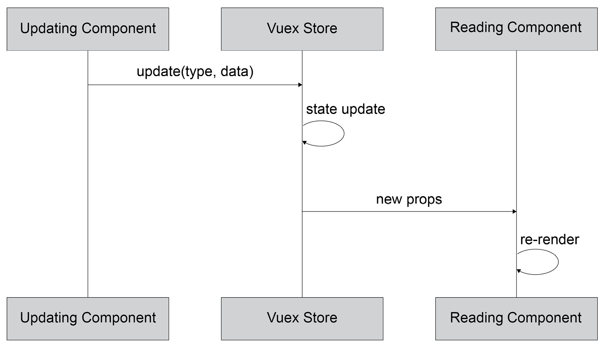

# 8. Vue.js 状态管理的状态

概述

到本章结束时，你将能够使用和对比在 Vue.js 应用程序中共享状态和保持全局状态的方法。为此，你将使用一个共享的祖先组件来保持那些没有父子关系的组件（兄弟组件）所需的状态。你还将熟悉 Vue.js 应用程序上下文中的事件总线。随着我们的深入，你将了解何时以及如何利用 Vuex 进行状态管理，以及与其他解决方案（如事件总线或 Redux）相比的优势和劣势。在本章的末尾，你将熟悉选择哪些状态部分应该存储在全局和本地，以及如何将它们结合起来构建一个可扩展且性能良好的 Vue.js 应用程序。

在本章中，我们将探讨 Vue.js 状态管理的状态，从局部状态到基于组件的状态共享模式，再到更高级的概念，如利用事件总线或 Vuex 等全局状态管理解决方案。

# 简介

在本章中，我们将探讨 Vue 中状态管理的概念。

在前面的章节中，我们看到了如何使用局部状态和`props`来保持状态并在**父子**组件层次结构中共享它。

我们将首先展示如何利用`state`、`props`和`events`在不是**父子**配置的组件之间共享状态。这类组件被称为**兄弟组件**。

![Figure 8.1: 子组件 1 和子组件 2 是“兄弟”组件

![img/B15218_08_01.jpg]

图 8.1：子组件 1 和子组件 2 是“兄弟”组件

在本章的整个过程中，我们将构建一个**个人资料卡片生成器**应用程序，以展示状态如何在应用程序中以 props 的形式向下流动到组件树，以及如何使用事件、事件总线和存储更新来向上传播更新。

既然我们想要构建一个`Header`，其中我们将有全局控件并显示页面标题；一个`ProfileForm`，我们将捕获数据；最后，一个`ProfileDisplay`，我们将显示个人资料卡片。

![Figure 8.2: 表示个人资料卡片应用程序组件树

![img/B15218_08_02.jpg]

图 8.2：表示个人资料卡片应用程序组件树

我们现在已经看到了如何推理组件树以及我们的应用程序如何在组件树中结构化。

# 在公共祖先组件中保持状态

为了仅使用组件状态和`props`来保持状态并使用事件来更新它，我们将将其存储在最近的公共祖先组件中。

状态仅通过`props`进行传播，并且仅通过`events`进行更新。在这种情况下，所有`state`都将存在于需要状态的组件的共享祖先中。由于 App 组件是根组件，因此它是保持共享状态的理想默认选项。

![Figure 8.3: 公共祖先组件通过 props 和事件传播保持状态

![img/B15218_08_03.jpg]

图 8.3：常见的祖先组件通过属性和事件传播持有状态

要更改 `state`，组件需要向持有状态（共享祖先）的组件发出 `event`。共享祖先需要根据事件数据和类型更新 `state`。这反过来又会导致重新渲染，在此期间，祖先组件将更新的 `props` 传递给读取 `state` 的组件。

![图 8.4：当祖先持有状态时更新兄弟组件]


图 8.4：当祖先持有状态时更新兄弟组件

要构建一个标题，我们需要在 `AppHeader.vue` 文件中创建一个 `AppHeader` 组件，它将包含一个模板和一个带有 TailwindCSS 类的 `h2` 标题：

```js
<template>
  <header class="w-full block p-4 border-b bg-blue-300     border-gray-700">
    <h2 class="text-xl text-gray-800">Profile Card Generator</h2>
  </header>
</template>
```

然后，我们将导入它，注册它，并在 `App.vue` 文件中渲染它：

```js
<template>
  <div id="app">
    <AppHeader />
  </div>
</template>
<script>
import AppHeader from './components/AppHeader.vue'
export default {
  components: {
    AppHeader
  }
}
</script>
```

上述代码的输出将如下所示：

![图 8.5：在个人资料卡片生成器中显示的 AppHeader]


图 8.5：在个人资料卡片生成器中显示的 AppHeader

我们将同样创建一个 `AppProfileForm` 文件：

```js
<template>
  <section class="md:w-2/3 h-64 bg-red-200 flex">
  <!-- Inputs -->
  </section>
</template>
```

我们将创建一个 `AppProfileDisplay` 文件，其初始内容如下：

```js
<template>
  <section class="md:w-1/3 h-64 bg-blue-200 flex">
  <!-- Profile Card -->
  </section>
</template>
```

我们的两个容器（`AppProfileForm` 和 `AppProfileDisplay`）现在都可以导入并在 `App` 中渲染：

```js
<template>
    <!-- rest of template, including AppHeader -->
    <div class="flex flex-col md:flex-row">
      <AppProfileForm />
      <AppProfileDisplay />
    </div>
    <!-- rest of template -->
</template>
<script>
// other imports
import AppProfileForm from './components/AppProfileForm.vue'
import AppProfileDisplay from './components/AppProfileDisplay.vue'
export default {
  components: {
    // other component definitions
    AppProfileForm,
    AppProfileDisplay,
  }
}
</script>
```

上述代码的输出将如下所示：

![图 8.6：带有 AppHeader、AppProfileForm 和 AppProfileDisplay 的 App 骨架]


图 8.6：带有 AppHeader、AppProfileForm 和 AppProfileDisplay 的 App 骨架

要添加一个表单字段，在这种情况下是 `name`，我们首先将在 `AppProfileForm` 中添加一个输入：

```js
<template>
  <section class="md:w-2/3 h-64 bg-red-200 flex flex-col p-12     items-center">
    <!-- Inputs -->
    <div class="flex flex-col">
      <label class="flex text-gray-800 mb-2" for="name">Name
      </label>
      <input
        id="name"
        type="text"
        name="name"
        class="border-2 border-solid border-blue-200 rounded           px-2 py-1"
      />
    </div>
  </section>
</template>
```

上述代码将显示如下：

![图 8.7：带有名称字段和标签的 AppProfileForm]


图 8.7：带有名称字段和标签的 AppProfileForm

为了跟踪名称输入数据，我们将使用 `v-model` 添加双向绑定到它，并在组件的 `data` 初始化器中设置一个 `name` 属性：

```js
<template>
      <!-- rest of the template -->
      <input
        id="name"
        type="text"
        name="name"
        class="border-2 border-solid border-blue-200 rounded           px-2 py-1"
        v-model="name"
      />
      <!-- rest of the template -->
</template>
<script>
export default {
  data() {
    return {
      name: '',
    }
  }
}
</script>
```

我们还需要一个 `submit` 按钮，点击时通过发出包含表单内容的 `submit` 事件将表单数据发送到父组件：

```js
<template>
    <!-- rest of template -->
    <div class="flex flex-row mt-12">
      <button type="submit" @click="submitForm()">Submit</button>
    </div>
    <!-- rest of template -->
</template>
<script>
export default {
  // rest of component
  methods: {
    submitForm() {
      this.$emit('submit', {
        name: this.name
      })
    }
  }
}
</script>
```

这将显示如下：

![图 8.8：连接好的提交按钮的 AppProfileForm]


图 8.8：连接好的提交按钮的 AppProfileForm

下一步是将表单状态存储在 `App` 组件中。由于它是 `AppProfileForm` 和 `AppProfileDisplay` 的共同祖先，因此它是存储表单状态的理想选择。

首先，我们需要一个由 `data()` 返回的 `formData` 属性。我们还需要一种更新 `formData` 的方法。因此，我们将添加一个 `update(formData)` 方法：

```js
<script>
export default {
  // rest of component
  data() {
    return {
      formData: {}
    }
  },
  methods: {
    update(formData) {
      this.formData = formData
    }
  }
  // rest of component
}
</script>
```

接下来，我们需要将 `update()` 绑定到由 `AppProfileForm` 发出的 `submit` 事件。我们将使用 `@submit` 简写和魔法事件对象表示法 `update($event)` 来完成此操作：

```js
<template>
    <!-- rest of template -->
      <AppProfileForm @submit="update($event)" />
    <!-- rest of template -->
</template>
```

要在 `AppProfileDisplay` 内显示名称，我们需要将 `formData` 作为属性添加：

```js
<script>
export default {
  props: {
    formData: {
      type: Object,
      default() {
        return {}
      }
    }
  }
}
</script>
```

我们还需要使用`formData.name`显示名称。我们将向容器添加一个`p-12`类来改善组件的外观：

```js
<template>
  <section class="md:w-1/3 h-64 bg-blue-200 flex p-12">
    <!-- Profile Card -->
    <h3 class="font-bold font-lg">{{ formData.name }}</h3>
  </section>
</template>
```

最后，`App`需要将`formData`作为 prop 传递给`AppProfileDisplay`：

```js
<template>
    <!-- rest of template -->
      <AppProfileDisplay :form-data="formData" />
    <!-- rest of template -->
</template>
```

我们现在能够更新表单上的名称。当你点击`提交`按钮时，它将在配置文件显示中显示如下：


图 8.9：App 存储状态，通过 props 传递给 AppProfileDisplay

我们现在已经看到如何在`App`组件上存储共享状态，以及如何从`AppProfileForm`更新它并在`AppProfileDisplay`中显示它。

在下一个主题中，我们将看到如何向配置文件生成器添加一个额外的字段。

## 练习 8.01：向配置文件生成器添加职业字段

在存储`name`共享状态的例子之后，另一个有趣的字段是个人职业。为此，我们将在`AppProfileForm`中添加一个`occupation`字段来捕获这个额外的状态，并在`AppProfileDisplay`中显示它。

要访问此练习的代码文件，请参阅[`packt.live/32VUbuH`](https://packt.live/32VUbuH)。

1.  首先要做的就是在`src/components/AppProfileForm`中添加新的`occupation`字段。我们也将借此机会移除`section`元素上的`h-64`和`bg-red-200`类（如果存在），这意味着表单将没有背景和固定高度：

    ```js
    <template>
      <section class="md:w-2/3 flex flex-col p-12 items-center">
        <!-- rest of template -->
        <div class="flex flex-col mt-2">
          <label class="flex text-gray-800 mb-2" for="occupation">Occupation</label>
          <input
            id="occupation"
            type="text"
            name="occupation"
            class="border-2 border-solid border-blue-200 rounded           px-2 py-1"
          />
        </div>
        <!-- rest of template -->
      </section>
    </template>
    ```

    上述代码的输出将如下所示：

    

    图 8.10：带有新职业字段的 AppProfileForm

1.  为了使用双向数据绑定跟踪`occupation`的值，我们将向`data()`属性的输出添加一个新属性：

    ```js
    <script>
    export default {
      // rest of component
      data() {
        return {
          // other data properties
          occupation: '',
        }
      },
      // rest of component
    }
    ```

1.  我们现在将使用`v-model`从`occupation`响应式数据属性到`occupation`输入进行双向数据绑定：

    ```js
    <template>
      <!-- rest of template -->
          <input
            id="occupation"
            type="text"
            name="occupation"
            v-model="occupation"
            class="border-2 border-solid border-blue-200 rounded           px-2 py-1"
          />
      <!-- rest of template -->
    </template>
    ```

1.  为了在点击`提交`时传输`occupation`值，我们需要将其添加到`submitForm`方法中作为`submit`事件负载的属性：

    ```js
    <script>
    export default {
      // rest of component
      methods: {
        submitForm() {
          this.$emit('submit', {
            // rest of event payload
            occupation: this.occupation
          })
        }
      }
    }
    </script>
    ```

1.  添加此字段的最后一步是在`AppProfileDisplay`组件中显示它。我们添加一个带有几个样式类的段落。我们也将借此机会从容器中移除`h-64`和`bg-blue-200`类（如果存在）：

    ```js
    <template>
      <section class="md:w-1/3 flex flex-col p-12">
        <!-- rest of template -->
        <p class="mt-2">{{ formData.occupation }}</p>
      </section>
    </template>
    ```

    我们的浏览器应该看起来如下：

    

图 8.11：AppProfileForm

正如我们刚刚看到的，使用共同祖先来管理状态添加新字段是一个在事件中向上传递数据并在 props 中向下传递到读取组件的情况。

我们现在将看到如何使用`Clear`按钮重置表单和配置文件显示。

## 练习 8.02：向配置文件生成器添加清除按钮

当我们使用应用程序创建新配置文件时，能够重置配置文件是有用的。为此，我们将添加一个`Clear`按钮。

一个`Clear`按钮应该重置表单中的数据，同时也重置`AppProfileDisplay`中的数据。要访问这个练习的代码文件，请参阅[`packt.live/2INsE7R`](https://packt.live/2INsE7R)。

现在让我们看看执行这个练习的步骤：

1.  我们希望显示一个`Clear`按钮。我们将借此机会改进`Clear`和`Submit`按钮的样式（在`src/components/AppProfileForm.vue`中）：

    ```js
    <template>
      <!-- rest of template -->
        <div class="w-1/2 flex md:flex-row mt-12">
          <button
            class="flex md:w-1/2 justify-center"
            type="button"
          >
            Clear
          </button>
          <button
            class="flex md:w-1/2 justify-center"
            type="submit"
            @click="submitForm()"
          >
            Submit
          </button>
        </div>
      <!-- rest of template -->
    </template>
    ```

1.  要清除表单，我们需要重置`name`和`occupation`字段。我们可以在`src/components/AppProfileForm.vue`中创建一个`clear`方法来完成这个操作：

    ```js
    <script>
    export default {
      // rest of the component
      methods: {
        // other methods
        clear() {
          this.name = ''
          this.occupation = ''
        }
      }
      // rest of the component
    }
    ```

1.  我们希望将`clear`方法绑定到`Clear`按钮的`click`事件上以重置表单（在`src/components/AppProfileForm.vue`中）：

    ```js
    <template>
      <!-- rest of template -->
          <button
            class="flex md:w-1/2 justify-center"
    Submit button, it will propagate data to AppProfileDisplay as follows:Figure 8.13: AppProfileForm and AppProfileDisplay with data filled in and submitted with a Clear buttonUnfortunately, `AppProfileDisplay` still has stale data, as shown in the following screenshot:Figure 8.14: AppProfileForm and AppProfileDisplay with only AppProfileForm cleared AppProfileDisplay still has stale data
    ```

1.  要清除`AppProfileDisplay`的内容，我们需要通过在`src/components/AppProfileForm.vue`中发出一个带有空有效负载的`submit`事件来更新`App.vue`中的`formData`：

    ```js
    <script>
    export default {
      // rest of component
      methods: {
        // other methods
        clear() {
          // rest of the clear() method
          this.$emit('submit', {})
        }
      }
    }
    </script>
    ```

    当我们填写表单并提交时，它看起来如下所示：

    

图 8.15：填写并提交数据的 AppProfileForm 和 AppProfileDisplay，带有清除按钮

我们可以点击`Clear`并按照以下截图重置`AppProfileDisplay`和`AppProfileForm`中显示的数据：


图 8.16：清除数据后的 AppProfileForm 和 AppProfileDisplay（使用清除按钮）

我们已经看到了如何通过共同祖先设置兄弟组件之间的通信。

注意

要跟踪应用程序中需要保持同步的所有状态片段，需要做大量的记录和心智工作。

在下一节中，我们将探讨事件总线是什么以及它如何帮助我们缓解遇到的一些问题。

## 事件总线

我们将要探讨的第二种情况是当存在全局事件总线时。

**事件总线**是一个实体，我们可以在这个实体上发布和订阅事件。这允许应用程序的不同部分保持自己的状态并保持同步，而无需将事件传递给或从共同的祖先传递下来。


图 8.17：利用事件总线的读取组件和更新组件的序列图

为了提供这一点，我们的事件总线需要提供一个`subscribe`方法和`publish`方法。能够取消订阅也是有用的。

Vue 实例是一个事件总线，因为它提供了三个关键操作：`main.js`文件：

```js
import Vue from 'vue'
const eventBus = new Vue()
```

我们的事件总线有几个方法，即`$on`，它是`$on(eventName, callback)`：

```js
// rest of main.js file
console.log('Registering subscriber to "fieldChanged"')
eventBus.$on('fieldChanged', (event) => {
  console.log(`Received event: ${JSON.stringify(event)}`)
})
```

我们可以使用`$emit`来触发订阅者回调。`$emit(eventName, payload)`是事件总线的`$emit`支持两个参数——事件的名称（作为字符串）和负载，这是可选的，可以是任何对象。它可以如下使用：

```js
// rest of main.js file
console.log('Triggering "fieldChanged" for "name"')
eventBus.$emit('fieldChanged', {
  name: 'name',
  value: 'John Doe'
})
console.log('Triggering "fieldChanged" for "occupation"')
eventBus.$emit('fieldChanged', {
  name: 'occupation',
  value: 'Developer'
})
```

在浏览器中运行此文件将产生以下控制台输出，其中首先注册了订阅者，然后在每次`$emit`上触发回调：


图 18.18：使用订阅者和两个事件发布的 Vue.js 实例作为事件总线的控制台输出

`$off`，即**取消订阅**操作，需要使用与**订阅**操作相同的参数调用。即两个参数，事件名称（作为字符串）和回调（在每次事件发布时以事件作为参数运行）。为了正确使用它，我们需要使用函数的引用（而不是内联匿名函数）来注册订阅者：

```js
// rest of main.js, including other subscriber
const subscriber = (event) => {
  console.log('Subscriber 2 received event: ${JSON.stringify     (event)}')
}
console.log('Registering subscriber 2')
eventBus.$on('fieldChanged', subscriber)
console.log('Triggering "fieldChanged" for "company"')
eventBus.$emit('fieldChanged', {
  name: 'company',
  value: 'Developer'
})
console.log('Unregistering subscriber 2')
eventBus.$off('fieldChanged', subscriber)
console.log('Triggering "fieldChanged" for "occupation"')
eventBus.$emit('fieldChanged', {
  name: 'occupation',
  value: 'Senior Developer'
})
```

注意，一旦调用 `$off`，第二个订阅者不会触发，但初始订阅者会触发。在浏览器中运行时的控制台输出将如下所示：


图 8.19：显示 $off 作用的控制台输出

通过在`event-bus.js`文件中设置事件总线，我们可以避免将数据发送到`App`组件（公共祖先）的混淆：

```js
import Vue from 'vue'
export default new Vue()
```

我们可以从`AppProfileForm.vue`文件在表单提交时向事件总线`$emit` `profileUpdate`事件，而不是使用`this.$emit`：

```js
<script>
import eventBus from '../event-bus'
export default {
  // rest of component
  methods: {
    submitForm() {
      eventBus.$emit('profileUpdate', {
        name: this.name,
        occupation: this.occupation
      })
    },
    clear() {
      this.name = ''
      this.occupation = ''
      eventBus.$emit('profileUpdate', {})
    }
  }
}
</script>
```

在`AppProfileDisplay.vue`文件中，我们可以使用`$on`订阅`profileUpdate`事件并在状态中更新`formData`。请注意，我们已经移除了`formData`属性。我们使用`mounted()`和`beforeDestroy()`钩子来订阅和取消订阅事件总线：

```js
<script>
import eventBus from '../event-bus'
export default {
  mounted() {
    eventBus.$on('profileUpdate', this.update)
  },
  beforeDestroy() {
    eventBus.$off('profileUpdate', this.update)
  },
  data() {
    return {
      formData: {}
    }
  },
  methods: {
    update(formData) {
      this.formData = formData
    }
  }
}
</script>
```

该应用按预期工作。以下截图显示了您的屏幕将如何显示：


图 8.20：AppProfileForm 和 AppProfileDisplay 通过事件总线进行通信

由于我们移除了`formData`属性用于`AppProfileDisplay`，我们可以在`App.vue`文件中停止传递它。由于我们不依赖于`AppProfileForm`的`submit`事件，我们也可以删除该绑定：

```js
<template>
  <!-- rest of template -->
      <AppProfileForm />
      <AppProfileDisplay />
  <!-- rest of template -->
</template>
```

我们还可以从`App.vue`文件中删除未使用的`App update`和`data`方法，这意味着整个`App`脚本部分如下（仅注册`components`，不注册状态或处理程序）：

```js
<script>
import AppHeader from './components/AppHeader.vue'
import AppProfileForm from './components/AppProfileForm.vue'
import AppProfileDisplay from './components/AppProfileDisplay.vue'
export default {
  components: {
    AppHeader,
    AppProfileForm,
    AppProfileDisplay,
  }
}
</script>
```

我们现在通过使用事件总线而不是在公共祖先组件中存储共享状态来简化了应用数据流。现在，我们将看到如何将“清除”按钮移动到配置文件生成器的应用头部。

## 练习 8.03：将清除按钮移动到应用头部配置文件生成器

在我们的配置卡片生成应用程序中，`清除`按钮清除整个应用程序的状态。它在表单内的存在使得`清除`按钮的功能不明确，因为它看起来可能只会影响表单。

为了反映`清除`按钮是全局功能的事实，我们将将其移动到标题中。

要访问此练习的代码文件，请参阅[`packt.live/2UzFvwZ`](https://packt.live/2UzFvwZ)。

以下步骤将帮助我们完成这项练习：

1.  我们将首先在`src/components/AppHeader.vue`中创建一个`按钮`：

    ```js
    <template>
      <header class="w-full flex flex-row p-4 border-b     bg-blue-300 border-gray-700">
        <h2 class="text-xl flex text-gray-800">Profile Card       Generator</h2>
        <button class="flex ml-auto text-gray-800 items-center">
          Reset
        </button>
      </header>
    </template>
    ```

1.  我们可以在`AppHeader`中导入事件总线并创建一个`clear()`处理程序，其中我们将触发一个带有空有效负载的更新事件（在`src/components/AppHeader.vue`）：

    ```js
    <script>
    import eventBus from '../event-bus'
    export default {
      methods: {
        clear() {
          eventBus.$emit('profileUpdate', {})
        }
      }
    }
    </script>
    ```

1.  我们应该将`clear()`函数绑定到`按钮`（在`src/components/AppHeader.vue`）：

    ```js
    <template>
      <!-- rest of template -->
        <button
          @click="clear()"
          class="flex ml-auto text-gray-800 items-center"
        >
          Reset
        </button>
      <!-- rest of template -->
    </template>
    ```

    在这个阶段，我们应该能够填写表格，并且应该出现如下所示的`重置`按钮：

    

    图 8.21：填写好的表格和标题中的重置按钮

    `重置`按钮仅重置`AppProfileDisplay`数据：

    

    图 8.22：填写好的表格，但卡片部分已被清除

1.  为了使`重置`清除表格，我们需要在`AppProfileForm`的挂载生命周期方法中订阅`profileUpdate`事件，并通过重置表格（使用`handleProfileUpdate`）来响应这些事件：

    ```js
    <script>
    import eventBus from '../event-bus'
    export default {
      mounted() {
        eventBus.$on('profileUpdate', this.handleProfileUpdate)
      },
      beforeDestroy() {
        eventBus.$off('profileUpdate', this.handleProfileUpdate)
      },
      // rest of component
      methods: {
        // other methods
        handleProfileUpdate(formData) {
          this.name = formData.name || ''
          this.occupation = formData.occupation || ''
        }
      }
    }
    </script>
    ```

1.  我们也借此机会删除`清除`按钮并调整`提交`按钮：

    ```js
    <template>
      <!-- rest of template -->
        <div class="flex align-center mt-12">
          <button
            type="submit"
            @click="submitForm()"
          >
            Submit
          </button>
        </div>
      <!-- rest of template -->
    </template>
    ```

    表单填写并提交后的样子如下：

    

图 8.23：填写并提交的表格

现在重置表格会清除表单字段以及`AppProfileDisplay`：


图 8.24：使用重置按钮重置表格和显示

使用事件总线触发事件并监听相同事件是 Vuex 模式的基础，其中事件和状态更新被封装。

# 与其他模式如 Redux 对比使用 Vuex 模式

我们将要考虑的最后一个场景是使用 Vuex 模式。在这种情况下，所有状态都保存在单个存储中。对状态的任何更新都会派发到这个存储。组件从存储中读取共享和/或全局状态。

Vuex 既是 Vue.js 核心团队提供的状态管理模式，也是库的实现。该模式旨在减轻当全局状态被应用程序的不同部分共享时发现的问题。存储的状态不能直接操作。**突变**用于更新存储状态，由于存储状态是响应式的，任何 Vuex 存储的消费者都会自动更新。

Vuex 从 JavaScript 状态管理空间中的先前工作中汲取灵感，例如 **Flux** 架构，它普及了单向数据流的概念，以及 **Redux**，它是一个 Flux 的单一存储实现。

Vuex 不仅仅是一个 Flux 实现。它是一个针对 Vue.js 的特定状态管理库。因此，它可以利用 Vue.js 特定的东西，如响应性，以提高更新性能。以下图表显示了属性和状态更新的层次结构：


图 8.25：Vuex 属性和状态更新层次结构

为了更新全局状态的部分，组件会触发一个在存储中称为突变的更新。存储知道如何处理这种更新。它更新状态并通过 Vue.js 的响应性相应地向下传播属性：



图 8.26：Vuex 全局状态更新序列图

我们可以使用 Vuex 扩展现有应用程序。

首先，我们需要使用 `yarn add vuex` 或 `npm install --save vuex` 命令添加 `vuex` 模块。

接下来，我们需要在 `store.js` 文件中使用 `Vue.use()` 将 Vuex 与 Vue 注册：

```js
import Vue from 'vue'
import Vuex from 'vuex'
Vue.use(Vuex)
```

最后，我们创建一个具有默认状态的 Vuex 存储。此状态包括我们在 `store.js` 文件中使用的相同的 `formData` 对象。然后我们使用 `export default` 导出它：

```js
export default new Vuex.Store({
  state: {
    formData: {
      name: '',
      occupation: ''
    }
  },
})
```

最后，我们需要在 `main.js` 文件中将我们的存储与 Vue.js 的主应用程序实例注册：

```js
// other imports
import store from './store'
// other imports and code
new Vue({
  render: h => h(App),
  store
}).$mount('#app')
```

令人兴奋的是，每个组件都有一个对 `this.$store` 下的存储的引用。例如，要访问 `formData`，我们可以使用 `this.$store.state.formData`。使用这个，我们可以用单个计算属性替换 `AppProfileDisplay.vue` 文件脚本部分中的事件总线订阅和本地状态更新：

```js
<script>
export default {
  computed: {
    formData() {
      return this.$store.state.formData
    }
  }
}
</script>
```

要触发状态更新，我们需要定义一些突变。在这种情况下，我们需要在 `store.js` 文件中定义 `profileUpdate`。突变接收 `state`（当前状态）和 `payload`（存储 `commit` 负载）作为属性。

```js
export default new Vuex.Store({
  // other store properties
  mutations: {
    profileUpdate(state, payload) {
      state.formData = {
        name: payload.name || '',
        occupation: payload.occupation || ''
      }
    }
  }
})
```

现在我们已经得到了 `profileUpdate` 突变，我们可以在 `AppHeader.vue` 文件中更新 `Reset` 按钮以使用 Vuex `$store.commit()` 函数：

```js
<script>
export default {
  methods: {
    clear() {
      this.$store.commit('profileUpdate', {})
    }
  }
}
</script>
```

我们还应该更新 `AppProfileForm.vue` 文件，将提交操作提交到 `$store` 而不是通过事件总线发出：

```js
<script>
export default {
  // rest of component
  methods: {
    submitForm() {
      this.$store.commit('profileUpdate', {
        name: this.name,
        occupation: this.occupation
      })
    },
    // other methods
  }
}
</script>
```

应用程序现在将支持更新名称和职业：


图 8.27：填写并提交的 AppProfileForm 应用程序

不幸的是，`Reset` 按钮没有清除表单：


图 8.28：在点击 Reset 按钮时未清除 AppProfileForm 的应用程序

为了更有效地重置，我们将在 `store.js` 文件中添加一个 `profileClear` 突变：

```js
export default new Vuex.Store({
  // other store properties
  mutations: {
    // other mutations
    profileClear(state) {
      state.formData = {
        name: '',
        occupation: ''
      }
    }
  }
})
```

我们将在 `AppHeader.vue` 文件中将此操作提交为 `profileUpdate` 而不是 `profileUpdate`，使用空数据代替 `profileUpdate` 使我们的代码清除：

```js
<script>
export default {
  methods: {
    clear() {
      this.$store.commit('profileClear')
    }
  }
}
</script>
```

最后，我们需要订阅存储更改，并在 `AppProfileForm` 文件中提交 `profileClear` 到存储时重置本地状态：

```js
<script>
export default {
  created() {
    this.$store.subscribe((mutation) => {
      if (mutation.type === 'profileClear') {
        this.resetProfileForm()
      }
    })
  },
  // other component properties
  methods: {
    // other methods
    resetProfileForm() {
      this.name = ''
      this.occupation = ''
    }
  }
}
</script>
```

现在应用的“重置”按钮将正确地与 Vuex 一起工作。我们的屏幕应显示如下：

![图 8.29：应用程序重置按钮清除表单和显示]

](img/B15218_08_29.jpg)

图 8.29：应用程序重置按钮清除表单和显示

我们现在已经看到了如何使用 Vuex 存储在应用程序中存储全局状态。

## 练习 8.04：将组织字段添加到配置生成器

在“配置卡生成器”中，除了个人的姓名和职业外，了解他们在哪里工作，换句话说，他们的组织，也是有用的。

要做到这一点，我们将在 `AppProfileForm` 和 `AppProfileDisplay` 中添加一个 `organization` 字段。要访问此练习的代码文件，请参阅 [`packt.live/3lIHJGe`](https://packt.live/3lIHJGe)。

1.  我们可以从向 `AppProfileForm` 添加新的文本输入和标签开始：

    ```js
    <template>
      <!-- rest of template -->
        <div class="flex flex-col mt-2">
          <label class="flex text-gray-800 mb-2"         for="organization">Organization</label>
          <input
            id="occupation"
            type="text"
            name="organization"
            class="border-2 border-solid border-blue-200           rounded px-2 py-1"
          />
        </div>
      <!-- rest of template -->
    </template>
    ```

    新字段看起来如下：

    ![图 8.30：具有新组织字段的应用程序]

    ](img/B15218_08_30.jpg)

    图 8.30：具有新组织字段的应用程序

1.  我们可以将 `organization` 字段添加到 `src/store.js` 中的初始状态和突变中，以便 `organization` 被初始化，在 `profileUpdate` 时设置，并在 `profileClear` 时重置：

    ```js
    // imports & Vuex setup
    export default new Vuex.Store({
      state: {
        formData: {
          // rest of formData fields
          organization: ''
        }
      },
      mutations: {
        profileUpdate(state, payload) {
          state.formData = {
            // rest of formData fields
            organization: payload.organization || '',
          }
        },
        profileClear(state) {
          state.formData = {
            // rest of formData fields
            organization: ''
          }
        }
      }
    })
    ```

1.  我们需要在 `src/components/AppProfileForm.vue` 组件的本地状态中跟踪 `organization`，使用 `v-model` 并在 `data()` 函数中初始化它：

    ```js
    <template>
      <!-- rest of template -->
        <div class="flex flex-col mt-2">
          <label class="flex text-gray-800 mb-2"         for="organization">Organization</label>
          <input
            id="occupation"
            type="text"
            name="organization"
            v-model="organization"
            class="border-2 border-solid border-blue-200 rounded           px-2 py-1"
          />
        </div>
      <!-- rest of template -->
    </template>
    <script>
    export default {
      // rest of component
      data() {
        return {
          // other data properties
          organization: ''
        }
      }
    }
    </script>
    ```

1.  为了使突变的负载包含 `organization`，我们需要将其添加到 `$store.commit('profileUpdate')` 负载中，并在组件触发 `profileClear` 突变时在表单中重置它：

    ```js
    <script>
    export default {
      // rest of component
      methods: {
        submitForm() {
          this.$store.commit('profileUpdate', {
            // rest of payload
            organization: this.organization
          })
        },
        resetProfileForm() {
          // other resets
          this.organization = ''
        }
      }
    }
    </script>
    ```

1.  为了使 `organization` 显示，我们需要在 `src/components/AppProfileDisplay.vue` 中使用条件 span（当没有设置 `organization` 时隐藏 `at`）来渲染它：

    ```js
    <template>
      <!-- rest of template -->
        <p class="mt-2">
          {{ formData.occupation }}
          <span v-if="formData.organization">
            at {{ formData.organization }}
          </span>
        </p>
      <!-- rest of template -->
    </template>
    ```

    应用程序现在将允许我们捕获 `organization` 字段并显示它。

    ![图 8.31：支持组织字段的配置卡生成器，已填写并提交]

    ](img/B15218_08_31.jpg)

图 8.31：支持组织字段的配置卡生成器，已填写并提交

它将允许我们无任何问题地清除配置：

![图 8.32：支持组织字段的配置卡生成器，点击重置按钮后]

](img/B15218_08_32.jpg)

图 8.32：支持组织字段的配置卡生成器，点击重置按钮后

我们现在已经看到了如何向使用 Vuex 的应用程序添加字段。Vuex 相比于事件总线或存储祖先组件中的状态的最大好处之一是，随着你添加更多数据和操作，它可以进行扩展。以下活动将展示这一优势。

## 活动 8.01：将电子邮件和电话号码添加到个人资料卡片生成器

在个人资料生成器中，你查看个人资料以获取有关个人的某些信息。电子邮件和电话号码通常是个人资料卡片上寻找的最关键的信息。这个活动是关于将这些详细信息添加到个人资料卡片生成器中。

要做到这一点，我们将在 `AppProfileForm` 和 `AppProfileDisplay` 中添加 `Email` 和 `Phone Number` 字段：

1.  我们可以先向 `AppProfileForm` 添加一个新的 `email` 输入字段和标签，用于 `Email` 字段。

1.  然后，我们可以在 `AppProfileForm` 中添加一个新的 `phone` 输入字段（类型为 `tel`）和标签，用于 `Phone Number` 字段：

    新字段如下所示：

    ![图 8.33：包含新电子邮件和电话号码字段的应用程序]

    

    图 8.33：包含新电子邮件和电话号码字段的应用程序

1.  然后，我们可以在 `src/store.js` 中的初始状态和突变中添加 `email` 和 `phone` 字段，以便在 `profileUpdate` 期间设置组织，并在 `profileClear` 期间重置。

1.  我们需要在 `src/components/AppProfileForm.vue` 组件的本地状态中使用 `v-model` 跟踪 `email`，并在 `data()` 函数中初始化它。

1.  我们需要在 `src/components/AppProfileForm.vue` 组件的本地状态中跟踪 `phone`，使用 `v-model` 并在 `data()` 函数中初始化它。

1.  为了使突变的负载包含 `email` 和 `phone`，我们需要将其添加到 `$store.commit('profileUpdate')` 负载中。我们还想在组件触发 `profileClear` 突变时在表单中重置它。

1.  为了显示 `email`，我们需要在 `src/components/AppProfileDisplay.vue` 中使用条件段落（在未设置电子邮件时隐藏 `Email` 标签）来渲染它。

1.  为了显示 `phone`，我们需要在 `src/components/AppProfileDisplay.vue` 中使用条件 span（在未设置电话时隐藏 `Phone Number` 标签）来渲染它。

    当表单填写并提交时，应用程序应如下所示：

    ![图 8.34：包含电子邮件和电话号码字段的应用程序]

    

图 8.34：包含电子邮件和电话号码字段的应用程序

注意

这个活动的解决方案可以通过此链接找到。

# 何时使用本地状态和何时保存到全局状态

如通过公共祖先、事件总线、Vuex 示例所见，Vue.js 生态系统有管理共享和全局状态的方法。我们现在将探讨如何决定某物属于本地状态还是全局状态。

一个好的经验法则是，如果一个属性通过三个组件的深度传递，那么最好将这块状态放在全局状态中，并以此方式访问它。

决定某事物是局部还是全局的第二种方法是问自己 *当页面重新加载时，用户是否希望这个信息保持不变？* 这为什么很重要呢？因为全局状态比本地状态更容易保存和持久化。这是由于全局状态的本质是 *仅仅是一个 JavaScript 对象*，而与组件状态相比，组件状态与组件树和 Vue.js 的联系更为紧密。

另一个需要牢记的关键思想是，在组件中混合使用 Vuex 和本地状态是完全可能的。正如我们在 `AppProfileForm` 的示例、练习和活动中所看到的，我们可以使用 `$store.subscribe` 选择性地从突变中同步数据到组件中。

最后，将 Vue.js 的数据属性包装在计算属性中，并通过访问计算属性来使潜在过渡到 Vuex 更容易，这并没有什么问题。在这种情况下，由于所有访问都已经通过计算属性完成，所以只是从 `this.privateData` 变为 `this.$store.state.data` 的一个变化。

# 概述

在本章中，我们探讨了在 Vue.js 应用程序中共享和全局状态管理的不同方法。

在共享祖先中的状态允许通过 props 和事件在兄弟组件之间共享数据。

事件总线有三个操作——`Vue.js` 应用。我们也看到了如何将 `Vue.js` 实例用作事件总线。

你知道 Vuex 模式和库包含什么，它们与 Redux 和 Flux 的区别，以及使用 Vuex 存储相对于共享祖先或事件总线的优势。

最后，我们探讨了可以使用哪些标准来决定状态应该存在于本地组件状态还是更全局或共享的状态解决方案，例如 Vuex。这一章是关于 `Vue.js` 中状态管理领域的介绍。

下一章将深入探讨使用 Vuex 编写大规模 `Vue.js` 应用程序。
