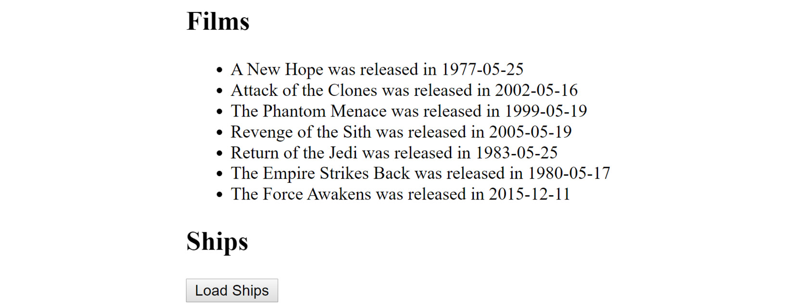

# 10. 使用 Vuex – 获取远程数据

概述

在本章中，您将学习如何使用`Axios`库与远程 API 一起工作。您将进行网络调用并使用 Vuex 存储结果。您还将看到一个如何使用 Vuex 存储身份验证令牌并用于后续 API 调用的示例。

到本章结束时，您将了解 Vuex 如何帮助抽象并创建远程 API 的包装器，并简化它们集成到 Vue 应用程序中的过程。这种抽象使得将来迁移到其他 API 变得更容易，确保您的应用程序的其他部分继续正常工作。

# 简介

在*第九章*，*使用 Vuex – 状态、获取器、动作和突变*中，您被介绍了 Vuex，并看到了多个如何与之交互的示例，以从存储中读取数据并向存储写入数据。我们看到了多个组件如何与存储一起工作，并且在我们这边几乎不需要做任何工作就能保持同步。在本章中，我们将通过使用`Axios`（一个流行的开源库，使使用网络资源变得容易）将 Vuex 与远程数据集成来扩展我们的 Vuex 使用。让我们从对`Axios`的深入了解开始。

`Axios`([`github.com/axios/axios`](https://github.com/axios/axios))是一个具有`async`和`await`功能的 JavaScript 库。其他功能包括支持默认参数（对于每个调用都需要键的 API 很有用）以及转换您的输入和输出数据的能力。在本章中，我们不会涵盖每个用例，但您将了解如何为未来的项目使用`Axios`。

为了明确，如果您不喜欢`Axios`，您不必使用它。您可以使用任何其他库，或者根本不使用库。Fetch API([`developer.mozilla.org/en-US/docs/Web/API/Fetch_API`](https://developer.mozilla.org/en-US/docs/Web/API/Fetch_API))是一个现代浏览器 API，用于处理网络请求，虽然不如`Axios`强大，但不需要额外的库。

在下一节中，我们将探讨如何安装`Axios`。

# Axios 的安装

与 Vuex 类似，您有多种方法可以将`Axios`包含到项目中。最简单的方法是将指向库的**内容分发网络**（**CDN**）的`<script>`标签粘贴到项目中：

```js
<script src="img/axios.min.js"></script>
```

另一个选项是使用`npm`。在现有的 Vue 应用程序中，您可以按照以下方式安装`Axios`：

```js
npm install axios
```

一旦完成此操作，您的 Vue 组件就可以按照以下方式导入库：

```js
import axios from 'axios';
```

您如何使用`Axios`将取决于您交互的 API。以下是一个简单的示例，用于调用一个假想的 API：

```js
axios.get('https://www.raymondcamden.com/api/cats')
.then(res => {
  this.cats = res.data.results;
})
.catch(error => {
  console.error(error);
});
```

在前面的示例中，我们正在对一个虚构的 API 执行`GET`请求（`GET`是默认值），即*https://www.raymondcamden.com/api/cats*。`Axios`返回 promises，这意味着我们可以使用`then`和`catch`链式处理结果和错误。结果 JSON（再次强调，这是一个虚构的 API）会自动解析，所以剩下的只是将结果分配给一个值，在这个例子中，是一个名为`cats`的值，用于我的 Vue 应用程序。

现在让我们看看使用`Axios`从 API 加载数据的逐步过程。

## 练习 10.01：使用 Axios 从 API 加载数据

让我们看看一个使用`Axios`的复杂示例。此示例将对星球大战 API 进行两次不同的 API 调用，并返回两个信息列表。目前，我们将跳过使用 Vuex，以使这个介绍更简单。

要访问此练习的代码文件，请参阅[`packt.live/3kbn1x1`](https://packt.live/3kbn1x1)。

1.  创建一个新的 Vue 应用程序，CLI 完成之后，将`Axios`添加为`npm`依赖项：

    ```js
    npm install axios
    ```

1.  打开`App.vue`页面并添加对`axios`的导入：

    ```js
    import axios from 'axios';
    ```

1.  打开`App.vue`页面并为`films`和`ships`数组添加数据值：

    ```js
    data() {
        return {
          films:[],
          ships:[]
        }
      },
    ```

1.  打开`App.vue`并使用`created`方法从 API 加载`films`和`starships`：

    ```js
    created() {
        axios.get('https://swapi.dev/api/films')
        .then(res => {
          this.films = res.data.results;
        })
        .catch(error => {
          console.error(error);
        });
        axios.get('https://swapi.dev/api/starships')
        .then(res => {
          this.ships = res.data.results;
        })
        .catch(error => {
          console.error(error);
        });
      }
    ```

1.  接下来，编辑模板以迭代值并显示它们：

    ```js
        <h2>Films</h2>
        <ul>
          <li v-for="film in films" :key="film.url">
            {{ film.title }} was released in {{ film.release_date }}
          </li>
        </ul>
        <h2>Starships</h2>
        <ul>
          <li v-for="ship in ships" :key="ship.url">
            {{ ship.name }} is a {{ ship.starship_class }} 
          </li>
        </ul>
    ```

    注意

    错误处理是通过 catch 处理程序完成的，但只是发送到浏览器控制台。如果远程数据没有加载，最好告诉用户一些信息，但到目前为止，这是可以接受的。另一个建议是处理**加载**状态，您将在本章后面的示例中看到。

1.  使用以下命令启动应用程序：

    ```js
    npm run serve 
    ```

    在您的浏览器中打开 URL 将生成以下输出：

    

图 10.1：浏览器中渲染的 API 调用结果

这个简单的示例展示了将`Axios`添加到 Vue 应用程序是多么容易。请记住，`Axios`不是 Vue 的必需品，您可以使用任何您想要的库，或者简单地使用浏览器本地的 Fetch API。

现在您已经看到了如何将`Axios`引入项目，让我们看看`Axios`的一个更酷的特性：指定默认值。

# 使用 Axios 的默认值

虽然*练习 10.01*中的*使用 Axios 从 API 加载数据*代码运行良好，但让我们考虑一个稍微复杂一点的例子。`Axios`的一个特性是能够设置在后续调用中使用的默认值。如果您查看前面代码中进行的两个调用，您可以看到它们是相似的。您可以更新`created`方法来利用这一点：

```js
created() {
  const api = axios.create({
    baseURL:'https://swapi.dev/api/',
    transformResponse(data) {
      data = JSON.parse(data);
      return data.results;
    }
  });
  api.get('films')
  .then(res => this.films = res.data);
  api.get('starships')
  .then(res => this.ships = res.data);
}
```

在这个更新版本中，我们切换到`Axios`的一个实例。指定了一个默认的`baseURL`值，这样在后续操作中可以节省输入。接下来，使用`transformResponse`功能来转换响应。这让我们可以在数据发送到后续调用处理程序之前对其进行修改。由于所有 API 调用都返回一个结果值，而我们只关心这个值，所以我们通过只返回这个值而不是整个结果来简化事情。请注意，如果你想要构建一个复杂的转换集，`Axios`允许你在`transformResponse`中使用一个函数数组。

在下一节，我们将学习如何使用`Axios`与 Vuex 结合。

# 使用 Vuex 与 Axios 结合

现在你已经看到了使用`Axios`的基本方法，是时候考虑如何将它与 Vuex 结合使用了。一种简单的方法是直接使用 Vuex 来处理对 API 的调用封装，使用`Axios`来执行 HTTP 调用。

## 练习 10.02：在 Vuex 中使用 Axios

我们将使用之前的功能（加载`films`和`ships`数组）并在 Vuex 存储的上下文中重新构建它。和之前一样，你需要使用 CLI 来搭建一个新的应用，并确保你要求包含 Vuex。CLI 完成后，你可以使用`npm`命令添加`Axios`。

这个练习将与我们在*练习 10.01*中构建的第一个应用非常相似，即*使用 Axios 从 API 加载数据*，但有一些细微的差别。让我们首先看看 UI。在初始加载时，`Films`和`Ships`都是空的：


图 10.2：初始应用 UI

注意到`Films`部分有一个加载信息。一旦应用加载，我们将发起一个请求来获取这些数据。对于`Ships`，我们则等待用户明确请求他们想要这些数据。以下是`films`数组加载后的样子：



图 10.3：应用的渲染电影

最后，在点击`Load Ships`按钮后，按钮将禁用（以防止用户多次请求数据），然后在数据加载完成后，整个按钮将被移除：


图 10.4：所有内容加载完成后的最终视图

要访问这个练习的代码文件，请参考[`packt.live/32pUsWy`](https://packt.live/32pUsWy)。

1.  从第一个组件`App.vue`开始，编写 HTML。记住，`films`在组件中显示，但`ships`将在自己的组件中。使用`v-else`添加一个加载信息，这个信息将在`Axios`进行 HTTP 请求时显示：

    ```js
    <template>
      <div id="app">
        <h2>Films</h2>
        <ul v-if="films.length">
          <li v-for="film in films" :key="film.url">
            {{ film.title }} was released in {{ film.release_date }}
          </li>
        </ul>
        <div v-else>
          <i>Loading data...</i>
        </div>
        <Ships />
      </div>
    </template>
    ```

1.  现在添加必要的代码来加载和注册`Ships`组件：

    ```js
    import Ships from './components/Ships.vue'
    export default {
      name: 'app',
      components: {
        Ships
      },
    ```

1.  同时导入`mapState`：

    ```js
    import { mapState } from 'vuex';
    ```

1.  接下来，添加代码将我们的存储中的`films`数组映射到一个本地的计算值。记住要导入`mapState`：

    ```js
    computed: {
        ...mapState(["films"])
      },
    ```

1.  最后，使用`created`方法在我们的存储器中触发一个动作：

    ```js
    created() {
      this.$store.dispatch('loadFilms');
    }
    ```

1.  接下来，在`components/Ship.vue`中构建`Ships`组件。`Ships`组件也包含数据列表，但使用按钮让用户可以请求加载数据。按钮在完成时应该自动消失，并在加载过程中禁用：

    ```js
    <template>
      <div>
        <h2>Ships</h2>
        <div v-if="ships.length"> 
          <ul>
            <li v-for="ship in ships" :key="ship.url">
              {{ ship.name }} is a {{ ship.starship_class }} 
            </li>
          </ul>
        </div>
        <button v-else @click="loadShips" :disabled="loading">Load       Ships</button>
      </div>
    </template>
    ```

1.  添加处理`ships`状态映射的代码，并触发 Vuex 中的动作来加载`ships`：

    ```js
    <script>
    import { mapState } from 'vuex';
    export default {
      name: 'Ships',
      data() {
        return {
          loading:false
        }
      },
      computed: {
        ...mapState(["ships"])
      },
      methods:{
        loadShips() {
          this.loading = true;
          this.$store.dispatch('loadShips');
        }
      }
    }
    </script>
    ```

1.  现在，构建存储器。首先，定义`state`来保存`films`和`ships`数组：

    ```js
    import Vue from 'vue'
    import Vuex from 'vuex'
    import axios from 'axios'
    Vue.use(Vuex)
    export default new Vuex.Store({
      state: {
        films:[],
        ships:[]
      },
    ```

1.  接下来，添加加载`ships`和`films`数据的动作。它们都应该使用`mutations`来将值赋给`state`：

    ```js
      mutations: {
        setFilms(state, films) {
          state.films = films;
        },
        setShips(state, ships) {
          state.ships = ships;
        }
      },
      actions: {
        loadFilms(context) {
          axios.get('https://swapi.dev/api/films')
          .then(res => {
            context.commit('setFilms', res.data.results);
          })
          .catch(error => {
            console.error(error);
          });
        },
        loadShips(context) {
          axios.get('https://swapi.dev/api/starships')
          .then(res => {
            context.commit('setShips', res.data.results);
          })
          .catch(error => {
            console.error(error);
          });
        }
      }
    })
    ```

1.  使用以下命令运行您的应用程序：

    ```js
    npm run serve
    ```

    您的输出将是以下内容：

    

图 10.5：最终输出

总体而言，这并不是与没有 Vuex 的初始版本有巨大变化（如果我们忽略 UI 变化），但现在我们所有的 API 使用都由存储器处理。如果我们决定停止使用`Axios`并切换到 Fetch，这可以在这里完成。无论我们决定添加缓存系统还是存储数据以供离线使用，都可以在存储器中完成。通过运行`npm run serve`并在浏览器中打开 URL 来自行测试这个版本。

现在是时候将您所学到的知识应用到下一个活动上了！

## 活动十.01：使用 Axios 和 Vuex 进行身份验证

Vuex 的一个更有趣的功能是管理身份验证。我们这是什么意思？在许多 API 中，在使用服务之前需要身份验证。用户验证后，他们会被分配一个令牌。在未来的 API 调用中，令牌会随请求一起传递，通常作为头部信息，这会让远程服务知道这是一个授权用户。Vuex 可以为您处理所有这些，而`Axios`使得处理头部信息变得容易，所以让我们考虑一个实际操作的例子。

在本书中构建具有身份验证和授权的服务器远远超出了本书的范围，因此，我们将采取*模拟*的方式。我们将使用两个`JSONBin.io`，这是我们曾在*第九章，使用 Vuex – 状态、获取器、动作和突变*中使用的服务。第一个端点将返回一个令牌：

```js
{
  "token": 123456789
}
```

第二个端点将返回一个`cats`数组：

```js
[
  {
    "name": "Luna",
    "gender": "female"
  },
  {
    "name": "Pig",
    "gender": "female"
  },
  {
    "name": "Cracker",
    "gender": "male"
  },
  {
    "name": "Sammy",
    "gender": "male"
  },
  {
    "name": "Elise",
    "gender": "female"
  }
]
```

在这个活动中，我们将使用 Vue Router 来处理表示应用程序的两个**视图**，即登录界面和猫展示界面。

**步骤**：

1.  为应用程序的初始视图提供一个登录界面。它应该提示用户名和密码。

1.  将登录凭证传递给端点并获取一个令牌。这部分将进行模拟，因为我们不是在构建一个完整的、真实的身份验证系统。

1.  从远程端点加载猫，并将令牌作为身份验证头部传递。

初始输出应该是以下内容：


图 10.6：初始登录界面

登录后，您将看到以下数据：


图 10.7：登录后成功显示数据

注意

该活动的解决方案可以通过此链接找到。

# 摘要

在本章中，你学习了 Vuex 的一个重要用例——与远程 API 协同工作。远程 API 可以为你的应用程序提供大量的额外功能，有时对开发者的额外成本几乎为零。你看到了如何使用`Axios`使网络调用更简单，以及如何将 Vuex 的状态管理功能与之结合。最后，你将其与 Vue Router 结合，创建了一个简单的登录/授权演示。

在下一章中，我们将讨论如何使用模块构建更复杂的 Vuex 存储。
