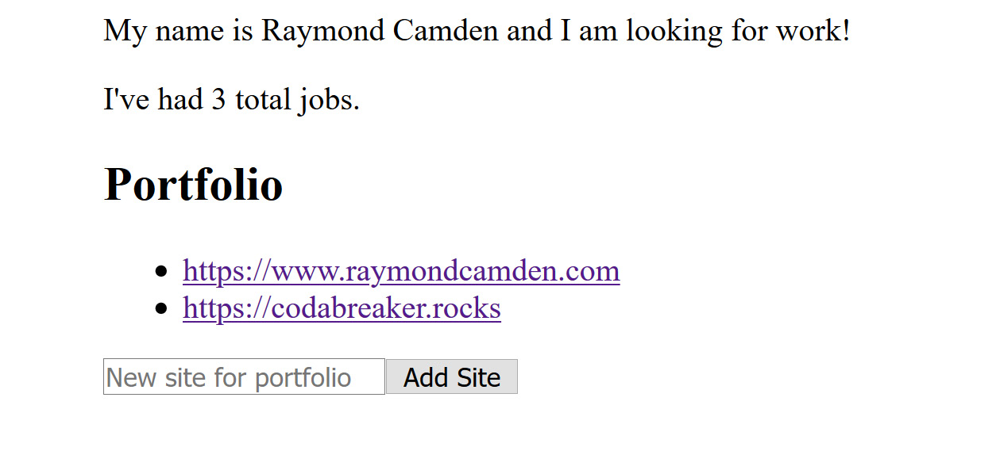
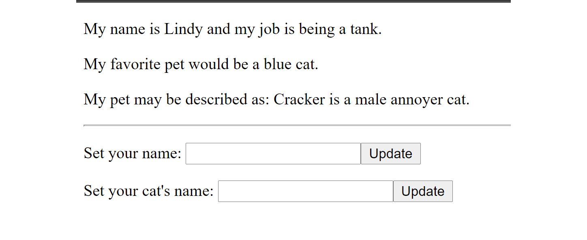

# 11. 使用 Vuex – 组织更大的存储

概述

在本章中，你将学习如何更好地组织更大的 Vuex 存储。随着你的应用程序在复杂性和功能上的增长，你的存储文件可能变得难以操作。随着文件越来越大，甚至简单地找到东西也可能变成一项困难的任务。本章将讨论两种不同的方法来简化存储的组织，以便进行更简单的更新。第一种方法将要求你将代码拆分到不同的文件中，而第二种方法将使用更高级的 Vuex 功能，即模块。

# 简介

到目前为止，我们处理过的存储都很简单且简短。但是，正如众所周知的那样，即使是简单的应用程序随着时间的推移也会趋向于复杂化。正如你在前面的章节中学到的，你的存储可以包含一个`state`、一个`getters`的块、一个`mutations`和`actions`的块，以及你将在本章后面学到的内容，即`modules`。

随着你的应用程序增长，拥有一个文件来管理你的 Vuex 存储（store）可能会变得难以管理。修复错误和更新新功能可能会变得更加困难。本章将讨论两种不同的方法来帮助管理这种复杂性并组织你的 Vuex 存储。为了明确，这些都是你可以做的*可选*事情来帮助管理你的存储。如果你的存储很简单，并且你希望保持这种状态，那也是可以的。你总是可以在将来使用这些方法，而且好处是，没有人需要知道你的存储之外的事情——他们将继续像以前一样使用 Vuex 数据。你可以将这些技巧作为一组工具保留在心中，以帮助你在应用程序需要升级时使用。让我们从最简单的方法，文件拆分，开始。

# 方法一 – 使用文件拆分

第一种方法，当然也是最简单的一种方法，就是简单地将你的各种 Vuex 部分的代码（如`state`、`getters`等）移动到它们自己的文件中。然后，这些文件可以被主 Vuex 存储`import`并正常使用。让我们考虑一个简单的例子：

```js
import Vue from 'vue'
import Vuex from 'vuex'
Vue.use(Vuex)
export default new Vuex.Store({
  state: {
    name:"Lindy", 
    favoriteColor: "blue",
    profession: "librarian"
  },
  mutations: {
  },
  actions: {
  },
  modules: {
  }
})
```

这是从*第九章*中的第一个练习*使用 Vuex – 状态、获取器、动作和突变*中来的，并且是一个只有三个状态值的存储。要将状态迁移到新文件，你可以在`store`文件夹中创建一个名为`state.js`的新文件，并按照如下设置：

```js
export default {
  name: 'Lindy',
  favoriteColor: 'blue',
  profession: 'librarian'
}
```

然后，回到你的存储中，将其修改为`import`并使用代码：

```js
import Vue from 'vue'
import Vuex from 'vuex'
Vue.use(Vuex)
import state from './state.js';
export default new Vuex.Store({
  state,
  mutations: {
  },
  actions: {
  },
  modules: {
  }
})
```

虽然这个例子最终变成了更多的代码行，但你可以看到我们是如何开始将存储的不同部分分离到不同的文件中，以便更容易更新的。让我们考虑一个稍微大一点的例子，再次参考*第九章*中的第二个练习，*使用 Vuex – 状态、获取器、动作和突变*。以下是原始存储：

```js
import Vue from 'vue'
import Vuex from 'vuex'
Vue.use(Vuex)
export default new Vuex.Store({
  state: {
    firstName: "Lindy",
    lastName: "Roberthon"
  },
  getters: {
    name(state) {
      return state.firstName + ' ' + state.lastName;
    }
  },
  mutations: {
  },
  actions: {
  },
  modules: {
  }
})
```

这个例子只使用了`state`值和一个`getter`，但让我们将它们都移动到新文件中。首先，让我们将`state`移动到名为`state.js`的文件中：

```js
export default {
  firstName: 'Lindy',
  lastName: 'Roberthon'
}
```

接下来，让我们将 `getters` 移入一个名为 `getters.js` 的文件中：

```js
export default {
  name(state) {
    return state.firstName + ' ' + state.lastName;
  }
}
```

现在我们可以更新存储：

```js
import Vue from 'vue'
import Vuex from 'vuex'
Vue.use(Vuex)
import state from './state.js';
import getters from './getters.js';
export default new Vuex.Store({
  state,
  getters,
  mutations: {
  },
  actions: {
  },
  modules: {
  }
})
```

将相同类型的更新应用于 `mutations` 和 `actions` 将遵循完全相同的模式，并且显然，你不必拆分一切。例如，你可以将状态值保留在主文件中，但只拆分你的函数（`getters`、`mutations` 和 `actions`）。

## 练习 11.01：使用文件拆分

在这个练习中，我们将在一个稍微大一点的 Vue store 中使用文件拆分。说实话，它并不大，但我们将会使用文件拆分来处理 `state`、`getters`、`mutations` 和 `actions`。

要访问此练习的代码文件，请访问 [`packt.live/32uwiKB`](https://packt.live/32uwiKB)：

1.  生成一个新的 Vue 应用程序并添加 Vuex 支持。

1.  修改默认存储的 `index.js` 文件（位于 `src/store/index.js`），导入我们将创建的四个文件来表示存储：

    ```js
    import Vue from 'vue'
    import Vuex from 'vuex'
    Vue.use(Vuex)
    import state from './state.js';
    import getters from './getters.js';
    import mutations from './mutations.js';
    import actions from './actions.js';
    export default new Vuex.Store({
      state,
      getters,
      mutations,
      actions,
      modules: {
      }
    })
    ```

1.  编辑新的 `state.js` 文件，添加姓名和姓氏的值，代表该人拥有的猫和狗数量的数字，以及一个最爱电影：

    ```js
    export default {
            firstName: 'Lindy',
            lastName: 'Roberthon',
            numCats: 5,
            numDogs: 1,
            favoriteFilm:''
    }
    ```

1.  添加一个 `getter.js` 文件来定义全名和宠物总数的 `getter`：

    ```js
    export default {
            name(state) {
                    return state.firstName + ' ' +state.lastName
            },
            totalPets(state) {
                    return state.numCats + state.numDogs
            }
    }
    ```

1.  接下来，添加一个 `mutations.js` 文件来添加猫和狗的数量，设置姓名和姓氏，以及添加最爱电影：

    ```js
    export default {
            addCat(state) {
                state.numCats++;
            },
            addDog(state) {
                state.numDogs++;
            },
            setFirstName(state, name) {
                if(name !== '') state.firstName = name;
            },
            setLastName(state, name) {
                if(name !== '') state.lastName = name;
            },
            setFavoriteFilm(state, film) {
                if(film !== '') state.favoriteFilm = film;
            }
    }
    ```

1.  最后，添加 `actions.js` 文件来定义一个动作，`updateFavoriteFilm`。这将向 `Star Wars` API 发起网络请求，以确保只有当新的最爱电影是《星球大战》电影时才允许：

    ```js
    export default {
        async updateFavoriteFilm(context, film) {
            try {
                let response = await fetch('https://swapi.dev/api/films?search='+encodeURIComponent(film));
                let data = await response.json();
                if(data.count === 1) context.commit               ('setFavoriteFilm', film);
                else console.log('Ignored setting non-Star Wars               film '+film+' as favorite.'); 
            } catch(e) {
                console.error(e);
            }
        }
    }
    ```

1.  要看到它的实际效果，更新 `src/App.vue` 以访问存储的各个部分。这一步的唯一目的是强调你使用存储的方式并没有改变：

    ```js
    <template>
      <div id="app">
        My first name is {{ $store.state.firstName }}.<br/>
        My full name is {{ $store.getters.name }}.<br/>
        I have this many pets - {{ $store.getters.totalPets }}.<br/>
        My favorite film is {{ $store.state.favoriteFilm }}.
      </div>
    </template>
    <script>
    export default {
      name: 'app',
      created() {
        this.$store.dispatch('updateFavoriteFilm', 'A New Hope');
      }
    }
    </script>
    ```

    上述代码将生成如下输出：

    ![图 11.1：新组织存储的输出

    ![img/B15218_11_01.jpg]

图 11.1：新组织存储的输出

你现在已经看到了一个（相对简单）的例子，使用文件拆分来管理 Vuex 存储的大小。虽然功能与之前看到的不同，但随着你的应用程序的增长，你可能会发现添加和修复要容易得多。

# 第二种方法 – 使用模块

在先前的方法中，我们主要只是将代码行移动到其他文件中。正如我们所说的，虽然这使处理存储本身变得更容易，但它并没有改变 Vue 组件使用存储的方式。**模块**帮助我们处理组件级别的复杂性。

想象一个包含许多不同值的 `state` 对象，例如这个：

```js
state: {
  name:"Lindy", 
  favoriteColor: "blue", 
  profession: "librarian", 
  // lots more values about Lindy
  books: [
    { name: "An Umbrella on Fire", pages: 283 },
    { name: "Unicorn Whisperer", pages: 501 },
    // many, many more books
  ],
  robots: {
    skill:'advanced',
    totalAllowed: 10,
    robots: [
      { name: "Draconis" },
      // so much robots 
    ]
  }
}
```

这个例子包含了关于一个人的信息，与书籍相关的数据，以及代表机器人的值集。这是一大批数据，涵盖了三个独特不同的主题。将这些内容移入单独的文件并不一定能使使用变得更简单或有助于保持组织有序。这种复杂性也会影响到`getters`、`mutations`和`actions`。给定一个名为`setName`的操作，你可以假设它适用于代表个人的状态值，但如果其他状态值有类似的名字，可能会开始变得混乱。

这就是模块的作用。一个模块允许我们定义一个完全独立的`state`、`getters`、`mutations`和`actions`，与**根**或核心存储完全分离。

下面是一个使用`resume`模块的示例存储：

```js
import Vue from 'vue'
import Vuex from 'vuex'
Vue.use(Vuex)
export default new Vuex.Store({
  state: {
    firstName:'Raymond',
    lastName:'Camden'
  },
  getters: {
    name(state) {
      return state.firstName + ' ' + state.lastName;
    }
  },
  modules: {
    resume: {
      state: {
        forHire:true,
        jobs: [
          "Librarian", 
          "Jedi",
          "Cat Herder"
        ]
      },
      getters: {
        totalJobs(state) {
          return state.jobs.length;
        }
      }
    }
  }
})
```

`state`和`getters`也可以公开`mutations`和`actions`。注意在`resume`模块的`getters`中，`totalJobs`的`state`变量引用的是它自己的状态，而不是父状态。这是非常好的，因为它确保你可以在模块内部工作，而不用担心意外修改根或其他模块中的某个值。你可以在`getters`中使用一个新的第三个参数`rootState`来访问根状态：

```js
totalJobs(state, anyArgument, rootState)
```

动作可以通过上下文对象`context.rootState`使用`rootState`。然而，从理论上讲，你的模块应该关注它们自己的数据，并且只有在必要时才**向外**扩展到根状态。

当使用模块值时，你的代码必须知道模块的名称。考虑以下示例：

```js
first name {{ $store.state.firstName }}<br/>
for hire? {{ $store.state.resume.forHire }}<br/>
```

`getters`、`actions`和`mutations`并没有被区分。这就是你访问`getters`的方式：

```js
full name {{ $store.getters.name }}<br/>
total jobs {{ $store.getters.totalJobs }}<br/>
```

这个想法背后的目的是允许一个模块或多个模块可能对相同的调用做出响应。如果你不喜欢这个，你可以使用`namespaced`选项：

```js
modules: {
  resume: {
    namespaced: true,
    state: {
      forHire:true,
      jobs: [
        "Librarian", 
        "Jedi",
        "Cat Herder"
      ]
    },
    getters: {
      totalJobs(state) {
        return state.jobs.length;
      }
    }
  }
}
```

然后要引用此模块的`getters`、`mutations`和`actions`，你必须将模块的名称作为调用的一部分传递。例如，现在的 getter 变成了：`$store.getters['resume/totalJobs']`。

大部分来说，这是模块支持的核心，但请注意，还有更多关于模块如何全局暴露自己的选项，这些选项超出了本书的范围。请参阅模块文档的后半部分（[`vuex.vuejs.org/guide/modules.html`](https://vuex.vuejs.org/guide/modules.html)）以获取相关示例。最后，请注意，你可以根据需要将模块嵌套在模块中，Vuex 允许这样做！

## 练习 11.02：利用模块

在这个练习中，我们将与一个 Vuex 存储库一起工作，它使用不止一个模块，为了使它更有趣，其中一个模块将存储在另一个文件中，这表明我们在使用模块时也可以使用第一种方法。

要访问此练习的代码文件，请访问[`packt.live/35d1zDv`](https://packt.live/35d1zDv)：

1.  如同往常，生成一个新的 Vue 应用程序，并确保你添加了 Vuex。

1.  在`store/index.js`存储文件中，为姓氏和名字添加两个`state`值，并添加一个 getter 来返回两者：

    ```js
      state: {
        firstName:'Raymond',
        lastName:'Camden'
      },
      getters: {
        name(state) {
          return state.firstName + ' ' + state.lastName;
        }
      },
    ```

1.  接下来，向`store`文件添加一个`resume`模块。它将有两个`state`值，一个表示可雇佣值，另一个是一个表示过去工作的数组。最后，添加一个 getter 来返回工作的总数：

    ```js
      modules: {
        resume: {
          state: {
            forHire:true,
            jobs: [
              "Librarian", 
              "Jedi",
              "Cat Herder"
            ]
          },
          getters: {
            totalJobs(state) {
              return state.jobs.length;
            }
          }
        },
    ```

1.  现在为下一个模块创建一个新的文件，`store/portfolio.js`。这将包含一个表示已工作的网站数组的`state`值和一个添加值的`mutation`：

    ```js
    export default {
            state: {
                websites: [
                    "https://www.raymondcamden.com",
                    "https://codabreaker.rocks"
                ]
            },
            mutations: {
                addSite(state, url) {
                    state.websites.push(url);
                }
            }
    }
    ```

1.  在主存储的`index.js`文件中，导入`portfolio`：

    ```js
    import portfolio from './portfolio.js';
    ```

1.  然后将`portfolio`添加到模块列表中，在`resume`之后：

    ```js
      modules: {
        resume: {
          state: {
            forHire:true,
            jobs: [
              "Librarian", 
              "Jedi",
              "Cat Herder"
            ]
          },
          getters: {
            totalJobs(state) {
              return state.jobs.length;
            }
          }
        },
        portfolio
      }
    ```

1.  现在，让我们在我们的主`src/App.vue`文件中使用这些模块。修改模板以添加对存储中各个部分的调用：

    ```js
        <p>
        My name is {{ $store.getters.name }} and I 
        <span v-if="$store.state.resume.forHire">
            am looking for work!
        </span><span v-else>
            am not looking for work.
        </span>
        </p>
        <p>
          I've had {{ $store.getters.totalJobs }} total jobs. 
        </p>
        <h2>Portfolio</h2>
        <ul>
          <li 
            v-for="(site,idx) in $store.state.portfolio.websites"
            :key="idx"><a :href="site" target="_new">{{ site }}</a></li>
        </ul>
    ```

1.  然后添加一个**表单**，以便我们可以添加一个**新网站**：

    ```js
        <p>
          <input type="url" placeholder="New site for portfolio"         v-model="site">
          <button @click="addSite">Add Site</button>
        </p>
    ```

1.  定义`addSite`方法的函数。它将提交`mutation`并清除站点值。务必为站点添加一个本地数据值。以下是完整的脚本块：

    ```js
    export default {
      name: 'app',
      data() {
        return {
          site:''
        }
      },
      methods: {
        addSite() {
          this.$store.commit('addSite', this.site);
          this.site = '';
        }
      }
    }
    ```

    结果将如下所示：

    

    ](https://davestewart.github.io/vuex-pathify/)

图 11.2：使用模块利用 Vuex 数据的应用程序

现在你已经看到了另一种帮助管理你的 Vuex 存储的方法。**模块**提供了一种更深入、更复杂的组织存储的方式。一如既往，选择最适合你的应用程序需求以及你和你的团队最舒适的方法！

# 组织 Vuex 存储的其他方法

虽然前两种方法应该为你提供一些管理 Vuex 存储的好选项，但你可能还想考虑其他一些选项。

## Vuex Pathify

Vuex Pathify（[`davestewart.github.io/vuex-pathify/`](https://davestewart.github.io/vuex-pathify/））是一个实用工具，它使得通过`resume`和`state`值`jobs`访问 Vuex 存储变得更加容易：`store.get('resume/jobs')`。基本上，它为读取和写入存储中的值以及简化同步创建了一个快捷方式。XPath 的爱好者会喜欢这个。

## Vuex 模块生成器（VMG）

`state`、`mutations`和`actions`。任何在 Web 开发领域工作过一段时间的人都会熟悉 CRUD 模式，并且绝对会为不必再次编写这些函数而感到高兴。

查看 GitHub 仓库（[`github.com/abdullah/vuex-module-generator`](https://github.com/abdullah/vuex-module-generator)）以获取更多详细信息及示例应用程序。

## Vuex ORM

将`ORM`库添加到 Vuex 存储中。**ORM**代表**对象关系映射**，是一种帮助简化对象持久化的模式。像 VMG 一样，Vuex ORM 旨在简化 Web 开发者必须编写的相对常见的 CRUD 任务。

Vuex ORM 允许你定义代表你的存储数据结构的类。一旦你定义了数据结构，Vuex ORM 就提供了实用函数，使得在存储中存储和检索数据变得更加简单。它甚至处理数据之间的关系，例如属于它的 `cat` 对象。

下面是如何定义一种数据类型的示例：

```js
class Cat extends Model {
  static entity = 'cats'
  static fields () {
    return {
      id: this.attr(null),
      name: this.string(''),
      age: this.number(0),
      adoptable: this.boolean(true)
    }
  }
}
```

在前面的课程中，为 `Cat` 类定义了四个属性：`id`、`name`、`age` 和 `adoptable`。对于每个属性，都指定了默认值。一旦定义，请求所有数据就像 `Cat.all()` 一样简单。Vuex ORM 还有更多内容，你可以在 [`vuex-orm.github.io/vuex-orm/`](https://vuex-orm.github.io/vuex-orm/) 上查看。

## 活动 11.01：简化 Vuex 存储

这个活动将与你之前做过的活动略有不同。在这个活动中，你将使用一个 *现有* 的应用，该应用使用 Vuex，并应用本章中学到的某些技术来简化存储，使其在未来更新中更容易使用。这在进行功能调整或修复时可能非常有用。

**步骤：**

1.  要开始这个活动，你将使用位于 `Chapter11/activity11.01/initial` 的完成示例（[`packt.live/3kaqBHH`](https://packt.live/3kaqBHH)）。

1.  修改存储文件，将 `state`、`getters` 和 `mutations` 放入它们自己的文件。

1.  修改 `state`，使 `cat` 值位于 `module` 中。

1.  将与猫相关的 `getter` 迁移到 `module`。

1.  更新 `App.vue` 文件，使其仍然正确显示最初的数据。

    这是构建后的样子：

    

图 11.3：活动的最终输出

注意

这个活动的解决方案可以通过这个链接找到。

# 摘要

在本章中，你学习了多种不同的技术来为你的 Vuex 存储准备增长复杂性。你首先学习了如何将逻辑移动到单独的文件并在你的存储中包含它们。然后你学习了模块以及它们是如何通过存储暴露给组件的。最后，你学习了可能使 Vuex 使用更加强大的某些可选库。

在下一章，你将学习关于开发一个极其重要的方面，单元测试。
