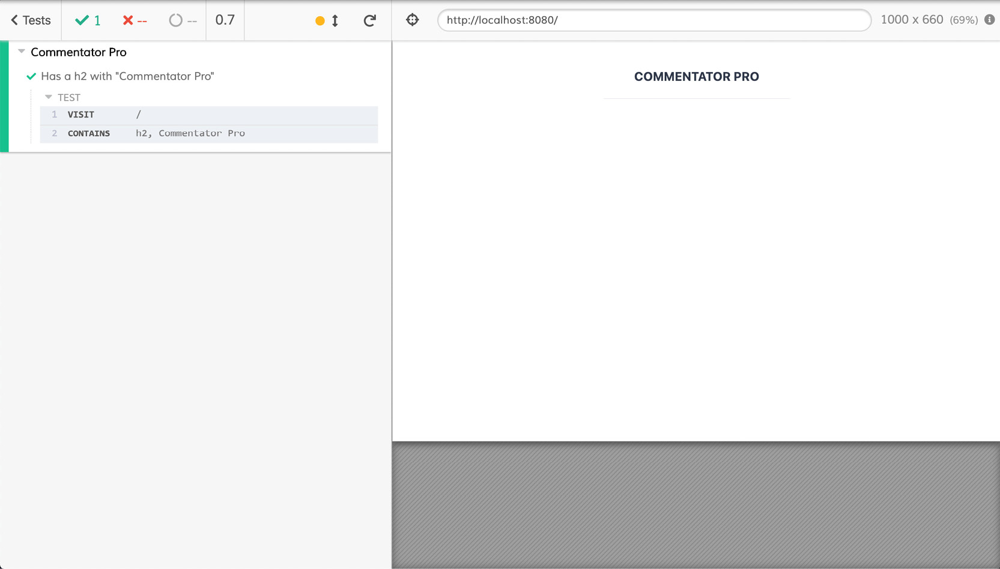

# 13. 端到端测试

概述

在本章中，我们将探讨如何使用 Cypress 为 Vue.js 应用程序创建一个端到端（E2E）测试套件。为了编写健壮的测试，我们将探讨常见的陷阱和最佳实践，例如拦截 HTTP 请求和等待元素出现而不设置超时。

随着我们继续前进，你将了解端到端测试及其用例。你将看到如何配置 Cypress 以测试 Vue.js 应用程序，并使用它与之交互和检查用户界面。在整个章节中，你将熟悉任意超时的陷阱以及如何使用 Cypress 的等待功能来避免它们。在章节的末尾，你还将学习何时、为什么以及如何使用 Cypress 拦截 HTTP 请求。

# 简介

在本章中，我们将为高度异步的应用程序编写端到端测试。

在前面的章节中，我们看到了如何构建复杂的 Vue.js 应用程序以及如何为它们编写单元测试。本章将介绍如何使用 Cypress 为高度交互式且使用 HTTP API 的 Vue.js 应用程序编写端到端测试。我们将看到端到端测试如何通过自动化用户流程，为你提供应用程序按设计工作的信心水平。

# 理解端到端测试及其用例

大多数开发者都曾见过以下图中展示的测试金字塔版本：


图 13.1：测试金字塔图解

端到端测试属于**用户界面**（**UI**）测试类别。在本章中，我们将探讨的是使用 Cypress 进行的自动化端到端测试。

E2E 和 UI 测试提供的信心水平高于单元或集成测试。它们测试的是终端用户使用的应用程序。终端用户不关心错误发生的原因或地点，只关心存在错误。错误的原因和地点往往是单元和系统级测试关注的焦点。单元和系统级测试检查系统的内部是否按照规范或代码描述的方式工作。UI 级测试验证应用程序流程是否按预期工作。

一个运行速度快、假阴性（测试失败但应用程序工作）少、假阳性（所有测试通过但应用程序损坏）更少的强大端到端测试套件，可以启用**持续部署**（**CD**）。持续部署，正如其名所暗示的，涉及持续部署项目或应用程序。在这种设置中，应用程序版本由端到端套件验证，然后自动部署到生产环境。

# 为 Vue.js 应用程序配置 Cypress

**Cypress** 是一个 JavaScript E2E 测试框架。它旨在解决使用 JavaScript 编写 E2E 测试的非常具体的需求。这与其他完整的 **浏览器自动化** 解决方案（如 **WebDriverIO** ([`webdriver.io/`](https://webdriver.io/))）、**Selenium WebDriver** ([`www.selenium.dev/`](https://www.selenium.dev/))）、**Puppeteer** ([`developers.google.com/web/tools/puppeteer/`](https://developers.google.com/web/tools/puppeteer/)) 和 **Playwright** ([`github.com/microsoft/playwright`](https://github.com/microsoft/playwright)）形成对比，这些解决方案通常用于编写 E2E 测试。

与其他解决方案相比，Cypress 的一个显著区别是它专注于编写 E2E 测试（而不是通用的浏览器自动化）。测试只能使用 JavaScript 编写（Selenium 支持其他语言），并且直到最近，它只支持 Chrome（Cypress 4.0 现在支持 Firefox 和 Microsoft Edge，请参阅 [`www.cypress.io/blog/2020/02/06/introducing-firefox-and-edge-support-in-cypress-4-0/`](https://www.cypress.io/blog/2020/02/06/introducing-firefox-and-edge-support-in-cypress-4-0/)）。

Cypress 拥有一个用于本地运行和调试测试的 **图形用户界面 (GUI**)，并附带内置的断言和存根/模拟库。

要使用 Vue CLI 将 Cypress 添加到项目中，我们可以使用 `e2e-cypress` 插件 ([`cli.vuejs.org/core-plugins/e2e-cypress.html`](https://cli.vuejs.org/core-plugins/e2e-cypress.html))，其安装说明指导我们在命令行中运行以下命令。作为添加插件的一部分，Cypress 及其支持包将被下载并解压，因此可能需要一段时间才能完成：

```js
vue add @vue/e2e-cypress
```

插件添加了一个 `test:e2e` 脚本，我们可以使用以下命令运行它。此命令需要一段时间才能启动，因为它需要运行应用程序的生产构建并启动 Cypress 应用：

```js
npm run test:e2e
```

最终，我们将看到以下 Cypress GUI：

![图 13.2：插件安装和运行 test:e2e 命令后的 Cypress 图形用户界面 (GUI)]

](img/B15218_13_02.jpg)

图 13.2：插件安装和运行 test:e2e 命令后的 Cypress GUI

插件为我们创建了一个默认的 `test.js` 文件。默认内容如下。测试会访问应用程序根目录 (`/`) 并检查页面上的 `h1` 是否包含 `Welcome to Your Vue.js App`：

```js
// https://docs.cypress.io/api/introduction/api.html
describe('My First Test', () => {
  it('Visits the app root url', () => {
    cy.visit('/')
    cy.contains('h1', 'Welcome to Your Vue.js App')
  })
})
```

这在空 Vue CLI 项目中是有效的。

我们可以尝试使用 `cy.visit(url)` 访问 `google.com`，并通过首先使用 `cy.get('input')` 选择页面上的输入元素，然后使用 `.should('exist')` 断言来检查与 Google 主页同义的 `input` 元素是否存在：

```js
describe('My First Test', () => {
  it('Opens an arbitrary URL', () => {
    cy.visit('https://google.com')
    cy.get('input').should('exist')
  })
})
```

我们可以通过在 Cypress UI 中单击 `test.js` 来运行测试（当 `npm run test:e2e` 正在运行时）如下所示：

![图 13.3：运行 test.js 的 Cypress UI]

](img/B15218_13_03.jpg)

图 13.3：运行 test.js 的 Cypress UI

当 Cypress 运行测试时，会打开一个浏览器窗口来运行它们：


图 13.4：在访问 Google 主页时在 Chrome 中运行的 Cypress 测试

我们现在已经看到了如何安装和使用 Cypress 访问网页。

在下一节中，我们将看到如何使用 Cypress 与 UI 交互和检查。

## 使用 Cypress 与 Vue.js UI 交互和检查

为了端到端测试具有应用程序名称的 `h2`)，在 `App.vue` 文件中，我们将有如下代码：

```js
<template>
  <div id="app" class="p-10">
    <div class="flex flex-col">
      <h2
        class="uppercase leading-loose pb-4 flex justify-center           m-auto md:w-1/3 text-xl mb-8 font-bold text-gray-800           border-b"
      >
        Commentator Pro
      </h2>
   </div>
  </div>
</template>
<script>
export default {}
</script>
```

为了使用 Cypress 进行测试，我们可以使用以下代码更改 `tests/e2e/specs/test.js` 文件。我们将使用 `cy.visit('/')` 访问运行中的应用程序，然后检查页面上的 `h2` 是否包含 `cy.contains('h2', 'Commentator Pro')`。`cy.contains` 函数是重载的，可以用一个参数（要匹配的文本）或两个参数（容器的选择器和要匹配的文本）使用：

```js
describe('Commentator Pro', () => {
  it('Has a h2 with "Commentator Pro"', () => {
    cy.visit('/')
    cy.contains('h2', 'Commentator Pro')
  })
})
```

然后，我们可以使用以下截图所示的 Cypress UI 运行 `test.js`：



图 13.5：标题内容测试在 Chrome 中成功运行

现在我们已经看到了如何访问页面并对其内容进行断言，我们将看到如何使用 Cypress 自动化 Vue.js 应用程序中新功能的测试。

## 练习 13.01：添加“新评论”按钮和相应的端到端测试

为了使“添加新评论”按钮允许用户添加评论。

我们将添加一个带有文本“添加新评论”的蓝色巨型按钮，并使用 Cypress 编写相应的端到端测试。

要访问此练习的代码文件，请参阅 [`packt.live/36PefjJ`](https://packt.live/36PefjJ)。

要做到这一点，请执行以下步骤：

1.  要在应用程序中添加按钮，我们将在 `src/App.vue` 中添加一个带有一些 `TailwindCSS` 类的 `button` 元素：

    ```js
    <template>
      <div id="app" class="p-10">
        <div class="flex flex-col">
          <!-- rest of template -->
          <button class="flex mx-auto bg-blue-500 hover:bg-blue-700         text-white font-bold py-2 px-4 rounded">
            Add a New Comment
          </button>
        </div>
      </div>
    </template>
    ```

    输出应如下所示：

    

    图 13.6：带有“添加新评论”按钮的 Commentator Pro 应用程序

1.  接下来，我们将在 `tests/e2e/specs/add-new-comment.js` 创建一个新的端到端测试。我们将设置测试套件的名称和测试的描述分别为“添加新评论”和“主页应该有一个带有正确文本的按钮”：

    ```js
    describe('Adding a New Comment', () => {
      it('the homepage should have a button with the right text',     () => {
        // test will go here
      })
    })
    ```

1.  为了测试主页，我们必须使用 `cy.visit('/')` 导航到它：

    ```js
    describe('Adding a New Comment', () => {
      it('the homepage should have a button with the right text',     () => {
        cy.visit('/')
      })
    })
    ```

1.  最后，我们可以编写断言，页面中有一个包含文本“添加新评论”的 `button` 实例：

    ```js
    describe('Adding a New Comment', () => {
      it('the homepage should have a button with the right text',     () => {
        cy.visit('/')
        cy.contains('button', 'Add a New Comment')
      })
    })
    ```

1.  我们可以使用 Cypress UI 运行此测试（使用 `npm run test:e2e` 运行）：

    图 13.7：“add-new-comment.js”测试在 Cypress UI 中显示

1.  当我们运行测试时，我们将在 Chrome 中得到以下输出。测试通过，因为主页上有一个带有相关文本的按钮：

图 13.8：Cypress 在 Chrome 中运行我们的 "add-new-comment" 测试

我们已经看到了如何访问页面并对其内容进行断言。

在下一节中，我们将探讨如何使用 Cypress 来测试交互行为。Cypress 具有自动选择器重试功能，这使得它非常适合测试高度交互的 Vue.js 应用程序。我们将看到如何使用 Cypress 与 UI 交互并断言我们交互的效果。

## 使用 Cypress 触发和等待 UI 更新

我们到目前为止编写的测试相当简单，仅检查应用程序在浏览器加载时不会崩溃。

E2E 测试的一个优势是，当用户与之交互时，可以以高保真度测试 UI 的行为是否符合预期。在本节中，我们将使用 Cypress 的选择（`.get()` 函数）、事件触发（`.click()` 函数）和断言（`.should()` 函数）功能来测试 Vue.js 应用程序。Cypress 在 DOM 选择上的自动重试将允许我们编写无需显式等待/超时条件的 E2E 测试。等待和超时是其他 E2E 测试系统的基本要素，并且往往是测试不稳定的原因。

首先，我们将向我们的`textarea`添加一个评论编辑器，点击`添加新评论`按钮将切换它。

为了在不处理复杂且脆弱的选择器的情况下继续编写测试，我们将开始添加`data-test-id`属性；首先，我们可以在`App.vue`文件中的`添加新评论`按钮上添加一个：

```js
<template>
  <div id="app" class="p-10">
    <div class="flex flex-col">
      <!-- rest of template -->
      <button
        class="flex mx-auto bg-blue-500 hover:bg-blue-700           text-white font-bold py-2 px-4 rounded"
        data-test-id="new-comment-button"
      >
        Add a New Comment
      </button>
      <!-- rest of template -->
    </div>
  </div>
</template>
```

接下来，我们将在`App`组件的 Vue.js `data()`方法中添加一个`showEditor`属性。我们将在编辑器的`v-if`中使用这个表达式。我们还可以设置新的评论按钮来切换这个实例属性：

```js
<template>
  <div id="app" class="p-10">
    <div class="flex flex-col">
      <!-- rest of template -->
     <button
        @click="showEditor = !showEditor"
        class="flex mx-auto bg-blue-500 hover:bg-blue-700           text-white font-bold py-2 px-4 rounded"
        data-test-id="new-comment-button"
      >
        Add a New Comment
      </button>
      <!-- rest of template -->
    </div>
  </div>
</template>
<script>
export default {
  data() {
    return {
      showEditor: false
    }
  }
}
</script>
```

我们可以使用`new-comment-editor` `data-test-id`来添加我们的编辑器，该`data-test-id`可以通过`showEditor`来切换：

```js
<template>
  <div id="app" class="p-10">
    <div class="flex flex-col">
      <!-- rest of template -->
      <div v-if="showEditor">
        <textarea
          data-test-id="new-comment-editor"
          class="flex mx-auto my-6 shadow appearance-none             border rounded py-2 px-3 text-gray-700 leading-tight             focus:outline-none focus:shadow-outline"
        >
        </textarea>
      </div>
    </div>
  </div>
</template>
```

为了测试切换功能，我们可以添加一个测试，打开该应用程序并检查评论编辑器最初不会显示，以及根据在`new-comment-button`上触发的点击次数来检查它是否显示：

```js
describe('Adding a New Comment', () => {
  // other tests   it('the Add a New Comment button should toggle the editor     display on and off', () => {
    cy.visit('/')
    cy.get('[data-test-id="new-comment-editor"]').should       ('not.be.visible')
    cy.get('[data-test-id="new-comment-button"]').click()
    cy.get('[data-test-id="new-comment-editor"]').should       ('be.visible')
    cy.get('[data-test-id="new-comment-button"]').click()
    cy.get('[data-test-id="new-comment-editor"]').should       ('not.be.visible')
  })
})
```

上述代码将生成以下结果：


。

添加这些功能和相应的测试，请执行以下步骤：

1.  要将`textarea`（编辑器）内容存储在内存中，我们将使用`v-model`。我们将创建一个新的数据（状态）变量`newComment`，它被初始化为`""`。现在，`v-model`将双向绑定`textarea`内容和`newComment`：

    ```js
    <template>
      <div id="app" class="p-10">
            <!-- rest of template -->
            <textarea
              data-test-id="new-comment-editor"
              class="flex mx-auto my-6 shadow appearance-none             border rounded py-2 px-3 text-gray-700 leading-tight             focus:outline-none focus:shadow-outline"
              v-model="newComment"
            >
            </textarea>
            <!-- rest of template -->
      </div>
    </template>
    <script>
    export default {
      data() {
        return {
          // other data properties
          newComment: ''
        }
      }
    }
    </script>
    ```

1.  我们将在编辑器内部添加一个`提交`按钮，它应该只在编辑器开启时显示。我们还确保包含一个`data-test-id="new-comment-submit"`属性，以便稍后用 Cypress 选择它：

    ```js
    <template>
      <div id="app" class="p-10">
        <!-- rest of template -->
          <div v-if="showEditor">
            <!-- rest of template -->
            <button
              data-test-id="new-comment-submit"
              class="flex mx-auto bg-blue-500 hover:bg-blue-700             text-white font-bold py-2 px-4 rounded"
            >
            Submit
            </button>
            <!-- rest of template -->
          </div>
        <!-- rest of template -->
      </div>
    </template>
    ```

1.  现在是时候添加一个端到端测试来测试当我们向其中输入文本时`new-comment-editor`是否按预期工作。为了实现这一点，我们需要加载应用程序并点击`新评论`按钮，以便显示编辑器。然后我们可以选择`new-comment-editor`（通过`data-test-id`）并使用 Cypress 的`.type`函数添加一些文本。我们可以将`.should('have.value', 'Just saying...')`链接起来以验证我们对`textarea`的交互是否成功：

    ```js
    describe('Adding a New Comment', () => {
      // other tests
      it('the new comment editor should support text input',     () => {
        cy.visit('/')
        // Get the editor to show
        cy.get('[data-test-id="new-comment-button"]').click()
        cy.get('[data-test-id="new-comment-editor"]').should       ('be.visible')
        cy.get('[data-test-id="new-comment-editor"]')
          .type('Just saying...')
          .should('have.value', 'Just saying...')
      })
    })
    ```

    当使用 Cypress UI 运行时，这个`添加新评论`测试套件应该产生以下结果：

    

    图 13.10：Cypress 运行"添加新评论"测试，包括新的编辑器文本输入测试

1.  最后，我们可以添加一个`端到端测试`来检查`提交`按钮默认情况下不会显示，但当我们点击`新评论`按钮时会出现。我们还可以检查`new-comment-submit`按钮的文本内容：

    ```js
    describe('Adding a New Comment', () => {
      // other tests
      it('the new comment editor should have a submit button',     () => {
        cy.visit('/')
        cy.get('[data-test-id="new-comment-submit"]').should       ('not.be.visible')
        // Get the editor to show
        cy.get('[data-test-id="new-comment-button"]').click()
        cy.get('[data-test-id="new-comment-submit"]').should       ('be.visible')
        cy.contains('[data-test-id="new-comment-submit"]', 'Submit')
      })
    })
    ```

    当这个测试通过 Cypress UI 运行时，我们看到以下结果：

    

    图 13.11：Cypress 运行"添加新评论"测试，包括新的提交按钮测试

1.  我们还可以添加的一个功能是，在文本编辑器中有文本之前，使 `submit` 按钮处于禁用状态。为此，我们可以在 `new comment submit` 按钮上绑定 `:disabled` 到 `!newComment`。我们将使用降低的不透明度使按钮看起来被禁用。顺便说一下，我们添加 `newComment` 和 `textarea` 之间的双向绑定的一大原因是为了启用此类 UI 验证：

    ```js
    <template>
            <!-- rest of template -->
            <button
              data-test-id="new-comment-submit"
              class="flex mx-auto bg-blue-500 hover:bg-blue-700             text-white font-bold py-2 px-4 rounded"
              :disabled="!newComment"
              :class="{ 'opacity-50 cursor-not-allowed' : !newComment }"
            >
            Submit
            </button>
            <!-- rest of template -->
    </template>
    ```

1.  相关测试将检查当文本编辑器内容为空时，`new-comment-submit` 按钮是否被禁用，使用 Cypress 的 `should('be.disabled')` 和 `should('not.be.disabled')` 断言：

    ```js
    describe('Adding a New Comment', () => {
      // other tests
      it('the new comment submit button should be disabled based     on "new comment" content', () => {
        cy.visit('/')
        // Get the editor to show
        cy.get('[data-test-id="new-comment-button"]').click()
        cy.get('[data-test-id="new-comment-submit"]').should       ('be.visible')
        cy.get('[data-test-id="new-comment-submit"]')
          .should('be.disabled')
        cy.get('[data-test-id="new-comment-editor"]')
          .type('Just saying...')
        cy.get('[data-test-id="new-comment-submit"]')
          .should('not.be.disabled')
      })
    })
    ```

    当通过 Cypress UI 和 Chrome 自动化运行时，会产生以下输出：

    

图 13.12：Cypress 运行 "add-new-comment" 测试，包括新的评论提交按钮禁用测试

我们已经看到了如何使用 Cypress 来选择、点击和输入文本。我们还看到了检查元素可见性、文本内容、输入值和禁用状态的方法。

熟悉其他自动化框架的任何人都会注意到，在 Cypress 测试中，没有显式的等待或重试。这是因为 Cypress 会自动等待和重试断言和选择。我们编写的大多数测试都没有以这种方式展示这一点，但下一个练习，我们将引入异步性，将会展示这一点。

## 练习 13.03：向新评论编辑器添加提交状态

为了展示 Cypress 令人印象深刻的自动重试/等待能力，我们将查看为新的评论编辑器添加和测试 `submitting` 状态。

实际上，我们将对 `submit` 按钮的点击做出反应，并显示一个持续 `2.5s` 的加载指示器来模拟对后端 API 的合理慢速 HTTP 请求。这是一个展示 Cypress 自动等待和重试选择能力的示例。这个功能减少了任意等待的需要以及与之相关的易变性。

要访问此练习的代码文件，请参阅[`packt.live/2UzsYJU`](https://packt.live/2UzsYJU)：

1.  为了显示加载指示器，我们将 `tailwindcss-spinner` 包添加到项目中：

    ```js
    npm install --save-dev tailwindcss-spinner
    # or 
    yarn add -D tailwindcss-spinner
    ```

1.  我们需要在 Tailwind 配置文件（`tailwind.js`）中进行配置。它需要使用 `require('tailwindcss-spinner')` 导入，添加为插件，并在 `theme` 中设置相关变量。我们的加载指示器将是 `灰色`，使用 Tailwind 间距大小 `4`，边框宽度为 `2px`，持续时间为 `500ms`：

    ```js
    module.exports = {
      theme: {
        extend: {},
        spinner: (theme) => ({
          default: {
            color: theme('colors.gray.400'), 
            size: theme('spacing.4'),
            border: theme('borderWidth.2'),
            speed: theme('transitionDuration.500'),
          },
        }),
      },
      variants: {
        spinner: ['responsive'],
      },
      plugins: [require('tailwindcss-spinner')()],
    }
    ```

1.  接下来，我们需要在 Vue.js 应用程序的 `data()` 中添加一个 `isSubmitting` 状态，这将允许我们切换 `submit` 按钮的状态。我们将将其初始化为 `false`，因为我们还没有在用户点击 `submit` 按钮之前提交任何内容：

    ```js
    <script>
    export default {
      data() {
        return {
          // other properties
          isSubmitting: false
        }
      }
    }
    </script>
    ```

1.  接下来，我们将为 `submit` 按钮添加一个点击处理程序（作为 `methods.submitNewComment`）。它将使用 `setTimeout` 模拟 `2.5s` 的加载时间：

    ```js
    <script>
    export default {
      // other component properties
      methods: {
       submitNewComment() {
          this.isSubmitting = true
          setTimeout(() => {
            this.isSubmitting = false
          }, 2500)
        }
      }
    }
    </script>
    ```

1.  现在我们已经有一个 `fake submit` 处理器，我们应该将其绑定到 `new-comment-submit` 按钮的点击事件上：

    ```js
    <template>
      <div id="app" class="p-10">
        <div class="flex flex-col">
          <!-- rest of template -->
          <div v-if="showEditor">
            <!-- rest of editor -->
            <button
              data-test-id="new-comment-submit"
              class="flex mx-auto bg-blue-500 hover:bg-blue-700 text-
                white font-bold py-2 px-4 rounded"
              :disabled="!newComment"
              :class="{ 'opacity-50 cursor-not-allowed' : !newComment 
                }"
              @click="submitNewComment()"
            >
            Submit
            </button>
          </div>
        </div>
      </div>
    </template>
    ```

1.  现在是我们要对提交按钮做出反应的部分。当 `isSubmitting` 为真时，我们将显示旋转器。为了做到这一点，我们只需将 `spinner` 类设置为在 `isSubmitting` 为真时添加。除此之外，我们还将设置按钮在 `isSubmitting` 为真时被禁用：

    ```js
    <template>
      <div id="app" class="p-10">
        <div class="flex flex-col">
          <!-- rest of template -->
          <div v-if="showEditor">
            <!-- rest of editor -->
            <button
              data-test-id="new-comment-submit"
              class="flex mx-auto bg-blue-500 hover:bg-blue-700             text-white font-bold py-2 px-4 rounded"
              :disabled="!newComment || isSubmitting"
              :class="{
                'opacity-50 cursor-not-allowed' : !newComment,
                spinner: isSubmitting
              }"
              @click="submitNewComment()"
            >
            Submit
            </button>
          </div>
        </div>
      </div>
    </template>
    ```

1.  最后，我们可以添加一个测试来检查当点击 `submit` 按钮时加载旋转器是否出现。首先，我们需要设置文本编辑器，以便在点击 `add new comment` 按钮并设置评论的文本值时，文本编辑器显示并启用。接下来，我们可以点击已启用的 `new-comment-submit` 按钮并检查它是否被禁用并具有 `spinner` 类（使用 `should()` 函数）。之后，我们应该编写另一个断言，按钮不再被禁用且不显示旋转器：

    ```js
    it('the new comment editor should show a spinner on submit',   () => {
        cy.visit('/')
        // Get the editor to show
        cy.get('[data-test-id="new-comment-button"]').click()
        cy.get('[data-test-id="new-comment-submit"]').should       ('be.visible')
        cy.get('[data-test-id="new-comment-editor"]')
          .type('Just saying...')
        cy.get('[data-test-id="new-comment-submit"]')
          .should('not.be.disabled')
          .click()
          .should('have.class', 'spinner')
          .should('be.disabled')
        // eventually, the spinner should stop showing
        cy.get('[data-test-id="new-comment-submit"]')
          .should('not.have.class', 'spinner')
          .should('not.be.disabled')
      })
    ```

    尽管旋转器显示的时间为 `2.5s`，但由于 Cypress 的自动重试/等待功能，这个测试仍然通过：

    

    ]

图 13.13：Cypress 运行 "添加新评论" 测试，包括评论提交加载状态测试

我们已经看到 Cypress 如何通过自动等待/重试来允许我们在应用程序中无缝处理异步性，当断言或选择失败时。

## 截获 HTTP 请求

如前几节所述，Cypress 被设计为 JavaScript 端到端测试解决方案。这意味着它自带断言、自动等待/重试、运行应用程序的合理默认值以及广泛的模拟功能。

HTTP 请求可能会很慢，并且倾向于给测试引入不稳定的（flaky）行为。所谓的 flaky 指的是间歇性的假阴性，即不是由应用程序问题引起的失败，而是由连接问题（例如，测试运行的服务器和后端主机之间的连接）引起的。

我们还将测试后端系统的实现。当使用**持续集成**（**CI**）时，这意味着需要在任何需要运行端到端测试的 CI 管道步骤中运行后端系统。

通常，当拦截后端请求并发送模拟响应时，我们也说 HTTP 请求被**模拟**，以避免测试不稳定（意味着间歇性失败与应用程序更改无关）。

由于请求并没有完全通过堆栈（包括后端 API），这在技术上不再是系统的完整端到端测试。然而，我们可以将其视为前端应用程序的端到端测试，因为整个应用程序由独立的练习组成，并且不是特定于实现的。

为了在 Cypress 中模拟请求，我们需要使用`cy.server()`和`cy.route()`。Cypress 文档还让我们知道，为了使用 HTTP 拦截功能，我们目前需要一个使用`XMLHttpRequest`（而不是`fetch` API）的客户端。

备注

目前正在进行支持 HTTP 级拦截（这意味着`fetch`、**XHR**等最终都将得到支持）的工作。

我们将使用`unfetch`库，该库在`XMLHttpRequest`之上实现了`fetch`接口。我们可以使用以下命令安装它：

```js
npm install --save-dev unfetch
# or
yarn add -D unfetch
```

然后，我们可以按照以下方式将其导入到`src/App.vue`中。

```js
<script>
import fetch from 'unfetch'
// rest of component
</script>
```

为了展示 HTTP 拦截，我们将从`JSONPlaceholder`获取评论列表并将它们存储在`comments`响应式实例变量下。我们可以使用`fetch`（我们导入`unfetch`时使用的名称）在`mounted()`生命周期事件中这样做，如下所示：

```js
<script>
// imports
export default {
  data() {
    return {
      // other data properties
      comments: []
    }
  },
  mounted() {
    fetch('https://jsonplaceholder.typicode.com/comments')
      .then(res => res.json())
      .then(comments => {
        this.comments = comments
      })
  }
  // other component properties
}
</script>
```

一个示例评论包括 ID、正文和电子邮件等属性。

这意味着我们可以通过创建一个`ul`容器来渲染评论，该容器仅在存在评论时显示（`comments.length > 0`）。在`ul`容器内部，我们可以使用`v-for`渲染一个具有卡片布局的`li`元素列表。每个卡片将渲染评论的正文和作者的电子邮件，并在`mailto:`链接内显示。

注意我们如何为列表容器和列表项分别设置`comments-list`和`comment-card`的`data-test-ids`：

```js
<template>
  <div id="app" class="p-10">
    <div class="flex flex-col">
      <!-- rest of template -->
      <ul
        v-if="comments.length > 0"
        class="flex flex-col items-center my-4 mx-auto           md:w-2/3 lg:w-1/2"
        data-test-id="comments-list"
      >
        <li
          class="flex flex-col px-6 py-4 rounded overflow-hidden             shadow-lg mb-6"
          v-for="(comment, index) in comments"
          :key="comment.id + index"
          data-test-id="comment-card"
        >
          <p class="flex text-gray-700 text-lg mb-4">            {{ comment.body }}</p>
          <p class="flex text-gray-600 font-semibold text-sm">
            <a :href="'mailto:' + comment.email">              {{ comment.email }}</a>
          </p>
        </li>
      </ul>
    </div>
  </div>
</template>
```

如果我们不使用 HTTP 拦截来测试，我们必须保持断言相当通用。例如，我们可以在新的端到端测试文件中检查`comments-list`是否可见，以及是否有（大于 0）个`comment-card`实例：

```js
describe('Loading Existing Comments', () => {
  it('should load & display comments', () => {
    cy.visit('/')
    cy.get('[data-test-id="comments-list"]')
      .should('be.visible')
    cy.get('[data-test-id="comment-card"]')
      .should('have.length.gt', 0)
  })
})
```

使用 Cypress GUI 运行的以下测试通过，但测试相当通用。我们无法对特定评论数量或其内容做出任何断言：


图 13.14：Cypress 运行“load-comments”测试，包括通用的加载和显示测试

为了拦截请求，我们必须使用`cy.server()`初始化 Cypress 模拟服务器。然后我们可以使用`cy.route()`拦截特定的请求，从而产生以下新的测试。当`cy.route`与两个参数一起使用时，它接受 URL 后跟存根响应，在我们的例子中是一个评论数组。我们将在存根中使用一个虚构的电子邮件地址：

```js
describe('Loading Existing Comments', () => {
  // other tests
  it('should load and display comments correctly', () => {
    cy.server()
    cy.route('**/comments', [
      {
        body: 'Vue is getting great adoption',
        email: 'evan@vuejs.org',
        id: 100,
      },
      {
        body: 'Just saying...',
        email: 'evan@vuejs.org',
        id: 10
      },
      {
        body: 'The JS ecosystem is great',
        email: 'evan@vuejs.org',
        id: 1
      }
    ]).as('getComments')
  })
})
```

一旦我们设置了存根路由，我们就可以访问页面并使用`cy.wait('@getComments')`等待评论获取完成，因为我们之前已经使用`.as('getComments')`将评论获取路由的别名设置为`getComments`：

```js
describe('Loading Existing Comments', () => {
  // other tests
  it('should load and display comments correctly', () => {
    // test setup
    cy.visit('/')
    cy.wait('@getComments')
  })
})
```

然后，我们首先可以断言`comments-list`是可见的，然后对`comment-card`卡片数量进行断言：

```js
describe('Loading Existing Comments', () => {
  // other tests
  it('should load and display comments correctly', () => {
    // test setup
    cy.get('[data-test-id="comments-list"]')
      .should('be.visible')
    cy.get('[data-test-id="comment-card"]')
      .should('have.length', 3)
  })
})
```

我们还可以使用`.contains()`函数对卡片的特定内容进行断言：

```js
describe('Loading Existing Comments', () => {
  // other tests
  it('should load and display comments correctly', () => {
    // test setup
    cy.contains('[data-test-id="comment-card"]', 'Vue is       getting great adoption')
      .contains('evan@vuejs.org')
    cy.contains('[data-test-id="comment-card"]', 'Just saying...')
      .contains('evan@vuejs.org')
    cy.contains('[data-test-id="comment-card"]', 'The JS       ecosystem is great')
      .contains('evan@vuejs.org')
  })
})
```

然后，我们可以使用 Cypress GUI 运行测试套件并看到它通过：

![图 13.15：Cypress 运行“load-comments”测试，包括我们的模拟评论测试]


图 13.15：Cypress 运行“load-comments”测试，包括我们的模拟评论测试

我们现在已经看到了如何以及为什么我们可能会使用 Cypress 来模拟 HTTP 请求。

## 练习 13.04：提交时将评论 POST 到 API

当前`new comment`提交按钮仅设置几秒钟的加载状态然后重置 - 实际上评论并没有被发送到任何地方。

让我们使用`JSONPlaceholder` API 作为发送我们新评论的地方。

当向 API 的 POST 请求成功时，我们将评论添加到评论列表的顶部。

要访问此练习的代码文件，请参阅[`packt.live/2IIWY3g`](https://packt.live/2IIWY3g)。

为了完成练习，我们将执行以下步骤：

1.  首先，让`submitNewComment`方法实际上使用`fetch`（实际上是`unfetch`）向`c`发送数据：

    ```js
    <script>
    // imports
    export default {
      // other component properties
      methods: {
        submitNewComment() {
          this.isSubmitting = true
          fetch('https://jsonplaceholder.typicode.com/comments', {
            method: 'POST',
            headers: {
              'Content-Type': 'application/json'
            },
            body: JSON.stringify({
              email: this.email,
              body: this.newComment
            })
          })
        }
      }
    }
    </script>
    ```

    不幸的是，`fetch()`调用本身不会更新数据或退出加载状态。为了做到这一点，我们需要链式调用一些`.then()`函数来处理响应，以及一个`.catch`函数来处理错误。在成功（`.then`）的情况下，我们应该获取请求的 JSON 输出并将其添加到`comments`数组的副本的前面。我们还应该重置`isSubmitting`、`newComment`和`showEditor`。在错误（`.catch`）的情况下，我们只需将加载状态`isSubmitting`重置为 false；我们不会清除编辑器或关闭它，因为用户可能想要再次尝试提交：

    ```js
    <script>
    // imports
    export default {
      // other component properties
      methods: {
        submitNewComment() {
          this.isSubmitting = true
          fetch(
            // fetch params
          ).then(res => res.json())
          .then(data => {
            this.comments = [
              data,
              ...this.comments,
            ]
            this.isSubmitting = false
            this.newComment = ''
            this.showEditor = false
          }).catch(() => {
            this.isSubmitting = false
          })
        }
      }
    }
    </script>
    ```

    我们现在应该将新的测试添加到`tests/e2e/specs/add-new-comment.js`测试套件中。

1.  首先，为了成为好的`JSONPlaceholder`用户，我们将模拟`add-new-comment`套件中所有对`/comments`的`GET`请求。为了实现这一点，我们将使用`beforeEach`钩子来启动 Cypress 模拟服务器（`cy.server()`）并模拟匹配`**/comments`通配符的任何 URL 的`GET`请求，使用`[]`作为响应（`cy.route('GET', '**/comments', [])`）：

    ```js
    describe('Adding a New Comment', () => {
      beforeEach(() => {
        cy.server()
        // GET comments is not the concern of this test suite
        cy.route('GET', '**/comments', [])
      })
      // tests
    ```

1.  然后，我们可以继续更新`the new comment editor should show a spinner on submit`测试，因为我们不再使用`setTimeout`，而是使用 HTTP 请求。首先，我们需要模拟`/comments` POST 请求，我们将使用`cy.route`的配置对象语法来引入 HTTP 请求中的延迟，以便它不会立即响应。我们使用`.as('newComment')`来别名此请求：

    ```js
    describe('Adding a New Comment', () => {
      // setup & tests
      it('the new comment editor should show a spinner on submit',     () => {
        cy.route({
          method: 'POST',
          url: '**/comments',
          delay: 1500,
          response: {}
        }).as('newComment')
        // rest of the test
      })
    })
    ```

1.  而不是`// 最终，旋转器应该停止显示`，我们现在可以使用`cy.wait()`等待`newComment` HTTP 请求完成，然后再检查旋转器是否消失：

    ```js
    describe('Adding a New Comment', () => {
      // setup & tests
      it('the new comment editor should show a spinner on submit',     () => {
        // test setup
        // click the "submit" button
        // check the spinner appears
        cy.wait('@newComment')
        // check that the spinner is gone
      })
    })
    ```

1.  我们添加了新的功能，在 `submit` 操作成功完成后关闭编辑器，因此我们应该添加相关的测试。我们将使用与更新后的 `loading state` 测试类似的骨架，设置 POST 评论路由的模拟 `cy.route('POST', '**/comments', {}', 别名为 `.as('newComment')`）。然后我们可以获取新的评论编辑器以显示，添加一些文本，并提交表单。然后我们将等待 `POST` 请求完成，然后再检查编辑器和提交按钮是否不再可见：

    ```js
    describe('Adding a New Comment', () => {
      // other tests
      it('adding a new comment should close the editor', () => {
        cy.route(
          'POST',
          '**/comments',
          { body: 'Just saying...', email: 'hi@vuejs.org' }
        ).as('newComment')
        cy.visit('/')
        // Get the editor to show
        cy.get('[data-test-id="new-comment-button"]').click()
        cy.get('[data-test-id="new-comment-submit"]').should       ('be.visible')
        cy.get('[data-test-id="new-comment-editor"]')
          .type('Just saying...')
        cy.get('[data-test-id="new-comment-submit"]')
          .should('not.be.disabled')
          .click()
        cy.wait('@newComment')
        cy.get('[data-test-id="new-comment-editor"]').should       ('not.be.visible')
        cy.get('[data-test-id="new-comment-submit"]').should       ('not.be.visible')
      })
    })
    ```

    现在可以使用 Cypress GUI 运行此测试，并且会通过：

    

    图 13.16：Cypress 运行 "add-new-comment" 测试，包括编辑器关闭的测试

1.  我们添加的第二项功能是在 HTTP 请求完成后，将新的用例添加到评论列表的前面。为了测试这一点，最好将评论的 `GET` 请求的响应改为至少包含一个元素（这样我们就可以检查新评论是否被添加到列表的顶部）：

    ```js
    describe('Adding a New Comment', () => {
      // setup & other tests
      it('submitting a new comment should POST to /comments and     adds response to top of comments list', () => {
        cy.route('GET', '**/comments', [
          {
            email: 'evan@vuejs.org',
            body: 'Existing comment'
          }
        ])
      })
    })
    ```

1.  然后，我们可以使用一些模拟数据模拟 `POST` 请求，向编辑器添加文本，并提交表单：

    ```js
    describe('Adding a New Comment', () => {
      // setup & other tests
      it('submitting a new comment should POST to /comments and     adds response to top of comments list', () => {
        // GET request stubbing
        cy.route({
          method: 'POST',
          url: '**/comments',
          response: {
            email: 'evan@vuejs.org',
            body: 'Just saying...',
          },
        }).as('newComment')
        cy.visit('/')
        cy.get('[data-test-id="comment-card"]').should       ('have.length', 1)
        cy.get('[data-test-id="new-comment-button"]').click()
        cy.get('[data-test-id="new-comment-editor"]')
          .type('Just saying...')
        cy.get('[data-test-id="new-comment-submit"]')
          .should('not.be.disabled')
          .click()
        cy.wait('@newComment')
      })
    })
    ```

1.  最后，我们可以通过组合使用 `cy.get()`、`.first()` 和 `.contains()` 来断言第一个评论是新添加的评论：

    ```js
    describe('Adding a New Comment', () => {
      // setup & other tests
      it('submitting a new comment should POST to /comments and     adds response to top of comments list', () => {
        // setup & wait for POST completion
        cy.get('[data-test-id="comments-list"]').should('be.visible')
        cy.get('[data-test-id="comment-card"]')
          .should('have.length', 2)
          .first()
          .contains('[data-test-id="comment-card"]', 'Just saying...')
          .contains('evan@vuejs.org')
      })
    })
    ```

    当使用 Cypress GUI 运行 `add-new-comment` 测试套件时，我们可以看到新的测试通过：

    

图 13.17：Cypress 运行 "add-new-comment" 测试，包括新评论添加到列表顶部的测试

我们已经看到了如何使用 Cypress 来拦截 HTTP 请求，所以在下一节中，我们将探讨 Cypress 提供的一些关于视觉回归（快照）测试的报表工具。

## 使用 Cypress 快照进行视觉回归测试

我们到目前为止使用 Cypress 编写的测试类型主要是功能测试。

功能测试检查应用程序是否按预期 *行为*。视觉测试检查应用程序是否按预期 *外观*。

有方法可以检查渲染的 CSS，但这种方法通常相当繁琐，并且在标记或样式重构时容易出错（即，相同的视觉输出，但有不同的规则或标记）。

幸运的是，Cypress 通过 `cypress-plugin-snapshots` 插件允许我们获取并比较应用程序的快照。首先，需要使用以下命令进行安装：

```js
npm install --save-dev cypress-plugin-snapshots
# or 
yarn add -D cypress-plugin-snapshots
```

插件在 Cypress 选择上添加了 `.toMatchImageSnapshot` 方法。为了使其工作，我们需要在插件的初始化文件中注册它。

我们应该导入 `cypress-plugin-snapshots/plugin` 并使用插件初始化数据运行其 `initPlugin` 导出：

```js
const { initPlugin } = require('cypress-plugin-snapshots/plugin');
module.exports = (on, config) => {
  initPlugin(on, config);
  // rest of plugin config, including return
}
```

我们还需要从`cypress-plugin-snapshots/commands`注册相关命令，这可以在`commands.js`文件中完成：

```js
import 'cypress-plugin-snapshots/commands'
```

我们还需要在`cypress.json`中为`cypress-plugin-snapshots`添加一些配置：

```js
{
  "//": "other config",
  "env": {
    "cypress-plugin-snapshots": {
      "autoCleanUp": false,
      "autopassNewSnapshots": true,
      "diffLines": 3,
      "imageConfig": {
        "createDiffImage": true,
        "resizeDevicePixelRatio": true,
        "threshold": 0.01,
        "thresholdType": "percent"
      },
      "screenshotConfig": {
        "blackout": [],
        "capture": "fullPage",
        "clip": null,
        "disableTimersAndAnimations": true,
        "log": false,
        "scale": false,
        "timeout": 30000
      },
      "backgroundBlend": "difference"
    }
  }
}
```

最后，我们可以在`test.js`文件中添加一个快照测试。

首先，我们将清理文件并模拟`/comments` API 调用（这对于快照测试将特别有用）：

```js
describe('Commentator Pro', () => {
  beforeEach(() => {
    cy.server()
    cy.route('GET', '**/comments', [
      {
        body: 'Just saying...',
        email: 'evant@vuejs.org'
      }
    ]).as('getComments')
  })
  // tests
})
```

接下来，我们可以添加视觉回归测试。我们将打开编辑器以最大化单个快照测试，使用`#app`获取整个`app`，并对其进行快照：

```js
describe('Commentator Pro', () => {
  // setup & other tests
  it('visual regression', () => {
    cy.visit('/')
    cy.get('[data-test-id="new-comment-button"]')
      .click()
    cy.wait('@getComments')
    cy.get('[data-test-id="new-comment-editor"]')
      .should('be.visible')
    cy.get('#app').toMatchImageSnapshot({
      threshold: 0.001,
    })
  })
})
```

当使用 Cypress UI 运行测试时，我们看到以下输出：


图 13.18：Cypress 运行测试，包括视觉回归测试

我们可以通过在`App.vue`文件中将按钮颜色改为红色（从`bg-blue-500`变为`bg-red-500`）来显示失败的快照：

```js
<template>
  <div id="app" class="p-10">
    <div class="flex flex-col">
      <!-- rest of template -->
      <button
        @click="showEditor = !showEditor"
        class="flex mx-auto bg-red-500 hover:bg-blue-700           text-white font-bold py-2 px-4 rounded"
        data-test-id="new-comment-button"
      >
        Add a New Comment
      </button>
      <!-- rest of template -->
    </div>
  </div>
</template>
```

当我们运行相关测试集时，它们现在失败了（因为我们可以看到，按钮是红色而不是蓝色）：


图 13.19：Cypress 运行测试，包含失败的视觉回归测试

通过点击`比较快照`，我们得到一个视觉差异视图，这允许我们更新快照：


图 13.20：Cypress 的失败的视觉回归测试差异视图

我们现在已经看到了如何使用 Cypress 进行视觉回归测试。

我们现在将查看添加新功能及其所有相关测试。

## 活动 13.01：添加设置用户电子邮件和测试的能力

你会记得我们将`evan@vuejs.org`硬编码为任何评论的电子邮件。在这个活动中，我们将添加一个电子邮件输入，它将设置评论上的`email`属性。我们将在新的`tests/e2e/specs/enter-email.js`测试套件中添加相关测试：

1.  为了跟踪电子邮件，我们将它在`data()`中设置为一个响应式状态，并在页面上添加一个电子邮件类型输入，它将使用`v-model`双向绑定到`email`。我们还添加了一个标签和相应的标记。注意，我们将在电子邮件输入上设置一个`data-test-id`属性，设置为`email-input`。

1.  我们现在将添加一个`beforeEach`钩子来设置 Cypress 模拟服务器并模拟`GET`评论（列表）请求。评论列表请求应别名为`getComments`。

1.  我们将添加第一个测试，检查是否在电子邮件输入中键入工作正确。我们将进入应用，输入电子邮件，并检查我们输入的内容现在是否是输入值。

    当使用 Cypress UI 运行时，我们应该得到以下通过测试：

    

    图 13.21：Cypress 运行"enter-email"测试，包含电子邮件输入测试

1.  拥有 `email` 属性是添加评论的先决条件，因此当 `email` 为空时（`!email`），我们将禁用 `添加新评论` 按钮。我们将绑定到 `disabled` 属性，并根据 `email` 字段是否已填充来切换一些类。

1.  使用这个新的 `当 email 为空时禁用添加新评论按钮` 功能，我们应该添加一个新的端到端测试。我们将加载页面，并在初始加载时检查电子邮件输入是否为空，以及 `添加新评论` 按钮是否被禁用。然后我们将在电子邮件输入字段中输入电子邮件，并检查 `添加新评论` 按钮现在是否 *未* 禁用，这意味着它已被启用。

    当使用 Cypress UI 运行时，我们应该看到新的测试通过，输出如下：

    ![图 13.22：Cypress 运行 "enter-email" 测试，禁用添加评论按钮测试]

    添加评论按钮测试

    

    图 13.22：Cypress 运行 "enter-email" 测试，禁用添加评论按钮测试

1.  现在我们有了捕获电子邮件的方法，我们应该在调用 POST 评论时将其传递给后端 API（即提交新评论时）。为了做到这一点，我们应该修改 `methods.submitNewComment` 中将 `email` 固定为 `evan@vuejs.org` 的位置。

1.  现在我们正在使用用户输入的电子邮件，我们应该编写一个端到端测试来检查它是否被发送。我们将模拟 POST 请求，将其别名为 `newComment`，并返回一个任意值。然后我们可以访问页面，填写电子邮件输入，打开评论编辑器，填写内容，并提交。然后我们将等待 `newComment` 请求，并断言请求体中的内容和电子邮件与我们完成它们时相同。

    注意

    我们也可以选择不模拟 `POST` 请求，而是检查新插入页面上的评论卡片是否包含正确的电子邮件和内容。

    当使用 Cypress UI 运行时，我们得到以下测试运行输出：

    ![图 13.23：Cypress 运行 "enter-email" 测试，电子邮件输入测试]

    

图 13.23：Cypress 运行 "enter-email" 测试，电子邮件输入测试

注意

此活动的解决方案可以通过此链接找到。

# 摘要

在本章中，我们探讨了如何利用 Cypress 从端到端测试 Vue.js 应用程序。

端到端测试通常非常有用，可以给我们一个高度信心，即测试的流程将按预期工作，而不是单元或集成测试，后者以更低的开销验证我们的代码是否按预期工作。

我们已经展示了如何使用 Cypress 来检查、交互和断言 UI。我们还展示了 Cypress 的默认等待/重试功能在编写健壮测试时的巨大优势。

我们利用 Cypress 的 HTTP 请求拦截库来模拟 HTTP 请求，使测试更加可预测和快速。

最后，我们探讨了如何使用 Cypress 设置视觉回归测试。

在下一章中，我们将探讨如何将 Vue.js 应用程序部署到网页上。
