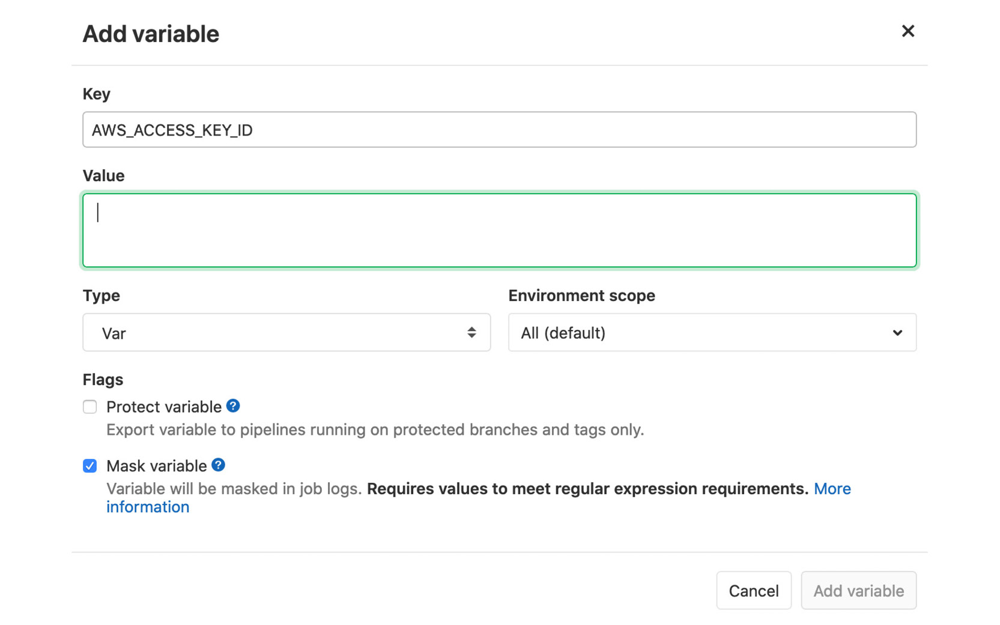
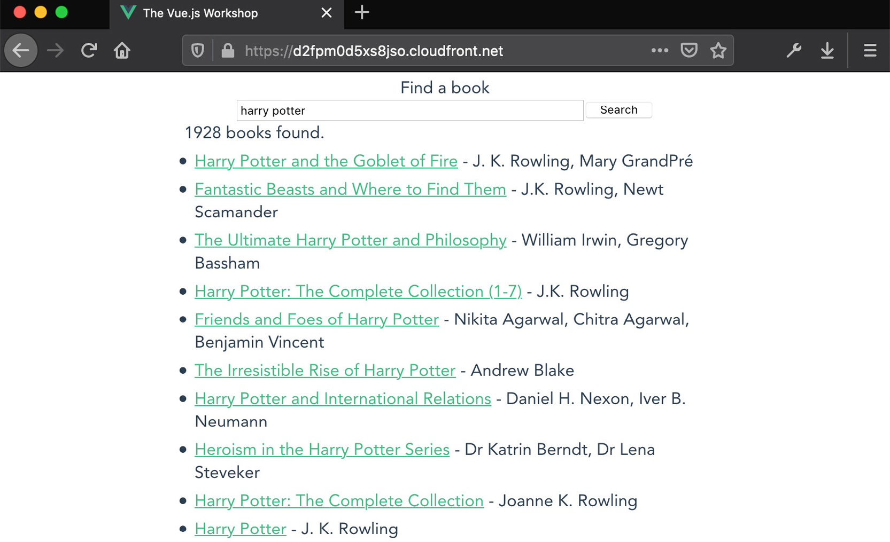

# 14. 将您的代码部署到网络

概述

在本章结束时，您将能够解释 CI/CD 工作流程的好处以及它是如何与发布周期、发布节奏和开发工作流程相结合的。为此，您将能够阐述 Vue.js 开发与生产构建之间的差异以及所做出的权衡。为了测试和部署 Vue.js 应用程序，您将配置 GitLab CI/CD，包括管道、作业和步骤。您将熟悉 Netlify、AWS S3 和 AWS CloudFront，以及它们的关键相似之处和差异。

在本章中，我们将探讨如何将 Vue.js 应用程序部署到万维网，以及如何自动化此部署过程以轻松和有信心地频繁发布。

# 简介

在本章中，我们将探讨如何利用 CI/CD 工具和技术，以高信心和高频率将应用程序交付到生产环境中。

在前面的章节中，我们看到了如何构建和测试复杂的 Vue.js 应用程序。本章是关于利用所有技术，包括测试和自动化它们，以最小风险和时间开销将软件交付到生产环境中。

# CI/CD 作为敏捷软件开发过程的一部分的好处

**持续集成**（**CI**）是每天多次集成代码的实践。为了支持这一点，需要一个支持单个存储库中多个工作状态（分支）的现代 **版本控制系统**（**VCS**），如 Git，以便允许开发者独立工作代码，同时仍然允许他们安全地协作和集成他们的更改。

为了增强版本控制系统（VCS）、存储库（如 GitLab 或 GitHub）周围的托管和协作工具的能力，已经创建了这些工具，并允许开发者通过网页 **用户界面**（**UI**）更有效地查看和管理代码更改。

作为这些托管平台及其提供的协作工具的一部分，或作为补充，自动检查对于在集成前后保持代码质量的高信心至关重要。采用 CI 方法通常意味着包括额外的代码质量步骤，例如单元或集成测试、覆盖率检查，以及每次任何新代码集成到主线分支（集成更改的分支）时构建工件。

团队遵循的用于代码协作和 CI 的 Git 规范被称为 **Git 工作流程**，通常简称为 **Git flow**。

Git flow 将决定分支命名规范，以及如何以及何时集成更改。例如，一个团队可能会决定分支应以工单编号开头，后跟一个简短的短划线小写描述，例如 `WRK-2334-fix-ie-11-scroll`。

作为 Git flow 的一部分，决定并遵守的其他约定示例包括提交消息的长度和标题、应该通过或允许失败的自动检查，以及合并变更请求所需的审阅者数量，在 GitHub 和 GitLab 的术语中，分别称为拉取请求或合并请求。

Git 流程分为两大类：基于主干的开发和（功能）基于分支的开发。我们将首先介绍基于分支的开发，因为其局限性已经变得非常明显，大多数项目倾向于使用基于主干的开发。

在基于分支的 Git 工作流程中，多个工作分支被保存在仓库中。基于分支的流程可以用来保持与环境状态一致的分支。

例如，以下图表显示了三个分支——**生产**、**预发布**和**开发**。**生产**不包含来自**预发布**或**开发**的任何变更。**预发布**领先于**生产**，但除了**生产**上的变更外，与**开发**没有共同变更。**开发**领先于**预发布**和**生产**：它在与**预发布**相同的提交上从**生产**分支出来，但它与**预发布**没有共享任何进一步的提交：


图 14.1：具有三个环境分支的基于分支的 Git 提交/分支树示例

基于分支的工作流程也可以用来跟踪进入发布线的变更。这在项目需要维护应用程序或库的两个版本，但需要对两个版本都应用错误修复或安全补丁的情况下很有用。

在以下示例中，我们有一个与环境分支类似的分支示例。版本 1.0.0 包含一些在 1.0.1 和 1.1.0 中不存在的变化，但不共享任何新的代码。版本 1.0.1 和 1.1.0 同时从 1.0.0 分支出来，但它们没有共享进一步的变更：


图 14.2：具有三个发布分支的基于分支的 Git 提交/分支树示例

在基于主干分支的 Git 工作流程中，团队中的每个成员都会从一个单一分支创建新的分支，通常是“master”分支。这个过程通常被称为“从分支分支”：


图 14.3：一个基于主干分支的 Git 提交/分支树示例，有两个功能分支从主分支分支出来

基于主干分支的工作流程的一个极端情况是只有一个**单一**的分支供所有人提交。

注意

在基于仓库的环境下，"发布分支"的替代方案是使用 Git 标签来跟踪发布快照。这提供了与维护分支相同的优势，即减少了分支噪音，并且由于标签一旦创建就不能更改，因此具有不可变性的额外好处。

**持续交付（CD**）是团队能够将每个良好的构建部署到生产环境的能力。

持续交付（CD）的一个先决条件是持续集成（CI），因为持续集成（CI）为构建的质量提供了一些初始的信心。作为持续交付（CD）的一部分，除了持续集成（CI）之外，还需要新的系统、工具和实践。

参考以下图表，了解与持续集成（CI）和持续交付（CD）相关的工具和实践：


图 14.4：持续集成（CI）和持续交付（CD）实践之间的关系

采用持续交付（CD）所需的额外成分是对应用程序将继续按预期（对于最终用户）工作以及新缺陷没有无意中引入的高度信心。这意味着在能够部署之前，需要在持续集成（CI）检查期间或之后进行额外的端到端测试步骤来验证构建。

这些端到端测试可以手动进行，也可以自动化。在一个理想的持续交付（CD）设置中，后者（自动化端到端测试）是首选的，因为它意味着部署不包括人工交互。如果端到端测试通过，构建可以自动部署。

为了促进持续交付（CD），用于部署软件的系统必须重新思考。作为 CD 的一部分，部署不能是一个冗长的手动过程。这导致公司采用云原生技术，如 Docker，以及基础设施即代码工具，如 HashiCorp 的 **Terraform**。

向持续交付（CD）实践转变的强调导致了 **GitOps** 和 **ChatOps** 等想法的诞生。

在 GitOps 和 ChatOps 中，部署和运营任务是由开发者和利益相关者每天交互的工具驱动的。

在 GitOps 中，可以通过 GitHub/GitLab（或另一个 Git 托管提供商）、直接使用 GitHub Actions 或 GitLab CI/CD，或者通过具有紧密集成和报告功能的持续集成/持续交付（CI/CD）软件（如 CircleCI 或 Jenkins）来进行部署。

在 ChatOps 的情况下，使用对话界面来部署和操作软件。某些 ChatOps 的变体可以被认为是 GitOps 的子集，例如，与 `deploy <service-name> <environment>` 等工具交互，这些工具会将服务部署到相关环境。请注意，聊天界面非常类似于开发者可能习惯的命令行界面，但其他利益相关者可能需要一些时间来适应。

我们现在已经探讨了持续集成（CI）和持续交付（CD）的方法；接下来我们将讨论使用持续集成（CI）和持续交付（CD）的优势：


图 14.5：持续集成（CI）和持续交付（CD）的优势

这两种实践也会对团队的心态和表现产生影响。能够在一天内看到您的更改集成，并在一周内将其部署到生产环境中，这意味着贡献者可以立即看到他们的工作产生了影响。

CI/CD 还有助于推广敏捷原则，其中更改是迭代地应用和部署的。这与项目长期的时间表形成对比，其中估计的不准确会累积并可能导致重大延误。

# 为生产构建

将应用程序部署到生产环境始于创建一个可以部署的工件。在 Vue.js 的情况下，我们正在构建一个客户端应用程序，这意味着我们的构建工件将包含 HTML、JavaScript 和 CSS 文件。

Vue CLI 内置了一个 `build` 命令。这个 `build` 命令将把我们的 Vue.js 单文件组件（`.vue` 文件）编译成渲染函数（Vue 运行时可以使用这些函数来渲染我们的应用程序），并将它们输出到 JavaScript 中。

作为构建过程的一部分，Vue CLI 将会处理 JavaScript、Vue 单文件组件以及相互导入的模块，并将它们 *打包*。打包意味着相互依赖的相关代码块将被输出为一个单一的 JavaScript 文件。

由于我们使用了 Vue CLI，Vue.js 库本身也可以被精简。Vue.js 运行时包可以包含一个 **运行时编译器**，它可以将字符串模板转换为客户端上的渲染函数。由于我们在构建时使用 Vue CLI 编译为渲染函数，因此 Vue.js 的这部分不需要包含在我们的 JavaScript 中。

Vue CLI 的构建步骤还包括一个 `死代码消除` 步骤。这意味着它可以分析正在生成的代码，如果其中任何部分显然从未使用过——例如，一个如 `if (false) { /* do something */ }` 这样的语句——那么它将不会出现在构建输出中。

默认情况下，当我们调用 `vue service build` 时，Vue CLI 会为生产环境构建，这在 Vue CLI 项目中是通过 `build` 脚本来实现的，可以使用 `npm run build` 或 `yarn build` 来运行。

在一个示例 Vue CLI 项目中，我们将看到类似以下的内容：


图 14.6：在新的 Vue CLI 项目中 "npm run build" 的输出

`dist` 文件夹现在可以使用静态托管解决方案（如 Netlify 或 AWS S3 和 CloudFront）进行部署。

我们现在已经看到了如何使用 Vue CLI 和 `npm run build` 命令来构建用于生产的 Vue.js 应用程序。

接下来，我们将看到如何使用 GitLab CI/CD 来测试我们的代码（在部署之前）。

# 使用 GitLab CI/CD 测试您的代码

GitLab 有一个内置的 CI/CD 工具，称为 GitLab CI/CD。

为了使用 GitLab CI/CD，您需要一个 GitLab 账户。

要与托管在 GitLab 上的 Git 仓库交互，您还需要将您机器上的 SSH 密钥与您的 GitLab 账户关联。

注意

在 GitLab 文档中添加 SSH 密钥的说明可以在 [`docs.gitlab.com/ee/gitlab-basics/create-your-ssh-keys.html`](https://docs.gitlab.com/ee/gitlab-basics/create-your-ssh-keys.html) 找到。

一旦您创建了账户，您可以使用 `项目` 页面右上角的 `新建项目` 按钮创建一个新的存储库，如图所示 截图：


图 14.7：带有新建项目按钮的 GitLab "项目"页面

如果您点击 `新建项目` 按钮，您将被带到 `新建项目` 页面，在那里您可以使用默认的 `空白项目` 选项卡通过给它一个名称和 slug 来创建项目，如图所示 截图：


图 14.8：选择空白项目的 GitLab 新项目页面

一旦您点击 `创建项目`，GitLab `项目` 页面将以空状态出现，显示如何克隆项目的说明。您应该运行克隆存储库所需的命令，这可能是以下等效命令（您应该在您的机器上运行）：

注意

如果您没有将 SSH 密钥与您的账户关联，在此阶段 GitLab 应该会显示一个带有您可点击链接的警告，以设置 SSH 密钥。

`git clone <repository-url>`

在您的机器上，您应该打开已克隆存储库的目录。为了添加 GitLab CI/CD，我们需要在项目的根目录中添加一个 `.gitlab-ci.yml` 文件。一个示例 `.gitlab-ci.yml` 文件，它将一个 `build` 作业添加到管道的 `build` 阶段，用于安装依赖项（使用 `npm ci`），运行生产构建（`npm run build`），并缓存输出工件，定义如下。

作业名称是通过在 YAML 文件中设置顶级键来定义的——在这种情况下，`build:`。

在 YAML 语法中，我们将增加缩进来表示 `build` 键指向一个对象。

在 `build job` 对象中，我们将定义用于运行作业的 Docker 镜像，使用 `image: node:lts`。这意味着我们希望这个作业在 Node.js **长期支持** (**LTS**) 镜像上运行，该镜像将是 Node.js 12，直到 2020 年 10 月 20 日，届时它将指向 Node.js 14 镜像。

注意

您可以在 [`nodejs.org/en/about/releases/`](https://nodejs.org/en/about/releases/) 访问最新的 Node.js LTS 发布计划。

我们可以在作业中定义的另一个属性是阶段。GitLab CI/CD 管道默认有三个阶段：**构建**、**测试**和**部署**。当团队的工作流程不适合这三个类别时（例如，如果需要部署到多个环境），可以使用自定义阶段来替换这些阶段。请参阅文档 ([`docs.gitlab.com/ee/ci/yaml/#stages`](https://docs.gitlab.com/ee/ci/yaml/#stages))。

注意

`stages`用于定义作业可以使用的阶段，并且它是全局定义的。

`stages`的指定允许灵活的多阶段管道。阶段中元素的顺序定义了作业执行的顺序：

a) 同一阶段的作业是并行运行的。

b) 下一个阶段的作业将在前一个阶段的作业成功完成后运行。

我们的管道目前只有一个阶段和一个作业，所以大部分前面的内容对我们不适用。

我们设置的最后一个属性是`script`，它定义了在作业运行时应运行的步骤，以及`artifacts`，它配置了工件存储。在我们的例子中，我们将运行`npm ci`来安装所有依赖项，然后运行`npm run build`，这将运行生产 Vue.js CLI 构建。我们的工件被设置为保留一周，并包含`dist`文件夹（Vue CLI `build`输出存储的地方）。

完整来说，我们有以下内容：

```js
build:
  image: node:lts
  stage: build
  script:
    - npm ci
    - npm run build
  artifacts:
    expire_in: 1 week
    paths:
      - dist
```

一旦我们将这个`.gitlab-ci.yml`文件推送到包含 Vue CLI 项目的仓库中，我们将在仓库视图中看到以下内容，其中有一个步骤的管道正在最新提交上运行：


图 14.9：GitLab 仓库视图，显示在最新提交上运行的构建作业

如果我们点击`Pipeline`图标（蓝色进行中指示器），我们将获得管道视图。在管道视图中，`Build`代表`状态管道`（我们将其设置为`build`）并且它代表作业名称（我们将其定义为`build`）。在作业完成之前，我们会看到相同的进行中指示器，如下所示：


图 14.10：GitLab CI 管道视图，显示正在运行的构建作业

作业完成后，我们会看到一个`成功`图标（绿色勾号）。我们可以在作业运行时或完成后（无论它是否失败或成功）点击此图标或作业名称来访问作业视图。当作业完成时，我们还会看到一个`重试`图标，这可以用来重试失败的管道步骤。以下截图显示了作业成功运行：


图 14.11：GitLab CI 管道视图，显示构建作业通过

点击作业后，我们会看到`作业`视图，它显示了作业中所有步骤的详细分解。从`准备 docker_machine 执行器`步骤开始，该步骤加载 Node.js Docker 镜像，我们看到运行脚本以及缓存和工件恢复的步骤，如下所示：


图 14.12：GitLab CI 作业视图，显示成功的构建作业

如果我们想在 GitLab CI/CD 运行中添加`test`步骤，我们需要在一个支持单元测试的项目中。这可以通过使用 Vue CLI 来实现，它是通过`vue add @vue/unit-jest`安装的。安装和添加单元测试在*第十二章*，*单元测试*中进行了详细说明。

我们需要在`.gitlab-ci.yml`文件中添加一个新的作业；我们将称之为`test`，使用`node:lts`镜像，并将作业分配给`test`状态。在作业中，我们运行`npm ci`，然后是`npm run test:unit`（这是由`unit-jest` CLI 插件添加的`npm`脚本）：

```js
# rest of .gitlab-ci.yml
test:
  image: node:lts
  stage: test
  script:
    - npm ci
    - npm run test:unit
```

一旦我们推送这个新的`.gitlab-ci.yml`文件，我们将在主存储库页面上看到以下视图：


图 14.13：存储库视图，GitLab CI/CD 正在运行包含新测试步骤的管道

我们可以点击进入管道视图。GitLab CI/CD 使用管道的原因是，在某个阶段的失败步骤将意味着后续阶段的步骤将不会运行。例如，如果我们得到一个失败的`build`作业，`test`阶段的作业将不会运行。以下截图很好地解释了这一点：


图 14.14：GitLab CI/CD 管道视图，失败的构建作业阻止测试作业/阶段运行

如果我们再次提交另一个提交或重试构建步骤（如果失败不是由更改引起的）并再次导航到管道视图，我们将看到以下内容：


图 14.15：构建阶段作业全部成功后，GitLab CI/CD 管道视图中的测试作业正在运行

一旦`测试`作业成功，我们将看到以下管道：


图 14.16：GitLab CI/CD 管道视图，构建和测试阶段的作业全部成功

我们现在已添加了一个包含`build`和`test`阶段的 GitLab CI/CD 管道，该管道将验证在每次向 GitLab 存储库推送时，代码仍然按预期集成。

## 练习 14.01：向您的 GitLab CI/CD 管道添加 Lint 步骤

Linting 是一种获取自动化格式化和代码风格检查的方法。将其集成到 CI 中可以确保所有合并到主线分支的代码都遵循团队的代码风格指南。它还减少了代码风格审查评论的数量，这些评论可能会很嘈杂，并可能分散对更改请求的基本问题的关注。

要访问此练习的代码文件，请参阅[`packt.live/2IQDFW0`](https://packt.live/2IQDFW0)：

1.  为了添加代码检查，我们需要确保我们的 `package.json` 文件中包含 `lint` 脚本。如果它缺失，我们需要添加它并将其设置为 `vue-cli-service lint`：

    ```js
    {
      "// other": "properties",
      "scripts": {
        "// other": "scripts",
        "lint": "vue-cli-service lint",
        "// other": "scripts"
      },
      "// more": "properties"
    }
    ```

1.  为了在 GitLab CI/CD 上运行代码检查，我们需要添加一个新的 `lint` 作业，该作业将在 GitLab CI/CD 管道的 `test` 阶段运行在 Node.js LTS Docker 映像中。我们将在 `.gitlab-ci.yml` 中这样做：

    ```js
    lint:
      image: node:lts
      stage: test
    ```

1.  为了让 `lint` 作业按照 `package.json` 中的设置运行 `lint` 脚本，我们需要在 `.gitlab-ci.yml` 文件中添加一个 `script` 部分。首先需要运行 `npm ci` 来安装依赖项，然后运行 `npm run lint` 来执行代码检查：

    ```js
    lint:
      image: node:lts
      stage: test
      script:
        - npm ci
        - npm run lint
    ```

1.  最后，我们需要使用以下命令提交和推送代码到 GitLab：

    ```js
    git add .
    git commit -m "add linting"
    git push
    ```

    一旦代码被推送，我们就可以通过 GitLab CI/CD UI 看到管道运行，如下所示。注意，在 `test` 阶段的全部作业都是并行运行的：

    

    包括并行运行的 "test" 和 "lint"

    

图 14.17：GitLab CI/CD 管道视图，所有作业均成功，包括并行运行的 "test" 和 "lint"

我们现在已经看到了如何使用 GitLab CI/CD 在每次提交时运行构建和测试。

接下来，我们将看到如何将 Vue.js 应用程序部署到 Netlify。

# 部署到 Netlify

Netlify 是一家专注于静态托管和相关支持服务的托管提供商，以便拥有一个使用静态托管的全交互网站。这包括诸如 Netlify Functions（无服务器函数）、Netlify Forms（无后端表单提交系统）和 Netlify Identity（身份/认证提供商）等服务。

以下部分需要您拥有一个 Netlify 账户，这是免费的。

将网站部署到 Netlify 的最简单方法是使用拖放界面。您可以在登录视图的首页底部找到它：[`app.netlify.com`](https://app.netlify.com)。它看起来如下所示：


App 首页底部


图 14.18：Netlify 的拖放部署区域位于 App 首页底部

因此，我们可以选择一个已经运行过 `npm run build` 命令并可以通过简单地将 `dist` 文件夹拖动到拖放部署区域来部署的项目，如下面的截图所示：


图 14.19：将 dist 文件夹拖放到 Netlify 拖放部署区域

一旦上传成功，Netlify 会将您重定向到您的新网站管理页面。它看起来如下所示：


图 14.20：Netlify 新应用页面用于拖放网站

我们可以点击网站链接，然后我们会看到默认的 Vue CLI 首页模板，如下所示：

![图 14.21：Netlify 新应用显示问候信息]

![图片 B15218_14_21.jpg]

图 14.21：Netlify 新应用显示问候信息

我们已经看到了如何使用拖放界面手动将站点部署到 Netlify。

接下来，我们将看到如何从 GitLab 将我们的站点部署到 Netlify。

在 Netlify 应用主页上，我们需要点击显示在以下截图中的“从 Git 创建新站点”按钮：

![图 14.22：Netlify 主页，带有从 Git 创建新站点的按钮]

![图片 B15218_14_22.jpg]

图 14.22：Netlify 主页，带有从 Git 创建新站点的按钮

我们将看到一个页面，要求我们选择要连接的 Git 提供商。在这个例子中，我们将使用`GitLab`。以下截图显示了屏幕将如何显示：

![图 14.23：Netlify – 创建新站点 | 连接到 Git 提供商]

![图片 B15218_14_23.jpg]

图 14.23：Netlify – 创建新站点 | 连接到 Git 提供商

点击`GitLab`后，我们将收到 GitLab 的 OAuth 授权挑战，我们需要通过点击以下截图所示的“授权”按钮来接受：

![图 14.24：GitLab OAuth 授权模态框]

![图片 B15218_14_24.jpg]

图 14.24：GitLab OAuth 授权模态框

然后，我们将被重定向到 Netlify，并被要求选择要部署的仓库，如下所示：

![图 14.25：选择要部署的 GitLab 仓库]

![图片 B15218_14_25.jpg]

图 14.25：选择要部署的 GitLab 仓库

我们选择我们想要部署的仓库，并遇到一个配置页面。由于我们现在是在 Netlify 的构建服务器上构建，我们需要配置 Netlify 以构建应用程序并部署正确的文件夹。

我们将构建命令填写为`npm run build`，因为这是我们构建脚本。发布目录是`dist`。

然后，我们可以点击“部署站点”按钮，这将启动部署过程，如下所示：

![图 14.26：Netlify 构建配置选项卡，已填写 npm run build]

分别为构建命令和发布目录的 dist

![图片 B15218_14_26.jpg]

图 14.26：Netlify 构建配置选项卡，已填写 npm run build 和 dist 作为构建命令和发布目录

然后，我们将被重定向到新创建的应用程序页面，如下所示：

![图 14.27：新的 Netlify 应用]

![图片 B15218_14_27.jpg]

图 14.27：新的 Netlify 应用

我们已经看到了如何使用手动上传方法将应用程序部署到 Netlify，以及如何使用 GitLab 作为 Git 托管提供商。

## 练习 14.02：从 GitHub 将站点部署到 Netlify

我们已经看到了如何从 GitLab 将站点部署到 Netlify，但它与从 GitHub 部署有何不同？答案是它们非常相似；唯一的显著区别是“连接到 Git 提供商”选项卡中的第一步：

1.  我们将首先点击主页上的“从 Git 创建新站点”按钮，如下所示：![图 14.28：Netlify 仪表板上的从 Git 创建新站点]

    ![图片 B15218_14_28.jpg]

    图 14.28：Netlify 控制台上的 Git 新站点

1.  然后，我们将选择 `GitHub` 作为 Git 托管提供商，如下截图所示：

    图 14.29：持续部署

1.  当我们遇到 GitHub OAuth 授权挑战，如下截图所示，我们授权 Netlify：

    图 14.30：GitHub 授权挑战

1.  我们从仓库列表中选择我们想要部署的 Vue CLI 项目，如下所示：

1.  

    图 14.31：选择正确的仓库

1.  在部署选项选项卡上，我们选择 `master` 作为要部署的分支。

1.  我们将构建命令设置为 `npm run build`。

1.  我们将发布目录设置为 `dist`。

1.  完成的部署选项如下所示：

    图 14.32：Netlify 构建配置选项卡已填写 npm run build 和 dist，分别代表构建命令和发布目录

1.  我们点击 `部署站点` 以开始部署过程。

我们现在已经看到了如何使用手动上传方法以及使用 GitLab 或 GitHub 作为 Git 托管提供商将应用程序部署到 Netlify。

接下来，我们将了解如何使用 **Amazon Web Services 简单存储服务**（**AWS S3**）和 AWS CloudFront 部署 Vue.js 应用程序。

# 使用 S3 和 CloudFront 部署到 AWS

Amazon S3 是一种静态存储服务，可以用作静态文件的托管，例如由 Vue CLI 的 `build` 脚本生成的文件。

CloudFront 是 AWS 的 **内容分发网络**（**CDN**）服务。CDN 可以通过从 **边缘**位置提供静态内容来提高 Web 应用程序的性能。这些服务器位于世界各地，并且更有可能位于比 **源**服务器（实际提供内容的服务器）更靠近最终用户的地方。如果 CDN 的边缘服务器没有缓存资源，它们将从源请求资源，但会为后续请求提供服务。

以下步骤的一个先决条件是 AWS 账户：

1.  我们首先创建并配置一个 S3 存储桶。

    我们首先前往 S3 产品页面。它将类似于以下截图：

    

    图 14.33：从 AWS 服务列表中选择 S3

1.  在 S3 控制台主页上，我们可以点击 `创建存储桶` 按钮，这将带我们到存储桶创建页面，如下所示：

    图 14.34：AWS S3 控制台上的创建存储桶按钮

1.  首先，我们给我们的存储桶命名。为了本例的目的，让我们称它为`vue-workshop`，如下所示：

    图 14.35：在存储桶创建页面输入存储桶名称

1.  我们还需要将 S3 存储桶设置为公开。这是通过取消选择`阻止所有公开访问`复选框来完成的。一旦这样做，我们必须检查确认复选框，如下所示：

    图 14.36：将 S3 存储桶设置为公开并确认警告

1.  一旦完成，我们将被重定向到存储桶列表页面。我们想要点击进入我们新的存储桶。然后，我们需要访问`属性`标签，以找到`静态网站托管`选项：

1.  

    图 14.37：S3 存储桶属性标签中的静态网站托管选项

1.  我们可以填写`静态网站托管`S3 属性，选择`使用此存储桶托管网站`，并将索引文档和错误文档设置为`index.html`。记下`端点`URL 是个好主意，因为我们需要配置 CloudFront，如下所示：

    图 14.38：填写静态网站托管 S3 属性

1.  我们现在可以回到 S3 存储桶页面的`概览`标签，点击`上传`，并将文件从我们的`dist`文件夹之一拖放到以下截图所示的位置：

1.  

    图 14.39：通过拖放将文件添加到 vue-workshop S3 存储桶

1.  一旦文件被拖放到概览页面，我们点击`下一步`，并确保在页面的`管理公开权限`部分选择`授予此对象（s）公开读取访问权限`，以确保文件权限设置为`公开`。完成此操作后，我们可以通过点击`下一步`和`上传`，在审查上传的文件后，不更改默认值完成上传，如下所示：

1.  

    图 14.40：设置上传到 S3 存储桶的文件权限为公开

1.  我们现在应该已经配置了 S3 存储桶以托管静态内容，通过访问网站端点（在**属性** | **静态网站托管**中可用），我们看到以下 Vue.js 应用程序（这是我们上传的）：

    图 14.41：从我们的 AWS S3 存储桶提供的 Vue.js 应用程序

    注意，S3 只能通过 HTTP 提供网站服务，并且无法直接从 S3 存储桶配置域名。除了性能和健壮性之外，能够设置自定义域名和 HTTPS 支持也是将 AWS CloudFront 设置为网站 CDN 的其他原因。

1.  我们将首先导航到 CloudFront 控制台并点击“创建分布”按钮，如下所示：

1.  

    

    图 14.42：从 AWS 服务列表中选择 CloudFront

1.  当提示我们想要创建哪种类型的分布时，我们将通过点击相关的“开始”按钮选择`Web`，如下截图所示：

1.  

    

    图 14.43：选择创建 Web CloudFront 分布

1.  “源域名”应该是 S3 存储桶网站端点域名——换句话说，就是之前我们用来访问它的 URL 的域名。对于位于`us-east-1`区域的`example`存储桶，它看起来像`example.s3-website.us-west-1.amazonaws.com`。以下截图显示了这一点：

    

    图 14.44：在 CloudFront 分布的“源域名”字段中输入网站端点域名

1.  在设置分布时，选择“默认缓存行为”部分的“查看器协议策略”字段的“将 HTTP 重定向到 HTTPS”选项是个好主意，如下所示：

1.  

    

图 14.45：为查看器协议策略字段选择将 HTTP 重定向到 HTTPS

现在我们已经准备好点击“创建分布”按钮并等待更改传播。

注意

由于 CloudFront 分布更改正在部署到世界各地的服务器上，因此它们需要一段时间才能传播。

一旦控制台显示其状态为“已部署”，我们就可以打开 CloudFront 分布的域名。

我们已经看到了如何设置 S3 和 CloudFront 来托管静态网站。现在我们将看到如何使用 AWS CLI 将本地目录同步到 S3 存储桶。

下一个部分的前提条件是有一个使用`AWS_ACCESS_KEY_ID`、`AWS_SECRET_ACCESS_KEY`和`AWS_DEFAULT_REGION`环境变量注入 AWS 凭证的 shell 实例。访问密钥和秘密密钥需要从“账户”下拉菜单中的“我的安全凭证”下的“访问密钥”生成。它还需要 AWS CLI 版本 2。

如果我们是在 Vue CLI 项目中，我们可以使用 AWS S3 CLI 命令将 `dist` 文件夹（可以使用 `npm run build` 构建）部署到我们的 `vue-workshop` 存储桶。我们想要更新一个 `s3` 资源，以便我们的命令以 `aws s3` 开始。我们想要执行的命令是同步文件，所以我们将使用 `aws s3 sync` 命令。我们将同步 `./dist` 到 `vue-workshop` S3 存储桶，使用 AWS URI 语法，即 `s3://vue-workshop`。我们还想要确保我们上传的文件，就像存储桶配置一样，允许 `public-read`。完整的命令如下：

```js
aws s3 sync ./dist s3://vue-workshop --acl=public-read
```

## 练习 14.03：从 GitLab CI/CD 部署到 S3

S3 是一种非常经济高效且性能出色的解决方案，用于大规模存储静态文件。在这个练习中，我们将探讨如何集成 GitLab CI/CD 和 AWS S3 来部署 Vue.js 应用程序。这将自动化 Vue.js 应用的部署。部署将在每次向 GitLab 推送时运行，无需任何手动干预。

要访问此练习的代码文件，请参阅 [`packt.live/3kJ1HPD`](https://packt.live/3kJ1HPD)。

为了从 GitLab CI/CD 部署到 S3 存储桶，我们首先需要设置凭证管理：

1.  按照以下步骤导航到 GitLab 的 `CI/CD` 设置部分：

    

    图 14.46：设置菜单中的 CI/CD

1.  我们将想要添加变量，所以让我们展开该部分。你将看到如下截图所示的消息：

    

    图 14.47：GitLab CI/CD 设置的变量部分展开

1.  接下来，我们将使用 UI 添加 `AWS_ACCESS_KEY_ID` 和 `AWS_SECRET_ACCESS_KEY`（由于它们是敏感的 API 密钥，所以未显示其值），如下所示：

1.  

    

    图 14.48：输入 AWS_ACCESS_KEY_ID 环境变量

1.  然后，我们可以使用 UI 添加默认的 `AWS_REGION` 变量。这不是那么敏感，所以其值在以下截图中显示：

1.  

    

    图 14.49：输入 AWS_DEFAULT_REGION 环境变量

1.  现在我们已经在 GitLab CI/CD 上设置了环境变量，我们可以开始更新我们的 `.gitlab-ci.yml` 文件。首先，我们想在 `build` 步骤之后开始缓存 `dist` 目录。为了做到这一点，我们需要在 `build` 作业中添加一个 `cache` 属性：

    ```js
    build:
      # other properties
      cache:
        key: $CI_COMMIT_REF_SLUG
        paths:
          - dist
      # other properties
    # other jobs
    ```

1.  我们现在可以添加我们的 `deploy` 作业，它将是 `deploy` 阶段的一部分。为了访问 AWS CLI，我们将使用 Python 映像（`python:latest`）并在 `before_script` 步骤中使用 `pip`（Python 包管理器）安装 AWS CLI。一旦我们安装了 AWS CLI，我们将在 `script` 步骤中使用我们用于从本地机器部署的 `aws s3 sync` 命令来运行部署：

    ```js
    # other jobs
    deploy:
      image: python:latest
      stage: deploy
      cache:
        key: $CI_COMMIT_REF_SLUG
        paths:
          - dist
      before_script:
        - pip install awscli
      script:
        - aws s3 sync ./dist s3://vue-workshop --acl=public-read
    ```

    注意

    由于 Vue CLI 的 `build` 命令通过指纹文件内容内置了缓存清除功能，我们不需要使缓存失效。指纹化意味着如果文件内容发生变化，其名称/URL 将相应地更改。当请求此新文件时，它将从未缓存的 URL 加载，因此将获取文件的最新版本。

    一旦将此配置更新推送到 GitLab 仓库，我们可以看到管道运行了三个阶段，所有阶段都通过了，如下所示：

    

图 14.50：通过构建、测试和部署作业

我们已经看到了如何使用 AWS CLI 和 GitLab CI/CD 配置和部署 Vue.js 应用程序到 S3 和 CloudFront。

## 活动 14.01：将 GitLab CI/CD 添加到图书搜索应用程序并部署到 Amazon S3 和 CloudFront

现在，让我们使用 GitLab CI/CD 将一个完全构建的 **图书搜索** Vue.js 应用程序部署到 S3/CloudFront，该应用程序从 Google Books API 加载数据。我们将从在本地运行生产构建并检查输出开始。然后，我们将切换到在 GitLab CI 上运行构建和代码质量步骤（linting）。最后，我们将设置 S3 存储桶和 CloudFront 分发，并将它们与 GitLab CI/CD 集成，以便在每次向仓库推送时部署。

此活动的起始代码可以在 `Chapter14/Activity14.01_initial` 中找到；我们从一个 `Chapter14/Activity14.01_solution` 开始：

1.  首先，我们想要在本地运行生产构建。我们可以使用用于构建所有 Vue CLI 项目的常规命令。我们还将检查相关的资产（JavaScript、CSS 和 HTML）是否正确生成。

    我们预计 `dist` 文件夹将包含以下类似的结构：

    

    图 14.51：Vue CLI 生产构建运行后 dist 文件夹的示例内容（使用 tree 命令生成）

1.  为了运行 GitLab CI/CD，我们需要一个 `.gitlab-ci.yml` 文件。我们将在 `.gitlab-ci.yml` 中添加一个作业，该作业在 `build` 阶段运行 Node.js LTS Docker 容器中的包安装，然后是生产构建。我们还将确保缓存生产构建的输出。

    一旦我们使用 `git add .gitlab-ci.yml` 并提交和推送更改，我们应该看到以下 GitLab CI/CD 管道运行，其中包含正在运行状态的 `build` 作业：

    

    图 14.52：构建作业正在运行的 GitLab CI/CD 管道

    另一方面，以下截图表示 `build` 作业完成并处于 `passed` 状态时的 GitLab CI/CD 管道：

    

    图 14.53：GitLab CI/CD 流水线中 build 作业通过

1.  接下来，我们希望在 GitLab CI/CD 的`test`阶段添加一个代码质量作业（通过更新`.gitlab-ci.yml`）。我们将这个作业命名为`lint`，它将运行依赖项的安装以及通过 Vue CLI 进行代码检查。

    一旦我们使用`git add .gitlab-ci.yml`提交并推送更改，我们应该看到以下 GitLab CI/CD 流水线运行，其中包含正在运行状态的`lint`作业：

    

    图 14.54：运行中的 GitLab CI/CD 流水线及 lint 作业

    以下截图显示了 GitLab CI/CD 流水线，其中`lint`作业已成功完成：

    

    图 14.55：GitLab CI/CD 流水线中 lint 作业通过

1.  为了部署我们的应用程序，我们需要在 S3 控制台中创建一个启用`public access`的`vue-workshop-book-search` S3 存储桶。

    S3 存储桶创建页面应如下所示：

    

    图 14.56：S3 存储桶创建页面，输入 vue-workshop-book-search 作为存储桶名称

    以下截图显示了 S3 存储桶创建页面上的公共访问和免责声明信息：

    

    图 14.57：S3 存储桶创建页面，启用公共访问并接受相关免责声明

1.  为了通过 Web 访问 S3 存储桶内容，我们还需要配置其网络托管。我们可以通过 S3 控制台配置网络托管属性。

    应该按照以下配置，将索引和错误页面设置为`index html`：

    

    图 14.58：S3 存储桶属性页面，启用网络托管并配置索引和错误页面为 index.html

1.  为了让 GitLab CI/CD 能够在 S3 上创建和更新文件，我们需要将相关的 AWS 密钥添加到我们的 GitLab 仓库 CI/CD 设置中。这些密钥可以在 AWS 管理控制台的`Username`下拉菜单 | `My Security Credentials` | `Access keys`（访问密钥 ID 和秘密访问密钥） | `Create New Access Key`（或选择一个密钥进行重用）中找到。以下截图显示了这些详细信息：

1.  

    图 14.59：GitLab CI/CD 设置页面，已添加所需的 AWS 环境变量（值已隐藏）

1.  接下来，我们希望在 GitLab CI/CD 的 `deploy` 阶段添加一个 `deploy` 作业（通过更新 `.gitlab-ci.yml`）。我们将作业命名为 `deploy`；它需要下载 `awscli` `pip` 包（Python 包管理器），这意味着最有意义的 Docker 镜像是 `python:latest`。`deploy` 作业将从缓存中加载构建好的生产构建，使用 `pip` 安装 `awscli`，并运行 `aws s3 sync <build_directory> s3://<s3-bucket-name> --acl=public-read`。

    一旦我们使用 `git add .gitlab-ci.yml` 并提交和推送更改，我们应该看到以下 GitLab CI/CD 管道运行，其中包含运行状态的 `deploy` 作业：

    

    图 14.60：GitLab CI/CD 管道中部署作业正在运行

    以下截图显示了成功完成的 `deploy` 作业的 GitLab CI/CD 管道：

    

    图 14.61：GitLab CI/CD 管道中部署作业已通过

    一旦管道完成，我们的应用程序应可通过以下截图所示的 `web` S3 端点访问：

    

    图 14.62：通过 S3 网端点 URL 访问的图书搜索

1.  最后，我们将创建一个充当 `web` S3 端点 CDN 的 CloudFront 分发。我们需要将 `origin` 设置为我们的 S3 存储桶网端点的源，并确保我们已经启用了 `Redirect HTTP to HTTPS`，如下面的截图所示：

1.  

图 14.63：显示源和设置行为的 CloudFront 分发创建页面

一旦 CloudFront 分发部署，我们的应用程序应可通过以下截图所示的 CloudFront 分发域名访问：



图 14.64：通过 CloudFront 域访问的图书搜索显示 "harry potter" 搜索的结果

注意

此活动的解决方案可以通过此链接找到。

# 摘要

在本章中，我们探讨了如何将 CI 和 CD 实践引入 Vue.js 项目，以便安全高效地部署到生产环境。我们看到了 CI 和 CD 在敏捷交付过程中的好处。我们使用 GitLab 的 CI/CD 功能在每次提交时运行测试、代码检查和构建。我们看到了如何通过将 Netlify 连接到我们的托管提供商来利用 Netlify 托管静态网站。最后，我们探讨了如何设置和部署到 AWS S3 和 CloudFront。

在这本书的整个过程中，你已经学会了如何构建、测试和部署一个适用于你的团队和最终用户的可扩展且性能良好的 Vue.js 应用程序。
