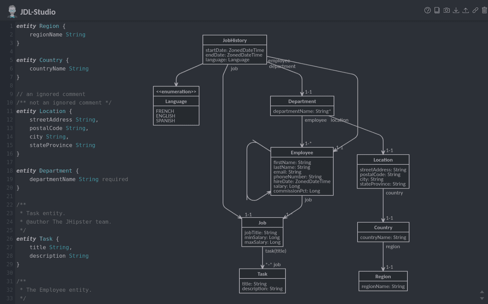
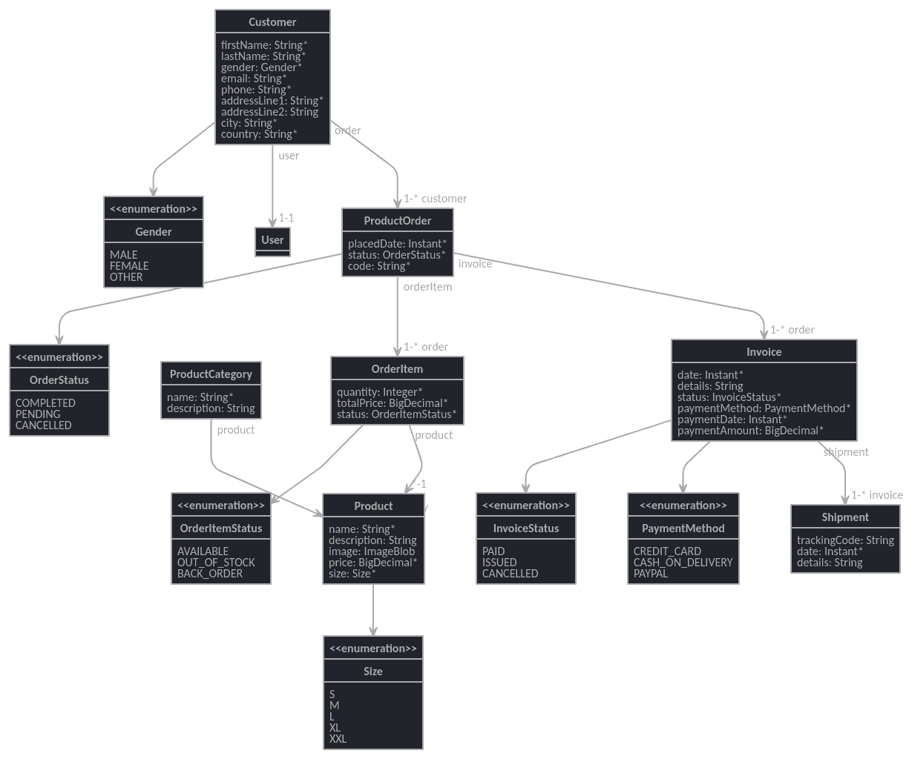
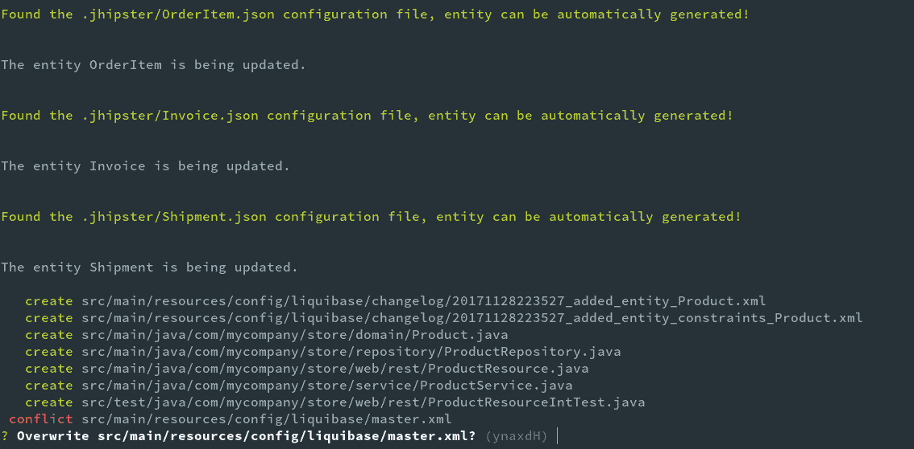
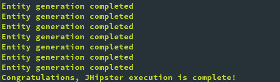
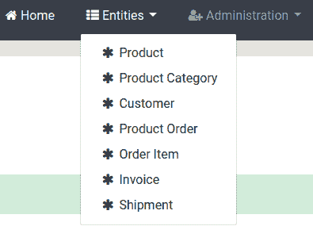
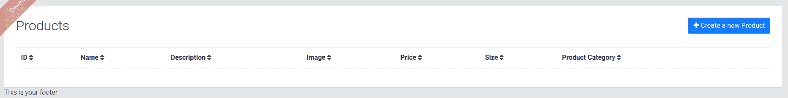
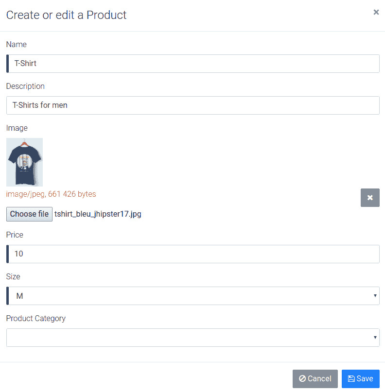
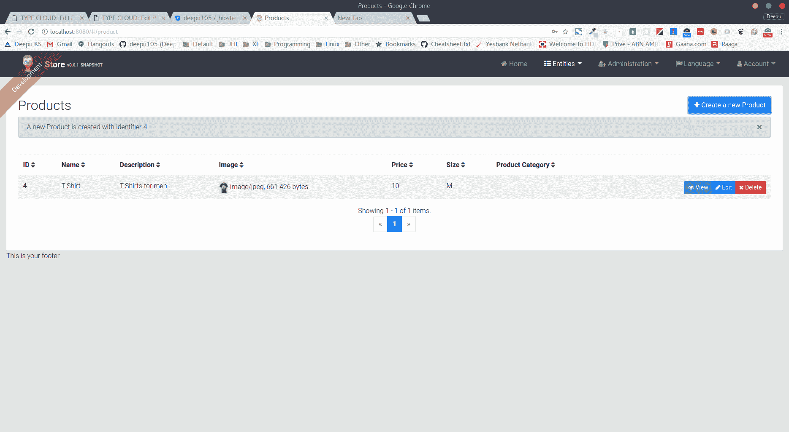

# 使用 JHipster 领域语言进行实体建模

在上一章中，我们看到了如何使用 JHipster 生成一个具有许多出色功能的生产级 Web 应用程序，例如 i18n、管理模块、账户管理等。在本章中，我们将看到如何通过业务实体和模型来丰富该应用程序。

在本章中，我们将学习以下内容：

+   **JHipster 领域语言（JDL**）(**JDL**)

+   JDL 工作室

+   使用 JDL 进行实体和关系建模

+   实体生成

# JDL 简介

JDL ([`www.jhipster.tech/jdl/`](http://www.jhipster.tech/jdl/)) 用于创建 JHipster 应用程序的领域模型。它提供了一个简单且用户友好的 DSL 来描述实体及其关系（仅适用于 SQL 数据库）。

JDL 是为应用程序创建实体的推荐方式，可以替代 JHipster 提供的实体生成器，在创建大量实体时使用起来可能比较困难。JDL 通常在具有 `.jh` 扩展名的一个或多个文件中编写。

访问 [`www.jhipster.tech/jdl/`](http://www.jhipster.tech/jdl/) 获取 JDL 的完整文档。

如果你更喜欢使用 UML 和 UML 建模工具，那么请查看 JHipster-UML ([`www.jhipster.tech/jhipster-uml/`](http://www.jhipster.tech/jhipster-uml/))，这是一个可以从流行的 UML 工具创建实体的工具。

# JDL 的 DSL 语法

现在，让我们看看 JDL 语法。在撰写本文时，JDL 支持生成带有关系和选项（如 DTO、服务层等）的完整实体模型。语法可以分解为以下内容：

+   实体声明

+   关系声明

+   选项声明

在以下语法中，`[]` 表示可选，`*` 表示可以指定多个。

可以将 Javadocs 添加到实体声明中，并将 `/** */` Java 注释添加到字段和关系声明中。可以使用 `//` 语法添加 JDL 仅注释。

在 JDL 中也可以定义数值常量，例如，`DEFAULT_MIN_LENGTH = 1`。

# 使用 JDL 进行实体建模

实体声明使用以下语法进行：

```js
entity <entity name> ([<table name>]) {
  <field name> <type> [<validation>*]
}
```

`<entity name>` 是实体的名称，将用于类名和表名。表名可以使用可选的 `<table name>` 参数进行覆盖。

`<field name>` 是你想要为实体添加的字段（属性）的名称，而 `<type>` 是字段类型，例如 String、Integer 等。有关所有支持的字段类型，请参阅 [`www.jhipster.tech/jdl/#available-types-and-constraints`](http://www.jhipster.tech/jdl/#available-types-and-constraints)。ID 字段将自动创建，因此不需要在 JDL 中指定。

`<validation>` 是可选的，并且可以根据字段类型支持的验证指定一个或多个 `<validation>` 字段。对于如最大长度和模式这样的验证，值可以在大括号中指定。

一个示例实体声明可能如下所示：

```js
/**
 * This is customer entity javadoc comment
 * @author Foo
 */
entity Customer {
  /** Name field */
  name String required,
  age Integer,
  address String maxlength(100) pattern(/[a-Z0-9]+/)
}
```

可以使用以下语法声明枚举：

```js
enum <enum name> {
  <VALUE>*
}
```

这里有一个例子：

```js
enum Language {
  ENGLISH, DUTCH, FRENCH
}
```

# 关系管理

可以使用此语法声明实体之间的关系：

```js
relationship <type> {
  <from entity>[{<relationship name>[(<display field>)] <validation>*}] 
  to 
  <to entity>[{<relationship name>[(<display field>)] <validation>*}]
}
```

`<type>` 是 `OneToMany`、`ManyToOne`、`OneToOne` 或 `ManyToMany` 中的一个，正如其名，它声明了 `<from entity>` 和 `<to entity>` 之间的关系类型。

`<from entity>` 是关系或源的所有者实体的名称。`<to entity>` 是关系的目的地。

`<relationship name>` 是可选的，可以用来指定在领域对象中创建的关系的字段名。`<display field>` 可以在括号中指定，以控制要在生成的网页上的下拉菜单中显示的实体字段，默认情况下将使用 ID 字段。`<validation>` 可以在 `<from entity>` 或 `<to entity>` 上指定，是可选的。目前只支持必需的。

`OneToMany` 和 `ManyToMany` 关系在 JHipster 中总是双向的。在 `ManyToOne` 和 `OneToOne` 关系的情况下，可以创建双向和单向关系。对于单向关系，只需在目的地/实体上跳过 `<relationship name>` 即可。

同一类型的多个关系可以在同一块中声明，用逗号分隔。

一个示例关系声明可能看起来像以下这样：

```js
entity Book
entity Author
entity Tag

relationship OneToMany {
  Author{book} to Book{writer(name) required},
  Book{tag} to Tag
}
```

用户是 JHipster 中的一个现有实体，可以与用户有某些关系。可以声明多对多和一对一关系，但其他实体必须是源或所有者。也可以与用户实体有多个一对一关系。

# DTO、服务和分页选项

JDL 还允许我们轻松声明与实体相关的选项。当前支持的选项包括：

+   `service`：默认情况下，JHipster 生成直接调用实体存储库的 REST 资源类。这是一个最简单的选项，但在现实世界的场景中，我们可能需要一个服务层来处理业务逻辑。此选项让我们可以创建一个简单的 Spring 服务 bean 类或使用传统的接口和实现来创建服务 bean。可能的值是 `serviceClass` 和 `serviceImpl`。选择后者将创建一个接口和实现，这是某些人所偏好的。

+   `dto`：默认情况下，领域对象直接用于创建的 REST 端点，这在某些情况下可能不是所希望的，你可能想使用一个中间的**数据传输对象**（**DTO**）来获得更多控制。JHipster 允许我们使用 Mapstruct ([`mapstruct.org/`](http://mapstruct.org/)) 生成 DTO 层，Mapstruct 是一个注解预处理库，它可以自动生成 DTO 类。当使用 DTO 时，建议使用服务层。可能的值是 `mapstruct`。更多信息请访问：[`www.jhipster.tech/using-dtos/`](http://www.jhipster.tech/using-dtos/)。

+   `filter`: 此选项允许我们为实体启用基于 JPA 的过滤功能。这仅在使用了服务层时才有效。更多详情请访问：[`www.jhipster.tech/entities-filtering/`](http://www.jhipster.tech/entities-filtering/)。

+   `paginate`: 此选项允许我们为实体启用分页功能。这将在资源层上启用分页，并在客户端实现分页选项。可能的值有 pager、pagination 和 infinite-scroll。

+   `noFluentMethod`: 这允许我们禁用为生成的实体域对象启用的 Fluent API 风格的设置器。

+   `skipClient`/`skipServer`: 这些选项允许我们在生成过程中跳过客户端代码或服务器端代码。

+   `angularSuffix`: 此选项允许我们为前端代码中的文件夹和类名指定后缀。

选项声明的通用语法是 `<OPTION> <ENTITIES | * | all> [with <VALUE>] [except <ENTITIES>]`。

以下是一些可能的选项和它们可以声明的不同语法：

```js
entity A
entity B
...
entity Z

dto * with mapstruct
service A with serviceImpl
service B with serviceClass
paginate * with pagination except B, C
paginate B, C with infinite-scroll
filter A, B
```

# JDL Studio

我们将使用 JDL Studio ([`start.jhipster.tech/jdl-studio/`](https://start.jhipster.tech/jdl-studio/)) 来创建我们的 JDL 文件。这是一个由 JHipster 团队构建的在线网络应用程序，用于在可视化编辑器中创建 JDL 文件。该工具显示了创建的实体模型的视觉表示，并允许您导入/导出 JDL 和捕获图像快照：



工具还提供诸如语法高亮、自动完成、错误报告和 Sublime Text 风格的键盘快捷键等功能。

使用您喜欢的浏览器导航到 [`start.jhipster.tech/jdl-studio/`](https://start.jhipster.tech/jdl-studio/) 以打开应用程序。

请注意，默认情况下，此应用程序将 JDL 存储在您的浏览器本地存储中。如果您想将 JDL 文件保存到云端，可以使用 JHipster 在线创建账户。

# 用例实体模型及解释

现在，让我们看看我们的用例和实体模型。在那之前，请清除 JDL Studio 编辑器中的默认 JDL。

# 实体

让我们先定义我们的实体：

1.  将以下片段复制到 `Product` 和 `ProductCategory` 的 JDL Studio 编辑器中：

```js
/** Product sold by the Online store */
entity Product {
    name String required
    description String
    price BigDecimal required min(0)
    size Size required
    image ImageBlob
}

enum Size {
    S, M, L, XL, XXL
}

entity ProductCategory {
    name String required
    description String
}
```

`Product` 实体是域模型的核心；它包含产品信息，如 `name`、`description`、`price`、`size` 和 `image`（这是一个 Blob）。`name`、`price` 和 `size` 是必填字段。`price` 还有一个最小值验证。`size` 字段是一个具有定义值的枚举类型。

`ProductCategory` 实体用于将产品分组在一起。它有 `name` 和 `description`，其中 `name` 是必填字段。

1.  将以下片段添加到 JDL Studio 编辑器的 `Customer` 中：

```js
entity Customer {
    firstName String required
    lastName String required
    gender Gender required
    email String required pattern(/^[^@\s]+@[^@\s]+\.[^@\s]+$/)
    phone String required
    addressLine1 String required
    addressLine2 String
    city String required
    country String required
}

enum Gender {
    MALE, FEMALE, OTHER
}
```

`Customer` 实体包含使用在线购物门户的客户的详细信息。大多数字段都被标记为必填项，`email` 字段有正则表达式模式验证。`gender` 字段是一个枚举类型。此实体与我们将很快详细了解的系统用户相关。

1.  将以下关于`ProductOrder`和`OrderItem`的片段添加到 JDL Studio 编辑器中：

```js
entity ProductOrder {
    placedDate Instant required
    status OrderStatus required
    code String required
}

enum OrderStatus {
    COMPLETED, PENDING, CANCELLED
}

entity OrderItem {
    quantity Integer required min(0)
    totalPrice BigDecimal required min(0)
    status OrderItemStatus required
}

enum OrderItemStatus {
    AVAILABLE, OUT_OF_STOCK, BACK_ORDER
}
```

`ProductOrder`和`OrderItem`实体用于跟踪客户制作的产品订单。`ProductOrder`包含订单的`placedDate`、`status`和`code`，这些都是必需字段，而`OrderItem`包含关于单个项目的`quantity`、`totalPrice`和`status`的信息。所有字段都是必需的，而`quantity`和`totalPrice`字段有最小值验证。`OrderStatus`和`OrderItemStatus`是枚举字段。

1.  将以下关于`Invoice`和`Shipment`的片段添加到 JDL Studio 编辑器中：

```js
entity Invoice {
    date Instant required
    details String
    status InvoiceStatus required
    paymentMethod PaymentMethod required
    paymentDate Instant required
    paymentAmount BigDecimal required
}

enum InvoiceStatus {
    PAID, ISSUED, CANCELLED
}

enum PaymentMethod {
    CREDIT_CARD, CASH_ON_DELIVERY, PAYPAL
}

entity Shipment {
    trackingCode String
    date Instant required
    details String
}
```

`Invoice`和`Shipment`实体分别用于跟踪产品订单的发票和运输。`Invoice`中的大多数字段是必需的，而`status`和`paymentMethod`字段是枚举类型。

枚举被用来包含某些字段的范围，这为这些字段提供了更细粒度的控制。

# 关系

现在我们已经定义了我们的实体，让我们在它们之间添加关系：

1.  将以下关于关系片段添加到 JDL Studio 编辑器中：

```js
relationship OneToOne {
    Customer{user} to User
}
```

首先声明的关系是一个`Customer`实体和内置的`User`实体之间的单向`OneToOne`关系：

```js
Customer (1) -----> (1) User
```

这意味着`Customer`实体了解`User`并且是关系的所有者，但`User`并不知道`Customer`，因此我们无法从`User`中获取客户。这使我们能够将客户映射到`User`实体，并在以后用于授权目的，确保一个客户只能映射到一个系统用户。

1.  将以下关于关系的片段添加到 JDL Studio 编辑器中：

```js
relationship ManyToOne {
    OrderItem{product} to Product
}
```

这个声明定义了从`OrderItem`到`Product`的单向`ManyToOne`关系：

```js
OrderItem (*) -----> (1) Product
```

这意味着`OrderItem`了解它们的`Product`，但`Product`并不知道`OrderItem`。这样设计保持了代码的整洁性，因为我们不希望在这个用例中从产品中了解订单。将来，如果我们想了解为某个产品制作的订单，我们可以使这种关系双向。

1.  将以下关于关系片段添加到 JDL Studio 编辑器中：

```js
relationship OneToMany {
   Customer{order} to ProductOrder{customer},
   ProductOrder{orderItem} to OrderItem{order},
   ProductOrder{invoice} to Invoice{order},
   Invoice{shipment} to Shipment{invoice},
   ProductCategory{product} to Product{productCategory}
}
```

这个声明很有趣，因为我们有多个`OneToMany`声明：

```js
Customer (1) <-----> (*) ProductOrder
ProductOrder (1) <-----> (*) OrderItem
ProductOrder (1) <-----> (*) Invoice
Invoice (1) <-----> (*) Shipment
ProductCategory (1) <-----> (*) Product
```

它们都是双向的，意味着源实体和目标实体都知道对方。

我们声明一个`Customer`可以有多个`ProductOrder`，`ProductOrder`可以有多个`OrderItem`和发票，`Invoice`可以有多个`Shipment`，而`ProductCategory`可以有多个`Product`。从目标实体出发，源实体被映射为`ManyToOne`。

# 实体选项

将以下关于选项片段添加到 JDL Studio 编辑器中：

```js
service * with serviceClass
paginate Product, Customer, ProductOrder, Invoice, Shipment, OrderItem with pagination
```

在选项中，我们保持简单，声明我们想要为所有实体创建服务类。我们还为可能随着时间的推移获得大量条目的某些实体启用了分页。

图表显示了完整的模型，包括所有实体及其在 JDL Studio 中显示的关系：



现在，让我们将此 JDL 文件下载到我们的文件系统中：

1.  点击 JDL Studio 应用程序右上角的下载按钮。

1.  将文件以 `online-store.jh` 的名称保存在我们在上一章创建应用程序的 `online-store` 目录中。

# 使用 JHipster 生成实体

现在，是时候使用我们的 JDL 生成领域模型了。我们将使用 JHipster 的 `import-jdl` 命令来完成此操作。

打开你喜欢的终端应用程序，导航到我们之前创建应用程序的 `online-store` 文件夹。然后，执行 `import-jdl` 命令：

```js
> cd online-store
> jhipster import-jdl online-store.jh
```

这将触发实体创建过程，你将被要求确认覆盖现有文件以应用更改。请查看以下截图：



输入 *a* 以确认覆盖所有带有更改的文件。一旦文件生成，JHipster 将触发一个 `yarn webpack:build` 步骤来重新构建客户端代码。完成后，你将看到如下所示的成功消息：



在终端上运行 `git status` 显示我们修改了五个文件，并添加了许多新文件。让我们将更改提交到 Git。执行这里显示的命令：

```js
> git add --all
> git commit -am "generated online store entity model"
```

# 生成代码流程

现在，让我们看看生成了什么。让我们在我们的首选 IDE/编辑器中打开应用程序代码。让我们看看为 `Product` 实体生成了什么。

你可能已经注意到项目根目录中有一个 `.jhipster` 文件夹，如果你查看它，你会看到一些 JSON 文件。让我们看看 `Product.json`。它包含有关生成实体的元数据，并由 JHipster 在需要时用于重新生成和编辑实体：

```js
{ 
    "fluentMethods": true, 
    "relationships": [ 
        { 
            "relationshipType": "many-to-one", 
            "relationshipName": "productCategory", 
            "otherEntityName": "productCategory", 
            "otherEntityField": "id" 
        } 
    ], 
    "fields": [ 
        { 
            "fieldName": "name", 
            "fieldType": "String", 
            "fieldValidateRules": [ 
                "required" 
            ] 
        }, 
        { 
            "fieldName": "description", 
            "fieldType": "String" 
        }, 
        { 
            "fieldName": "price", 
            "fieldType": "BigDecimal", 
            "fieldValidateRules": [ 
                "required", 
                "min" 
            ], 
            "fieldValidateRulesMin": 0 
        }, 
        { 
            "fieldName": "size", 
            "fieldType": "Size", 
            "fieldValues": "S,M,L,XL,XXL", 
            "fieldValidateRules": [ 
                "required" 
            ] 
        }, 
        { 
            "fieldName": "image", 
            "fieldType": "byte[]", 
            "fieldTypeBlobContent": "image" 
        } 
    ], 
    "changelogDate": "20180114123458", 
    "javadoc": "Product sold by the Online store", 
    "entityTableName": "product", 
    "dto": "no", 
    "pagination": "pagination", 
    "service": "serviceClass", 
    "jpaMetamodelFiltering": false 
}
```

# 服务器端源代码

现在让我们看看生成的服务器端代码。

# 实体领域类

在 `src/main/java/com/mycompany/store/domain` 文件夹中，你会找到实体领域对象。打开 `Product.java`：

```js
@ApiModel(description = "Product sold by the Online store")
@Entity
@Table(name = "product")
@Cache(usage = CacheConcurrencyStrategy.NONSTRICT_READ_WRITE)
public class Product implements Serializable {

    private static final long serialVersionUID = 1L;

    @Id
    @GeneratedValue(strategy = GenerationType.IDENTITY)
    private Long id;

    @NotNull
    @Column(name = "name", nullable = false)
    private String name;

    @Column(name = "description")
    private String description;

    @Lob
    @Column(name = "image")
    private byte[] image;

    @Column(name = "image_content_type")
    private String imageContentType;

    @NotNull
    @DecimalMin(value = "0")
    @Column(name = "price", precision=10, scale=2, nullable = false)
    private BigDecimal price;

    @NotNull
    @Enumerated(EnumType.STRING)
    @Column(name = "jhi_size", nullable = false)
    private Size size;

    @ManyToOne
    private ProductCategory productCategory;

    // jhipster-needle-entity-add-field - JHipster will add fields 
     here, do not remove

    ... // getters

    public Product name(String name) {
        this.name = name;
        return this;
    }

    ... // setters

    // jhipster-needle-entity-add-getters-setters - JHipster will add getters and setters here, do not remove

    ... // equals, hashcode and toString methods
}
```

实体类定义了字段和关系。

```js
@ApiModel(description = "Product sold by the Online store")
```

这个注解由 Swagger 使用，当实体在端点中使用时显示有用的文档：

```js
@Entity
@Table(name = "product")
```

这些是 JPA 注解，它们声明 POJO 为实体并将其映射到 SQL 表：

```js
@Cache(usage = CacheConcurrencyStrategy.NONSTRICT_READ_WRITE)
```

这是一个 Hibernate 注解，它允许我们为这个实体启用二级缓存。在我们的案例中，使用 Hazelcast：

```js
@Id
@GeneratedValue(strategy = GenerationType.IDENTITY)
private Long id;
```

`id` 字段是特殊的，它被映射为一个生成值字段。根据数据库的不同，这个字段将使用原生生成技术或 Hibernate 提供的序列。由于我们使用 MySQL，它将使用原生的数据库主键生成技术：

```js
@Column(name = "name", nullable = false)
```

这个 JPA 注解用于将列映射到字段，并且也可以用于声明字段的属性，如 nullable、precision、scale、unique 等：

```js
@NotNull
@DecimalMin(value = "0")
```

这些是 Bean 验证注解，用于对字段进行验证：

```js
@Lob
@Column(name = "image")
private byte[] image;

@Column(name = "image_content_type")
private String imageContentType;
```

图片字段是一个 Blob，由于我们使用 MySQL，它被标记为 Lob 类型。它还有一个额外的字段来存储内容类型信息：

```js
@Enumerated(EnumType.STRING)
```

使用枚举注解映射枚举字段。这些字段在数据库中存储为简单的`varchar`字段：

```js
@ManyToOne
private ProductCategory productCategory;
```

关系使用`@ManyToOne`、`@OneToMany`、`@OneToOne`和`@ManyToMany`等注解进行映射。

在这里，`ProductCategory`被映射为`ManyToOne`；在关系的另一侧，`Product`被映射为`OneToMany`，如下所示：

```js
@OneToMany(mappedBy = "productCategory")
@JsonIgnore
@Cache(usage = CacheConcurrencyStrategy.NONSTRICT_READ_WRITE)
private Set<Product> products = new HashSet<>();
```

如你所见，关系还指定了一个缓存。它告诉 Jackson 在转换为 JSON 时忽略该字段，以避免循环引用，因为`ProductCategory`已经在`Product`实体中进行了映射：

```js
public Product name(String name) {
    this.name = name;
    return this;
}
```

这是一个默认生成的流畅设置器，与标准设置器一起生成。可以通过在 JDL 中指定实体的`noFluentMethod`来关闭它。流畅方法很方便，因为它们允许我们像以下这样链式设置设置器，以编写更简洁的代码：

```js
new Product().name("myProduct").price(10);
```

相应的表定义和约束使用 Liquibase 创建，可以在`src/main/resources/config/liquibase/changelog`中找到，文件名为`<timestamp>_added_entity_Product`和`<timestamp>_added_entity_constraints_Product.xml`，这些文件在重新加载或再次启动应用程序时自动应用于数据库。

# 实体的仓库接口

在`src/main/java/com/mycompany/store/repository`文件夹中，你可以找到实体仓库服务。打开`ProductRepository.java`：

```js
@Repository
public interface ProductRepository extends JpaRepository<Product, Long> {

}
```

仓库服务只是一个空的接口，它扩展了`JpaRepository`类。由于它是一个 Spring Data 仓库，实现是自动创建的，允许我们使用这个简单的接口声明执行所有 CRUD 操作。可以轻松地在此处添加额外的仓库方法。我们将在下一章中看到这一点。

# 实体的服务类

由于我们选择为我们的实体生成服务类，让我们看看其中一个。在`src/main/java/com/mycompany/store/service`文件夹中，你可以找到实体仓库服务。打开`ProductService.java`：

```js
@Service
@Transactional
public class ProductService {

    private final Logger log = LoggerFactory.getLogger(ProductService.class);

    private final ProductRepository productRepository;

    public ProductService(ProductRepository productRepository) {
        this.productRepository = productRepository;
    }

    ...
}
```

该服务使用构造函数注入来获取其依赖项，这些依赖项由 Spring 在 bean 实例化期间自动注入。该服务也被标记为`@Transactional`，以启用数据访问的事务管理。该服务定义了 CRUD 操作方法。例如，`findAll`方法调用等效的仓库方法，同时向其中添加只读事务规则。你可以看到该方法已经支持分页，并以`Page`的形式返回结果。`Page`和`Pageable`对象由 Spring 提供，使我们能够轻松控制分页：

```js
    @Transactional(readOnly = true)
    public Page<Product> findAll(Pageable pageable) {
        log.debug("Request to get all Products");
        return productRepository.findAll(pageable);
    }
```

# 实体的资源类

在`src/main/java/com/mycompany/store/web/rest`文件夹中，你可以找到实体资源服务。打开`ProductResource.java`：

```js
@RestController
@RequestMapping("/api")
public class ProductResource {
   ...
}
```

资源充当控制器层，在我们的案例中，它为客户端代码提供 REST 端点。端点有一个基础映射到 `"/api"`:

```js
    @GetMapping("/products")
    @Timed
    public ResponseEntity<List<Product>> getAllProducts(Pageable 
    pageable) {
        log.debug("REST request to get a page of Products");
        Page<Product> page = productService.findAll(pageable);
        HttpHeaders headers = 
        PaginationUtil.generatePaginationHttpHeaders(page, 
        "/api/products");
        return new ResponseEntity<>(page.getContent(), headers, 
        HttpStatus.OK);
    }
```

所有 CRUD 动作都有等效的映射方法，例如，`getAllProducts` 映射到服务中的 `findAll`。资源还通过添加适当的分页头处理分页。

# 客户端

实体的客户端资源在 `src/main/webapp/app/entities` 文件夹中创建。让我们看看在 `product` 文件夹中为 `Product` 实体创建的代码。

# 实体的 TypeScript 模型类

让我们看看在 `product.model.ts` 中生成的 TypeScript 模型。它直接映射到域对象：

```js
export class Product implements IProduct {
    constructor(
        public id?: number,
        public name?: string,
        public description?: string,
        public imageContentType?: string,
        public image?: any,
        public price?: number,
        public size?: Size,
        public productCategory?: IProductCategory
    ) {
    }
}
```

字段都是可选的，这使得在没有任何值的情况下创建对象实例成为可能。你还会看到枚举也在文件中的模型旁边生成。

# 实体的 Angular 服务

`ProductService` 是一个与我们的 REST 端点交互的 Angular 服务，并在 `product.service.ts` 中创建：

```js
@Injectable()
export class ProductService {

    private resourceUrl = SERVER_API_URL + 'api/products';

    constructor(private http: HttpClient) { }

    ...

    query(req?: any): Observable<HttpResponse<Product[]>> {
        const options = createRequestOption(req);
        return this.http.get<Product[]>(
            this.resourceUrl, 
            { params: options, observe: 'response' }
        )
        .map((res: HttpResponse<Product[]>) => this.convertArrayResponse(res));
    }

    ...
}
```

如你所见，服务有一个构造函数，其中注入了依赖项，遵循与我们的服务器端代码类似的模式。有方法映射所有 CRUD 动作到后端 REST 资源。HTTP 调用利用 RxJS Observables 提供异步流式 API，这比基于 Promise 的 API 要好得多。

同样在 `product-popup.service.ts` 中定义了 `ProductPopupService`，这是一个用于打开弹出对话框进行实体编辑和删除的实用服务。

# 实体的 Angular 组件

对于一个实体，有六个组件类在四个文件和四个 HTML 文件中生成，这些文件用于组件。

在 `product.component.ts` 中定义的 `ProductComponent` 处理主列表屏幕。它使用 `product.component.html` 作为模板。该组件管理视图及其动作。它还调用多个服务来获取数据以及执行其他动作，如警报和事件广播：

```js
@Component({
    selector: 'jhi-product',
    templateUrl: './product.component.html'
})
export class ProductComponent implements OnInit, OnDestroy {
    ...
}
```

`product-dialog.component.ts` 定义了 `ProductDialogComponent` 和 `ProductPopupComponent`，它们使用 `template product-dialog.component.html` 处理创建/编辑对话框页面：

```js
@Component({
    selector: 'jhi-product-dialog',
    templateUrl: './product-dialog.component.html'
})
export class ProductDialogComponent implements OnInit {
    ...
}

@Component({
    selector: 'jhi-product-popup',
    template: ''
})
export class ProductPopupComponent implements OnInit, OnDestroy {
    ...
}
```

`ProductDetailComponent` 使用 `product-detail.component.html` 作为模板来处理详细视图屏幕，并在 `product-detail.component.ts` 中定义。

在 `product-delete-dialog.component.ts` 中定义的 `ProductDeleteDialogComponent` 和 `ProductDeletePopupComponent` 使用 `product-delete-dialog.component.html` 作为模板来管理删除弹出对话框。

# 实体的 Angular 路由

我们需要一个路由声明，以便我们可以访问实体页面。这已在 `product.route.ts` 中声明。

例如，这声明了实体的详细视图：

```js
    {
        path: 'product/:id',
        component: ProductDetailComponent,
        data: {
            authorities: ['ROLE_USER'],
            pageTitle: 'storeApp.product.home.title'
        },
        canActivate: [UserRouteAccessService]
    }
```

数据属性用于传递元数据，例如允许的角色和页面标题到组件。在 `canActivate` 属性中定义的 `UserRouteAccessService` 决定用户是否有权限查看页面，并使用权限元数据和认证详情进行验证。具有弹出窗口的路由声明了 `outlet: 'popup'` 属性。

# 实体的 Angular 模块

最后，我们有一个用于实体的模块。Angular 模块可以用来整合实体的所有组件、指令、管道和服务，以便它们可以轻松地导入到其他模块中。`StoreProductModule` 模块在 `product.module.ts` 中定义：

```js
@NgModule({
    imports: [
        StoreSharedModule,
        RouterModule.forChild(ENTITY_STATES)
    ],
    declarations: [
        ProductComponent,
        ProductDetailComponent,
        ProductDialogComponent,
        ProductDeleteDialogComponent,
        ProductPopupComponent,
        ProductDeletePopupComponent,
    ],
    entryComponents: [
        ProductComponent,
        ProductDialogComponent,
        ProductPopupComponent,
        ProductDeleteDialogComponent,
        ProductDeletePopupComponent,
    ],
    providers: [
        ProductService,
        ProductPopupService,
        ProductResolvePagingParams,
    ],
    schemas: [CUSTOM_ELEMENTS_SCHEMA]
})
export class StoreProductModule {}
```

该模块声明了组件并注册了它提供的服务。该模块还导入共享模块，以便它可以访问共享服务和组件。该模块由 `entity.module.ts` 下的 `StoreEntityModule` 在 `src/main/webapp/app/entities` 中导入。

# 生成的页面

让我们启动应用程序以查看生成的页面。在终端中执行以下 Gradle 命令：

```js
> ./gradlew
```

这将在本地以开发模式启动服务器。由于 `import-jdl` 步骤已经编译了前端代码，我们不需要运行 `yarn start` 只是为了查看新页面，但请注意，为了进一步开发，最好使用 `yarn start` 与前面的命令一起使用。如果你在生成实体时服务器已经运行，那么不需要运行此命令，而是只需使用 `./gradlew compileJava` 命令重新编译源代码。使用你的 IDE 和 Spring devtools 将为你热重载应用程序。如果你有 `yarn start` 运行，客户端也将进行热重载，否则，它只会刷新页面。我们将在下一章中了解更多关于热重载的信息。

一旦你看到以下消息，服务器就准备好了，我们可以通过我们喜欢的浏览器导航到 URL `http://localhost:8080`：

```js
----------------------------------------------------------
 Application 'store' is running! Access URLs:
 Local: http://localhost:8080
 External: http://192.168.2.7:8080
 Profile(s): [swagger, dev]
----------------------------------------------------------
```

如果你还没有登录，请使用默认管理员用户 `admin` 和密码通过点击主页上的登录链接进行登录。登录后，点击菜单中的实体链接，你将看到所有我们的实体都列在那里：



点击产品，你将看到产品列表屏幕。目前还没有任何项目，因为我们还没有创建任何：



让我们创建一个实体，点击屏幕上的创建新产品按钮，你将看到创建或编辑产品的弹出对话框：



输入 `名称`、`描述`、`价格` 和 `大小`。通过点击选择文件按钮选择一个图片。不用担心产品类别，因为我们还没有创建任何类别。现在点击保存，弹出窗口将消失，并且列表屏幕将刷新并显示成功消息：



产品屏幕现在显示我们的新实体，并带有查看、编辑和删除按钮。底部还有分页链接。通过点击每个按钮来探索查看、编辑和删除按钮。

# 运行生成的测试

让我们运行所有测试以确保生成的测试代码运行良好。

使用命令行运行服务器端单元/集成测试、客户端 Karma 单元测试和 Protractor 端到端测试。在一个新的终端中，导航到应用程序源文件夹并执行以下命令。它们应该以成功消息结束。确保应用程序正在运行，因为端到端测试需要它。如果应用程序尚未运行，请先通过在终端中运行 `./gradlew` 来启动它：

```js
> ./gradlew test && yarn test && yarn e2e
```

# 摘要

在本章中，我们看到了如何使用 JDL 来建模和创建实体。我们还探讨了创建源代码的重要方面。我们还浏览了创建的实体模块，并看到了它们在实际中的应用。在下一章中，我们将看到如何利用 JHipster 进一步开发应用程序，并包括特定的业务逻辑和调整。我们还将深入了解所使用的某些技术。
