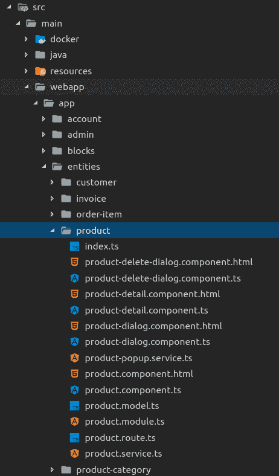
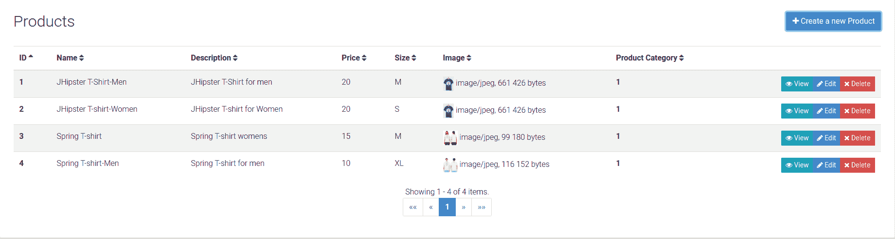
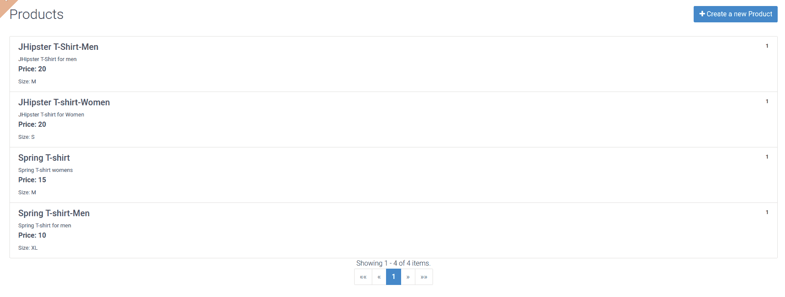
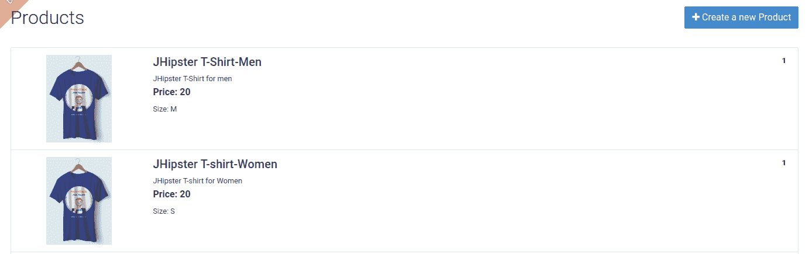
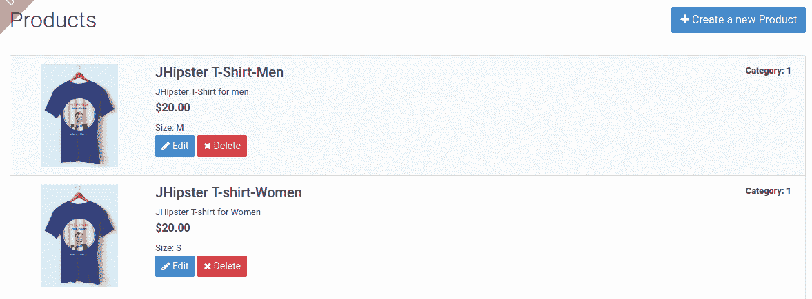
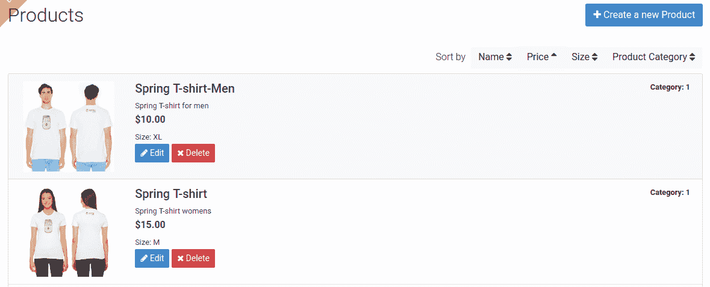
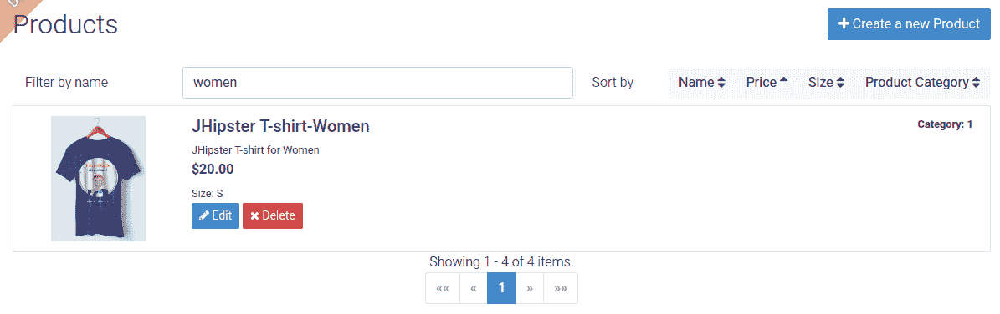
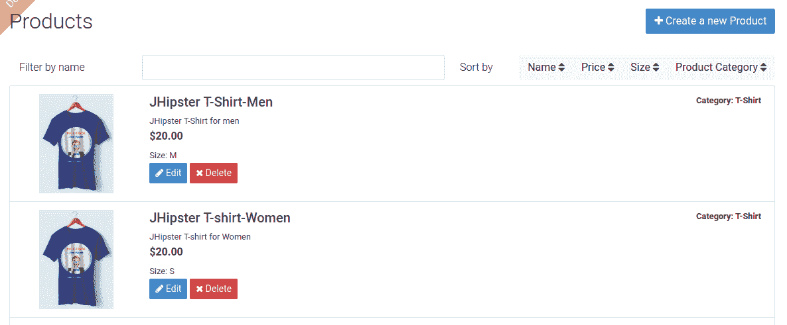
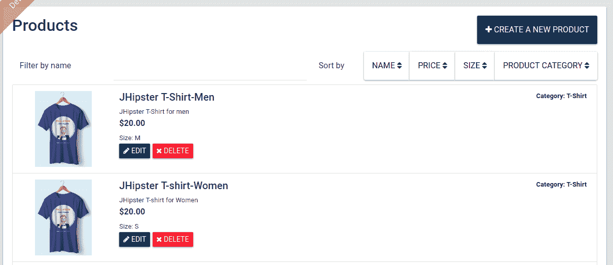

# 定制和进一步开发

在上一章中，我们看到了如何使用 JHipster 领域语言来建模和生成我们的领域模型。我们还学习了实体关系和 `import-jdl` 子生成器。在本章中，我们将看到如何进一步定制和添加业务逻辑到生成的应用程序以满足我们的需求。我们将学习以下内容：

+   使用 Spring DevTools 和 BrowserSync 进行实时重新加载

+   为实体定制 angular 前端

+   编辑使用 JHipster 实体生成器创建的实体

+   使用 Bootstrap 主题更改应用程序的外观和感觉

+   使用 JHipster 语言生成器添加新的 i18n 语言

+   使用 Spring Security 添加基于角色的额外授权来定制生成的 REST API

+   创建新的 Spring Data JPA 查询和方法

# 开发时的实时重新加载

在开发应用程序时，最令人烦恼和耗时的一部分是重新编译代码和重新启动服务器以查看我们所做的代码更改。传统上，JavaScript 代码更容易，因为它不需要编译，你只需刷新浏览器就能看到更改。然而，尽管当前的 MVVM 堆栈使客户端比以前更重要，但它们也引入了副作用，如客户端代码的转译等。所以，如果你正在重构实体的一个字段，你传统上需要执行以下任务才能在浏览器中看到更改：

1.  编译服务器端 Java 代码。

1.  将表更改应用到数据库中。

1.  重新编译客户端代码。

1.  重新启动应用程序服务器。

1.  刷新浏览器。

这需要花费很多时间，每次进行小改动时都令人沮丧，导致你在检查之前做出更多更改，从而影响生产力。

如果我告诉你，你不必做任何这些事情，而且所有这些都可以在你使用 IDE 保存更改时自动发生，那会怎么样？那会非常棒，不是吗？

使用 JHipster，你将得到完全相同的功能。JHipster 使用 Spring Boot DevTools、webpack 开发服务器和 BrowserSync 来为端到端代码提供良好的实时重新加载功能。

让我们快速了解一下所使用的这些技术。

# Spring Boot DevTools

Spring Boot DevTools ([`docs.spring.io/spring-boot/docs/current/reference/html/using-boot-devtools.html`](https://docs.spring.io/spring-boot/docs/current/reference/html/using-boot-devtools.html)) 允许 Spring Boot 应用程序在类路径发生变化时重新加载嵌入的服务器。它声明如下——*本模块的目的是尝试改善在开发 Spring Boot 应用程序时的开发体验*，并且它确实做到了这一点。它使用自定义类加载器在类更新和重新编译时重启应用程序，并且由于服务器是热重载的，所以比冷启动快得多。

它不如 JRebel 或类似技术那样酷，这些技术可以即时重新加载，但它比手动操作要好，并且不需要任何额外配置即可启用。

JHipster DevTools 在 `dev` 配置文件中自动启用，使用可以自动在保存时重新编译类的 IDE。DevTools 将确保应用程序重新加载并保持最新。由于使用了 Liquibase，任何使用正确变更日志的架构更新也将得到更新。请确保不要更改现有的变更日志，因为这会导致校验和错误。应用程序的重新加载也可以通过简单地使用命令 `mvnw compile` 或 `gradlew compileJava` 来触发，具体取决于所使用的构建工具。

如果你选择 NoSQL 数据库，例如 MongoDB、Cassandra 或 Couchbase，JHipster 也为这些数据库提供了数据库迁移工具。

# Webpack 开发服务器和 BrowserSync

Webpack 开发服务器 ([`github.com/webpack/webpack-dev-server`](https://github.com/webpack/webpack-dev-server)) 使用 webpack 开发中间件提供了一个简单的 Express 服务器，并在资源更改时支持实时重新加载。Webpack 开发中间件支持热模块替换和内存文件访问等功能。

在 Webpack 版本 4 及以上版本中，使用了一个名为 webpack-serve ([`github.com/webpack-contrib/webpack-serve`](https://github.com/webpack-contrib/webpack-serve)) 的新替代方案，而不是 Webpack 开发服务器。它利用了较新浏览器中的原生 WebSocket 支持。

BrowserSync ([`browsersync.io/`](https://browsersync.io/)) 是一个 Node.js 工具，它通过同步多个浏览器和设备上网页的文件更改和交互来帮助进行浏览器测试。它提供了诸如文件更改时的自动重新加载、同步 UI 交互、滚动等功能。JHipster 将 BrowserSync 与 Webpack 开发服务器集成，以提供高效的开发环境。这使得在不同的浏览器和设备上测试网页变得非常简单。CSS 的更改无需刷新浏览器即可加载。

要在客户端使用实时重新加载，你需要运行 `yarn start`，这将启动开发服务器并打开指向 `http://localhost:9000` 的浏览器。注意端口号 `9000`。BrowserSync 将使用此端口，而应用程序的后端将在 `8080` 上提供服务，所有请求将通过 webpack 开发中间件代理。

打开另一个浏览器，例如，如果 BrowserSync 已经打开了 Chrome，则打开 Firefox，反之亦然。现在将它们并排放置，并与应用程序交互。你会看到你的操作被复制，多亏了 BrowserSync。尝试更改一些代码并保存文件，以查看实时重新加载的效果。

# 为应用程序设置实时重新加载

让我们开始为创建的应用程序设置完美的开发环境。在终端中，通过运行 `./gradlew` 以开发模式启动服务器，在另一个终端中，通过运行 `yarn start` 启动客户端开发服务器。

现在当你在服务器端进行任何更改时，只需运行`./gradlew compileJava`，或者如果你使用的是 IDE，点击编译按钮。

使用 IntelliJ IDEA，文件会自动保存，因此你可以设置 *Ctrl* + *S* 来编译类，从而提供一个良好的工作流程。在 Eclipse 中，保存类会自动编译。

当你在客户端进行更改时，只需保存文件并启动 webpack 开发服务器和 BrowserSync，它将完成剩余的工作。

# 为实体自定义 Angular 前端

现在我们已经创建了工作着的实体领域模型，让我们让它更易于使用。产品列表屏幕由 JHipster 生成的表格视图；它对于简单的 CRUD 操作来说是足够的，但并不是最适合想要浏览我们的产品列表的最终用户的用户体验。让我们看看我们如何轻松地将其更改为更吸引人的东西。我们还将添加一个不错的客户端筛选选项来筛选列表。我们将使用 Angular 和 Bootstrap 的功能来完成这项工作。

首先，让我们找到我们需要编辑的源代码。在你的首选编辑器/IDE 中导航到`src/main/webapp/app/entities/product`：



让我们从自定义`product.component.html`文件开始，以更新产品列表的 UI 视图。当前的 HTML 代码渲染一个表格视图，并使用一些 Angular 指令来增强视图，包括排序和分页。让我们首先将视图从表格更改为列表，但首先通过导航到`http://localhost:9000`打开 BrowserSync 的开发 web 服务器（如果尚未打开）。登录并导航到实体 | 产品类别，创建一个类别，然后导航到实体 | 产品，创建一些新产品，以便我们有东西可以列出：



我们可以使用 Bootstrap 列表组([`getbootstrap.com/docs/4.0/components/list-group/`](https://getbootstrap.com/docs/4.0/components/list-group/))组件来实现这个目的。让我们使用以下代码片段并更改视图。将`div`替换为`class="table-responsive"`的以下代码：

```js
<div *ngIf="products">
    <div class="*list-group*">
        <a [routerLink]="['../product', product.id ]" 
           class="*list-group-item list-group-item-action* flex-column 
           align-items-start"
           *ngFor="let product of products; trackBy: trackId">
            <div class="d-flex w-100 justify-content-between">
                <h5 class="mb-1">{{product.name}}</h5>
                <small *ngIf="product.productCategory">
                    <a [routerLink]="['../product-category', 
                     product.productCategory?.id ]" >
                        {{product.productCategory?.id}}
                    </a>
                </small>
            </div>
            <small class="mb-1">{{product.description}}</small>
            <p class="mb-1">Price: {{product.price}}</p>
            <small>
                Size: 
                <span jhiTranslate="{{'storeApp.Size.' + 
                 product.size}}">
                    {{product.size}}
                </span>
            </small>
        </a>
    </div>
</div>
```

如你所见，我们正在使用 Angular 指令`*ngFor="let product of products; trackBy: trackId"`在锚点元素上迭代产品，以便为列表中的每个产品创建元素。我们用`*ngIf="products"`指令包裹这个，这样只有在产品对象定义时才会渲染视图。`[routerLink]="['../product', product.id ]"`指令将使用 Angular 路由为锚点创建一个 href，这样我们就可以导航到特定的产品路由。然后我们使用产品的属性在模板字符串中使用`{{product.name}}`语法进行渲染。当你保存代码时，你可能会注意到视图会自动刷新，这要归功于 BrowserSync。

在`ngFor`中使用的`trackBy`函数让 Angular 决定哪些项目被添加或从集合中删除。这提高了渲染性能，因为现在 Angular 可以精确地找出需要添加或从 DOM 中删除哪些项目，而不必重新创建整个集合。在这里，我们提供`trackId`作为函数来唯一标识集合中的项目。

这将产生以下结果：



虽然这是一个好的开始，但还不够。所以，让我们进去并让它变得更好。首先，让我们将图片添加到列表中。修改代码以添加 Bootstrap 行和列，如下所示，原始的渲染内容代码被移动到第二列，并且保持不变：

```js
<div *ngIf="products">
    <div class="list-group">
        <a [routerLink]="['../product', product.id ]" class="list-group-item list-group-item-action flex-column align-items-start"
            *ngFor="let product of products; trackBy: trackId">
            <div class="row">
                <div class="col-2 col-xs-12 justify-content-center">
                    
                </div>
                <div class="col col-xs-12">
                    <div class="d-flex w-100 justify-content-between">
                        ...
                    </div>
                    <small class="mb-1">{{product.description}}</small>
                    <p class="mb-1">Price: {{product.price}}</p>
                    <small>
                        ...
                    </small>
                </div>
            </div>
        </a>
    </div>
</div>
```

看一下加粗的代码。我们添加了一个 Bootstrap 行，其中包含两个列 div，第一个 div 在 12 列网格中占用两个列，指定为`col-2`，同时我们还说当显示为**xs**（**额外小**）时，`div`标签应该使用`col-xs-12`占用 12 列。第二个`div`通过仅指定`col`来保持响应式，它占用第一个`div`之后的剩余可用列，当显示为额外小尺寸时，它也占用 12 列。第一个列`div`中的图片使用数据 URL 作为`src`来渲染图片。现在我们有一个更好的视图：



我们可以进一步润色它。我们可以使用 Angular 货币管道([`angular.io/api/common/CurrencyPipe`](https://angular.io/api/common/CurrencyPipe))来显示价格，并通过将其更改为`{{product.price | currency:'USD'}}`来移除其冗余标签。我们还可以为列表右侧显示的分类添加一个标签。

最后，我们可以将编辑和删除按钮重新添加回来，但我们只需要为具有`ADMIN`角色的用户显示它们，这样普通用户就只能查看产品列表。我们可以从原始表格中复制`edit`和`delete`按钮的 HTML 代码。最终的代码如下：

```js
<div *ngIf="products">
    <div class="list-group">
        <a [routerLink]="['../product', product.id ]" 
            class="list-group-item list-group-item-action flex-column 
            align-items-start"
            *ngFor="let product of products; trackBy: trackId">
            <div class="row">
                <div class="col-2 col-xs-12 justify-content-center">
                    
                </div>
                <div class="col col-xs-12">
                    <div class="d-flex w-100 justify-content-between">
                        <h5 class="mb-1">{{product.name}}</h5>
                        <small *ngIf="product.productCategory">
                            <a [routerLink]="['../product-category', 
                                    product.productCategory?.id ]" >
                                Category: {{product.productCategory?.id}}
                            </a>
                        </small>
                    </div>
                    <small class="mb-1">{{product.description}}</small>
                <p class="mb-1">{{product.price | currency:'USD'}}</p>
                    <small>
                        Size:
                        <span jhiTranslate="{{'storeApp.Size.' + 
                         product.size}}">
                            {{product.size}}
                        </span>
                    </small>
                    <div *jhiHasAnyAuthority="'ROLE_ADMIN'">
                        <button type="submit"
                                [routerLink]="['/', 
                                    { outlets: { popup: 'product/'+ 
                                    product.id + '/edit'} }]"
                                replaceUrl="true"
                                queryParamsHandling="merge"
                                class="btn btn-primary btn-sm">
                            <span class="fa fa-pencil"></span>
                            <span class="d-none d-md-inline"
                                  jhiTranslate="entity.action.edit">Edit</span>
                        </button>
                        <button type="submit"
                                [routerLink]="['/', 
                                    { outlets: { popup: 'product/'+ 
                                     product.id + '/delete'} }]"
                                replaceUrl="true"
                                queryParamsHandling="merge"
                                class="btn btn-danger btn-sm">
                            <span class="fa fa-remove"></span>
                            <span class="d-none d-md-inline" 
                                  jhiTranslate="entity.action.delete">Delete</span>
                        </button>
                    </div>
                </div>
            </div>
        </a>
    </div>
</div>
```

`*jhiHasAnyAuthority="'ROLE_ADMIN'"`指令由 JHipster 提供，可以用于根据用户角色控制展示。默认情况下，JHipster 提供`ROLE_ADMIN`和`ROLE_USER`，但仅在客户端控制这并不安全，因为它很容易被绕过，所以我们应该在服务器端也进行安全控制。我们将在本章后面讨论这个问题。使用用户账户注销并重新登录以查看指令的作用：



现在，让我们也将`*jhiHasAnyAuthority="'ROLE_ADMIN'"`指令添加到创建按钮元素中。

现在既然我们的视图已经变得更好，让我们恢复我们最初拥有的排序功能。由于我们没有表头了，我们可以使用一些按钮根据某些重要的字段进行排序。

让我们使用 Bootstrap 按钮组（[`getbootstrap.com/docs/4.0/components/button-group/`](https://getbootstrap.com/docs/4.0/components/button-group/)) 来实现这个功能。将以下代码片段放置在我们之前创建的 `<div class="list-group">` 元素上方：

```js
<div class="mb-2 d-flex justify-content-end align-items-center">
    <span class="mx-2 col-1">Sort by</span>
    <div class="btn-group" role="group"
        jhiSort [(predicate)]="predicate" [(ascending)]="reverse"
 [callback]="transition.bind(this)">
        <button type="button" class="btn btn-light" jhiSortBy="name">
            <span jhiTranslate="storeApp.product.name">Name</span>
            <span class="fa fa-sort"></span>
        </button>
        <button type="button" class="btn btn-light" jhiSortBy="price">
            <span jhiTranslate="storeApp.product.price">Price</span>
            <span class="fa fa-sort"></span>
        </button>
        <button type="button" class="btn btn-light" jhiSortBy="size">
            <span jhiTranslate="storeApp.product.size">Size</span>
            <span class="fa fa-sort"></span>
        </button>
        <button type="button" class="btn btn-light" 
         jhiSortBy="productCategory.id">
            <span  
jhiTranslate="storeApp.product.productCategory">Product Category</span>
            <span class="fa fa-sort"></span>
        </button>
    </div>
</div>
```

我们可以使用 Bootstrap 外边距和 flexbox 工具类，如 `mb-2 d-flex justify-content-end align-items-center` 来正确定位和排列项目。我们在一个 div 元素上使用 `btn-group` 类来将按钮元素组合在一起，并在这些按钮上放置了 `jhiSort` 指令及其绑定的属性，如 `predicate`、`ascending` 和 `callback`。在按钮本身上，我们使用 `jhiSortBy` 指令来指定它将使用哪个字段进行排序。现在我们的页面看起来如下，产品按价格排序：



最后，让我们为页面添加一些传统的客户端过滤功能。

JHipster 提供了一个选项，可以使用 JPA 元模型启用服务器端过滤。另一个选项是启用 Elasticsearch，对于每个实体，JHipster 将自动创建全文搜索字段。因此，对于任何严肃的过滤需求，你应该使用这些。

首先，让我们在 `product.component.ts` 文件中的 `ProductComponent` 类中添加一个新的字符串类型实例变量 `filter`：

```js
export class ProductComponent implements OnInit, OnDestroy {

    ...
    filter: string;

    constructor(
        ...
    ) {
    ...
    }
    ...
}
```

现在，让我们在 `product.component.html` 文件中使用这个变量。将以下代码中的高亮部分添加到我们为排序按钮创建的 `div` 中：

```js
<div class="mb-2 d-flex justify-content-end align-items-center">
    <span class="mr-2 col-2">Filter by name</span>
 <input type="search" class="form-control" [(ngModel)]="filter">
    <span class="mx-2 col-1">Sort by</span>
    <div class="btn-group" role="group"
        ...
    </div>
</div>
```

我们使用 `ngModel` 指令将过滤变量绑定到一个输入元素上，使用 `[()]` 确保变量的双向绑定。

`[(ngModel)]="filter"` 创建双向绑定，`[ngModel]="filter"` 从模型到视图创建单向绑定，`(ngModel)="filter"` 从视图到模型创建单向绑定。

最后，将我们的列表项元素上的 `ngFor` 指令更新如下。我们使用 JHipster 提供的管道通过产品的名称字段过滤列表：

```js
*ngFor="let product of (products | pureFilter:filter:'name'); trackBy: trackId"
```

就这样，我们在屏幕上得到了一个闪亮的过滤选项：



与之前相比，用户体验有了很大的提升，但在实际应用中，你可以为面向客户的网站构建一个更好的用户界面，包括添加商品到购物车、在线支付等功能，并将这部分留给后台办公使用。让我们将这个更改提交到 `git`：这对于以后管理项目更改非常重要。运行以下命令：

```js
> git add --all
> git commit -am "update product listing page UI"
```

# 使用 JHipster 实体子生成器编辑实体

在查看生成的实体屏幕时，我们可能会意识到一些影响用户体验的小问题。例如，在产品屏幕上，我们有一个与产品类别的关联，但在创建时从下拉菜单中选择产品类别，或者在列表中显示类别时，我们通过其 ID 显示类别，这对用户来说并不友好。如果我们可以显示产品类别名称，那就更好了。这是 JHipster 的默认行为，但在定义关系时可以进行自定义。让我们看看如何通过编辑 JDL 模型来使我们的生成屏幕更加用户友好。这将覆盖现有文件，但由于我们使用`git`，我们可以轻松地选择我们所做的更改，我们将在稍后看到这是如何完成的。

在我们的 JDL 中，我们使用以下代码定义了实体之间的关系：

```js
relationship OneToOne {
    Customer{user} to User
}

relationship ManyToOne {
  OrderItem{product} to Product
}

relationship OneToMany {
   Customer{order} to ProductOrder{customer},
   ProductOrder{orderItem} to OrderItem{order},
   ProductOrder{invoice} to Invoice{order},
   Invoice{shipment} to Shipment{invoice},
   ProductCategory{product} to Product{productCategory}
}
```

通过在 JDL 中使用`(<字段名>)`语法指定用于显示关系的字段，我们可以更改客户端代码显示关系的方式：

```js
relationship OneToOne {
    Customer{user(login)} to User
}

relationship ManyToOne {
  OrderItem{product(name)} to Product
}

relationship OneToMany {
   Customer{order} to ProductOrder{customer(email)},
   ProductOrder{orderItem} to OrderItem{order(code)},
   ProductOrder{invoice} to Invoice{order(code)},
   Invoice{shipment} to Shipment{invoice(code)},
   ProductCategory{product} to Product{productCategory(name)}
}
```

使用`import-jdl`命令来运行这个操作。该命令仅生成自上次运行以来发生变化的实体。但在运行之前，我们也要切换到一个新的分支，因为将主要更改放在单独的分支上并合并回来是一种良好的实践，这样你可以有更多的控制权：

```js
> git checkout -b entity-update-display-name
> jhipster import-jdl online-store.jh
```

在这里了解更多关于 Git flow 的信息：[`guides.github.com/introduction/flow/`](https://guides.github.com/introduction/flow/)。

接受文件更改，等待构建完成。现在，让我们查看实体页面，以验证显示名称是否被正确使用，并创建一些实体来尝试一下。现在我们意识到`Invoice`实体有空的下拉菜单，这是因为`Invoice`实体没有名为**code**的字段。由于我们在模板中使用`{{invoice.order?.code}}`，符号`?`使 Angular 跳过未定义的值，从而防止渲染错误。

这很容易修复。有时我们可能想在创建实体后使用 JDL 和`import-jdl`命令进行一些小的更改。最好的方法是在 JDL 中进行更改，并使用导入 JDL 命令重新生成，就像我们在前面的代码中看到的那样。现在还有一个选项，即实体子生成器，它可以产生相同的结果。为了熟悉这个选项，让我们使用它来向我们的`Invoice`实体添加字段：

1.  运行以下命令：

```js
> jhipster entity Invoice 
```

1.  从选项中选择“是”，添加更多字段和关系：

```js
Using JHipster version installed globally
Executing jhipster:entity Invoice
Options: 

Found the .jhipster/Invoice.json configuration file, entity can be automatically generated!

The entity Invoice is being updated.

? Do you want to update the entity? This will replace the existing files for this entity, all your custom code will be overwritten 
  Yes, re generate the entity 
❯ Yes, add more fields and relationships 
  Yes, remove fields and relationships 
  No, exit 
```

1.  对于下一个问题选择“是”，并提供后续问题中的字段名、类型和验证：

```js
Generating field #7

? Do you want to add a field to your entity? Yes
? What is the name of your field? code
? What is the type of your field? String
? Do you want to add validation rules to your field? Yes
? Which validation rules do you want to add? Required

================= Invoice =================
Fields
date (Instant) required
details (String) 
status (InvoiceStatus) required
paymentMethod (PaymentMethod) required
paymentDate (Instant) required
paymentAmount (BigDecimal) required
code (String) required

Relationships
shipment (Shipment) one-to-many 
order (ProductOrder) many-to-one 

Generating field #8

? Do you want to add a field to your entity? (Y/n) 
```

1.  对于后续的提示选择“n”以添加更多字段和关系。接受提议的文件更改，这样就完成了。

1.  现在，请确保更新 JDL，使实体`Invoice`具有`code String required`字段。

你也可以运行`jhipster export-jdl online-store.jh`来将当前模型导回到 JDL。

现在我们已经正确显示了实体关系，我们还需要确保某些实体具有必填的关系值。例如，对于客户来说，必须有一个用户，`ProductOrder` 必须有一个客户，订单项必须有一个订单，发票必须有一个订单，最后，运输必须有一个发票。由于 JHipster 支持使关系成为必填项，我们可以使用 JDL 进行这些更改。在 `online-store.jh` 中更新关系到以下片段：

```js
relationship OneToOne {
    Customer{user(login) required} to User
}

relationship ManyToOne {
    OrderItem{product(name) required} to Product
}

relationship OneToMany {
   Customer{order} to ProductOrder{customer(email) required},
   ProductOrder{orderItem} to OrderItem{order(code) required},
   ProductOrder{invoice} to Invoice{order(code) required},
   Invoice{shipment} to Shipment{invoice(code) required},
   ProductCategory{product} to Product{productCategory(name)}
}
```

现在，运行 `jhipster import-jdl online-store.jh` 并接受提出的更新。请确保使用 `git diff` 命令或你的 Git UI 工具检查更改。

让我们提交这一步，以便在需要时可以回滚：

```js
> git add --all
> git commit -am "entity relationships display names and required update"
```

现在我们遇到了问题，重新生成实体覆盖了所有文件，这意味着我们丢失了我们为产品列表页面所做的所有更改，但因为我们使用了 `git`，所以很容易恢复。到目前为止，我们的项目只有几个提交，所以将我们为产品列表 UI 更改所做的提交 cherry-pick 并应用到当前代码库上将会很容易。然而，在现实世界的场景中，在可以重新生成 JDL 之前可能会有很多更改，因此需要一些努力来验证和合并所需更改。始终依赖拉取请求，这样你就可以看到更改了什么，其他人可以审查并发现任何问题。

让我们 cherry-pick 我们需要的更改。

请参考文档了解如何在[`git-scm.com/docs/git-cherry-pick`](https://git-scm.com/docs/git-cherry-pick)中 cherry-pick 高级选项。

由于我们需要的是 master 分支上的最后一个提交，我们可以简单地使用 `git cherry-pick master`。我们也可以切换到 master 分支并使用 `git log` 命令列出提交，然后复制所需提交的提交哈希值，并使用 `git cherry-pick <commit-sha>`。

现在，这会导致合并冲突，因为我们当前分支的顶端提交中更新了 `product.component.html` 文件。我们需要从提交中获取传入的更改，但还需要更新产品类别显示名称从 ID 到代码，所以让我们接受传入的更改，并从 `{{product.productCategory?.id}}` 手动更新到 `{{product.productCategory?.name}}`。

通过暂存文件并提交来解决冲突。现在我们可以将分支合并到 master：

```js
> git add src/main/webapp/app/entities/product/product.component.html
> git commit -am "cherrypick: update product listing page UI"
> git checkout master
> git merge --no-ff entity-update-display-name
```

如果你刚开始使用 Git，建议使用 SourceTree 或 GitKraken 等界面工具进行 cherry-pick 和解决合并冲突。IntelliJ 和 VSCode 等 IDE 以及编辑器也提供了良好的选项。

现在我们的页面视图应该很好：



当然，我们也可以通过将产品列表作为主页来使其更加用户友好。但就目前而言，让我们跳过这个步骤。

由于我们一直在处理客户端代码，我们没有注意到在此期间服务器端代码的更改。我们需要编译 Java 代码来重新加载我们的服务器。让我们运行 `./gradlew compileJava`。

不幸的是，在重新加载过程中，我们遇到了一个错误，由于校验和错误，Liquibase 无法更新数据库变更日志：

```js
liquibase.AsyncSpringLiquibase : Liquibase could not start correctly, your database is NOT ready: Validation Failed:
 5 change sets check sum
 config/liquibase/changelog/20180114123500_added_entity_Customer.xml::20180114123500-1::jhipster was: 7:3e0637bae010a31ecb3416d07e41b621 but is now: 7:01f8e1965f0f48d255f613e7fb977628
 config/liquibase/changelog/20180114123501_added_entity_ProductOrder.xml::20180114123501-1::jhipster was: 7:0ff4ce77d65d6ab36f27b229b28e0cda but is now: 7:e5093e300c347aacf09284b817dc31f1
 config/liquibase/changelog/20180114123502_added_entity_OrderItem.xml::20180114123502-1::jhipster was: 7:2b3d9492d127add80003e2f7723903bf but is now: 7:4beb407d4411d250da2cc2f1d84dc025
 config/liquibase/changelog/20180114123503_added_entity_Invoice.xml::20180114123503-1::jhipster was: 7:5afaca031815e037cad23f0a0f5515d6 but is now: 7:fadec7bfabcd82dfc1ed22c0ba6c6406
 config/liquibase/changelog/20180114123504_added_entity_Shipment.xml::20180114123504-1::jhipster was: 7:74d9167f5da06d3dc072954b1487e11d but is now: 7:0b1b20dd4e3a38f7410b6b3c81e224fd
```

这是因为 JHipster 对原始变更日志所做的更改。在一个理想的世界里，新的架构更改应该在新的变更日志中完成，以便 Liquibase 可以应用它们，但 JHipster 目前还没有默认生成。对于使用 H2 数据库的本地开发，我们可以运行 `./gradlew clean` 来清除数据库并重新启动应用程序，但在实际使用案例中，你可能会使用实际的数据库，并且希望保留数据，因此我们在这里必须手动使用 Liquibase 提供的 diff 功能来处理这个问题。

JHipster 在 Gradle 和 Maven 构建中提供了 Liquibase 的集成。你可以利用它来创建新的变更日志和创建 diff 变更日志。在这些情况下，当我们希望保留数据并解决冲突时，Liquibase 的 diff 功能是我们的好朋友。使用 Gradle，你可以运行 `./gradlew liquibaseDiffChangeLog` 命令来创建更改集和数据库的 diff 变更日志。你可以将这个更改集添加到 `src/main/resources/config/liquibase/master.xml` 文件中，它将在你下次重新启动服务器时应用。默认情况下，该命令配置为针对开发数据库运行，如果你想针对生产数据库运行，只需更新 `gradle/liquibase.gradle` 文件中的 liquibaseCommand 命令定义，并包含生产数据库的详细信息。有关更多信息，请参阅 [`www.jhipster.tech/development/#using-a-database`](http://www.jhipster.tech/development/#using-a-database)。

如果你想要清除数据库中的校验和，请使用 `./gradlew liquibaseClearChecksums` 任务。

# 改变应用程序的外观和感觉

使用 Bootstrap 的好处是它让我们能够轻松地使用任何可用的 Bootstrap 主题来改变应用程序的外观和感觉。让我们看看我们如何为我们的应用程序安装一个酷炫的主题，然后我们将使用 Bootstrap 提供的 Sass 变量来调整样式以适应我们的需求。

现在市面上有数百种 Bootstrap 主题。由于我们正在使用 Bootstrap 4，因此选择一个为 Bootstrap 4 定制的主题非常重要。

Bootswatch 是 Bootstrap 主题的精美集合；查看所有可用的主题，请访问：[`bootswatch.com/`](https://bootswatch.com/)。

让我们使用一个名为 **materia** 的 Bootswatch 主题。

在你的终端中，运行 `yarn add bootswatch` 来安装所有主题。不用担心；我们只会导入我们想要使用的主题，所以你不需要担心安装所有主题。

现在，让我们使用 Sass 导入这个文件。打开`src/main/webapp/content/scss/vendor.scss`并找到行`@import 'node_modules/bootstrap/scss/bootstrap';`，然后添加以下加粗的代码：

```js
// Override Boostrap variables
@import "bootstrap-variables";
@import 'node_modules/bootswatch/dist/materia/variables'; // Import Bootstrap source files from node_modules
@import 'node_modules/bootstrap/scss/bootstrap';
@import "node_modules/bootswatch/dist/materia/bootswatch";
```

这里主题的名称是 materia，你可以在 Bootswatch 中在这里使用任何可用的主题。确保名称全部是小写。同时，注意导入的顺序。在导入 Bootstrap 变量和主题之后导入主题变量和样式非常重要，以确保 SASS 变量和样式被正确覆盖。

我们可以通过覆盖在`src/main/webapp/content/scss/_bootstrap-variables.scss`中定义的 Bootstrap 变量来进一步自定义主题。

你可以覆盖 Bootstrap 支持的任何变量。支持的变量完整列表可以在`node_modules/bootstrap/scss/_variables.scss`中找到。

例如，让我们按照以下方式更改一些颜色，在`_bootstrap-variables.scss`中：

```js
$primary: #032b4e;
$success: #1df54f;
$info: #17a2b8;
$warning: #ffc107;
$danger: #fa1a30;
```

当你应用一个新的主题时，可能会有一些 UI 错误，你可以通过更新生成的 SASS 文件来解决它们。

例如，将以下 CSS 添加到`src/main/webapp/content/scss/global.scss`中，以修复主题更改后出现的复选框错误：

```js
.form-check-input {
    height: 18px;
    width: 18px;
}
```

我们现在有一个酷炫的新主题：



更多参考信息可以在以下链接找到：[`getbootstrap.com/docs/4.0/getting-started/theming/`](https://getbootstrap.com/docs/4.0/getting-started/theming/)

让我们提交这个更改：

```js
> git add --all
> git commit -am "update bootstrap theme using bootswatch"
```

# 添加新的 i18n 语言

由于我们为我们的应用程序启用了 i18n 支持，我们可以轻松地随时添加新的 i18n 语言，使用 JHipster 语言生成器添加一个新的语言到我们的应用程序。

在终端中，切换到一个新的分支并运行以下命令：

```js
> git checkout -b add-french-language
> jhipster languages
```

你现在会看到一个类似这样的提示，你可以选择任何可用的语言：

```js
Using JHipster version installed locally in current project's node_modules
Executing jhipster:languages
Options:

Languages configuration is starting
? Please choose additional languages to install (Press <space> to select, <a> to toggle all, <i> to inverse selection) >◯ Arabic (Libya)
 ◯ Armenian
 ◯ Catalan
 ◯ Chinese (Simplified)
 ◯ Chinese (Traditional)
 ◯ Czech
 ◯ Danish
(Move up and down to reveal more choices)
```

现在，我们先选择法语。接受文件更改建议，然后我们就可以继续了。一旦应用程序自动刷新，你可以在应用程序菜单的语言下拉菜单中看到新的语言。现在，这不是很容易吗！

现在有一个问题，因为我们有一些实体并且添加了新的语言。我们需要为实体获取 i18n 法语文件。我们可以通过运行`jhipster --with-entities`命令轻松完成此操作，该命令将重新生成应用程序以及实体。现在请确保仔细地仅从差异中暂存你需要的更改（与 i18n 相关的 JSON 文件），并丢弃其余的更改。以下是需要暂存的文件和文件夹：

```js
.yo-rc.json

src/main/resources/i18n/messages_fr.properties

src/main/webapp/app/shared/language/find-language-from-key.pipe.ts

src/main/webapp/app/shared/language/language.constants.ts

webpack/webpack.common.js

src/main/webapp/i18n/fr
```

现在，让我们提交这个更改并将其合并回 master 分支。如果我们只选择了与 i18n 相关的更改，那么我们不应该有任何合并冲突：

```js
> git add --all
> git commit -am "add French as additional language"
> git merge --no-ff add-french-language
```

# 使用 Spring Security 进行授权

如您可能已注意到，当涉及到生成的代码时，JHipster 在基于角色的安全、授权管理等方面并没有提供很多功能。这是故意的，因为这些功能高度依赖于具体的使用场景，通常与应用程序的业务逻辑相关。因此，最好由开发者手动编码，作为业务代码的一部分来实现。

普通用户在用户管理中分配有`ROLE_USER`权限，而管理员用户有`ROLE_ADMIN`权限。对于我们的用例，存在一些安全漏洞需要我们注意：

+   普通用户应仅能访问查看产品列表、产品订单、订单项、发票和装运。

+   普通用户不应通过 CRUD API 创建/编辑/删除实体。

+   普通用户不应能够访问其他用户的商品订单、订单项、发票和装运。

我们可以使用 Spring Security 提供的功能来克服这些问题。

# 限制实体的访问权限

首先，让我们限制普通用户的访问权限。这可以在 API 级别轻松使用 Spring Security 完成。将以下片段添加到`src/main/java/com/mycompany/store/config/SecurityConfiguration.java`的 configure 方法中。

在`.antMatchers("/api/**").authenticated()`行之前添加它。位置非常重要：

```js
.antMatchers("/api/customers").hasAuthority(AuthoritiesConstants.ADMIN)
.antMatchers("/api/product-categories").hasAuthority(AuthoritiesConstants.ADMIN)
```

我们指定当请求路径匹配`api/customers`或`api/product-categories`时，用户应该有`ROLE_ADMIN`权限才能访问它们。现在注销并作为`user`用户登录，尝试访问客户实体页面。查看浏览器开发工具中的控制台，你应该会看到对`GET http://localhost:9000/api/customers`的调用返回了`403 Forbidden`错误。

现在既然我们的后端已经正确处理了这个问题，让我们在菜单中隐藏这些条目以供普通用户访问。让我们在`src/main/webapp/app/layouts/navbar/navbar.component.html`中为客户和产品类别的元素添加一个`*jhiHasAnyAuthority="'ROLE_ADMIN'"`指令。

现在只有管理员用户会在菜单中看到这些项目。

# 限制创建/编辑/删除实体的访问权限

现在我们需要确保只有管理员用户可以编辑实体，普通用户只能查看授权给他们的实体。为此，最好在 API 级别使用 Spring Security 的`PreAuthorize`注解来处理。让我们从订单项开始。转到`src/main/java/com/mycompany/store/web/rest/OrderItemResource.java`，并将`@PreAuthorize("hasAuthority('ROLE_ADMIN')")`添加到`createOrderItem`、`updateOrderItem`和`deleteOrderItem`方法中：

```js
    @DeleteMapping("/order-items/{id}")
    @Timed
    @PreAuthorize("hasAuthority('ROLE_ADMIN')")
    public ResponseEntity<Void> deleteOrderItem(@PathVariable Long id) {
        ...
    }
```

我们要求 Spring Security 拦截器仅在用户具有`ROLE_ADMIN`权限时提供对这些方法的访问。`PreAuthorize`注解会在执行方法之前阻止访问。Spring Security 还提供了`PostAuthorize`和更通用的`Secured`注解。更多关于这些内容的信息可以在 Spring Security 文档中找到：[`projects.spring.io/spring-security/`](https://projects.spring.io/spring-security/)。

使用 `./gradlew compileJava` 或 IDE 编译后端。现在转到订单项页面，尝试创建一个订单项。你将在网页控制台上的 API 调用中收到一个 `POST http://localhost:9000/api/order-items 403 (Forbidden)` 错误。现在让我们将注解添加到所有实体 Resource 类的创建、更新和删除方法中。你可以跳过客户和产品类别实体，因为它们对 `ROLE_USER` 已经完全禁止访问。

让我们使用 `*jhiHasAnyAuthority="'ROLE_ADMIN'"` 指令从 Angular 视图中隐藏创建、编辑和删除按钮。

# 限制对其他用户数据的访问

现在这一点稍微有点棘手，因为它要求我们在后端的服务层更改代码，但这并不难。让我们直接开始。

让我们从产品订单实体开始。让我们修改 `src/main/java/com/mycompany/store/service/ProductOrderService.java` 中的 `findAll` 方法，如下所示：

```js
    @Transactional(readOnly = true)
    public Page<ProductOrder> findAll(Pageable pageable) {
        log.debug("Request to get all ProductOrders");
 if (SecurityUtils.isCurrentUserInRole(AuthoritiesConstants.ADMIN)) {
 return productOrderRepository.findAll(pageable);
 } else
 return productOrderRepository.findAllByCustomerUserLogin(
 SecurityUtils.getCurrentUserLogin().get(),
 pageable
 );
    }
```

如您所见，我们修改了原始的 `productOrderRepository.findAll(pageable)` 调用，使其仅在当前用户具有 `Admin` 角色时调用，否则调用 `findAllByCustomerUserLogin`，但我们的生成的 `ProductOrderRepository` 接口还没有这个方法，所以让我们添加它。在 `src/main/java/com/mycompany/store/repository/ProductOrderRepository.java` 中，让我们添加以下新方法。目前，该接口没有任何方法，只使用从 `JpaRepository` 继承的方法：

```js
Page<ProductOrder> findAllByCustomerUserLogin(String login, Pageable pageable);
```

这里正在进行很多魔法操作。这是一个 Spring Data 接口，因此我们可以简单地编写一个新方法，并期望 Spring Data 自动创建实现；我们只需要遵循命名约定。在我们的用例中，我们需要找到所有用户关系为客户的订单，其登录信息与当前登录用户相同。在 SQL 中，这将是以下这样：

```js
select * from product_order po cross join customer c cross join jhi_user u where po.customer_id=c.id and c.user_id=u.id and u.login=:login
```

简单来说，我们可以说 *查找所有产品订单，其中* `customer.user.login` *等于* `login`，这正是我们作为 `findAllByCustomerUserLogin` 方法所写的。正在操作的实体是隐含的，因此省略了产品订单。通过提供 Pageable 参数，我们告诉 Spring Data 从分页实体列表中提供给我们一个页面。您可以参考 Spring Data 文档 ([`docs.spring.io/spring-data/jpa/docs/current/reference/html/`](https://docs.spring.io/spring-data/jpa/docs/current/reference/html/)) 获取更多信息。

在调用 `productOrderRepository.findAllByCustomerUserLogin` 方法时，我们可以使用 `SecurityUtils.getCurrentUserLogin()` 方法传递当前用户登录信息。SecurityUtils 类也是由 JHipster 生成的，它包含一些有用的方法，例如 `getCurrentUserLogin`、`getCurrentUserJWT`、`isAuthenticated` 和 `isCurrentUserInRole`。

就这些了。现在以管理员身份登录，创建两个新用户，创建两个客户，并为每个客户创建产品订单。然后注销并再次以默认用户身份登录，看看您是否可以看到新创建用户的产品订单。

现在我们为其他服务进行类似的更新。这些服务的存储库方法如下：

对于 `src/main/java/com/mycompany/store/repository/InvoiceRepository`：

```js
Page<Invoice> findAllByOrderCustomerUserLogin(String login, Pageable pageable);
```

对于 `src/main/java/com/mycompany/store/repository/OrderItemRepository`：

```js
Page<OrderItem> findAllByOrderCustomerUserLogin(String login, Pageable pageable);
```

对于 `src/main/java/com/mycompany/store/repository/ShipmentRepository`：

```js
Page<Shipment> findAllByInvoiceOrderCustomerUserLogin(String login, Pageable pageable);
```

现在，我们需要对服务上的 `findOne` 方法进行类似的更改。

对于 `ProductOrderService`，如下所示：

```js
    @Transactional(readOnly = true)
    public ProductOrder findOne(Long id) {
        log.debug("Request to get ProductOrder : {}", id);
        if (SecurityUtils.isCurrentUserInRole(AuthoritiesConstants.ADMIN)) {
 return productOrderRepository.findOne(id);
 } else
 return productOrderRepository.findOneByIdAndCustomerUserLogin(
 id,
 SecurityUtils.getCurrentUserLogin().get()
 );
    }
```

如您所见，我们将查找一个通过 ID 和客户用户登录的方法进行了更改。相同的存储库方法如下：

```js
ProductOrder findOneByIdAndCustomerUserLogin(Long id, String login);
```

对于 `src/main/java/com/mycompany/store/repository/InvoiceRepository`：

```js
Invoice findOneByIdAndOrderCustomerUserLogin(Long id, String login);
```

对于 `src/main/java/com/mycompany/store/repository/OrderItemRepository`：

```js
OrderItem findOneByIdAndOrderCustomerUserLogin(Long id, String login);
```

对于 `src/main/java/com/mycompany/store/repository/ShipmentRepository`：

```js
Shipment findOneByIdAndInvoiceOrderCustomerUserLogin(Long id, String login);
```

同样的查询可以使用 Spring Data 提供的 `@Query` 注解来编写。

就这些了。我们已经为应用程序实现了良好的基于角色的授权逻辑。

让我们提交这个检查点：

```js
> git add --all
> git commit -am "update role based authorization logic"
```

在现实世界的场景中，我们迄今为止所做的更改对于电子商务网站来说还不够。但鉴于我们的目标是学习 JHipster 及其支持的工具，而不是创建一个功能完美的应用程序，请将此视为一个最小可行产品。为了使这个电子商务应用程序可用，我们需要构建更多功能，例如购物车、发票生成、客户注册等。为什么不把它作为一个作业来尝试，看看您是否可以为这个应用程序构建更多功能？这将是您完成本书后的下一步行动的一部分。用例和说明将在第十四章中详细说明，*JHipster 的最佳实践*。

# 摘要

在本章中，我们看到了如何轻松定制使用 JHipster 创建的 Web 应用程序。我们还学习了在定制我们的产品列表页面时关于 Angular 和 Bootstrap 的知识。除此之外，我们还看到了如何使用 Spring Security 通过基于角色的授权来保护我们的应用程序。我们还学习了 Spring Data，并使用 Git 来正确管理我们的源代码。我们看到了我们的应用程序随着业务逻辑的发展而变得更加用户友好。在下一章中，我们将看到如何使用 Jenkins 将持续集成集成到我们的应用程序中。
