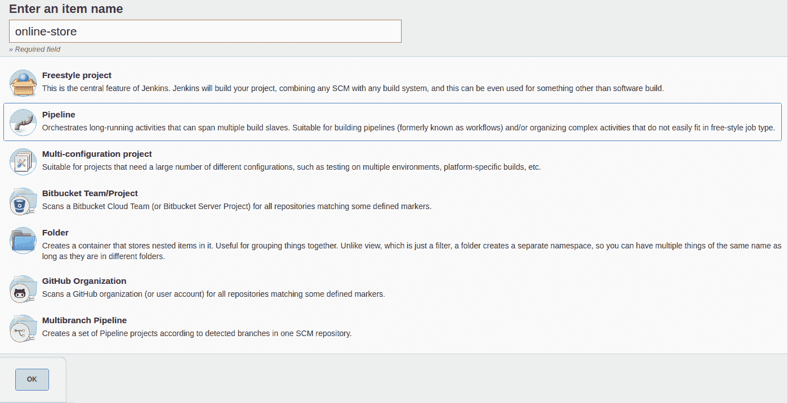
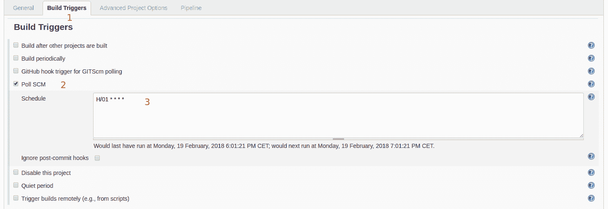
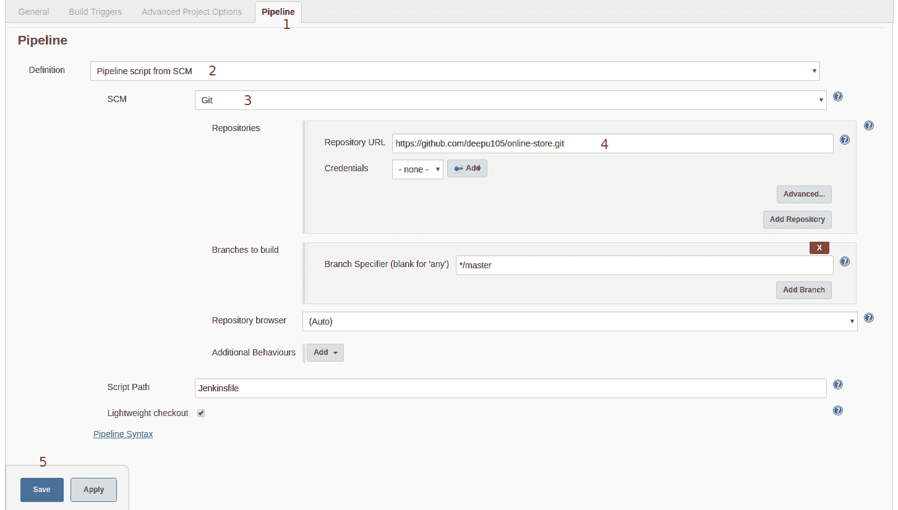
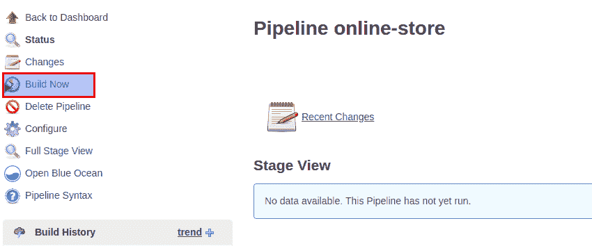
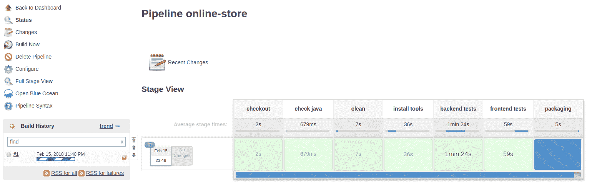
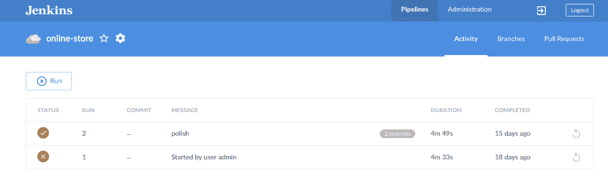
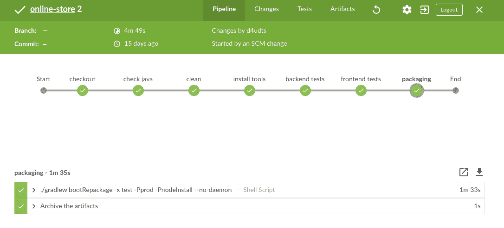

# 第六章：测试和持续集成

现在我们已经搭建并开发了我们的电子商务应用程序，是时候让它为部署到我们的生产环境做好准备。在此之前，我们需要关注两个重要的工程方面，*质量* 和 *稳定性*。在本章中，我们将探讨如何使用现代 DevOps 实践，如持续集成和自动化测试来实现这一点。

我们还将看到以下内容：

+   修复和运行测试

+   **CI**/**CD**（**持续集成**/**持续部署**）工具

+   使用 JHipster CI-CD 子生成器设置 CI

**DevOps** 是一种将软件开发（Dev）和软件运营（Ops）统一在一起的软件工程实践。DevOps 的主要重点是软件工程所有阶段的自动化和监控，如开发、集成、测试、部署和基础设施管理。DevOps 是本十年最受欢迎的工程实践之一，持续集成和持续部署是其核心方面之二。

# 修复和运行测试

在我们深入研究持续集成工具之前，让我们首先确保我们的测试在上一章所做的更改后仍然可以正常工作并通过。在一个理想的世界里，如果软件开发是使用诸如 **TDD**（**测试驱动开发**）之类的实践进行的，那么编写和修复测试是与代码的开发同时进行的，规范是在实际开发代码之前编写的。你应该尝试遵循这一实践，以便首先编写失败的测试以实现预期的结果，然后开发使测试通过的代码。由于我们的测试是由 JHipster 自动生成的，我们至少可以确保在修改生成的代码时它们是正常工作的。

JHipster 还可以使用 Gatling 为实体生成性能测试。这非常有用，如果你正在开发一个高可用性和高流量的网站，这是必须的。这可以在创建应用程序时启用。有关更多详细信息，请参阅 [`www.jhipster.tech/running-tests/`](http://www.jhipster.tech/running-tests/)。

让我们运行我们的单元测试和集成测试，看看是否有任何失败的测试：

1.  首先转到你的终端，并导航到 online-store 文件夹。

1.  首先使用 Gradle 运行服务器端测试：

```js
> ./gradlew test
```

注意，JHipster 为服务器端生成单元测试和集成测试。单元测试，文件名为 `*UnitTest.java`，是简单的 JUnit 测试，用于单元测试功能。集成测试，文件名为 `*IntTest.java`，旨在使用整个 Spring 环境测试 Spring 组件。它们使用 `SpringRunner` 类运行，通常启动 Spring 环境，配置所有必需的 bean，并运行测试。

一些测试失败，出现以下错误跟踪：

```js
com.mycompany.store.web.rest.ProductOrderResourceIntTest > getProductOrder FAILED
 java.lang.AssertionError at ProductOrderResourceIntTest.java:229

com.mycompany.store.web.rest.ProductOrderResourceIntTest > getAllProductOrders FAILED
 java.lang.AssertionError at ProductOrderResourceIntTest.java:213

com.mycompany.store.web.rest.ProductOrderResourceIntTest > getNonExistingProductOrder FAILED
 java.lang.AssertionError at ProductOrderResourceIntTest.java:242

com.mycompany.store.web.rest.ShipmentResourceIntTest > getAllShipments FAILED
 java.lang.AssertionError at ShipmentResourceIntTest.java:176

com.mycompany.store.web.rest.ShipmentResourceIntTest > getShipment FAILED
 java.lang.AssertionError at ShipmentResourceIntTest.java:192

com.mycompany.store.web.rest.ShipmentResourceIntTest > getNonExistingShipment FAILED
 java.lang.AssertionError at ShipmentResourceIntTest.java:205

com.mycompany.store.web.rest.InvoiceResourceIntTest > getInvoice FAILED
 java.lang.AssertionError at InvoiceResourceIntTest.java:309

com.mycompany.store.web.rest.InvoiceResourceIntTest > getNonExistingInvoice FAILED
 java.lang.AssertionError at InvoiceResourceIntTest.java:326

com.mycompany.store.web.rest.InvoiceResourceIntTest > getAllInvoices FAILED
 java.lang.AssertionError at InvoiceResourceIntTest.java:289

com.mycompany.store.web.rest.OrderItemResourceIntTest > getNonExistingOrderItem FAILED
 java.lang.AssertionError at OrderItemResourceIntTest.java:247

com.mycompany.store.web.rest.OrderItemResourceIntTest > getAllOrderItems FAILED
 java.lang.AssertionError at OrderItemResourceIntTest.java:218

com.mycompany.store.web.rest.OrderItemResourceIntTest > getOrderItem FAILED
 java.lang.AssertionError at OrderItemResourceIntTest.java:234
2018-02-11 13:55:55.693 INFO 27458 --- [ Thread-10] c.m.store.config.CacheConfiguration : Closing Cache Manager

217 tests completed, 12 failed
```

您也可以从您的 IDE 中运行测试，以便您有更好的错误信息和失败报告。选择整个 `src/test` 文件夹，右键单击，并选择运行所有测试。

1.  这些测试预期会失败，因为我们已经在上一章将这些实体的 `Resource` 类更改为处理授权，失败意味着它运行得非常完美。幸运的是，使用 Spring 修复测试并不困难。我们可以使用 Spring 测试上下文提供的 `@WithMockUser` 注解为我们的测试提供一个模拟用户。将以下代码中突出显示的用户详细信息添加到所有失败的测试类中：

```js
@RunWith(SpringRunner.class)
@SpringBootTest(classes = StoreApp.class)
@WithMockUser(username="admin", authorities={"ROLE_ADMIN"}, password = "admin")
public class InvoiceResourceIntTest {
...
}
```

1.  我们在这里提供了一个具有 `ADMIN` 角色的模拟用户。同样添加到 `OrderItemResourceIntTest`、`ProductOrderResourceIntTest` 和 `ShipmentResourceIntTest` 中。再次运行测试，它们应该通过。

1.  通过运行 `git commit -am "fix server side tests with mockUser"` 提交所做的更改。

1.  现在，让我们确保我们的客户端 Karma 单元测试正在运行。由于我们在客户端没有进行任何逻辑更改，因此不应该有任何失败。运行以下命令：

```js
> yarn test
```

1.  所有测试都应该通过。让我们转到 `src/test/javascript/spec/app/entities/product/product.component.spec.ts`。我们使用 Jasmine 框架进行测试。现有的测试具有以下结构。`beforeEach` 块设置了 Angular `TestBed`：

```js
...

describe('Component Tests', () => {
    describe('Product Management Component', () => {
        ...
        beforeEach(() => {
            TestBed.configureTestingModule({
                ...
            })
            .overrideTemplate(ProductComponent, '')
            .compileComponents();
            ...
        });

        it('Should call load all on init', () => {
           ...
        });
        ...
    });

});
```

1.  现在，让我们确保我们的 protractor `e2e` 测试正在运行。在两个不同的终端中运行以下命令。首先启动服务器。让我们通过运行清理任务来清除数据库，以便测试在全新设置上运行。由于我们正在运行清理任务，我们还需要运行 `webpackBuildDev` 任务来重新构建客户端：

```js
> ./gradlew clean webpackBuildDev bootRun
```

1.  现在运行 e2e 测试：

```js
> yarn e2e
```

如果您不想通过 Yarn 或 NPM 运行脚本，您也可以通过 Gradle 使用 JHipster 提供的节点集成来运行它们。例如，您可以使用 `./gradlew yarn_e2e` 代替 `yarn e2e`，并使用 `./gradlew yarn_test` 代替 `yarn test`。如果您不想安装 NodeJS 和 Yarn，并且希望 Gradle 为您管理一切，这很有用。如果您选择 Maven 而不是 Gradle，该功能也适用于 Maven。

1.  所有测试都应该在这里通过。但如果您查看生成的 `e2e` 测试，例如，查看 `src/test/javascript/e2e/entities/customer.spec.ts`，您会看到有一个测试被注释掉了。如果实体有一个必需的关系字段，在生成过程中会注释掉一些测试，因为我们必须首先创建关系并设置其值，以便测试能够运行。让我们只关注 `Customer` 页面的测试。取消注释名为 should create and save Customers 的测试，并将测试文件中的 `describe` 函数更改为 `fdescribe`，以便只执行此测试文件：

```js
fdescribe('Customer e2e test', () => {
   ...
});
```

1.  现在执行 `yarn e2e`，我们应该看到一个失败的测试。首先，让我们通过提供有效的电子邮件格式来修复电子邮件字段：

```js
    it('should create and save Customers', () => {
        ...
        customerDialogPage.setEmailInput('email@email.com');
        expect(customerDialogPage.getEmailInput()).toMatch('email@email.com');
        ...
    });
```

1.  再次运行 `yarn e2e` 并这次它应该会通过。但由于用户和客户之间存在一对一的关系，如果我们再次运行它，测试将失败，因此我们需要删除它之后创建的行。让我们添加一个删除操作的测试用例。在文件中定义的 `CustomerComponentsPage` 类（如果你使用的是 JHipster 5，这个类将在 `src/test/javascript/e2e/page-objects/customer-page-object.ts` 下可用）中，添加以下新的属性和方法：

```js
    table = element.all(by.css('.table-responsive tbody tr'));
    getTable() {
        return this.table;
    }

    deleteFirstItem() {
        this.table.first().element(by.css('button.btn-
        danger')).click();
    }

```

1.  现在将 `expect(customerComponentsPage.getTable().isPresent()).toBeTruthy();` 添加为之前测试的最后一行，以确认是否创建了行。然后添加以下测试以删除该行：

```js
it('should create and save Customers', () => {
        ...
        expect(customerComponentsPage.getTable().isPresent()).toBeTruthy();
    });

    it('should delete Customers', () => {
        customerComponentsPage.deleteFirstItem();
        const deleteBtn = element.all(by.css('.modal-footer 
        .btn.btn-danger'));
        deleteBtn.click();
        expect(customerComponentsPage.getTable().isPresent()).toBeFalsy();
    });
```

1.  再次运行 `yarn e2e` 以验证。不要忘记从文件中移除 `fdescribe`，以便所有测试都能执行。恭喜！你添加了你的第一个 Protractor `e2e` 测试。

1.  类似地，修复 `src/test/javascript/e2e/entities` 下其他文件中注释掉的 `e2e` 测试。这是 *下一步操作* 的一部分。

# 持续集成

自动化测试确保我们创建的代码没有错误，同时也确保没有从新代码中引入回归。JHipster 通过为生成的代码创建单元和集成测试在一定程度上有所帮助，但在实际使用案例中，这还不够。我们还需要为引入的业务逻辑添加服务器端单元测试，并为新添加的 API 添加集成测试。你还需要为客户端处理的企业逻辑添加更多单元测试和 `e2e` 测试，因为 JHipster 只为你生成少量示例测试，并且对您的业务逻辑一无所知。

你拥有的测试越多，你在更改代码时就越有信心，回归的可能性就越小。

测试和持续集成是全栈开发的一个组成部分，也是 DevOps 的重要方面。测试应该被视为与构建高质量产品时开发功能同等重要。持续集成不过是持续地将你的新代码更改合并并测试到隔离环境中，与你的 master/main/stable 代码库进行对比，以识别潜在的错误和回归。这是通过运行针对代码的自动化单元、集成、端到端和其他测试套件来实现的。例如，如果你使用 Git，这些测试通常会在你向 master 分支提交每次更改时以及你创建的每个 pull request 时运行。

一旦我们有了自动化测试，我们可以利用持续集成实践来确保我们引入的新代码不会对我们的稳定代码库造成任何回归。这将给我们合并新代码并将其部署到生产环境的信心。

现代 DevOps 团队通常会更进一步，进行持续交付（持续集成 + 持续部署）。他们通常会定义 CI/CD 管道，以完全自动化的方式持续集成、测试和将代码部署到生产环境中。

拥有良好持续集成和持续部署设置的团队可以更频繁地交付更多功能，同时出现更少的错误。

我是否已经足够强调了持续集成的重要性？

# CI/CD 工具

JHipster 为知名的 CI/CD 工具提供了出色的支持。让我们首先看看可用的选项。

# Jenkins

Jenkins ([`jenkins.io/`](https://jenkins.io/)) 是领先的 CI/CD 工具之一。它是免费和开源的。这是一个用 Java 编写的自动化服务器，支持与各种版本控制工具集成，如 Git、CVS、SVN 等。Jenkins 拥有庞大的插件生态系统，这使得它成为最灵活的平台之一。Jenkins 可以用于构建项目、运行自动化测试、自动化部署等。它作为各种平台的可执行二进制文件和 Docker 镜像提供。Blue Ocean 是 Jenkins 的最新 UI 接口，为它带来了急需的新鲜空气。Jenkins 有管道的概念，通过使用多个插件和 Groovy DSL 来定义 CI/CD 管道。Jenkins 管道插件提供了一种基于 DSL 的全面配置，可以在名为 `Jenkinsfile` 的文件中定义。

# Travis CI

Travis CI ([`travis-ci.org/`](https://travis-ci.org/)) 是一个开源的托管 **PaaS（平台即服务**） 解决方案，用于 CI/CD。对于公共/OSS 项目是免费的，而对于私人/企业项目则需要订阅。它支持用各种语言和平台编写的应用程序，并且被包括 JHipster 在内的开源项目广泛用于持续集成需求。它与版本控制工具有很好的集成，并提供企业版本。它非常容易设置和使用，具有简单的基于 YAML 的配置。高级设置通常使用可以通过钩子由 YAML 配置触发的 shell 脚本来完成。

# GitLab CI

GitLab CI ([`about.gitlab.com/features/gitlab-ci-cd/`](https://about.gitlab.com/features/gitlab-ci-cd/)) 是 GitLab 的一部分 CI/CD 解决方案，GitLab 是 Git 之上的一个 Web UI。它与平台良好集成，当使用 GitLab 时是一个极佳的选择。对于公共项目它是免费和开源的，同时也有企业版本。它既有托管解决方案，也有用于本地部署的二进制文件。 

# CircleCI

CircleCI ([`circleci.com/`](https://circleci.com/)) 是另一个提供托管 PaaS 和本地选项的开源 CI/CD 解决方案。它为小型团队提供免费选项，并为大型团队和企业提供订阅计划。配置简单，基于 YAML，类似于 Travis CI。它提供了选择不同操作系统环境进行构建的选项，并且非常容易设置。

# 设置 Jenkins

让我们使用 Jenkins 作为我们应用程序的 CI 工具。我们首先需要设置一个本地 Jenkins 实例：

如果你已经熟悉 Docker，你可以使用 Jenkins 提供的官方 Docker 镜像，并可以跳过以下步骤。Docker 镜像将在下一节创建 CD/CI 流水线时由 JHipster 自动生成。有关更多详细信息，请访问[`www.jhipster.tech/setting-up-ci-jenkins2/`](http://www.jhipster.tech/setting-up-ci-jenkins2/)。

1.  让我们从[`mirrors.jenkins.io/war-stable/latest/jenkins.war`](http://mirrors.jenkins.io/war-stable/latest/jenkins.war)下载最新的二进制文件。

1.  现在打开一个终端，导航到文件下载的文件夹。

1.  从终端执行`java -jar jenkins.war --httpPort=8989`以启动一个 Jenkins 服务器。端口号不应与我们的应用程序端口冲突。默认密码将在控制台上打印出来。请复制它。

1.  导航到[`localhost:8989`](http://localhost:8989)，并粘贴之前复制的密码。

1.  点击下一页上的“安装建议插件”按钮，并等待插件安装完成。

1.  在下一页创建一个管理员用户并完成。

现在我们已经准备好了 Jenkins 服务器，让我们继续为我们的项目创建一个 Jenkins 流水线。

# 使用 JHipster 创建 Jenkins 流水线

我们可以使用 JHipster 的`ci-cd sub-generator`来为我们的项目创建`Jenkinsfile`：

1.  在终端中，首先导航到`online-store`文件夹。现在运行以下命令：

```js
> jhipster ci-cd
```

1.  你将需要从以下列表中选择一个选项：

```js
Welcome to the JHipster CI/CD Sub-Generator
? What CI/CD pipeline do you want to generate? (Press <space> to select, <a> to toggle all, <i> to inverse selection) >◯ Jenkins pipeline
 ◯ Travis CI
 ◯ GitLab CI
 ◯ CircleCI
```

1.  让我们从其中选择 Jenkins 流水线。接下来，我们将有一个选项来选择额外的阶段：

```js
? What CI/CD pipeline do you want to generate? Jenkins pipeline
? Jenkins pipeline: what tasks/integrations do you want to include? >◯ Perform the build in a Docker container
 ◯ Analyze code with Sonar
 ◯ Send build status to GitLab
 ◯ Build and publish a Docker image
```

1.  让我们跳过这一步，因为我们现在不需要这些，然后继续。接下来，我们将被询问是否需要从 CI/CD 流水线自动部署到 Heroku：

```js
? What CI/CD pipeline do you want to generate? Jenkins pipeline
? Jenkins pipeline: what tasks/integrations do you want to include?
? Deploy to heroku? >◯ In Jenkins pipeline
```

1.  让我们选择这个选项，因为我们稍后会用到它。一旦选择了选项，JHipster 将生成文件并在控制台上记录以下输出。

```js
   create Jenkinsfile
   create src/main/docker/jenkins.yml
   create src/main/resources/idea.gdsl
Congratulations, JHipster execution is complete!
```

如果你想使用 Travis 而不是 Jenkins，你可以通过选择 Travis 选项，然后将仓库作为公开仓库发布到 GitHub 来实现。一旦发布，请转到`https://github.com/<username>/<repoName>/settings/installations`，添加 Travis CI 作为服务并按照说明操作。现在，当你提交时，你可以看到自动构建。有关详细信息，请参阅[`docs.travis-ci.com/user/getting-started/`](https://docs.travis-ci.com/user/getting-started/)。

如您所见，我们在根目录中生成了一个`Jenkinsfile`，在`src/main/docker`目录中创建了一个 Jenkins 的 Docker 镜像。我们还得到了一个`idea.gdsl`文件，该文件由 IntelliJ Idea 用于自动完成。

# Jenkinsfile 及其阶段

让我们看看生成的`Jenkinsfile`，它使用 Groovy DSL 定义了我们的流水线：

```js
#!/usr/bin/env groovy

node {
    stage('checkout') {
        checkout scm
    }

    stage('check java') {
        sh "java -version"
    }

    stage('clean') {
        sh "chmod +x gradlew"
        sh "./gradlew clean --no-daemon"
    }

    stage('install tools') {
        sh "./gradlew yarn_install -PnodeInstall --no-daemon"
    }

    stage('backend tests') {
        try {
            sh "./gradlew test -PnodeInstall --no-daemon"
        } catch(err) {
            throw err
        } finally {
            junit '**/build/**/TEST-*.xml'
        }
    }

    stage('frontend tests') {
        try {
            sh "./gradlew yarn_test -PnodeInstall --no-daemon"
        } catch(err) {
            throw err
        } finally {
            junit '**/build/test-results/karma/TESTS-*.xml'
        }
    }

    stage('packaging') {
        sh "./gradlew bootRepackage -x test -Pprod -PnodeInstall --
        no-daemon"
        archiveArtifacts artifacts: '**/build/libs/*.war', 
        fingerprint: true
    }

    stage('deployment') {
        sh "./gradlew deployHeroku --no-daemon"
    }
}
```

我们定义了多个按顺序运行的阶段，用粗体突出显示；确切地说有八个。它从从版本控制中检出分支开始，以部署到 Heroku 结束（我们将在下一章中了解更多关于这一点）。

步骤相当直接，因为其中大部分只是触发 Gradle 任务。让我们看看每一个：

```js
    stage('checkout') {
        checkout scm
    }
```

`checkout`阶段对触发构建的源代码修订版本进行本地检出：

```js
    stage('check java') {
        sh "java -version"
    }
```

这个`check java`阶段只是打印出 Jenkins 环境中安装的 Java 版本：

```js
    stage('clean') {
        sh "chmod +x gradlew"
        sh "./gradlew clean --no-daemon"
    }
```

`clean`阶段首先在类 Unix 操作系统上为 Gradle wrapper 授予执行权限，然后执行 Gradle clean 任务。`--no-daemon`标志禁用了 Gradle 守护进程功能，这在 CI 环境中不是必需的：

```js
    stage('install tools') {
        sh "./gradlew yarn_install -PnodeInstall --no-daemon"
    }
```

`install tools`阶段通过运行 Gradle 的`yarn install`确保安装了 NodeJS 和所有 NPM 模块。

`-PnodeInstall`标志确保如果尚未安装，首先安装 NodeJS：

```js
    stage('backend tests') {
        try {
            sh "./gradlew test -PnodeInstall --no-daemon"
        } catch(err) {
            throw err
        } finally {
            junit '**/build/**/TEST-*.xml'
        }
    }
```

`backend tests`阶段通过触发 Gradle 测试任务运行所有服务器端集成和单元测试。如果出现错误，它将使 Jenkins 管道失败，并在测试运行完成后使用 JUnit 插件在 Jenkins web UI 上注册测试报告：

```js
    stage('frontend tests') {
        try {
            sh "./gradlew yarn_test -PnodeInstall --no-daemon"
        } catch(err) {
            throw err
        } finally {
            junit '**/build/test-results/karma/TESTS-*.xml'
        }
    }
```

与之前类似，`frontend tests`阶段通过触发`Gradle`任务中的 yarn test 命令运行客户端单元测试。它也会在出现错误时使管道失败，并在测试运行完成后使用 JUnit 插件在 Jenkins web UI 上注册测试报告：

```js
    stage('packaging') {
        sh "./gradlew bootRepackage -x test -Pprod -PnodeInstall --no-
        daemon"
        archiveArtifacts artifacts: '**/build/libs/*.war', fingerprint: 
        true
    }
```

`packaging`阶段通过使用`prod`配置触发`Gradle bootRepackage`任务，并将创建的 WAR 文件存档，带有唯一的指纹：

```js
    stage('deployment') {
        sh "./gradlew deployHeroku --no-daemon"
    }
```

最后一个阶段是用于`deployment`的，它也使用 Gradle 任务来完成。我们将在下一章中详细说明。现在，让我们注释掉这个阶段。我们稍后会重新启用它。

现在让我们通过运行这些命令将所有内容提交到`git`。确保你处于主分支，否则请将分支与主分支合并：

```js
> git add --all
> git commit -am "add Jenkins pipeline for ci/cd"
```

# 在 Jenkins 服务器上设置 Jenkinsfile

既然我们的`Jenkinsfile`已经准备好了，让我们为我们的应用程序设置 CI/CD。首先，我们需要将我们的应用程序上传到 Git 服务器，例如 GitHub、GitLab 或 BitBucket。让我们使用 GitHub ([`github.com/`](https://github.com/)) 来做这件事。确保你首先在 GitHub 上创建了一个账户：

1.  在 GitHub 中创建一个新的仓库 ([`github.com/new`](https://github.com/new))；让我们称它为 online-store。*不要*选择“使用 README 初始化此仓库”选项。一旦创建，你将看到添加代码的说明。让我们选择通过在 online-store 应用程序文件夹内运行以下命令从命令行推送现有仓库的选项。不要忘记将`<username>`替换为你的实际 GitHub 用户名：

```js
> cd online-store
> git remote add origin https://github.com/<username>/online-store.git
> git push -u origin master
```

1.  现在，通过访问`http://localhost:8989/`进入 Jenkins 服务器 web UI，并使用“创建新作业”链接创建一个新的作业。

1.  输入一个名称，从列表中选择“Pipeline”，然后点击“确定”：



1.  然后，在下一页上，执行以下操作：

    1.  滚动或点击“构建触发器”部分。

    1.  选择“Poll SCM”复选框。

    1.  将 cron 计划值输入为 H/01 ** ** ** **，以便 Jenkins 每分钟轮询我们的仓库，并在有新提交时构建：

1.  接下来，在同一页面上：

    1.  滚动页面或点击“管道”部分。

    1.  从下拉菜单中选择“从 SCM 选择管道脚本”作为定义字段。

    1.  从下拉菜单中选择“Git”作为 SCM 字段。

    1.  添加应用的仓库 URL。

    1.  最后，点击“保存”：

    1.  点击“立即构建”以触发新的构建来测试我们的管道：

我们现在应该能在 Web UI 上看到构建已经开始，其进度如下截图所示：



恭喜！我们已经成功为我们的应用设置了 CI/CD。当您提交新更改时，构建将被触发。

您还可以使用 Jenkins Blue Ocean 插件的新 UI 查看管道状态。从插件管理器安装插件（点击顶部菜单中的 Jenkins，然后转到管理 Jenkins | 管理插件 | 可用插件，搜索`Blue Ocean`并安装它）。左侧菜单上有“打开 Blue Ocean”链接。构建将如下所示：



点击一个构建来查看管道。您可以在进度指示器上点击每个阶段，列出从该阶段开始的步骤，然后展开列表项以查看该步骤的日志：



# 摘要

在本章中，我们探讨了 CI/CD 是什么，以及 JHipster 支持的工具。我们还学习了如何设置 Jenkins，并使用 JHipster 和 Jenkins 创建我们的 CI/CD 管道。我们还修复了我们的自动化测试，并使它们在 CI 服务器上运行。

在下一章中，我们将看到如何使用云托管提供商（如 Heroku）将我们的应用部署到**生产**环境。
