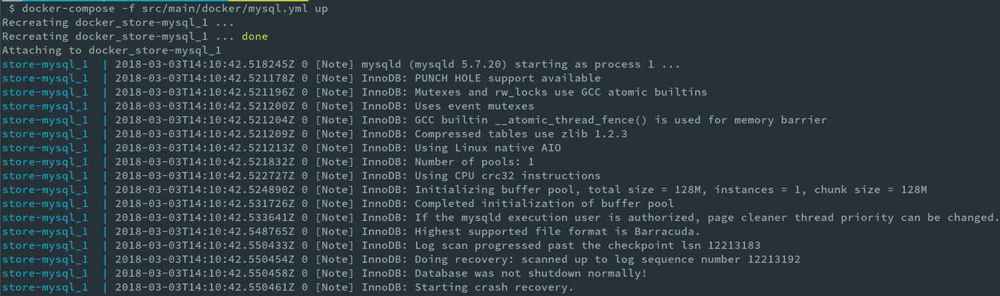
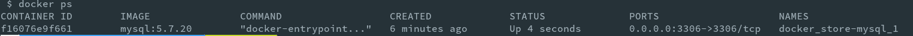
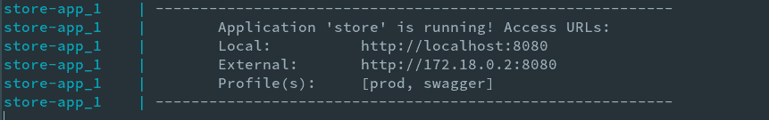
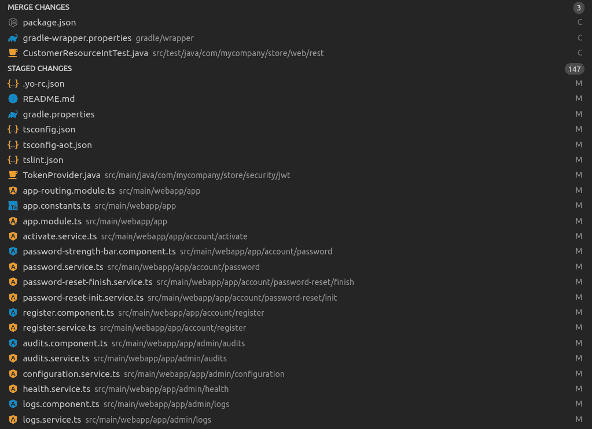
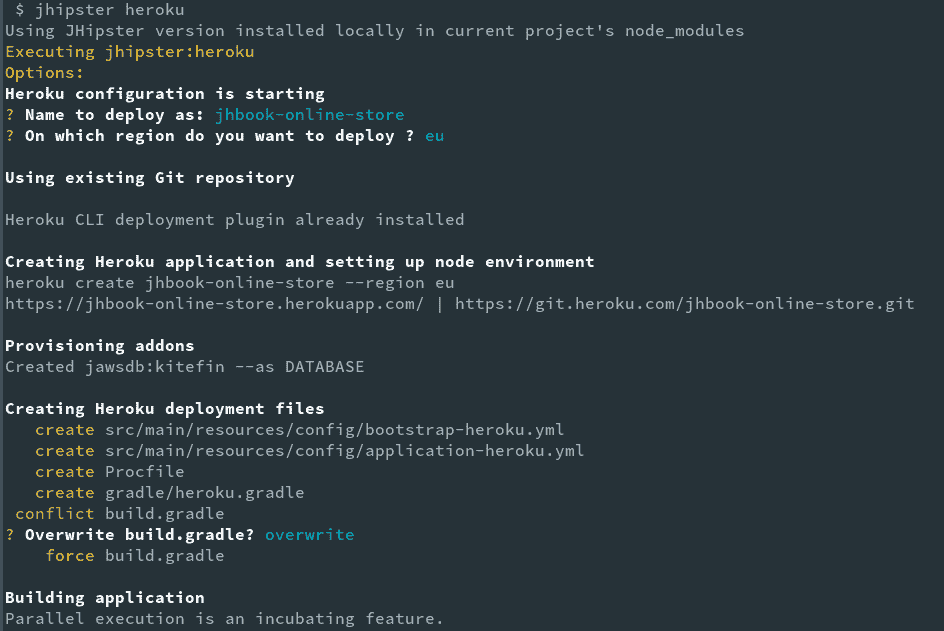
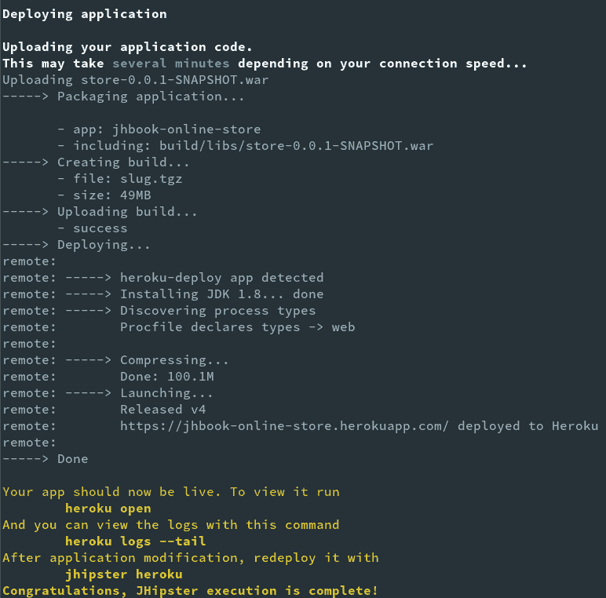

# 第七章：进入生产环境

我们的应用程序几乎准备好了，现在是时候进入生产环境了。由于这是云计算的时代，我们将把我们的应用程序部署到云服务提供商——具体来说，是 Heroku。在我们继续部署我们的应用程序到生产环境之前，我们需要确保我们的应用程序在我们的本地环境中已经准备好。熟悉在这个阶段将会有用的技术和工具也会很有益处。

在本章中，我们将学习以下内容：

+   Docker 简介

+   使用 Docker 启动生产数据库

+   Spring 配置简介

+   打包应用程序以进行本地部署

+   升级到 JHipster 的最新版本

+   JHipster 支持的部署选项简介

+   在 Heroku 云上进行生产部署

# Docker 简介

Docker 是近年来在 DevOps 领域占据中心舞台的最具颠覆性的技术之一。Docker 是一种使操作系统级别的虚拟化或容器化成为可能的技术，它也是开源的，并且可以免费使用。Docker 旨在用于 Linux，但可以使用 Docker for Mac 和 Docker for Windows 等工具在 Mac 和 Windows 上使用。

# Docker 容器

当我们在 Docker 世界中谈论容器时，从技术上讲，我们是在谈论 Linux 容器。正如红帽在其网站上所述（[`www.redhat.com/en/topics/containers/whats-a-linux-container`](https://www.redhat.com/en/topics/containers/whats-a-linux-container)）：

Linux 容器是一组从系统其余部分隔离出来的进程，它们从一个提供所有必要文件以支持这些进程的独立镜像中运行。通过提供一个包含应用程序所有依赖项的镜像，它在从开发到测试，最后到生产的移动过程中是可移植的和一致的。

虽然这个概念并不新颖，但 Docker 使得创建易于构建、部署、版本控制和共享的容器成为可能。Docker 容器仅包含在宿主操作系统上运行应用程序所需的依赖项；它共享宿主系统硬件的操作系统和其他依赖项。这使得 Docker 容器在大小和资源使用方面比虚拟机（VM）更轻，因为它不需要传输整个操作系统和模拟虚拟硬件。因此，Docker 在很多传统使用场景中使虚拟机变得过时，这些场景原本是通过虚拟机技术处理的。这也意味着，与使用虚拟机相比，使用 Docker 我们可以在相同的硬件上运行更多的应用程序。Docker 容器是 Docker 镜像的实例，Docker 镜像是一组层，它描述了正在容器化的应用程序。它们包含运行应用程序所需的代码、运行时、库、环境变量和配置文件。

# Dockerfile

Dockerfile 是一组指令，告诉 Docker 如何构建 Docker 镜像。通过在特定的 Dockerfile 上运行 `docker build` 命令，我们将生成一个可用于创建 Docker 容器的 Docker 镜像。现有的 Docker 镜像可以用作新 Dockerfile 的基础，因此可以重用和扩展现有镜像。

以下代码来自我们应用程序的 Dockerfile：

```js
FROM openjdk:8-jre-alpine

ENV SPRING_OUTPUT_ANSI_ENABLED=ALWAYS \
    JHIPSTER_SLEEP=0 \
    JAVA_OPTS=""

CMD echo "The application will start in ${JHIPSTER_SLEEP}s..." && \
    sleep ${JHIPSTER_SLEEP} && \
    java ${JAVA_OPTS} -Djava.security.egd=file:/dev/./urandom -jar /app.war

EXPOSE 8080 5701/udp

ADD *.war /app.war
```

`FROM` 指令指定初始化构建时使用的基镜像。在这里，我们指定 Open JDK 8 作为我们的 Java 运行时。

`ENV` 指令用于设置环境变量，而 `CMD` 指令用于指定要执行的命令。

`EXPOSE` 指令用于指定容器在运行时监听的端口。

访问 [`docs.docker.com/engine/reference/builder/`](https://docs.docker.com/engine/reference/builder/) 获取完整的参考。

# Docker Hub

Docker Hub ([`hub.docker.com/`](https://hub.docker.com/)) 是 Docker 提供的在线注册库。它可以用来发布公共和私有 Docker 镜像。这使得共享和重用 Docker 镜像变得极其容易。

要从注册库获取 Docker 镜像，我们只需运行 `docker pull <image-name>`。

这使得在不本地安装第三方工具的情况下，只需从注册库拉取并运行容器即可轻松使用第三方工具。

# Docker Compose

Docker Compose 是 Docker 平台中的一个工具，用于定义和运行多容器应用程序。它让我们定义容器在生产环境中运行时的行为，还让我们定义它所依赖的其他服务以及服务之间如何协同工作。每个应用程序都是一个服务，因为它定义了容器的行为，例如它运行在哪个端口上，它使用哪些环境变量，等等。使用 YAML 文件进行此操作。单个 `docker-compose.yml` 文件可以定义多容器应用程序所需的所有服务，然后可以通过单个命令启动。我们将在第十一章 Deploying with Docker Compose 中了解更多关于 Docker 和 docker-compose 的内容。

访问 [`docs.docker.com/get-started/`](https://docs.docker.com/get-started/) 了解更多关于 Docker 的信息。

下表列出了 Docker 和 Docker Compose 的有用命令：

| `docker build -t myapp:1.0.` | 从当前目录的 Dockerfile 构建镜像并标记镜像 |
| --- | --- |
| `docker images` | 列出本地存储的所有 Docker 镜像 |
| `docker pull alpine:3.4` | 从注册库拉取镜像 |
| `docker push myrepo/myalpine:3.4` | 将镜像推送到注册库 |
| `docker login` | 登录到注册库（默认为 Docker Hub） |

| `docker run --rm -it -p 5000:80 -v /dev/code alpine:3.4 /bin/sh` | 运行 Docker 容器**--rm**：容器退出后自动删除 **-it**：将容器连接到终端

**-p**：外部暴露端口 `5000` 并映射到端口 `80`

**-v**：在容器内创建一个主机挂载卷

**alpine:3.4**：从该镜像实例化的容器

**/bin/sh**：在容器内运行的命令

| `docker stop myApp` | 停止一个正在运行的容器 |
| --- | --- |
| `docker ps` | 列出正在运行的容器 |
| `docker rm -f $(docker ps -aq)` | 删除所有正在运行和已停止的容器 |
| `docker exec -it web bash` | 在容器内创建一个新的 bash 进程并将其连接到终端 |
| `docker logs --tail 100 web` | 打印容器日志的最后 100 行 |
| `docker-compose up` | 启动当前文件夹中 `docker-compose.yml` 文件定义的服务 |
| `docker-compose down` | 停止当前文件夹中 `docker-compose.yml` 文件定义的服务 |

# 使用 Docker 启动生产数据库

JHipster 为应用程序创建一个 Dockerfile，并为我们在 `src/main/docker` 下选择的所有技术（如数据库、搜索引擎、Jenkins 等）提供 `docker-compose` 文件：

```js
├── app.yml - Main compose file for the application
├── Dockerfile - The Dockerfile for the application
├── hazelcast-management-center.yml - Compose file hazelcast management center
├── jenkins.yml - Compose file for Jenkins
├── mysql.yml - Compose file for the database that we choose.
└── sonar.yml - COmpose file for SonarQube.
```

让我们看看如何使用在 `src/main/docker/mysql.yml` 下提供的组合文件来使用 Docker 启动我们的生产数据库。你将需要使用终端来执行以下指令：

1.  运行 `docker --version` 和 `docker-compose --version` 以确保这些已安装。

1.  运行 `docker ps` 以列出正在运行的容器。如果你还没有运行任何容器，你应该看到一个空列表。

1.  让我们通过运行 `docker-compose -f src/main/docker/mysql.yml up` 来启动数据库。

你将看到以下控制台输出：



如果你想在后台运行服务，将 `-d` 标志传递给命令。`docker-compose -f src/main/docker/mysql.yml up -d` 将允许你继续使用相同的终端，而无需切换到另一个。

现在如果你再次运行 `docker ps`，它应该会列出我们启动的数据库服务：



# Spring 配置文件的介绍

在我们准备应用程序投入生产之前，让我们简单谈谈 Spring 配置文件。

Spring 配置文件（[`docs.spring.io/spring/docs/current/spring-framework-reference/core.html#beans-definition-profiles-java`](https://docs.spring.io/spring/docs/current/spring-framework-reference/core.html#beans-definition-profiles-java)）允许您根据环境更改应用程序的行为。这是通过使用 `@Profile` 注解和特定配置文件来实现的，可以通过指定 `spring.profiles.active` 属性来激活。根据我们在这里设置的配置文件，Spring 将选择适当的 `application.properties/application.yml` 文件，并使用 Java 源代码中的 `@Profile` 注解包含/排除特定配置文件包含/排除的组件。例如，如果我们设置 `spring.profiles.active=prod`，所有具有 `@Profile("prod")` 的 Spring 组件都将被实例化，任何具有 `@Profile("!prod")` 的组件将被排除。同样，如果 `application-prod.yml` 或 `application-prod.properties` 文件在类路径上可用，Spring 将加载并使用它。

JHipster 默认配置了 `dev` 和 `prod` 配置文件，并在 `src/main/resources/config` 文件夹中包含了 `application-dev.yml` 和 `application-prod.yml` 文件，以及基本的 `application.yml` 文件。JHipster 还更进一步，为 Gradle 构建提供了 `dev` 和 `prod` 配置文件（同样适用于 Maven），这样我们就可以为特定配置文件构建/运行应用程序，这非常方便。以下是 `application-dev.yml` 文件中定义的配置文件和数据库配置：

```js
...

spring:
    profiles:
        active: dev
        include: swagger
    ...
    datasource:
        type: com.zaxxer.hikari.HikariDataSource
        url: jdbc:h2:file:./build/h2db/db/store;DB_CLOSE_DELAY=-1
        username: store
        password:
    ...
```

JHipster 应用程序中可用的配置文件如下：

| `dev` | 专为开发和生产力优化，启用了 Spring 开发工具、内存数据库等 |
| --- | --- |
| `prod` | 专为生产优化，侧重于性能和稳定性 |
| `swagger` | 启用 API 的 Swagger 文档 |
| `no-liquibase` | 禁用 Liquibase，在不需要 Liquibase 运行的生产环境中很有用 |

# 打包应用程序以进行本地部署

现在，让我们构建我们的应用程序并将其本地部署。这可以通过两种方式完成，要么使用 Docker，要么构建并执行一个 WAR 文件。

# 使用 Docker 构建和部署

让我们使用 Gradle 任务来构建我们的 Docker 镜像。

使用 `./gradlew tasks` 命令列出所有可用任务。

1.  在您的终端中，进入项目根目录并执行；`./gradlew bootRepackage -Pprod buildDocker`：

    +   **bootRepackage**：为应用程序构建可执行归档（WAR）文件

    +   **-Pprod**：指定要使用的配置文件

    +   **buildDocker**：基于 `src/main/docker` 文件夹中的 Dockerfile 构建 Docker 镜像

如果您使用的是 JHipster 版本 5 或更高版本，请使用 `bootWar` 命令代替 Gradle 中的 `bootRepackage` 命令。

2. 任务成功完成后，我们可以通过运行以下命令来部署我们的应用程序：

```js
> docker-compose -f src/main/docker/app.yml up
```

如果您还没有启动 MySQL 数据库，这将也会启动它。如果您已经在之前的步骤中启动了它，那么 `docker-compose` 将会跳过这一步。

当我们在控制台看到以下输出时，我们的应用程序就准备好了。如您所见，它正在使用 `prod` 和 `swagger` 配置运行：



使用您最喜欢的浏览器访问 `http://localhost:8080` 来查看应用程序的实际运行情况。

# 构建和部署可执行存档

如果您不想使用 Docker，则可以通过完成以下步骤在本地使用生产配置部署应用程序：

1.  首先，请确保 MySQL 数据库在之前的步骤中正在运行；如果不是，请使用 `docker-compose -f src/main/docker/mysql.yml up -d` 启动它。

1.  现在让我们通过运行 `./gradlew bootRepackage -Pprod` 来为 prod 配置创建一个可执行的存档。

1.  一旦构建成功，`build/libs` 下将创建两个存档（WAR）。`store-0.0.1-SNAPSHOT.war` 文件是一个可执行存档，可以直接在 JVM 上运行，而 `store-0.0.1-SNAPSHOT.war.original` 是一个普通的 WAR 文件，可以部署到服务器，如 JBoss 或 Tomcat。

1.  让我们使用可执行存档。只需运行 `./build/libs/store-0.0.1-SNAPSHOT.war` 来启动应用程序。如果您使用的是 Windows，请运行 `java -jar build/libs/store-0.0.1-SNAPSHOT.war`。

一旦应用程序启动，您将在控制台上看到打印的 URL。使用您最喜欢的浏览器访问 `http://localhost:8080` 来查看应用程序的实际运行情况。

# 升级到 JHipster 的最新版本

JHipster 提供了一个升级子生成器 ([`www.jhipster.tech/upgrading-an-application/`](http://www.jhipster.tech/upgrading-an-application/))，以帮助您使用新的 JHipster 版本升级应用程序。它非常有用，因为它为您自动化了许多手动步骤，您唯一需要做的是在升级完成后解决任何合并冲突。让我们升级我们的应用程序，怎么样？

1.  在您的终端中，执行 `jhipster upgrade` 命令。如果有新的 JHipster 版本可用，则升级过程将开始；如果没有，则进程将退出。

一旦进程开始，您将看到详细的控制台日志，显示正在发生的事情。如您所见，这个子生成器使用的是全局 JHipster 版本，而不是本地版本，这与其他子生成器不同：

```js
Using JHipster version installed globally
Executing jhipster:upgrade
Options: 
Welcome to the JHipster Upgrade Sub-Generator
This will upgrade your current application codebase to the latest JHipster version
Looking for latest generator-jhipster version...
yarn info v1.5.1
4.14.1
Done in 0.16s.
 New generator-jhipster version found: 4.14.1
     info git rev-parse -q --is-inside-work-tree
 Git repository detected
     info git status --porcelain
     info git rev-parse -q --abbrev-ref HEAD
     info git rev-parse -q --verify jhipster_upgrade
     info git checkout --orphan jhipster_upgrade
 Created branch jhipster_upgrade
     info Removing .angular-cli.json
     ...
 Cleaned up project directory
Installing JHipster 4.13.3 locally
     info yarn add generator-jhipster@4.13.3 --dev --no-lockfile --ignore-scripts
yarn add v1.5.1
...
Done in 6.16s.
 Installed generator-jhipster@4.13.3
Regenerating application with JHipster 4.13.3...
warning package.json: No license field
/home/deepu/Documents/jhipster-book/online-store/node_modules/.bin
     info "/home/deepu/Documents/jhipster-book/online-store/node_modules/.bin/jhipster" --with-entities --force --skip-install
Using JHipster version installed globally
Running default command
Executing jhipster:app
Options: withEntities: true, force: true, skipInstall: true, with-entities: true, skip-install: true
...
Server application generated successfully.
...
Client application generated successfully.
...
Entity generation completed
...
Congratulations, JHipster execution is complete!
 Successfully regenerated application with JHipster 4.13.3
     info Removing src/main/resources/keystore.jks
     info git add -A
     info git commit -q -m "Generated with JHipster 4.13.3" -a --allow-empty
 Committed with message "Generated with JHipster 4.13.3"
     info git checkout -q master
 Checked out branch "master"
     info git --version
     info git merge --strategy=ours -q --no-edit --allow-unrelated-histories jhipster_upgrade
 Current code has been generated with version 4.13.3
     info git checkout -q jhipster_upgrade
 Checked out branch "jhipster_upgrade"
Updating generator-jhipster to 4.14.1 . This might take some time...
     info yarn add generator-jhipster@4.14.1 --dev --no-lockfile --ignore-scripts
...
Done in 30.40s.
 Updated generator-jhipster to version 4.14.1
     info Removing .angular-cli.json
     ...
 Cleaned up project directory
Regenerating application with JHipster 4.14.1...
/home/deepu/Documents/jhipster-book/online-store/node_modules/.bin
     info "/home/deepu/Documents/jhipster-book/online-store/node_modules/.bin/jhipster" --with-entities --force --skip-install
Using JHipster version installed globally
Running default command
Executing jhipster:app
Options: withEntities: true, force: true, skipInstall: true, with-entities: true, skip-install: true
...
Entity generation completed
Congratulations, JHipster execution is complete!
 Successfully regenerated application with JHipster 4.14.1
     info Removing src/main/resources/keystore.jks
     info git add -A
     info git commit -q -m "Generated with JHipster 4.14.1" -a --allow-empty
 Committed with message "Generated with JHipster 4.14.1"
     info git checkout -q master
 Checked out branch "master"
Merging changes back to master...
     info git merge -q jhipster_upgrade
 Merge done!
     info git diff --name-only --diff-filter=U package.json
WARNING! There are conflicts in package.json, please fix them and then run yarn
 Start your Webpack development server with:
yarn start

     info git diff --name-only --diff-filter=U
 Upgraded successfully.
WARNING! Please fix conflicts listed below and commit!
gradle/wrapper/gradle-wrapper.properties
package.json
src/test/java/com/mycompany/store/web/rest/CustomerResourceIntTest.java

Congratulations, JHipster execution is complete!
```

子生成器按以下顺序执行：

1.  检查是否有新的 JHipster 版本可用（如果使用 `--force` 则不适用）。

1.  检查应用程序是否已经初始化为 GIT 仓库；如果不是，JHipster 将为您初始化一个，并将当前代码库提交到 master 分支。

1.  检查确保仓库中没有未提交的本地更改。如果发现任何未提交的更改，则进程将退出。

1.  检查是否存在 `jhipster_upgrade` 分支。如果不存在，则创建一个分支。

1.  检出 `jhipster_upgrade` 分支。

1.  将 JHipster 升级到最新版本。

1.  清理当前项目目录。

1.  使用`jhipster --force --with-entities`命令重新生成应用程序。

1.  将生成的代码提交到`jhipster_upgrade`分支。

1.  将`jhipster_upgrade`分支合并回启动`jhipster upgrade`命令的原始分支。

在解决合并冲突之前，先看看升级后有什么变化。查看已暂存的更改。仔细检查更改，确保一切正常，特别是在我们之前进行过自定义的文件中。我的变更日志如下；注意，由于有 147 个文件被更新，所以我截断了底部：



幸运的是，我们只有三个冲突，因此它们应该很容易解决。`package.json`中的冲突源于我们为了集成 Bootswatch 所做的更改。仔细解决文件中的冲突暂存，然后继续下一个文件。

一旦所有冲突都得到解决，暂存文件并将它们提交：

```js
> git add --all
> git commit -am "update to latest JHipster version"
```

确保一切正常工作。使用`./gradlew test && yarn && yarn test`运行服务器端和客户端测试，并通过运行`./gradlew clean webpackBuildDev bootRun`命令启动应用程序来验证这一点。

# JHipster 支持的部署选项简介

现在我们已经通过本地部署验证了我们的生产构建，让我们看看如何通过使用云服务将其推向实际生产。JHipster 默认支持大多数云平台，并为流行的平台如 Heroku、Cloudfoundry 和 AWS 提供了特殊的子生成器命令。

JHipster 还支持如 OpenShift、Google Cloud（使用 Kubernetes）和 Rancher 等平台，但让我们在接下来的章节中了解它们，因为它们更适合微服务。尽管如此，从理论上讲，您也可以将它们用于单体部署。

# Heroku

Heroku ([`www.heroku.com/`](https://www.heroku.com/))是 Salesforce 的云平台。它允许您在云上部署、管理和监控应用程序。Heroku 专注于应用程序而不是容器，并支持从 NodeJS 到 Java 再到 Go 的各种语言。JHipster 提供了 Heroku 子生成器，该生成器由 Heroku 构建和维护，使得将 JHipster 应用程序部署到 Heroku 云变得容易。它使用 Heroku CLI，您需要一个 Heroku 账户才能使用它。子生成器可用于部署和更新您的应用程序到 Heroku。

访问[`www.jhipster.tech/heroku/`](http://www.jhipster.tech/heroku/)获取更多信息。

# Cloud Foundry

Cloud Foundry 是由 Cloud Foundry 基金会管理的多云计算平台。它最初由 VMWare 创建，现在是 Spring 框架背后的公司 Pivotal 的旗下。它提供了一种多云解决方案，目前由 **Pivotal Cloud Foundry** (**PCF**), **Pivotal Web Services** (**PWS**), Atos Canary, SAP 云平台和 IBM Bluemix 等支持。该平台是开源的，因此可以用来设置自己的私有实例。JHipster 提供了一个子生成器，可以轻松地将 JHipster 应用程序部署到任何 Cloud Foundry 提供商。它使用 Cloud Foundry 命令行工具。

访问 [`www.jhipster.tech/cloudfoundry/`](http://www.jhipster.tech/cloudfoundry/) 获取更多信息。

# Amazon Web Services

**Amazon Web Services** (**AWS**) 是领先的云计算平台，提供平台、软件和基础设施作为服务。AWS 提供了 Elastic Beanstalk 作为在云上部署和管理应用程序的简单平台。JHipster 提供了一个子生成器，可以将 JHipster 应用程序部署到 AWS 或 Boxfuse ([`www.jhipster.tech/boxfuse`](http://www.jhipster.tech/boxfuse)/)，一个替代服务。

访问 [`www.jhipster.tech/aws/`](http://www.jhipster.tech/aws/) 获取更多信息。

# 将生产部署到 Heroku 云平台

我们需要选择一个云提供商。对于这个演示，让我们选择 Heroku。

虽然 Heroku 账户是免费的，并且你可以获得免费额度，但为了使用 MySQL 和其他附加组件，你将需要提供信用卡信息。只有当你超出免费配额时，你才会被收费。

让我们通过以下步骤将我们的应用程序部署到 Heroku：

1.  首先，你需要在 Heroku 中创建一个账户 ([`signup.heroku.com/`](https://signup.heroku.com/))。这是免费的，你也会获得免费额度。

1.  按照以下链接 [`devcenter.heroku.com/articles/heroku-cli`](https://devcenter.heroku.com/articles/heroku-cli) 安装 Heroku CLI 工具。

1.  通过运行 `heroku --version` 验证 Heroku CLI 是否安装正常。

1.  通过运行 `heroku login` 登录到 Heroku。当提示时，输入你的 Heroku 电子邮件和密码。

1.  现在运行 `jhipster heroku` 命令。你将开始看到问题。

1.  当被问及部署名称时，选择你喜欢的名称：（存储）。默认情况下，它将使用应用程序名称。尽量选择一个独特的名称，因为 Heroku 命名空间是共享的。

1.  接下来，你将被要求选择一个区域——你希望在哪个区域部署？选择美国或欧盟，然后继续。

1.  生成器将创建所需的文件，并接受 Gradle 构建文件建议的更改。

控制台输出将看起来像这样：



生成的 `.yml` 文件为应用程序添加了 Heroku 特定的配置。`Procfile` 包含了在 Heroku 上执行的应用程序特定命令。Gradle 构建也被修改以包含 Heroku 所需的依赖项。

生成文件后，它将构建应用程序并开始上传工件。这可能会根据你的网络延迟需要几分钟。一旦成功完成，你应该会看到以下屏幕：



现在运行 `heroku open` 命令以在浏览器中打开已部署的应用程序。就这样，你已成功使用几个命令将应用程序部署到 Heroku。

当你进一步更新应用程序时，你可以使用 `./gradlew -Pprod bootRepackage` 命令重新构建包，然后使用 `heroku deploy:jar --jar build/libs/*war` 命令重新部署它。

不要忘记通过执行以下命令将所做的更改提交到 `git`：

```js
> git add --all
> git commit -am "add heroku configuration"
```

# 摘要

部署到生产是应用程序开发中最重要阶段之一，也是最重要的一个。借助 JHipster，我们轻松地将应用程序部署到了云服务提供商。我们还了解了 Docker 和其他可用的各种部署选项。我们还使用了升级子生成器来确保我们的应用程序与 JHipster 保持最新。

到目前为止，我们看到了如何使用 JHipster 开发和部署单体电子商务应用程序。我们从一个单体开始，在接下来的章节中，我们将看到如何在 JHipster 的帮助下将我们的应用程序扩展到微服务架构。在下一章中，我们将学习关于不同的微服务技术和工具。所以，请保持关注！
