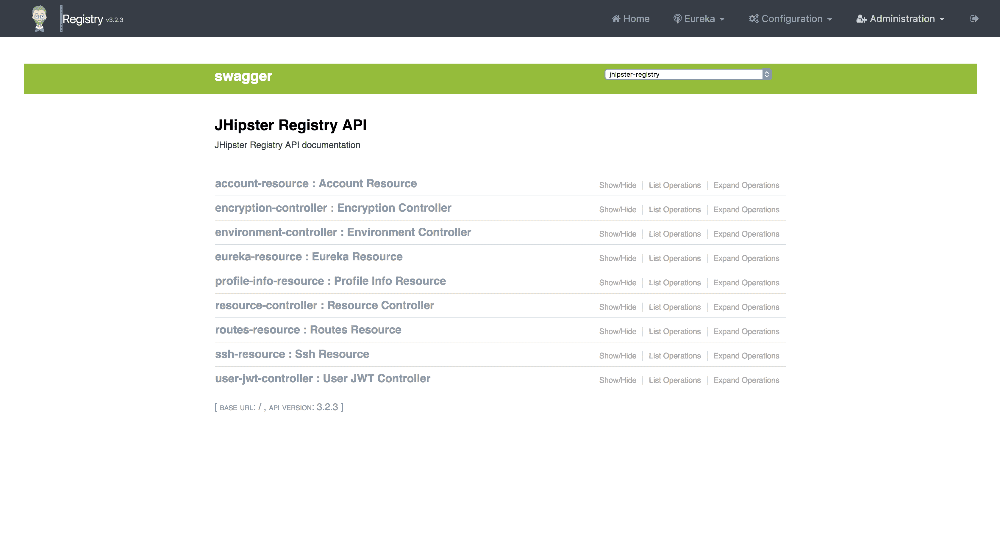

# 第十章：与微服务一起工作

在上一章中，我们使用 JHipster 创建了一个网关和两个微服务；现在，让我们看看我们如何进一步开发我们的微服务，包括我们的领域模型和额外的业务逻辑。由于我们将我们的在线商店单体应用转换为微服务架构，我们将看到我们使用 JDL 创建的领域模型如何转换为微服务领域模型。但在我们开始之前，我们需要设置一些工具以便与微服务一起工作。

所以在本章中，我们将看到以下主题：

+   如何设置 JHipster 注册表

+   如何在本地运行微服务设置

+   使用 JDL 创建领域模型

+   在 JHipster 中生成领域模型

让我们开始吧！

# 在本地设置 JHipster 注册表

我们已经创建了我们的网关和两个微服务应用。这些微服务使用两个不同的数据库。到目前为止，使用 JHipster 创建这些应用既简单又容易。

JHipster 提供了两种不同的选项，我们之前已经见过，即 Consul 和 JHipster 注册表。对于我们的用例，让我们选择 JHipster 注册表。我们已经在第八章中学习了 JHipster 注册表，*微服务服务器端技术简介*。现在，我们将看到如何在我们的本地开发环境中设置和启动它。

现在，这三个服务基本上充当 Eureka 客户端。我们需要一个服务注册表，它会在应用启动和停止时分别注册和注销应用；这就是 JHipster 注册表。Eureka 服务器（JHipster 注册表服务器）作为所有 Eureka 客户端的权威。

如同其名，JHipster 注册表作为一个注册服务，所有微服务应用和网关在应用启动和停止时都会自动注册/注销。

让我们回顾一下我们已经学到的内容。JHipster 注册表由一个 Eureka 服务器和 Spring Cloud Config 服务器组成，它们在以下方面提供帮助

+   **Eureka 服务器**帮助进行服务发现和请求负载均衡。

+   **Spring Cloud Config 服务器**作为一个单一的地方，我们将管理跨环境的应用外部属性。它还提供了一个用户仪表板。通过这个仪表板，用户可以管理和监控应用。

这使得 JHipster 注册表对于单体和微服务架构都是一个理想的选择。

如果你正在开发不同服务用不同语言编写的微服务应用，并且你更倾向于一致性而非服务的可用性，那么你可以选择 Consul。

我们有三种方法可以设置 JHipster 注册表以在本地运行。

我们可以下载 WAR 文件（预包装）并直接运行它，或者克隆我们的 GitHub 仓库并从那里运行。我们还可以使用 Docker 容器来运行它。我们现在将看到如何执行这些操作中的每一个。

您可以选择在生成单体应用程序时使用 JHipster 注册表。在生成过程中，对于问题“您想使用 JHipster 注册表来配置、监控和扩展应用程序吗？”选择是。

# 使用预打包的 WAR 文件

从注册表的发布页面下载预打包的可执行 WAR 文件的最新版本（[`github.com/jhipster/jhipster-registry/releases`](https://github.com/jhipster/jhipster-registry/releases)）：

1.  打开您的终端，然后输入以下命令，将 `<version>` 替换为最新版本。如果您使用 Windows 并且没有设置 `curl`，您也可以通过在浏览器中访问链接来下载文件：

```js
> curl https://github.com/jhipster/jhipster-registry/releases/download/v*<version>*/jhipster-registry-*<version>*.war 
```

1.  这将从 JHipster 注册表项目下载最新的 WAR 文件。下载完成后，我们可以使用以下命令运行 JHipster 注册表：

```js
> ./jhipster-registry-<version>.war --security.user.password=admin --jhipster.security.authentication.jwt.secret=secret-key --spring.cloud.config.server.native.search.locations=file:./central-config
```

注意，我们向我们的注册表服务器传递了一些值；它们是：

```js
--security.user.password=admin
```

由于 JHipster 注册表建立在 JHipster 应用程序之上，它将具有默认的管理员用户。对于该管理员用户，我们使用 Spring 属性 `security.user.password` 提供密码：

```js
--jhipster.security.authentication.jwt.secret=secret-key
```

然后，我们以两种方式定义应用程序的 JWT 令牌。我们可以在环境变量中设置信息并使用它，或者在我们定义密钥时添加此键值。这也使用 `spring config` 属性来设置属性：

```js
--spring.cloud.config.server.native.search.locations
```

1.  最后，我们告诉 JHipster 注册表在哪里可以找到 Spring Cloud Config 服务器提供的中央配置。

在我们了解在这里传递什么值之前，我们需要了解 `spring-cloud-config` 上下文中的 Spring 配置文件。Spring Cloud Config 默认支持 `native` 和 `git` 配置文件。

在 `native` 配置文件中，云配置服务器期望其属性在文件中定义，我们必须将文件位置传递给 JHipster 注册表。另一方面，`git` 配置文件将期望设置 `--spring.cloud.config.server.git.uri`。

例如，注册表的示例 JHipster 配置文件如下：

```js
configserver:
    name: JHipster Registry config server
    status: Connected to the JHipster Registry config server using ...
jhipster:
    security:
        authentication:
            jwt:
               secret: awesome-my-secret-token-to-change-in-production
```

这也可以在注册表的 Spring Cloud 配置页面中看到：


就像 JHipster 应用程序提供 `dev` 和 `prod` 配置文件一样，JHipster 注册表也支持 `dev` 和 `prod` 配置文件。默认情况下，启动时将在 `dev` 配置文件下启动，但我们可以使用 `--spring.profiles.active=prod,git` 来使其在 `prod` 配置文件下运行，传递 `git` URL，并在那里定义配置属性。对于生产模式，`git` 是在 Spring Cloud 服务器上使用的首选配置文件。

# 从源码构建

如果您想从事前沿技术工作并对探索添加到 JHipster 注册表的最新功能感兴趣，那么您可以进一步操作并从 GitHub 克隆存储库：

1.  导航到您首选的文件夹并运行以下命令：

```js
> git clone https://github.com/jhipster/jhipster-registry
```

1.  一旦克隆，使用以下命令导航到文件夹：

```js
> cd jhipster-registry
```

1.  按如下方式以开发模式运行应用程序：

```js
> ./mvnw 
```

您也可以按如下方式以生产模式运行：

```js
> ./mvnw -Pprod
```

1.  您还可以打包并运行 WAR 文件：

```js
> ./mvnw -Pprod package
> target/jhipster-registry-<version>.war --spring.profiles.active=prod,git
```

# Docker 模式

您还可以从提供的 Docker 镜像启动 JHipster Registry。我们生成的应用程序已经包含了所需的 `docker-compose` 文件。

例如，在我们的网关应用程序中，在 `src/main/docker/jhipster-registry.yml` 下查找 `docker-compose` 文件。

我们可以通过在终端中键入以下命令来启动 JHipster Registry：

```js
> cd gateway
> docker-compose -f src/main/docker/jhipster-registry.yml up
```

`docker compose` 文件（`src/main/docker/jhipster-registry.yml`）包含：

```js
version: 2
services:
    jhipster-registry: 
        image: jhipster/jhipster-registry:v3.2.3
        volumes:
            - ./central-server-config:/central-config
        environment:
            - SPRING_PROFILES_ACTIVE=dev
            - SECURITY_USER_PASSWORD=admin
            - JHIPSTER_REGISTRY_PASSWORD=admin
            - SPRING_CLOUD_CONFIG_SERVER_NATIVE_SEARCH_LOCATION= file:./central-config
        ports:
            -8761:8761
```

这将镜像定义为 `jhipster-registry` 并指定版本（最新版）。它还定义了一个挂载 `central-config` 的卷，这是 Spring Cloud Config 服务器用于定义微服务应用程序和网关的应用程序属性所必需的。这里还定义了环境变量，如 Spring 配置文件、管理员密码和云配置搜索位置。它还指定了暴露的端口（`8761`）。

当然，这需要在机器上安装并运行 Docker。

在所有上述情况（如果成功）中，它将在端口 `8761` 上启动 JHipster Registry，并默认使用原生模式（除非明确更改）。您实际上可以导航到 `http://localhost:8761` 来访问 JHipster Registry，然后使用我们启动应用程序时使用的密码登录到应用程序。

# 本地运行生成的应用程序

现在我们已经准备就绪。我们已经生成了一个网关应用程序，我们有一个带有 SQL 数据库的微服务，它在开发配置下使用 H2，在生产配置下使用 MySQL（发票应用程序），我们还有一个带有 MongoDB 的微服务（通知应用程序），最后我们刚刚在本地完成了 JHipster Registry 的设置。现在是我们开始本地运行一切并查看我们的微服务设置如何无缝工作的时候了。

# 网关应用程序页面

我们现在转到终端，然后进入 `e-commerce-app` 文件夹。导航到 `online-store` 文件夹，并以开发模式启动网关应用程序：

```js
> cd online-store
> ./gradlew
```

这将在端口 `8080` 上启动我们的网关应用程序。让我们在我们的浏览器中打开 `http://localhost:8080`：


然后，我们可以点击主页上的登录按钮或从顶部菜单选择 `Account/sign in`，然后分别输入用户名和密码为 `admin` 和 `admin`。

一旦以管理员用户身份登录，您可以看到管理菜单：


在管理菜单中，您可以找到以下页面：


这包括以下内容：

**网关**：网关页面将显示该应用程序作为网关的微服务应用程序列表。它还将显示路由和处理路由的服务，以及可用于路由的服务器：


目前，没有启动微服务应用程序，所以页面是空的。一旦我们启动通知和发票服务，我们将看到这个页面是如何变化的。

**用户管理**：这与单体用户管理类似，并包含基本用户信息和管理工作。

**指标**：指标页面包含有关 JVM 指标和服务的/数据库统计信息。这又与单体应用类似。除此之外，它还显示了已注册微服务应用的指标统计。

**健康**：健康页面显示了我们在应用程序中拥有的各种服务的基本健康信息：


与单体应用类似，它显示了磁盘空间和数据库。但除此之外，它还显示了发现网络的健康状况（即 discoveryClient 和 Eureka 服务器）。它还显示了微服务配置服务器的健康状况，即 `spring-cloud-config-server`，然后显示了我们所使用的断路器的健康状况（Hystrix）。

配置、审计、日志和 API 页面与我们之前看到的单体应用类似。

# JHipster 注册表页面

由于我们在端口 `8761` 上启动了注册表服务器，我们可以通过 `http://localhost:8761` 访问并使用 `admin` 作为用户名，以及我们在启动应用程序时提供的密码 `admin` 登录。

登录后，JHipster 注册表以仪表板的形式显示以下信息：


# 系统状态

这个面板将显示应用程序正在运行的环境以及应用程序运行了多长时间（系统运行时间）。

# 低于续订阈值

我们的应用程序必须向注册表服务发送心跳信号，以通知注册表应用程序正在运行。注册表服务依赖于这个心跳信号来注册和注销应用程序。也就是说，应用程序的存在是通过这个心跳 ping 来确定的。这就是在续订阶段会发生的事情。

然而，当 Eureka 服务器启动时，它会尝试从附近的服务获取所有关于实例注册的信息。如果附近的服务由于任何原因失败，那么它将尝试连接到所有对等节点以获取信息。如果 Eureka 服务器能够获取所有服务器的信息，那么它将根据接收到的信息设置续订阈值。基于这些信息，JHipster 注册表将保留有关当前级别是否低于指定的续订阈值的信息，并在 UI 中通知用户。

# 已注册实例

这将显示已注册到注册表中的实例的基本信息。由于我们只启动了网关服务，这里将只看到一个实例。基本上，这将列出所有连接到此注册表服务的实例。

它显示了系统的状态、系统名称，然后是实例 ID。实例 ID 是根据 JHipster Registry 的`application.yml`配置生成的，并分配一个随机值。

# 一般信息和健康

它还显示了有关 JHipster Registry 服务的一般信息以及服务集群的健康信息，类似于网关健康信息。这里的数据是在 Spring Actuator 健康和指标端点的帮助下获取的。

注意**健康**部分中的 UNKNOWN（参见图表）。它告诉我们 Eureka 服务器没有以高可用模式运行，或者只有一个 JHipster Registry 实例正在运行。当您启动另一个注册表实例（即使应用程序高可用）时，它就会消失。

# 应用程序列表页面

此页面列出了在 JHipster Registry 服务中注册的应用程序。

导航到管理 | 网关：


它显示了以下信息：

+   当前实例 ID 及其名称

+   实例的当前状态

+   部署的版本

+   配置文件

+   部署的区域

版本号是从 Gradle 和 Maven 项目的`build.gradle`或`pom.xml`中获取的。

此处的区域通常指的是亚马逊区域。它被 Ribbon 用于将请求路由到最近的服务器。如果您不使用亚马逊，此配置将无济于事，这就是为什么我们将其设置为*主要*（否则负载均衡算法将不正确）。

管理模块中的所有页面都将有一个下拉菜单，列出已注册的各种实例，我们可以选择该实例以查看其指标、健康、配置和其他信息，具体取决于我们所在的页面。

# 指标页面

默认情况下，这将显示注册表的 JVM 指标及其服务统计信息：


我们可以从提供的下拉菜单中选择任何实例并查看其统计信息，因此，使 JHipster Registry 成为提供所有必要洞察的单一信息点，了解您的微服务架构。例如，在选择网关应用程序实例后，我们将获得网关相关信息：


# 健康页面

健康页面将列出注册表本身及其所有连接的实例的健康状况。例如，在选择网关应用程序实例后，我们将获得以下网关相关信息：


# 配置页面

与健康和指标页面类似，JHipster Registry 将提供所有连接到它的实例的详细配置，我们可以从下拉菜单中选择实例：

以下图像显示了网关应用程序的配置屏幕


# 日志页面

与前面的页面类似，日志页面也会显示应用程序的实时日志。这在出现故障时进行调试和获取更多信息时非常有用：

日志在应用层面进行格式化。这里的控制台显示了`tail -f`用于合并日志。

下图显示了网关应用程序的日志：


# Swagger API 端点

微服务架构高度依赖于网关和服务、服务和注册表、网关和注册表之间的 API 调用。因此，对于开发者和用户来说，了解他们可以访问的 API 端点以及访问这些端点所需的信息至关重要。

这可能是一项大量工作。幸运的是，像 Swagger 这样的库可以提供帮助。我们只需将标准注释添加到方法中，然后 Swagger API 将执行从这些方法中提取信息并将其转换为美观用户界面的必要工作：



前面的图像显示了默认生成的 Swagger UI 页面。它列出了所有可用的端点，然后提供了它提供的操作列表。它显示了我们可以在这里构建请求并测试输出的游乐场。

通常，Swagger API 文档仅在开发模式下可用。如果您正在开发 API 服务，并且需要将此暴露给最终用户或使用您服务的开发人员，您可以通过设置`swagger`配置文件以及`prod`来在生产中启用它，通过设置`spring.profiles.active=prod,swagger`。

与其他页面类似，此页面也会列出连接到此注册服务器的各种实例，我们可以从下拉菜单（右上角）中选择它们，以查看各种应用程序提供的 API：


网关 API 中列出的操作将提供以下信息：


它列出了`AccountResource`文件中所有可用的操作。它显示了方法类型（`GET` / `POST` / `PUT` / `DELETE`），然后是`AccountResource`文件中存在的端点和方法名称：


点击任何一个端点，它会显示关于响应类、响应错误、响应内容类型以及响应对象结构的详细信息。此外，它还显示了模型对象的构建方式。这对于想要访问这些 API 的最终用户特别有帮助：

```js
UserDTO {
    activated (boolean, optional),
    authorities (Array[string], optional),
    createdBy (string, optional),
    createdDate (string, optional),
    email (string, optional),
    firstName (string, optional),
    id (integer, optional),
    imageUrl (string, optional),
    langKey (string, optional),
    lastModifiedDate (string, optional),
    lastModifiedBy (string optional),
    lastName (string, optional),
    login (string)
}
```

接下来，有一个选项在点击按钮后尝试端点：


它显示了请求及其响应。它还显示了如何构建请求，包括身份验证令牌。它提供了服务器返回的响应代码和响应头信息，这对于 API 程序员来说也非常有用：


# 在本地运行发票和通知应用程序

我们已经启动了网关和注册服务。然后我们可以进入我们的发票和通知应用程序文件夹，并在本地运行它们：

```js
> cd invoice
> ./gradlew
```

打开另一个终端并运行以下命令：

```js
> cd notification
> ./gradlew
```

这将分别在`8081`和`8082`端口上运行它们：


应用程序启动时，它也会尝试连接到 JHipster 注册表并注册自己。一旦服务器启动，你可以查看前面的消息，以确保它已连接到 JHipster 注册表。

你也可以通过你的网关应用程序进行测试。登录到网关应用程序，然后导航到管理 | 网关：


在这里，你可以看到两个微服务应用程序，发票和通知，都已启动，并且它们分别在各自的 URL 上可用。

你还可以检查 JHipster 注册表服务以列出已注册的实例：


类似地，JHipster 注册表中的所有其他页面都将开始显示发票和通知作为实例之一，我们可以直接从 JHipster 注册表中获取它们的健康状态、配置、日志和指标。

如果你已经跟随书籍学习，这将是你将拥有的目录结构：


# 在 JDL 中建模实体

由于我们在设置单体应用时已经使用了 JDL 工作室，现在是时候更新它了。

如前一章所述，我们将实体从单体应用迁移到网关应用，然后，从单体应用中移除与发票相关的实体，在发票微服务中使用它们，然后更新相关的发票引用。最后，我们为通知微服务创建实体。

以下图表显示了我们的新 JDL 实体模型：


发票是迁移到单独服务的理想候选者。我们可以完全解耦发票及其依赖项，但这将在我们的当前应用程序中引起一个问题——`ProductOrder`实体与`Invoice`表相关联，我们必须在保持关系（但不是作为外键）的同时，将其作为间接键移除依赖关系，并在`ProductOrder`中与`Invoice`实体连接。

这可以通过两种方式实现。我们可以将外键改为 `ProductOrder` 实体中的另一列，或者创建另一个名为 `InvoiceOrder` 的实体，它只包含 InvoiceID 和 `ProductOrder` ID，并将其映射到 `ProductOrder` 实体。

前者基本上保持了表结构不变，并允许更容易的迁移。后者将以牺牲规范化为代价增加隔离性，并且在高性能应用程序中被大量使用。正如你所见，它们都有各自的优点和缺点。你应该采取的方法完全取决于你的需求。我们将考虑第一种方法。

作为第一步，我们将从 `online-store.jh` 中定义的 JDL 中删除产品所有者之间的关系，如下所示：

```js
relationship OneToMany {
     ...
     ProductOrder{invoice} to Invoice{order},
     ...
}
```

删除高亮显示的行，并将所有与发票相关的实体移动到 `invoice-jdl.jh` 文件。

然后，转到产品订单实体，添加一个 `invoiceId` 字段，并将其标记为 `Long` 类型。这是一个可选字段，因此不需要必需的关键字：

```js
entity ProductOrder {
    placedDate Instant required
    status OrderStatus required
    invoiceId Long
    code String required
}
```

可以使用 JDL 支持的 `microservice` 关键字对微服务实体进行标记。这有助于 JHipster 识别属于特定微服务的实体。它遵循我们之前看到的相同的 JDL 选项语法：

`<OPTION> <ENTITIES | * | all> [with <VALUE>] [except <ENTITIES>]`

+   `microservice` 关键字

+   紧接着是实体名称，如果多个则用逗号分隔

+   紧接着是 `with` 关键字

+   紧接着是微服务的名称

我们应该为微服务的实体使用不同的文件，因此创建两个文件，`invoice-jdl.jh` 和 `notification-jdl.jh`，分别包含与发票和通知相关的实体，以及原始文件。

然后，我们在 JDL 中将现有的 `Invoice` 实体映射到微服务：

```js
microservice Invoice, Shipment with Invoice
entity Invoice {
    date Instant required
    details String
    status InvoiceStatus required
    paymentMethod PaymentMethod required
    paymentDate Instant required
    paymentAmount BigDecimal required
}

enum InvoiceStatus {
    PAID, ISSUED, CANCELLED
}

entity Shipment {
    trackingCode String
    date Instant required
    details String
}

enum PaymentMethod {
    CREDIT_CARD, CASH_ON_DELIVERY, PAYPAL
}

relationship OneToMany {
    Invoice{shipment} to Shipment{invoice}
}

service * with serviceClass
paginate Invoice, Shipment with pagination
microservice * with invoice
```

然后，是时候创建另一个 JDL 文件来保存通知服务的详细信息。创建一个名为 **notification-jdl.jh** 的文件，并将通知实体添加到其中：

```js
entity Notification {
    date Instant required
    details String
    sentDate Instant required
    format NotificationType required
    userId Long required
    productId Long required
}

enum NotificationType {
    EMAIL, SMS, PARCEL
}
```

然后，我们将这些实体绑定到 `Notification` 微服务，如下所示：

```js
microservice * with notification
```

就这样。我们已经为我们的微服务定义了领域模型。

# 微服务上的实体生成

我们的 JDL 现在可以使用了。下一步将是生成网关和服务中的实体。首先，我们将从 JDL 工作室下载我们的 JDL 文件。下载后，我们将文件分别移动到我们的网关和微服务应用程序中。

一旦移动到网关应用程序文件夹，请运行以下命令。这将创建网关的实体，并在网关中为微服务实体创建 UI：

```js
> cd e-commerce-app/online-store 
> jhipster import-jdl online-store.jh
> jhipster import-jdl ../notification/notification-jdl.jh --skip-ui-  
   grouping
> jhipster import-jdl ../invoice/invoice-jdl.jh --skip-ui-grouping
```

`--skip-ui-grouping` 标志禁用了 JHipster 5.x 中引入的微服务客户端实体组件分组行为。这有助于我们在不发生许多冲突的情况下从单体应用程序中挑选我们的更改。当你在不同的服务中有相同名称的实体时，这种分组行为很有用。

运行以下命令以创建发票服务的后端：

```js
> cd e-commerce-app/notification 
> jhipster import-jdl notification-jdl.jh 
```

运行以下命令以创建发票服务的后端：

```js
> cd e-commerce-app/invoice 
> jhipster import-jdl invoice-jdl.jh
```

JHipster 将询问是否覆盖已修改的文件；请选择适用的文件。我们将使用`"a" ->`，这意味着将覆盖一切。

不要忘记将我们对原始单体中的实体所做的任何更改 cherry-pick 回网关和微服务。

不要忘记在每个服务和网关中提交更改。你也可以通过运行`git init`将整个`e-commerce-app`文件夹初始化为`git`源，如果你喜欢的话：

```js
> cd e-commerce-app
> git init
> git add --all
> git commit -am "entities generated using JDL"
```

# 解释生成的代码

在通知服务中，一旦我们生成了应用程序，以下文件被创建：


如你所见，这只会生成后端文件，而不会生成前端文件，因为它们已经在网关服务中生成。

类似地，在发票应用中运行`jhipster import-jdl`命令将生成类似的 Java 文件：


# 网关应用

在网关应用中，整个前端（包括微服务中的实体）都将生成。由于 JHipster 生成基于代理的微服务，所有前端代码都将位于网关应用中：


`ProductOrder.Java`将移除`Invoice`作为外键，然后使用我们在这里传递的长整数值：

```js
/**
* A Product Owner
*/
...
public class ProductOrder implements Serializable {
...
@Column(name = "invoice_id")
private Long invoiceId;
...
}
```

因此，应用程序已完全生成。现在，是时候运行它了。

启动三个控制台（因为我们需要运行三个应用程序）。如果我们已经有应用程序在运行，那么我们只需要编译它们，Spring devtools 将自动重新加载应用程序。确保注册表已经运行：

+   在控制台 1 中，导航到网关，如果服务器尚未运行，则使用`./gradlew`启动服务器，否则使用`./gradlew compileJava`进行编译

+   在控制台 2 中，导航到发票，如果服务器尚未运行，则使用`./gradlew`启动服务器，否则使用`./gradlew compileJava`进行编译

+   在控制台 3 中，导航到通知，如果服务器尚未运行，则使用`./gradlew`启动服务器，否则使用`./gradlew compileJava`进行编译

# 解释生成的页面

应用程序成功启动后，是时候打开你喜欢的浏览器并导航到`http://localhost:8080`的网关服务器。

登录后，你可以看到实体在网关应用中生成，并且它们在实体导航菜单下可用。

它包括所有网关实体以及微服务实体：


这是网关应用中创建的发票屏幕：


尝试创建一些实体以验证一切是否运行正常。

# 摘要

由于我们在本章中做了很多事情，让我们回顾一下到目前为止我们已经做了什么。

我们已成功生成一个网关和两个微服务。我们已下载 JHipster Registry 并在本地启动它。我们已成功隔离并生成了通知和发票服务的实体文件。我们最终启动了所有应用程序，并看到了事物是如何生成的，并且能够创建微服务应用程序。最后但同样重要的是，我们还将所有更改提交到了 Git（换句话说，达到了一个检查点）。
