# 第十二章：使用 Kubernetes 部署到云端

Kubernetes，也称为容器编排工具。正如我们在上一章所看到的，它附带了许多附加功能，并且配置和管理起来更加容易。这使得 Kubernetes 成为任何容器编排的首选。能够隐藏底层细节并提供开箱即用的服务发现、自我修复和健康检查吸引了众多公司和组织转向 Kubernetes。除此之外，Kubernetes 还是 Google 内部编排工具的演变。

在本章中，我们将涵盖以下主题：

+   使用 JHipster 生成 Kubernetes 配置文件

+   查看生成的文件

+   使用 Kubernetes 将应用程序部署到 Google Cloud

# 使用 JHipster 生成 Kubernetes 配置文件

了解 Kubernetes 的组件及其工作原理超出了本书的范围。然而，我们将探讨 JHipster 如何简化使用 Kubernetes 的微服务部署。让我们继续生成 Kubernetes 配置文件。

与 `docker-compose` 子生成器类似，JHipster 也附带了一个 Kubernetes 子生成器。为了使用它，就像使用 `docker-compose` 一样，我们将创建一个新的文件夹并将其命名为 Kubernetes。然后，我们将进入该文件夹以创建配置文件。

我们可以使用以下命令创建 Kubernetes 配置文件，然后回答子生成器提出的问题：

```js
> mkdir kubernetes && cd kubernetes
```

要安装 kubectl，请遵循 Kubernetes 网站的说明（[`kubernetes.io/docs/tasks/tools/install-kubectl/`](https://kubernetes.io/docs/tasks/tools/install-kubectl/)）。

Kubernetes 子生成器需要在您的计算机上安装 kubectl（v1.2 或更高版本）。kubectl 是 Kubernetes 的命令行界面。

我们还可以从 Google Cloud 安装 Cloud SDK，这将也会安装 kubectl。为了设置 gcloud：

1.  从[`cloud.google.com/sdk/`](https://cloud.google.com/sdk/)下载基于您操作系统的二进制文件。

1.  然后，按照网站上的步骤安装应用程序（确保您已安装 python）。

1.  安装完成后，设置 Google Cloud。为了设置 Google Cloud，请运行 `gcloud init`。

1.  这将要求您登录到您的 Google 账户：

```js
> jhipster kubernetes
```

正如我们已经看到的，Kubernetes 需要单独的工具来在本地运行（即用于开发目的）。因此，如果您需要在本地进行操作，请安装 Kubernetes 的 minikube。

子生成器首先会问我们希望部署哪种类型的应用程序。它提供了两种选项，即单体和微服务。我们将选择微服务选项：

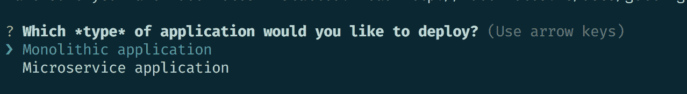

然后，它会要求我们进入根目录。由于我们的目录作为 Kubernetes 文件夹的兄弟存在，我们将选择默认选项：

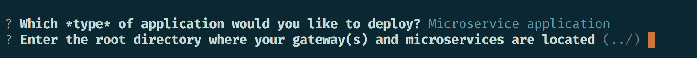

然后，子生成器将列出所有由 JHipster 生成的应用程序的文件夹。在这里，它将列出我们需要的所有三个应用程序——网关、发票和通知。选择所有三个应用程序并按回车键：

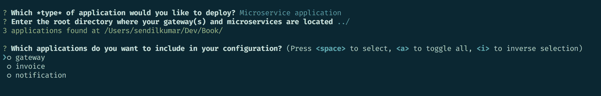

然后，它将要求我们提供注册服务的密码。在我们的情况下，它是 JHipster 注册表。我们现在将选择默认设置，但通常建议在这里使用一个强密码：

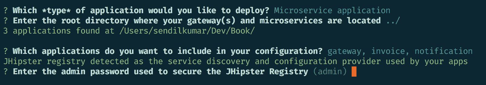

之后，它将询问我们需要在 Kubernetes 中使用的命名空间。那么，什么是命名空间？

我们可以将命名空间视为一个组，其中资源应该具有唯一的名称。当集群在不同用户或团队之间共享时，命名空间可以为它们提供资源配额。理想情况下，命名空间应仅用于大型团队。对于小型团队，最好选择默认选项。Kubernetes 默认提供三个命名空间，如下所示：

+   `Default`：当你启动容器或 pod 而不提供任何命名空间时，它们将最终进入默认命名空间

+   `Kube-system`：这个命名空间包含基于 Kubernetes 系统的对象

+   `Kube-admin`：这是一个公开的命名空间，将向所有用户公开显示，无需任何身份验证

我们将在这里选择默认命名空间：

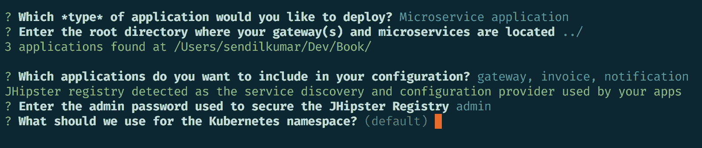

然后，子生成器将要求我们提供 Docker 仓库名称，以便 Kubernetes 可以使用此 Docker 仓库来拉取镜像（Docker 仓库的登录用户名）：

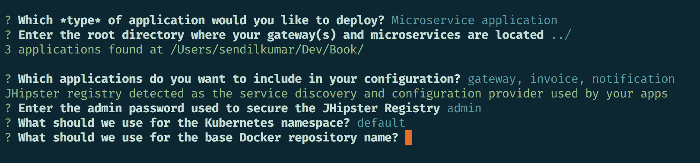

然后，子生成器将要求我们提供命令，以便我们可以将镜像推送到 Docker 仓库。我们将在这里选择默认命令：

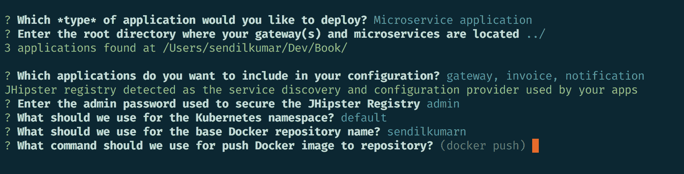

然后，它将询问我们是否需要 JHipster-console 进行日志聚合，我们将选择是：

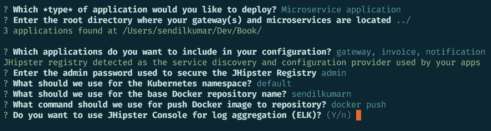

JHipster 还提供了 Prometheus 集成，所以下一个问题将是是否希望将我们的服务导出到 Prometheus。通常需要 Prometheus 操作员才能工作。我们将选择否：

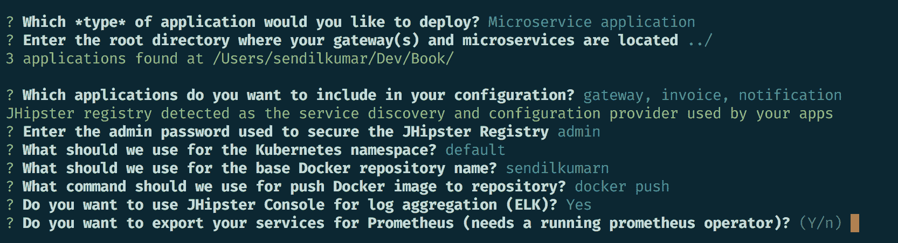

然后，生成器将要求我们选择 Kubernetes 服务类型。那么，服务类型是什么？

在 Kubernetes 中，我们部署的每一件事都是一个 pod。这些 pod 由复制控制器管理，可以创建和销毁任何 pod。每个 pod 都需要一个标识符，因此它们被标记为 IP 地址。pod 的这种动态特性将导致许多依赖它们的 pod 出现问题。为了解决这个问题，Kubernetes 引入了服务。服务不过是具有附加策略的唯一 pod 的逻辑分组。这些策略适用于服务内的所有 pod，但我们需要将这些服务发布到外部世界以供访问。

Kubernetes 最强大的功能之一是它们帮助保持 pods 副本数的一致性。副本控制器通过自动关闭和启动 pods 来维护 pods 的数量。

Kubernetes 提供了四种不同的服务类型，如下所示：

+   `Cluster IP`：这是默认类型。这将分配集群的内部 IP，并在集群内部可见。

+   `NodePort`：这将使服务在节点的 IP 上的静态端口暴露。端口号将是随机的，将在`30000`-`32767`之间选择。

+   `LoadBalancer`：这将使服务外部暴露。Kubernetes 将自动分配一个 IP。这将创建一个指向 NodePort 和 Cluster IP 的内部路由。

+   `Ingress`：Ingress 是 Kubernetes 提供的一个特殊选项。这将提供负载均衡、SSL 终止和基于名称的虚拟主机服务。

我们将选择`LoadBalancer`选项：

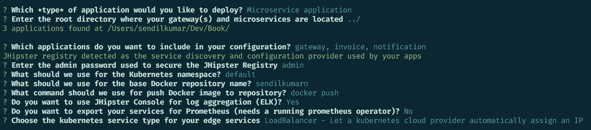

就这些。这将为我们生成必要的配置文件，以便我们使用 Kubernetes 部署应用程序。接下来，我们将检查生成的文件。

# 检查生成的文件

JHipster 生成的文件结构如下。也就是说，每个应用程序都将有自己的文件夹，并且与该服务相关的文件将位于其中。

我们将从网关应用程序开始。将生成三个文件，它们将是`gateway-service`、`gateway-mysql`和`gateway-deployment.yml`文件。

下面的文件是`gateway-service.yml`：

```js
apiVersion: v1
kind: Service
metadata: 
    name: gateway
    namespace: default
    labels:
        app: gateway
spec:
    selector:
        app: gateway
    type: LoadBalancer
ports:
 - name: web
   port: 8080
```

第一行定义了 Kubernetes 的 API 版本，然后是此模板或对象的类型。此模板将包含一个服务。

然后，我们将有元数据信息。Kubernetes 使用这些元数据信息来将某些服务分组在一起。在元数据中，我们可以定义：

+   服务名称

+   它所属的命名空间

+   标签，它们是键值对

然后，我们将定义 spec。在 Kubernetes 对象中的 spec 将提供服务的状态。在 spec 中，我们可以定义所需的副本数量。我们还可以定义选择器，在其中我们可以指定具有标识符的服务。我们还可以指定服务的类型。Kubernetes 将从此 spec 中获取信息，然后维护应用程序在提供的状态（我们稍后将查看 spec 网关），然后是应用程序应该运行的端口。这与 Dockerfile 类似，因此我们正在暴露网关服务的`8080`端口。

然后，我们有`gateway-mysql.yml`文件，其中我们为网关应用程序定义了 MySQL 服务器。这里的区别在于 spec 指向`gateway-mysql`，它在同一文件中定义，并且暴露在端口`3306`上：

```js
apiVersion: v1
kind: Service
metadata:
    name: gateway-mysql
    namespace: default
spec:
    selector:
        app: gateway-mysql
ports:
    - port: 3306
```

在 `gateway-mysql` 应用声明中，我们指定了应用程序运行所需的数据库和环境属性。在这里，`kind` 被提到为 **deployment**。部署对象的工作是改变服务的状态，使其符合部署对象中定义的状态。

在这里，我们定义了 MySQL 服务器的单个副本，然后是规范，其中我们提到了我们需要的 MySQL 版本（容器）。然后是用户名、密码，然后是数据库模式。我们还可以指定卷信息，使用卷挂载进行持久化存储：

注意：我们也可以在规范对象内部定义一个规范（如下面的代码所示）：

```js
apiVersion: extensions/v1beta1
kind: Deployment
metadata:
    ... // metadata
spec:
    replicas: 1
    ... // metadata related information
    spec:
        ... //volumes and other information
        containers:
         - name: mysql
           image: mysql:5.7.20
        env:
            ...  // environment details
        ports:
            ... // port
        volumeMounts:
            ... //Mapping the volume to the external persistent location

```

类似地，我们有一个 `gateway-deployment.yml` 文件，其中我们定义了网关应用程序及其环境属性，以及其他细节，如端口、探针等。

对于发票和通知服务，我们采用了类似的方法。您可以在各自的文件夹中找到它们。

在 `JHipster-registry` 中，除了 `Service` 和 `Deployment` 之外，我们还定义了 Secret 和 StatefulSet。

密钥用于处理密码。它将是一个不透明的类型，密码将以 base64 编码。

然后，我们有 StatefulSet，它们类似于 pod，但具有粘性标识符。Pods 是动态的。这些 pod 有一个在整个过程中保持不变的持久标识符。将注册表服务器定义为 StatefulSet 是有意义的，因为注册表服务器应该通过一个持久的标识符来识别。这使得所有服务都可以连接到该单个端点并获取必要的信息。如果注册表服务器宕机，那么服务之间的通信也会出现问题，因为服务通过注册表服务器连接到其他服务。

有各种选项可以设置控制器，如下所示：

+   **副本集**：在任何时候通过选择器提供 pods 的副本

+   **副本控制器**：提供没有选择器的 pods 的副本

+   **有状态集**：通过提供一个持久的标识符使 pod 唯一

+   **守护进程集**：提供将要运行的 pod 的副本

JHipster 注册表配置在集群中，并具有高可用性。对 JHipster 注册表的 UI 访问也仅限于集群，以增强安全性。

类似地，为 JHipster 控制台生成了配置文件，并将它们放置在控制台文件夹中，该文件夹是 `jhipster-console.yml`，其中也定义了 JHipster 控制台。

JHipster 控制台运行在 ELK 堆栈上，因此我们需要 Elasticsearch，它在 `jhipster-elasticsearch.yml` 文件中定义，然后是 Logstash 在 `jhipster-logstash.yml` 文件中。

# 使用 Kubernetes 将应用程序部署到 Google Cloud

我们使用 `jhipster kubernetes` 命令创建了 Kubernetes 配置文件。下一步是构建工件并将它们部署到 Google Cloud。

Kubernetes 将使用 Docker 仓库中的镜像。我们在生成应用程序时配置了 Docker 用户名，因此第一步将是标记这些镜像，然后将它们推送到我们的 Docker 仓库。

要做到这一点，我们将执行以下操作：

我们将打开终端并转到我们生成的 Kubernetes 文件夹：

```js
> docker image tag gateway sendilkumarn/gateway
```

然后，我们将此镜像推送到 Docker 仓库：

```js
> docker push sendilkumarn/gateway
```

注意：在推送镜像之前，您必须登录到 Docker Hub。您可以使用 `docker login` 命令，后跟您的用户名和密码登录 Docker。如果您没有账户，您可以在以下链接创建一个：[`cloud.docker.com/`](https://cloud.docker.com/)。

类似地，将发票应用程序推送到 Docker 仓库：

```js
> docker image tag invoice sendilkumarn/invoice
> docker push sendilkumarn/invoice
```

对通知也进行相同的操作：

```js
> docker image tag notification sendilkumarn/notification
> docker push sendilkumarn/notification
```

这将推送网关、发票和通知到 Docker 仓库。我们可以在 Docker 控制台中检查这一点：

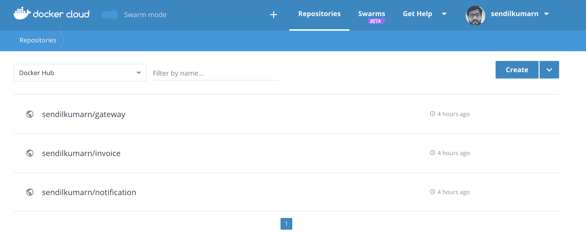

现在，我们可以连接到 gcloud 并使用 Kubernetes 部署我们的容器。

这假设您已经在您的机器上设置了 gcloud SDK 和 kubectl。

首先，我们将通过终端登录到 gcloud。为了做到这一点，打开您的终端：

```js
> gcloud init  // if this is the first time you are using gcloud (Ignore this step if you logged in already)
```

然后，gcloud 将要求您登录到您的 Google 账户。一旦验证，这将列出您可能已经拥有的项目。

在这里，我们可以通过在创建新项目前输入数字来选择 [31] 创建新项目。然后按回车键。系统将要求您输入项目信息，然后为该项目配置一些 Google 服务。然后，gcloud 将列出所有可用的区域，您可以选择一个适合您的区域。

如果您已经登录到控制台并用于其他项目，则可以使用以下命令切换项目：

```js
> gcloud config set project <project-name>
```

这将设置项目、区域和选择的设置作为默认值。

然后，您必须在我们的应用程序中启用 Kubernetes。我们可以通过浏览器登录到我们的 Google Cloud 控制台来完成此操作。然后，选择我们刚刚创建的项目，并转到 [`console.cloud.google.com/kubernetes/list`](https://console.cloud.google.com/kubernetes/list)。

这将为您的项目创建一个集群。相反，您可以使用 `gcloud` 命令创建一个集群：

```js
> gcloud container clusters create online-store
```

以下是在先前的命令输出：

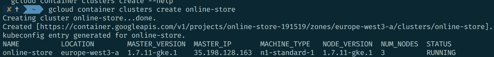

因此，集群已使用 3 个节点创建。

然后，我们可以进入我们的 Kubernetes 文件夹，并使用 kubectl 开始部署服务：

```js
> kubectl apply -f <project-name>
```

输出将如下所示：

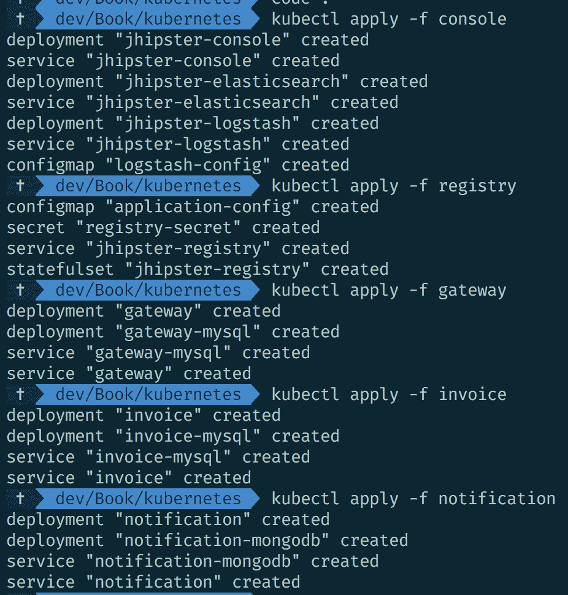

这将在 Google Cloud 环境中创建所有应用程序，位于您的项目下。

您可以使用以下命令检查 `pods` 部署过程：

```js
> kubectl get pods --watch
```

这将列出正在启动和关闭的 `pods`：

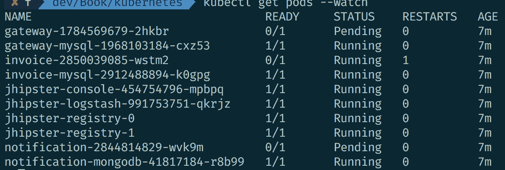

您还可以使用以下命令获取应用程序的日志：

```js
> kubectl logs <name as shown above>
```

以下是其输出：

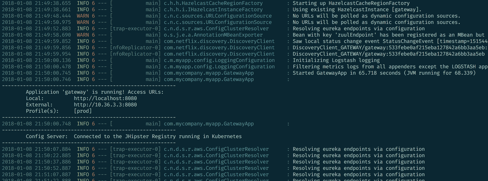

你可以使用以下代码片段获取应用程序的外部 IP：

```js
 > kubectl get svc gateway
```

这将列出应用程序的名称、类型、IP 地址、外部地址、端口和运行时间：

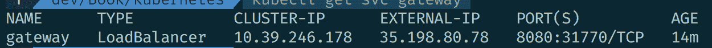

我们可以在 Google Cloud 控制台中找到相同的信息：

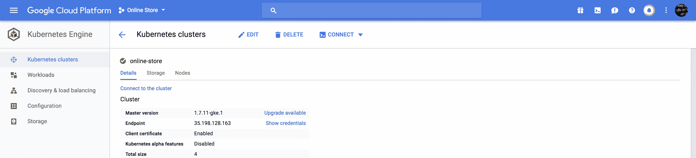

应用程序可以通过前面的外部 IP 访问：

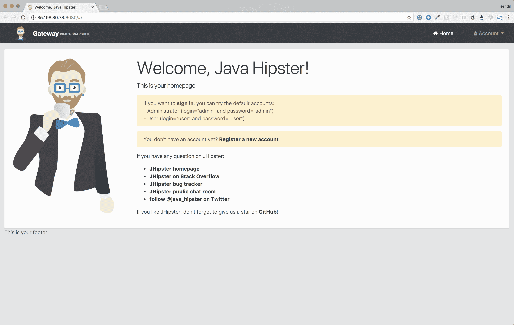

你也可以使用以下命令来扩展应用程序：

```js
> kubectl scale deployment <app-name> --replicas <number-of-replicas>
```

JHipster-registry 以无头模式部署。为了检查 JHipster 注册表，我们可以使用以下命令显式暴露服务——`**kubectl expose service jhipster-registry --type=NodePort --name=exposed-registry**`——然后我们可以通过`exposed-registry`访问应用程序。

# 摘要

在微服务环境中，编排你的容器是最难执行的任务。Kubernetes 作为一个容器编排器，在解决这一问题上脱颖而出。我们已经看到了如何使用 JHipster 生成 Kubernetes 的配置文件，随后将应用程序部署到 Google Cloud。

到目前为止，我们已经看到了如何使用 JHipster 开发和部署电子商务应用程序。我们从单体应用开始，并成功将其扩展到微服务架构，这一切都得益于 JHipster 及其支持的各项工具和技术。随着本章的结束，我们希望你在跟随它的过程中有一个愉快的体验。

在下一章中，我们将看到如何进一步使用 JHipster 创建一个具有 React 客户端应用程序的应用程序，所以请保持关注。
