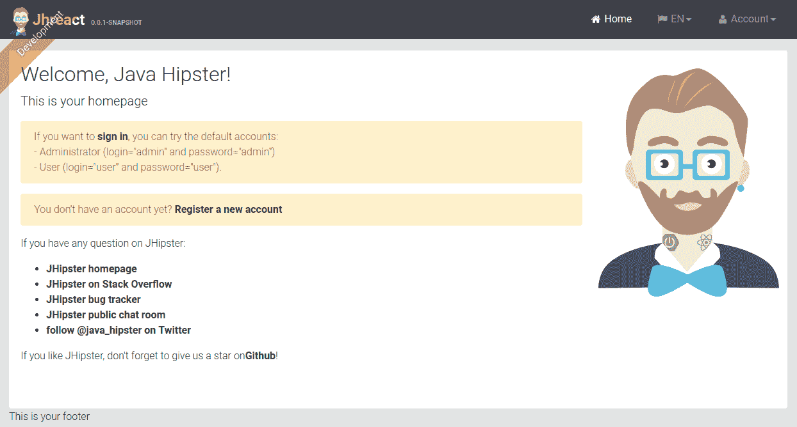
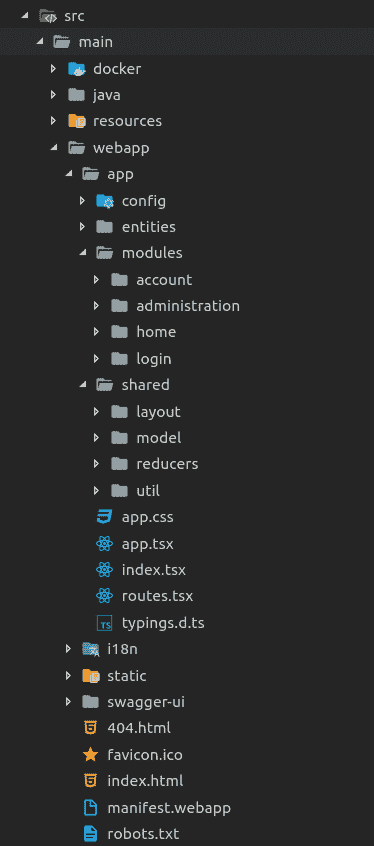
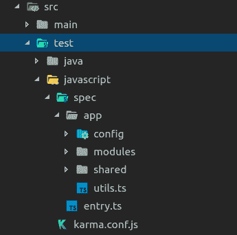
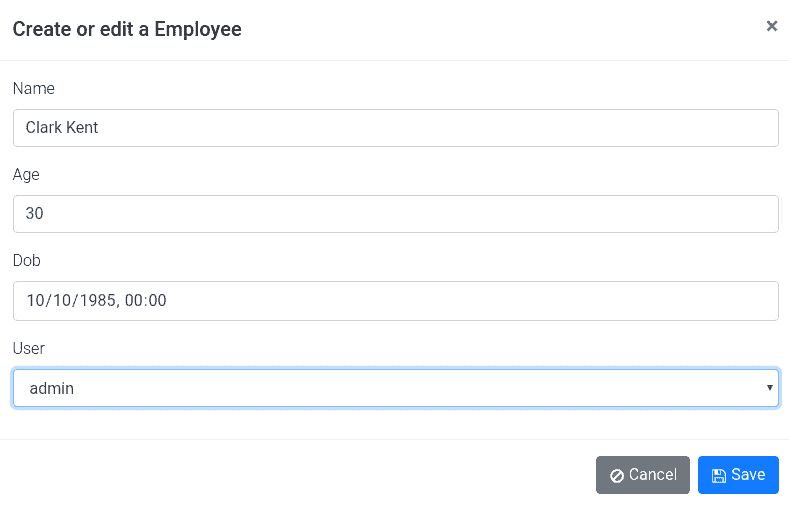
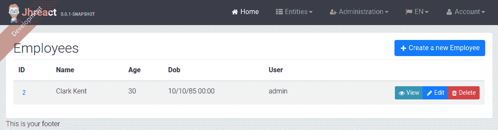
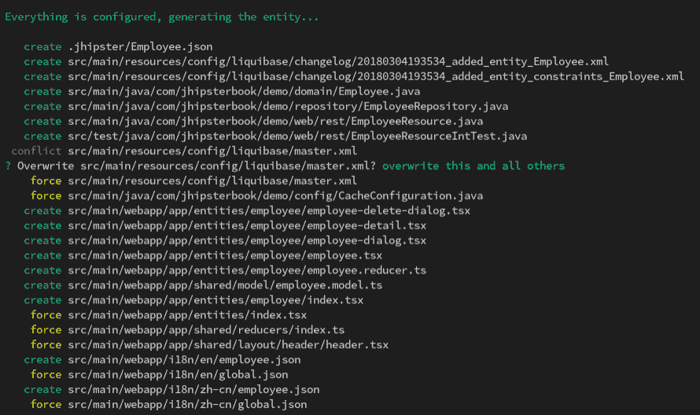

# 使用 React 进行客户端开发

到目前为止，我们已经看到了如何使用 Angular 作为客户端框架构建 Web 应用程序和微服务。AngularJS 是最流行的客户端框架，直到新版本的 Angular 2 发布。由于 Angular 2 的向后不兼容架构，它导致了重大的颠覆，并让更多的人转向 React。因此，潮流已经转变，现在 React 是最受欢迎和最被寻求的客户端框架，其次是 Angular。JHipster 从 4.11 版本开始添加了对 React 的实验性支持，并且随着 JHipster 版本 5.0 的发布；React 支持将成为 BETA 并准备好用于主流使用。

在本章中，我们将涵盖以下主题：

+   使用 React 客户端生成应用程序

+   技术栈和源代码

+   使用 React 客户端生成实体

# 使用 React 客户端生成应用程序

让我们直接深入创建一个 JHipster React 应用程序。您需要打开一个终端来运行命令：

1.  创建一个新的文件夹，并通过运行 `mkdir jhipster-react && cd jhipster-react` 来导航到它。

1.  现在在终端中运行 `jhipster` 命令。如果您正在运行 JHipster 4.x 版本而不是 5.x，那么您需要通过运行 `jhipster --experimental` 来传递实验性标志。

1.  JHipster 将从提示开始；让我们为所有问题选择默认选项，除了询问您想为客户端使用哪个 *框架* 的问题。对于这个问题，请选择 **[BETA] React** 并继续。

1.  一旦完成所有提示，JHipster 将生成应用程序并开始安装依赖项，在格式化代码之前使用 Prettier ([`prettier.io/`](https://prettier.io/)) 并启动 webpack 构建。

您可以随时运行 `yarn prettier:format` 来格式化客户端代码。每当您使用 git 预提交钩子提交某些内容时，它也会自动运行。

我们选择的选择将如下所示：

```js
? Which *type* of application would you like to create? Monolithic application (recommended for simple projects)
? What is the base name of your application? jhreact
? What is your default Java package name? com.jhipsterbook.demo
? Do you want to use the JHipster Registry to configure, monitor and scale your application? No
? Which *type* of authentication would you like to use? JWT authentication (stateless, with a token)
? Which *type* of database would you like to use? SQL (H2, MySQL, MariaDB, PostgreSQL, Oracle, MSSQL)
? Which *production* database would you like to use? MySQL
? Which *development* database would you like to use? H2 with disk-based persistence
? Do you want to use the Spring cache abstraction? Yes, with the Ehcache implementation (local cache, for a single node)
? Do you want to use Hibernate 2nd level cache? Yes
? Would you like to use Maven or Gradle for building the backend? Maven
? Which other technologies would you like to use? 
? Which *Framework* would you like to use for the client? [BETA] React
? Would you like to enable *SASS* support using the LibSass stylesheet preprocessor? No
? Would you like to enable internationalization support? Yes
? Please choose the native language of the application English
? Please choose additional languages to install Chinese (Simplified)
? Besides JUnit and Karma, which testing frameworks would you like to use? 
? Would you like to install other generators from the JHipster Marketplace? No
```

就这样；我们完成了。我们的第一个 JHipster React 应用程序已成功创建。现在让我们启动应用程序来探索一下。

我们将选择默认的 Maven 构建选项，JHipster 已经为它创建了一个包装器，所以让我们通过在终端中运行 `./mvnw` 来启动我们的服务器。

Maven 将下载必要的依赖项，并使用嵌入的 Undertow 容器启动 Spring Boot 应用程序。如果您更喜欢 Gradle，可以选择 Maven。一旦应用程序成功启动，我们将在控制台中看到以下内容：

```js
2018-03-04 16:37:48.096 INFO 4730 --- [ restartedMain] com.jhipsterbook.demo.JhreactApp : 
----------------------------------------------------------
 Application 'jhreact' is running! Access URLs:
 Local: http://localhost:8080
 External: http://192.168.2.7:8080
 Profile(s): [swagger, dev]
----------------------------------------------------------
```

在您最喜欢的浏览器中访问 URL (`http://localhost:8080`) 以查看应用程序的实际运行情况：



您将看到主屏幕，上面有一个看起来回头的嬉皮士。注意他脖子上的 React 纹身。

使用默认的管理员用户登录并探索一下。

应用程序看起来与之前构建的 Angular 应用程序完全相同，当然，除了图像之外，并且拥有所有相同的账户和管理模块。这将使我们对查看技术栈和源代码更有兴趣。

# 技术栈和源代码

在我们深入研究生成的代码之前，让我们谈谈技术栈。我们已经在 第二章 中了解了 React，即 *使用 JHipster 入门*，但让我们回顾一下。

React 是由 Jordan Walke 在 2011 年创建的一个视图渲染库，并于 2013 年 5 月开源。它由 Facebook 维护并拥有庞大的社区支持。React 遵循 JS 对 HTML 的方法，其中标记代码使用 JavaScript 编写。为了减少冗余，React 使用一种名为 JSX 的 JavaScript 语法糖来描述视图元素。它看起来类似于 HTML，但它并不完全等同于 HTML，例如，一些标准 HTML 属性，如 class，被重命名为 className，并且属性名称使用驼峰式而不是破折号式。

例如，以下是一个 JSX 片段。您始终需要在 JSX 中使用 React 上下文才能使其工作：

```js
const element = <div><strong>Hello there</strong></div>
```

当涉及到 TypeScript 时，JSX 扩展变为 TSX。

React 使用一个名为虚拟 DOM 的概念来提高渲染效率。虚拟 DOM 是实际 DOM 的轻量级副本，通过比较更新后的虚拟 DOM 与更新前的虚拟 DOM 快照，React 可以决定确切发生了什么变化，并仅在实际 DOM 上渲染这些变化，从而使得渲染周期高效且快速。

React 组件可以有自己的状态，并且您可以向组件传递属性，这些属性作为 props 可用给组件。

与 Angular 不同，React 不是一个完整的 MVVM 框架。它只是一个视图渲染库，因此当构建 React 应用程序时，我们总是需要添加一些额外的库来处理状态管理、路由等。

# 技术栈

以下是在选择 React 作为客户端框架时，JHipster 使用的技术栈：

+   **渲染**: 使用 TypeScript 编写的 React

+   **状态管理**: Redux + React Redux + Redux Promise Middleware + Redux Thunk

+   **路由**: React router

+   **HTTP**: Axios

+   **响应式设计**: Bootstrap 4 + Reactstrap

+   **代码检查**: Tslint

+   **工具库**: Lodash

+   **单元测试**: Karma + Mocha + Chai + Enzyme

+   **构建**: Webpack

让我们来看看这个技术栈中的一些最重要的组件。

# 使用 TypeScript

客户端使用 React 构建，但不是使用传统的 JavaScript ES6，而是选择 TypeScript 作为编程语言。这为您提供了使用一些可能已经熟悉的从服务器端背景出发的概念的灵活性。它还提供了静态类型检查，这使得开发更加高效且错误率更低。

访问 [`github.com/piotrwitek/react-redux-typescript-guide`](https://github.com/piotrwitek/react-redux-typescript-guide) 了解如何充分利用 TypeScript + React。

# 使用 Redux 及其相关工具进行状态管理

React 在 React 组件内提供了基本的州管理，但有时这并不足够，尤其是当您的应用程序需要在多个组件之间共享状态时。在 React 世界中，像 Flux、Redux 和 MobX 这样的状态管理解决方案非常流行，JHipster 使用 Redux 作为状态管理层。

你应该在何时使用 React 组件状态？

+   **如果变量总是可以通过属性计算得出**：不要使用组件状态，在渲染期间计算变量

+   **如果变量不在渲染中使用但用于存储数据**：不要使用组件状态，使用私有类字段

+   **如果变量是从 API 获取且需要被多个组件使用**：不要使用组件状态，使用 Redux 全局状态并将变量作为属性传递

Redux ([`redux.js.org/`](https://redux.js.org/)) 是 JavaScript 的一个可预测的状态管理解决方案，它源自 Flux 概念 ([`facebook.github.io/flux/`](https://facebook.github.io/flux/))。Redux 提供了一个全局不可变存储，只能通过发出或分发动作来更新。一个动作是一个对象，它描述了发生了什么变化，并使用一个纯函数来转换状态。一个 reducer 是一个纯函数，它接受当前状态和动作，并返回一个新的状态。

React Redux 是 Redux 的一个绑定，它为 React 提供了一个名为 `connect` 的高阶组件，用于将 React 组件连接到 Redux 存储。以 `src/main/webapp/app/modules/home/home.tsx` 为例：

```js
export class Home extends React.Component<IHomeProp, IHomeState> {
  ...
}

const mapStateToProps = storeState => ({
  account: storeState.authentication.account,
  isAuthenticated: storeState.authentication.isAuthenticated
});
const mapDispatchToProps = { getSession };

export default connect(mapStateToProps, mapDispatchToProps)(Home);
```

`mapStateToProps` 函数用于将全局 Redux 存储中的属性映射到组件属性。`mapDispatchToProps` 函数用于将给定的函数包装在 Redux 的 dispatch 调用中。

Redux Promise Middleware ([`github.com/pburtchaell/redux-promise-middleware`](https://github.com/pburtchaell/redux-promise-middleware)) 用于处理异步动作负载。它接受一个 Promise，并根据 Promise 的状态分发挂起、已解决和拒绝的动作。当 Redux 动作进行 HTTP 请求或执行异步操作时，它非常有用。

Redux Thunk ([`github.com/gaearon/redux-thunk`](https://github.com/gaearon/redux-thunk)) 是另一种用于链式操作的中间件。当动作需要根据某些条件调用另一个动作或通常处理副作用时，它非常有用。

# 使用 React Router 进行路由

React Router ([`reacttraining.com/react-router/web/guides/philosophy`](https://reacttraining.com/react-router/web/guides/philosophy)) 用于客户端路由。JHipster 的默认设置是使用基于 Hash History 的路由。它提供了一个简单的基于组件的路由，以及一个灵活的 API，用于高级路由设置。路由可以在应用程序的任何位置定义，与正常的 React 渲染代码并列。JHipster 提供了一些自定义包装器，例如 `PrivateRoute`，以启用基于授权的路由。

例如，让我们看看 `src/main/webapp/app/routes.tsx`：

```js
const Routes = () => (
  <div className="view-routes">
    <Route exact path="/" component={Home} />
    <Route path="/login" component={Login} />
    <Route path="/logout" component={Logout} />
    <Route path="/register" component={Register} />
    <Route path="/activate/:key?" component={Activate} />
    <Route path="/reset/request" component={PasswordResetInit} />
    <Route path="/reset/finish/:key?" component={PasswordResetFinish} />
    <PrivateRoute path="/admin" component={Admin} />
    <PrivateRoute path="/account" component={Account} />
    <Route path="**" component={Entities} />
  </div>
);

export default Routes;
```

# 使用 Axios 进行 HTTP 请求

Axios ([`github.com/axios/axios`](https://github.com/axios/axios)) 是一个基于 Promise 的 HTTP 客户端。它是一个功能强大且灵活的库，具有非常直观的 API。它用于从 Redux 动作中获取 JHipster 应用程序的服务器端 REST 端点数据。结果 Promise 由 Redux Promise 中间件解析，以提供数据给 reducer。

以下展示了一个带有异步负载的 Redux 动作：

```js
export const getRoles = () => ({
  type: ACTION_TYPES.FETCH_ROLES,
  payload: axios.get(`${apiUrl}/authorities`)
});
```

# 使用 Reactstrap 的 Bootstrap 组件

JHipster 使用 Bootstrap 4 作为其 UI 框架，由于我们正在构建一个 React 应用程序，因此使用原生 React 绑定而不是 Bootstrap 的基于 jQuery 的组件是有意义的。Reactstrap ([`reactstrap.github.io/`](https://reactstrap.github.io/)) 为 Bootstrap 4 提供了纯 React 组件。我们还使用了 Availity reactstrap Validation ([`availity.github.io/availity-reactstrap-validation/`](https://availity.github.io/availity-reactstrap-validation/)) 库，该库为 Reactstrap 表单元素提供表单验证支持。

例如，让我们看看 `src/main/webapp/app/modules/login/login-modal.tsx`：

```js
<Modal isOpen={this.props.showModal} toggle={handleClose} backdrop="static" id="login-page">
  <AvForm onSubmit={this.handleSubmit}>
    <ModalHeader toggle={handleClose} id="login-title">
      ...
    </ModalHeader>
    <ModalBody>
      <div className="row">
        ...
        <div className="col-md-12">
          <AvField
            name="username"
            label={...}
            placeholder={...}
            required
            errorMessage="Username cannot be empty!"
          />
          ...
        </div>
      </div>
      <Alert color="warning">
        ...
      </Alert>
      ...
    </ModalBody>
    <ModalFooter>
      ...
    </ModalFooter>
  </AvForm>
</Modal>
```

# 单元测试设置

JHipster 使用 Karma、Mocha、Chai 和 Enzyme 的组合来对客户端组件进行单元测试。

Karma ([`karma-runner.github.io/2.0/index.html`](https://karma-runner.github.io/2.0/index.html)) 被用作测试运行器，Mocha ([`mochajs.org/`](https://mochajs.org/)) 被用作测试框架。Chai ([`chaijs.com/`](http://chaijs.com/)) 是一个具有出色插件支持的断言库。我们使用其 BDD（行为驱动开发）风格的断言。Enzyme ([`airbnb.io/enzyme/`](http://airbnb.io/enzyme/)) 是一个用于 React 的测试实用工具，它使得对 React 组件进行单元测试变得容易。结合使用，这些库为 React 提供了一个丰富且直观的测试环境。

让我们运行生成的单元测试。在终端中运行 `yarn test`。

# 生成源代码

让我们看看生成的代码。由于我们已经在之前的章节中看到了服务器端代码，所以我们在这里只看客户端代码：



结构与我们之前看到的 Angular 非常相似，但 React 代码的组织方式略有不同。我们只关注 `src/main/webapp/app` 内部的代码，因为其他所有内容都与我们在 Angular 应用程序中看到的一模一样。

让我们看看代码的一些重要部分：

+   `index.tsx`：这是我们的应用程序入口点。这是我们将 React 引导到 `root div` 并初始化 Redux 存储的地方：

```js
...
const devTools = process.env.NODE_ENV === 'development' ? <DevTools /> : null;
const store = initStore();
registerLocales(store);

const actions = bindActionCreators({ clearAuthentication }, store.dispatch);
setupAxiosInterceptors(
  () => actions.clearAuthentication('login.error.unauthorized')
);

const rootEl = document.getElementById('root');
const render = Component =>
  ReactDOM.render(
    <AppContainer>
      <Provider store={store}>
        <div>
          ...
          {devTools}
          <Component />
        </div>
      </Provider>
    </AppContainer>,
    rootEl
  );

render(AppComponent);
...
```

+   `app.tsx`：这是我们的主要应用程序组件。我们在这里声明 React 路由和主要应用程序 UI 结构：

```js
...
export class App extends React.Component<IAppProps> {
  componentDidMount() {
    this.props.getSession();
  }

  handleLogout = () => {
    this.props.logout();
  };

  render() {
    const paddingTop = '60px';
    return (
      <Router>
        <div className="app-container" style={{ paddingTop }}>
          <Header
            ...
          />
          <div className="container-fluid view-container" id="app-view-container">
            <Card className="jh-card">
              <AppRoutes />
            </Card>
            <Footer />
          </div>
          <ModalContainer />
        </div>
      </Router>
    );
  }
}
...
```

+   `routes.tsx`：应用程序的主要父级路由在这里定义，并且它们从这里导入 `app.tsx`。

+   `config`：这是进行框架级配置的地方：

    +   `axios-interceptor.ts`：在这里配置 HTTP 拦截器。这是将 JWT 令牌设置到请求中并处理错误的地方。

    +   `constants.ts`：应用程序常量。

    +   `*-middleware.ts`：在这里配置 Redux 的错误、通知和日志中间件。

    +   `store.ts`：在这里完成 Redux 存储配置。中间件在此阶段注册。

中间件在数组中的顺序很重要，因为它们就像一个管道，将动作从一个中间件传递到另一个中间件，如下所示：

```js
const defaultMiddlewares = [
  thunkMiddleware,
  errorMiddleware,
  notificationMiddleware,
  promiseMiddleware(),
  loadingBarMiddleware(),
  loggerMiddleware
];
```

+   +   `translation.ts`：在这里完成 i18n 相关的配置。

+   `entities`：实体模块在这里。

+   `modules`：应用程序 UI 模块在这里：

    +   `account`：账户页面，如设置、密码重置等在这里

    +   `administration`：如度量、健康、用户管理等管理屏幕在这里

    +   `home`：应用程序的主屏幕

    +   `login`：登录和注销组件

+   `shared`：共享组件和减法器：

    +   `layout`：与头部、尾部等相关布局组件。

    +   `model`：实体的 TypeScript 模型。

    +   `reducers`：应用程序使用的共享减法器：

        +   `authentication.ts`：这是与身份验证相关的动作和减法器。让我们使用 `LOGIN` 动作。该动作接受用户名、密码和 rememberMe，并通过对 HTTP 调用的异步有效载荷执行 `ACTION_TYPES.LOGIN` 来验证我们的凭据。我们使用 ES7 的 **async/await** 功能来避免这里的复杂回调。从我们提取 JWT `bearerToken` 并根据传递的 remember me 设置将其存储在浏览器的本地或会话存储中的结果，是从我们触发基于承诺状态的 `ACTION_TYPES.LOGIN` 的减法器中获得的。`ACTION_TYPES.LOGIN` 的分发将根据承诺的状态触发减法器中的适当情况：

```js
...

export const ACTION_TYPES = {
  LOGIN: 'authentication/LOGIN',
  ...
};

const initialState = {
  ...
};

// Reducer
export default (state = initialState, action) => {
  switch (action.type) {
    case REQUEST(ACTION_TYPES.LOGIN):
    case REQUEST(ACTION_TYPES.GET_SESSION):
      return {
        ...state,
        loading: true
      };
    case FAILURE(ACTION_TYPES.LOGIN):
      return {
        ...initialState,
        errorMessage: action.payload,
        showModalLogin: true,
        loginError: true
      };
    ...
    case SUCCESS(ACTION_TYPES.LOGIN):
      return {
        ...state,
        loading: false,
        loginError: false,
        showModalLogin: false,
        loginSuccess: true
      };
    ...
    default:
      return state;
  }
};
...
export const login = 
  (username, password, rememberMe = false) => async (dispatch, getState) => {
  const result = await dispatch({
    type: ACTION_TYPES.LOGIN,
    payload: axios.post('/api/authenticate', { username, password, rememberMe })
  });
  const bearerToken = result.value.headers.authorization;
  if (bearerToken && bearerToken.slice(0, 7) === 'Bearer ') {
    const jwt = bearerToken.slice(7, bearerToken.length);
    if (rememberMe) {
      Storage.local.set('jhi-authenticationToken', jwt);
    } else {
      Storage.session.set('jhi-authenticationToken', jwt);
    }
  }
  dispatch(getSession());
};
...
```

+   +   `util`：实用函数。

单元测试代码的文件夹结构也非常相似：



# 使用 React 客户端生成实体

让我们看看如何使用 JHipster 实体生成器以及 React 客户端创建一个实体。我们将创建一个简单的 Employee 实体，包含姓名、年龄和出生日期字段：

1.  打开终端并导航到 React 应用程序的文件夹，然后运行 `jhipster entity employee`。

1.  逐个创建字段，对于问题“是否要为实体添加字段？”选择“是”，并开始填写下一个问题的字段名称，“你的字段名称是什么？”

1.  对于下一个问题，“你的字段类型是什么？”选择 String。

1.  对于问题“你想要添加哪些验证规则？”选择名称字段的“必需”，然后继续。

1.  继续处理以下字段。`age` 和 `dob` 的类型为 Integer，`dob` 的类型为 Instant。

1.  当再次被问及时，选择“否”，即是否要为实体添加字段。

1.  对于下一个问题，“是否要为另一个实体添加关系？”，选择“是”。

1.  将 `user` 作为其他实体的名称以及关系的名称，用于以下问题。

1.  对于下一个问题，“关系的类型是什么？”让我们创建一个与用户的一对一关系。

1.  对于下一个问题选择“否”，当被要求添加另一个关系时再次选择“否”。

1.  对于以下问题，选择默认选项并继续。

命令将产生以下控制台输出：

```js
Using JHipster version installed globally
Executing jhipster:entity employee
Options:

The entity employee is being created.

...

================= Employee =================
Fields
name (String) required
age (Integer)
dob (Instant)

Relationships
user (User) one-to-one

? Do you want to use separate service class for your business logic? No, the REST controller should use the repository directly
? Do you want pagination on your entity? No
```

JHipster 将生成实体并运行 Prettier 和 webpack 构建。

1.  如果你的服务器没有运行，请在终端中通过运行 `./mvnw` 启动它。如果它已经运行，那么只需通过运行 `./mvnw compile` 编译新代码，Spring DevTools 将自动重启应用程序。

1.  在另一个终端中通过运行 `yarn start` 启动 BrowserSync 并检查我们刚刚创建的员工实体：



1.  创建一个实体以检查一切是否正常工作：



对于我们创建的实体，JHipster 生成了/更新了以下文件：



在 React 客户端，我们有以下文件：

```js
   src/main/webapp/app/entities/employee/employee-delete-dialog.tsx
   src/main/webapp/app/entities/employee/employee-detail.tsx
   src/main/webapp/app/entities/employee/employee-dialog.tsx
   src/main/webapp/app/entities/employee/employee.tsx
   src/main/webapp/app/entities/employee/employee.reducer.ts
   src/main/webapp/app/shared/model/employee.model.ts
   src/main/webapp/app/entities/employee/index.tsx
```

`index.ts` 文件声明了实体的路由：

```js
    <Switch>
      <Route exact path={match.url} component={Employee} />
      <ModalRoute exact parentPath={match.url} path={`${match.url}/new`} 
        component={EmployeeDialog} />
      <ModalRoute exact parentPath={match.url} path={`${match.url}/:id/delete`} 
        component={EmployeeDeleteDialog} />
      <ModalRoute exact parentPath={match.url} path={`${match.url}/:id/edit`} 
        component={EmployeeDialog} />
      <Route exact path={`${match.url}/:id`} component={EmployeeDetail} />
    </Switch>
```

`employee.reducer.ts` 声明了实体的动作和 reducer，例如，让我们使用动作和 reducer 来创建实体。`createEntity` 动作通过带有 HTTP 有效载荷和通知元数据的 `ACTION_TYPES.CREATE_EMPLOYEE` 分发。一旦 HTTP 请求解决，我们分发 `getEntities` 动作以获取更新的实体列表。

Reducer 对于创建和更新动作是通用的。让我们看看创建动作和 reducer：

```js
...
export const ACTION_TYPES = {
  ...
  CREATE_EMPLOYEE: 'employee/CREATE_EMPLOYEE',
  ...
};

const initialState = {
  ...
};

// Reducer
export default (state = initialState, action) => {
  switch (action.type) {
    ...
    case REQUEST(ACTION_TYPES.CREATE_EMPLOYEE):
    ...
      return {
        ...
      };
    ...
    case FAILURE(ACTION_TYPES.CREATE_EMPLOYEE):
    ...
      return {
        ...
      };
    ...
    case SUCCESS(ACTION_TYPES.CREATE_EMPLOYEE):
    case SUCCESS(ACTION_TYPES.UPDATE_EMPLOYEE):
      return {
        ...
      };
    ...
    default:
      return state;
  }
};

const apiUrl = SERVER_API_URL + '/api/employees';
...

export const createEntity: ICrudPutAction = entity => async dispatch => {
  const result = await dispatch({
    type: ACTION_TYPES.CREATE_EMPLOYEE,
    meta: {
      successMessage: messages.DATA_CREATE_SUCCESS_ALERT,
      errorMessage: messages.DATA_UPDATE_ERROR_ALERT
    },
    payload: axios.post(apiUrl, entity)
  });
  dispatch(getEntities());
  return result;
};
...
```

`employee.tsx`、`employee-dialog.tsx`、`employee-detail.tsx` 和 `employee-delete-dialog.tsx` 分别声明了实体列表、实体模型对话框、实体详情和实体删除对话框。以 `employee.tsx` 为例，我们使用 TypeScript 接口 `IEmployeeProps` 定义了 props 的类型，并将其作为 `React.Component` 类型的泛型传递。我们使用 `componentDidMount` 生命周期方法在组件挂载时触发获取实体和用户的动作。渲染方法返回 UI 的 JSX。

该组件通过高阶组件连接到 Redux 存储。让我们看一下：

```js
...
export interface IEmployeeProps {
  getEntities: ICrudGetAllAction;
  employees: any[];
  getusers: ICrudGetAllAction;
  match: any;
}

export class Employee extends React.Component<IEmployeeProps> {
  componentDidMount() {
    this.props.getEntities();
    this.props.getusers();
  }

  render() {
    ...
  }
}

const mapStateToProps = storeState => ({
  employees: storeState.employee.entities
});

const mapDispatchToProps = { getusers, getEntities };

export default connect(mapStateToProps, mapDispatchToProps)(Employee);
```

其他组件也遵循类似的方法。与 Angular 相比，React 代码在编码上具有更少的样板代码，并且更加简洁。

# 摘要

在本章中，我们学习了关于 React、Redux 以及 React 生态系统上其他库的一般概念。我们还学习了如何使用 JHipster 创建 React 应用程序以及为其生成的实体。我们看到了如何利用 TypeScript 与 React 一起使用，并浏览了生成的代码。我们还运行并测试了我们创建的应用程序。在下一章中，我们将通过 JHipster 社区的最佳实践和下一步如何利用你迄今为止所学的内容来结束本书。
