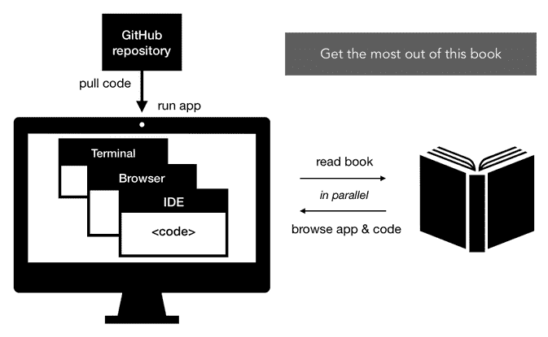
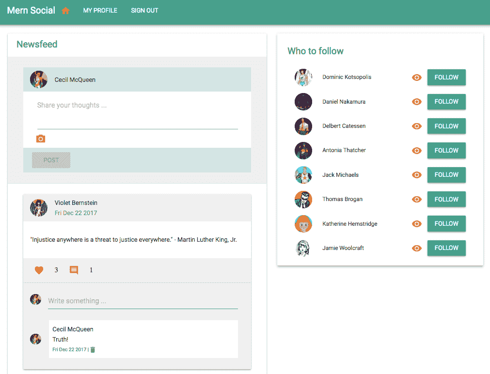
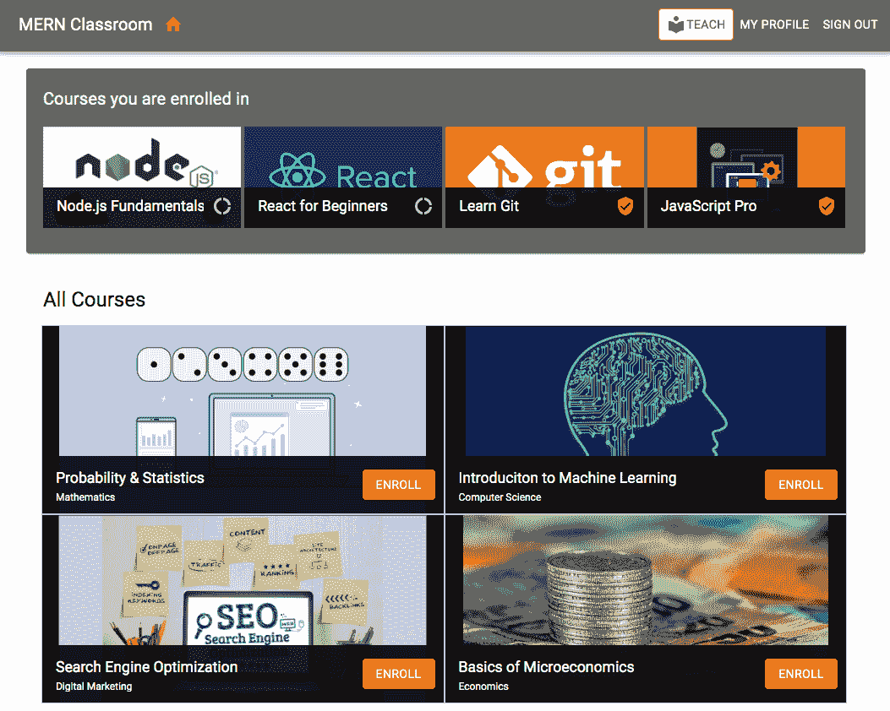
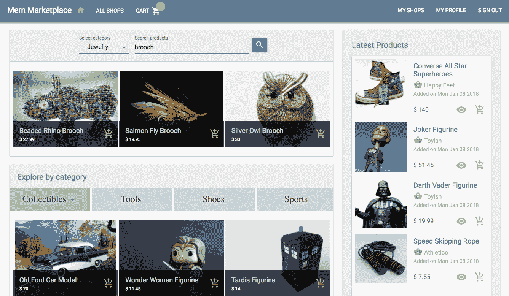
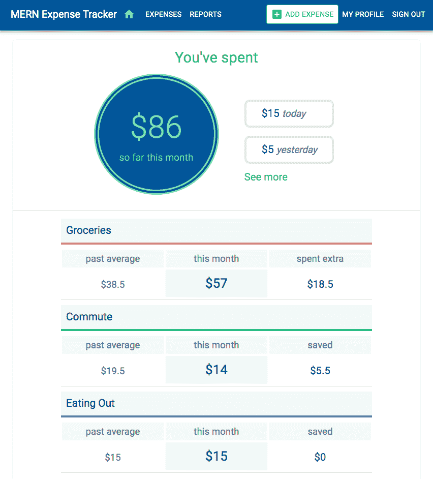
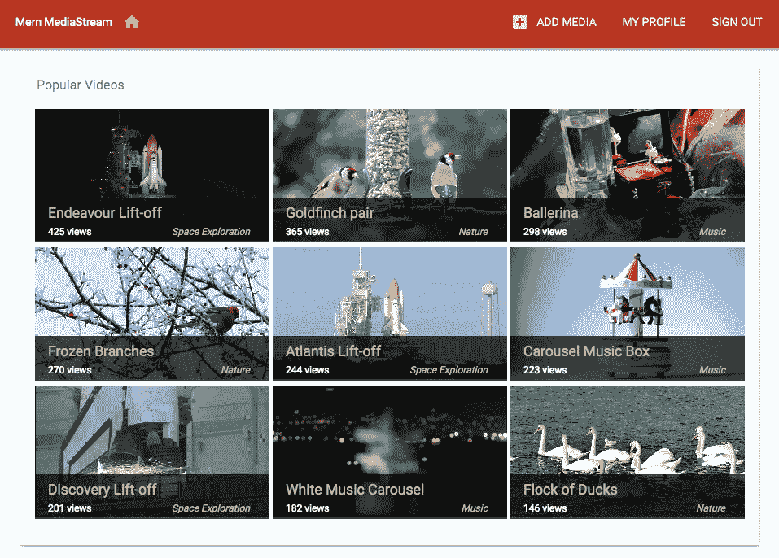
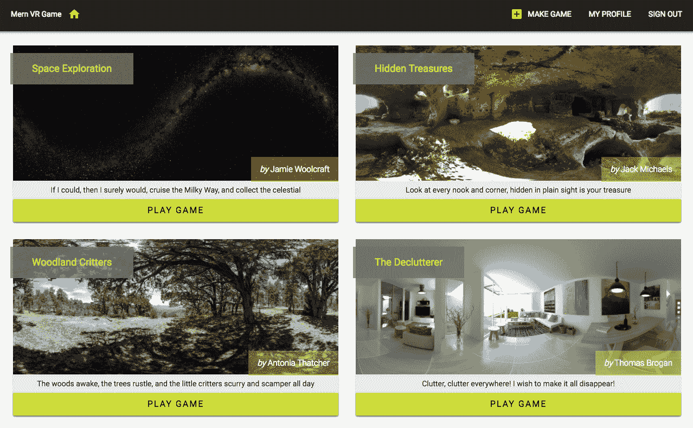

# 使用 MERN 激活 React 应用程序

React 可能已经为前端网络开发开辟了新的领域，并改变了我们编写 JavaScript 用户界面的方式，但我们需要一个坚实的后端来构建完整的网络应用程序。虽然在选择后端技术时有很多选择，但使用全 JavaScript 栈的好处和吸引力是无可否认的，尤其是在有像 Node、Express 和 MongoDB 这样强大且广泛采用的后端技术时。将 React 的潜力与这些经过行业检验的服务端技术相结合，在开发实际网络应用程序时创造了多样化的可能性。本书将引导您通过设置基于 **MERN**（即 **MongoDB, Express.js, React, 和 Node.js**）的 Web 开发，到构建不同复杂度的实际网络应用程序。

在深入开发这些网络应用程序之前，我们将在本章中回答以下问题，以便您能够有效地使用这本书来获取全栈开发技能，并了解选择 MERN 栈构建应用程序背后的背景：

+   第二版有哪些新内容？

+   这本书是如何组织来帮助掌握 MERN 的？

+   MERN 栈是什么？

+   为什么 MERN 在今天仍然相关？

+   在什么情况下 MERN 是开发网络应用程序的好选择？

# 第二版有哪些新内容？

MERN 栈技术以及整个全栈开发生态系统正在随着行业采用和使用的增加而持续增长和改进。在本版中，我们考虑了这些新发展，并更新了第一版中的所有应用程序和相应的代码库。

我们使用每个技术、库和模块的最新版本和约定，这些技术、库和模块对于开发相关的设置和功能实现都是必需的。此外，我们还强调了使用这些技术升级中的新功能，例如 React Hooks 和 JavaScript 中的 async/await。

为了展示 MERN 栈更多的可能性，我们更新了现有的市场应用程序，添加了更高级的功能，例如实时竞标。我们还添加了两个新项目，一个基于网络的教室应用程序和一个具有数据可视化功能的支出跟踪应用程序。

为了更好地理解本书涵盖的内容和概念，我们扩展了解释并提供了一些最新资源的线索，这些资源可能有助于您更深入地掌握并提高您的学习体验。

除了涵盖 MERN 技术的最新更新并提供详细的解释外，本书中的概念和项目组织旨在帮助您从简单到高级主题灵活学习。在下一节中，我们将讨论本书的结构以及您如何根据自己的偏好和经验水平来利用它。

# 书的结构

本书旨在帮助那些对 MERN 堆栈有一定经验或无经验的 JavaScript 开发者设置并开始开发不同复杂度的 Web 应用程序。它包括构建和运行不同应用程序的指南，辅以代码片段和关键概念的说明。

本书分为五个部分，从基础知识到高级主题逐步深入，带您从零开始构建 MERN，然后使用它开发具有简单到复杂功能的不同应用程序，同时展示如何根据应用程序的需求扩展 MERN 堆栈的功能。

# 开始使用 MERN

第一章，*利用 MERN 解放 React 应用程序*，以及 第二章，*准备开发环境*，为在 MERN 堆栈中开发 Web 应用程序设定了背景，并指导您设置开发环境。

# 从零开始构建 MERN 应用程序

第三章，*使用 MongoDB、Express 和 Node 构建 Backend*，和 第四章，*添加 React 前端以完成 MERN*，向您展示如何将 MERN 堆栈技术结合起来，形成一个具有最小和基本功能的骨架 Web 应用程序。第五章*将骨架扩展成社交媒体应用程序*，展示了这个骨架 MERN 应用程序如何作为一个基础，并容易被扩展来构建一个简单的社交媒体平台。这种扩展和自定义基础应用程序的能力将在本书其余部分开发的其他应用程序中得到应用。

# 使用 MERN 开发 Web 应用程序

在本部分，您将通过构建两个真实世界的应用程序来更加熟悉 MERN 堆栈 Web 应用程序的核心属性——一个基于 Web 的课堂应用程序在 第六章*构建基于 Web 的课堂应用程序*，以及一个功能丰富的在线市场在 第七章*使用在线市场锻炼 MERN 技能*，第八章*扩展市场以支持订单和支付*，和 第九章*向市场添加实时竞标功能*。

# 向复杂 MERN 应用程序迈进

第十章，*将数据可视化集成到支出跟踪应用中*，第十一章，*构建媒体流应用*，第十二章，*定制媒体播放器和改进 SEO*，第十三章*，开发基于 Web 的 VR 游戏*，和第十四章，*使用 MERN 使 VR 游戏动态化*，展示了如何使用 React 360 利用这个堆栈开发具有更复杂和沉浸式功能的应用，如数据可视化、媒体流和**虚拟现实**（**VR**）。

# MERN 的进一步发展

最后，第十五章，*遵循最佳实践并进一步开发 MERN*，通过扩展遵循以成功构建 MERN 应用的最佳实践，提出改进和进一步发展的建议。

您可以根据自己的经验水平和喜好选择不按规定的顺序使用这本书。对于刚开始接触 MERN 的开发者，可以遵循书中的路径。对于经验更丰富的 JavaScript 开发者，*从零开始构建 MERN*部分中的章节将是设置基础应用的好起点，然后可以选择任何六个应用进行构建和扩展。

这种结构是为了使具有不同背景的开发者能够进行实践学习。为了最大限度地实现这一目标，我们建议采用一种实用的方法来跟随书中的材料，如下一节更详细地描述。

# 充分利用本书

本书的内容以实用为导向，涵盖了构建每个 MERN 应用相关的实现步骤、代码和概念。然而，大多数代码解释将引用可能包含更多行代码的文件中的特定代码片段，这些片段构成了完整且可工作的应用代码。

简单来说，强烈建议您不要只是阅读章节，而应该并行运行相关的代码，并在阅读书中的解释的同时浏览应用的功能。

讨论代码实现的章节将指向包含完整代码的 GitHub 仓库，并提供了如何运行代码的说明。您可以在阅读章节之前拉取代码、安装它并运行它：

您应该考虑这里概述的推荐步骤来遵循本书中的实现：

+   在深入讨论章节中讨论的实现细节之前，从相关的 GitHub 仓库中拉取代码。

+   按照代码中的说明安装并运行应用。

+   在阅读相关章节中的功能描述时，浏览运行中应用程序的功能。

+   当代码以开发模式运行并在编辑器中打开时，参考书中的步骤和解释，以获得对实现的更深入理解。

本书旨在为每个应用程序提供快速入门，并提供工作代码。您可以按需进行实验、改进和扩展此代码。为了获得积极的 学习体验，鼓励您在遵循本书的同时重构和修改代码。在某些示例中，本书选择使用冗长的代码而非简洁且更干净的代码，因为对于初学者来说，冗长的代码更容易理解。在另一些实现中，本书坚持使用更广泛使用的传统约定，而不是现代和即将到来的 JavaScript 约定。这样做是为了最小化在您自己研究讨论的技术和概念时，参考在线资源和文档时的差异。这些代码可以更新的实例，是探索和提升超出本书涵盖范围技能的好机会。

现在，您应该对本书的预期内容以及如何充分利用其内容和结构有一个整体的认识，随着我们继续讨论 MERN 栈的细节，并开始揭示其潜力。

# MERN 栈

MongoDB、Express、React 和 Node 一起用于构建 Web 应用程序，并组成 MERN 栈。在这个阵容中，Node 和 Express 将 Web 后端绑定在一起，MongoDB 作为 NoSQL 数据库，React 创建用户看到的交互式前端。

所有这四种技术都是免费的、开源的、跨平台的，基于 JavaScript，拥有广泛的社区和行业支持。每种技术都有一套独特的属性，当它们集成在一起时，就构成了一个简单但有效的全 JavaScript 栈，适用于 Web 开发。

由于这些是独立的技术，因此识别这些作为项目中需要配置、组合和扩展以满足项目特定要求的动态部分也很重要。即使您不是这个栈中所有技术的专家，您也需要熟悉每个技术，并理解它们如何协同工作。

# Node

Node 是在 Chrome 的 V8 JavaScript 引擎上开发的 JavaScript 运行时环境。Node 使得在服务器端使用 JavaScript 成为可能，从而可以构建各种工具和应用程序，而之前的用例仅限于在浏览器内使用。

Node 具有事件驱动的架构，能够进行异步、非阻塞的**I/O**（简称**输入/输出**）。其独特的非阻塞 I/O 模型消除了等待处理请求的方法。这使得您可以构建可扩展且轻量级的实时 Web 应用程序，能够高效地处理大量请求。

Node 的默认包管理系统，Node 包管理器或`npm`，与 Node 安装捆绑在一起。`npm`为您提供了访问由全球开发者构建的数十万个可重用 Node 包的权限，并声称它是目前世界上最大的开源库生态系统。

在[`nodejs.org/en/`](https://nodejs.org/en/)了解 Node，并浏览可用的`npm`注册表[`www.npmjs.com/`](https://www.npmjs.com/)。

然而，`npm`并不是您可用的唯一包管理系统。Yarn 是由 Facebook 开发的一个较新的包管理器，近年来越来越受欢迎。它可以作为`npm`的替代品使用，可以访问`npm`注册表中的所有相同模块，以及`npm`尚未提供的更多功能。

在[`yarnpkg.com`](https://yarnpkg.com)了解 Yarn 及其功能。

Node 将使我们能够构建和运行完整的全栈 JavaScript 应用程序。然而，为了实现具有 API 路由等特定于 Web 应用程序的功能的可扩展服务器端应用程序，我们将在 Node 之上使用 Express 模块。

# Express

Express 是一个简单的服务器端 Web 框架，用于使用 Node 构建 Web 应用程序。它通过提供 HTTP 实用方法和中间件功能，为 Node 添加了一层基本的 Web 应用程序功能。

从一般意义上讲，任何应用程序中的**中间件**功能使不同的组件能够添加在一起协同工作。在服务器端 Web 应用程序框架的特定上下文中，中间件函数可以访问 HTTP 请求-响应管道，这意味着可以访问请求-响应对象以及 Web 应用程序请求-响应周期中的下一个中间件函数。

在任何使用 Node 开发的 Web 应用程序中，Express 可以用作 API 路由和中间件 Web 框架。几乎可以将任何兼容的中间件插入到请求处理链中，几乎可以以任何顺序，这使得 Express 非常灵活。

在[expressjs.com](http://expressjs.com/)了解 Express.js 能实现什么。

在我们将要开发的基于 MERN 的应用程序中，Express 可以用于在服务器端处理 API 路由，向客户端提供静态文件，通过认证集成限制对资源的访问，实现错误处理，以及本质上添加任何中间件包，以根据需要扩展 Web 应用程序的功能。

在任何完整的 Web 应用程序中，数据存储系统都是一个关键功能。Express 模块没有定义要求或对将数据库集成到 Node-Express Web 应用程序施加限制。因此，这为您提供了选择任何数据库选项的灵活性，无论是关系型数据库（如 PostgreSQL）还是 NoSQL 数据库（如 MongoDB）。

# MongoDB

在为任何应用程序选择 NoSQL 数据库时，MongoDB 是首选。它是一个面向文档的数据库，以灵活的、类似 JSON 的文档存储数据。这意味着字段可以因文档而异，数据模型可以根据不断变化的应用程序需求随时间演变。

重视可用性和可伸缩性的应用程序可以从 MongoDB 的分布式架构特性中受益。它内置了对高可用性的支持，使用分片进行水平扩展，以及跨地理分布的多数据中心可伸缩性。

MongoDB 拥有强大的查询语言，能够实现即席查询、快速查找的索引以及实时聚合，这些功能提供了强大的数据访问和分析方式，即使在数据量呈指数级增长的情况下也能保持性能。

在[`www.mongodb.com/`](https://www.mongodb.com/)探索 MongoDB 的功能和服务。

选择 MongoDB 作为 Node 和 Express Web 应用程序的数据库，将使您拥有一个完全基于 JavaScript 的独立服务器端应用程序。这将为您留下集成客户端界面的选择，该界面可能使用兼容的前端库（如 React）构建，以完成全栈应用程序。

# React

React 是一个用于构建用户界面的声明式和组件化 JavaScript 库。其声明性和模块化特性使得开发者能够轻松创建和维护可重用、交互式和复杂用户界面。

如果使用 React 构建，大量显示动态数据的大型应用程序可以快速且响应灵敏，因为它会高效地更新和渲染仅在特定数据发生变化时所需的用户界面组件。React 通过其虚拟 DOM 的显著实现进行这种高效的渲染，这使得 React 与其他直接在浏览器 DOM 中进行昂贵操作处理页面更新的其他 Web 用户界面库区分开来。

使用 React 开发用户界面也迫使前端程序员编写逻辑清晰、模块化的代码，这些代码可重用且易于调试、测试和扩展。

查看[`reactjs.org/`](https://reactjs.org/)上的 React 资源。

由于所有四种技术都是基于 JavaScript 的，这些技术本身就是为了集成而优化的。然而，在实际应用中，如何将这些技术组合起来形成 MERN 栈，这取决于应用需求和开发者的偏好，这使得 MERN 栈可以根据特定需求进行定制和扩展。这个栈是否适合你的下一个全栈 Web 项目，不仅取决于它能否满足你的需求，还取决于它在行业中的表现以及这些技术的发展方向。

# MERN 的相关性

自从 JavaScript 诞生以来，它已经走得很远，并且一直在不断发展。MERN 栈技术挑战了现状，并为 JavaScript 的可能性开辟了新的天地。但是，当涉及到开发需要可持续性的实际应用时，它是一个值得的选择吗？以下几节简要概述了选择 MERN 作为下一个 Web 应用程序的理由。

# 技术栈的一致性

由于 JavaScript 被广泛使用，开发者不需要频繁地学习和转换以与非常不同的技术一起工作。这也使得在负责 Web 应用程序不同部分的团队之间进行更好的沟通和理解成为可能。

# 学习、开发、部署和扩展所需的时间更少

整个技术栈的一致性也使得学习和使用 MERN 变得容易，减少了采用新栈的 overhead 和开发工作产品的耗时。一旦 MERN 应用程序的工作基础建立并确立了工作流程，复制、进一步开发或扩展任何应用程序所需的努力就会减少。

# 在行业中广泛采用

所有规模的组织都在根据他们的需求采用这个栈中的技术，因为它们可以更快地构建应用程序，处理高度多样化的需求，并在规模上更有效地管理应用程序。

# 社区支持和增长

围绕非常流行的 MERN 栈技术的开发者社区非常多样化，并且正在不断增长。由于很多人持续使用、修复、更新并愿意帮助这些技术发展，可预见的未来支持系统将保持强大。这些技术将继续得到维护，并且很可能在文档、附加库和技术支持方面提供资源。

使用这些技术的便捷性和好处已经得到了广泛的认可。由于继续采用和适应这些技术的知名公司，以及不断有更多的人为代码库做出贡献、提供支持和创建资源，MERN 栈中的技术将继续在未来一段时间内保持相关性。

为了确定这个广泛采用的堆栈是否满足您项目的特定要求，您可以探索使用这一组技术可能实现的功能范围。在下一节中，我们将突出介绍这个堆栈的一些方面，以及本书示例应用程序的几个功能，以展示这些技术所提供的多样化选项。

# MERN 应用程序的范围

考虑到每个技术所具有的独特特性，以及通过整合其他技术轻松扩展此堆栈功能性的便利性，使用此堆栈可以构建的应用程序范围实际上非常广泛。

现在，Web 应用程序默认预期是丰富的客户端应用程序，它们具有沉浸式、交互式，并且在性能或可用性方面不会有所欠缺。MERN 技术的优势组合使其非常适合开发满足这些特定方面和需求的应用程序。

此外，一些这些技术的创新和即将推出的特性，例如 Node 的底层操作操作、MongoDB GridFS 的大文件流能力，以及使用 React 360 在 Web 上实现 VR 功能，使得使用 MERN 构建更加复杂和独特的应用程序成为可能。

可能有人会挑选 MERN 技术中的特定功能，并争论为什么它们不适合某些应用程序。然而，鉴于 MERN 堆栈的灵活性和可扩展性，这些担忧可以在 MERN 中逐个案例解决。在本书中，我们将演示如何面对构建应用程序中的特定要求和需求时进行此类考虑。

# 本书将介绍在 MERN 框架下开发的应用程序

为了展示 MERN 的广泛可能性以及如何轻松地构建具有不同功能的 Web 应用程序，本书将展示日常使用的 Web 应用程序以及复杂和罕见的 Web 体验。

# 社交媒体平台

对于第一个 MERN 应用程序，我们将构建一个受 Twitter 和 Facebook 启发的基本社交媒体应用程序，如下所示：

这个社交媒体平台将实现简单的功能，如帖子分享、点赞和评论、关注朋友以及聚合新闻源。

# 基于 Web 的教室应用程序

远程或在线学习现在是常见的做法，讲师和学生都利用互联网连接在在线平台上进行教学和学习。我们将使用 MERN 实现一个简单的基于 Web 的教室应用程序，其外观如下所示：

这个教室将具备一些功能，允许讲师添加包含课程的课程，同时学生可以报名参加这些课程并跟踪他们的进度。

# 在线市场

互联网上充满了各种电子商务 Web 应用程序，它们不会很快过时。使用 MERN，我们将构建一个具有从基础到高级电子商务功能的综合在线市场应用程序。以下截图显示了市场完成的首页，包括产品列表：

这个市场应用的功能将涵盖支持卖家账户、产品列表、客户购物车、支付处理、订单管理和实时竞标能力等方面。

# 支出跟踪应用

将数据可视化添加到任何数据密集型应用可以显著提高其价值。我们将通过扩展 MERN 来添加支出跟踪应用，以展示你如何在全栈 MERN 应用程序中集成数据可视化功能，包括图表和图形。以下截图显示了支出跟踪应用完成的首页，概述了用户的当前支出：

使用这个应用程序，用户将能够跟踪他们的日常支出。应用程序将随着时间的推移添加支出。然后，应用程序将提取数据模式，为用户提供一个视觉表示，展示他们的支出习惯随时间如何发展。

# 媒体流应用

为了测试一些高级 MERN 功能，一个更沉浸式的应用，如媒体流应用，是下一个选择。以下截图显示了包含添加到该平台的热门视频列表的首页视图，这些功能灵感来自 Netflix 和 YouTube：

在这个媒体流应用中，我们将实现内容上传和查看功能，为内容提供者提供媒体内容上传功能，并为观众提供实时内容流。

# VR 网页游戏

通过使用建立在 React 之上的框架，如 React 360，可以将 Web VR 和 3D 功能应用于 React 的用户界面。我们将探讨如何在 MERN 中使用 React 360 创建独特的 Web 体验，通过构建一个基本的 VR 游戏应用来展示，如下面的截图所示：

用户将能够玩 VR 游戏，并使用这个基于 Web 的应用程序制作自己的游戏。每个游戏都将有动画 VR 对象放置在 360 度的世界中，玩家将需要找到并收集这些对象以完成游戏。

随着书中这些多样化应用的实现，你将学会如何结合、扩展和使用 MERN 堆栈技术来构建全栈 Web 应用程序，并揭示你自己的全栈项目多样化的选择。

# 摘要

在本章中，我们了解了在 MERN 技术栈中开发 Web 应用的背景，以及这本书将如何帮助您使用这个技术栈进行开发。MERN 技术栈项目集成了 MongoDB、Express、React 和 Node 来构建 Web 应用。这个技术栈中的每一种技术都在 Web 开发领域取得了相关的发展。这些技术被广泛采用，并在不断增长的社区支持下持续改进。使用具有不同需求的 MERN 应用开发是可能的，从日常使用的应用到更复杂的 Web 体验。这本书的实用导向方法可用于从基础到高级提升 MERN 技能，或者直接用于构建更复杂的应用。

在下一章中，我们将开始为 MERN 应用开发做准备，通过学习如何使用每种 MERN 技术栈来设置开发环境，并编写一个 MERN 入门应用的代码，以确保您的系统设置正确。
