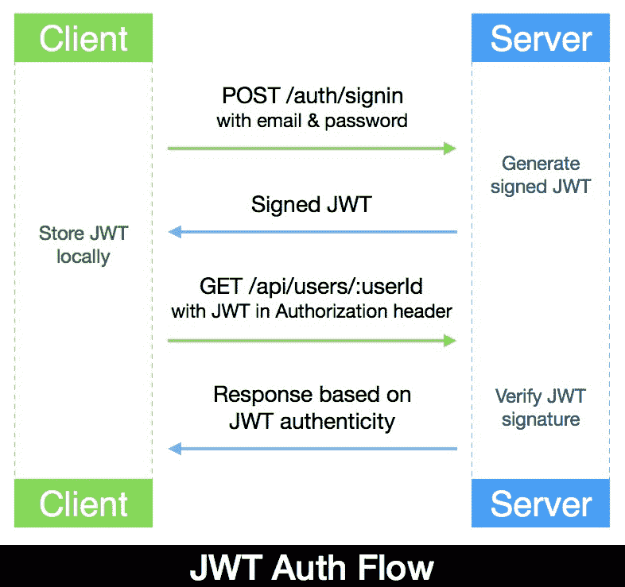
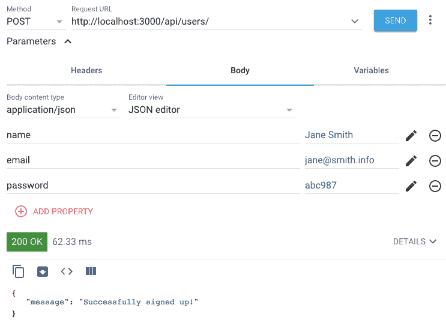
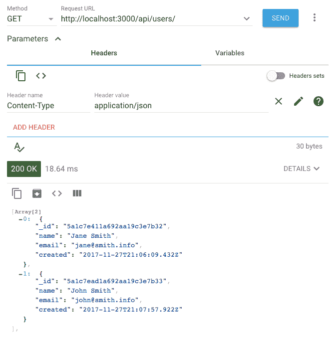
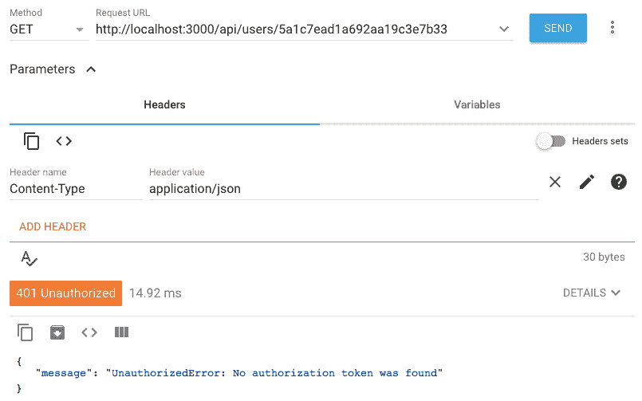
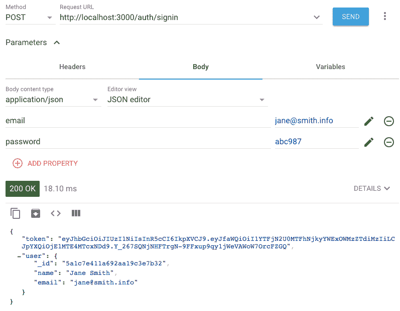
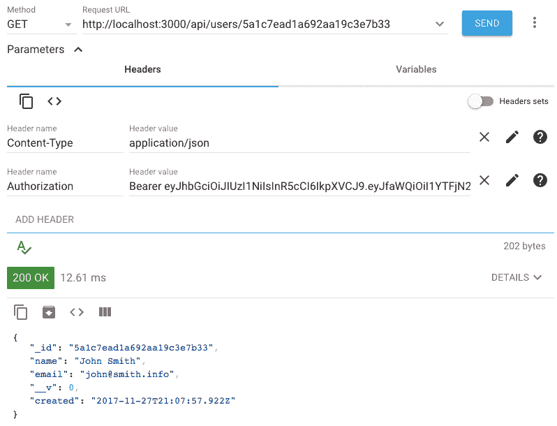

# 使用 MongoDB、Express 和 Node 构建后端

在开发不同的网络应用程序时，你会发现过程中有常见的任务、基本功能和重复的实现代码。对于本书中将开发的 MERN 应用程序也是如此。考虑到这些相似之处，我们首先将建立一个可轻松修改和扩展以实现各种 MERN 应用程序的框架 MERN 应用程序的基础。

在本章中，我们将涵盖以下主题，并从使用 Node、Express 和 MongoDB 实现的 MERN 框架的后端实现开始：

+   框架应用程序概述

+   后端代码设置

+   使用 Mongoose 的用户模型

+   使用 Express 的用户 CRUD API 端点

+   使用 JSON Web Tokens 进行用户认证

+   运行后端代码并检查 API

# 框架应用程序概述

框架应用程序将封装基本功能和大多数 MERN 应用程序中重复的工作流程。我们将构建一个基本但功能齐全的 MERN 网络应用程序，具有用户**创建**、**读取**、**更新**、**删除**（**CRUD**）和**认证**-**授权**（**auth**）功能；这还将展示如何使用此堆栈开发、组织和运行通用网络应用程序的代码。目标是使框架尽可能简单，以便易于扩展，并可作为开发不同 MERN 应用程序的基础应用程序。

# 功能分解

在框架应用程序中，我们将添加以下用例，包括用户 CRUD 和 auth 功能实现：

+   **注册**：用户可以通过使用电子邮件地址创建新账户进行注册。

+   **用户列表**：任何访客都可以看到所有注册用户的列表。

+   **认证**：注册用户可以登录和登出。

+   **受保护的用户资料**：只有注册用户在登录后才能查看个人用户详情。

+   **授权用户编辑和删除**：只有注册并认证的用户可以编辑或删除自己的用户账户详情。

通过这些功能，我们将拥有一个简单的运行中的网络应用程序，支持用户账户。我们将从后端实现开始构建这个基本网络应用程序，然后集成 React 前端以完成全栈。

# 定义后端组件

在本章中，我们将专注于使用 Node、Express 和 MongoDB 构建一个工作后端框架，该后端将是一个独立的服务器端应用程序，可以处理创建用户、列出所有用户、在数据库中查看、更新或删除用户等 HTTP 请求，同时考虑用户认证和授权。

# 用户模型

用户模型将定义要存储在 MongoDB 数据库中的用户详情，并处理与用户相关的业务逻辑，如密码加密和用户数据验证。此版本的用户模型将是基本的，支持以下属性：

| **字段名称** | **类型** | **描述** |
| --- | --- | --- |
| `name` | 字符串 | 存储用户名称的必填字段。 |
| `email` | 字符串 | 必需的唯一字段，用于存储用户的电子邮件并识别每个账户（每个唯一电子邮件地址仅允许一个账户）。 |
| `password` | 字符串 | 认证所需的字段。出于安全目的，数据库将存储加密后的密码，而不是实际字符串。 |
| `created` | 日期 | 创建新用户账户时自动生成的时间戳。 |
| `updated` | 日期 | 更新现有用户详细信息时自动生成的时间戳。 |

当我们通过扩展此骨架构建应用程序时，我们可以根据需要添加更多字段。但以这些字段开始将足以识别唯一的用户账户，并且还可以实现与用户 CRUD 操作相关的功能。

# 用户 CRUD 的 API 端点

为了在用户数据库上启用和处理用户 CRUD 操作，后端将实现并公开前端可以在视图中使用的 API 端点，如下所示：

| **操作** | **API 路由** | **HTTP 方法** |
| --- | --- | --- |
| 创建用户 | `/api/users` | `POST` |
| 列出所有用户 | `/api/users` | `GET` |
| 获取用户 | `/api/users/:userId` | `GET` |
| 更新用户 | `/api/users/:userId` | `PUT` |
| 删除用户 | `/api/users/:userId` | `DELETE` |
| 用户登录 | `/auth/signin` | `POST` |
| 用户登出（可选） | `/auth/signout` | `GET` |

这些用户 CRUD 操作中的一些将具有受保护访问权限，这要求请求客户端进行认证、授权或两者兼而有之，具体取决于功能规范。表中最后两个路由用于认证，将允许用户登录和登出。对于本书中开发的应用程序，我们将使用 JWT 机制来实现这些认证功能，如下一节中更详细地讨论。

# 使用 JSON Web Tokens 进行认证

为了根据骨架功能限制和保护对用户 API 端点的访问，后端需要整合认证和授权机制。在实现 Web 应用程序的用户认证方面有许多选择。最常见且经过时间考验的选项是在客户端和服务器端使用会话来存储用户状态。但一种较新的方法是使用 **JSON Web Token**（JWT）作为无状态认证机制，它不需要在服务器端存储用户状态。

这两种方法在相关的现实世界用例中都有其优势。然而，为了保持本书中的代码简单，并且因为它与 MERN 栈和我们的示例应用程序配合良好，我们将使用 JWT 进行认证实现。

# JWT 的工作原理

在深入到 MERN 栈中 JWT 认证的实现之前，我们将查看这种机制通常如何在客户端-服务器应用程序中工作，如下面的图所示：



初始时，当用户使用其凭据登录时，服务器端生成一个带有秘密密钥和唯一用户详情的 JWT。然后，此令牌将返回给请求客户端以在本地保存，无论是 `localStorage`、`sessionStorage` 还是浏览器中的 cookie，本质上是将维护用户状态的责任交给了客户端。

对于在成功登录后发出的 HTTP 请求，特别是对受保护和有限访问的 API 端点的请求，客户端必须将此令牌附加到请求中。更具体地说，`JSON Web Token` 必须包含在请求的 `Authorization` 标头中，作为 `Bearer`：

```js
Authorization: Bearer <JSON Web Token>
```

当服务器收到对受保护 API 端点的请求时，它会检查请求的 `Authorization` 标头中的有效 JWT，然后验证签名以识别发送者并确保请求数据未被损坏。如果令牌有效，请求客户端将被授予访问相关操作或资源的权限；否则，将返回授权错误。

在骨架应用程序中，当用户使用他们的电子邮件和密码登录时，后端将生成一个带有用户 ID 和仅在服务器上可用的秘密密钥的已签名 JWT。然后，当用户尝试查看任何用户资料、更新他们的账户详情或删除他们的用户账户时，此令牌将用于验证。

实现用户模型以存储和验证用户数据，然后将其与 API 集成以执行基于 JWT 的 CRUD 操作，这将产生一个功能独立的后端。在本章的其余部分，我们将探讨如何在 MERN 框架中实现这一点并设置。

# 设置后端骨架

要开始开发 MERN 骨架的后端部分，我们将设置项目文件夹，安装和配置必要的 Node 模块，然后准备运行脚本以帮助开发和运行代码。然后，我们将逐步分析代码以实现一个工作的 Express 服务器、带有 Mongoose 的用户模型、Express 路由器上的 API 端点以及基于 JWT 的身份验证，以满足我们之前定义的用户功能规格。

本章将讨论的代码以及完整的骨架应用程序可在 GitHub 上找到[ https://github.com/PacktPublishing/Full-Stack-React-Projects-Second-Edition/tree/master/Chapter03%20and%2004/mern-skeleton](https://github.com/PacktPublishing/Full-Stack-React-Projects-Second-Edition/tree/master/Chapter03%20and%2004/mern-skeleton) 。仅后端代码可在同一存储库的 `mern2-skeleton-backend` 分支中找到。您可以将此代码克隆并运行，在阅读本章其余部分的代码解释时进行操作。

# 文件夹和文件结构

在本章的其余部分，我们将通过设置和实现，最终得到以下文件夹结构，其中包含与 MERN 骨架后端相关的文件。有了这些文件，我们将拥有一个功能齐全的、独立的后端服务器应用程序：

```js
| mern_skeleton/
   | -- config/
      | --- config.js
   | -- server/
      | --- controllers/
         | ---- auth.controller.js
         | ---- user.controller.js
      | --- helpers/
         | ---- dbErrorHandler.js
      | --- models/
         | ---- user.model.js
      | --- routes/
         | ---- auth.routes.js
         | ---- user.routes.js
      | --- express.js
      | --- server.js
  | -- .babelrc
  | -- nodemon.json
  | -- package.json
  | -- template.js
  | -- webpack.config.server.js
  | -- yarn.lock
```

我们将把配置文件放在根目录下，把与后端相关的代码放在 `server` 文件夹中。在 `server` 文件夹内，我们将后端代码划分为包含模型、控制器、路由、辅助函数和通用服务器端代码的模块。这个文件夹结构将在下一章中进一步扩展，届时我们将通过添加 React 前端来完成骨架应用程序。

# 初始化项目

如果你的开发环境已经设置好，你可以初始化 MERN 项目以开始开发后端。首先，我们将从项目文件夹中初始化 `package.json`，配置和安装任何开发依赖项，设置代码中使用的配置变量，并在 `package.json` 中更新运行脚本以帮助开发和运行代码。

# 添加 package.json

我们需要一个 `package.json` 文件来存储关于项目的元信息，列出带有版本号的模块依赖项，并定义运行脚本。要在项目文件夹中初始化 `package.json` 文件，从命令行进入项目文件夹，运行 `yarn init`，然后按照指示添加必要的详细信息。创建 `package.json` 后，我们可以继续设置和开发，并在代码实现过程中需要更多模块时更新该文件。

# 开发依赖项

为了开始开发过程并运行后端服务器代码，我们将配置和安装 Babel、Webpack 和 Nodemon，如第二章所述，*准备开发环境*，并对后端进行一些小的调整。

# Babel

由于我们将在后端代码中使用 ES6+ 和最新的 JS 特性，我们将安装和配置 Babel 模块将 ES6+ 转换为较旧的 JS 版本，以便与正在使用的 Node 版本兼容。

首先，我们将在 `.babelrc` 文件中配置 Babel，使用最新的 JS 特性预设，并指定当前版本的 Node 作为目标环境。

`mern-skeleton/.babelrc`:

```js
{
  "presets": [
    ["@babel/preset-env",
      {
        "targets": {
          "node": "current"
        }
      }
    ]
  ]
}
```

将 `targets.node` 设置为 `current` 指示 Babel 编译针对当前版本的 Node，并允许我们在后端代码中使用 `async/await` 等表达式。

接下来，我们需要从命令行安装 Babel 模块作为 `devDependencies`：

```js
yarn add --dev @babel/core babel-loader @babel/preset-env
```

一旦完成模块安装，你将注意到 `package.json` 文件中的 `devDependencies` 列表已经更新。

# Webpack

我们需要 Webpack 来使用 Babel 编译和打包服务器端代码。对于配置，我们可以使用第二章中讨论的相同的 `webpack.config.server.js`。

从命令行运行以下命令以安装`webpack`、`webpack-cli`和`webpack-node-externals`模块：

```js
yarn add --dev webpack webpack-cli webpack-node-externals
```

这将安装 Webpack 模块并更新`package.json`文件。

# Nodemon

在我们更新代码期间自动重启 Node 服务器，我们将使用 Nodemon 来监控服务器代码的更改。我们可以使用我们在第二章“准备开发环境”中讨论的相同安装和配置指南。

在我们添加运行脚本以开始开发和运行后端代码之前，我们将定义跨后端实现使用的值配置变量。

# 配置变量

在`config/config.js`文件中，我们将定义一些服务器端配置相关的变量，这些变量将在代码中使用，但应作为最佳实践避免硬编码，以及出于安全考虑。

`mern-skeleton/config/config.js`：

```js
const config = {
  env: process.env.NODE_ENV || 'development',
  port: process.env.PORT || 3000,
  jwtSecret: process.env.JWT_SECRET || "YOUR_secret_key",
  mongoUri: process.env.MONGODB_URI ||
    process.env.MONGO_HOST ||
    'mongodb://' + (process.env.IP || 'localhost') + ':' +
    (process.env.MONGO_PORT || '27017') +
    '/mernproject'
}

export default config
```

定义好的配置变量如下：

+   `env`：用于区分开发和生产模式

+   `port`：用于定义服务器的监听端口

+   `jwtSecret`：用于签名 JWT 的秘密密钥

+   `mongoUri`：项目 MongoDB 数据库实例的位置

这些变量将使我们能够从单个文件更改值并在后端代码中使用它。接下来，我们将添加运行脚本，这将允许我们运行和调试后端实现。

# 运行脚本

要在开发后端代码时运行服务器，我们可以从`package.json`文件中的`yarn development`脚本开始。对于完整的骨架应用程序，我们将使用我们在第二章“准备开发环境”中定义的相同运行脚本。

`mern-skeleton/package.json`：

```js
"scripts": {
    "development": "nodemon"
 }
```

添加此脚本后，从项目文件夹中运行命令行中的`yarn development`将基本上根据`nodemon.json`中的配置启动 Nodemon。配置指示 Nodemon 监控服务器文件以进行更新，并在更新时重新构建文件，然后重启服务器，以便更改立即可用。我们将从实现具有此配置的工作服务器开始。

# 准备服务器

在本节中，我们将在开始实现用户特定功能之前，将 Express、Node 和 MongoDB 集成在一起，以运行一个完全配置的服务器。

# 配置 Express

要使用 Express，我们将安装它，然后在`server/express.js`文件中添加和配置它。

从命令行运行以下命令以安装`express`模块并自动更新`package.json`文件：

```js
yarn add express
```

Express 安装后，我们可以将其导入到`express.js`文件中，按需配置它，并使其对整个应用程序可用。

`mern-skeleton/server/express.js`：

```js
import express from 'express'
const app = express()
  /*... configure express ... */
export default app
```

为了正确处理 HTTP 请求并提供服务，我们将使用以下模块来配置 Express：

+   `body-parser`: 请求体解析中间件，用于处理解析可流式请求对象的复杂性，以便我们可以通过在请求体中交换 JSON 来简化浏览器-服务器通信。要安装此模块，请在命令行中运行 `yarn add body-parser`。然后，使用 `bodyParser.json()` 和 `bodyParser.urlencoded({ extended: true })` 配置 Express 应用。

+   `cookie-parser`: 解析和设置请求对象中的 Cookie 的解析中间件。要安装 `cookie-parser` 模块，请在命令行中运行 `yarn add cookie-parser`。

+   `compression`: 尝试压缩所有通过中间件传输的请求响应体的压缩中间件。要安装 `compression` 模块，请在命令行中运行 `yarn add compression`。

+   `helmet`: 通过设置各种 HTTP 头来帮助保护 Express 应用的中间件集合。要安装 `helmet` 模块，请在命令行中运行 `yarn add helmet`。

+   `cors`: 允许**跨源资源共享**（**CORS**）的中间件。要安装 `cors` 模块，请在命令行中运行 `yarn add cors`。

在安装了前面的模块之后，我们可以更新 `express.js` 以导入这些模块，并在将其导出以供服务器代码的其余部分使用之前配置 Express 应用。

更新的 `mern-skeleton/server/express.js` 代码应如下所示：

```js
import express from 'express'
import bodyParser from 'body-parser'
import cookieParser from 'cookie-parser'
import compress from 'compression'
import cors from 'cors'
import helmet from 'helmet'

const app = express()

app.use(bodyParser.json())
app.use(bodyParser.urlencoded({ extended: true }))
app.use(cookieParser())
app.use(compress())
app.use(helmet())
app.use(cors())

export default app
```

Express 应用现在可以接受和处理来自传入 HTTP 请求的信息，为此我们首先需要使用此应用启动一个服务器。

# 启动服务器

配置 Express 应用以接受 HTTP 请求后，我们可以继续使用它来实现一个可以监听传入请求的服务器。

在 `mern-skeleton/server/server.js` 文件中，添加以下代码以实现服务器：

```js
import config from './../config/config'
import app from './express'

app.listen(config.port, (err) => {
  if (err) {
    console.log(err)
  }
  console.info('Server started on port %s.', config.port)
})
```

首先，我们导入配置变量以设置服务器将监听的端口号，然后导入配置好的 Express 应用以启动服务器。要运行此代码并继续开发，我们可以在命令行中运行 `yarn development`。如果代码没有错误，服务器应该会启动运行，Nodemon 会监控代码更改。接下来，我们将更新此服务器代码以集成数据库连接。

# 设置 Mongoose 并连接到 MongoDB

我们将使用 `mongoose` 模块来实现此骨架中的用户模型，以及所有未来 MERN 应用的数据模型。在这里，我们将首先配置 Mongoose 并利用它来定义与 MongoDB 数据库的连接。

首先，要安装 `mongoose` 模块，请运行以下命令：

```js
yarn add mongoose
```

然后，更新 `server.js` 文件以导入 `mongoose` 模块，配置它以使用原生 ES6 promises，并最终使用它来处理项目与 MongoDB 数据库的连接。

`mern-skeleton/server/server.js`:

```js
import mongoose from 'mongoose'

mongoose.Promise = global.Promise
mongoose.connect(config.mongoUri, { useNewUrlParser: true, 
                                    useCreateIndex: true,         
                                    useUnifiedTopology: true } ) 

mongoose.connection.on('error', () => {
  throw new Error(`unable to connect to database: ${mongoUri}`)
})
```

如果你正在开发环境中运行代码，并且 MongoDB 也正在运行，保存此更新应该可以成功重启服务器，现在该服务器已集成 Mongoose 和 MongoDB。

Mongoose 是一个 MongoDB 对象建模工具，它提供了一个基于模式的解决方案来建模应用程序数据。它包括内置的类型转换、验证、查询构建和业务逻辑钩子。使用 Mongoose 与此后端堆栈一起提供 MongoDB 之上的更高层，具有更多功能，包括将对象模型映射到数据库文档。这使得使用 Node 和 MongoDB 后端进行开发更加简单和高效。要了解更多关于 Mongoose 的信息，请访问 [mongoosejs.com](http://mongoosejs.com)。

在配置了 Express 应用程序、数据库集成 Mongoose 以及准备就绪的监听服务器后，我们可以添加代码以从后端加载 HTML 视图。

# 在根 URL 上提供 HTML 模板

现在有一个启用了 Node-Express-和 MongoDB 服务器正在运行，我们可以扩展它，使其能够响应根 URL `/` 的传入请求来提供 HTML 模板。

在 `template.js` 文件中，添加一个 JS 函数，该函数返回一个简单的 HTML 文档，将在浏览器屏幕上渲染`Hello World`。

`mern-skeleton/template.js`:

```js
export default () => {
    return `<!doctype html>
      <html lang="en">
          <head>
             <meta charset="utf-8">
             <title>MERN Skeleton</title>
          </head>
          <body>
            <div id="root">Hello World</div>
          </body>
      </html>`
}
```

要在根 URL 上提供此模板，更新 `express.js` 文件以导入此模板，并在对 `'/'` 路由的 GET 请求中将其发送作为响应。

`mern-skeleton/server/express.js`:

```js
import Template from './../template'
...
app.get('/', (req, res) => {
 res.status(200).send(Template())
})
...
```

使用此更新，在浏览器中打开根 URL 应该会显示在页面上渲染的“Hello World”。如果你在本地机器上运行代码，根 URL 将是 `http://localhost:3000/`。

到目前为止，我们可以构建在基于 Node-Express-和 MongoDB 的后端服务器上，以添加特定于用户的功能。

# 实现用户模型

我们将在 `server/models/user.model.js` 文件中实现用户模型，并使用 Mongoose 定义包含必要用户数据字段的模式。我们这样做是为了可以对字段添加内置验证，并集成如密码加密、身份验证和自定义验证等业务逻辑。

我们将首先导入 `mongoose` 模块，并使用它来生成一个 `UserSchema`，它将包含模式定义和与用户相关的业务逻辑，以构成用户模型。这个用户模型将被导出，以便其余的后端代码可以使用它。

`mern-skeleton/server/models/user.model.js`:

```js
import mongoose from 'mongoose'

const UserSchema = new mongoose.Schema({ … })

export default mongoose.model('User', UserSchema) 
```

`mongoose.Schema()` 函数接受一个模式定义对象作为参数，以生成一个新的 Mongoose 模式对象，该对象将指定集合中每个文档的属性或结构。在我们添加任何业务逻辑代码以完成用户模型之前，我们将讨论用户集合的模式定义。

# 用户模式定义

需要生成新 Mongoose 模式的用户模式定义对象将声明所有用户数据字段和相关属性。该模式将记录与用户相关的信息，包括名称、电子邮件、创建时间和最后更新时间戳、哈希密码以及相关的唯一密码盐。我们将在下一节中详细说明这些属性，展示每个字段如何在用户模式代码中定义。

# 名称

`名称`字段是`String`类型的必填字段。

`mern-skeleton/server/models/user.model.js`:

```js
name: {
   type: String,
   trim: true,
   required: 'Name is required'
 },
```

此字段将存储用户的名称。

# 邮箱

`电子邮件`字段是`String`类型的必填字段。

`mern-skeleton/server/models/user.model.js`:

```js
email: {
  type: String,
  trim: true,
  unique: 'Email already exists',
  match: [/.+\@.+\..+/, 'Please fill a valid email address'],
  required: 'Email is required'
},
```

要存储在此电子邮件字段中的值必须具有有效的电子邮件格式，并且必须在用户集合中是唯一的。

# 创建和更新时间戳

`created`和`updated`字段是`Date`值。

`mern-skeleton/server/models/user.model.js`:

```js
created: {
  type: Date,
  default: Date.now
},
updated: Date,
```

这些`Date`值将程序化生成，以记录用户创建和用户数据更新的时间戳。

# 哈希密码和盐

`hashed_password`和`salt`字段代表用于认证的加密用户密码。

`mern-skeleton/server/models/user.model.js`:

```js
hashed_password: {
    type: String,
    required: "Password is required"
},
salt: String
```

为了安全起见，实际的密码字符串不会直接存储在数据库中，并且将单独处理，如下一节所述。

# 用于认证的密码

`密码`字段对于在任何应用程序中提供安全用户身份验证至关重要，每个用户密码都需要作为用户模型的一部分进行加密、验证和安全的认证。

# 将密码字符串作为虚拟字段处理

用户提供的`密码`字符串不会直接存储在用户文档中。相反，它被处理为一个`虚拟`字段。

`mern-skeleton/server/models/user.model.js`:

```js
UserSchema
  .virtual('password')
  .set(function(password) {
    this._password = password
    this.salt = this.makeSalt()
    this.hashed_password = this.encryptPassword(password)
  })
  .get(function() {
    return this._password
  })
```

当在用户创建或更新时接收到`密码`值时，它将被加密成一个新的哈希值，并设置到`hashed_password`字段，同时与`salt`字段中的唯一`盐`值一起。

# 加密和认证

用于生成表示`密码`值的`hashed_password`和`salt`值的加密逻辑和盐生成逻辑被定义为`UserSchema`方法。

`mern-skeleton/server/models/user.model.js`:

```js
UserSchema.methods = {
  authenticate: function(plainText) {
    return this.encryptPassword(plainText) === this.hashed_password
  },
  encryptPassword: function(password) {
    if (!password) return ''
    try {
      return crypto
        .createHmac('sha1', this.salt)
        .update(password)
        .digest('hex')
    } catch (err) {
      return ''
    }
  },
  makeSalt: function() {
    return Math.round((new Date().valueOf() * Math.random())) + ''
  }
}
```

`UserSchema`方法可用于提供以下功能：

+   `authenticate`：此方法被调用以验证登录尝试，通过将用户提供的密码文本与数据库中特定用户的`hashed_password`进行匹配。

+   `encryptPassword`：此方法用于使用 Node 的`crypto`模块从纯文本密码和唯一的`salt`值生成加密哈希。

+   `makeSalt`：此方法使用执行时的当前时间戳和`Math.random()`生成一个唯一且随机的盐值。

`crypto`模块提供了各种加密功能，包括一些标准的加密哈希算法。在我们的代码中，我们使用 SHA1 哈希算法和`crypto`中的`createHmac`来从密码文本和`salt`对生成加密的 HMAC 哈希。

哈希算法为相同的输入值生成相同的哈希。但为了确保两个用户不会因为偶然使用相同的密码文本而得到相同的哈希密码，我们在为每个用户生成哈希密码之前，将每个密码与一个唯一的`salt`值配对。这也会使猜测所使用的哈希算法变得困难，因为看似相同的用户输入生成了不同的哈希。

这些`UserSchema`方法用于将用户提供的密码字符串加密成带有随机生成的`salt`值的`hashed_password`。当用户详细信息在创建或更新时保存到数据库中时，`hashed_password`和`salt`存储在用户文档中。为了匹配和验证用户在登录期间提供的密码字符串，需要这两个值。我们还应该确保用户一开始就选择一个强大的密码字符串，这可以通过添加自定义验证到护照字段来实现。

# 密码字段验证

为了向最终用户选择的实际密码字符串添加验证约束，我们需要添加自定义验证逻辑并将其与模式中的`hashed_password`字段关联。

`mern-skeleton/server/models/user.model.js`:

```js
UserSchema.path('hashed_password').validate(function(v) {
  if (this._password && this._password.length < 6) {
    this.invalidate('password', 'Password must be at least 6 characters.')
  }
  if (this.isNew && !this._password) {
    this.invalidate('password', 'Password is required')
  }
}, null)
```

在我们的应用程序中，我们将保持密码验证标准简单，并确保在创建新用户或更新现有密码时提供密码值，并且其长度至少为六个字符。我们通过在 Mongoose 尝试存储`hashed_password`值之前添加自定义验证来实现这一点。如果验证失败，逻辑将返回相关的错误信息。

定义好的`UserSchema`以及所有与密码相关的业务逻辑，完成了用户模型实现。现在，我们可以导入并使用这个用户模型在其他后端代码的部分。但在我们开始使用这个模型来扩展后端功能之前，我们将添加一个辅助模块，这样我们就可以解析可读的 Mongoose 错误消息，这些错误消息是在对模式验证进行操作时抛出的。

# Mongoose 错误处理

当用户数据保存到数据库中时，如果违反了添加到用户模式字段中的验证约束，将抛出错误消息。为了处理这些验证错误以及数据库在查询时可能抛出的其他错误，我们将定义一个辅助方法，该方法将返回可以在请求-响应周期中适当传播的相关错误消息。

我们将在 `server/helpers/dbErrorHandler.js` 文件中添加 `getErrorMessage` 辅助方法。此方法将解析并返回与特定验证错误或其他在查询 MongoDB 时可能发生的错误相关的错误信息。

`mern-skeleton/server/helpers/dbErrorHandler.js`:

```js
const getErrorMessage = (err) => {
  let message = ''
  if (err.code) {
      switch (err.code) {
          case 11000:
          case 11001:
              message = getUniqueErrorMessage(err)
              break
          default:
              message = 'Something went wrong'
      }
  } else {
      for (let errName in err.errors) {
          if (err.errors[errName].message)
          message = err.errors[errName].message
      }
  }
  return message
}

export default {getErrorMessage}
```

由于 Mongoose 验证器违规而未抛出的错误将包含一个相关的错误 `code`。在某些情况下，这些错误需要不同的处理方式。例如，由于违反 `unique` 约束而引起的错误将返回一个与 Mongoose 验证错误不同的错误对象。`unique` 选项不是一个验证器，而是构建 MongoDB `unique` 索引的方便助手，因此我们将添加另一个 `getUniqueErrorMessage` 方法来解析与 `unique` 约束相关的错误对象并构建适当的错误信息。

`mern-skeleton/server/helpers/dbErrorHandler.js`:

```js
const getUniqueErrorMessage = (err) => {
  let output
  try {
      let fieldName =   
      err.message.substring(err.message.lastIndexOf('.$') + 2,                                             
      err.message.lastIndexOf('_1'))
      output = fieldName.charAt(0).toUpperCase() + fieldName.slice(1) +   
      ' already exists'
  } catch (ex) {
      output = 'Unique field already exists'
  }
  return output
}
```

通过使用从该辅助文件导出的 `getErrorMessage` 函数，我们可以在处理由 Mongoose 操作抛出的错误时添加有意义的错误信息。

用户模型完成后，我们可以执行与使用我们将在下一节中开发的用户 API 实现用户 CRUD 功能相关的 Mongoose 操作。

# 添加用户 CRUD API

由 Express 应用程序公开的用户 API 端点将允许前端根据用户模型生成文档执行 CRUD 操作。为了实现这些工作端点，我们将编写 Express 路由和相应的控制器回调函数，这些函数应在针对这些声明的路由传入 HTTP 请求时执行。在本节中，我们将查看这些端点在没有任何认证限制的情况下是如何工作的。

我们将使用 Express 路由器在 `server/routes/user.routes.js` 中声明用户 API 路由，然后将其挂载到我们在 `server/express.js` 中配置的 Express 应用程序上。

`mern-skeleton/server/express.js`:

```js
import userRoutes from './routes/user.routes'
...
app.use('/', userRoutes)
...
```

所有路由和 API 端点，例如我们接下来将声明的特定用户路由，都需要挂载到 Express 应用程序上，以便从客户端访问。

# 用户路由

在 `user.routes.js` 文件中定义的用户路由将使用 `express.Router()` 来定义与相关 HTTP 方法相关的路由路径，并将相应的控制器函数分配给当这些请求被服务器接收时应调用的函数。

我们将通过以下方式保持用户路由的简单性：

+   `/api/users` 用于以下操作：

    +   使用 GET 列出用户

    +   使用 POST 创建新用户

+   `/api/users/:userId` 用于以下操作：

    +   使用 GET 获取用户

    +   使用 PUT 更新用户

    +   使用 DELETE 删除用户

生成的 `user.routes.js` 代码将如下所示（不包括需要添加到受保护路由的认证考虑因素）。

`mern-skeleton/server/routes/user.routes.js`:

```js
import express from 'express'
import userCtrl from '../controllers/user.controller'

const router = express.Router()

router.route('/api/users')
  .get(userCtrl.list)
  .post(userCtrl.create)

router.route('/api/users/:userId')
  .get(userCtrl.read)
  .put(userCtrl.update)
  .delete(userCtrl.remove)

router.param('userId', userCtrl.userByID)

export default router
```

除了声明与用户 CRUD 操作对应的 API 端点外，我们还将配置 Express 路由器，以便它通过执行 `userByID` 控制器函数来处理请求路由中的 `userId` 参数。

当服务器接收到这些定义的路由中的每个请求时，相应的控制器函数会被调用。我们将在下一小节中定义这些控制器方法的功能，并将其从 `user.controller.js` 文件中导出。

# 用户控制器

`server/controllers/user.controller.js` 文件将包含用于先前用户路由声明的控制器方法的定义，这些方法作为回调在服务器接收到路由请求时执行。

`user.controller.js` 文件将具有以下结构：

```js
import User from '../models/user.model'
import extend from 'lodash/extend'
import errorHandler from './error.controller'

const create = (req, res, next) => { … }
const list = (req, res) => { … }
const userByID = (req, res, next, id) => { … }
const read = (req, res) => { … }
const update = (req, res, next) => { … }
const remove = (req, res, next) => { … }

export default { create, userByID, read, list, remove, update }
```

此控制器将使用 `errorHandler` 辅助函数来响应路由请求，并在发生 Mongoose 错误时返回有意义的消息。在更新具有更改值的现有用户时，它还将使用名为 `lodash` 的模块。

`lodash` 是一个 JavaScript 库，它提供了用于常见编程任务的实用函数，包括数组和对象的操作。要安装 `lodash`，请在命令行中运行 `yarn add lodash`。

我们定义的每个控制器函数都与一个路由请求相关联，并将根据每个 API 用例进行详细说明。

# 创建新用户

创建新用户的 API 端点在以下路由中声明。

`mern-skeleton/server/routes/user.routes.js`:

```js
router.route('/api/users').post(userCtrl.create)
```

当 Express 应用接收到针对 `'/api/users'` 的 POST 请求时，它会调用我们在控制器中定义的 `create` 函数。

`mern-skeleton/server/controllers/user.controller.js`:

```js
const create = async (req, res) => {
  const user = new User(req.body)
  try {
    await user.save()
    return res.status(200).json({
      message: "Successfully signed up!"
    })
  } catch (err) {
    return res.status(400).json({
      error: errorHandler.getErrorMessage(err)
    })
  }
}
```

此函数使用从前端 POST 请求中接收到的用户 JSON 对象在 `req.body` 内创建新用户。调用 `user.save` 尝试在 Mongoose 对数据进行验证检查后，将新用户保存到数据库中。因此，会向请求客户端返回错误或成功响应。

`create` 函数被定义为使用 `**async**` 关键字的一个异步函数，允许我们使用 `**await**` 与 `user.save()` 一起，它返回一个 Promise。在 `**async**` 函数内部使用 `**await**` 关键字会导致此函数在执行下一行代码之前等待返回的 Promise 解决。如果 Promise 拒绝，则会抛出错误并在 `catch` 块中捕获。

`Async/await` 是 ES8 的一个新增功能，它允许我们以看似顺序或同步的方式编写异步 JavaScript 代码。对于处理异步行为，如访问数据库的控制器函数，我们将使用 `async/await` 语法来实现它们。

类似地，在下一节中，我们将使用 `async/await` 来实现控制器函数，以便在查询数据库后列出所有用户。

# 列出所有用户

获取所有用户的 API 端点在以下路由中声明。

`mern-skeleton/server/routes/user.routes.js`:

```js
router.route('/api/users').get(userCtrl.list)
```

当 Express 应用程序接收到对 `'/api/users'` 的 GET 请求时，它执行 `list` 控制器函数。

`mern-skeleton/server/controllers/user.controller.js`:

```js
const list = async (req, res) => {
  try {
    let users = await User.find().select('name email updated created')
    res.json(users)
  } catch (err) {
    return res.status(400).json({
      error: errorHandler.getErrorMessage(err)
    })
  }
}
```

`list` 控制器函数从数据库中查找所有用户，仅在结果用户列表中填充 `name`、`email`、`created` 和 `updated` 字段，然后将此用户列表作为 JSON 对象数组返回给请求客户端。

剩余的 CRUD 操作，包括读取、更新和删除单个用户，需要我们首先通过 ID 获取特定的用户。在下文中，我们将实现控制器函数，以便从数据库中检索单个用户，以响应相应的请求，返回用户、更新用户或删除用户。

# 通过 ID 加载用户以读取、更新或删除

读取、更新和删除的所有三个 API 端点都需要根据被访问用户的用户 ID 从数据库中加载用户。我们将编程 Express 路由器首先执行此操作，然后再响应特定的读取、更新或删除请求。

# 加载

当 Express 应用程序收到一个请求，该请求与包含 `:userId` 参数的路径匹配时，应用程序将执行 `userByID` 控制器函数，该函数获取并加载用户到 Express 请求对象中，然后再将其传播到特定于请求的 `next` 函数。

`mern-skeleton/server/routes/user.routes.js`:

```js
router.param('userId', userCtrl.userByID)
```

`userByID` 控制器函数使用 `:userId` 参数中的值通过 `_id` 查询数据库并加载匹配用户的详细信息。

`mern-skeleton/server/controllers/user.controller.js`:

```js
const userByID = async (req, res, next, id) => {
  try {
    let user = await User.findById(id)
    if (!user)
      return res.status('400').json({
        error: "User not found"
      })
    req.profile = user
    next()
  } catch (err) {
    return res.status('400').json({
      error: "Could not retrieve user"
    })
  }
}
```

如果在数据库中找到匹配的用户，则将用户对象附加到请求对象的 `profile` 键中。然后，使用 `next()` 中间件将控制权传递给下一个相关的控制器函数。例如，如果原始请求是读取用户资料，则 `userByID` 中的 `next()` 调用将转到 `read` 控制器函数，这将在下文中讨论。

# 读取

读取单个用户数据的 API 端点在以下路由中声明。

`mern-skeleton/server/routes/user.routes.js`:

```js
router.route('/api/users/:userId').get(userCtrl.read)
```

当 Express 应用程序接收到对 `'/api/users/:userId'` 的 GET 请求时，它执行 `userByID` 控制器函数，通过 `userId` 值加载用户，然后执行 `read` 控制器函数。

`mern-skeleton/server/controllers/user.controller.js`:

```js
const read = (req, res) => {
  req.profile.hashed_password = undefined
  req.profile.salt = undefined
  return res.json(req.profile)
}
```

`read` 函数从 `req.profile` 中检索用户详细信息，并在将用户对象发送到请求客户端的响应中之前删除敏感信息，例如 `hashed_password` 和 `salt` 值。在实现更新用户的控制器函数时也遵循此规则，如下所示。

# 更新

更新单个用户的 API 端点在以下路由中声明。

`mern-skeleton/server/routes/user.routes.js`:

```js
router.route('/api/users/:userId').put(userCtrl.update)
```

当 Express 应用接收到`'/api/users/:userId'`的 PUT 请求时，类似于读取，它会加载具有`:userId`参数值的用户，然后在执行`update`控制器函数之前。

`mern-skeleton/server/controllers/user.controller.js`：

```js
const update = async (req, res) => {
  try {
    let user = req.profile
    user = extend(user, req.body)
    user.updated = Date.now()
    await user.save()
    user.hashed_password = undefined
    user.salt = undefined
    res.json(user)
  } catch (err) {
    return res.status(400).json({
      error: errorHandler.getErrorMessage(err)
    })
  }
}
```

`update`函数从`req.profile`中检索用户详细信息，然后使用`lodash`模块扩展并合并请求体中传入的更改以更新用户数据。在将此更新后的用户保存到数据库之前，`updated`字段被填充为当前日期，以反映最后更新的时间戳。在成功保存此更新后，更新后的用户对象通过删除敏感数据（如`hashed_password`和`salt`）来清理，然后在响应中发送给请求客户端。删除用户的最终用户控制器函数的实现与`update`函数类似，具体细节将在下一节中说明。

# 删除

删除用户的 API 端点在以下路由中声明。

`mern-skeleton/server/routes/user.routes.js`：

```js
router.route('/api/users/:userId').delete(userCtrl.remove)
```

当 Express 应用接收到`'/api/users/:userId'`的 DELETE 请求时，类似于读取和更新，它会根据 ID 加载用户，然后执行`remove`控制器函数。

`mern-skeleton/server/controllers/user.controller.js`：

```js
const remove = async (req, res) => {
  try {
    let user = req.profile
    let deletedUser = await user.remove()
    deletedUser.hashed_password = undefined
    deletedUser.salt = undefined
    res.json(deletedUser)
  } catch (err) {
    return res.status(400).json({
      error: errorHandler.getErrorMessage(err)
    })
  }
}
```

`remove`函数从`req.profile`中检索用户，并使用`remove()`查询从数据库中删除用户。在成功删除后，请求客户端会收到响应中的删除用户对象。

到目前为止，API 端点的实现允许任何客户端对用户模型执行 CRUD 操作。然而，我们希望通过身份验证和授权来限制对这些操作的一些访问。我们将在下一节中探讨这个问题。

# 集成用户认证和保护路由

为了限制对用户操作（如查看用户资料、更新用户和删除用户）的访问，我们首先实现使用 JWT 的登录认证，然后使用它来保护并授权读取、更新和删除路由。

登录和注销相关的认证 API 端点将在`server/routes/auth.routes.js`中声明，然后将其挂载到`server/express.js`中的 Express 应用上。

`mern-skeleton/server/express.js`：

```js
import authRoutes from './routes/auth.routes'
  ...
  app.use('/', authRoutes)
  ...
```

这将使我们在`auth.routes.js`中定义的路由从客户端可访问。

# 认证路由

两个认证 API 在`auth.routes.js`文件中定义，使用`express.Router()`声明路由路径和相关 HTTP 方法。它们还被分配了相应的控制器函数，当接收到这些路由的请求时应该调用这些函数。

认证路由如下：

+   `'/auth/signin'`：使用电子邮件和密码进行用户认证的 POST 请求

+   `'/auth/signout'`：登录后，在响应对象上设置的 JWT 包含的 cookie 的 GET 请求用于清除

生成的`mern-skeleton/server/routes/auth.routes.js`文件将如下所示：

```js
import express from 'express'
import authCtrl from '../controllers/auth.controller'

const router = express.Router()

router.route('/auth/signin')
  .post(authCtrl.signin)
router.route('/auth/signout')
  .get(authCtrl.signout)

export default router
```

对 `signin` 路由的 POST 请求和对 `signout` 路由的 GET 请求将调用在 `auth.controller.js` 文件中定义的相应控制器函数，如下一节所述。

# 认证控制器

`server/controllers/auth.controller.js` 中的认证控制器函数不仅会处理对 `signin` 和 `signout` 路由的请求，还会提供 JWT 和 `express-jwt` 功能，以启用受保护用户 API 端点的认证和授权。

`mern-skeleton/server/controllers/auth.controller.js` 文件将具有以下结构：

```js
import User from '../models/user.model'
import jwt from 'jsonwebtoken'
import expressJwt from 'express-jwt'
import config from './../../config/config'

const signin = (req, res) => { … }
const signout = (req, res) => { … }
const requireSignin = … 
const hasAuthorization = (req, res) => { … }

export default { signin, signout, requireSignin, hasAuthorization }
```

在以下几节中详细说明了四个控制器函数，以展示后端如何使用 JSON Web Tokens 实现用户认证。我们将从下一节的 `signin` 控制器函数开始。

# 登录

在以下路由中声明了用于登录用户的 API 端点。

`mern-skeleton/server/routes/auth.routes.js`:

```js
router.route('/auth/signin').post(authCtrl.signin)
```

当 Express 应用程序接收到对 `'/auth/signin'` 的 POST 请求时，它将执行 `signin` 控制器函数。

`mern-skeleton/server/controllers/auth.controller.js`:

```js
const signin = async (req, res) => {
  try {
    let user = await User.findOne({ "email": req.body.email })
    if (!user)
      return res.status('401').json({ error: "User not found" })

    if (!user.authenticate(req.body.password)) {
      return res.status('401').send({ error: "Email and
           password don't match." })
    }

    const token = jwt.sign({ _id: user._id }, config.jwtSecret)

    res.cookie('t', token, { expire: new Date() + 9999 })

    return res.json({
      token,
      user: {
        _id: user._id,
        name: user.name,
        email: user.email
      }
    })
  } catch (err) {
    return res.status('401').json({ error: "Could not sign in" })
  }
}
```

`POST` 请求对象在 `req.body` 中接收电子邮件和密码。这个电子邮件用于从数据库中检索匹配的用户。然后，使用在 `UserSchema` 中定义的密码认证方法来验证从客户端接收到的 `req.body` 中的密码。

如果密码验证成功，JWT 模块将使用密钥和用户 `_id` 值生成一个签名的 JWT。

通过在命令行中运行 `yarn add jsonwebtoken` 来安装 `jsonwebtoken` 模块，使其可用于此控制器。

然后，将签名的 JWT 返回给认证的客户端，并附带用户的详细信息。可选地，我们还可以将令牌设置为响应对象中的 cookie，以便在客户端（如果选择 cookie 作为 JWT 存储形式）可用。在客户端，此令牌必须在请求受保护路由时附加为 `Authorization` 标头。要注销用户，客户端可以简单地根据其存储方式删除此令牌。在下一节中，我们将学习如何使用 `signout` API 端点清除包含令牌的 cookie。

# 注销

在以下路由中声明了用于注销用户的 API 端点。

`mern-skeleton/server/routes/auth.routes.js`:

```js
router.route('/auth/signout').get(authCtrl.signout)
```

当 Express 应用程序接收到对 `'/auth/signout'` 的 GET 请求时，它将执行 `signout` 控制器函数。

`mern-skeleton/server/controllers/auth.controller.js`:

```js
const signout = (req, res) => {
  res.clearCookie("t")
  return res.status('200').json({
    message: "signed out"
  })
}
```

`signout` 函数清除包含签名的 JWT 的响应 cookie。这是一个可选端点，如果前端完全不使用 cookie，那么对于认证目的来说并不是必需的。

使用 JWT，用户状态存储是客户端的责任，除了 cookies 之外，客户端还有多种存储选项。在注销时，客户端需要在客户端删除令牌，以确认用户不再经过身份验证。在服务器端，我们可以使用和验证在登录时生成的令牌来保护不应未经有效身份验证而访问的路由。在下一节中，我们将学习如何使用 JWT 实现这些受保护的路由。

# 使用 express-jwt 保护路由

为了保护对读取、更新和删除路由的访问，服务器需要检查请求客户端是否是经过身份验证和授权的用户。

当访问受保护的路由时，为了检查请求用户是否已登录并且具有有效的 JWT，我们将使用`express-jwt`模块。

`express-jwt`模块是一个中间件，用于验证 JSON Web Tokens。通过命令行运行`yarn add express-jwt`来安装`express-jwt`。

# 保护用户路由

我们将定义两个认证控制器方法，分别称为`requireSignin`和`hasAuthorization`，这两个方法将被添加到需要通过身份验证和授权进行保护的用户路由声明中。

`user.routes.js`中的读取、更新和删除路由需要按以下方式更新。

`mern-skeleton/server/routes/user.routes.js`:

```js
import authCtrl from '../controllers/auth.controller'
...
router.route('/api/users/:userId')
    .get(authCtrl.requireSignin, userCtrl.read)
    .put(authCtrl.requireSignin, authCtrl.hasAuthorization, 
     userCtrl.update)
    .delete(authCtrl.requireSignin, authCtrl.hasAuthorization, 
     userCtrl.remove)
...
```

读取用户信息的路由只需要进行身份验证验证，而更新和删除路由在执行这些 CRUD 操作之前应该检查身份验证和授权。我们将在下一节中探讨`requireSignin`方法的实现，该方法用于检查身份验证，以及`hasAuthorization`方法的实现，该方法用于检查授权。

# 要求登录

`auth.controller.js`中的`requireSignin`方法使用`express-jwt`来验证传入的请求是否在`Authorization`头中包含有效的 JWT。如果令牌有效，它将在请求对象中添加一个带有`'auth'`键的已验证用户 ID；否则，它将抛出一个身份验证错误。

`mern-skeleton/server/controllers/auth.controller.js`:

```js
const requireSignin = expressJwt({
  secret: config.jwtSecret,
  userProperty: 'auth'
})
```

我们可以将`requireSignin`添加到任何需要保护免受未经身份验证访问的路由。

# 授权已登录用户

对于一些受保护的路由，例如更新和删除，除了检查身份验证之外，我们还想确保请求用户只更新或删除他们自己的用户信息。

为了实现这一点，`auth.controller.js`中定义的`hasAuthorization`函数将在允许相应的 CRUD 控制器函数继续之前，检查经过身份验证的用户是否与正在更新或删除的用户相同。

`mern-skeleton/server/controllers/auth.controller.js`:

```js
const hasAuthorization = (req, res, next) => {
  const authorized = req.profile && req.auth 
        && req.profile._id ==  req.auth._id
  if (!(authorized)) {
    return res.status('403').json({
      error: "User is not authorized"
    })
  }
  next()
}
```

在`requireSignin`认证验证后，`express-jwt`填充了`req.auth`对象，而`req.profile`则由`user.controller.js`中的`userByID`函数填充。我们将向需要认证和授权的路由添加`hasAuthorization`函数。

# `express-jwt`的认证错误处理

为了处理`express-jwt`在尝试验证传入请求中的 JWT 令牌时抛出的认证相关错误，我们需要在`mern-skeleton/server/express.js`中的 Express 应用程序配置中添加以下错误捕获代码，在代码末尾，在路由挂载之后和应用程序导出之前：

```js
app.use((err, req, res, next) => {
  if (err.name === 'UnauthorizedError') {
    res.status(401).json({"error" : err.name + ": " + err.message})
  }else if (err) {
    res.status(400).json({"error" : err.name + ": " + err.message})
    console.log(err)
  }
})
```

当由于某种原因令牌无法验证时，`express-jwt`会抛出一个名为`UnauthorizedError`的错误。我们在这里捕获这个错误，向请求客户端返回`401`状态。如果在这里生成并捕获其他服务器端错误，我们也会添加一个要发送的响应。

在为保护路由实现用户认证后，我们已经涵盖了我们的 MERN 应用程序骨架所需的所有工作后端功能。在下一节中，我们将探讨如何检查这个独立后端是否按预期工作，而不需要实现前端。

# 检查独立后端

在选择用于检查后端 API 的工具时，有多种选择，从命令行工具 curl（[`github.com/curl/curl`](https://github.com/curl/curl)）到**高级 REST 客户端**（**ARC**）（[`chrome.google.com/webstore/detail/advanced-rest-client/hgmloofddffdnphfgcellkdfbfbjeloo`](https://chrome.google.com/webstore/detail/advanced-rest-client/hgmloofddffdnphfgcellkdfbfbjeloo)），这是一个具有交互式用户界面的 Chrome 扩展应用程序。

要检查本章中实现的 API，首先，从命令行启动服务器，并使用这些工具之一请求路由。如果您在本地机器上运行代码，根 URL 是`http://localhost:3000/`。

使用 ARC，我们将展示五个用例的预期行为，以便我们可以检查实现的 API 端点。

# 创建新用户

首先，我们将通过`/api/users` POST 请求创建一个新用户，并在请求体中传递名称、电子邮件和密码值。当用户在数据库中成功创建且没有验证错误时，我们将看到如下截图所示的 200 OK 成功消息：



您也可以尝试发送具有无效名称、电子邮件和密码值的相同请求，以检查后端是否返回了相关的错误消息。接下来，我们将通过调用列表用户 API 来检查用户是否已成功创建并存储在数据库中。

# 获取用户列表

我们可以通过向`/api/users`发送一个获取所有用户的`GET`请求来查看新用户是否在数据库中。响应应包含存储在数据库中的所有用户对象的数组：



注意返回的用户对象只显示了`_id`、`name`、`email`和`created`字段的值，而没有显示`salt`或`hashed_password`值，这些值也存在于数据库中实际存储的文档中。请求只检索我们在列表控制器方法中指定的 Mongoose `find`查询中指定的所选字段。在获取单个用户时也存在这种省略。

# 尝试获取单个用户

接下来，我们将尝试在不先登录的情况下访问受保护的 API。读取任何用户的`GET`请求将返回 401 未授权错误，如下例所示。在这里，向`/api/users/5a1c7ead1a692aa19c3e7b33`发送的`GET`请求返回 401 错误：



为了使这个请求返回包含用户详情的成功响应，需要在请求头中提供一个有效的授权令牌。我们可以通过成功调用登录请求来生成一个有效的令牌。

# 登录

为了能够访问受保护的路由，我们将使用第一个示例中创建的用户凭据进行登录。为了登录，发送一个 POST 请求到`/auth/signin`，请求体中包含电子邮件和密码，如下面的截图所示：



登录成功后，服务器返回一个签名过的 JWT 和用户详情。我们需要这个令牌来访问用于获取单个用户的受保护路由。

# 成功获取单个用户

使用登录后收到的令牌，我们现在可以访问之前失败的受保护路由。在向`/api/users/5a1c7ead1a692aa19c3e7b33`发送 GET 请求时，令牌被设置为`Authorization`头部的 Bearer 方案中。这次，成功返回了用户对象：



如本节所示，使用 ARC，您还可以检查其他 API 端点的更新和删除用户实现。所有这些 API 端点按预期工作，我们就有了一个完整的 MERN 应用程序后端。

# 摘要

在本章中，我们使用 Node、Express 和 MongoDB 开发了一个完全功能独立的后端应用程序，并涵盖了 MERN 框架应用程序骨架的第一部分。在后端，我们实现了用于存储用户数据的用户模型，使用 Mongoose 实现；实现了执行 CRUD 操作的 API 端点，使用 Express 实现；以及实现了用于受保护路由的用户认证，使用 JWT 和`express-jwt`实现。

我们还通过配置 Webpack 来设置开发流程，以便使用 Babel 编译 ES6+代码。我们还配置了 Nodemon，以便在代码更改时重启服务器。最后，我们使用 Chrome 的高级 Rest API 客户端扩展应用程序检查了 API 的实现。

现在，我们已经准备好扩展这个后端应用程序代码并添加 React 前端，这将完成 MERN 框架的应用程序。我们将在下一章中这样做。
