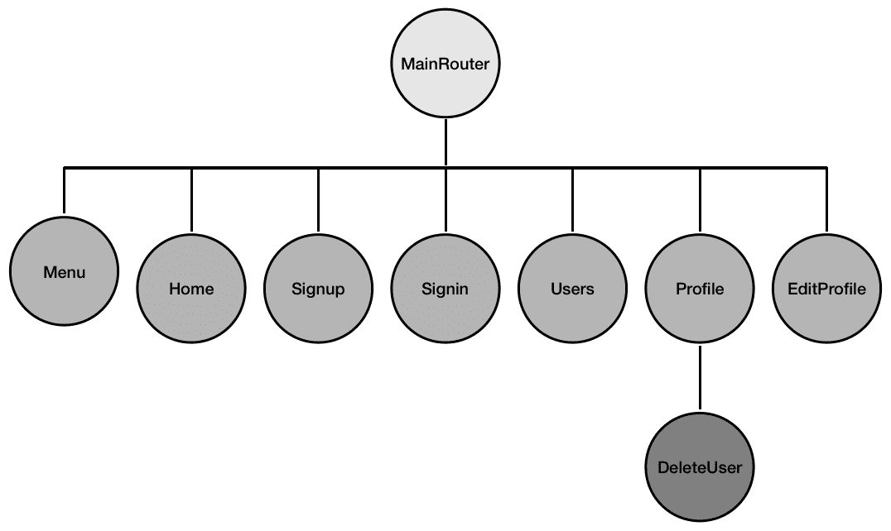
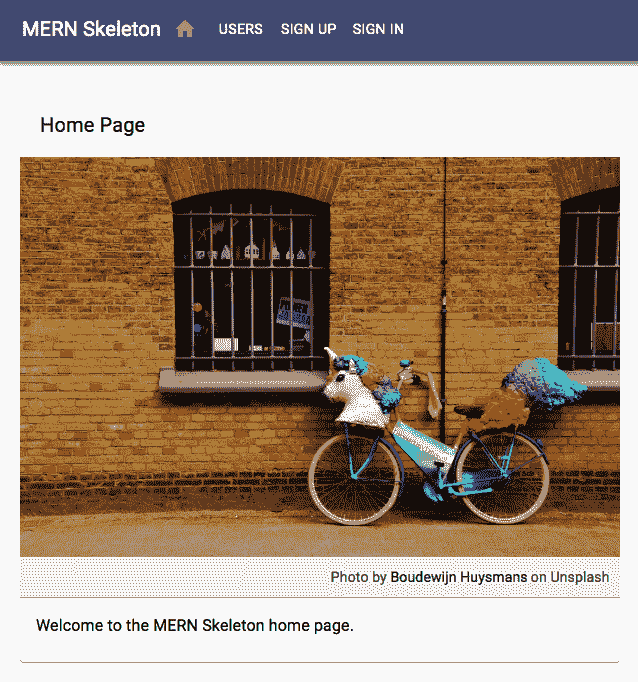
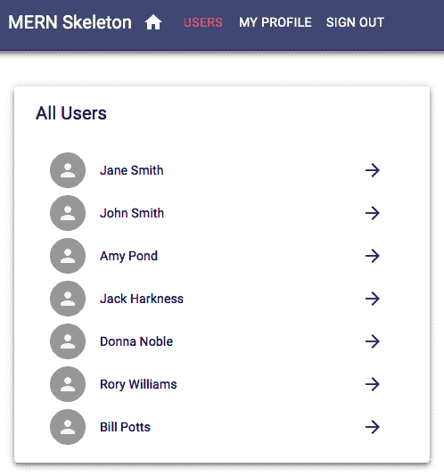
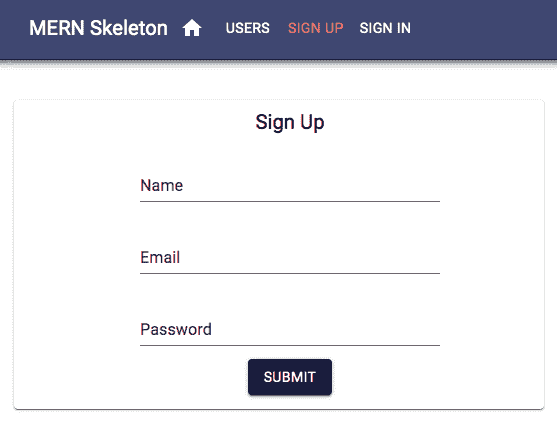
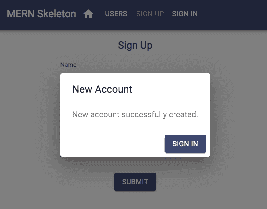
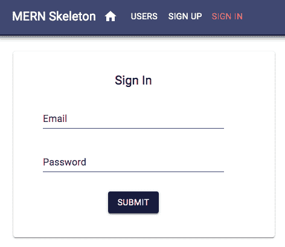
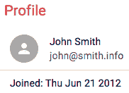
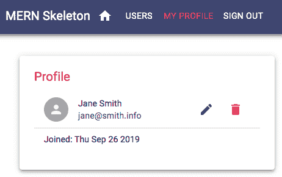
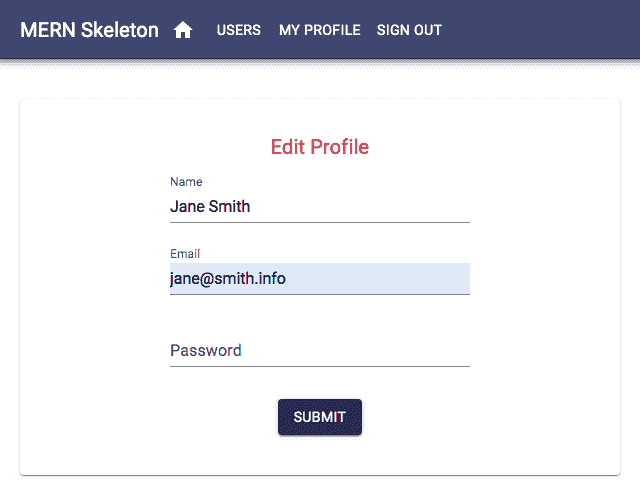
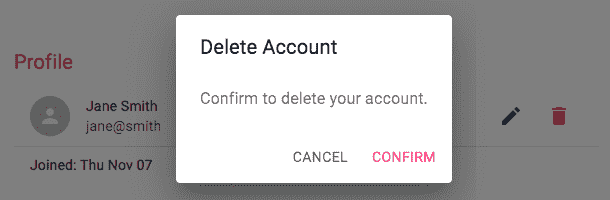

# 第六章：将 React 前端添加到完成 MERN

一个 Web 应用程序没有前端是不完整的。这是用户与之交互的部分，对于任何 Web 体验都至关重要。在本章中，我们将使用 React 为 MERN 骨架应用程序后端已实现的基本用户和认证功能添加交互式用户界面，我们在上一章中开始构建该应用程序。这个功能性的前端将添加连接到后端 API 的 React 组件，并允许用户根据授权在应用程序中无缝导航。到本章结束时，你将学会如何轻松地将 React 客户端与 Node-Express-MongoDB 服务器端集成，以创建全栈 Web 应用程序。

在本章中，我们将涵盖以下主题：

+   骨架的前端特性

+   使用 React、React Router 和 Material-UI 设置开发环境

+   使用 React 渲染主页

+   后端用户 API 集成

+   限制访问的认证集成

+   用户列表、个人资料、编辑、删除、注册和登录 UI 以完成用户前端

+   基本服务器端渲染

# 定义骨架应用程序的前端

为了完全实现我们在第三章“使用 MongoDB、Express 和 Node 构建后端”的“功能分解”部分中讨论的骨架应用程序功能，我们将向我们的基础应用程序添加以下用户界面组件：

+   **主页**：在根 URL 上渲染的视图，用于欢迎用户访问 Web 应用程序。

+   **注册页面**：一个带有用户注册表单的视图，允许新用户创建用户账户，并在成功创建后将其重定向到登录页面。

+   **登录页面**：一个带有登录表单的视图，允许现有用户登录，以便他们可以访问受保护的视图和操作。

+   **用户列表页面**：一个视图，用于从数据库中检索并显示所有用户的列表，并且还链接到单个用户个人资料。

+   **个人资料页面**：一个组件，用于检索并显示单个用户的信息。这仅对已登录用户可用，并且还包含编辑和删除选项，这些选项仅在已登录用户查看自己的个人资料时可见。

+   **编辑个人资料页面**：一个表单，用于检索用户信息以预填充表单字段。这允许用户编辑信息，并且此表单仅对尝试编辑自己个人资料的已登录用户可用。

+   **删除用户组件**：一个选项，允许已登录用户在确认其意图后删除自己的个人资料。

+   **菜单导航栏**：一个组件，列出所有对用户可用和相关的视图，并有助于指示用户在应用程序中的当前位置。

下面的 React 组件树图显示了我们将开发的所有 React 组件，以构建此基础应用程序的视图：



**MainRouter**将是主要的 React 组件。它包含应用程序中的所有其他自定义 React 视图。**首页**、**注册**、**登录**、**用户**、**个人资料**和**编辑个人资料**将在 React Router 声明的单独路由上渲染，而**菜单**组件将在所有这些视图中渲染。**删除用户**将是**个人资料**视图的一部分。

本章讨论的代码以及完整的骨架，可在 GitHub 上找到：[`github.com/PacktPublishing/Full-Stack-React-Projects-Second-Edition/tree/master/Chapter03%20and%2004/mern-skeleton`](https://github.com/PacktPublishing/Full-Stack-React-Projects-Second-Edition/tree/master/Chapter03%20and%2004/mern-skeleton)。您可以克隆此代码，并在阅读本章其余部分的代码解释时运行应用程序。

为了实现这些前端 React 视图，我们不得不扩展现有的项目代码，这些代码包含 MERN 骨架的独立服务器应用程序。接下来，我们将简要查看构成这个前端并完成全栈骨架应用程序代码所需的文件。

# 文件夹和文件结构

以下文件夹结构显示了需要添加到我们在上一章开始实现的基础项目中的新文件夹和文件，以便使用 React 前端来完成它：

```js
| mern_skeleton/
   | -- client/
      | --- assets/
         | ---- images/
      | --- auth/
         | ---- api-auth.js
         | ---- auth-helper.js
         | ---- PrivateRoute.js
         | ---- Signin.js
      | --- core/
         | ---- Home.js
         | ---- Menu.js
      | --- user/
         | ---- api-user.js
         | ---- DeleteUser.js
         | ---- EditProfile.js
         | ---- Profile.js
         | ---- Signup.js
         | ---- Users.js
      | --- App.js
      | --- main.js
      | --- MainRouter.js
      | --- theme.js
  | -- server/
      | --- devBundle.js
  | -- webpack.config.client.js
  | -- webpack.config.client.production.js
```

`client`文件夹将包含 React 组件、辅助工具和前端资产，如图片和 CSS。除了这个文件夹和用于编译和打包客户端代码的 Webpack 配置文件之外，我们还将修改一些其他现有的文件，以完成本章中完整骨架应用程序的集成。

在我们开始实现具体的前端功能之前，我们需要通过安装必要的模块并添加编译、打包和加载 React 视图的配置来为 React 开发做好准备。我们将在下一节中介绍这些设置步骤。

# 设置 React 开发环境

在我们可以在现有的骨架代码库中使用 React 进行开发之前，我们需要添加配置以编译和打包前端代码，添加构建交互式界面所需的 React 相关依赖项，并在 MERN 开发流程中将这一切结合起来。

为了实现这一点，我们将添加前端配置以编译、打包和热重载代码的 Babel、Webpack 和 React Hot Loader。接下来，我们将修改服务器代码，以便在一条命令中启动前端和后端的代码打包，使开发流程简单化。然后，我们将进一步更新代码，以便在应用程序在浏览器中运行时从服务器提供打包后的代码。最后，我们将通过安装启动前端实现所需的 React 依赖项来完成设置。

# 配置 Babel 和 Webpack

在代码可以在浏览器中运行之前，我们需要编译和捆绑我们将编写的 React 代码以实现前端。为了在开发期间运行并捆绑客户端代码，以及为生产捆绑，我们将更新 Babel 和 Webpack 的配置。然后，我们将配置 Express 应用程序以一个命令来启动前端和后端代码捆绑，这样在开发期间只需启动服务器就可以使整个堆栈准备好运行和测试。

# Babel

要编译 React，首先，通过在命令行中运行以下命令将 Babel React 预设模块作为开发依赖项安装：

```js
yarn add --dev @babel/preset-react 
```

然后，使用以下代码更新`.babelrc`。这将包括模块，并配置`react-hot-loader` Babel 插件，这是`react-hot-loader`模块所需的。

`mern-skeleton/.babelrc`:

```js
{
    "presets": [
      ["@babel/preset-env",
        {
          "targets": {
            "node": "current"
          }
        }
      ],
      "@babel/preset-react"
    ],
    "plugins": [
 "react-hot-loader/babel"
 ]
}
```

要使用此更新的 Babel 配置，我们需要更新 Webpack 配置，我们将在下一节中查看。

# Webpack

在使用 Babel 编译客户端代码后捆绑它，以及启用`react-hot-loader`以加快开发速度，通过在命令行中运行以下命令安装以下模块：

```js
yarn add -dev webpack-dev-middleware webpack-hot-middleware file-loader
yarn add react-hot-loader @hot-loader/react-dom
```

然后，为了配置 Webpack 以进行前端开发并构建生产包，我们将添加一个`webpack.config.client.js`文件和一个`webpack.config.client.production.js`文件，其中包含我们在第二章中描述的相同配置代码，*准备开发环境*。

在配置好 Webpack 并准备好捆绑前端 React 代码后，接下来，我们将添加一些可以在我们的开发流程中使用的代码。这将使全栈开发过程无缝。

# 加载开发 Webpack 中间件

在开发期间，当我们运行服务器时，Express 应用程序还应加载与前端相关的 Webpack 中间件，这与为客户端代码设置的配置相匹配，以便前端和后端开发工作流程集成。为此，我们将使用我们在第二章中讨论的`devBundle.js`文件，*准备开发环境*，以设置一个接受 Express 应用程序并配置它使用 Webpack 中间件的`compile`方法。`server`文件夹中的`devBundle.js`文件将如下所示。

`mern-skeleton/server/devBundle.js`:

```js
import config from './../config/config'
import webpack from 'webpack'
import webpackMiddleware from 'webpack-dev-middleware'
import webpackHotMiddleware from 'webpack-hot-middleware'
import webpackConfig from './../webpack.config.client.js'

const compile = (app) => {
  if(config.env === "development"){
    const compiler = webpack(webpackConfig)
    const middleware = webpackMiddleware(compiler, {
      publicPath: webpackConfig.output.publicPath
    })
    app.use(middleware)
    app.use(webpackHotMiddleware(compiler))
  }
}

export default {
  compile
}
```

在此方法中，Webpack 中间件使用在`webpack.config.client.js`中设置的值，并使用 Webpack Hot Middleware 从服务器端启用热重载。

最后，我们需要在`express.js`中导入并调用这个`compile`方法，通过添加以下突出显示的行，但仅在开发期间。

`mern-skeleton/server/express.js`:

```js
import devBundle from './devBundle'
const app = express()
devBundle.compile(app)

```

这两条加粗的行仅用于开发模式，在构建生产代码时应将其注释掉。当 Express 应用以开发模式运行时，添加此代码将导入中间件以及客户端 Webpack 配置。然后，它将启动 Webpack 来编译和打包客户端代码，并启用热重载。

打包的代码将被放置在`dist`文件夹中。这些代码将用于渲染视图。接下来，我们将配置 Express 服务器应用，使其从`dist`文件夹提供静态文件。这将确保打包的 React 代码可以在浏览器中加载。

# 加载打包的前端代码

我们将在浏览器中看到的渲染的前端视图将加载自`dist`文件夹中的打包文件。为了将这些打包文件添加到包含我们前端代码的 HTML 视图中，我们需要配置 Express 应用，使其提供静态文件，这些文件不是由服务器端代码动态生成的。

# 使用 Express 提供静态文件

为了确保 Express 服务器正确处理对静态文件（如 CSS 文件、图像或打包的客户端 JS）的请求，我们将配置它，通过在`express.js`中添加以下配置，从`dist`文件夹提供静态文件。

`mern-skeleton/server/express.js`：

```js
import path from 'path'
const CURRENT_WORKING_DIR = process.cwd()
app.use('/dist', express.static(path.join(CURRENT_WORKING_DIR, 'dist')))
```

在此配置到位后，当 Express 应用接收到以`/dist`开头的路由请求时，它将知道在返回资源之前在`dist`文件夹中查找请求的静态资源。现在，我们可以在前端加载`dist`文件夹中的打包文件。

# 更新模板以加载打包的脚本

为了将打包的前端代码添加到 HTML 中以便渲染我们的 React 前端，我们将更新`template.js`文件，使其将`dist`文件夹中的脚本文件添加到`<body>`标签的末尾。

`mern-skeleton/template.js`：

```js
...
<body>
    <div id="root"></div>
    <script type="text/javascript" src="img/bundle.js"></script>
</body>
```

当我们在服务器运行时访问根 URL `'/'` 时，此脚本标签将在浏览器中加载我们的 React 前端代码。我们已经准备好看到这一效果，并可以开始安装将添加 React 视图的依赖项。

# 添加 React 依赖项

我们骨架应用的前端视图将主要使用 React 来实现。此外，为了启用客户端路由，我们将使用 React Router，并且为了通过简洁的外观和感觉提升用户体验，我们将使用 Material-UI。为了添加这些库，我们将在本节中安装以下模块：

+   **核心 React 模块**：`react` 和 `react-dom`

+   **React Router 模块**：`react-router` 和 `react-router-dom`

+   **Material-UI 模块**：`@material-ui/core` 和 `@material-ui/icons`

# React

在整本书中，我们将使用 React 来编写前端代码。为了开始编写 React 组件代码，我们需要将以下模块作为常规依赖项安装：

```js
yarn add react react-dom
```

这些是实施基于 React 的 Web 前端所必需的核心 React 库模块。通过添加其他附加模块，我们将在 React 之上添加更多功能。

# React Router

React Router 提供了一组导航组件，这些组件使 React 应用程序在前端实现路由功能。我们将添加以下 React Router 模块：

```js
yarn add react-router react-router-dom
```

这些模块将使我们能够利用声明式路由，并在前端拥有可书签的 URL 路由。

# Material-UI

为了保持我们的 MERN 应用程序的 UI 简洁，而不深入 UI 设计和实现，我们将利用 Material-UI 库。它提供了现成可使用且可定制的 React 组件，实现了谷歌的材质设计。为了开始使用 Material-UI 组件来构建前端，我们需要安装以下模块：

```js
yarn add @material-ui/core @material-ui/icons 
```

在撰写本文时，Material-UI 的最新版本是`4.9.8`。建议您安装此确切版本，以确保示例项目的代码不会出错。

为了添加 Material-UI 推荐的`Roboto`字体并使用`Material-UI`图标，我们将把相关的样式链接添加到`template.js`文件中，在 HTML 文档的`<head>`部分：

```js
<link rel="stylesheet" href="https://fonts.googleapis.com/css?family=Roboto:100,300,400">
<link href="https://fonts.googleapis.com/icon?family=Material+Icons" rel="stylesheet">
```

在开发配置全部设置完成，并将必要的 React 模块添加到代码库之后，我们现在可以开始实现自定义的 React 组件，从主页开始。这个页面应该作为完整应用程序的第一个视图加载。

# 渲染主页视图

为了展示如何实现这个 MERN 框架的前端功能，我们将首先详细说明如何在应用程序的根路由上渲染一个简单的首页，然后再介绍后端 API 集成、用户认证集成，以及在本章的其余部分实现其他视图组件。

在根路由上实现和渲染一个工作的`Home`组件的过程，也将揭示前端代码骨架的基本结构。我们将从包含整个 React 应用的顶级入口组件开始，该组件渲染主路由组件，它将应用程序中的所有 React 组件链接起来。

在接下来的章节中，我们将开始实施 React 前端。首先，我们将添加根 React 组件，该组件与 React Router 和 Material-UI 集成，并配置为热重载。我们还将学习如何自定义 Material-UI 主题，并使主题对所有组件可用。最后，我们将实现并加载代表主页的 React 组件，从而展示如何在应用程序中添加和渲染 React 视图。

# 入口点在 main.js

客户端文件夹中的`client/main.js`文件将是渲染完整 React 应用程序的入口点，如客户端 Webpack 配置对象中已指示的那样。在`client/main.js`中，我们导入包含整个前端的最顶层或最高级 React 组件，并将其渲染到 HTML 文档中`template.js`指定的具有`'root'` ID 的`div`元素中。

`mern-skeleton/client/main.js`:

```js
import React from 'react'
import { render } from 'react-dom'
import App from './App'

render(<App/>, document.getElementById('root'))
```

在这里，最高级的根 React 组件是`App`组件，它正在 HTML 中被渲染。`App`组件在`client/App.js`中定义，如下一小节所述。

# 根 React 组件

将包含应用程序前端所有组件的最高级 React 组件定义在`client/App.js`文件中。在这个文件中，我们配置 React 应用程序，使其使用定制的 Material-UI 主题渲染视图组件，启用前端路由，并确保 React Hot Loader 可以在我们开发组件时即时加载更改。

在以下章节中，我们将添加代码来自定义主题，使此主题和 React Router 功能可供我们的 React 组件使用，并配置用于热加载的根组件。

# 自定义 Material-UI 主题

可以使用`ThemeProvider`组件轻松地自定义 Material-UI 主题。它还可以用于在`createMuiTheme()`中配置主题变量的自定义值。我们将使用`createMuiTheme`在`client/theme.js`中为骨架应用程序定义一个自定义主题，然后将其导出，以便在`App`组件中使用。

`mern-skeleton/client/theme.js`:

```js
import { createMuiTheme } from '@material-ui/core/styles'
import { pink } from '@material-ui/core/colors'

const theme = createMuiTheme({
    typography: {
      useNextVariants: true,
    },
    palette: {
      primary: {
      light: '#5c67a3',
      main: '#3f4771',
      dark: '#2e355b',
      contrastText: '#fff',
    },
    secondary: {
      light: '#ff79b0',
      main: '#ff4081',
      dark: '#c60055',
      contrastText: '#000',
    },
      openTitle: '#3f4771',
      protectedTitle: pink['400'],
      type: 'light'
    }
})

export default theme
```

对于骨架，我们只通过设置一些用于 UI 的颜色值进行最小化定制。这里生成的主题变量将被传递到，并在我们构建的所有组件中使用。

# 使用 ThemeProvider 和 BrowserRouter 包装根组件

我们将创建以构成用户界面的自定义 React 组件将通过`MainRouter`组件中指定的前端路由来访问。本质上，此组件包含了为应用程序开发的所有自定义视图，需要提供主题值和路由功能。此组件将是根`App`组件中的核心组件，该组件在以下代码中定义。

`mern-skeleton/client/App.js`:

```js
import React from 'react'
import MainRouter from './MainRouter'
import {BrowserRouter} from 'react-router-dom'
import { ThemeProvider } from '@material-ui/styles'
import theme from './theme'

const App = () => {
  return (
    <BrowserRouter>
      <ThemeProvider theme={theme}>
        <MainRouter/>
      </ThemeProvider>
    </BrowserRouter>
)}
```

在`App.js`中定义此根组件时，我们将`MainRouter`组件包裹在`ThemeProvider`中，使其能够访问 Material-UI 主题，以及`BrowserRouter`，它通过 React Router 启用前端路由。我们之前定义的自定义主题变量作为属性传递给`ThemeProvider`，使主题可在所有自定义 React 组件中使用。最后，在`App.js`文件中，我们需要导出此`App`组件，以便可以在`main.js`中导入和使用。

# 标记根组件为热导出

`App.js`中的最后一行代码，用于导出`App`组件，使用了`react-hot-loader`的**高阶组件**（**HOC**）`hot`模块来标记根组件为`hot`。

`mern-skeleton/client/App.js`:

```js
import { hot } from 'react-hot-loader'
const App = () => { ... }
export default hot(module)(App)
```

以这种方式标记`App`组件为`hot`实际上在开发期间启用了我们的 React 组件的实时重新加载。

在这一点之后，对于我们的 MERN 应用，我们不需要太多地更改`main.js`和`App.js`代码，我们可以通过将新组件注入到`MainRouter`组件中继续构建 React 应用的其余部分，这正是我们将在下一节中做的。

# 向 MainRouter 添加主页路由

`MainRouter.js`代码将帮助我们根据应用中的路由或位置渲染自定义 React 组件。在这个第一个版本中，我们只会添加根路由以渲染`Home`组件。

`mern-skeleton/client/MainRouter.js`:

```js
import React from 'react'
import {Route, Switch} from 'react-router-dom'
import Home from './core/Home'
const MainRouter = () => {
    return ( <div>
      <Switch>
        <Route exact path="/" component={Home}/>
      </Switch>
    </div>
   )
}
export default MainRouter
```

随着我们开发更多的视图组件，我们将更新`MainRouter`并在`Switch`组件内添加新组件的路由。

React Router 中的`Switch`组件渲染一个特定的路由。换句话说，它只渲染与请求的路由路径匹配的第一个子组件。另一方面，如果没有嵌套在`Switch`中，当有路径匹配时，每个`Route`组件都会全面渲染；例如，对`'/'`的请求也匹配`'/contact'`路由。

我们在`MainRouter`中添加此路由的`Home`组件需要被定义和导出，我们将在下一节中这样做。

# `Home`组件

`Home`组件将是包含骨架应用主页视图的 React 组件。当用户访问根路由时，它将在浏览器中渲染，我们将使用 Material-UI 组件来组合它。

以下截图显示了`Home`组件，以及将在本章后面作为单独组件实现的`Menu`组件，该组件将提供跨应用导航：



将在浏览器中渲染并供用户交互的`Home`组件和其他视图组件将遵循一个常见的代码结构，包含以下部分（按顺序）：

+   导入构建组件所需的库、模块和文件

+   样式声明，用于定义组件元素的特定 CSS 样式

+   定义 React 组件的函数

在本书中，随着我们开发代表前端视图的新 React 组件，我们将主要关注 React 组件定义部分。但为了我们的第一次实现，我们将详细阐述所有这些部分以介绍必要的结构。

# 导入

对于每个 React 组件实现，我们需要导入实现代码中使用的库、模块和文件。组件文件将首先从 React、Material-UI、React Router 模块、图片、CSS、API 获取以及我们代码中的认证助手导入，具体取决于特定组件的需求。例如，对于`Home.js`中的`Home`组件代码，我们使用以下导入。

`mern-skeleton/client/core/Home.js`:

```js
import React from 'react'
import { makeStyles } from '@material-ui/core/styles'
import Card from '@material-ui/core/Card'
import CardContent from '@material-ui/core/CardContent'
import CardMedia from '@material-ui/core/CardMedia'
import Typography from '@material-ui/core/Typography'
import unicornbikeImg from './../assets/images/unicornbike.jpg'
```

图片文件保存在`client/assets/images/`文件夹中，并导入以便将其添加到`Home`组件中。这些导入将帮助我们构建组件并定义组件中使用的样式。

# 样式声明

在导入之后，我们将通过利用`Material-UI`主题变量和`makeStyles`（这是由`Material-UI`提供的自定义 React Hook API）来定义所需的 CSS 样式，以通过`Material-UI`主题变量和`makeStyles`来设置组件中的元素样式。

Hooks 是 React 的新特性。Hooks 是函数，使得在函数组件中可以使用 React 状态和生命周期特性，而无需编写一个类来定义组件。React 提供了一些内置的 Hooks，但根据需要我们也可以构建自定义 Hooks 以在不同组件间重用有状态的行为。要了解更多关于 React Hooks 的信息，请访问[reactjs.org/docs/hooks-intro.html](https://reactjs.org/docs/hooks-intro.html)。

对于`Home.js`中的`Home`组件，我们有以下样式。

`mern-skeleton/client/core/Home.js`:

```js
const useStyles = makeStyles(theme => ({
  card: {
    maxWidth: 600,
    margin: 'auto',
    marginTop: theme.spacing(5)
  },
  title: {
    padding:`${theme.spacing(3)}px ${theme.spacing(2.5)}px ${theme.spacing(2)}px`,
    color: theme.palette.openTitle
  },
  media: {
    minHeight: 400
  }
})) 
```

在这里定义的 JSS 样式对象将通过`makeStyles` Hook 返回的 Hook 注入到组件中。`makeStyles` Hook API 接受一个函数作为参数，并提供访问我们自定义主题变量的权限，我们可以在定义样式时使用这些变量。

Material-UI 使用 JSS，这是一个用于向组件添加样式的 CSS-in-JS 样式解决方案。JSS 使用 JavaScript 作为描述样式的语言。本书不会详细涵盖 CSS 和样式实现。它将主要依赖于 Material-UI 组件的默认外观和感觉。要了解更多关于 JSS 的信息，请访问[`cssinjs.org/?v=v9.8.1`](http://cssinjs.org/?v=v9.8.1)。有关如何自定义`Material-UI`组件样式的示例，请查看 Material-UI 文档[`material-ui.com/`](https://material-ui.com/)。

我们可以使用这些生成的样式来设置组件中的元素样式，如下面的`Home`组件定义所示。

# 组件定义

在编写定义组件的函数时，我们将组合组件的内容和行为。`Home`组件将包含一个带有标题、图片和说明的 Material-UI `Card`，所有这些都将使用我们之前定义并调用`useStyles()` Hook 返回的样式进行样式化。

`mern-skeleton/client/core/Home.js`:

```js
export default function Home(){
  const classes = useStyles()
    return (
     <Card className={classes.card}>
        <Typography variant="h6" className={classes.title}>
          Home Page
        </Typography>
        <CardMedia className={classes.media} 
                   image={unicornbikeImg} title="Unicorn Bicycle"/>
        <CardContent>
          <Typography variant="body2" component="p">
            Welcome to the MERN Skeleton home page.
          </Typography>
        </CardContent>
      </Card>
    )
}
```

在前面的代码中，我们定义并导出了一个名为`Home`的函数组件。现在，这个导出的组件可以在其他组件内部进行组合。正如我们之前讨论的那样，我们已经在`MainRouter`组件中的一个路由中导入了此`Home`组件。

在本书的整个过程中，我们将定义所有我们的 React 组件为函数组件。我们将利用 React Hooks，这是 React 的新增功能，来添加状态和生命周期特性，而不是使用类定义来实现相同的功能。

我们将在我们的 MERN 应用程序中实现的其他视图组件将遵循相同的结构。在本书的剩余部分，我们将主要关注组件定义，突出实现组件的独特方面。

我们几乎准备好运行此代码以在前端渲染主页组件。但在那之前，我们需要更新 Webpack 配置，以便我们可以捆绑和显示图像。

# 捆绑图像资源

我们导入到`Home`组件视图中的静态图像文件也必须包含在与其他编译 JS 代码捆绑的捆绑包中，以便代码可以访问和加载它。为了启用此功能，我们需要更新 Webpack 配置文件，并添加一个模块规则来加载、捆绑并将图像文件输出到`dist`目录，该目录包含编译的前端和后端代码。

更新`webpack.config.client.js`、`webpack.config.server.js`和`webpack.config.client.production.js`文件，以便在`babel-loader`使用后添加以下模块规则：

```js
[ …
    {
       test: /\.(ttf|eot|svg|gif|jpg|png)(\?[\s\S]+)?$/,
       use: 'file-loader'
    }
]
```

此模块规则使用 Webpack 的`file-loader`节点模块，需要将其作为开发依赖项安装，如下所示：

```js
yarn add --dev file-loader
```

添加了此图像捆绑配置后，当运行应用程序时，主页组件应成功渲染图像。

# 在浏览器中运行和打开

到目前为止的客户端代码可以运行，这样我们就可以在根 URL 中查看`Home`组件。要运行应用程序，请使用以下命令：

```js
yarn development
```

然后，在浏览器中打开根 URL（`http://localhost:3000`）以查看`Home`组件。

我们在本节中开发的`Home`组件是一个基本的视图组件，没有交互功能，并且不需要使用后端 API 进行用户 CRUD 或认证。然而，我们前端骨架的剩余视图组件将需要后端 API 和认证，因此我们将探讨如何在下一节中集成这些功能。

# 集成后端 API

用户应该能够使用前端视图根据认证和授权从数据库中检索和修改用户数据。为了实现这些功能，React 组件将使用 Fetch API 访问后端公开的 API 端点。

Fetch API 是一个较新的标准，它使网络请求类似于**XMLHttpRequest**（XHR），但使用 promise 而不是回调，从而实现了一个更简单、更干净的 API。要了解更多关于 Fetch API 的信息，请访问[`developer.mozilla.org/en-US/docs/Web/API/Fetch_API`](https://developer.mozilla.org/en-US/docs/Web/API/Fetch_API)。

# 用户 CRUD 的获取

在`client/user/api-user.js`文件中，我们将添加访问每个用户 CRUD API 端点的方法，React 组件可以使用这些方法根据需要与服务器和数据库交换用户数据。在接下来的章节中，我们将探讨这些方法的实现以及它们如何对应到每个 CRUD 端点。

# 创建用户

`create`方法将从视图组件获取用户数据，我们将在那里调用此方法。然后，它将使用`fetch`在创建 API 路由`'/api/users'`上发起一个`POST`调用，以在后端使用提供的数据创建一个新用户。

`mern-skeleton/client/user/api-user.js`:

```js
const create = async (user) => {
  try {
      let response = await fetch('/api/users/', {
        method: 'POST',
        headers: {
          'Accept': 'application/json',
          'Content-Type': 'application/json'
        },
        body: JSON.stringify(user)
      })
    return await response.json()
  } catch(err) {
    console.log(err)
  }
}
```

最后，在这个方法中，我们作为 promise 返回来自服务器的响应。因此，调用此方法的组件可以使用这个 promise 来适当地处理响应，具体取决于从服务器返回的内容。同样，我们将在下一节中实现`list`方法。

# 列出用户

`list`方法将使用`fetch`发起一个`GET`调用，以检索数据库中的所有用户，然后作为 promise 将服务器的响应返回给组件。

`mern-skeleton/client/user/api-user.js`:

```js
const list = async (signal) => {
  try {
    let response = await fetch('/api/users/', {
      method: 'GET',
      signal: signal,
    })
    return await response.json()
  } catch(err) {
    console.log(err)
  }
}
```

如果返回的 promise 成功解析，将给组件提供一个包含从数据库检索到的用户对象的数组。在单个用户读取的情况下，我们将处理单个用户对象，如下所示。

# 阅读用户资料

`read`方法将使用`fetch`发起一个`GET`调用，通过 ID 检索特定用户。由于这是一个受保护的路由，除了传递用户 ID 作为参数外，请求的组件还必须提供有效的凭据，在这种情况下，将是一个在成功登录后收到的有效 JWT。

`mern-skeleton/client/user/api-user.js`:

```js
const read = async (params, credentials, signal) => {
  try {
    let response = await fetch('/api/users/' + params.userId, {
      method: 'GET',
      signal: signal,
      headers: {
        'Accept': 'application/json',
        'Content-Type': 'application/json',
        'Authorization': 'Bearer ' + credentials.t
      }
    })
    return await response.json()
  } catch(err) {
    console.log(err)
  }
}
```

JWT 通过`Bearer`方案附加到`GET` fetch 调用中的`Authorization`头，然后服务器响应作为 promise 返回给组件。当这个 promise 解析时，它将要么给组件提供特定用户的用户详情，要么通知访问权限仅限于认证用户。同样，更新的用户 API 方法也需要为 fetch 调用传递有效的 JWT 凭据，如下一节所示。

# 更新用户数据

`update`方法将获取特定用户的更改后的用户数据，然后使用`fetch`发起一个`PUT`调用，以更新后端中现有的用户。这也是一个受保护的路由，将需要有效的 JWT 作为凭据。

`mern-skeleton/client/user/api-user.js`:

```js
const update = async (params, credentials, user) => {
  try {
    let response = await fetch('/api/users/' + params.userId, {
      method: 'PUT',
      headers: {
        'Accept': 'application/json',
        'Content-Type': 'application/json',
        'Authorization': 'Bearer ' + credentials.t
      },
      body: JSON.stringify(user)
    })
    return await response.json()
  } catch(err) {
    console.log(err)
  }
}
```

正如我们看到的其他 `fetch` 调用一样，此方法也将返回一个包含服务器对用户更新请求响应的承诺。在最后一个方法中，我们将学习如何调用用户删除 API。

# 删除用户

`remove` 方法将允许视图组件从数据库中删除特定用户，并使用 `fetch` 发起一个 `DELETE` 请求。这同样是一个受保护的路线，需要有效的 JWT 作为凭证，类似于 `read` 和 `update` 方法。

`mern-skeleton/client/user/api-user.js`:

```js
const remove = async (params, credentials) => {
  try {
    let response = await fetch('/api/users/' + params.userId, {
      method: 'DELETE',
      headers: {
        'Accept': 'application/json',
        'Content-Type': 'application/json',
        'Authorization': 'Bearer ' + credentials.t
      }
    })
    return await response.json()
  } catch(err) {
    console.log(err)
  }
}
```

服务器对删除请求的响应将以承诺的形式返回到组件中，就像其他方法一样。

在这五个辅助方法中，我们已经涵盖了所有与用户 CRUD 相关的后端实现的 API 端点调用。最后，我们可以如下从 `api-user.js` 文件导出这些方法。

`mern-skeleton/client/user/api-user.js`:

```js
export { create, list, read, update, remove }
```

这些用户 CRUD 方法现在可以根据需要由 React 组件导入和使用。接下来，我们将实现类似的辅助方法以集成与认证相关的 API 端点。

# 为认证 API 获取

为了将服务器端的认证 API 端点与前端 React 组件集成，我们将在 `client/auth/api-auth.js` 文件中添加获取登录和注销 API 端点的方法。让我们来看看它们。

# 登录

`signin` 方法将从视图组件获取用户登录数据，然后使用 `fetch` 发起一个 `POST` 请求以验证用户与后端。

`mern-skeleton/client/auth/api-auth.js`:

```js
const signin = async (user) => {
  try {
    let response = await fetch('/auth/signin/', {
      method: 'POST',
      headers: {
        'Accept': 'application/json',
        'Content-Type': 'application/json'
      },
      credentials: 'include',
      body: JSON.stringify(user)
    })
    return await response.json()
  } catch(err) {
    console.log(err)
  }
}
```

服务器响应将以承诺的形式返回到组件中，如果登录成功，可能会提供 JWT。调用此方法的组件需要适当地处理响应，例如将接收到的 JWT 本地存储，以便在从前端调用其他受保护 API 路由时使用。我们将在本章后面实现 **登录** 视图时查看此实现。

用户成功登录后，我们还想在用户注销时调用注销 API。接下来将讨论注销 API 的调用。

# 注销

我们将在 `api-auth.js` 中添加一个 `signout` 方法，它将使用 `fetch` 发起一个 GET 请求到服务器的注销 API 端点。

`mern-skeleton/client/auth/api-auth.js`:

```js
const signout = async () => {
  try {
    let response = await fetch('/auth/signout/', { method: 'GET' })
    return await response.json()
  } catch(err) {
    console.log(err)
  }
}
```

此方法也将返回一个承诺，以通知组件 API 请求是否成功。

在 `api-auth.js` 文件的末尾，我们将导出 `signin` 和 `signout` 方法。

`mern-skeleton/client/auth/api-auth.js`:

```js
export { signin, signout }
```

现在，这些方法可以被导入到相关的 React 组件中，以便我们可以实现用户登录和注销功能。

在添加了这些 API 获取方法之后，React 前端可以完全访问我们在后端提供的端点。在我们开始在 React 组件中使用这些方法之前，我们将探讨如何在前端维护用户认证状态。

# 在前端添加认证

正如我们在上一章中讨论的，使用 JWT 实现认证将管理用户认证状态的责任转移给了客户端。为此，我们需要编写代码，允许客户端在成功登录后存储从服务器接收到的 JWT，在访问受保护的路由时使其可用，当用户登出时删除或使令牌无效，并且根据用户认证状态限制对视图和组件的前端访问。

使用 React Router 文档中的认证工作流程示例，在以下章节中，我们将编写辅助方法来管理组件间的认证状态，并使用自定义的 `PrivateRoute` 组件将受保护的路由添加到 MERN 骨架应用程序的前端。

# 管理认证状态

为了管理应用程序前端中的认证状态，前端需要能够存储、检索和删除在用户成功登录时从服务器接收到的认证凭据。在我们的 MERN 应用程序中，我们将使用浏览器的 `sessionStorage` 作为存储选项来存储 JWT 认证凭据。

或者，您可以使用 `localStorage` 而不是 `sessionStorage` 来存储 JWT 凭据。使用 `sessionStorage`，用户认证状态将仅在当前窗口标签中记住。使用 `localStorage`，用户认证状态将在浏览器的标签间记住。

在 `client/auth/auth-helper.js` 中，我们将定义以下章节中讨论的辅助方法，以从客户端的 `sessionStorage` 中存储和检索 JWT 凭据，并在用户登出时清除 `sessionStorage`。

# 保存凭据

为了在成功登录后保存从服务器接收到的 JWT 凭据，我们使用 `authenticate` 方法，该方法定义如下。

`mern-skeleton/client/auth/auth-helper.js`:

```js
authenticate(jwt, cb) {
    if(typeof window !== "undefined")
        sessionStorage.setItem('jwt', JSON.stringify(jwt))
    cb()
}
```

`authenticate` 方法接受 JWT 凭据 `jwt` 和一个回调函数 `cb` 作为参数。在确保 `window` 已定义后，即在确保此代码在浏览器中运行并因此可以访问 `sessionStorage` 后，它将凭据存储在 `sessionStorage` 中。然后，它执行传入的回调函数。此回调将允许组件——在我们的例子中，是调用登录的组件——定义在成功登录并存储凭据后应执行的操作。接下来，我们将讨论让我们访问这些存储凭据的方法。

# 检索凭据

在我们的前端组件中，我们需要检索存储的凭据以检查当前用户是否已登录。在 `isAuthenticated()` 方法中，我们可以从 `sessionStorage` 中检索这些凭据。

`mern-skeleton/client/auth/auth-helper.js`:

```js
isAuthenticated() {
    if (typeof window == "undefined")
      return false

    if (sessionStorage.getItem('jwt'))
      return JSON.parse(sessionStorage.getItem('jwt'))
    else
      return false
}
```

对`isAuthenticated()`的调用将返回存储的凭据或`false`，这取决于是否在`sessionStorage`中找到了凭据。在存储中找到凭据意味着用户已登录，而没有找到凭据则意味着用户未登录。我们还将添加一个方法，允许我们在登录用户从应用程序注销时从存储中删除凭据。

# 删除凭据

当用户成功从应用程序注销时，我们希望从`sessionStorage`中清除存储的 JWT 凭据。这可以通过调用以下代码中定义的`clearJWT`方法来实现。

`mern-skeleton/client/auth/auth-helper.js`:

```js
clearJWT(cb) {
      if(typeof window !== "undefined")
        sessionStorage.removeItem('jwt')
      cb()
      signout().then((data) => {
          document.cookie = "t=; expires=Thu, 01 Jan 1970 00:00:00 
          UTC; path=/;"
      })
}
```

这个`clearJWT`方法接受一个回调函数作为参数，并从`sessionStorage`中移除 JWT 凭据。传入的`cb()`函数允许启动`signout`功能的组件决定在成功注销后应该发生什么。

`clearJWT`方法还使用了我们在`api-auth.js`中定义的`signout`方法来调用后端中的注销 API。如果我们使用`cookies`而不是`sessionStorage`来存储凭据，那么对这个 API 调用的响应将是我们清除 cookie 的地方，如前面的代码所示。使用注销 API 调用是可选的，因为这取决于是否使用 cookie 作为凭据存储机制。

使用这三个方法，我们现在有了在客户端存储、检索和删除 JWT 凭据的方法。使用这些方法，我们为前端构建的 React 组件将能够检查和管理用户认证状态，以限制前端访问，如下一节中自定义`PrivateRoute`组件所示。

# `PrivateRoute`组件

文件中的代码定义了`PrivateRoute`组件，如[`reacttraining.com/react-router/web/example/auth-workflow`](https://reacttraining.com/react-router/web/example/auth-workflow)中的认证流程示例所示，该示例可在 React Router 文档中找到。它将允许我们为前端声明受保护的路线，根据用户认证来限制视图访问。

`mern-skeleton/client/auth/PrivateRoute.js`:

```js
import React, { Component } from 'react'
import { Route, Redirect } from 'react-router-dom'
import auth from './auth-helper'

const PrivateRoute = ({ component: Component, ...rest }) => (
  <Route {...rest} render={props => (
    auth.isAuthenticated() ? (
      <Component {...props}/>
    ) : (
      <Redirect to={{
        pathname: '/signin',
        state: { from: props.location }
      }}/>
    )
  )}/>
)

export default PrivateRoute
```

在此`PrivateRoute`中要渲染的组件只有在用户认证时才会加载，这是通过调用`isAuthenticated`方法确定的；否则，用户将被重定向到`Signin`组件。我们将在`PrivateRoute`中加载应有限制访问的组件，例如用户配置文件组件，这将确保只有认证用户才能查看用户配置文件页面。

在将后端 API 集成并准备好在组件中使用认证管理辅助方法后，我们现在可以开始构建剩余的视图组件，这些组件利用这些方法并完成前端。

# 完成用户前端

本节中将要描述的 React 组件通过允许用户根据认证限制查看、创建和修改存储在数据库中的用户数据，从而完成我们为骨架定义的交互式功能。我们将实现的组件如下：

+   `Users`: 从数据库获取并显示所有用户

+   `Signup`: 显示一个表单，允许新用户注册

+   `Signin`: 显示一个表单，允许现有用户登录

+   `Profile`: 在从数据库检索后显示特定用户的详细信息

+   `EditProfile`: 显示特定用户的详细信息，并允许授权用户更新这些信息

+   `DeleteUser`: 允许授权用户从应用程序中删除他们的账户

+   `Menu`: 为应用程序中的每个视图添加一个通用的导航栏

对于这些组件中的每一个，我们将讨论它们的独特之处，以及如何在`MainRouter`中添加它们。

# 用户组件

`client/user/Users.js`中的`Users`组件显示了从数据库中检索到的所有用户的名称，并将每个名称链接到用户个人资料。以下组件可以被应用程序的任何访客查看，并在`'/users'`路由上渲染：



在组件定义中，类似于我们实现`Home`组件的方式，我们定义并导出一个函数组件。在这个组件中，我们首先使用一个空的用户数组初始化状态。

`mern-skeleton/client/user/Users.js`:

```js
export default function Users() {
 ...
 const [users, setUsers] = useState([])
 ...
}
```

我们使用内置的 React 钩子`useState`给这个函数组件添加状态。通过调用这个钩子，我们实际上声明了一个名为`users`的状态变量，可以通过调用`setUsers`来更新它，并将`users`的初始值设置为`[]`。

使用内置的`useState`钩子允许我们在 React 中给函数组件添加状态行为。调用它将声明一个状态变量，类似于在类组件定义中使用`this.state`。传递给`useState`的参数是这个变量的初始值——换句话说，初始状态。调用`useState`返回当前状态和一个更新状态值的函数，这类似于类定义中的`this.setState`。

在初始化`users`状态后，接下来我们将使用另一个内置的 React 钩子`useEffect`从后端获取用户列表并更新状态中的`users`值。

`useEffect`钩子用于替代我们本应在 React 类中使用的`componentDidMount`、`componentDidUpdate`和`componentWillUnmount`生命周期方法。在函数组件中使用此钩子允许我们执行副作用，例如从后端获取数据。默认情况下，React 在每次渲染后（包括第一次渲染）都会运行使用`useEffect`定义的效果。但我们可以指示效果仅在状态发生变化时重新运行。可选地，我们还可以定义在效果之后如何清理，例如，在组件卸载时执行取消 fetch 信号等操作，以避免内存泄漏。

在我们的`Users`组件中，我们使用`useEffect`来调用`api-user.js`辅助方法中的`list`方法。这将从后端获取用户列表，并通过更新状态将用户数据加载到组件中。

`mern-skeleton/client/user/Users.js`:

```js
  useEffect(() => {
    const abortController = new AbortController()
    const signal = abortController.signal

    list(signal).then((data) => {
      if (data && data.error) {
        console.log(data.error)
      } else {
        setUsers(data)
      }
    })

    return function cleanup(){
      abortController.abort()
    }
  }, [])
```

在此效果中，我们还添加了一个清理函数，在组件卸载时取消 fetch 调用。为了将信号与 fetch 调用关联起来，我们使用 AbortController Web API，这允许我们根据需要取消 DOM 请求。

在此`useEffect`钩子的第二个参数中，我们传递一个空数组，以便此效果清理只在组件挂载和卸载时运行一次，而不是在每次渲染后。

最后，在`Users`函数组件的返回值中，我们添加实际视图内容。视图由 Material-UI 组件组成，如`Paper`、`List`和`ListItem`。这些元素使用`makeStyles`钩子定义和提供的 CSS 进行样式化，与`Home`组件中的方式相同。

`mern-skeleton/client/user/Users.js`:

```js
return (
      <Paper className={classes.root} elevation={4}>
        <Typography variant="h6" className={classes.title}>
          All Users
        </Typography>
        <List dense>
         {users.map((item, i) => {
          return <Link to={"/user/" + item._id} key={i}>
                    <ListItem button>
                      <ListItemAvatar>
                        <Avatar>
                          <Person/>
                        </Avatar>
                      </ListItemAvatar>
                      <ListItemText primary={item.name}/>
                      <ListItemSecondaryAction>
                      <IconButton>
                          <ArrowForward/>
                      </IconButton>
                      </ListItemSecondaryAction>
                    </ListItem>
                 </Link>
               })
             }
        </List>
      </Paper>
)
```

在这种观点下，为了生成每个列表项，我们使用`map`函数遍历状态中的用户数组。每个列表项都会渲染从用户数组中访问的每个项目的单个用户名称。

要将此`Users`组件添加到 React 应用程序中，我们需要更新`MainRouter`组件，添加一个在`'/users'`路径上渲染此组件的`Route`。在`Home`路由之后，将`Route`添加到`Switch`组件内部。

`mern-skeleton/client/MainRouter.js`:

```js
<Route path="/users" component={Users}/>
```

要在浏览器中看到此视图的渲染效果，您可以暂时将`Link`组件添加到`Home`组件中，以便能够路由到`Users`组件：

```js
<Link to="/users">Users</Link>
```

在浏览器中渲染根路由的首页视图后，点击此链接将显示我们在本节中实现的`Users`组件。我们将在下一节中类似地实现其他 React 组件，从`Signup`组件开始。

# 注册组件

`client/user/Signup.js`中的`Signup`组件向用户展示一个包含姓名、电子邮件和密码字段的表单，用于在`'/signup'`路径上注册，如下截图所示：



在组件定义中，我们使用 `useState` 钩子初始化状态，使用空的输入字段值、空的错误消息，并将对话框打开变量设置为 `false`。

`mern-skeleton/client/user/Signup.js`:

```js
export default function Signup() {
  ...  
  const [values, setValues] = useState({
    name: '',
    password: '',
    email: '',
    open: false,
    error: ''
  })
  ...
}
```

我们还定义了两个处理函数，用于在输入值更改或点击提交按钮时调用。`handleChange` 函数接受输入字段中输入的新值，并将其设置为状态。

`mern-skeleton/client/user/Signup.js`:

```js
const handleChange = name => event => {
    setValues({ ...values, [name]: event.target.value })
}
```

当表单提交时，会调用 `clickSubmit` 函数。该函数从状态中获取输入值，并调用 `create` fetch 方法在后端注册用户。然后，根据服务器的响应，要么显示错误消息，要么显示成功对话框。

`mern-skeleton/client/user/Signup.js`:

```js
  const clickSubmit = () => {
    const user = {
      name: values.name || undefined,
      email: values.email || undefined,
      password: values.password || undefined
    }
    create(user).then((data) => {
      if (data.error) {
        setValues({ ...values, error: data.error})
      } else {
        setValues({ ...values, error: '', open: true})
      }
    })
  }
```

在 `return` 函数中，我们使用 Material-UI 的 `TextField` 等组件组合和样式化注册视图中的表单组件。

`mern-skeleton/client/user/Signup.js`:

```js
return (
    <div>
      <Card className={classes.card}>
        <CardContent>
          <Typography variant="h6" className={classes.title}>
            Sign Up
          </Typography>
          <TextField id="name" label="Name" 
             className={classes.textField} 
             value={values.name} onChange={handleChange('name')} 
             margin="normal"/>
          <br/>
          <TextField id="email" type="email" label="Email" 
             className={classes.textField} 
             value={values.email} onChange={handleChange('email')} 
             margin="normal"/>
          <br/>
          <TextField id="password" type="password" label="Password" 
             className={classes.textField} value={values.password} 
             onChange={handleChange('password')} margin="normal"/>
          <br/> 
          {
            values.error && (<Typography component="p" color="error">
              <Icon color="error" className={classes.error}>error</Icon>
              {values.error}</Typography>)
          }
        </CardContent>
        <CardActions>
          <Button color="primary" variant="contained" onClick={clickSubmit} 
            className={classes.submit}>Submit</Button>
        </CardActions>
      </Card>
    </div>
)
```

此返回值还包含一个错误消息块，以及一个根据服务器注册响应条件渲染的 `Dialog` 组件。如果服务器返回错误，则添加到表单下方的错误块（我们在前面的代码中实现），将在视图中渲染相应的错误消息。如果服务器返回成功响应，则将渲染一个 `Dialog` 组件。

`Signup.js` 中的 `Dialog` 组件如下组成。

`mern-skeleton/client/user/Signup.js`:

```js
<Dialog open={values.open} disableBackdropClick={true}>
   <DialogTitle>New Account</DialogTitle>
   <DialogContent>
      <DialogContentText>
         New account successfully created.
      </DialogContentText>
   </DialogContent>
   <DialogActions>
       <Link to="/signin">
          <Button color="primary" autoFocus="autoFocus" 
                  variant="contained">
             Sign In
          </Button>
       </Link>
   </DialogActions>
</Dialog>
```

在成功创建账户后，用户会收到确认信息，并被要求使用此 `Dialog` 组件进行登录，该组件链接到 `Signin` 组件，如下截图所示：



要将 `Signup` 组件添加到应用中，请将以下 `Route` 添加到 `Switch` 组件中的 `MainRouter`。

`mern-skeleton/client/MainRouter.js`:

```js
<Route path="/signup" component={Signup}/>
```

这将在 `'/signup'` 路径上渲染 `Signup` 视图。同样，我们将接下来实现 `Signin` 组件。

# 登录组件

`client/auth/Signin.js` 中的 `Signin` 组件也是一个仅包含电子邮件和密码字段的登录表单。该组件与 `Signup` 组件非常相似，将在 `'/signin'` 路径上渲染。关键区别在于成功登录后的重定向实现以及存储接收到的 JWT 凭证。渲染的 `Signin` 组件如下截图所示：



对于重定向，我们将使用 React Router 的 `Redirect` 组件。首先，在状态中将 `redirectToReferrer` 值初始化为 `false`，与其他字段一起：

`mern-skeleton/client/auth/Signin.js`:

```js
export default function Signin(props) {
  const [values, setValues] = useState({
      email: '',
      password: '',
      error: '',
      redirectToReferrer: false
  })
}
```

`Signin`函数将接受包含 React Router 变量的 props 作为参数。我们将使用这些变量进行重定向。当用户在提交表单后成功登录，并且收到的 JWT 存储在`sessionStorage`中时，`redirectToReferrer`应设置为`true`。为了存储 JWT 并在之后进行重定向，我们将调用在`auth-helper.js`中定义的`authenticate()`方法。这种实现将放在`clickSubmit()`函数中，以便在表单提交时调用。

`mern-skeleton/client/auth/Signin.js`:

```js
const clickSubmit = () => {
    const user = {
      email: values.email || undefined,
      password: values.password || undefined
    }

    signin(user).then((data) => {
      if (data.error) {
        setValues({ ...values, error: data.error})
      } else {
        auth.authenticate(data, () => {
          setValues({ ...values, error: '',redirectToReferrer: true})
        })
      }
    })
}
```

重定向将根据`redirectToReferrer`的值条件性地发生，使用 React Router 中的`Redirect`组件。我们将在函数的返回块之前添加重定向代码，如下所示。

`mern-skeleton/client/auth/Signin.js`:

```js
const {from} = props.location.state || {
      from: {
        pathname: '/'
      }
  }
const {redirectToReferrer} = values
if (redirectToReferrer) {
      return (<Redirect to={from}/>)
}
```

如果渲染了`Redirect`组件，它将带应用程序到在 props 中接收到的最后一个位置，或者到根目录的`Home`组件。

函数返回的代码在此处未显示，因为它与`Signup`中的代码非常相似。它将包含相同的表单元素，只是`email`和`password`字段，一个条件性错误消息，以及`submit`按钮。

要将`Signin`组件添加到应用程序中，请将以下 Route 添加到`MainRouter`中的`Switch`组件。

`mern-skeleton/client/MainRouter.js`:

```js
<Route path="/signin" component={Signin}/>
```

这将在`"/signin"`处渲染`Signin`组件，并且可以在 Home 组件中链接，类似于`Signup`组件，以便在浏览器中查看。接下来，我们将实现个人资料视图以显示单个用户的详细信息。

# `Profile`组件

`client/user/Profile.js`中的`Profile`组件在`'/user/:userId'`路径的视图中显示单个用户的信息，其中`userId`参数代表特定用户的 ID。完成的`Profile`将显示用户详细信息，并条件性地显示编辑/删除选项。以下截图显示了当当前浏览的用户正在查看其他用户的个人资料而不是自己的个人资料时，`Profile`是如何渲染的：



如果用户已登录，则可以从服务器获取此配置文件信息。为了验证这一点，组件必须向`read`获取调用提供 JWT 凭证；否则，用户应重定向到登录视图。

在`Profile`组件定义中，我们需要使用空用户初始化状态，并将`redirectToSignin`设置为`false`。

`mern-skeleton/client/user/Profile.js`:

```js
export default function Profile({ match }) {
    ...
    const [user, setUser] = useState({})
    const [redirectToSignin, setRedirectToSignin] = useState(false)
    ...
}
```

我们还需要获取由`Route`组件传递的`match` props 的访问权限，它将包含一个`:userId`参数值。这可以通过`match.params.userId`访问。

`Profile`组件应获取用户信息并使用这些详细信息渲染视图。为了实现这一点，我们将使用`useEffect`钩子，就像我们在`Users`组件中所做的那样。

`mern-skeleton/client/user/Profile.js`:

```js
  useEffect(() => {
    const abortController = new AbortController()
    const signal = abortController.signal
    const jwt = auth.isAuthenticated()
    read({
      userId: match.params.userId
    }, {t: jwt.token}, signal).then((data) => {
      if (data && data.error) {
        setRedirectToSignin(true)
      } else {
        setUser(data)
      }
    })

    return function cleanup(){
      abortController.abort()
    }

  }, [match.params.userId])
```

此效果使用`match.params.userId`值并调用`read`用户获取方法。由于此方法还需要凭据来授权已登录的用户，因此使用`auth-helper.js`中的`isAuthenticated`方法从`sessionStorage`检索 JWT，并将其传递给`read`调用。

一旦服务器响应，要么将状态更新为用户信息，要么如果当前用户未认证，将视图重定向到登录视图。我们还在此效果钩子中添加了一个清理函数，以便在组件卸载时中止获取信号。

此效果仅在路由中的`userId`参数更改时需要重新运行，例如，当应用程序从一个个人资料视图切换到另一个视图时。为了确保在`userId`值更新时此效果重新运行，我们将在`useEffect`的第二个参数中添加`[match.params.userId]`。

如果当前用户未认证，我们将设置条件重定向到登录视图。

`mern-skeleton/client/user/Profile.js`

```js
if (redirectToSignin) {
   return <Redirect to='/signin'/>
}
```

如果当前登录的用户正在查看另一个用户的个人资料，该函数将返回包含以下元素的`Profile`视图。

`mern-skeleton/client/user/Profile.js`:

```js
return (
      <Paper className={classes.root} elevation={4}>
        <Typography variant="h6" className={classes.title}>
          Profile
        </Typography>
        <List dense>
          <ListItem>
            <ListItemAvatar>
              <Avatar>
                <Person/>
              </Avatar>
            </ListItemAvatar>
            <ListItemText primary={user.name} secondary={user.email}/> 
          </ListItem>
          <Divider/>
          <ListItem>
            <ListItemText primary={"Joined: " + (
              new Date(user.created)).toDateString()}/>
          </ListItem>
        </List>
      </Paper>
)
```

然而，如果当前登录的用户正在查看自己的个人资料，他们将在`Profile`组件中看到编辑和删除选项，如下面的截图所示：



要实现此功能，在`Profile`中的第一个`ListItem`组件中添加一个包含`Edit`按钮和`DeleteUser`组件的`ListItemSecondaryAction`组件，该组件将根据当前用户是否查看自己的个人资料有条件地渲染。

`mern-skeleton/client/user/Profile.js`:

```js
{ auth.isAuthenticated().user && auth.isAuthenticated().user._id == user._id &&
    (<ListItemSecondaryAction>
        <Link to={"/user/edit/" + user._id}>
           <IconButton aria-label="Edit" color="primary">
               <Edit/>
           </IconButton>
         </Link>
         <DeleteUser userId={user._id}/>
     </ListItemSecondaryAction>)
}
```

`Edit`按钮将路由到`EditProfile`组件，而自定义的`DeleteUser`组件将处理删除操作，并将`userId`作为 prop 传递给它。

要将`Profile`组件添加到应用程序中，请将`Route`添加到`Switch`组件中的`MainRouter`。

`mern-skeleton/client/MainRouter.js`:

```js
<Route path="/user/:userId" component={Profile}/>
```

要在浏览器中访问此路由并渲染包含用户详情的`Profile`，链接中应包含有效的用户 ID。在下一节中，我们将使用相同的方法检索单个用户详情并在组件中渲染它来实现编辑个人资料视图。

# EditProfile 组件

`client/user/EditProfile.js`中的`EditProfile`组件在其实现上与`Signup`和`Profile`组件有相似之处。它允许授权用户以与注册表单类似的形式编辑自己的个人资料信息，如下面的截图所示：



在`'/user/edit/:userId'`加载时，组件将在验证 JWT 进行身份验证后，使用其 ID 获取用户信息，然后加载带有接收到的用户信息的表单。表单将允许用户编辑并提交仅更改的信息到`update`获取调用，并且在更新成功后，将用户重定向到带有更新信息的`Profile`视图。

`EditProfile`将以与`Profile`组件相同的方式加载数据，即通过在`useEffect`中使用`match.params`中的`userId`参数进行`read`获取。它将从`auth.isAuthenticated`中收集凭证。表单视图将包含与`Signup`组件相同的元素，当输入值发生变化时，它们将在状态中更新。

在表单提交时，组件将调用带有`userId`、JWT 和更新后的用户数据的`update`获取方法。

`mern-skeleton/client/user/EditProfile.js`:

```js
const clickSubmit = () => {
const jwt = auth.isAuthenticated()
    const user = {
      name: values.name || undefined,
      email: values.email || undefined,
      password: values.password || undefined
    }
    update({
      userId: match.params.userId
    }, {
      t: jwt.token
    }, user).then((data) => {
      if (data && data.error) {
        setValues({...values, error: data.error})
      } else {
        setValues({...values, userId: data._id, redirectToProfile: true})
      }
    })
}
```

根据服务器的响应，用户将看到错误消息或使用`Redirect`组件重定向到更新后的个人资料页面，如下所示。

`mern-skeleton/client/user/EditProfile.js`:

```js
if (values.redirectToProfile) {
      return (<Redirect to={'/user/' + values.userId}/>)
}
```

要将`EditProfile`组件添加到应用程序中，我们将使用`PrivateRoute`，这将阻止未登录的用户加载组件。在`MainRouter`中的放置顺序也将很重要。

`mern-skeleton/client/MainRouter.js`:

```js
<Switch>
  ... <PrivateRoute path="/user/edit/:userId" component={EditProfile}/>
  <Route path="/user/:userId" component={Profile}/>
</Switch>
```

带有`'/user/edit/:userId'`路径的路由需要放在带有`'/user/:userId'`路径的路由之前，这样在请求此路由时，Switch 组件将首先唯一匹配编辑路径，而不会与`Profile`路由混淆。

在添加了此个人资料编辑视图后，我们只剩下用户删除 UI 实现需要完成用户相关的前端。

# DeleteUser 组件

`client/user/DeleteUser.js`中的`DeleteUser`组件基本上是一个按钮，我们将将其添加到个人资料视图中，当点击时，将打开一个`Dialog`组件，提示用户确认`delete`操作，如下面的截图所示：



此组件将`Dialog`组件的`open`状态初始化为`false`，以及将`redirect`设置为`false`，以便它不会首先渲染。

`mern-skeleton/client/user/DeleteUser.js`:

```js
export default function DeleteUser(props) {
    ...
    const [open, setOpen] = useState(false)
    const [redirect, setRedirect] = useState(false)
    ...
}
```

`DeleteUser`组件也将从父组件接收属性。在这种情况下，属性将包含从`Profile`组件发送的`userId`。

接下来，我们需要一些处理方法来打开和关闭`dialog`按钮。当用户点击`delete`按钮时，对话框将被打开。

`mern-skeleton/client/user/DeleteUser.js`:

```js
const clickButton = () => {
    setOpen(true)
}
```

当用户在对话框中点击`cancel`时，对话框将被关闭。

`mern-skeleton/client/user/DeleteUser.js`:

```js
const handleRequestClose = () => {
    setOpen(false)
}  
```

组件将能够访问从 `Profile` 组件作为属性传递的 `userId`，这是调用 `remove` 获取方法所需的，以及用户在对话框中确认删除操作后的 JWT 凭据。

`mern-skeleton/client/user/DeleteUser.js`:

```js
const deleteAccount = () => { 
const jwt = auth.isAuthenticated()
    remove({
      userId: props.userId
    }, {t: jwt.token}).then((data) => {
      if (data && data.error) {
        console.log(data.error)
      } else {
        auth.clearJWT(() => console.log('deleted'))
        setRedirect(true)
      }
    })
}
```

在确认后，`deleteAccount` 函数调用带有从属性中获取的 `userId` 和来自 `isAuthenticated` 的 JWT 的 `remove` 获取方法。在删除成功后，用户将被注销并重定向到主页视图。React Router 的 `Redirect` 组件用于将当前用户重定向到主页视图，如下所示：

```js
if (redirect) {
    return <Redirect to='/'/>
}
```

组件函数返回 `DeleteUser` 组件元素，包括一个 `DeleteIcon` 按钮和确认 `Dialog`。

`mern-skeleton/client/user/DeleteUser.js`:

```js
return (<span>
      <IconButton aria-label="Delete" 
          onClick={clickButton} color="secondary">
        <DeleteIcon/>
      </IconButton>

      <Dialog open={open} onClose={handleRequestClose}>
        <DialogTitle>{"Delete Account"}</DialogTitle>
        <DialogContent>
          <DialogContentText>
            Confirm to delete your account.
          </DialogContentText>
        </DialogContent>
        <DialogActions>
          <Button onClick={handleRequestClose} color="primary">
 Cancel
          </Button>
          <Button onClick={deleteAccount} 
              color="secondary" autoFocus="autoFocus">
            Confirm
          </Button>
        </DialogActions>
      </Dialog>
    </span>)
```

`DeleteUser` 接收 `userId` 作为属性，用于在 `delete` 获取调用中使用，因此我们需要为这个 React 组件添加一个必需的属性验证检查。我们将在下一步进行此操作。

# 使用 PropTypes 验证属性

为了验证将 `userId` 作为属性注入到组件中的必要性，我们将在定义的组件中添加 `PropTypes` 验证器。

`mern-skeleton/client/user/DeleteUser.js`:

```js
DeleteUser.propTypes = {
  userId: PropTypes.string.isRequired
}
```

由于我们在 `Profile` 组件中使用了 `DeleteUser` 组件，因此当在 `MainRouter` 中添加 `Profile` 时，它会被添加到应用程序视图中。

在添加了删除用户界面之后，我们现在有一个包含所有 React 组件视图的前端，以便完成骨架应用程序的功能。但是，我们仍然需要一个公共导航 UI 来将这些视图连接起来，并使前端用户能够轻松访问每个视图。在下一节中，我们将实现这个导航菜单组件。

# 菜单组件

`Menu` 组件将通过提供对所有可用视图的链接以及指示用户在应用程序中的当前位置，作为前端应用程序中的导航栏工作。

为了实现这些导航栏功能，我们将使用 React Router 的 HOC `withRouter` 来获取对 `history` 对象属性的访问权限。以下 `Menu` 组件中的代码仅添加了标题、链接到根路由的“主页”图标以及链接到 `'/users'` 路由的“用户”按钮。

`mern-skeleton/client/core/Menu.js`:

```js
const Menu = withRouter(({history}) => (
  <AppBar position="static">
    <Toolbar>
      <Typography variant="h6" color="inherit">
        MERN Skeleton
      </Typography>
      <Link to="/">
        <IconButton aria-label="Home" style={isActive(history, "/")}>
          <HomeIcon/>
        </IconButton>
      </Link>
      <Link to="/users">
        <Button style={isActive(history, "/users")}>Users</Button>
      </Link>
    </Toolbar>
  </AppBar>))
```

为了在 `Menu` 上指示应用程序的当前位置，我们将通过条件性地更改颜色来突出显示与当前位置路径匹配的链接。

`mern-skeleton/client/core/Menu.js`:

```js
const isActive = (history, path) => {
  if (history.location.pathname == path)
    return {color: '#ff4081'}
  else
    return {color: '#ffffff'}
}
```

`isActive` 函数用于将颜色应用到 `Menu` 中的按钮上，如下所示：

```js
style={isActive(history, "/users")}
```

根据用户是否已登录，以下链接（如“登录”、“注册”、“我的资料”和“注销”）将显示在 `Menu` 中。以下截图显示了用户未登录时菜单的渲染方式：


例如，只有当用户未登录时，注册和登录的链接才应出现在菜单中。因此，我们需要在`Users`按钮之后添加它到`Menu`组件，并使用条件。

`mern-skeleton/client/core/Menu.js`:

```js
{
 !auth.isAuthenticated() && (<span>
    <Link to="/signup">
       <Button style={isActive(history, "/signup")}> Sign Up </Button>
    </Link>
    <Link to="/signin">
       <Button style={isActive(history, "/signin")}> Sign In </Button>
    </Link>
</span>)
}
```

同样，只有当用户已登录时，`MY PROFILE`链接和`SIGN OUT`按钮才应出现在菜单中，并且应使用以下条件检查添加到`Menu`组件中。

`mern-skeleton/client/core/Menu.js`:

```js
{
 auth.isAuthenticated() && (<span>
   <Link to={"/user/" + auth.isAuthenticated().user._id}>
      <Button style={isActive(history, "/user/" 
            + auth.isAuthenticated().user._id)}>
           My Profile 
      </Button>
   </Link>
   <Button color="inherit" 
           onClick={() => { auth.clearJWT(() => history.push('/')) }}>
        Sign out
   </Button>
 </span>)
}
```

例如，MY PROFILE 按钮使用已登录用户的信息链接到用户的个人资料，而 SIGN OUT 按钮在点击时调用`auth.clearJWT()`方法。当用户已登录时，`Menu`将如下所示：


要使`Menu`导航栏在所有视图中都显示，我们需要在所有其他路由之前，并在`Switch`组件外部将其添加到`MainRouter`。

`mern-skeleton/client/MainRouter.js`:

```js
 <Menu/>
    <Switch>
    …
    </Switch>
```

这将使`Menu`组件在访问相应路由时渲染在其他所有组件之上。

前端骨架现在已完整，并包含所有必要的组件，允许用户在考虑身份验证和授权限制的情况下，在后台注册、查看和修改用户数据。然而，目前还不能直接在浏览器地址栏中访问前端路由；这些路由只能在前端视图中链接时访问。为了在骨架应用程序中启用此功能，我们需要实现基本的服务器端渲染。

# 实现基本的服务器端渲染

目前，当 React Router 路由或路径名直接输入到浏览器地址栏中，或者当非根路径的视图刷新时，URL 不起作用。这是因为服务器无法识别我们在前端定义的 React Router 路由。我们必须在后台实现基本的服务器端渲染，以便服务器在接收到对前端路由的请求时能够响应。

为了在服务器接收到对前端路由的请求时正确渲染相关 React 组件，我们需要在客户端 JS 准备好接管渲染之前，首先在服务器端根据 React Router 和 Material-UI 组件生成 React 组件。

服务器端渲染 React 应用程序的基本思想是使用`react-dom`中的`renderToString`方法将根 React 组件转换为标记字符串。然后，我们可以将其附加到服务器在接收到请求时渲染的模板上。

在`express.js`中，我们将替换响应`'/'`的`GET`请求返回`template.js`的代码，用接收任何传入的 GET 请求时生成一些服务器端渲染的标记和相应 React 组件树的 CSS 的代码替换。此更新后的代码将实现以下功能：

```js
app.get('*', (req, res) => {
     // 1\. Generate CSS styles using Material-UI's ServerStyleSheets
     // 2\. Use renderToString to generate markup which renders 
           components specific to the route requested
     // 3\. Return template with markup and CSS styles in the response
})
```

在接下来的章节中，我们将查看前面代码块中概述的步骤的实现，并讨论如何准备前端以便它接受和处理此服务器端渲染的代码。

# 服务器端渲染模块

要实现基本的服务器端渲染，我们需要将以下 React、React Router 和 Material-UI 特定模块导入到服务器代码中。在我们的代码结构中，以下模块将被导入到`server/express.js`中：

+   **React 模块**：以下模块是渲染 React 组件和使用`renderToString`所必需的：

```js
import React from 'react'
import ReactDOMServer from 'react-dom/server'
```

+   **路由模块**：`StaticRouter`是一个无状态的路由器，它接受请求的 URL 以匹配在`MainRouter`组件中声明的前端路由。`MainRouter`是我们前端中的根组件。

```js
import StaticRouter from 'react-router-dom/StaticRouter'
import MainRouter from './../client/MainRouter'
```

+   **Material-UI 模块和自定义主题**：以下模块将帮助根据前端使用的样式和 Material-UI 主题生成前端组件的 CSS 样式：

```js
import { ServerStyleSheets, ThemeProvider } from '@material-ui/styles'
import theme from './../client/theme'
```

使用这些模块，我们可以准备、生成并返回服务器端渲染的前端代码，正如我们接下来将要讨论的。

# 生成 CSS 和标记

要在服务器端生成表示 React 前端视图的 CSS 和标记，我们将使用 Material-UI 的`ServerStyleSheets`和 React 的`renderToString`。

在 Express 应用接收到的每个请求中，我们将创建一个新的`ServerStyleSheets`实例。然后，我们将使用`renderToString`调用中的服务器端收集器渲染相关的 React 树，最终返回要向用户显示的 React 视图的关联标记或 HTML 字符串版本。

以下代码将在 Express 应用接收到的每个 GET 请求上执行。

`mern-skeleton/server/express.js`:

```js
const sheets = new ServerStyleSheets()
const context = {}
const markup = ReactDOMServer.renderToString(
    sheets.collect(
          <StaticRouter location={req.url} context={context}>
            <ThemeProvider theme={theme}>
              <MainRouter />
            </ThemeProvider>
          </StaticRouter>
        )
  ) 
```

在渲染 React 树时，客户端应用的根组件`MainRouter`被 Material-UI 的`ThemeProvider`包装，以提供`MainRouter`子组件所需的样式 props。在这里使用无状态的`StaticRouter`而不是客户端上使用的`BrowserRouter`，是为了包装`MainRouter`并提供用于实现客户端组件的路由 props。

基于这些值，例如作为 props 传递给包装组件的请求的`location`路由和`theme`，`renderToString`将返回包含相关视图的标记。

# 发送带有标记和 CSS 的模板

一旦生成了标记，我们需要检查组件中是否生成了要发送在标记中的`redirect`。如果没有生成重定向，那么我们使用`sheets.toString`从`sheets`获取 CSS 字符串，并在响应中发送带有注入的标记和 CSS 的`Template`，如下面的代码所示。

`mern-skeleton/server/express.js`:

```js
if (context.url) {
   return res.redirect(303, context.url)
}
const css = sheets.toString()
res.status(200).send(Template({
   markup: markup,
   css: css
}))
```

当我们尝试通过服务器端渲染访问 `PrivateRoute` 时，会渲染重定向的例子。由于服务器端无法从浏览器的 `sessionStorage` 中访问认证令牌，`PrivateRoute` 中的重定向将会渲染。在这种情况下，`context.url` 的值将是 `'/signin'` 路由，因此，而不是尝试渲染 `PrivateRoute` 组件，它将重定向到 `'/signin'` 路由。

这完成了我们需要添加到服务器端的代码，以启用 React 视图的简单服务器端渲染。接下来，我们需要更新前端，使其能够集成并渲染由服务器生成的代码。

# 更新 template.js

我们在服务器上生成的标记和 CSS 必须添加到 `template.js` HTML 代码中，以便在服务器渲染模板时加载。

`mern-skeleton/template.js`:

```js
export default ({markup, css}) => {
    return `...
           <div id="root">${markup}</div>
           <style id="jss-server-side">${css}</style> 
           ...`
}
```

这将在前端脚本准备好接管之前在浏览器中加载服务器生成的代码。在下一节中，我们将学习前端脚本需要如何处理从服务器端渲染代码的接管。

# 更新 App.js

一旦服务器端渲染的代码到达浏览器，并且前端脚本接管，我们需要在根 React 组件挂载时移除服务器端注入的 CSS，使用 `useEffect` 钩子。

`mern-skeleton/client/App.js`:

```js
React.useEffect(() => {
    const jssStyles = document.querySelector('#jss-server-side')
    if (jssStyles) {
      jssStyles.parentNode.removeChild(jssStyles)
    }
}, [])
```

这将使客户端能够完全控制 React 应用的渲染。为了确保这种转移高效进行，我们需要更新 ReactDOM 渲染视图的方式。

# 替换渲染为激活

现在，由于 React 组件将在服务器端渲染，我们可以更新 `main.js` 代码，使其使用 `ReactDOM.hydrate()` 而不是 `ReactDOM.render()`：

```js
import React from 'react'
import { hydrate } from 'react-dom'
import App from './App'

hydrate(<App/>, document.getElementById('root'))
```

`hydrate` 函数用于将已经由 `ReactDOMServer` 渲染的 HTML 内容的容器进行激活。这意味着服务器端渲染的标记被保留，当 React 在浏览器中接管时，仅附加事件处理器，从而使得初始加载性能更佳。

实现基本的服务器端渲染后，现在浏览器地址栏直接请求前端路由可以由服务器正确处理，这使得可以保存 React 前端视图的快捷方式。

本章中我们开发的骨架 MERN 应用程序现在是一个完全功能性的 MERN 网络应用程序，具有基本用户功能。我们可以扩展这个骨架中的代码，为不同的应用程序添加各种功能。

# 摘要

在本章中，我们通过添加一个可工作的 React 前端，包括前端路由和基本的 React 视图服务器端渲染，完成了 MERN 骨架应用程序。

我们首先更新了开发流程，使其包括用于 React 视图的客户端代码打包。我们更新了 Webpack 和 Babel 的配置，以编译 React 代码，并讨论了如何在开发过程中从一个地方加载配置的 Webpack 中间件，以启动服务器端和客户端代码的编译。

在更新开发流程并构建前端之前，我们添加了相关的 React 依赖项，包括用于前端路由的 React Router 和 Material-UI，以便在骨架应用的用户界面中使用它们现有的组件。

然后，我们实现了顶级根 React 组件，并集成了 React Router，这使得我们能够添加客户端路由以进行导航。使用这些路由，我们加载了我们使用 Material-UI 组件开发的自定义 React 组件，以构成骨架应用的用户界面。

为了使这些 React 视图能够动态地与从后端获取的数据进行交互，我们使用了 Fetch API 来连接到后端用户 API。然后，我们在前端视图中集成了认证和授权。我们使用 `sessionStorage` 来存储用户特定的详细信息，以及从服务器成功登录后获取的 JWT，以及通过使用 `PrivateRoute` 组件限制对某些视图的访问。

最后，我们修改了服务器代码，以便我们可以实现基本的服务器端渲染，这允许我们在服务器识别到传入的请求实际上是为 React 路由时，直接在浏览器中加载前端路由的标记。

现在，你应该能够实现并集成一个基于 React 的前端，该前端结合了客户端路由和独立服务器应用程序的认证管理。

在下一章中，我们将使用本章学到的概念来扩展骨架应用程序代码，以便我们可以构建一个功能齐全的社交媒体应用程序。
