# 构建基于 Web 的教室应用程序

随着世界向互联网发展，我们在不同学科领域学习和获取知识的方式也在改变。目前，在网络上，有大量的在线平台为教师和学生提供了远程教学和学习的选项，无需在教室中物理上聚集。

在本章中，我们将通过扩展 MERN 堆栈骨架应用程序来构建一个简单的在线教室应用程序。这个教室应用程序将支持多个用户角色，课程内容和课程的添加，学生报名，进度跟踪和课程报名统计。在构建这个应用程序的过程中，我们将揭示这个堆栈的更多功能，例如如何实现基于角色的资源访问和操作，如何组合多个模式，以及如何运行不同的查询操作以收集统计数据。到本章结束时，您将熟悉在基于 MERN 的任何应用程序中轻松集成新全栈功能的所需技术。

我们将在本章中涵盖以下主题，以构建在线教室应用程序：

+   介绍 MERN 教室

+   为用户添加教育者角色

+   将课程添加到教室

+   更新课程中的课程

+   发布课程

+   报名参加课程

+   跟踪进度和报名统计

# 介绍 MERN 教室

MERN 教室是一个简单的在线教室应用程序，允许教育者添加由各种课程组成的课程，而学生可以报名参加这些课程。此外，该应用程序将允许学生跟踪他们在课程中的进度，而讲师可以监控有多少学生报名参加了某个课程，以及有多少学生完成了每个课程。包含所有这些功能的完成应用程序将最终拥有以下截图所示的首页：


完整的 MERN 教室应用程序的代码可在 GitHub 上的[`github.com/PacktPublishing/Full-Stack-React-Projects-Second-Edition/tree/master/Chapter06/mern-classroom`](https://github.com/PacktPublishing/Full-Stack-React-Projects-Second-Edition/tree/master/Chapter06/mern-classroom)仓库中找到。您可以将此代码克隆并运行，以在阅读本章其余部分的代码解释时运行应用程序。

MERN 教室应用程序所需的视图将通过扩展和修改 MERN 骨架应用程序中的现有 React 组件来开发。以下图表中的组件树展示了构成 MERN 教室前端的所有自定义 React 组件，并揭示了我们将用于构建本章其余部分视图的组成结构：

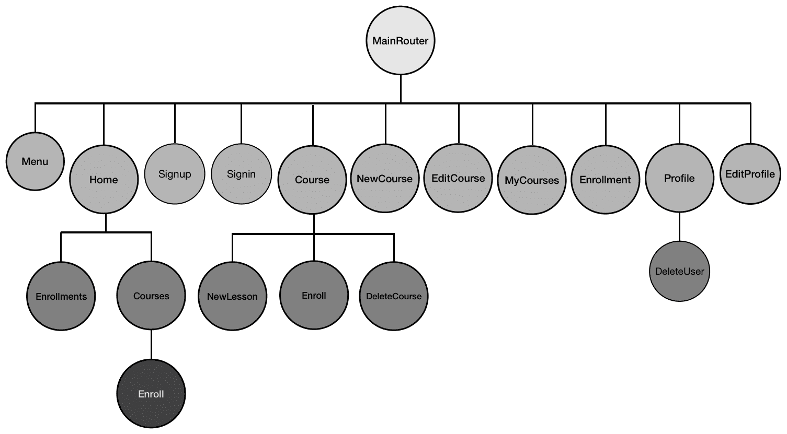

我们将添加与课程、课程和注册相关的新 React 组件；我们还将修改现有的组件，如 EditProfile、Menu 和 Home 组件，正如我们在本章的其余部分构建 MERN Classroom 应用程序的不同功能时一样。在 Classroom 应用程序中的大多数这些功能都将取决于用户成为教育者的能力。在下一节中，我们将通过更新用户来开始实现 MERN Classroom 应用程序，以便他们可以选择教育者角色。

# 更新用户的教育者角色

在 MERN Classroom 应用程序注册的用户将有机会通过在`EditProfile`表单组件中选择此选项来成为平台上的教育者。此选项在表单中的外观如下——显示当用户不是教育者时，以及当他们选择成为教育者时：

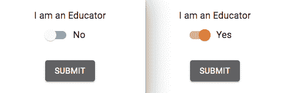

当用户选择成为教育者时，与普通用户相比，他们将被允许创建和管理自己的课程。如下面的截图所示，MERN Classroom 将为教育者显示导航菜单中的 TEACH 选项，即它不会显示给普通用户：


在接下来的几节中，我们将通过首先更新用户模型，然后是`EditProfile`视图，最后是将仅对教育者可见的 TEACH 链接添加到菜单中，来添加此教育者功能。

# 向用户模型添加角色

MERN 骨架应用程序中的现有用户模型需要一个表示教育者的值，默认设置为`false`以表示普通用户，但可以设置为`true`以表示同时也是教育者的用户。为了将此新字段添加到用户模式中，我们将添加以下代码。

`mern-classroom/server/models/user.model.js`:

```js
educator: {
    type: Boolean,
    default: false
}
```

此`educator`值必须发送到前端，一旦用户成功登录，就会收到用户详情，以便视图可以根据显示与教育者相关的信息相应地渲染。为了进行此更改，我们需要更新在`signin`控制器方法中发送回的响应，如下面的代码所示：

`mern-classroom/server/controllers/auth.controller.js`

```js
...
l
      token,
      user: {
        _id: user._id,
        name: user.name,
        email: user.email,
        educator: user.educator
      }
    })
...
} 
```

通过在响应中发送此`educator`字段值，我们可以根据角色特定的授权考虑因素渲染前端视图。

在到达这些条件渲染视图之前，我们首先需要在`EditProfile`视图中实现选择教育者角色的选项，正如下一节所讨论的。

# 更新 EditProfile 视图

要成为 MERN Classroom 应用程序中的教育者，已登录的用户需要更新他们的个人资料。他们将在编辑个人资料视图中看到一个切换按钮，该按钮可以激活或停用教育者功能。为了实现这一点，首先，我们将更新`EditProfile`组件，以便在`FormControlLabel`中添加一个 Material-UI `Switch`组件，如下面的代码所示。

`mern-classroom/client/user/EditProfile.js`:

```js
<Typography variant="subtitle1" className={classes.subheading}>
     I am an Educator
</Typography>
<FormControlLabel
     control={
             <Switch classes={{
                                checked: classes.checked,
                                bar: classes.bar,
                              }}
                      checked={values.educator}
                      onChange={handleCheck}
             />}
     label={values.educator? 'Yes' : 'No'}
/>
```

任何对开关的更改都将通过调用以下代码中定义的`handleCheck`方法，将值设置为状态中的`educator`变量。

`mern-classroom/client/user/EditProfile.js`:

```js
const handleCheck = (event, checked) => {
   setValues({...values, 'educator': checked})
} 
```

`handleCheck`方法接收一个表示开关是否被选中的`checked`布尔值，并将此值设置为`educator`。

在表单提交时，`educator`值被添加到发送到服务器的更新详细信息中，如下面的代码所示。

`mern-classroom/client/user/EditProfile.js`:

```js
clickSubmit = () => {
    const jwt = auth.isAuthenticated() 
    const user = {
      name: this.state.name || undefined,
      email: this.state.email || undefined,
      password: this.state.password || undefined,
      educator: values.educator || undefined
    }
    update({
      userId: this.match.params.userId
    }, {
      t: jwt.token
    }, user).then((data) => {
      if (data.error) {
        this.setState({error: data.error})
      } else {
        auth.updateUser(data, ()=> {
 setValues({...values, userId: data._id, redirectToProfile: true})
 })
      }
    })
  }
```

一旦成功更新了编辑个人资料视图，存储在`sessionStorage`中以供身份验证目的的用户详细信息也应更新。通过调用`auth.updateUser`方法来完成此`sessionStorage`更新。它与其他`auth-helper.js`方法一起定义，并传递更新的用户数据和更新视图的回调函数。此`updateUser`方法定义如下。

`mern-classroom/client/auth/auth-helper.js`:

```js
updateUser(user, cb) {
  if(typeof window !== "undefined"){
    if(sessionStorage.getItem('jwt')){
       let auth = JSON.parse(sessionStorage.getItem('jwt'))
       auth.user = user
       sessionStorage.setItem('jwt', JSON.stringify(auth))
       cb()
     }
  }
}
```

一旦更新的教育者角色在前端可用，我们就可以用它来相应地渲染前端。在下一节中，我们将看到如何根据教育者或普通用户查看应用程序来不同地渲染菜单。

# 渲染一个教学选项

在教室应用程序的前端，我们可以根据教育者是否正在浏览应用程序来渲染不同的选项。在本节中，我们将添加代码以有条件地显示导航栏上的*TEACH*链接，该链接仅对已登录且也是教育者的用户可见。

我们将在之前仅对已登录用户渲染的代码中更新`Menu`组件，如下所示。

`mern-classroom/client/core/Menu.js`:

```js
{auth.isAuthenticated() && (<span>
    {auth.isAuthenticated().user.educator && 
       (<Link to="/teach/courses">
           <Button style={isPartActive(history, "/teach/")}>
               <Library/> Teach </Button>
        </Link>)
    }
    ...
}
```

这个链接仅对教育者可见，将他们带到教育者仪表板视图，在那里他们可以管理他们正在教授的课程。

本节教会了我们如何在应用程序中将用户角色更新为教育者角色，现在我们可以开始集成允许教育者向教室添加课程的功能。

# 向教室添加课程

MERN Classroom 中的教育工作者可以创建课程并为每个课程添加课程。在本节中，我们将介绍与课程相关的功能实现，例如添加新课程、按特定讲师列出课程以及显示单个课程的详细信息。为了存储课程数据并启用课程管理，我们首先将实现一个用于课程的 Mongoose 模式，然后是创建和列出课程的后端 API，以及为授权的教育工作者和与应用程序中的课程交互的普通用户的前端视图。

# 定义课程模型

定义课程模式——在`server/models/course.model.js`中定义——将具有简单的字段来存储课程详情，包括图片、类别、课程是否已发布以及创建课程的用户的引用。定义课程字段的代码如下，并附有说明：

+   **课程名称和描述**：`name`和`description`字段将具有字符串类型，其中`name`为必填字段：

```js
name: { 
    type: String, 
    trim: true, 
    required: 'Name is required' 
},
description: { 
    type: String, 
    trim: true 
},
```

+   **课程图片**：`image`字段将存储用户上传的课程图片文件，以二进制数据形式存储在 MongoDB 数据库中：

```js
image: { 
    data: Buffer, 
    contentType: String 
},
```

+   **课程类别**：`category`字段将存储课程类别值作为字符串，并且它是一个必填字段：

```js
category: {
  type: String,
  required: 'Category is required'
},
```

+   **课程发布状态**：`published`字段将是一个布尔值，表示课程是否已发布：

```js
published: {
  type: Boolean,
  default: false
},
```

+   **课程讲师**：`instructor`字段将引用创建课程的用户：

```js
instructor: {
    type: mongoose.Schema.ObjectId, 
    ref: 'User'
}
```

+   **创建和更新时间**：`created`和`updated`字段将具有`Date`类型，其中`created`在添加新课程时生成，而`updated`在修改任何课程详细信息时更改：

```js
updated: Date,
created: { 
    type: Date, 
    default: Date.now 
},
```

此模式定义中的字段将使我们能够在 MERN Classroom 中实现与课程相关的功能。为了开始这些功能，在下一节中，我们将实现一个全栈切片，允许教育工作者创建新课程。

# 创建新课程

在 MERN Classroom 中，一个已登录的用户——同时也是教育工作者——将能够创建新课程。为了实现此功能，在以下章节中，我们将添加一个创建课程 API 到后台，以及在前端获取此 API 的方法，以及一个创建新课程表单视图，该视图接受用户输入的课程字段。

# 创建课程 API

为了在后台开始创建课程 API 的实现，我们将添加一个`POST`路由，该路由验证当前用户是否为教育工作者，然后使用请求体中传递的课程数据创建一个新的课程。该路由定义如下：

`mern-classroom/server/routes/course.routes.js`：

```js
router.route('/api/courses/by/:userId')
  .post(authCtrl.requireSignin, authCtrl.hasAuthorization, 
         userCtrl.isEducator, 
          courseCtrl.create)
```

`course.routes.js`文件将与`user.routes`文件非常相似，为了将这些新路由加载到 Express 应用程序中，我们需要在`express.js`中挂载课程路由，就像我们为 auth 和用户路由所做的那样，如下面的代码所示：

`mern-classroom/server/express.js`：

```js
app.use('/', courseRoutes)
```

接下来，我们将更新用户控制器以在创建新课程之前添加`isEducator`方法——这将确保当前用户实际上是一名教育工作者。`isEducator`方法定义如下：

`mern-classroom/server/controllers/user.controller.js`:

```js
const isEducator = (req, res, next) => {
  const isEducator = req.profile && req.profile.educator
  if (!isEducator) {
     return res.status('403').json({
        error: "User is not an educator"
     })
  }
  next()
}
```

课程控制器中的`create`方法使用`formidable`Node 模块来解析可能包含用户上传的课程图片的文件的多部分请求。如果有文件，`formidable`将暂时将其存储在文件系统中，然后我们使用`fs`模块读取它以检索文件类型和数据，然后将其存储在课程文档的`image`字段中。`create`控制器方法将如下所示：

`mern-classroom/server/controllers/course.controller.js`:

```js
const create = (req, res) => {
  let form = new formidable.IncomingForm()
  form.keepExtensions = true
  form.parse(req, async (err, fields, files) => {
    if (err) {
      return res.status(400).json({
        error: "Image could not be uploaded"
      })
    }
    let course = new Course(fields)
    course.instructor= req.profile
    if(files.image){
      course.image.data = fs.readFileSync(files.image.path)
      course.image.contentType = files.image.type
    }
    try {
      let result = await course.save()
      res.json(result)
    }catch (err){
      return res.status(400).json({
        error: errorHandler.getErrorMessage(err)
      })
    }
  })
}
```

如果用户上传了课程图片，该图片文件将作为数据存储在 MongoDB 中。然后，为了在视图中显示，它将从数据库中作为单独的`GET`API 路由中的图片文件检索。`GET`API 被设置为 Express 路由在`/api/courses/photo/:courseId`，它从 MongoDB 获取图像数据并将其作为文件发送响应。文件上传、存储和检索的实现步骤在第五章“从简单的社交媒体应用程序开始”的*上传个人照片*部分中详细说明。

服务器上的创建课程 API 端点准备就绪后，接下来，我们可以在前端添加一个`fetch`方法来利用它。

# 在视图中获取创建 API

为了在前端使用创建 API，我们将在客户端设置一个`fetch`方法，通过传递多部分表单数据，向创建 API 发送`POST`请求，如下所示：

`mern-classroom/client/course/api-course.js`

```js
const create = async (params, credentials, course) => {
    try {
        let response = await fetch('/api/courses/by/'+ params.userId, {
          method: 'POST',
          headers: {
            'Accept': 'application/json',
            'Authorization': 'Bearer ' + credentials.t
          },
          body: course
        })
          return response.json()
        } catch(err) { 
          console.log(err)
        }
}
```

此方法将在新课程表单视图中用于将用户输入的课程详细信息提交到后端以在数据库中创建新课程。在下一节中，我们将实现这个新课程表单视图的 React 组件。

# 新课程组件

为了让教育工作者能够创建新的课程，我们将在应用程序的前端添加一个包含表单的 React 组件。这个表单视图将看起来如下所示：

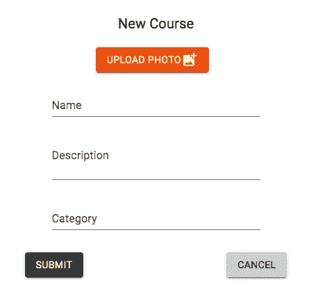

表单将包含一个上传课程图片的选项，输入字段用于输入课程名称、描述和类别；以及提交按钮，该按钮将保存已输入的详细信息到数据库中。

我们将定义`NewCourse`React 组件来实现这个表单。如下所示，我们首先使用`useState`钩子初始化状态；使用空输入字段值、空错误消息和一个初始化为`false`的`redirect`变量。

`mern-classroom/client/course/NewCourse.js`:

```js
export default function NewCourse() {
  ...  
  const [values, setValues] = useState({
    name: '',
    description: '',
    image: '',
    category: '',
    redirect: false,
    error: ''
  })
  ...
}
```

在表单视图中，我们首先给用户一个上传课程图片文件的选项。为了呈现这个选项，我们将在`NewCourse`的返回函数中使用 Material-UI 按钮和 HTML5 文件输入元素添加文件上传元素，如下面的代码所示。

`mern-classroom/client/course/NewCourse.js`:

```js
<input accept="image/*" onChange={handleChange('image')} 
                        type="file" style={display:'none'} />
<label htmlFor="icon-button-file">
     <Button variant="contained" color="secondary" component="span">
         Upload Photo <FileUpload/>
     </Button>
</label> 
<span>{values.image ? values.image.name : ''}</span>

```

然后，我们使用 Material-UI 的`TextField`组件添加`name`、`description`和`category`表单字段。

`mern-classroom/client/course/NewCourse.js`:

```js
<TextField 
    id="name" 
    label="Name" 
    value={values.name} onChange={handleChange('name')}/> <br/>
<TextField
    id="multiline-flexible"
    label="Description"
    multiline
    rows="2"
    value={values.description}
    onChange={handleChange('description')}/> <br/>
<TextField 
    id="category" 
    label="Category" 
    value={values.category} 
    onChange={handleChange('category')}/> 
```

我们将在`NewCourse`中定义一个处理函数，以便我们可以跟踪表单视图中这些字段的变化。`handleChange`函数将定义如下：

`mern-classroom/client/course/NewCourse.js`

```js
const handleChange = name => event => {
    const value = name === 'image'
      ? event.target.files[0]
      : event.target.value
    setValues({...values, [name]: value })
}
```

这个`handleChange`函数接受输入字段中输入的新值，并将其设置为状态，包括如果用户上传了文件，则包括文件名。

最后，在视图中，你可以添加提交按钮，当点击时，应该调用一个点击处理函数。我们将在`NewCourse`中定义一个函数来完成这个目的，如下所示。

`mern-classroom/client/course/NewCourse.js`:

```js
const clickSubmit = () => {
    let courseData = new FormData()
    values.name && courseData.append('name', values.name)
    values.description && courseData.append('description',
       values.description)
    values.image && courseData.append('image', values.image)
    values.category && courseData.append('category', values.category)
    create({
      userId: jwt.user._id
    }, {
      t: jwt.token
    }, courseData).then((data) => {
      if (data.error) {
        setValues({...values, error: data.error})
      } else {
        setValues({...values, error: '', redirect: true})
      }
    })
}
```

当表单提交时，将调用此`clickSubmit`函数。它首先从状态中获取输入值并将其设置为`FormData`对象。这确保了数据以正确的格式存储，这是发送包含文件上传请求所需的`multipart/form-data`编码类型。然后，调用`create`fetch 方法在后端创建一个新的课程。最后，根据服务器的响应，要么显示错误消息，要么使用以下代码将用户重定向到`MyCourses`视图。

`mern-classroom/client/course/NewCourse.js`:

```js
if (values.redirect) {
      return (<Redirect to={'/teach/courses'}/>)
}
```

`NewCourse`组件只能由已登录的也是讲师的用户查看。因此，我们将向`MainRouter`组件添加一个`PrivateRoute`，这将只为授权用户在`/teach/course/new`渲染此表单。

`mern-classroom/client/MainRouter.js`:

```js
<PrivateRoute path="/teach/course/new" component={NewCourse}/>
```

此链接可以添加到任何可能由教育者访问的视图组件中，例如将在下一节中实现的`MyCourses`视图，以列出由教育者创建的课程。

# 按教育者列出课程

授权的教育者将能够看到他们在平台上创建的课程列表。为了实现此功能，在以下章节中，我们将添加一个后端 API 来检索特定讲师的课程列表，然后我们将在前端调用此 API 以在 React 组件中渲染这些数据。

# 列出课程 API

为了实现返回由特定讲师创建的课程列表的 API，首先，我们将在后端添加一个路由来检索当服务器在`/api/courses/by/:userId`接收`GET`请求时由给定用户创建的所有课程。此路由将声明如下。

`mern-classroom/server/routes/course.routes.js`:

```js
router.route('/api/courses/by/:userId')
  .get(authCtrl.requireSignin, 
            authCtrl.hasAuthorization, 
               courseCtrl.listByInstructor)
```

为了处理路由中的`:userId`参数并从数据库检索关联的用户，我们将在用户控制器中使用`userByID`方法。我们将在`course.routes.js`中的课程路由中添加以下代码，以便用户在`request`对象中作为`profile`可用。

`mern-classroom/server/routes/course.routes.js`:

```js
router.param('userId', userCtrl.userByID) 
```

在`course.controller.js`中的`listByInstructor`控制器方法将查询数据库中的`Course`集合以获取匹配的课程，如下所示。

`mern-classroom/server/controllers/course.controller.js`:

```js
const listByInstructor = (req, res) => {
  Course.find({instructor: req.profile._id}, (err, courses) => {
    if (err) {
      return res.status(400).json({
        error: errorHandler.getErrorMessage(err)
      })
    }
    res.json(courses)
  }).populate('instructor', '_id name')
}
```

在查询课程集合时，我们找到所有具有与用户指定的`userId`参数匹配的`instructor`字段的课程。然后，将这些课程作为响应发送给客户端。在下一节中，我们将看到如何从前端调用此 API。

# 在视图中获取列表 API

为了在前端使用列表 API，我们将定义一个`fetch`方法，该方法可以被 React 组件用来加载这些课程列表。需要用来通过特定讲师检索课程列表的`fetch`方法将定义如下。

`mern-classroom/client/course/api-course.js`

```js
const listByInstructor = async (params, credentials, signal) => {
    try {
      let response = await fetch('/api/courses/by/'+params.userId, {
        method: 'GET',
        signal: signal,
        headers: {
          'Accept': 'application/json',
          'Authorization': 'Bearer ' + credentials.t
        }
      })
      return response.json()
    } catch(err) {
      console.log(err)
    }
}
```

此`listByInstructor`方法将获取`userId`值以生成要调用的 API 路由，并将接收与提供的`userId`值关联的用户创建的课程列表。在教室应用程序中，我们将在下一节讨论的`MyCourses`组件中使用此方法。

# MyCourses 组件

在`MyCourses`组件中，我们将使用`listByInstructor` API 从服务器获取数据后，在 Material-UI `List`中渲染课程列表。如图所示，此组件将作为教育者的仪表板，其中列出他们的课程，并有一个选项添加新课程：

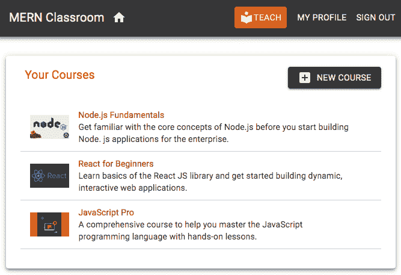

为了实现此组件，我们首先需要获取和渲染课程列表。我们将在`useEffect`钩子中执行获取 API 调用，并将接收到的课程数组设置在状态中，如下所示。

`mern-classroom/client/course/MyCourses.js`

```js
export default function MyCourses(){
  const [courses, setCourses] = useState([])
  const [redirectToSignin, setRedirectToSignin] = useState(false)
  const jwt = auth.isAuthenticated()

  useEffect(() => {
    const abortController = new AbortController()
    const signal = abortController.signal
    listByInstructor({
      userId: jwt.user._id
    }, {t: jwt.token}, signal).then((data) => {
      if (data.error) {
        setRedirectToSignin(true)
      } else {
        setCourses(data)
      }
    })
    return function cleanup(){
      abortController.abort()
    }
  }, [])
  if (redirectToSignin) {
    return <Redirect to='/signin'/>
  }
  ...
}
```

当`listByInstructor` API 被获取时，我们将传递当前登录用户的认证令牌以在服务器端检查授权。用户应该只能看到他们自己的课程，如果当前用户没有权限进行此获取调用，视图将被重定向到登录页面。否则，将返回并显示在视图中的课程列表。

在此`MyCourses`组件的视图中，我们将通过使用`map`迭代检索到的课程数组，在视图中渲染每个课程数据，每个`ListItem`都将链接到单个课程视图，如下所示：

`mern-classroom/client/course/MyCourses.js`

```js
{courses.map((course, i) => {
   return <Link to={"/teach/course/"+course._id} key={i}>
            <ListItem button>
              <ListItemAvatar>
                <Avatar src={'/api/courses/photo/'+course._id+"?" + 
                                        new Date().getTime()}/>
              </ListItemAvatar>
              <ListItemText primary={course.name} 
                            secondary={course.description}/>
            </ListItem>
            <Divider/>
          </Link>}
       )
}
```

`MyCourses`组件只能由已登录且也是教育者的用户查看。因此，我们将在`MainRouter`组件中添加一个`PrivateRoute`，这样只有授权用户才能在`/seller/courses`渲染此组件。

`mern-classroom/client/MainRouter.js`:

```js
<PrivateRoute path="/seller/courses" component={MyCourses}/>
```

我们在菜单上的<q>TEACH</q>链接中使用这个前端路由，该链接将已登录的教育者导向此`MyCourses`视图。在这个视图中，用户可以点击列表中的每一门课程，并转到显示特定课程详情的页面。在下一节中，我们将实现渲染单个课程的功能。

# 显示课程

MERN Classroom 应用程序的用户，包括访客、已登录的学生和教育者，都将能够浏览课程页面，并具有与其授权级别相关的交互。在接下来的几节中，我们将通过在后台添加读取课程 API、从前端调用此 API 的方法以及将容纳课程详情视图的 React 组件来实现单个课程视图功能。

# 一个读取课程 API

为了在后台实现一个读取课程 API，我们首先声明`GET`路由和参数处理触发器，如下面的代码所示。

`mern-classroom/server/routes/course.routes.js`:

```js
router.route('/api/courses/:courseId')
  .get(courseCtrl.read)
router.param('courseId', courseCtrl.courseByID)
```

我们将添加这个`GET`路由来查询具有 ID 的`Course`集合，并在响应中返回相应的课程。路由 URL 中的`:courseId`参数将调用`courseByID`控制器方法，该方法与`userByID`控制器方法类似。它从数据库中检索课程，并将其附加到用于`next`方法的请求对象中，如下面的代码所示。

`mern-classroom/server/controllers/course.controller.js`:

```js
const courseByID = async (req, res, next, id) => {
  try {
    let course = await Course.findById(id)
                             .populate('instructor', '_id name')
    if (!course)
      return res.status('400').json({
        error: "Course not found"
      })
    req.course = course
    next()
  } catch (err) {
    return res.status('400').json({
      error: "Could not retrieve course"
    })
  }
}
```

从数据库查询的课程对象还将包含讲师的名称和 ID 详情，正如我们在`populate()`方法中指定的。在将此课程对象附加到请求对象后调用`next()`将调用`read`控制器方法。然后`read`控制器方法将此`course`对象作为响应返回给客户端，如下面的代码所示。

`mern-classroom/server/controllers/course.controller.js`:

```js
const read = (req, res) => {
  req.course.image = undefined
  return res.json(req.course)
}
```

在发送响应之前，我们将移除图片字段，因为图片将通过单独的路由作为文件检索。随着后端这个 API 的准备好，你现在可以添加实现，以便在前端调用它，通过在`api-course.js`中添加一个`fetch`方法，该方法与其他已经添加的`fetch`方法类似。我们将使用`fetch`方法来调用将在渲染课程详情的 React 组件中读取课程 API，正如下一节所讨论的。

# 课程组件

`Course`组件将渲染单个课程特定的细节和用户交互，如下面的截图所示：

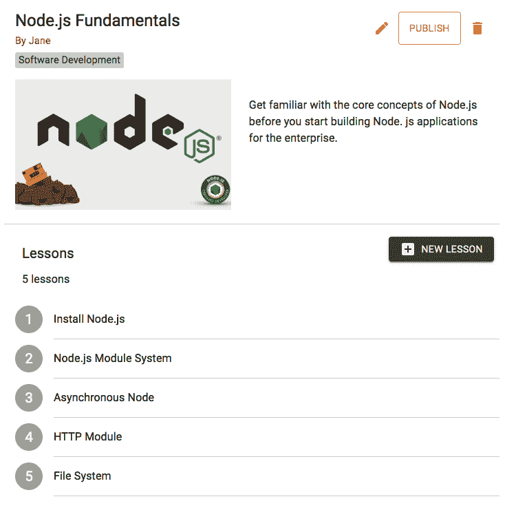

完成的 `Course` 组件将包含以下部分：

+   一个显示课程详情的部分，对所有访问者可见。我们将在这个部分实现这一部分。

+   一个 <q>课程</q> 部分，包含课程列表，对所有访问者可见，以及添加新课程的选项，这个选项只对这门课程的讲师可见。我们将在下一节实现课程部分。

+   编辑、删除和发布选项，只有讲师可见。这部分将在本章后面讨论。

+   一个未在上一张图片中显示的 <q>报名</q> 选项，只有在课程被讲师发布后才会可见。这部分将在本章后面实现。

要开始实现此 `Course` 组件，我们首先将使用 `useEffect` 钩子通过读取 API 的 fetch 调用检索课程详情，然后我们将设置接收到的值到状态中，如下面的代码所示。

`mern-classroom/client/course/Course.js`

```js
export default function Course ({match}) {  
  const [course, setCourse] = useState({instructor:{}})
  const [values, setValues] = useState({
      error: ''
  }) 
  useEffect(() => {
      const abortController = new AbortController()
      const signal = abortController.signal

      read({courseId: match.params.courseId}, signal).then((data) => {
        if (data.error) {
          setValues({...values, error: data.error})
        } else {
          setCourse(data)
        }
      })
    return function cleanup(){
      abortController.abort()
    }
  }, [match.params.courseId])
...
}
```

`useEffect` 只会在路由参数中的 `courseId` 发生变化时运行。

在视图中，我们将渲染接收到的详情，例如课程名称、描述、类别、图片以及链接到讲师用户资料的 Material-UI `Card` 组件，如下面的代码所示：

`mern-classroom/client/course/Course.js`

```js
<Card>
    <CardHeader
          title={course.name}
          subheader={<div>
                        <Link to={"/user/"+course.instructor._id}>
                           By {course.instructor.name}
                        </Link>
                        <span>{course.category}</span>
                     </div>
                    }
    />
    <CardMedia image={imageUrl} title={course.name} />
    <div>
         <Typography variant="body1">
              {course.description}
         </Typography>
    </div>
</Card>
```

`imageUrl` 包含检索课程图片作为文件响应的路由，并且它被构建如下：

`mern-classroom/client/course/Course.js`

```js
const imageUrl = course._id
          ? `/api/courses/photo/${course._id}?${new Date().getTime()}`
          : '/api/courses/defaultphoto'
```

当课程讲师登录并查看课程页面时，我们将在 `Course` 组件中渲染编辑和其他课程数据修改选项。目前，我们只关注如何有条件地将 `edit` 选项添加到视图代码中：

`mern-classroom/client/course/Course.js`

```js
{auth.isAuthenticated().user && auth.isAuthenticated().user._id == course.instructor._id &&
    (<span><Link to={"/teach/course/edit/" + course._id}>
               <IconButton aria-label="Edit" color="secondary">
                  <Edit/>
               </IconButton>
           </Link>
     </span>)
}
```

如果当前用户已登录，并且他们的 ID 与课程讲师的 ID 匹配，那么只有在这种情况下才会渲染 <q>编辑</q> 选项。这部分将在接下来的章节中进一步编辑，以便展示发布和删除选项。

为了在前端加载此 `Course` 组件，我们将在 `MainRouter` 中添加一个路由，如下所示：

```js
<Route path="/course/:courseId" component={Course}/>
```

此路由 URL (`/course/:courseId`) 现在可以添加到任何组件中，以链接到特定的课程，其中 `:courseId` 参数将被课程 ID 值替换。点击链接将用户带到相应的课程视图。

我们现在已经将相关的后端模型和 API 端点与前端视图集成，这意味着我们已经实现了新课程创建、讲师课程列表和单课程显示功能的运行实现。我们现在可以继续扩展这些实现，让讲师能够为每个课程添加课程，并根据需要更新课程，然后再发布。

# 更新带有课程的课程

MERN Classroom 中的每个课程都将包含一个课程内容的课程列表，以及学生在注册时需要覆盖的内容。我们将保持课程结构简单，在这个应用程序中，我们将更多关注课程管理实现，并允许学生按顺序完成课程。在接下来的几节中，我们将专注于课程管理的实现，我们还将探讨如何更新现有课程——无论是编辑详情还是删除课程。首先，我们将探讨如何存储课程详情，然后我们将实现全栈功能，允许讲师添加课程、更新课程、更新课程详情以及删除课程。

# 存储课程

在我们能够存储和检索每个课程的课程详情之前，我们需要定义课程数据结构并将其与课程数据结构关联。

我们将首先定义课程模型，其中包含标题、内容和资源 URL 字段，这些字段都是字符串类型，如下面的代码所示。

`mern-classroom/server/models/course.model.js`

```js
const LessonSchema = new mongoose.Schema({
  title: String,
  content: String,
  resource_url: String
})
const Lesson = mongoose.model('Lesson', LessonSchema)
```

这些架构将允许教育者为他们自己的课程创建和存储基本的课程。为了将课程与课程结构集成，我们将在课程模型中添加一个名为 `lessons` 的字段，该字段将存储一个课程文档数组，如下面的代码所示。

`mern-classroom/server/models/course.model.js`

```js
lessons: [LessonSchema]
```

使用这个更新的课程架构和模型，我们现在可以继续实施允许教育者向他们的课程添加课程的实现，如下一节所述。

# 添加新课程

MERN Classroom 应用程序上的教育者将能够向他们仍在构建且尚未发布的课程中添加新课程。在接下来的几节中，我们将实现这一功能，首先通过实现一个添加课程到现有课程的后端 API，然后创建一个前端表单视图来输入和发送新课程详情，最后在课程页面上显示新添加的课程。

# 添加课程 API

为了实现一个允许我们为特定课程添加和存储新课程的后端 API，我们首先需要声明如下所示的 `PUT` 路由：

`mern-classroom/server/routes/course.routes.js`:

```js
router.route('/api/courses/:courseId/lesson/new')
  .put(authCtrl.requireSignin, 
                    courseCtrl.isInstructor,         
                          courseCtrl.newLesson)
```

当这个路由接收到一个包含课程 ID 的 URL 的 `PUT` 请求时，我们首先将使用 `isInstructor` 方法检查当前用户是否是该课程的讲师，然后我们将使用 `newLesson` 方法将课程保存在数据库中。`isInstructor` 控制器方法定义如下：

`mern-classroom/server/controllers/course.controller.js`:

```js
const isInstructor = (req, res, next) => {
    const isInstructor = req.course && req.auth &&     
                         req.course.instructor._id == req.auth._id
    if(!isInstructor){
      return res.status('403').json({
        error: "User is not authorized"
      })
    }
    next()
}
```

使用 `isInstructor` 方法，我们首先检查已登录用户是否有与给定课程讲师相同的用户 ID。如果用户未授权，则响应中返回错误，否则调用 `next()` 中间件以执行 `newLesson` 方法。此 `newLesson` 控制器方法定义如下：

`mern-classroom/server/controllers/course.controller.js`:

```js
const newLesson = async (req, res) => {
  try {
    let lesson = req.body.lesson
    let result = await Course.findByIdAndUpdate(req.course._id, 
                                              {$push: {lessons: lesson}, 
                                                updated: Date.now()}, 
                                                {new: true})
                            .populate('instructor', '_id name')
                            .exec()
    res.json(result)
  } catch (err) {
    return res.status(400).json({
      error: errorHandler.getErrorMessage(err)
    })
  }
}
```

在此 `newLesson` 控制器方法中，我们使用 MongoDB 的 `findByIdAndUpdate` 来查找相应的课程文档，并通过将请求体中接收的新课程对象推送到其 `lessons` 数组字段来更新它。

为了在前端访问此 API 以添加新课程，您还需要添加相应的 fetch 方法，就像我们为其他 API 实现所做的那样。

此 API 将用于基于表单的组件，该组件将接收用户对每门新课程的输入，并将其发送到后端。我们将在下一节实现此基于表单的组件。

# 新课程组件

在每门课程中，当课程尚未发布时，讲师可以通过填写表格来添加课程。为了实现添加新课程的表单视图，我们将创建一个名为 `NewLesson` 的 React 组件，并将其添加到 `Course` 组件中。此组件将在课程页面上的对话框中渲染以下表单：

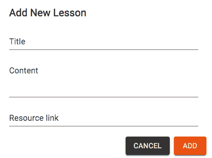

在定义 `NewLesson` 组件时，我们首先使用 `useState` 钩子初始化状态中的表单值。此组件还将从 `Course` 组件接收 `props`，如下所示。

`mern-classroom/client/course/NewLesson.js`

```js
export default function NewLesson(props) {
  const [open, setOpen] = useState(false)
  const [values, setValues] = useState({
    title: '',
    content: '',
    resource_url: ''
  })
...
}
NewLesson.propTypes = {
    courseId: PropTypes.string.isRequired,
    addLesson: PropTypes.func.isRequired
}
```

`NewLesson` 组件将从要添加的父组件（在这种情况下为 `Course` 组件）接收 `courseId` 值和 `addLesson` 函数作为 `props`。我们通过向 `NewLesson` 添加 `PropTypes` 验证来使这些 `props` 成为必需。在表单提交时，这些 `props` 将在本组件中使用。

接下来，我们将添加一个按钮来切换包含表单的对话框，如下所示。

`mern-classroom/client/course/NewLesson.js`

```js
<Button aria-label="Add Lesson" color="primary" variant="contained" 
        onClick={handleClickOpen}>
   <Add/> New Lesson
</Button>
<Dialog open={open} onClose={handleClose} aria-labelledby="form-dialog-   title">
   <div className={classes.form}>
      <DialogTitle id="form-dialog-title">Add New Lesson</DialogTitle>
            ...
      <DialogActions>
        <Button onClick={handleClose} 
           color="primary" variant="contained">
            Cancel
        </Button>
        <Button onClick={clickSubmit} 
            color="secondary" variant="contained">
            Add
        </Button>
      </DialogActions>
   </div>
</Dialog>
```

根据状态变量 `open` 的状态，Material-UI 的 `Dialog` 组件保持打开或关闭。我们在以下函数中更新 `open` 值，这些函数在对话框打开和关闭操作时被调用。

`mern-classroom/client/course/NewLesson.js`

```js
const handleClickOpen = () => {
   setOpen(true)
}

const handleClose = () => {
   setOpen(false)
}
```

在 `Dialog` 组件内部使用 `TextFields` 在 `DialogContent` 中添加了输入新课程标题、内容和资源 URL 值的表单字段，如下所示。

`mern-classroom/client/course/NewLesson.js`

```js
<DialogContent>
     <TextField label="Title" type="text" fullWidth
                value={values.title} onChange={handleChange('title')} />
     <br/>
     <TextField label="Content" type="text" multiline rows="5" fullWidth
             value={values.content} onChange={handleChange('content')}/>
     <br/>
     <TextField label="Resource link" type="text" fullWidth
                value={values.resource_url} 
                onChange={handleChange('resource_url')} />
     <br/>
</DialogContent>
```

输入字段中输入的值将通过以下定义的 `handleChange` 函数进行捕获：

`mern-classroom/client/course/NewLesson.js`

```js
const handleChange = name => event => {
    setValues({ ...values, [name]: event.target.value })
}
```

最后，当表单提交时，我们将在`clickSubmit`函数中将新的课程详情发送到服务器，如下面的代码所示。

`mern-classroom/client/course/NewLesson.js`

```js
const clickSubmit = () => {
    const jwt = auth.isAuthenticated()
    const lesson = {
      title: values.title || undefined,
      content: values.content || undefined,
      resource_url: values.resource_url || undefined
    }
    newLesson({
      courseId: props.courseId
    }, {
      t: jwt.token
    }, lesson).then((data) => {
      if (data && data.error) {
        setValues({...values, error: data.error})
      } else {
          props.addLesson(data)
          setValues({...values, title: '',
          content: '',
          resource_url: ''})
          setOpen(false)
      }
    })
  }
```

课程详情将通过带有从课程组件接收的课程 ID 作为属性的请求发送到添加课程 API。在服务器成功更新响应后，除了清空表单字段外，还执行了作为属性传递的`addLesson`更新函数，以在课程组件中渲染最新的课程。从`Course`组件传递的`addLesson`函数定义如下：

`mern-classroom/client/course/Course.js`

```js
const addLesson = (course) => {
    setCourse(course)
}
```

添加到课程组件中的`NewLesson`组件应该仅在当前用户是课程的讲师且课程尚未发布时才渲染。为了执行此检查和条件渲染`NewLesson`组件，我们可以在课程组件中添加以下代码：

`mern-classroom/client/course/Course.js`

```js
{ auth.isAuthenticated().user && 
  auth.isAuthenticated().user._id == course.instructor._id && 
  !course.published &&
            (<NewLesson courseId={course._id} addLesson={addLesson}/>)
}
```

这将允许应用程序上的教育工作者向他们的课程添加课程。接下来，我们将添加代码以在课程页面上渲染这些课程。

# 显示课程

特定课程的课程将在课程页面下方以列表形式呈现，包括课程总数，如下面的截图所示：

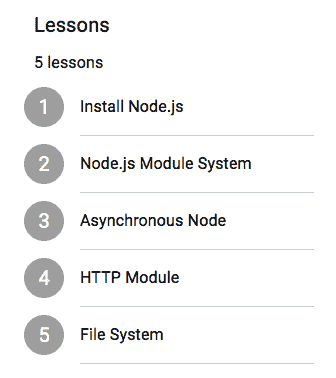

为了渲染这个课程列表，我们将更新`Course`组件，使用`map`函数遍历课程数组，每个课程将在 Material-UI 的`ListItem`组件中显示，如下面的代码所示。

`mern-classroom/client/course/Course.js`

```js
<List>
    {course.lessons && course.lessons.map((lesson, index) => {
       return(<span key={index}>
                   <ListItem>
                      <ListItemAvatar>
                        <Avatar> {index+1} </Avatar>
                      </ListItemAvatar>
                      <ListItemText primary={lesson.title} />
                   </ListItem>
                   <Divider variant="inset" component="li" />
              </span>)
    })}
</List>
```

每个列表项旁边的数字是使用数组的当前索引值计算的。也可以通过访问`course.lessons.length`来显示课程总数。

既然讲师可以添加和查看每门课程的课程，那么在下一节中，我们将实现更新这些添加的课程的能力，同时修改其他课程详情。

# 编辑课程

一旦教育工作者添加了课程并且有更多更新要合并，教育工作者将能够以讲师的身份编辑课程的详情。编辑课程包括更新其课程的能力。为了在应用程序中实现这一功能，首先，我们必须创建一个后端 API，允许对特定课程执行更新操作。

然后，需要在前端使用课程及其课程更改后的详细信息来访问这个更新的 API。在接下来的章节中，我们将构建这个后端 API 和`EditCourse` React 组件，这将允许讲师更改课程详情和课程。

# 更新课程 API

在后端，我们需要一个 API，允许如果请求用户是给定课程的授权讲师，则更新现有课程。我们首先声明接受客户端更新请求的 PUT 路由，如下所示：

`mern-classroom/server/routes/course.routes.js`:

```js
router.route('/api/courses/:courseId')
  .put(authCtrl.requireSignin, courseCtrl.isInstructor, 
            courseCtrl.update)
```

接收到 `/api/courses/:courseId` 路由的 `PUT` 请求首先检查已登录用户是否是 URL 中提供的 `courseId` 关联的课程讲师。如果发现用户是授权的，则调用 `update` 控制器。课程控制器中的 `update` 方法定义如下所示。

`mern-classroom/server/controllers/course.controller.js`:

```js
const update = (req, res) => {
  let form = new formidable.IncomingForm()
  form.keepExtensions = true
  form.parse(req, async (err, fields, files) => {
    if (err) {
      return res.status(400).json({
        error: "Photo could not be uploaded"
      })
    }
    let course = req.course
    course = extend(course, fields)
    if(fields.lessons){
 course.lessons = JSON.parse(fields.lessons)
 }
    course.updated = Date.now()
    if(files.image){
      course.image.data = fs.readFileSync(files.image.path)
      course.image.contentType = files.image.type
    }
    try {
      await course.save()
      res.json(course)
    } catch (err) {
      return res.status(400).json({
        error: errorHandler.getErrorMessage(err)
      })
    }
  })
}

```

由于请求体可能包含文件上传，我们在这里使用 `formidable` 来解析多部分数据。课程数组是一个嵌套对象的数组，我们需要在保存之前将课程数组特别解析并分配给课程。正如我们将在下一节中看到的那样，从前端发送的课程数组在发送之前将被字符串化，因此在这个控制器中，我们需要额外检查是否收到了 `lessons` 字段，并在解析后单独分配它。

要在前端使用此 API，您需要定义一个 fetch 方法，该方法接受课程 ID、用户认证凭据和更新的课程详情，以便对更新课程 API 进行 fetch 调用——就像我们对其他 API 实现所做的那样。

现在我们有一个可以在前端使用的课程更新 API，我们可以使用它来更新课程的详细信息。我们将在 `EditCourse` 组件中使用它，接下来将讨论该组件。

# The EditCourse component

在前端，我们将添加一个用于编辑课程的视图，它将包含两个部分。第一部分将允许用户更改课程详情，包括名称、类别、描述和图片；第二部分将允许修改课程的课程。以下截图显示了课程的第一个部分：

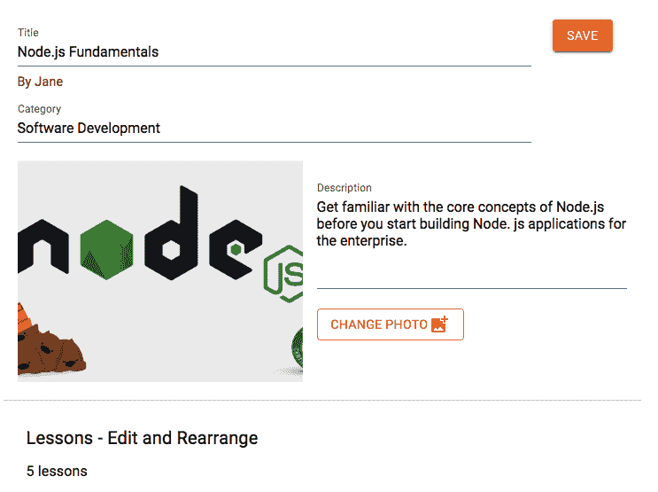

为了实现此视图，我们将定义一个名为 `EditCourse` 的 React 组件。此组件将首先通过在 `useEffect` 钩子中调用 `read` fetch 方法来加载课程详情，如下面的代码所示。

`mern-classroom/client/course/EditCourse.js`

```js
  useEffect(() => {
      const abortController = new AbortController()
      const signal = abortController.signal

      read({courseId: match.params.courseId}, signal).then((data) => {
        if (data.error) {
          setValues({...values, error: data.error})
        } else {
          setCourse(data)
        }
      })
    return function cleanup(){
      abortController.abort()
    }
  }, [match.params.courseId])
```

在成功接收到响应中的课程数据后，将通过调用 `setCourse` 将其设置为状态中的 `course` 变量，并将其用于填充视图。视图的第一部分将渲染与课程视图类似但使用 `TextFields` 的课程详情，并提供上传新图片和保存按钮以进行更新调用，如下面的代码所示。

`mern-classroom/client/course/EditCourse.js`

```js
<CardHeader title={<TextField label="Title" type="text" fullWidth
    value={course.name} onChange={handleChange('name')}/>}
            subheader={<div><Link to={"/user/"+course.instructor._id}>
                               By {course.instructor.name}
                            </Link>
  {<TextField label="Category" type="text" fullWidth
      value={course.category} 
        onChange={handleChange('category')}/>}
                       </div>}
            action={<Button variant="contained" color="secondary" 
                            onClick={updateCourse}>Save</Button>}
/>
<div className={classes.flex}>
   <CardMedia image={imageUrl} title={course.name}/>
   <div className={classes.details}>
      <TextField multiline rows="5" label="Description" type="text"
                 value={course.description} 
                 onChange={handleChange('description')} /><br/>
      <input accept="image/*" 
         onChange={handleChange('image')}  type="file" />
      <label htmlFor="icon-button-file">
        <Button variant="outlined" color="secondary" component="span">
          Change Photo
          <FileUpload/>
        </Button>
      </label> <span>{course.image ? course.image.name : ''}</span><br/>
   </div>
</div>
```

输入字段的更改将通过 `handleChange` 方法来处理，该方法定义如下。

`mern-classroom/client/course/EditCourse.js`

```js
  const handleChange = name => event => {
    const value = name === 'image'
    ? event.target.files[0]
    : event.target.value
    setCourse({ ...course, [name]: value })
  }
```

当点击保存按钮时，我们将获取所有课程详情并将其设置为`FormData`，然后使用课程更新 API 以多部分格式发送到后端。在保存时调用的`clickSubmit`函数将定义如下：

`mern-classroom/client/course/EditCourse.js`

```js
const clickSubmit = () => {
    let courseData = new FormData()
    course.name && courseData.append('name', course.name)
    course.description && courseData.append('description'
        , course.description)
    course.image && courseData.append('image', course.image)
    course.category && courseData.append('category', course.category)
    courseData.append('lessons', JSON.stringify(course.lessons))
    update({
        courseId: match.params.courseId
      }, {
        t: jwt.token
      }, courseData).then((data) => {
        if (data && data.error) {
            console.log(data.error)
          setValues({...values, error: data.error})
        } else {
          setValues({...values, redirect: true})
        }
      })
  }
```

课程课程也通过这个`FormData`发送，但由于课程是以嵌套对象的数组形式存储的，而`FormData`只接受简单的键值对，所以在分配之前我们需要将`lessons`值进行字符串化。

为了在前端加载`EditCourse`，我们需要为其声明一个前端路由。此组件只能由已登录且也是课程讲师的用户查看。因此，我们将在`MainRouter`组件中添加一个`PrivateRoute`，这将只为授权用户在`/teach/course/edit/:courseId`渲染此视图。

`mern-marketplace/client/MainRouter.js`:

```js
<PrivateRoute path="/teach/course/edit/:courseId" component={EditCourse}/>
```

此链接添加到课程视图中，以便允许访问`EditCourse`页面。

我们已经探讨了如何在保存时更新并发送课程详情以及所有课程到后端，但我们还剩下编辑课程课程的接口。在接下来的章节中，我们将通过查看更新课程课程的实现来完成`EditCourse`组件。

# 更新课程

为了允许讲师更新他们添加到课程中的课程，我们将在`EditCourse`组件中添加以下部分，这将允许用户编辑课程详情、重新排列课程的顺序以及删除课程：

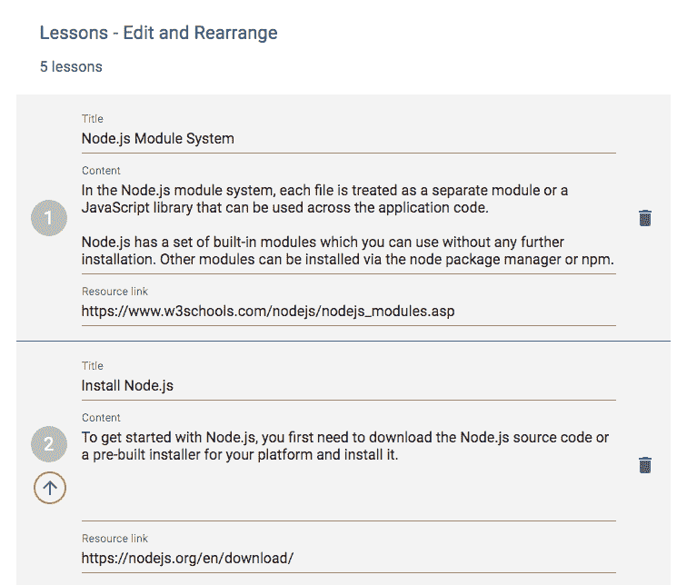

这些课程更新功能的实现主要依赖于数组操作技术。在接下来的章节中，我们将添加列表中单个课程的接口，并讨论如何实现编辑、移动和删除功能。

# 编辑课程详情

用户将能够在`EditCourse`组件中编辑每个字段的课程详情。在视图中，课程列表中的每个项目将包含三个`TextFields`，用于课程中的每个字段。这些字段将预先填充现有值，如下面的代码所示。

`mern-classroom/client/course/EditCourse.js`

```js
<ListItemText
  primary={<><TextField label="Title" type="text" fullWidth
                        value={lesson.title} 
                        onChange={handleLessonChange('title', index)} />
                        <br/>
            <TextField multiline rows="5" label="Content" type="text"
                       fullWidth value={lesson.content} 
                       onChange={handleLessonChange('content', index)}/>
                       <br/>
             <TextField label="Resource link" type="text" fullWidth
                        value={lesson.resource_url} 
                  onChange={handleLessonChange('resource_url', index)}/>
                  <br/>
          </>}
/>
```

为了处理每个字段中值的变化，我们将定义一个`handleLessonChange`方法，它将接受字段名称和数组中相应课程的索引。`handleLessonChange`方法将定义如下：

`mern-classroom/client/course/EditCourse.js`

```js
const handleLessonChange = (name, index) => event => {
    const lessons = course.lessons
    lessons[index][name] = event.target.value
    setCourse({ ...course, lessons: lessons })
}
```

在课程中，课程数组在设置指定字段中提供的索引的值后更新状态。当用户在`EditCourse`视图中点击保存时，这个经过修改的课程将包含修改后的课程并保存到数据库。接下来，我们将看看我们如何允许用户重新排列课程的顺序。

# 移动课程以重新排列顺序

在更新课程时，用户还将能够重新排列列表中的每个课程。除了第一个课程外，每个课程都将有一个向上箭头按钮。此按钮将按以下方式添加到视图中的每个课程项：

`mern-classroom/client/course/EditCourse.js`

```js
{ index != 0 && 
    <IconButton color="primary" onClick={moveUp(index)}>
         <ArrowUp />
    </IconButton>
}
```

当用户点击此按钮时，当前索引的课程将被向上移动，而上面的课程将移动到数组中的该位置。`moveUp`函数将按以下方式实现此行为：

`mern-classroom/client/course/EditCourse.js`

```js
const moveUp = index => event => {
      const lessons = course.lessons
      const moveUp = lessons[index]
      lessons[index] = lessons[index-1]
      lessons[index-1] = moveUp
      setCourse({ ...course, lessons: lessons })
}
```

重新排列的课程数组随后更新到状态中，当用户在`EditCourse`页面保存更改时，它将被保存到数据库中。接下来，我们将实现从列表中删除课程的功能。

# 删除课程

在`EditCourse`页面，渲染在课程列表中的每个项目都将有一个删除选项。删除按钮将按以下方式添加到视图中的每个列表项：

`mern-classroom/client/course/EditCourse.js`

```js
<ListItemSecondaryAction>
     <IconButton edge="end" aria-label="up" color="primary" 
                onClick={deleteLesson(index)}>
           <DeleteIcon />
     </IconButton>
</ListItemSecondaryAction>}
```

当点击删除按钮时，我们将获取正在被删除的课程索引，并将其从`lessons`数组中移除。当按钮被点击时调用的`deleteLesson`函数定义如下：

`mern-classroom/client/course/EditCourse.js`

```js
const deleteLesson = index => event => {
    const lessons = course.lessons
    lessons.splice(index, 1)
    setCourse({...course, lessons:lessons})
}
```

在此函数中，我们正在通过从给定索引中删除课程来切割数组，然后将更新后的数组添加到状态中的课程中。当用户在`EditCourse`页面点击保存按钮时，这个新的课程数组将与课程对象一起发送到数据库。

这总结了讲师可以改变其课程的三种不同方式。通过使用与 React 组件特性集成的数组操作技术，用户现在可以编辑细节、重新排列顺序以及删除课程。在下一节中，我们将讨论修改课程所剩下的唯一功能，即从数据库中删除课程的能力。

# 删除课程

在 MERN Classroom 应用程序中，如果课程尚未发布，讲师将能够永久删除课程。为了允许讲师删除课程，首先，我们将定义一个从数据库中删除课程的后端 API，然后实现一个 React 组件，当用户与前端交互以执行此删除时，将使用此 API。

# 删除课程 API

为了实现一个后端 API，该 API 接受从数据库中删除指定课程的请求，我们首先定义一个如下所示的 DELETE 路由。

`mern-classroom/server/routes/course.routes.js`:

```js
router.route('/api/courses/:courseId')
  .delete(authCtrl.requireSignin, courseCtrl.isInstructor, 
            courseCtrl.remove)
```

此 DELETE 路由接受课程 ID 作为 URL 参数，并在继续到以下代码中定义的`remove`控制器方法之前，检查当前用户是否已登录并有权执行此删除操作。

`mern-classroom/server/controllers/course.controller.js`:

```js
const remove = async (req, res) => {
  try {
    let course = req.course
    let deleteCourse = await course.remove()
    res.json(deleteCourse)
  } catch (err) {
    return res.status(400).json({
      error: errorHandler.getErrorMessage(err)
    })
  }
}
```

`remove`方法简单地从数据库中对应提供的 ID 的课程集合中删除课程文档。要在前端访问此后端 API，你还需要一个具有此路由的 fetch 方法；类似于其他 API 实现。fetch 方法需要接受课程 ID 和当前用户的认证凭据，然后使用这些值调用删除 API。

当用户通过界面上的按钮点击执行删除操作时，将使用 fetch 方法。在下一节中，我们将讨论一个名为`DeleteCourse`的 React 组件，这是此交互发生的地方。

# `DeleteCourse`组件

当讲师登录并查看未发布的课程时，他们将在课程页面上看到一个删除选项。此删除选项将在名为`DeleteCourse`的独立 React 组件中实现，并将此组件添加到`Course`组件中。`DeleteCourse`组件基本上是一个按钮，当点击时，会打开一个`Dialog`组件，提示用户确认`删除`操作，如下面的截图所示：

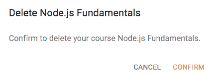

`DeleteCourse`组件的实现与第四章中讨论的`DeleteUser`组件类似，即添加 React 前端以完成 MERN。当`DeleteCourse`组件添加到`Course`组件中时，它将接受课程 ID 和从`Course`组件中获取的`onRemove`函数定义作为 props，而不是用户 ID，如下面的代码所示：

`mern-classroom/client/course/Course.js`

```js
<DeleteCourse course={course} onRemove={removeCourse}/>
```

使用此实现，课程讲师将能够从平台上删除课程。

在本节中，我们通过扩展课程模型并实现课程模型，增加了向课程添加课程的能力。然后，我们添加了必要的后端 API 和用户界面更新，以便添加课程、修改课程详情和课程，以及删除课程和课程。现在课程模块已经准备好，我们可以实现发布课程并使其在应用程序中可供报名的能力。我们将在下一节讨论此发布功能。

# 发布课程

在 MERN Classroom 中，只有已发布的课程才可供平台上的其他用户报名。一旦讲师创建了课程并更新了课程内容，他们将有发布课程的选择。发布的课程将列在主页上，所有访客都可以查看。在本节的其余部分，我们将探讨允许讲师发布课程并在前端列出这些发布课程的实施。

# 实现发布选项

每个课程的讲师在至少向课程添加一个课时后，将有权发布他们的课程。发布课程还意味着课程将不能再被删除，无法添加新课时，也无法删除现有课时。因此，当讲师选择发布时，他们将被要求确认此操作。在本节中，我们将探讨如何使用和扩展现有的课程模块以集成此发布功能。

# 发布按钮状态

在课程视图中，当讲师登录时，他们将根据课程是否可以发布以及是否已经发布，看到“发布”按钮的三个状态，如下所示截图：

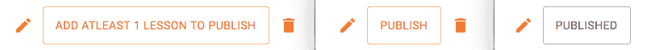

此按钮的状态主要取决于课程文档的`published`属性是否设置为`true`或`false`，以及`lessons`数组的长度。按钮将被添加到`Course`组件中，如下所示代码：

`mern-classroom/client/course/Course.js`

```js
{ !course.published ? 
            (<> <Button color="secondary" variant="outlined" 
                        onClick={clickPublish}>
                   { course.lessons.length == 0 ? 
                           "Add atleast 1 lesson to publish" 
                           : "Publish" }
                </Button>
                <DeleteCourse course={course} onRemove={removeCourse}/>
            </>) : (
                  <Button color="primary" 
                          variant="outlined">Published</Button>
            )
}
```

删除选项只有在课程尚未发布时才会渲染。当点击“发布”按钮时，我们将打开一个对话框，要求用户确认。当按钮被点击时，将调用`clickPublish`函数，定义如下：

`mern-classroom/client/course/Course.js`

```js
const clickPublish = () => {
    if(course.lessons.length > 0){ 
      setOpen(true)
    }
  }
```

`clickPublish` 函数只有在课程数组长度大于零时才会打开对话框；防止讲师在没有课程的情况下发布课程。接下来，我们将添加对话框，让讲师在确认后发布课程。

# 确认发布

当讲师点击“发布”按钮时，他们将看到一个对话框，告知他们此操作的结果，并给他们提供发布课程或取消操作的选择。对话框将如下所示：

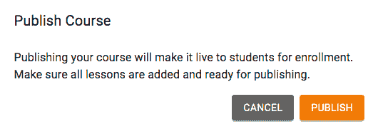

为了实现此对话框，我们将使用 Material-UI 的`Dialog`组件，包括标题和内容文本，以及发布和取消按钮，如下所示代码。

`mern-classroom/client/course/Course.js`

```js
<Dialog open={open} onClose={handleClose} aria-labelledby="form-dialog-title">
   <DialogTitle id="form-dialog-title">Publish Course</DialogTitle>
   <DialogContent>
      <Typography variant="body1">
         Publishing your course will make it live to students 
            for enrollment.            
      </Typography>
      <Typography variant="body1">
         Make sure all lessons are added and ready for publishing.
      </Typography>
   </DialogContent>
   <DialogActions>
      <Button onClick={handleClose} color="primary" variant="contained">
         Cancel
      </Button>
      <Button onClick={publish} color="secondary" variant="contained">
          Publish
      </Button>
   </DialogActions>
</Dialog>
```

当用户点击对话框中的“发布”按钮作为确认发布课程时，我们将向后端发出更新 API 调用，将课程的`published`属性设置为`true`。定义此更新的`publish`函数如下：

`mern-classroom/client/course/Course.js`

```js
  const publish = () => {
    let courseData = new FormData()
      courseData.append('published', true)
      update({
          courseId: match.params.courseId
        }, {
          t: jwt.token
        }, courseData).then((data) => {
          if (data && data.error) {
            setValues({...values, error: data.error})
          } else {
            setCourse({...course, published: true})
            setOpen(false)
          }
      })
  }
```

在此函数中，我们使用的是已经定义并用于从“编辑课程”视图保存其他课程细节修改的相同更新 API。一旦后端成功更新了`published`值，它也会在`Course`组件的状态中更新。

在课程中，这个`published`属性可以用来在`Course`和`EditCourse`组件中条件性地隐藏添加新课程、删除课程和删除课程的选项，以防止讲师在课程发布后执行这些操作。由于课程是由讲师发布的，因此这些课程将在平台上的所有用户视图中被列出，如以下章节所述。

# 列出已发布课程

访问 MERN Classroom 应用程序的所有访客都将能够访问已发布的课程。为了展示这些已发布的课程，我们将添加一个功能来从数据库中检索所有已发布的课程，并在主页上以列表形式显示课程。在接下来的章节中，我们将通过首先定义后端 API 来实现这个功能，该 API 将接收请求并返回已发布课程的列表。然后，我们将实现前端组件，该组件将获取此 API 并渲染课程。

# 已发布课程 API

为了从数据库中检索已发布课程的列表，我们将在后端实现一个 API，首先声明一个接收 GET 请求的路径`'/api/courses/published'`，如下面的代码所示：

`mern-classroom/server/routes/course.routes.js`:

```js
router.route('/api/courses/published')
  .get(courseCtrl.listPublished)
```

向此路由发送 GET 请求将调用`listPublished`控制器方法，该方法启动对具有`published`属性值为`true`的课程的查询。然后，结果课程在响应中返回。`listPublished`控制器方法定义如下：

`mern-classroom/server/controllers/course.controller.js`:

```js
const listPublished = (req, res) => {
  Course.find({published: true}, (err, courses) => {
    if (err) {
      return res.status(400).json({
        error: errorHandler.getErrorMessage(err)
      })
    }
    res.json(courses)
  }).populate('instructor', '_id name')
}
```

为了在前端使用这个列表 API，我们还需要在客户端定义一个 fetch 方法，就像我们为所有其他 API 调用所做的那样。然后，这个 fetch 方法将在组件中使用，用于检索并显示已发布的课程。在下一节中，我们将探讨在 React 组件中渲染检索到的课程列表的实现。

# 课程组件

为了显示已发布课程的列表，我们将设计一个组件，该组件从它所添加的父组件接收课程数组作为 props。在 MERN Classroom 应用程序中，我们将在主页上渲染已发布的课程，如下一张截图所示：

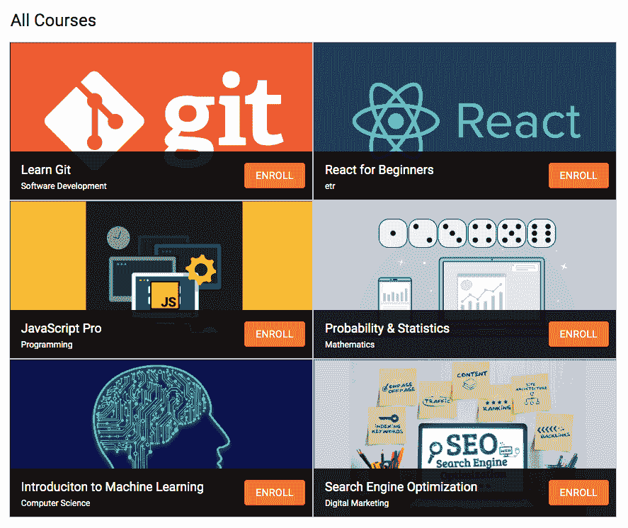

在`Home`组件中，我们将使用`useEffect`钩子从后端检索已发布课程的列表，如下面的代码所示：

`mern-classroom/client/core/Home.js`

```js
  useEffect(() => {
    const abortController = new AbortController()
    const signal = abortController.signal
    listPublished(signal).then((data) => {
      if (data.error) {
        console.log(data.error)
      } else {
        setCourses(data)
      }
    })
    return function cleanup(){
      abortController.abort()
    }
  }, [])
```

一旦收到课程列表，它就被设置到状态中的`courses`变量。当它被添加到`Home`组件时，我们将这个`courses`数组作为 props 传递给`Courses`组件，如下所示：

`mern-classroom/client/core/Home.js`

```js
<Courses courses={courses} />
```

此`Courses`组件将接受这些属性并遍历数组，使用 Material-UI 的`GridList`组件渲染每个课程。`Courses`组件的定义如下所示：

`mern-classroom/client/course/Courses.js`

```js
export default function Courses(props){
  return (
    <GridList cellHeight={220} cols={2}>
       {props.courses.map((course, i) => {
          return (
            <GridListTile key={i} style={{padding:0}}>
              <Link to={"/course/"+course._id}>
                
              </Link>
              <GridListTileBar 
                 title={<Link to={"/course/"+course._id}>
                            {course.name}</Link>}
                 subtitle={<span>{course.category}</span>}
                 actionIcon={auth.isAuthenticated() ? 
                                <Enroll courseId={course._id}/> : 
                                <Link to="/signin">
                                    Sign in to Enroll</Link>
                            }
              />
            </GridListTile>)
       })}
    </GridList>
  )
}
Courses.propTypes = {
  courses: PropTypes.array.isRequired
}
```

列表中的每个课程将显示其名称、类别和图片，并将链接到单个课程页面。将实现一个独立的组件来显示每个课程的注册选项，但仅对已登录并浏览主页的用户显示。

由于现在讲师可以发布课程，所有应用程序的访客都可以查看，我们可以开始实施课程注册功能。

# 注册课程

MERN Classroom 应用程序的所有访客都有登录并注册任何已发布课程的选项。注册课程将使他们能够访问课程详情，并允许他们系统地学习课程。为了实现此功能，在本节中，我们首先定义一个注册模型来在数据库中存储注册详情。然后，我们将添加后端 API，以便当最终用户与将要添加到前端的前端`Enroll`组件交互时创建新的注册。最后，我们将实现一个视图，使学生能够查看和与其注册的课程内容进行交互。

# 定义注册模型

我们将定义一个注册模式（schema）和模型来存储应用程序中每个注册的详情。它将包含存储正在注册的课程引用和作为学生注册的用户引用的字段。它还将存储与相关课程中的课程相对应的数组，该数组将存储每个课程对该学生的完成状态。此外，我们还将存储三个时间戳值；第一个值将表示学生何时注册，第二个值将表示他们上次完成课程或更新注册的时间，最后，当他们完成课程时。此注册模型将在`server/models/enrollment.model.js`中定义，以下列表中给出了定义注册字段的代码及其说明：

+   **课程引用**：`course`字段将存储与此次注册关联的课程文档的引用：

```js
course: {
    type: mongoose.Schema.ObjectId, 
    ref: 'Course'
}
```

+   **学生引用**：`student`字段将存储创建此注册的用户引用，该用户通过选择注册课程来完成注册：

```js
student: {
    type: mongoose.Schema.ObjectId, 
    ref: 'User'
}
```

+   **课程状态**：`lessonStatus`字段将存储一个数组，其中包含对存储在相关课程`lessons`数组中每个课程的引用。对于`lessonStatus`数组中的每个对象，我们将添加一个`complete`字段，该字段将存储一个布尔值，表示相应的课程是否已完成：

```js
lessonStatus: [{
      lesson: {type: mongoose.Schema.ObjectId, ref: 'Lesson'}, 
      complete: Boolean
}]
```

+   **注册时间**：`enrolled` 字段将是一个表示注册创建时间的 `Date` 值；换句话说，当学生注册课程时：

```js
enrolled: {
    type: Date,
    default: Date.now
}
```

+   **更新时间**：`updated` 字段将是另一个 `Date` 值，每次完成一个课时都会更新，指示用户上次在课程课时上工作的日期：

```js
updated: Date
```

+   **完成时间**：`completed` 字段也将是 `Date` 类型，它只会在课程中的所有课程都完成时设置：

```js
completed: Date
```

在此模式定义中的字段将使我们能够实现 MERN Classroom 中的所有注册相关功能。在下一节中，我们将实现用户注册课程的 功能，并使用此注册模型存储注册的详细信息。

# 创建注册 API

当用户选择注册课程时，我们将创建一个新的注册并将其存储在后端。为了实现此功能，我们需要在服务器上定义一个创建注册的 API，首先声明一个接受 `POST` 请求的路线 `'/api/enrollment/new/:courseId'`，如下面的代码所示：

`mern-classroom/server/routes/enrollment.routes.js`：

```js
router.route('/api/enrollment/new/:courseId')
  .get(authCtrl.requireSignin, enrollmentCtrl.findEnrollment, enrollmentCtrl.create)
router.param('courseId', courseCtrl.courseByID)
```

此路由在 URL 中接受课程 ID 作为参数。因此，我们还添加了来自课程控制器的 `courseByID` 控制器方法，以处理此参数并从数据库中检索相应的课程。从客户端请求中发起请求的用户通过请求中发送的用户身份验证凭据进行识别。在此路由接收到的 `POST` 请求将首先检查用户是否已认证，然后检查他们是否已经注册了此课程，在为该用户在此课程中创建新的注册之前。

`findEnrollment` 控制器方法将查询数据库中的 `Enrollments` 集合，以检查是否存在具有给定课程 ID 和用户 ID 的注册。`findEnrollment` 方法定义如下。

`mern-classroom/server/controllers/enrollment.controller.js`：

```js
const findEnrollment = async (req, res, next) => {
  try {
    let enrollments = await Enrollment.find({course:req.course._id, 
                                             student: req.auth._id})
    if(enrollments.length == 0){
      next()
    }else{
      res.json(enrollments[0])
    }
  } catch (err) {
    return res.status(400).json({
      error: errorHandler.getErrorMessage(err)
    })
  }
}
```

如果查询返回匹配的结果，则将返回的结果注册发送回响应，否则将调用 `create` 控制器方法来创建一个新的注册。

`create` 控制器方法从给定的课程引用、用户引用和课程中的课程数组生成要保存到数据库中的新注册对象。`create` 方法定义如下。

`mern-classroom/server/controllers/enrollment.controller.js`：

```js
const create = async (req, res) => {
  let newEnrollment = {
    course: req.course,
    student: req.auth,
  }
  newEnrollment.lessonStatus = req.course.lessons.map((lesson)=>{
    return {lesson: lesson, complete:false}
  })
  const enrollment = new Enrollment(newEnrollment)
  try {
    let result = await enrollment.save()
    return res.status(200).json(result)
  } catch (err) {
    return res.status(400).json({
      error: errorHandler.getErrorMessage(err)
    })
  }
}
```

在 `course` 中的 `lessons` 数组被迭代以生成新注册文档的 `lessonStatus` 对象数组。`lessonStatus` 数组中的每个对象都将 `complete` 值初始化为 `false`。基于这些值成功保存新注册文档后，新文档将发送回响应。

为注册 API 定义的 所有路由，例如此创建 API，都在 `enrollment.routes.js` 文件中声明，并且它将类似于我们应用程序中已经创建的其他路由文件。与其他路由一样，我们需要通过在 `express.js` 中挂载注册路由来将这些新路由加载到 Express 应用中。注册相关路由的挂载方式如下。

`mern-social/server/express.js`:

```js
app.use('/', enrollmentRoutes)
```

要在前端访问创建 API，您还需要定义一个类似于应用程序中已定义的其他 fetch 方法的 fetch 方法。使用此 fetch 方法，下一节中讨论的 `Enroll` 组件将能够调用此创建注册 API。

# 注册组件

`Enroll` 组件将简单地包含一个按钮，该按钮将启动对后端的注册调用，并在服务器成功返回新的注册文档 ID 时重定向用户。此组件从添加它的父组件接收相关课程的 ID 作为属性。此属性将在创建注册 API 调用时使用。`Enroll` 组件的定义如下所示。

`mern-classroom/client/enrollment/Enroll.js`:

```js
export default function Enroll(props) {
  const [values, setValues] = useState({
    enrollmentId: '',
    error: '',
    redirect: false
  })
  if(values.redirect){
     return (<Redirect to={'/learn/'+values.enrollmentId}/>)
  }
  return (
      <Button variant="contained" color="secondary" 
              onClick={clickEnroll}> Enroll </Button>
  )
```

当点击 ENROLL 按钮时，将使用提供的课程 ID 获取创建注册 API，以检索现有注册或创建新的注册并在响应中接收它。当按钮被点击时将调用的 `clickEnroll` 函数定义如下：

`mern-classroom/client/enrollment/Enroll.js`:

```js
 const clickEnroll = () => {
    const jwt = auth.isAuthenticated()
    create({
      courseId: props.courseId
    }, {
      t: jwt.token
    }).then((data) => {
        console.log(data)
      if (data && data.error) {
        setValues({...values, error: data.error})
      } else {
        setValues({...values, enrollmentId: data._id, redirect: true})
      }
    })
  }
```

当服务器成功返回注册时，用户将被重定向到将显示特定注册详情的视图。

由于 `Enroll` 组件从父组件接收课程 ID 作为属性，因此我们还在组件中添加了 `PropType` 验证（如下所示），因为其功能和实现依赖于传递此属性。

`mern-classroom/client/enrollment/Enroll.js`:

```js
Enroll.propTypes = {
  courseId: PropTypes.string.isRequired
}
```

当服务器在 API 调用中成功响应时，用户将被重定向到已注册课程视图，在那里他们可以浏览课程内容。我们将在下一节中实现此视图。

# 已注册课程视图

对于用户注册的每门课程，他们都会看到一个视图，列出课程的详细信息以及课程中的每个课程；并可以选择完成每个课程。在以下章节中，我们将通过首先添加返回给定注册详情的后端 API 来实现此视图，然后在前端使用此 API 构建已注册课程视图。

# 读取注册 API

将返回数据库中注册详情的后端 API 将被定义为接受请求在 `'/api/enrollment/:enrollmentId'` 的 GET 路由，并如下声明：

`mern-classroom/server/routes/enrollment.routes.js`

```js
router.route('/api/enrollment/:enrollmentId')
  .get(authCtrl.requireSignin, enrollmentCtrl.isStudent, 
               enrollmentCtrl.read)
router.param('enrollmentId', enrollmentCtrl.enrollmentByID)
```

在此路由上的 GET 请求将首先调用`enrollmentByID`方法，因为它在 URL 声明中包含`enrollmentId`参数。`enrolmentByID`方法将根据提供的 ID 查询`Enrollments`集合，如果找到匹配的注册文档，我们将使用 Mongoose 的`populate`方法确保引用的课程、嵌套的课程讲师和引用的学生详情也被填充。`enrollmentByID`控制器方法定义如下所示：

`mern-classroom/server/controllers/enrollment.controller.js`:

```js
const enrollmentByID = async (req, res, next, id) => {
  try {
    let enrollment = await Enrollment.findById(id)
                          .populate({path: 'course', populate:{ 
                                                   path: 'instructor'}})
 .populate('student', '_id name')
    if (!enrollment)
      return res.status('400').json({
        error: "Enrollment not found"
      })
    req.enrollment = enrollment
    next()
  } catch (err) {
    return res.status('400').json({
      error: "Could not retrieve enrollment"
    })
  }
}
```

结果的注册对象附加到请求对象，并传递给下一个控制器方法。在将此注册对象返回给客户端之前，我们将在`isStudent`方法中检查当前登录的用户是否与该特定注册关联的学生，正如以下代码中定义的那样。

`mern-classroom/server/controllers/enrollment.controller.js`:

```js
const isStudent = (req, res, next) => {
  const isStudent = req.auth && req.auth._id == 
                                req.enrollment.student._id
  if (!isStudent) {
    return res.status('403').json({
      error: "User is not enrolled"
    })
  }
  next()
}
```

`isStudent`方法检查通过请求中发送的认证凭据识别的用户是否与注册中引用的学生匹配。如果两个用户不匹配，则返回带有错误信息的 403 状态，否则，将调用下一个控制器方法以返回注册对象。下一个控制器方法是`read`方法，其定义如下：

`mern-classroom/server/controllers/enrollment.controller.js`:

```js
const read = (req, res) => {
  return res.json(req.enrollment)
}
```

要在前端使用此读取注册 API，您还需要定义一个相应的 fetch 方法，如在本应用程序中实现的所有其他 API 一样。然后，此 fetch 方法将用于检索要在学生交互的 React 组件中渲染的注册详情。我们将在下一节中实现此`Enrollment`组件。

# 注册组件

`Enrollment`组件将加载从读取注册 API 接收到的课程和课程详情。在这个视图中，学生将能够遍历课程中的每一课，并标记为完成。课程标题将列在抽屉中，给学生一个关于课程包含的内容以及他们已经进展到哪里的整体概念。抽屉中的每一项都会展开以显示课程的详细信息，如下面的截图所示：

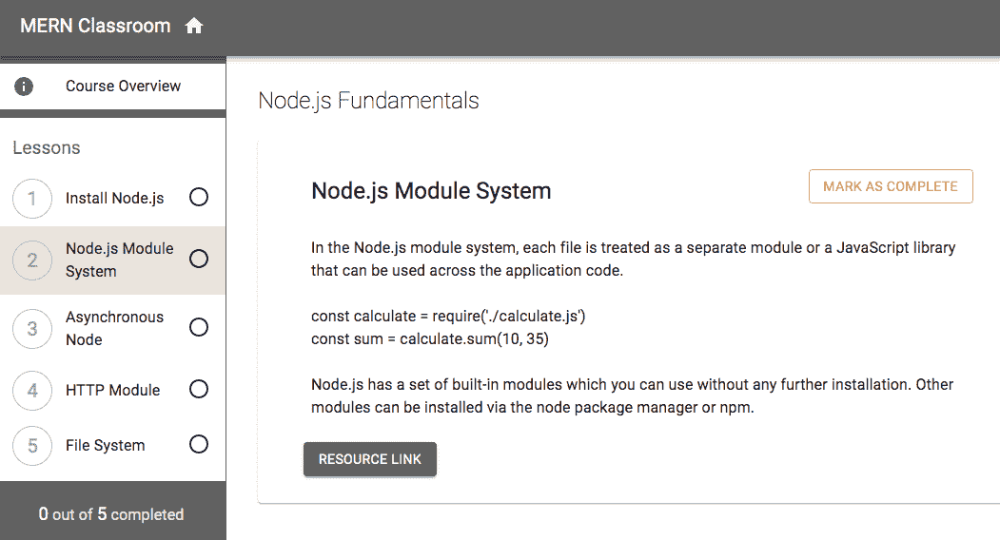

要实现此视图，首先，我们需要在`useEffect`钩子中调用读取注册 API 的 fetch 调用，以检索注册详情并将其设置到状态中，如下面的代码所示。

`mern-classroom/client/enrollment/Enrollment.js`:

```js
export default function Enrollment ({match}) {
  const [enrollment, setEnrollment] = useState({course:{instructor:[]}, 
                                                lessonStatus: []})
  const [values, setValues] = useState({
      redirect: false,
      error: '',
      drawer: -1
    })
  const jwt = auth.isAuthenticated()
  useEffect(() => {
      const abortController = new AbortController()
      const signal = abortController.signal
      read({enrollmentId: match.params.enrollmentId}, 
           {t: jwt.token}, signal).then((data) => {
             if (data.error) {
              setValues({...values, error: data.error})
             } else {
              setEnrollment(data)
             }
      })
      return function cleanup(){
          abortController.abort()
      }
  }, [match.params.enrollmentId])
....
```

我们将使用 Material-UI 的`Drawer`组件来实现抽屉布局。在抽屉中，我们保留第一个项目为课程概览，这将使用户了解课程详情，类似于单个课程页面。当用户进入此报名视图时，他们将首先看到课程概览。

在以下代码中，在添加此第一个抽屉项目后，我们为课程创建了一个单独的章节，其中遍历`lessonStatus`数组以在抽屉中列出课程标题。

`mern-classroom/client/enrollment/Enrollment.js`:

```js
<Drawer variant="permanent">
    <div className={classes.toolbar} />
    <List>
      <ListItem button onClick={selectDrawer(-1)} 
        className={values.drawer == -1 ? 
                    classes.selectedDrawer : classes.unselected}>
        <ListItemIcon><Info /></ListItemIcon>
        <ListItemText primary={"Course Overview"} />
      </ListItem>
    </List>
    <Divider />
    <List>
      <ListSubheader component="div">
          Lessons
      </ListSubheader>
      {enrollment.lessonStatus.map((lesson, index) => (
          <ListItem button key={index} onClick={selectDrawer(index)} 
                    className={values.drawer == index ? 
                           classes.selectedDrawer : classes.unselected}>
            <ListItemAvatar> 
                <Avatar> {index+1} </Avatar> 
            </ListItemAvatar>
            <ListItemText 
                primary={enrollment.course.lessons[index].title} />
            <ListItemSecondaryAction> { lesson.complete ? 
                <CheckCircle/> : <RadioButtonUncheckedIcon />}
            </ListItemSecondaryAction>
          </ListItem>
      ))}
    </List>
    <Divider />
</Drawer>
```

抽屉中“课程”部分的每个项目也将使用户能够直观地了解课程是否已完成，或者是否尚未完成。这些勾选或未勾选的图标将根据`lessonStatus`数组中每个项目的`complete`字段的布尔值进行渲染。

为了确定当前选中的抽屉，我们将使用初始化的`drawer`值到状态中，值为-1。-1 值将与课程概览抽屉项目和视图相关联，而`lessonStatus`中每个项目的索引将确定从抽屉中选择时显示哪个课程。当点击抽屉项目时，我们将调用`selectDrawer`方法，将其-1 或被点击课程的索引作为其参数。`selectDrawer`方法定义如下：

`mern-classroom/client/enrollment/Enrollment.js`:

```js
const selectDrawer = (index) => event => {
   setValues({...values, drawer:index})
}
```

此`selectDrawer`方法根据抽屉中点击的项目设置状态中的`drawer`值。实际的内容视图也将根据以下结构有条件地渲染：

```js
{ values.drawer == - 1 && (Overview of course) }
{ values.drawer != - 1 && (Individual lesson content based on the index value represented in drawer) }
```

课程概览部分可以根据课程页面进行设计和实现。为了渲染单个课程的详细信息，我们可以使用以下`Card`组件：

`mern-classroom/client/enrollment/Enrollment.js`:

```js
{values.drawer != -1 && (<>
     <Typography variant="h5">{enrollment.course.name}</Typography>
     <Card> <CardHeader 
              title={enrollment.course.lessons[values.drawer].title} 
            />
            <CardContent> 
               <Typography variant="body1">            
                      {enrollment.course.lessons[values.drawer].content}
               </Typography>
            </CardContent>
            <CardActions>
               <a href={enrollment.course.lessons[values.drawer].resource_url}>                       
                    <Button variant="contained" color="primary">
                        Resource Link</Button>
               </a>
            </CardActions>
     </Card>
  </>
)}
```

这将渲染所选课程的详细信息，包括标题、内容和资源 URL 值。通过这种实现，我们现在有了一种让用户报名课程并查看他们报名详情的方法。这种报名数据最初是从课程详情创建的，但也会存储特定于报名学生的详细信息，以及他们在课程和课程整体中的进度。为了能够记录和跟踪这种进度，并向学生和教师显示相关的统计信息，我们将在下一节进一步更新此实现以添加这些功能。

# 跟踪进度和报名统计

在 MERN Classroom 这样的教室应用程序中，让学生可视化他们在报名课程中的进度，并让教师看到有多少学生报名并完成了他们的课程，这可能非常有价值。

在这个应用中，一旦学生报名参加一门课程，他们就能逐个完成课程中的每一课，并标记为完成，直到所有课程都完成，整个课程才算完成。应用会提供视觉提示，让学生知道他们在课程中的报名状态。对于讲师来说，一旦他们发布了一门课程，我们会显示报名该课程的学生总数，以及完成该课程的学生总数。

在以下章节中，我们将实现这些功能，从让用户完成课程并跟踪他们在课程中的进度开始，然后列出他们的报名，带有哪些已完成和哪些正在进行中的指示，最后显示每个发布的课程的报名统计数据。

# 完成课程

我们必须扩展报名 API 和报名视图实现，以便学生首先完成课程，然后完成整个课程。我们将在后端添加一个课程完成 API，并在前端使用这个 API 在用户执行此操作时标记课程为完成。在以下章节中，我们将添加这个 API，然后修改`Enrollment`组件以使用这个 API，并视觉上指示哪些课程已完成。

# 完成的课程 API

我们将在后端为报名添加一个`complete` API 端点，该端点将标记指定的课程为完成，当所有课程都完成时，也会标记报名的课程为完成。为了实现这个 API，我们将首先声明一个 PUT 路由，如下面的代码所示：

`mern-classroom/server/routes/enrollment.routes.js`

```js
router.route('/api/enrollment/complete/:enrollmentId')
  .put(authCtrl.requireSignin, 
        enrollmentCtrl.isStudent, 
            enrollmentCtrl.complete)
```

当接收到`'/api/enrollment/complete/:enrollmentId'` URL 的 PUT 请求时，我们首先确保已登录的用户是与这个报名记录关联的学生，然后我们将调用`complete`报名控制器方法。`complete`方法定义如下：

`mern-classroom/server/controllers/enrollment.controller.js`

```js
const complete = async (req, res) => {
  let updatedData = {}
  updatedData['lessonStatus.$.complete']= req.body.complete 
  updatedData.updated = Date.now()
  if(req.body.courseCompleted)
    updatedData.completed = req.body.courseCompleted
    try {
      let enrollment = await 
                        Enrollment.updateOne({'lessonStatus._id':                                                
                                               req.body.lessonStatusId}, 
                                             {'$set': updatedData})
      res.json(enrollment)
    } catch (err) {
      return res.status(400).json({
        error: errorHandler.getErrorMessage(err)
      })
    }
}
```

在这个`complete`方法中，我们使用 MongoDB 的`updateOne`操作来更新包含对应于请求中提供的`lessonStatusId`值的`lessonStatus`对象的报名文档。

在生成的报名文档中，我们更新`lessonStatus`数组中特定对象的`complete`字段和报名文档的`updated`字段。如果请求中发送了`courseCompleted`值，我们也会更新报名文档中的`completed`字段。一旦报名文档更新成功，它就会作为响应发送回去。

要在前端使用这个 `complete` API 端点，你还需要定义一个相应的获取方法，就像我们为其他 API 实现所做的那样。这个获取方法应该向完成注册路由发送一个 PUT 请求，并将相关值作为请求发送。如下一节所述，我们将在这个 `Enrollment` 组件中使用这个实现的 API，以便允许学生完成课程。

# 视图中的完成课程

在 `Enrollment` 组件中，我们在抽屉视图中渲染每个课程的详细信息，我们将给学生提供标记课程为完成的选项。这个选项将根据给定的课程是否已经完成而条件性地渲染。这个选项将被添加到 `CardHeader` 的 `action` 属性中，如下面的代码所示：

`mern-classroom/client/enrollment/Enrollment.js`:

```js
action={<Button 
          onClick={markComplete} 
          variant={enrollment.lessonStatus[values.drawer].complete ?                                         
                            'contained' : 'outlined'} color="secondary">
          {enrollment.lessonStatus[values.drawer].complete ?
                            "Completed" : "Mark as complete"}
         </Button>}
```

如果给定的 `lessonStatus` 对象中的 `complete` 属性设置为 `true`，则渲染一个填充的按钮，上面写着“已完成”，否则渲染一个带有“标记为完成”文本的轮廓按钮。点击此按钮将调用 `markComplete` 函数，该函数将发出 API 调用来更新数据库中的注册。这个 `markComplete` 函数定义如下：

`mern-classroom/client/enrollment/Enrollment.js`:

```js
const markComplete = () => {
   if(!enrollment.lessonStatus[values.drawer].complete){
     const lessonStatus = enrollment.lessonStatus
     lessonStatus[values.drawer].complete = true
     let count = totalCompleted(lessonStatus)
     let updatedData = {}
     updatedData.lessonStatusId = lessonStatus[values.drawer]._id
     updatedData.complete = true
     if(count == lessonStatus.length){
       updatedData.courseCompleted = Date.now()
     }
     complete({
       enrollmentId: match.params.enrollmentId
      }, {
        t: jwt.token
      }, updatedData).then((data) => {
      if (data && data.error) {
        setValues({...values, error: data.error})
      } else {
        setEnrollment({...enrollment, lessonStatus: lessonStatus})
      }
     })
   }
}
```

在这个函数中，在向后端发出 API 调用之前，我们在 `updatedData` 对象中准备要随请求发送的值。我们发送 `lessonStatus` 的详细信息，包括用户完成的课程的 ID 值和设置为 `true` 的 `complete` 值。我们还计算完成课程的总数是否等于课程总数，这样我们就可以在请求中设置并发送 `courseCompleted` 值。

完成课程的总数是通过 `totalCompleted` 函数计算的，该函数定义如下：

`mern-classroom/client/enrollment/Enrollment.js`:

```js
const totalCompleted = (lessons) => {
  let count = lessons.reduce((total, lessonStatus) => {
                   return total + (lessonStatus.complete ? 1 : 0)}, 0)
  setTotalComplete(count)
  return count
}
```

我们使用数组 `reduce` 函数来查找并统计 `lessonStatus` 数组中完成课程的计数。这个计数值也存储在状态中，以便可以在抽屉底部的视图中渲染，如下面的截图所示：

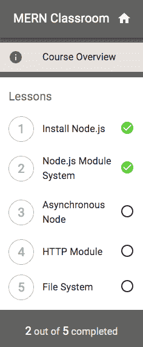

学生的课程旁边将有一个勾选图标，作为指示哪些课程已完成或未完成。我们还给学生一个总数，显示完成课程的数量。当所有课程都完成时，课程被认为是完成的。这让学生对自己的课程进度有一个概念。接下来，我们将添加一个功能，允许用户查看他们注册的所有课程的状况。

# 列出用户的全部注册

一旦学生登录到 MERN Classroom，他们就能在主页上查看他们所有注册的列表。为了实现这个功能，我们首先定义一个后端 API，它返回给定用户的注册列表，然后在前端使用它来向用户渲染注册列表。

# 注册列表 API

注册列表 API 将接收一个 GET 请求并查询 `Enrollments` 集合，以找到具有与学生参考匹配的当前登录用户的注册。为了实现这个 API，我们首先声明 `'/api/enrollment/enrolled'` 的 GET 路由，如下面的代码所示：

`mern-classroom/server/routes/enrollment.routes.js`

```js
router.route('/api/enrollment/enrolled')
  .get(authCtrl.requireSignin, enrollmentCtrl.listEnrolled)
```

对这个路由的 GET 请求将调用 `listEnrolled` 控制器方法，该方法将查询数据库并将结果作为响应返回给客户端。`listEnrolled` 方法定义如下：

`mern-classroom/server/controllers/enrollment.controller.js`

```js
const listEnrolled = async (req, res) => {
  try {
    let enrollments = await Enrollment.find({student: req.auth._id})
                                            .sort({'completed': 1})
                                            .populate('course', '_id name category')
    res.json(enrollments)
  } catch (err) {
    console.log(err)
    return res.status(400).json({
      error: errorHandler.getErrorMessage(err)
    })
  }
}
```

对 `Enrollments` 集合的查询将找到所有与学生参考匹配的用户 ID 相匹配的注册。结果注册将被填充有引用课程的名称和类别值，并且列表将被排序，以便完成的注册放在未完成的注册之后。

通过在客户端为这个 API 定义相应的获取方法，我们可以在将渲染这些注册的 React 组件中调用它。我们将在下一节中查看这个组件的实现。

# 注册组件

`Enrollments` 组件将在主页上渲染，并且它将从 `Home` 组件接收注册列表作为属性。接收到的注册列表将在这个组件中按顺序渲染，以便向用户展示他们已注册的课程。我们还将使用每个状态的代表性图标来指示列表中的注册课程是否已完成，或正在进行中，如下面的截图所示：

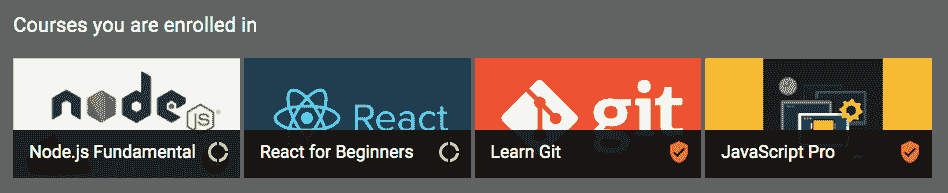

这个列出注册的视图将非常类似于 `Courses` 组件，该组件列出已发布的课程。在 `Enrollments` 中，而不是课程，将迭代从 `Home` 组件接收到的注册以渲染每个注册，如下面的代码所示：

`mern-classroom/client/enrollment/Enrollments.js`

```js
{props.enrollments.map((course, i) => (
  <GridListTile key={i}>
     <Link to={"/learn/"+course._id}>
       
     </Link>
     <GridListTileBar
       title={<Link to={"/learn/"+course._id}>{course.course.name}</Link>}
       actionIcon={<div> {course.completed ? 
 (<CompletedIcon color="secondary"/>)
 : (<InProgressIcon/>)
 }
                   </div>}
     />
  </GridListTile>
))}
```

根据单个注册是否已经有一个 `complete` 日期值，我们将有条件地渲染图标。这将使用户了解他们已经完成的注册课程，以及他们尚未完成的课程。

既然我们已经实现了允许应用程序中的学生注册课程、完成课程和跟踪进度的功能，我们也可以通过扩展这些实现来提供关于课程的注册统计信息，正如我们接下来将要看到的。

# 报名统计信息

一旦讲师发布课程，并且应用程序中的其他用户开始报名并完成课程中的课程，我们将显示课程的报名总数和课程完成数作为简单的报名统计信息。为了实现此功能，在以下章节中，我们首先实现一个返回报名统计信息的 API，然后展示这些统计信息在视图中的显示。

# 报名统计 API

为了实现一个将查询数据库中的`Enrollments`集合以计算特定课程统计信息的后端 API，我们首先需要在`'/api/enrollment/stats/:courseId'`上声明一个 GET 路由，如下所示。

`mern-classroom/server/routes/enrollment.routes.js`

```js
router.route('/api/enrollment/stats/:courseId')
  .get(enrollmentCtrl.enrollmentStats)
```

在此 URL 上的 GET 请求将返回一个`stats`对象，其中包含课程的全部报名和全部完成数，这些是通过 URL 参数中提供的`courseId`确定的。此实现定义在`enrollmentStats`控制器方法中，如下所示。

`mern-classroom/server/controllers/enrollment.controller.js`

```js
const enrollmentStats = async (req, res) => {
  try {
    let stats = {}
    stats.totalEnrolled = await Enrollment.find({course:req.course._id})
                                          .countDocuments()
    stats.totalCompleted = await Enrollment.find({course:req.course._id})
                                         .exists('completed', true)
                                          .countDocuments()
    res.json(stats)
  } catch (err) {
    return res.status(400).json({
      error: errorHandler.getErrorMessage(err)
    })
  }
} 
```

在这个`enrollmentStats`方法中，我们使用请求中提供的课程 ID 对`Enrollments`集合执行两个查询。在第一个查询中，我们简单地找到给定课程的全部报名，并使用 MongoDB 的`countDocuments()`对这些结果进行计数。在第二个查询中，我们找到给定课程的全部报名，并检查这些报名中是否存在`completed`字段。然后我们最终得到这些结果的计数。这些数字将作为响应发送回客户端。

与其他 API 实现类似，您还需要在客户端定义相应的 fetch 方法，该方法将向此路由发出 GET 请求。使用此 fetch 方法，我们将检索并显示每个已发布课程的这些统计信息，如下一节所述。

# 显示已发布课程的报名统计信息

报名统计信息可以从后端检索并在课程视图中渲染，如下所示：

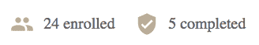

为了检索这些报名统计信息，我们将在`Course`组件中添加第二个`useEffect`钩子，以便对报名统计 API 进行 fetch 调用，如下所示：

`mern-classroom/client/course/Course.js`

```js
  useEffect(() => {
    const abortController = new AbortController()
    const signal = abortController.signal
    enrollmentStats({courseId: match.params.courseId}, 
                    {t:jwt.token}, signal).then((data) => {
                      if (data.error) {
                        setValues({...values, error: data.error})
                      } else {
                        setStats(data)
                      }
                   })
    return function cleanup(){
      abortController.abort()
    }
  }, [match.params.courseId])
```

这将接收给定课程的报名统计信息，并将其设置到状态中的`stats`变量，我们可以在视图中渲染它，如下所示：

`mern-classroom/client/course/Course.js`

```js
{course.published && 
    (<div> <span> <PeopleIcon /> {stats.totalEnrolled} enrolled </span>
           <span> <CompletedIcon/> {stats.totalCompleted} completed </span>
     </div>)
}
```

在将此功能添加到课程组件后，任何正在浏览 MERN Classroom 应用程序中课程的访客，应用程序中的已发布课程将看起来如下所示：

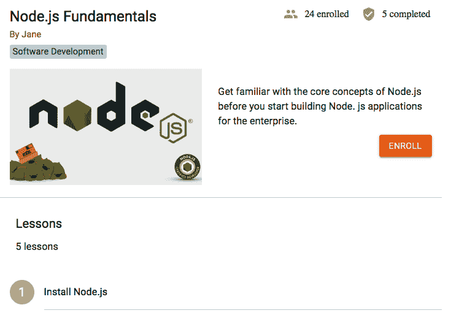

这张课程页面截图，包含了课程详情、报名选项和报名统计信息，成功地捕捉了我们为了实现这一视图而在本章中实现的所有功能。一个注册了教室应用的用户成为了教育者，创建并发布了这个课程，其中包含课程内容。然后，其他用户报名参加了课程并完成了课程内容，从而生成了报名统计信息。我们只是简单地扩展了 MERN 框架应用，添加了更多模型、API 和 React 前端组件，这些组件检索并渲染了接收到的数据，以构建一个完整的教室应用。

# 摘要

在本章中，我们通过扩展框架应用开发了名为 MERN Classroom 的简单在线教室应用。我们集成了允许用户拥有多个角色的功能，包括教育者和学生；作为讲师添加和发布包含课程内容的课程；作为学生报名课程并完成课程内容；以及跟踪课程完成进度和报名统计信息。

在实现这些功能的过程中，我们练习了如何扩展构成前端-后端同步应用的全栈组件切片。我们通过实现数据架构和模型、添加新的后端 API 以及将这些 API 与前端的新 React 组件集成来添加新功能，从而完成全栈切片。通过逐步构建这个应用，从较小的实现单元到复杂和组合功能，你现在应该对如何结合 MERN 基础的全栈应用的不同部分有了更好的理解。

为了学习如何整合更加复杂的功能，并找到在使用此堆栈开发高级现实世界应用时可能遇到的棘手问题的解决方案，我们将在下一章开始构建一个基于 MERN 的、功能丰富的在线市场应用。
