# 通过在线市场锻炼 MERN 技能

随着越来越多的业务在网上进行，在线市场环境中买卖的能力已成为许多网络平台的核心需求。在本章和接下来的两章中，我们将利用 MERN 技术栈开发一个具有用户买卖功能的在线市场应用程序。

我们将为这个应用程序构建从简单到高级的所有功能，从本章开始，我们将重复前几章中学到的全栈开发经验，为市场平台打下基础。我们将通过支持卖家账户和带有产品的商店来扩展 MERN 框架应用程序，逐步集成市场功能，如产品搜索和建议。到本章结束时，你将更好地掌握如何扩展、集成和组合全栈实现的各个方面，以向你的应用程序添加复杂功能。

在本章中，我们将通过以下主题开始构建在线市场：

+   介绍 MERN 市场应用程序

+   拥有卖家账户的用户

+   在市场上添加商店

+   向商店添加产品

+   通过名称和类别搜索产品

# 介绍 MERN 市场应用程序

MERN 市场应用程序将允许用户成为卖家，他们可以管理多个商店并在每个商店中添加他们想要出售的产品。访问 MERN 市场的用户将能够搜索和浏览他们想要购买的产品，并将产品添加到购物车中下订单。最终的市场应用程序将如以下截图所示：

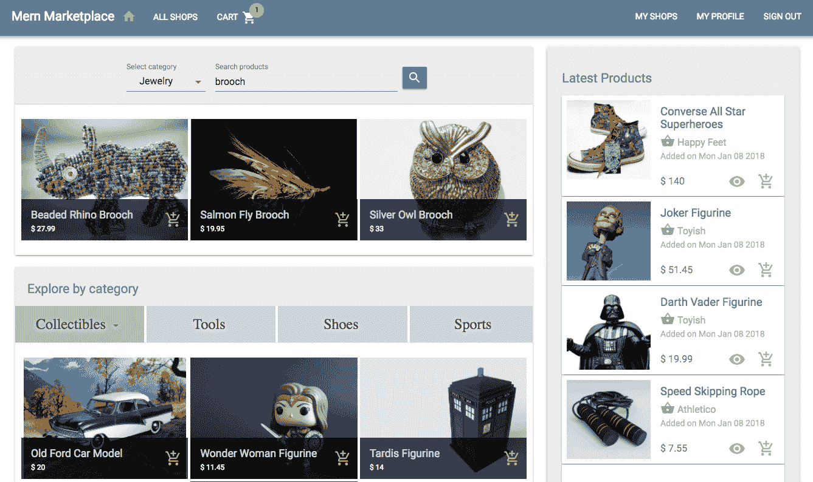

完整的 MERN 市场应用程序的代码可在 GitHub 上找到，网址为[`github.com/PacktPublishing/Full-Stack-React-Projects-Second-Edition/tree/master/Chapter07%20and%2008/mern-marketplace`](https://github.com/PacktPublishing/Full-Stack-React-Projects-Second-Edition/tree/master/Chapter07%20and%2008/mern-marketplace)。本章和下一章中讨论的实现可以在存储库的 shop-cart-order-pay 分支中访问。你可以在阅读本章剩余部分的代码解释时克隆此代码并运行应用程序。

在本章中，我们将扩展 MERN 框架以构建一个简单的在线市场版本，从以下功能开始：

+   拥有卖家账户的用户

+   店铺管理

+   产品管理

+   通过名称和类别搜索产品

与卖家账户、商店和产品相关的功能所需视图将通过扩展和修改 MERN 框架应用程序中现有的 React 组件来开发。下面所示的组件树展示了本章开发的 MERN 市场前端的所有自定义 React 组件：

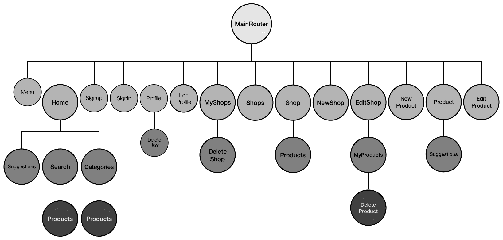

我们将添加新的 React 组件来实现管理商店和产品以及浏览和搜索产品的视图。我们还将修改现有的组件，如 EditProfile、Menu 和 Home 组件，将骨架代码开发成市场应用程序，正如我们在本章的其余部分构建不同功能时那样。这些市场功能将取决于用户将他们的账户更新为卖家账户的能力。在下一节中，我们将通过更新现有的用户实现来启用卖家账户功能，开始构建 MERN 市场应用程序。

# 允许用户成为卖家

任何在 MERN 市场应用程序上有账户的用户都有将他们的账户更新为卖家账户的选项，通过更改他们的个人资料来实现。我们将在<q>编辑个人资料</q>页面添加此选项以转换为卖家账户，如下面的截图所示：

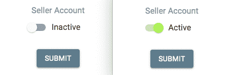

拥有活跃卖家账户的用户将被允许创建和管理他们自己的商店，在那里他们可以管理产品。普通用户将无法访问卖家仪表板，而拥有活跃卖家账户的用户将在菜单上看到一个指向他们仪表板的链接，显示为“我的商店”。以下截图显示了普通用户与拥有活跃卖家账户的用户在菜单上的区别：


要添加此卖家账户功能，我们需要更新用户模型、编辑个人资料视图，并在菜单中添加一个仅对卖家可见的“我的商店”链接，如以下各节所述。

# 更新用户模型

我们需要存储有关每个用户的额外详细信息，以确定用户是否是活跃的卖家。我们将更新我们在第三章，《使用 MongoDB、Express 和 Node 构建后端》中开发的用户模型，以添加一个默认设置为`false`的`seller`值来表示普通用户，并且可以额外设置为`true`来表示也是卖家的用户。我们将更新现有的用户模式以添加此`seller`字段，如下面的代码所示：

`mern-marketplace/server/models/user.model.js`:

```js
seller: {
    type: Boolean,
    default: false
}
```

对于每个用户的此`seller`值必须在成功登录后发送给客户端，以便视图可以根据显示与卖家相关的信息进行渲染。我们将在`signin`控制器方法中更新返回的响应，以添加此详细信息，如下面的代码所示：

`mern-marketplace/server/controllers/auth.controller.js`:

```js
...
return res.json({
      token,
      user: {
        _id: user._id,
        name: user.name,
        email: user.email,
        seller: user.seller
      }
    })
...
} 
```

使用此`seller`字段值，我们可以根据仅允许卖家账户的授权来渲染前端。在根据卖家授权渲染视图之前，我们首先需要在`EditProfile`视图中实现激活卖家账户功能的选项，如下一节所述。

# 更新编辑个人资料视图

已登录用户将在编辑个人资料视图中看到一个切换按钮，允许他们激活或停用卖家功能。我们将更新`EditProfile`组件，在`FormControlLabel`中添加一个`Material-UI` `Switch`组件，如下面的代码所示：

`mern-marketplace/client/user/EditProfile.js`:

```js
<Typography variant="subtitle1" className={classes.subheading}>
   Seller Account
</Typography>
<FormControlLabel
     control={<Switch
                checked={values.seller}
                onChange={handleCheck}
             />}
     label={values.seller? 'Active' : 'Inactive'}
/>
```

任何对开关的更改将通过调用`handleCheck`方法设置为状态中`seller`的值。`handleCheck`方法的实现如下所示：

`mern-marketplace/client/user/EditProfile.js`:

```js
const handleCheck = (event, checked) => {
    setValues({...values, 'seller': checked})
} 
```

当提交编辑个人资料详情的表单时，`seller`值也将添加到发送给服务器的更新详情中，如下面的代码所示：

`mern-marketplace/client/user/EditProfile.js`:

```js
const clickSubmit = () => {
    const jwt = auth.isAuthenticated() 
    const user = {
      name: values.name || undefined,
      email: values.email || undefined,
      password: values.password || undefined,
      seller: values.seller || undefined
    }
    update({
      userId: match.params.userId
    }, {
      t: jwt.token
    }, user).then((data) => {
      if (data && data.error) {
        setValues({...values, error: data.error})
      } else {
        auth.updateUser(data, ()=>{
 setValues({...values, userId: data._id, redirectToProfile: true})
 })
      }
    })
  }
```

在成功更新后，用于认证目的存储在`sessionStorage`中的用户详情也应更新。通过调用`auth.updateUser`方法来完成此`sessionStorage`更新。`auth.updateUser`方法的实现已在第六章的*更新编辑个人资料视图*部分中讨论，*构建基于 Web 的课堂应用*。

一旦在前端获得更新的`seller`值，我们可以使用它来相应地渲染界面。在下一节中，我们将看到如何根据查看应用的用户的卖家账户是否活跃来不同地渲染菜单。

# 更新菜单

在市场应用的前端，我们可以根据当前浏览应用的用户的卖家账户是否活跃来渲染不同的选项。在本节中，我们将添加代码以条件性地在导航栏上显示到*我的商店*的链接，该链接仅对已登录且拥有活跃卖家账户的用户可见。

我们将更新前一段代码中的`Menu`组件，使其仅在用户登录时渲染，如下所示：

`mern-marketplace/client/core/Menu.js`:

```js
{auth.isAuthenticated().user.seller && 
  (<Link to="/seller/shops">
  <Button color = {isPartActive(history, "/seller/")}> My Shops </Button>
   </Link>)
}
```

导航栏上的此*我的商店*链接将带活跃卖家账户的用户带到卖家仪表板视图，在那里他们可以管理他们在市场上的商店。

通过对用户实现的这些更新，现在市场中的用户可以将他们的普通账户更新为卖家账户，我们可以开始整合允许这些卖家向市场添加商店的功能。我们将在下一节中看到如何实现这一点。

# 在市场中添加商店

MERN 市场中的卖家可以创建商店并向每个商店添加产品。为了存储商店数据和启用商店管理，我们将实现一个用于商店的 Mongoose 模式，后端 API 以访问和修改商店数据，以及面向商店所有者和浏览市场的买家的前端视图。

在接下来的章节中，我们将通过首先定义用于在数据库中存储商店数据的商店模型，然后实现商店相关功能的后端 API 和前端视图（包括创建新商店、列出所有商店、按所有者列出商店、显示单个商店、编辑商店和从应用程序中删除商店）来构建应用程序中的商店模块。

# 定义商店模型

我们将实现一个 Mongoose 模型来定义一个用于存储每个商店详情的商店模型。此模型将在`server/models/shop.model.js`中定义，其实现将与之前章节中覆盖的其他 Mongoose 模型实现类似，如第六章中定义的 Course 模型，*构建基于 Web 的课堂应用程序*。此模型中的商店模式将包含简单的字段以存储商店详情，包括标志图像以及指向拥有商店的用户引用。定义商店字段的代码块及其说明如下所示：

+   **商店名称和描述**：`name`和`description`字段将是字符串类型，其中`name`为必填字段：

```js
name: { 
    type: String, 
    trim: true, 
    required: 'Name is required' 
},
description: { 
    type: String, 
    trim: true 
},
```

+   **商店标志图像**：`image`字段将存储用户上传到 MongoDB 数据库中的标志图像文件：

```js
image: { 
    data: Buffer, 
    contentType: String 
},
```

+   **商店所有者**：`owner`字段将引用创建商店的用户：

```js
owner: {
    type: mongoose.Schema.ObjectId, 
    ref: 'User'
}
```

+   **创建时间和更新时间**：`created`和`updated`字段将是`Date`类型，`created`在添加新商店时生成，而`updated`在修改任何商店详情时更改：

```js
updated: Date,
created: { 
    type: Date, 
    default: Date.now 
},
```

在此模式定义中添加的字段将使我们能够实现 MERN Marketplace 中的商店相关功能。在下一节中，我们将通过实现允许卖家创建新商店的全栈切片来开始开发这些功能。

# 创建新商店

在 MERN Marketplace 中，一个已登录并拥有活跃卖家账户的用户将能够创建新的商店。为了实现这个功能，在接下来的章节中，我们将在后端添加创建商店 API，以及在前端获取此 API 的方法，以及一个用于输入商店字段的创建新商店表单视图。

# 创建商店 API

为了实现允许在数据库中创建新商店的创建商店 API，我们首先添加一个`POST`路由，如下面的代码所示：

`mern-marketplace/server/routes/shop.routes.js`:

```js
router.route('/api/shops/by/:userId')
    .post(authCtrl.requireSignin, authCtrl.hasAuthorization, 
           userCtrl.isSeller, shopCtrl.create)
```

对`/api/shops/by/:userId`此路由的`POST`请求将首先确保请求的用户已登录并且也是授权的所有者，换句话说，它是与路由参数中指定的`:userId`关联的同一用户。

为了处理`:userId`参数并从数据库中检索关联的用户，我们将利用用户控制器中的`userByID`方法。我们将在`shop.routes.js`中的`Shop`路由中添加以下内容，以便用户在`request`对象中作为`profile`可用：

`mern-marketplace/server/routes/shop.routes.js`:

```js
router.param('userId', userCtrl.userByID) 
```

包含商店路由的`shop.routes.js`文件将与`user.routes`文件非常相似。为了在 Express 应用中加载这些新的商店路由，我们需要在`express.js`中挂载商店路由，如下所示，就像我们为认证和用户路由所做的那样：

`mern-marketplace/server/express.js`:

```js
app.use('/', shopRoutes)
```

在创建商店路由的请求中，也会验证当前用户是否为卖家，然后再使用请求中传递的商店数据创建一个新的商店。我们将更新用户控制器以添加`isSeller`方法，以确保当前用户实际上是一个卖家。`isSeller`方法定义如下：

`mern-marketplace/server/controllers/user.controller.js`:

```js
const isSeller = (req, res, next) => {
  const isSeller = req.profile && req.profile.seller
  if (!isSeller) {
    return res.status('403').json({
      error: "User is not a seller"
    })
  }
  next()
}
```

在商店控制器中，当卖家验证后，会调用`create`方法，该方法使用`formidable`节点模块解析可能包含用户上传的商店标志图像文件的 multipart 请求。如果有文件，`formidable`将暂时将其存储在文件系统中，我们将使用`fs`模块读取它，以检索文件类型和数据并将其存储在商店文档的`image`字段中。`create`控制器方法将如下所示：

`mern-marketplace/server/controllers/shop.controller.js`:

```js
const create = (req, res, next) => {
  let form = new formidable.IncomingForm()
  form.keepExtensions = true
  form.parse(req, (err, fields, files) => {
    if (err) {
      res.status(400).json({
        message: "Image could not be uploaded"
      })
    }
    let shop = new Shop(fields)
    shop.owner= req.profile
    if(files.image){
      shop.image.data = fs.readFileSync(files.image.path)
      shop.image.contentType = files.image.type
    }
    shop.save((err, result) => {
      if (err) {
        return res.status(400).json({
          error: errorHandler.getErrorMessage(err)
        })
      }
      res.status(200).json(result)
    })
  })
}
```

用户上传的商店标志图像文件存储在 MongoDB 中作为数据。然后，为了在视图中显示，它作为单独的`GET` API 从数据库中检索出来，作为一个图像文件。`GET` API 设置为 Express 路由`/api/shops/logo/:shopId`，从 MongoDB 获取图像数据并将其作为文件发送在响应中。文件上传、存储和检索的实现步骤在第五章“从简单的社交媒体应用开始”的“上传个人照片”部分中详细说明。

现在可以在前端使用这个创建商店 API 端点来发起`POST`请求。接下来，我们将在客户端添加一个`fetch`方法，以便从应用程序的客户端界面发起这个请求。

# 在视图中获取创建 API

在前端，为了向这个创建 API 发起请求，我们将在客户端设置一个`fetch`方法，向 API 路由发送一个`POST`请求，并传递包含新商店详细信息的 multipart 表单数据。这个`fetch`方法定义如下：

`mern-marketplace/client/shop/api-shop.js`:

```js
const create = (params, credentials, shop) => {
  return fetch('/api/shops/by/'+ params.userId, {
      method: 'POST',
      headers: {
        'Accept': 'application/json',
        'Authorization': 'Bearer ' + credentials.t
      },
      body: shop
    })
    .then((response) => {
      return response.json()
    }).catch((err) => console.log(err))
}
```

我们将在下一节实现的创建新商店表单视图中使用这个方法，将用户输入的商店详细信息发送到后端。

# 新商店组件

在市场应用中的卖家将通过表单视图输入新商店的详细信息并创建新商店。我们将在这个`NewShop`组件中渲染这个表单，允许卖家通过输入名称和描述，并从本地文件系统中上传标志图像文件来创建商店，如下面的截图所示：

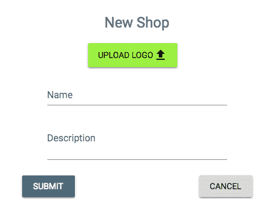

我们将在名为 `NewShop` 的 React 组件中实现此表单。对于视图，我们首先使用 Material-UI 按钮和 HTML5 文件输入元素添加文件上传元素，如下面的代码所示：

`mern-marketplace/client/shop/NewShop.js`:

```js
<input accept="image/*" onChange={handleChange('image')} 
       id="icon-button-file"
       style={display:'none'} type="file" />
<label htmlFor="icon-button-file">
   <Button variant="contained" color="secondary" component="span">
      Upload Logo <FileUpload/>
   </Button>
</label> 
<span>{values.image ? values.image.name : ''}</span>

```

然后，我们添加名称和描述表单字段，使用 `TextField` 组件，如下所示：

`mern-marketplace/client/shop/NewShop.js`:

```js
<TextField 
    id="name" 
    label="Name" 
    value={values.name} 
    onChange={handleChange('name')}/> <br/>
<TextField 
    id="multiline-flexible" 
    label="Description"
    multiline rows="2" 
    value={values.description}
    onChange={handleChange('description')}/>
```

这些表单字段的变化将通过 `handleChange` 方法进行跟踪，当用户与输入字段交互输入值时。`handleChange` 函数将定义如下所示：

`mern-marketplace/client/shop/NewShop.js`:

```js
const handleChange = name => event => {
    const value = name === 'image'
      ? event.target.files[0]
      : event.target.value
    setValues({ ...values, [name]: value })
}
```

`handleChange` 方法会更新状态，包括用户上传的图像文件名（如果有的话）。

最后，您可以通过添加一个提交按钮来完成此表单视图，当用户点击时，应将表单数据发送到服务器。我们将定义一个 `clickSubmit` 方法，如下所示，当用户点击提交按钮时将被调用：

`mern-marketplace/client/shop/NewShop.js`:

```js
const clickSubmit = () => {
    const jwt = auth.isAuthenticated()
    let shopData = new FormData()
    values.name && shopData.append('name', values.name)
    values.description && shopData.append('description', values.description)
    values.image && shopData.append('image', values.image)
    create({
      userId: jwt.user._id
    }, {
      t: jwt.token
    }, shopData).then((data) => {
      if (data.error) {
        setValues({...values, error: data.error})
      } else {
        setValues({...values, error: '', redirect: true})
      }
    })
}
```

此 `clickSubmit` 函数将获取输入值并填充 `shopData`，这是一个 `FormData` 对象，确保数据以正确的格式存储，适用于 `multipart/form-data` 编码类型。然后调用 `create` fetch 方法，使用此表单数据在后端创建新的商店。在成功创建商店后，用户将被重定向回 `MyShops` 视图，如下面的代码所示：

`mern-marketplace/client/shop/NewShop.js`:

```js
if (values.redirect) {
      return (<Redirect to={'/seller/shops'}/>)
}
```

`NewShop` 组件只能由已登录且也是卖家的用户查看。因此，我们将在 `MainRouter` 组件中添加一个 `PrivateRoute`，如下面的代码块所示，它只为在 `/seller/shop/new` 的认证用户提供此表单：

`mern-marketplace/client/MainRouter.js`:

```js
<PrivateRoute path="/seller/shop/new" component={NewShop}/>
```

此链接可以添加到卖家可能访问的任何视图组件中，例如在卖家管理市场中的商店的视图中。现在，在市场上添加新商店成为可能，在下一节中，我们将讨论从后端数据库到前端应用视图检索和列出这些商店的实现。

# 列出商店

在 MERN Marketplace 中，普通用户将能够浏览平台上的所有商店列表，而每位店主将管理他们自己的商店列表。在以下章节中，我们将实现全栈切片，用于检索和显示两种不同的商店列表——所有商店的列表和特定用户拥有的商店列表。

# 列出所有商店

浏览市场中的任何用户都将能够看到市场上所有商店的列表。为了实现此功能，我们必须查询 `shops` 集合以检索数据库中的所有商店，并将其显示给最终用户。我们通过添加以下全栈切片来实现这一点：

+   一个用于检索商店列表的后端 API

+   前端的一个 `fetch` 方法用于向 API 发送请求

+   一个用于显示商店列表的 React 组件

# 商店列表 API

在后端，我们将定义一个 API 来从数据库检索所有商店，以便在前端列出市场中的商店。此 API 将接受来自客户端的请求以查询 `shops` 集合，并在响应中返回结果商店文档。首先，当服务器在 `'/api/shops'` 接收到 `GET` 请求时，我们将添加一个路由来检索存储在数据库中的所有商店。此路由声明如下所示：

`mern-marketplace/server/routes/shop.routes.js`

```js
router.route('/api/shops')
    .get(shopCtrl.list)
```

在此路由接收到的 `GET` 请求将调用 `list` 控制器方法，该方法将查询数据库中的 `shops` 集合以返回所有商店。`list` 方法定义如下：

`mern-marketplace/server/controllers/shop.controller.js`:

```js
const list = async (req, res) => {
  try {
    let shops = await Shop.find()
    res.json(shops)
  } catch (err){
    return res.status(400).json({
      error: errorHandler.getErrorMessage(err)
    })
  }
}
```

此方法将返回数据库中的所有商店以响应请求的客户端。接下来，我们将看到如何从客户端向此商店列表 API 发送请求。

# 获取所有商店以供查看

为了在前端使用商店列表 API，我们将定义一个 `fetch` 方法，该方法可以被 React 组件用来加载此商店列表。客户端的 `list` 方法将使用 `fetch` 向 API 发送 `GET` 请求，如下所示：

`mern-marketplace/client/shop/api-shop.js`:

```js
const list = async (signal) => {
  try {
    let response = await fetch('/api/shops', {
      method: 'GET',
      signal: signal
    })
    return response.json()
  }catch(err) {
    console.log(err)
  }
}
```

如我们将在下一节中看到的，此 `list` 方法可以在 React 组件中用来显示商店列表。

# Shops 组件

在 `Shops` 组件中，在从服务器获取数据并将数据设置在状态中以供显示后，我们将使用 Material-UI `List` 渲染商店列表，如下所示：

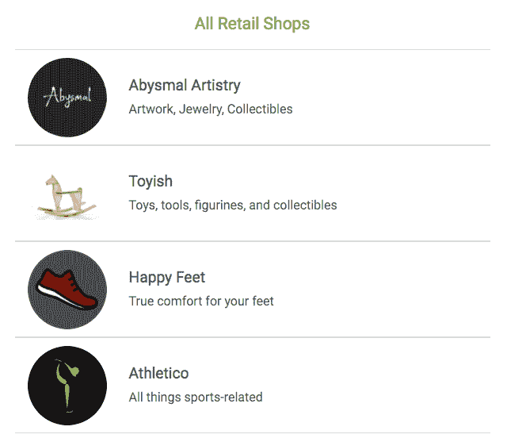

为了实现此组件，我们首先需要获取并渲染商店列表。我们将在 `useEffect` 钩子中调用 fetch API 调用，并将接收到的 `shops` 数组设置在状态中，如下所示：

`mern-marketplace/client/shop/Shops.js`:

```js
export default function Shops(){
  const [shops, setShops] = useState([])

  useEffect(() => {
    const abortController = new AbortController()
    const signal = abortController.signal
    list(signal).then((data) => {
      if (!data.error) {
        setShops(data)
      }
    })
    return function cleanup(){
      abortController.abort()
    }

  }, [])
...
}
```

在 `Shops` 组件视图中，使用 `map` 迭代检索到的 `shops` 数组，每个商店的数据在视图中以 Material-UI `ListItem` 的形式渲染，并且每个 `ListItem` 也链接到单个商店的视图，如下所示：

`mern-marketplace/client/shop/Shops.js`:

```js
{shops.map((shop, i) => {
     return <Link to={"/shops/"+shop._id} key={i}>
              <Divider/>
              <ListItem button>
                 <ListItemAvatar>
                    <Avatar src={'/api/shops/logo/'+shop._id+"?" + new Date().getTime()}/>
                 </ListItemAvatar>
                 <div className={classes.details}>
                    <Typography type="headline" 
                        component="h2" color="primary">
                      {shop.name}
                    </Typography>
                    <Typography type="subheading" component="h4">
                      {shop.description}
                    </Typography>
                 </div>
              </ListItem>
              <Divider/>
             </Link>
})}
```

`Shops` 组件将由最终用户在 `/shops/all` 路径下访问，该路径通过 React Router 设置，并在 `MainRouter.js` 中声明如下：

`mern-marketplace/client/MainRouter.js`:

```js
 <Route path="/shops/all" component={Shops}/>
```

将此链接添加到应用程序中的任何视图中，将用户重定向到显示市场内所有商店的视图。接下来，我们将类似地实现列出特定用户拥有的商店的功能。

# 按所有者列出商店

市场上的授权卖家将看到他们创建的商店列表，他们可以通过编辑或删除列表中的任何商店来管理这些商店。为了实现这个功能，我们必须查询商店集合以检索所有具有相同所有者的商店，并仅向授权的所有者显示。我们通过添加以下全栈切片来实现这一点：

+   一个后端 API，确保请求用户已授权并检索相关的商店列表

+   前端的一个`fetch`方法来请求这个 API

+   一个 React 组件用于向授权用户显示商店列表

# 按所有者分组的商店 API

我们将在后端实现一个 API 来返回特定所有者的商店列表，以便在前端渲染给最终用户。我们将从在服务器接收到对`/api/shops/by/:userId`的`GET`请求时检索给定用户创建的所有商店的后端路由开始。此路由声明如下所示：

`mern-marketplace/server/routes/shop.routes.js`:

```js
router.route('/api/shops/by/:userId')
    .get(authCtrl.requireSignin, authCtrl.hasAuthorization, shopCtrl.listByOwner)
```

对这个路由的`GET`请求将首先确保请求用户已登录并且也是授权的所有者，然后调用`shop.controller.js`中的`listByOwner`控制器方法。此方法将在数据库中查询`Shop`集合以获取匹配的商店。`listByOwner`方法定义如下：

`mern-marketplace/server/controllers/shop.controller.js`:

```js
const listByOwner = async (req, res) => {
   try {
     let shops = await Shop.find({owner: req.profile._id}).populate('owner', '_id name')
     res.json(shops)
   } catch (err){
     return res.status(400).json({
         error: errorHandler.getErrorMessage(err)
     })
   }
}
```

在查询 Shop 集合时，我们找到所有`owner`字段与用户指定的`userId`参数匹配的商店，然后在`owner`字段中填充引用的用户 ID 和名称，并将结果商店以数组形式返回给客户端。接下来，我们将看到如何从客户端发起对这个 API 的请求。

# 获取用于视图的用户拥有的所有商店

在前端，为了使用按所有者分组的 API 获取特定用户的商店，我们将添加一个`fetch`方法，该方法接受已登录用户的凭据，并通过将特定用户 ID 传递到 URL 中，向 API 路由发起`GET`请求。此`fetch`方法定义如下：

`mern-marketplace/client/shop/api-shop.js`:

```js
const listByOwner = async (params, credentials, signal) => {
  try {
    let response = await fetch('/api/shops/by/'+params.userId, {
      method: 'GET',
      signal: signal,
      headers: {
        'Accept': 'application/json',
        'Authorization': 'Bearer ' + credentials.t
      }
    })
    return response.json()
  } catch(err){
    console.log(err)
  }
}
```

使用此方法从服务器返回的响应中的商店可以在 React 组件中渲染，以向授权用户显示商店，如下一节所述。

# MyShops 组件

`MyShops`组件与`Shops`组件类似。它获取当前用户拥有的商店列表，并如图所示在`ListItem`中渲染每个商店：

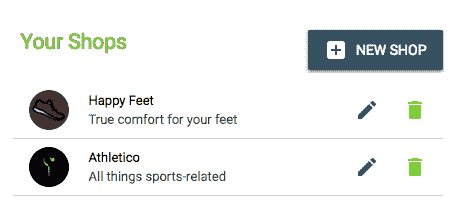

此外，每个商店都有一个`编辑`和`删除`选项，与`Shops`中的项目列表不同。`MyShops`组件的实现与`Shops`相同，除了以下添加的编辑和删除按钮：

`mern-marketplace/client/shop/MyShops.js`:

```js
<ListItemSecondaryAction>
   <Link to={"/seller/shop/edit/" + shop._id}>
       <IconButton aria-label="Edit" color="primary">
             <Edit/>
       </IconButton>
   </Link>
   <DeleteShop shop={shop} onRemove={removeShop}/>
</ListItemSecondaryAction>
```

`编辑`按钮链接到`<q>编辑商店</q>`视图，而`DeleteShop`组件（将在本章后面讨论），处理删除操作。`DeleteShop`组件通过调用从`MyShops`传递的`removeShop`方法来更新列表。这个`removeShop`方法允许我们使用当前用户的修改后的商店列表更新状态，并在`MyShops`组件中定义，如下所示：

`mern-marketplace/client/shop/MyShops.js`:

```js
const removeShop = (shop) => {
    const updatedShops = [...shops]
    const index = updatedShops.indexOf(shop)
    updatedShops.splice(index, 1)
    setShops(updatedShops)
}
```

`MyShops`组件只能由已登录的卖家查看。因此，我们将在`MainRouter`组件中添加一个`PrivateRoute`，它只为认证用户在`/seller/shops`上渲染此组件，如下所示代码所示：

`mern-marketplace/client/MainRouter.js`:

```js
<PrivateRoute path="/seller/shops" component={MyShops}/>
```

在市场应用程序中，我们在导航菜单中添加此链接，以便将已登录的卖家重定向到他们可以编辑或删除商店以管理他们拥有的商店的视图。在添加编辑或删除商店的能力之前，我们接下来将探讨如何从后端检索单个商店并将其显示给最终用户。

# 显示商店

访问 MERN 市场的任何用户都将能够浏览每个单独的商店。在以下章节中，我们将通过向后端添加读取商店 API、从前端调用此 API 的方法以及将在视图中显示商店详情的 React 组件来实现单个商店视图。

# 读取商店 API

为了在后端实现读取商店 API，我们将首先添加一个`GET`路由，该路由通过 ID 查询`Shop`集合，并在响应中返回商店。该路由与路由参数处理程序一起声明，如下所示：

`mern-marketplace/server/routes/shop.routes.js`:

```js
router.route('/api/shop/:shopId')
    .get(shopCtrl.read)
router.param('shopId', shopCtrl.shopByID)
```

路由 URL 中的`:shopId`参数将调用`shopByID`控制器方法，该方法类似于`userByID`控制器方法。它从数据库中检索商店并将其附加到请求对象中，以便在`next`方法中使用。`shopByID`方法定义如下：

`mern-marketplace/server/controllers/shop.controller.js`:

```js
const shopByID = async (req, res, next, id) => {
  try {
    let shop = await Shop.findById(id).populate('owner', '_id name').exec()
    if (!shop)
      return res.status('400').json({
        error: "Shop not found"
      })
    req.shop = shop
    next()
  } catch (err) {
    return res.status('400').json({
      error: "Could not retrieve shop"
    })
  }
}
```

从数据库查询到的商店对象也将包含所有者的名称和 ID 详情，正如我们在`populate()`方法中指定的。然后`read`控制器方法将这个商店对象作为对客户端的响应返回。`read`控制器方法定义如下所示：

`mern-marketplace/server/controllers/shop.controller.js`:

```js
const read = (req, res) => {
  req.shop.image = undefined
  return res.json(req.shop)
}
```

在发送响应之前，我们正在删除图像字段，因为图像将通过单独的路由作为文件检索。有了这个后端 API 就绪，你现在可以添加在`api-shop.js`中调用它的实现，类似于已为其他 API 实现添加的其他`fetch`方法。我们将使用`fetch`方法在将渲染商店详情的 React 组件中调用读取商店 API，如下一节所述。

# 商店组件

`Shop` 组件将渲染商店详情，并使用产品列表组件列出指定商店中的产品，这将在 *产品* 部分进行讨论。完成的单个 `Shop` 视图将如图所示：

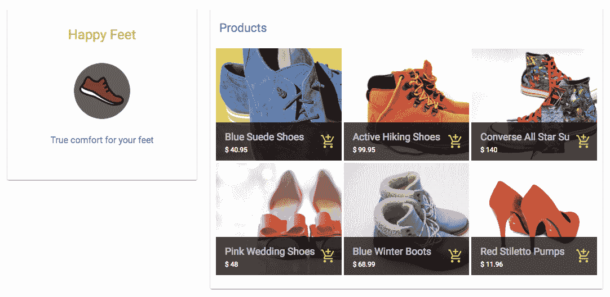

为了实现这个 `Shop` 组件，我们首先会在 `useEffect` 钩子中使用 fetch 调用读取 API 来检索商店详情，并将接收到的值设置到状态中，如下面的代码所示：

`mern-marketplace/client/shop/Shop.js`:

```js
export default function Shop({match}) {
  const [shop, setShop] = useState('')
  const [error, setError] = useState('')

  useEffect(() => {
    const abortController = new AbortController()
    const signal = abortController.signal

    read({
      shopId: match.params.shopId
    }, signal).then((data) => {
      if (data.error) {
        setError(data.error)
      } else {
        setShop(data)
      }
    })
    return function cleanup(){
      abortController.abort()
    }

  }, [match.params.shopId])
...
}
```

这个 `useEffect` 钩子仅在路由参数中的 `shopId` 发生变化时运行。

获取到的商店数据被设置到状态中，并在视图中渲染以显示商店的名称、标志和描述，如下面的代码所示：

`mern-marketplace/client/shop/Shop.js`:

```js
<CardContent>
  <Typography type="headline" component="h2">
    {shop.name}
  </Typography><br/>
  <Avatar src={logoUrl}/><br/>
  <Typography type="subheading" component="h2">
    {shop.description}
  </Typography><br/>
</CardContent>
```

`logoUrl` 指向从数据库中检索标志图像的路由（如果图像存在），其定义如下：

`mern-marketplace/client/shop/Shop.js`:

```js
const logoUrl = shop._id
          ? `/api/shops/logo/${shop._id}?${new Date().getTime()}`
          : '/api/shops/defaultphoto'
```

`Shop` 组件将通过浏览器中的 `/shops/:shopId` 路由进行访问，该路由在 `MainRouter` 中定义如下：

`mern-marketplace/client/MainRouter.js`:

```js
<Route path="/shops/:shopId" component={Shop}/>
```

这个路由可以在任何组件中使用，以链接到特定的商店，并且这个链接将用户带到加载了商店详细信息的相应 `Shop` 视图。在下一节中，我们将添加允许商店所有者编辑这些商店详细信息的功能。

# 编辑商店

应用程序中的授权卖家将能够更新他们已经添加到市场中的商店。为了实现这一功能，我们需要创建一个后端 API，允许在确认请求用户已认证并授权后对特定商店进行更新操作。然后需要从前端调用这个更新后的 API，并传入商店更改的详细信息。在接下来的章节中，我们将构建这个后端 API 和 React 组件，以便卖家可以更改他们的商店信息。

# 商店编辑 API

在后端，我们需要一个 API，允许如果请求用户是给定商店的授权卖家，则更新数据库中的现有商店。我们首先声明接受客户端更新请求的 PUT 路由如下：

`mern-marketplace/server/routes/shop.routes.js`:

```js
router.route('/api/shops/:shopId')
    .put(authCtrl.requireSignin, shopCtrl.isOwner, shopCtrl.update)
```

在 `/api/shops/:shopId` 路由接收到的 PUT 请求首先检查已登录用户是否是 URL 中提供的 `shopId` 相关商店的所有者，使用 `isOwner` 控制器方法，该方法定义如下：

`mern-marketplace/server/controllers/shop.controller.js`:

```js
const isOwner = (req, res, next) => {
  const isOwner = req.shop && req.auth 
                           && req.shop.owner._id == req.auth._id
  if(!isOwner){
    return res.status('403').json({
      error: "User is not authorized"
    })
  }
  next()
}
```

在这个方法中，如果发现用户是授权的，则通过调用 `next()` 来调用 `update` 控制器。

`update`控制器方法将使用与前面讨论的`create`控制器方法中相同的`formidable`和`fs`模块来解析表单数据并更新数据库中的现有商店。商店控制器中的`update`方法定义如下所示：

`mern-marketplace/server/controllers/shop.controller.js`:

```js
const update = (req, res) => {
  let form = new formidable.IncomingForm()
  form.keepExtensions = true
  form.parse(req, async (err, fields, files) => {
    if (err) {
      res.status(400).json({
        message: "Photo could not be uploaded"
      })
    }
    let shop = req.shop
    shop = extend(shop, fields)
    shop.updated = Date.now()
    if(files.image){
      shop.image.data = fs.readFileSync(files.image.path)
      shop.image.contentType = files.image.type
    }
    try {
      let result = await shop.save()
      res.json(result)
    } catch (err){
      return res.status(400).json({
        error: errorHandler.getErrorMessage(err)
      })
    }
  })
}
```

要在前端使用此更新 API，您需要定义一个`fetch`方法，该方法接受商店 ID、用户认证凭据和更新的商店详情，以对该更新商店 API 进行 fetch 调用，就像我们在*创建新商店*部分中为其他 API 实现所做的那样。

现在我们有一个可以用于前端更新商店详情的商店更新 API。我们将在下一节讨论的`EditShop`组件中使用此 API。 

# 编辑商店组件

`EditShop`组件将显示一个类似于创建新商店表单的表单，预先填充了现有商店的详情。此组件还将显示此商店的产品列表，将在*产品*部分讨论。完成的编辑商店视图如图所示：

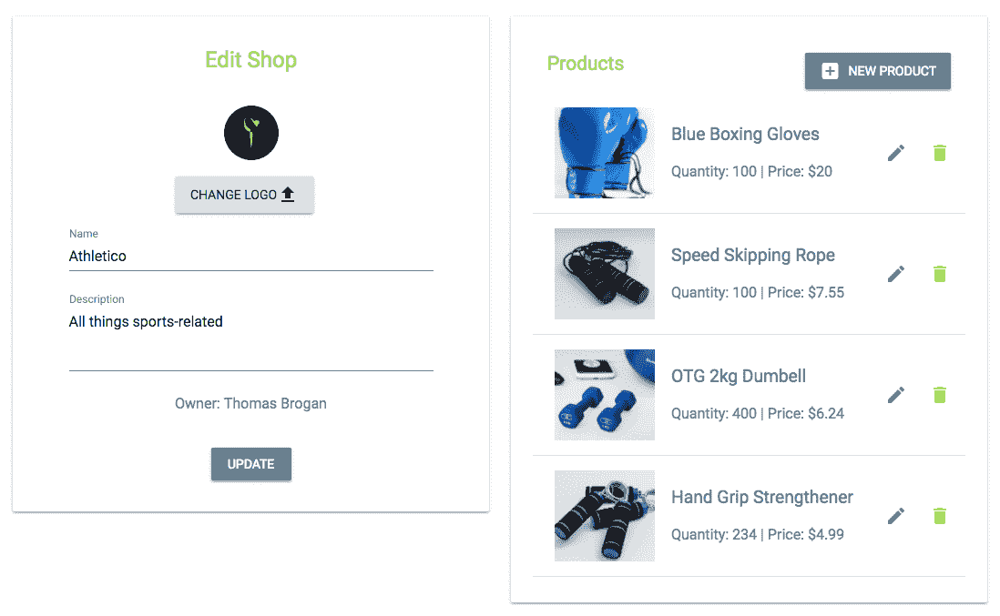

此视图的表单部分用于编辑商店详情，与`NewShop`组件中的表单类似，具有相同的表单字段和一个`formData`对象，该对象包含要随`update` `fetch`方法发送的多部分表单数据。与`NewShop`组件相比，在此组件中，我们需要利用读取商店 API 在`useEffect`钩子中获取指定商店的详情并预先填充表单字段。您可以将针对`NewShop`组件和`Shop`组件讨论的实现结合起来，以完成`EditShop`组件。

`EditShop`组件只能由授权的商店所有者访问。因此，我们将在`MainRouter`组件中添加一个`PrivateRoute`，如以下所示，它将只为经过认证的用户在`/seller/shop/edit/:shopId`渲染此组件：

`mern-marketplace/client/MainRouter.js`:

```js
<PrivateRoute path="/seller/shop/edit/:shopId" component={EditShop}/>
```

在`MyShops`组件中，为每个商店添加了一个编辑图标，允许卖家访问他们每个商店的编辑页面。在`MyShops`视图中，卖家还可以删除他们的商店，如下一节所述。

# 删除商店

作为管理他们拥有的商店的一部分，授权卖家将有权删除他们自己的任何商店。为了允许卖家从市场移除商店，在以下章节中，我们首先将定义一个从数据库中删除商店的后端 API，然后实现一个 React 组件，当用户与前端交互以执行此删除时，该组件将使用此 API。

# 删除商店的 API

为了从数据库中删除商店，我们将在后端实现一个删除商店 API，该 API 将接受客户端在`/api/shops/:shopId`上的 DELETE 请求。我们将为这个 API 添加以下代码所示的`DELETE`路由，这将允许授权卖家删除他们自己的商店之一：

`mern-marketplace/server/routes/shop.routes.js`:

```js
router.route('/api/shops/:shopId')
    .delete(authCtrl.requireSignin, shopCtrl.isOwner, shopCtrl.remove)
```

当接收到此路由的 DELETE 请求时，如果`isOwner`方法确认已登录的用户是该商店的所有者，那么`remove`控制器方法将删除由参数中的`shopId`指定的商店。`remove`方法定义如下：

`mern-marketplace/server/controllers/shop.controller.js`:

```js
const remove = async (req, res) => {
  try {
    let shop = req.shop
    let deletedShop = shop.remove()
    res.json(deletedShop)
  } catch (err) {
    return res.status(400).json({
      error: errorHandler.getErrorMessage(err)
    })
  } 
}
```

这个`remove`方法简单地从数据库中的`Shops`集合中删除与提供的 ID 相对应的商店文档。为了在前端访问这个后端 API，你还需要一个具有此路由的`fetch`方法，类似于其他 API 实现。`fetch`方法需要获取商店 ID 和当前用户的认证凭证，然后使用这些值调用删除商店 API。

当用户在前端界面中点击按钮执行删除操作时，将使用`fetch`方法。在下一节中，我们将讨论一个名为`DeleteShop`的 React 组件，用户将通过该组件执行删除商店操作。

# 删除商店组件

`DeleteShop`组件被添加到列表中的每个商店的`MyShops`组件中。它从`MyShops`接收`shop`对象和`onRemove`方法作为 props。此组件基本上是一个按钮，当点击时，会打开一个`Dialog`组件，提示用户确认删除操作，如下面的截图所示：

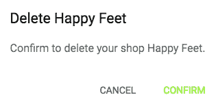

`DeleteShop`组件的实现类似于在第四章中讨论的`DeleteUser`组件，即*添加 React 前端以完成 MERN*。当它添加到`MyShops`时，`DeleteShop`组件将从`MyShops`组件接收`shop`对象和`onRemove`函数定义作为 props，如下所示：

`mern-marketplace/client/shop/MyShops.js`:

```js
<DeleteShop shop={shop} onRemove={removeShop}/>
```

通过这种实现，授权卖家将能够从市场上删除他们拥有的商店。

我们通过首先定义用于存储商店数据的 Shop 模型，然后集成后端 API 和前端视图，以便能够在应用程序中执行对商店的 CRUD 操作，从而实现了市场中的商店模块。这些商店功能，包括创建新商店、显示商店、编辑和删除商店的能力，将允许买家和卖家与市场中的商店进行交互。商店还将拥有以下讨论的产品，所有者将负责管理，买家将能够浏览，并可以选择将产品添加到购物车中。

# 将产品添加到商店

产品是市场应用中最关键的部分。在 MERN 市场中，卖家可以管理他们店铺中的产品，访客可以搜索和浏览产品。虽然我们将实现允许授权卖家添加、修改和删除他们店铺中产品的功能，但我们还将整合对最终用户有意义的列出产品的方式。在应用中，我们将通过特定店铺、与给定产品相关联的产品以及最新添加到市场中的产品来检索和显示产品。在接下来的章节中，我们将通过首先定义用于在数据库中存储产品数据的 `product` 模型，然后实现与产品相关功能的后端 API 和前端视图来构建产品模块，包括向店铺添加新产品、渲染不同的产品列表、显示单个产品、编辑产品和删除产品。

# 定义产品模型

产品将存储在数据库中的产品集合中。为了实现这一点，我们将添加一个 Mongoose 模型来定义一个 `Product` 模型，用于存储每个产品的详细信息。此模型将在 `server/models/product.model.js` 中定义，其实现将与之前章节中覆盖的其他 Mongoose 模型实现类似，如第六章构建基于 Web 的课堂应用中定义的课程模型。

对于 MERN 市场来说，我们将保持产品架构简单，支持 `name`、`description`、`image`、`category`、`quantity`、`price`、`created at`、`updated at` 以及对店铺的引用等字段。定义产品架构中产品字段的代码如下，以及相应的解释：

+   **产品名称和描述**：`name` 和 `description` 字段将被定义为 `String` 类型，其中 `name` 是一个 `required` 字段：

```js
name: { 
    type: String, 
    trim: true, 
    required: 'Name is required' 
},
description: { 
    type: String, 
    trim: true 
},
```

+   **产品图片**：`image` 字段将存储用户上传到 MongoDB 数据库中的图片文件：

```js
image: { 
    data: Buffer, 
    contentType: String 
},
```

+   **产品类别**：`category` 值将允许将相同类型的产品分组在一起：

```js
category: { 
    type: String 
},
```

+   **产品数量**：`quantity` 字段将表示店铺中可供销售的产品的数量：

```js
quantity: { 
    type: Number, 
    required: "Quantity is required" 
},
```

+   **产品价格**：`price` 字段将保存此产品将花费买家的单价：

```js
price: { 
    type: Number, 
    required: "Price is required" 
},
```

+   **产品店铺**：`shop` 字段将引用添加产品的店铺：

```js
shop: {
    type: mongoose.Schema.ObjectId, 
    ref: 'Shop'
}
```

+   **创建和更新时间**：`created` 和 `updated` 字段将被定义为 `Date` 类型，`created` 字段在添加新产品时生成，而 `updated` 时间在修改产品详情时改变：

```js
updated: Date,
created: { 
    type: Date, 
    default: Date.now 
},
```

此架构定义中的字段将使我们能够在 MERN 市场中实现产品相关功能。为了开始这些功能的实现，在下一节中，我们将实现一个全栈切片，允许卖家向他们在市场中的现有店铺添加新产品。

# 创建新产品

MERN 市场中的卖家将能够向他们在平台上拥有的商店添加新产品。为了实现此功能，在接下来的章节中，我们将在后台添加创建产品 API，以及在前端获取此 API 的方法，还有一个用于收集用户输入的产品字段的新产品表单视图。

# 创建产品 API

我们将添加一个后端 API，允许授权的店主通过客户端的`POST`请求将新产品保存到数据库中。为了在后台实现这个创建产品 API，我们首先将在`/api/products/by/:shopId`路径下添加一个路由，该路由接受包含产品数据的`POST`请求。向此路由发送请求将创建一个与`:shopId`参数指定的商店相关联的新产品。此创建产品 API 路由的声明如下所示：

`mern-marketplace/server/routes/product.routes.js`:

```js
router.route('/api/products/by/:shopId')
  .post(authCtrl.requireSignin, shopCtrl.isOwner, productCtrl.create)
router.param('shopId', shopCtrl.shopByID)
```

包含此路由声明的`product.routes.js`文件将与`shop.routes.js`文件非常相似，为了在 Express 应用中加载这些新路由，我们需要在`express.js`中挂载产品路由，如下所示：

`mern-marketplace/server/express.js`:

```js
app.use('/', productRoutes)
```

处理创建产品 API 路由请求的代码将首先检查当前用户是否为新产品将被添加的商店的所有者，然后在数据库中创建新产品。此 API 利用来自商店控制器的`shopByID`和`isOwner`方法来处理`:shopId`参数，并在调用`create`控制器方法之前验证当前用户是否是商店所有者。`create`方法定义如下：

`mern-marketplace/server/controllers/product.controller.js`:

```js
const create = (req, res, next) => {
  let form = new formidable.IncomingForm()
  form.keepExtensions = true
  form.parse(req, async (err, fields, files) => {
    if (err) {
      return res.status(400).json({
        message: "Image could not be uploaded"
      })
    }
    let product = new Product(fields)
    product.shop= req.shop
    if(files.image){
      product.image.data = fs.readFileSync(files.image.path)
      product.image.contentType = files.image.type
    }
    try {
      let result = await product.save()
      res.json(result)
    } catch (err){
      return res.status(400).json({
        error: errorHandler.getErrorMessage(err)
      })
    }
  })
}
```

在产品控制器中，此`create`方法使用`formidable`节点模块来解析可能包含用户上传的图像文件以及产品字段的 multipart 请求。然后，解析后的数据被保存到产品集合中作为新产品。

在前端，为了使用此创建产品 API，你还需要在`client/product/api-product.js`中设置一个`fetch`方法，通过传递从视图中的 multipart 表单数据来向创建 API 发送`POST`请求。然后，此`fetch`方法可以在 React 组件中使用，该组件从用户那里获取产品详情并发送请求以创建新产品。基于此表单的 React 组件创建新产品的实现将在下一节中讨论。

# 新产品组件

在市场平台上已经创建店铺的授权卖家将看到一个用于添加新产品的表单视图。我们将在这个名为 `NewProduct` 的 React 组件中实现这个表单视图。`NewProduct` 组件将与 `NewShop` 组件类似。它将包含一个表单，允许卖家通过输入名称、描述、类别、数量和价格来创建产品，并从他们的本地文件系统中上传产品图片文件，如图下截图所示：

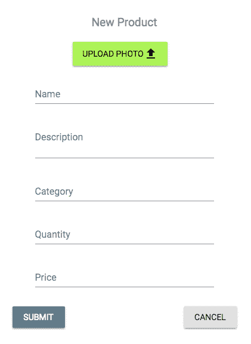

`NewProduct` 组件可以几乎与 `NewShop` 组件完全相同地实现，唯一的区别是从渲染 `NewProduct` 组件的前端路由 URL 中检索店铺 ID。此组件将在与特定店铺关联的路由上加载，因此只有登录的卖家才能向他们拥有的店铺添加产品。为了定义此路由，我们在 `MainRouter` 组件中添加了一个 `PrivateRoute`，如下所示，它将只为授权用户在 URL `'/seller/:shopId/products/new'` 上渲染此表单：

`mern-marketplace/client/MainRouter.js`:

```js
<PrivateRoute path="/seller/:shopId/products/new" component={NewProduct}/>
```

在前端视图中的任何地方添加此特定店铺的链接将渲染 `NewProduct` 组件供登录用户使用。在这个视图中，用户将能够填写表单中的新产品详细信息，然后如果他们是给定店铺的授权所有者，将产品保存到后端数据库中。接下来，我们将探讨检索和在不同列表中显示这些产品的实现方法。

# 列出产品

在 MERN 市场平台上，产品将以多种方式向用户展示。两个主要区别在于产品对于卖家和买家的列出方式。在以下章节中，我们将了解如何为卖家和买家列出店铺中的产品，然后还将讨论如何列出为买家提供的产品建议，包括与特定产品相关的产品以及最新添加到市场平台的产品。

# 按店铺列出

市场平台的访客将浏览每个店铺中的产品，卖家将管理他们每个店铺中的产品列表。这两个功能将共享相同的后端 API，该 API 将检索特定店铺的所有产品，但将为两种类型的用户以不同的方式渲染。在以下章节中，首先，我们将实现用于检索特定店铺中产品的后端 API。然后，我们将使用该 API 在两个不同的 React 组件中渲染产品列表，一个用于店铺的卖家，另一个用于买家。

# 店铺产品 API

为了实现从数据库中检索特定店铺产品的后端 API，我们将在 `/api/products/by/:shopId` 上设置一个 `GET` 路由，如下面的代码所示：

`mern-marketplace/server/routes/product.routes.js`:

```js
router.route('/api/products/by/:shopId')
    .get(productCtrl.listByShop)
```

对此请求执行`listByShop`控制器方法将查询产品集合以返回与给定商店引用匹配的产品。`listByShop`方法定义如下代码所示：

`mern-marketplace/server/controllers/product.controller.js`:

```js
const listByShop = async (req, res) => {
  try {
    let products = await Product.find({shop: req.shop._id})
                          .populate('shop', '_id name').select('-image')
    res.json(products)
  } catch (err) {
    return res.status(400).json({
      error: errorHandler.getErrorMessage(err)
    })
  }
}
```

结果产品数组中的每个产品都将包含相关商店的名称和 ID 详情，我们将省略`image`字段，因为可以通过单独的 API 路由检索图像。

在前端，为了使用按商店列表的 API 获取特定商店的产品，我们还需要在`api-product.js`中添加一个`fetch`方法，类似于我们的其他 API 实现。然后，可以在任何 React 组件中调用`fetch`方法来渲染产品，例如，在下一节中讨论的显示给所有买家的商店中的产品。

# 买家产品组件

我们将构建一个`Products`组件，主要用于向可能购买产品的访客展示产品。我们可以在整个应用程序中重用此组件以渲染与买家相关的不同产品列表。它将从显示产品列表的父组件接收产品列表作为 props。渲染后的产品视图可能看起来如下截图所示：

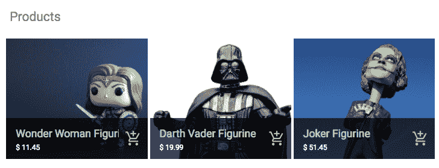

在市场应用程序中，商店中的产品列表将以单独的`Shop`视图的形式显示给用户。因此，此`Products`组件被添加到`Shop`组件中，并提供了相关产品的列表作为 props，如下所示：

`mern-marketplace/client/shop/Shop.js`:

```js
<Products products={products} searched={false}/></Card>
```

`searched` prop 传递了此列表是否是产品搜索的结果，因此可以渲染适当的消息。

在`Shop`组件中，我们需要在`useEffect`钩子中添加对`listByShop` fetch 方法的调用以检索相关产品并将其设置到状态中，如下所示代码所示：

`mern-marketplace/client/shop/Shop.js`:

```js
useEffect(() => {
    const abortController = new AbortController()
    const signal = abortController.signal

    listByShop({
      shopId: match.params.shopId
    }, signal).then((data)=>{
      if (data.error) {
        setError(data.error)
      } else {
        setProducts(data)
      }
    })

    return function cleanup(){
      abortController.abort()
    }
}, [match.params.shopId])

```

在`Products`组件中，如果通过 props 传入的产品列表包含产品，则会遍历列表，并在 Material-UI 的`GridListTile`中渲染每个产品的相关详情，包括指向单个产品视图的链接以及`AddToCart`组件（其实现将在第八章[7514f26d-29e1-46e2-ac46-7515b2c3a6d0.xhtml]中讨论，*扩展订单和支付的市场*。以下是添加渲染产品列表的代码：

`mern-marketplace/client/product/Products.js`:

```js
{props.products.length > 0 ?
    (<div>
       <GridList cellHeight={200} cols={3}>
           {props.products.map((product, i) => (
            <GridListTile key={i}>
              <Link to={"/product/"+product._id}>
                
              </Link>
              <GridListTileBar
                title={<Link to={"/product/"+product._id}>
                    {product.name}</Link>}
                subtitle={<span>$ {product.price} </span>}
                actionIcon={
                  <AddToCart item={product}/>
                }
              />
            </GridListTile>))
           }
       </GridList>
    </div>) : props.searched && (<Typography component="h4">
                                    No products found! :(</Typography>)}
```

如果在 props 中发送的`products`数组被发现为空，并且这是用户搜索操作的结果，我们将渲染一条适当的消息来通知用户没有找到产品。

这个 `Products` 组件可以用来渲染不同类型的买家产品列表，包括商店中的产品、按类别划分的产品以及搜索结果中的产品。在下一节中，我们将实现一个 `MyProducts` 组件，它将只为商店老板渲染产品列表，为他们提供一组不同的交互选项。

# 为商店老板的 MyProducts 组件

与 `Products` 组件不同，`client/product/MyProducts.js` 中的 `MyProducts` 组件仅用于向卖家展示产品，以便他们可以管理他们拥有的每个商店中的产品，并且将如图所示显示给最终用户：

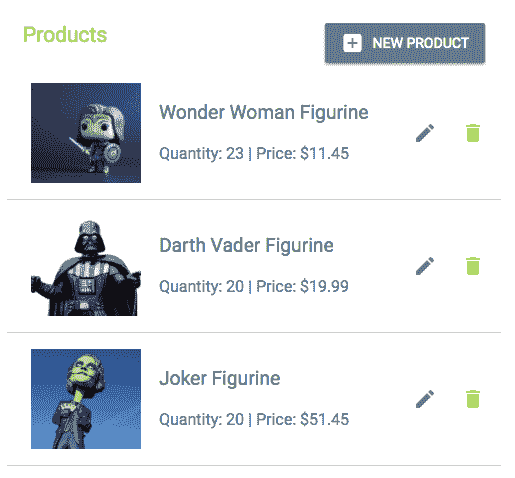

如下代码所示，将 `MyProducts` 组件添加到 `EditShop` 视图中，以便卖家可以在一个地方管理商店及其内容。它通过属性提供商店的 ID，以便可以获取相关产品：

`mern-marketplace/client/shop/EditShop.js`:

```js
<MyProducts shopId={match.params.shopId}/>
```

在 `MyProducts` 中，相关产品首先使用 `listByShop` 获取方法，通过 `useEffect` 钩子加载到一个状态，如下面的代码所示：

`mern-marketplace/client/product/MyProducts.js`:

```js
export default function MyProducts (props){
  const [products, setProducts] = useState([])
  useEffect(() => {
    const abortController = new AbortController()
    const signal = abortController.signal
    listByShop({
      shopId: props.shopId
    }, signal).then((data)=>{
      if (data.error) {
        console.log(data.error)
      } else {
        setProducts(data)
      }
    })
    return function cleanup(){
      abortController.abort()
    }
  }, [])
...
}

```

此产品列表随后被迭代，每个产品都在 `ListItem` 组件中渲染，并附带编辑和删除选项，类似于 `MyShops` 列表视图。编辑按钮链接到编辑产品视图。`DeleteProduct` 组件处理删除操作，并通过调用从 `MyProducts` 传递的 `onRemove` 方法来重新加载列表，以更新当前商店的产品列表状态。

在 `MyProducts` 中定义的 `removeProduct` 方法作为 `onRemove` 属性传递给 `DeleteProduct` 组件。`removeProduct` 方法定义如下：

`mern-marketplace/client/product/MyProducts.js`:

```js
const removeProduct = (product) => {
    const updatedProducts = [...products]
    const index = updatedProducts.indexOf(product)
    updatedProducts.splice(index, 1)
    setProducts(updatedProducts)
}   

```

然后当它被添加到 `MyProducts` 中时，作为属性传递给 `DeleteProduct` 组件，如下所示：

`mern-marketplace/client/product/MyProducts.js`:

```js
<DeleteProduct
       product={product}
       shopId={props.shopId}
       onRemove={removeProduct}/>
```

以这种方式实现一个单独的 `MyProducts` 组件，使商店老板能够查看他们商店中的产品列表，并可选择编辑和删除每个产品。在下一节中，我们将完成从后端检索不同类型产品列表的实现，并在前端将它们作为买家产品建议渲染。

# 列出产品建议

访问 MERN 市场的访客将看到产品建议，例如最新添加到市场中的产品以及与他们当前查看的产品相关的产品。在接下来的几节中，我们将首先查看获取最新产品和给定产品相关产品列表的后端 API 实现，然后实现一个名为 Suggestions 的 React 组件来渲染这些产品列表。

# 最新产品

在 MERN Marketplace 的主页上，我们将显示最近添加到市场的五个最新产品。为了获取最新产品，我们将设置一个后端 API，该 API 将在`/api/products/latest`接收`GET`请求，如下所示：

`mern-marketplace/server/routes/product.routes.js`:

```js
router.route('/api/products/latest')
      .get(productCtrl.listLatest)
```

在此路由接收到的`GET`请求将调用`listLatest`控制器方法。此方法将找到所有产品，按数据库中产品的`created`日期字段从新到旧排序产品列表，并在响应中返回排序列表中的前五个。此`listLatest`控制器方法定义如下：

`mern-marketplace/server/controllers/product.controller.js`:

```js
const listLatest = async (req, res) => {
  try {
    let products = await Product.find({}).sort('-created')
         .limit(5).populate('shop', '_id name').exec()
    res.json(products)
  } catch (err){
    return res.status(400).json({
      error: errorHandler.getErrorMessage(err)
    })
  }
}
```

要在前端使用此 API，您还需要在`api-product.js`中设置相应的`fetch`方法，用于此最新产品 API，类似于其他 API 实现。然后，检索到的列表将被渲染在`Suggestions`组件中，以添加到主页。接下来，我们将讨论用于检索相关产品列表的类似 API。

# 相关产品

在每个单个产品视图中，我们将展示五个相关产品作为建议。为了检索这些相关产品，我们将设置一个后端 API，该 API 在`/api/products/related`接收请求，如下所示。

`mern-marketplace/server/routes/product.routes.js`:

```js
router.route('/api/products/related/:productId')
              .get(productCtrl.listRelated)
router.param('productId', productCtrl.productByID)
```

路由 URL 中的`:productId`参数将调用`productByID`控制器方法，该方法类似于`shopByID`控制器方法，从数据库中检索产品并将其附加到请求对象中，以便在`next`方法中使用。`productByID`控制器方法定义如下：

`mern-marketplace/server/controllers/product.controller.js`:

```js
const productByID = async (req, res, next, id) => {
  try {
    let product = await Product.findById(id)
       .populate('shop', '_id  name').exec()
    if (!product)
      return res.status('400').json({
        error: "Product not found"
      })
    req.product = product
    next()
  } catch (err) {
    return res.status('400').json({
      error: "Could not retrieve product"
    })
  }
}
```

一旦检索到产品，就会调用`listRelated`控制器方法。此方法查询数据库中的`Product`集合，以找到与给定产品具有相同类别的其他产品（不包括给定产品），并返回结果列表中的前五个产品。此`listRelated`控制器方法定义如下：

`mern-marketplace/server/controllers/product.controller.js`:

```js
const listRelated = async (req, res) => {
  try{
    let products = await Product.find({ "_id": { "$ne": req.product }, 
         "category": req.product.category})
             .limit(5).populate('shop', '_id name').exec()
    res.json(products)
  } catch (err){
    return res.status(400).json({
      error: errorHandler.getErrorMessage(err)
    })
  }
}
```

为了在前端利用此相关产品 API，我们将在`api-product.js`中设置相应的`fetch`方法。`fetch`方法将在`Product`组件中使用产品 ID 调用，以填充产品视图中渲染的`Suggestions`组件。我们将在下一节查看此`Suggestions`组件的实现。

# 建议组件

`Suggestions`组件将在主页和单个产品页面上渲染，分别显示最新产品和相关产品。一旦渲染，`Suggestions`组件可能看起来如下所示：

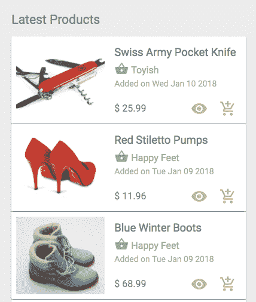

此组件将从父组件接收相关的产品列表作为 props，以及列表的标题：

```js
<Suggestions  products={suggestions} title={suggestionTitle}/>
```

在 `Suggestions` 组件中，遍历接收到的列表，并使用相关详细信息、单个产品页面链接和 `AddToCart` 组件渲染单个产品，如下所示。

`mern-marketplace/client/product/Suggestions.js`:

```js
<Typography type="title"> {props.title} </Typography>
{props.products.map((item, i) => { 
  return <span key={i}> 
           <Card>
             <CardMedia image={'/api/product/image/'+item._id} 
                        title={item.name}/>
                <CardContent>
                   <Link to={'/product/'+item._id}>
                     <Typography type="title" component="h3">
                    {item.name}</Typography>
                   </Link>
                   <Link to={'/shops/'+item.shop._id}>
                     <Typography type="subheading">
                        <Icon>shopping_basket</Icon> {item.shop.name}
                     </Typography>
                   </Link>
                   <Typography component="p">
                      Added on {(new 
                     Date(item.created)).toDateString()}
                   </Typography>
                </CardContent>
                <Typography type="subheading" component="h3">$ 
                 {item.price}</Typography>
                <Link to={'/product/'+item._id}>
                  <IconButton color="secondary" dense="dense">
                    <ViewIcon className={classes.iconButton}/>
                  </IconButton>
                </Link>
                <AddToCart item={item}/>
           </Card>
         </span>})}
```

这个 `Suggestions` 组件可以被重用来向买家渲染任何产品列表。在本节中，我们讨论了如何检索和显示两个不同的产品列表。列表中的每个产品都链接到一个视图，该视图将渲染单个产品的详细信息。在下一节中，我们将查看读取和向最终用户显示单个产品的实现。

# 显示产品

访问 MERN 市场的访客将能够查看每个产品的更多详细信息。在以下章节中，我们将实现一个后端 API 来从数据库中检索单个产品，然后在前端使用它来在 React 组件中渲染单个产品。

# 读取产品 API

在后端，我们将添加一个带有 `GET` 路由的 API，该路由通过 ID 查询产品集合并返回响应中的产品。该路由的声明如下所示：

`mern-marketplace/server/routes/product.routes.js`:

```js
router.route('/api/products/:productId')
      .get(productCtrl.read) 
```

URL 中的 `:productId` 参数调用 `productByID` 控制器方法，该方法从数据库中检索产品并将其附加到请求对象中。请求对象中的产品被 `read` 控制器方法用于响应 `GET` 请求。`read` 控制器方法定义如下：

`mern-marketplace/server/controllers/product.controller.js`:

```js
const read = (req, res) => {
  req.product.image = undefined
  return res.json(req.product)
}
```

要在前端使用这个读取产品 API，我们需要在 `client/product/api-product.js` 中添加一个 `fetch` 方法，类似于其他 API 实现。然后这个 `fetch` 方法可以在 React 组件中使用，该组件将渲染单个产品详细信息，如下一节所述。

# 产品组件

我们将添加一个名为 `Product` 的 React 组件来渲染单个产品的详细信息，并提供添加到购物车的选项。在这个单个产品视图中，我们还将显示相关产品的列表，如图所示：

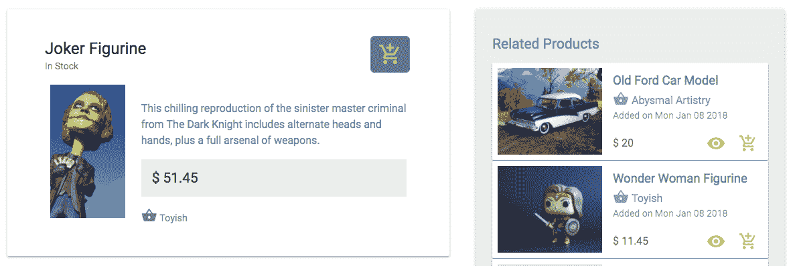

`Product` 组件可以通过 `/product/:productID` 路由在浏览器中访问，该路由在 `MainRouter` 中定义如下：

`mern-marketplace/client/MainRouter.js`:

```js
<Route path="/product/:productId" component={Product}/>
```

通过使用 `useEffect` 钩子调用相关 API 并使用路由参数中指定的 `productId` 来获取产品详情和相关产品列表数据，如下所示：

`mern-marketplace/client/product/Product.js`:

```js
export default function Product ({match}) {
  const [product, setProduct] = useState({shop:{}})
  const [suggestions, setSuggestions] = useState([])
  const [error, setError] = useState('')
    useEffect(() => {
      const abortController = new AbortController()
      const signal = abortController.signal

      read({productId: match.params.productId}, signal).then((data) => {
        if (data.error) {
          setError(data.error)
        } else {
          setProduct(data)
        }
      })
    return function cleanup(){
      abortController.abort()
    }
  }, [match.params.productId])

  useEffect(() => {
    const abortController = new AbortController()
    const signal = abortController.signal

        listRelated({
          productId: match.params.productId}, signal).then((data) => {
          if (data.error) {
            setError(data.error)
          } else {
            setSuggestions(data)
          }
        })
  return function cleanup(){
    abortController.abort()
  }
}, [match.params.productId])
```

在第一个 `useEffect` 钩子中，我们调用 `read` API 来检索指定的产品并将其设置到状态中。在第二个钩子中，我们调用 `listRelated` API 来获取相关产品的列表并将其设置到要作为属性传递给在产品视图中添加的 `Suggestions` 组件的状态中。

组件的产品详细信息部分显示有关产品的相关信息以及一个 Material-UI `Card`组件中的`AddToCart`组件，如下面的代码所示：

`mern-marketplace/client/product/Product.js`:

```js
<Card>
  <CardHeader
    action={<AddToCart cartStyle={classes.addCart} 
    item={product}/>}
    title={product.name}
    subheader={product.quantity > 0? 'In Stock': 'Out of   
   Stock'}
  />
  <CardMedia image={imageUrl} title={product.name}/>
  <Typography component="p" variant="subtitle1">
    {product.description}<br/>
    $ {product.price}
    <Link to={'/shops/'+product.shop._id}>
      <Icon>shopping_basket</Icon> {product.shop.name}
    </Link>
  </Typography>
</Card>
```

在“产品”视图中添加了`建议`组件，该组件通过属性传递相关列表数据，如下所示：

`mern-marketplace/client/product/Product.js`:

```js
<Suggestions products={suggestions} title='Related Products'/>
```

完成此视图后，市场应用程序的访客将能够了解更多关于特定产品的信息，以及探索其他类似的产品。在下一节中，我们将讨论如何为店主添加编辑和删除他们添加到市场中的产品的能力。

# 编辑和删除产品

在应用程序中编辑和删除产品的方法与编辑和删除商店的方法类似，如前几节所述，*编辑商店*和*删除商店*。这些功能将需要在后端使用相应的 API、在前端使用获取方法，以及带有表单和操作的 React 组件视图。在以下章节中，我们将突出显示编辑和从市场删除产品的前端视图、路由和后端 API 端点。

# 编辑

编辑功能与我们之前实现的创建产品功能非常相似。可以实现的`EditProduct`表单组件，可以渲染一个允许修改产品详细信息的表单，也仅对经过验证的卖家在`/seller/:shopId/:productId/edit`处可访问。

要限制对此视图的访问，我们可以在`MainRouter`中添加一个`PrivateRoute`来声明指向`EditProduct`视图的路由，如下所示：

`mern-marketplace/client/MainRouter.js`:

```js
<PrivateRoute path="/seller/:shopId/:productId/edit" component={EditProduct}/>
```

`EditProduct`组件包含与`NewProduct`相同的表单，但使用读取产品 API 检索的产品值进行填充。在表单提交时，它使用`fetch`方法通过 PUT 请求将多部分表单数据发送到后端在`/api/products/by/:shopId`处的编辑产品 API。此编辑产品 API 的后端路由声明如下：

`mern-marketplace/server/routes/product.routes.js`:

```js
router.route('/api/product/:shopId/:productId')
      .put(authCtrl.requireSignin, shopCtrl.isOwner, productCtrl.update)
```

当授权用户向此 API 发送 PUT 请求时，将调用`update`控制器方法。它与产品`create`方法和商店`update`方法类似。它使用`formidable`处理多部分表单数据，并将产品详细信息扩展以保存到数据库中的更新。

此编辑产品表单视图的实现与后端更新 API 集成，将允许店主修改他们商店中产品的详细信息。接下来，我们将探讨将产品删除功能集成到应用程序中的重点。

# 删除

为了实现删除产品功能，我们可以实现一个类似于`DeleteShop`组件的`DeleteProduct`组件，并将其添加到`MyProducts`组件中，为列表中的每个产品。它可以从`MyProducts`组件中作为属性接收`product`对象、`shopID`和`onRemove`方法，如*为店主提供的`MyProducts`组件*部分所述。

组件将像`DeleteShop`一样工作，在按钮点击时打开一个确认对话框，然后，当用户确认删除意图后，调用用于删除的`fetch`方法，该方法向服务器在`/api/product/:shopId/:productId`处发出 DELETE 请求。此从数据库删除产品的后端 API 将如下声明，与其他产品路由一起声明：

`mern-marketplace/server/routes/product.routes.js`:

```js
router.route('/api/product/:shopId/:productId')
      .delete(authCtrl.requireSignin, shopCtrl.isOwner, productCtrl.remove)
```

如果授权用户向此 API 发出 DELETE 请求，则将调用`remove`控制器方法，并从数据库中删除指定的产品，就像为商店的`remove`控制器方法一样。

我们在本节中开始实现市场产品相关功能，首先定义一个用于存储产品详情的模式，然后讨论创建、列出、读取、更新和删除应用程序中产品的全栈切片。在下一节中，我们将探讨如何允许市场中的用户以不同的方式搜索产品，以便他们可以轻松找到他们想要的产品。

# 通过名称和类别搜索产品

在 MERN 市场，访客将能够通过名称和特定类别搜索特定产品。在接下来的章节中，我们将讨论如何通过首先查看从产品集合中检索独特类别的后端 API，并对存储的产品执行搜索查询来添加此搜索功能。然后，我们将讨论利用这些 API 的不同情况，例如执行搜索操作的视图和按类别显示产品的视图。

# 类别 API

为了允许用户选择一个特定的类别进行搜索，我们首先设置一个 API，该 API 从数据库中产品集合检索所有独特的类别。对`/api/products/categories`的`GET`请求将返回一个唯一类别的数组，并且此路由如以下所示声明：

`mern-marketplace/server/routes/product.routes.js`:

```js
router.route('/api/products/categories')
      .get(productCtrl.listCategories)
```

`listCategories`控制器方法使用以下代码对`Products`集合执行针对`category`字段的`distinct`调用：

`mern-marketplace/server/controllers/product.controller.js`:

```js
const listCategories = async (req, res) => {
  try {
    let products = await Product.distinct('category',{})
    res.json(products)
  } catch (err){
    return res.status(400).json({
      error: errorHandler.getErrorMessage(err)
    })
  }
}
```

此类别 API 可以在前端使用相应的`fetch`方法检索独特类别的数组并在视图中显示。这可以与搜索 API 配对，允许用户在特定类别中通过其名称搜索产品。在下一节中，我们将讨论此搜索 API。

# 搜索产品 API

我们可以定义一个搜索产品的 API，该 API 将接受一个`GET`请求，URL 为`/api/products?search=value&category=value`，其中 URL 中的查询参数用于查询包含提供的搜索文本和类别值的 Products 集合。此搜索 API 的路由定义如下：

`mern-marketplace/server/routes/product.routes.js`:

```js
router.route('/api/products')
      .get(productCtrl.list)
```

`list`控制器方法首先处理请求中的查询参数，然后在给定类别中查找具有与提供的搜索文本部分匹配的名称的产品（如果有的话）。此`list`方法定义如下：

`mern-marketplace/server/controllers/product.controller.js`:

```js
const list = async (req, res) => {
  const query = {}
  if(req.query.search)
    query.name = {'$regex': req.query.search, '$options': "i"}
  if(req.query.category && req.query.category != 'All')
    query.category = req.query.category
  try {
    let products = await Product.find(query)
                                .populate('shop', '_id name')
                                .select('-image').exec()
    res.json(products)
  } catch (err){
    return res.status(400).json({
      error: errorHandler.getErrorMessage(err)
    })
  }
}
```

根据请求中提供的查询参数返回的结果产品将填充商店详情，并通过删除图像字段值进行缩小，然后作为响应发送回。为了在前端使用此 API 执行产品搜索，我们需要一个可以构造请求 URL 中查询参数的`fetch`方法，如下一节所述。

# 获取视图的搜索结果

为了在前端使用此搜索 API，我们将设置一个方法来构造带有查询参数的 URL，并调用`fetch`来向搜索产品 API 发起请求。此`fetch`方法定义如下。

`mern-marketplace/client/product/api-product.js`:

```js
import queryString from 'query-string'
const list = (params) => {
  const query = queryString.stringify(params)
  return fetch('/api/products?'+query, {
    method: 'GET',
  }).then(response => {
    return response.json()
  }).catch((err) => console.log(err))
}
```

为了以正确的格式构造查询参数，我们将使用`query-string`节点模块，它将帮助将 params 对象转换为可以附加到请求路由 URL 的查询字符串。此 params 对象中的键和值将由调用此`list`方法的 React 组件定义。接下来，我们将查看`Search`组件，该组件将利用此方法使最终用户能够在市场上搜索产品。

# 搜索组件

将类别 API 和搜索 API 结合使用以执行搜索操作的第一个用例是在`Search`组件中。一旦实现并功能化，该组件将如图所示：

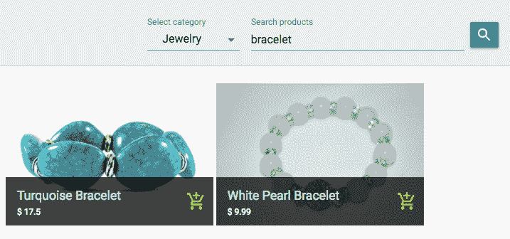

此`Search`组件为用户提供了一个简单的表单，包含一个搜索输入文本字段和一个来自父组件的类别选项下拉菜单，该父组件将使用不同的类别 API 检索列表。渲染此搜索表单视图的代码如下：

`mern-marketplace/client/product/Search.js`:

```js
<TextField id="select-category" select label="Select category" value={category}
     onChange={handleChange('category')}
     selectProps={{ MenuProps: { className: classes.menu, } }}>
  <MenuItem value="All"> All </MenuItem>
  {props.categories.map(option => (
    <MenuItem key={option} value={option}> {option} </MenuItem>
        ))}
</TextField>
<TextField id="search" label="Search products" type="search" onKeyDown={enterKey}
     onChange={handleChange('search')}
/>
<Button raised onClick={search}> Search </Button>
```

当用户输入搜索文本并按下*Enter*键时，我们将调用`search`方法。为了检测是否按下了*Enter*键，我们使用`TextField`上的`onKeyDown`属性，并定义如下`enterKey`处理方法：

`mern-marketplace/client/product/Search.js`:

```js
const enterKey = (event) => {
   if(event.keyCode == 13){
     event.preventDefault()
     search()
   }
}
```

“搜索”方法使用`list`获取方法调用搜索 API，并向它提供必要的搜索查询参数和值。此“搜索”方法定义如下所示：

`mern-marketplace/client/product/Search.js`:

```js
const search = () => {
    if(values.search){
      list({
        search: values.search || undefined, category: values.category
      }).then((data) => {
        if (data.error) {
          console.log(data.error)
        } else {
          setValues({...values, results: data, searched:true})
        }
      })
    }
}
```

在这个方法中，提供给`list`方法的查询参数是搜索文本值（如果有）和所选类别值。然后，从后端接收到的结果数组被设置为状态中的值，并作为属性传递给`Products`组件，如下所示，以在搜索表单下方渲染匹配的产品：

`mern-marketplace/client/product/Search.js`:

```js
<Products products={results} searched={searched}/>
```

这个搜索视图为访客提供了一个有用的工具，可以在可能存储在完整市场数据库中的许多产品中查找他们想要的具体产品。在下一节中，我们将探讨在前端利用类别和搜索 API 的另一个简单用例。

# 类别组件

“类别”组件是独特类别和搜索 API 的第二个用例。对于这个组件，我们首先在父组件中获取类别列表，并将其作为属性发送以向用户显示类别，如下面的截图所示：

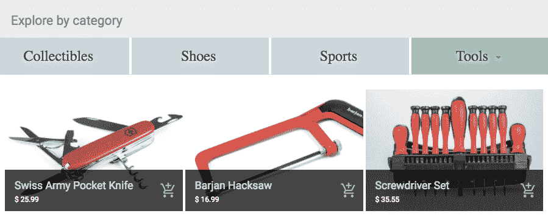

当用户在显示列表中选择一个类别时，会调用带有仅类别值的搜索 API，后端返回所选类别的所有产品。然后，这些返回的产品将在“产品”组件中渲染。这可以是一种简单的方法来组合这些 API，并向浏览市场的买家展示有意义的商品。

在这个 MERN 市场的第一个版本中，用户可以成为卖家来创建商店并添加产品，访客可以浏览商店并搜索产品，同时应用程序还会向访客推荐产品。

# 摘要

在本章中，我们开始使用 MERN 堆栈构建在线市场应用程序。MERN 骨架被扩展，以便用户可以拥有活跃的卖家账户，这样他们就可以创建商店并向每个商店添加产品，目的是向其他用户销售。我们还探讨了如何利用堆栈来实现产品浏览、搜索和为对购买感兴趣的普通用户提供建议等功能。

在浏览本章的实现过程中，我们探讨了如何通过全栈实现来奠定基础，以便能够组合和扩展诸如搜索和建议等有趣的功能。您可以在构建可能需要这些功能的其他全栈应用程序时应用这些相同的方法。

即使包含了这些功能，一个市场应用如果没有购物车、订单管理和支付处理功能，仍然是不完整的。在下一章中，我们将扩展我们的市场应用，添加这些高级功能，并了解如何使用 MERN 堆栈来实现电子商务应用的核心方面。
