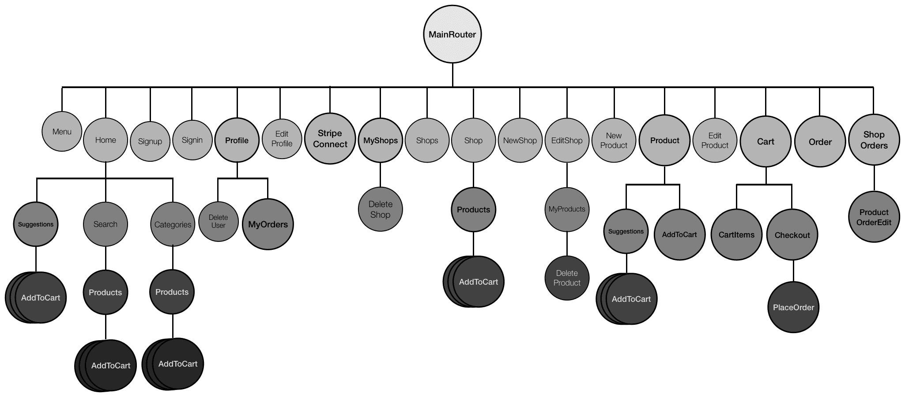
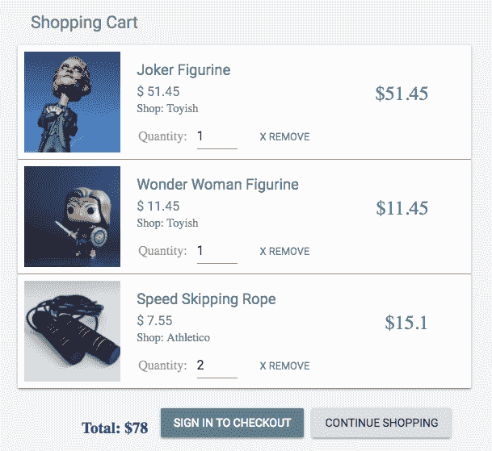
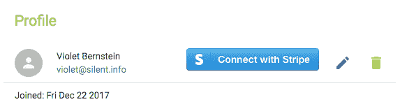
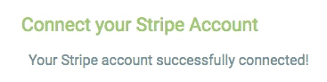
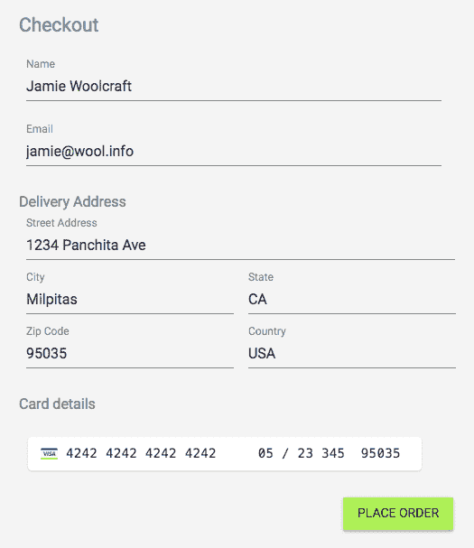
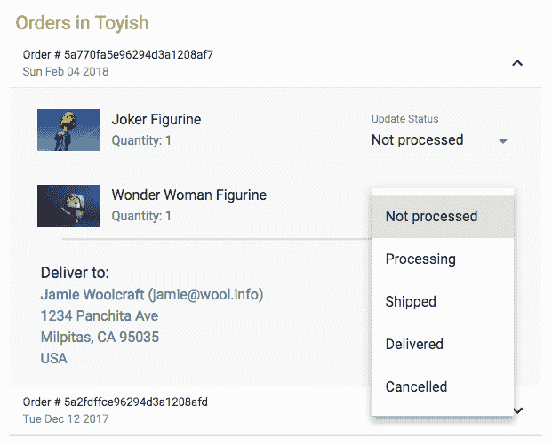
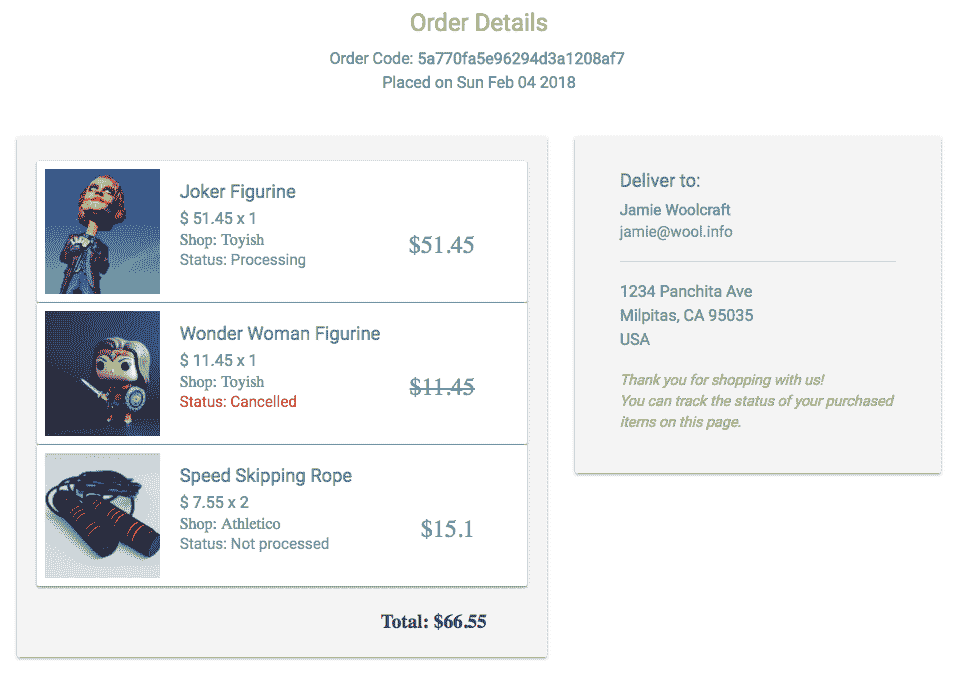
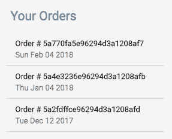

# 扩展 MERN Marketplace 以支持订单和支付

当客户下单时处理客户支付，并允许卖家管理这些订单是电子商务应用的关键方面。在本章中，我们将通过实现买家将产品添加到购物车、结账和下单的能力，以及卖家管理这些订单和通过市场应用处理支付的能力，扩展我们在上一章中构建的在线市场。一旦你完成本章并添加了这些功能，除了扩展市场应用的高级功能外，你还将能够利用浏览器存储、使用 Stripe 处理支付，并将其他技术集成到这个堆栈中。

在本章中，我们将通过以下主题扩展在线市场：

+   在 MERN Marketplace 中引入购物车、支付和订单

+   实现购物车

+   使用 Stripe 进行支付

+   集成结账流程

+   创建新订单

+   列出每个商店的订单

+   查看单个订单详情

# 在 MERN Marketplace 中引入购物车、支付和订单

我们在第七章，《使用在线市场锻炼 MERN 技能》中开发的 MERN Marketplace 应用具有非常简单的功能，缺少核心的电子商务功能。在本章中，我们将扩展这个市场应用，使其包括买家的购物车功能、处理信用卡支付的 Stripe 集成以及卖家的基本订单管理流程。以下实现保持简单，作为开发您自己应用中这些功能的更复杂版本的起点。

完整的 MERN Marketplace 应用程序代码可在 GitHub 上找到：[`github.com/PacktPublishing/Full-Stack-React-Projects-Second-Edition/tree/master/Chapter07%20and%2008/mern-marketplace`](https://github.com/PacktPublishing/Full-Stack-React-Projects-Second-Edition/tree/master/Chapter07%20and%2008/mern-marketplace)。你可以克隆此代码，并在阅读本章其余部分的代码解释时运行应用程序。要使 Stripe 支付代码工作，你需要创建自己的 Stripe 账户，并将`config/config.js`文件中的 Stripe API 密钥、密钥和 Stripe Connect 客户端 ID 更新为你的测试值。

下面的组件树图显示了构成 MERN Marketplace 前端的自定义组件，包括本章其余部分将实现的购物车、支付和与订单相关的功能：



本章将讨论的功能将修改一些现有组件，例如`Profile`、`MyShops`、`Products`和`Suggestions`，并添加新的组件，例如`AddToCart`、`MyOrders`、`Cart`和`ShopOrders`。在下一节中，我们将开始通过实现购物车来扩展在线市场。

# 实现购物车

访问 MERN 市场的访客可以通过点击每个产品的“添加到购物车”按钮将他们想要购买的产品添加到购物车中。菜单上的购物车图标将指示用户在浏览市场时已添加到购物车中的产品数量。他们还可以通过打开购物车视图来更新购物车的内容并开始结账过程。但为了完成结账过程并下订单，用户将需要登录。

购物车主要是前端功能，因此购物车详情将存储在客户端本地，直到用户在结账时下订单。为了实现购物车功能，我们将在`client/cart/cart-helper.js`中设置辅助方法，这将帮助从相关的 React 组件中操作购物车详情。

在以下几节中，我们将探讨如何将产品添加到购物车，更新菜单以显示购物车的状态，并实现购物车视图，用户可以在结账前查看和修改已添加到购物车中的所有项目。

# 添加到购物车

当在市场上浏览产品时，用户将看到在每个产品上添加到他们购物车的选项。这个选项将通过名为`AddToCart`的 React 组件实现。这个`AddToCart`组件在`client/Cart/AddToCart.js`中从它添加到的父组件接收`product`对象和 CSS 样式对象作为 props。例如，在 MERN 市场中，它被添加到产品视图如下：

```js
<AddToCart cartStyle={classes.addCart} item={product}/>
```

当`AddToCart`组件渲染时，会根据传递的项目是否有库存显示购物车图标按钮，如下面的截图所示：


例如，如果项目数量大于`0`，则显示`AddCartIcon`；否则，渲染`DisabledCartIcon`。图标的显示取决于传递给 props 的 CSS 样式对象。渲染`AddToCart`按钮这些变体的代码如下。

`mern-marketplace/client/cart/AddToCart.js`:

```js
{ props.item.quantity >= 0 ?
     <IconButton color="secondary" dense="dense" onClick={addToCart}>
        <AddCartIcon className={props.cartStyle || classes.iconButton}/>
     </IconButton> :
     <IconButton disabled={true} color="secondary" dense="dense">
        <DisabledCartIcon className={props.cartStyle || classes.disabledIconButton}/>
     </IconButton>
}
```

当点击`AddCartIcon`按钮时，会调用`addToCart`方法。`addToCart`方法定义如下。

`mern-marketplace/client/cart/AddToCart.js`:

```js
const addToCart = () => {
   cart.addItem(props.item, () => {
     setRedirect({redirect:true})
   })
}
```

`addToCart`方法调用在`cart-helper.js`中定义的`addItem`辅助方法。这个`addItem`方法接受`product`项目和状态更新`callback`函数作为参数，并将更新后的购物车详情存储在`localStorage`中，并执行传递的回调，如下面的代码所示。

`mern-marketplace/client/cart/cart-helper.js`:

```js
addItem(item, cb) {
    let cart = []
    if (typeof window !== "undefined") {
      if (localStorage.getItem('cart')) {
        cart = JSON.parse(localStorage.getItem('cart'))
      }
      cart.push({
        product: item,
        quantity: 1,
        shop: item.shop._id
      })
      localStorage.setItem('cart', JSON.stringify(cart))
      cb()
    }
}
```

存储在`localStorage`中的购物车数据包含一个购物车项目对象数组，每个对象包含产品详情、添加到购物车中的产品数量（默认设置为`1`）以及产品所属商店的 ID。当产品被添加到购物车并存储在`localStorage`中时，我们还将如下一节所述在导航菜单上显示更新的项目计数。

# 菜单中的购物车图标

在菜单中，我们将添加一个链接到购物车视图，以及一个显示存储在`localStorage`中的购物车数组长度的徽章，以便视觉上告知用户当前购物车中有多少个项目。渲染的链接和徽章将如下所示：


购物车链接将与菜单中的其他链接类似，但有一个例外，即 Material-UI `Badge`组件，它显示购物车长度。它将按如下方式添加：

`mern-marketplace/client/core/Menu.js`:

```js
<Link to="/cart">
    <Button color={isActive(history, "/cart")}>
       Cart
       <Badge invisible={false} color="secondary" 
             badgeContent= {cart.itemTotal()}>
           <CartIcon />
       </Badge>
    </Button>
</Link>
```

购物车长度由`cart-helper.js`中的`itemTotal`辅助方法返回，该方法读取存储在`localStorage`中的`cart`数组并返回数组的长度。`itemTotal`方法定义如下。

`mern-marketplace/client/cart/cart-helper.js`:

```js
itemTotal() {
    if (typeof window !== "undefined") {
      if (localStorage.getItem('cart')) {
        return JSON.parse(localStorage.getItem('cart')).length
      }
    }
    return 0
}
```

点击此购物车链接，菜单上显示项目总数，将用户带到购物车视图并显示已添加到购物车的项目详情。在下一节中，我们将讨论此购物车视图的实现。

# 购物车视图

购物车视图将包含购物车项目和结账详情。但最初，只有购物车详情将被显示，直到用户准备好结账。渲染此购物车视图的代码将按如下方式添加。

`mern-marketplace/client/cart/Cart.js`:

```js
<Grid container spacing={24}>
      <Grid item xs={6} sm={6}>
            <CartItems checkout={checkout}
 setCheckout={showCheckout}/>
      </Grid>
 {checkout && 
      <Grid item xs={6} sm={6}>
        <Checkout/>
      </Grid>}
</Grid>
```

显示购物车项目的`CartItems`组件，它传递一个`checkout`布尔值和用于此结账值的州更新方法，以便根据用户交互有条件地渲染`Checkout`组件及其选项。

用于更新`checkout`值的`showCheckout`方法定义如下。

`mern-marketplace/client/cart/Cart.js`:

```js
const showCheckout = val => {
    setCheckout(val)
}
```

`Cart`组件将在`/cart`路由下访问，因此我们需要将`Route`添加到`MainRouter`组件中，如下所示。

`mern-marketplace/client/MainRouter.js`:

```js
<Route path="/cart" component={Cart}/>
```

这是我们在菜单中使用的链接，用于将用户重定向到包含购物车详情的购物车视图。在下一节中，我们将查看`CartItems`组件的实现，该组件将渲染购物车中每个项目的详情并允许修改。

# `CartItems`组件

`CartItems`组件将允许用户查看和更新他们购物车中的项目。它还将给他们提供选项，如果他们已登录，则可以开始结账过程，如下面的截图所示：



如果购物车包含项目，`CartItems` 组件将遍历项目并在购物车中渲染产品。如果没有添加任何项目，购物车视图将只显示一条消息，说明购物车为空。此实现的代码如下。

`mern-marketplace/client/cart/CartItems.js`:

```js
{cartItems.length > 0 ? <span>
      {cartItems.map((item, i) => {
          ...          
            … Display product details
              … Edit quantity
              … Remove product option
          ...
        })
      }
     … Show total price and Checkout options … 
    </span> : 
    <Typography variant="subtitle1" component="h3" color="primary">
        No items added to your cart.    
    </Typography>
}
```

对于每个产品项目，我们显示产品的详情和一个可编辑的数量文本字段，以及一个移除项目的选项。最后，我们显示购物车中项目的总价以及开始结账操作的选项。在接下来的章节中，我们将探讨这些购物车项目显示和修改选项的实现。

# 检索购物车详情

在显示购物车项目详情之前，我们需要检索存储在 `localStorage` 中的购物车详情。为此，我们在 `cart-helper.js` 中实现了 `getCart` 辅助方法，该方法从 `localStorage` 中检索并返回购物车详情，如下面的代码所示。

`mern-marketplace/client/cart/cart-helper.js`:

```js
getCart() {
    if (typeof window !== "undefined") {
      if (localStorage.getItem('cart')) {
        return JSON.parse(localStorage.getItem('cart'))
      }
    }
    return []
}
```

在 `CartItems` 组件中，我们将使用 `getCart` 辅助方法检索购物车项目，并将其设置为 `cartItems` 的初始状态，如下面的代码所示。

`mern-marketplace/client/cart/CartItems.js`:

```js
const [cartItems, setCartItems] = useState(cart.getCart())
```

然后，使用 `map` 函数遍历从 `localStorage` 中检索到的 `cartItems` 数组，以显示每个项目的详情，如下面的代码所示。

`mern-marketplace/client/cart/CartItems.js`:

```js
<span key={i}>
  <Card>
    <CardMedia image={'/api/product/image/'+item.product._id}
         title={item.product.name}/>
         <CardContent>
                <Link to={'/product/'+item.product._id}>
                    <Typography type="title" component="h3" 
                    color="primary">
                      {item.product.name}</Typography>
                </Link>
                <Typography type="subheading" component="h3" 
               color="primary">
                      $ {item.product.price}
                </Typography>
                <span>${item.product.price * item.quantity}</span>
                <span>Shop: {item.product.shop.name}</span>
         </CardContent>
         <div>
          … Editable quantity …
          … Remove item option ...
         </div>
  </Card>
  <Divider/>
</span> 
```

对于每个渲染的购物车项目，我们还将提供用户更改数量的选项，如下一节所述。

# 修改数量

在购物车视图中显示的每个购物车项目都将包含一个可编辑的 `TextField`，允许用户更新他们购买的每个产品的数量，最小允许值为 `1`，如下面的代码所示。

`mern-marketplace/client/cart/CartItems.js`:

```js
Quantity: <TextField
          value={item.quantity}
          onChange={handleChange(i)}
          type="number"
          inputProps={{ min:1 }}
          InputLabelProps={{
            shrink: true,
          }}
        />
```

当用户更新此值时，将调用 `handleChange` 方法以执行最小值验证，更新状态中的 `cartItems`，并使用辅助方法更新 `localStorage` 中的购物车。`handleChange` 方法定义如下。

`mern-marketplace/client/cart/CartItems.js`:

```js
const handleChange = index => event => {
  let updatedCartItems = cartItems
  if(event.target.value == 0){
     updatedCartItems[index].quantity = 1
  }else{
     updatedCartItems[index].quantity = event.target.value
  }
  setCartItems([...updatedCartItems])
  cart.updateCart(index, event.target.value)
}
```

`updateCart` 辅助方法接受购物车数组中正在更新的产品的索引和新数量值作为参数，并更新存储在 `localStorage` 中的详情。此 `updateCart` 辅助方法定义如下。

`mern-marketplace/client/cart/cart-helper.js`:

```js
updateCart(itemIndex, quantity) {
    let cart = []
    if (typeof window !== "undefined") {
      if (localStorage.getItem('cart')) {
        cart = JSON.parse(localStorage.getItem('cart'))
      }
      cart[itemIndex].quantity = quantity
      localStorage.setItem('cart', JSON.stringify(cart))
    }
}
```

除了在购物车中更新项目数量外，用户还可以选择从购物车中移除项目，如下一节所述。

# 移除项目

购物车中的每个项目旁边都将有一个移除选项。这个移除项目选项是一个按钮，当点击时，将传递项目的数组索引到 `removeItem` 方法，以便可以从数组中移除。此按钮的渲染代码如下。

`mern-marketplace/client/cart/CartItems.js`:

```js
<Button color="primary" onClick={removeItem(i)}>x Remove</Button>
```

`removeItem`点击处理方法使用`removeItem`辅助方法从`localStorage`中的购物车移除项目，然后更新状态中的`cartItems`。此方法还检查购物车是否已清空，以便可以使用从`Cart`组件传递的属性作为`setCheckout`函数隐藏结账。`removeItem`点击处理方法定义如下。

`mern-marketplace/client/cart/CartItems.js`:

```js
const removeItem = index => event =>{
    let updatedCartItems = cart.removeItem(index)
    if(updatedCartItems.length == 0){
      props.setCheckout(false)
    }
    setCartItems(updatedCartItems)
}
```

`cart-helper.js`中的`removeItem`辅助方法接受要从中移除的产品索引，将其从数组中移除，并在返回更新后的`cart`数组之前更新`localStorage`。此`removeItem`辅助方法定义如下。

`mern-marketplace/client/cart/cart-helper.js`:

```js
removeItem(itemIndex) {
    let cart = []
    if (typeof window !== "undefined") {
      if (localStorage.getItem('cart')) {
        cart = JSON.parse(localStorage.getItem('cart'))
      }
      cart.splice(itemIndex, 1)
      localStorage.setItem('cart', JSON.stringify(cart))
    }
    return cart
}
```

当用户通过更改数量或移除项目来修改购物车中的项目时，他们也将看到当前购物车中所有项目的更新总价，如下一节所述。

# 显示总价

在`CartItems`组件的底部，我们将显示购物车中项目的总价。它将使用以下代码渲染。

`mern-marketplace/client/cart/CartItems.js`:

```js
<span className={classes.total}>Total: ${getTotal()}</span>
```

`getTotal`方法将在考虑`cartItems`数组中每个项目的单价和数量时计算总价。此方法定义如下。

`mern-marketplace/client/cart/CartItems.js`:

```js
const getTotal = () => {
    return cartItems.reduce((a, b) => {
        return a + (b.quantity*b.product.price)
    }, 0)
}
```

通过这种方式，用户在准备结账并下订单之前，将能够了解他们要购买的内容及其费用概览。在下一节中，我们将探讨如何根据购物车状态和用户是否已登录有条件地渲染结账选项。

# 结账选项

用户将根据他们是否已登录以及结账是否已被打开，看到执行结账的选项，如以下代码所示。

`mern-marketplace/client/cart/CartItems.js`:

```js
{!props.checkout && (auth.isAuthenticated() ? 
    <Button onClick={openCheckout}>
        Checkout
    </Button> : 
    <Link to="/signin">
        <Button>Sign in to checkout</Button>
    </Link>)
}
```

当点击结账按钮时，`openCheckout`方法将使用作为属性传递的`setCheckout`方法将`Cart`组件中的结账值设置为`true`。`openCheckout`方法定义如下。

`mern-marketplace/client/cart/CartItems.js`:

```js
const openCheckout = () => {
    props.setCheckout(true)
}
```

一旦在购物车视图中将结账值设置为`true`，`Checkout`组件将被渲染，以允许用户输入结账详情并下订单。

这将为用户完成购买过程，现在他们能够将项目添加到购物车并修改每个项目，直到他们准备结账。但在讨论结账功能的实现之前，该功能将涉及收集和处理支付信息，在下一节中，我们将讨论如何在我们的应用程序中使用 Stripe 添加预期的支付相关功能。

# 使用 Stripe 进行支付

在结账、订单创建和订单管理流程的实现中都需要支付处理。这还涉及到对买家和卖家用户数据的更新。在我们深入探讨结账和订单功能的实现之前，我们将简要讨论使用 Stripe 的支付处理选项和考虑因素，并学习如何在 MERN 市场中集成它。

Stripe 提供了一套广泛的工具，这些工具对于在任何 Web 应用程序中集成支付都是必要的。这些工具可以根据具体的应用类型和正在实施的支付用例以不同的方式选择和使用。

在 MERN 市场设置的情况下，应用程序本身将在 Stripe 上拥有一个平台，并期望卖家在平台上连接 Stripe 账户，以便应用程序可以代表卖家向在结账时输入信用卡详情的用户收费。在 MERN 市场中，用户可以将不同商店的产品添加到购物车中，这样只有在卖家处理订单时，应用程序才会为所订购的具体产品创建卡片上的费用。此外，卖家将能够通过自己的 Stripe 仪表板完全控制代表他们创建的费用。我们将演示如何使用 Stripe 提供的工具来使这个支付设置生效。

Stripe 为每个工具提供了一套完整的文档和指南，同时也为在 Stripe 上设置的账户和平台提供了测试数据。为了在 MERN 市场中实现支付，我们将使用测试密钥，并将其留给您来扩展实现以支持实时支付。

在以下章节中，我们将讨论如何为每个卖家连接 Stripe 账户，使用 Stripe 卡元素从用户那里收集信用卡详情，使用 Stripe 客户记录用户的支付信息以安全的方式，以及使用 Stripe 创建费用以处理支付。

# 为每个卖家提供 Stripe 连接的账户

为了代表卖家创建费用，应用程序将允许一个卖家用户将他们的 Stripe 账户连接到他们的 MERN 市场用户账户。在以下章节中，我们将通过更新用户模型以存储 Stripe 凭证，添加视图组件以允许用户连接到 Stripe，以及添加后端 API 以在更新数据库之前完成 Stripe OAuth 来实现这一功能。

# 更新用户模型

当卖家将他们的 Stripe 账户连接到市场时，我们需要将他们的 Stripe 凭证与他们其他用户详情一起存储，以便他们在销售产品时可以用于支付处理。为了在用户成功连接他们的 Stripe 账户后存储 Stripe OAuth 凭证，我们将更新我们在第三章，*使用 MongoDB、Express 和 Node 构建后端*中开发的用户模型，如下所示的字段。

`mern-marketplace/server/models/user.model.js`:

```js
stripe_seller: {}
```

这个`stripe_seller`字段将存储从 Stripe 在认证过程中收到的卖家 Stripe 账户凭证。当需要通过 Stripe 处理他们从商店销售的产品时的费用时，将使用这些凭证。接下来，我们将查看前端组件，该组件将允许用户从我们的应用程序连接到 Stripe。

# 连接到 Stripe 的按钮

在卖家的用户资料页面中，如果用户尚未连接他们的 Stripe 账户，我们将显示一个按钮，该按钮将用户带到 Stripe 进行认证并连接他们的 Stripe 账户。连接到 Stripe 的按钮将在“资料”视图中如下渲染：



如果用户已经成功连接了他们的 Stripe 账户，我们将显示一个禁用的 STRIPE CONNECTED 按钮，如下面的截图所示：


添加到`Profile`组件中的代码将检查用户是否为卖家，然后再渲染与 Stripe 相关的按钮。然后，第二个检查将确认给定用户的`stripe_seller`字段中是否已经存在 Stripe 凭证。如果用户已经存在 Stripe 凭证，则显示禁用的`STRIPE CONNECTED`按钮；否则，将显示一个使用他们的 OAuth 链接连接到 Stripe 的链接，如以下代码所示。

`mern-marketplace/client/user/Profile.js`:

```js
{user.seller && (user.stripe_seller ? 
    (<Button variant="contained" disabled className={classes.stripe_connected}>
                Stripe connected
     </Button>)
  : (<a href={"https://connect.stripe.com/oauth/authorize?                                 response_type=code&client_id="                                                                                   +config.stripe_connect_test_client_id+"&scope=read_write"} 
     className={classes.stripe_connect}>
    
     </a>)
  )
}  
```

OAuth 链接包含平台的客户端 ID，我们将将其设置在`config`变量中，以及其他选项值作为查询参数。此链接将用户带到 Stripe，并允许用户连接现有的 Stripe 账户或创建一个新的账户。一旦 Stripe 的认证过程完成，它将使用在 Stripe 仪表板上的平台连接设置中设置的重定向 URL 返回到我们的应用程序。Stripe 将认证代码或错误消息附加为查询参数到重定向 URL。

MERN Marketplace 的重定向 URI 设置为`/seller/stripe/connect`，这将渲染`StripeConnect`组件。我们将如下声明此路由。

`mern-marketplace/client/MainRouter.js`:

```js
<Route path="/seller/stripe/connect" component={StripeConnect}/>
```

当 Stripe 将用户重定向到这个 URL 时，我们将渲染`StripeConnect`组件，以便它处理 Stripe 对认证的响应，如下一节所述。

# StripeConnect 组件

`StripeConnect` 组件将基本上完成与 Stripe 的剩余授权流程步骤，并根据 Stripe 连接是否成功渲染相关消息，如下面的截图所示：



当 `StripeConnect` 组件加载时，我们将使用 `useEffect` 钩子解析从 Stripe 重定向附加到 URL 的查询参数，如下面的代码所示。

`mern-marketplace/client/user/StripeConnect.js`:

```js
  useEffect(() => {
    const abortController = new AbortController()
    const signal = abortController.signal
    const jwt = auth.isAuthenticated()
    const parsed = queryString.parse(props.location.search)
    if(parsed.error){
      setValues({...values, error: true})
    }
    if(parsed.code){
      setValues({...values, connecting: true, error: false})
      //post call to stripe, get credentials and update user data
      stripeUpdate({
        userId: jwt.user._id
      }, {
        t: jwt.token
      }, parsed.code, signal).then((data) => {
        if (data.error) {
          setValues({...values, error: true, connected: false,
             connecting: false})
        } else {
          setValues({...values, connected: true, 
             connecting: false, error: false})
        }
      })
    }
    return function cleanup(){
      abortController.abort()
    }
  }, [])
```

对于解析，我们使用之前用于实现产品搜索的相同 `query-string` 节点模块。然后，如果 URL 的 `query` 参数包含授权 `code` 而不是 `error`，我们将通过 `stripeUpdate` 获取方法在我们的服务器上发起 API 调用来完成 Stripe OAuth。

`stripeUpdate` 获取方法在 `api-user.js` 中定义，并将从 Stripe 检索到的授权码传递到我们将在服务器上设置的 `'/api/stripe_auth/:userId'` 的 API。此 `stripeUpdate` 获取方法定义如下。

`mern-marketplace/client/user/api-user.js`:

```js
const stripeUpdate = async (params, credentials, auth_code, signal) => {
  try {
    let response = await fetch ('/api/stripe_auth/'+params.userId, {
      method: 'PUT',
      signal: signal,
      headers: {
        'Accept': 'application/json',
        'Content-Type': 'application/json',
        'Authorization': 'Bearer ' + credentials.t
      },
      body: JSON.stringify({stripe: auth_code})
    })
    return await response.json()
  } catch(err) {
    console.log(err)
  }
}
```

此获取方法正在调用我们必须在我们的服务器上添加的后端 API，以完成 OAuth 流程并将检索到的凭证保存到数据库中。我们将在下一节中实现此 API。

# Stripe 授权更新 API

一旦连接了 Stripe 账户，为了完成 OAuth 流程，我们需要从我们的服务器向 Stripe OAuth 发起 POST API 调用。我们需要通过 POST API 调用将之前检索到的授权码发送给 Stripe OAuth，并接收要存储在卖家用户账户中以处理费用的凭证。我们将通过在后端实现更新 API 来实现此 Stripe 授权更新。此 Stripe 授权更新 API 将在 `/api/stripe_auth/:userId` 接收 PUT 请求并启动 POST API 调用来从 Stripe 获取凭证。

此 Stripe 授权更新 API 的路由将在服务器上的用户路由中声明，如下所示。

`mern-marketplace/server/routes/user.routes.js`:

```js
router.route('/api/stripe_auth/:userId')
   .put(authCtrl.requireSignin, authCtrl.hasAuthorization,   
    userCtrl.stripe_auth, userCtrl.update)
```

对此路由的请求使用 `stripe_auth` 控制器方法从 Stripe 获取凭证，并将其传递给现有的用户更新方法，以便它可以存储在数据库中。

为了从我们的服务器向 Stripe API 发起 POST 请求，我们将使用 `request` 节点模块，需要从命令行使用以下命令安装：

```js
yarn add request 
```

用户控制器中的 `stripe_auth` 控制器方法将定义如下。

`mern-marketplace/server/controllers/user.controller.js`:

```js
const stripe_auth = (req, res, next) => {
  request({
    url: "https://connect.stripe.com/oauth/token",
    method: "POST",
    json: true,
    body: { client_secret:config.stripe_test_secret_key,                                                               
            code:req.body.stripe, 
            grant_type:'authorization_code'}
  }, (error, response, body) => {
    if(body.error){
      return res.status('400').json({
        error: body.error_description
      })
    }
    req.body.stripe_seller = body
    next()
  })
}
```

使用 Stripe 的 POST API 调用需要平台的密钥和检索到的授权码来完成授权。然后，它将在 `body` 中返回连接账户的凭证，这些凭证随后被附加到请求体中，以便在 `next()` 调用 `update` 控制器方法时更新用户的详细信息。

从 Stripe 获取的这些认证凭据可以在我们的应用程序中使用，代表卖家在他们的商店销售产品时，在客户信用卡上创建费用。在下一节中，我们将学习如何使用 Stripe 在结账过程中收集客户信用卡详情。

# Stripe Card Elements 用于结账

在结账过程中，为了从用户那里收集信用卡详情，我们将使用 Stripe 的 `Card Elements` 将信用卡字段添加到结账表单中。为了将 `Card Elements` 集成到我们的 React 接口中，我们将利用 `react-stripe-elements` 节点模块，可以通过在命令行中运行以下命令来安装：

```js
yarn add react-stripe-elements
```

我们还需要将 `Stripe.js` 代码注入到 `template.js` 中，以便在前端代码中访问 Stripe，如下所示。

`mern-marketplace/template.js`:

```js
<script id="stripe-js" src="img/"></script>
```

对于 MERN Marketplace，Stripe 将在购物车视图中需要，其中 `Checkout` 组件需要它来渲染 `Card Elements` 并处理卡详情输入。我们将使用来自 `react-stripe-elements` 的 `StripeProvider` 组件包装我们在 `Cart.js` 中添加的 `Checkout` 组件，以便 `Checkout` 中的 `Elements` 组件可以访问 Stripe 实例。

`mern-marketplace/client/cart/Cart.js`:

```js
<StripeProvider apiKey={config.stripe_test_api_key}> 
     <Checkout/>
</StripeProvider>
```

然后，在 `Checkout` 组件中，我们将使用 Stripe 的 `Elements` 组件。使用 Stripe 的 `Card Elements` 将使应用程序能够收集用户的信用卡详情，并使用 Stripe 实例来标记卡信息，而不是在我们的服务器上处理。在结账过程中收集卡详情和生成卡令牌的实现细节将在 *整合结账过程* 和 *创建新订单* 部分中讨论。在下一节中，我们将讨论如何使用 Stripe 安全地记录从用户那里通过 `Card Elements` 收到的卡详情。

# Stripe 客户用于记录卡详情

当在结账过程的最后放置订单时，生成的卡令牌将被用来创建或更新代表我们的用户的 Stripe 客户（[`stripe.com/docs/api#customers`](https://stripe.com/docs/api#customers)）。这是将信用卡信息（[`stripe.com/docs/saving-cards`](https://stripe.com/docs/saving-cards)）存储在 Stripe 中以供进一步使用的好方法，例如，当卖家从他们的商店处理已订购的产品时，在购物车中对特定产品创建费用。这消除了需要在自己的服务器上安全存储用户信用卡详情的复杂性。为了将 Stripe 客户集成到我们的应用程序中，在接下来的章节中，我们将更新用户模型以便它存储 Stripe 客户详情，并更新用户控制器方法，以便我们可以使用后端的 Stripe 节点模块创建或更新 Stripe 客户信息。

# 更新用户模型

为了使用 Stripe 客户端安全地存储每个用户的信用卡信息并在应用中按需处理支付，我们需要存储与每个用户关联的 Stripe 客户端详情。为了跟踪我们数据库中用户的相应 Stripe 客户端信息，我们将更新用户模型，如下所示的字段：

```js
stripe_customer: {},
```

此字段将存储一个 Stripe 客户端对象，这将允许我们创建周期性费用并跟踪与我们平台中同一用户关联的多个费用。为了能够创建或更新 Stripe 客户端，我们需要利用 Stripe 的客户 API。在下一节中，我们将更新用户控制器，以便我们可以集成和使用来自 Stripe 的此客户 API。

# 更新用户控制器

当用户在输入信用卡详情后下订单时，我们将创建一个新的或更新现有的 Stripe 客户端。为了实现这一点，我们将更新用户控制器，以便在服务器接收到创建订单 API 请求（如“创建新订单”部分所述）之前调用 `stripeCustomer` 方法。

在 `stripeCustomer` 控制器方法中，我们需要使用 `stripe` 节点模块，可以使用以下命令安装：

```js
yarn add stripe 
```

在安装了 `stripe` 模块后，需要将其导入到用户控制器文件中。然后，需要使用应用程序的 Stripe 秘密密钥初始化 `stripe` 实例。

`mern-marketplace/server/controllers/user.controller.js`:

```js
import stripe from 'stripe'
const myStripe = stripe(config.stripe_test_secret_key)
```

`stripeCustomer` 控制器方法将检查当前用户是否已经在数据库中存储了相应的 Stripe 客户端，然后使用从前端接收到的卡令牌来创建一个新的 Stripe 客户端或更新现有的一个，如下文所述。

# 创建新的 Stripe 客户端

如果当前用户没有对应的 Stripe 客户端 - 也就是说，`stripe_customer` 字段没有存储值 - 我们将使用 Stripe 的创建客户 API ([`stripe.com/docs/api#create_customer`](https://stripe.com/docs/api#create_customer))，如下所示。

`mern-marketplace/server/controllers/user.controller.js`:

```js
myStripe.customers.create({
            email: req.profile.email,
            source: req.body.token
      }).then((customer) => {
          User.update({'_id':req.profile._id},
            {'$set': { 'stripe_customer': customer.id }},
            (err, order) => {
              if (err) {
                return res.status(400).send({
                  error: errorHandler.getErrorMessage(err)
                })
              }
              req.body.order.payment_id = customer.id
              next()
        })
})
```

如果 Stripe 客户端创建成功，我们将通过在 `stripe_customer` 字段中存储 Stripe 客户端 ID 引用来更新当前用户的数据。我们还将把此客户 ID 添加到正在下订单中，以便更容易创建与订单相关的费用。一旦创建了 Stripe 客户端，我们就可以在用户为新的订单输入信用卡详情时更新 Stripe 客户端，如下一节所述。

# 更新现有的 Stripe 客户端

对于现有的 Stripe 客户端 - 也就是说，当前用户已经在 `stripe_customer` 字段中存储了值 - 我们将使用 Stripe API 来更新一个 Stripe 客户端，如下所示。

`mern-marketplace/server/controllers/user.controller.js`:

```js
 myStripe.customers.update(req.profile.stripe_customer, {
       source: req.body.token
     }, 
       (err, customer) => {
         if(err){
           return res.status(400).send({
             error: "Could not update charge details"
           })
         }
         req.body.order.payment_id = customer.id
         next()
       })
```

一旦成功更新 Stripe 客户，我们将在`next()`调用中将客户 ID 添加到正在创建的订单中。虽然这里没有涉及，但 Stripe 客户功能可以用来允许用户从应用程序中存储和更新他们的信用卡信息。随着用户的支付信息被安全存储并可供访问，我们可以探讨如何使用这些信息在卖家处理订购产品时处理支付。

# 为每个处理的产品创建费用

当卖家通过处理他们在商店中订购的产品来更新订单时，应用程序将代表卖家在客户的信用卡上创建一个费用，费用为订购产品的成本。

为了实现这一点，我们将更新`user.controller.js`文件，添加一个`createCharge`控制器方法，该方法将使用 Stripe 的创建费用 API，并需要卖家的 Stripe 账户 ID 以及买家的 Stripe 客户 ID。`createCharge`控制器方法将定义如下。

`mern-marketplace/server/controllers/user.controller.js`:

```js
const createCharge = (req, res, next) => {
  if(!req.profile.stripe_seller){
    return res.status('400').json({
      error: "Please connect your Stripe account"
    })
  }
  myStripe.tokens.create({
    customer: req.order.payment_id,
  }, {
    stripeAccount: req.profile.stripe_seller.stripe_user_id,
  }).then((token) => {
      myStripe.charges.create({
        amount: req.body.amount * 100, //amount in cents
        currency: "usd",
        source: token.id,
      }, {
        stripeAccount: req.profile.stripe_seller.stripe_user_id,
      }).then((charge) => {
        next()
      })
  })
}
```

如果卖家尚未连接他们的 Stripe 账户，`createCharge`方法将返回一个 400 错误响应，以指示需要连接的 Stripe 账户。

为了能够代表卖家的 Stripe 账户向 Stripe 客户收费，我们需要使用客户 ID 和卖家的 Stripe 账户 ID 生成一个 Stripe 令牌，然后使用该令牌创建费用。

当服务器接收到更新订单的请求，并将产品状态更改为**处理中**时（此订单更新请求的 API 实现将在*按商店列出订单*部分讨论），将调用`createCharge`控制器方法。

这涵盖了所有与 MERN Marketplace 特定用例的支付处理相关的 Stripe 相关概念。现在，我们将继续我们的实现，以便允许用户完成结账过程并从购物车中下单。

# 集成结账过程

已登录并已将商品添加到购物车的用户将能够开始结账过程。我们将添加一个结账表单来收集客户详情、送货地址信息和信用卡信息，如下面的截图所示：



此结账视图将包括两部分，第一部分用于收集买家的详细信息，包括姓名、电子邮件和送货地址，第二部分用于输入信用卡详情并下单。在以下章节中，我们将通过初始化结账表单详情并添加收集买家详情的字段来完成结账过程的实现。然后，我们将收集买家的信用卡详情，以便他们可以下单并完成结账过程。

# 初始化结账详情

在本节中，我们将创建结算视图，该视图包含表单字段和“下单”选项，位于“结算”组件中。在这个组件中，我们将在从表单收集详细信息之前在状态中初始化`checkoutDetails`对象。我们将根据当前用户的详细信息预先填充客户信息，并将当前购物车商品添加到`checkoutDetails`中，如下面的代码所示。

`mern-marketplace/client/cart/Checkout.js`:

```js
 const user = auth.isAuthenticated().user
 const [values, setValues] = useState({
    checkoutDetails: {
      products: cart.getCart(),
      customer_name: user.name,
      customer_email:user.email,
      delivery_address: { street: '', city: '', state: '', 
          zipcode: '', country:''}
    },
    error: ''
})
```

这些客户信息值，在`checkoutDetails`中初始化，将在用户与表单字段交互时更新。在以下章节中，我们将添加收集在此结算视图中要收集的客户信息和送货地址详细信息的表单字段和更改处理函数。

# 客户信息

在结算表单中，我们将有收集客户姓名和电子邮件地址的字段。为了将这些文本字段添加到`Checkout`组件中，我们将使用以下代码。

`mern-marketplace/client/cart/Checkout.js`:

```js
<TextField id="name" label="Name" value={values.checkoutDetails.customer_name} onChange={handleCustomerChange('customer_name')}/>
<TextField id="email" type="email" label="Email" value={values.checkoutDetails.customer_email} onChange={handleCustomerChange('customer_email')}/><br/>  
```

当用户更新这两个字段的值时，`handleCustomerChange`方法将更新状态中的相关详细信息。`handleCustomerChange`方法定义如下。

`mern-marketplace/client/cart/Checkout.js`:

```js
const handleCustomerChange = name => event => {
    let checkoutDetails = values.checkoutDetails
    checkoutDetails[name] = event.target.value || undefined
    setValues({...values, checkoutDetails: checkoutDetails})
}
```

这将使用户能够更新与该订单关联的客户的姓名和电子邮件。接下来，我们将查看收集此订单送货地址详细信息实现的示例。

# 送货地址

为了从用户那里收集送货地址，我们将在结算表单中添加收集地址详细信息（如街道地址、城市、州、邮政编码和国家名称）的字段。我们将使用以下代码添加文本字段，以便用户输入这些地址详细信息。

`mern-marketplace/client/cart/Checkout.js`:

```js
<TextField id="street" label="Street Address" value=          {values.checkoutDetails.delivery_address.street} onChange={handleAddressChange('street')}/>
<TextField id="city" label="City" value={values.checkoutDetails.delivery_address.city} onChange={handleAddressChange('city')}/>
<TextField id="state" label="State" value={values.checkoutDetails.delivery_address.state} onChange={handleAddressChange('state')}/>
<TextField id="zipcode" label="Zip Code" value={values.checkoutDetails.delivery_address.zipcode} onChange={handleAddressChange('zipcode')}/>
<TextField id="country" label="Country" value={values.checkoutDetails.delivery_address.country} onChange={handleAddressChange('country')}/> 
```

当用户更新这些地址字段时，`handleAddressChange`方法将更新状态中的相关详细信息，如下所示。

`mern-marketplace/client/cart/Checkout.js`:

```js
const handleAddressChange = name => event => {
    let checkoutDetails = values.checkoutDetails
    checkoutDetails.delivery_address[name] = 
          event.target.value || undefined
    setValues({...values, checkoutDetails: checkoutDetails})
}
```

在这些文本字段和处理更改函数就绪后，状态中的`checkoutDetails`对象将包含用户输入的客户信息和送货地址。在下一节中，我们将从买家那里收集支付信息，并将其与其他结算详细信息一起使用，以完成结算过程并下单。

# 下单

结账过程的剩余步骤将涉及安全地收集用户的信用卡详细信息，从而使用户能够下订单，从存储中清空购物车，并将用户重定向到包含订单详情的视图。我们将通过构建一个 `PlaceOrder` 组件来实现这些步骤，该组件由结账视图中的剩余元素组成，即信用卡字段和下订单按钮。在接下来的章节中，当我们开发这个组件时，我们将使用 Stripe 卡元素来收集信用卡详细信息，为用户添加一个完成结账过程的下订单按钮，利用购物车辅助方法清空购物车，并将用户重定向到订单视图。

# 使用 Stripe 卡元素

为了使用来自 `react-stripe-elements` 的 Stripe 的 `CardElement` 组件将信用卡字段添加到 `PlaceOrder` 组件中，我们需要使用 Stripe 的 `injectStripe` **高阶组件**（**HOC**）来包装 `PlaceOrder` 组件。

这是因为 `CardElement` 组件需要成为由 `injectStripe` 构建，并用 `Elements` 组件包装的支付表单组件的一部分。因此，当我们创建一个名为 `PlaceOrder` 的组件时，我们将在导出之前用 `injectStripe` 包装它，如下面的代码所示。

`mern-marketplace/client/cart/PlaceOrder.js`:

```js
const PlaceOrder = (props) => { … } 
PlaceOrder.propTypes = {
  checkoutDetails: PropTypes.object.isRequired
}
export default injectStripe(PlaceOrder)
```

然后，我们将此 `PlaceOrder` 组件添加到结账表单中，将其 `checkoutDetails` 对象作为属性传递，并用来自 `react-stripe-elements` 的 `Elements` 组件包装，如下所示。

`mern-marketplace/client/cart/Checkout.js`:

```js
<Elements> <PlaceOrder checkoutDetails={values.checkoutDetails} /> </Elements>
```

`injectStripe` HOC 提供了 `props.stripe` 属性，该属性管理 `Elements` 组。这将允许我们在 `PlaceOrder` 中调用 `props.stripe.createToken`，将卡详细信息提交给 Stripe 并获取卡令牌。接下来，我们将学习如何使用 Stripe `CardElement` 组件在 `PlaceOrder` 组件内部收集信用卡详细信息。

# The CardElement component

Stripe 的 `CardElement` 是自包含的，因此我们只需将其添加到 `PlaceOrder` 组件中，然后根据需要添加样式，信用卡详细信息输入将由它处理。我们将按照以下方式将 `CardElement` 组件添加到 `PlaceOrder` 中。

`mern-marketplace/client/cart/PlaceOrder.js`:

```js
<CardElement className={classes.StripeElement}
      {...{style: {
      base: {
        color: '#424770',
        letterSpacing: '0.025em',
        '::placeholder': {
          color: '#aab7c4',
        },
      },
      invalid: {
        color: '#9e2146',
      },
    }}}/>
```

这将在结账表单视图中渲染信用卡详细信息字段。在下一节中，我们将学习如何安全地验证和存储用户在点击按钮下订单并完成结账过程时在此字段中输入的信用卡详细信息。

# 添加一个下订单按钮

在结账视图中的最后一个元素是“下订单”按钮，如果所有详细信息都正确输入，它将完成结账过程。我们将在 `CardElement` 之后将此按钮添加到 `PlaceOrder` 组件中，如下面的代码所示。

`mern-marketplace/client/cart/PlaceOrder.js`:

```js
<Button color="secondary" variant="raised" onClick={placeOrder}>Place Order</Button>
```

点击“下单”按钮将调用`placeOrder`方法，该方法将尝试使用`stripe.createToken`对卡详情进行标记化。如果这失败，用户将被告知错误，但如果成功，则结账详情和生成的卡标记将被发送到我们的服务器创建订单 API（下一节将介绍）。`placeOrder`方法定义如下。

`mern-marketplace/client/cart/PlaceOrder.js`:

```js
const placeOrder = ()=>{
    props.stripe.createToken().then(payload => {
      if(payload.error){
        setValues({...values, error: payload.error.message})
      }else{
        const jwt = auth.isAuthenticated()
        create({userId:jwt.user._id}, {
          t: jwt.token
        }, props.checkoutDetails, payload.token.id).then((data) => {
          if (data.error) {
            setValues({...values, error: data.error})
          } else {
            cart.emptyCart(()=> {
              setValues({...values, 'orderId':data._id,'redirect': true})
            })
          }
        })
      }
  })
}
```

我们在这里调用的`create` fetch 方法用于向后端创建订单 API 发起 POST 请求，定义在`client/order/api-order.js`中。它接受结账详情、卡标记和用户凭证作为参数，并将它们发送到 API，如前述 API 实现中所示。当新订单成功创建时，我们将在`localStorage`中清空购物车，如下一节所述。

# 清空购物车

如果向创建订单 API 的请求成功，我们将清空`localStorage`中的购物车，以便用户可以添加新项目到购物车，并在需要的情况下下单。为了在浏览器存储中清空购物车，我们将使用`cart-helper.js`中的`emptyCart`辅助方法，其定义如下。

`mern-marketplace/client/cart/cart-helper.js`:

```js
emptyCart(cb) {
  if(typeof window !== "undefined"){
     localStorage.removeItem('cart')
     cb()
  }
}
```

`emptyCart`方法从`localStorage`中移除购物车对象，并通过执行从`placeOrder`方法传递给它的回调来更新视图的状态，其中它被调用。在结账过程完成后，我们现在可以将用户从购物车和结账视图中重定向出去，如下一节所述。

# 重定向到订单视图

下单完成后，购物车清空，我们可以将用户重定向到订单查看页面，该页面将显示他们刚刚下单的订单详情。为了实现这个重定向，我们可以使用 React Router 中的 Redirect 组件，如下面的代码所示。

`mern-marketplace/client/cart/PlaceOrder.js`:

```js
if (values.redirect) {
      return (<Redirect to={'/order/' + values.orderId}/>)
}
```

这种重定向也作为用户结账过程完成的指示。完成的结账过程还会在应用程序的后端创建一个新的订单。在下一节中，我们将探讨创建和存储这些新订单到数据库的实现。

# 创建新订单

当用户下单时，结账时确认的订单详情将被用于在数据库中创建一个新的订单记录，更新或为用户创建 Stripe 客户，并减少已订购产品的库存数量。在接下来的几节中，我们将添加一个订单模型来定义要存储在数据库中的订单详情，并讨论从前端调用以创建新订单记录的后端 API 的实现。

# 定义订单模型

为了在后端存储订单，我们将为订单模型定义一个架构，该架构将记录订单详情，包括客户详情、支付信息以及所订购产品的数组。这个数组中每个产品的结构将在一个单独的子架构 `CartItemSchema` 中定义。在接下来的章节中，我们将定义这些架构，以便我们可以在数据库中存储订单和购物车项目。

# Order 架构

在 `server/models/course.model.js` 中定义的 Order 架构将包含用于存储客户姓名和电子邮件、用户账户引用、送货地址信息、支付引用、创建和更新时间戳以及所订购产品数组的字段。定义订单字段的相关代码如下：

+   **客户姓名和电子邮件**：为了记录订单的目标客户的详细信息，我们将向 `Order` 架构添加 `customer_name` 和 `customer_email` 字段：

```js
customer_name: { type: String,  trim: true, required: 'Name is required' },
customer_email: { type: String, trim: true,
    match: [/.+\@.+\..+/, 'Please fill a valid email address'],
    required: 'Email is required' }
```

+   **下单用户**：为了引用下单的已登录用户，我们将添加一个 `ordered_by` 字段：

```js
ordered_by: {type: mongoose.Schema.ObjectId, ref: 'User'}
```

+   **送货地址**：订单的送货地址信息将存储在具有 `street`、`city`、`state`、`zipcode` 和 `country` 字段的送货地址子文档中：

```js
delivery_address: {
    street: {type: String, required: 'Street is required'},
    city: {type: String, required: 'City is required'},
    state: {type: String},
    zipcode: {type: String, required: 'Zip Code is required'},
    country: {type: String, required: 'Country is required'}
  },
```

+   **支付引用**：当订单更新并且卖家处理完所订购的产品后需要创建费用时，支付信息将是相关的。我们将记录与信用卡详情相关的 Stripe 客户 ID，并将其作为 `payment_id` 字段中的引用，以记录此订单的支付信息：

```js
payment_id: {},
```

+   **所订购的产品**：订单的主要内容将是所订购产品的列表，以及如每个产品的数量等详细信息。我们将在 `Order` 架构中的 `products` 字段中记录此列表。每个产品的结构将在 `CartItemSchema` 中单独定义。

`mern-marketplace/server/models/order.model.js`：

```js
products: [CartItemSchema],
```

该架构定义中的字段将使我们能够存储每个订单所需的详细信息。用于记录所订购的每个产品详情的 `CartItemSchema` 将在下一节中讨论。

# CartItem 架构

当下单时，`CartItem` 架构将代表所订购的每个产品。它将包含对产品的引用、用户所订购的产品数量、对产品所属商店的引用以及其状态，如下面的代码所示。

`mern-marketplace/server/models/order.model.js`：

```js
const CartItemSchema = new mongoose.Schema({
  product: {type: mongoose.Schema.ObjectId, ref: 'Product'},
  quantity: Number,
  shop: {type: mongoose.Schema.ObjectId, ref: 'Shop'},
  status: {type: String,
    default: 'Not processed',
    enum: ['Not processed' , 'Processing', 'Shipped', 'Delivered', 
   'Cancelled']}
}) 
const CartItem = mongoose.model('CartItem', CartItemSchema)
```

产品的 `status` 只能具有在 `enums` 中定义的值，默认值设置为 "未处理"。这代表产品订单的当前状态，由卖家更新。

这里定义的 `Order` 架构和 `CartItem` 架构将允许我们记录有关客户和已订购产品的详细信息，以便完成用户购买产品的购买步骤。接下来，我们将讨论允许前端在数据库的 Orders 集合中创建订单文档的后端 API 实现。

# 创建订单 API

后端创建订单 API 将从前端接收 POST 请求以在数据库中创建订单。API 路由将在 `server/routes/order.routes.js` 中声明，以及其他订单路由。这些订单路由将与用户路由非常相似。为了在 Express 应用中加载订单路由，我们需要在 `express.js` 中挂载路由，就像我们为 auth 和用户路由所做的那样。

`mern-marketplace/server/express.js`:

```js
app.use('/', orderRoutes)
```

当创建订单 API 在 `/api/orders/:userId` 接收到 POST 请求时，以下一系列动作发生：

+   确保当前用户已登录。

+   Stripe `Customer` 是通过我们之前在 *Stripe Customer to record card details* 部分讨论过的 `stripeCustomer` 用户控制器方法创建或更新的。

+   使用 `decreaseQuanity` 产品控制器方法更新所有已订购产品的库存数量。

+   使用 `create` 订单控制器方法在订单集合中创建订单。

此创建订单 API 的路由定义如下。

`mern-marketplace/server/routes/order.routes.js`:

```js
router.route('/api/orders/:userId') 
    .post(authCtrl.requireSignin, userCtrl.stripeCustomer, 
          productCtrl.decreaseQuantity, orderCtrl.create)
```

要检索与路由中的 `:userId` 参数关联的用户，我们将使用 `userByID` 用户控制器方法。我们将编写处理此参数的代码，包括其他订单路由声明。

`mern-marketplace/server/routes/order.routes.js`:

```js
router.param('userId', userCtrl.userByID)
```

`userByID` 方法从 User 集合中获取用户并将其附加到请求对象中，以便后续几个方法可以访问。当此 API 收到请求时，将调用包括产品控制器方法以减少库存数量和订单控制器方法将新订单保存到数据库在内的几个后续方法。我们将在以下几节中讨论这两个方法的实现。

# 减少产品库存数量

当下单时，我们将根据用户订购的数量减少每个产品的库存数量。订单下单后，这将自动反映相关商店中产品的更新数量。我们将在 `decreaseQuantity` 控制器方法中实现此产品数量减少更新，该方法将与其他产品控制器方法一起添加，如下所示。

`mern-marketplace/server/controllers/product.controller.js`:

```js
const decreaseQuantity = async (req, res, next) => {
  let bulkOps = req.body.order.products.map((item) => {
    return {
        "updateOne": {
            "filter": { "_id": item.product._id } ,
            "update": { "$inc": {"quantity": -item.quantity} }
        }
    }
   })
   try {
     await Product.bulkWrite(bulkOps, {})
     next()
   } catch (err){
      return res.status(400).json({
        error: "Could not update product"
      })
   }
}
```

由于在此情况下，更新操作涉及在匹配到已订购的产品数组后对集合中的多个产品进行批量更新，因此我们使用 MongoDB 的`bulkWrite`方法通过一个命令向 MongoDB 服务器发送多个`updateOne`操作。所需的多个`updateOne`操作使用`map`函数列在`bulkOps`中。这将比发送多个独立的保存或更新操作更快，因为使用`bulkWrite()`，只有一个往返 MongoDB。

此方法更新产品数量后，将调用下一个方法以将新订单保存到数据库中。在下一节中，我们将看到此方法的实现，它创建这个新订单。

# 创建控制器方法

在订单控制器中定义的`create`控制器方法是在创建订单 API 收到请求时调用的最后一个方法。此方法接受订单详情，创建一个新订单并将其保存到 MongoDB 的订单集合中。`create`控制器方法实现如下。

`mern-marketplace/server/controllers/order.controller.js`:

```js
const create = async (req, res) => {
  try {
    req.body.order.user = req.profile
    let order = new Order(req.body.order)
    let result = await order.save()
    res.status(200).json(result)
  } catch (err){
    return res.status(400).json({
      error: errorHandler.getErrorMessage(err)
    })
  }
}
```

实现这一点后，任何在 MERN Marketplace 上注册的用户都可以在后台创建和存储订单。现在，我们可以设置 API 来获取用户订单列表、商店订单列表或读取单个订单，并将获取的数据显示在前端视图中。在下一节中，我们将学习如何按商店列出订单，以便店主可以处理和管理他们收到的产品订单。

# 按商店列出订单

市场的一个重要功能是允许卖家查看和更新他们商店中收到的产品订单的状态。为了实现这一点，我们将设置后端 API 来按商店列出订单并更新订单，当卖家更改已购买产品的状态时。然后，我们将添加一些前端视图来显示订单并允许卖家与每个订单进行交互。

# 按商店列表 API

在本节中，我们将实现一个 API 来获取特定商店的订单，以便认证的卖家可以在一个地方查看他们每个商店的订单。这个 API 的请求将在`/api/orders/shop/:shopId`接收，路由在`order.routes.js`中定义，如下所示。

`mern-marketplace/server/routes/order.routes.js`:

```js
router.route('/api/orders/shop/:shopId') 
    .get(authCtrl.requireSignin, shopCtrl.isOwner, orderCtrl.listByShop)
router.param('shopId', shopCtrl.shopByID)
```

为了检索与路由中的`:shopId`参数关联的商店，我们将使用`shopByID`商店控制器方法，该方法从商店集合中获取商店并将其附加到请求对象中，以便后续方法可以访问。

`listByShop`控制器方法将检索使用匹配的商店 ID 购买的产品订单，然后为每个产品填充 ID、名称和价格字段，按日期从最近到最远排序订单。`listByShop`控制器方法定义如下。

`mern-marketplace/server/controllers/order.controller.js`:

```js
const listByShop = async (req, res) => {
  try {
    let orders = await Order.find({"products.shop": req.shop._id})
      .populate({path: 'products.product', select: '_id name price'})
      .sort('-created')
      .exec()
    res.json(orders)
  } catch (err){
    return res.status(400).json({
      error: errorHandler.getErrorMessage(err)
    })
  }
}
```

为了在前端获取此 API，我们将在`api-order.js`中添加相应的`listByShop`方法，类似于我们的其他 API 实现。此获取方法将在`ShopOrders`组件中使用，以显示每个商店的订单。我们将在下一节中查看`ShopOrders`组件的实现。

# ShopOrders 组件

`ShopOrders`组件将是卖家可以看到给定商店收到的订单列表的视图。在此视图中，每个订单将仅显示与商店相关的购买产品，并允许卖家使用可能的状



为了在前端路由中渲染此视图，我们将使用`PrivateRoute`更新`MainRouter`，以便在`/seller/orders/:shop/:shopId`路由中加载`ShopOrders`组件，如下面的代码所示。

`mern-marketplace/client/MainRouter.js`:

```js
<PrivateRoute path="/seller/orders/:shop/:shopId" component={ShopOrders}/>
```

访问此链接将加载视图中的`ShopOrders`组件。在`ShopOrders`组件中，我们将获取并列出给定商店的订单，并为每个订单，我们将使用名为`ProductOrderEdit`的 React 组件渲染订单详情以及已订购的产品列表。在接下来的章节中，我们将学习如何加载订单列表并讨论`ProductOrderEdit`组件的实现。

# 列出订单

当`ShopOrders`组件在视图中挂载时，我们将从数据库中检索提供的商店 ID 的订单列表，并将其设置为要在视图中渲染的状态。我们将通过使用`listByShop`获取方法向后端 API 请求按商店列出订单，并在`useEffect`钩子中将检索到的订单设置到状态中，如下面的代码所示。

`mern-marketplace/client/order/ShopOrders.js`:

```js
useEffect(() => {
  const jwt = auth.isAuthenticated()
  const abortController = new AbortController()
  const signal = abortController.signal
  listByShop({
    shopId: match.params.shopId
  }, {t: jwt.token}, signal).then((data) => {
     if (data.error) {
       console.log(data)
     } else {
       setOrders(data)
     }
  })
    return function cleanup(){
       abortController.abort()
    }
}, [])
```

在视图中，我们将遍历订单列表，并将每个订单渲染为`Material-UI`的可折叠列表，点击时展开。此视图的代码将如下添加。

`mern-marketplace/client/order/ShopOrders.js`:

```js
<Typography type="title"> Orders in {match.params.shop} </Typography>
<List dense> {orders.map((order, index) => { return 
    <span key={index}>
        <ListItem button onClick={handleClick(index)}>
           <ListItemText primary={'Order # '+order._id} 
                 secondary={(new Date(order.created)).toDateString()}/>
           {open == index ? <ExpandLess /> : <ExpandMore />}
        </ListItem>
        <Collapse component="li" in={open == index} 
       timeout="auto" unmountOnExit>
           <ProductOrderEdit shopId={match.params.shopId} 
           order={order} orderIndex={index} 
           updateOrders={updateOrders}/>
           <Typography type="subheading"> Deliver to:</Typography>
           <Typography type="subheading" color="primary">
               {order.customer_name} ({order.customer_email})
          </Typography>
           <Typography type="subheading" color="primary">
               {order.delivery_address.street}</Typography>
           <Typography type="subheading" color="primary">
               {order.delivery_address.city}, 
           {order.delivery_address.state}
               {order.delivery_address.zipcode}</Typography>
           <Typography type="subheading" color="primary">
               {order.delivery_address.country}</Typography>
        </Collapse>
    </span>})}
</List>
```

每个展开的订单将显示订单详情和`ProductOrderEdit`组件。`ProductOrderEdit`组件将显示购买的产品，并允许卖家编辑每个产品的状态。`updateOrders`方法作为 prop 传递给`ProductOrderEdit`组件，以便在产品状态更改时更新状态。`updateOrders`方法定义如下。

`mern-marketplace/client/order/ShopOrders.js`:

```js
  const updateOrders = (index, updatedOrder) => {
    let updatedOrders = orders
    updatedOrders[index] = updatedOrder
    setOrders([...updatedOrders])
  }
```

在`ProductOrderEdit`组件中，当卖家与`ProductOrderEdit`组件中将要渲染的任何产品的状态更新下拉菜单交互时，我们将调用此`updateOrders`方法。在下一节中，我们将探讨`ProductOrderEdit`组件的实现。

# ProductOrderEdit 组件

在本节中，我们将实现一个`ProductOrderEdit`组件来渲染订单中的所有产品，并带有编辑状态选项。这个`ProductOrderEdit`组件将接受一个订单对象作为属性，遍历订单的`products`数组以显示仅从当前商店购买的产品，以及一个下拉菜单来更改每个产品的状态值。渲染每个订单产品的代码如下所示。

`mern-marketplace/client/order/ProductOrderEdit.js`:

```js
{props.order.products.map((item, index) => { return <span key={index}> 
     { item.shop == props.shopId && 
          <ListItem button>
              <ListItemText primary={ <div>
                      
                     {item.product.name}
                     <p>{"Quantity: "+item.quantity}</p>
              </div>}/>
              <TextField id="select-status" select
                   label="Update Status" value={item.status}
                   onChange={handleStatusChange(index)}
                   SelectProps={{
                       MenuProps: { className: classes.menu },
                   }}>
                      {statusValues.map(option => (
                          <MenuItem key={option} value={option}>
                            {option}
                          </MenuItem>
                      ))}
              </TextField>
          </ListItem>}
```

为了能够在下拉菜单选项中列出有效的状态值以更新已订购产品的状态，我们将在`ProductOrderEdit`组件的`useEffect`钩子中从服务器检索可能的州值列表，如下面的代码所示。

`mern-marketplace/client/order/ProductOrderEdit.js`:

```js
  useEffect(() => {
    const abortController = new AbortController()
    const signal = abortController.signal
    getStatusValues(signal).then((data) => {
      if (data.error) {
        setValues({...values, error: "Could not get status"})
      } else {
        setValues({...values, statusValues: data, error: ''})
      }
    })
    return function cleanup(){
      abortController.abort()
    }
  }, [])
```

从服务器检索的状态值被设置为状态并作为`MenuItem`渲染在下拉菜单中。当从下拉菜单中选择可能的州值时，将调用`handleStatusChange`方法来更新状态中的订单，以及根据所选值向适当的后端 API 发送请求。`handleStatusChange`方法的结构如下，根据所选的状态值调用不同的后端 API。

`mern-marketplace/client/order/ProductOrderEdit.js`:

```js
const handleStatusChange = productIndex => event => {
    let order = props.order
    order.products[productIndex].status = event.target.value
    let product = order.products[productIndex]

    if (event.target.value == "Cancelled") {
      // 1\. ... call the cancel product API ..
    } else if (event.target.value == "Processing") {
      // 2\. ... call the process charge API ...
    } else {
      // 3\. ... call the order update API ...
  }
```

更新已订购产品的状态将根据从下拉菜单中选择的值产生不同的影响。选择取消或处理产品订单将调用后端中的单独 API，而不是选择其他任何状态值时调用的 API。在以下章节中，我们将学习当用户与下拉菜单交互并选择状态值时，如何在`handleStatusChange`方法中处理这些操作。

# 处理取消产品订单的操作

如果卖家希望取消产品的订单，并在订单中特定产品的状态值下拉菜单中选择已取消，我们将在`handleStatusChange`方法中调用`cancelProduct`获取方法，如下面的代码所示。

`mern-marketplace/client/order/ProductOrderEdit.js`:

```js
cancelProduct({
          shopId: props.shopId,
          productId: product.product._id
        }, {
          t: jwt.token
        }, {
          cartItemId: product._id,
          status: event.target.value,
          quantity: product.quantity
        })
        .then((data) => {
          if (data.error) {
            setValues({
              ...values,
              error: "Status not updated, try again"
            })
          } else {
            props.updateOrders(props.orderIndex, order)
            setValues({
              ...values,
              error: ''
            })
          }
        })
```

`cancelProduct`获取方法将接受相应的商店 ID、产品 ID、购物车项目 ID、所选状态值、产品的订购数量以及要发送的用户凭据，以及向后端取消产品 API 发送请求。在从后端收到成功响应后，我们将更新视图中的订单。

此取消产品 API 将更新受此操作影响的订单和产品的数据库。在深入实现此取消产品订单 API 之前，接下来，我们将看看如果卖家选择处理产品订单而不是取消它，将如何调用处理收费 API。

# 处理对产品进行收费的操作

如果卖家选择处理产品的订单，我们需要调用一个 API 来向客户收取订购产品的总费用。因此，当卖家在订单中为特定产品选择状态值下拉菜单中的“处理”时，我们将在`handleStatusChange`方法内部调用`processCharge`fetch 方法，如下面的代码所示。

`mern-marketplace/client/order/ProductOrderEdit.js`:

```js
processCharge({
          userId: jwt.user._id,
          shopId: props.shopId,
          orderId: order._id
        }, {
          t: jwt.token
        }, {
          cartItemId: product._id,
          status: event.target.value,
          amount: (product.quantity * product.product.price)
        })
        .then((data) => {
          if (data.error) {
            setValues({
              ...values,
              error: "Status not updated, try again"
            })
          } else {
            props.updateOrders(props.orderIndex, order)
            setValues({
              ...values,
              error: ''
            })
          }
        })
```

`processCharge`fetch 方法将获取相应的订单 ID、商店 ID、客户的用户 ID、购物车项目 ID、选定的状态值、订购产品的总费用和用户凭据，以及发送到后端处理费用 API 的请求。在收到后端成功的响应后，我们将相应地更新视图中的订单。

此过程费用 API 将更新受此操作影响的订单和用户的数据库。在深入了解此 API 的实现之前，接下来，我们将查看如果卖家选择将已订购产品的状态更新为除已取消或处理之外的其他值时，如何调用更新订单 API。

# 处理更新产品状态的操作

如果卖家选择更新已订购产品的状态，使其具有除已取消或处理之外的其他值，我们需要调用一个 API 来更新数据库中订单的更改产品状态。因此，当卖家在订单中为特定产品选择下拉菜单中的其他状态值时，我们将在`handleStatusChange`方法内部调用`update`fetch 方法，如下面的代码所示。

`mern-marketplace/client/order/ProductOrderEdit.js`:

```js
update({
          shopId: props.shopId
        }, {
          t: jwt.token
        }, {
          cartItemId: product._id,
          status: event.target.value
        })
        .then((data) => {
          if (data.error) {
            setValues({
              ...values,
              error: "Status not updated, try again"
            })
          } else {
            props.updateOrders(props.orderIndex, order)
            setValues({
              ...values,
              error: ''
            })
          }
      })
```

`update`fetch 方法将获取相应的商店 ID、购物车项目 ID、选定的状态值和用户凭据，以及发送到后端更新订单 API 的请求。在收到后端成功的响应后，我们将更新视图中的订单。

`cancelProduct`、`processCharge`和`update`fetch 方法定义在`api-order.js`中，以便它们可以调用后端中相应的 API 来更新已取消产品的库存数量，在处理产品订单时在客户的信用卡上创建费用，以及分别更新订单的产品状态更改。接下来，我们将查看这些 API 的实现。

# 订购产品的 API

允许卖家更新产品的状态将需要设置四个不同的 API，包括一个用于检索可能状态值的 API。然后，实际的状态更新操作将需要 API 来处理订单本身的状态更新，以便启动相关操作，例如增加已取消产品的库存数量，以及在处理产品时在客户的信用卡上创建费用。在以下部分，我们将查看检索可能状态值、更新订单状态、取消产品订单和处理已订购产品费用的 API 实现。

# 获取状态值

订单产品的可能状态值在`CartItem`模式中设置为枚举。为了将这些值作为选项显示在下拉视图中，我们将在`/api/order/status_values`上设置一个 GET API 路由，以检索这些值。此 API 路由将声明如下。

`mern-marketplace/server/routes/order.routes.js`:

```js
router.route('/api/order/status_values')
    .get(orderCtrl.getStatusValues)
```

`getStatusValues`控制器方法将返回`CartItem`模式中`status`字段的枚举值。`getStatusValues`控制器方法定义如下。

`mern-marketplace/server/controllers/order.controller.js`:

```js
const getStatusValues = (req, res) => {
  res.json(CartItem.schema.path('status').enumValues)
}
```

我们还需要在`api-order.js`中设置一个相应的`fetch`方法，该方法用于视图中的`ProductOrderEdit`组件，以便向此 API 发出请求，检索状态值，并在下拉菜单中渲染这些值。在下一节中，我们将查看更新订单 API 端点，当卖家从下拉菜单中选择相关状态值时需要调用此端点。

# 更新订单状态

当产品的状态更改为除**处理中**或**已取消**之外的任何值时，将对`'/api/order/status/:shopId'`发出 PUT 请求，直接在数据库中更新订单，前提是当前用户是订购产品的商店的验证所有者。我们将如此声明此更新 API 的路由。

`mern-marketplace/server/routes/order.routes.js`:

```js
router.route('/api/order/status/:shopId')
    .put(authCtrl.requireSignin, shopCtrl.isOwner, orderCtrl.update)
```

`update`控制器方法将查询订单集合，找到与更新产品匹配的`CartItem`对象，并在订单的`products`数组中设置此匹配的`CartItem`的`status`值。`update`控制器方法定义如下。

`mern-marketplace/server/controllers/order.controller.js`:

```js
const update = async (req, res) => {
  try {
    let order = await Order.updateOne({'products._id': req.body.cartItemId}, {
        'products.$.status': req.body.status
    })
      res.json(order)
  } catch (err){
    return res.status(400).json({
      error: errorHandler.getErrorMessage(err)
    })
  }
}
```

要从前端访问此 API，我们将在`api-order.js`中添加一个`update`获取方法，以便调用此更新 API，并传递从视图传递的所需参数。`update`获取方法将定义如下。

`mern-marketplace/client/order/api-order.js`:

```js
const update = async (params, credentials, product) => {
  try {
    let response = await fetch('/api/order/status/' + params.shopId, {
      method: 'PUT',
      headers: {
        'Accept': 'application/json',
        'Content-Type': 'application/json',
        'Authorization': 'Bearer ' + credentials.t
      },
      body: JSON.stringify(product)
    })
    return response.json()
  } catch(err){
    console.log(err)
  }
}
```

当卖家从订单产品下拉菜单中选择除“处理”或“已取消”之外的任何值时，会调用`update`获取方法，该方法在`ProductOrderEdit`视图中被调用。在下一节中，我们将查看取消产品订单 API，如果卖家选择“已取消”作为值，则会调用此 API。

# 取消产品订单

当卖家决定取消产品的订单时，将向`/api/order/:shopId/cancel/:productId`发送 PUT 请求，以便增加产品的库存数量并在数据库中更新订单。为了实现此取消产品订单 API，我们将声明 API 路由如下。

`mern-marketplace/server/routes/order.routes.js`:

```js
router.route('/api/order/:shopId/cancel/:productId')
       .put(authCtrl.requireSignin, shopCtrl.isOwner,
            productCtrl.increaseQuantity, orderCtrl.update)
router.param('productId', productCtrl.productByID)
```

要检索与路由中`productId`参数关联的产品，我们也将使用`productByID`产品控制器方法。这将检索产品并将其附加到请求对象中，以便`next`方法可以访问。

当此 API 收到请求时，要更新产品的库存数量，我们将使用添加到`product.controller.js`中的`increaseQuantity`控制器方法，如下所示。

`mern-marketplace/server/controllers/product.controller.js`:

```js
const increaseQuantity = async (req, res, next) => {
  try {
    await Product.findByIdAndUpdate(req.product._id, 
       {$inc: {"quantity": req.body.quantity}}, {new: true})
    .exec()
      next()
  } catch (err){
    return res.status(400).json({
      error: errorHandler.getErrorMessage(err)
    })
  }
}
```

`increaseQuantity`控制器方法通过在产品集合中找到匹配的 ID 来查找产品，并将数量值增加客户订购的数量。现在订单已取消，它执行此操作。

从视图中，我们将使用添加到`api-order.js`中的相应获取方法来调用此取消产品订单 API。`cancelProduct`获取方法定义如下。

`mern-marketplace/client/order/api-order.js`:

```js
const cancelProduct = async (params, credentials, product) => {
  try {
    let response = await fetch('/api/order/'+params.shopId+'/cancel/'+params.productId, {
      method: 'PUT',
      headers: {
        'Accept': 'application/json',
        'Content-Type': 'application/json',
        'Authorization': 'Bearer ' + credentials.t
      },
      body: JSON.stringify(product)
    })
    return response.json()
  }catch(err){
    console.log(err)
  }
}
```

当卖家在订单产品下拉菜单中选择已取消时，会调用`cancelProduct`获取方法，该方法在`ProductOrderEdit`视图中被调用。在下一节中，我们将查看处理费用 API，如果卖家选择“处理”作为状态值，则会调用此 API。

# 为产品处理费用

当卖家将已订购产品的状态更改为**处理**时，我们将设置后端 API 不仅更新订单，还要为客户信用卡创建产品价格乘以订购数量的费用。此 API 的路由声明如下。

`mern-marketplace/server/routes/order.routes.js`:

```js
router.route('/api/order/:orderId/charge/:userId/:shopId')
            .put(authCtrl.requireSignin, shopCtrl.isOwner,     
            userCtrl.createCharge, orderCtrl.update)
router.param('orderId', orderCtrl.orderByID)
```

要检索路由中与`orderId`参数关联的订单，我们将使用`orderByID`订单控制器方法，该方法从订单集合中获取订单并将其附加到请求对象中，以便`next`方法可以访问。此`orderByID`方法定义如下。

`mern-marketplace/server/controllers/order.controller.js`: 

```js
const orderByID = async (req, res, next, id) => {
  try {
    let order = await Order.findById(id)
                .populate('products.product', 'name price')
                .populate('products.shop', 'name').exec()
    if (!order)
      return res.status('400').json({
        error: "Order not found"
      })
    req.order = order
    next()
  } catch (err){
    return res.status(400).json({
      error: errorHandler.getErrorMessage(err)
    })
  }
}
```

订单费用 API 将在`/api/order/:orderId/charge/:userId/:shopId`接收一个 PUT 请求。在成功验证用户后，它将通过调用我们在*使用 Stripe 进行支付*部分讨论的`createCharge`用户控制器来创建费用。最后，将使用我们在*更新订单状态*部分讨论的`update`控制器方法更新相应的订单。

从视图中，我们将使用`api-order.js`中的`processCharge`获取方法，并提供所需的路由参数值、凭证和产品详情，包括要收取的金额。`processCharge`获取方法定义如下。

`mern-marketplace/client/order/api-order.js`:

```js
const processCharge = async (params, credentials, product) => {
  try {
    let response = await  fetch('/api/order/'+params.orderId+
        '/charge/'+params.userId+'/'+params.shopId, {
      method: 'PUT',
      headers: {
        'Accept': 'application/json',
        'Content-Type': 'application/json',
        'Authorization': 'Bearer ' + credentials.t
      },
      body: JSON.stringify(product)
    })
    return response.json()
  } catch(err) {
    console.log(err)
  }
}
```

当卖家从下拉菜单中选择“处理”时，`ProductOrderEdit`视图中会调用此`processCharge`获取方法。

在这些实现到位后，卖家可以查看他们每个店铺收到的产品订单，并轻松更新每个已订购产品的状态，同时应用程序处理其他任务，例如更新库存数量和启动支付。这涵盖了 MERN Marketplace 应用程序的基本订单管理功能，可以根据需要进一步扩展。在下一节中，我们将讨论如何轻松扩展当前实现以实现其他用于显示订单详情的视图。

# 查看单次订单详情

在设置了订单集合和数据库访问之后，继续前进，很容易添加为每个用户列出订单以及在一个单独的视图中显示单个订单的详细信息的功能，用户可以在该视图中跟踪每个已订购产品的状态。可以设计并实现一个视图来向客户展示单个订单的详细信息，其外观如下所示：



按照本书中反复提到的步骤设置后端 API 以检索数据并在前端构建前端视图，你可以根据需要开发订单相关的视图。例如，可以渲染以下视图来显示单个用户已下订单：



你可以将构建 MERN Marketplace 应用程序全栈功能时学到的经验应用到实现这些订单详情视图中，并从 MERN Marketplace 应用程序的这些样本视图快照中汲取灵感。

在本章和第七章（03fd3b4a-b7fd-4b42-ad7e-5bc34b5612b0.xhtml）中开发的 MERN Marketplace 应用程序，*使用在线市场锻炼 MERN 技能*，通过构建 MERN 骨架应用程序涵盖了标准在线市场应用程序的关键功能。这反过来又展示了如何扩展 MERN 堆栈以包含复杂功能。

# 摘要

在本章中，我们扩展了 MERN Marketplace 应用程序，探讨了如何在在线市场应用程序中为买家添加购物车，实现带有信用卡支付的结账流程，以及为卖家管理订单。

我们发现，当我们实现购物车结账流程并使用 Stripe 提供的工具处理订单产品的信用卡费用时，MERN 堆叠技术可以很好地与第三方集成。

我们还解锁了 MERN 的更多可能性，例如在 MongoDB 中优化批量写入操作，以响应单个 API 调用更新多个文档。这使得我们能够一次性减少多个产品的库存数量，例如当用户从不同商店订购多个产品时。

通过我们探索的这些新方法和实现，你可以轻松集成支付处理，在浏览器中使用离线存储，以及为任何你选择的基于 MERN 的应用程序执行批量数据库操作。

你在 MERN Marketplace 应用程序中开发的市场功能揭示了如何通过添加可能简单或更复杂的特性来利用这个堆叠和结构设计和构建不断增长的应用程序。

在下一章中，我们将利用本书中迄今为止学到的经验，通过扩展这个 MERN Marketplace 应用程序，使其包含实时竞标功能，来探索这个堆叠的更多高级可能性。
