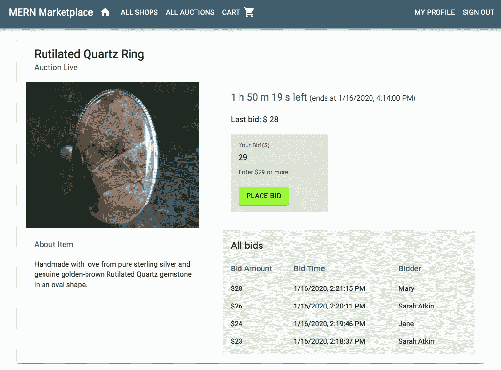
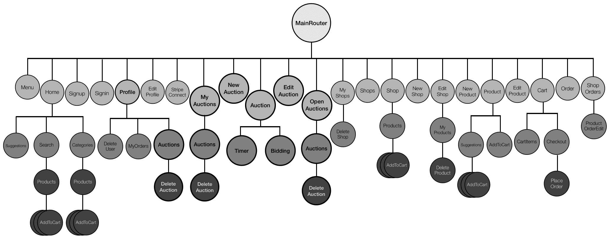
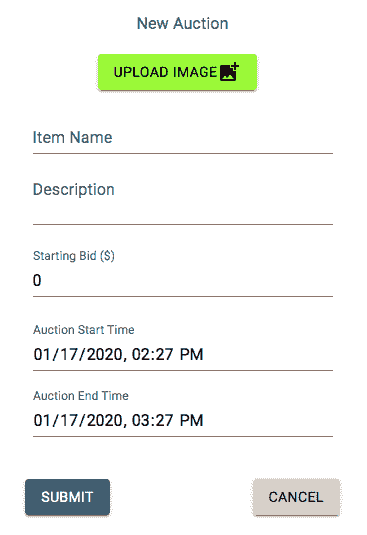
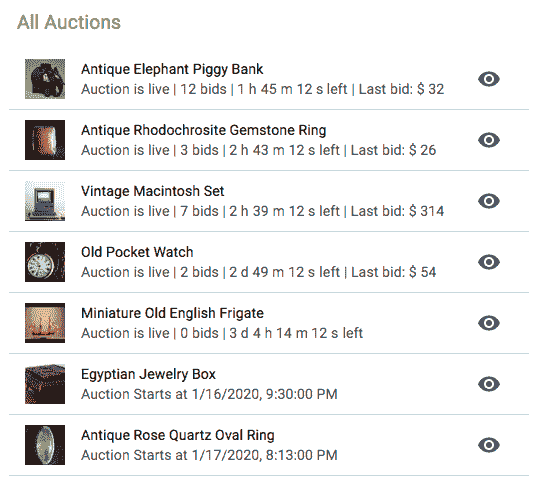
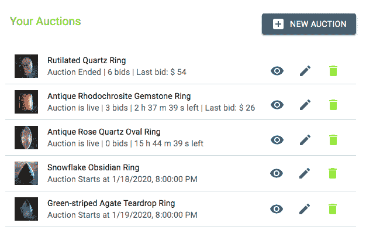
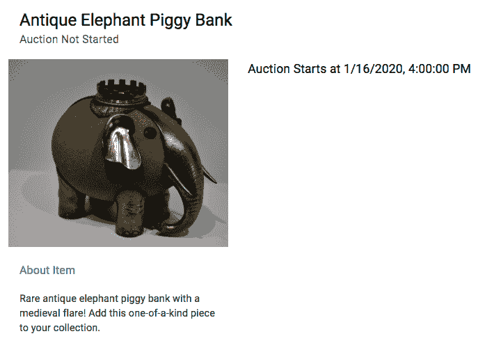
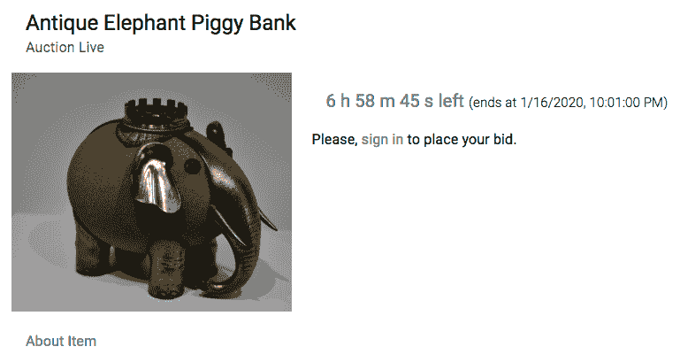
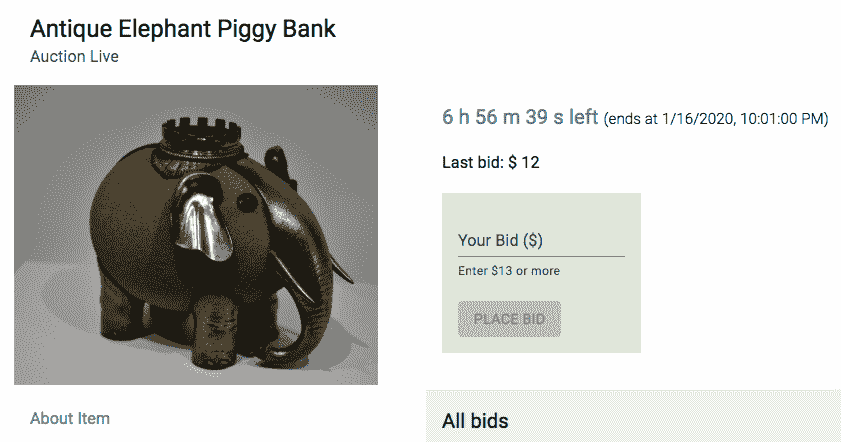
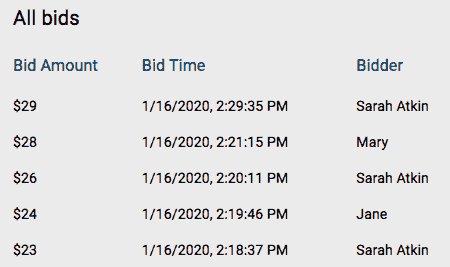

# 第十二章：向市场添加实时竞价功能

在比以往任何时候都更加紧密联系的世界中，即时通信和实时更新是任何允许用户之间互动的应用程序所期望的行为。向您的应用程序添加实时功能可以使您的用户保持参与，因此他们将在您的平台上花费更多时间。在本章中，我们将学习如何使用 MERN 堆栈技术以及 Socket.IO，轻松地将实时行为集成到全栈应用程序中。我们将通过在我们在第七章“使用在线市场锻炼 MERN 技能”和第八章“扩展市场以支持订单和支付”中开发的 MERN 市场应用程序中集成具有实时竞价功能的拍卖功能来实现这一点。在完成此拍卖和竞价功能的实现后，您将了解如何在 MERN 堆栈应用程序中利用套接字添加您选择的实时功能。

在本章中，我们将通过以下主题扩展在线市场应用程序：

+   在 MERN 市场中引入实时竞价

+   向市场添加拍卖

+   显示拍卖视图

+   使用 Socket.IO 实现实时竞价

# 在 MERN 市场中引入实时竞价

MERN 市场应用程序已经允许其用户成为卖家并维护有产品可供普通用户购买商店。在本章中，我们将扩展这些功能，允许卖家为其他用户创建在固定时间内可以出价的拍卖物品。拍卖视图将描述待售物品，并允许已登录用户在拍卖进行时进行出价。不同的用户可以放置自己的出价，并实时看到其他用户出价，视图将相应更新。完成的拍卖视图，其中拍卖处于活动状态，将呈现如下：



完整的 MERN 市场应用代码可在 GitHub 上找到，网址为 [`github.com/PacktPublishing/Full-Stack-React-Projects-Second-Edition/tree/master/Chapter09/mern-marketplace-bidding`](https://github.com/PacktPublishing/Full-Stack-React-Projects-Second-Edition/tree/master/Chapter09/mern-marketplace-bidding)。本章中讨论的实现可以在存储库的 *bidding* 分支中访问。您可以克隆此代码，并在阅读本章其余部分的代码解释时运行应用程序。

以下组件树图显示了构成整个 MERN 市场前端的所有自定义组件，包括将在本章其余部分实现拍卖和竞价相关功能的组件：



本章将讨论的功能将修改一些现有组件，例如`Profile`和`Menu`，并添加新组件，例如`NewAuction`、`MyAuctions`、`Auction`和`Bidding`。在下一节中，我们将通过集成将拍卖添加到平台的功能来扩展这个在线市场。

# 将拍卖添加到市场

在 MERN 市场，我们将允许已登录并拥有活跃卖家账户的用户为其他用户想要下注的物品创建拍卖。为了启用添加和管理拍卖的功能，我们需要定义如何存储拍卖详情并实现全栈切片，使用户能够在平台上创建、访问和更新拍卖。在以下章节中，我们将为应用程序构建这个拍卖模块。首先，我们将使用 Mongoose 模式定义拍卖模型，以存储每个拍卖的详情。然后，我们将讨论后端 API 和前端视图的实现，这些是实现创建新拍卖、列出由同一卖家创建并由同一用户下注的正在进行的拍卖以及通过编辑详情或从应用程序中删除拍卖来修改现有拍卖所需的。 

# 定义拍卖模型

我们将实现一个 Mongoose 模型，该模型将定义一个用于存储每个拍卖详情的拍卖模型。此模型将在`server/models/auction.model.js`中定义，其实现将与我们在前几章中介绍的其他 Mongoose 模型实现类似，例如我们在第七章中定义的 Shop 模型，*使用在线市场锻炼 MERN 技能*。此模型中的 Auction 模式将包含存储拍卖详情的字段，例如拍卖物品的名称和描述、图片以及创建此拍卖的卖家引用。它还将包含指定此拍卖下注开始和结束时间的字段、下注的起始值以及为此拍卖已放置的下注列表。定义这些拍卖字段的代码如下：

+   **物品名称和描述**：拍卖物品名称和描述字段将是字符串类型，其中`itemName`为必填字段：

```js
itemName: {
    type: String,
    trim: true,
    required: 'Item name is required'
},
description: {
    type: String,
    trim: true
},
```

+   **项目图片**：`image`字段将存储代表拍卖物品的图片文件，以便用户可以上传并作为数据存储在 MongoDB 数据库中：

```js
image: { 
    data: Buffer, 
    contentType: String 
},
```

+   **卖家**：`seller`字段将引用创建拍卖的用户：

```js
seller: {
    type: mongoose.Schema.ObjectId, 
    ref: 'User'
},
```

+   **创建和更新时间**：`created`和`updated`字段将是`Date`类型，其中`created`在添加新拍卖时生成，而`updated`在修改任何拍卖详情时更改：

```js
updated: Date,
created: { 
    type: Date, 
    default: Date.now 
},
```

+   **拍卖开始时间**：`bidStart`字段将是一个`Date`类型，用于指定拍卖何时开始，以便用户可以开始下注：

```js
bidStart: {
    type: Date,
    default: Date.now
},
```

+   **出价结束时间**：`bidEnd`字段将是一个`Date`类型，用于指定拍卖何时结束，之后用户将无法对此拍卖进行出价：

```js
bidEnd: {
   type: Date,
   required: "Auction end time is required"
},
```

+   **起始出价**：`startingBid`字段将存储`Number`类型的值，并指定此次拍卖的起始价格：

```js
startingBid: { 
    type: Number, 
    default: 0 
},
```

+   **出价列表**：`bids`字段将是一个包含对拍卖所出每个出价详情的数组。当我们将出价存储在这个数组中时，我们将最新的出价推送到数组的开头。每个出价将包含放置出价的用户的引用、用户提供的出价金额以及出价放置的时间戳：

```js
bids: [{
    bidder: {type: mongoose.Schema.ObjectId, ref: 'User'},
    bid: Number,
    time: Date
}]
```

这些与拍卖相关的字段将使我们能够为 MERN Marketplace 应用程序实现拍卖和竞标相关功能。在下一节中，我们将通过实现全栈切片来开始开发这些功能，这将允许卖家创建新的拍卖。

# 创建新的拍卖

为了使卖家能够在平台上创建新的拍卖，我们需要集成一个全栈切片，允许用户在前端填写表单视图，然后将输入的详细信息保存到后端数据库中的新拍卖文档中。为了实现此功能，在接下来的章节中，我们将在后端添加创建拍卖 API，以及在前端获取此 API 的方法，以及一个创建新拍卖表单视图，该视图接受用户对拍卖字段的输入。

# 创建拍卖 API

为了实现允许我们在数据库中创建新拍卖的后端 API，我们将声明一个 POST 路由，如下面的代码所示。

`mern-marketplace/server/routes/auction.routes.js`:

```js

router.route('/api/auctions/by/:userId')
  .post(authCtrl.requireSignin, authCtrl.hasAuthorization, 
        userCtrl.isSeller, auctionCtrl.create)
```

向`/api/auctions/by/:userId`此路由发送 POST 请求将确保请求的用户已登录并且也已授权。换句话说，它是与路由参数中指定的`:userId`关联的同一用户。然后，在创建拍卖之前，将使用在用户控制器方法中定义的`isSeller`方法检查此给定用户是否为卖家。

为了处理`:userId`参数并从数据库中检索关联的用户，我们将利用用户控制器方法中的`userByID`方法。我们将在`auction.routes.js`中的`Auction`路由中添加以下内容，以便用户在`request`对象中作为`profile`可用。

`mern-marketplace/server/routes/auction.routes.js`:

```js
router.param('userId', userCtrl.userByID) 
```

包含拍卖路由的`auction.routes.js`文件将与`user.routes`文件非常相似。为了在 Express 应用程序中加载这些新的拍卖路由，我们需要在`express.js`中挂载拍卖路由，就像我们为认证和用户路由所做的那样。

`mern-marketplace/server/express.js`:

```js
app.use('/', auctionRoutes)
```

在卖家验证后调用的拍卖控制器中的`create`方法，使用`formidable`节点模块解析可能包含用户上传的物品图片的多部分请求。如果有文件，`formidable`将暂时将其存储在文件系统中，我们将使用`fs`模块读取它以检索文件类型和数据，以便我们可以将其存储在拍卖文档的`image`字段中。

`create`控制器方法将如下所示。

`mern-marketplace/server/controllers/auction.controller.js`:

```js
const create = (req, res) => {
  let form = new formidable.IncomingForm()
  form.keepExtensions = true
  form.parse(req, async (err, fields, files) => {
    if (err) {
      res.status(400).json({
        message: "Image could not be uploaded"
      })
    }
    let auction = new Auction(fields)
    auction.seller= req.profile
    if(files.image){
      auction.image.data = fs.readFileSync(files.image.path)
      auction.image.contentType = files.image.type
    }
    try {
      let result = await auction.save()
      res.status(200).json(result)
    }catch (err){
      return res.status(400).json({
        error: errorHandler.getErrorMessage(err)
      })
    }
  })
}
```

拍卖的物品图片文件由用户上传并存储在 MongoDB 中作为数据。然后，为了在视图中显示，它作为单独的 GET API 从数据库中检索出来，作为一个图片文件。这个 GET API 被设置为 Express 路由在`/api/auctions/image/:auctionId`，它从 MongoDB 获取图像数据并将其作为文件发送在响应中。文件上传、存储和检索的实现步骤在第五章“将骨架扩展成社交媒体应用”的*上传个人照片*部分中详细说明。

现在可以在前端使用这个创建拍卖 API 端点来发起 POST 请求。接下来，我们将在客户端添加一个 fetch 方法，从应用程序的客户端界面发起这个请求。

# 在视图中获取创建 API

在前端，为了向这个创建 API 发起请求，我们将在客户端设置一个`fetch`方法，向 API 路由发送 POST 请求，并在`body`中传递包含新拍卖详情的多部分表单数据。这个 fetch 方法将定义如下。

`mern-marketplace/client/auction/api-auction.js`:

```js
const create = (params, credentials, auction) => {
  return fetch('/api/auctions/by/'+ params.userId, {
      method: 'POST',
      headers: {
        'Accept': 'application/json',
        'Authorization': 'Bearer ' + credentials.t
      },
      body: auction
    })
    .then((response) => {
      return response.json()
    }).catch((err) => console.log(err))
}
```

从服务器接收到的响应将返回给调用这个 fetch 方法的组件。我们将使用这个方法在新拍卖表单视图中发送用户输入的拍卖详情到后端并在数据库中创建一个新的拍卖。在下一节中，我们将实现这个新的拍卖表单视图在 React 组件中。

# 新拍卖组件

市场应用中的卖家将通过表单视图输入新拍卖的详情并创建新的拍卖。我们将在这个`NewAuction`组件中渲染这个表单，允许卖家通过输入项目名称和描述、从本地文件系统上传图片文件、指定起始出价值以及为这个拍卖的起始和结束出价创建日期时间值来创建拍卖。

这个表单视图将渲染如下：



这个 `NewAuction` 组件的实现与其他我们之前讨论过的创建表单实现类似，例如来自第七章 [03fd3b4a-b7fd-4b42-ad7e-5bc34b5612b0.xhtml]，*使用在线市场锻炼 MERN 技能* 的 `NewShop` 组件实现。在这个表单组件中不同的字段是拍卖开始和结束时间的日期时间输入选项。为了添加这些字段，我们将使用 Material-UI 的 `TextField` 组件，并将 `type` 设置为 `datetime-local`，如下面的代码所示。

`mern-marketplace/client/auction/NewAuction.js`:

```js
<TextField
   label="Auction Start Time"
   type="datetime-local"
   defaultValue={defaultStartTime}
   onChange={handleChange('bidStart')}
/>
<TextField
   label="Auction End Time"
   type="datetime-local"
   defaultValue={defaultEndTime}
   onChange={handleChange('bidEnd')}
/>
```

我们还为这些字段分配了默认的日期时间值，格式与该输入组件期望的格式一致。我们将默认开始时间设置为当前日期时间，默认结束时间设置为当前日期时间后一小时，如下所示。

`mern-marketplace/client/auction/NewAuction.js`:

```js
const currentDate = new Date()
const defaultStartTime = getDateString(currentDate)
const defaultEndTime = getDateString(new Date(currentDate.setHours(currentDate.getHours()+1)))
```

类型为 `datetime-local` 的 `TextField` 以 `yyyy-mm-ddThh:mm` 的格式接受日期。因此，我们定义了一个 `getDateString` 方法，该方法接受一个 JavaScript 日期对象并相应地格式化它。`getDateString` 方法的实现如下。

`mern-marketplace/client/auction/NewAuction.js`:

```js
const getDateString = (date) => {
  let year = date.getFullYear()
  let day = date.getDate().toString().length === 1 ? '0' + date.getDate() : date.getDate()
  let month = date.getMonth().toString().length === 1 ? '0' + (date.getMonth()+1) : date.getMonth() + 1
  let hours = date.getHours().toString().length === 1 ? '0' + date.getHours() : date.getHours()
  let minutes = date.getMinutes().toString().length === 1 ? '0' + date.getMinutes() : date.getMinutes()
  let dateString = `${year}-${month}-${day}T${hours}:${minutes}`
  return dateString
}
```

为了确保用户正确地输入了日期，开始时间设置为早于结束时间的值，我们需要在将表单详情提交到后端之前添加一个检查。日期组合的验证可以通过以下代码确认。

`mern-marketplace/client/auction/NewAuction.js`:

```js
if(values.bidEnd < values.bidStart){
   setValues({...values, error: "Auction cannot end before it starts"})
}
```

如果发现日期组合无效，则用户将被告知，并且不会将表单数据发送到后端。

这个 `NewAuction` 组件只能由登录且也是卖家的用户查看。因此，我们将在 `MainRouter` 组件中添加一个 `PrivateRoute`。这将在这个 `MainRouter` 组件中为经过身份验证的用户渲染 `/auction/new` 的表单。

`mern-marketplace/client/MainRouter.js`:

```js
<PrivateRoute path="/auction/new" component={NewAuction}/>
```

这个链接可以添加到任何卖家可能访问的视图组件中，例如，在一个卖家在市场中管理他们的拍卖的视图中。现在，在市场中添加新的拍卖成为可能，在下一节中，我们将讨论如何从后端数据库中检索这些拍卖，以便它们可以在前端视图中列出。

# 列出拍卖

在 MERN 市场应用中，我们将向用户展示三个不同的拍卖列表。所有浏览平台的用户都将能够查看当前正在进行的拍卖，换句话说，即那些正在直播或将在未来某个日期开始的拍卖。卖家将能够查看他们创建的拍卖列表，而登录用户将能够查看他们投过标的拍卖列表。展示给所有用户的开放拍卖列表将如下渲染，提供每个拍卖的摘要，并有一个选项让用户可以在单独的视图中查看更多详细信息：



在以下章节中，为了实现这些不同的拍卖列表以便在应用程序中显示，我们将分别定义三个单独的后端 API 来检索开放拍卖、卖家拍卖和出价者拍卖。然后，我们将实现一个可重用的 React 组件，该组件将接受作为属性提供的任何拍卖列表并将其渲染到视图中。这将允许我们在使用相同组件的同时显示所有三个拍卖列表。

# 开放式拍卖 API

为了从数据库中检索开放拍卖的列表，我们将定义一个后端 API，该 API 接受 GET 请求并查询拍卖集合，以便在响应中返回找到的开放拍卖。为了实现这个开放拍卖 API，我们将声明一个路由，如下所示。

`mern-marketplace/server/routes/auction.routes.js:`

```js
router.route('/api/auctions')
  .get(auctionCtrl.listOpen)
```

当在`/api/auctions`路由上接收到 GET 请求时，将调用`listOpen`控制器方法，该方法将查询数据库中的拍卖集合，以便返回所有截至日期大于当前日期的拍卖。`listOpen`方法定义如下。

`mern-marketplace/server/controllers/auction.controller.js`: 

```js
const listOpen = async (req, res) => {
  try {
    let auctions = await Auction.find({ bidEnd: { $gt: new Date() }})
                                .sort('bidStart')
                                .populate('seller', '_id name')
                                .populate('bids.bidder', '_id name')
    res.json(auctions)
  } catch (err){
    return res.status(400).json({
      error: errorHandler.getErrorMessage(err)
    })
  }
}
```

由`listOpen`方法查询返回的拍卖将按起始日期排序，较早开始的拍卖将首先显示。这些拍卖还将包含卖家的 ID 和名称详情以及每个出价者的详情。结果拍卖数组将发送回请求客户端的响应。

为了在前端获取此 API，我们将在`api-auction.js`中添加相应的`listOpen`方法，类似于其他 API 实现。此获取方法将用于在前端组件中显示开放拍卖给用户。接下来，我们将实现另一个 API 来列出特定用户参与的所有拍卖。

# 按出价者拍卖 API

为了能够显示给定用户参与的所有拍卖，我们将定义一个后端 API，该 API 接受 GET 请求并查询拍卖集合，以便在响应中返回相关的拍卖。为了实现按出价者拍卖 API，我们将声明一个路由，如下所示。

`mern-marketplace/server/routes/auction.routes.js`

```js
router.route('/api/auctions/bid/:userId')
  .get(auctionCtrl.listByBidder)
```

当在`/api/auctions/bid/:userId`路由上接收到 GET 请求时，将调用`listByBidder`控制器方法，该方法将查询数据库中的拍卖集合，以便返回所有包含与路由中指定的`userId`参数匹配的出价者的出价的拍卖。`listByBidder`方法定义如下。

`mern-marketplace/server/controllers/auction.controller.js`:

```js
const listByBidder = async (req, res) => {
  try {
    let auctions = await Auction.find({'bids.bidder': req.profile._id})
                                .populate('seller', '_id name')
                                .populate('bids.bidder', '_id name')
    res.json(auctions)
  } catch (err){
    return res.status(400).json({
      error: errorHandler.getErrorMessage(err)
    })
  }
}
```

此方法将向请求客户端返回结果拍卖，并且每个拍卖还将包含卖家和每个竞标者的 ID 和名称详情。为了在前端获取此 API，我们将在`api-auction.js`中添加相应的`listByBidder`方法，类似于其他 API 实现。此获取方法将用于显示与特定竞标者相关的拍卖的前端组件。接下来，我们将实现一个 API，该 API 将列出特定卖家在市场上创建的所有拍卖。

# 卖家拍卖 API

市场中的卖家将看到他们创建的拍卖列表。为了从数据库中检索这些拍卖，我们将定义一个后端 API，该 API 接受 GET 请求并查询拍卖集合，以便返回特定卖家的拍卖。为了实现此卖家拍卖 API，我们将声明一个路由，如下所示。

`mern-marketplace/server/routes/auction.routes.js`:

```js
router.route('/api/auctions/by/:userId')
  .get(authCtrl.requireSignin, authCtrl.hasAuthorization, 
       auctionCtrl.listBySeller)
```

当在`/api/auctions/by/:userId`路由接收到 GET 请求时，将调用`listBySeller`控制器方法，该方法将查询数据库中的拍卖集合，以便返回所有与通过路由中`userId`参数指定的用户匹配的卖家拍卖。`listBySeller`方法定义如下。

`mern-marketplace/server/controllers/auction.controller.js`:

```js
const listBySeller = async (req, res) => {
  try {
    let auctions = await Auction.find({seller: req.profile._id})
                                .populate('seller', '_id name')
                                .populate('bids.bidder', '_id name')
    res.json(auctions)
  } catch (err){
    return res.status(400).json({
      error: errorHandler.getErrorMessage(err)
    })
  }
}
```

此方法将向请求客户端返回指定卖家的拍卖，并且每个拍卖还将包含卖家和每个竞标者的 ID 和名称详情。

为了在前端获取此 API，我们将在`api-auction.js`中添加相应的`listBySeller`方法，类似于其他 API 实现。此获取方法将用于显示与特定卖家相关的拍卖的前端组件。在下一节中，我们将查看拍卖组件的实现，该组件将接受任何这些拍卖列表并将其显示给最终用户。

# 拍卖组件

应用程序中的不同拍卖列表将通过一个 React 组件渲染，该组件接受拍卖对象数组作为属性。我们将实现这个可重用的`Auctions`组件，并将其添加到将检索和显示开放拍卖、竞标者拍卖或卖家拍卖的视图中。使用`Auctions`组件检索和渲染特定卖家创建的拍卖列表的视图将如下所示：



`Auctions`组件将遍历作为属性接收的拍卖数组，并在 Material-UI `ListItem`组件中显示每个拍卖，如下面的代码所示。

`mern-marketplace/client/auction/Auctions.js`:

```js
export default function Auctions(props){
    return (
     <List dense>
        {props.auctions.map((auction, i) => {
            return <span key={i}>
              <ListItem button>
                <ListItemAvatar>
                  <Avatar src={'/api/auctions/image/'+auction._id+"?" 
                                        + new Date().getTime()}/>
                </ListItemAvatar>
                <ListItemText primary={auction.itemName} 
                  secondary={auctionState(auction}/>
                <ListItemSecondaryAction>
                    <Link to={"/auction/" + auction._id}>
                      <IconButton aria-label="View" color="primary">
                        <ViewIcon/>
                      </IconButton>
                    </Link>
                </ListItemSecondaryAction>
              </ListItem>
              <Divider/>
            </span>})}
        </List>
    )
}
```

对于每个拍卖项目，除了显示一些基本拍卖详情外，我们还为用户提供了一个选项，可以在单独的链接中打开每个拍卖。我们还条件性地渲染了诸如拍卖何时开始、竞标是否已经开始或结束、剩余时间有多少以及最新的出价是多少等详情。每个拍卖状态的这些详情是通过以下代码确定和渲染的。

`mern-marketplace/client/auction/Auctions.js`:

```js
const currentDate = new Date()  
const auctionState = (auction)=>{
    return ( <span>
      {currentDate < new Date(auction.bidStart) && 
        `Auction Starts at ${new Date(auction.bidStart).toLocaleString()}`}
      {currentDate > new Date(auction.bidStart) && 
        currentDate < new Date(auction.bidEnd) && <> 
            {`Auction is live | ${auction.bids.length} bids |`} 
            {showTimeLeft(new Date(auction.bidEnd))}
          </>}
      {currentDate > new Date(auction.bidEnd) && 
            `Auction Ended | ${auction.bids.length} bids `} 
      {currentDate > new Date(auction.bidStart) && auction.bids.length> 0 && ` 
        | Last bid: $ ${auction.bids[0].bid}`}
      </span>
    )
}
```

为了计算和渲染已开始的拍卖的剩余时间，我们定义了一个`showTimeLeft`方法，它接受结束日期作为参数，并使用`calculateTimeLeft`方法来构建在视图中渲染的时间字符串。`showTimeLeft`方法定义如下。

`mern-marketplace/client/auction/Auctions.js`:

```js
const showTimeLeft = (date) => {
    let timeLeft = calculateTimeLeft(date)
    return !timeLeft.timeEnd && <span>
      {timeLeft.days != 0 && `${timeLeft.days} d `} 
      {timeLeft.hours != 0 && `${timeLeft.hours} h `} 
      {timeLeft.minutes != 0 && `${timeLeft.minutes} m `} 
      {timeLeft.seconds != 0 && `${timeLeft.seconds} s`} left
    </span>
}
```

此方法使用`calculateTimeLeft`方法来确定剩余时间的日、时、分、秒的分解。

`calculateTimeLeft`方法接受结束日期并与当前日期进行比较，以计算差异并创建一个`timeLeft`对象，该对象记录剩余的天数、小时、分钟和秒，以及一个`timeEnd`状态。如果时间已结束，则将`timeEnd`状态设置为 true。`calculateTimeLeft`方法定义如下。

`mern-marketplace/client/auction/Auctions.js`:

```js
const calculateTimeLeft = (date) => {
  const difference = date - new Date()
  let timeLeft = {}

  if (difference > 0) {
    timeLeft = {
      days: Math.floor(difference / (1000 * 60 * 60 * 24)),
      hours: Math.floor((difference / (1000 * 60 * 60)) % 24),
      minutes: Math.floor((difference / 1000 / 60) % 60),
      seconds: Math.floor((difference / 1000) % 60),
      timeEnd: false
    }
  } else {
      timeLeft = {timeEnd: true}
  }
  return timeLeft
}
```

此`Auctions`组件渲染了包含每个拍卖的详情和状态的列表，可以添加到其他视图中，以显示不同的拍卖列表。如果当前查看拍卖列表的用户恰好是列表中某个拍卖的卖家，我们还想为此用户渲染编辑或删除拍卖的选项。在下一节中，我们将学习如何将这些选项整合到从市场编辑或删除拍卖中。

# 编辑和删除拍卖

市场中的卖家将能够通过编辑或删除他们创建的拍卖来管理他们的拍卖。编辑和删除功能的实现需要构建后端 API，这些 API 将保存对数据库的更改并从集合中删除一个拍卖。这些 API 将在前端视图中使用，以允许用户使用表单编辑拍卖详情，并通过按钮点击来启动删除操作。在接下来的章节中，我们将学习如何有条件地将这些选项添加到拍卖列表中，并讨论全栈实现以完成这些编辑和删除功能。

# 更新列表视图

我们将更新拍卖列表视图的代码，以有条件地显示编辑和删除选项给卖家。在`Auctions`组件中，该组件迭代列表以渲染`ListItem`中的每个项目，我们将在`ListItemSecondaryAction`组件中添加两个额外的选项，如下面的代码所示。

`mern-marketplace/client/auction/Auctions.js`:

```js
<ListItemSecondaryAction>
    <Link to={"/auction/" + auction._id}>
       <IconButton aria-label="View" color="primary">
          <ViewIcon/>
       </IconButton>
    </Link>
 { auth.isAuthenticated().user && 
         auth.isAuthenticated().user._id == auction.seller._id &&
 (<>
 <Link to={"/auction/edit/" + auction._id}>
 <IconButton aria-label="Edit" color="primary">
 <Edit/>
 </IconButton>
 </Link>}
 <DeleteAuction auction={auction} onRemove={props.removeAuction}/>
 </>)
 }
</ListItemSecondaryAction>
```

如果当前登录用户的 ID 与拍卖卖家的 ID 匹配，则条件性地渲染编辑视图链接和删除组件。编辑视图组件和删除组件的实现与我们在第七章中讨论的 `EditShop` 组件和 `DeleteShop` 组件类似，即使用在线市场锻炼 MERN 技能。这些相同的组件将调用后端 API 来完成编辑和删除操作。我们将在下一节中查看所需的 API。

# 编辑和删除拍卖 API

为了完成前端发起的编辑拍卖和删除拍卖操作，我们需要在后端有相应的 API。这些 API 端点的路由，将接受更新和删除请求，可以声明如下。

`mern-marketplace/server/routes/auction.routes.js`: 

```js
router.route('/api/auctions/:auctionId')
  .put(authCtrl.requireSignin, auctionCtrl.isSeller, auctionCtrl.update)
  .delete(authCtrl.requireSignin, auctionCtrl.isSeller, auctionCtrl.remove)
router.param('auctionId', auctionCtrl.auctionByID)
```

`/api/auctions/:auctionId` 路由 URL 中的 `:auctionId` 参数将调用 `auctionByID` 控制器方法，该方法与 `userByID` 控制器方法类似。它从数据库中检索拍卖并将其附加到请求对象中，以便在 `next` 方法中使用。`auctionByID` 方法定义如下。

`mern-marketplace/server/controllers/auction.controller.js`:

```js
const auctionByID = async (req, res, next, id) => {
  try {
    let auction = await Auction.findById(id)
                               .populate('seller', '_id name')
                               .populate('bids.bidder', '_id name').exec()
    if (!auction)
      return res.status('400').json({
        error: "Auction not found"
      })
    req.auction = auction
    next()
  } catch (err) {
    return res.status('400').json({
      error: "Could not retrieve auction"
    })
  }
}
```

从数据库检索的拍卖对象还将包含卖家和竞标者的名称和 ID 详细信息，正如我们在 `populate()` 方法中指定的。对于这些 API 端点，使用 `auction` 对象来验证当前登录用户是否是创建此特定拍卖的卖家，通过调用在拍卖控制器中定义的 `isSeller` 方法。

`mern-marketplace/server/controllers/auction.controller.js`:

```js
const isSeller = (req, res, next) => {
  const isSeller = req.auction && req.auth && req.auction.seller._id == req.auth._id
  if(!isSeller){
    return res.status('403').json({
      error: "User is not authorized"
    })
  }
  next()
}
```

一旦卖家被验证，`next` 方法将被调用以更新或删除拍卖，具体取决于是否收到了 PUT 或 DELETE 请求。更新和删除拍卖的控制器方法与我们在第七章中讨论的编辑商店 API 和删除商店 API 的先前实现类似，即使用在线市场锻炼 MERN 技能。这些相同的组件将调用后端 API 来完成编辑和删除操作。我们将在下一节中查看所需的 API。

我们已经准备好了市场使用的拍卖模块，包括用于存储拍卖和竞标数据的拍卖模型，以及用于创建新拍卖、显示不同拍卖列表和修改现有拍卖的后端 API 和前端视图。在下一节中，我们将进一步扩展此模块并实现单个拍卖的视图，用户不仅可以了解更多关于拍卖的信息，还可以看到实时的竞标更新。

# 显示拍卖视图

显示单个拍卖的视图将包含市场实时拍卖和竞标功能的核心功能。在进入实时竞标的实现之前，我们将设置一个全栈切片来检索单个拍卖的详细信息，并在一个将包含拍卖显示、计时器和竞标功能的 React 组件中显示这些详细信息。在接下来的章节中，我们将首先讨论用于获取单个拍卖的后端 API。然后，我们将查看 Auction 组件的实现，该组件将使用此 API 检索并显示拍卖详情以及拍卖的状态。为了给用户提供拍卖状态的实时更新，我们还将在此视图中实现一个计时器，以指示距离现场拍卖结束的时间。

# 读取拍卖 API

要在单独的视图中显示现有拍卖的详细信息，我们需要添加一个后端 API，该 API 将接收来自客户端的拍卖请求并返回其详细信息。因此，我们将在后端实现一个读取拍卖 API，该 API 将接受一个带有指定拍卖 ID 的 GET 请求，并从数据库中的`Auction`集合返回相应的拍卖文档。我们将通过声明以下代码中的 GET 路由来开始添加此 API 端点。

`mern-marketplace/server/routes/auction.routes.js`:

```js
router.route('/api/auction/:auctionId')
  .get(auctionCtrl.read)
```

路由 URL 中的`:auctionId`参数在接收到此路由的 GET 请求时调用`auctionByID`控制器方法。`auctionByID`控制器方法从数据库中检索拍卖并将其附加到请求对象，以便在`read`控制器方法中访问，该方法随后被调用。返回此拍卖对象以响应客户端的`read`控制器方法定义如下。

`mern-marketplace/server/controllers/auction.controller.js`:

```js
const read = (req, res) => {
  req.auction.image = undefined
  return res.json(req.auction)
}
```

在发送响应之前，我们将移除图像字段，因为图像将通过单独的路由作为文件检索。有了这个后端 API 就绪，我们现在可以在前端通过在`api-auction.js`中添加一个 fetch 方法来添加调用它的实现，类似于我们讨论的其他用于完成 API 实现的 fetch 方法。我们将使用 fetch 方法在 React 组件中调用读取拍卖 API，该组件将渲染检索到的拍卖详情。该 React 组件的实现将在下一节中讨论。

# 拍卖组件

我们将实现一个 Auction 组件来从后端获取并显示单个拍卖的详细信息给最终用户。此视图还将具有基于拍卖当前状态和查看页面的用户是否已登录的实时更新功能。例如，以下截图显示了当给定拍卖尚未开始时，Auction 组件如何渲染给访客。它仅显示拍卖的描述详情并指定拍卖开始的时间：



`Auction` 组件的实现将通过调用 `useEffect` 钩子中的读取拍卖 API 来检索拍卖详情。这部分组件实现与我们在第七章 使用在线市场锻炼 MERN 技能中讨论的 `Shop` 组件类似。

完成的 `Auction` 组件将通过浏览器中的 `/auction/:auctionId` 路由访问，该路由在 `MainRouter` 中定义如下。

`mern-marketplace/client/MainRouter.js`:

```js
<Route path="/auction/:auctionId" component={Auction}/>
```

此路由可以用于任何组件来链接到特定的拍卖，就像我们在拍卖列表中所做的那样。此链接将用户带到带有加载的拍卖详情的相应拍卖视图。

在组件视图中，我们将通过考虑当前日期和给定拍卖的竞标开始和结束时间来渲染拍卖状态。可以添加以下代码来生成这些状态，这些状态将在视图中显示。

`mern-marketplace/client/auction/Auction.js`:

```js
const currentDate = new Date()
...
<span>
    {currentDate < new Date(auction.bidStart) && 'Auction Not Started'}
    {currentDate > new Date(auction.bidStart) && currentDate < new Date(auction.bidEnd) && 'Auction Live'}
    {currentDate > new Date(auction.bidEnd) && 'Auction Ended'}
</span>
```

在前面的代码中，如果当前日期早于 `bidStart` 日期，我们将显示一条消息，表明拍卖尚未开始。如果当前日期在 `bidStart` 和 `bidEnd` 日期之间，则拍卖正在进行。如果当前日期晚于 `bidEnd` 日期，则拍卖已结束。

`Auction` 组件还将根据当前用户是否已登录以及拍卖当前状态，有条件地渲染计时器和竞标部分。渲染这部分视图的代码如下。

`mern-marketplace/client/auction/Auction.js`:

```js
<Grid item xs={7} sm={7}>
    {currentDate > new Date(auction.bidStart) 
    ? (<>
        <Timer endTime={auction.bidEnd} update={update}/> 
        { auction.bids.length > 0 && 
            <Typography component="p" variant="subtitle1">
                {` Last bid: $ ${auction.bids[0].bid}`}
            </Typography>
        }
        { !auth.isAuthenticated() && 
            <Typography>
                Please, <Link to='/signin'>
                    sign in</Link> to place your  bid.
            </Typography> 
        }
        { auth.isAuthenticated() && 
            <Bidding auction={auction} justEnded=
                 {justEnded} updateBids={updateBids}/> 
        }
      </>)
    : <Typography component="p" variant="h6"> 
        {`Auction Starts at ${new Date(auction.bidStart).toLocaleString()}`}
      </Typography>
    }
</Grid>
```

如果当前日期恰好晚于竞标开始时间，我们将显示计时器组件来显示竞标结束前剩余的时间。然后，我们显示最后出价金额，如果已经放置了一些出价，这将是在拍卖 `bids` 数组中的第一个项目。如果当前用户在拍卖处于此状态时已登录，我们还将渲染一个 `Bidding` 组件，允许他们出价并查看竞标历史。在下一节中，我们将学习如何实现我们在此视图中添加的计时器组件，以显示拍卖剩余时间。

# 添加计时器组件

当拍卖正在进行时，我们将向用户提供关于他们在此特定拍卖中竞标结束前剩余时间的实时更新。我们将实现一个 `Timer` 组件，并在 `Auction` 组件中有条件地渲染它以实现此功能。计时器将倒计时秒数，并显示观看直播拍卖的用户剩余时间。以下截图显示了当 `Auction` 组件向尚未登录的用户渲染直播拍卖时的外观：



当用户查看实时拍卖时，剩余时间每秒减少。我们将在 `Timer` 组件中实现这个倒计时功能，该组件被添加到 `Auction` 组件中。`Auction` 组件提供包含拍卖结束时间值的 props，以及一个在时间结束时更新拍卖视图的函数，如下面的代码所示。

`mern-marketplace/client/auction/Auction.js`:

```js
<Timer endTime={auction.bidEnd} update={update}/> 
```

传递给 `Timer` 组件的 `update` 函数将帮助将 `justEnded` 变量的值从 `false` 设置为 `true`。这个 `justEnded` 值传递给 `Bidding` 组件，以便在时间结束时禁用下注选项。`justEnded` 值的初始化和 `update` 函数的定义如下。

`mern-marketplace/client/auction/Auction.js`:

```js
const [justEnded, setJustEnded] = useState(false)
const updateBids = () => {
    setJustEnded(true)
}
```

这些 props 将在 `Timer` 组件中使用，以计算剩余时间并在时间结束时更新视图。

在 `Timer` 组件定义中，我们将使用从 `Auction` 组件传入的 props 中的结束时间值初始化 `timeLeft` 变量，如下面的代码所示。

`mern-marketplace/client/auction/Timer.js`:

```js
export default function Timer (props) {
    const [timeLeft, setTimeLeft] = useState(calculateTimeLeft(new Date(props.endTime)))
    ...
}
```

为了计算距离拍卖结束的剩余时间，我们利用本章 *拍卖组件* 部分中讨论过的 `calculateTimeLeft` 方法。

为了实现倒计时功能，我们将在 `Timer` 组件的 `useEffect` 钩子中使用 `setTimeout`，如下面的代码所示。

`mern-marketplace/client/auction/Timer.js`:

```js
useEffect(() => {
     let timer = null
     if(!timeLeft.timeEnd){
         timer = setTimeout(() => {
                     setTimeLeft(calculateTimeLeft(new Date(props.endTime)))
                 }, 1000)
     }else{
         props.update()
     }
     return () => {
         clearTimeout(timer)
    }
})
```

如果时间还没有结束，我们将使用 `setTimeout` 在 1 秒后更新 `timeLeft` 值。这个 `useEffect` 钩子将在每次由 `setTimeLeft` 状态更新引起的渲染后运行。

因此，`timeLeft` 值将每秒更新，直到 `timeEnd` 值变为 `true`。当 `timeEnd` 值确实变为 `true`，即时间到了，我们将执行从 `Auctions` 组件传入的 `update` 函数。

为了避免内存泄漏并在 `useEffect` 钩子中进行清理，我们将使用 `clearTimeout` 停止任何挂起的 `setTimeout` 调用。为了显示这个更新的 `timeLeft` 值，我们只需在视图中渲染它，如下面的代码所示。

`mern-marketplace/client/auction/Timer.js`:

```js
    return (<div className={props.style}>
        {!timeLeft.timeEnd ? 
            <Typography component="p" variant="h6" >
              {timeLeft.days != 0 && `${timeLeft.days} d `} 
              {timeLeft.hours != 0 && `${timeLeft.hours} h `} 
              {timeLeft.minutes != 0 && `${timeLeft.minutes} m `} 
              {timeLeft.seconds != 0 && `${timeLeft.seconds} s`} left 
              <span style={{fontSize:'0.8em'}}>
                {`(ends at ${new Date(props.endTime).toLocaleString()})`}
              </span>
            </Typography> : 
            <Typography component="p" variant="h6">Auction ended</Typography>
        }
        </div>
    )
```

如果还有时间剩余，我们将使用 `timeLeft` 对象渲染距离拍卖结束的剩余天数、小时、分钟和秒。我们还会指出拍卖结束的确切日期和时间。如果时间到了，我们只需指出拍卖已经结束。

在我们迄今为止实现的`Auction`组件中，我们能够从后端获取拍卖详情并将其与拍卖状态一起渲染。如果一个拍卖处于直播状态，我们能够显示剩余时间直到结束。当拍卖处于这种直播状态时，用户也将能够对拍卖进行出价，并实时看到其他用户在平台上的出价。在下一节中，我们将讨论如何使用 Socket.IO 集成平台所有直播拍卖的实时竞标功能。

# 使用 Socket.IO 实现实时竞标

已登录市场平台的用户将能够参与直播拍卖。他们可以在同一视图中进行出价并获得实时更新，同时看到平台上的其他用户正在对他们的出价进行回应。为了实现这一功能，我们将在实现前端界面以允许用户出价并查看变化的出价历史之前，将 Socket.IO 集成到我们的全栈 MERN 应用中。

# 集成 Socket.IO

Socket.IO 将允许我们在市场应用中添加实时竞标功能。Socket.IO 是一个 JavaScript 库，包含一个在浏览器中运行的客户端模块和一个与 Node.js 集成的服务器端模块。将这些模块集成到我们的 MERN 应用中，将使客户端和服务器之间实现双向和实时通信。

Socket.IO 的客户端部分作为 Node 模块`socket.io-client`提供，而服务器端部分作为 Node 模块`socket.io`提供。您可以在[`socket.io`](https://socket.io)了解更多关于 Socket.IO 的信息，并尝试他们的入门教程。

在我们可以在代码中使用`socket.io`之前，我们将通过在命令行中运行以下命令使用 Yarn 安装客户端和服务器库：

```js
yarn add socket.io socket.io-client
```

将 Socket.IO 库添加到项目后，我们将更新我们的后端以将 Socket.IO 集成到服务器代码中。我们需要使用与我们的应用程序相同的 HTTP 服务器初始化一个新的`socket.io`实例。

在我们的后端代码中，我们使用 Express 启动服务器。因此，我们将更新`server.js`中的代码以获取我们的 Express 应用使用的 HTTP 服务器引用，如下面的代码所示。

`mern-marketplace/server/server.js`:

```js
import bidding from './controllers/bidding.controller'

const server = app.listen(config.port, (err) => {
  if (err) {
    console.log(err)
  }
  console.info('Server started on port %s.', config.port)
})

bidding(server)
```

然后，我们将把这个服务器的引用传递给一个竞标控制器函数。这个`bidding.controller`函数将包含在服务器端实现实时功能所需的 Socket.IO 代码。`bidding.controller`函数将初始化`socket.io`，然后监听`connection`事件以接收来自客户端的 socket 消息，如下面的代码所示。

`mern-marketplace/server/controllers/bidding.controller.js`:

```js
export default (server) => {
    const io = require('socket.io').listen(server)
    io.on('connection', function(socket){
        socket.on('join auction room', data => {
            socket.join(data.room);
        })
        socket.on('leave auction room', data => {
            socket.leave(data.room)
        })
    })
}
```

当新的客户端首次连接然后断开套接字连接时，我们将订阅和取消订阅客户端套接字到一个给定的频道。该频道将由客户端通过`data.room`属性传递的拍卖 ID 来识别。这样，我们将为每个拍卖有一个不同的频道或房间。

使用此代码，后端已准备好接收客户端通过套接字发送的通信，我们现在可以将 Socket.IO 集成到我们的前端。在前端，只有拍卖视图——特别是投标部分——将使用套接字进行实时通信。因此，我们只将在前端添加到拍卖组件的`Bidding`组件中集成 Socket.IO，如下面的代码所示。

`mern-marketplace/client/auction/Auction.js`:

```js
<Bidding auction={auction} justEnded={justEnded} updateBids={updateBids}/>
```

投标组件从拍卖组件接收`auction`对象、`justEnded`值和`updateBids`函数作为属性，并在投标过程中使用这些属性。为了开始实现投标组件，我们将使用 Socket.IO 客户端库集成套接字，如下面的代码所示。

`mern-marketplace/client/auction/Bidding.js`:

```js
const io = require('socket.io-client')
const socket = io() 

export default function Bidding (props) {
    useEffect(() => {
        socket.emit('join auction room', {room: props.auction._id})
        return () => {
            socket.emit('leave auction room', {
                room: props.auction._id
            })
        }
    }, [])
    ...
}
```

在前面的代码中，我们引入了`socket.io-client`库并初始化了`socket`为此客户端。然后，在我们的`Bidding`组件定义中，我们使用`useEffect`钩子和初始化的`socket`在组件挂载和卸载时分别发出*auction room joining*和*auction room leaving*套接字事件。我们通过这些发出的套接字事件传递当前拍卖的 ID 作为`data.room`值。

这些事件将由服务器套接字连接接收，导致客户端订阅或取消订阅给定的拍卖房间。现在，客户端和服务器能够通过套接字进行实时通信，在下一节中，我们将学习如何使用这种能力让用户对拍卖进行即时投标。

# 放置投标

当平台上的用户登录并查看当前正在进行的拍卖时，他们将看到一个选项来放置自己的投标。此选项将在`Bidding`组件中渲染，如下面的截图所示：



为了允许用户放置他们的投标，在接下来的章节中，我们将添加一个表单，让他们输入一个高于上一个投标的值，并通过套接字通信将其提交到服务器。然后，在服务器上，我们将处理通过套接字发送的新投标，以便将更改后的拍卖投标保存到数据库中，并在服务器接受此投标时立即更新所有连接用户的视图。

# 添加投标表单

我们将在上一节开始构建的`Bidding`组件中添加一个用于拍卖竞标的表单。在我们向视图中添加表单元素之前，我们将初始化状态中的`bid`值，为表单输入添加一个变更处理函数，并跟踪允许的最小竞标金额，如下面的代码所示。

`mern-marketplace/client/auction/Bidding.js`:

```js
const [bid, setBid] = useState('')

const handleChange = event => {
        setBid(event.target.value)
}
const minBid = props.auction.bids && props.auction.bids.length> 0 
                ? props.auction.bids[0].bid 
                : props.auction.startingBid
```

最小竞标金额是通过检查最新放置的竞标来确定的。如果有竞标被放置，最小竞标金额需要高于最新的竞标；否则，它需要高于拍卖卖家设定的起始竞标金额。

放置竞标的表单元素只有在当前日期早于拍卖结束日期时才会渲染。我们还检查`justEnded`值是否为`false`，以便当计时器倒计时到 0 时，表单可以实时隐藏。表单元素将包含一个输入字段，提示应输入的最小金额，以及一个提交按钮，除非输入了有效的竞标金额，否则该按钮将保持禁用状态。以下是将这些元素添加到`Bidding`组件视图中的方式。

`mern-marketplace/client/auction/Bidding.js`:

```js
{!props.justEnded && new Date() < new Date(props.auction.bidEnd) && <>
    <TextField label="Your Bid ($)" 
               value={bid} onChange={handleChange} 
               type="number" margin="normal"
               helperText={`Enter $${Number(minBid)+1} or more`}/><br/>
    <Button variant="contained" color="secondary" 
            disabled={bid < (minBid + 1)} 
            onClick={placeBid}>Place Bid
    </Button><br/>
</>}
```

当用户点击提交按钮时，将调用`placeBid`函数。在这个函数中，我们构建一个包含新竞标详情的竞标对象，包括竞标金额、竞标时间和竞标者的用户引用。这个新的竞标将通过为这个拍卖室已经建立的套接字通信发送到服务器，如下面的代码所示：

```js
const placeBid = () => {
    const jwt = auth.isAuthenticated()    
      let newBid = {
            bid: bid,
            time: new Date(),
            bidder: jwt.user
      }
      socket.emit('new bid', {
            room: props.auction._id,
            bidInfo: newBid
      })
      setBid('')
}
```

一旦消息通过套接字发送出去，我们将使用`setBid('')`清空输入字段。然后，我们需要更新后端中的竞标控制器以接收和处理从客户端发送的这条新的竞标消息。在下一节中，我们将添加套接字事件处理代码以完成放置竞标的整个过程。

# 服务器接收竞标

当用户通过套接字连接放置新的竞标并发出后，它将在服务器上被处理，以便存储在数据库中相应的拍卖中。

在竞标控制器中，我们将更新套接字连接监听器代码中的套接字事件处理器，以添加一个用于*新竞标*套接字消息的处理程序，如下面的代码所示。

`mern-marketplace/server/controllers/bidding.controller.js`:

```js
io.on('connection', function(socket){
    ...
    socket.on('new bid', data => {
        bid(data.bidInfo, data.room)
    })
})
```

在前面的代码中，当套接字接收到发出的*新竞标*消息时，我们使用附加的数据在名为`bid`的函数中更新指定的拍卖，以包含新的竞标信息。竞标函数定义如下。

`mern-marketplace/server/controllers/bidding.controller.js`:

```js
const bid = async (bid, auction) => {
   try {
     let result = await Auction.findOneAndUpdate({_id:auction, $or: [{'bids.0.bid':{$lt:bid.bid}},{bids:{$eq:[]}} ]}, 
                            {$push: {bids: {$each:[bid], $position: 0}}}, 
                            {new: true})
                            .populate('bids.bidder', '_id name')
                            .populate('seller', '_id name')
                            .exec()
     io.to(auction).emit('new bid', result)
   } catch(err) {
     console.log(err)
   }
}
```

投标函数接受新的投标详情和拍卖 ID 作为参数，并在拍卖集合上执行`findOneAndUpdate`操作。为了找到要更新的拍卖，除了使用拍卖 ID 进行查询外，我们还确保新的投标金额大于此拍卖文档中`bids`数组在位置`0`的最后一个投标。如果找到与提供的 ID 匹配且满足最后一个投标小于新投标这一条件的拍卖，则通过将新投标推入`bids`数组的第一个位置来更新此拍卖。

在数据库中对拍卖进行更新后，我们通过`socket.io`连接向所有当前连接到相应拍卖房间的客户端发出*新投标*消息。在客户端，我们需要在 socket 事件处理程序代码中捕获此消息，并使用最新投标更新视图。在下一节中，我们将学习如何处理和显示所有查看实时拍卖的客户端的更新投标列表。

# 显示变化的投标历史

服务器接受新的投标并将其存储在数据库后，新的投标数组将在所有当前位于拍卖页面的客户端的视图中更新。在接下来的几节中，我们将扩展`Bidding`组件，使其能够处理更新的投标并显示给定拍卖的完整投标历史。

# 使用新投标更新视图状态

一旦服务器上处理了放置的投标，包含修改后的投标数组的更新拍卖将被发送到所有连接到拍卖房间的客户端。为了在客户端处理这些新数据，我们需要更新`Bidding`组件以添加对特定 socket 消息的监听器。

我们将使用`useEffect`钩子将此 socket 监听器添加到`Bidding`组件加载和渲染时。我们还将使用`useEffect`的清理中的`socket.off()`移除监听器。这个带有 socket 监听器以接收新投标数据的`useEffect`钩子将按以下方式添加。

`mern-marketplace/client/auction/Bidding.js`:

```js
useEffect(() => {
   socket.on('new bid', payload => {
     props.updateBids(payload)
   })
   return () => {
     socket.off('new bid')
   }
})
```

当从服务器通过 socket 事件接收到新的带有更新投标的拍卖时，我们执行作为`Auction`组件属性发送的`updateBids`函数。`updateBids`函数在`Auction`组件中定义如下：

```js
const updateBids = (updatedAuction) => {
    setAuction(updatedAuction)
}
```

这将更新设置在拍卖组件状态中的拍卖数据，并因此使用更新的拍卖数据重新渲染完整的拍卖视图。此视图还将包括投标历史表，我们将在下一节中讨论。

# 渲染投标历史

在`Bidding`组件中，我们将渲染一个表格，显示给定拍卖的所有已放置的竞价的详情。这将通知用户已经放置的竞价以及他们正在实时查看直播拍卖时正在放置的竞价。拍卖的竞价历史将在视图中如下渲染：



这个竞价历史视图将基本上遍历该拍卖的`bids`数组，并显示每个在数组中找到的竞价对象的竞价金额、竞价时间和竞价者姓名。渲染此表格视图的代码将如下添加：

```js
<div>
   <Typography variant="h6"> All bids </Typography>
   <Grid container spacing={4}>
       <Grid item xs={3} sm={3}>
            <Typography variant="subtitle1" 
               color="primary">Bid Amount</Typography>
       </Grid>
       <Grid item xs={5} sm={5}>
            <Typography variant="subtitle1" 
                color="primary">Bid Time</Typography>
       </Grid>
       <Grid item xs={4} sm={4}>
          <Typography variant="subtitle1"
             color="primary">Bidder</Typography>
       </Grid>
   </Grid> 
   {props.auction.bids.map((item, index) => {
       return <Grid container spacing={4} key={index}>
                 <Grid item xs={3} sm={3}>
                    <Typography variant="body2">${item.bid}  </Typography>
                 </Grid>
                 <Grid item xs={5} sm={5}>
                    <Typography variant="body2">
                        {new Date(item.time).toLocaleString()}
                    </Typography></Grid>
                 <Grid item xs={4} sm={4}>
                    <Typography variant="body2">{item.bidder.name} </Typography>
                 </Grid>
              </Grid>
   })}
</div>
```

我们使用 Material-UI `Grid`组件添加了表头，然后在遍历`bids`数组以生成具有单个竞价详情的表格行之前。

当任何查看此拍卖的用户提交新的竞价，并且更新的拍卖在 socket 中接收并设置为状态时，这个包含竞价历史的表格将更新，并显示表格顶部的最新竞价。通过这种方式，它为拍卖室中的所有用户提供了竞价的实时更新。有了这个，我们就将完整的拍卖和实时竞价功能集成到了 MERN Marketplace 应用程序中。

# 摘要

在本章中，我们扩展了 MERN Marketplace 应用程序，并添加了一个具有实时竞价功能的拍卖特性。我们设计了一个用于存储拍卖和竞价详情的拍卖模型，并实现了全栈 CRUD 功能，允许用户创建新的拍卖、编辑和删除拍卖，以及查看不同的拍卖列表，包括单个拍卖的详情。

我们添加了一个表示单个拍卖的拍卖视图，用户可以在此视图中观看并参与拍卖。在视图中，我们计算并渲染了给定拍卖的当前状态，以及直播拍卖的倒计时计时器。在实现这个倒计时秒数计时器时，我们学习了如何在 React 组件中使用`setTimeout`和`useEffect`钩子。

对于每个拍卖，我们使用了 Socket.IO 实现了实时竞价功能。我们讨论了如何在应用程序的客户端和服务器端集成 Socket.IO，以建立客户端和服务器之间的实时双向通信。通过这些方法扩展 MERN 堆栈以包含实时通信功能，你可以在自己的全栈应用程序中实现更多令人兴奋的实时功能，使用 socket 进行。

通过在这里构建 MERN Marketplace 应用程序的不同功能所获得的经验，你还可以扩展本章中涵盖的拍卖特性，并将其与该应用程序中现有的订单管理和支付处理功能集成。

在下一章中，我们将通过扩展 MERN 骨架构建一个带有数据可视化功能的支出跟踪应用程序，以扩展我们的 MERN 堆栈技术选项。
