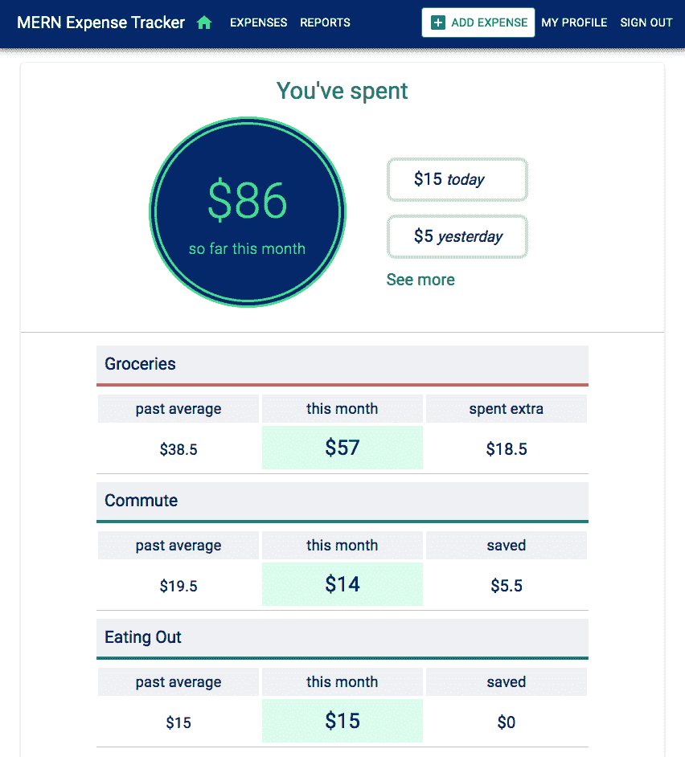
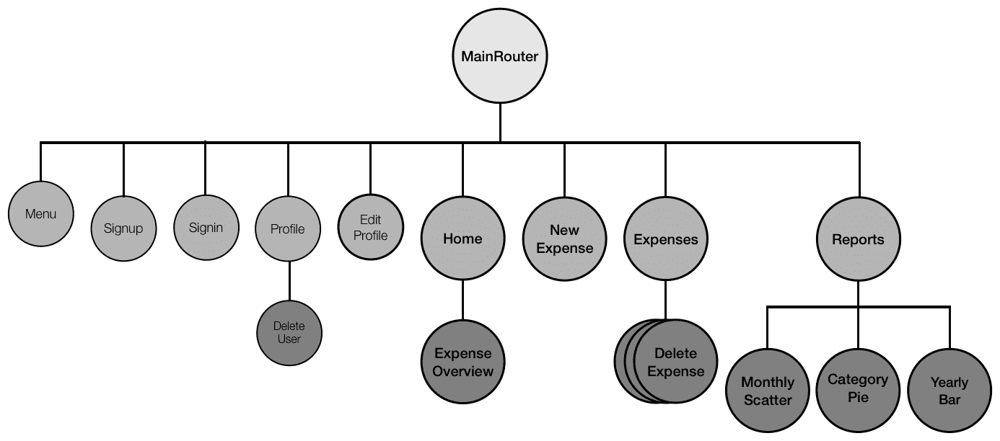
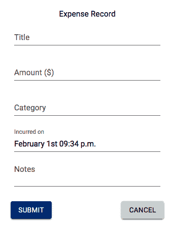
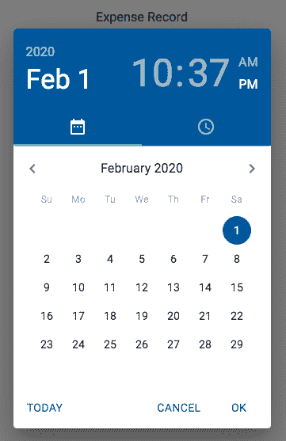
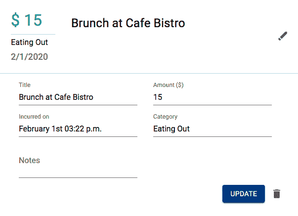
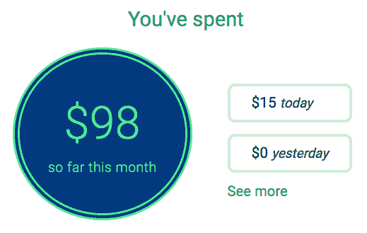
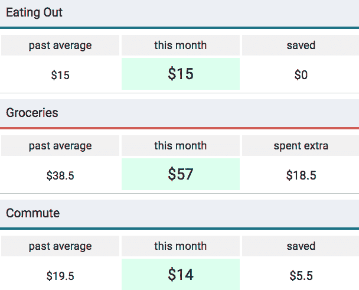
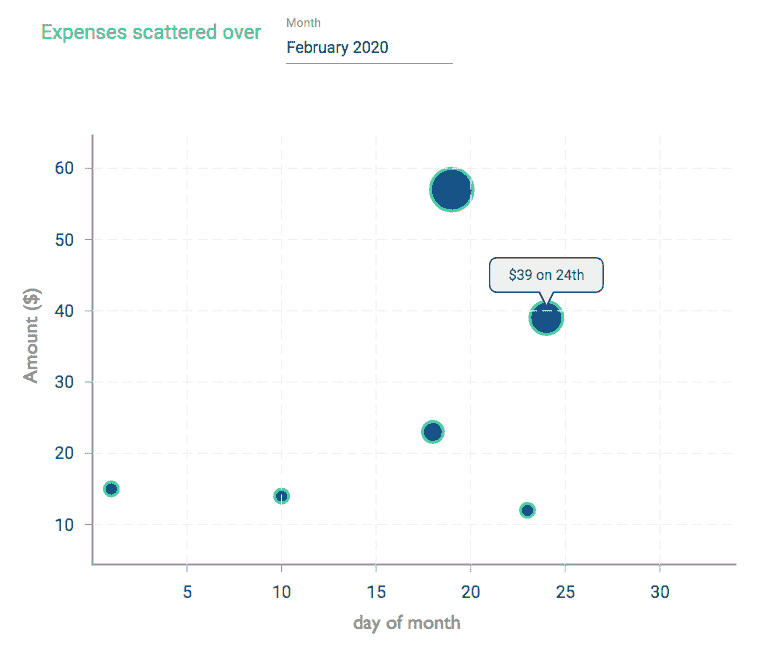
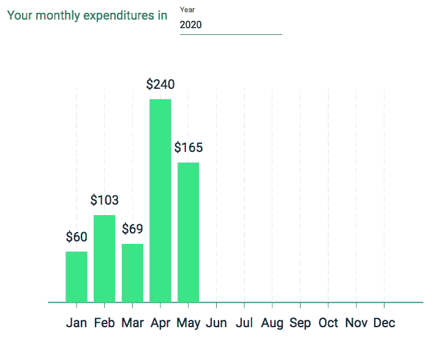
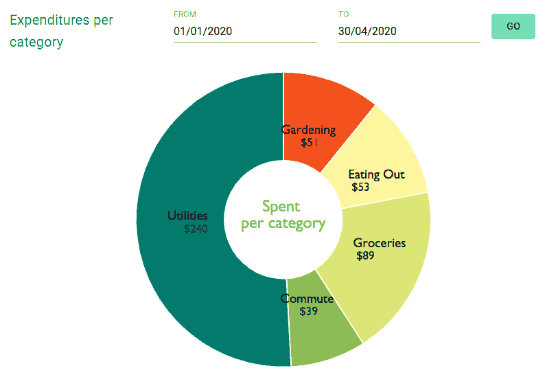

# 将数据可视化集成到支出跟踪应用程序中

这些天，收集和添加数据到互联网上的应用程序变得很容易。随着越来越多的数据变得可用，处理数据并将从这些数据中提取的见解以有意义和吸引人的可视化形式呈现给最终用户变得必要。在本章中，我们将学习如何使用 MERN 堆栈技术以及 Victory——一个用于 React 的图表库，以便轻松地将数据可视化功能集成到全栈应用程序中。我们将扩展 MERN 骨架应用程序来构建支出跟踪应用程序，该应用程序将包含用户随时间记录的支出数据的数据处理和可视化功能。

在了解了这些功能的实现之后，您应该掌握了如何利用 MongoDB 聚合框架和 Victory 图表库将您选择的数据可视化功能添加到任何全栈 MERN 网络应用程序中。

在本章中，我们将通过以下主题来构建一个集成了数据可视化功能的支出跟踪应用程序：

+   介绍 MERN 支出跟踪器

+   添加支出记录

+   随时间可视化支出数据

# 介绍 MERN 支出跟踪器

MERN 支出跟踪器应用程序将允许用户跟踪他们的日常支出。登录账户的用户将能够添加他们的支出记录，包括支出描述、类别、金额以及给定支出发生或支付的时间。应用程序将存储这些支出记录并提取有意义的数据模式，以使用户能够看到他们的支出习惯随时间如何发展。以下截图显示了 MERN 支出跟踪器应用程序上登录用户的首页视图，并提供了用户当前月份支出的概述：



完整的 MERN 支出跟踪器应用程序代码可在 GitHub 上找到：[`github.com/PacktPublishing/Full-Stack-React-Projects-Second-Edition/tree/master/Chapter10/mern-expense-tracker`](https://github.com/PacktPublishing/Full-Stack-React-Projects-Second-Edition/tree/master/Chapter10/mern-expense-tracker)。您可以将此代码克隆并运行，在阅读本章剩余部分的代码解释时，您可以运行应用程序。

在本章中，我们将扩展 MERN 骨架以构建具有数据可视化功能的支出跟踪应用程序。这些支出跟踪和可视化功能所需的视图将通过扩展和修改 MERN 骨架应用程序中现有的 React 组件来开发。以下截图显示了本章中开发的 MERN 支出跟踪器前端的所有自定义 React 组件的组件树：



我们将添加新的 React 组件来实现创建费用记录、列出和修改已记录的费用以及显示报告的视图，这些报告可以提供用户随时间产生的费用的洞察。我们还将修改现有的组件，如 Home 组件，以渲染用户当前费用的概览。在我们能够实现用户费用数据的可视化之前，我们需要首先添加记录日常费用的功能。在下一节中，我们将讨论如何实现这个功能，允许已登录的用户在应用程序中创建和修改他们的费用记录。

# 添加费用记录

在 MERN 费用追踪器应用程序中，已登录的用户将能够创建和管理他们的费用记录。为了启用添加和管理费用记录的功能，我们需要定义如何存储费用详情，并实现全栈切片，使用户能够创建新的费用、查看这些费用以及更新或删除应用程序中的现有费用。

在以下章节中，首先，我们将使用 Mongoose 模式定义费用模型以存储每个费用记录的详情。然后，我们将讨论实现后端 API 和前端视图的方法，这些方法允许用户创建新的费用、查看他们的费用列表以及通过编辑费用详情或从应用程序中删除费用来修改现有费用。

# 定义费用模型

我们将实现一个 Mongoose 模型来定义一个用于存储每个费用记录详情的费用模型。此模型将在`server/models/expense.model.js`中定义，其实现将与之前章节中覆盖的其他 Mongoose 模型实现类似，例如在第六章中定义的课程模型，*构建基于 Web 的教室应用程序*。此模型中的费用模式将具有简单的字段来存储关于每个费用的详情，例如标题、金额、类别以及费用发生时的日期，以及一个指向创建记录的用户引用。定义费用字段的代码及其解释如下：

+   **费用标题**：`title`字段将描述费用。它被声明为`String`类型，并且是一个必填字段：

```js
title: { 
    type: String, 
    trim: true, 
    required: 'Title is required' 
},
```

+   **费用金额**：`amount`字段将存储费用的货币成本，作为`Number`类型的值，并且它将是一个必填字段，最小允许值为 0：

```js
amount: { 
    type: Number, 
    min: 0,
    required: 'Amount is required' 
},
```

+   **费用类别**：`category`字段将定义费用类型，以便可以根据此值对费用进行分组。它被声明为`String`类型，并且是一个必填字段：

```js
category: {
    type: String,
    trim: true,
    required: 'Category is required'
},
```

+   **发生日期**：`incurred_on`字段将存储费用发生或支付时的日期时间。它被声明为`Date`类型，如果没有提供值，则默认为当前日期时间：

```js
incurred_on: {
    type: Date,
    default: Date.now
},
```

+   **注意事项**：`notes`字段，定义为`String`类型，将允许记录给定费用记录的额外详细信息或备注：

```js
notes: {
    type: String,
    trim: true
},
```

+   **记录费用的人**：`recorded_by`字段将引用创建费用记录的用户：

```js
recorded_by: {
    type: mongoose.Schema.ObjectId, 
    ref: 'User'
}
```

+   **创建和更新时间**：`created`和`updated`字段将是`Date`类型，`created`字段在添加新费用时生成，而`updated`字段在修改任何费用详情时更改：

```js
updated: Date,
created: { 
    type: Date, 
    default: Date.now 
},
```

添加到此模式定义中的字段将使我们能够实现 MERN 费用追踪器中的所有费用相关功能。在下一节中，我们将通过实现允许用户创建新费用记录的全栈切片来开始开发这些功能。

# 创建新的费用记录

为了在应用程序中创建新的费用记录，我们需要集成一个全栈切片，允许用户在前端填写表单视图，然后在后端将输入的详细信息保存到数据库中的新费用文档中。为了实现此功能，在以下章节中，我们将添加一个创建费用 API，以及在前端获取此 API 的方法，以及一个用于获取费用详情的用户输入的新费用表单视图。

# 创建费用 API

为了实现允许在数据库中创建新费用的创建费用 API，我们首先添加一个`POST`路由，如下所示。

`mern-expense-tracker/server/routes/expense.routes.js`：

```js
router.route('/api/expenses')
  .post(authCtrl.requireSignin, expenseCtrl.create)
```

向`/api/expenses`路由发送`POST`请求将首先确保请求用户已通过`auth`控制器中的`requireSignin`方法登录，然后调用`create`方法在数据库中添加新的费用记录。此`create`方法在以下代码中定义。

`mern-expense-tracker/server/controllers/expense.controller.js`：

```js
const create = async (req, res) =  {
  try {
    req.body.recorded_by = req.auth._id
    const expense = new Expense(req.body)
    await expense.save()
    return res.status(200).json({
      message: "Expense recorded!"
    })
  } catch (err) {
    return res.status(400).json({
      error: errorHandler.getErrorMessage(err)
    })
  }
}
```

在这个`create`方法中，我们将`recorded_by`字段设置为当前登录的用户，然后使用请求体中提供的费用数据在数据库中的费用集合中保存新的费用。

包含费用路由的`expense.routes.js`文件将与`user.routes`文件非常相似。为了在 Express 应用中加载这些新的费用路由，我们需要在`express.js`中挂载费用路由，如下所示，就像我们为 auth 和用户路由所做的那样。

`mern-expense-tracker/server/express.js`：

```js
app.use('/', expenseRoutes)
```

这个创建费用 API 端点现在已在后端准备好，可以在前端使用以发送`POST`请求。为了在前端获取此 API，我们将在`api-expense.js`中添加相应的`create`方法，类似于我们在前几章中讨论的其他 API 实现，例如来自第九章的*创建一个新的拍卖*部分，*向市场添加实时竞标功能*。

此获取方法将在前端组件中使用，该组件将显示一个表单，用户可以在其中输入新费用的详细信息并将其保存到应用程序中。在下一节中，我们将实现一个 React 组件，该组件将渲染用于记录新费用的表单。

# 新增费用组件

在此费用跟踪应用程序上签到的用户将通过表单视图来输入新的费用记录的详细信息。此表单视图将在`NewExpense`组件中渲染，这将使用户能够通过输入费用标题、花费金额、费用类别、费用发生的时间以及任何附加说明来创建新的费用。

此表单将呈现如下：



此`NewExpense`组件的实现与其他我们之前讨论过的表单实现类似，例如来自第四章的`Signup`组件实现，*添加 React 前端以完成 MERN*。此表单组件中唯一不同的字段是用于“发生时间”的日期时间输入。点击此字段将显示日期时间选择器小部件，如下面的截图所示：



为了实现此表单的日期时间选择器，我们将使用 Material-UI Pickers 以及一个日期管理库。在我们能够集成这些库之前，我们首先需要通过在命令行运行以下`yarn`命令来安装以下 Material-UI Pickers 和`date-fns`模块：

```js
yarn add @material-ui/pickers @date-io/date-fns@1.x date-fns

```

一旦安装了这些模块，我们就可以在`NewExpense`组件中导入所需的组件和模块，并将日期时间选择器小部件添加到表单中，如下面的代码所示。

`mern-expense-tracker/client/expense/NewExpense.js`：

```js
import DateFnsUtils from '@date-io/date-fns'
import { DateTimePicker, MuiPickersUtilsProvider} from "@material-ui/pickers"
...
 <MuiPickersUtilsProvider utils={DateFnsUtils}>
        <DateTimePicker
           label="Incurred on"
           views={["year", "month", "date"]}
           value={values.incurred_on}
           onChange={handleDateChange}
           showTodayButton
       /> 
 </MuiPickersUtilsProvider> 
```

此小部件将渲染选择年、月、日和时间的选项，以及一个设置当前时间为选定值的 TODAY 按钮。当用户完成日期时间的选择后，我们将使用`handleDateChange`方法捕获值，并将其与其他从表单收集的费用相关值一起设置到状态中。`handleDateChange`方法定义如下。

`mern-expense-tracker/client/expense/NewExpense.js`：

```js
  const handleDateChange = date =  {
    setValues({...values, incurred_on: date })
  }
```

使用此功能，我们将为新的费用记录中的`incurred_on`字段设置一个`date`值。

此`NewExpense`组件只能由已签到的用户查看。因此，我们将在`MainRouter`组件中添加一个`PrivateRoute`，这样只有在`/expenses/new`路径的认证用户才能渲染此表单。

`mern-expense-tracker/client/MainRouter.js`：

```js
 PrivateRoute path="/expenses/new" component={NewExpense}/ 
```

此链接可以添加到任何视图中，例如菜单组件，当用户登录时条件性地渲染。现在，由于可以在本费用跟踪应用程序中添加新的费用记录，在下一节中，我们将讨论从后端到前端视图的实现，以获取和列出这些费用。

# 列出费用

在 MERN 费用跟踪器中，用户将能够查看他们在应用程序中已记录并在提供的日期范围内产生的费用列表。在以下各节中，我们将通过实现后端 API 来检索当前已登录用户记录的费用列表，并添加一个前端视图，该视图将使用此 API 将返回的费用列表渲染给最终用户。

# 用户费用 API

我们将实现一个 API 来获取特定用户在提供的日期范围内记录的费用。对此 API 的请求将在`'/api/expenses'`接收，路由在`expense.routes.js`中定义如下。

`mern-expense-tracker/server/routes/expense.routes.js`:

```js
router.route('/api/expenses')
  .get(authCtrl.requireSignin, expenseCtrl.listByUser)
```

对此路由的`GET`请求将首先确保请求用户已登录，然后调用控制器方法从数据库中检索费用。在这个应用程序中，用户只能查看他们自己的费用。在用户身份验证确认后，在`listByUser`控制器方法中，我们使用请求中指定的日期范围和已登录用户的 ID 在数据库中查询 Expense 集合。`listByUser`方法在以下代码中定义。

`mern-expense-tracker/server/controllers/expense.controller.js`:

```js
const listByUser = async (req, res) =  {
  let firstDay = req.query.firstDay
  let lastDay = req.query.lastDay
  try {
    let expenses = await Expense.find({'$and': {'incurred_on': 
       { '$gte': firstDay, '$lte':lastDay }}, 
           {'recorded_by': req.auth._id } }).sort('incurred_on')
             .populate('recorded_by', '_id name')
    res.json(expenses)
  } catch (err){
    console.log(err)
    return res.status(400).json({
      error: errorHandler.getErrorMessage(err)
    })
  }
}
```

在这种方法中，我们首先收集请求查询中指定的日期范围的起始日和最后一天。然后，我们从数据库中检索在此日期范围内由已登录用户产生的费用。已登录用户与`recorded _by`字段中引用的用户进行匹配。使用这些值对 Expense 集合执行`find`查询将返回按`incurred_on`字段排序的匹配费用，最近产生的费用将列在前面。

用于检索特定用户记录的费用 API 可以在前端使用，以检索和向最终用户显示费用。为了在前端获取此 API，我们将在`api-expense.js`中添加相应的`listByUser`方法，如下所示。

`mern-expense-tracker/client/expense/api-expense.js`:

```js
  const listByUser = async (params, credentials, signal) =  {
    const query = queryString.stringify(params)
    try {
      let response = await fetch('/api/expenses?'+query, {
        method: 'GET',
        signal: signal,
        headers: {
          'Accept': 'application/json',
          'Authorization': 'Bearer ' + credentials.t
        }
      })
      return await response.json()
    }catch(err){
      console.log(err)
    }
  }
```

在这个方法中，在向列出费用 API 发出请求之前，我们使用`queryString`库形成包含日期范围的查询字符串。然后，将此查询字符串附加到请求 URL。

此获取方法将在`Expenses`组件中使用，以检索并向用户显示费用。我们将在下一节中查看`Expenses`组件的实现。

# 费用组件

从数据库检索到的支出列表将使用名为`Expenses`的 React 组件进行渲染。该组件在初始加载时，将渲染当前月份由已登录用户发生的支出。在这个视图中，用户还可以选择日期范围以检索特定日期内发生的支出，如图所示：

![图片

在定义`Expenses`组件时，我们首先使用`useEffect`钩子调用获取支出列表 API 的 fetch 调用，以检索初始支出列表。我们还初始化了进行此请求和渲染从服务器接收到的响应所必需的值，如图所示。

`mern-expense-tracker/client/expense/Expenses.js`:

```js
export default function Expenses() {
    const date = new Date(), y = date.getFullYear(), m = date.getMonth()
    const [firstDay, setFirstDay] = useState(new Date(y, m, 1))
    const [lastDay, setLastDay] = useState(new Date(y, m + 1, 0))

    const jwt = auth.isAuthenticated()
    const [redirectToSignin, setRedirectToSignin] = useState(false)
    const [expenses, setExpenses] = useState([])

    useEffect(() =  {
        const abortController = new AbortController()
        const signal = abortController.signal
        listByUser({firstDay: firstDay, lastDay: lastDay}, 
                   {t: jwt.token}, signal)
        .then((data) =  {
           if (data.error) {
                setRedirectToSignin(true)
              } else {
                setExpenses(data)
              }
           })
        return function cleanup(){
          abortController.abort()
        }
    }, [])
...
}
```

我们首先确定当前月份的第一天和最后一天的日期。这些日期被设置为在搜索表单字段中渲染，并作为请求服务器的日期范围查询参数提供。因为我们只会获取与当前用户相关的支出，所以我们检索已登录用户的`auth`凭证，以便与请求一起发送。如果服务器请求导致错误，我们将用户重定向到登录页面。否则，我们将接收到的支出设置在状态中，以便在视图中渲染。

在“支出”组件的视图部分，我们将在遍历结果支出数组以渲染单个支出详情之前，添加一个表单以按日期范围搜索。在接下来的章节中，我们将查看组件视图中的搜索表单和支出列表的实现。

# 通过日期范围搜索

在“支出”视图中，用户将可以选择查看在特定日期范围内发生的支出列表。为了实现一个允许用户选择开始和结束日期范围的搜索表单，我们将使用来自 Material-UI Pickers 的`DatePicker`组件。

在视图中，我们将添加两个`DatePicker`组件来收集查询范围的开始和结束日期，并添加一个按钮来启动搜索，如图所示。

`mern-expense-tracker/client/expense/Expenses.js`:

```js
 div className={classes.search} 
    <MuiPickersUtilsProvider utils={DateFnsUtils} 
        <DatePicker
          disableFuture
          format="dd/MM/yyyy"
          label="SHOWING RECORDS FROM"
          views={["year", "month", "date"]}
          value={firstDay}
          onChange={handleSearchFieldChange('firstDay')}
       />
        <DatePicker
          format="dd/MM/yyyy"
          label="TO"
          views={["year", "month", "date"]}
          value={lastDay}
          onChange={handleSearchFieldChange('lastDay')}
       /> 
    </MuiPickersUtilsProvider> 
    Button variant="contained" color="secondary" 
       onClick= {searchClicked} GO </Button>
 </div>
```

当用户与`DatePicker`组件交互以选择日期时，我们将调用`handleSearchFieldChange`方法来获取选定的`date`值。此方法获取`date`值并将其相应地设置为状态中的`firstDay`或`lastDay`值。`handleSearchFieldChange`方法定义如下。

`mern-expense-tracker/client/expense/Expenses.js`:

```js
const handleSearchFieldChange = name =  date =  {
    if(name=='firstDay'){
        setFirstDay(date)
    }else{
        setLastDay(date)
    }
}
```

在选择了两个日期并将它们设置在状态中之后，当用户点击搜索按钮时，我们将调用`searchClicked`方法。在这个方法中，我们使用新的日期作为查询参数再次调用列表支出 API。`searchClicked`方法定义如下。

`mern-expense-tracker/client/expense/Expenses.js`:

```js
const searchClicked = () =  {
    listByUser({firstDay: firstDay, lastDay: lastDay},{t: jwt.token}).then((data) =  {
        if (data.error) {
          setRedirectToSignin(true)
        } else {
          setExpenses(data)
        }
    })
}
```

一旦从服务器接收到此新查询产生的费用，我们将将其设置到状态中以便在视图中渲染。在下一节中，我们将查看显示检索到的费用列表的实现。

# 渲染费用

在 `Expenses` 组件视图中，我们遍历从数据库检索到的费用列表，并在 Material-UI `ExpansionPanel` 组件中将每个费用记录显示给最终用户。在 `ExpansionPanel` 组件中，我们在 *摘要* 部分显示单个费用记录的详细信息。然后，在面板展开时，我们将给用户提供编辑费用详细信息或删除费用的选项，如下一节所述。

在搜索表单元素之后添加到视图代码中的以下代码，我们使用 `map` 来遍历 `expenses` 数组，并在 `ExpansionPanel` 组件中渲染每个 `expense`。

`mern-expense-tracker/client/expense/Expenses.js`:

```js
{expenses.map((expense, index) = {
  return  span key={index} 
     <ExpansionPanel className={classes.panel}>
        <ExpansionPanelSummary 
           expandIcon={ Edit / } >
          <div className={classes.info} 
            Typography className={classes.amount} $ {expense.amount} </Typography>
            <Divider style={{marginTop: 4, marginBottom: 4}}/>
            <Typography  {expense.category}  </Typography>
            <Typography className={classes.date} 
                {new Date(expense.incurred_on).toLocaleDateString()}
            </Typography>  
          </div> 
          <div> 
            <Typography className={classes.heading} {expense.title} </Typography> 
            <Typography className={classes.notes}  {expense.notes}  </Typography>
          </div> 
        </ExpansionPanelSummary>
        <Divider/>
        <ExpansionPanelDetails style={{display: 'block'}} 
           ...
        </ExpansionPanelDetails>
     </ExpansionPanel> 
    </span> 
 })
}
```

费用详情在 `ExpansionPanelSummary` 组件中渲染，使用户能够了解他们在应用程序中记录的费用概述。`ExpansionPanelDetails` 组件将包含修改给定费用和完成允许用户管理他们在应用程序中记录的费用功能的选项。在下一节中，我们将讨论实现这些修改记录费用的选项。

# 修改费用记录

MERN 费用追踪器的用户将能够通过更新费用详情或完全删除费用记录来修改他们在应用程序中已记录的费用。

在应用程序的前端，用户在展开查看列表中单个费用的详细信息后，将在费用列表中接收到这些修改选项，如下面的截图所示：



为了实现这些费用修改功能，我们必须更新视图以渲染此表单和删除选项。此外，我们将在服务器上添加编辑和删除费用 API 端点。在以下章节中，我们将讨论如何在前端渲染这些编辑和删除元素，然后实现后端的编辑和删除 API。

# 渲染编辑表单和删除选项

我们将在 `Expenses` 组件视图中渲染编辑费用表单和删除选项。对于在此视图中以 Material-UI `ExpansionPanel` 组件渲染的每个费用记录，我们将在 `ExpansionPanelDetails` 部分添加表单字段，每个字段预先填充相应的费用详情值。用户将能够与这些表单字段交互以更改值，然后点击更新按钮将更改保存到数据库。我们将在视图中添加这些表单字段以及更新按钮和删除选项，如下面的代码所示。

`mern-expense-tracker/client/expense/Expenses.js`:

```js
 <ExpansionPanelDetails style={{display: 'block'}}>
   <div> 
     <TextField label="Title" value={expense.title} 
               onChange={handleChange('title', index)}/> 
     <TextField label="Amount ($)" value={expense.amount} 
               onChange={handleChange('amount', index)} type="number"/>
   </div> 
   <div>
     <MuiPickersUtilsProvider utils={DateFnsUtils}> 
       <DateTimePicker
          label="Incurred on"
          views={["year", "month", "date"]}
          value={expense.incurred_on}
          onChange={handleDateChange(index)}
          showTodayButton
      />
     </MuiPickersUtilsProvider 
     <TextField label="Category" value={expense.category} 
        onChange={handleChange('category', index)}/>
   </div> 
   <TextField label="Notes" multiline rows="2"
      value={expense.notes}
      onChange={handleChange('notes', index)}
  />
   <div className={classes.buttons} 
    { error && ( Typography component="p" color="error" 
        <Icon color="error" className={classes.error} error </Icon> 
                    {error}
                 </Typography> )
    }
    { saved && Typography component="span" color="secondary" Saved </Typography>  }
     <Button color="primary" variant="contained" 
            onClick={()=  clickUpdate(index)} Update </Button> 
     DeleteExpense expense={expense} onRemove={removeExpense}/ 
   </div>  
 </ExpansionPanelDetails> 
```

在这里添加的表单字段与在 `NewExpense` 组件中添加的字段类似，用于创建新的费用记录。当用户与这些字段交互以更新值时，我们将使用给定费用在 `expenses` 数组中的相应索引、字段名称和更改值调用 `handleChange` 方法。`handleChange` 方法定义如下。

`mern-expense-tracker/client/expense/Expenses.js`:

```js
const handleChange = (name, index) =  event =  {
    const updatedExpenses = [...expenses]
    updatedExpenses[index][name] = event.target.value
    setExpenses(updatedExpenses)
}
```

将 `expenses` 数组中给定索引处的费用对象更新为指定字段的更改值，并将其设置为状态。这将使用户在更新编辑表单时渲染带有最新值的视图。当用户完成更改并点击 `Update` 按钮时，我们将调用 `clickUpdate` 方法，该方法定义如下。

`mern-expense-tracker/client/expense/Expenses.js`:

```js
const clickUpdate = (index) =  {
    let expense = expenses[index]
    update({
            expenseId: expense._id
        }, {
            t: jwt.token
        }, expense)
    .then((data) =  {
        if (data.error) {
           setError(data.error)
        } else {
           setSaved(true)
           setTimeout(()= {setSaved(false)}, 3000)
    }
}
```

在这个 `clickUpdate` 方法中，我们通过向编辑费用 API 发起一个 fetch 调用来将更新的费用发送到后端。这个编辑费用 API 的实现将在下一节中讨论。

将 `DeleteExpense` 组件添加到编辑表单中，它会渲染一个删除按钮，并使用作为属性传递的 `expense` 对象通过调用删除费用 API 从数据库中删除相关的费用。这个 `DeleteExpense` 的实现与在 第七章 中讨论的 `DeleteShop` 组件类似，即 *使用在线市场锻炼 MERN 技能*。在下一节中，我们将讨论编辑和删除费用 API 的实现，这些 API 由编辑表单使用，并将用户在数据库的 Expense 集合中做出的费用相关更新传递给删除选项。

# 在后端编辑和删除费用

为了完成由前端登录用户发起的编辑和删除费用操作，我们需要在后端有相应的 API。以下代码中可以声明这些 API 端点的路由，它们将接受更新和删除请求。

`mern-expense-tracker/server/routes/expense.routes.js`:

```js
router.route('/api/expenses/:expenseId')
  .put(authCtrl.requireSignin, expenseCtrl.hasAuthorization, expenseCtrl.update)
  .delete(authCtrl.requireSignin, expenseCtrl.hasAuthorization, expenseCtrl.remove)
router.param('expenseId', expenseCtrl.expenseByID)
```

对此路由的 `PUT` 或 `DELETE` 请求将首先确保当前用户已通过 `requireSignin` `auth` 控制器方法登录，然后检查授权并在数据库中执行任何操作。

路由 URL 中的 `:expenseId` 参数，`/api/expenses/:expenseId`，将调用 `expenseByID` 控制器方法，该方法类似于 `userByID` 控制器方法。它从数据库中检索费用并将其附加到请求对象中，以便在 `next` 方法中使用。`expenseByID` 方法定义如下。

`mern-expense-tracker/server/controllers/expense.controller.js`:

```js
const expenseByID = async (req, res, next, id) =  {
    try {
      let expense = await Expense.findById(id).populate
           ('recorded_by', '_id name').exec()
      if (!expense)
        return res.status('400').json({
          error: "Expense record not found"
        })
      req.expense = expense
      next()
    } catch (err){
      return res.status(400).json({
        error: errorHandler.getErrorMessage(err)
      })
    }
}
```

从数据库检索到的费用对象还将包含记录费用的用户的名称和 ID 详情，正如我们在`populate()`方法中指定的。对于这些 API 端点，接下来我们将使用`hasAuthorization`方法验证此费用对象是否确实是由已登录的用户记录的，该方法在费用控制器中如下定义。

`mern-expense-tracker/server/controllers/expense.controller.js`:

```js
const hasAuthorization = (req, res, next) =  {
  const authorized = req.expense && req.auth && 
      req.expense.recorded_by._id == req.auth._id
  if (!(authorized)) {
    return res.status('403').json({
      error: "User is not authorized"
    })
  }
  next()
}
```

一旦确认尝试更新费用的用户是记录该费用的用户，并且如果是`PUT`请求，则接下来将调用`update`方法来更新费用文档，并在 Expense 集合中应用新的更改。`update`控制器方法在以下代码中定义。

`mern-expense-tracker/server/controllers/expense.controller.js`:

```js
const update = async (req, res) =  {
    try {
      let expense = req.expense
      expense = extend(expense, req.body)
      expense.updated = Date.now()
      await expense.save()
      res.json(expense)
    } catch (err) {
      return res.status(400).json({
        error: errorHandler.getErrorMessage(err)
      })
    }
}
```

该方法从`req.expense`检索费用详情，然后使用`lodash`模块将请求体中传入的更改扩展并合并到费用数据中，以更新费用数据。在将此更新后的费用保存到数据库之前，`updated`字段被填充为当前日期，以反映最后更新的时间戳。在成功保存此更新后，更新的费用对象将作为响应发送回。

如果是`DELETE`请求而不是`PUT`请求，则会调用`remove`方法来从数据库中的集合中删除指定的费用文档。`remove`控制器方法在以下代码中定义。

`mern-expense-tracker/server/controllers/expense.controller.js`:

```js
const remove = async (req, res) =  {
    try {
      let expense = req.expense
      let deletedExpense = await expense.remove()
      res.json(deletedExpense)
    } catch (err) {
      return res.status(400).json({
        error: errorHandler.getErrorMessage(err)
      })
    }
}
```

此方法中的`remove`操作将永久删除应用程序中的费用。

我们已经为应用程序上的用户提供了所有功能，以便他们开始记录和管理日常费用。我们定义了一个 Expense 模型来存储费用数据，以及后端 API 和前端视图来创建新的费用、显示特定用户的费用列表以及修改现有费用。我们现在准备实现基于用户在应用程序上记录的费用数据的数据可视化功能。我们将在下一节中讨论这些实现。

# 随时间可视化费用数据

除了允许用户记录他们的费用外，MERN 费用跟踪应用程序还将处理收集到的费用数据，以使用户能够了解他们的消费习惯随时间的变化。我们将实现简单的数据聚合和数据可视化功能，以展示 MERN 堆栈如何满足任何全栈应用程序的此类要求。为了启用这些功能，我们将利用 MongoDB 的聚合框架，以及由 Formidable 提供的基于 React 的图表和数据可视化库——Victory。

在接下来的章节中，我们首先将添加功能来总结用户当前月份的费用，并展示他们与之前月份相比的表现。然后，我们将添加不同的 Victory 图表，以提供他们在一个月、一年以及每个费用类别上的支出模式的可视化表示。

# 总结近期费用

当用户在应用程序上登录他们的账户时，他们将看到他们在当前月份到目前为止产生的费用预览。他们还将看到与之前月份的平均值相比，每个类别的花费更多或更少的比较。为了实现这些功能，我们必须添加后端 API，这些 API 将在数据库中的相关费用数据上运行聚合操作，并将计算结果返回到前端进行渲染。在接下来的章节中，我们将实现全栈切片——首先展示当前月份到目前为止产生的所有费用预览，然后展示与当前月份支出相比的每个类别的平均费用。

# 预览当前月份的费用

用户登录应用程序后，我们将展示他们当前费用的预览，包括他们当前月份的总支出以及他们在当前日期和前一天的花费。这个预览将显示给最终用户，如下面的截图所示：



为了实现这个功能，我们需要添加一个后端 API 来处理现有的费用数据，以返回这三个值，以便在 React 组件中渲染。在接下来的章节中，我们将查看这个 API 的实现和与前端视图的集成，以完成预览功能。

# 当前月份预览 API

我们将在后端添加一个 API，该 API 将返回当前月份到目前为止产生的费用预览。为了实现这个 API，我们首先声明一个`GET`路由，如下面的代码所示。

`mern-expense-tracker/server/routes/expense.routes.js`:

```js
router.route('/api/expenses/current/preview')
  .get(authCtrl.requireSignin, expenseCtrl.currentMonthPreview)
```

向`'/api/expenses/current/preview'`这个路由发送一个`GET`请求，首先会确保请求客户端已经登录，然后它会调用`currentMonthPreview`控制器方法。在这个方法中，我们将使用 MongoDB 的聚合框架对费用集合执行三组聚合操作，以检索当前月份、当前日期以及前一天的总费用。

`currentMonthPreview`控制器方法将按照以下结构定义，我们首先确定查找匹配费用所需的日期，然后执行聚合操作，最后在响应中返回结果。

`mern-expense-tracker/server/controllers/expense.controller.js`:

```js
const currentMonthPreview = async (req, res) =  {
  const date = new Date(), y = date.getFullYear(), m = date.getMonth()
  const firstDay = new Date(y, m, 1)
  const lastDay = new Date(y, m + 1, 0)

  const today = new Date()
  today.setUTCHours(0,0,0,0)

  const tomorrow = new Date()
  tomorrow.setUTCHours(0,0,0,0)
  tomorrow.setDate(tomorrow.getDate()+1)

  const yesterday = new Date()
  yesterday.setUTCHours(0,0,0,0)
  yesterday.setDate(yesterday.getDate()-1)

  try {
      /* ... Perform aggregation operations on the Expense collection 
             to compute current month's numbers ... */
      /* ... Send computed result in response ... */
  } catch (err){
    console.log(err)
    return res.status(400).json({
      error: errorHandler.getErrorMessage(err)
    })
  }

}
```

我们首先确定当前月份的第一天和最后一天的日期，然后确定今天、明天和昨天的日期，分钟和秒数设置为零。我们需要这些日期来指定查找当前月份、今天和昨天的匹配费用的范围。然后，使用这些值和已登录用户的 ID 引用，我们构建检索当前月份、今天和昨天的总费用的聚合管道。我们使用 MongoDB 聚合框架中的`$facet`阶段将这些三个不同的聚合管道分组，如下面的代码所示。

`mern-expense-tracker/server/controllers/expense.controller.js`:

```js
let currentPreview = await Expense.aggregate([
  { $facet: { month: [
    { $match: { incurred_on: { $gte: firstDay, $lt: lastDay }, 
      recorded_by: mongoose.Types.ObjectId(req.auth._id)}},
    { $group: { _id: "currentMonth" , totalSpent: {$sum: "$amount"} }},
       ],
    today: [
      { $match: { incurred_on: { $gte: today, $lt: tomorrow }, 
        recorded_by: mongoose.Types.ObjectId(req.auth._id) }},
      { $group: { _id: "today" , totalSpent: {$sum: "$amount"} } },
        ],

    yesterday: [
      { $match: { incurred_on: { $gte: yesterday, $lt: today }, 
        recorded_by: mongoose.Types.ObjectId(req.auth._id) }},
      { $group: { _id: "yesterday" , totalSpent: {$sum: "$amount"} } 
        },
       ]
    }
  }])
let expensePreview = {month: currentPreview[0].month[0], today: currentPreview[0].today[0], yesterday: currentPreview[0].yesterday[0] }
res.json(expensePreview)
```

对于每个聚合管道，我们首先使用`incurred_on`字段的日期范围值匹配费用，以及与当前用户引用的`recorded_by`字段，因此聚合操作仅对当前用户记录的费用执行。然后，每个管道中匹配的费用被分组以计算总支出金额。

在分面聚合操作的结果中，每个管道在输出文档中都有自己的字段，结果作为文档数组存储。

聚合操作完成后，我们访问计算结果并组合响应以发送回请求客户端。这个 API 可以在前端使用 fetch 请求。你可以定义一个相应的 fetch 方法来发起请求，类似于其他 API 实现。然后，这个 fetch 方法可以在 React 组件中使用来检索和渲染这些聚合值给用户。在下文中，我们将讨论实现此视图以渲染用户当前支出预览的细节。

# 渲染当前支出的预览

我们可以在任何 React 组件中向用户提供当前支出的概览，该组件对已登录用户是可访问的，并添加到应用程序的前端。为了检索支出总额并在视图中渲染这些数据，我们可以在`useEffect`钩子中调用当前月份预览 API，或者在按钮被点击时调用。

在 MERN 支出跟踪应用程序中，我们使用 React 组件渲染这些详细信息，并将其添加到主页上。我们使用`useEffect`钩子，如下面的代码所示，来检索当前的支出预览数据。

`mern-expense-tracker/client/expense/ExpenseOverview.js`:

```js
  useEffect(() =  {
      const abortController = new AbortController()
      const signal = abortController.signal
      currentMonthPreview({t: jwt.token}, signal).then((data) =  {
        if (data.error) {
          setRedirectToSignin(true)
        } else {
          setExpensePreview(data)
        }
      })
      return function cleanup(){
        abortController.abort()
      }
  }, [])
```

一旦从后端接收到数据，我们将它设置到名为`expensePreview`的状态变量中，以便在视图中显示信息。在组件的视图中，我们使用这个状态变量来组合一个界面，以显示这些详细信息。在下面的代码中，我们渲染了当前月份、当前日期和前一天的总支出。

`mern-expense-tracker/client/expense/ExpenseOverview.js`:

```js
 <Typography variant="h4" color="textPrimary" You've spent </Typography> 
 <div>  
<Typography component="span" 
        ${expensePreview.month ? expensePreview.month.totalSpent : '0'} 
          span so far this month  </span> 
     </Typography>
     <div> 
       <Typography variant="h5" color="primary" 
         ${expensePreview.today ? expensePreview.today.totalSpent :'0'} 
             span today </span> 
         </Typography>
         <Typography variant="h5" color="primary" 
            ${expensePreview.yesterday 
               ? expensePreview.yesterday.totalSpent: '0'}     
             <span className={classes.day} yesterday  </span> 
         </Typography> 
         <Link to="/expenses/all"  Typography variant="h6"> See more            </Typography>  </Link> 
     </div> 
 </div> 
```

这些值只有在后端聚合结果中返回相应的值时才会渲染；否则，我们将渲染一个"`0`"。

通过实现当前支出预览功能，我们能够处理用户记录的支出数据，让他们了解他们当前的支出情况。在下一节中，我们将遵循类似的实现步骤，告知用户每个支出类别的支出状况。

# 按类别跟踪当前支出

在这个应用中，我们将向用户提供一个概述，展示他们目前在每个支出类别中的支出情况，并与之前的平均值进行比较。对于每个类别，我们将显示基于之前支出数据的月平均支出，展示当前月份到目前为止的总支出，并显示差异，以表明他们是否在本月额外支出或节省了钱。以下截图显示了最终用户将如何看到这个功能：



要实现这个功能，我们需要添加一个后端 API，该 API 将处理现有的支出数据，以返回每个类别的月平均支出以及当前月份的总支出，以便可以在 React 组件中渲染。在接下来的章节中，我们将探讨这个 API 的实现和集成，以及前端视图的整合，以完成按类别跟踪支出的功能。

# 当前支出按类别 API

我们将在后端添加一个 API，该 API 将返回每个支出类别的平均月支出和当前月份的总支出。为了实现这个 API，我们首先声明一个`GET`路由，如下面的代码所示。

`mern-expense-tracker/server/routes/expense.routes.js`:

```js
router.route('/api/expenses/by/category')
  .get(authCtrl.requireSignin, expenseCtrl.expenseByCategory)
```

对`'/api/expenses/by/category'`这个路由的`GET`请求将首先确保请求客户端已登录，然后它将调用`expenseByCategory`控制器方法。在这个方法中，我们将使用 MongoDB 聚合框架的不同特性来分别计算每个类别的月平均支出和每个类别的当前月份总支出，然后将这两个结果合并，返回与每个类别相关联的这两个值给请求客户端。

`expenseByCategory`控制器方法将按照以下结构定义，我们首先确定查找匹配支出所需的日期，然后执行聚合操作，最后在响应中返回结果。

`mern-expense-tracker/server/controllers/expense.controller.js`:

```js
const expenseByCategory = async (req, res) =  {
  const date = new Date(), y = date.getFullYear(), m = date.getMonth()
  const firstDay = new Date(y, m, 1)
  const lastDay = new Date(y, m + 1, 0)

  try {
    let categoryMonthlyAvg = await Expense.aggregate([/*... aggregation ... */]).exec()
    res.json(categoryMonthlyAvg)
  } catch (err) {
    console.log(err)
    return res.status(400).json({
      error: errorHandler.getErrorMessage(err)
    })
  }
}
```

在这个方法中，我们将使用包含一个`$facet`和两个子管道的聚合管道，用于计算每个类别的月平均支出和当前月份的每个类别的总支出。然后，我们将从子管道中取这两个结果数组来合并结果。这个聚合管道的代码定义在下面的代码中。

`mern-expense-tracker/server/controllers/expense.controller.js`:

```js
[
  { $facet: {
     average: [
      { $match: { recorded_by: mongoose.Types.ObjectId(req.auth._id) }},
      { $group: { _id: {category: "$category", month: {$month: "$incurred_on"}}, 
                  totalSpent: {$sum: "$amount"} } },
      { $group: { _id: "$_id.category", avgSpent: { $avg: "$totalSpent"}}},
      { $project: {
         _id: "$_id", value: {average: "$avgSpent"},
        }
      }
     ],
     total: [
      { $match: { incurred_on: { $gte: firstDay, $lte: lastDay }, 
                  recorded_by: mongoose.Types.ObjectId(req.auth._id) }},
      { $group: { _id: "$category", totalSpent: {$sum: "$amount"} } },
      { $project: {
         _id: "$_id", value: {total: "$totalSpent"},
        }
      }
     ]
    }
  },
  { $project: {
     overview: { $setUnion:['$average','$total'] },
   }
  },
  { $unwind: '$overview' },
  { $replaceRoot: { newRoot: "$overview" } },
  { $group: { _id: "$_id", mergedValues: { $mergeObjects: "$value" } } }
]
```

在`$facet`阶段的子管道输出投影时，我们确保结果对象的键在两个输出数组中都是`_id`和`value`，以便可以统一合并。一旦完成分面聚合操作，我们使用`$setUnion`对结果进行操作以合并数组。然后，我们将合并后的数组作为新的根文档，以便对其运行`$group`聚合以合并每个类别的平均值和总值。

从这个聚合管道的最终输出将包含一个数组，其中每个支出类别都有一个对象。这个数组中的每个对象都将具有类别名称作为`_id`值，以及一个包含该类别平均和总值的`mergedValues`对象。然后，这个由聚合生成的最终输出数组被发送回请求客户端的响应中。

我们可以在前端使用 fetch 请求使用这个 API。你可以定义一个相应的 fetch 方法来发起请求，类似于其他 API 实现。然后，这个 fetch 方法可以在 React 组件中使用来检索并渲染这些聚合值给用户。在下一节中，我们将讨论这个视图的实现，以展示用户在当前月份与上个月相比，每个类别的支出比较。

# 渲染每个类别的支出概览

除了告知用户他们当前的支出情况外，我们还可以给他们一个与之前支出相比的情况。我们可以告诉他们，在当前月份的每个类别中，他们是支出更多还是节省了钱。我们可以实现一个 React 组件，该组件调用当前按类别支出的 API 来渲染后端发送的平均和总值，并显示这两个值之间的计算差异。

API 可以通过`useEffect`钩子或点击按钮来获取。在 MERN 支出跟踪应用程序中，我们将在主页上添加的 React 组件中渲染这些详细信息。我们使用以下代码中的`useEffect`钩子来检索每个类别的支出数据。

`mern-expense-tracker/client/expense/ExpenseOverview.js`:

```js
  useEffect(() =  {
    const abortController = new AbortController()
    const signal = abortController.signal
    expenseByCategory({t: jwt.token}, signal).then((data) =  {
      if (data.error) {
        setRedirectToSignin(true)
      } else {
        setExpenseCategories(data)
      }
    })
    return function cleanup(){
      abortController.abort()
    }
  }, [])
```

我们将把从后端接收到的值设置到`expenseCategories`状态变量中，并在视图中渲染其详细信息。这个变量将包含一个数组，我们将在视图代码中遍历这个数组，为每个类别显示三个值——每月平均数、当前月份的总支出，以及这两个值之间的差异，并指示是否节省了钱。

在以下代码中，我们使用`map`来遍历接收到的数据数组，并为数组中的每个项目生成视图以显示接收到的平均和总值。除此之外，我们还使用这两个值显示一个计算值。

`mern-expense-tracker/client/expense/ExpenseOverview.js`:

```js
{expenseCategories.map((expense, index) =  {
    return( div key={index}  
        <Typography variant="h5" {expense._id} </Typography>
        <Divider style={{ backgroundColor: 
            indicateExpense(expense.mergedValues)}}/>
        <div> 
          <Typography component="span" past average </Typography>
          <Typography component="span" this month </Typography> 
          <Typography component="span"  {expense.mergedValues.total 
 && expense.mergedValues.total-
              expense.mergedValues.average > 0 ? "spent extra" : "saved" } 
          </Typography> 
        </div> 
        <div> 
          <Typography component="span" ${expense.mergedValues.average}         </Typography> 
          <Typography component="span" ${expense.mergedValues.total ? 
 expense.mergedValues.total : 0}
          </Typography> 
          <Typography component="span" ${expense.mergedValues.total ? 
 Math.abs(expense.mergedValues.total-
             expense.mergedValues.average) : 
                expense.mergedValues.average}
          </Typography>
        </div> 
        <Divider/> 
     </div> ) 
  })
}
```

对于数组中的每个项目，我们首先渲染类别名称，然后渲染我们将显示的三个值的标题。第三个标题根据当前总金额是否多于或少于月平均金额有条件地渲染。然后，在每个标题下，我们渲染月平均金额、当前总金额（如果没有返回值，则将为零）以及这个平均金额和总金额之间的差异。对于第三个值，我们使用`Math.abs()`函数渲染平均金额和总金额之间计算出的差异的绝对值。

根据这个差异，我们还在类别名称下方渲染不同颜色的分隔线，以指示是否节省了资金、额外花费了资金，或者花费了相同金额的资金。为了确定颜色，我们定义了一个名为`indicateExpense`的方法，如下面的代码所示：

```js
const indicateExpense = (values) =  {
    let color = '#4f83cc'
    if(values.total){
      const diff = values.total - values.average
      if( diff   0){
        color = '#e9858b'
      }
      if( diff   0 ){
        color = '#2bbd7e'
      } 
    }
    return color
}
```

如果当前总金额多于、少于或等于月平均金额，将返回不同的颜色。这使用户能够快速直观地了解他们在当前月份按类别产生费用的表现。

我们通过利用 MERN 堆栈技术（如 MongoDB 中的聚合框架）的现有功能，向费用跟踪应用程序添加了简单的数据可视化功能。在下一节中，我们将演示如何通过集成外部图表库来向此应用程序添加更复杂的数据可视化功能。

# 显示费用数据图表

图表和图表是可视化复杂数据模式的经时间考验的机制。在 MERN 费用跟踪应用程序中，我们将通过图形表示向用户报告费用模式随时间的变化，并添加简单的图表使用 Victory。

Victory 是一个由 Formidable 开发的针对 React 和 React Native 的开源图表和数据可视化库。不同类型的图表作为模块化组件提供，可以自定义并添加到任何 React 应用程序中。要了解更多关于 Victory 的信息，请访问[`formidable.com/open-source/victory`](https://formidable.com/open-source/victory)。

在我们开始将 Victory 图表集成到代码中之前，我们需要通过在命令行中运行以下命令来安装模块：

```js
yarn add victory
```

在费用跟踪应用程序中，我们将添加三个不同的图表，作为向用户展示的交互式费用报告的一部分。这三个图表将包括一个散点图，显示在给定月份发生的费用，一个条形图，显示在给定年份每月发生的总费用，以及一个饼图，显示在提供的日期范围内每个类别的平均支出。

对于每个图表，我们将添加相应的后端 API 来检索相关的支出数据，并在前端添加一个 React 组件，该组件将使用检索到的数据来渲染相关的 Victory 图表。在以下章节中，我们将实现添加一个月度支出散点图、展示一年每月支出的条形图以及显示特定时间段内平均按类别支出的饼图所需的全栈切片。

# 散点图中的一个月支出

我们将通过散点图展示用户在给定月份发生的支出。这将为他们提供一个关于其一个月内支出情况的视觉概述。以下截图显示了散点图如何使用户支出数据呈现：



我们在 y 轴上绘制支出金额，在 x 轴上绘制该月支出发生的日期。将鼠标悬停在绘制的气泡上，将显示该特定支出记录在哪个日期花费了多少钱。在以下章节中，我们将通过首先添加一个后端 API 来实现此功能，该 API 将返回所需格式以在 Victory 散点图中渲染的给定月份的支出。然后，我们将添加一个 React 组件，该组件将从后端检索这些数据并在 Victory 散点图中渲染。

# 散点图数据 API

我们将在后端添加一个 API，该 API 将返回给定月份发生的支出，并使用前端渲染散点图所需的数据格式。为了实现此 API，我们首先声明一个`GET`路由，如下面的代码所示。

`mern-expense-tracker/server/routes/expense.routes.js`:

```js
router.route('/api/expenses/plot')
  .get(authCtrl.requireSignin, expenseCtrl.plotExpenses)
```

对`'/api/expenses/plot'`此路由的`GET`请求将首先确保请求客户端已登录，然后它将调用`plotExpenses`控制器方法。请求还将通过 URL 查询参数获取给定月份的值，该值将在`plotExpenses`方法中使用，以确定所提供月份的第一天和最后一天。我们需要这些日期来指定查找在指定月份发生的并记录在认证用户中的匹配支出的范围，并将支出汇总到图表所需的数据格式中。`plotExpenses`方法定义在以下代码中。

`mern-expense-tracker/server/controllers/expense.controller.js`:

```js
const plotExpenses = async (req, res) =  {

    const date = new Date(req.query.month), y = date.getFullYear(), m =    date.getMonth()
    const firstDay = new Date(y, m, 1)
    const lastDay = new Date(y, m + 1, 0)

    try {

        let totalMonthly = await Expense.aggregate( [
        { $match: { incurred_on: { $gte : firstDay, $lt: lastDay }, 
                    recorded_by: mongoose.Types.ObjectId(req.auth._id) }},
        { $project: {x: {$dayOfMonth: '$incurred_on'}, y: '$amount'}}
        ]).exec()

        res.json(totalMonthly)

    } catch (err){
        console.log(err)
        return res.status(400).json({
        error: errorHandler.getErrorMessage(err)
        })
    }
}
```

我们运行一个简单的聚合操作，找到匹配的支出，并返回一个包含散点图 *y* 轴和 *x* 轴所需格式的值的输出。聚合的最终结果包含一个对象数组，每个对象包含一个 `x` 属性和一个 `y` 属性。`x` 属性包含来自 `incurred_on` 日期的月份值。`y` 属性包含相应的支出金额。从聚合生成的最终输出数组被发送回请求客户端的响应。

我们可以使用此 API 在前端通过 fetch 请求。您可以定义一个相应的 fetch 方法来发出请求，类似于其他 API 实现。然后，fetch 方法可以在 React 组件中使用，以检索并渲染散点图中的 `x` 和 `y` 值数组。在下一节中，我们将讨论此视图的实现，以渲染显示给定月份发生的支出的散点图。

# MonthlyScatter 组件

我们将实现一个 React 组件，该组件调用散点图数据 API，以在 Victory Scatter 图表中渲染给定月份发生的支出数组。

API 可以通过 `useEffect` 钩子或点击按钮时获取。在 MERN 支出跟踪应用程序中，我们在名为 `MonthlyScatter` 的 React 组件中渲染这个散点图。当这个组件加载时，我们渲染当前月份的支出散点图。我们还添加了一个 `DatePicker` 组件，允许用户选择所需的月份，并通过点击按钮检索该月份的数据。在下面的代码中，当组件加载时，我们使用 `useEffect` 钩子检索初始散点图数据。

`mern-expense-tracker/client/report/MonthlyScatter.js`:

```js
const [plot, setPlot] = useState([])
const [month, setMonth] = useState(new Date())
const [error, setError] = useState('')
const jwt = auth.isAuthenticated()
useEffect(() =  {
        const abortController = new AbortController()
        const signal = abortController.signal

        plotExpenses({month: month},{t: jwt.token}, signal).then((data) =  {
          if (data.error) {
            setError(data.error)
          } else {
            setPlot(data)
          }
        })
        return function cleanup(){
          abortController.abort()
        }
    }, [])
```

当从后端接收到绘制的数据并将其设置在状态中时，我们可以在 Victory Scatter 图表中渲染它。此外，我们可以在组件视图中添加以下代码以渲染带有标签的自定义散点图。

`mern-expense-tracker/client/report/MonthlyScatter.js`:

```js
 <VictoryChart
    theme={VictoryTheme.material}
    height={400}
    width={550}
    domainPadding={40}

     <VictoryScatter
        style={{
            data: { fill: "#01579b", stroke: "#69f0ae", strokeWidth: 2 },
            labels: { fill: "#01579b", fontSize: 10, padding:8}
        }}
        bubbleProperty="y"
        maxBubbleSize={15}
        minBubbleSize={5}
        labels={({ datum }) =  `$${datum.y} on ${datum.x}th`}
        labelComponent={ VictoryTooltip/ }
        data={plot}
        domain={{x: [0, 31]}}
    />
     <VictoryLabel
        textAnchor="middle"
        style={{ fontSize: 14, fill: '#8b8b8b' }}
        x={270} y={390}
        text={`day of month`}
    /> 
     <VictoryLabel
        textAnchor="middle"
        style={{ fontSize: 14, fill: '#8b8b8b' }}
        x={6} y={190}
        angle = {270} 
        text={`Amount ($)`}
    />
 </VictoryChart>
```

我们将 `VictoryScatter` 组件放置在 `VictoryChart` 组件中，这给了我们自定义散点图包装器和将轴标签文本放置在散点图外的灵活性。我们向 `VictoryScatter` 传递数据，指出气泡属性基于哪个值，自定义样式，并指定每个气泡的大小范围和标签。

此代码根据提供的数据绘制并渲染散点图，其中金额支出与月份的某一天分别对应于 *y* 轴和 *x* 轴。在下一节中，我们将遵循类似的步骤添加柱状图，以图形方式显示给定年份的月度支出。

# 一年中的每月总支出

我们将向用户展示一个表示他们在给定年份内每月总费用的条形图。这将让他们了解他们的费用是如何在一年中分布的。以下截图显示了条形图将如何使用用户费用数据渲染：



在这里，我们使用给定年份中每个月的总费用值填充条形图。我们将每月总价值作为标签添加到每个条形上。在 x 轴上，我们显示每个月的简称。在接下来的章节中，我们将通过首先添加一个后端 API 来实现这个功能，该 API 将返回给定年份每月发生的总费用，并且格式适合在前端渲染条形图。然后，我们将添加一个 React 组件，该组件将从后端检索这些数据并在 Victory Bar 图表中渲染。

# 年度费用 API

我们将在后端添加一个 API，该 API 将返回给定年份内每月发生的总费用，并且格式适合在前端渲染条形图。

要实现这个 API，我们首先将声明一个`GET`路由，如下面的代码所示。

`mern-expense-tracker/server/routes/expense.routes.js`:

```js
router.route('/api/expenses/yearly')
  .get(authCtrl.requireSignin, expenseCtrl.yearlyExpenses)
```

对`'/api/expenses/yearly'`这个路由的`GET`请求将首先确保请求客户端是一个已登录的用户，然后它将调用`yearlyExpenses`控制器方法。请求还将从 URL 查询参数中获取给定年份的值，该值将在`yearlyExpenses`方法中使用，以确定所提供年份的第一天和最后一天。我们需要这些日期来指定查找在指定年份发生并由认证用户记录的匹配费用的范围，并在将总月度费用聚合到图表所需的数据格式时使用。`yearlyExpenses`方法在下面的代码中定义。

`mern-expense-tracker/server/controllers/expense.controller.js`:

```js
  const yearlyExpenses = async (req, res) =  {
  const y = req.query.year
  const firstDay = new Date(y, 0, 1)
  const lastDay = new Date(y, 12, 0)
  try {
    let totalMonthly = await Expense.aggregate( [
      { $match: { incurred_on: { $gte : firstDay, $lt: lastDay } }},
      { $group: { _id: {$month: "$incurred_on"}, totalSpent: {$sum: "$amount"} } },
      { $project: {x: '$_id', y: '$totalSpent'}}
    ]).exec()
    res.json({monthTot:totalMonthly})
  } catch (err){
    console.log(err)
    return res.status(400).json({
      error: errorHandler.getErrorMessage(err)
    })
  }
}
```

我们运行一个聚合操作，找到匹配的费用，按月份分组费用以计算总和，并返回一个包含条形图 y 轴和 x 轴值所需格式的值的输出。聚合的最终结果包含一个对象数组，每个对象包含一个`x`属性和一个`y`属性。

`x`属性包含`incurred_on`日期的月份值。`y`属性包含该月的相应总费用金额。从聚合生成的最终输出数组将发送回请求客户端。

我们可以使用此 API 在前端使用 fetch 请求。您可以定义一个相应的 fetch 方法来发出请求，类似于其他 API 实现。然后，fetch 方法可以在 React 组件中使用来检索并渲染在柱状图中显示的`x`和`y`值的数组。在下一节中，我们将讨论实现此视图以渲染显示给定年份总月度支出的柱状图。

# 年度柱状图组件

我们将实现一个 React 组件，该组件调用年度支出数据 API，以在 Victory Bar 图表中渲染给定年份每月发生的支出数组。

API 可以通过`useEffect`钩子或当按钮被点击时获取。在 MERN 支出跟踪应用程序中，我们在名为`YearlyBar`的 React 组件中渲染此柱状图。当此组件加载时，我们渲染当前年份的支出柱状图。我们还添加了一个`DatePicker`组件，允许用户选择所需的年份，并通过按钮点击检索该年份的数据。在下面的代码中，我们在组件加载时使用`useEffect`钩子检索初始年度支出数据。

`mern-expense-tracker/client/report/YearlyBar.js`:

```js
const [year, setYear] = useState(new Date())
const [yearlyExpense, setYearlyExpense] = useState([])
const [error, setError] = useState('') 
const jwt = auth.isAuthenticated()
useEffect(() =  {
    const abortController = new AbortController()
    const signal = abortController.signal
    yearlyExpenses({year: year.getFullYear()},{t: jwt.token}, signal).then((data) =  {
        if (data.error) {
        setError(data.error)
        }
        setYearlyExpense(data)
    })
    return function cleanup(){
        abortController.abort()
    }
}, [])
```

我们可以使用从后端接收并设置在状态中的数据在 Victory Bar 图表中渲染。我们可以在组件视图中添加以下代码来渲染一个带有标签且仅显示*x*轴的自定义柱状图。

`mern-expense-tracker/client/report/YearlyBar.js`:

```js
const monthStrings = ['Jan', 'Feb', 'Mar', 'Apr', 'May', 'Jun', 'Jul', 'Aug', 'Sep', 'Oct', 'Nov', 'Dec']
 <VictoryChart
    theme={VictoryTheme.material}
    domainPadding={10}
    height={300}
    width={450} 
     <VictoryAxis/> 
     <VictoryBar
        categories={{
            x: monthStrings
        }}
        style={{ data: { fill: "#69f0ae", width: 20 }, labels: {fill: "#01579b"} }}
        data={yearlyExpense.monthTot}
        x={monthStrings['x']}
        domain={{x: [0, 13]}}
        labels={({ datum }) =  `$${datum.y}`}
    /> 
 </VictoryChart>
```

数据库返回的月份值是零基索引，因此我们定义了自己的月份名称字符串数组来映射这些索引。为了渲染柱状图，我们在`VictoryChart`组件中放置了一个`VictoryBar`组件，这使我们能够自定义柱状图包装器，并且还使用`VictoryAxis`组件添加了*y*轴，因为没有添加任何属性，所以*y*轴根本不会显示。

我们将数据传递给`VictoryBar`，并使用月份字符串定义*x*轴值的类别，以便在图表上显示整年的所有月份，即使尚未存在相应的总值。我们为每个柱状图渲染单独的标签，以显示每个月的总支出值。为了将*x*轴值与正确的月份字符串映射，我们在`VictoryBar`组件的`x`属性中指定它。

此代码根据提供的数据绘制并渲染柱状图，将每个月的支出总额映射到每个月。在下一节中，我们将遵循类似的步骤添加饼图，以图形方式显示给定日期范围内的平均支出类别。

# 饼图中的平均支出类别

我们可以渲染一个饼图，显示用户在给定时间段内平均在每个支出类别上花费的金额。这将帮助用户可视化哪些类别随着时间的推移消耗了更多或更少的财富。以下截图显示了饼图将如何使用用户支出数据渲染：



我们用每个类别及其平均支出值填充饼图，显示相应的名称和金额作为标签。在接下来的章节中，我们将通过首先添加一个后端 API 来实现此功能，该 API 将返回给定日期范围内每个类别的平均支出以及用于在 Victory Pie 图表中渲染的格式。然后，我们将添加一个 React 组件，该组件将从后端检索这些数据并在 Victory Pie 图表中渲染。

# 按类别平均支出 API

我们将在后端添加一个 API，该 API 将返回在给定时间段内每个类别的平均支出以及用于在前端渲染饼图的所需数据格式。为了实现此 API，我们首先声明一个 `GET` 路由，如下面的代码所示。

`mern-expense-tracker/server/routes/expense.routes.js`:

```js
router.route('/api/expenses/category/averages')
  .get(authCtrl.requireSignin, expenseCtrl.averageCategories)
```

对 `'/api/expenses/category/averages'` 路由的 `GET` 请求将首先确保请求客户端已登录，然后它将调用 `averageCategories` 控制器方法。请求还将通过 URL 查询参数获取给定日期范围的值，这些值将在 `averageCategories` 方法中使用，以确定提供的范围的起始日期和结束日期。我们需要这些日期来指定在指定日期范围内找到匹配的支出，这些支出由认证用户记录并在聚合每个类别的支出平均值到图表所需的数据格式时进行。`averageCategories` 方法在以下代码中定义。

`mern-expense-tracker/server/controllers/expense.controller.js`:

```js
const averageCategories = async (req, res) =  {
  const firstDay = new Date(req.query.firstDay)
  const lastDay = new Date(req.query.lastDay)

  try {
    let categoryMonthlyAvg = await Expense.aggregate([
      { $match : { incurred_on : { $gte : firstDay, $lte: lastDay }, 
         recorded_by: mongoose.Types.ObjectId(req.auth._id)}},
      { $group : { _id : {category: "$category"}, 
         totalSpent: {$sum: "$amount"} } },
      { $group: { _id: "$_id.category", avgSpent: 
         { $avg: "$totalSpent"}}},
      { $project: {x: '$_id', y: '$avgSpent'}}
    ]).exec()
    res.json({monthAVG:categoryMonthlyAvg})
  } catch (err){
    console.log(err)
    return res.status(400).json({
      error: errorHandler.getErrorMessage(err)
    })
  }
}
```

我们运行一个聚合操作，找到匹配的支出，按类别分组支出以首先计算总数然后计算平均值，并返回一个包含饼图 *y* 和 *x* 值所需格式的输出。聚合的最终结果包含一个对象数组，每个对象包含一个 `x` 属性和一个 `y` 属性。`x` 属性包含类别名称作为值。`y` 属性包含该类别的相应平均支出金额。从聚合生成的最终输出数组将发送回请求客户端。

我们可以在前端使用 fetch 请求使用此 API。您可以定义一个相应的 fetch 方法来发送请求，类似于其他 API 实现。然后，fetch 方法可以在 React 组件中使用，以检索并渲染饼图中的 `x` 和 `y` 值数组。在下一节中，我们将讨论此视图的实现，以渲染一个饼图，显示在给定日期范围内每个类别的平均支出。

# CategoryPie 组件

我们将实现一个 React 组件，该组件调用按类别平均支出 API，以在 Victory 饼图中渲染接收到的每个类别平均支出的数组。

API 可以通过`useEffect`钩子或当按钮被点击时获取。在 MERN 支出跟踪应用程序中，我们在名为`CategoryPie`的 React 组件中渲染这个饼图。当这个组件加载时，我们渲染给定月份每个类别平均支出的饼图。我们还添加了两个`DatePicker`组件，允许用户选择所需的日期范围，并通过点击按钮检索该范围的数据。在下面的代码中，我们使用`useEffect`钩子在组件加载时检索初始平均支出数据。

`mern-expense-tracker/client/report/CategoryPie.js`:

```js
const [error, setError] = useState('')
const [expenses, setExpenses] = useState([])
const jwt = auth.isAuthenticated()
const date = new Date(), y = date.getFullYear(), m = date.getMonth()
const [firstDay, setFirstDay] = useState(new Date(y, m, 1))
const [lastDay, setLastDay] = useState(new Date(y, m + 1, 0))
useEffect(() =  {
        const abortController = new AbortController()
        const signal = abortController.signal
        averageCategories({firstDay: firstDay, lastDay: lastDay}, 
        {t: jwt.token}, signal).then((data) =  {
          if (data.error) {
            setError(data.error)
          } else {
            setExpenses(data)
          }
        })
        return function cleanup(){
          abortController.abort()
        }
    }, [])
```

通过从后端接收并设置在状态中的数据，我们可以在 Victory 饼图中渲染它。我们可以在组件视图中添加以下代码来渲染一个带有每个切片的单独文本标签和图表中心标签的自定义饼图。

`mern-expense-tracker/client/report/CategoryPie.js`:

```js
 <div style={{width: 550, margin: 'auto'}}>
     <svg viewBox="0 0 320 320">
         <VictoryPie standalone={false} data=
            {expenses.monthAVG}    innerRadius={50} 
              theme={VictoryTheme.material} 
                labelRadius={({ innerRadius }) =  innerRadius + 14 }
                labelComponent={ VictoryLabel angle={0} style={[{
                    fontSize: '11px',
                    fill: '#0f0f0f'
                },
                {
                    fontSize: '10px',
                    fill: '#013157'
                }]} text={( {datum} ) =  `${datum.x}\n $${datum.y}`}/ }
        />
         <VictoryLabel
              textAnchor="middle"
              style={{ fontSize: 14, fill: '#8b8b8b' }}
              x={175} y={170}
              text={`Spent \nper category`}
         /> 
     </svg> 
 </div> 
```

要渲染带有单独中心标签的饼图，我们将`VictoryPie`组件放置在一个`svg`元素中，这使我们能够自定义饼图包装，并使用`VictoryLabel`在饼图代码外部添加一个单独的圆形标签。

我们将数据传递给`VictoryPie`，为每个切片定义自定义的标签，并使饼图独立，以便中心标签可以放置在图表上。此代码根据提供的数据绘制并渲染饼图，每个类别显示平均支出。

我们已根据用户记录的支出数据添加了三个不同的 Victory 图表到应用程序中，这些数据经过必要的处理，并从后端数据库中检索。MERN 支出跟踪应用程序功能齐全，允许用户记录他们的日常支出，并可视化从记录的支出数据中提取的数据模式和支出习惯。

# 摘要

在本章中，我们将 MERN 骨架应用程序扩展为开发一个具有数据可视化功能的支出跟踪应用程序。我们设计了一个支出模型来记录支出细节，并实现了全栈**CRUD**（**创建**、**读取**、**更新**、**删除**）功能，允许已登录用户记录他们的日常支出，查看他们的支出列表，并修改现有的支出记录。

我们添加了数据处理和可视化功能，使用户能够了解他们的当前支出，并了解他们在每个支出类别上花费的更多或更少的金额。我们还集成了不同类型的图表，以显示用户在不同时间范围内的支出模式。

在实现这些功能的过程中，我们了解到了 MongoDB 中聚合框架的一些数据处理选项，并且还整合了一些来自 Victory 的可定制图表组件。您可以进一步探索聚合框架和 Victory 库，以便在您自己的全栈应用程序中整合更复杂的数据可视化功能。

在下一章中，我们将通过扩展 MERN 骨架来构建一个媒体流应用程序，我们将探索 MERN 堆栈技术的一些更高级的可能性。
