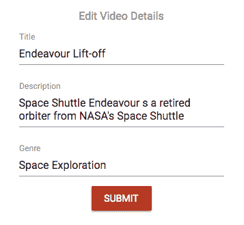

# 构建 Media Streaming 应用程序

上传和流式传输媒体内容，特别是视频内容，已经是一段时间来互联网文化中增长的部分。从个人分享个人视频内容到娱乐行业在在线流媒体服务上传播商业内容，我们都依赖于能够实现顺畅上传和流式传输的 Web 应用程序。MERN 技术栈中的功能可以用于构建和集成这些核心流媒体功能到任何基于 MERN 的全栈应用程序中。在本章中，我们将扩展 MERN 框架应用程序来构建一个媒体流媒体应用程序，同时展示如何利用 MongoDB GridFS 并将媒体流式传输功能添加到您的 Web 应用程序中。

在本章中，我们将涵盖以下主题，通过扩展 MERN 框架应用程序来实现基本的媒体上传和流式传输：

+   介绍 MERN Mediastream

+   将视频上传到 MongoDB GridFS

+   存储和检索媒体详情

+   从 GridFS 流式传输视频到基本媒体播放器

+   列出、显示、更新和删除媒体

# 介绍 MERN Mediastream

我们将通过扩展框架应用程序来构建 MERN Mediastream 应用程序。这将是一个简单的视频流媒体应用程序，允许注册用户上传任何浏览应用程序的人都可以流式传输的视频。以下截图显示了 MERN Mediastream 应用程序的主页视图，以及平台上流行的视频列表：


完整的 MERN Mediastream 应用程序的代码可在 GitHub 上找到：[`github.com/PacktPublishing/Full-Stack-React-Projects-Second-Edition/tree/master/Chapter11%20and%2012/mern-mediastream`](https://github.com/PacktPublishing/Full-Stack-React-Projects-Second-Edition/tree/master/Chapter11%20and%2012/mern-mediastream)。

您可以克隆此代码，并在阅读本章其余部分的代码解释时运行应用程序。

需要开发用于简单媒体播放器中媒体上传、编辑和流媒体功能的用户界面视图，这些视图将通过扩展和修改 MERN 框架应用程序中的现有 React 组件来实现。以下图表显示了将在本章中开发的 MERN Mediastream 前端的所有自定义 React 组件：


我们将添加新的 React 组件来实现上传新视频、列出已发布的媒体、修改媒体帖子细节以及显示视频的视图。用户可以与视频内容进行交互以流式传输和观看视频。我们还将修改现有的组件，例如`Home`组件，以便我们可以渲染热门视频列表，以及`Profile`组件，以便我们可以列出特定用户发布的所有视频。应用程序中的上传和流媒体功能将依赖于用户上传视频内容的能力。在下一节中，我们将讨论如何允许已登录用户向应用程序添加媒体。

# 上传和存储媒体

MERN Mediastream 应用程序的注册用户将能够从本地文件上传视频，并使用 GridFS 直接在 MongoDB 上存储每个视频及其相关细节。为了使应用程序能够上传媒体内容，我们需要定义如何存储媒体细节和视频内容，并实现一个全栈切片，使用户能够创建新的媒体帖子并上传视频文件。在接下来的章节中，首先我们将定义一个媒体模型来存储每个媒体帖子的细节，并配置 GridFS 以存储相关的视频内容。然后，我们将讨论后端 API 的实现，该 API 将接收并存储视频内容以及其他媒体细节，以及前端表单视图，它将允许用户在应用程序上创建新的媒体帖子。

# 定义媒体模型

我们将实现一个 Mongoose 模型来定义一个媒体模型，用于存储发布到应用程序的每条媒体的细节。此模型将在`server/models/media.model.js`中定义，其实现将与我们在前几章中介绍的 Mongoose 模型实现类似，例如我们在第六章中定义的课程模型。该模型中的媒体模式将包含记录媒体标题、描述、类型、观看次数、媒体发布和更新的日期以及引用发布媒体的用户的字段。定义媒体字段的代码如下：

+   **媒体标题**：`title`字段被声明为`String`类型，并将是一个必填字段，用于介绍上传到应用程序的媒体：

```js
title: {
    type: String,
    required: 'title is required'
}
```

+   **媒体描述和类型**：`description`和`genre`字段将属于`String`类型，并将存储有关发布的媒体的其他细节。`genre`字段还将允许我们将上传到应用程序的不同媒体分组。

```js
 description: String,
 genre: String,
```

+   **观看次数**：`views`字段定义为`Number`类型，并将跟踪上传的媒体在应用程序中被用户观看的次数：

```js
views: {
    type: Number, 
    default: 0
},
```

+   **发布媒体的用户**：`postedBy`字段将引用创建媒体帖子的用户：

```js

 postedBy: {
    type: mongoose.Schema.ObjectId, 
    ref: 'User'
 },
```

+   **创建和更新时间**：`created`和`updated`字段将是`Date`类型，`created`在添加新媒体时生成，`updated`在修改任何媒体详细信息时更改：

```js
updated: Date,
created: { 
    type: Date, 
    default: Date.now 
},
```

添加到模式定义中的字段将只存储关于每个发布到应用程序的视频的详细信息。为了存储视频内容本身，我们将使用 MongoDB GridFS。在下一节中，在讨论如何实现上传视频文件之前，我们将讨论 GridFS 如何使 MongoDB 中存储大文件成为可能，然后添加初始化代码以开始在这个流式应用中使用 GridFS。

# 使用 MongoDB GridFS 存储大文件

在前面的章节中，我们讨论了用户上传的文件可以直接作为二进制数据存储在 MongoDB 中；例如，在第五章的“上传个人照片”部分添加个人照片时。但这仅适用于小于 16 MB 的文件。为了在 MongoDB 中存储更大的文件，例如本流式应用所需的视频文件，我们需要使用 GridFS。

GridFS 是 MongoDB 中的一个规范，允许我们将一个给定的文件分割成几个块来存储在 MongoDB 中。每个块的大小最大为 255 KB，并作为单独的文档存储。当需要根据对 GridFS 的查询检索文件时，块会根据需要重新组装。这提供了只获取和加载文件所需部分而不是整个文件的功能。

在存储和检索 MERN Mediastream 应用程序的视频文件的情况下，我们将利用 GridFS 来存储视频文件，并根据用户跳转到的部分和开始播放的部分流式传输视频的相应部分。

您可以在官方 MongoDB 文档中了解更多关于 GridFS 规范及其功能的信息，请参阅[`docs.mongodb.com/manual/core/gridfs/`](https://docs.mongodb.com/manual/core/gridfs/)。

要从我们的后端代码访问和使用 MongoDB GridFS，我们将通过创建一个`GridFSBucket`并使用建立的数据库连接来使用 Node.js MongoDB 驱动程序的流式 API。

GridFSBucket 是 GridFS 流式接口，它为我们提供了访问流式 GridFS API 的权限。它可以用来与 GridFS 中的文件进行交互。您可以在 Node.js MongoDB 驱动程序 API 文档中了解更多关于 GridFSBucket 和流式 API 的信息，请参阅[`mongodb.github.io/node-mongodb-native/3.2/api/GridFSBucket.html`](https://mongodb.github.io/node-mongodb-native/3.2/api/GridFSBucket.html)。

由于我们使用 Mongoose 与 MongoDB 数据库建立应用程序的连接，因此将在连接建立后添加以下代码来初始化一个新的`GridFSBucket`。

`mern-mediastream/server/controllers/media.controller.js`:

```js
import mongoose from 'mongoose'
let gridfs = null
mongoose.connection.on('connected', () => {
  gridfs = new mongoose.mongo.GridFSBucket(mongoose.connection.db)
})
```

我们在这里创建的`gridfs`对象将为我们提供访问 GridFS 功能，这些功能在创建新媒体时存储视频文件以及在媒体要流回用户时检索文件时是必需的。在下一节中，我们将添加创建媒体表单视图和后端 API，这些 API 将使用此`gridfs`对象来保存与前端表单视图发送的请求一起上传的视频文件。 

# 创建新的媒体帖子

为了让用户能够在应用程序中创建新的媒体帖子，我们需要集成一个全栈切片，允许用户在前端填写表单，然后在后端将提供的媒体细节和相关的视频文件保存到数据库中。为了实现这个功能，在接下来的章节中，我们将在后端添加一个创建媒体 API，以及在前端获取此 API 的方法。然后，我们将实现一个创建新媒体表单视图，允许用户输入媒体细节并从他们的本地文件系统中选择视频文件。

# 创建媒体 API

我们将在后端实现一个创建媒体 API，允许用户在应用程序上创建新的媒体帖子。此 API 将在`'/api/media/new/:userId'`接收包含媒体字段和上传的视频文件的 multipart 请求体。首先，我们将声明创建媒体路由并利用用户控制器中的`userByID`方法，如下所示。

`mern-mediastream/server/routes/media.routes.js`:

```js
router.route('/api/media/new/:userId')
        .post(authCtrl.requireSignin, mediaCtrl.create)
router.param('userId', userCtrl.userByID)
```

`userByID`方法处理 URL 中传递的`:userId`参数，并从数据库中检索相关的用户。用户对象将在请求对象中可用，以便在将要执行的下一种方法中使用。类似于用户和认证路由，我们将在`express.js`中将媒体路由挂载到 Express 应用上，如下所示。

`mern-mediastream/server/express.js`:

```js
app.use('/', mediaRoutes)
```

向创建路由 URL `/api/media/new/:userId` 发送 POST 请求，将确保用户已登录，然后初始化媒体控制器中的`create`方法。`create`控制器方法将使用`formidable`节点模块来解析包含用户上传的媒体细节和视频文件的 multipart 请求体。您可以从命令行运行以下命令来安装此模块：

```js
yarn add formidable
```

在`create`方法中，我们将使用在表单数据中接收并使用`formidable`解析的媒体字段来生成一个新的媒体对象，并将其保存到数据库中。这个`create`控制器方法定义如下。

`mern-mediastream/server/controllers/media.controller.js`:

```js
const create = (req, res) => {
  let form = new formidable.IncomingForm()
  form.keepExtensions = true
  form.parse(req, async (err, fields, files) => {
      if (err) {
        return res.status(400).json({
          error: "Video could not be uploaded"
        })
      }
      let media = new Media(fields)
      media.postedBy= req.profile
      if(files.video){
        let writestream = gridfs.openUploadStream(media._id, {
 contentType: files.video.type || 'binary/octet-stream'})
 fs.createReadStream(files.video.path).pipe(writestream)
      }
      try {
        let result = await media.save()
        res.status(200).json(result)
      }
      catch (err){
          return res.status(400).json({
            error: errorHandler.getErrorMessage(err)
          })
      }
    })
}
```

如果请求中有文件，`formidable` 将将其临时存储在文件系统中。我们将使用这个临时文件和媒体对象的 ID，通过 `gridfs.openUploadStream` 创建一个可写流。在这里，临时文件将被读取并写入 MongoDB GridFS，同时设置 `filename` 值为媒体 ID。这将生成与 MongoDB 中的相关块和文件信息文档，当需要检索此文件时，我们将使用媒体 ID 来识别它。

要在前端使用此创建媒体 API，我们将在 `api-media.js` 中添加相应的 `fetch` 方法，通过传递视图中的多部分表单数据向 API 发送 `POST` 请求。此方法将定义如下。

`mern-mediastream/client/media/api-media.js`:

```js
const create = async (params, credentials, media) => {
  try {
    let response = await fetch('/api/media/new/'+ params.userId, {
    method: 'POST',
    headers: {
      'Accept': 'application/json',
      'Authorization': 'Bearer ' + credentials.t
    },
    body: media
  }) 
    return await response.json()
  } catch(err) {
    console.log(err)
  }
}
```

此 `create` 获取方法将获取当前用户的 ID、用户凭据和媒体表单数据，向后端创建媒体 API 发送 POST 请求。当用户提交新的媒体表单以上传新视频并在应用程序上发布时，我们将使用此方法。在下一节中，我们将查看前端中此表单视图的实现。

# 新媒体组件

在 MERN Mediastream 应用程序上注册的用户将通过表单视图输入新媒体帖子的详细信息。此表单视图将在 `NewMedia` 组件中渲染，允许已登录用户通过输入视频的标题、描述和类型以及从本地文件系统中上传视频文件来创建媒体帖子。

此表单视图将呈现如下：


我们将在这个名为 `NewMedia` 的 React 组件中实现此表单。对于视图，我们将使用 Material-UI 的 `Button` 和 HTML5 文件 `input` 元素添加文件上传元素，如下面的代码所示。

`mern-mediastream/client/media/NewMedia.js`:

```js
<input accept="video/*" 
       onChange={handleChange('video')} 
       id="icon-button-file" 
       type="file"
       style={{display: none}}/>
<label htmlFor="icon-button-file">
    <Button color="secondary" variant="contained" component="span">
       Upload <FileUpload/>
    </Button>
</label> 
<span>{values.video ? values.video.name : ''}</span>

```

在文件 `input` 元素中，我们指定它接受视频文件，因此当用户点击上传并浏览其本地文件夹时，他们只有上传视频文件的选择。

然后，在视图中，我们添加了标题、描述和类型的表单字段，使用 `TextField` 组件，如下面的代码所示。

`mern-mediastream/client/media/NewMedia.js`:

```js
<TextField id="title" label="Title" value={values.title} 
           onChange={handleChange('title')} margin="normal"/><br/>
<TextField id="multiline-flexible" label="Description"
           multiline rows="2"
           value={values.description}
           onChange={handleChange('description')}/><br/>
<TextField id="genre" label="Genre" value={values.genre} 
           onChange={handleChange('genre')}/><br/>
```

当用户与输入字段交互输入值时，这些表单字段更改将通过 `handleChange` 方法进行跟踪。`handleChange` 函数将定义如下。

`mern-mediastream/client/media/NewMedia.js`:

```js
const handleChange = name => event => {
    const value = name === 'video'
      ? event.target.files[0]
      : event.target.value
    setValues({ ...values, [name]: value })
}
```

`handleChange` 方法通过更新状态来跟踪新值，包括如果用户上传了视频文件，则包括视频文件名。

最后，你可以通过添加一个提交按钮来完成此表单视图，当用户点击提交按钮时，应将表单数据发送到服务器。我们在这里定义一个 `clickSubmit` 方法，当用户点击提交按钮时将被调用。

`mern-mediastream/client/media/NewMedia.js`:

```js
  const clickSubmit = () => {
    let mediaData = new FormData()
    values.title && mediaData.append('title', values.title)
    values.video && mediaData.append('video', values.video)
    values.description && mediaData.append('description',
       values.description)
    values.genre && mediaData.append('genre', values.genre)
    create({
      userId: jwt.user._id
    }, {
      t: jwt.token
    }, mediaData).then((data) => {
      if (data.error) {
        setValues({...values, error: data.error})
      } else {
        setValues({...values, error: '', mediaId: data._id, 
           redirect: true})
      }
    })
  }
```

此`clickSubmit`函数将获取输入值并填充`mediaData`，这是一个`FormData`对象，确保数据以正确的格式存储在`multipart/form-data`编码类型中。然后，调用`create` fetch 方法使用此表单数据在后端创建新的媒体。在成功创建媒体后，用户可能会被重定向到不同的视图，例如，到一个包含新媒体详情的媒体视图，如下面的代码所示。

`mern-mediastream/client/media/NewMedia.js`:

```js
if (values.redirect) {
    return (<Redirect to={'/media/' + values.mediaId}/>)
}
```

`NewMedia`组件只能由已登录用户查看。因此，我们将在`MainRouter`组件中添加一个`PrivateRoute`，这样它只会在`/media/new`为认证用户渲染此表单。

`mern-mediastream/client/MainRouter.js`:

```js
<PrivateRoute path="/media/new" component={NewMedia}/>
```

此链接可以添加到任何视图，例如在菜单组件中，以便在用户登录时条件性地渲染。现在，由于可以在本媒体流应用中添加新的媒体帖子，在下一节中，我们将讨论检索和渲染与每个媒体帖子关联的视频内容的实现。这将使用户能够从应用程序的前端流式传输和查看存储在 MongoDB GridFS 中的视频文件。

# 检索和流式传输媒体

任何浏览 MERN Mediastream 应用程序的访客都将能够查看用户在应用程序上发布的媒体。实现此功能需要将存储在 MongoDB GridFS 中的视频文件流式传输到请求客户端，并在媒体播放器中渲染流。在以下章节中，我们将设置一个后端 API 来检索单个视频文件，然后我们将将其用作基于 React 的媒体播放器的源来渲染流式视频。

# 视频 API

要检索与单个媒体帖子关联的视频文件，我们将实现一个接受 GET 请求的 get 视频 API，请求地址为`'/api/medias/video/:mediaId'`，并查询媒体集合和 GridFS 文件。我们将通过声明以下代码中的路由以及处理 URL 中的`:mediaId`参数的方式来实现此视频 API。

`mern-mediastream/server/routes/media.routes.js`:

```js
router.route('/api/medias/video/:mediaId')
        .get(mediaCtrl.video)
router.param('mediaId', mediaCtrl.mediaByID)
```

路由 URL 中的`:mediaId`参数将在`mediaByID`控制器中处理，以从媒体集合和 GridFS 文件中检索相关文档和文件详情。然后，这些检索到的结果将附加到请求对象中，以便可以在`video`控制器方法中按需使用。此`mediaByID`控制器方法定义如下。

`mern-mediastream/server/controllers/media.controller.js`:

```js
const mediaByID = async (req, res, next, id) => {
  try{
  let media = await Media.findById(id).populate('postedBy', 
      '_id name').exec()
    if (!media)
      return res.status('400').json({
        error: "Media not found"
      })
      req.media = media
     let files = await gridfs.find({filename:media._id}).toArray()
 if (!files[0]) {
 return res.status(404).send({
 error: 'No video found'
 })
 } 
 req.file = files[0]
        next()
    }catch(err) {
      return res.status(404).send({
        error: 'Could not retrieve media file'
      })
    }
}
```

要从 GridFS 检索相关文件详情，我们使用 MongoDB 流式 API 中的`find`。我们通过文件名值查询存储在 GridFS 中的文件，该值应与媒体集合中相应的媒体 ID 相匹配。然后，我们以数组形式接收匹配的文件记录，并将第一个结果附加到请求对象中，以便在下一个方法中使用。

当这个 API 接收到请求时，调用的下一个方法是`video`控制器方法。在这个方法中，根据请求是否包含范围头，我们发送回正确的视频块，并将相关内容信息设置为响应头。`video`控制器方法定义如下结构，响应的组成取决于请求中是否存在范围头。

`mern-mediastream/server/controllers/media.controller.js`:

```js
const video = (req, res) => {
  const range = req.headers["range"]  
    if (range && typeof range === "string") {
      ...
      ... consider range headers and send only relevant chunks in response ...
      ...
  } else {
      res.header('Content-Length', req.file.length)
      res.header('Content-Type', req.file.contentType)

      let downloadStream = gridfs.openDownloadStream(req.file._id)
      downloadStream.pipe(res)
      downloadStream.on('error', () => {
        res.sendStatus(404)
      })
      downloadStream.on('end', () => {
        res.end()
      })
   }
}
```

在前面的代码中，如果请求不包含范围头，我们使用`gridfs.openDownloadStream`流回整个视频文件，这为我们提供了存储在 GridFS 中的相应文件的可读流。这个流与发送回客户端的响应一起管道传输。在响应头中，我们设置了文件的内容类型和总长度。

如果请求包含范围头——例如，当用户拖动到视频中间并从该点开始播放时——我们需要将接收到的范围头转换为起始和结束位置，这将与存储在 GridFS 中的正确块相对应，如下面的代码所示。

`mern-mediastream/server/controllers/media.controller.js`:

```js
    const parts = range.replace(/bytes=/, "").split("-")
    const partialstart = parts[0]
    const partialend = parts[1]

    const start = parseInt(partialstart, 10)
    const end = partialend ? parseInt(partialend, 10) : req.file.length - 1
    const chunksize = (end - start) + 1

    res.writeHead(206, {
        'Accept-Ranges': 'bytes',
 'Content-Length': chunksize,
 'Content-Range': 'bytes ' + start + '-' + end + '/' + req.file.length,
 'Content-Type': req.file.contentType
    })

    let downloadStream = gridfs.openDownloadStream(req.file._id, {start, end: end+1})
    downloadStream.pipe(res)
    downloadStream.on('error', () => {
      res.sendStatus(404)
    })
    downloadStream.on('end', () => {
      res.end()
    })
```

我们将已从头部提取的起始和结束值作为范围传递给`gridfs.openDownloadStream`。这些起始和结束值指定了从 0 开始的字节数，以开始流式传输并在此之前停止流式传输。我们还设置了包含附加文件详情的响应头，包括内容长度、范围和类型。内容长度现在将是定义范围内的内容总大小。因此，返回给响应的可读流，在这种情况下，将只包含位于起始和结束范围内的文件数据块。

在接收到此获取视频 API 请求后，最终的可读流被管道传输到响应，可以直接在前端视图的基本 HTML5 媒体播放器或 React 风格的媒体播放器中渲染。在下一节中，我们将探讨如何在简单的 React 媒体播放器中渲染此视频流。

# 使用 React 媒体播放器渲染视频

在应用程序的前端，我们可以在媒体播放器中渲染从 MongoDB GridFS 流出的视频文件。对于 React 风格的媒体播放器，一个好的选择是作为节点模块提供的`ReactPlayer`组件，可以根据需要自定义。将视频流作为源提供给默认的`ReactPlayer`组件将渲染带有基本播放控件，如下面的截图所示：


要开始在前端代码中使用 `ReactPlayer`，我们需要通过在命令行中运行以下 Yarn 命令来安装相应的节点模块：

```js
yarn add react-player 
```

安装完成后，我们可以将其导入到任何 React 组件中，并将其添加到视图中。对于使用浏览器提供的默认控件的基本用法，我们可以在任何具有要渲染的媒体 ID 访问权限的应用程序中的任何 React 视图中添加它，如下面的代码所示：

```js
<ReactPlayer url={'/api/media/video/'+media._id} controls/>
```

这将加载从获取视频 API 收到的视频流播放器，并为用户提供基本控制选项来与正在播放的流进行交互。`ReactPlayer` 可以进行自定义，以便提供更多选项。我们将在下一章中探讨一些用于自定义此 `ReactPlayer` 并使用我们自己的控件的高级选项。

要了解 `ReactPlayer` 可以实现的功能，请访问 [cookpete.com/react-player](https://cookpete.com/react-player)。

现在，可以检索存储在 MongoDB GridFS 中的单个视频文件并将其流式传输到前端媒体播放器，以便用户可以按需查看和播放视频。在下一节中，我们将讨论如何从后端获取并显示多个视频列表到流媒体应用程序的前端。

# 列出媒体

在 MERN Mediastream 中，我们将添加相关媒体的列表视图，每个视频都有一个快照，以便访客更容易访问并对应用程序中的视频有一个概述。例如，在下面的屏幕截图中，`Profile` 组件显示对应用户发布的媒体列表，显示每个媒体的预览和其他详细信息：


我们将在后端设置列表 API 来检索不同的列表，例如单个用户上传的视频和应用程序中观看次数最高的最受欢迎的视频。然后，这些检索到的列表可以在可重用的 `MediaList` 组件中渲染，该组件将从获取特定 API 的父组件接收媒体对象列表作为属性。在以下章节中，我们将实现 `MediaList` 组件和后端 API，以从数据库中检索两种不同的媒体列表。

# 媒体列表组件

`MediaList` 组件是一个可重用的组件，它将接受一个媒体列表并遍历它，在视图中渲染每个媒体项。在 MERN Mediastream 中，我们使用它来渲染主页视图中最受欢迎的媒体列表以及特定用户在其个人资料中上传的媒体列表。

在 `MediaList` 组件的视图部分，我们将使用 `map` 通过 `props` 中接收到的 `media` 数组，如下面的代码所示。

`mern-mediastream/client/media/MediaList.js`:

```js
<GridList cols={3}>
    {props.media.map((tile, i) => (
        <GridListTile key={i}>
          <Link to={"/media/"+tile._id}>
            <ReactPlayer url={'/api/media/video/'+tile._id} 
               width='100%' height='inherit' style=
                 {{maxHeight:   '100%'}}/>
          </Link>
          <GridListTileBar title={<Link 
              to={"/media/"+tile._id}> {tile.title} </Link>}
            subtitle={<span>
                        <span>{tile.views} views</span>
                        <span className={classes.tileGenre}>
                        <em>{tile.genre}</em>
                        </span>
                    </span>}
          />
        </GridListTile>
    ))}
</GridList>
```

这个`MediaList`组件使用 Material-UI 的`GridList`组件，在遍历传入 props 的对象数组时渲染列表中每个项目的媒体详情。它还包括一个`ReactPlayer`组件，该组件渲染视频 URL 而不显示任何控件。在视图中，这为访客提供了每件媒体的一个简要概述，以及视频内容的预览。

这个组件可以添加到任何可以提供媒体对象数组的视图中。在 MERN Mediastream 应用程序中，我们使用它来渲染两个不同的媒体列表：一个是热门媒体列表，另一个是特定用户发布的媒体列表。在下一节中，我们将探讨如何从数据库中检索热门媒体列表并在前端渲染它。

# 列出热门媒体

为了从数据库中检索特定的媒体列表，我们需要在服务器上设置相关的 API。对于热门媒体，我们将设置一个接收`/api/media/popular`的 GET 请求的路由。该路由的声明如下。

`mern-mediastream/server/routes/media.routes.js`:

```js
 router.route('/api/media/popular')
          .get(mediaCtrl.listPopular)
```

对此 URL 的 GET 请求将调用`listPopular`方法。`listPopular`控制器方法将查询媒体集合并检索整个集合中观看次数最高的九个媒体文档。`listPopular`方法定义如下。

`mern-mediastream/server/controllers/media.controller.js`:

```js
const listPopular = async (req, res) => {
  try{
    let media = await Media.find({})
    .populate('postedBy', '_id name')
    .sort('-views')
    .limit(9)
    .exec()
    res.json(media)
  } catch(err){
    return res.status(400).json({
      error: errorHandler.getErrorMessage(err)
    })
  }
}
```

查询媒体集合返回的结果按观看次数降序排列，并限制为九个。列表中的每个媒体文档也将包含发布该文档的用户名称和 ID，因为我们调用`populate`来添加这些用户属性。

这个 API 可以用一个 fetch 请求在前端使用。你可以在`api-media.js`中定义一个相应的 fetch 方法来发起请求，类似于其他 API 实现。然后，可以在 React 组件中调用这个 fetch 方法，例如在本应用程序的`Home`组件中。在`Home`组件中，我们将使用`useEffect`钩子获取热门视频列表，如下面的代码所示。

`mern-mediastream/client/core/Home.js`:

```js
  useEffect(() => {
    const abortController = new AbortController()
    const signal = abortController.signal
    listPopular(signal).then((data) => {
      if (data.error) {
        console.log(data.error)
      } else {
        setMedia(data)
      }
    })
    return function cleanup(){
      abortController.abort()
    }
  }, [])
```

在此钩子中从 API 获取的列表被设置在状态中，以便可以将其传递给视图中的`MediaList`组件。在主页视图中，我们可以添加`MediaList`，如下所示，将列表作为 prop 提供。

`mern-mediastream/client/core/Home.js`:

```js
<MediaList media={media}/>
```

这将在 MERN Mediastream 应用程序的主页上渲染数据库中最受欢迎的前九个视频列表。在下一节中，我们将讨论一个类似的实现来检索和渲染特定用户发布的媒体列表。

# 按用户列出媒体

为了能够从数据库中检索特定用户上传的媒体列表，我们将设置一个 API，该 API 通过`/api/media/by/:userId`接受一个`GET`请求。该路由的声明如下。

`mern-mediastream/server/routes/media.routes.js`:

```js
router.route('/api/media/by/:userId')
         .get(mediaCtrl.listByUser) 
```

对此路由的 GET 请求将调用`listByUser`方法。`listByUser`控制器方法将查询 Media 集合以找到具有与 URL 中附加的`userId`匹配的`postedBy`值的媒体文档。`listByUser`控制器方法定义如下。

`mern-mediastream/server/controllers/media.controller.js`:

```js
const listByUser = async (req, res) => {
  try{
    let media = await Media.find({postedBy: req.profile._id})
      .populate('postedBy', '_id name')
      .sort('-created')
      .exec()
    res.json(media)
  } catch(err){
      return res.status(400).json({
        error: errorHandler.getErrorMessage(err)
      })
  }
}
```

从 Media 集合查询返回的结果按创建日期排序，最新帖子首先显示。此列表中的每个媒体文档也将包含发布该文档的用户名称和 ID，因为我们调用`populate`来添加这些用户属性。

此 API 可以通过前端使用 fetch 请求来使用。你可以在`api-media.js`中定义相应的`fetch`方法来发起请求，类似于其他 API 实现。然后，可以在 React 组件中调用`fetch`方法。在我们的应用程序中，我们使用`Profile`组件中的`fetch`方法，类似于我们在主页视图中使用的`listPopular` fetch 方法，来检索列表数据，将其设置到状态中，然后传递给`MediaList`组件。这将渲染一个包含相应用户发布的媒体列表的个人信息页面。

我们可以通过利用后端已实现的 API 来获取列表数据，在应用程序中检索和显示多个视频。我们还可以在前端视图中渲染列表时，使用无控制条的 ReactPlayer 组件，让用户对每个视频有一个大致的了解。在下一节中，我们将讨论将显示媒体帖子并允许授权用户在应用程序中更新和删除单个媒体帖子的全栈切片。

# 显示、更新和删除媒体

每位访问 MERN Mediastream 的访客都将能够查看媒体详细信息并流式传输视频，而只有注册用户才能编辑媒体详情并在发布后随时删除它。在以下章节中，我们将实现包括后端 API 和前端视图在内的全栈切片，以显示单个媒体帖子、更新媒体帖子的详情以及从应用程序中删除媒体帖子。

# 显示媒体

每位访问 MERN Mediastream 的访客都将能够浏览到单个媒体视图来播放视频并读取与之相关的详细信息。每次在应用程序中加载特定视频时，我们也将增加与媒体相关的观看次数。在以下章节中，我们将通过向后端添加读取媒体 API、从前端调用此 API 以及将在视图中显示媒体详细信息的相关 React 组件来实现单个媒体视图。

# 读取媒体 API

在后端实现读取媒体 API，我们首先通过添加一个`GET`路由来查询带有 ID 的`Media`集合，并在响应中返回媒体文档。该路由声明如下。

`mern-mediastream/server/routes/media.routes.js`:

```js
router.route('/api/media/:mediaId')
    .get( mediaCtrl.incrementViews, mediaCtrl.read)
```

请求 URL 中的 `mediaId` 将导致 `mediaByID` 控制器方法执行，并将检索到的媒体文档附加到请求对象中，以便在下一个方法中访问。

向此 API 发送 `GET` 请求将执行 `incrementViews` 控制器方法，该方法将找到匹配的媒体记录，并将 `views` 值增加 `1`，然后将更新后的记录保存到数据库中。`incrementViews` 方法定义如下。

`mern-mediastream/server/controllers/media.controller.js`:

```js
const incrementViews = async (req, res, next) => {
  try {
    await Media.findByIdAndUpdate(req.media._id, 
       {$inc: {"views": 1}}, {new: true}).exec()
    next()
  } catch(err){
      return res.status(400).json({
          error: errorHandler.getErrorMessage(err)
      })
  }
}
```

每次调用此读取媒体 API 时，此方法将增加给定媒体的观看次数 1。从 `incrementViews` 方法更新媒体后，将调用 `read` 控制器方法。`read` 控制器方法将简单地返回检索到的媒体文档作为对请求客户端的响应，如下所示。

`mern-mediastream/server/controllers/media.controller.js`:

```js
const read = (req, res) => {
  return res.json(req.media)
}
```

要检索响应中发送的媒体文档，我们需要在前端使用 fetch 方法调用此读取媒体 API。我们将在 `api-media.js` 中设置相应的 fetch 方法，如下所示。

`mern-mediastream/client/media/api-media.js`:

```js
const read = async (params, signal) => {
  try {
    let response = await fetch('/api/media/' + params.mediaId, {
    method: 'GET',
    signal: signal
  })
    return await response.json()
  } catch(err) {
    console.log(err)
  }
}
```

此方法获取要检索的媒体 ID，并使用 `fetch` 向读取 API 路由发送 `GET` 请求。

读取媒体 API 可以用于在视图中渲染单个媒体详细信息，或预先填充媒体编辑表单。在下一节中，我们将使用此 fetch 方法在 React 组件中调用读取媒体 API 以渲染媒体详细信息，以及将播放相关视频的 `ReactPlayer`。

# 媒体组件

`Media` 组件将渲染单个媒体记录的详细信息，并使用基本 `ReactPlayer` 和默认浏览器控件进行视频流。完成的单个媒体视图将如下所示：


`Media` 组件可以调用读取 API 来获取媒体数据本身，或者从调用读取 API 的父组件接收数据作为 props。在后一种情况下，父组件将在 `useEffect` 钩子中从服务器获取媒体，将其设置为状态，并将其添加到 `Media` 组件中，如下所示。

`mern-mediastream/client/media/PlayMedia.js`:

```js
<Media media={media}/>
```

在 MERN Mediastream 中，我们将在 `PlayMedia` 组件中添加 `Media` 组件，该组件使用读取 API 在 `useEffect` 钩子中从服务器获取媒体内容，并将其作为 props 传递给 `Media`。`PlayMedia` 组件的组成将在下一章中更详细地讨论。

`Media` 组件将接受 props 中的数据，并在视图中渲染以显示详细信息，并在 `ReactPlayer` 组件中加载视频。媒体标题、类型和观看次数的详细信息可以在 `Media` 组件中的 Material-UI `CardHeader` 组件中渲染，如下所示。

`mern-mediastream/client/media/Media.js`:

```js
<CardHeader 
   title={props.media.title}
   action={<span>
                {props.media.views + ' views'}
           </span>}
   subheader={props.media.genre}
/>
```

除了渲染这些媒体详情外，我们还将加载`Media`组件中的视频。视频 URL 基本上是我们后端设置的获取视频 API 路由，在`ReactPlayer`中以默认浏览器控件加载，如下面的代码所示。

`mern-mediastream/client/media/Media.js`:

```js
const mediaUrl = props.media._id
          ? `/api/media/video/${props.media._id}`
          : null
            … 
<ReactPlayer url={mediaUrl} 
             controls
             width={'inherit'}
             height={'inherit'}
             style={{maxHeight: '500px'}}
             config={{ attributes: 
                        { style: { height: '100%', width: '100%'} } 
}}/>
```

这将渲染一个简单的播放器，允许用户播放视频流。

`Media` 组件还会渲染发布视频的用户的其他详细信息，视频描述以及创建日期，如下面的代码所示。

`mern-mediastream/client/media/Media.js`:

```js
<ListItem>
    <ListItemAvatar>
      <Avatar>
        {props.media.postedBy.name && 
                        props.media.postedBy.name[0]}
      </Avatar>
    </ListItemAvatar>
    <ListItemText primary={props.media.postedBy.name} 
              secondary={"Published on " + 
                        (new Date(props.media.created))
                        .toDateString()}/>
</ListItem>
<ListItem>
    <ListItemText primary={props.media.description}/>
</ListItem>
```

在 Material-UI `ListItem` 组件中显示的详情中，我们还将根据当前登录用户是否是显示的媒体发布者有条件地显示编辑和删除选项。为了在视图中有条件地渲染这些元素，我们将在显示日期的`ListItemText`之后添加以下代码。

`mern-mediastream/client/media/Media.js`:

```js
{(auth.isAuthenticated().user && auth.isAuthenticated().user._id) 
    == props.media.postedBy._id && (<ListItemSecondaryAction>
        <Link to={"/media/edit/" + props.media._id}>
          <IconButton aria-label="Edit" color="secondary">
            <Edit/>
          </IconButton>
        </Link>
        <DeleteMedia mediaId={props.media._id} mediaTitle=
       {props.media.title}/>
      </ListItemSecondaryAction>)}
```

这将确保只有在当前用户已登录并且是显示的媒体的上传者时，才会渲染编辑和删除选项。编辑选项链接到媒体编辑表单，而删除选项打开一个对话框，可以启动从数据库中删除此特定媒体文档的操作。在下一节中，我们将实现此选项的功能，以编辑已上传媒体帖子的详情。

# 更新媒体详情

注册用户将能够访问他们每个媒体上传的编辑表单。更新并提交此表单将保存对媒体集合中给定文档的更改。为了实现这一功能，我们需要创建一个后端 API，允许在确认请求用户已认证并授权后对给定媒体进行更新操作。然后，需要从前端调用此更新 API，并带上媒体更改的详细信息。在接下来的章节中，我们将构建这个后端 API 和 React 组件，以便用户能够修改他们在应用程序上已发布的媒体。

# 媒体更新 API

在后端，我们需要一个 API，允许我们在用户是请求的媒体帖子的授权创建者的情况下更新数据库中的现有媒体。首先，我们将声明 PUT 路由，该路由接受来自客户端的更新请求。

`mern-mediastream/server/routes/media.routes.js`:

```js
router.route('/api/media/:mediaId')
        .put(authCtrl.requireSignin, 
                mediaCtrl.isPoster, 
                    mediaCtrl.update)
```

当接收到 `'api/media/:mediaId'` 的 PUT 请求时，服务器将确保已登录用户是媒体内容的原始发布者，通过调用`isPoster`控制器方法。`isPoster`控制器方法定义如下。

`mern-mediastream/server/controllers/media.controller.js`:

```js
const isPoster = (req, res, next) => {
 let isPoster = req.media && req.auth 
    && req.media.postedBy._id == req.auth._id
 if(!isPoster){
 return res.status('403').json({
 error: "User is not authorized"
 })
 }
 next()
}
```

此方法确保认证用户的 ID 与给定媒体文档中`postedBy`字段引用的用户 ID 相同。如果用户被授权，则将调用`update`控制器方法`next`以使用更改更新现有的媒体文档。`update`控制器方法定义如下。

`mern-mediastream/server/controllers/media.controller.js`:

```js
const update = async (req, res) => {
  try {
    let media = req.media
    media = extend(media, req.body)
    media.updated = Date.now()
    await media.save()
    res.json(media)
  } catch(err){
    return res.status(400).json({
        error: errorHandler.getErrorMessage(err)
    })
  }
}
```

此方法通过在请求体中接收到的更改详情扩展现有的媒体文档，并将更新的媒体保存到数据库中。

为了在前端访问更新 API，我们将在`api-media.js`中添加一个相应的 fetch 方法，该方法在向此更新媒体 API 发出 fetch 调用之前，将必要的用户认证凭证和媒体详细信息作为参数传递，如下所示。

`mern-mediastream/client/user/api-media.js`:

```js
const update = async (params, credentials, media) => {
  try {
    let response = await fetch('/api/media/' + params.mediaId, {
    method: 'PUT',
    headers: {
      'Accept': 'application/json',
      'Content-Type': 'application/json',
      'Authorization': 'Bearer ' + credentials.t
    },
    body: JSON.stringify(media)
  }) 
    return await response.json()
    } catch(err) {
      console.log(err)
    }
}
```

当用户进行更新并提交表单时，将使用此 fetch 方法在媒体编辑表单中。在下一节中，我们将讨论此媒体编辑表单的实现。

# 媒体编辑表单

允许授权用户更改媒体帖子详细信息的媒体编辑表单将与新媒体表单类似。然而，它将没有上传选项，字段将预先填充现有值，如下面的截图所示：



包含此表单的`EditMedia`组件将通过在`useEffect`钩子中调用读取媒体 API 来获取媒体的现有值，如下面的代码所示。

`mern-mediastream/client/media/EditMedia.js`:

```js
  useEffect(() => {
    const abortController = new AbortController()
    const signal = abortController.signal

    read({mediaId: match.params.mediaId}).then((data) => {
      if (data.error) {
        setError(data.error)
      } else {
        setMedia(data)
      }
    })
    return function cleanup(){
      abortController.abort()
    }
  }, [match.params.mediaId])
```

获取的媒体详细信息被设置为状态，以便可以在文本字段中渲染值。表单字段元素将与`NewMedia`组件中的相同。当用户更新表单中的任何值时，通过调用`handleChange`方法，这些更改将在状态中的`media`对象中注册。`handleChange`方法定义如下。

`mediastream/client/media/EditMedia.js`:

```js
  const handleChange = name => event => {
    let updatedMedia = {...media}
    updatedMedia[name] = event.target.value
    setMedia(updatedMedia)
  }
```

在这个方法中，表单中正在更新的特定字段会在状态中的媒体对象对应的属性中反映出来。当用户完成编辑并点击提交时，将调用带有所需凭证和更改后的媒体值的更新 API。这是通过调用以下定义的`clickSubmit`方法来完成的。

`mediastream/client/media/EditMedia.js`:

```js
  const clickSubmit = () => {
    const jwt = auth.isAuthenticated()
    update({
      mediaId: media._id
    }, {
      t: jwt.token
    }, media).then((data) => {
      if (data.error) {
        setError(data.error)
      } else {
        setRedirect(true)
      }
    })
  }
```

调用更新媒体 API 将更新媒体集合中相应媒体文档的媒体详细信息，而与媒体关联的视频文件在数据库中保持不变。

这个`EditMedia`组件只能由已登录的用户访问，并将渲染在`'/media/edit/:mediaId'`。因此，我们将在`MainRouter`组件中添加一个`PrivateRoute`，如下所示。

`mern-mediastream/client/MainRouter.js`:

```js
<PrivateRoute path="/media/edit/:mediaId" component={EditMedia}/>
```

此链接在`Media`组件中添加了一个编辑图标，允许发布媒体的用户访问编辑页面。在`Media`视图中，用户还可以选择删除他们的媒体帖子。我们将在下一节中实现此功能。

# 删除媒体

授权用户可以完全删除他们上传到应用程序的媒体，包括媒体集合中的媒体文档和在 MongoDB 中使用的 GridFS 存储的文件块。为了允许用户从应用程序中删除媒体，在以下章节中，我们将定义一个从数据库中删除媒体的后端 API，并实现一个 React 组件，当用户与前端交互以执行此删除操作时，该组件将使用此 API。

# 删除媒体 API

要从数据库中删除媒体，我们将在后端实现一个删除媒体 API，该 API 将接受客户端在`/api/media/:mediaId`上的 DELETE 请求。我们将为此 API 添加以下`DELETE`路由，这将允许授权用户删除他们上传的媒体记录。

`mern-mediastream/server/routes/media.routes.js`:

```js
router.route('/api/media/:mediaId')
        .delete(authCtrl.requireSignin, 
                    mediaCtrl.isPoster, 
                        mediaCtrl.remove)
```

当服务器在`'/api/media/:mediaId'`接收到 DELETE 请求时，它将通过调用`isPoster`控制器方法来确保已登录用户是媒体的原帖发布者。然后，`remove`控制器方法将完全从数据库中删除指定的媒体。`remove`方法定义如下。

`mern-mediastream/server/controllers/media.controller.js`:

```js
const remove = async (req, res) => {
  try {
    let media = req.media
    let deletedMedia = await media.remove()
    gridfs.delete(req.file._id)
    res.json(deletedMedia)
  } catch(err) {
    return res.status(400).json({
      error: errorHandler.getErrorMessage(err)
    })
  }
}
```

除了从媒体集合中删除媒体记录外，我们还使用`gridfs`来删除存储在数据库中的相关文件详情和块。

要在前端访问此后端 API，您还需要一个具有此路由的 fetch 方法，类似于其他 API 实现。fetch 方法需要获取媒体 ID 和当前用户的认证凭证，以便使用这些值调用删除媒体 API。

当用户通过在前端界面中点击按钮执行删除操作时，将使用 fetch 方法。在下一节中，我们将讨论一个名为`DeleteMedia`的 React 组件，其中用户将通过此删除媒体操作执行。

# DeleteMedia 组件

`DeleteMedia`组件被添加到`Media`组件中，并且只对添加了此特定媒体的已登录用户可见。此组件基本上是一个按钮，当点击时，会打开一个`Dialog`组件，提示用户确认删除操作，如以下截图所示：


当`DeleteMedia`组件在`Media`组件中添加时，它接受媒体 ID 和标题作为 props。其实现方式将与我们在第四章中讨论的`DeleteUser`组件类似，即*添加 React 前端以完成 MERN*。一旦添加了`DeleteMedia`组件，用户通过确认他们的操作，就能完全从应用程序中移除发布的媒体。

本章中我们开发的 MERN Mediastream 应用程序是一个完整的媒体流应用程序，具有将视频文件上传到数据库、流回存储的视频给观众、支持如媒体创建、更新、读取和删除等 CRUD 操作，以及支持按上传者或流行度列出媒体的功能。

# 摘要

在本章中，我们通过扩展 MERN 框架应用程序并利用 MongoDB GridFS 开发了媒体流应用程序。

除了为媒体上传添加基本的添加、更新、删除和列表功能外，我们还探讨了基于 MERN 的应用程序如何允许用户上传视频文件，将这些文件作为块存储到 MongoDB GridFS 中，并根据需要部分或全部流回给观众。我们还介绍了如何使用带有默认浏览器控制的`ReactPlayer`来流式传输视频文件。您可以将这些流式传输功能应用于可能需要从数据库中存储和检索大型文件的任何全栈应用程序。

在下一章中，我们将学习如何自定义`ReactPlayer`以包含我们自己的控件和功能，以便用户有更多的选择，例如播放列表中的下一个视频。此外，我们还将讨论如何通过实现带有媒体视图数据的服务器端渲染来提高媒体详情的 SEO。
