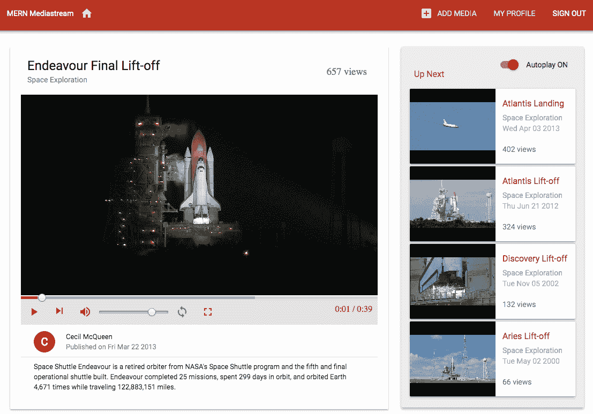
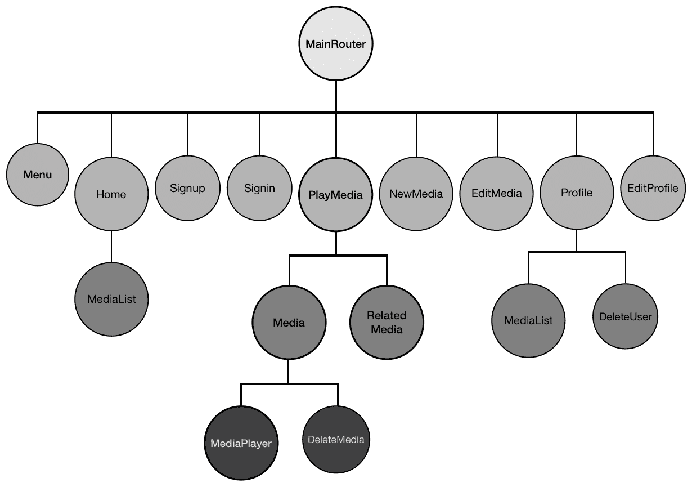
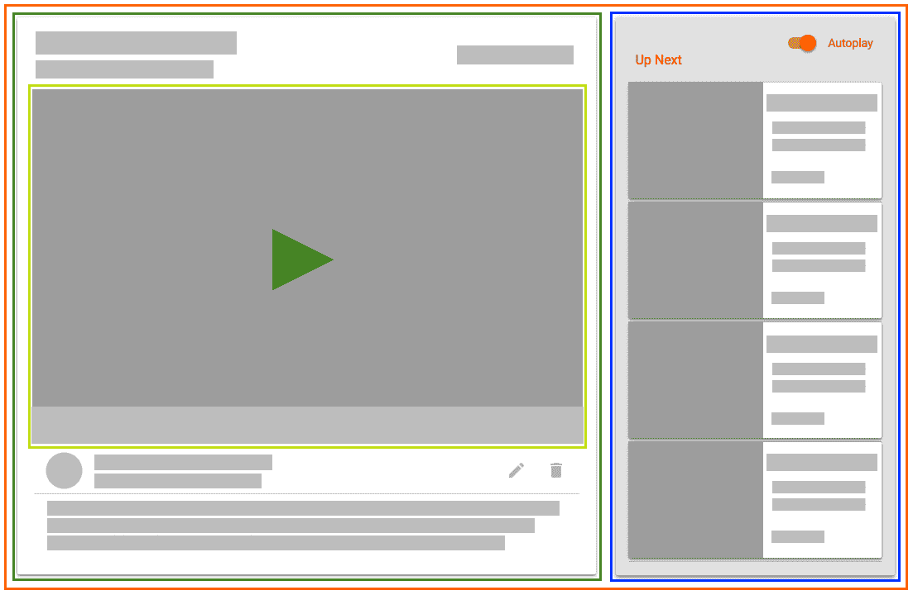
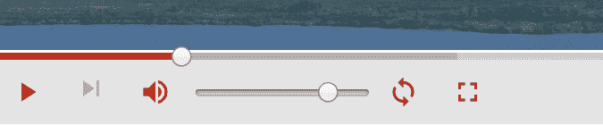
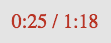
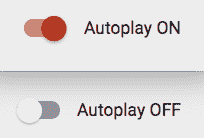
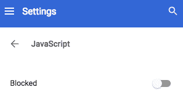
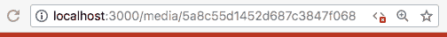
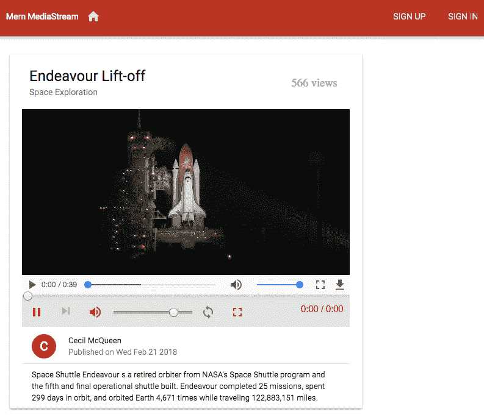

# 自定义媒体播放器并改进 SEO

用户访问媒体流应用主要是为了播放媒体和探索其他相关媒体。这使得媒体播放器——以及渲染相关媒体详情的视图——对于流应用至关重要。

在本章中，我们将专注于开发我们在上一章（第十一章，构建媒体流应用）开始构建的 MERN Mediastream 应用程序的播放媒体页面。我们将解决以下问题，以增强媒体播放功能，并帮助提升媒体内容在网上的影响力，使其触及更多用户：

+   在`ReactPlayer`上自定义播放器控件

+   从相关视频列表中播放下一个视频

+   自动播放相关媒体列表

+   **服务器端渲染**（**SSR**）的`PlayMedia`视图，以数据改进**搜索引擎优化**（**SEO**）

完成这些主题后，您将更擅长设计前端用户界面中 React 组件之间的复杂交互，并提高您的全栈 React 应用程序的 SEO。

# 将自定义媒体播放器添加到 MERN Mediastream

上一章中开发的 MERN Mediastream 应用程序实现了一个简单的媒体播放器，带有默认浏览器控件，一次播放一个视频。在本章中，我们将使用定制的`ReactPlayer`和相关媒体列表更新播放媒体视图，该列表可以在当前视频结束时自动播放。带有自定义播放器和相关播放列表的更新视图将类似于以下截图：



完整的 MERN Mediastream 应用程序代码可在 GitHub 上找到，网址为[`github.com/PacktPublishing/Full-Stack-React-Projects-Second-Edition/tree/master/Chapter11%20and%2012/mern-mediastream`](https://github.com/PacktPublishing/Full-Stack-React-Projects-Second-Edition/tree/master/Chapter11%20and%2012/mern-mediastream)。您可以将此代码克隆并运行，以便在阅读本章剩余部分的代码解释时运行应用程序。

下面的组件树图显示了构成 MERN Mediastream 前端的所有自定义组件，包括本章中将改进或添加的组件：



本章中修改的组件和新添加的组件包括`PlayMedia`组件，它包含所有媒体播放器功能；`MediaPlayer`组件，它添加了一个带有自定义控件的`ReactPlayer`；以及`RelatedMedia`组件，它包含一个相关视频列表。在下一节中，我们将讨论播放媒体页面的结构，以及它将如何容纳本章中将在 MERN Mediastream 应用程序中扩展的所有媒体观看和交互功能。

# 播放媒体页面

当访客想在 MERN Mediastream 上查看特定媒体时，他们将被带到播放媒体页面，该页面将包含媒体详情、用于流式传输视频的媒体播放器以及可以播放的相关媒体列表。我们将使用名为 `PlayMedia` 的 React 组件实现此 `PlayMedia` 视图。在下一节中，我们将讨论如何构建此组件以实现这些功能。

# 组件结构

我们将在播放媒体页面中构建组件结构，以便将媒体数据从父组件逐级传递到内部组件。在这种情况下，`PlayMedia` 组件将是父组件，包含 `RelatedMedia` 组件，还包含 `Media` 组件，该组件将包含嵌套的 `MediaPlayer` 组件，如下面的截图所示：



当在应用程序的前端访问单个媒体链接时，`PlayMedia` 组件将从服务器检索并加载相应的媒体数据和相关媒体列表。然后，相关细节将通过 props 传递给 `Media` 和 `RelatedMedia` 子组件。

`RelatedMedia` 组件将列出并链接其他相关媒体，点击列表中的任何媒体将重新渲染 `PlayMedia` 组件及其内部组件，并使用新数据。

我们将更新第十一章 `Building a Media-Streaming Application` 中开发的 `Media` 组件，以添加一个自定义媒体播放器作为子组件。这个定制的 `MediaPlayer` 组件也将利用从 `PlayMedia` 传递过来的数据来流式传输当前视频并链接到相关媒体列表中的下一个视频。

在 `PlayMedia` 组件中，我们将添加一个自动播放切换功能，允许用户选择是否自动播放相关媒体列表中的视频，一个接一个。自动播放状态将由 `PlayMedia` 组件管理，但此功能需要在 `MediaPlayer` 嵌套子组件中视频结束时重新渲染父组件状态中的数据，以确保下一视频能够自动播放，同时跟踪相关列表。

为了实现这一点，`PlayMedia` 组件需要提供一个状态更新方法作为 prop，该 prop 将在 `MediaPlayer` 组件中使用，以更新这些组件之间的共享和相互依赖的状态值。

考虑到这个组件结构，我们将扩展并更新 MERN Mediastream 应用程序，以实现一个功能齐全的播放媒体页面。在下一节中，我们将首先添加一个功能，在 `PlayMedia` 视图中向用户提供相关媒体列表。

# 列出相关媒体

当用户在应用程序中查看单个媒体时，他们将在同一页面上看到相关媒体列表。相关媒体列表将包括属于与给定视频相同类型的其他媒体记录，并按观看次数最高的顺序排序。为了实现此功能，我们需要集成一个全栈切片，从后端的媒体集合中检索相关列表并在前端渲染它。在接下来的几节中，我们将在后端添加一个相关媒体列表 API，以及在前端获取此 API 的方法和一个 React 组件，用于渲染通过此 API 检索到的媒体列表。

# 相关媒体列表 API

我们将在后端实现一个 API 端点来从数据库中检索相关媒体的列表。该 API 将在`'/api/media/related/:mediaId'`接收`GET`请求，并且该路由将与其他媒体路由一起声明，如下所示：

`mern-mediastream/server/routes/media.routes.js`

```js
router.route('/api/media/related/:mediaId')
        .get(mediaCtrl.listRelated)
```

路径中的`:mediaId`参数将由第十一章中“视频 API”部分实现的`mediaByID`方法处理，该部分是构建媒体流应用。它从数据库中检索与该 ID 对应的媒体，并将其附加到`request`对象中，以便在下一种方法中访问。`listRelated`控制器方法是调用此 API 路由的`GET`请求的下一个方法。此方法将查询媒体集合以找到与提供的媒体具有相同类型的记录，并排除返回结果中的给定媒体记录。`listRelated`控制器方法定义如下所示：

`mern-mediastream/server/controllers/media.controller.js`

```js
const listRelated = async (req, res) => {
  try {
    let media = await Media.find({ "_id": { "$ne": req.media }, 
          "genre": req.media.genre})
      .limit(4)
      .sort('-views')
      .populate('postedBy', '_id name')
      .exec()
    res.json(media)
  } catch (err) {
    return res.status(400).json({
      error: errorHandler.getErrorMessage(err)
    })
  }
}
```

查询返回的结果将按观看次数最高的顺序排序，并限制为前四个媒体记录。返回结果中的每个`media`对象也将包含发布媒体的用户的名称和 ID，如`populate`方法中指定。

在客户端，我们将设置一个相应的`fetch`方法，该方法将在`PlayMedia`组件中使用，以使用此 API 检索相关媒体列表。此方法定义如下：

`mern-mediastream/client/media/api-media.js`

```js
const listRelated = async (params, signal) => {
  try {
    let response = await fetch('/api/media/related/'+ params.mediaId, {
    method: 'GET',
    signal: signal,
    headers: {
      'Accept': 'application/json',
      'Content-Type': 'application/json'
    }
  })
      return await response.json()
  } catch(err) {
    console.log(err)
  }
}
```

这个`listRelated`获取方法将接受一个媒体 ID，并向后端的相关媒体列表 API 发起一个`GET`请求。我们将在`PlayMedia`组件中使用此方法来检索与当前媒体播放器中加载的媒体相关的媒体列表。然后，这个列表将在`RelatedMedia`组件中显示。在下一节中，我们将探讨这个`RelatedMedia`组件的实现。

# 相关媒体组件

在播放媒体页面上，除了在播放器中加载的媒体外，我们将在`RelatedMedia`组件中加载相关媒体列表。`RelatedMedia`组件将从`PlayMedia`组件接收相关媒体列表作为 prop，并渲染列表中每个视频的详细信息以及视频快照，如图所示：


在`RelatedMedia`视图的实现中，我们使用`map`函数遍历从 props 接收到的媒体数组，并按以下代码结构渲染每个媒体的详细信息以及视频快照：

`mern-mediastream/client/media/RelatedMedia.js`

```js
{props.media.map((item, i) => { 
    return 
      <span key={i}>... video snapshot ... | ... media details ...</span> 
  })
}
```

在此结构中，为了渲染每个媒体项目的视频快照，我们将使用不带控件的基本`ReactPlayer`，如下所示：

`mern-mediastream/client/media/RelatedMedia.js`

```js

<Link to={"/media/"+item._id}>
  <ReactPlayer url={'/api/media/video/'+item._id} 
               width='160px'    
               height='140px'/>
</Link>
```

我们将`ReactPlayer`包装在一个链接中，以访问此媒体的单独视图。因此，点击给定的视频快照将重新渲染`PlayMedia`视图以加载链接媒体的详细信息。在快照旁边，我们将显示每个视频的详细信息，包括标题、类型、创建日期和观看次数，以下代码所示：

`mern-mediastream/client/media/RelatedMedia.js`

```js
<Typography type="title" color="primary">{item.title}</Typography>
<Typography type="subheading"> {item.genre} </Typography>
<Typography component="p">
        {(new Date(item.created)).toDateString()}
</Typography>
<Typography type="subheading">{item.views} views</Typography>
```

这将为接收到的 props 中每个相关媒体列表中的媒体渲染视频快照旁边的详细信息。

要在播放媒体页面上渲染此`RelatedMedia`组件，我们必须将其添加到`PlayMedia`组件中。`PlayMedia`组件将使用本节中较早实现的关联媒体列表 API 从后端检索相关媒体，并将其作为 props 传递给`RelatedMedia`组件。在下一节中，我们将讨论此`PlayMedia`组件的实现。

# `PlayMedia`组件

`PlayMedia`组件将渲染播放媒体页面。此组件由`Media`和`RelatedMedia`子组件以及自动播放切换组成，并在加载到视图中时为这些组件提供数据。

当用户访问单个媒体链接时，我们将向`MainRouter`中添加一个`Route`，并在`'/media/:mediaId'`处挂载`PlayMedia`，如下所示：

`mern-mediastream/client/MainRouter.js`

```js
<Route path="/media/:mediaId" component={PlayMedia}/>
```

当`PlayMedia`组件挂载时，它将根据路由链接中的`mediaId`参数使用`useEffect`钩子从服务器获取媒体数据和相关媒体列表。

在一个`useEffect`钩子中，它将获取要在媒体播放器中加载的媒体，如下所示：

`mern-mediastream/client/media/PlayMedia.js`

```js
useEffect(() => {
     const abortController = new AbortController()
     const signal = abortController.signal

     read({mediaId: props.match.params.mediaId}, signal).then((data) => {
         if (data && data.error) {
             console.log(data.error)
         } else {
             setMedia(data)
         }
     })
     return function cleanup(){
         abortController.abort()
     }
}, [props.match.params.mediaId])
```

从 React Router 组件接收到的`props.match`中访问路由路径中的媒体 ID。它在调用`read` API 获取方法时用于从服务器检索媒体详细信息。接收到的`media`对象被设置在状态中，以便可以在`Media`组件中渲染。

在另一个 `useEffect` 钩子中，我们使用相同的媒体 ID 调用 `listRelated` API 获取方法，如下面的代码所示。

`mern-mediastream/client/media/PlayMedia.js`

```js
useEffect(() => {
    const abortController = new AbortController()
    const signal = abortController.signal

    listRelated({
      mediaId: props.match.params.mediaId}, signal).then((data) => {
      if (data.error) {
        console.log(data.error)
      } else {
        setRelatedMedia(data)
      }
    })
    return function cleanup(){
      abortController.abort()
    }
}, [props.match.params.mediaId])
```

`listRelated` API 获取方法从服务器检索相关媒体列表，并将值设置到状态中，以便在 `RelatedMedia` 组件中渲染。

存储在状态中的媒体和相关媒体列表值用于将这些属性传递给在视图中添加的子组件。例如，在以下代码中，只有当相关媒体列表包含任何媒体时，`RelatedMedia` 组件才会被渲染，并将列表作为属性传递给它：

`mern-mediastream/client/media/PlayMedia.js`

```js
{relatedMedia.length > 0 && 
      (<RelatedMedia media={relatedMedia}/>)}
```

在本章的后面部分，在 *自动播放相关媒体* 部分中，我们将在相关媒体列表长度大于 `0` 的情况下，仅在 `RelatedMedia` 组件上方添加 `Autoplay` 切换组件。我们还将讨论将作为属性传递给 `Media` 组件的 `handleAutoPlay` 方法的实现。它还将接收 `media` 详细对象，以及相关媒体列表中第一项的视频 URL，这将被视为下一个要播放的 URL。`Media` 组件被添加到 `PlayMedia` 中，并带有这些属性，如下面的代码所示：

`mern-mediastream/client/media/PlayMedia.js`

```js
const nextUrl = relatedMedia.length > 0
          ? `/media/${relatedMedia[0]._id}` : ''
<Media media={media} 
       nextUrl={nextUrl} 
       handleAutoplay={handleAutoplay}/>
```

此 `Media` 组件在播放媒体页面上渲染媒体详情，以及一个定制的媒体播放器，允许观众控制视频的流。在下一节中，我们将讨论此定制媒体播放器的实现，并完成播放媒体页面的核心功能。

# 定制媒体播放器

在 MERN Mediastream 中，我们希望为用户提供一个比默认浏览器选项更多的控件，并且外观与应用程序的其他部分相匹配。我们将定制 `ReactPlayer` 上的播放器控件，用自定义的外观和功能替换这些默认控件，如下面的截图所示：


控件将被添加到视频下方，包括进度搜索栏；播放、暂停、下一曲、音量、循环和全屏选项；还将显示视频的总时长和已播放的量。在以下章节中，我们首先更新上一章中讨论的 `Media` 组件，第十一章，*构建媒体流应用*，以适应新的播放器功能。然后，在实现此播放器中自定义媒体控件的功能之前，我们将初始化一个包含新播放器的 `MediaPlayer` 组件。

# 更新媒体组件

现有的`Media`组件包含一个基本的`ReactPlayer`，它具有默认的浏览器控件，用于播放指定的视频。我们将用一个新的`MediaPlayer`组件替换这个`ReactPlayer`，我们将在下一节开始实现它。`MediaPlayer`组件将包含一个定制的`ReactPlayer`，并且它将被添加到`Media`组件代码中，如下所示：

`mern-mediastream/client/media/Media.js`

```js
const mediaUrl = props.media._id
          ? `/api/media/video/${props.media._id}`
          : null
...
<MediaPlayer srcUrl={mediaUrl} 
             nextUrl={props.nextUrl} 
             handleAutoplay={props.handleAutoplay}/>
```

当将此`MediaPlayer`组件添加到`Media`组件时，它将传递当前视频的源 URL、下一视频的源 URL 以及`handleAutoPlay`方法，这些作为`props`在`Media`组件中从`PlayMedia`组件接收。这些 URL 值和自动播放处理方法将在`MediaPlayer`组件中用于添加各种视频播放选项。在下一节中，我们将开始实现这个`MediaPlayer`组件，通过初始化添加到自定义媒体播放器中所需的不同值来添加功能控制。

# 初始化媒体播放器

我们将在`MediaPlayer`组件中实现定制的媒体播放器。这个播放器将渲染从后端流出的视频，并为用户提供不同的控制选项。我们将使用`ReactPlayer`组件将此媒体播放功能以及自定义控制选项集成到`MediaPlayer`中。正如前一章所讨论的，`ReactPlayer`组件提供了一系列的自定义选项，我们将利用这些选项来实现本应用程序中要添加的媒体播放器功能。

在定义`MediaPlayer`组件时，我们将在添加自定义功能及其对应的用户操作处理代码之前，首先初始化`ReactPlayer`组件的控制起始值。

我们自定义的控制值将对应于`ReactPlayer`组件中允许的属性。要查看可用属性列表及其解释，请访问 [github.com/CookPete/react-player#props](https://github.com/CookPete/react-player#props)。

首先，我们需要在组件的状态中设置初始的控制值。我们将从以下对应于以下控制值的控制值开始：

+   媒体的播放状态

+   音频的音量

+   静音状态

+   视频的时长

+   搜索状态

+   视频的播放速率

+   循环值

+   全屏值

+   视频错误

+   正在流媒体的视频的播放、加载和结束状态

初始化这些值的代码将添加如下：

`mern-mediastream/client/media/MediaPlayer.js`

```js
  const [playing, setPlaying] = useState(false)
  const [volume, setVolume] = useState(0.8) 
  const [muted, setMuted] = useState(false)  
  const [duration, setDuration] = useState(0)
  const [seeking, setSeeking] = useState(false) 
  const [playbackRate, setPlaybackRate] = useState(1.0) 
  const [loop, setLoop] = useState(false) 
  const [fullscreen, setFullscreen] = useState(false)
  const [videoError, setVideoError] = useState(false) 
  const [values, setValues] = useState({
    played: 0, loaded: 0, ended: false
  })
```

在状态中设置的这些值将允许我们自定义`ReactPlayer`组件中相应控制的功能，我们将在下一节中详细讨论。

在`MediaPlayer`组件的视图代码中，我们将添加这个`ReactPlayer`，并使用从`Media`组件发送的 prop，使用这些控制值和源 URL，如下面的代码所示：

`mern-mediastream/client/media/MediaPlayer.js`

```js
<ReactPlayer
 ref={ref}
 width={fullscreen ? '100%':'inherit'}
 height={fullscreen ? '100%':'inherit'}
 style={fullscreen ? {position:'relative'} : {maxHeight: '500px'}}
 config={{ attributes: { style: { height: '100%', width: '100%'} } }}
 url={props.srcUrl}
 playing={playing}
 loop={loop}
 playbackRate={playbackRate}
 volume={volume}
 muted={muted}
 onEnded={onEnded}
 onError={showVideoError}
 onProgress={onProgress}
 onDuration={onDuration}/>
```

除了设置控件值外，我们还将根据播放器是否处于全屏模式添加样式。我们还需要获取浏览器中渲染的此播放器元素的引用，以便可以在自定义控件的代码中使用它。我们将使用`useRef` React 钩子将引用初始化为`null`，然后使用`ref`方法将其设置为相应的播放器元素，如下面的代码所示：

`mern-mediastream/client/media/MediaPlayer.js`

```js
let playerRef = useRef(null)
const ref = player => {
    playerRef = player
}
```

`playerRef`中的值将提供对浏览器中渲染的播放器元素的访问权限。我们将使用此引用按需操作播放器，以使自定义控件功能化。

作为初始化媒体播放器的最后一步，我们将添加处理播放器抛出的错误代码，如果由于任何原因指定的视频源无法加载。我们将定义一个`showVideoError`方法，当发生视频错误时将被调用。`showVideoError`方法将定义如下：

`mern-mediastream/client/media/MediaPlayer.js`

```js
  const showVideoError = e => {
    console.log(e)
    setVideoError(true)
  }
```

此方法将在媒体播放器上方的视图中渲染错误消息。我们可以通过在`ReactPlayer`上方的视图中添加以下代码有条件地显示此错误消息：

`mern-mediastream/client/media/MediaPlayer.js`

```js
{videoError && <p className={classes.videoError}>Video Error. Try again later.</p>}
```

当发生错误时，这将渲染视频错误消息。由于我们将允许用户从相关媒体列表中在播放器中播放另一个视频，因此如果加载了新视频，我们将重置错误消息。我们可以通过确保`useEffect`仅在视频源 URL 更改时运行，使用`useEffect`钩子来隐藏新视频加载时的错误消息，如下面的代码所示：

`mern-mediastream/client/media/MediaPlayer.js`

```js
useEffect(() => {
    setVideoError(false)
}, [props.srcUrl])
```

这将确保在新的视频加载并正确流式传输时不会显示错误消息。

在设置了这些初始控件值并将`ReactPlayer`添加到组件后，在下一节中，我们可以开始自定义这些控件在我们应用程序中的外观和功能。

# 自定义媒体控件

我们将在`MediaPlayer`组件中渲染的视频下方添加自定义播放器控件元素，并使用`ReactPlayer`库提供的选项和事件操作其功能。在以下章节中，我们将实现播放、暂停和重放控件；播放下一个控件；循环功能；音量控制选项；进度控制选项；全屏选项，并显示视频的总时长和已播放的量。

# 播放、暂停和重放

用户将能够播放、暂停和重放当前视频。我们将使用绑定到`ReactPlayer`属性和事件的`Material-UI`组件实现这三个选项。播放、暂停和重放选项将渲染如下截图所示：


为了实现播放、暂停和重播功能，我们将根据视频是否正在播放、是否已暂停或已结束，有条件地添加播放、暂停或重播图标按钮，如下面的代码所示：

`mern-mediastream/client/media/MediaPlayer.js`

```js
<IconButton color="primary" onClick={playPause}>
    <Icon>{playing ? 'pause': (ended ? 'replay' : 'play_arrow')}</Icon>
</IconButton>
```

根据三元运算符的结果，在此 `IconButton` 中渲染播放、暂停或重播图标。

当用户点击按钮时，我们将更新状态中的 `playing` 值，以便更新 `ReactPlayer`。我们通过在按钮点击时调用 `playPause` 方法来实现这一点。`playPause` 方法如下定义：

`mern-mediastream/client/media/MediaPlayer.js`

```js
const playPause = () => {
    setPlaying(!playing)
}
```

状态中 `playing` 的更新值将根据 `ReactPlayer` 组件相应地播放或暂停视频。在下一节中，我们将看到如何添加一个控制选项，允许我们从相关媒体列表中播放下一个视频。

# 下一个播放

用户可以使用下一个播放按钮播放相关媒体列表中的下一个视频，该按钮将根据下一个视频是否可用而渲染。此下一个播放按钮的两个版本如下截图所示：


如果相关列表不包含任何媒体，则下一个播放按钮将被禁用。下一个播放图标将基本链接到从 `PlayMedia` 传递的作为属性的下一个 URL 值。此下一个播放按钮将被添加到 `MediaPlayer` 视图中，如下所示：

`mern-mediastream/client/media/MediaPlayer.js`

```js
<IconButton disabled={!props.nextUrl} color="primary">
    <Link to={props.nextUrl}>
       <Icon>skip_next</Icon>
    </Link>
</IconButton>
```

点击此下一个播放按钮将重新加载带有新媒体详情的 `PlayMedia` 组件并开始播放视频。在下一节中，我们将添加一个控制选项，允许当前视频循环播放。

# 视频结束时循环

用户可以使用循环按钮设置当前视频循环播放。循环按钮将以两种状态渲染，即设置和取消设置，如下面的截图所示：


此循环图标按钮将以不同的颜色显示，以指示它是否已被用户设置或取消设置。渲染此循环按钮的代码将被添加到 `MediaPlayer` 中，如下所示：

`mern-mediastream/client/media/MediaPlayer.js`

```js
<IconButton color={loop ? 'primary' : 'default'} 
            onClick={onLoop}>
    <Icon>loop</Icon>
</IconButton>
```

循环图标颜色将根据状态中 `loop` 的值而改变。当点击此循环图标按钮时，我们将通过调用以下定义的 `onLoop` 方法来更新状态中的 `loop` 值：

`mern-mediastream/client/media/MediaPlayer.js`

```js
const onLoop = () => {
    setLoop(!loop)
}
```

当此 `loop` 值设置为 `true` 时，视频将循环播放。我们需要捕获 `onEnded` 事件，以检查 `loop` 是否已设置为 `true`，以便相应地更新 `playing` 值。当视频到达结束时，将调用 `onEnded` 方法。此 `onEnded` 方法如下定义：

`mern-mediastream/client/media/MediaPlayer.js`

```js
const onEnded = () => {
  if(loop){
    setPlaying(true)
  } else{
    setValues({...values, ended: true}) 
    setPlaying(false)
  }
}
```

因此，如果将`loop`值设置为`true`，当视频结束时，它将再次开始播放；否则，它将停止播放并渲染重播按钮。在下一节中，我们将添加设置视频音量的控件。

# 音量控制

为了控制正在播放的视频的音量，用户可以选择增加或降低音量，以及静音或取消静音。渲染的音量控件将根据用户操作和当前音量值进行更新。音量控件的不同状态如下：

+   如果音量提高，将渲染一个音量增加图标，如下所示截图：


+   如果用户将音量降低到零，将渲染一个音量关闭图标，如下所示：


+   如果用户点击图标以静音音量，将显示一个音量静音图标按钮，如下所示：


为了实现这一点，我们将根据`volume`、`muted`、`volume_up`和`volume_off`值有条件地渲染`IconButton`中的不同图标，如下所示代码：

```js
<IconButton color="primary" onClick={toggleMuted}>
    <Icon> {volume > 0 && !muted && 'volume_up' || 
            muted && 'volume_off' || 
               volume==0 && 'volume_mute'} </Icon>
</IconButton>
```

当点击此 `IconButton` 时，将通过调用`toggleMuted`方法来静音或取消静音音量，该方法定义如下：

`mern-mediastream/client/media/MediaPlayer.js`

```js
const toggleMuted = () => {
    setMuted(!muted)
}
```

根据状态中`muted`的当前值，音量将被静音或取消静音。为了允许用户增加或降低音量，我们将添加一个类型为`range`的输入元素，允许用户设置介于`0`和`1`之间的音量值。此输入元素将添加到代码中，如下所示：

`mern-mediastream/client/media/MediaPlayer.js`

```js
<input type="range" 
       min={0} 
       max={1} 
       step='any' 
       value={muted? 0 : volume} 
       onChange={changeVolume}/>
```

在输入范围上更改`value`将通过调用`changeVolume`方法相应地设置状态中的`volume`值。此`changeVolume`方法定义如下：

`mern-mediastream/client/media/MediaPlayer.js`

```js
const changeVolume = e => {
    setVolume(parseFloat(e.target.value))
}
```

状态中`volume`值的变化将应用于`ReactPlayer`，这将设置当前播放媒体的音量。在下一节中，我们将添加控制正在播放的视频进度的选项。

# 进度控制

在媒体播放器中，用户将看到视频已加载和播放的部分，并在进度条中显示。为了实现此功能，我们将使用 Material-UI 的`LinearProgress`组件来指示视频已缓冲的部分以及已播放的部分。然后，我们将结合此组件与类型为`range`的输入元素，使用户能够将时间滑块移动到视频的不同部分并从那里播放。

这次时间滑块和进度条将渲染如下截图所示：



`LinearProgress`组件将使用状态中的`played`和`loaded`值来渲染这些条形。它将使用`played`和`loaded`值来显示不同的颜色，如下面的代码所示：

`mern-mediastream/client/media/MediaPlayer.js`

```js
<LinearProgress color="primary" variant="buffer" 
                value={values.played*100} valueBuffer={values.loaded*100} 
                style={{width: '100%'}} 
                classes={{
                          colorPrimary: classes.primaryColor,
                          dashedColorPrimary : classes.primaryDashed,
                          dashed: classes.dashed
                        }}
/>
```

每个进度条的外观和颜色将由您为`primaryColor`、`dashedColorPrimary`和`dashed`类定义的样式决定。

为了在视频播放或加载时更新`LinearProgress`组件，我们将使用`onProgress`事件监听器来设置`played`和`loaded`的当前值。`onProgress`方法将定义如下所示：

`mern-mediastream/client/media/MediaPlayer.js`

```js
const onProgress = progress => {
  if (!seeking) {
    setValues({...values, played: progress.played, loaded: progress.loaded})
  }
}
```

我们只想在当前未搜索时更新时间滑块，因此我们首先在设置`played`和`loaded`值之前检查状态中的`seeking`值。

对于时间滑动控制，我们将添加范围输入元素并定义样式，如下面的代码所示，将其放置在`LinearProgress`组件之上。范围值将随着`played`值的变化而更新，因此范围值看起来会随着视频的进度而移动。这个代表时间滑块的输入元素将被添加到媒体播放器中，如下面的代码所示：

`mern-mediastream/client/media/MediaPlayer.js`

```js
<input type="range" min={0} max={1}
       value={values.played} step='any'
       onMouseDown={onSeekMouseDown}
       onChange={onSeekChange}
       onMouseUp={onSeekMouseUp}
       style={{ position: 'absolute',
                width: '100%',
                top: '-7px',
                zIndex: '999',
                '-webkit-appearance': 'none',
                backgroundColor: 'rgba(0,0,0,0)' }}
/>
```

在用户自己拖动并设置范围选择器的情况下，我们将添加代码来处理`onMouseDown`、`onMouseUp`和`onChange`事件，以便从所需位置开始播放视频。

当用户按下鼠标开始拖动时，我们将`seeking`设置为`true`，这样就不会在`played`和`loaded`中设置进度值。这将通过定义如下所示的`onSeekMouseDown`方法来实现：

`mern-mediastream/client/media/MediaPlayer.js`

```js
const onSeekMouseDown = e => {
    setSeeking(true)
}
```

当范围值发生变化时，我们将调用`onSeekChange`方法来设置`played`值，并在检查用户是否将时间滑块拖动到视频末尾后设置`ended`值。此`onSeekChange`方法将定义如下：

`mern-mediastream/client/media/MediaPlayer.js`

```js
const onSeekChange = e => {
    setValues({...values, played:parseFloat(e.target.value), 
                          ended: parseFloat(e.target.value) >= 1})
}
```

当用户完成拖动并抬起鼠标点击时，我们将`seeking`设置为`false`，并将媒体播放器的`seekTo`值设置为输入范围中当前设置的值。当用户完成搜索后，将执行`onSeekMouseUp`方法，其定义如下：

`mern-mediastream/client/media/MediaPlayer.js`

```js
const onSeekMouseUp = e => {
    setSeeking(false)
    playerRef.seekTo(parseFloat(e.target.value))
}
```

这样，用户将能够选择视频的任何部分进行播放，并获得正在流式传输的视频的时间进度视觉信息。在下一节中，我们将添加一个控件，允许用户以全屏模式查看视频。

# 全屏

用户可以通过点击控制栏中的全屏按钮以全屏模式查看视频。播放器的全屏按钮将渲染如下截图所示：


为了为视频实现全屏选项，我们将使用`screenfull`节点模块来跟踪视图是否处于全屏状态，并使用`react-dom`中的`findDOMNode`来指定哪个**文档对象模型**（**DOM**）元素将通过`screenfull`实现全屏。

为了设置`fullscreen`代码，我们首先通过在命令行中运行以下命令来安装`screenfull`：

```js
yarn add screenfull
```

然后，我们将导入`screenfull`和`findDOMNode`到`MediaPlayer`组件中，如下面的代码所示：

`mern-mediastream/client/media/MediaPlayer.js`

```js
import screenfull from 'screenfull'
import { findDOMNode } from 'react-dom'
```

当`MediaPlayer`组件挂载时，我们将使用`useEffect`钩子添加一个`screenfull`更改事件监听器，该监听器将更新状态中的`fullscreen`值以指示屏幕是否处于全屏状态。`useEffect`钩子将添加如下，带有`screenfull`更改监听器代码：

`mern-mediastream/client/media/MediaPlayer.js`

```js
  useEffect(() => {
    if (screenfull.enabled) {
      screenfull.on('change', () => {
        let fullscreen = screenfull.isFullscreen ? true : false
        setFullscreen(fullscreen)
      })
    }
  }, [])
```

在状态中设置的此`fullscreen`值将在用户与按钮交互以全屏模式渲染视频时更新。在视图中，我们将添加一个`icon`按钮用于`fullscreen`，与其他控制按钮一起，如下面的代码所示：

`mern-mediastream/client/media/MediaPlayer.js`

```js
<IconButton color="primary" onClick={onClickFullscreen}>
  <Icon>fullscreen</Icon>
</IconButton>
```

当用户点击此按钮时，我们将使用`screenfull`和`findDOMNode`通过调用定义如下所示的`onClickFullscreen`方法来使视频播放器全屏：

`mern-mediastream/client/media/MediaPlayer.js`

```js
  const onClickFullscreen = () => {
   screenfull.request(findDOMNode(playerRef))
  }
```

我们通过使用`findDOMNode`中的`playerRef`引用来访问浏览器中渲染媒体播放器的元素，并使用`screenfull.request`使其全屏。用户可以全屏观看视频，在任何时候按*Esc*键退出全屏并返回到`PlayMedia`视图。在下一节中，我们将实现媒体播放器控制中的最终定制，以显示视频的总长度以及已经播放的部分。

# 播放时长

在媒体播放器的自定义媒体控制部分，我们希望在可读的时间格式中显示已经过去的时间和视频的总时长，如下面的截图所示：



为了显示时间，我们可以利用 HTML 的`time`元素，它接受一个`datetime`值，并将其添加到`MediaPlayer`的视图代码中，如下所示：

`mern-mediastream/client/media/MediaPlayer.js`

```js
<time dateTime={`P${Math.round(duration * played)}S`}>
      {format(duration * played)}
</time> / 
<time dateTime={`P${Math.round(duration)}S`}>
    {format(duration)}
</time>
```

在这些`time`元素的`dateTime`属性中，我们提供了表示播放时长或视频总时长的总舍入秒数。我们将通过使用`onDuration`事件获取视频的总`duration`值，并将其设置到状态中，以便在`time`元素中渲染。`onDuration`方法定义如下：

`mern-mediastream/client/media/MediaPlayer.js`

```js
  const onDuration = (duration) => {
    setDuration(duration)
  }
```

为了使时长和已播放时间值可读，我们将使用以下 `format` 函数：

`mern-mediastream/client/media/MediaPlayer.js`

```js
  const format = (seconds) => {
    const date = new Date(seconds * 1000)
    const hh = date.getUTCHours()
    let mm = date.getUTCMinutes()
    const ss = ('0' + date.getUTCSeconds()).slice(-2)
    if (hh) {
      mm = ('0' + date.getUTCMinutes()).slice(-2)
      return `${hh}:${mm}:${ss}`
    }
    return `${mm}:${ss}`
  }
```

这个 `format` 函数将秒数转换为 `hh/mm/ss` 格式，使用 JavaScript 日期 API 中的方法。

添加到这个自定义媒体播放器的控件大多基于 `ReactPlayer` 模块中提供的一些可用功能及其官方文档中的示例。在为这个应用程序实现自定义媒体播放器时，我们更新并添加了相关的播放控件、循环选项、音量控件、进度搜索控件、全屏观看选项以及视频时长的显示。`ReactPlayer` 中还有更多选项可用于进一步的定制和扩展，具体取决于特定的功能需求。在实现了自定义媒体播放器的不同功能后，在下一节中，我们可以开始讨论如何从可用的媒体列表中实现播放器的自动播放视频。

# 自动播放相关媒体

在播放媒体页面，用户将可以选择从相关媒体列表中自动播放一个视频接一个视频。为了实现这一功能，`PlayMedia` 组件将管理自动播放状态，这将决定在当前视频在播放器中流式传输结束后，`MediaPlayer` 和 `RelatedMedia` 组件将如何渲染数据和数据。在接下来的章节中，我们将通过在 `PlayMedia` 组件中添加一个切换按钮并实现 `handleAutoplay` 方法来完成这个自动播放功能，该方法需要在 `MediaPlayer` 组件中视频结束时被调用。

# 切换自动播放

在播放媒体页面上，我们将在相关媒体列表上方添加一个自动播放切换选项。除了让用户设置自动播放外，切换按钮还将指示它是否当前已设置，如下面的截图所示：



为了添加自动播放切换选项，我们将使用 Material-UI 的 `Switch` 组件和 `FormControlLabel`，并将其添加到 `PlayMedia` 组件上方的 `RelatedMedia` 组件中。它只会在相关媒体列表中有媒体时渲染。我们将添加如下代码所示的表示自动播放切换的 `Switch` 组件：

`mern-mediastream/client/media/PlayMedia.js`

```js
<FormControlLabel
      control={
        <Switch
          checked={autoPlay}
          onChange={handleChange}
          color="primary"
        />
      }
      label={autoPlay ? 'Autoplay ON':'Autoplay OFF'}
/>
```

自动播放切换标签将根据状态中 `autoPlay` 的当前值进行渲染。为了处理用户与之交互时的切换变化，并在状态 `autoPlay` 值中反映这种变化，我们将使用以下 `onChange` 处理函数：

`mern-mediastream/client/media/PlayMedia.js`

```js
const handleChange = (event) => {
   setAutoPlay(event.target.checked)
}
```

这个`autoPlay`值表示用户是否选择了自动播放所有媒体，这将决定当前视频流结束时会发生什么。在下一节中，我们将讨论自动播放行为将如何根据用户设置的`autoPlay`切换值与`PlayMedia`中的子组件集成。

# 在组件间处理自动播放

当用户选择将自动播放切换设置为开启时，这里期望的功能是当视频结束时，如果`autoPlay`设置为`true`并且当前相关媒体列表不为空，`PlayMedia`应加载相关列表中第一个视频的媒体详情。

相应地，`Media`和`MediaPlayer`组件应该更新为新媒体详情，开始播放新视频，并适当地在播放器上渲染控件。`RelatedMedia`组件中的列表也应该更新，移除列表中的当前媒体，以便只显示剩余的播放列表项目。

为了处理`PlayMedia`组件及其子组件之间的自动播放行为，`PlayMedia`将一个`handleAutoPlay`方法作为属性传递给`Media`组件，以便在视频结束时由`MediaPlayer`组件使用。`handleAutoPlay`方法定义如下代码所示：

`mern-mediastream/client/media/PlayMedia.js`

```js
const handleAutoplay = (updateMediaControls) => {
    let playList = relatedMedia
    let playMedia = playList[0]
    if(!autoPlay || playList.length == 0 )
      return updateMediaControls()

    if(playList.length > 1){
      playList.shift()
      setMedia(playMedia)
      setRelatedMedia(playList)
    }else{
      listRelated({
          mediaId: playMedia._id}).then((data) => {
            if (data.error) {
             console.log(data.error)
            } else {
              setMedia(playMedia)
              setRelatedMedia(data)
            }
         })
    }
}
```

当`MediaPlayer`组件中的视频结束时，此`handleAutoplay`方法会处理以下情况：

+   它接收来自`MediaPlayer`组件中`onEnded`事件监听器的回调函数。如果未设置自动播放或相关媒体列表为空，则此回调函数将被执行，以便在`MediaPlayer`上渲染控件以显示视频已结束。

+   如果设置了自动播放并且列表中有多个相关媒体，那么：

    +   将相关媒体列表中的第一个项目设置为状态中的当前`media`对象，以便可以渲染。

    +   通过移除这个第一个项目来更新相关媒体列表，这个项目现在将在视图中开始播放。

+   如果设置了自动播放并且相关媒体列表中只有一个项目，则此最后一个项目被设置为`media`以便开始播放，并且调用`listRelated`获取方法以重新填充`RelatedMedia`视图，包含此最后一个项目的相关媒体。

在`handleAutoplay`方法中完成这些步骤后，如果将自动播放设置为`true`，则可以在视频结束时相应地更新播放媒体页面的所有方面。在下一节中，我们将看到`MediaPlayer`组件如何在当前视频结束时利用此`handleAutoplay`方法，以便使自动播放功能生效。

# 在 MediaPlayer 中更新视频结束时状态

`MediaPlayer`组件从`PlayMedia`接收`handleAutoplay`方法作为属性。当当前视频在播放器中播放完毕时，将使用此方法。因此，我们将更新`onEnded`事件的监听器代码，仅在当前视频的`loop`设置为`false`时执行此方法。我们不希望播放下一个视频，如果用户决定循环当前视频。`MediaPlayer`中的`onEnded`方法将更新为以下代码块中显示的突出代码：

`mern-mediastream/client/media/MediaPlayer.js`

```js
  const onEnded = () => {
    if(loop){
      setPlaying(true)
    } else{
      props.handleAutoplay(()=>{
 setValues({...values, ended: true}) 
 setPlaying(false)
 })
    }
  }
```

在此代码中，一个回调函数被传递给`handleAutoplay`方法，以便在`PlayMedia`确定自动播放未设置或相关媒体列表为空后，将`playing`值设置为`false`并渲染重播图标按钮，而不是播放或暂停图标按钮。

此实现将自动播放相关视频，一个接一个。这个实现演示了在组件之间值相互依赖时更新状态的另一种方式。

通过实现这个自动播放功能，我们拥有了一个完整的播放媒体页面，其中包括一个定制的媒体播放器和用户可以选择自动播放的媒体列表，就像播放列表一样。在下一节中，我们将通过在后端填充媒体数据来使用 SSR（服务器端渲染）使这个页面 SEO（搜索引擎优化）友好。

# 带数据的服务器端渲染

对于任何向用户交付内容并希望使内容易于查找的 Web 应用程序来说，SEO（搜索引擎优化）非常重要。通常，如果网页上的内容易于搜索引擎阅读，那么内容获得更多观众的机会会更大。当一个搜索引擎机器人访问一个 Web URL 时，它将获取 SSR 输出。因此，为了使内容可被发现，内容应该是 SSR 输出的一部分。

在 MERN Mediastream 中，我们将使用使媒体详情在搜索引擎结果中流行的案例，来演示如何在基于 MERN 的应用程序中将数据注入到 SSR 视图中。我们将专注于实现为在`'/media/:mediaId'`路径返回的`PlayMedia`组件注入数据的 SSR。这里概述的一般实现步骤可以用来实现其他视图的 SSR 和数据注入。

在接下来的几节中，我们将扩展在第四章中讨论的 SSR 实现，即*添加 React 前端以完成 MERN*。我们首先定义一个静态路由配置文件，并使用它来更新后端现有的 SSR 代码，以从数据库中注入必要的媒体数据。然后，我们将更新前端代码以在视图中渲染这些服务器注入的数据，最后检查这个 SSR 实现是否按预期工作。

# 添加路由配置文件

为了在服务器上渲染这些 React 视图时加载数据，我们需要在路由配置文件中列出前端路由。然后，这个文件可以与`react-router-config`模块一起使用，该模块为 React Router 提供静态路由配置助手。

我们将首先通过在命令行运行以下命令来安装该模块：

```js
yarn add react-router-config 
```

接下来，我们将创建一个路由配置文件，该文件将列出前端 React Router 路由。此配置将在服务器上用于将这些路由与传入的请求 URL 匹配，以检查在服务器返回针对此请求渲染的标记之前是否需要注入数据。

对于 MERN Mediastream 的路由配置，我们只列出渲染`PlayMedia`组件的路由，并演示如何使用从后端注入的数据来服务器端渲染特定组件。路由配置将定义如下：

`mern-mediastream/client/routeConfig.js`

```js
import PlayMedia from './media/PlayMedia' 
import { read } from './media/api-media.js' 
const routes = [
  {
    path: '/media/:mediaId',
    component: PlayMedia,
    loadData: (params) => read(params)
  }
]
export default routes 
```

对于这个前端路由和`PlayMedia`组件，我们指定`api-media.js`中的`read`获取方法作为`loadData`方法。然后，可以使用它来检索并将数据注入到`PlayMedia`视图，当服务器生成此组件的标记后，在收到`/media/:mediaId`的请求时。在下文中，我们将使用此路由配置来更新后端现有的 SSR 代码。

# 更新 Express 服务器的 SSR 代码

我们将更新`server/express.js`中现有的基本 SSR 代码，以添加为将在服务器端渲染的 React 视图添加数据加载功能。在接下来的章节中，我们将首先了解如何使用路由配置来加载服务器渲染 React 组件时需要注入的数据。然后，我们将集成`isomorphic-fetch`，以便服务器能够使用来自前端相同的 API 获取代码进行`read`获取调用以检索必要的数据。最后，我们将将这些检索到的数据注入到服务器生成的标记中。

# 使用路由配置加载数据

当服务器收到任何请求时，我们将使用路由配置文件中定义的路由来查找匹配的路由。如果找到匹配项，我们将使用配置中为该路由声明的相应`loadData`方法来检索必要的数据，在将其注入到代表 React 前端的服务器端渲染的标记之前。我们将在名为`loadBranchData`的方法中执行这些路由匹配和数据加载操作，该方法定义如下：

`mern-mediastream/server/express.js`

```js
import { matchRoutes } from 'react-router-config' 
import routes from './../client/routeConfig' 
const loadBranchData = (location) => {
  const branch = matchRoutes(routes, location) 
  const promises = branch.map(({ route, match }) => {
    return route.loadData
      ? route.loadData(branch[0].match.params)
      : Promise.resolve(null)
  })
  return Promise.all(promises)
}
```

此方法使用`matchRoutes`从`react-router-config`，以及路由配置文件中定义的路由，来查找与传入请求 URL 匹配的路由，该 URL 作为`location`参数传递。如果找到匹配的路由，则将执行任何相关的`loadData`方法以返回包含获取数据的`Promise`，如果没有`loadData`方法，则返回`null`。这里定义的`loadBranchData`需要在服务器收到请求时调用，因此如果找到任何匹配的路由，我们可以在服务器端渲染时获取相关数据并将其注入到 React 组件中。在下文中，我们将确保前端代码中定义的 fetch 方法在服务器端也能正常工作，因此这些相同的方法也会从服务器端加载对应的数据。

# Isomorphic-fetch

我们将通过使用`isomorphic-fetch` Node 模块来确保我们为客户端代码定义的任何 fetch 方法也可以在服务器上使用。我们首先通过从命令行运行以下命令来安装模块：

```js
yarn add isomorphic-fetch
```

然后，我们只需在`express.js`中简单地导入`isomorphic-fetch`，如下所示，以确保 fetch 方法现在在客户端和服务器端都可以同构工作：

`mern-mediastream/server/express.js`

```js
import 'isomorphic-fetch'
```

此`isomorphic-fetch`集成将确保`read` fetch 方法，或我们为客户端定义的任何其他 fetch 方法，现在也可以在服务器上使用。在集成成为功能之前，我们需要确保 fetch 方法使用绝对 URL，如下一节所述。

# 绝对 URL

使用`isomorphic-fetch`的一个问题是它目前需要 fetch URL 是绝对路径。因此，我们需要更新在`api-media.js`中定义的`read` fetch 方法中使用的 URL，将其更新为绝对路径。

在代码中而不是硬编码服务器地址，我们将在`config.js`中设置一个`config`变量，如下所示：

`mern-mediastream/config/config.js`

```js
serverUrl: process.env.serverUrl || 'http://localhost:3000'
```

这将允许我们为开发环境和生产环境中的 API 路由定义和使用不同的绝对 URL。

然后，我们将更新`api-media.js`中的`read`方法，以确保它使用绝对 URL 调用服务器上的`read` API，如下所示：

`mern-mediastream/client/media/api-media.js`

```js
import config from '../../config/config'
const read = (params) => {
  return fetch(config.serverUrl +'/api/media/' + params.mediaId, {
    method: 'GET'
  }).then((response) => { ... })
```

这将使`read` fetch 调用与`isomorphic-fetch`兼容，因此可以在服务器端无问题地使用它来检索媒体数据，同时使用数据服务器端渲染`PlayMedia`组件。在下文中，我们将讨论如何将检索到的数据注入到表示已渲染 React 前端的服务器生成的标记中。

# 将数据注入到 React 应用中

在后端现有的 SSR 代码中，我们使用`ReactDOMServer`将 React 应用转换为标记。我们将更新`express.js`中的此代码，以将检索到的数据注入到`MainRouter`中，如下所示：

`mern-mediastream/server/express.js`

```js
...
loadBranchData(req.url).then(data => {
       const markup = ReactDOMServer.renderToString(
        sheets.collect(
         <StaticRouter location={req.url} context={context}>
             <ThemeProvider theme={theme}>
                  <MainRouter data={data}/>
             </ThemeProvider>
          </StaticRouter>
        )
      )
       ...
  }).catch(err => {
 res.status(500).send({"error": "Could not load React view with data"})
 })
...

```

我们使用`loadBranchData`方法检索请求视图的相关数据，然后将这些数据作为属性传递给`MainRouter`组件。为了在服务器生成标记时正确地将这些数据添加到渲染的`PlayMedia`组件中，我们需要更新客户端代码以考虑此服务器注入的数据，如下一节所述。

# 将服务器注入的数据应用于客户端代码

我们将更新前端中的 React 代码，以添加对可能从服务器注入的数据的考虑，如果视图正在服务器端渲染。对于这个 MERN Mediastream 应用程序，在客户端，我们将访问从服务器传递的媒体数据，并在服务器接收到直接请求以渲染此组件时将其添加到`PlayMedia`视图中。在接下来的章节中，我们将看到如何将`MainRouter`接收到的数据传递给`PlayMedia`组件，并相应地渲染它。

# 从 MainRouter 传递数据属性到 PlayMedia

在使用`ReactDOMServer.renderToString`生成标记时，我们将预加载数据作为属性传递给`MainRouter`。我们可以在`MainRouter`组件定义中访问此数据属性，如下所示：

`mern-mediastream/client/MainRouter.js`

```js
const MainRouter = ({data}) => { ... }
```

为了让`PlayMedia`能够访问从`MainRouter`的这些数据，我们将更改最初添加的`Route`组件来声明`PlayMedia`的路由，并将此数据作为属性传递，如下所示：

`mern-mediastream/client/MainRouter.js`

```js
<Route path="/media/:mediaId" 
       render={(props) => (
 <PlayMedia {...props} data={data} />
 )} 
/>
```

发送到`PlayMedia`的数据属性需要在视图中渲染，如下一节所述。

# 在 PlayMedia 中渲染接收到的数据

在`PlayMedia`组件中，我们将检查从服务器传递的数据，并将值设置到状态中，以便在服务器生成相应的标记时，在视图中渲染媒体详情。我们将像以下代码所示进行此检查和分配：

`mern-mediastream/client/media/PlayMedia.js`

```js
if (props.data && props.data[0] != null) {
          media = props.data[0]
          relatedMedia = []
}
```

如果从服务器接收到的媒体数据包含在 props 中，我们将它分配给状态中的`media`值。我们还将`relatedMedia`值设置为空数组，因为我们不打算在服务器生成的版本中渲染相关媒体列表。这种实现将在服务器直接接收到相应的前端路由请求时，在`PlayMedia`视图中注入媒体数据生成服务器生成的标记。在下一节中，我们将看到如何确保此实现实际上正在工作并且成功渲染了包含数据的服务器生成的标记。

# 检查使用数据的 SSR 实现

对于 MERN Mediastream，任何渲染 `PlayMedia` 的链接现在都应该在服务器端生成带有预加载媒体详情的标记。我们可以通过在浏览器中打开应用程序 URL 并关闭 JavaScript 来验证数据 SSR 实现是否正常工作。在接下来的章节中，我们将探讨如何在 Chrome 浏览器中实现此检查，以及最终视图应该向用户和搜索引擎展示什么内容。

# Chrome 中的测试

在 Chrome 中测试此实现只需要更新 Chrome 设置并在标签页中加载应用程序，同时阻止 JavaScript。在接下来的章节中，我们将介绍检查 `PlayMedia` 视图是否仅使用服务器生成的标记来渲染数据的步骤。

# 启用 JavaScript 加载页面

首先，在 Chrome 中打开 MERN Mediastream 应用程序，然后浏览到任何媒体链接，并允许它在启用 JavaScript 的情况下正常渲染。这应该显示具有功能媒体播放器和相关媒体列表的已实现的 `PlayMedia` 视图。在执行下一步以禁用 Chrome 中的 JavaScript 之前，请保持此标签页打开。

# 从设置中禁用 JavaScript

要测试服务器生成的标记在视图中的渲染方式，我们需要在 Chrome 中禁用 JavaScript。为此，您可以前往 `chrome://settings/content/javascript` 的高级设置，并使用切换按钮来阻止 JavaScript，如图所示：



现在，在 MERN Mediastream 标签页中刷新媒体链接，地址旁边应该有一个图标，如图所示，表示 JavaScript 确实已被禁用：



在此阶段将在浏览器中显示的视图将仅渲染从后端接收到的服务器生成的标记。在下一节中，我们将讨论当浏览器中阻止 JavaScript 时预期的视图是什么。

# 阻止 JavaScript 的 PlayMedia 视图

当浏览器中阻止 JavaScript 时，`PlayMedia` 视图应仅渲染填充了媒体详情。但由于 JavaScript 被阻止，用户界面不再交互式，只有默认浏览器控件是可操作的，如图所示：



这是搜索引擎机器人将读取的媒体内容标记，也是当浏览器中没有加载 JavaScript 时用户将看到的内容。如果此数据 SSR 实现未添加到应用程序中，那么在此场景中此视图将不会渲染与相关媒体详情关联的视图，因此媒体信息将不会被搜索引擎读取和索引。

MERN Mediastream 现在拥有完全可操作的媒体播放工具，将使用户能够轻松浏览和播放视频。此外，由于 SSR 预加载数据，显示单个媒体内容项的媒体视图现在已针对搜索引擎优化。

# 摘要

在本章中，我们对 MERN Mediastream 的播放媒体页面进行了全面升级。我们首先添加了自定义媒体播放器控件，利用了`ReactPlayer`组件中可用的选项。然后，在从数据库中检索相关媒体后，我们为相关媒体播放列表集成了自动播放功能。最后，通过在服务器上渲染视图时从服务器注入数据，我们使媒体详细信息可由搜索引擎读取。

您可以将本章中探索的技术应用于构建播放媒体页面，使用相互依赖的 React 组件构建和组合您自己的复杂用户界面，以及为需要 SEO 友好的视图添加 SSR（服务器端渲染）和数据。

我们现在已经探索了 MERN 堆栈技术的先进功能，如流式传输和 SEO。在接下来的两个章节中，我们将通过将**虚拟现实**（**VR**）元素集成到使用 React 360 的全栈 Web 应用程序中，进一步测试这个堆栈的潜力。
