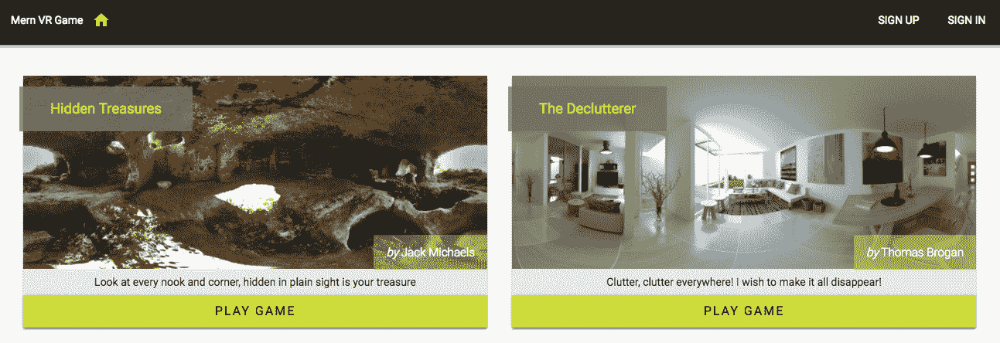
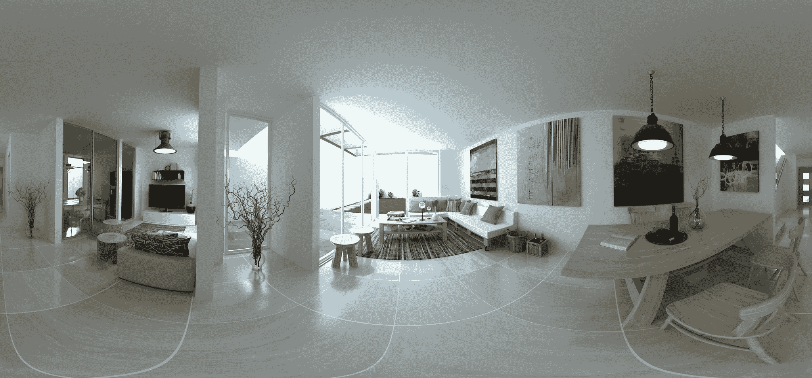
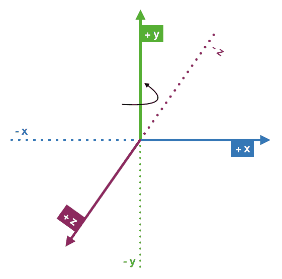
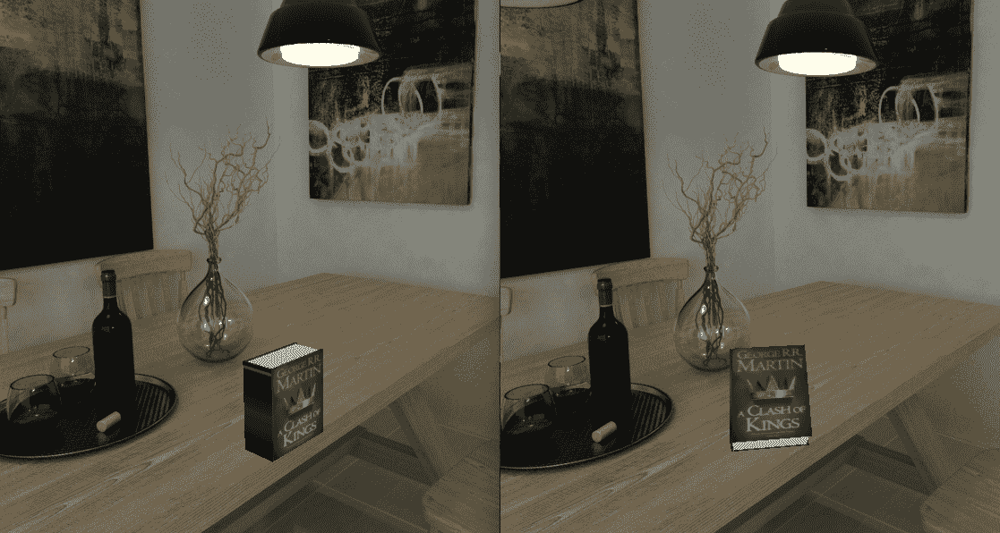
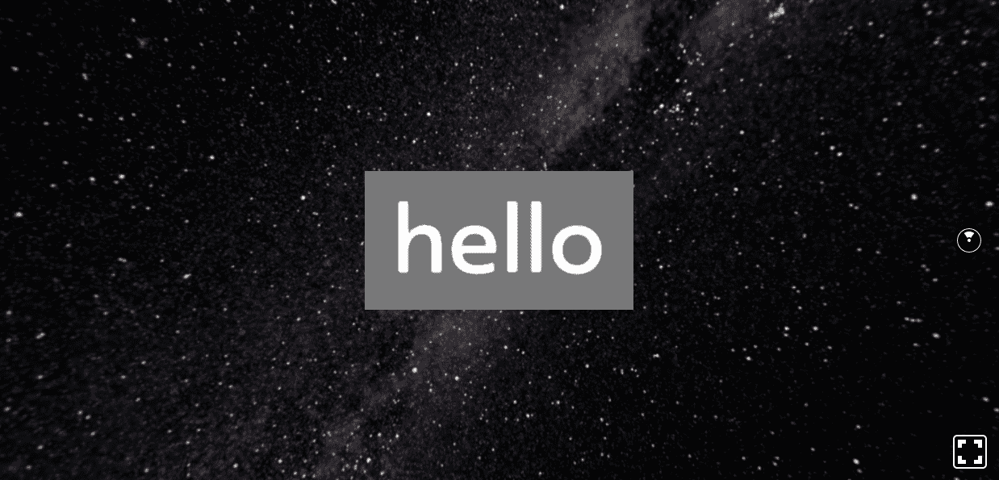
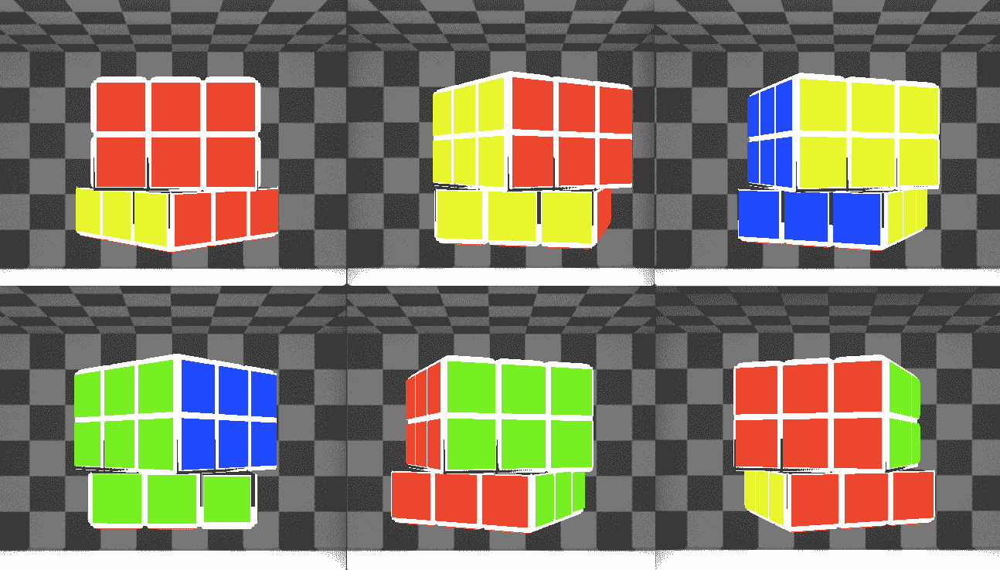
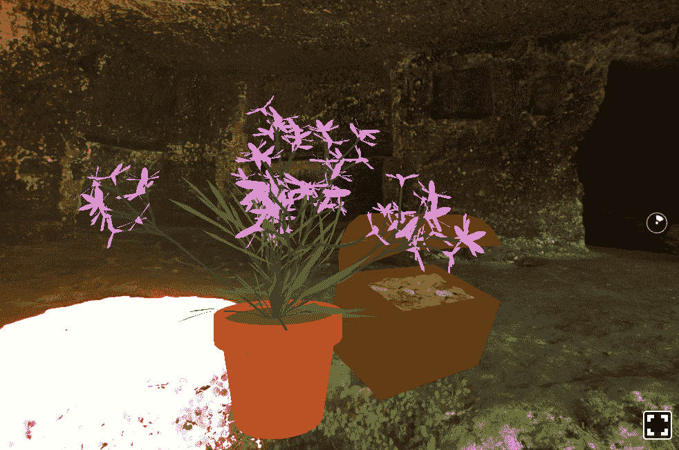
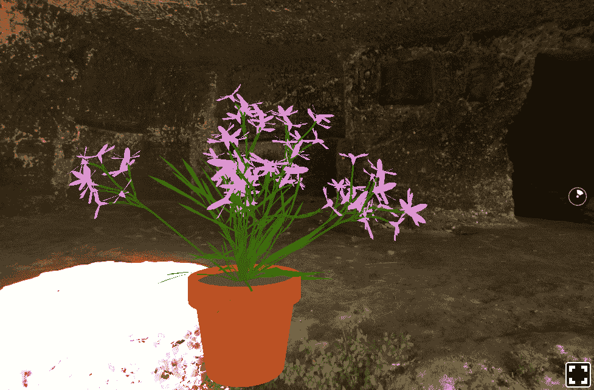
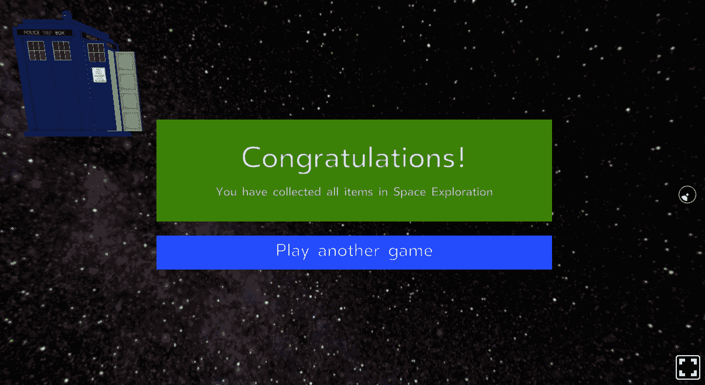

# 开发基于 Web 的 VR 游戏

**虚拟现实**（VR）和**增强现实**（AR）技术的出现正在改变用户与软件以及他们周围世界的互动方式。VR 和 AR 的可能应用数不胜数，尽管游戏行业是早期采用者，但这些快速发展的技术有潜力在多个学科和行业中改变范式。

为了展示 MERN 堆栈与 React 360 相结合如何轻松地为任何 Web 应用程序添加 VR 功能，我们将在本章和下一章中讨论和开发一个动态的、基于 Web 的 VR 游戏。在本章中，我们将专注于定义 VR 游戏的特点。此外，在开发使用 React 360 的游戏视图之前，我们将回顾与实现此 VR 游戏相关的关键 3D VR 概念。

在本章中，我们将通过以下主题构建 VR 游戏，使用 React 360：

+   介绍 MERN VR 游戏

+   开始使用 React 360

+   开发 3D VR 应用程序的关键概念

+   定义游戏详情

+   在 React 360 中构建游戏视图

+   将 React 360 代码打包以集成到 MERN 框架中

在了解这些主题之后，您将能够应用 3D VR 概念并使用 React 360 开始构建自己的基于 VR 的应用程序。

# 介绍 MERN VR 游戏

MERN VR 游戏 Web 应用程序将通过扩展 MERN 框架并使用 React 360 集成 VR 功能来开发。它将是一个动态的、基于 Web 的 VR 游戏应用程序，其中注册用户可以创建自己的游戏，任何访问该应用程序的访客都可以玩这些游戏。该应用程序的主页将列出平台上的游戏，如下面的截图所示：



使用 React 360 实现 VR 游戏功能的代码可在 GitHub 上找到：[`github.com/PacktPublishing/Full-Stack-React-Projects-Second-Edition/tree/master/Chapter13/MERNVR`](https://github.com/PacktPublishing/Full-Stack-React-Projects-Second-Edition/tree/master/Chapter13/MERNVR)。您可以在阅读本章剩余部分的代码解释时克隆此代码并运行应用程序。

游戏的特点将足够简单，足以展示将 VR 引入基于 MERN 的应用程序的能力，而不会深入探讨可能用于实现更复杂 VR 功能的 React 360 的高级概念。在下一节中，我们将简要定义该应用程序中游戏的特点。

# 游戏特点

MERN VR 游戏应用程序中的每个游戏本质上都是一个不同的 VR 世界，用户可以与放置在 360 度全景世界中不同位置的 3D 对象进行交互。

游戏玩法将与寻宝游戏相似，为了完成每个游戏，用户必须找到并收集与每个游戏提示或描述相关的 3D 对象。这意味着游戏世界将包含一些可以被玩家收集的 VR 对象，以及一些不能被收集但可能被游戏制作者作为道具或提示放置的 VR 对象。最后，当所有相关的 3D 对象都被用户收集后，游戏即告胜利。

在本章中，我们将使用 React 360 构建这些游戏功能，主要关注与实现这里定义的功能相关的 VR 和 React 360 概念。一旦游戏功能准备就绪，我们将讨论如何将 React 360 代码打包并准备与第十四章（17bbfed7-9867-4c8b-99fd-42581044a906.xhtml）中开发的 MERN 应用程序代码集成。在深入实现游戏功能之前，我们首先将在下一节中查看设置和开始使用 React 360。

# 开始使用 React 360

React 360 使得使用与 React 中相同的声明式和组件化方法来构建 VR 体验成为可能。React 360 的底层技术利用了 Three.js JavaScript 3D 引擎，在任意兼容的 Web 浏览器中使用 WebGL 渲染 3D 图形，并且通过 Web VR API 提供了对 VR 头显的访问。

虽然 React 360 是基于 React 构建的，并且应用在浏览器中运行，但 React 360 与 React Native 有很多共同之处，这使得 React 360 应用成为跨平台应用。这也意味着 React Native 的一些概念也适用于 React 360。涵盖所有 React 360 概念超出了本书的范围；因此，我们将专注于构建游戏和与 MERN 栈 Web 应用程序集成的所需概念。在下一节中，我们将首先设置一个 React 360 项目，然后在章节的后续部分扩展以构建游戏功能。

# 设置 React 360 项目

React 360 提供了开发者工具，使得开始开发新的 React 360 项目变得简单。启动步骤在官方 React 360 文档中有详细说明，因此我们在这里只总结步骤，并指出与游戏开发相关的文件。

由于我们已为 MERN 应用程序安装了 Node 和 Yarn，我们可以通过在命令行中运行以下命令来开始安装 React 360 CLI 工具：

```js
yarn global add react-360-cli
```

然后，使用这个 React 360 CLI 工具创建一个新的应用程序，并从命令行运行以下命令来安装所需的依赖项：

```js
react-360 init MERNVR
```

这将在当前目录中创建一个名为 `MERNVR` 的文件夹，并将所有必要的文件添加到该文件夹中。最后，我们可以在命令行中进入这个文件夹，并使用以下命令运行应用程序：

```js
yarn start
```

此`start`命令将初始化本地开发服务器，默认的 React 360 应用程序可以在浏览器中的`http://localhost:8081/index.html`查看。

要更新这个启动应用程序并实现我们的游戏功能，我们将主要修改`index.js`文件中的代码，并在`client.js`文件中进行一些小的更新，这些文件可以在`MERNVR`项目文件夹中找到。

由 React 360 生成的启动应用程序的默认`index.js`代码如下。请注意，它在一个 360 度的世界中渲染了“欢迎使用 React 360”文本：

```js
import React from 'react'
import { AppRegistry, StyleSheet, Text, View } from 'react-360'

export default class MERNVR extends React.Component {
  render() {
    return (
      <View style={styles.panel}>
        <View style={styles.greetingBox}>
          <Text style={styles.greeting}>
            Welcome to React 360
          </Text>
        </View>
      </View>
    )
  }
}

const styles = StyleSheet.create({
  panel: {
    // Fill the entire surface
    width: 1000,
    height: 600,
    backgroundColor: 'rgba(255, 255, 255, 0.4)',
    justifyContent: 'center',
    alignItems: 'center',
  },
  greetingBox: {
    padding: 20,
    backgroundColor: '#000000',
    borderColor: '#639dda',
    borderWidth: 2,
  },
  greeting: {
    fontSize: 30,
  }
})

AppRegistry.registerComponent('MERNVR', () => MERNVR)
```

这个`index.js`文件包含了应用程序的内容和主要代码，包括视图和样式代码。`client.js`中的代码包含了将浏览器连接到`index.js`中 React 应用程序的样板代码。启动项目文件夹中的默认`client.js`文件应该看起来像这样：

```js
import {ReactInstance} from 'react-360-web'

function init(bundle, parent, options = {}) {
  const r360 = new ReactInstance(bundle, parent, {
    // Add custom options here
    fullScreen: true,
    ...options,
  })

  // Render your app content to the default cylinder surface
  r360.renderToSurface(
    r360.createRoot('MERNVR', { /* initial props */ }),
    r360.getDefaultSurface()
  )

  // Load the initial environment
  r360.compositor.setBackground(r360.getAssetURL('360_world.jpg'))
}

window.React360 = {init}
```

此代码执行`index.js`中定义的 React 代码，本质上创建了一个新的 React 360 实例，并通过将其附加到 DOM 来加载 React 代码。

这样，默认的 React 360 启动项目就设置好了，并准备好扩展。在修改此代码以实现游戏之前，在下一节中，我们将首先查看一些与开发 3D VR 体验相关的关键概念，以及这些概念如何与 React 360 结合应用。

# 开发 VR 游戏的关键概念

在创建游戏中的 VR 内容和交互式 360 度体验之前，我们将突出显示虚拟世界的相关方面，以及如何使用 React 360 与这些 VR 概念协同工作。鉴于 VR 空间中的广泛可能性以及 React 360 提供的各种选项，我们需要确定并探索特定的概念，这些概念将使我们能够实现为游戏定义的交互式 VR 功能。在接下来的章节中，我们将讨论构成游戏 360 度世界的图像，3D 定位系统，以及将用于实现游戏的 React 360 组件、API 和输入事件。

# 等经纬全景图像

游戏的 VR 世界将由一个全景图像组成，该图像作为背景图像添加到 React 360 环境中。

全景图像通常是 360 度图像或球形全景，这些图像被投影到一个完全围绕观众的球体上。360 度全景图像的一种常见且流行的格式是等经纬格式。React 360 目前支持等经纬图像的单色和立体格式。

要了解更多关于 React 360 中 360 度图像和视频支持的信息，请参阅 React 360 文档[facebook.github.io/react-360/docs/setup.html](https://facebook.github.io/react-360/docs/setup.html)。

这里展示的照片是一个等经纬，360 度全景图像的例子。在 MERN VR 游戏中设置世界背景时，我们将使用这种图像：



等经线全景图像由一个宽高比为 2:1 的单一图像组成，其中宽度是高度的两倍。这些图像使用特殊的 360 度相机创建。Flickr 是等经线图像的一个优秀来源；你只需搜索 `equirectangular` 标签。

通过在 React 360 环境中使用等经线图像设置背景场景来创建游戏世界，将使 VR 体验更加沉浸式，并将用户带到虚拟位置。为了有效地在这个 VR 世界中添加 3D 对象并增强这种体验，我们需要了解与 3D 空间相关的布局和坐标系，这将在下文中讨论。

# 3D 位置 - 坐标和变换

为了在 VR 世界空间中放置 3D 对象并使 VR 体验更加真实，我们需要了解定位和方向。在接下来的章节中，我们将回顾 3D 坐标系，以帮助我们确定虚拟对象在 3D 空间中的位置，以及 React 360 中的变换功能，这将允许我们按要求定位、定向和缩放对象。

# 3D 坐标系

对于 3D 空间的映射，React 360 使用一个类似于 OpenGL® 3D 坐标系的基于米的三维坐标系统。这允许单个组件相对于其父组件的布局在 3D 中进行变换、移动或旋转。

React 360 中使用的 3D 坐标系是一个右手坐标系。这意味着正 *x* 轴在右侧，正 *y* 轴向上，正 *z* 轴向后。这提供了与世界空间中资产和 3D 世界建模的常见坐标系统更好的映射。

如果我们尝试可视化 3D 空间，用户将开始于以下图中 **x-y-z** 轴的中心：



**z** 轴指向用户前方，用户朝向 **-z** 轴方向望去。**y** 轴垂直上下，而 **x** 轴则从一侧到另一侧。图中弯曲的箭头显示了正旋转值的方向。

在决定在 360 度世界中放置 3D 对象的位置和方式时，我们必须根据这个 3D 坐标系设置值。在下一节中，我们将通过设置变换属性来演示如何使用 React 360 放置 3D 对象。

# 转换 3D 对象

3D 对象的位置和方向将由其变换属性确定，这些属性将具有与 3D 坐标系相对应的值。在以下屏幕截图中，通过更改渲染 3D 对象的 React 360 `Entity` 组件样式属性中的 `transform` 属性，将相同的 3D 书籍对象放置在两个不同的位置和方向：



此变换功能基于 React 中使用的变换样式，React 360 将其扩展为完全 3D，考虑到**x-y-z**轴。`transform`属性以键值对数组的形式添加到`Entity`组件的`style`属性中：

```js
style={{ ...
          transform: [ 
            {TRANSFORM_COMMAND: TRANSFORM_VALUE},
         ...
    ] 
... }}
```

与我们要放置在游戏中的 3D 对象相关的变换命令和值是`translate [x, y, z]`，单位为米；`rotate [x, y, z]`，单位为度；以及`scale`，用于确定对象在所有轴上的大小。我们还可以利用`matrix`命令，它接受一个包含 16 个数字的数组，代表平移、旋转和缩放值。

要了解更多关于 React 360 3D 坐标和变换的信息，请参阅 React 360 文档，网址为[facebook.github.io/react-360/docs/setup.html](https://facebook.github.io/react-360/docs/setup.html)。

我们将利用这些变换属性来根据 3D 坐标系定位和定向 3D 对象，同时在用 React 360 构建的游戏世界中放置对象。在下一节中，我们将介绍 React 360 组件，这些组件将允许我们构建游戏世界。

# React 360 组件

React 360 提供了一系列可以直接用于创建游戏 VR 用户界面的组件。这个范围包括从 React Native 可用的基本组件，以及允许你在 VR 游戏中集成交互式 3D 对象的 VR 特定组件。在接下来的几节中，我们将总结用于构建游戏视图和功能的特定组件，包括核心组件，如`View`和`Text`，以及 VR 特定组件，如`Entity`和`VrButton`。

# 核心组件

React 360 的核心组件包括 React Native 的两个内置组件——`Text`和`View`组件。在游戏中，我们将使用这两个组件向游戏世界添加内容。在接下来的几节中，我们将讨论这两个核心组件。

# View

`View`组件是构建 React Native 用户界面的最基本组件，它直接映射到 React Native 在运行的平台上的原生视图等效物。在我们的案例中，由于应用程序将在浏览器中渲染，它将映射到浏览器的`<div>`元素。`View`组件可以添加如下：

```js
<View>
  <Text>Hello</Text>
</View>
```

`View`组件通常用作其他组件的容器；它可以嵌套在其他视图中，并且可以有零到多个任何类型的子组件。

我们将使用`View`组件来包含游戏世界视图，并添加 3D 对象实体和文本到游戏中。接下来，我们将查看`Text`组件，它将允许我们在视图中添加文本。

# 文本

`Text`组件是一个用于显示文本的 React Native 组件，我们将通过将`Text`组件放置在`View`组件内部来在 3D 空间中渲染字符串，如下面的代码所示：

```js
<View>
      <Text>Welcome to the MERN VR Game</Text>
</View>
```

我们将使用这两个 React Native 组件以及其他 React 360 组件来组合游戏世界，并将 VR 功能集成到游戏中。在下一节中，我们将介绍 React 360 组件，这些组件将允许我们在游戏世界中添加交互式 VR 对象。

# 3D VR 体验组件

React 360 提供了一套自己的组件来创建 VR 体验。具体来说，我们将使用`Entity`组件添加 3D 对象，并使用`VrButton`组件来捕获用户的点击。我们将在以下章节中讨论`Entity`和`VrButton`组件。

# 实体

为了将 3D 对象添加到游戏世界，我们将使用`Entity`组件，它允许我们在 React 360 中渲染 3D 对象。以下是在视图中添加`Entity`组件的方法：

```js
<Entity
  source={{
           obj: {uri: "http://linktoOBJfile.obj "},
           mtl: {uri: "http://linktoMTLfile.obj "}
        }}
/>
```

包含特定 3D 对象信息的文件通过`source`属性添加到`Entity`组件中。`source`属性接受一个键值对对象，将资源文件类型映射到其位置。React 360 支持 Wavefront OBJ 文件格式，这是 3D 模型的常见表示。因此，在`source`属性中，`Entity`组件支持以下键：

+   `obj`：OBJ 格式模型的存储位置

+   `mtl`：MTL 格式材料（OBJ 的配套文件）的位置

`obj`和`mtl`属性的值指向这些文件的位置，可以是静态字符串、`asset()`调用、`require()`语句或 URI 字符串。

OBJ（或 .OBJ）是一种几何定义文件格式，最初由 Wavefront Technologies 开发。它是一种简单的数据格式，将 3D 几何形状表示为顶点和纹理顶点的列表。OBJ 坐标没有单位，但 OBJ 文件可以在可读的注释行中包含缩放信息。您可以在[paulbourke.net/dataformats/obj/](http://paulbourke.net/dataformats/obj/)了解更多关于此格式的信息。

MTL（或 .MTL）是包含一个或多个材料定义的材料库文件，每个定义都包括单个材料的颜色、纹理和反射图。这些应用于对象的表面和顶点。您可以在[paulbourke.net/dataformats/mtl/](http://paulbourke.net/dataformats/mtl/)了解更多关于此格式的信息。

`Entity`组件还接受`style`属性中的`transform`属性值，因此可以将对象放置在 3D 世界空间中期望的位置和方向。

在我们的 MERN VR 游戏应用中，制作者将为每个游戏中的`Entity`对象添加指向 VR 对象文件（`.obj`和`.mtl`）的 URL，并指定`transform`属性值，以指示 3D 对象在游戏世界中的放置位置和方式。

一个好的 3D 对象来源是[`clara.io/`](https://clara.io/)，提供多种文件格式可供下载和使用。

`Entity` 组件将在 3D 世界空间中渲染 3D 对象。为了使这些对象具有交互性，我们需要使用 `VrButton` 组件，这在下一节中将会讨论。

# VrButton

React 360 中的 `VrButton` 组件将帮助我们为要添加到游戏中的对象和 `Text` 按钮实现简单的、按钮风格的 `onClick` 行为。默认情况下，`VrButton` 组件在视图中是不可见的，它仅作为事件捕获的包装器，但可以像 `View` 组件一样进行样式化，如下面的代码所示：

```js
<VrButton onClick={this.clickHandler}>
        <View>
            <Text>Click me to make something happen!</Text>
        </View>
 </VrButton>
```

此组件是管理用户在不同输入设备上进行的点击类型交互的辅助工具。将触发点击事件的输入事件包括键盘上的空格键按下、鼠标的左键点击以及屏幕上的触摸。

React 360 的 `Entity` 和 `VrButton` 组件将使我们能够在游戏世界中渲染交互式 3D 对象。为了在游戏世界中集成其他 VR 功能，如设置背景场景和播放音频，我们将在下一节中探索 React 360 API 中的相关选项。

# React 360 API

除了上一节中讨论的 React 360 组件外，我们还将利用 React 360 提供的 API 实现设置背景场景、播放音频、处理外部链接、添加样式、捕获用户当前视图方向以及使用静态资产文件等功能。在接下来的章节中，我们将探讨 `Environment` API、`Audio` 和 `Location` 原生模块、`StyleSheet` API、`VrHeadModel` 模块以及资产指定选项。

# 环境

在游戏中，我们将使用等角全景图像设置世界或背景场景。我们将使用 React 360 的 `Environment` API，通过其 `setBackgroundImage` 方法，在 React 代码中动态地更改此背景场景。此方法可以使用如下方式：

```js
Environment.setBackgroundImage( {uri: 'http://linktopanoramaimage.jpg' } )
```

此方法使用指定 URL 的资源设置当前背景图像。当我们将 React 360 游戏代码与包含游戏应用后端的 MERN 栈集成时，我们可以使用此方法通过用户提供的图像链接动态设置游戏世界图像。在下一节中，我们将探讨允许我们在浏览器中播放此渲染场景中的音频以及提供浏览器位置访问权限的原生模块。

# 原生模块

React 360 中的原生模块为我们提供了访问仅在主浏览器环境中可用的功能的能力。在游戏中，我们将使用 `NativeModules` 中的 `AudioModule` 来响应用户活动播放声音，以及 `Location` 模块，以在浏览器中访问 `window.location` 来处理外部链接。这些模块可以在 `index.js` 中按如下方式访问：

```js
import {
    ...
  NativeModules
} from 'react-360'

const { AudioModule, Location } = NativeModules
```

我们可以在代码中使用这些导入的模块来操作浏览器中的音频和位置 URL。在接下来的章节中，我们将探讨这些模块如何被用来实现游戏的功能。

# 音频模块

当用户与游戏中的 3D 对象交互时，我们将根据对象是否可收集以及游戏是否已完成来播放声音。`NativeModules`中的`AudioModule`允许我们在 VR 世界中添加声音，作为背景环境音频、一次性音效和空间音频。在我们的游戏中，我们将使用环境音频和一次性音效：

+   **环境音频**：为了在游戏成功完成后循环播放音频并设置氛围，我们将使用`playEnvironmental`方法，该方法将音频文件路径作为`source`属性，并将`loop`选项作为`playback`参数，如下面的代码所示：

```js
AudioModule.playEnvironmental({
    source: asset('happy-bot.mp3'),
    loop: true
})
```

+   **音效**：当用户点击 3D 对象时，我们将使用`playOneShot`方法播放单个声音，该方法将音频文件路径作为`source`属性，如下面的代码所示：

```js
AudioModule.playOneShot({
    source: asset('clog-up.mp3'),
})
```

传递给`playEnvironmental`和`playOneShot`的选项中的`source`属性接受一个资源文件位置来加载音频。它可以是`asset()`语句或形式为`{uri: 'PATH'}`的资源 URL 声明。

我们将在游戏实现代码中调用这些`AudioModule`方法，根据需要播放指定的音频文件。在下一节中，我们将探讨如何使用`Location`模块，这是 React 360 中的另一个原生模块。

# 位置

在我们将包含游戏的 React 360 代码与包含游戏应用程序后端的 MERN 堆栈集成后，VR 游戏将从声明路由中的 MERN 服务器启动，该路由包含特定游戏的 ID。然后，一旦用户完成游戏，他们也将有选择离开 VR 空间并前往包含其他游戏列表的 URL。为了在 React 360 代码中处理这些传入和传出的应用链接，我们将利用`NativeModules`中的`Location`模块。

`Location`模块实际上是浏览器中只读`window.location`属性返回的`Location`对象。我们将使用`Location`对象中的`replace`方法和`search`属性来实现与外部链接相关的功能。我们将如下处理传入和传出链接：

+   **处理传出链接**：当我们想要将用户从 VR 应用程序导向另一个链接时，我们可以使用`Location`中的`replace`方法，如下面的代码所示：

```js
Location.replace(url)
```

+   **处理传入链接**：当 React 360 应用从外部 URL 启动并在已注册的组件挂载后，我们可以通过`Location`中的`search`属性访问 URL 并检索其查询字符串部分，如下面的代码所示。

```js
componentDidMount = () => {
   let queryString = Location.search
   let gameId = queryString.split('?id=')[1]
}
```

为了将此 React 360 组件与 MERN VR 游戏（MERN VR Game）集成，并动态加载游戏详情，我们将捕获此初始 URL，从查询参数中解析游戏 ID，然后使用它向 MERN 应用程序服务器发起读取 API 调用。这种实现方式在 第十一章，*使用 MERN 使 VR 游戏动态化* 中有进一步的阐述。

除了使用 React 360 API 中的这些原生模块外，我们还将使用 StyleSheet API 为渲染的游戏视图添加样式。我们将在下一节中演示如何使用 StyleSheet API。

# StyleSheet

React Native 的 StyleSheet API 也可以在 React 360 中使用，以便在单个位置定义多个样式，而不是向单个组件添加样式。样式可以使用 StyleSheet 定义，如下面的代码所示：

```js
const styles = StyleSheet.create({
  subView: {
    width: 10,
    borderColor: '#d6d7da',
  },
  text: {
    fontSize: '1em',
    fontWeight: 'bold',
  }
})
```

使用 `StyleSheet.create` 定义的这些样式对象可以根据需要添加到组件中，如下面的代码所示：

```js
<View style={styles.subView}>
  <Text style={styles.text}>hello</Text>
</View>
```

这将根据需要将 CSS 样式应用于 `View` 和 `Text` 组件。

在 React 360 中将 CSS 属性（如宽度、高度）映射到 3D 空间时，默认的距离单位是米，而 React Native 中的 2D 接口的默认距离单位是像素。

我们将使用 StyleSheet 以这种方式为将构成游戏视图的组件定义样式。在下一节中，我们将讨论 React 360 中的 `VrHeadModel` 模块，它将使我们能够确定用户当前正在看哪里。

# VrHeadModel

`VrHeadModel` 是 React 360 中的一个实用模块，它简化了获取头戴式设备当前方向的过程。由于用户在 VR 空间中移动，当需要将对象或文本放置在用户当前方向之前或相对于用户当前方向时，了解用户当前注视的确切位置变得至关重要。

在 MERN VR 游戏（MERN VR Game）中，我们将使用此功能向用户展示游戏完成的消息，无论他们从初始位置转向何处。例如，当用户在收集最终对象时可能向上或向下看，完成消息应出现在用户注视的任何位置。

为了实现这一点，我们将使用 `VrHeadModel` 中的 `getHeadMatrix()` 从数组中检索当前头矩阵，并将其设置为包含游戏完成消息的 `View` 组件样式属性中的 `transform` 属性的值。

这将在用户当前注视的位置渲染消息。我们将在本章的 *在 React 360 中构建游戏视图* 部分中看到 `getHeadMatrix()` 函数的使用。在下一节中，我们将讨论如何在 React 360 中加载静态资源。

# 加载资源

为了在代码中加载任何静态资产文件，例如图像或音频文件，我们可以利用 React 360 中的 `asset` 方法。React 360 中的 `asset()` 功能使我们能够检索外部资源文件，包括音频和图像文件。

例如，我们将游戏的声音音频文件放置在 `static_assets` 文件夹中，使用 `asset()` 来检索添加到游戏中的每个音频，如下面的代码所示：

```js
AudioModule.playOneShot({
    source: asset('collect.mp3'),
})
```

这将在调用 `playOneShot` 时加载要播放的音频文件。

在 React 360 中，我们有这些不同的 API 和模块可用，我们将集成不同的功能以用于 VR 游戏，例如设置背景场景、播放音频、添加样式、加载静态文件和检索用户方向。在下一节中，我们将查看 React 360 中的一些可用输入事件，这将使我们能够使游戏具有交互性。

# React 360 输入事件

为了使游戏界面具有交互性，我们将利用 React 360 中公开的一些输入事件处理器。输入事件来自鼠标、键盘、触摸和游戏手柄交互，以及 VR 头盔上的 `gaze` 按钮点击。

我们将工作的特定输入事件是 `onEnter`、`onExit` 和 `onClick` 事件，如下表所述：

+   `onEnter`：每当平台光标开始与组件相交时，都会触发此事件。我们将捕获这个事件用于游戏中的 VR 对象，以便当平台光标进入特定对象时，对象可以开始围绕 *y* 轴旋转。

+   `onExit`：每当平台光标停止与组件相交时，都会触发此事件。它具有与 `onEnter` 事件相同的属性，我们将使用它来停止旋转刚刚退出的 VR 对象。

+   `onClick`：`onClick` 事件与 `VrButton` 组件一起使用，当与 `VrButton` 进行点击交互时触发。我们将使用它来设置 VR 对象上的点击事件处理器，以及游戏完成消息，以便将用户从 VR 应用程序重定向到包含游戏列表的链接。

这些事件将允许我们在游戏中添加动作，即当用户进行某些操作时发生的动作。

在实现 VR 游戏时，我们将应用 3D 世界概念来确定如何使用等距圆盘全景图像设置游戏世界，并根据 3D 坐标系在这个世界中定位 VR 物体。我们将使用 React 360 组件，如 `View`、`Text`、`Entity` 和 `VrButton` 来渲染 VR 游戏视图。我们还可以使用可用的 React 360 API 在浏览器环境中加载音频和外部 URL，用于 VR 游戏。最后，我们可以利用可用的 React 360 事件来捕获用户交互，使 VR 游戏具有交互性。在本节中，我们讨论了与 VR 相关的概念、React 360 组件、API、模块和事件，我们准备在开始使用这些概念实现完整的 VR 游戏之前定义具体的游戏数据详情。在下一节中，我们将介绍游戏数据结构和详情。

# 定义游戏详情

在 MERN VR 游戏中，每一款游戏都将定义在一个通用的数据结构中，React 360 应用在渲染单个游戏详情时也将遵循此数据结构。在接下来的章节中，我们将讨论捕获游戏详情的数据结构，并突出使用静态游戏数据和动态加载游戏数据之间的区别。

# 游戏数据结构

游戏数据将包括游戏名称、指向游戏世界等距圆盘图像位置的 URL，以及包含要添加到游戏世界中的每个 VR 物体详情的两个数组。以下列表指出了对应游戏数据属性的字段：

+   `name`: 一个表示游戏名称的字符串

+   `world`: 一个字符串，包含指向等距圆盘图像的 URL，这些图像可以托管在云存储、CDNs 上，或者存储在 MongoDB 中

+   `answerObjects`: 一个包含玩家可收集的 VR 物体详情的 JavaScript 对象数组

+   `wrongObjects`: 一个包含其他 VR 物体详情的 JavaScript 对象数组，这些物体将被放置在 VR 世界中，但玩家无法收集

这些详情将定义 MERN VR 游戏应用程序中的每个游戏。包含 VR 物体详情的数组将存储要添加到游戏 3D 世界中的每个对象的属性。在以下章节中，我们将介绍表示这些数组中 VR 物体的详情。 

# VR 物体的详情

游戏数据结构中的两个数组将存储要添加到游戏世界中的 VR 物体的详情。`answerObjects` 数组将包含可收集的 3D 物体的详情，而 `wrongObjects` 数组将包含无法收集的 3D 物体的详情。每个对象将包含指向 3D 数据资源文件的链接和 `transform` 样式属性值。在以下列表中，我们将介绍每个对象需要存储的这些具体详情：

+   **OBJ 和 MTL 链接**: VR 物体的 3D 数据信息资源将被添加到 `objUrl` 和 `mtlUrl` 属性中。这些属性将包含以下值：

    +   `objUrl`: 3D 对象的`.obj`文件的链接

    +   `mtlUrl`: 到配套`.mtl`文件的链接

`objUrl`和`mtlUrl`链接可能指向存储在云存储、CDNs 或 MongoDB 上的文件。对于 MERN VR 游戏，我们将假设制作者将添加他们自己托管 OBJ、MTL 和等角图像文件的 URL。

+   **Translation values**: VR 对象在 3D 空间中的位置将通过以下属性中的`translate`值来定义：

    +   `translateX`: 沿着*x*轴的对象平移值

    +   `translateY`: 沿着*y*轴的对象平移值

    +   `translateZ`: 沿着*z*轴的对象平移值

所有平移值都是米为单位的数字。

+   **Rotation values**: 3D 对象的方向将通过以下键中的`rotate`值来定义：

    +   `rotateX`: 围绕*x*轴旋转对象的值；换句话说，向上或向下转动对象

    +   `rotateY`: 围绕*y*轴旋转对象的值，这将使对象向左或向右转动

    +   `rotateZ`: 围绕*z*轴旋转对象的值，使对象向前或向后倾斜

所有旋转值都是数字或数字的字符串表示形式。

+   **Scale value**: `scale`值将定义 3D 对象在 3D 环境中的相对大小和外观：

    +   `scale`: 一个数值，用于定义所有轴上的统一缩放比例

+   **颜色**: 如果 3D 对象的材质纹理在 MTL 文件中没有提供，可以在`color`属性中定义一个颜色值来设置对象的默认颜色：

    +   `color`: 表示 CSS 中允许的颜色值的字符串

这些属性将定义要添加到游戏中的每个 VR 对象的详细信息。

使用这种能够存储游戏及其 VR 对象详细信息的游戏数据结构，我们可以根据示例数据值相应地在 React 360 中实现游戏。在下一节中，我们将查看示例游戏数据，并区分静态设置游戏数据与为不同游戏动态加载数据。

# 静态数据与动态数据

在下一章中，当将使用 React 360 开发的游戏与基于 MERN 的应用程序集成时，我们将更新 React 360 代码以从后端数据库动态获取游戏数据。这将渲染存储在数据库中的不同游戏的 React 360 游戏视图。目前，我们将在这里使用设置在组件状态中的虚拟游戏数据来开发游戏功能。示例游戏数据将按以下方式设置，使用定义的游戏数据结构：

```js
game: {
  name: 'Space Exploration',
  world: 'https://s3.amazonaws.com/mernbook/vrGame/milkyway.jpg',
  answerObjects: [
    { 
      objUrl: 'https://s3.amazonaws.com/mernbook/vrGame/planet.obj',
      mtlUrl: 'https://s3.amazonaws.com/mernbook/vrGame/planet.mtl',
      translateX: -50,
      translateY: 0,
      translateZ: 30,
      rotateX: 0,
      rotateY: 0,
      rotateZ: 0,
      scale: 7,
      color: 'white'
    }
  ],
  wrongObjects: [
    { 
      objUrl: 'https://s3.amazonaws.com/mernbook/vrGame/tardis.obj',
      mtlUrl: 'https://s3.amazonaws.com/mernbook/vrGame/tardis.mtl',
      translateX: 0,
      translateY: 0,
      translateZ: 90,
      rotateX: 0,
      rotateY: 20,
      rotateZ: 0,
      scale: 1,
      color: 'white'
    }
  ]
}
```

此游戏对象包含一个示例游戏的详细信息，包括名称、到 360 世界图像的链接以及包含每个数组中一个详细 3D 对象的两个对象数组。出于初始开发目的，此示例游戏数据可以设置在状态中，以便在游戏视图中渲染。使用此游戏结构和数据，在下一节中，我们将实现 React 360 中的游戏功能。

# 在 React 360 中构建游戏视图

我们将应用 React 360 的概念，并使用游戏数据结构来实现 MERN VR 游戏应用中每个游戏的特性。对于这些实现，我们将更新在初始化的 React 360 项目中生成的`index.js`和`client.js`文件中的默认启动代码。

对于一个可工作的游戏版本，我们将从使用上一节中的示例游戏数据初始化的`MERNVR`组件的状态开始。

`MERNVR`组件在`index.js`中定义，代码将使用上一节中的示例游戏数据初始化的状态进行更新，如下面的代码所示：

`/MERNVR/index.js`

```js
export default class MERNVR extends React.Component {

    constructor() {
        super()
        this.state = {
                game: sampleGameData
                ...
            }
    }

...
}
```

这将使示例游戏的详细信息可用于构建其余的游戏功能。在接下来的几节中，我们将更新`index.js`和`client.js`文件中的代码，首先挂载游戏世界，定义 CSS 样式，并为游戏加载 360 度环境。然后，我们将向游戏中添加 3D VR 对象，使这些对象具有交互性，并实现表示游戏完成的操作。

# 更新 client.js 并将其挂载到位置

`client.js`中的默认代码将挂载在`index.js`中声明的挂载点到 React 360 应用中的默认`Surface`上，其中`Surface`是一个用于放置 2D 用户界面的圆柱层。为了在 3D 空间中进行布局，我们需要挂载到一个`Location`对象上而不是`Surface`。因此，我们将更新`client.js`以将`renderToSurface`替换为`renderToLocation`，如下面的代码所示：

`/MERNVR/client.js`

```js
  r360.renderToLocation(
    r360.createRoot('MERNVR', { /* initial props */ }),
    r360.getDefaultLocation()
  )
```

这将使我们的游戏视图挂载到 React 360 的`Location`上。

您还可以通过更新`client.js`中的`r360.compositor.setBackground(**r360.getAssetURL('360_world.jpg')**)`代码来自定义初始背景场景，以使用您希望使用的图像。

在`client.js`中添加此更新后，我们可以继续更新`index.js`中的代码，其中将包含我们的游戏功能。在下一节中，我们将首先定义游戏视图中要渲染的元素的 CSS 样式。

# 使用 StyleSheet 定义样式

在`index.js`中，我们将更新初始 React 360 项目中生成的默认样式，以添加我们自己的 CSS 规则。在`StyleSheet.create`调用中，我们将定义用于游戏组件的样式对象，如下面的代码所示：

`/MERNVR/index.js`

```js
const styles = StyleSheet.create({
                 completeMessage: {
                      margin: 0.1,
                      height: 1.5,
                      backgroundColor: 'green',
                      transform: [ {translate: [0, 0, -5] } ]
                 },
                 congratsText: {
                      fontSize: 0.5,
                      textAlign: 'center',
                      marginTop: 0.2
                 },
                 collectedText: {
                      fontSize: 0.2,
                      textAlign: 'center'
                 },
                 button: {
                      margin: 0.1,
                      height: 0.5,
                      backgroundColor: 'blue',
                      transform: [ { translate: [0, 0, -5] } ]
                 },
                 buttonText: {
                      fontSize: 0.3,
                      textAlign: 'center'
                 }
              }) 
```

对于本书中实现的游戏功能，我们使用 CSS 仅对显示在游戏完成时的文本和按钮进行简单样式化。在下一节中，我们将探讨如何加载代表每个游戏 3D 世界的 360 度全景图像。

# 世界背景

为了设置游戏的 360 度世界背景，我们将使用`Environment` API 中的`setBackgroundImage`方法更新当前的背景场景。我们将在`index.js`中定义的`MERNVR`组件的`componentDidMount`内部调用此方法，如下面的代码所示：

`/MERNVR/index.js`

```js
componentDidMount = () => {
    Environment.setBackgroundImage(
      {uri: this.state.game.world}
    )
}
```

这将用我们从云存储中获取的示例游戏世界图像替换入门级 React 360 项目中的默认 360 度背景。如果你正在编辑默认的 React 360 应用程序并且正在运行它，在浏览器中刷新`http://localhost:8081/index.html`链接应该会显示外太空背景，你可以使用鼠标进行平移：



为了生成前面的截图，默认代码中的`View`和`Text`组件也被更新为自定义 CSS 规则，以在屏幕上显示此文本。

这样，我们将拥有一个用户可以探索的 360 度游戏世界。在下一节中，我们将探讨如何在这个世界中放置 3D 对象。

# 添加 3D VR 对象

我们将使用 React 360 的`Entity`组件将 3D 对象添加到游戏世界中，以及为游戏定义的`answerObjects`和`wrongObjects`数组中的示例对象详情。

首先，我们将在`componentDidMount`中将`answerObjects`和`wrongObjects`数组连接起来，形成一个包含所有 VR 对象的单一数组，如下面的代码所示：

`/MERNVR/index.js`

```js
componentDidMount = () => {
  let vrObjects = this.state.game.answerObjects.concat(this.state.game.wrongObjects)
  this.setState({vrObjects: vrObjects}) 
    ...
}
```

这将给我们一个包含游戏所有 VR 对象的单一数组。然后，在主视图中，我们将遍历这个合并的`vrObjects`数组来渲染具有每个对象详情的`Entity`组件。迭代代码将通过`map`添加，如下面的代码所示：

`/MERNVR/index.js`

```js
{this.state.vrObjects.map((vrObject, i) => {
     return (
                <Entity key={i} style={this.setModelStyles(vrObject, i)}
                  source={{
                    obj: {uri: vrObject.objUrl},
                    mtl: {uri: vrObject.mtlUrl}
                  }}
                 />
            )
    })
}
```

`obj`和`mtl`文件链接被添加到`Entity`的`source`属性中，`transform`样式的详细信息通过调用`setModelStyles`应用于`Entity`组件的样式。`setModelStyles`方法使用在 VR 对象详情中定义的值构建要渲染的特定 VR 对象的样式。

`setModelStyles`方法实现如下：

`/MERNVR/index.js`

```js
setModelStyles = (vrObject, index) => {
    return {
        display: this.state.collectedList[index] ? 'none' : 'flex',
        color: vrObject.color,
        transform: [
          {
            translateX: vrObject.translateX
          }, { 
            translateY: vrObject.translateY
          }, {
            translateZ: vrObject.translateZ
          }, {
            scale: vrObject.scale
          }, {
            rotateY: vrObject.rotateY
          }, {
            rotateX: vrObject.rotateX
          }, {
            rotateZ: vrObject.rotateZ
          }
        ]
      }
  }
```

`display`属性将允许我们根据对象是否已经被玩家收集来显示或隐藏对象。`translate`和`rotate`值将在 VR 世界中渲染 3D 对象到期望的位置和方向。接下来，我们将进一步更新`Entity`代码以启用用户与这些 3D 对象的交互。

# 与 VR 对象交互

为了使 VR 游戏对象具有交互性，我们将使用 React 360 事件处理程序，如与`Entity`一起使用的`onEnter`和`onExit`，以及与`VrButton`一起使用的`onClick`，以添加旋转动画和游戏行为。在接下来的章节中，我们将添加在用户聚焦于 VR 对象时旋转 VR 对象的实现，以及为对象添加点击行为，以便用户在游戏中收集正确的对象。

# 旋转 VR 对象

我们希望添加一个功能，即当玩家聚焦于 3D 对象时，开始围绕其*y*轴旋转 3D 对象，即当平台光标开始与渲染特定 3D 对象的`Entity`组件相交时。

我们将更新上一节中的`Entity`组件，添加`onEnter`和`onExit`处理程序，如下面的代码所示：

`/MERNVR/index.js`

```js
<Entity 
     ... 
    onEnter={this.rotate(i)}
 onExit={this.stopRotate}
/>
```

使用此`Entity`组件渲染的对象将在光标进入或聚焦于对象时开始旋转，并在平台光标退出对象且不再在玩家焦点中时停止。在下一节中，我们将讨论此旋转动画的实现。

# 使用`requestAnimationFrame`进行动画

每个 3D 对象的旋转行为是在添加到渲染 3D 对象的`Entity`组件的事件处理程序中实现的。具体来说，在`onEnter`和`onExit`事件发生时调用的`rotate(index)`和`stopRotate()`处理方法中，我们将使用`requestAnimationFrame`实现旋转动画行为，以在浏览器中实现平滑动画。

`window.requestAnimationFrame()`方法要求浏览器在下次重绘之前调用指定的回调函数来更新动画。使用`requestAnimationFrame`，浏览器优化动画以使其更平滑且更高效。

使用`rotate`方法，我们将使用`requestAnimationFrame`在设定的时间间隔内以恒定速率更新给定对象的`rotateY`变换值，如下面的代码所示：

`/MERNVR/index.js`

```js
this.lastUpdate = Date.now() 
rotate = index => event => {
    const now = Date.now()
    const diff = now - this.lastUpdate
    const vrObjects = this.state.vrObjects
    vrObjects[index].rotateY = vrObjects[index].rotateY + diff / 200
    this.lastUpdate = now
    this.setState({vrObjects: vrObjects})
    this.requestID = requestAnimationFrame(this.rotate(index)) 
}
```

`requestAnimationFrame`方法将`rotate`方法作为递归回调函数，然后执行它以使用新值重绘旋转动画的每一帧，并相应地更新屏幕上的动画。

`requestAnimationFrame`方法返回一个`requestID`，我们将使用它在`stopRotate`调用中，以便在`stopRotate`方法中取消动画。此`stopRotate`方法定义如下：

`/MERNVR/index.js`

```js
stopRotate = () => {
  if (this.requestID) {
    cancelAnimationFrame(this.requestID) 
    this.requestID = null 
  }
}
```

这将实现仅在 3D 对象处于观看者焦点时才对其动画化的功能。如图所示，当 3D 魔方处于焦点时，它围绕其*y*轴顺时针旋转：



虽然这里没有涉及，但探索 React 360 Animated 库也是值得的，它可以用来组合不同类型的动画。核心组件可以使用这个库进行原生动画，并且可以使用`createAnimatedComponent()`方法来动画化其他组件。这个库最初是从 React Native 实现的；要了解更多信息，您可以参考 React Native 文档。

现在玩游戏的用户将观察到，当他们聚焦于游戏世界中放置的任何 VR 对象时，会有运动效果。在下一节中，我们将添加捕捉用户点击这些对象的功能。

# 点击 3D 对象

为了在游戏中添加的每个 3D 对象上注册点击行为，我们需要将`Entity`组件包裹在一个可以调用`onClick`处理器的`VrButton`组件中。

我们将更新`vrObjects`数组迭代代码中添加的`Entity`组件，将其包裹在`VrButton`组件中，如下面的代码所示：

`/MERNVR/index.js`

```js
<VrButton onClick={this.collectItem(vrObject)} key={i}>
    <Entity … />
</VrButton>
```

当点击`VrButton`组件时，它将调用`collectItem`方法，并传递当前对象的详细信息。

当用户点击一个 3D 对象时，我们需要`collectItem`方法根据游戏功能执行以下操作：

+   检查点击的对象是`answerObject`还是`wrongObject`。

+   根据对象类型，播放相关的声音。

+   如果对象是`answerObject`，则应将其收集并从视图中移除，然后添加到收集对象列表中。

+   检查是否通过这次点击成功收集了所有`answerObject`实例：

    +   如果是，向玩家显示游戏完成消息并播放游戏完成的声音。

我们将在`collectItem`方法中使用以下结构和步骤来实现这些动作：

```js
collectItem = vrObject => event => {
  if (vrObject is an answerObject) {
     ... update collected list ...
     ... play sound for correct object collected ...
     if (all answer objects collected) {
         ... show game completed message in front of user ...
         ... play sound for game completed ...
     }
  } else {
     ... play sound for wrong object clicked ...
  }
}
```

任何时间用户点击 VR 对象，在这个方法中，我们首先检查对象的类型，然后再采取相关的行动。我们将在下一节详细讨论这些步骤和动作的实现。

# 在点击时收集正确的对象

当用户点击一个 3D 对象时，我们首先需要检查点击的对象是否是答案对象。如果是，这个对象将被*收集*并从视图中隐藏，同时更新收集对象列表以及总数以跟踪用户在游戏中的进度。

为了检查点击的 VR 对象是否是`answerObject`，我们将使用`indexOf`方法在`answerObjects`数组中找到一个匹配项，如下面的代码所示：

```js
let match = this.state.game.answerObjects.indexOf(vrObject) 
```

如果`vrObject`是`answerObject`，`indexOf`将返回匹配对象的数组索引；如果没有找到匹配项，它将返回`-1`。

为了跟踪游戏中的收集对象，我们还将维护一个布尔值数组`collectedList`在相应的索引处，以及到目前为止收集的对象总数`collectedNum`，如下面的代码所示：

```js
let updateCollectedList = this.state.collectedList 
let updateCollectedNum = this.state.collectedNum + 1 
updateCollectedList[match] = true 
this.setState({collectedList: updateCollectedList, 
                collectedNum: updateCollectedNum}) 
```

使用 `collectedList` 数组，我们还将确定哪个 `Entity` 组件应该从视图中隐藏，因为相关的对象已被收集。相关的 `Entity` 组件的 `display` 样式属性将根据 `collectedList` 数组中相应索引的布尔值设置。我们使用前面在 *添加 3D VR 对象* 部分中提到的 `setModelStyles` 方法设置此样式。此显示样式值使用以下代码条件性地设置：

```js
display: this.state.collectedList[index] ? 'none' : 'flex'
```

根据渲染的 VR 对象的数组索引是否在对象的收集列表中设置为 true，我们将隐藏或显示视图中的 `Entity` 组件。

例如，在下面的屏幕截图中，宝箱可以被点击并收集，因为它是一个 `answerObject`，而花盆不能被收集，因为它是一个 `wrongObject`：



当点击宝箱时，由于 `collectedList` 被更新，它将从视图中消失，并且我们还会使用 `AudioModule.playOneShot` 以以下代码播放收集音效：

```js
AudioModule.playOneShot({
    source: asset('collect.mp3'),
}) 
```

然而，当点击花盆并且它被识别为错误对象时，我们将播放另一个音效，表明它不能被收集，如下面的代码所示：

```js
AudioModule.playOneShot({
     source: asset('clog-up.mp3'),
})
```

由于花盆被识别为错误对象，`collectedList` 没有被更新，它仍然在屏幕上，而宝箱已经消失，如下面的屏幕截图所示：



当对象被点击时，执行所有这些步骤的 `collectItem` 方法中的完整代码如下。

`/MERNVR/index.js`:

```js
  collectItem = vrObject => event => {
    let match = this.state.game.answerObjects.indexOf(vrObject)
    if (match != -1) {
      let updateCollectedList = this.state.collectedList
      let updateCollectedNum = this.state.collectedNum + 1
      updateCollectedList[match] = true
      this.checkGameCompleteStatus(updateCollectedNum)
          AudioModule.playOneShot({
            source: asset('collect.mp3'),
          })
      this.setState({collectedList: updateCollectedList,
          collectedNum: updateCollectedNum})
    } else {
      AudioModule.playOneShot({
        source: asset('clog-up.mp3'),
      })
    }
  }
```

使用此方法收集到点击的对象后，我们还将通过调用 `checkGameCompleteStatus` 方法来检查是否所有 `answerObjects` 都已被收集，以及游戏是否完成。我们将在下一节中查看此方法的实现和游戏完成功能。

# 游戏完成状态

每次收集到 `answerObject` 时，我们将检查收集到的项目总数是否等于 `answerObjects` 数组中的对象总数，以确定游戏是否完成。我们将通过调用 `checkGameCompleteStatus` 方法来实现这一点，如下面的代码所示：

`/MERNVR/index.js`

```js
checkGameCompleteStatus = (collectedTotal) => {
    if (collectedTotal == this.state.game.answerObjects.length) {
      AudioModule.playEnvironmental({
        source: asset('happy-bot.mp3'),
        loop: true
      })
      this.setState({hide: 'flex', hmMatrix: VrHeadModel.getHeadMatrix()})
    }
}
```

在此方法中，我们首先确认游戏确实已完成，然后执行以下操作：

+   使用 `AudioModule.playEnvironmental` 播放游戏完成的音频。

+   使用 `VrHeadModel` 获取当前的 `headMatrix` 值，以便将其设置为包含游戏完成信息的 `View` 组件的变换矩阵值。

+   将 `View` 消息的 `display` 样式属性设置为 `flex`，以便消息渲染给观众。

将包含向玩家表示祝贺完成游戏的`View`组件添加到父`View`组件中，如下所示：

`/MERNVR/index.js`

```js
<View style={this.setGameCompletedStyle}>
   <View style={this.styles.completeMessage}>
      <Text style={this.styles.congratsText}>Congratulations!</Text>
      <Text style={this.styles.collectedText}>
            You have collected all items in {this.state.game.name}
      </Text>
   </View>
   <VrButton onClick={this.exitGame}>
      <View style={this.styles.button}>
          <Text style={this.styles.buttonText}>Play another game</Text>
      </View>
   </VrButton>
</View>
```

对`setGameCompletedStyle()`方法的调用将设置`View`消息的样式，包括更新的`display`值和`transform`矩阵值。`setGameCompletedStyle`方法定义如下：

`/MERNVR/index.js`

```js
setGameCompletedStyle = () => {
    return {
        position: 'absolute',
        display: this.state.hide,
        layoutOrigin: [0.5, 0.5],
        width: 6,
        transform: [{translate: [0, 0, 0]}, {matrix: this.state.hmMatrix}]
      }
}
```

这些样式值将使`View`组件在用户当前视图的中心显示完成消息，无论他们是在 360 度 VR 世界的向上、向下、向后还是向前看，如下面的截图所示：



`View`消息中的最终文本将充当按钮，因为我们把这个`View`包裹在一个调用`exitGame`方法的`VrButton`组件中。`exitGame`方法定义如下：

`/MERNVR/index.js`

```js
exitGame = () => {
    Location.replace('/') 
}
```

`exitGame`方法将使用`Location.replace`方法将用户重定向到可能包含游戏列表的外部 URL。

`replace`方法可以传递任何有效的 URL，一旦这个 React 360 游戏代码与第十四章中基于 MERN 的 VR 游戏应用程序集成，`replace('/')`将用户带到整个应用程序的主页。

VR 游戏功能已经通过这些对 React 360 项目的更新而完整。现在可以设置 360 度全景背景作为游戏世界，并向这个世界添加交互式 VR 对象。如果游戏规则允许，这些 3D 对象将原地旋转，并且可以根据用户交互进行收集。在下一节中，我们将演示如何打包这个 React 360 代码，以便游戏可以与基于 MERN 的 Web 应用程序集成。

# 生产打包和与 MERN 集成

现在我们已经实现了 VR 游戏的功能，并且与示例游戏数据一起是功能性的，我们可以为生产做准备，并将其添加到我们的 MERN 应用程序中，以查看如何将 VR 添加到现有的 Web 应用程序中。在接下来的几节中，我们将探讨如何打包 React 360 代码，将其与 MERN 应用程序集成，并通过从应用程序中运行游戏来测试集成。

# 打包 React 360 文件

React 360 工具提供了一个脚本来将所有 React 360 应用程序代码打包成几个文件，我们可以将这些文件直接放置在 MERN Web 服务器上，并在指定的路由上作为内容提供。要创建打包文件，我们可以在 React 360 项目目录中运行以下命令：

```js
yarn bundle
```

这将在名为 `build` 的文件夹中生成 React 360 应用程序文件的编译版本。编译后的打包文件是 `client.bundle.js` 和 `index.bundle.js`。这两个文件，加上 `index.html` 文件和 `static-assets/` 文件夹，构成了开发的整个 React 360 应用程序的生产版本。最终的生产代码将在以下文件夹和文件中：

```js
-- static_assets/

-- index.html

-- index.bundle.js

-- client.bundle.js
```

我们必须将这些文件夹和文件移动到 MERN 项目目录中，以便将游戏与 MERN 应用程序集成，如下一节所述。

# 与 MERN 应用程序集成

为了将用 React 360 开发的游戏与基于 MERN 的 Web 应用程序集成，我们首先将上一节中讨论的 React 360 生产文件引入我们的 MERN 应用程序项目中。然后，我们将更新生成的 `index.html` 代码中的打包文件引用，使其指向打包文件的新位置，在 Express 应用程序中指定路由加载 `index.html` 代码之前。

# 添加 React 360 生产文件

考虑到现有 MERN 骨架应用程序的文件夹结构，我们将添加 `static_assets` 文件夹并将 React 360 生产文件中的打包文件添加到 `dist/` 文件夹中。这将使我们的 MERN 代码保持有序，所有打包文件都在同一位置。`index.html` 文件将被放置在 `server` 文件夹下的一个新文件夹中，命名为 `vr`，如下面的文件夹结构所示：

```js
-- ... 
-- client/
-- dist/
     --- static_assets/
     --- ...
     --- client.bundle.js
     --- index.bundle.js
-- ...
-- server/
     --- ...
     --- vr/
          ---- index.html
-- ...
```

这将把 React 360 代码带到 MERN 应用程序中。然而，为了使其功能正常，我们需要更新 `index.html` 代码中的文件引用，如下一节所述。

# 更新 index.html 中的引用

在打包 React 360 项目后生成的 `index.html` 文件引用了打包文件，期望这些文件在同一个文件夹中，如下面的代码所示：

```js
<html>
  <head>
    <title>MERNVR</title>
    <style>body { margin: 0 }</style>
    <meta name="viewport" content="width=device-width, initial-scale=1, user-scalable=no">
  </head>
  <body>
    <!-- Attachment point for your app -->
    <div id="container"></div>
    <script src="img/client.bundle.js"></script>
    <script>
      // Initialize the React 360 application
      React360.init(
        'index.bundle.js',
        document.getElementById('container'),
        {
          assetRoot: 'static_assets/',
        }
      ) 
    </script>
  </body>
</html>
```

我们需要更新这个 `index.html` 代码，使其引用 `client.bundle.js`、`index.bundle.js` 和 `static_assets` 文件夹的正确位置。

首先，按照以下方式更新对 `client.bundle.js` 的引用，以指向我们放置在 `dist` 文件夹中的文件：

```js
<script src="img/strong>" type="text/javascript"></script>
```

然后，更新 `React360.init` 调用，使用正确的引用 `index.bundle.js`，并将 `assetRoot` 设置为 `static_assets` 文件夹的正确位置，如下面的代码所示：

```js
React360.init(
 './../dist/index.bundle.js',
        document.getElementById('container'),
 { assetRoot: '/dist/static_assets/' }
    )
```

`assetRoot` 指定了在用 `asset()` 在 React 360 组件中设置资源时查找资源文件的位置。

使用 React 360 实现的游戏视图现在可在 MERN 应用程序中使用。在下一节中，我们将通过设置一个路由从 Web 应用程序加载游戏来尝试这种集成。

# 尝试集成

如果我们在 MERN 应用程序中设置一个 Express 路由以在响应中返回 `index.html` 文件，那么在浏览器中访问该路由将渲染 React 360 游戏。为了测试这种集成，我们可以设置一个示例路由，如下所示：

```js
router.route('/game/play')
   .get((req, res) => {
      res.sendFile(process.cwd()+'/server/vr/index.html') 
}) 
```

这在`'/game/play'`路径中声明了一个`GET`路由，它将简单地返回我们放置在`vr`文件夹中的与服务器代码一起的`index.html`文件，作为对请求客户端的响应。

然后，我们可以运行 MERN 服务器，并在浏览器中的`localhost:3000/game/play`打开此路由。这应该会在基于 MERN 的 Web 应用内部渲染本章实现的完整的 React 360 游戏。

# 摘要

在本章中，我们使用 React 360 开发了一个可以轻松集成到 MERN 应用的基于 Web 的 VR 游戏。

我们首先为游戏玩法定义了简单的 VR 功能。然后，我们为开发设置了 React 360，并研究了关键的 VR 概念，例如等角全景图像、3D 位置和 360 度 VR 世界的坐标系。我们探索了实现游戏功能所需的 React 360 组件和 API，包括`View`、`Text`、`Entity`和`VrButton`组件，以及`Environment`、`VrHeadModel`和`NativeModules` API。

最后，我们更新了入门级 React 360 项目的代码，以使用示例游戏数据实现游戏，然后打包了代码文件，并讨论了如何将这些编译后的文件添加到现有的 MERN 应用中。

完成这些步骤后，你现在将能够使用 React 360 构建自己的 VR 界面，这些界面可以轻松地集成到任何基于 MERN 的 Web 应用中。

在下一章中，我们将开发一个 MERN VR 游戏应用，包括游戏数据库和后端 API。这样我们就可以通过从存储在 MongoDB 中的游戏收藏中获取数据，使本章开发的游戏变得动态。
