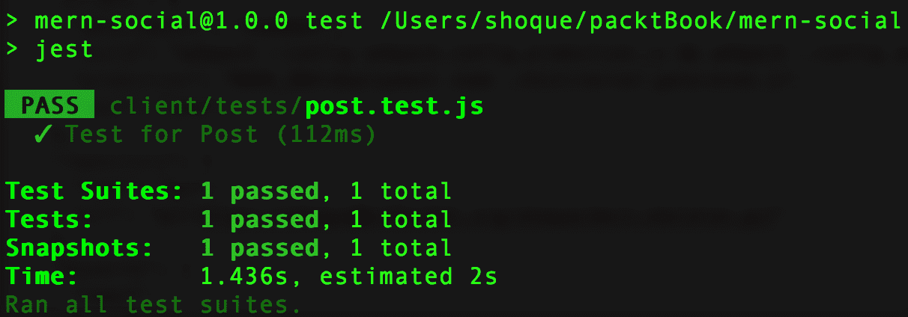
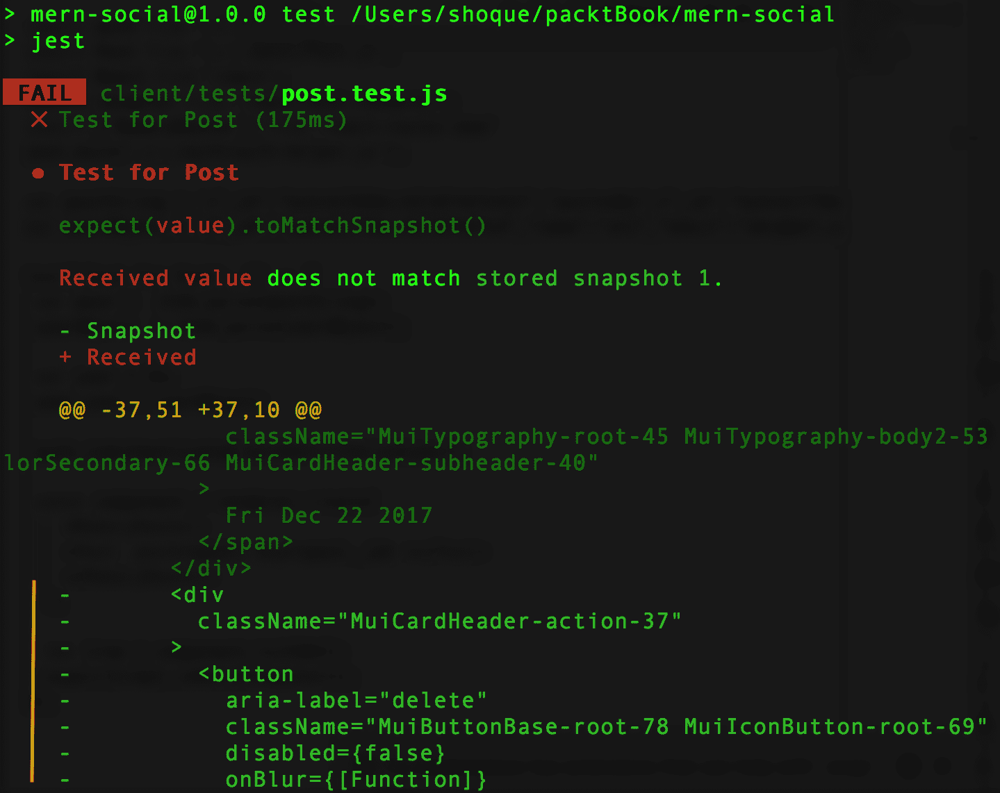

# 遵循最佳实践并进一步开发 MERN

在本章中，我们将详细阐述在构建本书中的六个 MERN 应用程序时应应用的一些最佳实践。此外，我们还将探讨本书未应用但应考虑用于实际应用的其它实践，以确保随着复杂性的增长，可靠性和可扩展性。我们将回顾组织项目代码在模块中的决策，应用前端样式的途径，仅对选定视图进行服务器端渲染，以及如何通过 React 接口来管理组件间的状态。我们还将探讨提高安全性、向项目添加测试以及使用 webpack 优化打包的方法。最后，我们将总结增强构建的应用程序的建议和扩展步骤。有了这些见解，你将更好地为准备面向现实世界的全栈 MERN 项目做好准备。

本章涵盖以下主题：

+   在应用程序结构中通过模块化实现关注点分离

+   考虑 CSS 样式解决方案的选项

+   仅对选定视图进行数据的服务器端渲染

+   使用 ES6 类来区分有状态组件和纯函数组件

+   决定是否使用 Redux 或 Flux

+   为存储用户凭据提供安全增强

+   编写测试代码

+   优化包大小

+   如何向现有应用程序添加新功能

# 通过模块化实现关注点分离

在本书构建 MERN 堆栈应用程序时，我们遵循了每个应用程序的共同文件夹结构。我们通过根据相关性及共同功能划分和分组代码来采用模块化方法。创建这些较小且独立的代码部分背后的想法是确保每个部分都解决一个单独的问题，这样各个部分就可以被重用，以及独立开发和更新。在下一节中，我们将回顾这个结构和其优势。

# 重新审视应用程序文件夹结构

在应用程序文件夹结构中，我们通过在这两个部分内部进行进一步细分，将客户端和服务器端代码分开。这给了我们一定的自由度来独立设计和构建应用程序的前端和后端。在项目根级别，`client`和`server`文件夹是主要的划分，如下所示的结构：

```js
| mern_application/
  | -- client/
  | -- server/
```

在这些`client`和`server`文件夹中，我们将代码进一步细分为映射到独特功能的子文件夹。我们通过在服务器中按特定功能划分模型、控制器和路由，并在客户端将所有与功能相关的组件分组在一个地方来实现这一点。在接下来的章节中，我们将回顾`server`和`client`文件夹内的划分。

# 服务器端代码

在服务器端，我们根据功能划分代码，通过将定义业务模型的代码与实现路由逻辑的代码以及响应这些路由上客户端请求的控制器代码分离。在`server`文件夹中，我们保持了三个主要部分，如下所示的结构：

```js
  | -- server/
    | --- controllers/
    | --- models/
    | --- routes/
```

在这种结构中，每个文件夹都包含具有特定目的的代码：

+   `models`：这个文件夹旨在包含所有 Mongoose 模式模型定义的单独文件，每个文件代表一个单独的模型。

+   `routes`：这个文件夹包含了所有允许客户端与服务器交互的路由，这些路由被放置在单独的文件中，这些文件可能与`models`文件夹中的某个模型相关联。

+   `controllers`：这个文件夹包含了所有控制器函数，这些函数定义了响应在定义的路由上接收到的请求的逻辑。这些控制器被分为与相关模型和路由文件对应的单独文件。

如本书中所示，这些针对服务器端代码的具体关注点分离，使我们能够通过仅添加所需的模型、路由和控制器文件来扩展为骨架应用程序开发的服务器。在下一节中，我们将介绍客户端代码结构中的划分。

# 客户端代码

MERN 应用程序的客户端代码主要由 React 组件组成。为了以合理和可理解的方式组织组件代码和相关辅助代码，我们将代码分离到与功能实体或独特功能相关的文件夹中，如下所示的结构：

```js
  | -- client/
    | --- auth/
    | --- core/
    | --- post/
    | --- user/
    | --- componentFolderN/
```

在前面的结构中，我们将所有与身份验证相关的组件和辅助代码放在了`auth`文件夹中；常见的和基本的组件，如`Home`和`Menu`组件，放在了`core`文件夹中；然后为所有与帖子相关或用户相关的组件创建了`post`和`user`文件夹。

这种基于功能分离和组合组件的方法，使我们能够通过向`client`文件夹添加新的与功能相关的组件代码文件夹，按需扩展每个后续应用程序的骨架应用程序的前端视图。

将客户端和服务器代码分离，并在这些分离中模块化代码，使得扩展我们在整本书中开发的不同应用程序变得更加容易。在本章的最后部分，我们将进一步展示这种模块化方法分离应用程序代码的优势，我们将概述可以遵循的一般工作流程，以向本书中开发的任何现有应用程序添加新功能。在下一节中，我们将探讨定义和应用于前端 React 组件的不同选项，这对于每个全栈 MERN 项目都是一个必要的决策。

# 添加 CSS 样式

当讨论本书中应用程序的用户界面（UI）实现时，我们选择不关注应用的 CSS 样式代码的细节，而是主要依赖默认的 Material-UI 样式。然而，鉴于实现任何 UI 都需要我们考虑样式解决方案，我们将简要地查看一些可用的选项。

当涉及到向前端添加 CSS 样式时，有几种选择，每种选择都有其优缺点。在接下来的几节中，我们将讨论两种最常见的选择，即外部样式表和内联样式，以及相对较新的在 JavaScript 中编写 CSS 的方法，或者更具体地说，是 JSS，它在 Material-UI 组件中使用，因此也适用于本书中的应用程序。

# 外部样式表

外部样式表允许我们在单独的文件中定义 CSS 规则，这些文件可以注入到必要的视图中。以这种方式将 CSS 样式放在外部样式表中曾经被认为是最佳实践，因为它强制了样式和内容的分离，允许重用，并且如果为每个组件创建单独的 CSS 文件，还可以保持模块化。

然而，随着 Web 开发技术的不断发展，更好的 CSS 组织和性能需求已不再满足这种做法。例如，在用 React 组件开发前端视图时使用外部样式表限制了我们对基于组件状态更新样式的控制。此外，为 React 应用程序加载外部 CSS 需要额外的 webpack 配置，包括`css-loader`和`style-loader`。

当应用程序增长并共享多个样式表时，由于 CSS 有一个单一的全球命名空间，因此也变得无法避免选择器冲突。因此，尽管外部样式表可能足够用于简单和琐碎的应用程序，但随着应用程序的增长，使用 CSS 的其他选项变得更加相关。在下一节中，我们将探讨直接内联添加样式的选项。

# 内联样式

内联 CSS 是直接应用于视图中的单个元素的样式。尽管这解决了一些使用外部样式表时遇到的问题，例如消除选择器冲突问题，并允许基于状态的样式，但它牺牲了可重用性，并引入了一些自身的问题，例如限制了可以应用的 CSS 功能。

仅使用内联 CSS 进行基于 React 的前端开发，对于增长中的应用程序来说，有一些重要的限制，例如性能不佳，因为所有的内联样式在每个渲染时都会重新计算，而且内联样式一开始就比类名慢。

内联 CSS 在某些情况下可能看起来是一个简单的解决方案，但它并不适合整体使用。在下一节中，我们将探讨使用 JavaScript 添加 CSS 样式的选项，这解决了使用内联和外部样式的一些问题。

# JavaScript 样式表（JSS）

JSS 允许我们以声明式的方式使用 JavaScript 编写 CSS 样式。这也意味着 JavaScript 的所有功能现在都可以用于编写 CSS，使得编写可重用和可维护的样式代码成为可能。

JSS 充当一个 JS 到 CSS 编译器，它接受 JS 对象，其中键代表类名，值代表相应的 CSS 规则，然后生成带有作用域类名的 CSS。

这样，当 JSS 将 JSON 表示编译为 CSS 时，它默认生成唯一的类名，消除了可能遇到的外部样式表的选择器冲突。此外，与内联样式不同，使用 JSS 定义的 CSS 规则可以在多个元素之间共享，并且可以在定义中使用所有 CSS 功能。

Material-UI 使用 JSS 为其组件设置样式，因此我们使用 JSS 来应用 Material-UI 主题，并将自定义 CSS 应用到所有应用程序的前端视图开发的组件中。根据每种方法的实用性，您可以选择使用外部样式表、内联样式或 JSS 的组合来为您的全栈应用程序的前端设置样式。在下一节中，我们将回顾在 MERN 全栈应用程序中集成 React 前端服务器端渲染的方法及其相关性。

# 带有数据的选择性服务器端渲染

当我们在第四章中开发基础骨架应用程序的前端时，*添加 React 前端以完成 MERN*，我们集成了基本的服务器端渲染，以便在请求发送到服务器时直接从浏览器地址栏加载客户端路由。在这个服务器端渲染实现中，在渲染 React 组件的服务器端时，我们没有考虑为显示数据的组件从数据库加载数据。数据仅在客户端 JavaScript 在服务器端渲染标记的初始加载之后接管时才加载到这些组件中。

我们确实更新了这个实现，为 MERN Mediastream 应用程序中的单个媒体详情页面添加了带有数据的服务器端渲染，这在第十二章中讨论过，*定制媒体播放器和改进 SEO*。在这种情况下，我们决定通过将数据注入到 React 前端生成的服务器端标记中，以数据的方式渲染这个特定的视图。这种仅针对特定视图的选择性服务器端渲染数据背后的推理可以基于对所讨论视图的某些期望行为，如下一节所述。

# 何时使用带有数据的服务器端渲染相关？

在应用程序的所有 React 视图中实现带有数据的服务器端渲染可能会变得复杂，如果需要考虑具有客户端身份验证的视图或由多个数据源组成的视图，这将是额外的工作。在许多情况下，如果视图不需要带有数据的服务器端渲染，那么处理这些复杂性可能是不必要的。为了判断一个视图是否需要带有数据的服务器端渲染，针对特定的视图回答以下问题以做出决定：

+   当浏览器中可能没有 JavaScript 时，数据是否需要在视图的初始加载中显示？

+   视图及其数据需要 SEO 友好吗？

在页面初始加载时加载数据可能从可用性角度来看是相关的，所以这实际上取决于特定视图的使用场景。对于 SEO，带有数据的服务器端渲染将使搜索引擎更容易访问视图中的数据内容；因此，如果这对于所讨论的视图至关重要，那么添加带有数据的服务器端渲染是一个好主意。在下一节中，我们将讨论在全栈应用程序中组合 React 前端的各种方法。

# 使用有状态与纯函数组件

在使用 React 组件构建 UI 时，使用更多无状态功能组件来组合视图可以使前端代码易于管理、清洁且易于测试。然而，某些组件将需要状态或生命周期 Hooks 来成为比纯展示组件更多的组件。在接下来的几节中，我们将探讨构建有状态和无状态功能 React 组件需要什么，何时使用哪一个，以及频率。

# 使用 ES6 类或 Hooks 的有状态 React 组件

我们可以使用 ES6 类或通过不编写类的方式使用 Hooks 来定义有状态 React 组件。使用 ES6 类定义的 React 组件可以访问生命周期方法、`this` 关键字，并在构建有状态组件时使用 `setState` 来管理状态。同样，使用函数定义的 React 组件也可以通过 Hooks 访问一些这些特性，例如使用 `useState` Hook 来管理状态，以便构建有状态组件。

有状态组件使我们能够构建可以管理状态中数据变化并传播需要应用于 UI 的任何业务逻辑的交互式组件。通常，对于复杂的 UI，有状态组件应该是更高级的容器组件，管理它们所组成的较小、无状态功能组件的状态。相比之下，这些更简单的无状态组件可以定义为纯函数，如下一节所述。

# 无状态 React 组件作为纯函数

React 组件可以使用 ES6 类语法或作为纯函数来定义为无状态功能组件。主要思想是，无状态组件不修改状态，只接收 props。

以下代码使用 ES6 类语法定义了一个无状态组件：

```js
class Greeting extends React.Component {
  render() {
    return <h1>Hello, {this.props.name}</h1> 
  }
}
```

这个组件虽然是用类定义的，但不使用状态。同样的组件也可以使用 JavaScript 纯函数来定义，如下所示：

```js
function Greeting(props) {
  return <h1>Hello, {props.name}</h1> 
}
```

纯函数在给定相同输入且没有任何副作用的情况下始终给出相同的输出。将 React 组件建模为纯函数强制创建更小、更定义、更自包含的组件，强调 UI 而不是业务逻辑，因为这些组件中没有状态操作。这类组件是可组合的、可重用的，并且易于调试和测试。在下文中，我们将讨论在设计 UI 时如何组合状态组件和无状态组件。

# 使用状态组件和无状态功能组件设计 UI

当思考 UI 的组件组合时，你可以将根组件或父组件设计为包含子组件的状态组件，或者设计为只接收 props 而不能操作状态的可组合组件。所有状态更改操作和生命周期问题将由根组件或父组件处理，并将更改传播到子组件。

在为本书开发的应用程序中，存在状态组件和较小无状态组件的混合。例如，在 MERN 社交应用中，`Profile` 组件会修改无状态子组件的状态，例如 `FollowProfileButton` 和 `FollowGrid` 组件。有空间将本书中开发的一些较大组件重构为更小、更自包含的组件，在扩展应用程序以包含更多功能之前应考虑这一点。

可以应用于新组件设计或重构现有组件的主要经验教训是，随着 React 应用程序的扩展和复杂化，最好在负责管理内部组件状态的高级状态组件中添加更多无状态功能组件。在下文中，我们将简要讨论可以在 React 上使用以处理增长中的 React 应用程序状态管理的流行库和模式。

# 使用 Redux 或 Flux

当 React 应用程序开始增长并变得更加复杂时，管理组件之间的通信可能会变得有问题。在使用常规 React 时，通信的方式是将值和回调函数作为 props 传递给子组件。然而，如果有很多中间组件需要传递回调，这可能会很繁琐。为了解决随着 React 应用程序增长而出现的这些状态通信和管理相关的问题，人们转向使用带有 Redux 和 Flux 等库和架构模式的 React。

本书范围之外，不深入探讨将 React 与 Redux 库或 Flux 架构集成的细节，但在考虑扩展 MERN 应用程序时，请记住以下几点：

+   Redux 和 Flux 利用模式强制在 React 应用程序中从中央位置更改状态。对于可管理的 React 应用程序，避免使用 Redux 或 Flux 的一个技巧是将所有状态更改移动到组件树的上层父组件。

+   较小的应用程序在没有 Flux 或 Redux 的情况下也能正常工作。

你可以在[`redux.js.org/`](https://redux.js.org/)了解更多关于使用 Redux 与 React 结合的信息，以及如何在[facebook.github.io/flux/](http://facebook.github.io/flux/)中使用 React 与 Flux 结合。

你可以根据应用程序的大小和复杂性选择集成 Flux 或 Redux。在下一节中，我们将讨论本书开发的 MERN 应用程序中应用的安全实现，以及可能进行的改进。

# 增强安全性

在本书开发的 MERN 应用程序中，我们通过使用**JSON web tokens**（JWTs）作为认证机制，并在用户集合中存储散列密码，使与认证相关的安全实现保持简单。这些实现中遵循的方法是向 Web 应用程序添加认证的标准做法。然而，如果某些应用程序需要更多的安全层，则还有更高级的选项可供选择。在接下来的章节中，我们将讨论为构建本书中的应用程序所做的安全选择，并指出可能的改进。

# JSON web tokens – 客户端或服务器端存储

使用 JWT 认证机制，客户端负责维护用户状态。一旦用户登录，服务器发送的令牌被存储并由客户端代码在浏览器存储中维护，例如`sessionStorage`。因此，客户端代码也有责任在用户注销或需要注销时通过删除令牌来使令牌失效。这种机制对于大多数只需要最小认证来保护资源访问的应用程序来说效果很好。然而，对于可能需要跟踪用户登录、注销，并让服务器知道特定令牌不再有效的情况，仅客户端处理令牌是不够的。

对于这些情况，讨论的客户端 JWT 令牌处理实现可以扩展到服务器端存储。在特定情况下，为了跟踪已失效的令牌，服务器可以维护一个 MongoDB 集合来存储这些失效的令牌作为参考，这与在服务器端存储会话数据的方式相似。

需要小心的是，在客户端和服务器端存储和维护与身份验证相关的信息在大多数情况下可能是过度行为。因此，这完全取决于具体的用例和相关权衡。在下一节中，我们将回顾我们存储用户密码的安全选项。

# 保护密码存储

在用户集合中存储用于身份验证的用户凭据时，我们确保用户提供的原始密码字符串从未直接存储在数据库中。相反，我们使用 Node 中的`crypto`模块生成密码的哈希值和盐值。

在我们的应用程序的`user.model.js`中，我们定义了以下函数来生成加密的`password`和`salt`值：

```js
encryptPassword: function(password) {
    if (!password) return '' 
    try {
      return crypto
        .createHmac('sha1', this.salt)
        .update(password)
        .digest('hex') 
    } catch (err) {
      return '' 
    }
  },
  makeSalt: function() {
    return Math.round((new Date().valueOf() * Math.random())) + '' 
  }
```

使用此实现，每次用户输入密码进行登录时，都会使用盐值生成一个哈希值。如果生成的哈希值与存储的哈希值匹配，则密码正确；否则，密码错误。因此，为了检查密码是否正确，需要盐值，因此它将盐值与哈希值一起存储在数据库中，与用户详细信息一起。

这是保护存储在用户身份验证中的密码的标准做法，但如果有特定的应用程序需要更高级别的安全性，可以探索其他高级方法。可以考虑的一些选项包括多迭代哈希方法、其他安全的哈希算法、限制每个用户账户的登录尝试次数以及多级认证，包括回答安全问题或输入安全代码等额外步骤。根据需要，这些选项可以增加更多安全层。在下一节中，我们将讨论在全栈 React 应用程序中添加测试代码的选项，这对于构建健壮的生产就绪应用程序至关重要。

# 编写测试代码

虽然讨论和编写测试代码超出了本书的范围，但它却是开发可靠软件的关键部分。随着全栈 JavaScript 应用程序越来越主流，对更好的测试能力的需求在这个生态系统中产生了大量测试工具。在接下来的几节中，我们将首先查看一些可用于测试基于 MERN 应用程序不同部分的流行测试工具。然后，为了帮助您开始编写本书中开发的 MERN 应用程序的测试代码，我们还将讨论一个将客户端测试添加到第五章中 MERN 社交应用程序的例子，即*将骨架扩展成社交媒体应用程序*。

# 全栈 JavaScript 项目的测试工具

对于全栈 JavaScript 项目，有一系列测试工具可用于集成测试和维护代码质量。这些工具包括可以帮助执行代码静态分析以保持可读性的工具，以及帮助在 MERN 基础应用程序中集成单元测试、集成测试和端到端测试的工具。在接下来的几节中，我们将突出介绍一些可用于本书中项目的流行测试工具，例如用于静态分析的 ESLint、用于前端测试的 Cypress 和用于 JavaScript 应用程序全面测试的 Jest。

# 使用 ESLint 进行静态分析

提高和维护代码质量的一个好习惯是使用 linting 工具与您的项目一起使用。linting 工具对代码执行静态分析，以查找违反指定规则和指南的问题模式或行为。在 JavaScript 项目中进行 linting 可以提高整体代码的可读性，并帮助您在代码执行之前找到语法错误。对于 MERN 基础项目中的 linting，您可以探索 ESLint，这是一个允许开发者创建自己的 lint 规则的 JavaScript linting 工具。

您可以在 [eslint.org](http://esling.org) 上了解更多关于使用和自定义 ESLint 的信息。您可以选择使用 Airbnb JavaScript 风格指南 ([github.com/airbnb/javascript](https://github.com/airbnb/javascript))，并通过 `eslint-config-airbnb`**.** 定义您的 lint 规则。

您可以在您偏好的编辑器中配置 ESLint，并使其成为您开发工作流程中无缝的一部分。这将帮助您在编写代码时保持代码标准。在下一节中，我们将探讨 Cypress，它可以帮助测试在浏览器中运行的任何代码。

# 使用 Cypress 进行端到端测试

Cypress 为测试现代网络应用程序的前端提供了一套完整的工具。使用 Cypress，我们可以为我们的 MERN 基础应用程序的前端编写端到端测试、单元测试和集成测试。Cypress 还提供自己的本地安装的测试运行器，允许我们在构建应用程序的同时在浏览器中实时编写、运行测试和调试。

您可以在 [cypress.io](https://www.cypress.io/) 上了解更多关于使用 Cypress 的信息，以开始设置在浏览器中为 JavaScript 应用程序设置端到端测试。

使用 Cypress 进行 UI 测试将使您更有信心地发布项目，因为您将能够在最终用户遇到之前更早地捕捉到更多错误。在下一节中，我们将讨论 Jest，它可以用于向任何 JavaScript 代码库添加测试。

# 使用 Jest 进行全面测试

Jest 是一个全面的 JavaScript 测试框架。尽管它更常被用于测试 React 组件，但它可以用于任何 JavaScript 库或框架的通用测试。在 Jest 的众多 JavaScript 测试解决方案中，它提供了模拟和快照测试的支持，附带一个断言库，并且 Jest 中的测试以 **行为驱动开发**（**BDD**）风格编写。

要了解更多关于 Jest 的信息，请阅读位于 [`facebook.github.io/jest/docs/en/getting-started.html`](https://facebook.github.io/jest/docs/en/getting-started.html) 的文档。

除了测试 React 组件外，Jest 还可以适应编写基于 Node-Express-Mongoose 的后端测试代码。因此，它是为 MERN 应用程序添加测试代码的一个可靠的测试选项。在下一节中，我们将探讨如何使用 Jest 向在 第五章 中开发的 MERN 社交应用程序添加测试，该应用程序名为 *将骨架扩展成社交媒体应用程序*。

# 向 MERN 社交应用添加测试

为了演示如何开始向 MERN 应用程序添加测试，我们将设置 Jest 并使用它向 MERN 社交应用程序添加客户端测试。在定义测试用例、编写和运行相应的测试代码之前，首先，我们将通过安装必要的包、定义测试运行脚本和创建测试代码文件夹来设置测试环境，如以下章节所述。

# 安装包

为了设置 Jest 并将测试代码与我们的项目集成，我们首先需要安装相关的 Node 包。以下包将用于编写测试代码和运行测试：

+   `jest`：用于包含 Jest 测试框架

+   `babel-jest`：用于编译 Jest 的 JS 代码

+   `react-test-renderer`：用于创建不使用浏览器的 React DOM 渲染的 DOM 树快照

要将它们作为 `devDependencies` 安装，请在命令行中运行以下 `yarn` 命令：

```js
yarn add --dev jest babel-jest react-test-renderer
```

一旦安装了这些包，我们就可以在配置测试运行脚本之后开始添加测试，如下一节所述。

# 定义运行测试的脚本

为了运行我们使用 Jest 编写的任何测试代码，我们将定义一个脚本来运行测试。我们将更新 `package.json` 中定义的运行脚本，以便添加一个使用 `jest` 命令运行测试的脚本，如下面的代码所示：

```js
  "scripts": {
    "test": "jest"
  }
```

定义了此脚本后，如果我们从命令行运行 `yarn test`，它将提示 Jest 在应用程序文件夹中查找测试代码并运行测试。在下一节中，我们将添加包含项目测试代码文件的文件夹。

# 添加测试文件夹

要在 MERN 社交应用中添加客户端测试，我们将在客户端文件夹中创建一个名为`tests`的文件夹，该文件夹将包含与测试 React 组件相关的测试文件。当运行测试命令时，Jest 将在这些文件中查找测试代码。

此示例的测试用例将是 MERN 社交应用前端`Post`组件的测试，我们将在名为`post.test.js`的文件中添加对`Post`组件的测试。此文件将放置在`tests`文件夹中。现在我们已经准备好添加测试代码的文件，在下一节中，我们将演示如何添加一个示例测试用例。

# 添加测试

对于 MERN 社交应用，我们将编写一个测试来检查帖子上的删除按钮是否仅在登录用户也是帖子创建者时可见。这意味着如果认证用户的`_id`与正在渲染的帖子数据的`postedby`值相同，则删除按钮才会是渲染的 Post 视图的一部分。

为了实现此测试用例，我们将添加处理以下内容的代码：

+   定义了一个帖子和一个包含认证用户详情的`auth`对象的虚拟数据

+   模拟`auth-helper.js`中的方法

+   定义测试，并在测试定义中执行以下操作：

    +   声明`post`和`auth`变量

    +   将模拟的`isAuthenticated`方法的返回值设置为虚拟`auth`对象

    +   使用`renderer.create`创建带有所需虚拟属性并通过`MemoryRouter`包装的`Post`组件，以提供与`react-router`相关的属性

    +   生成并匹配快照

`post.test.js`中的代码将按照以下步骤进行：

```js
import auth from './../auth/auth-helper.js'
import Post from './../post/Post.js'
import React from 'react'
import renderer from 'react-test-renderer'
import { MemoryRouter } from 'react-router-dom'

jest.mock('./../auth/auth-helper.js') 

const dummyPostObject = {"_id":"5a3cb2399bcc621874d7e42f",
                         "postedBy":{"_id":"5a3cb1779bcc621874d7e428",
                         "name":"Joe"}, "text":"hey!",
                         "created":"2017-12-22T07:20:25.611Z",
                         "comments":[], "likes":[]} 
const dummyAuthObject = {user: {"_id":"5a3cb1779bcc621874d7e428",
                                "name":"Joe",
                                "email":"abc@def.com"}} 

test('delete option visible only to authorized user', () => {
  const post = dummyPostObject 
  const auth = dummyAuthObject 

  auth.isAuthenticated.mockReturnValue(auth) 

  const component = renderer.create(
     <MemoryRouter>
         <Post post={post} key={post._id} ></Post>
     </MemoryRouter>
  ) 

  let tree = component.toJSON() 
  expect(tree).toMatchSnapshot() 
}) 
```

在此代码中，我们首先定义了虚拟帖子`post`和`auth`对象，然后添加了检查删除选项可见性的测试用例。在这个测试用例中，我们模拟了`isAuthenticated`方法，并使用虚拟帖子数据渲染了`Post`组件。然后，我们使用此渲染组件生成了一个快照，该快照将与预期的快照进行匹配。在下一节中，我们将讨论生成的快照是如何在这个测试中进行比较的。

# 生成正确的 Post 视图快照

第一次运行此测试时，我们将提供生成 Post 视图正确快照所需的值。对于此测试用例的正确快照将包含删除按钮，当`auth`对象的`user._id`等于`post`对象的`postedBy`值时。此快照是在测试第一次运行时生成的，它将在未来的测试执行中进行比较。

Jest 中的这种快照测试基本上记录了渲染组件结构的快照，以与未来的渲染进行比较。当记录的快照和当前的渲染不匹配时，测试失败，表明有东西发生了变化。在下一节中，我们将介绍运行测试和检查测试输出的步骤。

# 运行和检查测试

在我们添加到 `post.test.js` 文件中的代码中，模拟的 `auth` 对象和 `post` 对象指向同一个用户；因此，在命令行中运行此测试将提示 Jest 生成一个包含删除选项的快照，并通过测试。

要运行测试，请从命令行进入项目文件夹：

```js
yarn test
```

当运行此命令时，生成的测试输出将显示测试已通过，如下面的截图所示：



当此测试首次成功运行时，生成的记录快照会自动添加到 `tests` 文件夹中的 `_snapshots_` 文件夹。这个快照代表了删除按钮在视图中渲染的状态，因为认证用户也是帖子的创建者。

现在，我们可以检查当组件以不是帖子创建者的认证用户渲染时，测试是否实际上失败了。为了执行此检查，我们将通过更改 `user._id` 来更新模拟数据对象，使其不匹配 `postedBy` 值，然后再次运行测试。这将给我们一个失败的测试，因为当前的渲染将不再有记录快照中存在的删除按钮。

如以下测试日志所示，测试失败，并指示渲染的树与记录的快照不匹配，因为接收到的值中缺少表示删除按钮的元素：



我们有一个客户端测试来检查已登录用户是否可以在他们的帖子中查看删除按钮。使用这个设置，可以为利用 Jest 功能的 MERN 应用程序添加更多测试。

编写测试代码将使你开发的应用程序可靠，并有助于确保代码质量。使用 ESLint、Cypress 和 Jest 等工具，我们可以采用不同的方式来确保基于 MERN 的应用程序的整体质量。在下一节中，我们将讨论优化应用程序代码打包的方法。

# 优化包大小

随着你开发和扩展 MERN 应用程序，webpack 产生的包的大小也可能增长，尤其是如果使用了大型第三方库。更大的包大小会影响性能并增加应用程序的初始加载时间。我们可以通过修改代码来确保我们不会得到大的包，并利用 webpack 中打包的功能来帮助优化打包。

在进入代码以更新它以进行包大小优化之前，您还可以熟悉 webpack 的一部分默认优化选项。在 MERN 应用程序中，我们使用了 `mode` 配置来利用开发和生产模式的默认设置。要查看可用选项的概述，请参阅文章 [`medium.com/webpack/webpack-4-mode-and-optimization-5423a6bc597a`](https://medium.com/webpack/webpack-4-mode-and-optimization-5423a6bc597a)。

在下一节中，我们将强调代码拆分和动态导入等概念，这些概念可以让我们控制生成更小的包并减少加载时间。

# 代码拆分

我们不是一次性将所有代码加载到一个包中，而是可以使用 webpack 支持的代码拆分功能按需懒加载应用程序代码的一部分。在修改应用程序代码以引入代码拆分后，webpack 可以创建多个包而不是一个大的包。这些包可以在运行时动态加载，从而提高应用程序的性能。

要了解更多关于 webpack 中的代码拆分支持以及如何对设置和配置进行必要的更改，请参阅文档中的指南 [`webpack.js.org/guides/code-splitting/`](https://webpack.js.org/guides/code-splitting/)。

有几种方法可以为应用程序代码引入代码拆分，但您将遇到的最重要语法是动态 `import()`。在下一节中，我们将探讨如何使用 `import()` 与我们的 MERN 应用程序。

# 动态导入()

Dynamic `import()` 是常规导入的类似函数版本，它允许动态加载 JS 模块。使用 `import(moduleSpecifier)` 将返回请求模块的模块命名空间对象的承诺。当使用常规静态导入时，我们在代码顶部导入一个模块，然后在代码中使用它如下：

```js
import {  convert } from './metric'
...
console.log(convert('km', 'miles', 202))
```

与此相反，如果我们使用动态 `import()` 而不是在开头添加静态导入，代码将看起来像这样：

```js
import('./metric').then({ convert } => { 
    console.log( convert('km', 'miles', 202) ) 
})
```

这允许我们在代码需要时导入和加载模块。在打包应用程序代码时，webpack 将将 `import()` 的调用视为拆分点，并自动通过将请求的模块及其子模块放入主包之外的一个单独的块中来实现代码拆分。

为了通过在给定组件处应用代码拆分来优化前端 React 代码的打包，我们需要将动态 `import()` 与 React Loadable 配对——这是一个用于使用承诺加载组件的高阶组件。作为一个例子，我们将查看第八章 *扩展订单和支付的市场* 中开发的购物车。在构建购物车界面时，我们通过导入并添加 `Checkout` 组件到视图中来组合 `Cart` 组件，如下所示：

```js
import Checkout from './Checkout'
class Cart extends Component {
    ...
    render(){
        ...
        <Checkout/>
    }
    ...
}
```

要在此处引入代码拆分并动态导入`Checkout`组件，我们可以将开始的静态导入替换为`Loadable` Checkout，如下所示：

```js
import Loadable from 'react-loadable'
const Checkout = Loadable({
  loader: () => import('./Checkout'),
  loading: () => <div>Loading...</div>,
})
```

进行此更改并使用 webpack 重新构建代码将生成一个更小的`bundle.js`文件，并生成另一个表示拆分代码的更小的 bundle 文件，该文件现在仅在`Cart`组件渲染时加载。

除了使用动态导入之外，基于路由的代码拆分也是另一种选择。对于使用路由在视图中加载组件的 React 应用程序，这是一种有效的引入代码拆分的方法。要了解更多关于实现代码拆分的信息，特别是关于 React Router，请查看[`tylermcginnis.com/react-router-code-splitting/`](https://tylermcginnis.com/react-router-code-splitting/)上的文章。

我们可以根据需要在我们应用程序代码中应用代码拆分机制。需要注意的是，有效的代码拆分将取决于正确使用它并在代码的正确位置应用它——这些位置将从资源加载优先级优化中受益。在下一节中，我们将概述可以重复执行的步骤，以添加本书中开发的 MERN 应用程序的新功能。

# 扩展应用程序

在本书的章节中，随着我们开发每个应用程序，我们通过扩展现有代码的常见和可重复的步骤添加了功能。在本节的最后，我们将回顾这些步骤，为添加更多功能到当前版本的应用程序设定一个指南。

# 扩展服务器代码

对于需要数据持久性和 API 以允许视图操作数据的特定功能，我们可以从扩展服务器代码和添加必要的模型、路由和控制器函数开始，如下文所述。

# 添加模型

对于该功能的数据库持久性方面，在设计数据模型时考虑需要存储的字段和值。然后，在单独的文件中定义并导出一个 Mongoose 模式，并将其放置在`server/models`文件夹中。在定义好数据结构并准备好数据库后，你可以继续添加操作此数据的 API 端点，如下一节所述。

# 实现 API

为了根据模型操纵和访问将存储在数据库中的数据，你需要设计与所需功能相关的 API。要开始实现 API，你必须添加相应的控制器方法和路由声明，如下文所述。

# 添加控制器

确定了 API 之后，在`server/controllers`文件夹中的单独文件中添加相应的控制器函数，这些函数将响应对这些 API 的请求。这个文件中的控制器函数应访问和操作为该功能定义的模型数据。接下来，我们将探讨如何在请求到来时声明将调用这些控制器方法的路由。

# 添加路由

要完成后端 API 的实现，需要声明相应的路由并将其挂载到 Express 应用程序上。在`server/routes`文件夹中的单独文件中，首先声明并导出这些 API 的路由，指定在请求特定路由时应执行的相关控制器函数。然后，在`server/express.js`文件中加载这些新路由，就像应用程序中的其他现有路由一样。

这将生成一个可以由 REST API 客户端应用程序运行和检查的新后端 API 的工作版本。然后，这些 API 可以用于正在开发的特征的前端视图中，您将通过扩展客户端代码来实现这一点，如下一节所述。

# 扩展客户端代码

在客户端，首先设计所需的视图，并确定这些视图将如何结合用户与该功能相关的数据交互。然后，添加 fetch API 代码以与新的后端 API 集成，定义代表这些新视图的新组件，并更新现有代码以包括这些新组件在前端应用程序中，如以下各节所述。

# 添加 API fetch 方法

在添加将调用后端 API 的 fetch 方法之前，您将确定放置新前端代码的位置。在客户端文件夹中，创建一个新文件夹来存放与正在开发的特征模块相关的组件和辅助代码。然后，为了将新后端 API 与应用程序的前端集成，在这个新组件文件夹中定义并导出相应的 fetch 方法。最后，您可以填充这个文件夹，其中包含将成为该功能前端的 React 组件，如下一节所述。

# 添加组件

要开始添加该功能的 UI，您可以在新文件夹中创建并导出代表所需功能视图的新 React 组件，这些组件位于单独的文件中。如果需要身份验证，您可以使用现有的 auth-helper 方法将这些新组件集成到其中。一旦实现了 React 组件，它们需要被加载到主应用程序视图中，如下一节所述。

# 加载新组件

为了将这些新组件集成到前端，这些组件要么需要添加到现有组件中，要么在它们自己的客户端路由中渲染。

如果这些新组件需要在单独的路由上渲染，更新`MainRouter.js`代码以添加新路由，这些路由在给定的 URL 路径上加载这些组件。然后，这些 URL 可以用作链接，从应用的其他视图中加载组件，或者直接通过浏览器地址栏访问这些 URL。

然而，如果新组件需要成为现有视图的一部分，那么将组件导入现有组件中，以按需将它们添加到视图中。

新组件也可以通过链接到带有单独路由的新组件，与现有组件（如`Menu`组件）相关联。

随着组件集成并连接到后端，新功能实现完成。这些步骤可以重复使用，以向本书中构建的现有 MERN 应用添加更多新功能。

# 摘要

在本章的最后，我们回顾并详细阐述了在构建本书中的 MERN 应用时使用的最佳实践，突出了改进领域，提供了解决应用增长时可能出现的问题的指导，并最终确定了继续开发现有应用更多功能的步骤。

我们看到，模块化应用代码结构有助于轻松扩展应用，选择使用 JSS 而不是内联 CSS 和外部样式表，使样式代码易于管理和操作，并且仅在需要时实现特定视图的服务器端渲染，从而避免了代码中的不必要复杂性。

我们讨论了创建更少的状态组件（由更小、更明确的非状态功能性组件组成）的好处，以及如何在重构现有组件或设计新组件以扩展应用时应用这一点。对于可能遇到在数百个组件之间管理和通信状态问题的增长型应用，我们指出了如 Redux 和 Flux 等选项，这些选项可以考虑用来解决这些问题。

对于可能对更严格的安全执行有更高要求的用例，我们回顾了现有的基于 JWT 的用户身份验证和密码加密实现，并讨论了可能的扩展以增强安全性。

我们强调了测试工具，如 ESLint、Cypress 和 Jest。然后，我们使用 Jest 演示了如何向 MERN 应用添加测试代码，并讨论了如何通过编写测试代码和使用代码检查工具等良好实践来提高代码质量，同时确保应用的可靠性。

我们还研究了捆绑优化功能，如代码拆分，这些功能可以通过减少初始捆绑大小以及按需懒加载应用的部分来帮助提高性能。

最后，我们回顾并记录了整本书中使用的可重复步骤，您可以用这些步骤作为指南，在前进的过程中通过添加更多所需功能来扩展 MERN 应用程序。
