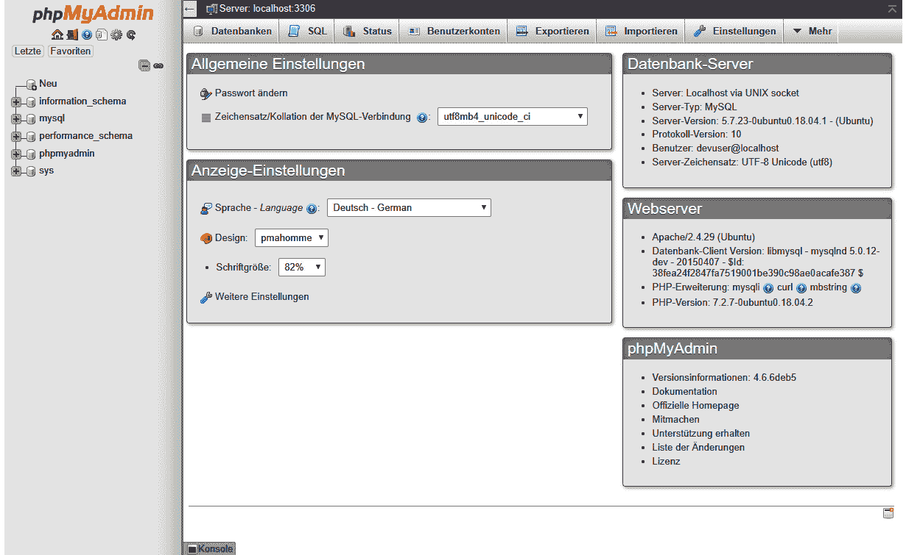
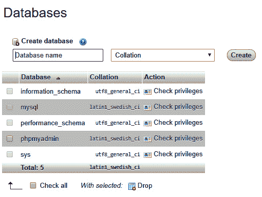
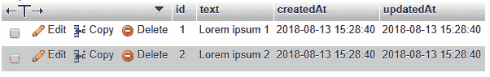
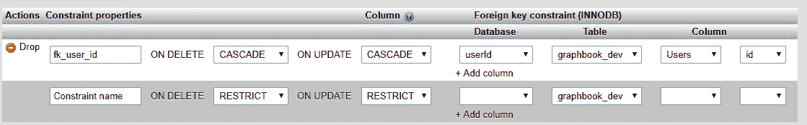
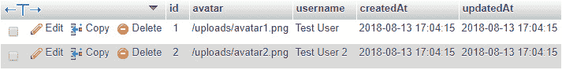
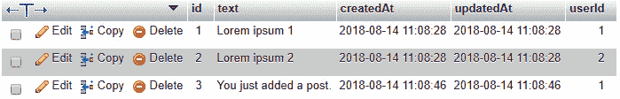

# 第三章：*第三章*：连接到数据库

我们的后端和前端可以使用假数据来通信、创建新帖子，并响应所有帖子的列表。我们列表中的下一步将是使用数据库，如 SQL 服务器，作为数据存储。

我们希望使用 Sequelize 将后端数据持久化到我们的 SQL 数据库。我们的 Apollo 服务器应根据需要使用这些数据来进行查询和突变。为了实现这一点，我们必须为我们的 GraphQL 实体实现数据库模型。

本章将涵盖以下主题：

+   在 GraphQL 中使用数据库

+   在 Node.js 中使用 Sequelize

+   编写数据库模型

+   使用 Sequelize 种植数据

+   使用 Apollo 与 Sequelize

+   使用 Sequelize 执行数据库迁移

# 技术要求

本章的源代码可在以下 GitHub 仓库中找到：[`github.com/PacktPublishing/Full-Stack-Web-Development-with-GraphQL-and-React-Second-Edition/tree/main/Chapter03`](https://github.com/PacktPublishing/Full-Stack-Web-Development-with-GraphQL-and-React-Second-Edition/tree/main/Chapter03)。

# 在 GraphQL 中使用数据库

**GraphQL** 是一种用于发送和接收数据的协议。**Apollo** 是您可以使用来实现该协议的许多库之一。无论是 GraphQL（在其规范中）还是 Apollo，都不会直接在数据层上工作。您放入响应中的数据来源，以及您随请求发送的数据保存位置，由开发者决定。

这条逻辑表明，数据库和您使用的服务对 Apollo 来说并不重要，只要您响应的数据与 GraphQL 模式相匹配。

在本项目和书中，我们生活在 Node.js 生态系统之中，因此使用 MongoDB 是非常合适的。MongoDB 为 Node.js 提供了一个出色的客户端库，并且使用 JavaScript 作为其与交互和查询的原生语言选择。

MongoDB 这样的数据库系统的通用替代品是一个典型的 MySQL 服务器，它具有经过验证的稳定性和全球使用率。我经常遇到的一个案例是系统和应用程序依赖于较旧的代码库和数据库，需要进行升级。实现这一点的绝佳方法是获取一个 GraphQL API 层的叠加。在这种情况下，GraphQL 服务器接收所有请求，并且逐个替换 GraphQL 服务器所依赖的现有代码库。在这些情况下，GraphQL 的数据库无关性非常有帮助。

在本书中，我们将通过 Sequelize 使用 SQL 来查看现实世界用例中的此功能。为了未来的目的，这还将帮助您处理现有基于 SQL 的系统的问题。

## 为开发安装 MySQL

MySQL 是在开发职业生涯中起步的绝佳起点。它也非常适合在您的机器上进行本地开发，因为设置简单。

在您的机器上设置 MySQL 的方法取决于您的操作系统。正如我们在 *第一章* 中提到的，*准备您的开发环境*，我们假设您正在使用基于 Debian 的系统。为此，您可以使用以下说明。如果您已经为 MySQL 或 Apache 设置了工作环境，这些命令可能不起作用，或者可能根本不需要。

**提示**

对于其他操作系统，有优秀的预构建软件包。我建议所有 Windows 用户使用 XAMPP，Mac 用户使用 MAMP。这些提供了在 Linux 上手动执行的操作的简单安装过程。它们还实现了 MySQL、Apache 和 PHP，包括 phpMyAdmin。

**重要提示**

在设置用于公共和生产的真实 SQL 服务器时，不要遵循这些说明。专业的设置包括许多安全功能来保护您免受攻击。此安装仅应在开发环境中，在您的本地机器上使用。

执行以下步骤以启动 MySQL：

1.  首先，您应该始终安装系统上可用的所有更新：

    ```js
    sudo apt-get update && sudo apt-get upgrade -y
    ```

    我们希望安装 MySQL 和一个 GUI 来查看我们数据库内部的内容。MySQL 服务器最常用的 GUI 是 phpMyAdmin。为此，您需要安装一个 Web 服务器和 PHP。我们将安装 Apache 作为我们的 Web 服务器。

    重要提示

    如果在过程中任何时刻收到一个错误，表明找不到该软件包，请确保您的系统是基于 Debian 的。在其他系统上的安装过程可能会有所不同。您可以在互联网上轻松搜索适合您系统的匹配软件包。

1.  使用以下命令安装所有必要的依赖项：

    ```js
    sudo apt-get install apache2 mysql-server php php-pear php-mysql
    ```

1.  安装完成后，您需要在 root shell 中运行 MySQL 设置。您将需要输入 root 密码。或者，您可以运行 `sudo -i`：

    ```js
    su -
    ```

1.  现在，您可以执行 MySQL 安装命令；按照提示步骤进行操作：

    ```js
    mysql_secure_installation
    ```

    您可以忽略这些步骤中的大部分以及安全设置，但在被要求输入您的 MySQL 实例的 root 密码时要小心。

1.  我们必须为开发创建一个与 root 用户分开的单独用户。我们不鼓励您使用 root 用户。使用 root 用户登录我们的 MySQL 服务器以完成此操作：

    ```js
    mysql -u root
    ```

1.  现在，运行以下 SQL 命令。

    ```js
    PASSWORD string with the password that you want. This is the password that you will use for the database connection in your application, but also when logging into phpMyAdmin. This command creates a user called devuser, with root privileges that are acceptable for local development.NoteIf you are already using MySQL8, the command that you need execute is a little different. Just run the following lines:**CREATE USER 'devuser'@'%' IDENTIFIED BY 'PASSWORD';****GRANT ALL PRIVILEGES ON *.* TO 'devuser'@'%' WITH GRANT OPTION;****FLUSH PRIVILEGES;**The above commands will create a new user with the same permissions on your MySQL server.
    ```

1.  由于我们的 MySQL 服务器已经设置，您可以安装 phpMyAdmin。在执行以下命令时，您将被要求选择 Web 服务器。使用空格键选择 `apache2`，然后按 *Tab* 键导航到 **ok**。当被要求时，选择 phpMyAdmin 的自动设置方法。您不应手动进行此操作。

    此外，phpMyAdmin 将要求您输入密码。我建议您选择与 root 用户相同的密码：

    ```js
    sudo apt-get install phpmyadmin
    ```

1.  安装完成后，我们需要设置 Apache 以服务 phpMyAdmin。以下`ln`命令在 Apache 公共`HTML`文件夹的根目录中创建了一个符号链接。现在，Apache 将服务 phpMyAdmin：

    ```js
    cd /var/www/html/
    sudo ln -s /usr/share/phpmyadmin
    ```

现在，我们可以在`http://localhost/phpmyadmin`下访问 phpMyAdmin，并使用新创建的用户登录。这应该看起来如下所示：



图 3.1 – phpMyAdmin

使用这种方式，我们已经为我们的开发环境安装了数据库。

phpMyAdmin 会根据您的环境选择语言，因此它可能与前一个截图显示的略有不同。

## 在 MySQL 中创建数据库

在我们开始实现后端之前，我们需要添加一个新的数据库，我们可以使用它。

您可以通过命令行或 phpMyAdmin 来做这件事。因为我们刚刚安装了 phpMyAdmin，我们将使用它。

您可以在 phpMyAdmin 的**SQL**标签页中运行原始 SQL 命令。创建新数据库的相应命令如下：

```js
CREATE DATABASE graphbook_dev CHARACTER SET utf8 COLLATE utf8_general_ci;
```

否则，您可以按照下一组步骤使用图形方法。在左侧面板中，点击**新建**按钮。

您将看到一个如下所示的屏幕。它将显示所有数据库，包括它们的 MySQL 服务器的校对：



图 3.2 – phpMyAdmin 数据库

输入一个数据库名称，例如`graphbook_dev`，然后选择`utf8_general_ci`校对。完成这些操作后，点击**创建**。

您将看到一个页面，上面写着**数据库中未找到表**，这是正确的。在我们实现了数据库模型，如帖子（posts）和用户（users）之后，这将会改变。

在下一章中，我们将开始设置 Sequelize 在 Node.js 中的配置，并将其连接到我们的 SQL 服务器。

# 将 Sequelize 集成到我们的 Node.js 堆栈中

我们刚刚设置了一个 MySQL 数据库，我们想在我们的 Node.js 后端中使用它。有许多库可以连接和查询您的 MySQL 数据库。在这本书中，我们将使用 Sequelize。

替代对象关系映射器（ORM）

替代方案包括 Waterline ORM 和 js-data，它们提供了与 Sequelize 相同的功能。这些方案的好处是，它们不仅提供 SQL 方言，还提供了 MongoDB、Redis 等数据库适配器。因此，如果您需要替代方案，请查看它们。

Sequelize 是 Node.js 的 ORM。它支持 PostgreSQL、MySQL、SQLite 和 MSSQL 标准。

通过`npm`在您的项目中安装 Sequelize。我们还将安装第二个包，称为`mysql2`：

```js
npm install --save sequelize mysql2
```

`mysql2`包允许 Sequelize 与我们的 MySQL 服务器通信。

Sequelize 是围绕不同数据库系统的各种库的包装器。它提供了直观模型使用的出色功能，以及创建和更新数据库结构以及插入开发数据的函数。

通常，您会在开始数据库连接或模型之前运行`npx sequelize-cli init`，但我更喜欢一种更定制的方法。从我的角度来看，这要干净一些。这也是我们为什么在额外的文件中设置数据库连接而不是依赖模板代码的原因。

传统设置 Sequelize

如果您想查看通常是如何做的，可以查看 Sequelize 文档中的官方教程。我们采取的方法和教程中的方法差异不大，但总是看到另一种做事的方式是好的。文档可以在[`sequelize.org/master/manual/migrations.html`](https://sequelize.org/master/manual/migrations.html)找到。

让我们从在后台设置 Sequelize 开始。

## 使用 Sequelize 连接到数据库

第一步是初始化 Sequelize 到我们的 MySQL 服务器的连接。为此，我们将创建一个新的文件夹和文件，如下所示：

```js
mkdir src/server/database
touch src/server/database/index.js
```

在`index.js`数据库内部，我们将使用 Sequelize 与我们的数据库建立连接。内部，Sequelize 依赖于`mysql2`包，但我们自己并不使用它，这非常方便：

```js
import Sequelize from 'sequelize';
const sequelize = new Sequelize('graphbook_dev', 'devuser', 'PASSWORD', {
  host: 'localhost',
  dialect: 'mysql', 
  pool: {
    max: 5,
    min: 0,
    acquire: 30000,
    idle: 10000,
  },
});
export default sequelize;
```

如您所见，我们从`node_modules`加载 Sequelize，然后创建其实例。以下属性对 Sequelize 很重要：

+   我们将数据库名称作为第一个参数传递，这是我们刚刚创建的。

+   第二个和第三个参数是我们`devuser`的凭证。用您为数据库输入的用户名和密码替换它们。`devuser`有权访问我们 MySQL 服务器中的所有数据库，这使得开发变得容易得多。

+   第四个参数是一个通用选项对象，可以包含更多属性。前面的对象是一个示例配置。

+   我们 MySQL 数据库的`host`选项是我们的本地机器别名，`localhost`。如果不是这种情况，您也可以指定 MySQL 服务器的 IP 或 URL。

+   当然，`dialect`是`mysql`。

+   使用`pool`选项，您告诉 Sequelize 每个数据库连接的配置。前面的配置允许最小连接数为零，这意味着 Sequelize 不应该维护一个连接，而应该在其需要时创建一个新的连接。最大连接数为五个。此选项还与您的数据库系统拥有的副本集数量相关。

    `pool`选项中的`idle`字段指定了连接在关闭并被从活动连接池中移除之前可以多久未被使用。

    当尝试建立到我们的 MySQL 服务器的新的连接时，如果连接被中止，`acquire`选项定义了超时时间。在无法创建连接的情况下，此选项有助于防止您的服务器冻结。

执行前面的代码将实例化 Sequelize 并成功创建到我们的 MySQL 服务器的连接。进一步来说，我们需要为我们的应用程序可以运行的每个环境（从开发到生产）处理多个数据库。你将在下一节中看到这一点。

## 使用 Sequelize 配置文件

我们之前使用 Sequelize 进行数据库连接的设置是可行的，但它并不是为后续部署而设计的。最佳选择是有一个独立的配置文件，该文件根据服务器运行的环境进行读取和使用。

为此，在`database`文件夹旁边（称为`config`）的单独文件夹中创建一个新的`index.js`文件：

```js
mkdir src/server/config
touch src/server/config/index.js
```

如果你遵循了创建 MySQL 数据库的说明，你的样本配置应该如下代码所示。我们在这里所做的唯一一件事是将我们的当前配置复制到一个新的对象中，该对象以`development`或`production`环境为索引：

```js
module.exports = {
  "development": {
    "username": "devuser",
    "password": "PASSWORD",
    "database": "graphbook_dev",
    "host": "localhost",
    "dialect": "mysql",
    "pool": {
      "max": 5,
      "min": 0,
      "acquire": 30000,
      "idle": 10000
    }
  },
  "production": {
    "host": process.env.host,
    "username": process.env.username,
    "password": process.env.password,
    "database": process.env.database,
    "logging": false,
    "dialect": "mysql",
    "pool": {
      "max": 5,
      "min": 0,
      "acquire": 30000,
      "idle": 10000
    }
  }
}
```

Sequelize 默认期望在这个文件夹中有一个`config.json`文件，但这个设置将允许我们在后面的章节中采用更定制的方法。`development`环境直接存储数据库的凭证，而`production`配置使用环境变量来填充它们。

我们可以移除之前硬编码的配置，并将我们的`database/index.js`文件的内容替换为要求使用`configFile`。

它应该看起来如下：

```js
import Sequelize from 'sequelize';
import configFile from '../config/';
const env = process.env.NODE_ENV || 'development';
const config = configFile[env];
const sequelize = new Sequelize(config.database,
  config.username, config.password, config);
const db = {
  sequelize,
};
export default db;
```

在前面的代码中，我们使用`NODE_ENV`环境变量来获取服务器正在运行的环境。我们读取`config`文件并将正确的配置传递给 Sequelize 实例。环境变量将允许我们在本书的稍后部分切换到新的环境，例如`production`。

然后，Sequelize 实例被导出以供我们整个应用程序使用。我们使用一个特殊的`db`对象来做这件事。你将在稍后看到我们为什么要这样做。

接下来，你将学习如何为应用程序将拥有的所有实体生成和编写模型和迁移。

# 编写数据库模型

通过 Sequelize 创建到我们的 MySQL 服务器的连接后，我们希望使用它。然而，我们的数据库缺少一个我们可以查询或操作的表或结构。创建这些是我们接下来需要做的事情。

目前，我们有两个 GraphQL 实体：`User`和`Post`。

Sequelize 允许我们为我们的每个 GraphQL 实体创建数据库模式。当我们在数据库中插入或更新行时，该模式会被验证。我们已经在`schema.js`文件中为 GraphQL 编写了一个模式，该文件由 Apollo Server 使用，但我们需要为我们的数据库创建第二个模式。字段类型以及字段本身可能在数据库和 GraphQL 模式之间有所不同。

GraphQL 模式可能比我们的数据库模型有更多的字段，或者相反。也许你不想通过 API 导出数据库中的所有数据，或者当你请求数据时，可能想动态地为你的 GraphQL API 生成数据。

让我们为我们的帖子创建第一个模型。在`database`文件夹旁边创建两个新文件夹（一个叫`models`，另一个叫`migrations`）：

```js
mkdir src/server/models
mkdir src/server/migrations
```

将每个模型分别放在单独的文件中，比所有模型放在一个大文件中要干净得多。

## 你的第一个数据库模型

我们将使用 Sequelize CLI 生成我们的第一个数据库模型。使用以下命令全局安装它：

```js
npm install -g sequelize-cli
```

这让你能够在终端中运行`sequelize`命令。

Sequelize CLI 允许我们自动生成模型。这可以通过运行以下命令来完成：

```js
sequelize model:generate --models-path src/server/models --migrations-path src/server/migrations --name Post --attributes text:text
```

Sequelize 期望我们在运行`sequelize init`的默认文件夹中运行命令。由于我们的文件结构不同，因为我们有两个`src/server`层，所以我们手动指定路径，即前两个参数；即`--models-path`和`--migrations-path`。

`--name`参数为我们的模型提供了一个名称，该名称可以用于使用。`--attributes`选项指定模型应包含的字段。

小贴士

如果你正在自定义你的设置，你可能想了解 CLI 提供的其他选项。你可以通过添加`--help`选项轻松查看每个命令的说明：`sequelize model:generate --help`。

此命令会在你的`models`文件夹中创建一个`post.js`模型文件，并在你的`migrations`文件夹中创建一个名为`XXXXXXXXXXXXXX-create-post.js`的数据库迁移文件。`X`图标表示你使用 CLI 生成文件时的日期和时间戳。你将在下一节中看到迁移是如何工作的。

以下是我们为我们创建的模型文件：

```js
'use strict';
const {
  Model
} = require('sequelize');
module.exports = (sequelize, DataTypes) => {
  class Post extends Model {
    /**
     * Helper method for defining associations.
     * This method is not a part of Sequelize lifecycle.
     * The 'models/index' file will call this method 
       automatically.
     */
    static associate(models) {
      // define association here
    }
  };
  Post.init({
    text: DataTypes.TEXT
  }, {
    sequelize,
    modelName: 'Post',
  });
  return Post;
};
```

在这里，我们正在创建`Post`类，并从 Sequelize 扩展`Model`类。然后，我们使用 Sequelize 的`init`函数创建数据库模型：

+   第一个参数是模型属性。

+   第二个参数是一个`option`对象，其中包含了`sequelize`连接实例和模型名称。

    模型定制

    Sequelize 为我们提供了许多其他选项来定制我们的数据库模型。如果你想查找哪些选项可用，可以在[`sequelize.org/master/manual/model-basics.html`](https://sequelize.org/master/manual/model-basics.html)找到它们。

一个`post`对象具有`id`、`text`和`user`属性。用户将是一个单独的模型，如 GraphQL 模式所示。因此，我们只需要将`id`和`text`配置为帖子的列。

`id`是我们数据库中唯一标识数据记录的键。在运行`model:generate`命令时，我们不指定它，因为 MySQL 会自动生成。

`text` 列只是一个允许我们写入长帖子的 MySQL `TEXT` 字段。作为替代，还有其他 MySQL 字段类型，如 `MEDIUMTEXT`、`LONGTEXT` 和 `BLOB`，可以保存更多字符。对于我们的用例，一个常规的 `TEXT` 列应该就足够了。

Sequelize CLI 创建了一个模型文件，导出一个函数，执行后返回实际的数据库模型。你很快就会看到为什么这是一种初始化我们模型的好方法。

让我们看看 CLI 也创建的迁移文件。

## 你的第一个数据库迁移

到目前为止，MySQL 还不知道我们在其中保存帖子计划。我们的数据库表和列需要被创建，这就是为什么需要创建迁移文件。

迁移文件具有多个优点，如下所示：

1.  迁移使我们能够通过常规版本控制系统（如 Git 或 SVN）跟踪数据库更改。我们数据库结构的每次更改都应该包含在迁移文件中。

1.  迁移文件使我们能够编写更新，这些更新可以自动应用于我们应用程序的新版本中的数据库更改。

我们的第一个迁移文件创建了一个 `Posts` 表，并添加了所有必需的列，如下所示：

```js
'use strict';
module.exports = {
  up: async (queryInterface, Sequelize) => {
    await queryInterface.createTable('Posts', {
      id: {
        allowNull: false,
        autoIncrement: true,
        primaryKey: true,
        type: Sequelize.INTEGER
      },
      text: {
        type: Sequelize.TEXT
      },
      createdAt: {
        allowNull: false,
        type: Sequelize.DATE
      },
      updatedAt: {
        allowNull: false,
        type: Sequelize.DATE
      }
    });
  },
  down: async (queryInterface, Sequelize) => {
    await queryInterface.dropTable('Posts');
  }
};
```

按照惯例，迁移中的模型名称是复数形式，但在模型定义中是单数形式。我们的表名也是复数形式。Sequelize 提供了更改此设置的选择。

迁移有两个属性，如下所示：

+   `up` 属性说明了在运行迁移时应执行的内容。

+   `down` 属性说明了在撤销迁移时执行的内容。

如我们之前提到的，创建了 `id` 和 `text` 列，以及两个额外的 `datetime` 列，用于保存创建和更新时间。

`id` 字段已将 `autoIncrement` 和 `primaryKey` 设置为 `true`。`id` 将为表中每个帖子向上计数，从一几乎无限大。这个 `id` 为我们唯一标识帖子。通过将 `allowNull` 设置为 `false`，禁用了此功能，这样我们就可以插入一个空字段值的行。

要执行此迁移，我们将再次使用 Sequelize CLI，如下所示：

```js
sequelize db:migrate --migrations-path src/server/migrations --config src/server/config/index.js
```

在 phpMyAdmin 中查看。在这里，你会找到名为 `posts` 的新表。表的结构应该如下所示：

![Figure 3.3 – Posts table structure]

![img/Figure_3.03_B17337.jpg]

Figure 3.3 – Posts table structure

所有列都按照我们的期望创建。

此外，还创建了两个额外的字段 – `createdAt` 和 `updatedAt`。这两个字段告诉我们行是何时被创建或更新的。这些字段是由 Sequelize 自动创建的。如果你不希望这样，可以将模型中的 `timestamps` 属性设置为 `false`。

每次使用 Sequelize 和其迁移功能时，你将有一个名为 `sequelizemeta` 的额外表。该表的内容应该如下所示：

![Figure 3.4 – Migrations table]

![img/Figure_3.04_B17337.jpg]

![Figure 3.4 – Migrations table]

Sequelize 保存了所有已执行的迁移。如果我们开发或新发布周期中添加了更多字段，我们可以编写一个迁移来为我们运行所有表更改语句作为更新。Sequelize 跳过了保存在元表中的所有迁移。

一个主要步骤是将我们的模型绑定到 Sequelize。这个过程可以通过运行 `sequelize init` 自动化，但理解它将教会我们比依赖预制的样板命令多得多的东西。

## 使用 Sequelize 导入模型

我们希望一次性导入所有数据库模型到一个中央文件。然后，我们的数据库连接生成器将依赖于这个文件。

在 `models` 文件夹中创建一个 `index.js` 文件，并使用以下代码：

```js
import Sequelize from 'sequelize';
if (process.env.NODE_ENV === 'development') {
  require('babel-plugin-require-context-hook/register')()
}
export default (sequelize) => {
  let db = {};
  const context = require.context('.', true,
    /^\.\/(?!index\.js).*\.js$/, 'sync')
  context.keys().map(context).forEach(module => {
    const model = module(sequelize, Sequelize);
    db[model.name] = model;
  });
  Object.keys(db).forEach((modelName) => {
    if (db[modelName].associate) {
      db[modelName].associate(db);
    }
  });
  return db;
};
```

当运行 `sequelize init` 时，前面的逻辑也会生成，但这样，数据库连接是在一个单独的文件中设置的，而不是在加载模型时。通常，当使用 Sequelize 样板代码时，这会在一个文件中完成。此外，我们还引入了一些 webpack 特定的配置。

总结前面代码中发生的事情，我们搜索与当前文件相同的文件夹中所有以 `.js` 结尾的文件，并使用 `require.context` 语句加载它们。在开发中，我们必须执行 `babel-plugin-require-context-hook/register` 钩子来在顶部加载 `require.context` 函数。此包必须使用 `npm` 安装，以下命令：

```js
npm install --save-dev babel-plugin-require-context-hook
```

我们需要在开发服务器的开始时加载 Babel 插件，因此，打开 `package.json` 文件并编辑 `server` 脚本，如下所示：

```js
nodemon --exec babel-node --plugins require-context-hook --watch src/server src/server/index.js
```

当插件加载并运行 `require('babel-plugin-require-context-hook/register')()` 函数时，`require.context` 方法对我们可用。确保您将 `NODE_ENV` 变量设置为 `development`；否则，这不会工作。

在生产中，`require.context` 函数包含在 webpack 生成的包中。

加载的模型文件导出一个具有以下两个参数的函数：

+   在创建与我们的数据库连接后，我们的 Sequelize 实例

+   `sequelize` 类本身，包括它提供的各种数据类型，如整数或文本

运行导出的函数导入实际的 Sequelize 模型。一旦所有模型都已导入，我们就遍历它们并检查它们是否有一个名为 `associate` 的函数。如果是这样，我们执行 `associate` 函数，并通过这种方式在多个模型之间建立关系。目前，我们还没有设置关联，但这一点将在本章的后面改变。

现在，我们想要使用我们的模型。回到 `index.js` 数据库文件，并通过我们刚刚创建的聚合 `index.js` 文件导入所有模型：

```js
import models from '../models';
```

在文件末尾导出 `db` 对象之前，我们需要运行 `models` 包装器来读取所有模型 `.js` 文件。我们按照以下方式传递我们的 Sequelize 实例作为参数：

```js
const db = {
  models: models(sequelize),
  sequelize,
};
```

前述命令中的新数据库对象有 `sequelize` 和 `models` 属性。在 `models` 下，你可以找到 `Post` 模型以及我们稍后将要添加的每个新模型。

数据库的 `index.js` 文件已经准备好，现在可以使用了。你应该只导入这个文件一次，因为当你创建多个 Sequelize 实例时，这可能会变得混乱。池功能将无法正常工作，我们最终会拥有比我们之前指定的五个最大连接数更多的连接。

我们必须在根服务器文件夹的 `index.js` 文件中创建全局数据库实例。添加以下代码：

```js
import db from './database';
```

我们需要导入 `database` 文件夹以及该文件夹内的 `index.js` 文件。加载该文件将实例化 Sequelize 对象，包括所有数据库模型。

从现在开始，我们想要通过我们在 *第二章* 中实现的 GraphQL API 查询数据库中的某些数据，*使用 Express.js 设置 GraphQL*。

# 使用 Sequelize 种植数据

我们应该用我们的假数据填充空的 `Posts` 表。为了完成这个任务，我们将使用 Sequelize 的数据种植功能来向数据库中种植数据。

创建一个名为 `seeders` 的新文件夹：

```js
mkdir src/server/seeders
```

现在，我们可以运行下一个 Sequelize CLI 命令来生成一个模板文件：

```js
sequelize seed:generate --name fake-posts --seeders-path src/server/seeders
```

种子非常适合将测试数据导入数据库进行开发。我们的 `seed` 文件有时间和 `fake-posts` 这两个词，应该看起来如下：

```js
'use strict';
module.exports = {
  up: (queryInterface, Sequelize) => {
    /*
      Add altering commands here.
      Return a promise to correctly handle asynchronicity.

      Example:
      return queryInterface.bulkInsert('Person', [{
        name: 'John Doe',
        isBetaMember: false
      }], {});
    */
  },
  down: (queryInterface, Sequelize) => {
    /*
      Add reverting commands here.
      Return a promise to correctly handle asynchronicity.

      Example:
      return queryInterface.bulkDelete('Person', null, {});
    */
  }
};
```

如前述代码片段所示，这里没有做任何事情。它只是一个空的模板文件。我们需要编辑这个文件来创建我们已经在后端拥有的假帖子。这个文件看起来就像我们上一节中的迁移。将文件内容替换为以下代码：

```js
'use strict';
module.exports = {
  up: (queryInterface, Sequelize) => {
    return queryInterface.bulkInsert('Posts', [{
      text: 'Lorem ipsum 1',
      createdAt: new Date(),
      updatedAt: new Date(),
    },
    {
      text: 'Lorem ipsum 2',
      createdAt: new Date(),
      updatedAt: new Date(),
    }],
    {});
  },
  down: (queryInterface, Sequelize) => {
    return queryInterface.bulkDelete('Posts', null, {});
  }
};
```

在 `up` 迁移中，我们通过 `queryInterface` 和它的 `bulkInsert` 命令批量插入两个帖子。为此，我们将传递一个帖子数组，不包括 `id` 属性和关联的用户。这个 `id` 将自动创建，用户稍后保存在单独的表中。Sequelize 的 `queryInterface` 是 Sequelize 用来与所有数据库通信的通用接口。

在我们的种子文件中，我们需要添加 `createdAt` 和 `updatedAt` 字段，因为 Sequelize 不会为 MySQL 中的时间戳列设置默认值。实际上，Sequelize 会自己处理这些字段的默认值，但在种植数据时不会。如果你不提供这些值，种子将失败，因为 `createdAt` 和 `updatedAt` 不允许为 `NULL`。

`down` 迁移会批量删除表中的所有行，因为这显然是 `up` 迁移的逆操作。

使用以下命令执行 `seeders` 文件夹中的所有种子：

```js
sequelize db:seed:all --seeders-path src/server/seeders --config src/server/config/index.js
```

Sequelize 不会检查或保存是否已经运行了种子，因为我们使用前述命令进行操作。这意味着如果你想的话，可以多次运行种子。

下面的截图显示了填充后的 `Posts` 表：



图 3.5 – 带有种子数据的帖子表

示例帖子现在在我们的数据库中。

在下一节中，我们将介绍如何使用 Sequelize 与我们的 Apollo Server，以及如何添加用户与其帖子之间的关系。

# 使用 Sequelize 与 GraphQL

数据库对象在根目录下的 `index.js` 文件启动服务器时初始化。我们从全局位置将其传递到依赖数据库的位置。这样，我们不需要重复导入数据库文件，而有一个单独的实例为我们处理所有数据库查询。

我们想要通过 GraphQL API 公布的服务需要访问我们的 MySQL 数据库。第一步是在我们的 GraphQL API 中实现帖子。它应该响应我们刚刚插入的数据库中的假帖子。

## 全球数据库实例

要将数据库传递到我们的 GraphQL 解析器中，我们必须在服务器 `index.js` 文件中创建一个新的对象：

```js
import db from './database';
const utils = {
  db,
};
```

在这里，我们在 `database` 文件夹的 `import` 语句下直接创建了一个 `utils` 对象。

`utils` 对象包含了我们的服务可能需要访问的所有实用工具。这可以是从第三方工具到我们的 MySQL 服务器，或任何其他数据库，如前述代码所示。

替换导入 `services` 文件夹的行，如下所示：

```js
import servicesLoader from './services';
const services = servicesLoader(utils);
```

前述代码可能看起来有些奇怪，但我们在这里执行的是 `import` 语句的结果函数，并将 `utils` 对象作为参数传递。由于 `import` 语法不允许在一行中完成，我们必须在两行中执行此操作；因此，我们必须首先将 `services` 文件夹中导出的函数导入到一个单独的变量中。

到目前为止，`import` 语句的返回值是一个简单的对象。我们必须将其更改以匹配我们的要求。

要做到这一点，请转到 `services` 文件夹中的 `index.js` 文件，并按照以下方式更改文件内容：

```js
import graphql from './graphql';
export default utils => ({
  graphql: graphql(utils),
});
```

我们将前述 `services` 对象包围在一个函数中，然后导出该函数。该函数只接受一个参数，即我们的 `utils` 对象。

然后，这个对象被传递给一个新的函数，称为 `graphql`。我们将要使用的每个服务都必须是一个接受此参数的函数。这允许我们将任何我们想要的属性传递到我们应用程序的最深处。

当执行前述导出函数时，结果是之前使用的常规 `services` 对象。我们只是将其包裹在一个函数中，以传递 `utils` 对象。

我们正在执行的 `graphql` 导入需要接受 `utils` 对象。

打开 `graphql` 文件夹中的 `index.js` 文件，并将除顶部的 `require` 语句之外的所有内容替换为以下代码：

```js
export default (utils) => {
    const server = new ApolloServer({
        typeDefs: Schema,
        resolvers: Resolvers.call(utils),
        context: ({ req }) => req
    });
    return server;
};
```

再次，我们用接受 `utils` 对象的函数包围了一切。所有这些的目的都是为了在我们的 GraphQL 解析器中访问数据库，这些解析器被传递给 `ApolloServer`。

为了实现这一点，我们使用了 JavaScript 的 `Resolvers.call` 函数。这个函数允许我们设置导出的 `Resolvers` 函数的所有者对象。我们在这里所说的就是，`Resolvers` 的作用域是 `utils` 对象。

因此，在 `Resolvers` 函数中，现在访问 `this` 给我们的是 `utils` 对象作为作用域。目前，`Resolvers` 只是一个简单的对象，但因为我们使用了 `call` 方法，所以我们还必须从 `resolvers.js` 文件中返回一个函数。

在此文件中，将 `resolvers` 对象包裹在一个函数中，并从函数内部返回 `resolvers` 对象：

```js
export default function resolver() { 
  ...
  return resolvers;
}
```

我们不能使用之前使用的箭头语法。ES6 箭头语法会自动获取作用域，但我们要让 `call` 函数在这里接管。

另一种方法是将 `utils` 对象作为参数传递。我认为我们选择的方法稍微干净一些，但你可以按你喜欢的方式处理。

## 执行第一次数据库查询

现在，我们可以开始使用数据库了。将以下代码添加到 `export default function resolver` 语句的顶部：

```js
const { db } = this;
const { Post } = db.models;
```

如前所述，`this` 关键字是当前方法的拥有者，它包含 `db` 对象。我们从上一节中构建的 `db` 对象中提取了数据库模型。

模型的优点在于你不需要直接对数据库编写原始查询。通过创建模型，你已经告诉 Sequelize 可以使用哪些字段和表。在这个阶段，你可以使用 Sequelize 的方法在你的解析器中运行数据库查询。

我们可以通过 Sequelize 模型查询所有帖子，而不是返回之前的假帖子。将 `RootQuery` 中的 `posts` 属性替换为以下代码：

```js
posts(root, args, context) {
  return Post.findAll({order: [['createdAt', 'DESC']]});
},
```

在前面的代码中，我们搜索并选择了我们数据库中所有的帖子。我们使用了 Sequelize 的 `findAll` 方法，并返回了它的结果。返回值将是一个 JavaScript promise，一旦数据库收集完数据，它就会自动解决。

一个典型的新闻源，如 Twitter 或 Facebook，会根据创建日期对帖子进行排序。这样，最新的帖子在顶部，最旧的帖子在底部。Sequelize 期望我们将作为 `findAll` 方法的第一个参数传递的排序属性的参数为一个数组数组。结果将按创建日期排序。

重要提示

Sequelize 提供了许多其他方法。您可以查询单个实体，计数它们，找到它们，如果未找到则创建它们，等等。您可以在[`sequelize.org/master/manual/model-querying-basics.html`](https://sequelize.org/master/manual/model-querying-basics.html)查找 Sequelize 提供的方法。

您可以使用 `npm run server` 启动服务器，并再次从 *第二章*，*使用 Express.js 设置 GraphQL*，执行 GraphQL 帖子查询。输出将如下所示：

```js
{
  "data": {
    "posts": [{
      "id": 1,
      "text": "Lorem ipsum 1",
      "user": null
    },
    {
      "id": 2,
      "text": "Lorem ipsum 2",
      "user": null
    }]
  }
}
```

`id` 和 `text` 字段看起来很好，但 `user` 对象是 `null`。这是因为我们没有定义用户模型或声明用户与帖子模型之间的关系。我们将在下一节中更改这一点。

# Sequelize 中的一对一关系

我们需要将每个帖子与一个用户关联起来，以填补我们在 GraphQL 响应中创建的空白。帖子必须有一个作者。没有关联用户的帖子是没有意义的。

首先，我们将生成一个 `User` 模型和迁移。我们将再次使用 Sequelize CLI，如下所示：

```js
sequelize model:generate --models-path src/server/models --migrations-path src/server/migrations --name User --attributes avatar:string,username:string
```

迁移文件创建了 `Users` 表并添加了 `avatar` 和 `username` 列。数据行看起来像我们假数据中的帖子，但它还包括一个自动生成的 ID 和两个时间戳，就像您之前看到的那样。

由于我们只创建了模型和迁移文件，用户与其特定帖子之间的关系仍然缺失。我们仍然需要添加帖子与用户之间的关系。这将在下一节中介绍。

每个帖子都需要一个额外的字段，称为 `userId`。此列作为外键，用于引用一个唯一的用户。然后，我们可以连接与每个帖子相关的用户。

注意

MySQL 为不习惯使用外键约束的人提供了很好的文档。如果您是其中之一，您应该阅读有关此主题的内容，请参阅[`dev.mysql.com/doc/refman/8.0/en/create-table-foreign-keys.html`](https://dev.mysql.com/doc/refman/8.0/en/create-table-foreign-keys.html)。

## 使用迁移更新表结构

我们必须编写第三个迁移，将 `userId` 列添加到我们的 `Post` 表中，并将其包括在我们的数据库 `Post` 模型中。

使用 Sequelize CLI 生成模板迁移文件非常容易：

```js
sequelize migration:create --migrations-path src/server/migrations --name add-userId-to-post
```

您可以直接替换生成的迁移文件的内容，如下所示：

```js
'use strict';
module.exports = {
  up: async (queryInterface, Sequelize) => {
    return Promise.all([
      queryInterface.addColumn('Posts',
        'userId',
        {
          type: Sequelize.INTEGER, 
        }),
      queryInterface.addConstraint('Posts', {
        fields: ['userId'],
        type: 'foreign key',
        name: 'fk_user_id',
        references: {
          table: 'Users',
          field: 'id',
        },
        onDelete: 'cascade',
        onUpdate: 'cascade',
      }),
    ]);
  },
  down: async (queryInterface, Sequelize) => {
    return Promise.all([
      queryInterface.removeColumn('Posts', 'userId'),
    ]);
  }
};
```

此迁移稍微复杂一些，我将分步骤解释：

1.  在 `up` 迁移中，我们使用 `queryInterface` 将 `userId` 列添加到 `Posts` 表中。

1.  接下来，我们使用 `addConstraint` 函数添加外键约束。此约束表示用户和帖子实体之间的关系。这种关系存储在 `Post` 表的 `userId` 列中。

1.  当我在没有使用 `Promise.all` 运行迁移时遇到了一些问题，`Promise.all` 确保数组中的所有承诺都得到解决。只返回数组并没有运行 `addColumn` 和 `addConstraint` 方法。

1.  前面的 `addConstraint` 函数接收一个 `foreign key` 字符串作为 `type`，这意味着数据类型与 `Users` 表中相应的列相同。我们希望给我们的约束起一个自定义名称 `fk_user_id`，以便以后识别。

1.  然后，我们正在指定 `userId` 列的 `references` 字段。Sequelize 需要一个表，即 `Users` 表，以及我们的外键关联的字段，即 `User` 表的 `id` 列。这些都是建立有效数据库关系所需的一切。

1.  此外，我们还将 `onUpdate` 和 `onDelete` 约束更改为 `cascade`。这意味着，当用户被删除或其用户 ID 更新时，这种变化会反映在用户的帖子中。删除用户会导致删除该用户的所有帖子，而更新用户的 ID 会更新所有用户帖子的 ID。我们不需要在应用程序代码中处理所有这些，这将是不高效的。

    注意

    在 Sequelize 文档中关于这个主题有更多内容。如果你想了解更多，可以在 [`sequelize.org/master/manual/query-interface.html`](https://sequelize.org/master/manual/query-interface.html) 找到更多信息。

重新运行迁移以查看发生了什么变化：

```js
sequelize db:migrate --migrations-path src/server/migrations --config src/server/config/index.js
```

通过 Sequelize 运行迁移的好处是它会遍历 `migrations` 文件夹中所有可能的迁移。它排除了那些已经保存在 `SequelizeMeta` 表中的迁移，然后按时间顺序运行剩余的迁移。Sequelize 可以这样做，因为每个迁移的文件名中都包含了时间戳。

运行迁移后，应该会有一个 `Users` 表，并且 `userId` 列已经被添加到 `Posts` 表中。

在 phpMyAdmin 中查看 `Posts` 表的关系视图。你可以在 **结构** 视图中找到它，通过点击 **关系视图**：



图 3.6 – MySQL 外键

如你所见，我们有了外键约束。正确地取了名字，以及级联选项。

如果你运行迁移时收到错误，你可以轻松地撤销它们，如下所示：

```js
sequelize db:migrate:undo --migrations-path src/server/migrations --config src/server/config/index.js
```

这个命令会撤销最近的迁移。始终要意识到你在做什么。如果你不确定一切是否正常工作，请保留备份。

你也可以一次性撤销所有迁移，或者只撤销到特定的迁移，这样你可以回到特定的日期和时间戳：

```js
sequelize db:migrate:undo:all --to XXXXXXXXXXXXXX-create-posts.js --migrations-path src/server/migrations --config src/server/config/index.js
```

省略 `--to` 参数以撤销所有迁移。

这样，我们就建立了数据库关系，但 Sequelize 也必须知道这个关系。你将在下一节中学习如何做到这一点。

## Sequelize 中的模型关联

现在我们已经通过外键配置了关系，它需要在我们的 Sequelize 模型内部进行配置。

返回到 `Post` 模型文件，并用以下代码替换 `associate` 函数：

```js
static associate(models) {
  this.belongsTo(models.User);
}
```

`associate` 函数在聚合的 `index.js` 文件中被评估，该文件中导入了所有模型文件。

我们在这里使用的是 `belongsTo` 函数，它告诉 Sequelize 每个帖子恰好属于一个用户。Sequelize 在 `Post` 模型上为我们提供了一个新函数，称为 `getUser`，用于检索关联的用户。这种命名是按照惯例进行的，正如你所看到的。Sequelize 会自动完成所有这些操作。

不要忘记将 `userId` 作为可查询字段添加到 `Post` 模型本身，如下所示：

```js
userId: DataTypes.INTEGER,
```

`User` 模型也需要实现反向关联。将以下代码添加到 `User` 模型文件中：

```js
static associate(models) {
  this.hasMany(models.Post);
}
```

`hasMany` 函数与 `belongsTo` 函数正好相反。每个用户都可以在 `Post` 表中关联多个帖子。这可以是零个或多个帖子。

你可以将新的数据布局与前面的布局进行比较。到目前为止，我们有一个包含帖子和用户的对象大数组。现在，我们将每个对象拆分为两个表。两个表通过外键连接。每次运行 GraphQL 查询以获取所有帖子及其作者时，都需要这样做。

因此，我们必须扩展我们当前的 `resolvers.js` 文件。将 `Post` 属性添加到 `resolvers` 对象中，如下所示：

```js
Post: {
  user(post, args, context) {
    return post.getUser();
  },
},
```

`RootQuery` 和 `RootMutation` 是我们迄今为止拥有的两个主要属性。`RootQuery` 是所有 GraphQL 查询的起点。

在旧的演示帖子中，我们能够直接返回一个有效且完整的响应，因为我们需要的所有东西都在那里。现在，需要执行第二个查询或 `JOIN` 来收集完整响应所需的所有必要数据。

`Post` 实体被引入到我们的 `resolvers` 中，我们可以为 GraphQL 模式中的每个属性定义函数。响应中只缺少用户；其余都在那里。这就是为什么我们向解析器中添加了 `user` 函数。

函数的第一个参数是我们返回到 `RootQuery` 解析器中的 `post` 模型实例。

然后，我们使用 Sequelize 给我们的 `getUser` 函数。执行 `getUser` 函数将运行正确的 MySQL `SELECT` 查询，从 `Users` 表中获取正确的用户。它不会运行实际的 MySQL `JOIN`；它只在一个单独的 MySQL 命令中查询用户。稍后，在 *GraphQL 中的聊天和消息* 部分，你将了解另一种直接运行 `JOIN` 的方法，这更有效率。

然而，如果你通过 GraphQL API 查询所有帖子，用户仍然会是 `null`。我们还没有向数据库中添加任何用户，所以让我们接下来插入它们。

## 外键数据初始化

添加用户的挑战是我们已经向数据库中引入了外键约束。你可以按照以下说明来学习如何使其工作：

1.  首先，我们必须使用 Sequelize CLI 生成一个空的 `seeders` 文件，如下所示：

    ```js
    sequelize seed:generate --name fake-users --seeders-path src/server/seeders
    ```

1.  填写以下代码以插入假用户：

    ```js
    'use strict';
    module.exports = {
      up: async (queryInterface, Sequelize) => {
        return queryInterface.bulkInsert('Users', [{
          avatar: '/uploads/avatar1.png',
          username: 'TestUser',
          createdAt: new Date(),
          updatedAt: new Date(),
        },
        {
          avatar: '/uploads/avatar2.png',
          username: 'TestUser2',
          createdAt: new Date(),
          updatedAt: new Date(),
        }],
        {});
      },
      down: async (queryInterface, Sequelize) => {
        return queryInterface.bulkDelete('Users', null,
          {});
      }
    };
    ```

    上述代码看起来像是帖子 `seeders` 文件，但相反，我们现在正在使用正确的字段插入用户。每次插入用户时，我们的 MySQL 服务器都会为每个用户分配一个自动递增的 ID。

1.  我们必须维护我们在数据库中配置的关系。调整 `posts` 种子文件以反映这一点，并替换 `up` 迁移，以便为每个帖子插入正确的用户 ID：

    ```js
    up: (queryInterface, Sequelize) => {
      // Get all existing users
      return queryInterface.sequelize.query(
        'SELECT id from Users;',
      ).then((users) => {
        const usersRows = users[0];  
        return queryInterface.bulkInsert('Posts', [{
          text: 'Lorem ipsum 1',
          userId: usersRows[0].id,
          createdAt: new Date(),
          updatedAt: new Date(),
        },
        {
          text: 'Lorem ipsum 2',
          userId: usersRows[1].id,
          createdAt: new Date(),
          updatedAt: new Date(),
        }],
        {});
      });
    },
    ```

在这里，我们使用原始 MySQL 查询来获取所有用户及其 ID，以便我们可以与我们的帖子一起插入它们。这确保了我们有一个有效的、MySQL 允许我们插入的外键关系。

我们目前存储在表中的帖子没有接收 `userId`，我们不想为这些帖子编写单独的迁移或种子来修复它们。

这里有两种选择。你可以手动通过 phpMyAdmin 和 SQL 语句截断表，或者你可以使用 Sequelize CLI。使用 CLI 更容易，但无论如何结果都是一样的。以下命令将撤销所有种子：

```js
sequelize db:seed:undo:all --seeders-path src/server/seeders --config src/server/config/index.js
```

在撤销种子时，表不会被截断，因此 `autoIncrement` 索引不会重置为 1；相反，它保持在当前索引。多次撤销种子会提高用户或帖子的 ID，这会阻止种子工作。我们通过使用在插入帖子之前检索当前用户 ID 的原始 MySQL 查询来解决这个问题。

在再次运行种子之前，我们遇到了一个问题：我们在 `post` 种子文件之后创建了 `users` 种子文件。这意味着帖子是在用户存在之前插入的，因为文件的时序。通常这不会是问题，但因为我们已经引入了外键约束，所以我们不能在底层用户不存在于我们的数据库中时插入带有 `userId` 的帖子。MySQL 禁止这样做。只需调整假用户种子文件的时序，使其早于帖子种子文件的时序，或者反之亦然。

在重命名文件后，再次运行所有种子，使用以下命令：

```js
sequelize db:seed:all --seeders-path src/server/seeders --config src/server/config/index.js
```

如果你查看你的数据库，你应该会看到一个填充的 `Posts` 表，包括 `userId`。`Users` 表应如下所示：



图 3.7 – 用户表

现在，你可以重新运行 GraphQL 查询，你应该会看到用户和他们的帖子之间存在一个正常的工作关联，因为 `user` 字段已被填充。

到目前为止，我们已经取得了很多成就，因为我们可以通过匹配其模式通过 GraphQL API 从我们的数据库中提供数据。

注意

有一些方法可以自动化这个过程，通过额外的 npm 包。有一个包可以自动为您从数据库模型创建 GraphQL 模式。一如既往，当您不依赖于预配置的包时，您将更加灵活。您可以在[`www.npmjs.com/package/graphql-tools-sequelize`](https://www.npmjs.com/package/graphql-tools-sequelize)找到这个包。

# 使用 Sequelize 突变数据

通过 GraphQL API 从我们的数据库请求数据是有效的。现在是困难的部分：将新帖子添加到`Posts`表中。

在我们开始之前，我们必须从我们的`resolvers.js`文件中导出函数顶部的`db`对象中提取新的数据库模型：

```js
const { Post, User } = db.models;
```

目前，我们还没有身份验证来识别创建帖子的用户。我们将伪造这一步，直到身份验证被实现 *第六章*，*使用 Apollo 和 React 进行身份验证*。

我们必须编辑 GraphQL 解析器以添加新帖子。将旧的`addPost`函数替换为新的，如下代码片段所示：

```js
addPost(root, { post }, context) { 
  return User.findAll().then((users) => {
    const usersRow = users[0];

    return Post.create({
      ...post,
    }).then((newPost) => {
      return Promise.all([
        newPost.setUser(usersRow.id),
      ]).then(() => {
        logger.log({
          level: 'info',
          message: 'Post was created',
        });
        return newPost;
      });
    });
  });
},
```

总是如此，前面的突变返回一个承诺。这个承诺在最深层的查询成功执行后解决。执行顺序如下：

1.  我们通过`User.findAll`方法从数据库中检索所有用户。

1.  我们使用 Sequelize 的`create`函数将帖子插入到我们的数据库中。我们传递的唯一属性是从原始请求中的`post`对象，它只包含帖子的文本。MySQL 自动生成帖子的`id`属性。

    注意

    Sequelize 还提供了一个`build`函数，它可以为我们初始化模型实例。在这种情况下，我们必须运行`save`方法来手动插入模型。`create`函数为我们一次性完成所有这些。

1.  帖子已创建，但`userId`尚未设置。

    您也可以直接将用户 ID 添加到`Post.create`函数中。问题在于，即使这在数据库中有所反映，我们也不会建立模型关联。如果我们不显式使用`setUser`在模型实例上返回创建的帖子模型，我们就无法使用`getUser`函数，该函数用于返回突变响应的用户。

    因此，为了解决这个问题，我们必须运行`create`函数，解决承诺，然后单独运行`setUser`。作为`setUser`的参数，我们静态地取`users`数组中的第一个用户的 ID。

    我们通过使用包围在`Promise.all`中的数组来解决`setUser`函数的承诺。这允许我们稍后添加更多的 Sequelize 方法。例如，您也可以为每个帖子添加一个类别。

1.  一旦我们正确设置了`userId`，返回的值是新建的帖子模型实例。

一切都已就绪。为了测试我们的 API，我们将再次使用 Postman。我们需要更改 `addPost` 请求。之前添加的 `userInput` 现在不再需要，因为后端静态地选择数据库中的第一个用户。你可以发送以下请求体：

```js
{
  "operationName": null,
  "query": "mutation addPost($post : PostInput!) { 
    addPost(post : $post) { 
    id text user { username avatar }}}",
  "variables":{
    "post": {
      "text": "You just added a post."
    }
  }
}
```

你的 GraphQL 模式必须反映这一变化，因此也要从那里删除 `userInput`：

```js
addPost (
  post: PostInput!
): Post
```

现在运行 `addPost` GraphQL 演变现在会将帖子添加到 `Posts` 表中，如下截图所示：



图 3.8 – 帖子已插入数据库表

由于我们不再使用演示 `posts` 数组，你可以将其从 `resolvers.js` 文件中删除。

这样，我们就重新构建了前一章的示例，但我们使用的是后端数据库。为了扩展我们的应用程序，我们将添加两个新的实体，分别称为 `Chat` 和 `Message`。

# 多对多关系

Facebook 为用户提供各种互动方式。目前，我们只有请求和插入帖子的机会。正如在 Facebook 上一样，我们想要与我们的朋友和同事进行聊天。我们将引入两个新的实体来覆盖这一点。

第一个实体称为 `Chat`，第二个实体称为 `Message`。

在开始实施之前，我们需要制定一个详细的计划，说明这些实体将使我们能够做什么。

一个用户可以有多个聊天，一个聊天也可以属于多个用户。这种关系使我们能够与多个用户进行群聊，以及仅限于两个用户之间的私密聊天。一条消息属于一个用户，但每条消息也属于一个聊天。

## 模型和迁移

在将其转换为实际代码时，我们必须生成 `Chat` 模型。这里的问题是用户和聊天之间存在多对多关系。在 MySQL 中，这种关系需要一个表来分别存储所有实体之间的关系。

这些表称为 `user_chats`。用户的 ID 和聊天的 ID 在这个表中相互关联。如果一个用户参与多个聊天，他们将在表中有多行，具有不同的聊天 ID。

### 聊天模型

让我们先创建 `Chat` 模型和迁移。聊天本身不存储任何数据；我们用它来分组特定用户的消息：

```js
sequelize model:generate --models-path src/server/models --migrations-path src/server/migrations --name Chat --attributes firstName:string,lastName:string,email:string
```

生成我们的关联表的迁移，如下所示：

```js
sequelize migration:create --migrations-path src/server/migrations --name create-user-chats
```

调整由 Sequelize CLI 生成的 `users_chats` 迁移。我们指定用户和聊天 ID 作为我们关系的属性。迁移内部的自引用会自动为我们创建外键约束。迁移文件应如下所示：

```js
'use strict';
module.exports = {
  up: async (queryInterface, Sequelize) => {
    return queryInterface.createTable('users_chats', {
      id: {
        allowNull: false,
        autoIncrement: true,
        primaryKey: true,
        type: Sequelize.INTEGER
      },
      userId: {
        type: Sequelize.INTEGER,
        references: {
          model: 'Users',
          key: 'id'
        },
        onDelete: 'cascade',
        onUpdate: 'cascade',
      },
      chatId: {
        type: Sequelize.INTEGER,
        references: {
          model: 'Chats',
          key: 'id'
        },
        onDelete: 'cascade',
        onUpdate: 'cascade',
      },
      createdAt: {
        allowNull: false,
        type: Sequelize.DATE
      },
      updatedAt: {
        allowNull: false,
        type: Sequelize.DATE
      }
    });
  },
  down: async (queryInterface, Sequelize) => {
    return queryInterface.dropTable('users_chats');
  }
};
```

对于关联表不需要单独的模型文件，因为我们可以在需要关联的模型中依赖这个表。`id` 列可以省略，因为行只能由用户和聊天 ID 来识别。

通过新的关系表在`User`模型中将`User`模型与`Chat`模型关联起来，如下所示：

```js
this.belongsToMany(models.Chat, { through: 'users_chats' });
```

对于`Chat`模型也做同样的操作，如下所示：

```js
this.belongsToMany(models.User, { through: 'users_chats' });
```

`through`属性告诉 Sequelize 这两个模型通过`users_chats`表相关联。通常，当你不使用 Sequelize 并且尝试使用原始 SQL 选择所有合并的用户和聊天时，你需要手动维护这种关联并自己连接三个表。Sequelize 的查询和关联能力非常复杂，所以这一切都为你做好了。

重新运行迁移以使更改生效：

```js
sequelize db:migrate --migrations-path src/server/migrations --config src/server/config/index.js
```

以下截图显示了你的数据库现在应该看起来是什么样子：

![Figure 3.9 – Database structure]

![Figure 3.09_B17337.jpg]

![Figure 3.9 – Database structure]

你应该在`users_chats`表的关系视图中看到两个外键约束。命名是自动完成的：

![Figure 3.10 – Foreign keys for the users_chats table]

![Figure 3.10_B17337.jpg]

图 3.10 – `users_chats`表的外键

这个设置是难点。接下来是消息实体，这是一个简单的一对一关系。一条消息属于一个用户和一个聊天。

### 消息模型

一条消息就像一个帖子，只不过它只能在聊天中读取，不对所有人公开。

使用 CLI 生成模型和迁移文件，如下所示：

```js
sequelize model:generate --models-path src/server/models --migrations-path src/server/migrations --name Message --attributes text:string,userId:integer,chatId:integer
```

通过替换以下属性，将缺失的引用添加到创建的迁移文件中：

```js
userId: {
  type: Sequelize.INTEGER,
  references: {
    model: 'Users',
    key: 'id'
  },
  onDelete: 'SET NULL',
  onUpdate: 'cascade',
},
chatId: {
  type: Sequelize.INTEGER,
  references: {
    model: 'Chats',
    key: 'id'
  },
  onDelete: 'cascade',
  onUpdate: 'cascade',
},
```

现在，我们可以再次运行迁移来创建`Messages`表，使用`sequelize db:migrate`终端命令。

这些引用也适用于我们的模型文件，在那里我们需要使用 Sequelize 的`belongsTo`函数来获取所有那些方便的模型方法供我们的解析器使用。将`Message`模型的`associate`函数替换为以下代码：

```js
static associate(models) {
  this.belongsTo(models.User);
  this.belongsTo(models.Chat);    
}
```

在前面的代码中，我们定义了每条消息都与恰好一个用户和一个聊天相关联。

另一方面，我们还必须将`Chat`模型与消息关联起来。将以下代码添加到`Chat`模型的`associate`函数中：

```js
this.hasMany(models.Message);
```

下一步是调整我们的 GraphQL API 以提供聊天和消息。

## GraphQL 中的聊天和消息

到目前为止，我们已经引入了一些带有消息和聊天的新的实体。让我们将这些包括到我们的 Apollo 模式中。在以下代码中，你可以看到我们 GraphQL 模式中更改的实体、字段和参数的摘录：

```js
type User {
  id: Int
  avatar: String
  username: String
}
type Post {
  id: Int
  text: String
  user: User
}
type Message {
  id: Int
  text: String
  chat: Chat
  user: User
}
type Chat {
  id: Int
  messages: [Message]
  users: [User]
}
type RootQuery {
  posts: [Post]
  chats: [Chat]
}
```

看看我们 GraphQL 模式的以下简短变更日志：

+   `User`类型由于我们的数据库而获得了`id`字段。

+   `Message`类型完全是新的。它有一个文本字段，就像典型的消息一样，还有用户和聊天字段，这些字段是从数据库模型中引用的表中请求的。

+   `Chat`类型也是新的。一个聊天包含一个消息列表，这些消息作为数组返回。这些可以通过聊天 ID 进行查询，该 ID 保存在消息表中。此外，一个聊天有一个未指定的用户数量。用户和聊天之间的关系保存在我们单独的**连接表**中。这里有趣的是，我们的模式对此表一无所知；它只是用于我们内部适当保存数据在我们的 MySQL 服务器上。

+   我还添加了一个新的`RootQuery`，称为`chats`。此查询返回所有用户的聊天。

这些因素也应该在我们的解析器中实现。我们的解析器应该如下所示：

```js
Message: {
  user(message, args, context) {
    return message.getUser();
  },
  chat(message, args, context) {
    return message.getChat();
  },
},
Chat: {
  messages(chat, args, context) {
    return chat.getMessages({ order: [['id', 'ASC']] });
  },
  users(chat, args, context) {
    return chat.getUsers();
  },
},
RootQuery: {
  posts(root, args, context) {
    return Post.findAll({order: [['createdAt', 'DESC']]});
  },
  chats(root, args, context) {
    return User.findAll().then((users) => {
      if (!users.length) {
        return [];
      }
      const usersRow = users[0];

      return Chat.findAll({
        include: [{
          model: User,
          required: true,
          through: { where: { userId: usersRow.id } },
        },
        {
          model: Message,
        }],
      });
    });
  },
},
```

让我们逐个查看这些更改：

+   我们在我们的解析器中添加了`Message`属性。

+   我们在`resolvers`对象中添加了`Chat`属性。在那里，我们运行`getMessages`和`getUsers`函数，以检索所有关联的数据。所有消息都是按 ID 升序排序的（例如，以在聊天窗口底部显示最新消息）。

+   我添加了一个新的`RootQuery`，称为`chats`，以返回所有字段，如我们的模式所示：

    a) 在我们得到有效的身份验证之前，我们将静态使用第一个用户来查询所有聊天。

    b) 我们正在使用 Sequelize 的`findAll`方法并连接任何返回的聊天中的用户。为此，我们在`findAll`方法中的`User`模型上使用 Sequelize 的`include`属性。它运行一个 MySQL `JOIN`，而不是第二个`SELECT`查询。

    c) 将`include`语句设置为`required`会默认运行一个`INNER JOIN`，而不是`LEFT OUTER JOIN`。任何不匹配`through`属性中条件的聊天将被排除。在我们的例子中，条件是用户 ID 必须匹配。

    d) 最后，我们以相同的方式连接每个聊天中所有可用的消息，没有任何条件。

我们必须在这里使用新的模型。我们不应该忘记在`resolver`函数内部从`db.models`对象中提取它们。它必须如下所示：

```js
const { Post, User, Chat, Message } = db.models;
```

你可以发送这个 GraphQL 请求来测试更改：

```js
{
  "operationName":null,
  "query": "{ chats { id users { id } messages { id text
    user { id username } } } }",
  "variables":{}
}
```

响应应该给我们一个空的`chats`数组，如下所示：

```js
{
  "data": {
    "chats": []
  }
}
```

这个空数组被返回，因为我们数据库中没有聊天或消息。你将在下一节中学习如何用数据填充它。

## 种植多对多数据

测试我们的实现需要数据在我们的数据库中。我们有三个新的表，因此我们将创建三个新的种子文件来获取一些测试数据来工作。

让我们从聊天开始，如下所示：

```js
sequelize seed:generate --name fake-chats --seeders-path src/server/seeders
```

现在，用以下代码替换新的种子文件。运行以下代码会在我们的数据库中创建一个聊天。我们不需要超过两个时间戳，因为聊天 ID 是自动生成的：

```js
'use strict';
module.exports = {
  up: async (queryInterface, Sequelize) => {
    return queryInterface.bulkInsert('Chats', [{
      createdAt: new Date(),
      updatedAt: new Date(),
    }],
    {});
  },
  down: async (queryInterface, Sequelize) => {
    return queryInterface.bulkDelete('Chats', null, {});
  }
};
```

接下来，我们必须插入两个用户和新的聊天之间的关系。我们可以通过在`users_chats`表中创建两个条目来实现，其中引用它们。现在，生成以下模板种子文件：

```js
sequelize seed:generate --name fake-chats-users-relations --seeders-path src/server/seeders
```

我们的种子应该看起来与之前的类似，如下所示：

```js
'use strict';
module.exports = {
  up: async (queryInterface, Sequelize) => {
    const usersAndChats = Promise.all([
      queryInterface.sequelize.query(
        'SELECT id from Users;',
      ),
      queryInterface.sequelize.query(
        'SELECT id from Chats;',
      ),
    ]);

    return usersAndChats.then((rows) => {
      const users = rows[0][0];
      const chats = rows[1][0];

      return queryInterface.bulkInsert('users_chats', [{
        userId: users[0].id,
        chatId: chats[0].id,
        createdAt: new Date(),
        updatedAt: new Date(),
      },
      {
        userId: users[1].id,
        chatId: chats[0].id,
        createdAt: new Date(),
        updatedAt: new Date(),
      }],
      {});
    });
  },
  down: async (queryInterface, Sequelize) => {
    return queryInterface.bulkDelete('users_chats', null, {});
  }
};
```

在 `up` 迁移中，我们使用 `Promise.all` 解决所有用户和聊天。这确保了当承诺解决时，所有聊天和用户同时可用。为了测试聊天功能，我们选择数据库返回的第一个聊天和前两个用户。我们取他们的 ID 并将它们保存到我们的 `users_chats` 表中。这两个用户应该能够通过这个聊天互相交谈。

最后一个没有任何数据的表是 `Messages` 表。按照以下方式生成种子文件：

```js
sequelize seed:generate --name fake-messages --seeders-path src/server/seeders
```

再次，按照以下方式替换生成的样板代码：

```js
'use strict';
module.exports = {
  up: async (queryInterface, Sequelize) => {
    const usersAndChats = Promise.all([
      queryInterface.sequelize.query(
        'SELECT id from Users;',
      ),
      queryInterface.sequelize.query(
        'SELECT id from Chats;',
      ),
    ]);

    return usersAndChats.then((rows) => {
      const users = rows[0][0];
      const chats = rows[1][0];

      return queryInterface.bulkInsert('Messages', [{
        userId: users[0].id,
        chatId: chats[0].id,
        text: 'This is a test message.',
        createdAt: new Date(),
        updatedAt: new Date(),
      },
      {
        userId: users[1].id,
        chatId: chats[0].id,
        text: 'This is a second test message.',
        createdAt: new Date(),
        updatedAt: new Date(),
      }],
      {});
    });
  },
  down: async (queryInterface, Sequelize) => {
    return queryInterface.bulkDelete('Messages', null, {});
  }
};
```

现在，所有种子文件都应该准备好了。在运行种子之前清空所有表是有意义的，这样你就可以使用干净的数据。我喜欢不时地删除数据库中的所有表，并重新运行所有迁移和种子来从零开始测试它们。无论你是否这样做，你至少应该能够运行新的种子。

尝试再次运行 GraphQL 的 `chats` 查询。它应该看起来如下所示：

```js
{
  "data": {
    "chats": [{
      "id": 1,
      "users": [
        {
          "id": 1
        },
        {
          "id": 2
        }
      ],
      "messages": [
        {
          "id": 1,
          "text": "This is a test message.",
          "user": {
            "id": 1,
            "username": "Test User"
          }
        },
        {
          "id": 2,
          "text": "This is a second test message.",
          "user": {
            "id": 2,
            "username": "Test User 2"
          }
        }
      ]}
    ]
  }
}
```

太好了！现在，我们可以请求用户参与的所有聊天，并获取所有引用的用户及其消息。

现在，我们也想为单个聊天做同样的事情。按照以下步骤操作：

1.  添加一个接受 `chatId` 参数的 `RootQuery` 聊天：

    ```js
    chat(root, { chatId }, context) {
      return Chat.findByPk(chatId, {
        include: [{
          model: User,
          required: true,
        },
        {
          model: Message,
        }],
      });
    },
    ```

    在这种实现中，我们遇到的问题是所有用户都可以向我们的 Apollo 服务器发送查询，并作为回报，获取完整的聊天历史，即使他们没有被引用在聊天中。我们只有在稍后实现身份验证后才能解决这个问题，如*第六章*中所述，*使用 Apollo 和 React 进行身份验证*。

1.  将新的查询添加到 GraphQL 模式中的 `RootQuery` 下：

    ```js
    chat(chatId: Int): Chat
    ```

1.  按照以下方式发送 GraphQL 请求以测试实现：

    ```js
    {
      "operationName":null,
      "query": "query($chatId: Int!){ chat(chatId:
        $chatId) { 
        id users { id } messages { id text user { id
          username } } } }",
      "variables":{ "chatId": 1 }
    }
    ```

在这里，我们发送这个查询，包括 `chatId` 作为参数。要传递参数，你必须在查询中定义它及其 GraphQL 数据类型。然后，你可以在你正在执行的特定 GraphQL 查询中设置它，即 `chat` 查询。最后，你必须将参数的值插入到 GraphQL 请求的 `variables` 字段中。

你可能还记得上次的响应。新的响应将看起来与 `chats` 查询的结果非常相似，但我们将只有一个 `chat` 对象，而不是聊天数组。

我们缺少一个主要功能：发送新消息或创建新的聊天。我们将在下一节创建相应的模式及其解析器。

## 创建新的聊天

新用户希望与他们的朋友聊天，因此创建一个新的聊天是必不可少的。

最好的方法是接受用户 ID 的列表，这样我们也可以允许群聊。按照以下方式操作：

1.  在 `resolvers.js` 文件中添加 `addChat` 函数到 `RootMutation`，如下所示：

    ```js
    addChat(root, { chat }, context) {
      return Chat.create().then((newChat) => {
        return Promise.all([
          newChat.setUsers(chat.users),
        ]).then(() => {
          logger.log({
            level: 'info',
            message: 'Message was created',
          });
          return newChat;
        });
      });
    },
    ```

    Sequelize 为聊天模型实例添加了 `setUsers` 函数。这是由于在聊天模型中使用 `belongsToMany` 方法建立关联而添加的。在那里，我们可以直接提供一个用户 ID 数组，这些用户 ID 应与新的聊天相关联，通过 `users_chats` 表。

1.  修改模式以便运行 GraphQL 变异体。我们必须添加新的输入类型和变异体，如下所示：

    ```js
    input ChatInput {
      users: [Int]
    }
    type RootMutation {
      addPost (
        post: PostInput!
      ): Post
      addChat (
        chat: ChatInput!
      ): Chat
    }
    ```

1.  测试新的 GraphQL `addChat` 变异体，将以下内容作为请求体：

    ```js
    {
      "operationName":null,
      "query": "mutation addChat($chat: ChatInput!) { 
        addChat(chat: $chat) { id users { id } }}",
      "variables":{
        "chat": {
          "users": [1, 2]
        }
      }
    }
    ```

你可以通过检查 `chat` 对象中返回的用户来验证一切是否正常工作。

## 创建新消息

我们可以将 `addPost` 变异体作为基础并对其进行扩展。结果接受一个 `chatId` 并使用我们数据库中的第一个用户。稍后，认证将成为用户 ID 的来源：

1.  将 `addMessage` 函数添加到 `resolvers.js` 文件中的 `RootMutation`，如下所示：

    ```js
    addMessage(root, { message }, context) {
      return User.findAll().then((users) => {
        const usersRow = users[0];

        return Message.create({
          ...message,
        }).then((newMessage) => {
          return Promise.all([
            newMessage.setUser(usersRow.id),
            newMessage.setChat(message.chatId),
          ]).then(() => {
            logger.log({
              level: 'info',
              message: 'Message was created',
            });
            return newMessage;
          });
        });
      });
    },
    ```

1.  然后，将新的变异体添加到你的 GraphQL 模式。我们还有一个新的消息输入类型：

    ```js
    input MessageInput {
      text: String!
      chatId: Int!
    }
    type RootMutation {
      addPost (
        post: PostInput!
      ): Post
      addChat (
        chat: ChatInput!
      ): Chat
      addMessage (
        message: MessageInput!
      ): Message
    }
    ```

1.  你可以像发送 `addPost` 请求一样发送请求：

    ```js
    {
       "operationName":null,
       "query": "mutation addMessage($message :
         MessageInput!) { 
         addMessage(message : $message) { id text }}",
       "variables":{
         "message": {
           "text": "You just added a message.",
           "chatId": 1
         }
       }
    }
    ```

现在，一切都已经设置好了。客户端现在可以请求所有帖子、聊天和消息。此外，用户可以创建新的帖子、创建新的聊天室，并发送聊天消息。

# 摘要

本章的目标是创建一个具有数据库作为存储的工作后端，我们做得相当不错。我们可以添加更多实体，并使用 Sequelize 进行迁移和初始化。当涉及到进入生产环境时，迁移我们的数据库更改对我们来说不会是问题。

在本章中，我们还介绍了 Sequelize 在使用其模型时为我们自动执行的操作，以及它与我们的 Apollo 服务器协同工作的出色表现。

在下一章中，我们将重点介绍如何使用 Apollo React 客户端库与我们的后端以及其背后的数据库。
