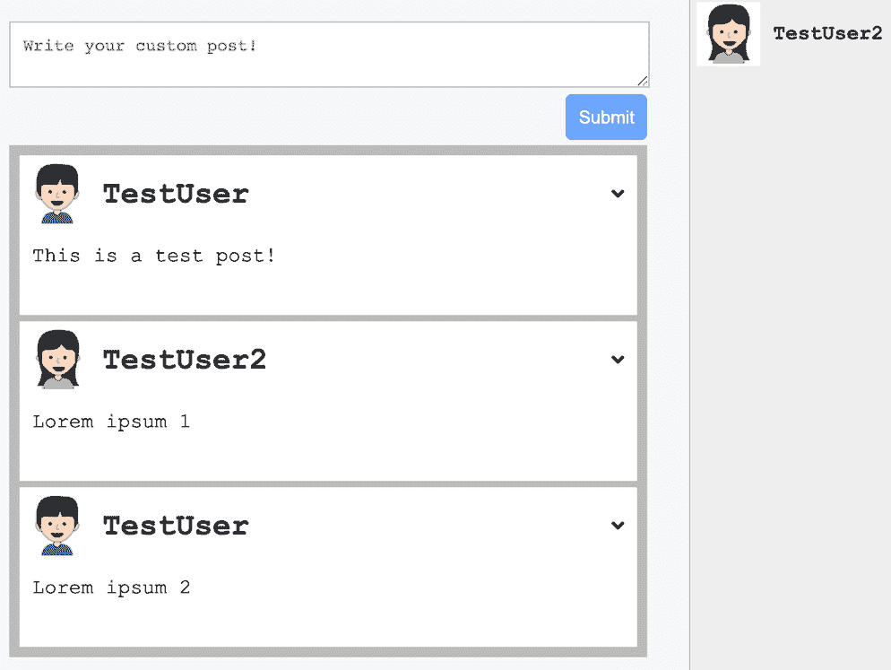
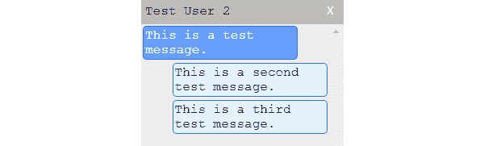
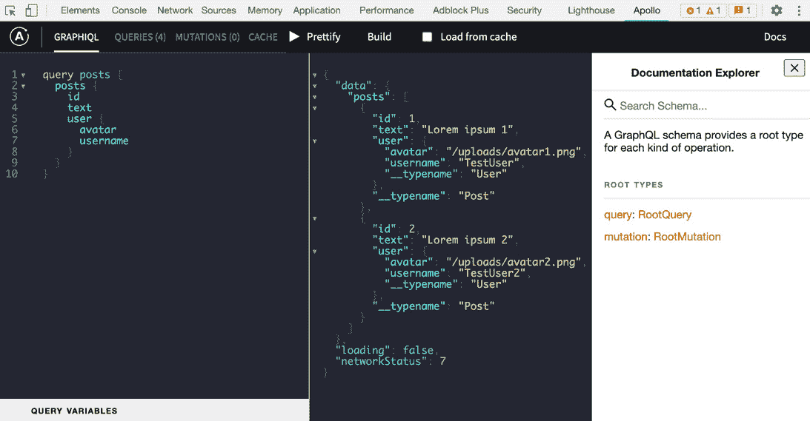
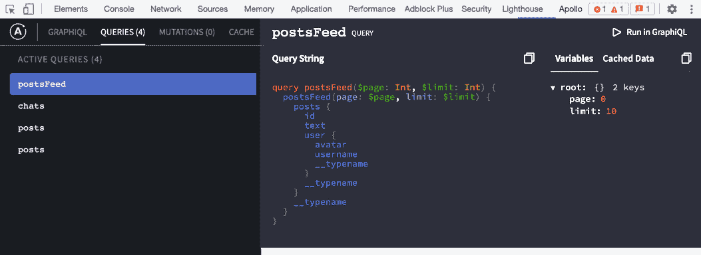
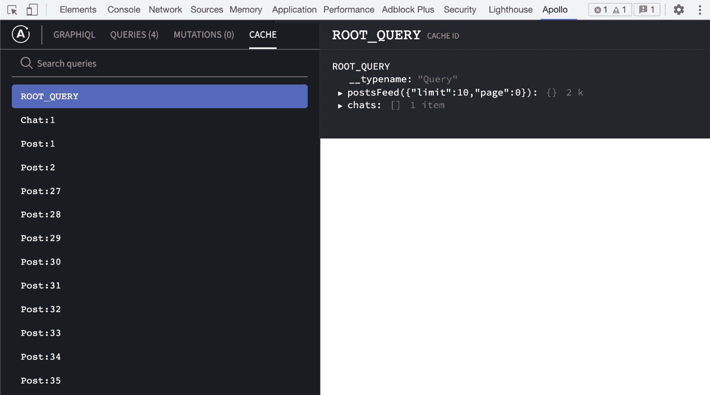

# 第四章：*第四章*：将 Apollo 集成到 React 中

Sequelize 使我们能够轻松访问和查询我们的数据库。帖子、聊天和信息可以瞬间保存到我们的数据库中。React 通过构建**用户界面**（**UI**）帮助我们查看和更新我们的数据。

在本章中，我们将向我们的前端引入 Apollo 的 React 客户端，以便将其与后端连接。我们将使用前端查询、创建和更新帖子数据。

本章将涵盖以下主题：

+   安装和配置 Apollo 客户端

+   使用 GQL 和 Apollo 的 Query 组件发送请求

+   使用 Apollo 客户端修改数据

+   实现聊天和信息

+   React 和 GraphQL 中的分页

+   使用 Apollo 客户端 Devtools 进行调试

# 技术要求

本章的源代码可在以下 GitHub 仓库中找到：

[`github.com/PacktPublishing/Full-Stack-Web-Development-with-GraphQL-and-React-Second-Edition/tree/main/Chapter04`](https://github.com/PacktPublishing/Full-Stack-Web-Development-with-GraphQL-and-React-Second-Edition/tree/main/Chapter04)

# 安装和配置 Apollo 客户端

在开发过程中，我们已经多次测试了我们的 GraphQL **应用程序编程接口**（**API**）。现在，我们可以开始实现前端代码的数据层。在后面的章节中，我们将专注于其他任务，例如身份验证和客户端路由。目前，我们的目标是使用我们的 GraphQL API 与我们的 React 应用程序一起使用。

首先，我们必须安装 React Apollo 客户端库。Apollo 客户端是一个 GraphQL 客户端，它提供了与 React 的优秀集成，并能够轻松从我们的 GraphQL API 获取数据。此外，它处理缓存和订阅等操作，以实现与 GraphQL 后端的实时通信。尽管 Apollo 客户端以 Apollo 品牌命名，但它并不依赖于 Apollo Server。只要遵循协议标准，您就可以使用 Apollo 客户端与任何 GraphQL API 或模式一起使用。您很快就会看到客户端如何完美地与我们的 React 设置合并。

总是会有很多替代方案。您可以使用我们构建的当前 API 中的任何 GraphQL 客户端。这种开放性是 GraphQL 的伟大之处：它使用开放标准进行通信。各种库实现了 GraphQL 标准，您可以自由使用其中的任何一个。

重要提示

最知名的替代方案是 Facebook 开发的 Relay 和由 Prisma 背后的人开发的`graphql-request`。所有这些都是优秀的库，您可以自由使用。我个人主要依赖 Apollo，但 Relay 也非常推荐。您可以在[`github.com/chentsulin/awesome-graphql`](https://github.com/chentsulin/awesome-graphql)找到与 GraphQL 生态系统相关的长列表的包。

除了特殊的客户端库之外，你也可以仅仅使用普通的`fetch`方法或`XMLHttpRequest`请求。缺点是你需要自己实现缓存、编写`request`对象，并将`request`方法集成到你的应用程序中。我不建议这样做，因为它需要花费很多时间，而你希望将时间投入到你的业务中，而不是实现现有功能。 

## 安装 Apollo 客户端

我们使用`npm`安装客户端依赖项，如下所示：

```js
npm install --save @apollo/client graphql
```

为了使 GraphQL 客户端运行，我们需要安装以下两个包：

+   `@apollo/client`是我们安装的所有包的包装包。Apollo 客户端依赖于所有其他包。

+   `graphql`是 GraphQL 的参考实现，它提供了解析 GraphQL 查询的逻辑。

你将在本节中看到这些包是如何协同工作的。

要开始手动设置 Apollo 客户端，创建一个新的文件夹和文件，如下所示：

```js
mkdir src/client/apollo
touch src/client/apollo/index.js
```

我们将在本地的`index.js`文件中设置 Apollo 客户端。我们的首次设置将代表最基本的配置，以便获得一个可工作的 GraphQL 客户端。

小贴士

下面的代码是从官方 Apollo 文档中摘录的。通常，我建议阅读 Apollo 文档，因为它写得非常好。你可以在[`www.apollographql.com/docs/react/essentials/get-started.html`](https://www.apollographql.com/docs/react/essentials/get-started.html)找到它。

只需插入以下代码：

```js
import { ApolloClient, InMemoryCache, from, HttpLink } from '@apollo/client';
import { onError } from "@apollo/client/link/error";
const client = new ApolloClient({
  link: from([
    onError(({ graphQLErrors, networkError }) => {
      if (graphQLErrors) {
        graphQLErrors.map(({ message, locations, path }) => 
        console.log('[GraphQL error]: Message: ${message},
        Location: 
        ${locations}, Path: ${path}'));
        if (networkError) {
          console.log('[Network error]: ${networkError}');
        }
      }
    }),
    new HttpLink({
      uri: 'http://localhost:8000/graphql',
    }),
 ]),
 cache: new InMemoryCache(),
});
export default client;
```

之前的代码使用了所有的新包，除了`react-apollo`。让我们按以下方式分解代码：

+   首先，在文件顶部，我们导入了`@apollo/client`包中所有必需的函数和类。

+   我们实例化了`ApolloClient`。为了使其工作，我们传递了一些参数，即`link`和`cache`属性。

+   `link`属性由`from`命令填充。这个函数遍历一个链接数组，并逐个初始化它们。链接的描述如下：

    a. 第一个链接是错误链接。它接受一个函数，告诉 Apollo 如果发生错误应该做什么。

    b. 第二个链接是 Apollo 的**超文本传输协议**（**HTTP**）链接。你必须提供一个**统一资源标识符**（**URI**），通过该 URI 我们可以访问我们的 Apollo 或 GraphQL 服务器。Apollo 客户端会将所有请求发送到这个 URI。值得注意的是，执行顺序与刚刚创建的数组顺序相同。

+   `cache`属性接受一个缓存实现。一个实现可以是默认包`InMemoryCache`，或者不同的缓存。

    重要提示

    我们的链接可以理解许多更多属性（尤其是 HTTP 链接）。它们提供了许多不同的自定义选项，我们将在稍后查看。你还可以在官方文档中找到它们，网址为[`www.apollographql.com/docs/react/`](https://www.apollographql.com/docs/react/)。

在前面的代码片段中，我们使用 `export default client` 行导出了初始化的 Apollo Client。我们现在可以在我们的 React 应用程序中使用它。

使用 Apollo Client 发送 GraphQL 请求的基本设置已完成。在下一节中，我们将通过 Apollo Client 发送我们的第一个 GraphQL 请求。

## 测试 Apollo Client

在将 GraphQL 客户端直接插入我们的 React 应用程序树之前，我们应该对其进行测试。我们将编写一些临时代码来发送我们的第一个 GraphQL 查询。测试完我们的 GraphQL 客户端后，我们将再次删除代码。按照以下步骤操作：

1.  在 Apollo Client 设置的顶部导入包，如下所示：

    ```js
    import { gql } from '@apollo/client';
    ```

1.  然后，在客户端导出之前添加以下代码：

    ```js
    client.query({
      query: gql'
        { 
          posts { 
            id
            text
            user {
              avatar
              username
            }
          }
        }'
    }).then(result => console.log(result));
    ```

前面的代码几乎与阿波罗文档中的示例相同，但我已经将他们的查询替换为与我们的后端匹配的一个。

在这里，我们使用了 Apollo Client 的 `gql` 工具来解析一个 `gql` 命令，将这个字面量解析为一个 **抽象语法树**（**AST**）。ASTs 是 GraphQL 的第一步；它们用于验证深度嵌套的对象、模式以及查询。客户端在解析完成后发送我们的查询。

小贴士

如果你想了解更多关于 ASTs 的信息，*Contentful* 的人写了一篇关于 ASTs 对 GraphQL 意义的精彩文章，请参阅 [`www.contentful.com/blog/2018/07/04/graphql-abstract-syntax-tree-new-schema/`](https://www.contentful.com/blog/2018/07/04/graphql-abstract-syntax-tree-new-schema/)。

为了测试前面的代码，我们应该启动服务器和前端。一个选项是现在构建前端，然后启动服务器。在这种情况下，执行 `npm run server` 并然后在第二个终端中打开。然后，你可以通过执行 `npm run client` 来启动 `webpack` 开发服务器。应该会自动打开一个新的浏览器标签页。

然而，我们忘记了一些事情：客户端已设置在我们的新文件中，但尚未在任何地方使用。在客户端 React 应用的 `index.js` 根文件中导入它，在 `App` 组件导入下方，如下所示：

```js
import client from './apollo';
```

浏览器应该重新加载，并发送查询。你应该能在浏览器开发者工具的控制台中看到一条新的日志。

输出应该看起来像这样：

![图 4.1 – 手动客户端响应

![img/Figure_4.01_B17337.jpg]

图 4.1 – 手动客户端响应

`data` 对象看起来与通过 Postman 发送请求时收到的响应非常相似，但现在它有一些新的属性：`loading` 和 `networkStatus`。每个都代表一个特定的状态，如下所示：

+   `loading`，正如你所期望的，表示查询是否仍在运行或已经完成。

+   `networkStatus` 超出了这个范围，并提供了发生事件的精确状态。例如，数字 7 表示没有正在运行的查询产生错误。数字 8 表示发生了错误。您可以在官方 GitHub 仓库中查找其他数字，网址为 [`github.com/apollographql/apollo-client/blob/main/src/core/networkStatus.ts`](https://github.com/apollographql/apollo-client/blob/main/src/core/networkStatus.ts)。

现在我们已经验证了查询已成功运行，我们可以将 Apollo Client 连接到 `App.js` 文件中的 React `import` 语句。

## 将 Apollo Client 绑定到 React

我们已经测试了 Apollo Client 并确认它正常工作。然而，React 还没有访问权限。由于 Apollo Client 将在我们的应用程序的每个地方使用，我们可以在根 `index.js` 文件中设置它，如下所示：

```js
import React from 'react';
import ReactDOM from 'react-dom';
import { ApolloProvider } from '@apollo/client/react'; 
import App from './App';
import client from './apollo';
ReactDOM.render(
  <ApolloProvider client={client}>
    <App />
  </ApolloProvider>, document.getElementById('root')
);
```

正如我们在 *第一章* 中提到的，*准备您的开发环境*，您应该只在整个应用程序需要访问新组件时编辑此文件。在前面的代码片段中，您可以看到我们从 `@apollo/client/react` 中导入了我们最初安装的最后一个包。我们从其中提取的 `ApolloProvider` 组件是我们 React 应用程序的第一层。它包围了 `App` 组件，并将我们编写的 Apollo Client 传递给下一层。为此，我们将 `client` 作为属性传递给提供者。现在，每个下层的 React 组件都可以访问 Apollo Client。

我们现在应该能够从我们的 React 应用程序发送 GraphQL 请求。

# 在 React 中使用 Apollo Client

Apollo Client 为我们从 React 组件发送请求提供了所有必要的东西。我们已经测试了客户端并确认它正常工作。在继续之前，我们应该清理我们的文件结构，以便在开发过程中更容易操作。我们的前端仍然显示来自静态演示数据的帖子。第一步是将 Apollo Client 移动到我们的 GraphQL API 并获取数据。

按照以下说明将您的第一个 React 组件与 Apollo Client 连接：

1.  将 `App.js` 文件克隆到另一个名为 `Feed.js` 的文件中。

1.  移除所有使用 React `Helmet` 的部分，移除 `Feed` 而不是 `App`。

1.  从 `App.js` 文件中，移除我们在 `Feed` 组件中留下的所有部分。

1.  此外，我们必须在 `App` 组件内部渲染 `Feed` 组件。它应该看起来像这样：

    ```js
    import React from 'react';
    import { Helmet } from 'react-helmet';
    import Feed from './Feed';
    import '../../assets/css/style.css';
    const App = () => {
      return (
        <div className="container">
          <Helmet>
            <title>Graphbook - Feed</title>
            <meta name="description" content="Newsfeed of 
              all your friends on Graphbook" />
          </Helmet>
          <Feed />
        </div>
      )
    }
    export default App
    ```

相应的 `Feed` 组件应仅包含渲染新闻源的部分。

我们已导入 `Feed` 组件并将其插入到 `App` 组件的 `return` 语句中，以便进行渲染。下一章将重点介绍可重用 React 组件以及如何编写结构良好的 React 代码。现在，让我们看看为什么我们将 `App` 函数拆分为两个单独的文件。

## 使用 Apollo Client 在 React 中进行查询

Apollo Client 提供了一种主要方式来从 GraphQL API 请求数据。`@apollo/client` 包提供的 `useQuery` 函数允许在功能 React 组件中使用 React Hooks 请求数据。除此之外，如果需要，你仍然可以依赖普通的 `client.query` 函数来处理基于类的组件。在 Apollo Client 新版本发布之前，有多个这样做的方法，这些方法在新版本发布时已被弃用。以前，你可以使用 Apollo 的 `Query` 组件，这是一个特殊的 React 组件。这两种方法仍然存在，但已被弃用，因此不建议再使用它们。这就是为什么这些方法将不会在本书中解释的原因。

### Apollo useQuery 钩子

Apollo Client 的最新版本带有 `useQuery` 钩子。你只需要将 GraphQL 查询字符串传递给 `useQuery` 钩子，它将返回一个包含 `data`、`error` 和 `loading` 属性的对象，你可以使用这些属性来渲染你的 UI。

实现 `useQuery` 钩子的实际方式非常简单。只需遵循以下说明：

1.  从 `Feed.js` 文件的顶部移除演示帖子。

1.  移除 `useState(initialPosts)` 行，这样我们就可以查询帖子了。

1.  从 Apollo 导入 `gql` 函数和 `useQuery` 钩子，并解析查询，如下所示：

    ```js
    import { gql, useQuery } from '@apollo/client';
    const GET_POSTS = gql'{ 
      posts { 
        id
        text
        user {
          avatar
          username
        }
      }
    }';
    ```

1.  在顶部的 `Feed` 函数中执行 `useQuery` 钩子，如下所示：

    ```js
    const { loading, error, data } = useQuery(GET_POSTS);
    ```

1.  在实际的 `return` 语句之前，添加以下两个语句，如果有任何加载或错误信息，将会渲染：

    ```js
    if (loading) return 'Loading...';
    if (error) return 'Error! ${error.message}';
    ```

1.  在这些语句和最后一个 `return` 语句之前，添加以下代码行：

    ```js
    const { posts } = data;
    ```

    这将使 `posts` 属性在 `useQuery` 函数返回的数据中可用，前提是它不再加载且没有错误。

    注意，由于我们只遍历 `posts` 属性并返回标记，所以函数现在要干净得多。

与较旧的方法相比，`useQuery` 钩子易于理解，也允许我们编写可读和可理解的代码。

渲染的输出应该看起来像在 *第一章* 中所示，*准备你的开发环境*。由于我们的更改，创建新帖子的表单目前无法正常工作；让我们在下一节中修复这个问题。

# 使用 Apollo Client 更改数据

我们已经改变了客户端获取数据的方式。下一步是切换我们创建新帖子的方式。在 Apollo Client 之前，我们必须手动将新的假帖子添加到演示帖子数组中，在浏览器的内存中。现在，我们文本区域中的所有内容都通过 `addPost` 变更发送到我们的 GraphQL API，通过 Apollo Client。

与 GraphQL 查询一样，有一个`useMutation`钩子，你可以用它向我们的 GraphQL API 发送突变。之前还有一个 HOC 方法和一个单独的`Mutation`组件，它们也已经弃用。它们仍然存在以保持向后兼容，但本书中不会涉及它们。

## Apollo useMutation 钩子

Apollo Client 的最新版本带来了`useMutation`钩子。这个方法与`useQuery`钩子的工作方式相同——你只需要传递解析后的突变字符串给它。作为回应，`useMutation`钩子将返回一个与突变同名的方法，你可以用它来触发那些 GraphQL 请求。

按照以下说明实现`useMutation`钩子并开始使用它：

1.  从`@apollo/client`包中导入`useMutation`钩子，如下所示：

    ```js
    import { gql, useQuery, useMutation } from '@apollo/client';
    ```

1.  使用`gql`函数将`addPost`突变字符串解析到`getPost`查询下方，如下所示：

    ```js
    const ADD_POST = gql'
      mutation addPost($post : PostInput!) {
        addPost(post : $post) {
          id
          text
          user {
            username
            avatar
          }
        }
      }
    ';
    ```

1.  在`Feed`组件内部，添加以下代码行以获取`addPost`函数，你可以在`Feed`组件的任何地方使用它：

    ```js
    const [addPost] = useMutation(ADD_POST);
    ```

1.  现在我们已经得到了`addPost`函数，我们可以开始使用它了。只需更新`handleSubmit`函数，如下所示：

    ```js
    const handleSubmit = (event) => {
      event.preventDefault();
      addPost({ variables: { post: { text: postContent } } });
      setPostContent('');
    };
    ```

    如你所见，我们完全去掉了`newPost`对象，只发送帖子的文本。我们的 GraphQL API 将在插入数据库时创建一个**标识符**（**ID**）。如*第三章*中所述，*连接到数据库*，我们静态地添加第一个用户作为帖子的作者。

你可以尝试通过前端添加一个新的帖子，但你不会立即看到它。表单将是空的，但新的帖子不会显示。这是因为我们组件的当前状态（或缓存）尚未收到新的帖子。测试一切是否正常工作的最简单方法是刷新浏览器。

当然，这并不是它应该工作的方式。在突变发送后，新的帖子应该直接在动态中可见。我们现在将修复这个问题。

## 使用 Apollo Client 更新 UI

在运行`addPost`突变后，请求通过服务器并成功保存了新的帖子到我们的数据库中，没有任何问题。然而，我们仍然不能立即在前端看到这些变化生效。

在突变之后更新 UI 有两种不同的方式，如下所示：

+   **重新获取数据集**：这很容易实现，但它重新获取了所有数据，这是低效的。

+   **根据插入的数据更新缓存**：这更难理解且实现起来更复杂，但它将新数据附加到 Apollo Client 的缓存中，因此不需要重新获取。

我们在不同的场景中使用这些解决方案。让我们看看一些例子。如果服务器上实现了对客户端隐藏的进一步逻辑，并且当请求项目列表时未应用，而插入单个项目时则应用，则重新获取是有意义的。在这些情况下，客户端无法模拟服务器典型响应的状态。

然而，当在列表中添加或更新项目时，如我们的帖子源，更新缓存是有意义的。客户端可以将新帖子插入到源顶部。

我们将首先简单地重新获取请求，然后我们将介绍缓存更新实现。以下部分（和章节）将假设您没有使用 HOC 方法。

### 重新获取查询

如前所述，这是更新 UI 的最简单方法。唯一的步骤是设置要重新获取查询的查询数组。`useMutation`函数应如下所示：

```js
const [addPost] = useMutation(ADD_POST, {
  refetchQueries: [{query:GET_POSTS}]
});
```

在`refetchQueries`数组中输入的每个对象都需要一个`query`属性。当与这些请求相关联的响应到达时，依赖于这些请求的每个组件都会重新渲染。这还包括不在`Feed`组件内部的组件。所有使用帖子的`GET_POSTS`查询的组件都会重新渲染。

您还可以为每个查询提供更多字段，例如发送参数的变量，与`refetch`请求一起发送。提交表单会重新发送查询，您可以直接在源中看到新帖子。重新获取还会重新加载已显示的帖子，这是不必要的。

现在，让我们看看我们如何能更有效地做到这一点。

### 更新 Apollo Client 缓存

我们只想明确地将新帖子添加到 Apollo Client 的缓存中。使用缓存可以帮助我们通过不重新获取整个源或重新渲染整个列表来保存数据。要更新缓存，您应该删除`refetchQueries`属性。

在技术上，至少有两种方式可以在突变请求的响应中更新缓存。第一种方法相当直接且简单。然后你可以引入一个新的属性，称为`update`，如下面的代码片段所示：

```js
const [addPost] = useMutation(ADD_POST, {
  update(cache, { data: { addPost } }) {
    const data = cache.readQuery({ query: GET_POSTS });
    const newData = { posts: [addPost, ...data.posts]};
    cache.writeQuery({ query: GET_POSTS, data: newData });
  }
});
```

当 GraphQL 的`addPost`突变完成时，新属性会运行。它接收的第一个参数是 Apollo Client 的`cache`参数，其中保存了整个缓存。第二个参数是我们 GraphQL API 返回的响应。

更新缓存的方式如下：

1.  使用`cache.readQuery`函数，通过传递`query`作为参数。它读取缓存中为该特定查询保存的数据。`data`变量包含我们帖子源中的所有帖子。

1.  现在我们已经将所有帖子放入数组中，我们可以添加缺失的帖子。确保你知道是否需要将项目前置或后置。在我们的例子中，我们创建了一个`newData`对象，其中包含一个`posts`数组，该数组由顶部新添加的帖子和解构后的旧帖子列表组成。

1.  我们需要将更改保存回缓存。`cache.writeQuery`函数接受我们用来发送请求的`query`参数。这个`query`参数用于更新我们缓存中保存的数据。第二个参数是要保存的数据。

1.  当缓存已更新后，我们的 UI 会反应性地渲染更改。

在现实中，你可以在`update`函数中做任何你想做的事情，但我们只使用它来更新 Apollo 客户端存储。

第二种方法看起来稍微复杂一些，但代表了官方文档中展示的方式。`update`函数看起来更复杂一些，但带来了一些性能上的小改进。你可以选择你更喜欢哪一个。

只需替换`useMutation`钩子的`update`函数，如下所示：

```js
update(cache, { data: { addPost } }) {
  cache.modify({
    fields: {
      posts(existingPosts = []) {
         const newPostRef = cache.writeFragment({
           data: addPost,
           fragment: gql'
             fragment NewPost on Post {
               id
               type
             }
           '
         });
         return [newPostRef, ...existingPosts];
      }
    }
  });
} 
```

上述代码所做的就是使用`cache.modify`函数，它允许比我们之前所做的更精确的更新。我们不是在 Apollo 客户端中更新整个`GET_POSTS`查询，而是使用`cache`对象的`cache.writeFragment`方法来更新缓存和 UI，只更新新的帖子。这将提高我们组件的性能，尤其是在组件逻辑增长时。

在下一节中，我们将对我们的服务器响应更加乐观，并在请求的响应成功到达之前添加项目。

### 乐观式 UI

Apollo 提供了一种能够以乐观方式更新 UI 的出色功能。乐观方式意味着在请求完成之前，Apollo 会将新数据或帖子添加到存储中。这种解决方案的优点是用户可以看到新的结果，而不是等待服务器的响应。这种解决方案使得应用程序感觉更快、更响应。

本节期望`Mutation`组件的`update`函数已经实现。否则，这个 UI 功能将不会工作。我们需要在`useMutation`配置的`update`属性旁边添加`optimisticResponse`属性，如下所示：

```js
optimisticResponse: {
  __typename: "mutation",
  addPost: {
    __typename: "Post",
    text: postContent,
    id: -1,
    user: {
      __typename: "User",
      username: "Loading...",
      avatar: "/public/loading.gif"
    }
  }
}
```

`optimisticResponse`属性可以是任何从函数到简单对象的东西。然而，返回值需要是一个 GraphQL `response`对象。你在这里看到的是一个`addPost`对象，看起来就像我们的 GraphQL API 可以返回它，如果我们的请求成功的话。你需要根据你使用的 GraphQL 模式填写`__typename`字段。这就是为什么`Post`和`User`类型名称在这个假对象内部。

从技术上讲，你也可以在`addPost`的实际调用旁边添加`optimisticResponse`属性，在`variables`属性旁边，但我认为这不是我们需要在每次调用此函数时传递的东西，而实际上应该全局设置到`useMutation`钩子中。

乐观响应的`id`属性被设置为`-1`。React 预期循环中的每个组件都有一个唯一的`key`属性。我们通常使用帖子的`id`属性作为`key`值。由于 MySQL 从 1 开始计数，因此`-1`永远不会被任何其他帖子使用。另一个优点是，我们可以使用这个`id`属性来设置列表中帖子项的特殊类。

此外，用户名和用户头像被设置为`loading`。这是因为我们没有内置的身份验证。React 和 Apollo 没有与当前会话关联的用户，所以我们不能将用户数据输入到`optimisticResponse`属性中。一旦身份验证就绪，我们就解决这个问题。这是一个处理在收到服务器响应之前没有所有数据的情景的绝佳例子。

要在列表项上设置特定的类，我们在`map`循环中条件性地设置正确的`className`属性。将以下代码插入到`return`语句中：

```js
{posts.map((post, i) => 
  <div key={post.id} className={'post ' + (post.id < 0 ? 
    'optimistic': '')}>
    <div className="header">
      
      <h2>{post.user.username}</h2>
    </div>
    <p className="content">
      {post.text}
    </p>
  </div>
)}
```

对于此示例，CSS 样式可能看起来像这样：

```js
.optimistic {
  -webkit-animation: scale-up 0.4s cubic-bezier(0.390,
    0.575, 0.565, 1.000) both;
  animation: scale-up 0.4s cubic-bezier(0.390, 0.575,
    0.565, 1.000) both;
}
@-webkit-keyframes scale-up {
  0% {
    -webkit-transform: scale(0.5);
    transform: scale(0.5);
  }
  100% {
    -webkit-transform: scale(1);
    transform: scale(1);
  }
}
@keyframes scale-up {
  0% {
    -webkit-transform: scale(0.5);
    transform: scale(0.5);
  }
  100% {
    -webkit-transform: scale(1);
    transform: scale(1);
  }
}
```

CSS 动画使您的应用程序更加现代和灵活。如果您在浏览器中查看时遇到问题，您可能需要检查您的浏览器是否支持它们。

您可以在以下屏幕截图中看到结果：


图 4.2 – 加载乐观响应

一旦从我们的 API 收到响应，加载指示器和用户名就会被移除，然后再次执行带有真实数据的`update`函数。您无需自己处理移除加载帖子，因为这是由 Apollo 自动完成的。任何来自`npm`包或 GIF 文件的旋转器组件都可以用于我插入加载动画的位置。我使用的文件需要保存在`public`文件夹下，文件名为`loading.gif`，这样就可以通过我们在前面代码中添加的 CSS 使用它。

现在一切都已经设置好了，用于发送新帖子。UI 会立即响应并显示新帖子。

然而，关于您朋友和同事的新帖子怎么办？目前，您需要重新加载页面才能看到它们，这并不直观。目前，我们只添加我们自己发送的帖子，但不会收到其他人新帖子的任何信息。我将在下一节中向您展示处理此问题的最快方法。

### 使用 Apollo 客户端进行轮询

**轮询**不过是每隔一段时间重新运行一次请求。这是实现我们新闻源更新的最简单方法。然而，轮询与多个问题相关，如下所述：

+   在不知道是否有新数据的情况下发送请求是不高效的。浏览器可能会发送数十个请求，却从未收到任何新帖子。

+   如果我们直接再次发送初始请求，我们将获得所有帖子，包括那些我们已经向用户展示的。

+   在发送请求时，服务器需要查询数据库并计算一切。不必要的请求会耗费金钱和时间。

有些用例中轮询是有意义的。一个例子是实时图表，其中无论是否有数据，每个轴刻度都会显示给用户。由于你想要显示所有内容，因此不需要使用基于中断的解决方案。尽管轮询会带来一些问题，但让我们快速了解一下它是如何工作的。你所需要做的就是填写`useQuery` Hook 配置中的`pollInterval`属性，如下所示：

```js
const { loading, error, data } = useQuery(GET_POSTS, { pollInterval: 5000 });
```

请求每 5 秒重发一次（5,000 **毫秒**，或**ms**）。

如你所预期，还有其他方法可以实现 UI 的实时更新。一种方法是用**服务器发送事件**。正如其名所示，服务器发送事件是由服务器发送到客户端的事件。客户端需要与服务器建立连接，然后服务器就可以向客户端发送消息，单向通信。另一种方法是使用**WebSockets**，它允许服务器和客户端之间进行双向通信。然而，与 GraphQL 相关最常见的方法是使用**Apollo Subscriptions**。它们基于 WebSockets，并且与 GraphQL 配合得非常好。我将在*第十章*“实时订阅”中向你展示 Apollo Subscriptions 是如何工作的。

让我们继续并集成我们剩余的 GraphQL API。

# 实现聊天和消息

在上一章中，我们编写了一种相当动态的方式来创建与你的朋友和同事的聊天和消息，无论是单独还是分组。还有一些我们没有讨论的事情，比如身份验证、实时订阅和好友关系。然而，首先，我们将利用 React 和 Apollo Client 来发送 GraphQL 请求来锻炼我们的新技能。这是一个复杂的工作，所以让我们开始吧。

## 获取并显示聊天

我们的新闻推送正如预期那样工作。现在，我们还想涵盖聊天。正如我们的推送一样，我们需要查询当前用户（或者在我们的情况下，是第一个用户）关联的每个聊天。

第一步是使用一些示例聊天来使渲染工作。与我们在第一章中自己写入数据不同，我们现在可以执行`chats`查询。然后，我们可以将结果复制到新文件中作为静态示例数据，然后再执行实际的`useQuery` Hook。

让我们开始吧，如下所示：

1.  发送 GraphQL 查询。如果你已经知道如何使用 Apollo Client Devtools，那么最佳选项就是使用它们。否则，你可以像之前一样依赖 Postman。代码在下面的代码片段中展示：

    ```js
    query {
      chats {
        id
        users {
          avatar
          username
        }
      }
    }
    ```

    请求看起来与我们在 Postman 中测试的请求略有不同。我们将要构建的聊天面板只需要特定的数据。我们不需要在这个面板内渲染任何消息，因此我们不需要请求它们。一个完整的聊天面板只需要聊天本身、ID、用户名和头像。稍后，当查看单个聊天时，我们还将检索所有消息。

    接下来，创建一个名为`Chats.js`的新文件，位于`Feed.js`文件旁边。

    将响应中的完整`chats`数组复制到`Chats.js`文件中的数组中，如下所示。将其添加到文件顶部：

    ```js
    const chats = [{
      "id": 1,
      "users": [{
          "id": 1,
          "avatar": "/uploads/avatar1.png",
          "username": "Test User"
        },
        {
          "id": 2,
          "avatar": "/uploads/avatar2.png",
          "username": "Test User 2"
        }]
      }
    ];
    ```

1.  在`chats`变量之前导入 React。否则，我们将无法渲染任何 React 组件。以下是您需要执行的代码：

    ```js
    import React, { useState } from 'react';
    ```

1.  设置功能 React 组件。我在这里提供了基本的标记。只需将其复制到`chats`变量下面。我很快就会解释新组件的逻辑：

    ```js
    const usernamesToString = (users)  => {
      const userList = users.slice(1);
      var usernamesString = '';
      for(var i = 0; i < userList.length; i++) {
        usernamesString += userList[i].username;
        if(i - 1 === userList.length) {
          usernamesString += ', ';
        }
      }
      return usernamesString;
    }
    const shorten = (text) => {
      if (text.length > 12) {
        return text.substring(0, text.length - 9) + '...';
      }
      return text;
    }
    const Chats = () => {
      return (
        <div className="chats">
          {chats.map((chat, i) =>
            <div key={chat.id} className="chat">
              <div className="header">
                 2 ?
                 '/public/group.png' : 
                   chat.users[1].avatar)} />
                <div>
                  <h2>{shorten(usernamesToString
                     (chat.users))}</h2>
                </div>
              </div>
            </div>
          )}
        </div>
      )
    }
    export default Chats
    ```

    目前，该组件相当基础。组件遍历所有聊天，并为每个聊天返回一个新的列表项。每个列表项都有一个图像，该图像来自数组的第二个用户，因为我们定义列表中的第一个用户是当前用户，只要我们没有实现身份验证。如果有超过两个用户，我们使用群组图标。当我们实现了身份验证并且我们知道已登录的用户时，我们可以获取我们正在与之聊天的特定用户头像。

    聊天顶部`h2`标签内显示的标题是用户的名称。为此，我实现了`usernamesToString`方法，该方法遍历所有用户名并将它们连接成一个长字符串。结果传递给`shorten`函数，该函数移除超过最大 12 个字符的所有字符串字符。

    您可能会注意到，这些辅助函数不在实际组件内部。我个人建议将辅助函数放在组件外部，因为它们将在组件每次渲染时被重新创建。如果辅助函数需要组件的作用域，请将其保留在内部，但如果它们只是在这里进行转换的纯函数，请将其放在外部。

1.  我们的新组件需要一些样式。将新的 CSS 复制到我们的`style.css`文件中。

    为了在我们的 CSS 文件中节省文件大小，将两个`.post .header`样式替换为也覆盖聊天的样式，如下所示：

    ```js
    .post .header > *, .chats .chat .header > * {
      display: inline-block;
      vertical-align: middle;
    }
    .post .header img, .chats .chat .header img {
      width: 50px;
      margin: 5px;
    }
    ```

    我们必须在`style.css`文件的底部追加以下 CSS：

    ```js
    .chats {
      background-color: #eee;
      width: 200px;
      height: 100%;
      position: fixed;
      top: 0;
      right: 0;
      border-left: 1px solid #c3c3c3;
    }
    .chats .chat {
      cursor: pointer;
    }
    .chats .chat .header > div {
      width: calc(100% - 65px);
      font-size: 16px;
      margin-left: 5px;
    }
    .chats .chat .header h2, .chats .chat .header span {
      color: #333;
      font-size: 16px;
      margin: 0;
    }
    .chats .chat .header span {
      color: #333;
      font-size: 12px;
    }
    ```

1.  为了使代码正常工作，我们还必须在`App.js`文件中导入`Chats`组件，如下所示：

    ```js
    import Chats from './Chats';
    ```

1.  在`App.js`文件中`Feed`组件下面的返回语句内渲染`Chats`组件。

    当前代码生成以下截图：

![图 4.3 – 聊天面板]



图 4.3 – 聊天面板

在右侧，您可以看到我们刚刚实现的聊天面板。每个聊天都作为单独的行列在那里。

结果还不错，但至少在用户名下方显示每条聊天的最后一条消息会更有帮助，这样你就可以直接看到对话的最后内容。

按照以下说明将最后一条消息添加到聊天面板中：

1.  做这件事最简单的方法是在查询中再次添加消息，但查询我们想在面板中显示的每个聊天的所有消息并没有太多意义。相反，我们将在聊天实体中添加一个新属性，称为`lastMessage`。这样，我们只会得到最新消息。我们将在后端代码中添加新字段到我们聊天类型的 GraphQL 模式中，如下所示：

    ```js
    lastMessage: Message
    ```

    当然，我们还需要实现一个函数来检索`lastMessage`字段。

1.  在`resolvers`对象的`Chats`属性中添加我们的新`resolvers.js`函数将按 ID 对所有聊天消息进行排序并取第一个。根据定义，这应该是我们聊天中的最新消息。我们需要自己解析这个承诺并返回数组的第一个元素，因为我们期望只返回一个`message`对象。如果你直接返回承诺，你将收到来自服务器的`null`响应，因为数组不是一个有效的单个消息实体的响应。以下代码片段展示了代码：

    ```js
    lastMessage(chat, args, context) {
      return chat.getMessages({limit: 1, order: [['id',
        'DESC']]}).then((message) => {return message[0];
      });
    },
    ```

1.  你可以在`Chats.js`中的静态演示数据内部添加新的属性，对于每个数组项或重新运行 GraphQL 查询并再次复制响应。代码如下所示：

    ```js
    "lastMessage": {
      "text": "This is a third test message."
    }
    ```

1.  我们可以用一个简单的`span`标签在用户名的`h2`标题下方渲染新消息。直接将其复制到我们的`Chats`组件中的`return`语句中，如下所示：

    ```js
    <span>{chat?.lastMessage?.text}</span>
    ```

前面更改的结果是渲染每行聊天中的最后一条消息。现在它应该看起来像这样：


图 4.4 – 最后一条消息

由于测试数据中的所有内容都显示正确，我们可以引入`useQuery`钩子来从我们的 GraphQL API 获取所有数据。我们可以删除`chats`数组。然后，我们将导入所有依赖项并解析 GraphQL 查询，如下面的代码片段所示：

```js
import { gql, useQuery } from '@apollo/client';
const GET_CHATS = gql'{
  chats {
    id
    users {
      id
      avatar
      username
    }
    lastMessage {
      text
    }
  }
}';
```

为了使用前面解析的 GraphQL 查询，我们将在我们的功能组件中执行`useQuery`钩子，如下所示：

```js
const { loading, error, data} = useQuery(GET_CHATS);
if (loading) return <div className="chats"><p>Loading...</p></div>;
if (error) return <div className="chats"><p>{error.message}</p></div>;
const { chats } = data;
```

当你将前面的代码行添加到`Chats`函数的开始处时，它将使用 GraphQL 响应中返回的`chats`数组。在这样做之前，它当然会检查请求是否仍在加载或是否发生了错误。

我们在具有`chats`类的`div`标签内渲染加载和错误状态，这样消息就会被包裹在灰色面板中。

你应该已经通过 Postman 运行了上一章的`addChat`突变。否则，将没有可查询的聊天，面板将是空的。你还需要为任何后续章节执行此突变，因为我们不会为这个功能实现一个特殊的按钮。原因是它背后的逻辑并没有提供关于 React 或 Apollo 的更多知识，因为它只是在 Graphbook 的正确位置执行`addChat`突变。

接下来，我们希望在打开特定聊天后显示聊天消息。

## 获取和显示消息

首先，我们必须存储用户通过点击打开的聊天。每个聊天都在一个单独的小聊天窗口中显示，就像在 Facebook 上一样。向`Chats`组件添加一个新的状态变量来保存所有打开的聊天 ID，如下所示：

```js
const [openChats, setOpenChats] = useState([]);
```

为了让我们的组件能够向打开的聊天数组中插入或删除内容，我们将添加新的`openChat`和`closeChat`函数，如下所示：

```js
const openChat = (id) => {
  var openChatsTemp = openChats.slice();
  if(openChatsTemp.indexOf(id) === -1) {
    if(openChatsTemp.length > 2) {
      openChatsTemp = openChatsTemp.slice(1);
    }
    openChatsTemp.push(id);
  }
  setOpenChats(openChatsTemp);
}
const closeChat = (id) => {
  var openChatsTemp = openChats.slice();
  const index = openChatsTemp.indexOf(id);
  openChatsTemp.splice(index,1),
  setOpenChats(openChatsTemp);
} 
```

当点击聊天时，我们将首先检查它是否尚未打开，通过在`openChats`数组中使用`indexOf`函数搜索 ID。

每次打开一个新的聊天时，我们将检查是否有三个或更多的聊天。如果是这样，我们将从数组中删除第一个打开的聊天，并通过使用`push`函数将其附加到数组中来交换它。我们只保存聊天 ID，而不是整个**JavaScript 对象表示法**（**JSON**）对象。

对于`closeChat`函数，我们只需通过从`openChats`数组中删除 ID 来撤销这个操作。

最后一步是将`onClick`事件绑定到我们的组件上。在`map`函数中，我们可以用以下代码行替换包装`div`标签：

```js
<div key={"chat" + chat.id} className="chat" onClick={() => openChat(chat.id)}>
```

在这里，我们使用`onClick`来调用`openChat`函数，将聊天 ID 作为唯一参数。此时，新函数已经工作，但更新的状态没有被使用。让我们处理这个问题，如下所示：

1.  将一个周围的包装`div`标签添加到具有`chats`类的`div`标签中，如下所示：

    ```js
    <div className="wrapper">
    ```

1.  为了不搞乱，我们编写的完整代码将引入我们的第一个子组件。为此，在`Chats.js`文件旁边创建一个名为`Chat.js`的文件。

1.  在这个新文件中，导入 React 和 Apollo，并解析 GraphQL 查询以获取刚刚打开的所有聊天消息，如下所示：

    ```js
    import React from 'react';
    import { gql, useQuery } from '@apollo/client';
    const GET_CHAT = gql'
      query chat($chatId: Int!) {
        chat(chatId: $chatId) {
          id
          users {
            id
            avatar
            username
          }
          messages {
            id
            text
            user {
                id
            }
          }
        }
      }
    ';
    ```

    如前述代码片段所示，我们将聊天 ID 作为参数传递给 GraphQL 查询。

1.  实际组件将利用解析的查询获取所有消息并在一个小容器中渲染它们。应该按照以下方式添加组件：

    ```js
    const Chat = (props) => {
      const { chatId, closeChat } = props;
      const { loading, error, data } = useQuery(GET_CHAT, { 
        variables: { chatId }});
      if (loading) return <div className="chatWindow">
        <p>Loading...</p></div>;
      if (error) return <div className="chatWindow">
        <p>{error.message}</p></div>;
      const { chat } = data;
      return (
        <div className="chatWindow">
          <div className="header">
            <span>{chat.users[1].username}</span>
            <button onClick={() => closeChat(chatId)} 
              className="close">X</button>
          </div>
          <div className="messages">
            {chat.messages.map((message, j) =>
              <div key={'message' + message.id}
                className={'message ' + (message.user.id >
                  1 ? 'left' : 'right')}>
                {message.text}
              </div>
            )}
          </div>
        </div>
      )
    }
    export default Chat
    ```

    我们执行 `useQuery` 钩子来发送 GraphQL 请求。我们传递 `props` 中的 `chatId` 属性，以便聊天 ID 必须从父组件传递到子组件。我们还提取了 `closeChat` 函数，以便从子组件中调用它，因为实际的关闭按钮位于聊天容器中，而不是父组件中。

    一旦请求到达，我们在实际渲染完整的聊天之前再次检查请求是否正在加载或是否有错误。然后，我们渲染一个带有 `chatWindow` 类名的 `div` 标签，其中显示所有消息。同样，我们再次使用用户 ID 来伪造消息的类名。当我们开始运行身份验证时，我们将替换它。

1.  由于我们已经准备好了子组件，我们只需要在 `Chats.js` 文件中添加一行来导入它，如下所示：

    ```js
    import Chat from './Chat';
    ```

1.  然后，为了使用我们新的 `Chat` 组件，只需在带有 `wrapper` 类的 `div` 标签内添加这三行代码：

    ```js
    <div className="openChats">
      {openChats.map((chatId, i) => <Chat chatId={chatId}
      key={"chatWindow" + chatId} closeChat={closeChat} /> )}
    </div>
    ```

    对于 `openChats` 数组中的每个项目，我们将渲染 `Chat` 组件，然后传递 `chatId` 属性和 `closeChat` 函数。子组件将根据传递的 `chatId` 属性自行获取聊天数据。

1.  最后缺少的是一些样式。CSS 文件相当大。其他用户的每条消息都应该显示在左侧，而我们的消息显示在右侧，以便区分它们。直接从 GitHub 仓库插入 CSS 代码以节省时间：[`github.com/PacktPublishing/Full-Stack-Web-Development-with-GraphQL-and-React-2nd-Edition/blob/main/Chapter04/assets/css/style.css`](https://github.com/PacktPublishing/Full-Stack-Web-Development-with-GraphQL-and-React-2nd-Edition/blob/main/Chapter04/assets/css/style.css)。

请看以下截图：



图 4.5 – 聊天窗口

我们忘记了一些重要的事情。我们可以看到聊天中的所有消息，但我们无法添加新的消息，这是至关重要的。让我们在下一节中看看如何实现聊天消息表单。

## 通过突变发送消息

`addMessage` 突变已经存在于我们的后端，因此我们可以将其添加到我们的 `Chat` 组件中。要完全实现此功能，请按照以下说明操作：

1.  在直接将其添加到前端之前，我们需要更改 `import` 语句，以便我们也有 `useMutation` 和 `useState` 函数，如下所示：

    ```js
    import React, { useState } from 'react';
    import { gql, useQuery, useMutation } from '@apollo/client';
    ```

1.  然后，像对待其他请求一样，在顶部解析突变，如下所示：

    ```js
    const ADD_MESSAGE = gql'
      mutation addMessage($message : MessageInput!) {
        addMessage(message : $message) {
          id
          text
          user {
            id
          }
        }
      }
    ';
    ```

1.  现在，我们将保持简单，并直接将文本输入添加到 `Chat` 组件中，但我们将查看在 *第五章*，*可重用 React 组件和 React 钩子*中更好的方法。

    现在，我们需要创建一个状态变量来保存我们新创建的文本输入的当前值。我们需要执行`useMutation`钩子来发送 GraphQL 请求创建新的聊天消息。为此，只需添加以下代码：

    ```js
    const [text, setText] = useState('');
    const [addMessage] = useMutation(ADD_MESSAGE, {
      update(cache, { data: { addMessage } }) {
        cache.modify({
          id: cache.identify(data.chat),
          fields: {
            messages(existingMessages = []) {
              const newMessageRef = cache.writeFragment({
                data: addMessage,
                fragment: gql'
                  fragment NewMessage on Chat {
                    id
                    type
                  }
                '
              });
              return [...existingMessages, newMessageRef];
            }
          }
        });
      }
    });
    const handleKeyPress = (event) => {
      if (event.key === 'Enter' && text.length) {
        addMessage({ variables: { message: { text, chatId 
          } } }).then(() => {
          setText('');
        });
      }
    }
    ```

    状态变量和突变函数看起来很熟悉，因为你已经知道了它们。我们为`useMutation`钩子做的特别之处是再次提供一个`update`函数，以有效地更新 Apollo 客户端缓存中的最新数据。为此，我们必须向`cache.modify`函数提供一个`id`属性。我们需要这样做的原因是我们想更新特定聊天的`messages`数组，但我们的缓存中可能有多个。为了更新消息中的正确聊天，我们使用`cache.identify`函数并提供当前的`chat`对象，它将自动检测要更新的聊天。

    `handleKeyPress`函数将处理文本输入的提交以触发突变请求。

1.  我们必须插入渲染一个完全功能性的输入所需的标记。将输入放在消息列表下方，在聊天窗口内。`onChange`属性在输入时执行，并将组件的状态更新为输入的值。插入以下代码：

    ```js
    <div className="input">
      <input type="text" value={text} onChange={(e) => 
        setText(e.target.value)} 
        onKeyPress={handleKeyPress}/>
    </div>
    ```

    我们使用`onKeyPress`事件来处理*Enter*键的点击，以便我们可以发送聊天消息。

1.  让我们快速向`style.css`文件添加一些 CSS，使输入字段看起来更好，如下所示：

    ```js
    .chatWindow .input input {
      width: calc(100% - 4px);
      border: none;
      padding: 2px;
    }
    .chatWindow .input input:focus {
      outline: none;
    }
    ```

以下截图显示了聊天窗口，其中通过聊天窗口输入插入了一条新消息：


图 4.6 – 聊天窗口中的消息

我们还没有实现并且不会在本书中涵盖的许多功能——例如，如果是一个群聊，在聊天消息旁边显示用户名，在消息旁边显示头像，以及在新消息发送后更新聊天面板中的`lastMessage`字段，这都有意义。要实现一个像 Facebook 这样的完整社交网络所需的工作量是无法在本书中涵盖的，但你将学习所有必需的技术、工具和策略，以便你可以自己着手进行。我们将要涵盖的下一个重要功能是分页。

# React 和 GraphQL 中的分页

当我们说到**分页**时，大多数情况下，我们指的是数据的批量查询。目前，我们在数据库中查询所有帖子、聊天和消息。如果你想想 Facebook 中与朋友的一次聊天存储了多少数据，你就会意识到一次性获取所有消息和数据是不现实的。一个更好的解决方案是使用分页。使用分页，我们每次请求都有一个页面大小或限制，即我们想要获取多少项。我们还有一个页面或偏移量，从那里我们可以开始选择数据行。

在本节中，我们将探讨如何使用帖子源进行分页，因为这是最直接的例子。在 *第五章*，*可重用 React 组件和 React 钩子* 中，我们将专注于编写高效且可重用的 React 代码。Sequelize 默认提供分页功能。我们首先插入一些更多的演示帖子，以便我们可以以每批 10 个帖子进行分页。

在实现前端之前，我们需要对后端进行一些调整，如下所示：

1.  在我们的 GraphQL 模式中添加一个新的 `RootQuery`，如下所示：

    ```js
    postsFeed(page: Int, limit: Int): PostFeed
    ```

1.  `PostFeed` 类型仅包含 `posts` 字段。在应用程序的开发过程中，您可以返回更多信息，例如项目总数、页面数等。以下代码片段展示了如何实现：

    ```js
    type PostFeed {
      posts: [Post]
    }
    ```

1.  接下来，我们必须在我们的 `resolvers.js` 文件中实现 `PostFeed` 实体。将新的解析函数复制到 `resolvers` 文件中，如下所示：

    ```js
    postsFeed(root, { page, limit }, context) {
      var skip = 0;
      if(page && limit) {
        skip = page * limit;
      }
      var query = {
        order: [['createdAt', 'DESC']],
        offset: skip,
      };
      if(limit) {
        query.limit = limit;
      }
      return {
       posts: Post.findAll(query)
      };
    },
    ```

我们构建了一个 Sequelize 可以理解的简单 `query` 对象，这使得我们可以对帖子进行分页。`page` 数乘以 `limit` 参数，以跳过计算出的行数。`offset` 参数跳过行数，而 `limit` 参数在指定数量（在我们的例子中是 10）之后停止选择行。

我们的前端需要一些调整以支持分页。使用 `npm` 安装一个新的 React 包，它为我们提供了无限滚动实现，如下所示：

```js
npm install react-infinite-scroll-component --save
```

无限滚动是一种让用户通过滚动到浏览器窗口底部来加载更多内容的优秀方法。

您可以自己编程实现，但在这里我们不会涉及。回到 `Feed.js` 文件，替换 `GET_POSTS` 查询，并使用以下代码导入 `react-infinite-scroll-component` 包：

```js
import InfiniteScroll from 'react-infinite-scroll-component';
const GET_POSTS = gql'
  query postsFeed($page: Int, $limit: Int) { 
    postsFeed(page: $page, limit: $limit) { 
      posts {
        id
        text
        user {
          avatar
          username
        }
      }
    }
  }
';
```

由于 `postsFeed` 查询期望除了之前的标准查询之外的其他参数，我们需要编辑我们的 `useQuery` 钩子，并引入两个新的状态变量。更改的行如下所示：

```js
const [hasMore, setHasMore] = useState(true);
const [page, setPage] = useState(0);
const { loading, error, data, fetchMore } = useQuery(GET_POSTS, { pollInterval: 5000, variables: { page: 0, limit: 10 } });
```

在前面的代码片段中，我们从 `useQuery` 钩子中提取了 `fetchMore` 函数，该函数用于运行分页请求以加载更多帖子项。我们还创建了一个 `hasMore` 状态变量，它将确定是否还有更多数据可以从 GraphQL API 加载，而 `page` 变量将保存当前页——更确切地说，是已经滚动过的页数。

根据我们在 GraphQL 模式中定义的新数据结构，我们从 `postsFeed` 对象中提取 `posts` 数组。您可以通过替换以下两行代码来实现：

```js
const { postsFeed } = data;
const { posts } = postsFeed;
```

将我们当前源中的 `div` 标签的标记替换为使用我们新的无限滚动包，如下所示：

```js
<div className="feed">
  <InfiniteScroll
    dataLength={posts.length}
    next={() => loadMore(fetchMore)}
    hasMore={hasMore}
    loader={<div className="loader" key={"loader"}>
      Loading ...</div>}
  >
    {posts.map((post, i) =>
      <div key={post.id} className={'post ' + (post.id < 0
        ? 'optimistic': '')}>
        <div className="header">
          
          <h2>{post.user.username}</h2>
        </div>
        <p className="content">{post.text}</p>
      </div>
    )}
  </InfiniteScroll>
</div>
```

无限滚动包所做的唯一事情是运行 `next` 属性中提供的 `loadMore` 函数，只要 `hasMore` 设置为 `true` 并且用户滚动到浏览器窗口的底部。当 `hasMore` 设置为 `false` 时，事件监听器将被解绑，不再发送更多请求。当没有更多内容可用时，这种行为非常好，因为我们可以停止发送更多请求。

在运行无限滚动器之前，我们需要实现 `loadMore` 函数。它依赖于我们刚刚配置的 `page` 变量。`loadMore` 函数应如下所示：

```js
const loadMore = (fetchMore) => {
  const self = this;
  fetchMore({
    variables: {
        page: page + 1,
    },
    updateQuery(previousResult, { fetchMoreResult }) {
      if(!fetchMoreResult.postsFeed.posts.length) {
        setHasMore(false);
        return previousResult;
      }
      setPage(page + 1);
      const newData = {
        postsFeed: {
          __typename: 'PostFeed',
          posts: [
            ...previousResult.postsFeed.posts,
            ...fetchMoreResult.postsFeed.posts
          ]
        }
      };
      return newData;
    }
  });
}
```

让我们快速浏览一下前面的代码，如下所示：

1.  `fetchMore` 函数接收一个对象作为参数。

1.  我们指定了 `variables` 字段，它随我们的请求发送，以查询分页帖子正确的页面索引。

1.  `updateQuery` 函数被定义为实现将需要包含在我们的新闻源中的新数据的逻辑。我们可以通过查看返回的数组长度来检查响应中是否包含任何新数据。如果没有帖子，我们可以将 `hasMore` 状态变量设置为 `false`，这将解绑所有滚动事件。否则，我们可以继续，并在 `newData` 变量内部构建一个新的 `postsFeed` 对象。`posts` 数组由之前的 `posts` 查询结果和刚刚获取的帖子填充。最后，`newData` 变量被返回并保存在客户端的缓存中。

1.  当 `updateQuery` 函数完成后，UI 将相应地重新渲染。

到目前为止，您的源能够在用户访问窗口底部时加载新帖子。我们不再一次性加载所有帖子，而是只从数据库中获取最新的 10 个帖子。每次您构建具有大量列表和许多行的应用程序时，您都必须添加某种分页，无论是无限滚动还是简单的页面按钮。

我们现在创建了一个新问题。如果 React Apollo 缓存为空，我们可以使用 GraphQL 变异提交一个新的帖子，但 `Mutation` 组件的 `update` 函数将抛出错误。我们的新查询不仅存储在其名称下，还存储在发送它的变量下。要从我们客户端的缓存中读取特定分页 `posts` 请求的数据，我们必须也传递变量，例如页面索引。此外，我们还有一个第二层，`postsFeed` 作为 `posts` 数组的父级。将 `update` 函数更改为使其再次工作，如下所示：

```js
postsFeed(existingPostsFeed) {
  const { posts: existingPosts } = existingPostsFeed;
  const newPostRef = cache.writeFragment({
    data: addPost,
    fragment: gql'
      fragment NewPost on Post {
        id
        type
      }
    '
  });
  return {
    ...existingPostsFeed,
    posts: [newPostRef, ...existingPosts]
  };
}
```

我们实际上只是将 `posts` 属性更改为 `postsFeed`，并更新了函数以更新提取的 `posts` 数组。

如此复杂的代码需要一些有用的工具来调试。继续阅读以了解更多关于 Apollo Client Devtools 的信息。

# 使用 Apollo Client Devtools 进行调试

无论您编写还是扩展自己的应用程序，您都必须在开发过程中测试、调试和记录不同的事情。在*第一章*，*准备您的开发环境*中，我们探讨了 Chrome 的 React 开发者工具，而在*第二章*，*使用 Express.js 设置 GraphQL*中，我们探讨了 Postman 用于测试 API。现在，让我们看看另一个工具。

**Apollo Client Devtools**是另一个 Chrome 扩展，允许您发送 Apollo 请求。虽然 Postman 在很多方面都很出色，但它不与我们的应用程序集成，并且没有实现所有 GraphQL 特定的功能。Apollo Client Devtools 依赖于我们在本章早期设置的 Apollo 客户端。

每个请求，无论是查询还是突变，都是通过我们应用程序的 Apollo 客户端发送的。开发者工具还提供了诸如自动完成等特性，用于编写请求。它们可以显示我们的 GraphQL API 中实现的模式，我们还可以查看缓存。我们将详细介绍扩展提供的四个主要窗口。

让我们在这里看看一个例子：



图 4.7 – Apollo 客户端开发者工具

**GraphiQL**窗口如前截图所示。前一个截图中的三个面板描述如下：

+   您可以在左侧文本区域中输入您想要发送的请求。它可以是一个突变或查询，包括输入的标记，例如。您还可以在底部输入变量。

+   发送请求时，响应将显示在中间面板中。

+   在右侧面板中，您可以找到您将运行请求的模式。您可以通过点击根类型手动遍历整个 GraphQL 模式或搜索整个模式。当您忘记一个特定的字段或突变叫什么或它接受哪些参数时，这个特性非常有用。

在顶部栏中，您会找到**Prettify**按钮，它可以使您的查询更加整洁，便于阅读。**Load from cache**复选框尝试在可能的情况下直接从缓存中检索任何请求的数据。通过点击**Play**按钮，您可以运行查询。这些都是用来正确测试我们的 GraphQL 请求的工具。**Build**按钮将为您提供一个小型的图形界面来编辑您的查询。

接下来是**Queries**窗口，这是一个有用的显示。这里列出了客户端运行过的所有查询，包括查询字符串和变量。如果您愿意，可以通过点击顶部的按钮重新运行一个查询，如下面的截图所示：



图 4.8 – Apollo Queries 窗口

**Mutations**窗口实际上与**Queries**窗口相同，但用于突变。列表为空，只要您没有发送任何突变。

最后一个窗口是 **缓存**。在这里，你可以看到存储在 Apollo 缓存中的所有数据，如下面的截图所示：



图 4.9 – Apollo 缓存窗口

在左侧面板中，你可以搜索你的数据。右侧面板显示了所选对象在 JSON 中的显示。

你也可以看到我已经对 API 进行了大量的测试，因为左侧面板中有多个 `Post` 对象。

重置 Apollo 缓存

为了测试目的，我通过突变提交了多个帖子，但后来删除了它们以确保截图清晰。Apollo 没有删除数据库中已删除的旧帖子，因此它们仍然存储在缓存中。你应该在用户退出你的应用程序时删除这些数据，以确保未经授权的用户无法访问。

这就是你需要了解的关于 Apollo 客户端 Devtools 的所有内容。

# 摘要

在本章中，你学习了如何将你的 GraphQL API 连接到 React。为此，我们使用了 Apollo 客户端来管理组件的缓存和状态，并更新 React 和浏览器的实际 DOM。我们探讨了如何向服务器发送查询和突变。我们还介绍了如何使用 React 和 Apollo 实现分页，以及如何使用 Apollo 客户端 Devtools。

在本章之后，你应该能够随时将 Apollo 客户端集成到你的 React 应用程序中。此外，你应该能够在应用程序的每个组件中使用 Apollo，并能够对其进行调试。

下一章将介绍如何编写可重用的 React 组件。到目前为止，我们已经编写了代码，但并没有太多考虑可读性或良好的实践。这些问题将在下一章中解决。
