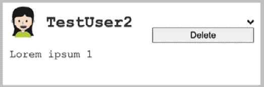
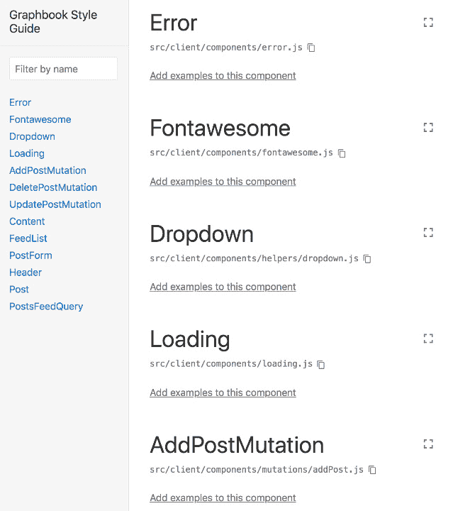
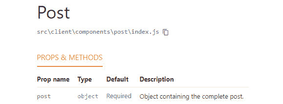
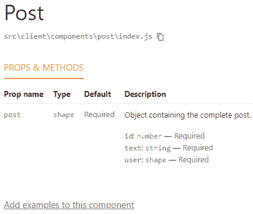
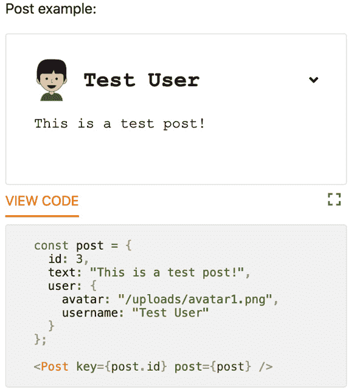

# 第五章：*第五章*：可重用 React 组件和 React Hooks

为了达到本书的这一阶段，我们已经做了很多工作，包括使用 Apollo Client 保存、请求、插入和更新数据，与我们的 GraphQL **应用程序编程接口**（**API**）相结合。我们编写的许多代码也将需要多次审查。这尤其重要，因为我们正在快速构建一个应用程序。目前一切正常，但我们在这里做得还不够；为了编写好的 React 应用程序，我们需要遵循一些最佳实践和策略。

本章将涵盖你需要了解的一切，以便编写高效且可重用的 React 组件。它将涵盖以下主题：

+   介绍 React 模式

+   构建我们的 React 应用程序结构

+   扩展 Graphbook

+   记录 React 应用程序

# 技术要求

本章的源代码可在以下 GitHub 仓库中找到：

[`github.com/PacktPublishing/Full-Stack-Web-Development-with-GraphQL-and-React-Second-Edition/tree/main/Chapter05`](https://github.com/PacktPublishing/Full-Stack-Web-Development-with-GraphQL-and-React-Second-Edition/tree/main/Chapter05)

# 介绍 React 模式

使用任何编程语言、框架或库时，你都应该遵循一些常见的策略。它们提供了一种可理解且高效的方式来编写应用程序。

在*第四章*“将 Apollo Hook 集成到 React 中”，我们探讨了某些模式，例如渲染数组、展开运算符和对象解构。尽管如此，还有一些其他模式你应该了解。

我们将介绍 React 提供的最常用的模式，如下所示：

+   受控组件

+   函数组件

+   条件渲染

+   渲染子组件

这里的许多示例（但并非全部）只是展示了每种方法的形态。其中一些示例可能不会被应用到我们的实际应用代码中，所以如果你对学习模式的基本方面不感兴趣，或者你已经了解了很多，你可以跳过这些示例。

注意

除了我将提供的简要解释之外，还有更多关于这个主题的详细文档。官方 React 文档始终是一个好的起点，但你可以在[`reactpatterns.com/`](https://reactpatterns.com/)找到所有 React 模式，包括我们已使用的那些。

## 受控组件

在前几章中，当我们编写提交新帖子或聊天中的消息输入表单时，我们意外地使用了受控输入。为了提供更好的理解，我将快速解释受控和非受控组件之间的区别，以及何时使用每个组件。

让我们从非受控输入开始。

根据定义，当值不是通过 React 的属性设置，而是仅从真实的浏览器 **文档对象模型** (**DOM**) 保存和获取时，组件就是不受控制的。因此，输入值的检索是从 DOM 节点的引用中获取的，并且不是由 React 组件的状态管理和获取。

以下代码片段显示了用户将能够提交新帖子的表单。我已经排除了完整源列表的渲染逻辑，因为它不是我想向您展示的模式的一部分：

```js
import React, { useState, useRef } from 'react';
import { gql, useQuery, useMutation } from '@apollo/client';
const ADD_POST = gql'
  mutation addPost($post : PostInput!) {
    addPost(post : $post) {
      id
      text
      user {
        username
        avatar
      }
    }
  }
';
const Feed = () => {
  const textArea = useRef(null)
  const [addPost] = useMutation(ADD_POST);
  const handleSubmit = (event) => {
    event.preventDefault();
    addPost({ variables: { post: { text: 
      textArea.current.value } } });
  };
  return (
    <div className="container">
      <div className="postForm">
        <form onSubmit={handleSubmit}>
          <textarea ref={textArea} placeholder="Write your
            custom post!"/>
          <input type="submit" value="Submit" />
        </form>
      </div>
    </div>
  )
}
export default Feed
```

在这个例子中，您可以看到我们不再有 `useState` 钩子，因为 `textarea` 的值存储在真实的 DOM 节点中，而不是应用程序状态中。

我们运行 React 提供的 `useRef` 钩子。它准备变量以接受 DOM 节点作为属性。如果您使用基于类的 React 组件，您可以使用 `createRef` 函数。

在渲染组件的 `return` 语句中，`ref` 属性填充了我们刚刚用 DOM 元素创建的引用。

通过使用正常的 JavaScript DOM API 来访问 DOM 节点的值。您可以在发送我们表单的 `submit` 事件时看到这种行为。值是从 `textArea.current.value` 字段中提取的。

不受控制组件所需的一切已经在这里展示；没有更多了。您可以比较这种方法与我们的当前帖子表单实现。在我们的实现中，我们设置了状态，监听变化事件，并直接从组件状态而不是从 DOM 元素中保存和读取值。

当使用不受控制组件并直接与 DOM 元素工作时，问题是您离开了正常的 React 工作流程。您不再能够处理条件，因此无法在 React 内部触发其他事件。

尽管如此，DOM 引用可以使得使用为 React 生态系统之外编写的第三方插件变得更加容易。例如，有数千个优秀的 jQuery 插件。我总是推荐使用受控组件的默认方法。在 99% 的情况下，这可以在不离开 React 工作流程的情况下工作。

小贴士

如果您需要更深入地了解哪种方法更适合您的特定情况，请查看[`goshakkk.name/controlled-vs-uncontrolled-inputs-react/`](https://goshakkk.name/controlled-vs-uncontrolled-inputs-react/)。

## 函数组件

编写结构良好且可重用 React 组件的一个基本且有效的方法是使用函数组件。我们在整本书的每个地方都已经使用了它们。

在函数组件出现之前，存在无状态函数。正如您可能预料的，无状态函数是函数，而不是 React 组件。它们无法存储任何状态；只能使用属性来传递和渲染数据。属性更新将直接在无状态函数内部重新渲染。

由于 React 的新版本，那些无状态函数不再存在，因为有 React Hooks 允许我们在这些函数中使用状态，这使得它们成为完全功能性的组件。这就是为什么它们现在被称为函数组件。

我们已经编写了很多代码，其中更多的函数组件可以帮助我们提供更结构化和易于理解的代码。

从文件结构开始，我们将为我们的新组件创建一个新的文件夹，如下所示：

```js
mkdir src/client/components
```

我们的应用程序中的许多部分都需要重新设计。为我们的第一个功能组件创建一个新文件，如下所示：

```js
touch src/client/components/loading.js
```

目前，我们显示了一个单调乏味的`loading.js`文件：

```js
import React from 'react';
export default ({color, size}) => {
  var style = {
    backgroundColor: '#6ca6fd',
    width: 40,
    height: 40,
  };
  if(typeof color !== typeof undefined) {
    style.color = color;
  }
  if(typeof size !== typeof undefined) {
    style.width = size;
    style.height = size;
  }
  return <div className="bouncer" style={style}></div>
}
```

在前面的代码片段中，我们正在使用从我们的函数接收的属性中的`color`和`size`字段中的简单函数。

我们正在构建一个默认的`style`对象，它代表加载旋转器的基样式。您可以单独传递`color`和`size`值，以调整这些设置。

最后，我们返回一个带有`bouncer`类的简单`div`标签。

这里缺少的是 CSS 样式。代码应该看起来像这样；我们只需将其添加到我们的`style.css`文件中：

```js
.bouncer {
  margin: 20px auto;
  border-radius: 100%; 
  -webkit-animation: bounce 1.0s infinite ease-in-out;
  animation: bounce 1.0s infinite ease-in-out;
}
@-webkit-keyframes bounce {
  0% {
    -webkit-transform: scale(0)
  }
  100% {
    -webkit-transform: scale(1.0);
    opacity: 0;
  }
}
@keyframes bounce {
  0% { 
    -webkit-transform: scale(0);
    transform: scale(0);
  }
  100% {
    -webkit-transform: scale(1.0);
    transform: scale(1.0);
    opacity: 0;
  }
}
```

如前例所示，我们使用 CSS 动画正确显示我们的加载旋转器，并让它以脉冲的方式动画化。

现在我们已经完成了功能组件。您应该将其放置到现有代码中，任何存在加载状态的地方。

首先，将新的加载旋转器导入到文件顶部，如下所示：

```js
import Loading from './components/loading';
```

然后，您可以按照以下方式渲染函数组件：

```js
if (loading) return <Loading />;
```

使用`npm run server`启动服务器，使用`npm run client`启动前端。现在您应该看到您插入位置处的脉冲蓝色气泡。我在我的帖子源中测试过，看起来相当不错。

函数组件的优势在于它们是最小化和高效的函数，渲染我们应用程序的较小部分。这种方法与 React 完美集成，我们可以改进我们编写的代码。

## 条件渲染

React 的一个重要能力是条件渲染组件或数据。我们将在接下来要实现的主要功能中大量使用它。

通常，您可以通过使用花括号语法来实现条件渲染。这里提供了一个`if`语句的示例：

```js
const [shouldRender, setShouldRender] = useState(false);
return (
  <div className="conditional">
    {(shouldRender === true) && (
      <p>Successful conditional rendering!</p>
    )}
  </div>
)
```

这段代码是条件渲染的最简单示例。我们有来自组件状态的`shouldRender`变量，并使用它作为条件。当条件为`true`时，第二部分——即我们的`Successful conditional rendering!`文本——也将被渲染。这是因为我们使用了`&&`字符。如果条件为`false`，则文本不会渲染。

您可以用您想象中的任何内容替换前面的条件。它可以是一个复杂的条件，例如返回布尔值的函数，或者就像前面的代码一样，它可以是状态变量。

您将在本书的后续步骤和章节中看到更多示例。

## 渲染子组件

在我们迄今为止编写的所有代码中，我们直接编写了标记，就像它是渲染到真实的 **超文本标记语言**（**HTML**）一样。

React 提供的一个很棒的功能是能够将子组件传递给其他组件。父组件决定如何处理其子组件。

我们仍然缺少的是为我们的用户提供一个好的错误信息。因此，我们将使用这个模式来解决这个问题。

在 `components` 文件夹中，在 `loading.js` 文件旁边创建一个 `error.js` 文件，如下所示：

```js
import React from 'react';
export default ({ children }) => {
  return (
    <div className="error message">
      {children}
    </div>
  );
}
```

当将子组件传递给另一个组件时，会在组件的属性中添加一个新的属性，称为 `children`。你通过编写正常的 React 标记来指定 `children`。

如果你想的话，你可以执行一些操作，比如遍历每个子组件。在我们的例子中，我们通过使用花括号并将 `children` 变量放在其中来按常规渲染子组件。

要开始使用新的 `Error` 组件，你可以简单地导入它。新组件的标记如下所示：

```js
if (error) return <Error><p>{error.message}</p></Error>;
```

添加一些 CSS，一切应该就完成了，如下面的代码片段所示：

```js
.message {
  margin: 20px auto;
  padding: 5px;
  max-width: 400px;
}
.error.message {
  border-radius: 5px;
  background-color: #FFF7F5;
  border: 1px solid #FF9566;
  width: 100%;
}
```

一个工作结果可能看起来像这样：


图 5.1 – 错误信息

你可以将无状态函数模式和子组件模式应用到许多其他用例中。你使用哪一个将取决于你的具体场景。在这种情况下，你也可以使用一个无状态函数，而不是 React 组件。

接下来，我们将探讨如何改进我们的代码结构，以及 React 遵循的基本原则。

# 结构化我们的 React 应用程序

我们已经通过使用 React 模式改进了一些事情。你应该做一些作业，并在可能的地方引入这些模式。

在编写应用程序时，一个关键目标是保持它们模块化和可读性，同时尽可能易于理解。总是很难判断拆分代码是有用的还是使事情过于复杂。这是通过尽可能多地编写应用程序和代码，你会越来越多地了解的事情。

让我们进一步结构化我们的应用程序。

## React 文件结构

我们已经将 `Loading` 和 `Error` 组件保存在 `components` 文件夹中。然而，我们为了提高本书的可读性，并没有将组件的许多部分单独保存到不同的文件中。

我将通过一个例子来解释不可读 React 代码的最重要解决方案。你可以在稍后自己实现这个解决方案，应用到我们应用的其它部分，因为你不应该阅读重复的代码。

目前，我们通过映射 GraphQL 响应中的所有帖子来在我们的动态中渲染帖子。在那里，我们直接渲染所有帖子项的相应标记。因此，这是一个一次性完成所有事情的庞大渲染函数。

为了使这更加直观，我们应该创建一个新的`Post`组件。将组件分离极大地提高了我们帖子流的可读性。然后，我们可以用一个新的组件替换循环中的返回值，而不是真正的标记。

我们不应该在我们的`components`文件夹中创建一个`post.js`文件，而应该首先创建另一个`post`文件夹，如下所示：

```js
mkdir src/client/components/post
```

`Post`组件由多个小的嵌套组件组成。帖子也是一个独立的 GraphQL 实体，因此有一个单独的文件夹是合理的。我们将把所有相关的组件存储在这个文件夹中。

让我们创建这些组件。我们将从帖子头部开始，定义帖子项的顶部部分。在`components/post`文件夹中创建一个新的`header.js`文件，如下所示：

```js
import React from 'react';
export default ({post}) => {
  return (
    <div className="header">
      
      <div>
        <h2>{post.user.username}</h2>
      </div>
    </div>
  );
}
```

`header`组件只是一个函数组件。正如您所看到的，我们正在使用本章早期页面上的 React 模式。

接下来是帖子内容，它代表帖子项的主体。在名为`content.js`的新文件中添加以下代码：

```js
import React from 'react';
export default ({post}) => 
  <p className="content">
    {post.text}
  </p>
```

代码与帖子头部的代码几乎相同。在后面的点，您将可以自由地在这两个文件中引入真实的 React 组件或扩展标记。这完全取决于您的实现。

主要文件是位于新`post`文件夹中的新`index.js`文件。它应该看起来像这样：

```js
import React from 'react';
import PostHeader from './header';
import PostContent from './content';
const Post = ({ post }) => {
  return (
    <div className={"post " + (post.id < 0 ? "optimistic": 
      "")}>
      <PostHeader post={post}/>
      <PostContent post={post}/>
    </div>
  )
}
export default Post
```

之前的代码代表一个非常基本的组件，但与之前直接使用标记来渲染完整的帖子项目不同，我们在这里使用了两个进一步的组件，即`PostHeader`和`PostContent`。这两个组件都接收`post`作为属性。

现在，您可以轻松地在帖子列表中使用新的`Post`组件。首先，按照以下方式导入组件：

```js
import Post from './components/post';
```

当有一个`index.js`文件时，您可以减少路径，直接指向文件夹，`index.js`文件将被自动选中。然后，只需替换循环中的旧代码，如下所示：

```js
<Post key={post.id} post={post} />
```

改进之处在于，所有三个组件在第一眼就能给您一个清晰的概述。在循环内部，我们返回一个帖子项。帖子项由标题和正文内容组成。

尽管如此，仍有改进的空间，因为帖子流列表很杂乱。

## 高效的 Apollo React 组件

我们已经成功地将我们的帖子中的项目替换为 React 组件，而不是原始标记。

我非常不喜欢的一个主要部分是我们定义和传递实际的 GraphQL 查询或突变到组件内的`useQuery`或`useMutation`钩子。如果能够一次性定义这些 GraphQL 请求并在需要的地方使用它们，那么我们就可以在不同的组件之间使用它们。

此外，不仅纯 GraphQL 请求应该是可重用的，而且`update`函数或`optimisticResponse`对象也应该可以在不同的组件之间重用。

例如，我们将在下一节中解决`Feed.js`中的这些问题。

### 使用 Apollo 的片段

GraphQL 片段是一种功能，允许你在不同的更大的 GraphQL 查询之间共享常见的查询或其部分。例如，如果你有多个请求`user`对象的 GraphQL 查询，并且这个用户的数据结构始终相同，你可以定义一个用户片段，以便在多个不同的 GraphQL 请求中重用相同的属性。

我们将为`GET_POSTS`查询实现这一点。按照以下说明操作：

1.  在`apollo`文件夹内创建一个新的`queries`文件夹和一个`fragments`文件夹，如下所示：

    ```js
    mkdir src/client/apollo/queries
    mkdir src/client/apollo/fragments
    ```

1.  在`fragments`文件夹内创建一个名为`userAttributes.js`的文件，并填写以下代码行：

    ```js
    import { gql } from '@apollo/client';
    export const USER_ATTRIBUTES = gql'
      fragment userAttributes on User {
        username
        avatar
      }
    ';
    ```

    对于我们迄今为止请求的所有`user`对象，我们始终返回用户名和头像图片，因为我们总是在用户个人资料图片中显示名称。在前面的代码片段中，我们实现了匹配的 GraphQL 片段，我们现在可以在任何其他查询中使用它，以便请求确切的数据。

1.  在`queries`文件夹内创建一个名为`getPosts.js`的文件。向其中添加以下内容：

    ```js
    import { gql } from '@apollo/client';
    import { USER_ATTRIBUTES } from '../fragments/userAttributes';
    export const GET_POSTS = gql'
      query postsFeed($page: Int, $limit: Int) {
        postsFeed(page: $page, limit: $limit) {
          posts {
            id
            text
            user {
              ...userAttributes
            }
          }
        }
      }
      ${USER_ATTRIBUTES}
    ';
    ```

    在前面的代码片段中，我们正在使用我们新创建的 GraphQL 片段。首先，我们当然在文件顶部导入它。在 GraphQL 查询内部，我们使用`…userAttributes`语法，这与正常的 JavaScript 解构赋值类似，并将具有相同名称的片段展开，以便在 GraphQL 查询的指定位置注入这些属性。最后一步是在实际查询下方添加一个片段，以便能够使用它。

1.  最后一步是将`Feed.js`文件中我们手动解析的旧`GET_POSTS`变量替换为这个`import`语句：

    ```js
    import { GET_POSTS } from './apollo/queries/getPosts';
    ```

到目前为止，我们已经在主`GET_POSTS`查询中成功使用了片段，我们也可以通过将其导入任何其他组件来重用它。你可以对其他所有请求重复此操作，通过这样做，可以达到更清晰的代码结构和更高的可重用性。

### 重用 Apollo Hooks

我们成功地从组件中提取了 GraphQL 查询到单独的可重用文件中。

尽管如此，我们组件中仍有一些逻辑，用于定义如何处理 GraphQL 变异的`update`函数和`optimisticResponse`对象。我们也可以将这些提取出来，以进一步提高可重用性并清理代码。

使用 Apollo 或 React Hooks 的一个问题是它们需要在功能组件内执行。尽管如此，我们可以将 Hook 配置的最大部分保存在组件外部，以便它们可重用。

按照以下说明完成`addPost`变异：

1.  在`apollo`文件夹内创建一个新的`mutations`文件夹，如下所示：

    ```js
    mkdir src/client/apollo/mutations
    ```

1.  创建一个名为`addPost.js`的文件，并将以下代码插入其中：

    ```js
    import { gql } from '@apollo/client';
    import { USER_ATTRIBUTES } from '../fragments/userAttributes';
    export const ADD_POST = gql'
      mutation addPost($post : PostInput!) {
        addPost(post : $post) {
          id
          text
          user {
            ...userAttributes
          }
        }
      }
      ${USER_ATTRIBUTES}
    ';
    ```

    令人高兴的是，我们可以重用之前在这里创建的片段，因此我们不需要再次定义它。

1.  我们可以在`Feed.js`文件中使用这个`ADD_POST`变量来进行我们的突变。用以下`import`语句替换实际的解析 GraphQL 查询：

    ```js
    import { ADD_POST } from './apollo/mutations/addPost';
    ```

1.  我们在`useMutation`钩子中仍然有`update`函数和`optimisticResponse`对象。最简单的方法是将它们移动到`addPost.js`文件中，如下所示：

    ```js
    export const getAddPostConfig = (postContent) => ({
      optimisticResponse: {
        __typename: "mutation",
        addPost: {
          __typename: "Post",
          text: postContent,
          id: -1,
          user: {
            __typename: "User",
            username: "Loading...",
            avatar: "/public/loading.gif"
          }
        }
      },
      update(cache, { data: { addPost } }) {
        cache.modify({
          fields: {
            postsFeed(existingPostsFeed) {
              const { posts: existingPosts } =
                existingPostsFeed;
              const newPostRef = cache.writeFragment({
                data: addPost,
                fragment: gql'
                  fragment NewPost on Post {
                    id
                    type
                  }
                '
              });
              return {
                ...existingPostsFeed,
                posts: [newPostRef, ...existingPosts]
              };
            }
          }
        });
      }
    });
    ```

    我们在导入时返回一个函数，这样我们就可以传递所有必需的参数。唯一预期的参数是`postContent`状态变量，它是`optimisticResponse`对象所必需的。

1.  再次更新`Feed.js`文件中的`import`语句，同时导入`getAddPostConfig`函数，如下所示：

    ```js
    import { ADD_POST, getAddPostConfig } from './apollo/mutations/addPost';
    ```

1.  最终的`useState`钩子应该看起来像这样：

    ```js
    const [addPost] = useMutation(ADD_POST, getAddPostConfig(postContent));
    ```

    我们将`getAddPostConfig`作为`useMutation`钩子的第二个参数执行。它将被返回的对象填充，但仍然会在`optimisticResponse`对象中保留`postContent`值，因为每次值发生变化时，`getAddPostConfig`函数也会被运行。

1.  我们甚至可以更进一步。将以下代码行添加到`addPost.js`文件中：

    ```js
    export const useAddPostMutation = (postContent) => useMutation(ADD_POST, getAddPostConfig(postContent));
    ```

    我们将在我们的组件中替换普通的`useMutation`钩子，并围绕它构建一个小包装器。它将接受`postContent`值，并将其传递给`getAddPostConfig`函数。优势在于我们只需导入`useAddPostMutation`函数，执行它之后，所有默认配置都会应用，我们可以在任何组件中使用它，而无需单独导入查询、配置和`useMutation`钩子。

1.  按照以下方式更改`Feed.js`文件中`addPost.js`文件的导入：

    ```js
    import { useAddPostMutation } from './apollo/mutations/addPost';
    ```

1.  用以下代码行替换`useMutation`钩子，并在这样做的同时删除`useMutation`导入：

    ```js
    const [addPost] = useAddPostMutation(postContent);
    ```

    我们只需要导入一个函数，就可以在任何我们想要的组件中运行完整的`addPost`突变。这个概念可以与迄今为止我们使用的任何查询或突变一起工作。

我们清理了功能组件的大部分 GraphQL 请求逻辑，现在它已经在单独的文件中。我们可以在需要查询或突变的地方使用它们。

我建议你为所有其他位置重复相同的操作，这样你就有了一个很好地填充的 GraphQL 请求集，我们可以在任何需要的地方重用。这将是一个很好的家庭作业练习，以学习这个概念。

接下来，我们将看看如何扩展 Graphbook。

# 扩展 Graphbook

我们的社会网络仍然有点粗糙。除了我们仍然缺少身份验证之外，所有功能都很基础；撰写和阅读帖子及消息并不特别。

如果你与 Facebook 进行比较，我们还有很多事情要做。当然，我们不可能完全重建 Facebook，但通常的功能应该都有。从我的观点来看，我们应该涵盖以下功能：

+   在帖子中添加下拉菜单以允许删除帖子。

+   使用 React Context API 创建一个全局的 `user` 对象。

+   使用 Apollo 缓存作为 React Context API 的替代方案。

+   实现顶部栏作为第一个渲染在所有视图之上的组件。我们可以从搜索栏中搜索数据库中的用户，并且我们可以从全局 `user` 对象中显示已登录用户。

我们将首先查看第一个功能。

## React 上下文菜单

您应该能够几乎独立地编写 React 上下文菜单。所有必需的 React 模式都已解释，并且实现突变现在应该很清晰。

在我们开始之前，我们将制定我们想要遵循的计划。我们的目标是：

+   使用 Font Awesome 渲染简单的图标

+   构建 React 辅助组件

+   处理 `onClick` 事件并设置正确的组件状态

+   使用条件渲染模式来显示下拉菜单，如果组件状态设置正确

+   向菜单中添加按钮并将突变绑定到它们上

继续阅读以了解如何完成任务。

以下是一个预览截图，显示了最终实现的功能应该看起来像什么：



图 5.2 – 带上下文的下拉菜单

我们现在将开始第一个任务，为我们的项目设置 Font Awesome。

### React 中的 Font Awesome

如您所注意到的，我们尚未安装 Font Awesome。让我们用 `npm` 来解决这个问题，如下所示：

```js
npm i --save @fortawesome/fontawesome-svg-core @fortawesome/free-solid-svg-icons @fortawesome/free-brands-svg-icons @fortawesome/react-fontawesome
```

Graphbook 依赖于前面的四个包将 Font Awesome 图标导入到我们的前端代码中。

重要提示

Font Awesome 为与 React 一起使用提供了多种配置。最佳、最适用于生产的方案是仅导入我们明确将要使用的图标。对于您的下一个项目或原型，从最简单的方法开始可能是有意义的。您可以在官方页面找到所有信息，链接为 [`fontawesome.com/v5.15/how-to-use/on-the-web/using-with/react`](https://fontawesome.com/v5.15/how-to-use/on-the-web/using-with/react)。

为 Font Awesome 创建一个单独的文件将帮助我们有一个干净的导入。将以下代码保存到 `fontawesome.js` 文件中，位于 `components` 文件夹内：

```js
import { library } from '@fortawesome/fontawesome-svg-core';
import { faAngleDown } from '@fortawesome/free-solid-svg-icons';
library.add(faAngleDown);
```

首先，我们从 Font Awesome 核心包中导入 `library` 对象。对于我们的特定用例，我们只需要一个箭头图像，称为 `angle-down`。使用 `library.add` 函数，我们将此图标注册以供以后使用。

重要提示

Font Awesome 有许多版本。在这本书中，我们使用 Font Awesome 5，仅包含免费图标。更多高级图标可以在官方 Font Awesome 网页上购买。您可以在图标库中找到所有图标的概述，以及每个图标的详细描述，链接为 [`fontawesome.com/icons?d=gallery`](https://fontawesome.com/icons?d=gallery)。

我们只需要在根`App.js`文件中放置这个文件。这确保了所有自定义的 React 组件都可以显示导入的图标。请将以下`import`语句添加到文件顶部：

```js
import './components/fontawesome';
```

由于不会有任何变量来保存导出的方法，因此不需要任何变量。我们只想在我们的应用程序中执行这个文件一次。

当你的应用程序需要一套完整的图标时，你可以直接从`@fortawesome/free-brands-svg-icons`包中获取所有图标，这个包我们也已经安装了。

接下来，我们将创建一个`Dropdown`辅助组件。

### React 辅助组件

适用于生产的应用程序需要尽可能完美。实现可重用的 React 组件是必须做的事情之一。

你应该注意到，当构建客户端应用程序时，下拉菜单是一个常见的话题。它们是前端的全局部分，出现在我们的组件的各个地方。

最好将我们想要显示的实际菜单标记代码与处理事件绑定和显示菜单的代码分开。

我总是将这类代码称为 React 中的**辅助组件**。它们不实现任何业务逻辑，但给我们提供了在需要的地方重用下拉菜单或其他功能的机会。

从逻辑上讲，第一步是创建一个新的文件夹来存储所有辅助组件，如下所示：

```js
mkdir src/client/components/helpers
```

创建一个名为`dropdown.js`的新文件，作为辅助组件，如下所示：

```js
import React, { useState, useRef, useEffect } from 'react';
export default ({ trigger, children }) => {
  const [show, setShow] = useState(false);
  const wrapperRef = useRef(null);
  useOutsideClick(wrapperRef);
  function useOutsideClick(ref) {
    useEffect(() => {
      function handleClickOutside(event) {
        if (ref.current &&
            !ref.current.contains(event.target)) {
          setShow(false);
        }
      }
      document.addEventListener("mousedown", 
        handleClickOutside);
      return () => {
        document.removeEventListener("mousedown",
          handleClickOutside);
      };
    }, [ref]);
  }
  return(
    <div className="dropdown">
      <div>
        <div className="trigger" onClick={() => 
          setShow(!show)}>
          {trigger}
        </div>
        <div ref={wrapperRef}>
          { show &&
            <div className="content">
              {children}
            </div>
          }
        </div>
      </div>
    </div>
  )
}
```

编写下拉组件不需要很多代码。它也非常高效，因为它几乎适用于你能想到的每一种场景。

在前面的代码片段中，我们使用了基本的的事件处理。当触发`div`标签被点击时，我们更新`显示状态`变量。在`div`触发器内部，我们还渲染了一个名为`trigger`的属性。`trigger`属性可以是普通文本、HTML 标签，甚至是 React 组件。它可以通过父组件传递，以便自定义下拉组件的外观。

除了`trigger`属性外，我们还使用了两个著名的 React 模式，如下所示：

+   当`show`变量为`true`时的条件渲染

+   渲染由父组件提供的子元素

这个解决方案允许我们直接将我们想要渲染的菜单项作为`Dropdown`组件的子元素填充，正如之前提到的，这是在点击触发器后显示的。在这种情况下，`show`状态变量为`true`。

然而，这里仍有一件事不完全正确。如果你通过提供简单的文本或图标作为触发器，以及其他文本作为内容来测试下拉组件，你应该会看到`Dropdown`组件只有在再次点击触发器时才会关闭；点击浏览器中的其他地方（下拉菜单之外）时不会关闭。

这是一种 React 方法遇到问题的场景。没有 DOM 节点事件，例如`useOutsideClick`，因此我们无法直接监听任何 DOM 节点的外部点击事件，例如我们的下拉菜单。传统的方法是将事件监听器绑定到整个文档上。在我们的浏览器中点击任何地方都会关闭下拉菜单。

`useOutSideClick`钩子仅检查点击的元素是否与我们通过`useRef`钩子设置的引用匹配。

当点击触发按钮时，我们使用 JavaScript 的`addEventListener`函数将点击事件监听器添加到整个文档中。

重要提示

有许多情况下，可能有必要放弃 React 方法，直接通过标准的 JavaScript 接口使用 DOM。

阅读这篇关于*Medium*的文章，以获得更好的理解：[`medium.com/@garrettmac/reactjs-how-to-safely-manipulate-the-dom-when-reactjs-cant-the-right-way-8a20928e8a6`](https://medium.com/@garrettmac/reactjs-how-to-safely-manipulate-the-dom-when-reactjs-cant-the-right-way-8a20928e8a6)。

`useEffect`钩子仅在组件首次渲染时执行。你可以在那里执行任何类型的逻辑。如果返回值也是一个函数，那么这个函数将在组件卸载时执行。通过这样做，我们不会忘记在组件卸载和从 DOM 中移除时移除所有手动创建的事件监听器。忘记这一点可能会导致许多错误。

如前所述，这是 React 至少有点失败的地方，尽管这不是 React 的错。DOM 和 JavaScript 没有正确的功能。

我们最终可以使用我们的辅助组件并显示帖子的上下文菜单，但首先，我们需要准备所有我们想要渲染的菜单项和组件。

### Apollo 的`deletePost`突变

突变始终位于我们的代码的两个位置。一部分是在后端的 GraphQL API 中编写的，另一部分是在我们的前端代码中编写的。

我们应该从后端实现开始，如下所示：

1.  编辑 GraphQL 模式。`deletePost`突变需要放在`RootMutation`对象内部。新的`Response`类型作为返回值，因为已删除的帖子无法返回，因为它们不存在。注意以下代码片段中我们只需要`postId`参数，不需要发送完整的帖子：

    ```js
    type Response {
      success: Boolean
    }
    deletePost (
      postId: Int!
    ): Response
    ```

1.  添加缺失的 GraphQL 解析器函数。Sequelize 的`destroy`函数仅返回一个表示已删除行数的数字。我们返回一个包含`success`字段的对象。该字段指示我们的前端是否应该抛出错误。代码在以下片段中说明：

    ```js
    deletePost(root, { postId }, context) {
      return Post.destroy({
        where: {
          id: postId
        }
      }).then(function(rows){
        if(rows === 1){
          logger.log({
            level: 'info',
            message: 'Post ' + postId + 'was deleted',
          });
          return {
            success: true
          };
        }
        return {
          success: false
        };
      }, function(err){
        logger.log({
          level: 'error',
          message: err.message,
        });
      });
    },
    ```

在这里唯一特殊的事情是我们需要指定我们想要删除哪些帖子。这是通过在函数调用中包含`where`属性来完成的。因为我们目前还没有实现身份验证，所以我们无法验证删除帖子的用户，但在我们的例子中，这没有问题。

简而言之，我们的 GraphQL API 现在能够接受`deletePost`突变。我们不验证发送此突变的用户，所以在我们这个例子中，任何人都可以删除帖子。

我们现在可以再次专注于前端了。

回想一下我们如何实现之前的突变；我们总是为它们创建可重用的函数和配置。我们也应该为`delete`突变做同样的事情。

让我们从为客户端实现`deletePost`突变开始，如下所示：

1.  在`mutations`文件夹内创建一个名为`deletePost.js`的新文件。

1.  按照以下说明导入所有依赖项：

    ```js
    import { gql } from '@apollo/client';
    import { useMutation } from '@apollo/client';
    ```

1.  添加新的`deletePost`突变，如下所示：

    ```js
    export const DELETE_POST = gql'
      mutation deletePost($postId : Int!) {
        deletePost(postId : $postId) {
          success
        }
      }
    ';
    ```

1.  添加一个新的函数来处理突变的配置，如下所示：

    ```js
    export const getDeletePostConfig = (postId) => ({
      update(cache, { data: { deletePost: { success } } })
        {
        if(success) {
          cache.modify({
            fields: {
              postsFeed(postsFeed, { readField }) {
                return {
                  ...postsFeed,
                  posts: postsFeed.posts.filter(postRef =>
                    postId !== readField('id', postRef))
                }
              }
            }
          });
        }
      }
    });
    ```

    要删除一个项目，我们需要从具有给定`postId`值的帖子中清理数组。最简单的方法是返回`postsFeed`的完整对象，同时在这个过程中，我们让正常的 JavaScript `filter`函数只返回那些没有`postId`值的帖子。为了读取 Apollo 提供的`readField`函数。

1.  最后，插入`useMutation` Hook 的包装函数，如下所示：

    ```js
    export const useDeletePostMutation = (postId) => useMutation(DELETE_POST, getDeletePostConfig(postId));
    ```

我已经移除了`optimisticResponse`更新，因为如果请求失败，它不直观，因为那时 UI 会首先显示乐观更新，但在失败的情况下，帖子会再次出现，因为 API 调用失败了。这会使你的帖子消失然后再次出现。

我们需要在帖子标题中添加一个新的下拉菜单项，以便我们可以调用`deletePost`突变。按照以下说明添加它：

1.  打开`header.js`文件并导入下拉组件、`fontawesome`和突变，如下所示：

    ```js
    import Dropdown from '../helpers/dropdown';
    import { FontAwesomeIcon } from '@fortawesome/react-fontawesome';
    import { useDeletePostMutation } from '../../apollo/mutations/deletePost';
    ```

1.  在`return`语句之前运行`useDeletePostMutation` Hook，如下所示：

    ```js
    const [deletePost] = useDeletePostMutation(post.id);
    ```

1.  将新按钮添加到包含用户名的`div`标签下的标题中，如下所示：

    ```js
    <Dropdown trigger={<FontAwesomeIcon icon="angle-down" />}>
      <button onClick={() => deletePost({ variables: {
        postId: post.id }})}>Delete</button>
    </Dropdown>
    ```

整体解决方案非常简单。我们有一个包装的下拉组件。所有子组件只有在`show`状态变量改变时才会渲染。这包括我们的`deletePost`突变和点击触发。突变本身与实际渲染视图的代码是分开的。

你可以从 GitHub 仓库中获取正确的 CSS。

我们现在已经涵盖了帖子的检索和删除。帖子的更新基本上是相同的——而不是添加或删除，你需要通过数据库中的 ID 以及 Apollo 缓存来更新帖子。方法是一样的。

我预计你现在已经准备好处理高级场景了，在这些场景中，需要在不同层之间进行多个组件的通信。因此，当启动服务器和客户端时，你应该看到我在这部分开始时给你提供的预览图像。

为了获得更多的实践，我们将在下一节中为另一个用例重复这个过程。

## React 应用程序栏

与 Facebook 相比，我们没有一个突出的应用程序栏。计划是实现类似的功能。它固定在浏览器窗口的顶部，始终位于 Graphbook 的所有部分之上。在完成本节后，你将能够在应用程序栏中搜索其他用户、查看通知以及查看已登录用户。

我们将首先实现一个简单的用户搜索功能，因为它很复杂。

以下截图显示了我们将要构建的预览：

![Figure 5.3 – Search results]

![Figure 5.03_B17337.jpg]

![Figure 5.3 – Search results]

它看起来很基础，但我们在这里所做的是绑定输入的 `onChange` 事件，并在每次值变化时重新获取查询。从逻辑上讲，这将根据我们 GraphQL API 的响应重新渲染搜索列表。

从 API 开始，我们需要引入一个新的实体。

就像我们的 `postsFeed` 查询一样，我们从一开始就设置分页，因为以后我们可能想要提供更高级的功能，例如在滚动搜索列表时加载更多项目。

编辑 GraphQL 模式，并填写新的 `RootQuery` 属性和类型，如下所示：

```js
type UsersSearch {
  users: [User]
}
usersSearch(page: Int, limit: Int, text: String!): UsersSearch
```

`UsersSearch` 类型期望一个特殊参数，即搜索文本。没有文本参数，请求就没有太多意义。你应该记得从 `postsFeed` 分页中来的 `page` 和 `limit` 参数。

此外，`resolver` 函数看起来几乎与 `postsFeed` resolver 函数相同。你可以直接将以下代码添加到 `resolvers.js` 文件中的 `RootQuery` 属性，如下所示：

```js
usersSearch(root, { page, limit, text }, context) {
  if(text.length < 3) {
    return {
      users: []
    };
  }
  var skip = 0;
  if(page && limit) {
    skip = page * limit;
  }
  var query = {
    order: [['createdAt', 'DESC']],
    offset: skip,
  };
  if(limit) {
    query.limit = limit;
  }
  query.where = {
    username: {
      [Op.like]: '%' + text + '%'
    }
  };
  return {
    users: User.findAll(query)
  };
},
```

你应该注意，第一个条件询问提供文本是否大于三个字符。我们这样做是为了避免向我们的数据库发送过多的不必要查询。搜索仅由一个或两个字符组成的用户名会导致我们几乎提供所有用户的信息。当然，这也可以在前端完成，但由于各种客户端可能会使用我们的 API，所以我们需要确保后端也进行这项小的改进。

我们通过 Sequelize 将`query`对象发送到我们的数据库。代码基本上与之前的`postsFeed`解析函数类似，只是我们在这里使用了一个 Sequelize 运算符。我们想要找到每个用户名中包含输入文本的用户，而不指定它是在名称的开始、中间还是末尾。因此，我们将使用`Op.like`运算符，Sequelize 将其解析为一个纯`LIKE`查询，从而得到我们想要的结果。`%`运算符在 MySQL 中用于表示任意数量的字符。为了启用此运算符，我们必须导入`sequelize`包并从中提取`Op`对象，如下所示：

```js
import Sequelize from 'sequelize';
const Op = Sequelize.Op;
```

进一步来说，我们可以实现客户端代码，如下所示：

1.  在`queries`文件夹内创建一个名为`searchQuery.js`的文件，并将以下代码插入其中：

    ```js
    import { gql } from '@apollo/client';
    import { USER_ATTRIBUTES } from '../fragments/userAttributes';
    import { useQuery } from '@apollo/client';
    export const GET_USERS = gql'
      query usersSearch($page: Int, $limit: Int, $text:
        String!) {
        usersSearch(page: $page, limit: $limit, text:
          $text) {
          users {
            id
            ...userAttributes
          }
        }
      }
      ${USER_ATTRIBUTES}
    ';
    export const getUserSearchConfig = (text) => ({ variables: { page: 0, limit: 5, text }, skip: text.length < 3})
    export const useUserSearchQuery = (text) => useQuery(GET_USERS, getUserSearchConfig(text))
    ```

    唯一必需的参数是我们想要传递给搜索的`text`参数。如果`text`参数的长度少于三个字符，我们将传递一个带有`true`或`false`的`skip`属性，以不执行 GraphQL 请求。

1.  按照我们的计划，我们将在单独的文件中创建一个应用程序栏。在`components`文件夹和`index.js`文件下方创建一个新的文件夹，命名为`bar`。用以下代码填充它：

    ```js
    import React from 'react';
    import SearchBar from './search';
    const Bar = () => {
      return (
        <div className="topbar">
          <div className="inner">
            <SearchBar/>
          </div>
        </div>
      );
    }
    export default Bar
    ```

    此文件作为我们想要在应用程序栏中渲染的所有组件的包装器；它不实现任何自定义逻辑。我们已导入必须创建的`SearchBar`组件。

1.  `SearchBar`组件位于一个单独的文件中。只需在`bar`文件夹中创建一个`search.js`文件，如下所示：

    ```js
    import React, { useState } from 'react';
    import { useUserSearchQuery } from '../../apollo/queries/searchQuery';
    import SearchList from './searchList';
    const SearchBar = () => {
      const [text, setText] = useState('');
      const { loading, error, data } =
        useUserSearchQuery(text);
      const changeText = (event) => {
        setText(event.target.value);
      }
      return (
        <div className="search">
          <input type="text" onChange={changeText} 
            value={text}
          />
          {!loading && !error && data && (
            <SearchList data={data}/>
          )}
        </div>
      );
    }
    export default SearchBar
    ```

    我们将当前输入值存储在名为`text`的状态变量中。每次文本更改时，`useUserSearchQuery`钩子都会再次执行，并带有新的`text`参数。在查询钩子内部，该值合并到变量中，并通过 GraphQL 请求发送。如果请求未加载且没有错误，则将结果传递给`SearchList`组件的`data`属性。

1.  接下来，我们将实现`SearchList`组件。这个组件的行为类似于帖子源，但只有当响应至少包含一个用户时才渲染内容。列表以下拉菜单的形式显示，并在点击浏览器窗口时隐藏。在`bar`文件夹内创建一个名为`searchList.js`的文件，并插入以下代码：

    ```js
    import React, { useState, useEffect } from 'react';
    const SearchList = ({ data: { usersSearch: { users }}}) => {
      const [show, setShowList] = useState(false);
      const handleShow = (show) => {
        if(show) {
          document.addEventListener('click',
            handleShow.bind(null, !show), true);
        } else {
          document.removeEventListener('click',
            handleShow.bind(null, !show), true);
        }
        setShowList(show);
      }
      const showList = (users) => {
        if(users.length) {
          handleShow(true);
        } else {
          handleShow(false);
        }
      }
      useEffect(() => {
        showList(users);
      }, [users]);
      useEffect(() => {
        return () => {
          document.removeEventListener('click',
            handleShow.bind(null, !show), true);
        }
      });
      return (
        show &&
          <div className="result">
            {users.map((user, i) =>
              <div key={user.id} className="user">
                
                <span>{user.username}</span>
              </div>
            )}
          </div>
      )
    }
    export default SearchList
    ```

我们在这里使用带有`users`依赖项的`useEffect`钩子，它会在父组件对当前组件设置新属性时执行。在这种情况下，我们检查属性是否至少包含一个用户，然后相应地设置状态，以便使下拉菜单可见。当点击或提供空结果时，下拉菜单会被隐藏。这种方法与帖子下拉菜单非常相似。

现在只需做两件事，如下所示：

1.  您应该复制本章官方 GitHub 仓库中的 CSS，以获取正确的样式，或者您可以自己完成。

1.  您需要在 `App` 类内部导入 bar 包装组件，并在 React Helmet 和新闻源之间渲染它。

我们应用程序栏的第一个功能现在已经完成。

让我们继续，看看 React 的 Context API、Apollo Consumer 功能以及如何在我们的 React 前端中全局存储数据。

## React Context API 与 Apollo Consumer 对比

在我们目前使用的堆栈中处理全局变量的两种方法是：通过新的 React Context API 和 Apollo Consumer 功能。

重要提示

处理全局状态管理还有其他方法。其中最著名的库是 Redux，但还有更多。由于 Redux 的解释会超出本书的主题，我们只关注 React 和 Apollo 提供的工具。

如果您想检查其他方法，请查看 Redux 的网站：[`redux.js.org/`](https://redux.js.org/)。

从 React 的 16.3 版本开始，有一个 Context API 允许您定义全局提供者，通过深度嵌套的组件提供数据。这些组件不需要您的应用程序通过多个组件从上到下传递数据。相反，它使用所谓的消费者和提供者。当您在应用程序的全球位置设置 `user` 对象时，这些非常有用，您可以从任何地方访问它。在 React 的早期版本中，您需要从组件到组件传递属性，以便将其传递到 React 组件树底部的正确组件。通过多个组件层传递属性也称为“属性钻取”。

React Context API 的另一种方法是 Apollo Consumer 功能，这是 Apollo 的特定实现。React Context API 是一种通用的做事方式，适用于 Apollo 或您能想到的任何其他东西。

Apollo Consumer 组件的伟大之处在于，它使您能够访问 Apollo 缓存并将其用作数据存储。使用 Apollo Consumer 组件可以节省您处理所有数据，并且您也不需要实现提供者本身；您可以在任何想要的地方消费数据。

这两种方法都会产生以下输出：

![Figure 5.4 – 顶部栏中的用户资料

![Figure 5.04_B17337.jpg]

图 5.4 – 顶部栏中的用户资料

最好的办法是立即向您展示这两种替代方案，以便您可以确定您首选的方法。

### React Context API

我们将从 React 方法开始，介绍如何在您的前端存储和访问全局数据。

这里是对这种方法的一个简短说明：

+   **上下文**：这是一种 React 方法，用于在组件之间共享数据，而无需通过整个树传递。

+   **提供者**：这是一个全局组件，通常只在代码中的一个位置使用。它使您能够访问特定的上下文数据。

+   **消费者**：这是一个可以在应用程序的许多不同位置使用的组件，可以读取您所引用的上下文背后的数据。

要开始，在 `components` 文件夹下创建一个名为 `context` 的文件夹。在那个文件夹中，创建一个 `user.js` 文件，我们可以设置 Context API。

我们将逐个步骤进行，如下所示：

1.  和往常一样，我们需要导入所有依赖项。此外，我们将设置一个新的空上下文。`createContext` 函数将返回一个提供者和消费者，在整个应用程序中使用，如下所示：

    ```js
    import React, { createContext } from 'react';
    const { Provider, Consumer } = createContext();
    ```

1.  现在，我们想要使用提供者。这里最好的选择是创建一个特殊的 `UserProvider` 组件。稍后，当我们有身份验证时，我们可以调整它以执行 GraphQL 查询，然后在我们的前端共享结果数据。现在，我们将坚持使用假数据。插入以下代码：

    ```js
    export const UserProvider = ({ children }) => {
      const user = {
        username: "Test User",
        avatar: "/uploads/avatar1.png"
      };
      return (
        <Provider value={user}>
          {children}
        </Provider>
      );
    }
    ```

1.  在前面的代码片段中，我们从 Apollo 渲染 `Provider` 组件，并将所有子组件包裹在其中。有一个 `Consumer` 组件从 `Provider` 中读取。我们将设置一个特殊的 `UserConsumer` 组件，通过使用 React 的 `cloneElement` 函数克隆它们，将数据传递给底层组件，如下所示：

    ```js
    export const UserConsumer = ({ children }) => {
      return (
        <Consumer>
          {user => React.Children.map(children,
            function(child){
            return React.cloneElement(child, { user });
          })}
        </Consumer>
      )
    }
    ```

我们将直接按其名称导出这两个类。

我们需要在代码库的早期引入提供者。最佳方法是将 `UserProvider` 组件导入到 `App.js` 文件中，如下所示：

```js
import { UserProvider } from './components/context/user';
```

按照以下方式使用提供者，并将其包裹在所有基本组件周围：

```js
<UserProvider>
  <Bar />
  <Feed />
  <Chats />
</UserProvider>
```

在 `Bar`、`Feed` 和 `Chats` 组件的任何地方，我们现在都可以从提供者中读取。

如前所述，我们想在应用程序中显示已登录用户，包括他们的名字。

使用数据的组件是 `UserBar` 组件。我们需要在 `bar` 文件夹内创建一个 `user.js` 文件。插入以下代码：

```js
import React from 'react';
const UserBar = ({ user }) => {
  if(!user) return null;
  return (
    <div className="user">
      
      <span>{user.username}</span>
    </div>
  );
}
export default UserBar
```

目前，我们在应用程序栏内渲染一个简单的用户容器，从 `user` 对象的数据中获取。

要将用户数据传递给 `UserBar` 组件，我们需要使用 `UserConsumer` 组件，当然。

打开顶部栏的 `index.js` 文件，并在 `SearchBar` 组件下方的 `return` 语句中添加以下代码：

```js
<UserConsumer>
  <UserBar />
</UserConsumer>
```

显然，您需要在文件顶部导入这两个组件，如下所示：

```js
import UserBar from './user';
import { UserConsumer } from '../context/user';
```

您现在已成功配置并使用 React Context API 来全局保存和读取数据。

我们提供的解决方案是一个通用的方法，适用于您能想到的所有场景，包括 Apollo。如果您现在查看浏览器，您将能够看到已登录的用户或至少我们在顶部栏中添加的假数据。

然而，我们应该涵盖 Apollo 本身提供的解决方案。

### Apollo 消费者

几乎我们之前章节中编写的所有代码都可以保持不变。我们只需要从`App`类中移除`UserProvider`组件，因为对于 Apollo 消费者组件来说它不再需要了。

打开`context`文件夹中的`user.js`文件，并用以下代码替换其内容：

```js
import React from 'react';
import { ApolloConsumer } from '@apollo/client';
export const UserConsumer = ({ children }) => {
  return (
    <ApolloConsumer>
      {client => {
        // Use client.readQuery to get the current logged 
        // in user.
        const user = {
          username: "Test User",
          avatar: "/uploads/avatar1.png"
        };
        return React.Children.map(children,
          function(child){
          return React.cloneElement(child, { user });
        });
      }}
    </ApolloConsumer>
  )
}
```

如您所见，我们从`@apollo-client`包中导入了`ApolloConsumer`组件。这个包使我们能够访问我们在*第四章*“将 Apollo 集成到 React”中设置的 Apollo 客户端。

我们在这里遇到的问题是，我们没有`CurrentUser`查询，该查询会从 GraphQL 响应登录用户，所以我们无法运行`readQuery`函数。您通常会针对 Apollo 的内部缓存运行查询，并能够轻松地获取`user`对象。一旦我们实现了身份验证，我们将解决这个问题。

目前，我们将返回与 React Context API 相同的假对象。Apollo 客户端取代了我们使用 React Context API 的`Provider`组件。

我希望您能理解这两种解决方案之间的区别。在下一章中，您将看到`ApolloConsumer`组件的全功能展示，当用户查询建立并且可以通过其缓存的客户端读取时。

# 记录 React 应用程序

我们在我们的 React 应用程序中投入了大量的工作和代码。说实话，我们可以通过记录代码来改进我们的代码库。我们没有对代码进行注释，我们没有添加 React 组件属性类型定义，并且我们没有自动化的文档工具。当然，我们没有写任何注释，因为您已经从这本书中学到了所有的技术和库，所以不需要注释。然而，请务必始终在本书之外对代码进行注释。

在 JavaScript 生态系统中，存在许多不同的方法和工具来记录您的应用程序。对于这本书，我们将使用一个名为**React Styleguidist**的工具。它是专门为 React 制作的。您不能用它来记录其他框架或代码。

重要提示

一般而言，这是一个您可以投入数月工作而不会真正结束的领域。如果您正在寻找任何框架或后端和前端的通用方法，我可以推荐 JSDoc，但还有更多。

除了这些，还有许多不同的 React 文档工具。如果您想查看其他工具，请查看此处：[`blog.bitsrc.io/6-tools-for-documenting-your-react-components-like-a-pro-5027cdfb40c6`](https://blog.bitsrc.io/6-tools-for-documenting-your-react-components-like-a-pro-5027cdfb40c6)。

让我们从 React Styleguidist 的配置开始。

## 设置 React Styleguidist

React Styleguidist 和我们的应用程序依赖于`webpack`。只需按照以下说明操作，即可获取其工作副本：

1.  使用`npm`安装 React Styleguidist，如下所示：

    ```js
    npm install --save-dev react-styleguidist
    ```

1.  通常，文件夹结构预期为 `src/components`，但我们有一个 `client` 文件夹位于 `src` 和 `components` 文件夹之间，因此我们必须配置 React Styleguidist 以使其理解我们的文件夹结构。在项目的根目录中创建一个 `styleguide.config.js` 文件来配置它，如下所示：

```js
const path = require('path')
module.exports = {
  components: 'src/client/components/**/*.js',
  require: [
    path.join(__dirname, 'assets/css/style.css')
  ],
  webpackConfig: require('./webpack.client.config')
}
```

我们导出一个包含所有必要信息的对象，用于 React Styleguidist。除了指定 `components` 路径外，我们还需要我们的主要 CSS 样式文件。你将在本章后面的内容中看到这为什么有用。我们必须定义 `webpackConfig` 选项，因为我们的 `config` 文件有一个自定义名称，无法自动找到。

Styleguidist 提供了两种查看文档的方式。一种是在生产模式下静态构建文档，使用以下命令：

```js
npx styleguidist build
```

这个命令会创建一个 `styleguide` 文件夹，在该文件夹内包含我们文档的 HTML 文件。当发布应用的新版本时，这是一个极好的方法，这样你可以保存并备份每个版本的文件。

注意

如果你在运行 `npx styleguidist` 时看到错误，你必须应用一个临时的解决方案。

通过运行 `npm install -g yarn` 安装 yarn，然后将以下行添加到 `package.json` 对象的根级别：

**"resolutions": {**

**"react-dev-utils": "12.0.0-next.47"**

**}**

然后，你可以运行 `yarn install`。这将更新 `styleguidist` 的一个内部依赖项到一个没有问题的较新版本。

然后，你可以再次运行 `npx styleguidist build`。只需记住，如果你运行 `npm install`，它将用旧版本覆盖这个依赖项，你将不得不再次运行 `yarn install` 来使其工作。

第二种方法，适用于开发情况，允许 Styleguidist 使用 `webpack` 动态运行并创建文档。以下是执行此操作的命令：

```js
npx styleguidist server
```

您可以在 `http://localhost:6060` 下查看结果。文档应该看起来像这样：



图 5.5 – React Styleguidist 文档

在左侧面板中，所有组件都按照我们的文件夹结构顺序列出。这样，你将始终有一个对现有组件的极佳概览。

在主面板中，每个组件都进行了详细说明。你可能已经注意到组件缺少进一步的信息。我们将在下一节中改变这一点。

## React PropTypes

React 的一个基本特性是将属性传递给子组件。这些可以是基本字符串、数字，也可以是完整的组件。我们已经在我们的应用中看到了所有这些场景。

对于新加入你的代码库的开发者来说，他们需要阅读所有组件并识别它们可以接受的属性。

React 提供了一种从每个组件内部描述属性的方法。记录你组件的属性使得其他开发者更容易理解你的 React 组件。

我们将通过在`Post`组件中的示例来查看如何实现这一点。

我们还没有介绍的两个 React 特性如下：

+   如果你的组件有可选参数，最初有默认属性是有意义的。为此，你可以指定`defaultProps`作为一个静态属性，就像使用状态初始化器一样。

+   重要的是`propTypes`字段，你可以为所有组件填充它们接受的自定义属性。

需要一个新的包来定义属性类型，如下所示：

```js
npm install --save prop-types
```

这个包包含了我们设置属性定义所需的一切。

现在，打开你的`Post`组件的`index.js`文件。我们需要在这个文件的顶部导入新的包，如下所示：

```js
import PropTypes from 'prop-types';
```

接下来，我们将在`export`语句之前将新字段添加到我们的组件中，如下所示：

```js
Post.propTypes = {
  /** Object containing the complete post. */
  post: PropTypes.object.isRequired,
}
```

上述代码应该有助于每个人更好地理解你的组件。每个开发者都应该知道，这个组件要正常工作需要一个`post`对象。

`PropTypes`包提供了我们可以使用的各种类型。你可以使用`PropTypes.X`访问每个类型。如果是一个必需的属性，你可以像前面的代码一样附加`isRequired`。

不仅 React 现在会在控制台抛出一个错误，当属性不存在时，React Styleguidist 还能够显示哪些属性是必需的，正如你在下面的截图中所看到的：




图 5.6 – 属性基本文档

然而，什么是`post`对象？它包含哪些字段？

记录`post`对象的最佳方式是定义一个帖子应该包含哪些属性，至少对于这个特定的组件来说是这样。替换属性定义，如下所示：

```js
Post.propTypes = {
  /** Object containing the complete post. */
  post: PropTypes.shape({
    id: PropTypes.number.isRequired,
    text: PropTypes.string.isRequired,
    user: PropTypes.shape({
      avatar: PropTypes.string.isRequired,
      username: PropTypes.string.isRequired,
    }).isRequired
  }).isRequired,
}
```

在这里，我们使用`shape`函数。这允许你传递一个包含对象字段的列表。这些字段中的每一个都会从`PropTypes`包中获取一个类型。

React Styleguidist 的输出现在看起来是这样的：




图 5.7 – 属性详细文档

我们指定的所有字段都分别列出。在撰写这本书的时候，React Styleguidist 还没有提供所有属性的递归视图。正如你所看到的，`post`对象内部的`user`对象及其属性没有列出，但它只作为一个第二形状列出。如果你需要这个功能，你当然可以自己实现它，并在官方 GitHub 仓库上发送一个`pull`请求，或者切换到另一个工具。

重要提示

React 提供了更多属性类型和函数，你可以使用它们来记录所有组件及其属性。要了解更多信息，请访问官方文档[`reactjs.org/docs/typechecking-with-proptypes.html`](https://reactjs.org/docs/typechecking-with-proptypes.html)。

React Styleguidist 的最后一个伟大功能是你可以为每个组件输入示例。你还可以使用 Markdown 添加更多描述。

对于我们的 `Post` 组件，我们需要在 `post` 文件夹中 `index.js` 文件旁边创建一个 `index.md` 文件。React Styleguidist 建议创建一个 `Readme.md` 或 `Post.md` 文件，但那些对我来说不起作用。`index.md` 文件应该看起来像这样：

```js
Post example:
'''js
  const post = {
    id: 3,
    text: "This is a test post!",
    user: {
      avatar: "/uploads/avatar1.png",
      username: "Test User"
    }
  };
  <Post key={post.id} post={post} />
'''
```

很遗憾，你将无法直接看到该标记的输出。原因是 `Post` 组件依赖于 Apollo。如果你只是像 React Styleguidist 那样渲染普通的 `Post` 组件，Apollo 客户端将不会存在。

为了解决这个问题，我们可以覆盖 React Styleguidist 渲染任何组件的默认方式。按照以下说明操作以使其工作：

1.  创建一个新的文件夹，我们可以在这里保存所有特殊的 React Styleguidist 组件，如下所示：

    ```js
    mkdir src/client/styleguide/
    ```

1.  创建一个名为 `Wrapper.js` 的文件，内容如下：

    ```js
    import React from 'react';
    import client from '../apollo';
    import { ApolloProvider } from '@apollo/client/react';
    const Wrapper = ({ children }) => {
      return (
        <ApolloProvider client={client}>
          {children}
        </ApolloProvider>
      );
    }
    export default Wrapper
    ```

    这将是 React Styleguidist 运行的所有组件的标准 `Wrapper` 组件。这样，我们确保我们始终在上下文中拥有 Apollo 客户端。

1.  我们最后需要做的是将以下属性添加到 `styleguide.config.js` 文件中：

    ```js
    styleguideComponents: {
         Wrapper: path.join(__dirname,
           'src/client/styleguide/Wrapper')
    },
    ```

    React Styleguidist 将现在使用这个 `Wrapper` 组件。

如果你重新启动 React Styleguidist，它将渲染文档并生成以下输出：



]

图 5.8 – React Styleguidist 示例

现在，你可以看到为什么使用 CSS 样式很有用。不仅 React Styleguidist 可以记录代码，它还可以在文档中执行代码。正如前面的代码所示，在 `post` 对象内部提供正确的属性使我们能够看到组件应该如何看起来，包括正确的样式。

这个例子展示了我们的 `Post` 组件是多么的可重用，因为它可以在不运行 Apollo 查询的情况下使用。

基础知识现在应该很清晰了。继续阅读这个主题，因为还有更多东西要学习。

# 摘要

通过本章，你在编写 React 应用程序方面获得了大量的经验。你已经将多个 React 模式应用于不同的用例，例如通过模式传递子组件和条件渲染。此外，你现在知道如何正确地记录你的代码。

你还学会了如何使用 React Context API，与 Apollo Consumer 功能相比，在我们的应用程序中检索当前登录的用户。

在下一章中，你将学习如何在后端实现身份验证并在前端使用它。
