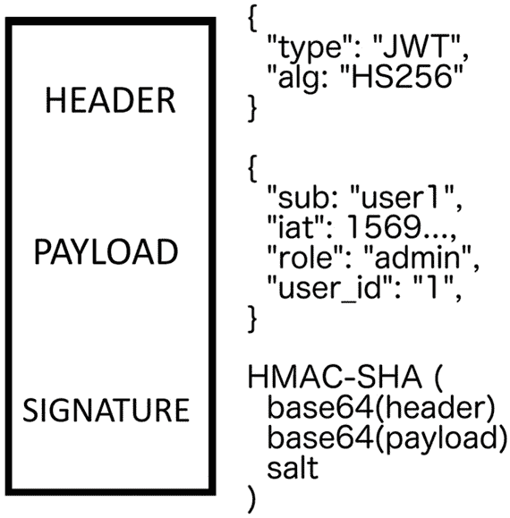

# 第六章：*第六章*：使用 Apollo 和 React 进行身份验证

在过去的几章中，我们已经走得很远了。现在，我们已经到达了将要为我们的 React 和 GraphQL Web 应用程序实现身份验证的阶段。在本章中，你将学习到构建使用 GraphQL 进行身份验证的应用程序的一些基本概念。

本章涵盖了以下主题：

+   JWT 是什么？

+   Cookie 与 localStorage 的比较

+   在 Node.js 和 Apollo 中实现身份验证

+   用户注册和登录

+   验证 GraphQL 查询和突变

+   从请求上下文中访问用户

# 技术要求

本章的源代码可在以下 GitHub 仓库中找到：

[`github.com/PacktPublishing/Full-Stack-Web-Development-with-GraphQL-and-React-Second-Edition/tree/main/Chapter06`](https://github.com/PacktPublishing/Full-Stack-Web-Development-with-GraphQL-and-React-Second-Edition/tree/main/Chapter06)

# 什么是 JSON Web Tokens？

**JSON Web Tokens** (**JWTs**) 仍然是一个相对较新的标准，用于执行身份验证；并不是每个人都了解它们，甚至更少的人使用它们。本节不会提供 JWT 的数学或加密基础理论性的探讨。

例如，在用 PHP 编写的传统 Web 应用程序中，你通常有一个会话 cookie。这个 cookie 识别服务器上的用户会话。会话必须存储在服务器上以检索初始用户。这里的问题是，保存和查询所有用户的会话可能会产生很高的开销。然而，在使用 JWT 时，服务器无需保留任何类型的会话 ID。

通常来说，JWT 包含了识别用户所需的一切。最常见的方法是存储令牌的创建时间、用户名、用户 ID，以及可能的角色，例如管理员或普通用户。出于安全原因，你不应该包含任何个人信息或关键数据。

JWT 存在的原因并不是为了以任何方式加密或保护数据。相反，为了使用服务器等资源进行身份验证，你需要发送一个由你的服务器验证的已签名的 JWT。只有当它是由你的服务器声称为可信的服务创建时，它才能验证 JWT。在大多数情况下，你的服务器将使用其公钥来签名令牌。任何可以读取你与服务器之间通信的人或服务都可以访问令牌，并且可以轻松提取有效载荷。尽管如此，他们无法编辑其内容，因为令牌是用签名签名的。

令牌需要在客户端的浏览器中安全地传输和存储。如果令牌落入错误的手中，那个人可以使用您的身份访问受影响的应用程序，以您的名义发起操作，或读取个人信息。JWT 的撤销也很困难。使用会话 cookie，您可以在服务器上删除会话，用户将不再通过 cookie 进行认证。然而，使用 JWT，我们在服务器上没有任何信息。它只能验证令牌的签名并在您的数据库中找到用户。一种常见的方法是有一个所有不允许的令牌的黑名单。或者，您可以通过指定过期日期来降低 JWT 的有效期。然而，这种解决方案需要用户频繁地重复登录过程，这会使体验变得不那么舒适。

JWT 不需要任何服务器端存储。服务器端会话的妙处在于您可以存储特定应用程序状态，例如记住用户执行的最后操作。没有服务器端存储，您要么需要在 `localStorage` 中实现这些功能，要么实现一个会话存储，这对于使用 JWT 认证根本不是必需的：

注意

JWT 在开发者社区中是一个重要的话题。有关 JWT 是什么、如何使用以及其技术背景的出色文档有很多。访问以下网页了解更多信息，并查看 JWT 生成演示：[`jwt.io/`](https://jwt.io/)。



图 6.1 – JWT 结构

如前图所示，JWT 由三个部分组成：

+   **标题**: 标题指定了用于生成 JWT 的算法。

+   **有效载荷**: 有效载荷由所有“会话”数据组成，这些数据被称为声明。前面的只是一个简单的表示，并没有展示 JWT 的全部复杂性。

+   **签名**: 签名是从标题和有效载荷计算得出的。为了验证 JWT 是否被篡改，签名将与从实际有效载荷和标题中新生成的签名进行比较。

在我们的示例中，我们将使用 JWT，因为它们是一种现代且去中心化的认证方法。尽管如此，您可以在任何时候选择退出此选项，并改用常规会话，这在 Express.js 和 GraphQL 中可以快速实现。

在下一节中，我们将探讨在浏览器内部存储 JWT 的不同方法以及如何在 `localStorage` 和 cookies 之间传输。

# localStorage 与 cookies 的比较

让我们看看另一个关键问题。了解至少认证工作原理及其安全性的基础知识至关重要。您对任何可能导致数据泄露的故障实现负有责任，所以请始终牢记这一点。我们在哪里存储从服务器收到的令牌？

无论你将令牌发送到哪个方向，你都应该始终确保你的通信是安全的。对于像我们这样的 Web 应用程序，请确保所有请求都启用了 HTTPS。一旦用户成功认证，客户端将根据 JWT 认证工作流程接收 JWT。JWT 不绑定到任何特定的存储介质，因此你可以自由选择你喜欢的任何一种。如果我们不在收到令牌时存储它，它将仅在内存中可用。当用户浏览我们的网站时，这是可以的，但当他们刷新页面时，他们需要再次登录，因为我们没有在任何地方存储令牌。

有两种标准选项：将 JWT 存储在`localStorage`中或存储在 cookie 中。让我们先讨论第一种选项。`localStorage`是教程中经常建议的选项。这是可以的，假设你正在编写一个单页 Web 应用程序，其中内容根据用户和客户端路由的动作动态更改。我们不遵循任何链接并加载新站点以查看新内容；相反，旧的内容只是被你想要显示的新页面所替换。

将令牌存储在`localStorage`有以下缺点：

+   `localStorage`不是在每次请求时都传输。当页面首次加载时，你无法在请求中发送令牌，因此需要认证的资源无法返回给你。一旦你的应用程序加载完成，你必须向服务器发送第二个请求，包括令牌以访问受保护的内容。这种行为的结果是，无法构建服务器端渲染的应用程序。

+   客户端需要实现将令牌附加到发送到服务器的每个请求的机制。

+   由于`localStorage`的性质，客户端没有内置的过期日期。如果在某个时刻，令牌达到其过期日期，它仍然存在于客户端的`localStorage`中。

+   `localStorage`通过纯 JavaScript 访问，因此容易受到 XSS 攻击。如果有人设法通过未经过滤的输入将自定义 JavaScript 集成到你的代码或网站上，他们可以从`localStorage`中读取令牌。

然而，使用`localStorage`有许多优点：

+   由于`localStorage`不是在每次请求时自动发送，因此它对任何试图通过随机请求从外部站点执行操作的**跨站请求伪造**（**CSRF**）攻击具有安全性。

+   `localStorage`在 JavaScript 中很容易读取，因为它以键值对的形式存储。

+   它支持更大的数据大小，这对于存储应用程序状态或数据来说非常好。

将如此关键的令牌存储在 Web 存储中的主要问题是您无法保证没有不受欢迎的访问。除非您能确保每个单独的输入都经过清理，并且您不依赖于任何捆绑到您的 JavaScript 代码中的第三方工具，否则始终存在潜在的风险。即使是一个您没有构建的包也可能与创建者共享您的用户的 Web 存储，而您或用户可能从未注意到。此外，当您使用公共**内容分发网络**（**CDN**）时，攻击面和您的应用程序的风险都会增加。

现在，让我们来看看 cookie。尽管由于欧盟启动的 cookie 合规性法律而受到负面报道，但它们仍然很棒。抛开 cookie 可以允许公司做的更负面的事情，比如跟踪用户，它们仍然有很多优点。与`localStorage`相比的一个显著区别是，cookie 会随着每个请求发送，包括您应用程序托管站点的初始请求。

Cookie 具有以下优点：

+   由于每个请求都会发送 cookie，因此服务器端渲染根本不是问题。

+   前端不需要实现任何额外的逻辑来发送 JWT。

+   可以将 cookie 声明为`httpOnly`，这意味着 JavaScript 无法访问它们。这可以保护我们的令牌免受 XSS 攻击。

+   Cookie 有一个内置的过期日期，可以设置为在客户端浏览器中使 cookie 失效。

+   可以配置 cookie，使其只能从特定的域或路径中读取。

+   所有浏览器都支持 cookie。

这些优点听起来很好，但让我们考虑一下缺点：

+   Cookie 通常容易受到 CSRF 攻击，在这些攻击中，外部网站向您的 API 发送请求。他们期望您已认证，并希望他们能代表您执行操作。我们无法阻止 cookie 与每个请求一起发送到您的域。常见的预防策略是实施 CSRF 令牌。这个特殊的令牌也由您的服务器传输并保存为 cookie。由于它存储在不同的域下，外部网站无法使用 JavaScript 访问 cookie。您的服务器不会从每个请求中读取 cookie，而只从 HTTP 头中读取。这种行为保证了令牌是由托管在您的应用程序上的 JavaScript 发送的，因为只有这样才能访问令牌。然而，设置用于验证的 XSRF 令牌却需要做很多工作。

+   由于它们以一个大型的逗号分隔的字符串形式存储，访问和解析 cookie 并不直观。

+   它们只能存储少量的数据。

因此，我们可以看到这两种方法都有其优点和缺点。

最常见的方法是使用 `localStorage`，因为这是最简单的方法。在这本书中，我们将首先使用 `localStorage`，但稍后将在使用服务器端渲染时切换到 cookies，以便让你体验两种方法。你可能根本不需要服务器端渲染。如果是这种情况，你可以跳过这部分，以及 cookie 实现。

在下一节中，我们将实现使用 GraphQL 的身份验证。

# GraphQL 身份验证

现在身份验证的基本知识应该已经清楚。现在，我们的任务是实现一种安全的方法让用户进行身份验证。如果我们查看当前的数据库，我们会看到我们缺少所需的字段。为此，请按照以下步骤操作：

1.  让我们准备并添加一个 `password` 字段和一个 `email` 字段。正如我们在 *第三章* 中所学的，*连接到数据库*，我们必须创建一个迁移来编辑我们的用户表。如果你忘记了这些命令，可以在该章节中查找：

    ```js
    sequelize migration:create --migrations-path src/server/migrations --name add-email-password-to-post
    ```

    上述命令为我们生成了新文件。

1.  替换其内容，然后尝试自己编写迁移，或者你可以检查以下代码片段中的正确命令：

    ```js
    'use strict';
    module.exports = {
      up: (queryInterface, Sequelize) => {
        return Promise.all([
          queryInterface.addColumn('Users',
            'email',
            {
              type: Sequelize.STRING,
              unique : true,
            }
          ),
          queryInterface.addColumn('Users',
            'password',
            {
              type: Sequelize.STRING, 
            }
          ),
        ]);
      },
      down: (queryInterface, Sequelize) => {
        return Promise.all([
          queryInterface.removeColumn('Users', 'email'),
          queryInterface.removeColumn('Users',
           'password'),
        ]);
      }
    };
    ```

1.  所有字段都是简单的字符串。按照 *第三章* 中所述，*连接到数据库* 执行迁移。电子邮件地址必须是唯一的。现在我们需要更新我们为用户的老种子文件，以表示我们刚刚添加的新字段。将以下字段添加到第一个用户：

    ```js
    password: '$2a$10$bE3ovf9/Tiy/d68bwNUQ0.zCjwtNFq9ukg9h4rhKiHCb6x5ncKife',
    email: 'test1@example.com',
    ```

    对所有用户都这样做，并更改每个用户的电子邮件地址。否则，它将不起作用。密码是哈希格式，代表明文密码 123456789。由于我们在单独的迁移中添加了新字段，我们必须将这些字段添加到模型中。

1.  打开并添加以下新行作为字段到 `model` 文件夹中的 `user.js` 文件：

    ```js
    email: DataTypes.STRING,
    password: DataTypes.STRING,
    ```

1.  现在清空数据库，运行所有迁移，并再次执行种子文件。

我们首先要做的是让登录过程运行起来。目前，我们只是在模拟作为数据库中的第一个用户登录。

## Apollo 登录突变

在本节中，我们将编辑我们的 GraphQL 模式并实现相应的解析函数。按照以下步骤操作：

1.  让我们从模式开始，向我们的 `schema.js` 文件中的 `RootMutation` 对象添加一个新突变。

    ```js
    login (
      email: String!
      password: String!
    ): Auth
    ```

    上述模式为我们提供了一个接受电子邮件地址和密码的登录突变。两者都是识别和验证用户的必要条件。然后，我们需要向客户端响应一些内容。目前，`Auth` 类型返回一个令牌，在我们的案例中是一个 JWT。你可能想根据你的需求添加不同的选项：

    ```js
    type Auth {
      token: String
    }
    ```

1.  模式现在已准备就绪。前往 `resolvers` 文件，并在突变对象中添加登录函数。在我们这样做之前，安装并导入两个新包：

    ```js
    jsonwebtoken package handles everything that's required to sign, verify, and decode JWTs.The important part is that all the passwords for our users are not saved as plain text but are first encrypted using hashing, including a random salt. This generated hash cannot be decoded or decrypted as a plain password, but the package can verify if the password that was sent with the login attempt matches the password hash that was saved on the user. 
    ```

1.  在 `resolvers` 文件顶部导入这些包：

    ```js
    import bcrypt from 'bcrypt';
    import JWT from 'jsonwebtoken';
    ```

1.  `login` 函数接收 `email` 和 `password` 作为参数。它应该如下所示：

    ```js
    login(root, { email, password }, context) {
      return User.findAll({
        where: {
          email
        },
        raw: true
      }).then(async (users) => {
        if(users.length = 1) {
          const user = users[0];
          const passwordValid = await
            bcrypt.compare(password, user.password);
          if (!passwordValid) {
            throw new Error('Password does not match');
          }
          const token = JWT.sign({ email, id: user.id },
            JWT_SECRET, {
            expiresIn: '1d'
          });
          return {
            token
          };
        } else {
          throw new Error("User not found");
        }
      });
    },
    ```

    上述代码执行以下步骤：

    1.  我们查询所有邮箱地址匹配的用户。

    1.  如果找到用户，我们可以继续。由于 MySQL 唯一约束禁止这种情况，因此不可能有多个用户具有相同的地址。

    1.  接下来，我们使用用户的密码，并使用之前解释的 `bcrypt` 包将其与提交的密码进行比较。

    1.  如果密码正确，我们使用 `jwt.sign` 函数为 `jwt` 变量生成 JWT 令牌。它接受三个参数：负载，即用户 ID 和他们的电子邮件地址；我们用于签名 JWT 的密钥；以及 JWT 将要过期的时长。

    1.  最后，我们返回一个包含我们的 JWT 的对象。

    注意

    可能需要重新思考的是错误消息中的详细程度。例如，我们可能不想区分密码错误和不存在用户的情况。这允许可能的攻击者或数据收集者知道哪个电子邮件地址正在使用。

    `login` 函数尚未工作，因为我们缺少 `JWT_SECRET`，这是用于签名 JWT 的。在生产中，我们使用环境变量将 JWT 密钥传递到我们的后端代码中，以便我们也可以在开发中使用这种方法。

1.  对于 Linux 或 Mac，请在终端中直接输入以下命令：

    ```js
    export JWT_SECRET=
      awv4BcIzsRysXkhoSAb8t8lNENgXSqBruVlLwd45kGdYje
      JHLap9LUJ1t9DTdw36DvLcWs3qEkPyCY6vOyNljlh2Er952h2gDzYwG8
      2rs1qfTzdVIg89KTaQ4SWI1YGY
    ```

1.  `export` 函数为您设置 `JWT_SECRET` 环境变量。用随机生成的 JWT 替换提供的 JWT。您可以通过将字符数设置为 128 并排除任何特殊字符来使用任何密码生成器。设置环境变量允许我们在应用程序中读取密钥。您必须在进入生产环境时替换它。

1.  在文件顶部插入以下代码：

    ```js
    const { JWT_SECRET } = process.env;
    ```

    此代码从全局 Node.js `process` 对象中读取环境变量。一旦发布应用程序，请务必替换 JWT，并确保始终安全地存储密钥。在让服务器重新加载后，我们可以发送第一个登录请求。我们将在后面的 React 中学习如何做到这一点，但以下代码展示了使用 Postman 的一个示例：

    ```js
    {
      "operationName":null,
      "query": "mutation login($email : String!, $password
        : String!) { 
       login(email: $email, password : $password) { token 
         }}",
      "variables":{
        "email": "test1@example.com",
        "password": "123456789"
      }
    }
    ```

    这个请求应该返回一个令牌：

    ```js
    {
      "data": {
        "login": {
          "token":"eyJhbGciOiJIUzI1NiIsInR5cCI6IkpXVCJ9.e
            yJlbWFpbCI6InRlc3QxQGV4YW1wbGUuY29tIiwiaWQiOjE
            sImlhdCI6MTUzNzIwNjI0MywiZXhwIjoxNTM3MjkyNjQzf
            Q.HV4dPIBzvU1yn6REMv42N0DS0ZdgebFDXUj0MPHvlY"
        }
      }
    }
    ```

    如您所见，我们已经生成并返回了一个签名 JWT。我们可以在每个请求的 HTTP 认证头中继续发送此令牌。然后，我们可以为迄今为止实现的全部 GraphQL 查询或突变启动认证。

让我们继续学习如何设置 React 以与后端上的认证一起工作。

## React 登录表单

我们需要处理我们应用程序的不同认证状态：

+   第一种情况是用户未登录，无法查看任何帖子或聊天。在这种情况下，我们需要显示登录表单，以便用户可以验证自己。

+   第二种情况是，通过登录表单发送电子邮件和密码。需要解释响应，如果结果是正确的，我们现在需要将 JWT 保存到浏览器的`localStorage`中。

+   当更改`localStorage`时，我们还需要重新渲染我们的 React 应用程序以显示登录状态。

+   此外，用户应该能够再次注销。

+   我们还必须能够处理 JWT 过期且用户无法访问任何功能的情况。

登录表单将如下所示：

![Figure 6.2 – 登录表单

![Figure 6.02_B17337.jpg]

Figure 6.2 – 登录表单

要开始使用登录表单，请按照以下步骤操作：

1.  在`apollo`文件夹内设置一个单独的登录突变文件。我们可能只需要在代码中的一个地方使用这个组件，但将 GraphQL 请求保存在单独的文件中是一个好主意。

1.  构建登录表单组件，该组件使用登录突变发送表单数据。

1.  创建`CurrentUser`查询以检索已登录的用户对象。

1.  如果用户未认证或登录到真实应用程序（如新闻源），则条件渲染登录表单。

1.  我们将首先在客户端组件的`mutations`文件夹内创建一个新的`login.js`文件：

    ```js
    import { gql, useMutation } from '@apollo/client';
    export const LOGIN = gql'
      mutation login($email : String!, $password : 
        String!) {
        login(email : $email, password : $password) {
          token
        }
      }
    ';
    export const useLoginMutation = () => useMutation(LOGIN);
    ```

    与之前的突变一样，我们解析查询字符串并从`useMutation`钩子中导出`login`函数。

1.  现在，我们必须实现使用此突变的实际登录表单。为此，我们将在`components`文件夹内直接创建一个`loginregister.js`文件。正如你所预期的，我们在一个组件中处理用户的登录和注册。首先导入依赖项：

    ```js
    import React, { useState } from 'react';
    import { useLoginMutation } from '../apollo/mutations/login';
    import Loading from './loading';
    import Error from './error';
    ```

1.  `LoginForm`组件将存储表单状态，如果出现错误则显示错误消息，显示加载状态，并发送包含表单数据的登录突变。在`import`语句下方添加以下代码：

    ```js
    const LoginForm = ({ changeLoginState }) => {
      const [email, setEmail] = useState('');
      const [password, setPassword] = useState('');
      const [login, { loading, error }] = 
        useLoginMutation();
      const onSubmit = (event) => {
        event.preventDefault();
        login({
          update(cache, { data: { login } }) {
            if(login.token) {
              localStorage.setItem('jwt', login.token);
              changeLoginState(true);
            }
          }, variables: { email, password }
        });
      }
      return (
        <div className="login">
          {!loading && (
            <form onSubmit={onSubmit}>
              <label>Email</label>
              <input type="text" onChange={(event) => 
                setEmail(event.target.value)} />
              <label>Password</label>
              <input type="password" onChange={(event) =>
                setPassword(event.target.value)} />
              <input type="submit" value="Login" />
            </form>
          )}
          {loading && (<Loading />)}
          {error && (
            <Error><p>There was an error logging in!</p>
            </Error>
          )}
        </div>
      )
    }
    ```

    整个 React 组件相当简单。我们只有一个表单和两个输入，并将它们的值存储在两个状态变量中。当表单提交时，会调用`onSubmit`函数，这将触发登录突变。突变的`update`函数将与其他突变有所不同。我们不在 Apollo 缓存中写入返回值；相反，我们在`localStorage`中存储 JWT。语法相当简单。你可以直接使用`localStorage.get`和`localStorage.set`与 Web 存储进行交互。

    在将 JWT 保存到`localStorage`之后，我们调用一个`changeLoginState`函数，我们将在下一步实现它。这个函数的目的是有一个全局开关，用于将用户从登录状态切换到注销状态，或反之。

1.  现在，我们需要导出一个将被我们的应用程序使用的组件。最简单的方法是设置一个包装组件，该组件为我们处理登录和注册情况。

    为包装组件插入以下代码：

    ```js
    const LoginRegisterForm = ({ changeLoginState }) => {
      return (
        <div className="authModal">
          <div>
            <LoginForm changeLoginState={changeLoginState}
            />
          </div>
        </div>
      )
    }
    export default LoginRegisterForm
    ```

    这个组件只是渲染登录表单并传递`changeLoginState`函数。

    所有用于验证用户的基本功能现在都已准备就绪，但尚未导入或显示在任何地方。打开`App.js`文件。在那里，我们将直接显示动态内容、聊天和顶部栏。如果用户未登录，不应允许他们看到一切。继续阅读以更改此设置。

1.  导入我们刚刚创建的新表单和从 React 导入的`useEffect`钩子：

    ```js
    import LoginRegisterForm from './components/loginregister';
    ```

1.  现在，我们必须存储用户是否已登录，以及在我们应用程序的第一次渲染中，根据`localStorage`检查登录状态。将以下代码添加到`App`组件中：

    ```js
    const [loggedIn, setLoggedIn] = useState(!!localStorage.getItem('jwt'));
    ```

    当加载我们的页面时，我们有一个`loggedIn`状态变量来存储当前的登录状态。默认值是如果存在令牌则为`true`，如果不存在则为`false`。

1.  然后，在`return`语句中，我们可以使用条件渲染来显示登录表单，当`loggedIn`状态变量设置为`false`时，这意味着我们的`localStorage`中没有 JWT：

    ```js
    {loggedIn && (
      <div>
        <Bar changeLoginState={setLoggedIn} />
        <Feed />
        <Chats />
      </div>
    )}
    {!loggedIn && <LoginRegisterForm changeLoginState={setLoggedIn} />}
    ```

    如你所见，我们将`setLoggedIn`函数传递给登录表单，这使得它能够触发登录状态，以便 React 可以重新渲染并显示登录区域。我们称这个属性为`changeLoginState`，并在登录突变的`update`方法中登录表单内部使用它。

1.  从官方 GitHub 仓库添加 CSS：

    [`github.com/PacktPublishing/Full-Stack-Web-Development-with-GraphQL-and-React-Second-Edition`](https://github.com/PacktPublishing/Full-Stack-Web-Development-with-GraphQL-and-React-Second-Edition)

一旦我们登录，我们的应用程序将展示常见的帖子动态内容，就像之前一样。认证流程现在正在工作，但还有一个未完成的任务。在下一节中，我们将允许新用户在 Graphbook 上注册。

## Apollo 注册突变

你现在应该熟悉创建新的突变。要这样做，请遵循以下步骤：

1.  首先，编辑模式以接受新的突变：

    ```js
    signup (
      username: String!
      email: String!
      password: String!
    ): Auth
    ```

    我们只需要`username`、`email`和`password`属性，这些在前面代码中已提及，以接受新用户。如果你的应用程序需要性别或其他信息，你可以在这里添加。当我们尝试注册时，我们需要确保电子邮件地址和用户名尚未被占用。

1.  将以下代码复制以实现为新用户注册的解析器：

    ```js
    signup(root, { email, password, username }, context) {
      return User.findAll({
        where: {
          [Op.or]: [{email}, {username}]
        },
        raw: true,
      }).then(async (users) => {
        if(users.length) {
          throw new Error('User already exists');
        } else {
          return bcrypt.hash(password, 10).then((hash) => {
            return User.create({
              email,
              password: hash,
              username,
              activated: 1,
            }).then((newUser) => {
              const token = JWT.sign({ email, id:
                newUser.id }, JWT_SECRET, 
              {
                expiresIn: '1d'
              });
              return {
                token
              };
            });
          });
        }
      });
    },
    ```

    让我们一步一步地通过这段代码：

    1.  如我们之前提到的，首先，我们必须检查是否存在具有相同电子邮件或用户名的用户。如果是这样，我们抛出一个错误。我们使用 Sequelize 的`Op.or`运算符来实现 MySQL 的 OR 条件。

    1.  如果用户不存在，我们可以使用 `bcrypt` 对密码进行散列。出于安全原因，您不能保存明文密码。当运行 `bcrypt.hash` 函数时，会使用随机盐来确保没有人能够访问原始密码。这个命令需要相当多的计算时间，所以 `bcrypt.hash` 函数是异步的，我们必须在继续之前解决这个承诺。

    1.  加密的密码，包括用户发送的其他数据，随后被插入到我们的数据库中作为新用户。

    1.  在创建用户后，我们生成一个 JWT 并将其返回给客户端。JWT 允许我们在用户注册后直接登录。如果您不希望这种行为，您只需返回一条消息来指示用户已成功注册。

现在，您可以在使用 `npm run server` 启动后端的同时，再次使用 Postman 测试 `signup` 突变。这样，我们就完成了后端实现。那么，让我们开始前端的工作。

## React 注册表单

注册表单没有什么特别之处。我们将遵循与登录表单相同的步骤：

1.  复制 `LoginMutation` 组件，将顶部的请求替换为 `signup` 突变，并将 `signup` 方法传递给底层的子组件。

1.  在顶部，导入所有依赖项，然后解析新的查询：

    ```js
    import { gql, useMutation } from '@apollo/client';
    export const SIGNUP = gql'
      mutation signup($email : String!, $password :
        String!, $username : String!) {
        signup(email : $email, password : $password, 
          username : $username) {
          token
        }
      }
    ';
    export const useSignupMutation = () => useMutation(SIGNUP);
    ```

    如您所见，这里的 `username` 字段是新的，我们将其与每个 `signup` 请求一起发送。逻辑本身并没有改变，所以我们仍然在请求成功后从 `signup` 字段中提取 JWT 来登录用户。

很好看到 `login` 和 `signup` 突变相当相似。最大的变化是我们有条件地渲染登录表单或注册表单。按照以下步骤操作：

1.  将新的突变导入到 `loginregister.js` 文件中：

    ```js
    import { useSignupMutation } from '../apollo/mutations/signup';
    ```

1.  然后，用以下新的组件替换完整的 `LoginRegisterForm` 组件：

    ```js
    const LoginRegisterForm = ({ changeLoginState }) => {
      const [showLogin, setShowLogin] = useState(true);
      return (
        <div className="authModal">
          {showLogin && (
            <div>
              <LoginForm 
                 changeLoginState={changeLoginState} />
              <a onClick={() => setShowLogin(false)}>
                Want to sign up? Click here</a>
            </div>
          )}
          {!showLogin && (
            <div>
              <RegisterForm 
                changeLoginState={changeLoginState} />
              <a onClick={() => setShowLogin(true)}>
                Want to login? Click here</a>
            </div>
          )}
        </div>
      )
    }
    ```

    您应该注意到我们在组件状态中存储了一个 `showLogin` 变量。这个变量决定是否显示登录或注册组件，这处理了实际的业务逻辑。

1.  然后，在导出语句之前添加一个用于注册表单的单独组件：

    ```js
    const RegisterForm = ({ changeLoginState }) => {
      const [email, setEmail] = useState('');
      const [password, setPassword] = useState('');
      const [username, setUsername] = useState('');
      const [signup, { loading, error }] =
        useSignupMutation();
      const onSubmit = (event) => {
        event.preventDefault();
        signup({
          update(cache, { data: { login } }) {
            if(login.token) {
              localStorage.setItem('jwt', login.token);
              changeLoginState(true);
            }
          }, variables: { email, password, username }
        });
      }
      return (
        <div className="login">
          {!loading && (
            <form onSubmit={onSubmit}>
              <label>Email</label>
              <input type="text" onChange={(event) =>
                setEmail(event.target.value)} />
              <label>Username</label>
              <input type="text" onChange={(event) =>
                setUsername(event.target.value)} />
              <label>Password</label>
              <input type="password" onChange={(event) =>
                setPassword(event.target.value)} />
              <input type="submit" value="Sign up" />
            </form>
          )}
          {loading && (<Loading />)}
          {error && (
            <Error><p>There was an error logging in!</p>
            </Error>
          )}
        </div>
      )
    }
    ```

    在前面的代码中，我添加了 `username` 字段，这个字段必须提供给突变。现在一切设置完毕，可以邀请新用户加入我们的社交网络，并且他们可以随时登录。

在下一节中，我们将学习如何在我们现有的 GraphQL 请求中使用身份验证。

## 验证 GraphQL 请求

问题是我们目前并没有在所有地方使用身份验证。我们正在验证用户是否是他们所说的那个人，但在收到聊天或消息请求时并没有重新检查这一点。为了完成这个任务，我们必须在每个 Apollo 请求中发送我们专门为此情况生成的 JWT 令牌。在后端，我们必须指定哪些请求需要身份验证，从 HTTP 授权头中读取 JWT 并验证它。按照以下步骤操作：

1.  打开`apollo`文件夹中的`index.js`文件以获取客户端代码。我们的`ApolloClient`当前配置如*第四章*中所述，*将 Apollo 集成到 React 中*。在我们发送任何请求之前，我们必须从`localStorage`中读取 JWT 并将其添加为 HTTP 授权头。在`link`属性中，我们已指定了`ApolloClient`处理过程的链接。在我们配置 HTTP 链接之前，我们必须插入一个第三个预处理钩子，如下所示：

    ```js
    const AuthLink = (operation, next) => {
      const token = localStorage.getItem('jwt');
      if(token) {
        operation.setContext(context => ({
          ...context,
          headers: {
            ...context.headers,
            Authorization: 'Bearer ${token}',
          },
        }));
      }
      return next(operation);
    };
    ```

    这里，我们称新的链接为`AuthLink`，因为它允许我们在服务器上对客户端进行身份验证。您可以将`AuthLink`方法复制到需要自定义 Apollo 请求头的其他情况中。在这里，我们只是从`localStorage`读取 JWT，如果找到，我们使用扩展运算符构建头，并将我们的令牌添加到`Authorization`字段作为 Bearer Token。这就是客户端需要完成的所有事情。

1.  为了澄清问题，请查看以下`link`属性以了解如何使用这个新的预处理器。不需要初始化；它只是一个在每次请求时被调用的函数。将`link`配置复制到我们的 Apollo 客户端设置中：

    ```js
    link: from([
      onError(({ graphQLErrors, networkError }) => {
        if (graphQLErrors) {
          graphQLErrors.map(({ message, locations, path })
            => 
          console.log('[GraphQL error]: Message: 
            ${message}, Location: 
          ${locations}, Path: ${path}'));
          if (networkError) {
            console.log('[Network error]:
              ${networkError}');
          }
        }
      }),
      AuthLink,
      new HttpLink({
        uri: 'http://localhost:8000/graphql',
        credentials: 'same-origin',
      }),
    ]),
    ```

1.  让我们安装一个我们需要的依赖项：

    ```js
    npm install --save @graphql-tools/utils
    ```

1.  对于我们的后端，我们需要一个相当复杂的解决方案。在 GraphQL 的`services`文件夹中创建一个名为`auth.js`的新文件。我们希望能够在我们的模式中用所谓的指令标记特定的 GraphQL 请求。如果我们将此指令添加到我们的 GraphQL 模式中，我们可以在标记的 GraphQL 操作被请求时执行一个函数。在这个函数中，我们可以验证用户是否已登录。查看以下函数并将其保存到`auth.js`文件中：

    ```js
    import { mapSchema, getDirective, MapperKind } from '@graphql-tools/utils';
    function authDirective(directiveName) {
      const typeDirectiveArgumentMaps = {};
      return {
        authDirectiveTypeDefs: 'directive 
          @${directiveName} on QUERY | FIELD_DEFINITION |
            FIELD',
        authDirectiveTransformer: (schema) =>
          mapSchema(schema, {
          [MapperKind.TYPE]: (type) => {
            const authDirective = getDirective(schema,
              type, directiveName)?.[0];
            if (authDirective) {
              typeDirectiveArgumentMaps[type.name] = 
                authDirective;
            }
            return undefined;
          },
          [MapperKind.OBJECT_FIELD]: (fieldConfig,
            _fieldName, typeName) => {
            const authDirective = getDirective(schema,
              fieldConfig, directiveName)?.[0] ?? 
                typeDirectiveArgumentMaps[typeName];
            if (authDirective) {
              const { resolve = defaultFieldResolver } = 
                fieldConfig;
              fieldConfig.resolve = function (source, 
                args, context, info) {
                if (context.user) {
                  return resolve(source, args, context, 
                    info);
                }
                throw new Error("You need to be logged  
                                 in.");
              }
              return fieldConfig;
            }
          }
        }),
      };
    }
    export default authDirective;
    ```

    从顶部开始，我们从`@graphql/utils`包中导入三样东西：

    1.  `mapSchema`函数接受两个参数。第一个是实际的 GraphQL 模式，然后是一个可以转换模式的函数对象。

    1.  `getDirective`函数将读取模式并尝试获取指定的`directiveName`。基于此，我们可以做我们想要做的任何事情。

    1.  `MapperKind`只是一组我们可以使用的类型。我们正在使用它来只为特定类型运行函数。

    此函数或指令将读取用户从上下文，并将其传递到我们的解析器中，其中指令在我们的 GraphQL 模式中指定。

1.  我们必须在`graphql`的`index.js`文件中加载新的`authDirective`函数，该函数设置了整个 Apollo Server：

    ```js
    import authDirective from './auth';
    ```

1.  在我们创建可执行模式之前，我们必须从`authDirective`函数中提取新的模式转换器。在创建可执行模式后，我们必须将其传递给转换器，以便`authDirective`开始工作。用以下代码替换当前的方案创建：

    ```js
    const { authDirectiveTypeDefs, authDirectiveTransformer } = authDirective('auth');
    let executableSchema = makeExecutableSchema({
        typeDefs: [authDirectiveTypeDefs, Schema],
        resolvers: Resolvers.call(utils),
    });
    executableSchema = authDirectiveTransformer(executableSchema);
    ```

1.  为了验证我们刚刚所做的工作，请转到 GraphQL 模式并编辑`postsFeed` `RootQuery`，在行尾添加`@auth`，如下所示：

    ```js
    postsFeed(page: Int, limit: Int): PostFeed @auth
    ```

1.  由于我们正在使用一个新的指令，我们还需要在我们的 GraphQL 模式中定义它，以便我们的服务器了解它。将以下代码直接复制到模式的最顶部：

    ```js
    directive @auth on QUERY | FIELD_DEFINITION | FIELD
    ```

    这段简短的内容告诉 Apollo Server，`@auth` 指令可以与查询、字段和字段定义一起使用，这样我们就可以在所有地方使用它。

如果您重新加载页面并通过 React Developer Tools 手动将 `loggedIn` 状态变量设置为 true，您将看到以下错误消息：

![Figure 6.3 – GraphQL login error]

![img/Figure_6.03_B17337.jpg]

图 6.3 – GraphQL 登录错误

由于我们之前实现了错误组件，现在如果用户未登录，我们正在正确地接收到 `postsFeed` 查询的无权限错误。我们如何使用 JWT 来识别用户并将其添加到请求上下文中？

注意

模式指令是一个复杂的话题，因为关于 Apollo 和 GraphQL 有许多重要的事情需要记住。我建议您在官方 Apollo 文档中详细了解指令：[`www.graphql-tools.com/docs/introduction`](https://www.graphql-tools.com/docs/introduction)。

在 *第二章* *使用 Express.js 设置 GraphQL* 中，我们通过提供可执行模式和上下文来设置 Apollo Server，直到现在上下文一直是请求对象。我们必须检查 JWT 是否在请求中。如果是这种情况，我们需要验证它并查询用户以查看令牌是否有效。让我们先验证授权头。在这样做之前，将新依赖项导入到 GraphQL 的 `index.js` 文件中：

```js
import JWT from 'jsonwebtoken';
const { JWT_SECRET } = process.env;
```

`ApolloServer` 初始化的 `context` 字段必须如下所示：

```js
context: async ({ req }) => {
  const authorization = req.headers.authorization;
  if(typeof authorization !== typeof undefined) {
      var search = "Bearer";
      var regEx = new RegExp(search, "ig");
      const token = authorization.replace(regEx,
        '').trim();
      return JWT.verify(token, JWT_SECRET, function(err,
        result) {
          if(err) {
              return req;
          } else {
              return utils.db.models.User.findByPk(
                result.id).then((user) => {
                  return Object.assign({}, req, { user });
              });
          }
      });
  } else {
      return req;
  }
},
```

在这里，我们将 `ApolloServer` 类的 `context` 属性扩展为一个功能齐全的函数。我们从请求的头部读取 `auth` 令牌。如果 `auth` 令牌存在，我们需要移除携带者字符串，因为它不是我们后端创建的原始令牌的一部分。携带者令牌是 JWT 身份验证的最佳方法。

注意

可用的其他身份验证方法还有基本身份验证等，但携带者方法是最佳选择。您可以在 IETF 的 RFC6750 中找到详细说明：[`tools.ietf.org/html/rfc6750`](https://tools.ietf.org/html/rfc6750)。

之后，我们必须使用 `JWT.verify` 函数来检查令牌是否与从环境变量中生成的密钥创建的签名匹配。下一步是验证成功后检索用户。将 `verify` 回调的内容替换为以下代码：

```js
if(err) {
    return req;
} else {
    return utils.db.models.User.findByPk(result.id).then((
      user) => {
        return Object.assign({}, req, { user });
    });
}
```

如果前一段代码中的`err`对象已被填充，我们只能返回普通的请求对象，当它到达`auth`指令时将触发错误，因为没有附加用户。如果没有错误，我们可以使用我们已经在 Apollo Server 设置中传递的`utils`对象来访问数据库。如果你需要提醒，请查看*第二章*，*使用 Express.js 设置 GraphQL*。在查询用户后，我们必须将其添加到请求对象中，并将合并后的用户和请求对象作为上下文返回。这导致我们的授权指令返回成功响应。

现在，让我们测试这种行为。使用`npm run client`启动前端，使用`npm run server`启动后端。别忘了，现在所有 Postman 请求都必须包含有效的 JWT，如果 GraphQL 查询中使用了`auth`指令。你可以运行登录突变，并将其复制到授权头中运行任何查询。我们现在能够将任何查询或突变标记为授权标志，并因此要求用户登录。

## 从解析函数中访问用户上下文

目前，我们 GraphQL 服务器的所有 API 函数都允许我们通过从数据库中选择可用的第一个来模拟用户。正如我们刚刚引入了完整的认证，我们现在可以从请求上下文中访问用户。本节将快速解释如何为聊天和消息实体执行此操作。我们还将实现一个名为`currentUser`的新查询，在我们的客户端中检索登录用户。

### 聊天和消息

首先，你必须将`@auth`指令添加到 GraphQL 的`RootQuery`中的聊天，以确保用户需要登录才能访问任何聊天或消息。

看一下聊天解析函数。目前，我们使用`findAll`方法获取所有用户，取第一个，并查询该用户的所有聊天。用以下新的解析函数替换此代码：

```js
chats(root, args, context) {
  return Chat.findAll({
    include: [{
      model: User,
      required: true,
      through: { where: { userId: context.user.id } },
    },
    {
      model: Message,
    }],
  });
},
```

在这里，我们不检索用户；而是直接从上下文中插入用户 ID，如前述代码所示。这就是我们必须要做的：所有属于登录用户的聊天和消息都直接从聊天表中查询。

我们需要复制这部分代码以用于聊天、消息以及其他当前我们拥有的所有查询和突变。

### CurrentUser GraphQL 查询

JWTs 允许我们查询当前登录的用户。然后，我们可以在顶部栏中显示正确的认证用户。为了请求登录用户，我们在后端需要一个名为`currentUser`的新查询。在模式中，你只需将以下行添加到`RootQuery`查询中：

```js
currentUser: User @auth
```

就像`postsFeed`和`chats`查询一样，我们还需要`@auth`指令来从请求上下文中提取用户。

类似地，在解析函数中，你只需要插入以下三行：

```js
currentUser(root, args, context) {
  return context.user;
},
```

我们立即从上下文中返回用户，因为它已经是一个包含所有适当数据（由 Sequelize 返回）的用户模型实例。在客户端，我们在单独的组件和文件中创建此查询。请注意，你不需要将结果传递给所有子组件，因为这是由`ApolloConsumer`后来自动完成的。你可以通过查看之前的查询组件示例来了解这一点。只需在`queries`文件夹中创建一个名为`currentUserQuery.js`的文件，并包含以下内容：

```js
import { gql, useQuery } from '@apollo/client';
export const GET_CURRENT_USER = gql'
  query currentUser {
    currentUser {
      id
      username
      avatar
    }
  }
';
export const useCurrentUserQuery = (options) => useQuery(GET_CURRENT_USER, options);
```

现在，你可以在`App.js`文件中导入新的查询，并将以下行添加到`App`组件中：

```js
const { data, error, loading, refetch } = useCurrentUserQuery();
if(loading) {
    return <Loading />;
}
```

在这里，我们执行了`useCurrentUserQuery`钩子以确保查询在全局范围内对所有组件执行。此外，我们显示一个加载指示器，直到请求完成，以确保在我们做其他任何事情之前用户已经加载。

每当`loggedIn`状态变量为`true`时，我们渲染组件。为了获取响应，我们必须在上一章中实现的`bar`组件中使用`ApolloConsumer`。我们在`App.js`文件中运行`currentUser`查询，以确保所有子组件可以在渲染之前依赖 Apollo 缓存来访问用户。

而不是在`ApolloConsumer`内部使用硬编码的假用户，我们可以使用`client.readQuery`函数从`ApolloClient`缓存中提取数据，并将其提供给底层的子组件。用以下代码替换当前的消费者：

```js
import React from 'react';
import { ApolloConsumer } from '@apollo/client';
import { GET_CURRENT_USER } from '../../apollo/queries/currentUserQuery';
export const UserConsumer = ({ children }) => {
  return (
    <ApolloConsumer>
      {client => {
        const result = client.readQuery({ query:
          GET_CURRENT_USER });
        return React.Children.map(children,
          function(child){
          return React.cloneElement(child, { user:
            result?.currentUser ? result.currentUser : null 
              });
        });
      }}
    </ApolloConsumer>
  )
}
```

在这里，我们将从`client.readQuery`方法中提取的`currentUser`结果传递给当前组件的所有包装子组件。

从现在开始显示的聊天以及顶部栏中的用户，不再是伪造的；相反，它们被与已登录用户相关的数据填充。

创建新帖子或消息的突变仍然使用静态用户 ID。我们可以通过使用`context.user`对象中的用户 ID，以与我们在本节之前相同的方式切换到真正的已登录用户。你现在应该能够自己做到这一点。

## 使用 React 注销

为了完成闭环，我们仍然需要实现注销功能。当用户可以注销时，有两种情况：

+   用户想要注销并点击注销按钮。

+   根据指定的 1 天后 JWT 已过期；用户不再认证，我们必须将状态设置为注销。

按照以下步骤完成此操作：

1.  我们将首先在我们的应用程序前端顶部栏添加一个新的注销按钮。为此，在`bar`文件夹内创建一个新的`logout.js`组件。它应该看起来如下：

    ```js
    import React from 'react';
    import { withApollo } from '@apollo/client/react/hoc';
    const Logout = ({ changeLoginState, client }) => {
      const logout = () => {
        localStorage.removeItem('jwt');
        changeLoginState(false);
        client.stop();
        client.resetStore();
      }
      return (
        <button className="logout" onClick={logout}>Logout
        </button>
      );
    }
    export default withApollo(Logout);
    ```

    如您所见，当点击登出按钮时，它将触发组件的登出方法。在`logout`方法内部，我们从`localStorage`中删除 JWT 并执行我们从父组件接收到的`changeLoginState`函数。请注意，我们没有向我们的服务器发送请求来登出；相反，我们从客户端删除了令牌。这是因为我们没有使用黑白名单来禁止或允许某些 JWT 在我们的服务器上进行认证。最简单的方法是在客户端删除令牌，这样服务器和客户端都没有它。

    我们还重置了客户端缓存。当用户登出时，我们必须删除所有数据。否则，同一浏览器上的其他用户将能够提取所有数据，这是我们必须防止的。为了访问底层的 Apollo Client，我们必须导入包裹在其中的`withApollo` `Logout`组件。在登出时，我们必须执行`client.stop`和`client.resetStore`函数，以便删除所有数据。

1.  要使用我们新的`Logout`组件，打开`bar`文件夹中的`index.js`文件，并在顶部导入它。我们可以在顶部的`div`顶部栏中渲染它，位于其他内部`div`标签下方：

    ```js
    <div className="buttons">
      <Logout changeLoginState={changeLoginState}/>
    </div>
    ```

    在这里，我们将`changeLoginState`函数传递给`Logout`组件。

1.  从`Bar`组件的 props 中提取`changeLoginState`函数，如下所示：

    ```js
    const Bar = ({ changeLoginState }) => {
    ```

1.  在`App.js`文件中，你必须实现一个额外的函数来正确处理当前用户查询。如果我们未登录然后登录，我们需要获取当前用户。如果我们登出，我们需要设置或能够轻松地再次获取当前用户查询。添加以下函数：

    ```js
    const handleLogin = (status) => {
        refetch().then(() => {
            setLoggedIn(status);
        }).catch(() => {
            setLoggedIn(status);
        });
    }
    ```

1.  将此函数不仅传递给`LoginRegisterForm`，还传递给`Bar`组件，如下所示：

    ```js
    <Bar changeLoginState={handleLogin} />
    ```

1.  如果你从官方 GitHub 仓库复制完整的 CSS，当你登录时，你应该在屏幕右上角看到一个新按钮。点击它将你登出，并要求你再次登录，因为 JWT 已被删除。

1.  我们实现登出功能的另一种情况是我们使用的 JWT 过期。在这种情况下，我们会自动登出用户，并要求他们再次登录。转到`App`组件，并添加以下行：

    ```js
    useEffect(() => {
      const unsubscribe = client.onClearStore(
        () => {
          if(loggedIn){
            setLoggedIn(false)
          }
        }
      );
      return () => {
        unsubscribe();
      }
    }, []);
    ```

    在这里，我们使用的是`client.onClearStore`事件，该事件通过`client.onClearStore`函数在客户端存储被清除时捕获。

1.  要使前面的代码正常工作，我们必须在我们的`App`组件中访问 Apollo Client。最简单的方法是在`App.js`文件中使用`withApollo` HoC。只需从`@apollo/client`包中导入它：

    ```js
    import { withApollo } from '@apollo/client/react/hoc';
    ```

1.  然后，通过高阶组件（HoC）导出`App`组件——不是直接导出，而是通过 HoC——并提取`client`属性。以下代码必须直接位于`App`组件下方：

    ```js
    export default withApollo(App);
    ```

    现在，组件可以通过其属性访问客户端。每当客户端恢复被重置时，就会抛出`clearStore`事件，正如其名称所暗示的。你很快就会看到为什么我们需要这个。在 React 中监听事件时，我们必须在组件卸载时停止监听。我们在前面的代码中的`useEffect` Hook 中处理这个问题。现在，我们必须重置客户端存储以启动注销状态。当事件被捕获时，我们会自动执行`changeLoginState`函数。因此，我们可以移除最初传递给注销按钮的`changeLoginState`部分，因为不再需要它，但这里我们并不想这样做。

1.  从`App`组件的 props 中提取客户端，如下所示：

    ```js
    const App = ({ client }) => {
    ```

1.  前往`apollo`文件夹中的`index.js`文件。在那里，我们已经捕获并遍历了从我们的 GraphQL API 返回的所有错误。我们现在必须遍历所有错误，但检查每个错误是否包含`UNAUTHENTICATED`错误。然后，我们必须执行`client.clearStore`函数。将以下代码插入到 Apollo 客户端设置中：

    ```js
    onError(({ graphQLErrors, networkError }) => {
      if (graphQLErrors) {
        graphQLErrors.map(({ message, locations, path,
          extensions }) => {
          if(extensions.code === 'UNAUTHENTICATED') {
            localStorage.removeItem('jwt');
            client.clearStore()
          }
          console.log('[GraphQL error]: Message: 
            ${message}, Location: 
          ${locations}, Path: ${path}');
        });
        if (networkError) {
          console.log('[Network error]: ${networkError}');
        }
      }
    }),
    ```

    如你所见，我们访问了错误的`extensions`属性。`extensions.code`字段持有返回的具体错误类型。如果我们没有登录，我们会移除 JWT 然后重置存储。通过这样做，我们在`App`组件中触发事件，将用户送回登录表单。

进一步的扩展将是提供一个刷新令牌 API 函数。这个功能可以在我们每次成功使用 API 时运行。这个问题是用户将永远保持登录状态，只要他们使用应用程序。通常这并不是问题，但如果其他人正在访问同一台计算机，他们将作为原始用户进行认证。有不同方式实现这些功能以使用户体验更舒适，但我并不是很喜欢这些功能，出于安全原因。

# 摘要

到目前为止，我们应用程序的主要问题之一是我们没有进行任何认证。现在，每当用户访问我们的应用程序时，我们都可以知道谁登录了。这允许我们保护 GraphQL API，并以正确用户的身份插入新的帖子或消息。在本章中，我们讨论了 JWT、`localStorage`和 cookie 的基本方面。我们还探讨了散列密码验证和签名令牌的工作原理。然后，我们介绍了如何在 React 中实现 JWT 以及如何触发登录和注销的正确事件。

在下一章中，我们将使用一个可重复使用的组件实现图像上传，该组件允许用户上传新的头像图像。
