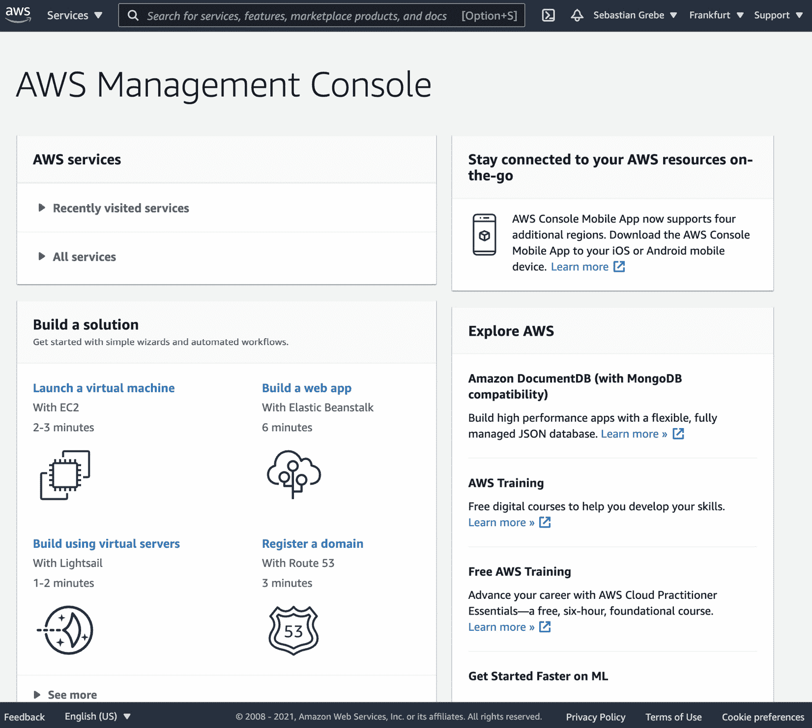
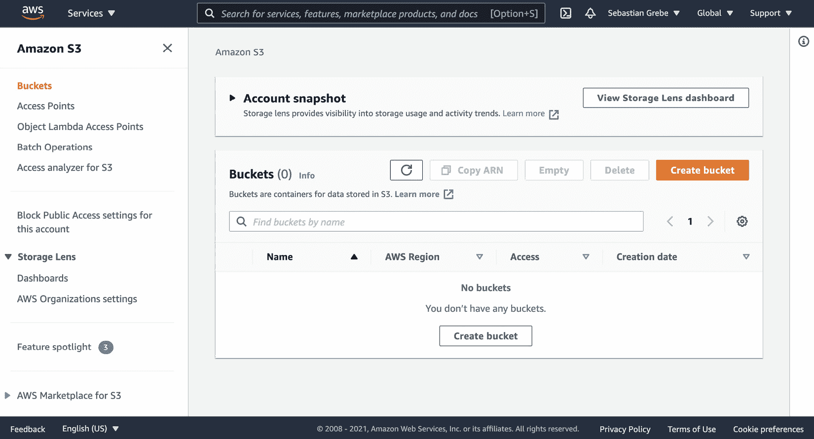
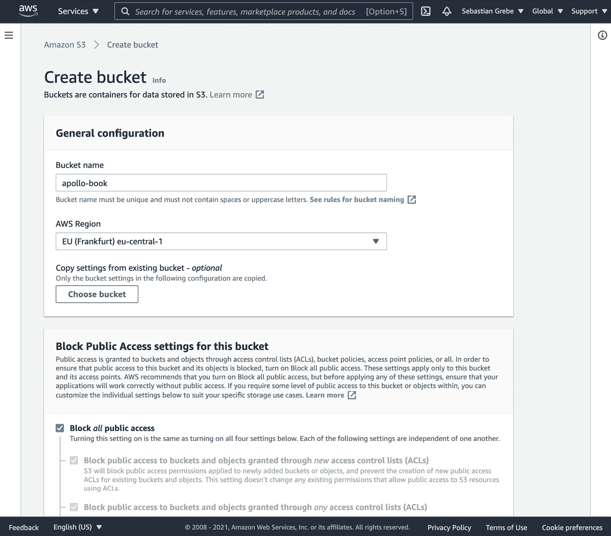
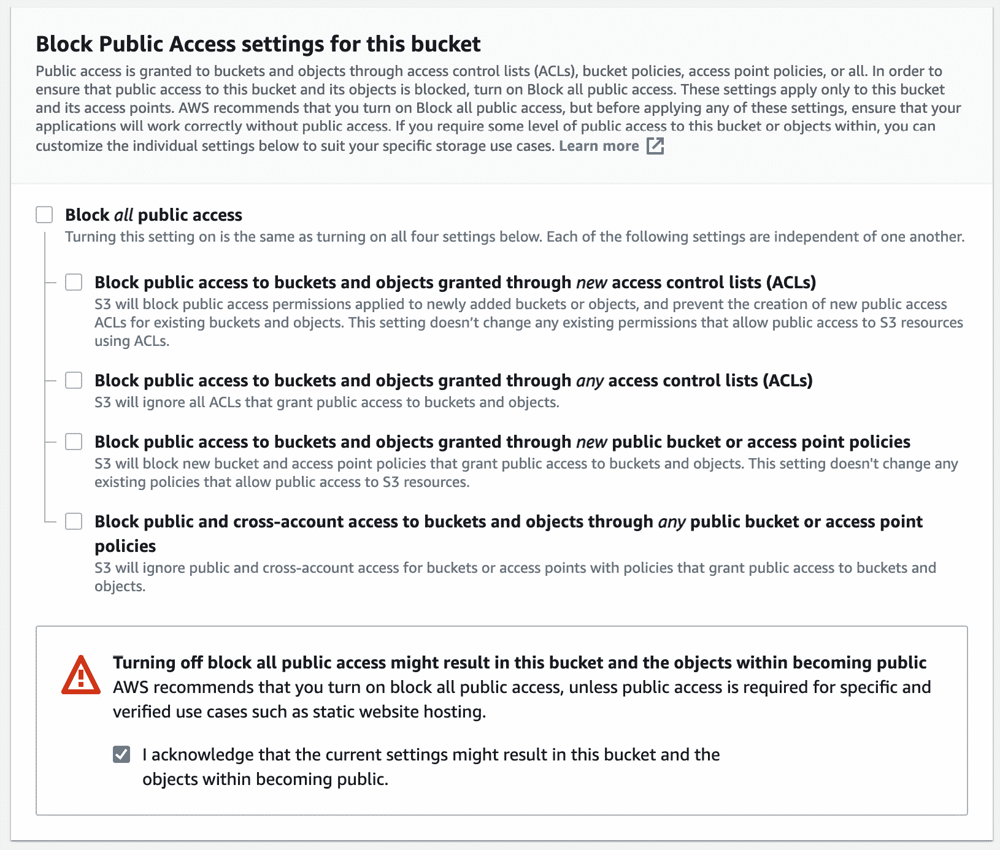
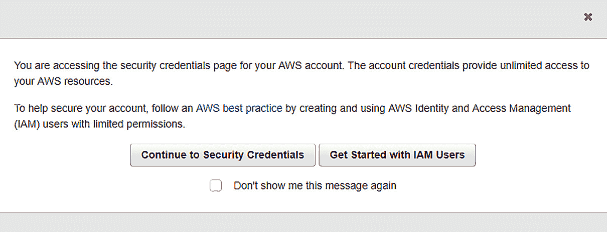
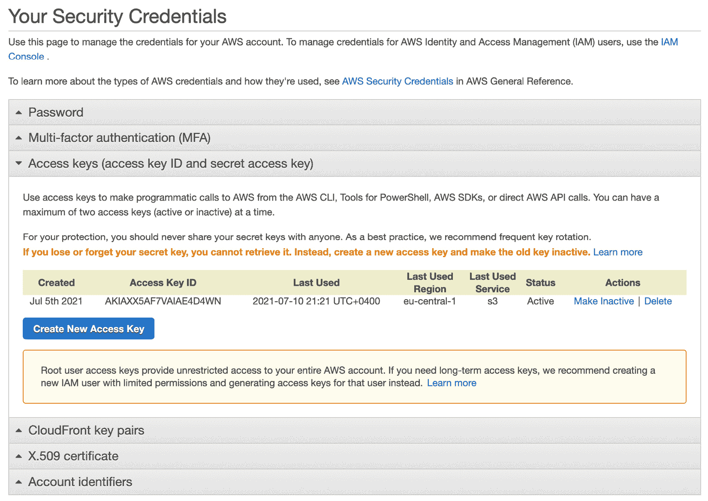
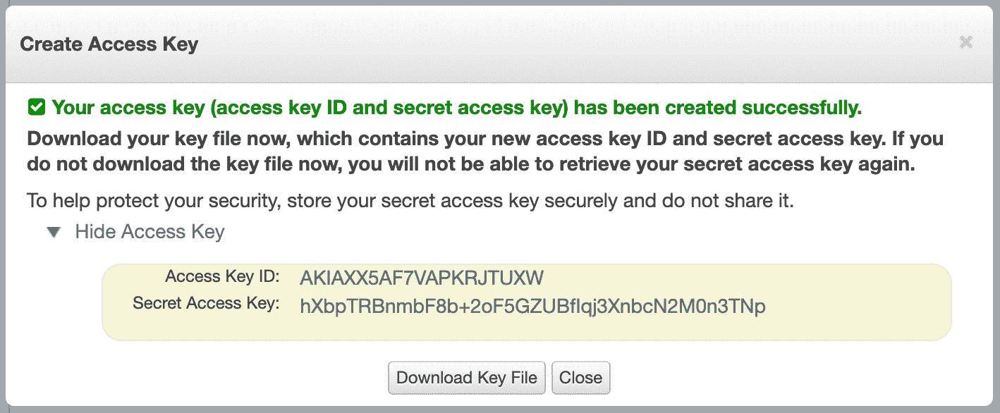

# 第七章：*第七章*：处理图片上传

所有社交网络都有一个共同点：每个都允许其用户上传自定义和个人图片、视频或任何其他类型的文档。这个功能可以在聊天、帖子、群组或个人资料中实现。为了提供相同的功能，我们将在 Graphbook 中实现图片上传功能。

本章将涵盖以下主题：

+   设置亚马逊网络服务

+   配置 AWS S3 存储桶

+   在服务器上接受文件上传

+   通过 Apollo 使用 React 上传图片

+   裁剪图片

# 技术要求

本章的源代码可在以下 GitHub 仓库中找到：

[`github.com/PacktPublishing/Full-Stack-Web-Development-with-GraphQL-and-React-Second-Edition/tree/main/Chapter07`](https://github.com/PacktPublishing/Full-Stack-Web-Development-with-GraphQL-and-React-Second-Edition/tree/main/Chapter07)

# 设置亚马逊网络服务

首先，我必须提到，亚马逊——更具体地说，**亚马逊网络服务**（**AWS**）——并不是唯一提供托管、存储或计算系统的提供商。有许多这样的提供商，包括以下：

+   Heroku

+   DigitalOcean

+   谷歌云

+   微软 Azure

AWS 提供了运行完整 Web 应用所需的一切，就像所有其他提供商一样。此外，它也被广泛使用，这就是为什么我们在这本书中专注于 AWS。

其服务范围从数据库到对象存储，再到安全服务，等等。此外，AWS 是大多数其他书籍和教程中都会找到的解决方案，许多大型公司也用它来支持其完整的基础设施。

本书使用 AWS 来托管静态文件，例如图片，运行生产数据库以及我们的应用程序的 Docker 容器。

在继续本章之前，您将需要 AWS 账户。您可以在官方网页[`aws.amazon.com/`](https://aws.amazon.com/)上创建一个账户。为此，您需要一个有效的信用卡；在阅读本书的过程中，您也可以在免费层上运行几乎所有服务，而不会遇到任何问题。

一旦您成功注册 AWS，您将看到以下仪表板。这个屏幕被称为**AWS 管理控制台**：



图 7.1 – AWS 管理控制台

下一个部分将介绍使用 AWS 存储文件的选择。

## 配置 AWS S3 存储桶

对于本章，我们需要一个存储服务来保存所有上传的图片。AWS 为各种用例提供不同的存储类型。在我们的社交网络场景中，我们将有数十人同时访问许多图片。**AWS 简单存储服务**（**S3**）是我们场景的最佳选择。按照以下步骤设置 S3 存储桶：

1.  您可以通过点击页面顶部的**服务**下拉菜单，然后在下拉菜单中的**存储**类别下查找，来访问**Amazon S3**屏幕。在那里，您将找到一个指向 S3 的链接。点击它后，屏幕将看起来像这样：

    图 7.2 – S3 管理屏幕

    在 S3 中，您可以在特定的 AWS 区域内部创建一个存储桶，在那里您可以存储文件。

    前一个屏幕提供了许多与您的 S3 存储桶交互的功能。您可以通过管理界面浏览所有文件，上传您的文件，并配置更多设置。

1.  现在，我们将通过点击右上角的**创建存储桶**，如*图 7.2*所示，为我们的项目创建一个新的存储桶。您将看到一个表单，如下面的截图所示。要创建存储桶，您必须填写以下内容：



图 7.3 – S3 存储桶向导

存储桶必须在 S3 的所有存储桶中具有唯一名称。然后，我们需要选择一个区域。对我来说，**欧洲（法兰克福）eu-central-1**是最好的选择，因为它是最接近的源点。选择最适合您的选项，因为存储桶的性能与其访问区域和存储桶区域之间的距离相对应。

然后，您需要取消选择**阻止所有公共访问**选项，并检查带有警告标志的确认。AWS 显示此警告是因为我们只有在真正需要时才应向 S3 存储桶提供公共访问。它应该看起来像这样：



图 7.4 – S3 存储桶访问

对于我们的用例，我们可以保留在此表单向导中为所有其他选项提供的默认设置。在其他更高级的场景中，其他选项可能会有所帮助。AWS 提供了许多功能，例如完整的访问日志和版本控制。

注意

许多大型公司拥有全球用户，这需要一个高度可用的应用程序。当您达到这一点时，您可以在其他地区创建更多的 S3 存储桶，并且您可以将一个存储桶的复制设置到世界各地其他地区的存储桶。然后，可以使用 AWS CloudFront 和针对每个用户的特定路由器将正确的存储桶分发出去。这种方法为每个用户提供了最佳的可能体验。

通过点击页面底部的**创建存储桶**完成设置过程。您将被重定向回所有存储桶的表格视图。

## 生成 AWS 访问密钥

在实现上传功能之前，我们必须创建一个 AWS**应用程序编程接口**（**API**）密钥，以授权我们的 AWS 后端，以便将新文件上传到 S3 存储桶。

点击 AWS 管理屏幕顶部的用户名。在那里，您将找到一个名为**我的安全凭证**的标签页，它导航到一个提供各种选项以保护您的 AWS 账户访问权限的屏幕。

您将看到一个类似这样的对话框：



图 7.5 – S3 身份和访问管理 (IAM) 对话框

您可以点击**继续到安全凭证**以继续。通常建议使用 AWS IAM，这允许您通过单独的 IAM 用户高效地管理对 AWS 资源的安全访问。在本书中，我们将以我们现在的方式使用根用户，但我建议在编写您的下一个应用程序时查看 AWS IAM。

您现在应该看到凭证页面，其中列出了存储凭证的不同方法。它应该看起来像这样：



图 7.6 – AWS 访问密钥

在列表中，展开前一个屏幕截图中所显示的名为**访问密钥（访问密钥 ID 和秘密访问密钥）**的选项卡。在此选项卡中，您可以找到您 AWS 账户的所有访问令牌。

要生成新的访问令牌，请点击**创建新访问密钥**。输出应如下所示：



图 7.7 – AWS 访问密钥

最佳实践是按照提示下载密钥文件并将其安全地保存到某个地方，以防您在任何时候丢失密钥。关闭窗口后，您无法再次检索访问密钥，因此如果您丢失了它们，您将不得不删除旧密钥并生成一个新的。

注意

这种方法可以用来解释 AWS 的基础知识。对于这样一个庞大的平台，您必须采取进一步的步骤来进一步增强您应用程序的安全性。例如，建议每 90 天更换 API 密钥。您可以在[`docs.aws.amazon.com/general/latest/gr/aws-access-keys-best-practices.html`](https://docs.aws.amazon.com/general/latest/gr/aws-access-keys-best-practices.html)上了解更多关于所有最佳实践的信息。

正如您在*图 7.7*中所见，AWS 给我们提供了两个令牌。两者都是访问我们的 S3 存储桶所必需的。

现在，我们可以开始编写上传机制了。

# 将图片上传到 Amazon S3

实现文件上传和存储文件始终是一项巨大的任务，尤其是在用户可能希望再次编辑他们的文件时的图片上传。

对于我们的前端，用户应该能够将他们的图片拖放到拖放区域，裁剪图片，然后在完成时提交。后端需要接受文件上传，这并不容易。文件必须被处理并有效地存储，以便所有用户都可以快速访问它们。

由于这是一个庞大的主题，本章仅涵盖了从 React 基本上传图像，使用多部分 `POST` 请求到我们的 GraphQL API，然后将图像传输到我们的 S3 存储桶。当涉及到压缩、转换和裁剪时，您应该查看有关此主题的更多教程或书籍，包括在前端和后端实现这些技术的技巧，因为有很多东西需要考虑。例如，在许多应用程序中，存储不同分辨率的图像以供用户在不同情况下查看是有意义的，这样可以节省带宽。

让我们从在后台实现上传过程开始。

## GraphQL 图像上传突变

当将图像上传到 S3 时，需要使用一个 API 密钥，我们已生成。因此，我们不能直接使用 API 密钥从客户端上传文件到 S3。任何访问我们应用程序的人都可以从 JavaScript 代码中读取 API 密钥，并访问我们的存储桶，而无需我们知道。

直接从客户端将图像上传到存储桶通常是可能的。为此，您需要将文件的名称和类型发送到服务器，然后服务器会生成 **统一资源定位符** （**URL**） 和签名。然后客户端可以使用签名上传图像。这种技术会导致客户端进行多次往返，并且不允许我们进行后处理图像，例如转换或压缩（如果需要）。

一个更好的解决方案是将图像上传到我们的服务器，让 GraphQL API 接收文件，然后向 S3 发送另一个请求——包括 API 密钥——以将文件存储到我们的存储桶中。

我们必须准备我们的后端以与 AWS 通信并接受文件上传。准备工作如下：

1.  我们安装官方的 `npm` 包以与 AWS 交互。它提供了使用任何 AWS 功能所需的一切，而不仅仅是 S3。我们还安装了 `graphql-upload`，它提供了一些工具来从任何 GraphQL 请求中解析文件。以下是完成此操作的代码：

    ```js
    npm install --save aws-sdk graphql-upload
    ```

1.  在服务器 `index.js` 文件中，我们需要添加 `graphql-upload` 包的初始化。为此，在顶部导入 Express 依赖项，如下所示：

    ```js
    import { graphqlUploadExpress } from 'graphql-upload';
    ```

1.  在文件末尾的 `graphql` 案例中，在执行 `applyMiddleware` 函数之前，我们需要先初始化它，如下所示：

    ```js
    case 'graphql':
      (async () => {
        await services[name].start();
        app.use(graphqlUploadExpress());
        services[name].applyMiddleware({ app });
      })();
      break;
    ```

1.  接下来要做的事情是编辑 GraphQL 模式，并在其顶部添加一个 `Upload` 标量。该标量用于在上传文件时解析诸如 **多用途互联网邮件扩展** （**MIME**） 类型和解码等细节。以下是您需要的代码：

    ```js
    scalar Upload
    ```

1.  将 `File` 类型添加到模式中。此类型返回文件名和图像可以在浏览器中访问的结果 URL。代码如下所示：

    ```js
    type File {
      filename: String!
      mimetype: String!
      encoding: String!
      url: String!
    }
    ```

1.  创建一个新的`uploadAvatar`突变。用户需要登录才能上传头像图像，所以将`@auth`指令附加到突变上。突变接受之前提到的`Upload`标量作为输入。代码在下面的代码片段中展示：

    ```js
    uploadAvatar (
      file: Upload!
    ): File @auth
    ```

1.  接下来，我们将在`resolvers.js`文件中实现突变解析函数。为此，我们将在`resolvers.js`文件顶部导入和设置我们的依赖项，如下所示：

    ```js
    import { GraphQLUpload } from 'graphql-upload';
    import aws from 'aws-sdk';
    const s3 = new aws.S3({
      signatureVersion: 'v4',
      region: 'eu-central-1',
    });
    ```

    我们将初始化`s3`对象，我们将在下一步上传图像时使用它。需要传递一个`region`属性，这是我们创建 S3 存储桶的属性。我们将`signatureVersion`属性设置为版本`'v4'`，因为这被推荐使用。

    注意

    你可以在[`docs.aws.amazon.com/general/latest/gr/signature-version-4.html`](https://docs.aws.amazon.com/general/latest/gr/signature-version-4.html)找到关于 AWS 请求签名过程的详细信息。

1.  在`resolvers.js`文件内部，我们需要添加一个`Upload`解析器，如下所示：

    ```js
    Upload: GraphQLUpload
    ```

1.  在`mutation`属性内部，插入`uploadAvatar`函数，如下所示：

    ```js
    async uploadAvatar(root, { file }, context) {
      const { createReadStream, filename, mimetype,
        encoding } = await file;
      const bucket = 'apollo-book';
      const params = {
          Bucket: bucket,
          Key: context.user.id + '/' + filename,
          ACL: 'public-read',
          Body: createReadStream()
      };
      const response = await s3.upload(params).promise();
      return User.update({
          avatar: response.Location
      },
      {
          where: {
              id: context.user.id
          }
      }).then(() => {
          return {
              filename: filename,
              url: response.Location
          }
      });
    },
    ```

在前面的代码片段中，我们首先将函数指定为`async`，这样我们就可以使用`await`方法解析文件及其详细信息。解析的`await file`方法的结果包括`stream`、`filename`、`mimetype`和`encoding`属性。

然后，我们在`params`变量中收集以下参数，以便上传我们的头像图像：

+   `Bucket`字段持有我们保存图像的存储桶名称。我使用了`'apollo-book'`这个名字，但你需要输入你在创建存储桶时输入的名字。你可以在`s3`对象内部直接指定这个名字，但这种方法更灵活，因为你可以为不同类型的文件拥有多个存储桶，而不需要多个`s3`对象。

+   `Key`属性是文件保存的路径和名称。请注意，我们将文件存储在一个新文件夹下，这个文件夹就是用户`context`变量。在未来的应用中，你可以为每个文件引入某种哈希值。那会很好，因为文件名不应该包含不允许的字符。此外，当使用哈希时，文件不能被程序性地猜测。

+   `ACL`字段设置了谁可以访问文件的权限。由于社交网络上的上传图像可以被互联网上的任何人公开查看，我们将属性设置为`'public-read'`。

+   `Body`字段接收`stream`变量，这是我们通过解析文件最初获得的。`stream`变量不过就是图像本身作为一个流，我们可以直接将其上传到存储桶中。

`params` 变量被传递给 `s3.upload` 函数，该函数将文件保存到我们的存储桶。我们直接将 `promise` 函数链接到 `upload` 方法。在前面的代码片段中，我们使用 `await` 语句来解决 `upload` 函数返回的承诺。因此，我们将函数指定为 `async`。AWS S3 上传的 `response` 对象包括一个公共 URL，任何人都可以通过该 URL 访问图像。

最后一步是在我们的数据库中设置新的用户头像图片。我们通过设置从 `response.Location` 的新 URL（S3 在我们解决承诺后提供给我们）来执行 Sequelize 的 `User.update` 模型函数。

这里提供了一个指向 S3 图像的示例链接：

```js
https://apollo-book.s3.eu-central-1.amazonaws.com/1/test.png
```

如您所见，URL 前缀是存储桶的名称，然后是区域。后缀当然是文件夹，即用户 ID 和文件名。前面的 URL 将与后端生成的 URL 不同，因为您的存储桶名称和区域将不同。

更新用户后，我们可以返回 AWS 响应以相应地更新 **用户界面**（**UI**），而不需要刷新浏览器窗口。

在上一节中，我们生成了访问令牌以授权 AWS 的后端。默认情况下，AWS `JWT_SECRET`，我们将设置令牌，如下所示：

```js
export AWS_ACCESS_KEY_ID=YOUR_AWS_KEY_ID
export AWS_SECRET_ACCESS_KEY=YOUR_AWS_SECRET_KEY
```

将您的 AWS 令牌插入到前面的代码中。AWS SDK 会自动检测环境变量。我们不需要在我们的代码中任何地方读取或配置它们。

现在，我们将继续在前端实现所有图像上传功能。

## React 图像裁剪和上传

在像 Facebook 这样的社交网络中，有多个位置可以供您选择和上传文件。您可以在聊天中发送图片，将它们附加到帖子中，在您的个人资料中创建相册，等等。现在，我们只看看如何更改我们用户的头像图片。这是一个展示所有技术的好例子。

我们希望达到的结果看起来像这样：


图 7.8 – 裁剪对话框

用户可以选择一个文件，在模态框中直接裁剪它，并使用前面的对话框将其保存到 AWS。

我不是很喜欢使用太多的 `npm` 包，因为这通常会使您的应用程序变得不必要地大。截至本书编写时，我们无法为显示对话框或裁剪等一切编写自定义 React 组件，无论这可能多么容易。

要使图像上传工作，我们将安装两个新的包。为此，您可以按照以下说明操作：

1.  使用 `npm` 安装包，如下所示：

    ```js
    react-modal package offers various dialog options that you can use in many different situations. The react-cropper package is a wrapper package around Cropper.js. The react-dropzone package provides an easy implementation for file drop functionality.
    ```

1.  当使用 `react-cropper` 包时，我们可以依赖其包含的 `App.js` 文件，直接从包本身导入，如下所示：

    ```js
    import 'cropperjs/dist/cropper.css';
    ```

    Webpack 负责打包所有资源，就像我们用自定义 CSS 所做的那样。其余所需的 CSS 都可在本书的官方 GitHub 仓库中找到。

1.  我们接下来要安装的包是 Apollo 客户端的扩展，这将使我们能够上传文件，如下所示：

    ```js
    npm install --save apollo-upload-client
    ```

1.  要运行`apollo-upload-client`包，我们必须编辑`apollo`文件夹中的`index.js`文件，在那里我们初始化 Apollo 客户端及其所有链接。在`index.js`文件顶部导入`createUploadLink`函数，如下所示：

    ```js
    import { createUploadLink } from 'apollo-upload-client';
    ```

1.  您必须用新的上传链接替换链表底部的旧`HttpLink`实例。现在，我们将传递`createUploadLink`函数，但使用相同的参数。执行时，将返回一个常规链接。链接应如下所示：

    ```js
    createUploadLink({
      uri: 'http://localhost:8000/graphql',
      credentials: 'same-origin',
    }),
    ```

    需要注意的是，当我们使用新的上传链接并通过 GraphQL 请求发送文件时，我们不会发送标准的`application/json` `Content-Type`请求，而是发送一个多部分的`FormData`请求。这允许我们使用 GraphQL 上传标准`file`对象。

    注意

    或者，在传输图像时，可以发送一个`base64`字符串而不是`file`对象。这种方法将节省我们目前正在做的工作，因为发送和接收字符串在 GraphQL 中是没有问题的。如果您想将其保存到 AWS S3，则必须将`base64`字符串转换为文件。然而，这种方法仅适用于图像，并且 Web 应用程序应该能够接受任何文件类型。

1.  现在包已经准备好了，我们可以开始为客户实现`uploadAvatar`突变组件。在`mutations`文件夹中创建一个名为`uploadAvatar.js`的新文件。

1.  在文件顶部，导入所有依赖项，并以传统方式使用`gql`解析所有 GraphQL 请求，如下所示：

    ```js
    import { gql, useMutation } from '@apollo/client';
    const UPLOAD_AVATAR = gql'
      mutation uploadAvatar($file: Upload!) {
        uploadAvatar(file : $file) {
          filename
          url
        }
      }
    ';
    export const getUploadAvatarConfig = () => ({
      update(cache, { data: { uploadAvatar } }) {
        console.log(uploadAvatar);
        if(uploadAvatar && uploadAvatar.url) {
          cache.modify({
            fields: {
              currentUser(user, { readField }) {
                cache.modify({
                  id: user,
                  fields: {
                    avatar() {
                      return uploadAvatar.url;
                    }
                  }
                })
              }
            }
          });
        }
      }
    });
    export const useUploadAvatarMutation = () => useMutation(UPLOAD_AVATAR, getUploadAvatarConfig());
    ```

    如您所见，我们只是通过将 GraphQL 查询包裹在`useMutation`钩子中导出了新的突变。我们还添加了一个`update`函数，该函数将首先获取当前用户的引用，然后通过引用更新此用户的新头像 URL 来更新缓存。

1.  最后，我们需要将`id`属性添加到`userAttributes`片段中。否则，用户引用上头像 URL 的更新只会反映在顶部栏上，而不会反映在所有帖子中。代码如下所示：

    ```js
    import { gql } from '@apollo/client';
    export const USER_ATTRIBUTES = gql'
      fragment userAttributes on User {
        id
        username
        avatar
      }
    ';
    ```

准备工作现在已完成。我们已经安装了所有必需的包，进行了配置，并实现了新的突变组件。我们可以开始编写用户界面对话框来更改头像图像。

为了这本书的目的，我们不是依赖于单独的页面或类似的东西。相反，我们给用户提供了在顶部栏点击他们的图像时更改头像的机会。为此，我们将监听头像上的点击事件，打开一个包含文件拖放区域和提交新图像按钮的对话框。

执行以下步骤以运行此逻辑：

1.  总是让您的组件尽可能可重用是一个好主意，因此请在 `components` 文件夹内创建一个 `avatarModal.js` 文件。

1.  与往常一样，您必须首先导入新的 `react-modal`、`react-cropper` 和 `react-dropzone` 包，然后是突变，如下所示：

    ```js
    import React, { useState, useRef } from 'react';
    import Modal from 'react-modal';
    import Cropper from 'react-cropper';
    import { useDropzone } from 'react-dropzone';
    import { useUploadAvatarMutation } from '../apollo/mutations/uploadAvatar';
    Modal.setAppElement('#root');
    const modalStyle = {
      content: {
        width: '400px',
        height: '450px',
        top: '50%',
        left: '50%',
        right: 'auto',
        bottom: 'auto',
        marginRight: '-50%',
        transform: 'translate(-50%, -50%)'
      }
    };
    ```

    如前述代码片段所示，我们告诉模态包在浏览器 `setAppElement` 方法的哪个点。对于我们的用例，取 `root` DOMNode 是可以的，因为这是我们应用程序的起点。模态框在这个 DOMNode 中实例化。

    模态组件接受一个特殊的 `style` 参数，用于拖拽区域的不同部分。我们可以通过指定 `modalStyle` 对象和正确的属性来样式化模态框的所有部分。

1.  `react-cropper` 包给用户提供了裁剪图像的机会。结果是 `file` 或 `blob` 对象，而是一个 `dataURI` 对象，格式化为 `base64`。通常这不会是问题，但我们的 GraphQL API 期望我们发送一个真实的文件，而不仅仅是字符串，正如我们之前解释的那样。因此，我们必须将 `dataURI` 对象转换为 blob，我们可以将其与我们的 GraphQL 请求一起发送。添加以下函数来处理转换：

    ```js
    function dataURItoBlob(dataURI) {
      var byteString = atob(dataURI.split(',')[1]);
      var mimeString = 
        dataURI.split(',')[0].split(':')[1].split(';')[0];
      var ia = new Uint8Array(byteString.length);

      for (var i = 0; i < byteString.length; i++) {
        ia[i] = byteString.charCodeAt(i);
      }
      const file = new Blob([ia], {type:mimeString});
      return file;
    }
    ```

    让我们不要深入探讨前面函数的逻辑。您需要知道的是，它将所有可读的 `blob` 对象转换为调用函数。它将数据 URI 转换为 blob。

1.  我们目前正在实施的新组件被称为 `AvatarUpload`。它接收 `isOpen` 属性，该属性用于设置模态框的可见或不可见。默认情况下，模态框是不可见的。此外，当模态框显示时，拖拽区域将渲染在其中。首先，设置组件本身和所需的变量，如下所示：

    ```js
    const AvatarModal = ({ isOpen, showModal }) => {
      const [file, setFile] = useState(null);
      const [result, setResult] = useState(null);
      const [uploadAvatar] = useUploadAvatarMutation();
      const cropperRef = useRef(null);
    }
    ```

    我们需要 `file` 和 `result` 状态变量来管理选定的原始文件和裁剪图像。此外，我们使用 `useRef` 钩子设置突变和引用，这对于 `cropper` 库是必需的。

1.  接下来，我们需要设置所有我们将用于处理不同事件和回调的组件函数。将以下函数添加到组件中：

    ```js
    const saveAvatar = () => {
      const resultFile = dataURItoBlob(result);
      resultFile.name = file.filename;
      uploadAvatar({variables: { file: resultFile 
        }}).then(() => {
        showModal();
      });
    };
    const changeImage = () => {
      setFile(null);
    };
    const onDrop = (acceptedFiles) => {
      const reader = new FileReader();
      reader.onload = () => {
        setFile({
          src: reader.result,
          filename: acceptedFiles[0].name,
          filetype: acceptedFiles[0].type,
          result: reader.result,
          error: null,
        });
      };
      reader.readAsDataURL(acceptedFiles[0]);
    };
    const {getRootProps, getInputProps, isDragActive} = useDropzone({onDrop});
    const onCrop = () => {
      const imageElement = cropperRef?.current;
      const cropper = imageElement?.cropper;
      setResult(cropper.getCroppedCanvas().toDataURL());
    };
    ```

    `saveAvatar` 函数是主要函数，它将 `base64` 字符串转换为 blob。当用户拖放或选择图像时，会调用 `onDrop` 函数。此时，我们使用 `FileReader` 读取文件，并给我们一个 `base64` 字符串，我们将其保存到 `file` 状态变量中作为一个对象。`useDropZone` 钩子为我们提供了所有可以用来设置实际拖拽区域的属性。

    `changeImage` 函数将取消当前的裁剪过程，并允许我们再次上传新文件。

    每当用户更改裁剪选择时，都会调用 `onCrop` 函数。此时，我们将新的裁剪图像作为 `base64` 字符串保存到 `result` 状态变量中，以便在原始 `file` 变量和 `result` 变量之间有清晰的分离。

1.  `Modal` 组件接受一个 `onRequestClose` 方法，当用户尝试通过点击外部关闭模态框时，会执行 `showModal` 函数，例如。我们从父组件接收 `showModal` 函数，我们将在下一步中介绍。模态框还接收默认的 `style` 属性和一个标签。

    `Cropper` 组件需要在 `crop` 属性中接收一个函数，该函数在每次更改时被调用。同时，`Cropper` 组件从 `file` 状态变量接收 `src` 属性，如下代码片段所示：

    ```js
    return (
      <Modal
        isOpen={isOpen}
        onRequestClose={showModal}
        contentLabel="Change avatar"
        style={modalStyle}
      >
        {!file &&
          (<div className="drop" {...getRootProps()}>
            <input {...getInputProps()} />
            {isDragActive ? <p>Drop the files here ...</p>
            : <p>Drag 'n' drop some files here, or click
            to select files</p>}
            </div>)
          }
          {file && <Cropper ref={cropperRef}
          src={file.src} style={{ height: 400, width:
          "100%" }} initialAspectRatio={16 / 9}
          guides={false} crop={onCrop}/>}
          {file && (
            <button className="cancelUpload" 
              onClick={changeImage}>Change image</button>
          )}
          <button className="uploadAvatar"
            onClick={saveAvatar}>Save</button>
        </Modal>
      )
    ```

    如你所见，`return` 语句仅包括作为包装器的模态框和一个裁剪器。最后，我们有一个调用 `saveAvatar` 的按钮来执行突变，并与之发送裁剪图像或 `changeImage`，后者取消当前图像的裁剪。

1.  不要忘记在文件末尾添加 `export` 语句，如下所示：

    ```js
    export default AvatarModal
    ```

1.  现在，切换到 `bar` 文件夹中的 `user.js` 文件，其中存储了所有其他应用程序栏相关的文件。按照以下方式导入新的 `AvatarModal` 组件：

    ```js
    import AvatarModal from '../avatarModal';
    ```

1.  `UserBar` 组件是 `AvatarUploadModal` 的父组件。从 `bar` 文件夹中打开 `user.js` 文件。这就是为什么我们在 `UserBar` 组件中处理对话框的 `isOpen` 状态变量。我们引入了一个 `isOpen` 状态变量，并在用户的头像上捕获 `onClick` 事件。将以下代码复制到 `UserBar` 组件中：

    ```js
    const [isOpen, setIsOpen] = useState(false);
    const showModal = () => {
      setIsOpen(!isOpen);
    }
    ```

1.  将 `return` 语句替换为以下代码：

    ```js
    return (
      <div className="user">
         showModal()} />
        <AvatarModal isOpen={isOpen}
          showModal={showModal}/>
        <span>{user.username}</span>
      </div>
    );
    ```

    模态组件直接接收 `isOpen` 属性，正如我们之前解释的那样。当点击头像图像时，会执行 `showModal` 方法。这个函数更新 `AvatarModal` 组件的属性，并显示或隐藏模态框。

使用匹配的 `npm run` 命令启动服务器和客户端。重新加载浏览器并尝试新功能。当选择图像时，会显示裁剪工具。你可以拖动并调整要上传的图像区域的大小。你可以在以下屏幕截图中看到这个示例：


Figure 7.9 – Cropping in progress

在 S3 存储桶中点击 `user` 文件夹。多亏了我们编写的突变，顶栏中的头像图像被更新为指向图像在 S3 存储桶位置的新的 URL。

我们所取得的巨大成就是将图像发送到我们的服务器。我们的服务器将所有图像传输到 S3。AWS 响应公共 URL，然后直接放置在浏览器的头像字段中。我们使用 GraphQL API 从后端查询头像图像的方式没有改变。我们返回 S3 文件的 URL，一切正常工作。

# 摘要

在本章中，我们首先创建了一个 AWS 账户和一个 S3 存储桶，用于从我们的后端上传静态图像。现代社交网络由许多图像、视频和其他类型的文件组成。我们介绍了 Apollo 客户端，它允许我们上传任何类型的文件。在本章中，我们成功地将一张图像上传到我们的服务器，并介绍了如何在 AWS S3 服务器上裁剪图像并保存它们。现在，您的应用程序应该能够随时为用户提供图像服务。

下一章将涵盖客户端路由的基础知识，使用 React Router 实现。
