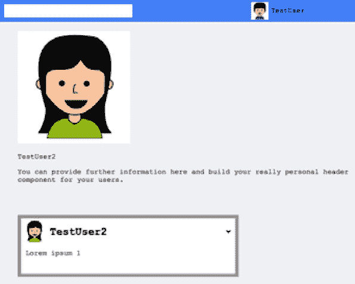

# 第八章：*第八章*：React 中的路由

目前，我们的用户可以访问一个屏幕和一个路径。当用户访问 Graphbook 时，他们可以登录并查看他们的新闻源和聊天。社交网络的一个要求是用户有自己的个人资料页面。我们将在本章实现此功能。

我们将为我们的 React 应用程序介绍客户端路由。

本章将涵盖以下主题：

+   设置 React Router

+   使用 React Router 的高级路由

# 技术要求

本章的源代码可在以下 GitHub 仓库中找到：

[`github.com/PacktPublishing/Full-Stack-Web-Development-with-GraphQL-and-React-Second-Edition/tree/main/Chapter08`](https://github.com/PacktPublishing/Full-Stack-Web-Development-with-GraphQL-and-React-Second-Edition/tree/main/Chapter08)

# 设置 React Router

路由对于大多数 Web 应用程序都是必不可少的。你无法在一个页面上涵盖你应用程序的所有功能。这将导致过载，并且用户会发现很难理解。在社交网络如 Graphbook 中，分享图片、个人资料或帖子的链接也非常重要。例如，一个有利的特性是能够发送到特定个人资料的链接。这要求每个个人资料都有自己的**统一资源定位符**（**URL**）和页面。否则，将无法分享到应用程序单个项目的直接链接。由于**搜索引擎优化**（**SEO**）的原因，将内容拆分到不同的页面也非常关键。

目前，我们根据认证状态在浏览器中将完整的应用程序渲染为**超文本标记语言**（**HTML**）。只有服务器实现了简单的路由功能。如果路由器只是简单地替换 React 中的正确部分，而不是在跟随链接时完全重新加载页面，那么执行客户端路由可以为用户节省大量工作和时间。应用程序利用 HTML5 历史实现来处理浏览器的历史记录至关重要。重要的是，这也应该适用于不同方向上的导航。我们应该能够使用浏览器中的箭头导航按钮前后导航，而无需重新加载应用程序。此解决方案不应发生不必要的页面重新加载。

你可能知道的一些常见框架，如 Angular、Ember 和 Ruby on Rails，使用静态路由。Express.js 也是这样，我们在本书的*第二章**,* *使用 Express.js 设置 GraphQL*中介绍了它。**静态路由**意味着你预先配置你的路由流程和要渲染的组件。然后，你的应用程序在单独的步骤中处理路由表，渲染所需的组件，并将结果呈现给用户。

随着 4 版本和我们现在将要使用的 5 版本 React Router 的发布，引入了**动态路由**。它的独特之处在于，路由发生在你的应用程序渲染运行时。它不需要应用程序首先处理配置以显示正确的组件。这种方法与 React 的工作流程非常契合。路由直接在你的应用程序中发生，而不是在预处理的配置中。

## 安装 React Router

在过去，有很多 React 路由器，具有各种实现和功能。正如我们之前提到的，我们将为这本书安装和配置第 5 版。如果你搜索其他关于这个主题的教程，请确保遵循这个版本的说明。否则，你可能会错过 React Router 经历的一些变化。

要安装 React Router，只需再次运行 `npm`，如下所示：

```js
npm install --save react-router-dom
```

从包名来看，你可能会认为这不是 React 的主要包。原因在于 React Router 是一个多包库。当在多个平台上使用相同工具时，这会很有用。核心包被称为 `react-router`。

还有两个额外的包。第一个是 `react-router-dom` 包，我们在前面的代码片段中已经安装了它，第二个是 `react-router-native` 包。如果你在某个时候计划构建一个 React Native 应用程序，你可以使用相同的路由，而不是使用浏览器的**文档对象模型**（**DOM**）来构建真正的移动应用程序。

我们将要采取的第一步是引入一个简单的路由，以便使我们的当前应用程序工作，包括所有屏幕的不同路径。我们将添加的路由在此处详细说明：

+   我们的应用程序的帖子源、聊天和顶部栏，包括搜索框，应该在 `/app` 路由下可访问。路径是自解释的，但你也可以使用 `/` 根路径作为主路径。

+   登录和注册表单应该有单独的路径，该路径将在 `/` 根路径下可访问。

+   由于我们没有其他屏幕，我们还需要处理一种情况，即前面的所有路由都不匹配。在这种情况下，我们可以显示一个所谓的 404 页面，但我们将直接重定向到根路径。

在继续之前，我们必须准备一件事。对于开发，我们使用 webpack 开发服务器，正如我们在 *第一章*，*准备你的开发环境* 中配置的那样。为了使路由能够直接工作，我们将向 `webpack.client.config.js` 文件添加两个参数。`devServer` 字段应如下所示：

```js
devServer: {
  port: 3000,
  open: true,
  historyApiFallback: true,
},
```

`historyApiFallback`字段告诉`devServer`不仅为根路径`http://localhost:3000/`，而且在它通常会收到 404 错误（例如对于`http://localhost:3000/app`之类的路径）时也要提供`index.html`文件。这发生在路径不匹配文件或文件夹时，这在实现路由时是正常的。

在`config`文件顶部的`output`字段必须有一个`publicPath`属性，如下所示：

```js
output: {
  path: path.join(__dirname, buildDirectory),
  filename: 'bundle.js',
  publicPath: '/',
},
```

`publicPath`属性告诉 webpack 将包 URL 的前缀添加到绝对路径，而不是相对路径。当此属性未包含时，浏览器在访问我们应用程序的子目录时无法下载包，因为我们正在实现客户端路由。让我们从第一个路径开始，将应用程序的中心部分，包括新闻源，绑定到`/app`路径。

## 实现您的第一个路由

在实现路由之前，我们将清理`App.js`文件。为此，请按照以下步骤操作：

1.  在`client`文件夹中，在`App.js`文件旁边创建一个`Main.js`文件。插入以下代码：

    ```js
    import React from 'react';
    import Feed from './Feed';
    import Chats from './Chats';
    import Bar from './components/bar';
    export const Main = ({ changeLoginState }) => {
      return (
        <>
          <Bar changeLoginState={changeLoginState} />
          <Feed />
          <Chats />
        </>
      );
    }
    export default Main;
    ```

    如您可能已经注意到的，前面的代码基本上与`App.js`文件内的登录条件相同。唯一的区别是`changeLoginState`函数是从属性中取出的，而不是组件本身的直接方法。这是因为我们将这部分从`App.js`文件中分离出来，并放入一个单独的文件中。这提高了我们将要实现的其它组件的可重用性。

1.  现在，打开并替换`App`组件的`return`语句，以反映以下更改：

    ```js
    return (
      <div className="container">
        <Helmet>
          <title>Graphbook - Feed</title>
          <meta name="description" content="Newsfeed of
            all your friends on Graphbook" />
        </Helmet>
        <Router loggedIn={loggedIn}
          changeLoginState={handleLogin}/>
      </div>
    )
    ```

    如果你将先前的方法与旧方法进行比较，你会发现我们插入了一个`Router`组件，而不是直接渲染帖子源或登录表单。`App.js`文件的原有组件现在位于之前创建的`Main.js`文件中。在这里，我们将`loggedIn`属性和`changeLoginState`函数传递给`Router`组件。删除顶部的依赖项，如`Chats`和`Feed`组件，因为我们不再需要它们，多亏了新的`Main`组件。

1.  将以下行添加到我们的`App.js`文件的依赖项中：

    ```js
    import Router from './router';
    ```

    为了使路由工作，我们必须首先实现我们的自定义`Router`组件。通常，使用 React Router 实现路由运行很容易，并且不需要将路由功能分离到单独的文件中，但这使得代码更易读。

1.  要做到这一点，在`client`文件夹中，在`App.js`文件旁边创建一个新的`router.js`文件，内容如下：

    ```js
    import React from 'react';
    import { BrowserRouter as Router, Route, Redirect, Switch } from 'react-router-dom';
    import LoginRegisterForm from './components/loginregister';
    import Main from './Main';
    export const routing = ({ changeLoginState, loggedIn }) => {
      return (
        <Router>
          <Switch>
            <Route path="/app" component={() => <Main
              changeLoginState= {changeLoginState}/>}/>
          </Switch>
        </Router>
      )
    }
    export default routing;
    ```

在顶部，我们导入所有依赖项。它们包括新的`Main`组件和`react-router`包。以下是所有从 React Router 包中导入的组件的快速说明：

+   `BrowserRouter`（或简称 `Router`，如我们在这里所称呼）是一个组件，它使地址栏中的 URL 与 **用户界面**（**UI**）保持同步；它处理所有的路由逻辑。

+   `Switch` 组件强制渲染第一个匹配的 `Route` 或 `Redirect` 组件。我们需要它来停止在用户已经位于重定向尝试导航到的位置时重新渲染 UI。我通常建议您使用 `Switch` 组件，因为它可以捕获不可预见的路由错误。

+   `Route` 是一个组件，它试图将给定的路径与浏览器的 URL 匹配。如果情况如此，则渲染 `component` 属性。您可以在前面的代码片段中看到，我们并没有直接将 `Main` 组件作为参数设置；相反，我们从无状态函数中返回它。这是必需的，因为 `Route` 组件的 `component` 属性只接受函数，而不是组件对象。这个解决方案允许我们将 `changeLoginState` 函数传递给 `Main` 组件。

+   `Redirect` 将浏览器导航到指定的位置。该组件接收一个名为 `to` 的属性，它由以 `/` 开头的路径填充。我们将在下一节中使用这个组件。

前面代码的问题是我们只监听了一个路由，即 `/app`。如果您未登录，将会有许多未覆盖的错误。最好的做法是将用户重定向到根路径，在那里他们可以登录。

## 受保护的路由

**受保护的路由**代表了一种指定只有当用户经过身份验证或具有正确的授权时才能访问的路径的方法。

在 React Router 中实现受保护路由的推荐解决方案是编写一个小的、无状态的函数，该函数根据条件渲染 `Redirect` 组件或需要经过身份验证的用户指定的路由上的组件。我们将路由的 `component` 属性提取到 `Component` 变量中，它是一个可渲染的 React 对象：

1.  将以下代码插入到 `router.js` 文件中：

    ```js
    const PrivateRoute = ({ component: Component, ...rest }) => (
      <Route {...rest} render={(props) => (
        rest.loggedIn === true
          ? <Component {...props} />
          : <Redirect to={{
              pathname: '/',
            }} />
      )} />
    )
    ```

    我们调用 `PrivateRoute` 无状态函数。它返回一个标准的 `Route` 组件，该组件接收最初传递给 `PrivateRoute` 函数的所有属性。为了传递所有属性，我们使用 `...rest` 语法进行解构赋值。在 React 组件的括号内使用该语法将 `rest` 对象的所有字段作为属性传递给组件。只有当给定的路径匹配时，`Route` 组件才会被渲染。

    此外，渲染的组件取决于用户的 `loggedIn` 状态变量，我们必须传递它。如果用户已登录，我们将无问题地渲染 `Component` 变量。否则，我们使用 `Redirect` 组件将用户重定向到应用程序的根路径。

1.  在 `Router` 组件的 `return` 语句中使用新的 `PrivateRoute` 组件，并替换旧的 `Route` 组件，如下所示：

    ```js
    <PrivateRoute path="/app" component={() => <Main changeLoginState={changeLoginState} />} loggedIn={loggedIn}/>
    ```

    注意，我们是通过从 `Router` 组件本身的属性中取值来传递 `loggedIn` 属性的。它最初从我们之前编辑的 `App` 组件接收 `loggedIn` 属性。很棒的是，`loggedIn` 变量可以从父 `App` 组件随时更新。这意味着当用户注销时，`Redirect` 组件会被渲染，用户会自动导航到登录表单。我们不需要编写单独的逻辑来实现这个功能。

    然而，我们现在又遇到了一个新的问题。当用户未登录时，我们将请求从 `/app` 重定向到 `/`，但我们没有为初始的 `'/'` 路径设置任何路由。这个路径要么显示登录表单，要么在用户登录时将用户重定向到 `/app`，这样做是有意义的。新组件的模式与 `PrivateRoute` 组件之前的代码相同，但方向相反。

1.  将新的 `LoginRoute` 组件添加到 `router.js` 文件中，如下所示：

    ```js
    const LoginRoute = ({ component: Component, ...rest }) => (
      <Route {...rest} render={(props) => (
        rest.loggedIn === false
          ? <Component {...props} />
          : <Redirect to={{
              pathname: '/app',
            }} />
      )} />
    )
    ```

    上述条件被反转以渲染原始组件。如果用户未登录，将渲染登录表单。否则，他们将被重定向到帖子源。

1.  将新的路径添加到路由中，如下所示：

    ```js
    <LoginRoute exact path="/" component={() => <LoginRegisterForm changeLoginState={changeLoginState}/>} loggedIn={loggedIn}/>
    ```

    代码看起来与 `PrivateRoute` 组件的代码相同，但我们现在有一个新的属性，称为 `exact`。如果我们向一个路由传递这个属性，浏览器位置必须匹配 100%。以下表格展示了从官方 React Router 文档中摘取的一个快速示例：


对于根路径，我们将 `exact` 设置为 `true`，因为否则路径会与包含 `/` 的任何浏览器位置匹配，正如您在前面的表中看到的。

注意

React Router 提供了许多更多的配置选项，例如强制使用尾部斜杠、大小写敏感等。您可以在官方文档中找到所有选项和示例，网址为 [`v5.reactrouter.com/web/api/`](https://v5.reactrouter.com/web/api/)。

## React Router 中的通配符路由

目前，我们已经设置了两个路径，即 `/app` 和 `/`。如果用户访问一个不存在的路径，例如 `/test`，他们将看到一个空屏幕。解决方案是实现一个匹配任何路径的路由。为了简单起见，我们将用户重定向到我们应用程序的根目录，但您也可以轻松地将重定向替换为典型的 404 页面。

将以下代码添加到 `router.js` 文件中：

```js
const NotFound = () => {
  return (
    <Redirect to="/"/>
  );
}
```

`NotFound` 组件很简单。它只是将用户重定向到根路径。将下一个 `Route` 组件添加到 `Router` 组件中的 `Switch` 组件。确保它是列表中的最后一个。代码如下所示：

```js
<Route component={NotFound} />
```

正如你所见，我们在前面的代码中渲染了一个简单的`Route`组件。使这个路由特殊的是我们没有传递一个`path`属性。默认情况下，`path`属性会被完全忽略，组件会在每次渲染时显示，除非与之前的组件匹配。这就是为什么我们将路由添加到`Router`组件的底部。当没有路由匹配时，我们将用户重定向到根路径的登录屏幕，或者如果用户已经登录，我们将使用根路径的路由逻辑将他们重定向到不同的屏幕。我们的`LoginRoute`组件处理最后一个情况。

你可以通过使用`npm run client`启动前端和`npm run server`启动后端来测试所有更改。我们现在已经将我们的应用程序从标准单路由应用程序转换为根据浏览器位置区分登录表单和新闻源的应用程序。

在下一节中，我们将探讨如何通过添加参数化路由并根据这些参数加载数据来实现更复杂的路由。

# 使用 React Router 的高级路由

本章的主要目标是为你用户的个人资料页构建一个页面。我们需要一个单独的页面来显示单个用户输入或创建的所有内容。这些内容不适合放在帖子源旁边。当查看 Facebook 时，我们可以看到每个用户都有自己的地址，我们可以在其中找到特定用户的个人资料页。我们将以相同的方式创建我们的个人资料页，并使用用户名作为自定义路径。

我们必须实现以下功能：

1.  我们为用户个人资料添加一个新的参数化路由。路径以`/user/`开始，后跟一个用户名。

1.  我们将用户个人资料页更改为在 GraphQL 请求的`variables`字段中发送所有 GraphQL 查询，包括`username`路由参数。

1.  我们编辑`postsFeed`查询以通过提供的`username`参数过滤所有帖子。

1.  我们在后台实现一个新的 GraphQL 查询，通过用户名请求用户，以便显示有关用户的信息。

1.  当所有查询完成后，我们渲染一个新的用户个人资料头部组件和帖子源。

1.  最后，我们启用在每个页面之间导航而无需重新加载整个页面，只需重新加载更改的部分。

让我们从在下一节中实现个人资料页的路由来开始。

## 路由中的参数

我们已经准备好了添加新用户路由所需的大部分工作。再次打开`router.js`文件。添加新的路由，如下所示：

```js
<PrivateRoute path="/user/:username" component={props => <User {...props} changeLoginState={changeLoginState}/>} loggedIn={loggedIn}/>
```

代码中包含两个新元素，如下所示：

+   我们输入的路径是`/user/:username`。正如你所见，用户名前有一个冒号作为前缀，这告诉 React Router 将它的值传递给正在渲染的底层组件。

+   我们之前渲染的组件是一个无状态的函数，它返回`LoginRegisterForm`组件或`Main`组件。这两个组件都没有从 React Router 接收任何参数或属性。然而，现在要求将 React Router 的所有属性都传递给子组件。这包括我们刚刚引入的`username`参数。我们使用相同的解构赋值与`props`对象来将所有属性传递给`User`组件。

这些就是我们接受 React Router 参数化路径所需的所有更改。我们在新的用户页面组件内部读取值。在实现它之前，我们在`router.js`的顶部导入依赖项，以便使前面的路由工作，如下所示：

```js
import User from './User';
```

在`Main.js`文件旁边创建前面的`User.js`文件。与`Main`组件一样，我们正在收集在这个页面上渲染的所有组件。你应该保持这个布局，因为你可以直接看到每个页面由哪些主要部分组成。`User.js`文件应该看起来像这样：

```js
import React from 'react';
import UserProfile from './components/user';
import Chats from './Chats';
import Bar from './components/bar';
export const User = ({ changeLoginState, match }) => {
  return (
    <>
      <Bar changeLoginState={changeLoginState} />
      <UserProfile username={match.params.username}/>
      <Chats />
    </>
  );
}
export default User
```

我们拥有所有常见的组件，包括`Bar`和`Chat`组件。如果用户访问朋友的个人资料，他们会在顶部看到常见的应用栏。他们可以在右侧访问他们的聊天，就像在 Facebook 上一样。这是 React 和组件的可重用性派上用场的情况之一。

我们移除了`Feed`组件，并用新的`UserProfile`组件替换了它。重要的是，`UserProfile`组件接收`username`属性。它的值来自`User`组件的属性。这些属性是通过 React Router 传递的。如果你在路由路径中有一个参数，比如`username`，那么这个值就存储在子组件的`match.params.username`属性中。`match`对象通常包含 React Router 的所有匹配信息。

从这个点开始，你可以使用这个值实现任何你想要的自定义逻辑。我们现在将继续实现个人资料页面。

在构建用户个人资料页面之前，需要将渲染逻辑提取到单独的组件中以供重用。在`post`文件夹内创建一个名为`feedlist.js`的新文件。

在`feedlist.js`文件中插入以下代码：

1.  按照以下方式在顶部导入以下依赖项：

    ```js
    import React, { useState } from 'react';
    import InfiniteScroll from 'react-infinite-scroll-component';
    import Post from './';
    ```

1.  然后，只需复制以下`return`语句中的主要部分，如下所示：

    ```js
    export const FeedList = ({fetchMore, posts}) => {
      const [hasMore, setHasMore] = useState(true);
      const [page, setPage] = useState(0);
      return (
        <div className="feed">
          <InfiniteScroll
            dataLength={posts.length}
            next={() => loadMore(fetchMore)}
            hasMore={hasMore}
            loader={<div className="loader"
              key={"loader"}>Loading ...</div>}
          >
          {posts.map((post, i) =>
              <Post key={post.id} post={post} />
          )}
          </InfiniteScroll>
        </div>
      );
    }
    export default FeedList;
    ```

1.  现在缺少的是`loadMore`函数，我们也可以直接复制。只需将其直接添加到前面的组件中，如下所示：

    ```js
    const loadMore = (fetchMore) => {
        fetchMore({
          variables: {
              page: page + 1,
          },
          updateQuery(previousResult, { fetchMoreResult })
            {
            if(!fetchMoreResult.postsFeed.posts.length) {
              setHasMore(false);
              return previousResult;
            }
            setPage(page + 1);
            const newData = {
              postsFeed: {
                __typename: 'PostFeed',
                posts: [
                  ...previousResult.postsFeed.posts,
                  ...fetchMoreResult.postsFeed.posts
                ]
              }
            };
            return newData;
          }
        });
      }
    ```

1.  只需替换`Feed.js`文件`return`语句的部分。它应该看起来像这样：

    ```js
    return (
      <div className="container">
        <div className="postForm">
          <form onSubmit={handleSubmit}>
            <textarea value={postContent} onChange={(e) =>
              setPostContent(e.target.value)} 
                placeholder="Write your custom post!"/>
            <input type="submit" value="Submit" />
          </form>
        </div>
        <FeedList posts={posts} fetchMore={loadMore}/>
      </div>
    )
    ```

我们现在可以在需要显示帖子列表的地方使用这个`FeedList`组件，比如在我们的用户个人资料页面上。

按照以下步骤构建用户的个人资料页面：

1.  在`components`文件夹内创建一个名为`user`的新文件夹。

1.  在`user`文件夹内创建一个名为`index.js`的新文件。

1.  按照以下方式在文件顶部导入依赖项：

    ```js
    import React from 'react';
    import FeedList from '../post/feedlist';
    import UserHeader from './header';
    import Loading from '../loading';
    import Error from '../error';
    import { useGetPostsQuery } from '../../apollo/queries/getPosts';
    import { useGetUserQuery } from '../../apollo/queries/getUser'; 
    ```

    前三行看起来应该很熟悉。然而，目前有两个导入的文件不存在，但我们很快就会改变这一点。第一个新文件是`UserHeader`，它负责渲染头像图片、用户名和信息。逻辑上，我们通过一个新的 Apollo 查询钩子`getUser`请求我们将要在该头部显示的数据。

1.  将我们目前正在构建的`UserProfile`组件代码插入到依赖项下方，如下所示：

    ```js
    const UserProfile = ({ username }) => {
      const { data: user, loading: userLoading } = 
        useGetUserQuery({ username });
      const { loading, error, data: posts, fetchMore } = 
        useGetPostsQuery({ username });
      if (loading || userLoading) return <Loading />;
      if (error) return <Error><p>{error.message}</p>
        </Error>;
      return (
        <div className="user">
          <div className="inner">
            <UserHeader user={user.user} />
          </div>
          <div className="container">
            <FeedList posts={posts.postsFeed.posts}
              fetchMore={fetchMore}/>
          </div>
        </div>
      )
    }
    export default UserProfile;
    ```

    `UserProfile`组件并不复杂。我们同时运行两个 Apollo 查询。这两个查询都设置了`variables`属性。`useGetPostsQuery`钩子接收用户名，它最初来自 React Router。这个属性也被传递给`useGetUserQuery`。

1.  现在编辑并创建 Apollo 查询，在编写个人资料头部组件之前。打开`queries`文件夹中的`getPosts.js`文件。

1.  要将用户名作为 GraphQL 查询的输入，我们首先必须将查询字符串从`GET_POSTS`变量中更改。将前两行更改为以下代码：

    ```js
    query postsFeed($page: Int, $limit: Int, $username: String) { 
      postsFeed(page: $page, limit: $limit, username:
        $username) { 
    ```

1.  然后，将最后一行替换为以下代码，以提供传递变量到`useQuery`钩子函数的方法：

    ```js
    export const useGetPostsQuery = (variables) => useQuery(GET_POSTS, { pollInterval: 5000, variables: { page: 0, limit: 10, ...variables } });
    ```

    如果自定义查询组件接收一个`username`属性，它将被包含在 GraphQL 请求中。它被用来过滤我们正在查看的特定用户发布的帖子。

1.  在`queries`文件夹中创建一个新的`getUser.js`文件，创建一个查询钩子，这是我们目前所缺少的。

1.  按照以下方式在文件顶部导入所有依赖项并使用`gql`解析新的查询模式：

    ```js
    import { gql, useQuery } from '@apollo/client';
    import { USER_ATTRIBUTES } from '../fragments/userAttributes';
    export const GET_USER = gql'
      query user($username: String!) {
        user(username: $username) {
          ...userAttributes
        }
      }
      ${USER_ATTRIBUTES}
    ';
    export const useGetUserQuery = (variables) => useQuery(GET_USER, { variables: { ...variables }});
    ```

    前面的查询几乎与`currentUser`查询相同。我们将在我们的 GraphQL **应用程序编程接口**（**API**）中稍后实现相应的`user`查询。

1.  最后一步是实现`UserProfileHeader`组件。这个组件渲染`user`属性及其所有值。它只是简单的 HTML 标记。将以下代码复制到`user`文件夹中的`header.js`文件：

    ```js
    import React from 'react';
    export const UserProfileHeader = ({user}) => {
      const { avatar, username } = user;
      return (
        <div className="profileHeader">
          <div className="avatar">
            
          </div>
          <div className="information">
            <p>{username}</p>
            <p>You can provide further information here
               and build your really personal header 
               component for your users.</p>
          </div>
        </div>
      )
    }
    export default UserProfileHeader;
    ```

如果你在正确设置**层叠样式表**（**CSS**）样式方面需要帮助，请查看这本书的官方仓库。前面的代码仅渲染用户数据；你也可以实现聊天按钮等特性，这样用户就可以选择与其他人开始消息交流。目前，我们还没有在任何地方实现这个特性，但解释 React 和 GraphQL 的原则并不必要。

我们已经完成了新的前端组件，但`UserProfile`组件仍然没有工作。我们在这里使用的查询要么不接受`username`参数，要么尚未实现。

下一个部分将涵盖后端需要调整的部分。

## 查询用户资料

使用新的个人资料页面，我们必须相应地更新我们的后端。让我们看看需要做什么，如下所示：

+   我们必须将 `username` 参数添加到 `postsFeed` 查询的模式中，并调整解析函数。

+   我们必须为新的 `UserQuery` 组件创建一个模式和解析函数。

我们将从 `postsFeed` 查询开始：

1.  编辑 `schema.js` 文件中的 `RootQuery` 类型的 `postsFeed` 查询，以匹配以下代码：

    ```js
    postsFeed(page: Int, limit: Int, username: String): PostFeed @auth
    ```

    在这里，我已经将 `username` 添加为一个可选参数。

1.  现在，前往 `resolvers.js` 文件并查看相应的 `resolver` 函数。将函数签名替换为从变量中提取用户名，如下所示：

    ```js
    postsFeed(root, { page, limit, username }, context) {
    ```

1.  为了使用新参数，在 `return` 语句上方添加以下代码行：

    ```js
    if(username) {
      query.include = [{model: User}];
      query.where = { '$User.username$': username };
    }
    ```

我们已经介绍了基本的 Sequelize API 以及如何使用 `include` 参数在 *第三章* 中查询关联模型，*连接到数据库*。一个重要点是，我们如何通过用户名过滤与用户关联的帖子。我们将在以下步骤中这样做：

1.  在前面的代码中，我们填充了 `query` 对象的 `include` 字段，这是我们想要连接的 Sequelize 模型。这允许我们在下一步中过滤关联的 `User` 模型。

1.  然后，我们创建一个普通的 `where` 对象，在其中写入过滤条件。如果你想通过关联的用户表来过滤帖子，你可以用美元符号包裹你想要过滤的模型和字段名称。在我们的例子中，我们用美元符号包裹 `User.username`，这告诉 Sequelize 查询 `User` 模型的表并通过 `username` 列的值进行过滤。

对于分页部分不需要调整。GraphQL 查询现在已准备就绪。我们所做的这些小改动的好处是，我们只有一个接受多个参数的 API 函数，既可以显示单个用户资料上的帖子，也可以显示帖子列表，如新闻源。

让我们继续并实现新的 `user` 查询：

1.  在你的 GraphQL 模式中的 `RootQuery` 类型中添加以下行：

    ```js
    user(username: String!): User @auth
    ```

    此查询仅接受 `username` 参数，但这次它是新查询中的必需参数。否则，查询就没有意义，因为我们只有在通过用户名访问用户资料时才使用它。

1.  在 `resolvers.js` 文件中，使用 Sequelize 实现解析函数，如下所示：

    ```js
    user(root, { username }, context) {
      return User.findOne({
        where: {
          username: username
        }
      });
    },
    ```

    在前面的代码片段中，我们使用 Sequelize 的 `findOne` 方法并搜索我们提供的参数中的用户名，以找到恰好一个用户。

现在后台代码和用户页面都已准备就绪，我们必须允许用户导航到这个新页面。下一节将介绍使用 React Router 的用户导航。

## React Router 中的编程导航

我们创建了一个带有用户资料的新网站，但现在我们必须为用户提供一个链接来访问它。新闻源和登录及注册表单之间的转换由 React Router 自动化，但新闻源到个人资料页面的转换则不是。用户决定他们是否想查看用户的个人资料。React Router 有多种处理导航的方式。我们将扩展新闻源以处理对用户名或头像图像的点击，以便导航到用户的个人资料页面。打开 `post` 组件文件夹中的 `header.js` 文件。导入 React Router 提供的 `Link` 组件，如下所示：

```js
import { Link } from 'react-router-dom';
```

`Link` 组件是围绕常规 HTML `a` 标签的一个小包装器。显然，在标准网络应用或网站上，超链接后面没有复杂的逻辑；你点击它们，就会从头开始加载一个新页面。使用 React Router 或大多数 **单页应用** (**SPA**) **JavaScript** (**JS**) 框架，你可以在超链接后面添加更多逻辑。重要的是，在导航到不同路由之间时，不再完全重新加载页面，这现在由 React Router 处理。导航时不会有完整的页面重新加载；相反，只需交换所需的部件，并运行 GraphQL 查询。这种方法节省了用户昂贵的带宽，因为它意味着我们可以避免再次下载所有的 HTML、CSS 和图像文件。

为了测试这个，将用户名和头像图像包裹在 `Link` 组件中，如下所示：

```js
<Link to={'/user/'+post.user.username}>
  
  <div>
    <h2>{post.user.username}</h2>
  </div>
</Link>
```

在渲染的 HTML 中，`img` 和 `div` 标签被一个共同的 `a` 标签包围，但它们在 React Router 内部处理。`Link` 组件接收一个 `to` 属性，它是导航的目的地。你必须复制一条新的 CSS 规则，因为 `Link` 组件已经改变了标记。代码在下面的代码片段中展示：

```js
.post .header a > * {
  display: inline-block;
  vertical-align: middle;
}
```

如果你现在测试这些更改，点击用户名或头像图像，你应该会注意到页面内容动态变化，但不会完全重新加载。一个进一步的任务是将这种方法复制到应用程序栏的用户搜索列表和聊天中。目前，用户被显示出来，但没有选项通过点击它们来访问他们的个人资料页面。

现在，让我们看看使用 React Router 导航的另一种方式。如果用户已经到达了个人资料页面，我们希望他们通过点击应用程序栏中的按钮返回。首先，我们将在 `bar` 文件夹中创建一个新的 `home.js` 文件，并输入以下代码：

```js
import React from 'react';
import { withRouter } from 'react-router';
const Home = ({ history }) => {
  const goHome = () => {
    history.push('/app');
  }
  return (
    <button className="goHome" onClick={goHome}>Home
    </button>
  );
}
export default withRouter(Home);
```

我们在这里使用了多个 React Router 技术。我们通过 `withRouter` 高阶组件导出 `Home` 组件，这给了 `Home` 组件访问 React Router 的 `history` 对象的权限。这很棒，因为它意味着我们不需要从 React 树的顶部向下传递这个对象。

此外，我们使用`history`对象将用户导航到新闻源。在`render`方法中，我们返回一个按钮，当点击时，运行`history.push`函数。这个函数将新路径添加到浏览器的历史记录中，并将用户导航到`'/app'`主页面。好事是它和`Link`组件的工作方式相同，不会重新加载整个网站。

为了让按钮工作，需要做一些事情，如下所示：

1.  将组件导入到`bar`文件夹的`index.js`文件中，如下所示：

    ```js
    import Home from './home';
    ```

1.  然后，将`buttons` `div`标签替换为以下代码行：

    ```js
    <div className="buttons">
      <Home/>
      <Logout changeLoginState={changeLoginState}/>
    </div>
    ```

1.  将两个按钮包裹在一个单独的`div`标签中，这样更容易正确地对齐它们。你可以替换旧的 CSS 样式用于**注销**按钮，并添加以下内容：

    ```js
    .topbar .buttons {
      position: absolute;
      right: 5px;
      top: 5px;
      height: calc(100% - 10px);
    }
    .topbar .buttons > * {
      height: 100%;
      margin-right: 5px;
      border: none;
      border-radius: 5px;
    }
    ```

现在我们已经把所有东西都准备好了，用户可以访问个人资料页面并再次导航。我们的最终结果如下：



图 8.1 – 用户个人资料

我们在窗口底部为用户及其帖子有一个大的个人资料标题。在顶部，你可以看到带有当前登录用户的顶部栏。

## 记住重定向位置

当访客来到你的页面时，他们可能遵循了在其他地方发布的链接。这个链接很可能是对用户、帖子或其他你提供直接访问内容的直接地址。对于未登录的用户，我们配置了应用程序将那个人重定向到登录或注册表单。这种行为是有意义的。然而，一旦那个人登录或使用新账户注册，他们就会被导航到新闻源。更好的做法是记住那个人最初想要访问的目的地。为了做到这一点，我们将对路由器做一些修改。打开`router.js`文件。使用 React Router 提供的所有路由组件，我们总是可以访问它们内部的属性。我们将利用这一点并保存我们最后重定向的最后一个位置。

在`PrivateRoute`组件中，用以下代码替换`Redirect`组件：

```js
<Redirect to={{
  pathname: '/',
  state: { from: props.location }
}} />
```

在这里，我们添加了`state`字段。它接收的值来自父`Route`组件，该组件持有由 React Router 生成的`props.location`字段中的最后一个匹配路径。路径可以是用户的个人资料页面或新闻源，因为两者都依赖于需要身份验证的`PrivateRoute`组件。当触发前面的重定向时，你会在路由器的状态中接收到`from`字段。

我们想在用户登录时使用这个变量。将`LoginRoute`组件中的`Redirect`组件替换为以下代码行：

```js
<Redirect to={{
  pathname: (typeof props.location.state !== typeof 
    undefined) ? 
  props.location.state.from.pathname : '/app',
}} />
```

在这里，我为`pathname`参数引入了一个小条件。如果`location.state`属性已定义，我们可以依赖`from`字段。之前，我们在`PrivateRoute`组件中存储了重定向路径。如果`location.state`属性不存在，用户不是直接访问超链接，而是只想正常登录。他们将被导航到带有`/app`路径的新闻源。

您的应用程序现在应该能够处理所有路由场景，这应该允许您的用户舒适地查看您的网站。

# 摘要

在本章中，我们从单屏应用过渡到了多页布局。我们用于路由的主要库 React Router 现在有三个路径，在这些路径下我们展示了 Graphbook 的不同部分。此外，我们现在还有一个通配符路由，我们可以将用户重定向到一个有效的页面。

在下一章中，我们将通过实现服务器端渲染来继续这种进步，这需要在前后端进行许多调整。
