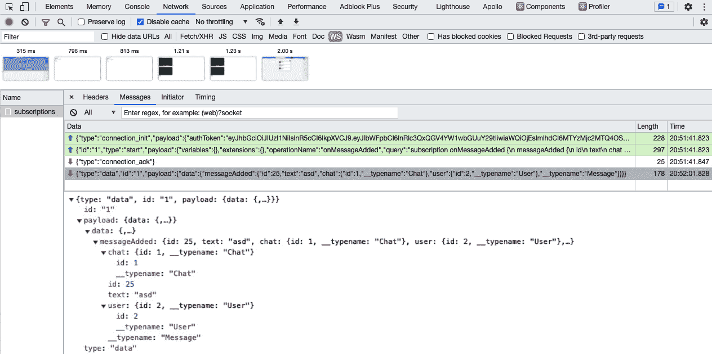

# 第十章：*第十章*: 实时订阅

使用 GraphQL `pollInterval`属性到 Apollo Hooks 以保持显示更新。更好的解决方案是通过 WebSockets 实现 Apollo 订阅。这允许我们实时刷新用户的**用户界面**（**UI**），而不需要手动用户交互或轮询。

本章涵盖以下主题：

+   使用 GraphQL 和 WebSockets

+   实现 Apollo 订阅

+   带订阅的 JWT 身份验证

+   使用 Apollo 订阅进行通知

# 技术要求

本章的源代码可在以下 GitHub 仓库中找到：

[`github.com/PacktPublishing/Full-Stack-Web-Development-with-GraphQL-and-React-Second-Edition/tree/main/Chapter10`](https://github.com/PacktPublishing/Full-Stack-Web-Development-with-GraphQL-and-React-Second-Edition/tree/main/Chapter10)

# 使用 GraphQL 和 WebSockets

在*第一章*《准备你的开发环境》中，我解释了使 GraphQL 如此有用的所有主要功能。我们提到，**超文本传输协议**（**HTTP**）是使用 GraphQL 时的标准网络协议。然而，常规 HTTP 连接的问题在于它们是一次性请求。它们只能响应请求时存在的数据。如果数据库收到有关帖子或聊天的更改，用户将不知道这一点，直到他们执行另一个请求。在这种情况下，UI 会显示过时的数据。

为了解决这个问题，你可以在特定的时间间隔内重新获取所有请求，但这不是一个好的解决方案，因为没有时间范围可以使轮询变得高效。每个用户都会发出不必要的 HTTP 请求，这既不是你所希望的，也不是用户所希望的。

最佳解决方案依赖于 WebSockets 而不是 HTTP 请求。与 HTTP 一样，WebSockets 也是基于**传输控制协议**（**TCP**）。WebSockets 的一个主要特性是它们允许客户端和服务器之间的双向通信。可以说，你可以认为 HTTP 也做到了这一点，因为你可以发送一个请求并得到一个响应，但 WebSockets 的工作方式非常不同。一个要求是，Web 服务器通常支持 WebSockets。如果是这样，客户端可以打开到服务器的 WebSocket 连接。建立 WebSocket 连接的初始请求是一个标准的 HTTP 请求。然后服务器应该以 101 状态码响应。这告诉浏览器它同意将协议从 HTTP 更改为 WebSockets。如果连接成功，服务器可以通过这个连接向客户端发送更新。这些更新也被称为消息或帧。与 HTTP 不同，客户端不需要进一步请求来让服务器与浏览器通信，在 HTTP 中，你总是需要先发送一个请求，以便服务器可以响应它。

使用 WebSocket 或 Apollo 订阅将解决我们在使用轮询时遇到的问题。我们有一个始终保持开启的连接。服务器可以在数据添加或更新时向客户端发送消息。使用 WebSocket `ws` 或 `wss` 而不是普通的 `http` 或 `https`。使用 WebSocket，你还可以为用户节省宝贵的带宽，但这些带宽不包括在 WebSocket 消息中。

一个缺点是，WebSocket 并不是实现 API 的标准方法。如果你在某个时刻将你的 API 公开给第三方，一个标准的 HTTP API 可能更适合。此外，HTTP 的优化程度更高。HTTP 请求可以很容易地通过常见的网络服务器，如 nginx 或 Apache，以及浏览器本身进行缓存和代理，但 WebSocket 则难以做到。对性能影响最大的是，WebSocket 连接会一直保持开启状态，直到用户离开你的网站。对于一两个用户来说这不是问题，但扩展到更多人可能会给你带来一些问题。然而，与轮询相比，它仍然是实时网络通信的一个非常有效的解决方案。

大多数 GraphQL 客户端库都是针对标准 HTTP 协议进行专业化和优化的。这是最常见的方法，所以这是可以理解的。Apollo 背后的团队已经为你考虑到了；他们内置了对 WebSocket 和 GraphQL 订阅实现的支持。你可以使用这些包不仅限于 Apollo，还可以用于许多其他库。让我们开始实现 Apollo 订阅。

# 深入了解 Apollo 订阅

在 Apollo 客户端早期版本中，你需要安装额外的包来支持 WebSocket。现在，唯一的要求是安装一个额外的包，该包在服务器端实现 WebSocket 支持。

注意

你可以在官方文档中找到关于 Apollo 订阅的出色概述和更多详细信息，请访问[`www.apollographql.com/docs/react/data/subscriptions/`](https://www.apollographql.com/docs/react/data/subscriptions/).

第一步是安装所有必要的包以使 GraphQL 订阅工作。使用以下命令通过 `npm` 安装它们：

```js
npm install --save subscriptions-transport-ws graphql-subscriptions 
```

以下两个包提供了订阅系统所需的模块：

+   `graphql-subscriptions` 包提供了将我们的 GraphQL 后端与发布-订阅（**PubSub**）系统连接的能力。它允许客户端订阅特定的频道，并让后端将新数据发布给客户端。这是一个内存实现，仅适用于我们后端的一个实例。它不推荐在生产环境中使用，但可以帮助我们在本地环境中使其工作。

+   `subscriptions-transport-ws` 包为我们的 Apollo 服务器或其他 GraphQL 库提供了接受 WebSocket 连接并接受通过 WebSocket 的查询、突变和订阅的选项。让我们看看我们如何实现订阅。

首先，我们将在 GraphQL 模式中 `RootQuery` 和 `RootMutation` 类型旁边创建一个新的订阅类型。您可以设置客户端可以订阅的事件或实体，并在新的订阅类型中接收更新。它只能通过添加匹配的解析函数来实现。对于这个新的订阅类型，您不返回真实数据，而是返回一个特殊对象，允许客户端订阅特定实体的事件。这些实体可以是通知、新的聊天消息或帖子的评论。每个都有其自己的订阅频道。

客户端可以订阅这些频道。每当后端发送新的 WebSocket 消息时——例如，数据已更新时——它都会收到更新。后端调用一个 `publish` 方法，通过订阅将新数据发送给所有客户端。您应该意识到并非每个用户都应该接收所有 WebSocket 消息，因为内容可能包括如聊天消息之类的私人数据。在更新发送到目标特定用户之前应该有一个过滤器。我们将在 *使用 Apollo 订阅进行身份验证* 部分中看到这个功能。

## Apollo 服务器上的订阅

我们现在已经安装了所有必要的包。让我们从后端实现开始，如下所示：

1.  如前所述，我们将依赖 WebSocket，因为它们允许前端和后端之间的实时通信。我们首先将为后端设置一个新的传输协议。

    打开服务器的 `index.js` 文件。在文件顶部导入一个新的 Node.js 接口，如下所示：

    ```js
    import { createServer } from 'http';
    ```

    `http` 接口是 Node.js 默认包含的。它处理传统的 HTTP 协议，使开发者能够轻松使用许多 HTTP 功能。

1.  我们将使用该接口创建一个标准化的 Node.js HTTP `server` 对象，因为 Apollo `SubscriptionServer` 模块期望这样的对象。我们将在本节中很快介绍 Apollo `SubscriptionServer` 模块。在 Express.js 初始化之后，在 `app` 变量内添加以下代码行：

    ```js
    const server = createServer(app);
    ```

    `createServer` 函数创建了一个新的 HTTP `server` 对象，基于原始的 `Express.js` 实例。我们传递 Express 实例，我们将其保存在 `app` 变量中。正如您在前面的代码片段中所见，您只需将 `app` 对象作为参数传递给 `createServer` 函数。

1.  我们将使用新的`server`对象而不是`app`变量，以便我们的后端开始监听传入的请求。从文件的底部移除旧的`app.listen`函数调用，因为我们将在下一秒替换它。为了使服务器再次开始监听，编辑服务的初始化例程。`for`循环现在应该看起来像这样：

    ```js
    for (let i = 0; i < serviceNames.length; i += 1) {
      const name = serviceNames[i];
      switch (name) {
        case 'graphql':
          (async () => {
            await services[name].start();
            app.use(graphqlUploadExpress());
            services[name].applyMiddleware({ app });
          })();
          break;
        case 'subscriptions':
          server.listen(8000, () => {
            console.log('Listening on port 8000!');
            servicesname;
          });
        break;
        default:
          app.use('/${name}', services[name]);
          break;
      }
    }
    ```

    在这里，我们将旧的`if`语句更改为`switch`语句。此外，我们添加了一个名为`subscriptions`的第二个服务，除了`graphql`之外。我们将在`graphql`服务文件夹旁边创建一个新的`subscriptions`服务。

    `subscriptions`服务需要一个`server`对象作为参数来开始监听 WebSocket 连接。在初始化`SubscriptionServer`之前，我们需要开始监听传入的请求。这就是为什么我们在初始化创建 Apollo `SubscriptionServer`实例的新`subscriptions`服务之前，在先前的代码片段中使用`server.listen`方法。在服务开始监听后，我们将`server`对象传递给服务。当然，服务必须接受这个参数，所以请记住这一点。

1.  要将新服务添加到先前的`serviceNames`对象中，使用以下内容编辑`index.js`服务文件：

    ```js
    import graphql from './graphql';
    import subscriptions from './subscriptions';
    export default utils => ({
      graphql: graphql(utils),
      subscriptions: subscriptions(utils),
    });
    ```

    `subscriptions`服务也接收`utils`对象，就像`graphql`服务一样。

1.  现在，在`graphql`文件夹旁边创建一个`subscriptions`文件夹。为了完成前面`subscriptions`服务的导入，将服务的`index.js`文件插入到这个文件夹中。在那里，我们可以实现`subscriptions`服务。作为提醒，我们传递了之前的`utils`对象和`server`对象。`subscriptions`服务必须在单独的函数调用中接受两个参数。

1.  如果你创建了一个新的订阅`index.js`文件，请在文件顶部导入所有依赖项，如下所示：

    ```js
    import { makeExecutableSchema } from '@graphql-tools/schema';
    import { SubscriptionServer } from 'subscriptions-transport-ws';
    import { execute, subscribe } from 'graphql';
    import jwt from 'jsonwebtoken';
    import Resolvers from '../graphql/resolvers';
    import Schema from'../graphql/schema';
    import auth from '../graphql/auth';
    ```

    前面的依赖项几乎与我们在`graphql`服务中使用的相同，但我们添加了`subscriptions-transport-ws`和`@graphql-tools/schema`包。此外，我们移除了`apollo-server-express`包。`SubscriptionServer`是`ApolloServer`的等价物，但用于 WebSocket 连接而不是 HTTP。通常，在同一个文件中为 HTTP 设置 Apollo Server 和为 WebSocket 设置`SubscriptionServer`是有意义的，因为这可以避免我们两次处理`Schema`和`Resolvers`。不过，没有`ApolloServer`代码在同一文件中解释订阅的实现会更容易。先前的代码片段中新出现的最后两件事是从`graphql`包中导入的`execute`和`subscribe`函数。你将在下一节中看到为什么我们需要这些。

1.  我们通过使用 `export default` 语句导出一个函数并创建一个 `executableSchema` 对象（如您在 *第二章*，*使用 Express.js 设置 GraphQL*）开始实现新的服务，如下所示：

    ```js
    export default (utils) => (server) => {
      const executableSchema = makeExecutableSchema({
        typeDefs: Schema,
        resolvers: Resolvers.call(utils),
        schemaDirectives: {
          auth: auth
        },
      });
    }
    ```

    如您所见，我们使用 `utils` 对象，第二个接受我们使用 `createServer` 函数在服务器 `index.js` 文件中创建的 `server` 对象。这种方法解决了在单独的函数调用中传递两个参数的问题。只有在两个函数都调用时，才会创建模式。

1.  第二步是启动 `SubscriptionServer` 以接受 WebSocket 连接，从而能够使用 GraphQL 订阅。在 `executableSchema` 下插入以下代码：

    ```js
    new SubscriptionServer({
      execute,
      subscribe,
      schema: executableSchema,
    }, 
    {
      server,
      path: '/subscriptions',
    }); 
    ```

    在前面的代码中，我们初始化了一个新的 `SubscriptionServer` 实例。我们传递的第一个参数是一个通用的 `options` 对象，用于 GraphQL，并对应于 `ApolloServer` 类的选项。选项的详细说明如下：

    a. `execute` 属性应该接收一个处理和执行传入 GraphQL 请求的所有处理的函数。标准是传递我们从 `graphql` 包中导入的 `execute` 函数。

    b. `subscribe` 属性也接受一个函数。这个函数必须负责将订阅解析为 `asyncIterator`，这不过是一个异步的 `for` 循环。它允许客户端监听执行结果并将其反映给用户。

    c. 我们传递的最后一个选项是 GraphQL 模式。我们以与 `ApolloServer` 相同的方式执行此操作。

    我们的新实例接受的第二个参数是 `socketOptions` 对象。这个对象包含描述 WebSocket 工作方式的设置，如下所述：

    d. `server` 字段接收我们的 `server` 对象，这是我们通过 `index.js` 文件中的 `createServer` 函数从服务器传递的。`SubscriptionServer` 然后依赖于现有的服务器。

    e. `path` 字段表示订阅可访问的端点。所有订阅都使用 `/subscriptions` 路径。

    注意

    `subscriptions-transport-ws` 包的官方文档提供了对 `SubscriptionServer` 的更高级解释。查看以了解其所有功能的概述：[`github.com/apollographql/subscriptions-transport-ws#subscriptionserver`](https://github.com/apollographql/subscriptions-transport-ws#subscriptionserver)。

    到目前为止，客户端可以连接到 WebSocket 端点。目前还没有订阅，并且相应的解析器已在我们的 GraphQL API 中设置。

1.  打开 `schema.js` 文件来定义我们的第一个订阅。在 `RootQuery` 和 `RootMutation` 类型旁边添加一个名为 `RootSubscription` 的新类型，包括名为 `messageAdded` 的新订阅，如下所示：

    ```js
    type RootSubscription {
      messageAdded: Message
    }
    ```

    目前，如果用户向另一个用户发送一条新消息，这条消息并不会立即显示给接收者。

    我向您展示的第一个选项是设置一个间隔来请求新的消息。我们的后端现在能够通过订阅来覆盖这种场景。客户端可以订阅的事件或通道被称为`messageAdded`。我们还可以添加更多参数，例如聊天**标识符**（**ID**），以便在必要时过滤 WebSocket 消息。当创建新的聊天消息时，它将通过这个通道进行公开。

1.  我们已经添加了`RootSubscription`，但我们也需要扩展模式根标签。否则，新的`RootSubscription`类型将不会被使用。按照以下方式更改模式：

    ```js
    schema {
      query: RootQuery
      mutation: RootMutation
      subscription: RootSubscription
    }
    ```

我们已经成功配置了树形 GraphQL 主类型。接下来，我们必须实现相应的解析函数。打开`resolvers.js`文件并执行以下步骤：

1.  导入所有允许我们使用`PubSub`系统设置 GraphQL API 的依赖项，如下所示：

    ```js
    import { PubSub, withFilter } from 'graphql-subscriptions';
    const pubsub = new PubSub();
    ```

    `graphql-subscriptions`包提供的`PubSub`系统是基于标准 Node.js `EventEmitter`类的一个简单实现。当进入生产环境时，建议使用外部存储，如 Redis，与这个包一起使用。

1.  我们已经将第三个`RootSubscription`类型添加到模式中，但还没有在`resolvers`对象上添加匹配的属性。以下代码片段包括`messageAdded`订阅。将其添加到解析器中：

    ```js
    RootSubscription: {
      messageAdded: {
        subscribe: () =>
          pubsub.asyncIterator(['messageAdded']),
      }
    },
    ```

    `messageAdded`属性不是一个函数，而只是一个简单的对象。它包含一个`subscribe`函数，该函数返回`AsyncIterable`。它允许我们的应用程序通过返回一个仅在添加新消息时解决的承诺来订阅`messageAdded`通道。返回的下一个项目也是一个承诺，它也仅在添加了消息时解决。这种方法使`asyncIterator`非常适合实现订阅。

    注意

    您可以通过阅读[`github.com/tc39/proposal-async-iteration`](https://github.com/tc39/proposal-async-iteration)上的提案来了解更多关于`asyncIterator`如何工作的信息。

1.  当订阅`messageAdded`订阅时，需要另一个方法将新创建的消息公开给所有客户端。最佳位置是创建新消息的`addMessage`突变处。用以下代码替换`addMessage`解析器函数：

    ```js
    addMessage(root, { message }, context) {
      logger.log({
          level: 'info',
          message: 'Message was created',
      });
      return Message.create({
          ...message,
      }).then((newMessage) => {
          return Promise.all([
              newMessage.setUser(context.user.id),
              newMessage.setChat(message.chatId),
          ]).then(() => {
              pubsub.publish('messageAdded', {
                messageAdded: newMessage });
              return newMessage;
          });
       });
    },
    ```

    我已经编辑了`addMessage`突变，以便从上下文中选择正确用户。现在，您发送的所有新消息现在都保存了正确的用户 ID。这允许我们在*使用 Apollo 订阅的认证*部分稍后过滤正确的用户 WebSocket 消息。

    我们使用 `pubsub.publish` 函数向所有已连接并已订阅 `messageAdded` 通道的客户发送一个新的 WebSocket 帧。`pubsub.publish` 函数的第一个参数是订阅，在这种情况下是 `messageAdded`。第二个参数是我们保存到数据库的新消息。现在通过 `asyncIterator` 订阅了 `messageAdded` 订阅的所有客户端都接收到了这条消息。

我们已经完成了后端的准备工作。需要最多工作的是让 Express.js 和 WebSocket 传输协同工作。GraphQL 实现仅涉及新的模式实体，正确实现订阅的解析函数，然后通过 `PubSub` 系统将数据发布到客户端。

我们必须在前端实现订阅功能以连接到我们的 WebSocket 端点。

## Apollo 客户端的订阅

与后端代码一样，在使用订阅之前，我们还需要调整 Apollo 客户端配置。在 *第四章* *将 Apollo 集成到 React 中*，我们使用正常的 `HttpLink` 链路设置了 Apollo 客户端。后来，我们将其替换为 `createUploadLink` 函数，这使用户能够通过 GraphQL 上传文件。

我们将通过使用 `WebSocketLink` 来扩展 Apollo 客户端。这允许我们通过 GraphQL 使用订阅。这两个链接可以并行工作。我们使用标准的 HTTP 协议查询数据，例如聊天列表或新闻源；所有这些实时更新以保持 UI 的更新都依赖于 WebSocket。

要正确配置 Apollo 客户端，请按照以下步骤操作：

1.  打开 `apollo` 文件夹中的 `index.js` 文件。导入以下依赖项：

    ```js
    import { ApolloClient, InMemoryCache, from, split } from '@apollo/client';
    import { WebSocketLink } from '@apollo/client/link/ws';
    import { onError } from "@apollo/client/link/error";
    import { getMainDefinition } from '@apollo/client/utilities';
    import { createUploadLink } from 'apollo-upload-client';
    import { SubscriptionClient } from 'subscriptions-transport-ws';
    ```

    要使订阅工作，我们需要 `SubscriptionClient`，它使用 `WebSocketLink` 通过 WebSocket 订阅我们的 GraphQL API。

    我们从 `@apollo/client/utilities` 包中导入 `getMainDefinition` 函数。当使用 Apollo 客户端时，它默认安装。此函数的目的是为您提供操作类型，可以是 `query`、`mutation` 或 `subscription`。

    来自 `@apollo/client` 包的 `split` 函数允许我们根据操作类型或其他信息有条件地控制通过不同的 Apollo 链路请求的流程。它接受一个条件和一条链路（或一对链路），从中它组合出一个单个有效的链路，Apollo 客户端可以使用。

1.  我们将为 `split` 函数创建两个链路。检测我们发送所有 GraphQL 订阅和请求的协议和端口。在导入下面添加以下代码：

    ```js
    const protocol = (location.protocol != 'https:') ? 'ws://': 'wss://';
    const port = location.port ? ':'+location.port: '';
    ```

    `protocol`变量通过检测客户端是否使用`http`或`https`来保存 WebSocket 协议。`port`变量要么是空字符串（如果我们使用端口`80`来提供我们的前端），要么是任何其他端口，例如我们目前使用的`8000`。以前，我们必须在这个文件中静态保存`http://localhost:8000`。有了新的变量，我们可以动态构建所有请求应该发送的 URL。

1.  `split`函数期望两个链接来合并它们成为一个。第一个链接是正常的`httpLink`链接，我们必须在将结果链接传递给 Apollo Client 的初始化之前设置它。从`ApolloLink.from`函数中移除`createUploadLink`函数调用，并在`ApolloClient`类之前添加它，如下所示：

    ```js
    const httpLink = createUploadLink({
      uri: location.protocol + '//' + location.hostname +
        port + '/graphql',credentials: 'same-origin',
    });
    ```

    我们将服务器的`protocol`变量（无论是`http:`还是`https:`）与两个斜杠连接起来。`hostname`变量，例如，是您应用程序的域名，或者在开发中是`localhost`。连接的结果是[`localhost:8000/graphql`](http://localhost:8000/graphql)。

1.  在`httpLink`旁边添加用于订阅的 WebSocket 链接。它是传递给`split`函数的第二个链接。代码在下面的代码片段中展示：

    ```js
    const SUBSCRIPTIONS_ENDPOINT = protocol +
      location.hostname + port + '/subscriptions';
    const subClient = 
      new SubscriptionClient(SUBSCRIPTIONS_ENDPOINT, {
      reconnect: true,
      connectionParams: () => {
        var token = localStorage.getItem('jwt');
        if(token) {
          return { authToken: token };
        }
        return { };
      }
    });
    const wsLink = new WebSocketLink(subClient);
    ```

    我们定义了`SUBSCRIPTIONS_ENDPOINT`变量。它是通过`protocol`和`port`变量构建的，这些变量我们之前已经检测到了，以及应用程序的`hostname`变量。URI 以与 GraphQL API 相同端口的后端指定的端点结束。URI 是`SubscriptionsClient`的第一个参数。第二个参数允许我们传递选项，例如`reconnect`属性。它告诉客户端在失去连接时自动重新连接到后端的 WebSocket 端点。这通常发生在客户端暂时失去了互联网连接或服务器已经宕机的情况下。

    此外，我们使用`connectionParams`字段在用户登录时指定`localStorage`。它在 WebSocket 创建时发送。

    我们将`SubscriptionClient`初始化为`subClient`变量。我们将其传递给`WebSocketLink`构造函数下的`wsLink`变量，并使用给定的设置。

1.  将两个链接合并为一个。这允许我们将组合的结果插入到我们`ApolloClient`类的底部。为此，我们导入了`split`函数。合并两个链接的语法应该如下所示：

    ```js
    const link = split(
      ({ query }) => {
        const { kind, operation } =
          getMainDefinition(query);
        return kind === 'OperationDefinition' && 
          operation === 'subscription';
      },
      wsLink,
      httpLink,
    );
    ```

    `split` 函数接受三个参数。第一个参数必须是一个返回布尔值的函数。如果返回值为 `true`，则请求通过第一个链接发送，即第二个必需参数。如果返回值为 `false`，则操作通过第二个链接发送，我们通过可选的第三个参数传递。在我们的情况下，作为第一个参数传递的函数决定了操作类型。如果操作是订阅，则函数返回 `true` 并通过 WebSocket 链接发送操作。所有其他请求都通过 HTTP Apollo 链接发送。我们将 `split` 函数的结果保存在 `link` 变量中。

1.  将前面的 `link` 变量直接插入到 `onError` 链接之前。`createUploadLink` 函数不应位于 `Apollo.from` 函数内部。

我们现在已经设置了基本的 Apollo 客户端，以支持通过 WebSocket 进行订阅。

在 *第五章* *可重用 React 组件和 React Hooks* 中，我给了你一些作业，将完整的聊天功能拆分成多个子组件。这样，聊天功能就会遵循我们用于帖子源的模式。我们将它拆分成多个组件，以便代码库更干净。我们将使用这个，并查看如何实现聊天的订阅。

如果您没有在多个子组件中实现聊天功能，您可以从官方 GitHub 仓库获取可工作的代码。如果以下示例不明确，我建议您使用仓库中的代码。

以聊天为例是有意义的，因为它们本质上就是实时的：它们需要应用程序处理新消息并将它们显示给接收者。我们将在以下步骤中处理这一点。

我们从聊天功能的主体文件开始，即客户端文件夹中的 `Chats.js` 文件。我已经重构了 `return` 语句，使得最初直接来自此文件的全部标记现在完全由其他子组件渲染。您可以在以下代码片段中看到所有更改：

```js
return (
  <div className="wrapper">
    <div className="chats">
      {chats.map((chat, i) =>
        <ChatItem chat={chat} user={user}
          openChat={openChat} />
      )}
    </div>
    <div className="openChats">
      {openChats.map((chatId, i) => <Chat chatId={chatId}
        key={"chatWindow" + chatId} closeChat={closeChat} 
       /> )}
    </div>
  </div>
)
```

所有更改都列在这里：

+   我们引入了一个新的 `ChatItem` 组件，它处理 `for` 循环的逻辑。将逻辑提取到单独的文件中使其更易于阅读。

+   `ChatItem` 组件期望 `user`、`chat` 和 `openChat` 属性。此外，我们还编辑了该组件使用的函数，以便也能利用 `user` 对象。

+   我们从 `Chats` 组件的属性中提取 `user` 属性。因此，我们必须将 `Chats` 组件包裹在 `UserConsumer` 组件中，以便它能够传递用户信息。您可以通过在 `Chats.js` 文件中包裹导出的组件来应用此更改。

+   `openChat`和`closeChat`函数由`ChatItem`或`Chats`组件执行。`Chats`组件的所有其他函数都已移动到以下一个或两个组件：`ChatItem`和`Chat`。

我在这里所做的更改与订阅没有直接关系，但代码可读性更高时，理解我想解释的内容会更容易。如果您需要自己实现这些更改的帮助，我建议您查看官方 GitHub 仓库。所有以下示例都是基于这些更改的，但即使没有完整的源代码，也应该能够理解。

然而，更重要的是`useGetChatsQuery`，它有一个特殊功能。我们想要订阅`messageAdded`订阅以监听新消息。这可以通过使用 Apollo `useQuery` Hook 的新函数来实现。

我们需要从`useGetChatsQuery` Hook 中提取一个`subscribeToMore`函数。

`subscribeToMore`函数默认与 Apollo `useQuery` Hook 的每个结果一起提供。它允许您在创建消息时运行一个`update`函数。它的工作方式与`fetchMore`函数相同。我们可以在`Chats`组件中使用此函数来监听新消息。

让我们看看如何使用此函数在前端实现订阅，如下所示：

1.  在`apollo`文件夹内创建一个新的`subscriptions`文件夹。

1.  在此`subscriptions`文件夹内创建一个新的`messageAdded.js`文件。我们需要解析 GraphQL 订阅字符串。新的`messageAdded`订阅必须如下所示：

    ```js
    export const MESSAGES_SUBSCRIPTION = gql'
      subscription onMessageAdded {
        messageAdded {
          id
          text
          chat {
            id
          }
          user {
            id
            __typename 
          }
          __typename 
        }
      }
    ';
    ```

    订阅看起来与我们所使用的所有其他查询或突变完全相同。唯一的区别是我们请求了`__typename`字段，因为在使用订阅时，我们的 GraphQL API 的响应中不包括此字段。从我的观点来看，这似乎是当前版本`SubscriptionServer`中的一个错误。您应该在阅读此书时检查是否还需要这样做。

    我们指定了请求的操作类型，即`subscription`，正如您在前面的代码片段中看到的那样。否则，它将尝试执行默认的查询操作，这会导致错误，因为没有`messageAdded`查询，只有一个订阅。当新消息添加时，客户端收到的订阅事件包含所有字段，如前述代码片段所示。

1.  在`addMessage`突变文件中，我们需要重写代码的一部分。我们将传递给`writeFragment`的片段提取为一个可导出的变量本身，这样我们就可以重用它。代码应该如下所示：

    ```js
    export const NEW_MESSAGE = gql'
      fragment NewMessage on Chat {
          id
          type
      }
    ';
    ```

1.  在`Chats.js`文件中导入新的 GraphQL 查询以及其他一些依赖项，如下所示：

    ```js
    import { MESSAGES_SUBSCRIPTION } from './apollo/queries/messageAdded';
    import { NEW_MESSAGE } from './apollo/mutations/addMessage';
    import { GET_CHAT } from './apollo/queries/getChat';
    ```

1.  应从`useGetChatsQuery` Hook 中提取以下属性：

    ```js
    const { loading, error, data, subscribeToMore } = useGetChatsQuery();
    ```

1.  按如下方式导入`withApollo` HOC 和`UserConsumer`：

    ```js
    import { withApollo } from '@apollo/client/react/hoc';
    import { UserConsumer } from './components/context/user';
    ```

1.  我们将使用直接的 Apollo 客户端交互。这就是为什么我们需要导出`Chats`组件，以便在`withApollo`高阶组件中包装，并将客户端传递给一个属性。为了正确导出组件，请使用`withApollo`高阶组件。代码如下所示：

    ```js
    const ChatContainer = (props) => <UserConsumer><Chats {...props} /></UserConsumer>
    export default withApollo(ChatContainer)
    ```

    我们将`Chats`组件包裹在`UserConsumer`组件中，以便访问客户端。此外，我们将其包裹在`withApollo`高阶组件中，以便访问客户端。

1.  这里是关键部分。当组件挂载时，我们需要订阅`messageAdded`通道。只有在这种情况下，`messageAdded`订阅才会用来接收新数据，或者更确切地说，接收新的聊天消息。为了开始订阅 GraphQL 订阅，我们必须添加一个新的`useEffect`钩子，如下所示：

    ```js
    useEffect(() => {
      subscribeToNewMessages()
    }, []);
    ```

在前面的代码片段中，我们在 React 组件的`useEffect`钩子中执行了一个新的`subscribeToNewMessages`方法。

`useEffect`方法仅在客户端代码上执行，因为 SSR 实现不会抛出此事件。

我们还必须添加相应的`subscribeToNewMessages`方法。我们将在稍后解释这个函数的每一个细节。将以下代码插入到`Chats`组件中：

```js
const subscribeToNewMessages = () => {
  subscribeToMore({
    document: MESSAGES_SUBSCRIPTION,
    updateQuery: (prev, { subscriptionData }) => {
      if (!subscriptionData.data || (prev.chats &&
          !prev.chats.length)) return prev;
      var index = -1;
      for(var i = 0; i < prev.chats.length; i++) {
        if(prev.chats[i].id == 
          subscriptionData.data.messageAdded.chat.id) {
          index = i;
          break;
        }
      }
      if (index === -1) return prev;
      const newValue = Object.assign({},prev.chats[i], {
        lastMessage: {
          text: subscriptionData.data.messageAdded.text,
          __typename: 
            subscriptionData.data.messageAdded.__typename
        }
      });
      var newList = {chats:[...prev.chats]};
      newList.chats[i] = newValue;
      return newList;
    }
  });
}
```

前面的`subscribeToNewMessages`方法看起来非常复杂，但一旦我们理解了它的目的，它就非常直接。我们主要依赖于从`useGetChatsQuery`获取的`subscribeToMore`函数。这个函数的目的是开始订阅我们的`messageAdded`通道，并接受订阅的新数据，将其与当前状态和缓存合并，以便直接反映给用户。

`document`参数接受解析后的 GraphQL 订阅。

第二个参数称为`updateQuery`。它允许我们插入一个函数，该函数实现了更新 Apollo 客户端缓存的逻辑。这个函数需要接受一个新参数，即`subscribeToMore`函数传递的先前数据。在我们的例子中，这个对象包含客户端缓存中已经存在的聊天数组。

第二个参数在`subscriptionData`索引中保存新的消息。`subscriptionData`对象有一个`data`属性，该属性下有一个`messageAdded`字段，其中保存了实际创建的消息。

我们将快速浏览`updateQuery`函数的逻辑，以便您了解我们如何将订阅的数据合并到应用程序状态中。

如果`subscriptionData.data`为空或者`prev`对象中没有之前的聊天，则没有需要更新的内容。在这种情况下，我们返回之前的数据，因为客户端缓存中没有的聊天中发送了消息。否则，我们遍历`prev`对象中的所有之前的聊天，通过比较聊天 ID 找到订阅返回了新消息的聊天索引。找到的聊天在`prev.chats`数组中的索引被保存在`index`变量中。如果找不到聊天，我们可以通过检查`index`变量来返回之前的数据。如果我们找到了聊天，我们需要用新消息更新它。为此，我们使用之前的数据组合聊天，并将`lastMessage`设置为新消息的文本。我们通过使用`Object.assign`函数来实现这一点，其中聊天和新消息被合并。我们将结果保存在`newValue`变量中。重要的是我们还要设置返回的`__typename`属性，否则 Apollo Client 会抛出错误。

现在我们有了包含更新后的聊天对象的`newValue`变量，我们将它写入客户端的缓存。为了将更新的聊天写入缓存，我们在`updateQuery`函数的末尾返回所有聊天的数组。因为`prev`变量是只读的，所以我们不能在它里面保存更新的聊天。我们必须创建一个新的数组来写入缓存。我们将`newValue`聊天对象设置在`newList`数组中找到原始聊天的索引位置。最后，我们返回`newList`变量。我们使用`prev`对象中给出的新数组更新缓存。重要的是，新的缓存必须具有与之前相同的字段。`updateQuery`函数返回值的模式必须与初始`chats`查询模式匹配。

现在，你可以通过使用`npm run server`启动应用程序来直接在浏览器中测试订阅。如果你发送一条新的聊天消息，它将直接显示在右侧的聊天面板中。

然而，我们遇到了一个主要问题。如果你用第二个用户测试这个功能，你会注意到`lastMessage`字段对两个用户都进行了更新。这是正确的，但新消息在收件人的聊天窗口中是不可见的。我们已经更新了`chats` GraphQL 请求的客户存储，但我们还没有在打开聊天窗口时执行的单一`chat`查询中添加消息。

我们将通过使用`withApollo`高阶组件（HOC）来解决这个问题。`Chats`组件无法直接访问`chat`查询缓存。`withApollo` HOC 给导出的组件提供了一个`client`属性，这使我们能够直接与 Apollo Client 交互。我们可以使用它来读取和写入整个 Apollo Client 缓存，并且它不仅限于单个 GraphQL 请求。在从`updateQuery`函数返回更新后的`chats`数组之前，我们必须读取`chat`的状态，并在可能的情况下插入新数据。在`updateQuery`函数中的最终`return`语句之前插入以下代码：

```js
if(user.id !== subscriptionData.data.messageAdded.user.id) {
  try {
    const data = client.readQuery({ query: GET_CHAT,
      variables: { chatId: 
        subscriptionData.data.messageAdded.chat.id } });
    client.cache.modify({
      id: client.cache.identify(data.chat),
      fields: {
        messages(existingMessages = []) {
          const newMessageRef = 
            client.cache.writeFragment({
            data: subscriptionData.data.messageAdded,
            fragment: NEW_MESSAGE
          });
          return [...existingMessages, newMessageRef];
        }
      }
    });
  } catch(e) {}
}
```

在前面的代码片段中，我们使用`client.readQuery`方法读取缓存。它接受`GET_CHAT`查询作为参数，以及新发送消息的聊天 ID，以返回单个聊天。`GET_CHAT`查询是我们打开聊天窗口时在`Chat.js`文件中发送的相同请求。我们将在`try`-`catch`块中包装`readQuery`函数，因为它在找不到指定的`query`和`variables`时抛出未处理的错误。这可能发生在用户尚未打开聊天窗口的情况下，因此没有使用`GET_CHAT`查询请求此特定聊天的数据。此外，整个块被包裹在一个`if`条件中，以检查新消息是否来自另一个用户而不是我们自己，因为如果我们自己发送消息，我们不需要将其添加到缓存中，因为我们已经在提交我们这边的新消息时那样做了。

如果消息来自另一个用户，我们使用`client.cache.modify`函数，因为我们已经知道要将新消息添加到特定聊天中缓存的消息数组。

您可以通过查看聊天窗口并从另一个用户账户发送消息来测试这些新更改。对于您来说，新消息应该几乎立即出现，无需刷新浏览器。

在本节中，我们学习了如何通过 Apollo 订阅订阅来自后端发送的事件。目前，我们使用此功能在动态中更新 UI 以显示新数据。稍后，在“使用 Apollo 订阅的通知”部分，我们将看到另一个订阅可能很有用的场景。尽管如此，还有一件事要做：我们尚未通过 JWT（如我们的 GraphQL API）授权用户进行`messageAdded`订阅，而且用户在未验证其身份的情况下仍然收到了新消息。我们将在下一节中改变这一点。

# 使用 Apollo 订阅进行身份验证

在*第六章*，*使用 Apollo 和 React 进行身份验证*中，我们通过浏览器本地存储实现了身份验证。后端生成一个签名 JWT，客户端将其与每个请求一起发送在 HTTP 头中。在*第九章*，*实现服务器端渲染*中，我们扩展了这种逻辑以支持 cookie，允许 SSR。现在我们引入了 WebSockets，我们需要单独处理它们，就像我们处理 SRR 和我们的 GraphQL API 一样。

当用户在 WebSocket 传输协议的后端未进行身份验证时，他们是如何接收新消息的？

了解这一点的最佳方式是查看你的浏览器开发者工具。假设我们有一个浏览器窗口，我们用用户 A 登录。这个用户与另一个用户 B 聊天。他们互相发送消息，并在各自的聊天窗口中直接接收新的更新。另一个用户 C 不应该能够接收任何 WebSocket 更新。我们应该在现实中模拟这个场景。

如果你使用 Chrome 作为默认浏览器，请访问我们后端的`subscriptions`端点。

在开发者工具打开的情况下尝试这个场景。你应该看到所有浏览器的相同 WebSocket 帧。它应该看起来像这样：



图 10.1 – WebSocket 消息

在左侧面板中，你可以看到所有的 WebSocket 连接。在我们的例子中，这只是一个`subscriptions`连接。如果你点击连接，你将找到通过此连接发送的所有帧。前面列表中的第一帧是初始连接帧。第二帧是订阅`messageAdded`通道的请求，这是由客户端发起的。这两个帧都被标记为绿色，因为客户端发送了它们。

最后两个被标记为红色，因为服务器发送了它们。红色标记的第一帧是服务器对建立的连接的确认。最后一个帧是由我们的后端发送的，以向客户端发布一条新消息。虽然这个帧乍一看可能看起来没问题，但它代表了一个重要的问题。最后一个帧被发送给了所有客户端，而不仅仅是那些属于发送消息的特定聊天室的成员。普通用户不太可能注意到这一点，因为我们的`cache.modify`函数只有在聊天被找到在客户端存储中时才会更新 UI。然而，一个经验丰富的用户或开发者能够监视我们社交网络的所有用户，因为这在**网络**标签中是可读的。

我们需要查看我们编写的后端代码，并比较`ApolloServer`和`SubscriptionServer`的初始化。我们为`ApolloServer`有一个`context`函数，它可以从 JWT 中提取用户。然后它可以在解析函数内部使用，以根据当前登录用户过滤结果。对于`SubscriptionServer`，目前还没有这样的`context`函数。我们必须知道当前登录用户，以便为正确的用户过滤订阅消息。我们可以使用标准的 WebSockets 事件，例如`onConnect`或`onOperation`，来实现用户的授权。

`onOperation`函数会在发送每个 WebSocket 帧时执行。最佳做法是在`onConnect`事件中实现授权，就像从`ApolloServer`中获取的`context`函数一样，这样 WebSocket 连接在建立时只认证一次，而不是在发送每个帧时都认证。

在`index.js`中，从服务器的`subscriptions`文件夹中，将以下代码添加到`SubscriptionServer`初始化的第一个参数。它接受一个作为函数的`onConnect`参数，每当客户端尝试连接到`subscriptions`端点时，都会执行这个函数。在`schema`参数之前添加代码：

```js
onConnect: async (params,socket) => {
  const authorization = params.authToken;
  if(typeof authorization !== typeof undefined) {
    var search = "Bearer";
    var regEx = new RegExp(search, "ig");
    const token = authorization.replace(regEx, '').trim();
    return jwt.verify(token, JWT_SECRET, function(err,
      result) {
      if(err) {
        throw new Error('Missing auth token!');
      } else {
        return utils.db.models.User.findByPk(
          result.id).then((user) => 
        {
          return Object.assign({}, socket.upgradeReq, {
            user });
        });
      }
    });
  } else {
    throw new Error('Missing auth token!');
  }
},
```

这段代码与`context`函数非常相似。我们依赖于正常的 JWT 认证，但通过 WebSocket 的连接参数。我们在`onConnect`事件中实现 WebSocket 认证。在`ApolloServer`的原始`context`函数中，我们从请求的 HTTP 头中提取 JWT，但在这里，我们使用作为第一个参数传递的`params`变量。

在客户端最终连接到 WebSocket 端点之前，会触发一个`onConnect`事件，在那里你可以实现针对初始连接的特殊逻辑。在第一次请求中，我们发送 JWT，因为我们已经配置 Apollo Client 在初始化`SubscriptionClient`时读取 JWT 到`connectionParams`对象的`authToken`参数。这就是为什么我们不是直接从`request`对象中访问 JWT，而是在前面的代码片段中从`params.authToken`访问。`socket`参数也由`onConnect`函数提供；在那里，你可以访问`socket`对象中的初始升级请求。从连接参数中提取 JWT 后，我们可以验证它并使用它来认证用户。

在这个`onConnect`函数的末尾，我们返回`upgradeReq`变量和用户，就像我们在 Apollo Server 的正常`context`函数中所做的那样。如果用户未登录，我们不再将`req`对象返回给`context`，而是抛出一个错误。这是因为我们只为需要您登录的实体实现订阅，例如聊天或帖子。这允许客户端尝试重新连接，直到它被认证。但是，请不要忘记，每个开放的连接都会消耗您的性能，而且未登录的用户不需要开放的连接，至少对于**Graphbook**的使用场景来说是这样。

我们现在已经通过前面的代码识别了连接到我们后端的用户，但我们仍然将每个帧发送给所有用户。这是解析函数的问题，因为它们还没有使用上下文。请在`resolvers.js`文件中将`messageAdded`订阅替换为以下代码：

```js
messageAdded: {
  subscribe: withFilter(() =>
    pubsub.asyncIterator('messageAdded'), 
    (payload, variables, context) => {
    if (payload.messageAdded.UserId !== context.user.id) {
      return Chat.findOne({
        where: {
          id: payload.messageAdded.ChatId
        },
        include: [{
          model: User,
          required: true,
          through: { where: { userId: context.user.id } },
        }],
      }).then((chat) => {
        if(chat !== null) {
          return true;
        }
        return false;
      })
    }
    return false;
  }),
}
```

在本章的早期，我们从`graphql-subscriptions`包中导入了`withFilter`函数。这允许我们将`asyncIterator`包装在过滤器中。这个过滤器的目的是有条件地向应该看到新信息的用户通过连接发送发布。如果一个用户不应该接收发布，`withFilter`函数的条件返回值应该是`false`。对于所有应该接收新消息的用户，返回值应该是`true`。

`withFilter`函数接受`asyncIterator`作为其第一个参数。第二个参数是决定用户是否接收订阅更新的函数。我们从函数调用中提取以下属性：

+   `payload`参数，它是通过`addMessage`突变发送的新消息。

+   `variables`字段，它包含所有可以与`messageAdded`订阅一起发送的 GraphQL 参数，而不是与突变一起发送。在我们的场景中，我们不会在订阅中发送任何变量。

+   `context`变量，它包含我们在`onConnect`钩子中实现的所有信息。它包括带有用户作为单独属性的常规`context`对象。

`filter`函数为订阅`messageAdded`通道的每个用户执行。首先，我们通过比较用户 ID 来检查函数执行的用户是否是新消息的作者。在这种情况下，他们不需要收到订阅通知，因为他们已经拥有了数据。

如果情况不是这样，我们将查询数据库以找到新消息被添加的聊天。为了确定用户是否需要接收新消息，我们只选择包含登录用户 ID 和聊天 ID 的聊天。如果在数据库中找到聊天，用户应该看到新消息。否则，他们不允许获取新消息，我们返回`false`。

请记住，`withFilter` 函数为每个连接运行。如果有成千上万的用户，我们可能需要非常频繁地运行数据库查询。最好将这样的过滤器函数保持得尽可能小和高效。例如，我们可以查询一次聊天以获取附加的用户，然后手动遍历所有连接。这个解决方案将节省我们昂贵的数据库操作。

关于使用订阅进行身份验证的所有这些就是您需要了解的。我们现在有一个包含 SSR（服务器端渲染）和带有 JWT 认证的实时订阅的工作设置。SSR 不实现订阅，因为对我们应用程序的初始渲染提供实时更新没有意义。接下来，您将看到另一个 Apollo 订阅可能很有用的场景。

# 使用 Apollo 订阅的通知

在本节中，我将快速引导您了解订阅的第二个用例。向用户显示通知是完美的传统和常见做法，正如您从 Facebook 知道的。我们不是依赖于 `subscribeToMore` 函数，而是使用 Apollo 提供的 `Subscription` 组件。这个组件的工作方式与 `Query` 和 `Mutation` 组件类似，但用于订阅。

按照以下步骤运行您的第一个 `Subscription` 组件：

1.  在客户端的 `apollo` 文件夹内创建一个 `subscriptions` 文件夹。您可以将使用 Apollo 的 `useSubscription` 钩子实现的全部订阅保存在这个文件夹中。

1.  在文件夹中插入一个 `messageAdded.js` 文件，并粘贴以下代码：

    ```js
    import { useSubscription, gql } from '@apollo/client';
    export const MESSAGES_SUBSCRIPTION = gql'
      subscription onMessageAdded {
        messageAdded {
          id
          text
          chat {
            id
          }
          user {
            id
            __typename
          }
          __typename
        }
      }
    ';
    export const useMessageAddedSubscription = (options) => useSubscription(MESSAGES_SUBSCRIPTION, options);
    ```

    `useSubscription` 组件的一般工作流程与 `useMutation` 和 `useQuery` 钩子相同。首先，我们使用 `gql` 函数解析订阅。然后，我们只需返回解析后的 GraphQL 查询的 `useSubscription` 钩子。

1.  因为我们希望在收到新消息时向用户显示通知，所以我们安装了一个负责显示弹出通知的包。使用 `npm` 安装它，如下所示：

    ```js
    npm install --save react-toastify
    ```

1.  要设置 `react-toastify`，将一个 `ToastContainer` 组件添加到应用程序的全局点，所有通知都在这里渲染。这个容器不仅用于新消息的通知，还用于所有通知，所以请明智选择。我决定将 `ToastContainer` 附接到 `Chats.js` 文件上。在顶部导入依赖项，如下所示：

    ```js
    import { ToastContainer, toast } from 'react-toastify';
    ```

1.  在 `return` 语句中，首先应该渲染的是 `ToastContainer`。添加它，如下所示：

    ```js
    <div className="wrapper">
      <ToastContainer/>
    ```

1.  在 `Chats.js` 文件中，添加一个 `import` 语句来加载订阅钩子，如下所示：

    ```js
    import { useMessageAddedSubscription } from './apollo/subscriptions/messageAdded';
    ```

1.  然后，只需在 `Chats` 组件中其他钩子语句之后调用此订阅钩子，如下所示：

    ```js
    useMessageAddedSubscription({
      onSubscriptionData: data => {
        if(data && data.subscriptionData &&
          data.subscriptionData.data &&
          data.subscriptionData.data.messageAdded)
          toast(data.subscriptionData.data.messageAdded.text, 
            { position: toast.POSITION.TOP_LEFT });
      }
    });
    ```

1.  添加一个小的 `react-toastify` 包。在 `App.js` 文件中导入 `CSS` 文件，如下所示：

    ```js
    import 'react-toastify/dist/ReactToastify.css';
    ```

    然后，将这些几行代码添加到自定义的 `style.css` 文件中：

    ```js
    .Toastify__toast-container--top-left {
      top: 4em !important;
    }
    ```

您可以在下面的屏幕截图中看到一个通知的示例：


图 10.2 – 通知

整个订阅主题相当复杂，但我们成功地为两个用例实现了它，从而为用户提供了对我们应用程序的重大改进。

# 摘要

本章旨在为用户提供一个实时用户界面，使他们能够舒适地与其他用户聊天。我们还探讨了如何使这个界面具有可扩展性。你学习了如何为所有实体设置与任何 Apollo 或 GraphQL 后端的订阅。我们还实现了针对 WebSocket 的特定认证，以过滤发布内容，确保它们只被正确用户接收。

在下一章中，你将学习如何通过为你的代码实现自动化测试来验证和测试应用程序的正确功能。
